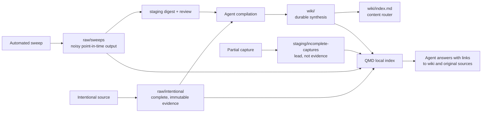

# Seth Second Brain

A retrieval-first personal knowledge base built from plain files, Git, local search, and coding agents.

This repository preserves complete source material in an immutable evidence layer, compiles reusable knowledge into a maintained wiki, keeps low-confidence material in staging, and makes the whole corpus searchable with QMD. It is designed to move between computers by cloning the repository and rebuilding only the local search index.

> [!IMPORTANT]
> This vault contains personal material, source captures, datasets, and research exports. Keep the GitHub repository private, never commit browser cookies or API keys, and confirm that storing the vault on a work-managed computer complies with your employer's policies.

## The System in One Minute



The durable rules are simple:

1. `raw/` is evidence. Existing captures are never rewritten.
2. `wiki/` is compiled memory. Agents may improve, merge, rename, or retire pages.
3. `staging/` is the review boundary for incomplete or noisy inputs.
4. `state/source-map.json` records where each source sits in that lifecycle.
5. `wiki/index.md` routes knowledge; `wiki/log.md` records every material wiki operation.
6. QMD is a local index, not a source of truth. It is rebuilt independently on every computer.

## Fresh Computer Setup

### 1. Dependency inventory

The repository contains the Second Brain's Markdown, agent instructions, skills,
templates, and all project-specific Bash, Python, and Node.js scripts. It does
not vendor general-purpose runtimes, desktop applications, browser sessions, or
third-party CLIs. Those are installed once on each computer.

| Dependency | Required? | Included in this repository? | What uses it |
|---|---:|---:|---|
| Git | Yes | No | cloning, syncing, and repository-root discovery |
| Bash | Yes | No; macOS includes it | project shell wrappers |
| Python 3.12+ | Yes | No | capture, provenance, maintenance, and tests |
| Node.js 22+ and npm | Yes | No | QMD and the project `.mjs` utilities |
| QMD CLI | Yes | No | local lexical, vector, and hybrid Markdown retrieval |
| Homebrew SQLite | Yes on macOS for QMD | No | SQLite extensions used by QMD |
| Codex or another Agent Skills-compatible host | Recommended | No | reads `AGENTS.md` and the bundled skills |
| Obsidian | Optional | No | human vault browsing and editing |
| Last30Days skill | Optional | No | recent-signal sweeps and authenticated X workflows |
| Chrome + macOS Keychain access | Optional | No | authenticated LinkedIn and X capture |
| `yt-dlp` | Optional | No | YouTube transcripts inside Last30Days |
| `agent-browser` CLI | Specialized only | No | `scripts/yc-company-scan.mjs` official-directory extraction |
| GitHub CLI (`gh`) | Optional | No | convenient GitHub login, PR, and publishing operations; no project script requires it |

The core project scripts use the Python standard library and Node.js built-ins.
There is no project-level `pip install` or `npm install` step and no hidden
virtual environment or `node_modules/` directory to copy between machines.

On a Mac with [Homebrew](https://brew.sh/), a practical base installation is:

```bash
xcode-select --install
brew install python node sqlite
npm install -g @tobilu/qmd
```

Confirm that `node --version` is 22 or newer and `python3 --version` is 3.12 or
newer. QMD may download local models the first time semantic search is built.
The bootstrap script checks the required commands and versions before touching
the local index.

### 2. Clone and bootstrap

```bash
git clone https://github.com/Sethzy/seth-second-brain.git
cd seth-second-brain
scripts/bootstrap-second-brain.sh --embed
```

`--embed` builds semantic/vector search and may download local QMD models on first run. For a faster lexical-only setup, omit it:

```bash
scripts/bootstrap-second-brain.sh
```

The bootstrap script:

1. checks Git, Python 3.12+, Node.js 22+, npm, and QMD;
2. creates a machine-local `.qmd/index.yml` using the current clone path;
3. indexes `wiki/`, intentional captures, sweeps, and staging;
4. optionally builds vector embeddings;
5. runs the structural lint and maintenance unit tests.

### 3. Open the vault

- In Codex, open the repository root. The operating contract is in [`AGENTS.md`](AGENTS.md), and the local skills are under [`.agents/skills/`](.agents/skills/).
- In Obsidian, choose **Open folder as vault** and select the repository root. Start at [`wiki/index.md`](wiki/index.md).
- From a terminal, inspect search health with `qmd status`.

## What Git Syncs vs. What Each Machine Rebuilds

| Travels through Git | Rebuilt or supplied per machine |
|---|---|
| `raw/`, `wiki/`, `staging/` | `.qmd/index.yml` and `.qmd/index.sqlite` |
| `state/source-map.json` | QMD model cache and embeddings |
| `scripts/`, `templates/`, `config/`, `docs/` | Chrome cookies and macOS Keychain access |
| local agent skills and repository instructions | API keys and shell environment variables |
| selected Obsidian settings and attachments | Obsidian workspace/session layout |

The ignored QMD files contain absolute paths and generated embeddings. Committing them would make the repository larger and break when the clone lives somewhere else.

## Working From Two Computers

Git is the synchronization layer. Use one active writer at a time when practical.

Before starting work:

```bash
git pull --rebase
scripts/qmd-refresh.sh
```

After material work:

```bash
scripts/lint-second-brain.sh
python3 -m unittest discover -s tests -v
git status
git add <the intended files>
git commit -m "Describe the knowledge or machinery change"
git push
```

After pulling changes on the other computer, run:

```bash
scripts/qmd-refresh.sh --embed
```

Raw captures are append-only, so normal cross-computer work should create new files rather than conflict. If a wiki page conflicts, merge the synthesis deliberately and keep all valid source links. Never resolve a conflict by discarding a raw capture.

## Repository Anatomy

```text
AGENTS.md                         agent operating contract
.agents/skills/                   versioned local skills

raw/intentional/x/               complete X posts and threads
raw/intentional/web/             articles, sites, LinkedIn captures
raw/intentional/youtube/         videos and transcripts
raw/intentional/papers/          papers and PDFs
raw/intentional/books/           book notes and excerpts
raw/intentional/pasted/          user-supplied source text and imports
raw/sweeps/last30days/           recent-signal research runs
raw/sweeps/x/                    authenticated X timeline snapshots

staging/incomplete-captures/     blocked, partial, preview-only, or failed captures
staging/last30days/               review digests derived from noisy sweeps
staging/maintenance/              generated health and organization proposals

wiki/<domain>/                   active medium-length synthesis articles
wiki/archive/                    point-in-time query answers; no cascade updates
wiki/index.md                    global router and summary table
wiki/log.md                      append-only operational history

state/source-map.json            provenance and lifecycle audit trail
templates/                       schemas for raw, wiki, archive, and staging files
scripts/                         capture, indexing, provenance, and maintenance tools
config/                          watchlists and human-readable configuration examples
docs/                            architecture, workflows, goals, and historical plans
outputs/                         one-off generated artifacts and exports
_attachments/                    supporting media referenced by notes
```

## Trust Lanes and Lifecycle

### Intentional capture

Use `raw/intentional/` only when the full source text was actually captured or Seth pasted it. These are high-trust evidence snapshots.

```text
complete source -> raw/intentional/<type>/ -> wiki compilation -> indexed answer
```

Every capture preserves its original URL, collection time, source type, quality, and verbatim body. A refreshed source creates a new dated snapshot; it does not replace the old one.

### Incomplete capture

A URL card, search snippet, login wall, truncated post, summary, or failed fetch belongs in `staging/incomplete-captures/`.

```text
partial source -> staging/incomplete-captures/<type>/ -> recapture later
```

Incomplete material preserves the lead but cannot support confident wiki claims.

### Sweep

Last30Days and X profile runs are broad discovery lanes:

```text
sweep -> raw/sweeps/ -> staging digest -> review -> optional wiki promotion
```

A sweep is immutable as a point-in-time run, but it is not durable knowledge by default. Promotion requires review and source attribution.

### Wiki lifecycle

Wiki pages can be `draft`, `active`, `stale`, `contradicted`, or `archived`. Agents can reshape the wiki as evidence changes, but archive pages remain point-in-time answers.

## Core Workflows

### Capture pasted or already-extracted text

```bash
scripts/new-raw-capture.sh web "Article title" "https://example.com/article" < article.txt
scripts/new-raw-capture.sh pasted "Conversation notes" "Unknown" < notes.txt
```

For a known partial or failed capture:

```bash
scripts/new-raw-capture.sh --quality partial web "Blocked article" "https://example.com" < note.txt
```

The script chooses the correct trust lane, creates a non-colliding dated file, and records it in `state/source-map.json`. An agent then compiles complete sources into the relevant wiki pages, updates `wiki/index.md`, appends `wiki/log.md`, and refreshes QMD.

### Capture LinkedIn

LinkedIn uses the authenticated browser rather than anonymous HTTP:

1. open the exact URL in the signed-in Chrome session;
2. expand every relevant **see more** control;
3. capture the complete visible body plus author, date, title, engagement, and URL;
4. save verified complete material under `raw/intentional/web/`;
5. stage previews, truncation, or login walls under `staging/incomplete-captures/web/`.

Profile capture stays scoped to the sections requested. Messages, connections, and unrelated personal data are out of scope unless explicitly requested.

### Capture an exact X link

```bash
scripts/x-capture-to-raw.sh "https://x.com/user/status/123"
pbpaste | scripts/x-capture-to-raw.sh
```

This extracts X authentication from a local Chrome profile, calls the Last30Days Bird/TweetDetail implementation, checks whether long-form Article text is complete, writes to the right trust lane, and updates the source map. Cookies stay in memory and are never written to the repository.

The default Chrome profile is `Profile 3`. Override it per command or per shell:

```bash
scripts/x-capture-to-raw.sh --chrome-profile "Default" "https://x.com/user/status/123"
export SECOND_BRAIN_X_CHROME_PROFILE="Default"
```

### Run recent-signal research

```bash
scripts/last30days-to-sweeps.sh "AI coding agents" --search x,web,youtube
scripts/last30days-to-sweeps.sh --x-profile3 "AI coding agents" --search x,web,youtube
scripts/stage-last30days-digest.sh raw/sweeps/last30days/<file>.md
```

The wrapper forces the durable raw output into this repository. The digest is a mutable review surface; neither is automatically promoted to the wiki.

### Run the people watchlist

Edit [`config/people-watchlist.json`](config/people-watchlist.json), then run all or selected entries:

```bash
scripts/run-people-watchlist.sh
scripts/run-people-watchlist.sh matt-pocock nicbstme
```

Each run produces raw sweep output and a staged digest.

### Query the knowledge base

For source recall, search `raw/` first and return the original URL. For synthesis, read `wiki/index.md`, search the wiki, then read supporting raw files.

```bash
# Exact names, phrases, titles, URLs, or identifiers
qmd search '"remembered exact phrase"' -c intentional -n 10

# Conceptual questions: author the retrieval intent and vocabulary explicitly
qmd query $'intent: Find what Seth has saved about durable agent memory, not model training.\nlex: agent memory wiki raw compiled QMD\nvec: persistent knowledge systems maintained by coding agents'

# Retrieve full sources before answering
qmd get '#document-id'
qmd multi-get '#document-id-1,#document-id-2' --format md
```

QMD snippets are leads, not evidence. Agents retrieve the complete documents before making factual claims or quoting sources.

### Archive a reusable answer

Plain queries do not write files. If an answer is worth preserving, create a new page from [`templates/archive-template.md`](templates/archive-template.md), add an `[Archived]` entry to the index, and append a `query | Archived` entry to the log.

## Provenance: `state/source-map.json`

Markdown remains the source of truth. The source map is the audit layer that connects capture and compilation state.

A source record can identify:

- source type and original URL;
- trust lane and capture quality;
- raw or staging path;
- current state such as `raw`, `partial`, `staged`, `compiled`, or `archived`;
- wiki pages affected by the source;
- creation/update timestamps and operational notes.

Update the source map whenever a capture is created, compiled, staged, promoted, archived, superseded, or intentionally left uncompiled.

## Local Search Machinery

The four project-local QMD collections are:

| Collection | Path | Retrieval role |
|---|---|---|
| `wiki` | `wiki/**/*.md` | durable synthesis and archived answers |
| `intentional` | `raw/intentional/**/*.md` | exact source recall and evidence |
| `sweeps` | `raw/sweeps/**/*.md` | noisy recent-signal research |
| `staging` | `staging/**/*.md` | incomplete captures and review queues |

Refresh lexical search after changes:

```bash
scripts/qmd-refresh.sh
```

Refresh lexical and semantic search:

```bash
scripts/qmd-refresh.sh --embed
```

QMD stores its generated configuration and SQLite database under `.qmd/`; both are ignored by Git. `scripts/init-qmd.sh` creates or repairs paths for the current clone.

## Optional Last30Days and X Runtime

The core vault, wiki, Git sync, lint, and QMD retrieval work without Last30Days. The following features require the optional [`mvanhorn/last30days-skill`](https://github.com/mvanhorn/last30days-skill):

- recent-signal sweeps;
- exact authenticated X capture;
- X profile timeline capture;
- X following export.

Install it globally for Codex with the Agent Skills installer:

```bash
npx skills add mvanhorn/last30days-skill -g -a codex
```

Then verify the exact installation that this repository discovers:

```bash
LAST30DAYS_DIR="$(scripts/last30days_runtime.py)"
python3 "$LAST30DAYS_DIR/last30days.py" --preflight
```

Last30Days can use several sources without credentials and has its own setup
wizard for optional sources and API keys. For local YouTube transcripts, install
`yt-dlp` separately with `brew install yt-dlp`.

The scripts automatically look in:

1. `LAST30DAYS_SCRIPTS_DIR`;
2. `.agents/skills/last30days/scripts` in this repository;
3. `~/.agents/skills/last30days/scripts`;
4. `~/.codex/skills/last30days/scripts`;
5. the legacy local GTM and interview-prep locations.

If the skill is elsewhere:

```bash
export LAST30DAYS_SCRIPTS_DIR="/absolute/path/to/last30days/scripts"
```

Authenticated X capture is macOS/Chrome-specific today. The first run may request Keychain access to Chrome Safe Storage. Do not export `AUTH_TOKEN`, `CT0`, or copied browser cookies into files in this repository.

### Specialized browser automation

Only `scripts/yc-company-scan.mjs` directly requires the external
[`agent-browser`](https://github.com/vercel-labs/agent-browser) CLI. It is not
part of normal capture, query, QMD, lint, or maintenance workflows. Install it
only if that scanner is needed:

```bash
npm install -g agent-browser
agent-browser install
```

The `gh` CLI was used to publish this repository, but no committed project
script calls it. Ordinary `git pull` and `git push` work with either HTTPS or
SSH GitHub authentication.

## Command Reference

### Setup and retrieval

| Command | Purpose |
|---|---|
| `scripts/bootstrap-second-brain.sh [--embed]` | initialize a new clone and validate it |
| `scripts/init-qmd.sh` | create/repair local QMD collections and run an update |
| `scripts/qmd-refresh.sh [--embed]` | refresh lexical search and optionally embeddings |

### Capture and import

| Command | Purpose |
|---|---|
| `scripts/new-raw-capture.sh` | route complete or incomplete text captures |
| `scripts/x-capture-to-raw.sh` | capture one or more exact X status URLs |
| `scripts/x-profile-timeline-to-sweeps.sh` | save an authenticated X profile timeline sweep |
| `scripts/capture-missing-x-links.sh` | audit or backfill X URLs already referenced in the corpus |
| `scripts/import-x-kb-captures.sh` | copy legacy X knowledge-base captures without overwriting |
| `scripts/import-linkedin-profile-snapshot.py` | import a prepared authenticated LinkedIn profile snapshot |

### Research and staging

| Command | Purpose |
|---|---|
| `scripts/last30days-to-sweeps.sh` | save a Last30Days run into the sweep lane |
| `scripts/run-people-watchlist.sh` | execute configured recurring person sweeps |
| `scripts/stage-last30days-digest.sh` | scaffold a digest from a Last30Days raw file |
| `scripts/stage-x-profile-digest.py` | create a deterministic digest from an X timeline snapshot |

### Maintenance

| Command | Purpose |
|---|---|
| `scripts/lint-second-brain.sh` | enforce required structure, link health, and trust-lane invariants |
| `scripts/wiki-lint-report.sh` | produce a deeper deterministic/heuristic wiki report |
| `scripts/wiki-health-report.sh` | report raw-only sources, duplicates, stale pages, and next actions |
| `scripts/wiki-organize.sh --propose --limit 100` | propose conservative compilation targets for raw-only sources |
| `scripts/maintenance-report.sh` | compatibility alias for the health report |

Specialized scripts under `scripts/` also support TrustMRR company-atlas generation, YC scans, X following exports, and checkpointed X backfills. These are project-specific utilities rather than required setup steps.

## Agent Machinery

Three layers govern agent behavior:

1. [`AGENTS.md`](AGENTS.md) contains the repository-wide contract and retrieval rules.
2. [`.agents/skills/karpathy-llm-wiki/SKILL.md`](.agents/skills/karpathy-llm-wiki/SKILL.md) defines the upstream raw-plus-wiki pattern.
3. [`.agents/skills/seth-second-brain/SKILL.md`](.agents/skills/seth-second-brain/SKILL.md) adds Seth-specific capture lanes, QMD, provenance, LinkedIn, X, and Last30Days behavior.

The most important prompt is simply to open the repository root and ask naturally:

- “Find that article I saved about …”
- “What do I know about …?”
- “Capture/ingest this source …”
- “Run a wiki health check and show me the highest-value cleanup.”

The agent should search before answering, retrieve full files rather than rely on snippets, preserve original URLs, and cite local wiki/raw paths.

## Validation and Maintenance

Run the fast checks:

```bash
scripts/lint-second-brain.sh
python3 -m unittest discover -s tests -v
```

Run a deeper non-destructive review:

```bash
scripts/wiki-lint-report.sh
scripts/wiki-health-report.sh
scripts/wiki-organize.sh --propose --limit 100
```

The maintenance loop is:

```text
lint -> identify overlap/staleness/contradictions -> propose changes
     -> apply approved wiki edits -> update index/log/source map -> refresh QMD
```

Maintenance may rewrite the wiki. It must never rewrite raw evidence.

## Troubleshooting

### QMD points to the old computer

Run:

```bash
scripts/init-qmd.sh
```

The script detects a moved clone and rebuilds collection paths. If the index itself is unhealthy, remove only the generated `.qmd/index.sqlite` and rerun bootstrap; do not delete knowledge files.

### QMD semantic search is slow or fails

Use BM25 search immediately:

```bash
qmd search "exact terms" -n 10
```

Then run `qmd doctor`. Embedding is incremental, so `scripts/qmd-refresh.sh --embed` can be rerun safely after a timeout.

### X capture cannot find Last30Days

Set `LAST30DAYS_SCRIPTS_DIR` to the installed skill's `scripts` directory. The error message lists every location that was checked.

### X capture cannot read Chrome cookies

Confirm that Chrome is installed, the selected profile is logged into X, and macOS Keychain access was allowed. Pass the correct profile with `--chrome-profile` or set `SECOND_BRAIN_X_CHROME_PROFILE`.

### A source is only a preview

Keep it in `staging/incomplete-captures/`. Recapture the full body before promoting claims into the wiki.

### A Markdown change is not searchable

Run `scripts/qmd-refresh.sh --embed`. There is no native file watcher; refresh-after-write is the freshness contract.

## Further Documentation

- [`docs/architecture.md`](docs/architecture.md) — original architecture decision
- [`docs/workflows.md`](docs/workflows.md) — detailed capture, query, sweep, and lint runbooks
- [`docs/qmd-auto-refresh.md`](docs/qmd-auto-refresh.md) — local QMD and automation contract
- [`wiki/index.md`](wiki/index.md) — knowledge router
- [`wiki/log.md`](wiki/log.md) — operational history
