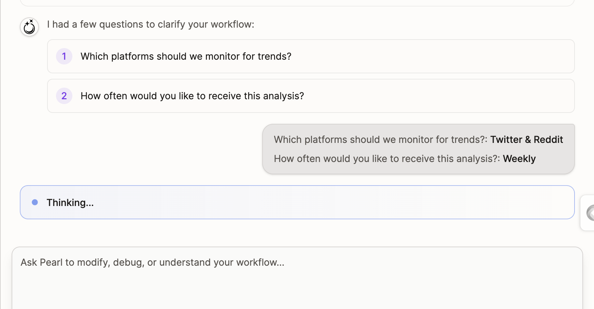
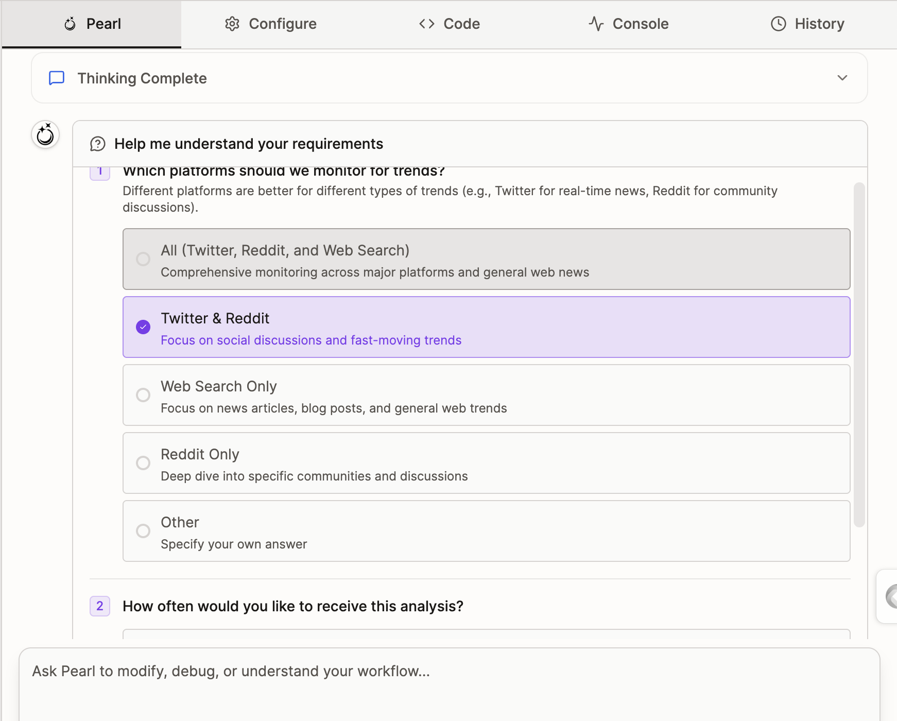
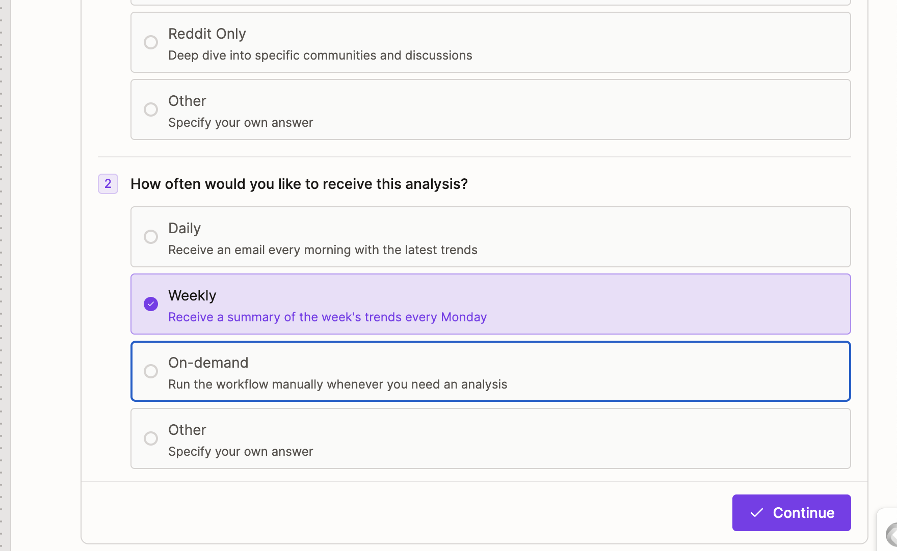

# Archive note: Figma mcp to do stuff. It’s also free lol. Just need  few skills and….md

Source file: `/Users/sethlim/Desktop/Archive/Figma mcp to do stuff. It’s also free lol. Just need  few skills and….md`

## Capture Text

  
Figma mcp to do stuff. It’s also free lol. Just need  few skills and nail it.   
  
^ should be added to coming soon.  
  
[https://x.com/dabit3/status/2023607847331000493?s=46](https://x.com/dabit3/status/2023607847331000493?s=46)  
  
But very clearly, will need the exact specs so users don’t get pissed off iterating on   
  
Keep an eye on these guys. Same with Victor.   
  
[https://bubblelab.ai/?utm_source=ig&utm_medium=social&utm_content=link_in_bio&fbclid=PAdGRleAQBYLlleHRuA2FlbQIxMQBzcnRjBmFwcF9pZA8xMjQwMjQ1NzQyODc0MTQAAacS-trwKL0Ya-8KIcKNWvDwue-ne9EzBpFZJ93wkRthzpse-YeG9Ru1q0P3gw_aem_TxyKvg5aOGRia0GvOQlpOA](https://bubblelab.ai/?utm_source=ig&utm_medium=social&utm_content=link_in_bio&fbclid=PAdGRleAQBYLlleHRuA2FlbQIxMQBzcnRjBmFwcF9pZA8xMjQwMjQ1NzQyODc0MTQAAacS-trwKL0Ya-8KIcKNWvDwue-ne9EzBpFZJ93wkRthzpse-YeG9Ru1q0P3gw_aem_TxyKvg5aOGRia0GvOQlpOA)  
  
  
Ask user question tool is not bad, quite intuitive. Can’t do via WhatsApp tho.   
  
  
  
  
  
  
  

