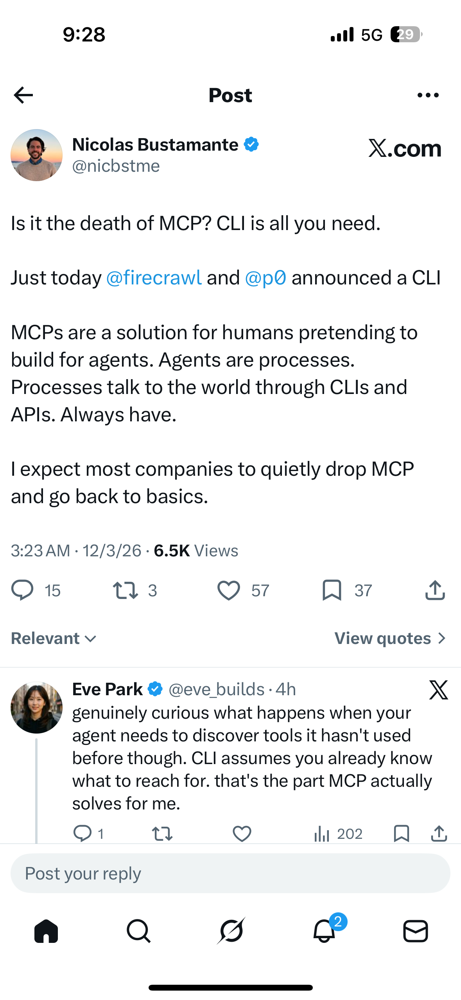

# Archive note: httpsx.comnicbstmestatus2031130229348118611s=46.md

Source file: `/Users/sethlim/Desktop/Archive/httpsx.comnicbstmestatus2031130229348118611s=46.md`

## Capture Text

[https://x.com/nicbstme/status/2031130229348118611?s=46](https://x.com/nicbstme/status/2031130229348118611?s=46)  
  
Kimi caching   
  
https://mailchi.mp/f7964359fa18/kimi_api-12873969?e=737787603c  
  
  
Awesome landing animation   
  
[https://www.proofeditor.ai](https://www.proofeditor.ai)   
[https://www.proofeditor.ai](https://www.proofeditor.ai)   
  
  
MCP vs cli   
MCP vs cli   
  
  

