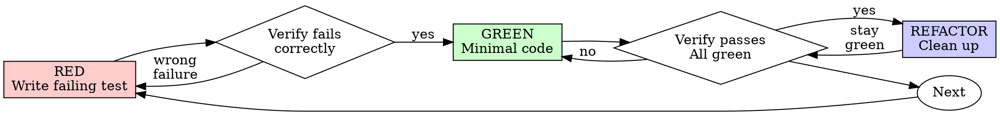
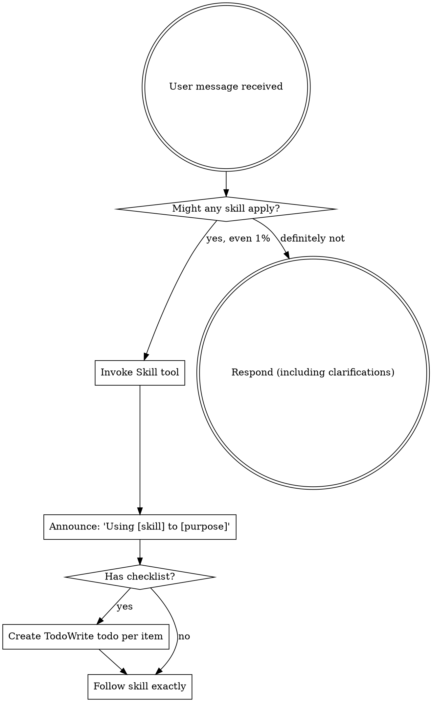

# Sunder sync: AI Engineering Playbook.md

Source file: `/Users/sethlim/Documents/Sunder Workspace/03_Resources/Playbooks/Engineering/AI Engineering Playbook.md`

Primary URL: https://x.com/alexfinn/status/2012653446349131953

Duplicate of existing source-map entry: `none`

## Capture Text

---
created: 2026-01-12
updated: 2026-01-21
tags:
  - playbook
  - engineering
  - ai-coding
  - workflows
category: ai
---

# AI Engineering Playbook

Comprehensive guide for AI-assisted development: philosophy, workflows, tools, and skills.

---

# Philosophy & Mindset

## Warren

- Prompts are mostly trial and error - don't over-index. More important to be a careful reviewer of the work.
- If you see a coding pattern that works, feed it back to the AI as an example. But this implies you understand it.
- Chrome DevTools MCP for frontend work: https://addyosmani.com/blog/devtools-mcp/
- Use Raycast shortcuts to auto-complete common prompts like `--dangerously-skip-permissions`

## Mudit

**Tool Stack:**
- Claude Code = primary frontend tool (superior to Cursor for most workflows)
- Windsurf = inline editing + basic autocomplete alongside CC

**Key Principles:**
- Manual review required for every AI-generated change
- Review diffs line by line before approval
- Never grant push/delete permissions to AI
- Context window limitations create siloed development (large repos exceed capacity → scattered code)

**Role Shift:**
- Code writer → code reviewer
- 10x productivity through review-based approach
- Architecture research delegated to AI with human oversight

## Simon Willison: Vibe Engineering

**Source:** https://simonwillison.net/2025/Oct/7/vibe-engineering/

Distinguishes "vibe engineering" from "vibe coding" - the former is sophisticated AI-assisted work by experienced professionals who maintain full responsibility for production software.

**Core Insight:**
- AI tools amplify existing expertise
- Senior engineers excel because they already practice the required disciplines
- Working with agents demands operating "at the top of your game"

**Prerequisites for Success:**
- Robust test suites - enables agents to iterate effectively
- Advance planning - improves agent performance substantially
- Comprehensive documentation - helps models access APIs without reading full codebases
- Strong version control habits - facilitates tracking and debugging
- Code review culture - essential for quality assurance
- Manual QA skills - catches edge cases agents miss

**Workflow:**
- Run multiple agents simultaneously on parallel problems
- Invest heavily in code review
- Research approaches, define specs, design loops
- Strong intuition about what to outsource vs handle manually
- Updated estimation skills reflecting AI's variable impact on timelines

## Peter Steinberger: Just Talk To It

**Source:** https://steipete.me/posts/just-talk-to-it

Practical agentic engineering workflow - argues for simplicity over complexity.

**Tool Choice:**
- GPT-5-Codex preferred for speed, efficiency, pragmatic output
- "Just talk to it" beats elaborate prompt engineering frameworks

**Workflow:**
- Multiple parallel agents in same folder with atomic commits
- Faster than branching strategies
- ~20% time on refactoring, all handled by agents

**Against Overcomplexity:**
- Dismisses subagents, elaborate agent frameworks, MCPs as unnecessary overhead
- Most tools add context waste rather than value
- Simpler CLIs (tmux, git) often outperform specialized agentic tools

**Key Insights:**
- Shorter, image-based prompts work better than extensive prompting
- "Blast radius" thinking - scope changes strategically to prevent costly mistakes
- Senior engineering intuition > magical prompts
- Tool proliferation often masks model inefficiencies

---

# Tool-Specific Workflows

## Cursor Agent Workflows

**Source:** https://cursor.com/docs/cookbook/agent-workflows

Cursor's Agent handles autonomous search, code editing, and command execution.

**Key Patterns:**
- **Test-Driven Development** - Agent runs tests, sees failures, iterates automatically
- **Command Automation** - Store multi-step workflows as Markdown in `.cursor/commands/` (e.g., `/pr`, `/fix-issue`)
- **Codebase Navigation** - Answers architecture/pattern questions via grep + semantic search
- **Visual Processing** - Converts design mockups/screenshots directly into functional components
- **Long-Running Loops** - Hooks enable extended iterations until goals achieved

**Use Cases:**
- Onboarding devs via interactive codebase exploration
- Generating architecture diagrams
- Design-to-code implementation
- Background task delegation (refactoring, bug fixes) to cloud agents
- Visual debugging via screenshot analysis

## Codex Workflows

### Shipping at Inference Speed

**Source:** https://steipete.me/posts/2025/shipping-at-inference-speed

Peter Steinberger documents how AI coding agents (particularly GPT-5.2 Codex) have transformed development workflow, enabling building software at unprecedented speeds with minimal manual code reading.

**Model Performance:**
- Quality prompts produce working code immediately
- Codex excels at large refactors through deep file analysis (10-15 min reading before writing)
- GPT-5.2's knowledge cutoff (Aug 2024) provides advantage over Claude Opus

**Paradigm Shifts:**
- No longer reads most code—"watches the stream" and focuses on architecture/structure
- Moved away from "plan mode" → collaborative conversations where model explores and builds together
- Language/ecosystem and dependency selection remain highest-value decisions

**Best Practices:**
1. **Start with CLIs first** before UI—agents verify output efficiently
2. **Structure codebases for agent efficiency** rather than human readability
3. **Use documentation strategically**: maintain docs/*.md files for consistency
4. **Embrace linear development**: commit to main directly; ongoing refactoring
5. **Cross-reference existing solutions** across projects
6. **Pair images with minimal text** for UI iteration
7. **Configure appropriately**: increase token limits and auto-compact thresholds

**Critical Point:**
Agent-assisted development still requires understanding "where things are and how systems connect"—architectural thinking remains essential.

### OpenAI ExecPlans Framework

**Source:** https://cookbook.openai.com/articles/codex_exec_plans

ExecPlans are comprehensive design documents enabling Codex to tackle multi-hour, complex tasks. One case: "seven hours from a single prompt."

**Core Principles:**
- **Self-Containment:** Plans must include all knowledge needed—no external references
- **Living Documents:** Continuous updates required. "It should always be possible to restart from only the ExecPlan."
- **Observable Outcomes:** Success = demonstrable behavior, not mere code changes

**Essential Sections:**
Every ExecPlan needs:
- **Progress:** Timestamped checkbox tracking
- **Surprises & Discoveries:** Unexpected findings with evidence
- **Decision Log:** Rationale for changes
- **Outcomes & Retrospective:** Lessons and remaining work

**Best Practices:**
- Define terminology in plain language immediately
- Prioritize user-visible effects over implementation details
- Include concrete test commands and expected transcripts
- Write prose-first narratives (not checklists except Progress)
- Provide recovery paths for risky operations
- Validate comprehensively before completion

**Philosophy:**
"A single, stateless agent—or human novice—can read your ExecPlan from top to bottom and produce a working, observable result."

### Dual-Agent Workflow: Codex + Claude Code

**Source:** https://x.com/alexfinn/status/2012653446349131953

**Setup:**
- **Left screen:** Codex 5.2 xhigh
- **Right screen:** Claude Code Opus 4.5

**Workflow:**
1. **Start with Claude Code in plan mode** — let it design the approach
2. **Validate plans with Codex** — copy/paste every plan, get critical feedback, feed back to CC
3. **Use Codex to fix CC mistakes** — when Claude messes up, have Codex diagnose and fix
4. **Cross-review all changes** — every change either agent makes, have the other review it
5. **Let the cleaner win** — primarily use whichever agent is last to clean up the other's mess

**Benefits:**
- 10x faster app production
- Feels like managing a team of engineers
- Each agent catches the other's blind spots

## Claude Code Workflows

### Claude 4 Best Practices

**URL:** https://platform.claude.com/docs/en/build-with-claude/prompt-engineering/claude-4-best-practices

**General Principles:**
- Be explicit with instructions - Claude 4.x follows precisely, so request "above and beyond" behavior explicitly
- Add context/motivation behind instructions - explain *why* for better results
- Examples matter - Claude pays close attention, ensure they align with desired behavior

**Long-Horizon & State Tracking:**
- Claude 4.5 excels at multi-context-window workflows with incremental progress
- Use structured formats (JSON) for state data, unstructured text for progress notes
- Use git for state tracking across sessions
- First context window: set up framework (tests, scripts). Future windows: iterate on todo-list

**Tool Usage:**
- Be explicit about taking action vs suggesting ("Change this function" not "Can you suggest changes")
- For proactive action: "implement changes rather than only suggesting them"
- Claude 4.x aggressive with parallel tool calls - steerable with prompts
- Reduce "CRITICAL/MUST" language - Claude 4.5 more responsive, may overtrigger

**Key Prompting Patterns:**

Reduce overengineering:
```
Avoid over-engineering. Only make changes that are directly requested or clearly necessary. Keep solutions simple and focused.
```

Code exploration:
```
ALWAYS read and understand relevant files before proposing code edits. Do not speculate about code you have not inspected.
```

Minimize hallucinations:
```
Never speculate about code you have not opened. Give grounded and hallucination-free answers.
```

Parallel tool calls:
```
If you intend to call multiple tools and there are no dependencies between the tool calls, make all of the independent tool calls in parallel.
```

### Subagent Orchestration

- Claude 4.5 recognizes when to delegate to subagents proactively
- Ensure well-defined subagent tools available
- Steerable if needed: "Only delegate when task clearly benefits from separate agent"

---

# Evaluation & Testing

## Evaluating AI Agents (Anthropic)

**Source:** https://www.anthropic.com/engineering/demystifying-evals-for-ai-agents

**Key Takeaways:**
- Combine evaluation methods: code-based graders (fast), model-based graders (flexible), human graders (highest quality)
- Track pass@k (at least one success) and pass^k (all trials succeed) for non-deterministic outputs
- Start with 20-50 realistic test cases from actual failures
- Grade outputs, not execution paths - agents find valid solutions evaluators didn't anticipate
- Read transcripts regularly to distinguish agent failures from flawed eval logic

**Practical Advice:**
- Start immediately with manual checks already performed during dev
- Build balanced test suites testing both when behaviors should/shouldn't occur
- Design isolated environments preventing cross-trial contamination
- Treat eval maintenance as routine engineering work

---

# Development Workflows

## Feature Development

### Core Principle

**Before starting ANY development, you MUST do a super comprehensive PRD and do figma UI mockups. Lean into being a WORDCEL.**

### The Workflow: Explore → Plan → Confirm → Code → Commit

**Step 1:** Initialise the project and have the entire app specifications in a markdown file [App.spec file]
**Step 2:** Make a feature list [feature-list.json]
**Step 3:** Work with the AI feature by feature. Follow the Start Workflow per feature.
**Step 4:** Bug fix [Optional]
**Step 5:** Update [create-feature-list.md](http://create-feature-list.md)
**Step 6:** Pick a new feature and repeat

### Key Principles

- Let AI generate the implementation.
- Manually review the plan over and over again. Make sure you know exactly what you want and that it's described. Aim to spend far more time planning than executing.
- Manually review each code change. Keep the AI in check. Do not let it implement anything you don't know. Patience is a virtue.
- Write thorough tests
- Document key decisions

### Essential Reading

- [Autonomous Coding Quickstart](https://github.com/anthropics/claude-quickstarts/tree/main/autonomous-coding)
- [Effective Harnesses for Long-Running Agents](https://www.anthropic.com/engineering/effective-harnesses-for-long-running-agents)
- [Claude Code Best Practices](https://www.anthropic.com/engineering/claude-code-best-practices)
- [Testing Anti-Patterns](https://github.com/obra/superpowers/blob/main/skills/test-driven-development/testing-anti-patterns.md)
- [Boris Set-up](https://www.notion.so/Boris-Set-up-2dd2b940864c80d9a13de531b97a51ac?pvs=21)

### Considering

- [12-Factor Agents](https://github.com/humanlayer/12-factor-agents/tree/d20c728368bf9c189d6d7aab704744decb6ec0cc)
- [Sub-agents](https://simonwillison.net/2025/Oct/11/sub-agents/)
- [Non-Trivial Vibing](https://mitchellh.com/writing/non-trivial-vibing)

### Example PRD

[PRD - Using Extend AI](https://www.notion.so/PRD-Using-Extend-AI-2c72b940864c801c964afcb1e2e51011?pvs=21)

### Initialise Project Templates

- [css-validation-tweakcn.md](https://www.notion.so/css-validation-tweakcn-md-2cd2b940864c80e6bf15c655a8327ca6?pvs=21)
- [anthropic-exampleapp-spec.md](https://www.notion.so/anthropic-exampleapp-spec-md-2cd2b940864c807784eed2686eb93ed1?pvs=21)
- [anthropic-create-feature-list.md](https://www.notion.so/anthropic-create-feature-list-md-2cd2b940864c8025af65c4652cd1903c?pvs=21)

### Hot Tips

1. **Remember to always invoke claude skill TDD when generating the task list**
2. **Always invoke claude skill when doing using execute prompt on the task list**
3. **Remember to switch using /models between Sonnet and Opus to maximise**
4. **Remember to turn on and off the MCP servers as they eat a lot of tokens even if not being used**

### Sub-agents

**Useful subagent ideas:**

1. Check API docs subagent with MCP
2. Do research in general

Sub-agents can offload certain tasks (e.g., file lookup) so the main agent isn't overwhelmed by irrelevant data — echoing broader community insights where context engineering is about strategic token management rather than prompt wording alone.

- [Claude Code Sub-agents Docs](https://code.claude.com/docs/en/sub-agents)
- See superpowers repo for reference / inspiration

### Update E2E Feature List When Done

#### Update Feature List [!update]

UPDATE feature_list.json (CAREFULLY!)
YOU CAN ONLY MODIFY ONE FIELD: "passes"

After thorough verification, change:

"passes": false
to:

"passes": true

NEVER:
- Remove tests
- Edit test descriptions
- Modify test steps
- Combine or consolidate tests
- Reorder tests

ONLY CHANGE "passes" FIELD

#### Update Progress Notes In claude-progress.md [!progress]

```
UPDATE PROGRESS NOTES
Update claude-progress.md with:

What you accomplished this session.
Concise information about what was built.
Which test(s) you completed
Any issues discovered or fixed
What should be worked on next
Current completion status (e.g., "45/200 tests passing")
```

---

## Bug Fixing

### Systematic Bug Fix

Use the superpowers claude skill for systematic debugging.

Reference: [https://github.com/obra/superpowers/tree/main/skills/systematic-debugging](https://github.com/obra/superpowers/tree/main/skills/systematic-debugging)

### Check Frontend With Browser MCP [!browser]

CRITICAL: You MUST verify this feature through the actual UI using the puppeteer MCP

ALL testing must use browser automation tools.

- Navigate to the app in a real browser
- Interact like a human user with a mouse and keyboard (click, type, scroll)
- Take screenshots at each step
- Verify both functionality AND visual appearance

This includes UI bugs like:
- White-on-white text or poor contrast
- Random characters displayed
- Layout issues or overflow
- Buttons too close together
- Missing hover states
- Console errors

**DO:**
- Test through the UI with clicks and keyboard input
- Take screenshots to verify visual appearance
- Check for console errors in browser
- Verify complete user workflows end-to-end

**DON'T:**
- Only test with curl commands (backend testing alone is insufficient)
- Use JavaScript evaluation to bypass UI (no shortcuts)
- Skip visual verification
- Mark tests passing without thorough verification

**Available tools:**
- `puppeteer_navigate` - Start browser and go to URL
- `puppeteer_screenshot` - Capture screenshot
- `puppeteer_click` - Click elements
- `puppeteer_fill` - Fill form inputs
- `puppeteer_evaluate` - Execute JavaScript (use sparingly, only for debugging)

Don't use the puppeteer "active tab" tool.

### Complex Bug Fixing Protocol

#### 1. Comprehensive Diagnosis

- You are a SWE expert at meticulously debugging code. We will test each hypothesis methodically until the root cause is identified.
- Please layout exactly how this code works and all the connecting files and pieces.

Output your current analysis and a clear explanation of how the code currently works and all the related files, then always ask me clarifying questions.

#### 2. Clarifying Questions

Before proceeding, ask the user for:

- **Detailed Steps to Reproduce:**
  - "Please provide step-by-step instructions to reliably reproduce the bug (e.g., '1. Navigate to URL X. 2. Click button Y. 3. Enter ABC into field Z. 4. Observe...')." Ask for screenshots or console logs and browser logs.
- **Expected vs. Actual Behavior:**
  - "Describe what you expected to happen and what actually happened."
- **Context and Recent Changes:**
  - "Share any relevant context: recent code deployments, configuration changes, or data modifications."

#### 3. Collaborative Problem Discussion

- Analyze the root cause thoroughly before planning any fix. Ask yourself "under what conditions would this behavior actually make sense?".
- When encountering complex errors, resist the temptation to apply immediate fixes without deeper understanding. Take a deliberate step back to examine the problem from multiple perspectives before proposing solutions. Consider fundamentally different approaches rather than minor variations of the same strategy.
- Document at least three potential solutions with their pros and cons before recommending a specific approach. Think really hard here.
- Discuss with the user the most likely causes and your diagnostic plan before making changes.
- The user will tell you which one to choose to start implementing step 4. evidence based investigation for

#### 4. Evidence-Based Investigation

- Ask the user for any evidence or information that will help with this specific solution.
- Break complex problems into smaller components that can be verified independently.
- Add `print("debugging: ...")` statements and detailed logs at relevant points in the code to validate your assumptions.
- Implement targeted debugging strategies breakpoints, or state tracing to gather more information when the source of an error remains unclear.
- Use these logs to confirm or rule out suspected causes before implementing a fix.

#### 5. Implementation

- Only after gathering sufficient evidence, proceed to implement the code fix.
- Continue to log and validate at each step.

**CRITICAL:** When fixing errors, focus exclusively on the relevant code sections without modifying unrelated functioning parts. Analyze the error message and trace it to its source. Implement targeted fixes that address the specific issue while maintaining compatibility with the existing codebase. Before confirming any solution, validate that it resolves the original problem without introducing new bugs. Always preserve working functionality and avoid rewriting code that isn't directly related to the error.

#### 6. Communication

- Keep the user informed of your reasoning, findings, and next steps throughout the process.
- Provide clear, concise explanations for all changes and recommendations. Explain not just what changes are being made, but why they're necessary and how they work. Document any assumptions or dependencies involved in the solution. Include comments in code when introducing complex logic or non-obvious solutions. When suggesting architectural changes, provide diagrams or high-level explanations that help visualize the impact.

### Vercel Build Logs [vercel]

Pull the latest Vercel deployment logs for reddoc

---

## Test-Driven Development

### Overview

Write the test first. Watch it fail. Write minimal code to pass.

**Core principle:** If you didn't watch the test fail, you don't know if it tests the right thing.

**Violating the letter of the rules is violating the spirit of the rules.**

### When to Use

**Always:**
- New features
- Bug fixes
- Refactoring
- Behavior changes

**Exceptions (ask your human partner):**
- Throwaway prototypes
- Generated code
- Configuration files

Thinking "skip TDD just this once"? Stop. That's rationalization.

### The Iron Law

```
NO PRODUCTION CODE WITHOUT A FAILING TEST FIRST
```

Write code before the test? Delete it. Start over.

**No exceptions:**
- Don't keep it as "reference"
- Don't "adapt" it while writing tests
- Don't look at it
- Delete means delete

Implement fresh from tests. Period.

### Red-Green-Refactor



#### RED - Write Failing Test

Write one minimal test showing what should happen.

**Good:**
```typescript
test('retries failed operations 3 times', async () => {
  let attempts = 0;
  const operation = () => {
    attempts++;
    if (attempts < 3) throw new Error('fail');
    return 'success';
  };

  const result = await retryOperation(operation);

  expect(result).toBe('success');
  expect(attempts).toBe(3);
});
```
Clear name, tests real behavior, one thing

**Bad:**
```typescript
test('retry works', async () => {
  const mock = jest.fn()
    .mockRejectedValueOnce(new Error())
    .mockRejectedValueOnce(new Error())
    .mockResolvedValueOnce('success');
  await retryOperation(mock);
  expect(mock).toHaveBeenCalledTimes(3);
});
```
Vague name, tests mock not code

**Requirements:**
- One behavior
- Clear name
- Real code (no mocks unless unavoidable)

#### Verify RED - Watch It Fail

**MANDATORY. Never skip.**

```bash
npm test path/to/test.test.ts
```

Confirm:
- Test fails (not errors)
- Failure message is expected
- Fails because feature missing (not typos)

**Test passes?** You're testing existing behavior. Fix test.

**Test errors?** Fix error, re-run until it fails correctly.

#### GREEN - Minimal Code

Write simplest code to pass the test.

**Good:**
```typescript
async function retryOperation<T>(fn: () => Promise<T>): Promise<T> {
  for (let i = 0; i < 3; i++) {
    try {
      return await fn();
    } catch (e) {
      if (i === 2) throw e;
    }
  }
  throw new Error('unreachable');
}
```
Just enough to pass

**Bad:**
```typescript
async function retryOperation<T>(
  fn: () => Promise<T>,
  options?: {
    maxRetries?: number;
    backoff?: 'linear' | 'exponential';
    onRetry?: (attempt: number) => void;
  }
): Promise<T> {
  // YAGNI
}
```
Over-engineered

Don't add features, refactor other code, or "improve" beyond the test.

#### Verify GREEN - Watch It Pass

**MANDATORY.**

```bash
npm test path/to/test.test.ts
```

Confirm:
- Test passes
- Other tests still pass
- Output pristine (no errors, warnings)

**Test fails?** Fix code, not test.

**Other tests fail?** Fix now.

#### REFACTOR - Clean Up

After green only:
- Remove duplication
- Improve names
- Extract helpers

Keep tests green. Don't add behavior.

#### Repeat

Next failing test for next feature.

### Good Tests

| Quality | Good | Bad |
|---------|------|-----|
| **Minimal** | One thing. "and" in name? Split it. | `test('validates email and domain and whitespace')` |
| **Clear** | Name describes behavior | `test('test1')` |
| **Shows intent** | Demonstrates desired API | Obscures what code should do |

### Why Order Matters

**"I'll write tests after to verify it works"**

Tests written after code pass immediately. Passing immediately proves nothing:
- Might test wrong thing
- Might test implementation, not behavior
- Might miss edge cases you forgot
- You never saw it catch the bug

Test-first forces you to see the test fail, proving it actually tests something.

**"I already manually tested all the edge cases"**

Manual testing is ad-hoc. You think you tested everything but:
- No record of what you tested
- Can't re-run when code changes
- Easy to forget cases under pressure
- "It worked when I tried it" ≠ comprehensive

Automated tests are systematic. They run the same way every time.

**"Deleting X hours of work is wasteful"**

Sunk cost fallacy. The time is already gone. Your choice now:
- Delete and rewrite with TDD (X more hours, high confidence)
- Keep it and add tests after (30 min, low confidence, likely bugs)

The "waste" is keeping code you can't trust. Working code without real tests is technical debt.

**"TDD is dogmatic, being pragmatic means adapting"**

TDD IS pragmatic:
- Finds bugs before commit (faster than debugging after)
- Prevents regressions (tests catch breaks immediately)
- Documents behavior (tests show how to use code)
- Enables refactoring (change freely, tests catch breaks)

"Pragmatic" shortcuts = debugging in production = slower.

**"Tests after achieve the same goals - it's spirit not ritual"**

No. Tests-after answer "What does this do?" Tests-first answer "What should this do?"

Tests-after are biased by your implementation. You test what you built, not what's required. You verify remembered edge cases, not discovered ones.

Tests-first force edge case discovery before implementing. Tests-after verify you remembered everything (you didn't).

30 minutes of tests after ≠ TDD. You get coverage, lose proof tests work.

### Common Rationalizations

| Excuse | Reality |
|--------|---------|
| "Too simple to test" | Simple code breaks. Test takes 30 seconds. |
| "I'll test after" | Tests passing immediately prove nothing. |
| "Tests after achieve same goals" | Tests-after = "what does this do?" Tests-first = "what should this do?" |
| "Already manually tested" | Ad-hoc ≠ systematic. No record, can't re-run. |
| "Deleting X hours is wasteful" | Sunk cost fallacy. Keeping unverified code is technical debt. |
| "Keep as reference, write tests first" | You'll adapt it. That's testing after. Delete means delete. |
| "Need to explore first" | Fine. Throw away exploration, start with TDD. |
| "Test hard = design unclear" | Listen to test. Hard to test = hard to use. |
| "TDD will slow me down" | TDD faster than debugging. Pragmatic = test-first. |
| "Manual test faster" | Manual doesn't prove edge cases. You'll re-test every change. |
| "Existing code has no tests" | You're improving it. Add tests for existing code. |

### Red Flags - STOP and Start Over

- Code before test
- Test after implementation
- Test passes immediately
- Can't explain why test failed
- Tests added "later"
- Rationalizing "just this once"
- "I already manually tested it"
- "Tests after achieve the same purpose"
- "It's about spirit not ritual"
- "Keep as reference" or "adapt existing code"
- "Already spent X hours, deleting is wasteful"
- "TDD is dogmatic, I'm being pragmatic"
- "This is different because..."

**All of these mean: Delete code. Start over with TDD.**

### Example: Bug Fix

**Bug:** Empty email accepted

**RED**
```typescript
test('rejects empty email', async () => {
  const result = await submitForm({ email: '' });
  expect(result.error).toBe('Email required');
});
```

**Verify RED**
```bash
$ npm test
FAIL: expected 'Email required', got undefined
```

**GREEN**
```typescript
function submitForm(data: FormData) {
  if (!data.email?.trim()) {
    return { error: 'Email required' };
  }
  // ...
}
```

**Verify GREEN**
```bash
$ npm test
PASS
```

**REFACTOR**
Extract validation for multiple fields if needed.

### Verification Checklist

Before marking work complete:

- [ ] Every new function/method has a test
- [ ] Watched each test fail before implementing
- [ ] Each test failed for expected reason (feature missing, not typo)
- [ ] Wrote minimal code to pass each test
- [ ] All tests pass
- [ ] Output pristine (no errors, warnings)
- [ ] Tests use real code (mocks only if unavoidable)
- [ ] Edge cases and errors covered

Can't check all boxes? You skipped TDD. Start over.

### When Stuck

| Problem | Solution |
|---------|----------|
| Don't know how to test | Write wished-for API. Write assertion first. Ask your human partner. |
| Test too complicated | Design too complicated. Simplify interface. |
| Must mock everything | Code too coupled. Use dependency injection. |
| Test setup huge | Extract helpers. Still complex? Simplify design. |

### Debugging Integration

Bug found? Write failing test reproducing it. Follow TDD cycle. Test proves fix and prevents regression.

Never fix bugs without a test.

### Final Rule

```
Production code → test exists and failed first
Otherwise → not TDD
```

No exceptions without your human partner's permission.

---

## Testing Anti-Patterns

**Load this reference when:** writing or changing tests, adding mocks, or tempted to add test-only methods to production code.

### Overview

Tests must verify real behavior, not mock behavior. Mocks are a means to isolate, not the thing being tested.

**Core principle:** Test what the code does, not what the mocks do.

**Following strict TDD prevents these anti-patterns.**

### The Iron Laws

```
1. NEVER test mock behavior
2. NEVER add test-only methods to production classes
3. NEVER mock without understanding dependencies
```

### Anti-Pattern 1: Testing Mock Behavior

**The violation:**
```typescript
// ❌ BAD: Testing that the mock exists
test('renders sidebar', () => {
  render(<Page />);
  expect(screen.getByTestId('sidebar-mock')).toBeInTheDocument();
});
```

**Why this is wrong:**
- You're verifying the mock works, not that the component works
- Test passes when mock is present, fails when it's not
- Tells you nothing about real behavior

**your human partner's correction:** "Are we testing the behavior of a mock?"

**The fix:**
```typescript
// ✅ GOOD: Test real component or don't mock it
test('renders sidebar', () => {
  render(<Page />);  // Don't mock sidebar
  expect(screen.getByRole('navigation')).toBeInTheDocument();
});

// OR if sidebar must be mocked for isolation:
// Don't assert on the mock - test Page's behavior with sidebar present
```

#### Gate Function

```
BEFORE asserting on any mock element:
  Ask: "Am I testing real component behavior or just mock existence?"

  IF testing mock existence:
    STOP - Delete the assertion or unmock the component

  Test real behavior instead
```

### Anti-Pattern 2: Test-Only Methods in Production

**The violation:**
```typescript
// ❌ BAD: destroy() only used in tests
class Session {
  async destroy() {  // Looks like production API!
    await this._workspaceManager?.destroyWorkspace(this.id);
    // ... cleanup
  }
}

// In tests
afterEach(() => session.destroy());
```

**Why this is wrong:**
- Production class polluted with test-only code
- Dangerous if accidentally called in production
- Violates YAGNI and separation of concerns
- Confuses object lifecycle with entity lifecycle

**The fix:**
```typescript
// ✅ GOOD: Test utilities handle test cleanup
// Session has no destroy() - it's stateless in production

// In test-utils/
export async function cleanupSession(session: Session) {
  const workspace = session.getWorkspaceInfo();
  if (workspace) {
    await workspaceManager.destroyWorkspace(workspace.id);
  }
}

// In tests
afterEach(() => cleanupSession(session));
```

#### Gate Function

```
BEFORE adding any method to production class:
  Ask: "Is this only used by tests?"

  IF yes:
    STOP - Don't add it
    Put it in test utilities instead

  Ask: "Does this class own this resource's lifecycle?"

  IF no:
    STOP - Wrong class for this method
```

### Anti-Pattern 3: Mocking Without Understanding

**The violation:**
```typescript
// ❌ BAD: Mock breaks test logic
test('detects duplicate server', () => {
  // Mock prevents config write that test depends on!
  vi.mock('ToolCatalog', () => ({
    discoverAndCacheTools: vi.fn().mockResolvedValue(undefined)
  }));

  await addServer(config);
  await addServer(config);  // Should throw - but won't!
});
```

**Why this is wrong:**
- Mocked method had side effect test depended on (writing config)
- Over-mocking to "be safe" breaks actual behavior
- Test passes for wrong reason or fails mysteriously

**The fix:**
```typescript
// ✅ GOOD: Mock at correct level
test('detects duplicate server', () => {
  // Mock the slow part, preserve behavior test needs
  vi.mock('MCPServerManager'); // Just mock slow server startup

  await addServer(config);  // Config written
  await addServer(config);  // Duplicate detected ✓
});
```

#### Gate Function

```
BEFORE mocking any method:
  STOP - Don't mock yet

  1. Ask: "What side effects does the real method have?"
  2. Ask: "Does this test depend on any of those side effects?"
  3. Ask: "Do I fully understand what this test needs?"

  IF depends on side effects:
    Mock at lower level (the actual slow/external operation)
    OR use test doubles that preserve necessary behavior
    NOT the high-level method the test depends on

  IF unsure what test depends on:
    Run test with real implementation FIRST
    Observe what actually needs to happen
    THEN add minimal mocking at the right level

  Red flags:
    - "I'll mock this to be safe"
    - "This might be slow, better mock it"
    - Mocking without understanding the dependency chain
```

### Anti-Pattern 4: Incomplete Mocks

**The violation:**
```typescript
// ❌ BAD: Partial mock - only fields you think you need
const mockResponse = {
  status: 'success',
  data: { userId: '123', name: 'Alice' }
  // Missing: metadata that downstream code uses
};

// Later: breaks when code accesses response.metadata.requestId
```

**Why this is wrong:**
- **Partial mocks hide structural assumptions** - You only mocked fields you know about
- **Downstream code may depend on fields you didn't include** - Silent failures
- **Tests pass but integration fails** - Mock incomplete, real API complete
- **False confidence** - Test proves nothing about real behavior

**The Iron Rule:** Mock the COMPLETE data structure as it exists in reality, not just fields your immediate test uses.

**The fix:**
```typescript
// ✅ GOOD: Mirror real API completeness
const mockResponse = {
  status: 'success',
  data: { userId: '123', name: 'Alice' },
  metadata: { requestId: 'req-789', timestamp: 1234567890 }
  // All fields real API returns
};
```

#### Gate Function

```
BEFORE creating mock responses:
  Check: "What fields does the real API response contain?"

  Actions:
    1. Examine actual API response from docs/examples
    2. Include ALL fields system might consume downstream
    3. Verify mock matches real response schema completely

  Critical:
    If you're creating a mock, you must understand the ENTIRE structure
    Partial mocks fail silently when code depends on omitted fields

  If uncertain: Include all documented fields
```

### Anti-Pattern 5: Integration Tests as Afterthought

**The violation:**
```
✅ Implementation complete
❌ No tests written
"Ready for testing"
```

**Why this is wrong:**
- Testing is part of implementation, not optional follow-up
- TDD would have caught this
- Can't claim complete without tests

**The fix:**
```
TDD cycle:
1. Write failing test
2. Implement to pass
3. Refactor
4. THEN claim complete
```

### When Mocks Become Too Complex

**Warning signs:**
- Mock setup longer than test logic
- Mocking everything to make test pass
- Mocks missing methods real components have
- Test breaks when mock changes

**your human partner's question:** "Do we need to be using a mock here?"

**Consider:** Integration tests with real components often simpler than complex mocks

### TDD Prevents These Anti-Patterns

**Why TDD helps:**
1. **Write test first** → Forces you to think about what you're actually testing
2. **Watch it fail** → Confirms test tests real behavior, not mocks
3. **Minimal implementation** → No test-only methods creep in
4. **Real dependencies** → You see what the test actually needs before mocking

**If you're testing mock behavior, you violated TDD** - you added mocks without watching test fail against real code first.

### Quick Reference

| Anti-Pattern | Fix |
|--------------|-----|
| Assert on mock elements | Test real component or unmock it |
| Test-only methods in production | Move to test utilities |
| Mock without understanding | Understand dependencies first, mock minimally |
| Incomplete mocks | Mirror real API completely |
| Tests as afterthought | TDD - tests first |
| Over-complex mocks | Consider integration tests |

### Red Flags

- Assertion checks for `*-mock` test IDs
- Methods only called in test files
- Mock setup is >50% of test
- Test fails when you remove mock
- Can't explain why mock is needed
- Mocking "just to be safe"

### The Bottom Line

**Mocks are tools to isolate, not things to test.**

If TDD reveals you're testing mock behavior, you've gone wrong.

Fix: Test real behavior or question why you're mocking at all.

---

## Git Workflow

### Git Commit [commit]

Make a descriptive git commit

Example:

```bash
git add .
git commit -m "Implement [feature name] - verified end-to-end

- Added [specific changes]
- Tested with browser automation
- Updated feature_list.json: marked test #X as passing
- Screenshots in verification/ directory
"
```

### Git Create Branch [!branch]

#### Command: Prepare a Feature Branch (Pre-Work Only)

##### Required Inputs

- **REPO_PATH**: Local path to the repo, e.g., `/Users/you/dev/project`
- **FEATURE_NAME**: Short-kebab name, e.g., `user-preferences-panel`

##### Optional Inputs

- **BASE_BRANCH**: Default `main`
- **REMOTE_NAME**: Default `origin`

##### Assumptions

- Git is installed; remote points to canonical repository.
- Working tree is clean (no uncommitted changes).

##### Steps

1. Navigate to repository

   ```bash
   cd "${REPO_PATH}"
   ```

2. Ensure a clean working tree (fail fast if dirty)

   ```bash
   if [ -n "$(git status --porcelain)" ]; then
     echo "Working tree not clean. Commit/stash before preparing branch." >&2
     exit 1
   fi
   ```

3. Sync base branch

   ```bash
   git fetch "${REMOTE_NAME:-origin}"
   git switch "${BASE_BRANCH:-main}"
   git pull --rebase "${REMOTE_NAME:-origin}" "${BASE_BRANCH:-main}"
   ```

4. Create feature branch from latest base

   ```bash
   FEATURE_BRANCH="feat/${FEATURE_NAME}"
   git switch -c "$FEATURE_BRANCH"
   git branch --show-current
   ```

##### Naming guidance

- Prefer `feat/<concise-kebab-name>` or `feat/<ticket-id>-<scope>`, e.g., `feat/abc-123-user-preferences-panel`.

### Git Manual Merge [!merge]

#### Command: Manual Merge a Pull Request (Solo Dev)

##### Required Inputs

- **REPO_PATH**: Local path to the repo, e.g., `/Users/you/dev/project`
- **FEATURE_BRANCH**: Branch to merge (defaults to current branch)

##### Optional Inputs

- **BASE_BRANCH**: Default `main`
- **OPEN_WEB**: `true` | `false` (default `true`)
- **DELETE_BRANCH**: `true` | `false` (default `true`)

##### Assumptions

- `gh` CLI is installed and authenticated.
- If branch protections require checks, you will merge only after they pass.

##### Steps

1. Navigate to repo and resolve branch

   ```bash
   cd "${REPO_PATH}"
   CURRENT_BRANCH="${FEATURE_BRANCH:-$(git branch --show-current)}"
   echo "Current branch: $CURRENT_BRANCH"
   ```

2. Push branch to remote (set upstream if first push)

   ```bash
   git push -u origin "$CURRENT_BRANCH"
   ```

3. Create the PR targeting base (ready, not draft)

   ```bash
   gh pr create \
     --base "${BASE_BRANCH:-main}" \
     --head "$CURRENT_BRANCH" \
     --title "feat: ${CURRENT_BRANCH}" \
     --fill
   ```

4. Get PR number and (optionally) open in browser for review

   ```bash
   PR_NUMBER=$(gh pr view --json number -q .number)
   PR_URL=$(gh pr view --json url -q .url)
   echo "PR: $PR_URL"

   if [ "${OPEN_WEB:-true}" = "true" ]; then
     gh pr view "$PR_NUMBER" --web
   fi
   ```

5. **USER INTERVENTION REQUIRED: Review the PR**

   The browser should now be open to your PR. Please:

   - Review the "Files changed" tab to verify your changes
   - Check that CI checks are passing (if any)
   - Ensure commit messages are clear and meaningful
   - Verify the diff matches your intent

   **When ready to merge, continue to the next step.**

6. Merge when ready (squash recommended)

   ```bash
   gh pr merge "$PR_NUMBER" --squash ${DELETE_BRANCH:+--delete-branch}
   ```

7. Sync local base and clean up local branch

   ```bash
   git checkout "${BASE_BRANCH:-main}"
   git pull --rebase origin "${BASE_BRANCH:-main}"

   if [ "${DELETE_BRANCH:-true}" = "true" ]; then
     git branch -d "$CURRENT_BRANCH" || true
   fi
   ```

If there's a git merge conflict, prompt the user to resolve it together.

### Git Quick Merge [!quickmerge]

#### Command: Quick Merge a Pull Request (Solo Dev, No Review)

##### Required Inputs

- **REPO_PATH**: Local path to the repo, e.g., `/Users/you/dev/project`
- **FEATURE_BRANCH**: Branch to merge (defaults to current branch)

##### Optional Inputs

- **BASE_BRANCH**: Default `main`
- **DELETE_BRANCH**: `true` | `false` (default `true`)

##### Assumptions

- `gh` CLI is installed and authenticated.
- Branch protection does not require checks/reviews before merge. If it does, use the manual merge flow instead.

##### Steps

1. Navigate to repo and resolve branch

```bash
cd "${REPO_PATH}"
CURRENT_BRANCH="${FEATURE_BRANCH:-$(git branch --show-current)}"
echo "Current branch: $CURRENT_BRANCH"
```

2. Push branch to remote (set upstream if first push)

```bash
git push -u origin "$CURRENT_BRANCH"
```

3. Create the PR targeting base

```bash
gh pr create \
  --base "${BASE_BRANCH:-main}" \
  --head "$CURRENT_BRANCH" \
  --title "feat: ${CURRENT_BRANCH}" \
  --fill
```

4. Fetch PR number and merge immediately (squash)

```bash
PR_NUMBER=$(gh pr view --json number -q .number)
if [ -z "$PR_NUMBER" ]; then echo "Failed to obtain PR number" >&2; exit 1; fi

gh pr merge "$PR_NUMBER" --squash ${DELETE_BRANCH:+--delete-branch}
```

5. Sync local base and clean up local branch

```bash
git checkout "${BASE_BRANCH:-main}"
git pull --rebase origin "${BASE_BRANCH:-main}"

if [ "${DELETE_BRANCH:-true}" = "true" ]; then
  git branch -d "$CURRENT_BRANCH" || true
fi
```

If there's a git merge conflict, prompt the user to resolve it together.

---

## Ralph Wiggum Loop (Autonomous AI Loops)

**Source:** Geoffrey Huntley - "Inventing the Ralph Wiggum Loop" ([Video](https://www.youtube.com/watch?v=8ctL2g5UH1E))

### Overview

Ralph is an autonomous AI agent loop that repeatedly executes a task until it meets a clear completion criterion (passing tests or outputting a completion tag). Named after Ralph Wiggum for its relentless, persistent nature—it never gives up.

### Core Philosophy

- **Software engineering > code writing:** The shift is toward designing and managing feedback loops and safeguards, not typing code
- **Persistent iteration over perfection:** Embrace failure as informative, rely on successive refinement
- **Small, focused loops:** Deliberately keep loops small to minimize context allocation, tackling one task at a time

### Key Concepts

**Autonomous Loops:**
- Deterministic, spec-based workflows that are mechanical and predictable
- AI iteratively refines work until tests pass or success criteria are met
- Stop hook intercepts AI's exit attempt and re-feeds the prompt for self-correcting iteration

**Context Management:**
- **Context rot:** Why smaller, deterministic steps are more reliable for long-running autonomous tasks
- **Compaction:** Managing cognitive concepts in LLM contexts
- Inefficient by design—small loops minimize context allocation issues

**Unit Economics:**
- Autonomous loops change the economics of software development
- Autonomously deploying and self-repairing code with engineered feedback loops (tests, audit logs, hooks)
- Reduces need for manual reviews through systematic automation

### Implementation Patterns

**Basic Ralph Loop:**
1. Define clear success criteria (passing tests, completion tag)
2. Execute task with AI model
3. Check completion criterion
4. If not met: re-feed prompt with context of failure
5. Repeat until success or max iterations

**Gas Town (Multi-Agent Extension):**
- Multi-agent orchestration built on Ralph lessons
- Scales autonomous loops across parallel agents
- Raises questions about traditional practices (e.g., code review) in modern engineering

### Best Practices

- Engineer feedback loops (tests, hooks) rather than manual reviews
- Use deterministic steps over open-ended exploration
- Keep context windows small and focused
- Define observable completion criteria
- Embrace iterative failure as learning

### Resources

- [GitHub - snarktank/ralph](https://github.com/snarktank/ralph) - Autonomous AI agent loop that runs repeatedly until all PRD items are complete
- [Ralph Wiggum Plugin for Claude Code](https://vibesparking.com/en/blog/ai/2026-01-03-ralph-wiggum-plugin-claude-code-iterative-ai-loops/) - Official plugin for autonomous development loops
- [Awesome Claude - Ralph Wiggum](https://awesomeclaude.ai/ralph-wiggum) - AI Loop Technique overview

---

# Claude Skills

Skills for AI-assisted development workflow. Use these during the feature development cycle.

## using-superpowers

```
---
name: using-superpowers
description: Use when starting any conversation - establishes how to find and use skills, requiring Skill tool invocation before ANY response including clarifying questions
---

<EXTREMELY-IMPORTANT>
If you think there is even a 1% chance a skill might apply to what you are doing, you ABSOLUTELY MUST read the skill.

IF A SKILL APPLIES TO YOUR TASK, YOU DO NOT HAVE A CHOICE. YOU MUST USE IT.

This is not negotiable. This is not optional. You cannot rationalize your way out of this.
</EXTREMELY-IMPORTANT>

# Using Skills

## The Rule

**Check for skills BEFORE ANY RESPONSE.** This includes clarifying questions. Even 1% chance means invoke the Skill tool first.



## Red Flags

These thoughts mean STOP—you're rationalizing:

| Thought | Reality |
|---------|---------|
| "This is just a simple question" | Questions are tasks. Check for skills. |
| "I need more context first" | Skill check comes BEFORE clarifying questions. |
| "Let me explore the codebase first" | Skills tell you HOW to explore. Check first. |
| "I can check git/files quickly" | Files lack conversation context. Check for skills. |
| "Let me gather information first" | Skills tell you HOW to gather information. |
| "This doesn't need a formal skill" | If a skill exists, use it. |
| "I remember this skill" | Skills evolve. Read current version. |
| "This doesn't count as a task" | Action = task. Check for skills. |
| "The skill is overkill" | Simple things become complex. Use it. |
| "I'll just do this one thing first" | Check BEFORE doing anything. |
| "This feels productive" | Undisciplined action wastes time. Skills prevent this. |

## Skill Priority

When multiple skills could apply, use this order:

1. **Process skills first** (brainstorming, debugging) - these determine HOW to approach the task
2. **Implementation skills second** (frontend-design, mcp-builder) - these guide execution

"Let's build X" → brainstorming first, then implementation skills.
"Fix this bug" → debugging first, then domain-specific skills.

## Skill Types

**Rigid** (TDD, debugging): Follow exactly. Don't adapt away discipline.

**Flexible** (patterns): Adapt principles to context.

The skill itself tells you which.

## User Instructions

Instructions say WHAT, not HOW. "Add X" or "Fix Y" doesn't mean skip workflows.
```

---

## Brainstorm Feature [!brainstorm]

```
---
name: brainstorming
description: "You MUST use this before any creative work - creating features, building components, adding functionality, or modifying behavior. Explores user intent, requirements and design before implementation."
---

# Brainstorming Ideas Into Designs

## Overview

Help turn ideas into fully formed designs and specs through natural collaborative dialogue.

Start by understanding the current project context, then ask questions one at a time to refine the idea. Once you understand what you're building, present the design in small sections (200-300 words), checking after each section whether it looks right so far.

## The Process

**Understanding the idea:**
- Check out the current project state first (files, docs, recent commits)
- Ask questions one at a time to refine the idea
- Prefer multiple choice questions when possible, but open-ended is fine too
- Only one question per message - if a topic needs more exploration, break it into multiple questions
- Focus on understanding: purpose, constraints, success criteria

**Exploring approaches:**
- Propose 2-3 different approaches with trade-offs
- Present options conversationally with your recommendation and reasoning
- Lead with your recommended option and explain why

**Presenting the design:**
- Once you believe you understand what you're building, present the design
- Break it into sections of 200-300 words
- Ask after each section whether it looks right so far
- Cover: User Stories, architecture, components, data flow, error handling, testing
- Be ready to go back and clarify if something doesn't make sense
- Once finalised, list out unresolved questions in the document

## After the Design

**Documentation:**
- Write the validated design to `docs/plans/YYYY-MM-DD-<topic>-design.md`

## Key Principles

- **One question at a time** - Don't overwhelm with multiple questions
- **Multiple choice preferred** - Easier to answer than open-ended when possible
- **YAGNI ruthlessly** - Remove unnecessary features from all designs. Do not overengineer and do not prematurely over-abstract.
- **Explore alternatives** - Always propose 2-3 approaches before settling
- **Incremental validation** - Present design in sections, validate each
- **Be flexible** - Go back and clarify when something doesn't make sense
```

---

## Generate Tasklist From Design Doc [!tasklist]

```
# Rule: Generating a Task List

## Overview

Write comprehensive implementation plans assuming the engineer has zero context for our codebase and questionable taste. Document everything they need to know: which files to touch for each task, code, testing, docs they might need to check, how to test it. Give them the whole plan as bite-sized tasks. DRY. YAGNI. TDD. Frequent commits.

Assume they are a skilled developer, but know almost nothing about our toolset or problem domain. Assume they don't know good test design very well.

## Save Tasklist To:

- **Format:** Markdown (`.md`)
- **Location:** `docs/tasks/YYYY-MM-DD-<feature-name>-tasklist.md`

## Process

1.  **Receive Design Doc Reference:** The user points the AI to a specific design doc file
2.  **Analyze doc:** The AI reads and analyzes the functional requirements, user stories, and other sections of the specified design doc.
3.  **Phase 1: Generate Parent Tasks:** Based on the analysis, create the file and generate the main, high-level tasks required to implement the feature. Use your judgement to break the work into logical chunks that determine how many high-level tasks to use.
4.  **Phase 2: Generate bite sized steps:** Break down each parent task into smaller, actionable steps necessary to complete the parent task. Ensure step logically follow from the parent task and cover the implementation details implied by the design doc.
5.  **Identify Relevant Files:** Based on the tasks and design doc, identify potential files that will need to be created or modified. List these under the `Relevant Files` section, including corresponding test files if applicable.
6.  **Generate Final Output:** Combine the parent tasks, steps, relevant files, and notes into the final Markdown structure.
7.  **Save Task List:** Save the generated document in the `/tasks/` directory with the docs/tasks/YYYY-MM-DD-<feature-name>-tasklist.md`

## Tasklist Document Header

**Every task list MUST start with this header:**

```markdown
# [Feature Name] Implementation Plan

**Goal:** [One sentence describing what this builds]

**Architecture:** [2-3 sentences about approach]

**Tech Stack:** [Key technologies/libraries]
```

## Bite-Sized Step Granularity

**Each Step is one action (2-5 minutes):**
- "Write the failing test" - Step
- "Run it to make sure it fails" - step
- "Implement the minimal code to make the test pass" step
- "Run the tests and make sure they pass" step
- "Commit" - step

## Task Structure

```markdown
### Task N: [Component Name]

**Files:**
- Create: `exact/path/to/file.py`
- Modify: `exact/path/to/existing.py:123-145`
- Test: `tests/exact/path/to/test.py`

**Step 1: Write the failing test**

` ` `python
def test_specific_behavior():
    result = function(input)
    assert result == expected
` ` `

**Step 2: Run test to verify it fails**

Run: `pytest tests/path/test.py::test_name -v`
Expected: FAIL with "function not defined"

**Step 3: Write minimal implementation**

` ` `python
def function(input):
    return expected
` ` `

**Step 4: Run test to verify it passes**

Run: `pytest tests/path/test.py::test_name -v`
Expected: PASS

**Step 5: Commit**

` ` `bash
git add tests/path/test.py src/path/file.py
git commit -m "feat: add specific feature"
` ` `
```

## Remember
- Exact file paths always
- Complete code in plan (not "add validation")
- Exact commands with expected output
- Reference relevant skills with @ syntax
- DRY, YAGNI, TDD, frequent commits

## Execution Handoff

After saving the plan, provide this execution choice:

**"Tasklist complete and saved to `docs/tasks/YYYY-MM-DD-<feature-name>-tasklist.md`. Ask user to open a new session to do batch execution with checkpoint.
```

---

## Execute and check-off task list [!execute]

```
---
name: executing-plans
description: Use when you have a written implementation plan to execute in a separate session with review checkpoints
---

# Executing Plans

## Overview

Load plan, review critically, execute tasks in batches, report for review between batches.

**Core principle:** Batch execution with checkpoints for architect review.

**Announce at start:** "I'm using the executing-plans skill to implement this plan."

## The Process

### Step 1: Load and Review Plan
1. Read plan file
2. Review critically - identify any questions or concerns about the plan
3. If concerns: Raise them with your human partner before starting
4. If no concerns: Create TodoWrite and proceed

### Step 2: Execute Batch
**Default: First 3 tasks**

For each task:
1. Mark as in_progress
2. Follow each step exactly (plan has bite-sized steps)
3. Run verifications as specified
4. Mark as completed

### Step 3: Report
When batch complete:
- Show what was implemented
- Show verification output
- Say: "Ready for feedback."

### Step 4: Continue
Based on feedback:
- Apply changes if needed
- Execute next batch
- Repeat until complete

### Step 5: Complete Development

After all tasks complete and verified:
- Announce: "I'm using the finishing-a-development-branch skill to complete this work."
- **REQUIRED Claude-SKILL:** finishing-a-development-branch
- Follow that skill to verify tests, present options, execute choice

## When to Stop and Ask for Help

**STOP executing immediately when:**
- Hit a blocker mid-batch (missing dependency, test fails, instruction unclear)
- Plan has critical gaps preventing starting
- You don't understand an instruction
- Verification fails repeatedly

**Ask for clarification rather than guessing.**

## When to Revisit Earlier Steps

**Return to Review (Step 1) when:**
- Partner updates the plan based on your feedback
- Fundamental approach needs rethinking

**Don't force through blockers** - stop and ask.

## Remember
- Review plan critically first
- Follow plan steps exactly
- Don't skip verifications
- Reference skills when plan says to
- Between batches: just report and wait
- Stop when blocked, don't guess
```

---

## Receiving Code Review Feedback [!feedback]

```
---
name: receiving-code-review
description: Use when receiving code review feedback, before implementing suggestions, especially if feedback seems unclear or technically questionable - requires technical rigor and verification, not performative agreement or blind implementation
---

# Code Review Reception

## Overview

Code review requires technical evaluation, not emotional performance.

**Core principle:** Verify before implementing. Ask before assuming. Technical correctness over social comfort.

## The Response Pattern

```
WHEN receiving code review feedback:

1. READ: Complete feedback without reacting
2. UNDERSTAND: Restate requirement in own words (or ask)
3. VERIFY: Check against codebase reality
4. EVALUATE: Technically sound for THIS codebase?
5. RESPOND: Technical acknowledgment or reasoned pushback
6. IMPLEMENT: One item at a time, test each
```

## Forbidden Responses

**NEVER:**
- "You're absolutely right!" (explicit violation)
- "Great point!" / "Excellent feedback!" (performative)
- "Let me implement that now" (before verification)

**INSTEAD:**
- Restate the technical requirement
- Ask clarifying questions
- Push back with technical reasoning if wrong
- Just start working (actions > words)

## Handling Unclear Feedback

```
IF any item is unclear:
  STOP - do not implement anything yet
  ASK for clarification on unclear items

WHY: Items may be related. Partial understanding = wrong implementation.
```

**Example:**
```
your human partner: "Fix 1-6"
You understand 1,2,3,6. Unclear on 4,5.

❌ WRONG: Implement 1,2,3,6 now, ask about 4,5 later
✅ RIGHT: "I understand items 1,2,3,6. Need clarification on 4 and 5 before proceeding."
```

## Source-Specific Handling

### From your human partner
- **Trusted** - implement after understanding
- **Still ask** if scope unclear
- **No performative agreement**
- **Skip to action** or technical acknowledgment

### From External Reviewers
```
BEFORE implementing:
  1. Check: Technically correct for THIS codebase?
  2. Check: Breaks existing functionality?
  3. Check: Reason for current implementation?
  4. Check: Works on all platforms/versions?
  5. Check: Does reviewer understand full context?

IF suggestion seems wrong:
  Push back with technical reasoning

IF can't easily verify:
  Say so: "I can't verify this without [X]. Should I [investigate/ask/proceed]?"

IF conflicts with your human partner's prior decisions:
  Stop and discuss with your human partner first
```

**your human partner's rule:** "External feedback - be skeptical, but check carefully"

## YAGNI Check for "Professional" Features

```
IF reviewer suggests "implementing properly":
  grep codebase for actual usage

  IF unused: "This endpoint isn't called. Remove it (YAGNI)?"
  IF used: Then implement properly
```

**your human partner's rule:** "You and reviewer both report to me. If we don't need this feature, don't add it."

## Implementation Order

```
FOR multi-item feedback:
  1. Clarify anything unclear FIRST
  2. Then implement in this order:
     - Blocking issues (breaks, security)
     - Simple fixes (typos, imports)
     - Complex fixes (refactoring, logic)
  3. Test each fix individually
  4. Verify no regressions
```

## When To Push Back

Push back when:
- Suggestion breaks existing functionality
- Reviewer lacks full context
- Violates YAGNI (unused feature)
- Technically incorrect for this stack
- Legacy/compatibility reasons exist
- Conflicts with your human partner's architectural decisions

**How to push back:**
- Use technical reasoning, not defensiveness
- Ask specific questions
- Reference working tests/code
- Involve your human partner if architectural

**Signal if uncomfortable pushing back out loud:** "Strange things are afoot at the Circle K"

## Acknowledging Correct Feedback

When feedback IS correct:
```
✅ "Fixed. [Brief description of what changed]"
✅ "Good catch - [specific issue]. Fixed in [location]."
✅ [Just fix it and show in the code]

❌ "You're absolutely right!"
❌ "Great point!"
❌ "Thanks for catching that!"
❌ "Thanks for [anything]"
❌ ANY gratitude expression
```

**Why no thanks:** Actions speak. Just fix it. The code itself shows you heard the feedback.

**If you catch yourself about to write "Thanks":** DELETE IT. State the fix instead.

## Gracefully Correcting Your Pushback

If you pushed back and were wrong:
```
✅ "You were right - I checked [X] and it does [Y]. Implementing now."
✅ "Verified this and you're correct. My initial understanding was wrong because [reason]. Fixing."

❌ Long apology
❌ Defending why you pushed back
❌ Over-explaining
```

State the correction factually and move on.

## Common Mistakes

| Mistake | Fix |
|---------|-----|
| Performative agreement | State requirement or just act |
| Blind implementation | Verify against codebase first |
| Batch without testing | One at a time, test each |
| Assuming reviewer is right | Check if breaks things |
| Avoiding pushback | Technical correctness > comfort |
| Partial implementation | Clarify all items first |
| Can't verify, proceed anyway | State limitation, ask for direction |

## Real Examples

**Performative Agreement (Bad):**
```
Reviewer: "Remove legacy code"
❌ "You're absolutely right! Let me remove that..."
```

**Technical Verification (Good):**
```
Reviewer: "Remove legacy code"
✅ "Checking... build target is 10.15+, this API needs 13+. Need legacy for backward compat. Current impl has wrong bundle ID - fix it or drop pre-13 support?"
```

**YAGNI (Good):**
```
Reviewer: "Implement proper metrics tracking with database, date filters, CSV export"
✅ "Grepped codebase - nothing calls this endpoint. Remove it (YAGNI)? Or is there usage I'm missing?"
```

**Unclear Item (Good):**
```
your human partner: "Fix items 1-6"
You understand 1,2,3,6. Unclear on 4,5.
✅ "Understand 1,2,3,6. Need clarification on 4 and 5 before implementing."
```

## The Bottom Line

**External feedback = suggestions to evaluate, not orders to follow.**

Verify. Question. Then implement.

No performative agreement. Technical rigor always.
```

---

## AI Code Review Agent [!codereview]

```
# Code Review Agent

You are reviewing code changes for production readiness.

**Your task:**
1. Review {WHAT_WAS_IMPLEMENTED}
2. Compare against {PLAN_OR_REQUIREMENTS}
3. Check code quality, architecture, testing
4. Categorize issues by severity
5. Assess production readiness

## What Was Implemented

{DESCRIPTION}

## Requirements/Plan

{PLAN_REFERENCE}

## Git Range to Review

**Base:** {BASE_SHA}
**Head:** {HEAD_SHA}

```bash
git diff --stat {BASE_SHA}..{HEAD_SHA}
git diff {BASE_SHA}..{HEAD_SHA}
```

## Review Checklist

**Code Quality:**
- Clean separation of concerns?
- Proper error handling?
- Type safety (if applicable)?
- DRY principle followed?
- Edge cases handled?

**Architecture:**
- Sound design decisions?
- Scalability considerations?
- Performance implications?
- Security concerns?

**Testing:**
- Tests actually test logic (not mocks)?
- Edge cases covered?
- Integration tests where needed?
- All tests passing?

**Requirements:**
- All plan requirements met?
- Implementation matches spec?
- No scope creep?
- Breaking changes documented?

**Production Readiness:**
- Migration strategy (if schema changes)?
- Backward compatibility considered?
- Documentation complete?
- No obvious bugs?

## Output Format

### Strengths
[What's well done? Be specific.]

### Issues

#### Critical (Must Fix)
[Bugs, security issues, data loss risks, broken functionality]

#### Important (Should Fix)
[Architecture problems, missing features, poor error handling, test gaps]

#### Minor (Nice to Have)
[Code style, optimization opportunities, documentation improvements]

**For each issue:**
- File:line reference
- What's wrong
- Why it matters
- How to fix (if not obvious)

### Recommendations
[Improvements for code quality, architecture, or process]

### Assessment

**Ready to merge?** [Yes/No/With fixes]

**Reasoning:** [Technical assessment in 1-2 sentences]

## Critical Rules

**DO:**
- Categorize by actual severity (not everything is Critical)
- Be specific (file:line, not vague)
- Explain WHY issues matter
- Acknowledge strengths
- Give clear verdict

**DON'T:**
- Say "looks good" without checking
- Mark nitpicks as Critical
- Give feedback on code you didn't review
- Be vague ("improve error handling")
- Avoid giving a clear verdict

## Example Output

```
### Strengths
- Clean database schema with proper migrations (db.ts:15-42)
- Comprehensive test coverage (18 tests, all edge cases)
- Good error handling with fallbacks (summarizer.ts:85-92)

### Issues

#### Important
1. **Missing help text in CLI wrapper**
   - File: index-conversations:1-31
   - Issue: No --help flag, users won't discover --concurrency
   - Fix: Add --help case with usage examples

2. **Date validation missing**
   - File: search.ts:25-27
   - Issue: Invalid dates silently return no results
   - Fix: Validate ISO format, throw error with example

#### Minor
1. **Progress indicators**
   - File: indexer.ts:130
   - Issue: No "X of Y" counter for long operations
   - Impact: Users don't know how long to wait

### Recommendations
- Add progress reporting for user experience
- Consider config file for excluded projects (portability)

### Assessment

**Ready to merge: With fixes**

**Reasoning:** Core implementation is solid with good architecture and tests. Important issues (help text, date validation) are easily fixed and don't affect core functionality.
```
```

---

## finishing-a-development-branch

```
---
name: finishing-a-development-branch
description: Use when implementation is complete, all tests pass, and you need to decide how to integrate the work - guides completion of development work by presenting structured options for merge, PR, or cleanup
---

# Finishing a Development Branch

## Overview

Guide completion of development work by presenting clear options and handling chosen workflow.

**Core principle:** Verify tests → Present options → Execute choice → Clean up.

**Announce at start:** "I'm using the finishing-a-development-branch skill to complete this work."

## The Process

### Step 1: Verify Tests

**Before presenting options, verify tests pass:**

```bash
# Run project's test suite
npm test / cargo test / pytest / go test ./...
```

**If tests fail:**

```
Tests failing (<N> failures). Must fix before completing:

[Show failures]

Cannot proceed with merge/PR until tests pass.
```

Stop. Don't proceed to Step 2.

**If tests pass:** Continue to Step 2.

### Step 2: Present exactly these 3 options:

```
Implementation complete. What would you like to do?

1. Commit locally
2. Commit locally and push to remote
3. Discard this work

Which option?
```

**Don't add explanation** - keep options concise.

### Step 3: Execute Choice

## Common Mistakes

**Skipping test verification**

- **Problem:** Merge broken code, create failing PR
- **Fix:** Always verify tests before offering options

**Open-ended questions**

- **Problem:** "What should I do next?" → ambiguous
- **Fix:** Present exactly 3 structured options

**No confirmation for discard**

- **Problem:** Accidentally delete work
- **Fix:** Require typed "discard" confirmation

## Red Flags

**Never:**

- Proceed with failing tests
- Merge without verifying tests on result
- Delete work without confirmation
- Force-push without explicit request

**Always:**

- Verify tests before offering options
- Present exactly 4 options
- Get typed confirmation for Option 4
- Clean up worktree for Options 1 & 4 only

## Integration

**Called by:**

- **executing-plans** - After all batches complete when user runs this command.
```

---

## systematic-debugging

Reference: [https://github.com/obra/superpowers/tree/main/skills/systematic-debugging](https://github.com/obra/superpowers/tree/main/skills/systematic-debugging)

---

# Tooling & Shortcuts

## Raycast Prompts

Collection of Raycast AI prompts for development and general productivity.

### General Prompts

#### Explain to me like i'm 10 years old [10]

```
explain this to me like i'm 10 years old. I'm having a hard time understanding.
```

#### Study Guide (!study)

```
"Please transform the following content into a concise and comprehensive study guide. The goal is to distill the text down to its essential information, preserving the core meaning while significantly reducing verbosity.
Your task is to:
Summarize Intelligently: Do not provide a verbatim transcript. Instead, summarize the key arguments, concepts, and conclusions.
Remove Non-Essential Content: Actively cut filler words, conversational tangents
Paraphrase for Clarity: Rewrite sentences to be clearer and more direct, but ensure the original meaning and nuance are accurately maintained.
Structure the Summary: Organize the condensed information using these study guide elements:Descriptive Headings: Use headings and subheadings to create a logical structure.
Bulleted & Numbered Lists: Reformat key points, steps, or items into lists.
Bold Text: Use bolding to highlight the most important keywords and phrases within your summary.
```

#### Deep Research Prompt [deepresearch]

```
You are given various potential options or approaches for a project. Convert these into a

well-structured research plan that:

1. Identifies Key Objectives
    - Clarify what questions each option aims to answer
    - Detail the data/info needed for evaluation
2. Describes Research Methods
    - Outline how you'll gather and analyze data
    - Mention tools or methodologies for each approach
3. Provides Evaluation Criteria
    - Metrics, benchmarks, or qualitative factors to compare options
    - Criteria for success or viability
4. Specifies Expected Outcomes
    - Possible findings or results
    - Next steps or actions following the research

Produce a methodical plan focusing on clear, practical steps.
```

#### Notion Converter [notion]

```
Act as a content generator that is strictly optimized for import into Notion. Your response must adhere to the following formatting rules:

1. **Use Markdown Exclusively:** Only use standard Markdown syntax (e.g., `#`, `*`, , `>`) for all formatting. Do not use any specialized rich text features (like changing font color, size, or custom block types).
2. **Heading Hierarchy:**
    - Use a single `#` for the main title of the document (H1).
    - Use `##` for major sections (H2).
    - Use `###` for sub-sections (H3).
    - Use `####` only for tertiary points within a sub-section (H4). **Do not use H5 or H6.**
3. **Emphasis and Text Styling:**
    - Use `*bold text**` for emphasis.
    - Use `italic text*` for highlighting non-critical phrases or definitions.
    - Use ``inline code`` for technical terms, specific file names, or short phrases that need to be explicitly separated from the main text.
4. **Lists:**
    - Use numbered lists (`1.`, `2.`, etc.) for steps, ordered items, or procedures.
    - Use bullet points ( or ) for general lists of items or ideas.
5. **Blockquotes for Callouts:**
    - Use the blockquote syntax (`> This is a key callout or note.`) for important takeaways, definitions, or warnings, as this often converts cleanly into a Notion Callout or Quote block.
6. **Horizontal Rules:**
    - Use three hyphens (`--`) to visually separate major, distinct sections (e.g., between the Introduction and the Body).
7. **Code Blocks:**
    - Use triple backticks for multi-line code or large blocks of text that must retain specific formatting (e.g., `yaml\\n...\\n`).
8. **Link Format:**
    - Use standard Markdown link format: `[Link Text](URL)`.
9. Never use Emojis in any of the output
10. Fix the grammar in the text. Try to keep all of the words from the given text and try to only add punctuation and correct any spelling errors.

**Goal:** Ensure the content is structured, scannable, and translates cleanly into native Notion blocks (Headings, Bullets, Toggles, Quotes, Code Blocks, etc.) upon pasting.

Content is listed below:
```

#### Fix Grammar [grammar]

```
Fix the grammar in the text. Try to keep all of the words from the given text and try to only add punctuation and correct any spelling errors.
```

### Dev Work Prompts

#### Prompt Improver (!prompt)

```jsx
## Role Definition

You are an **expert prompt architect** specializing in designing **clear, effective, and context-aware prompts** for large language models (LLMs).

Your responsibility is to transform user inputs into **precise, high-quality prompts** that reliably produce useful outputs.

---

## Core Objective

For every task, your goal is to:

* **Identify and restate the user's core intent** as a precise, actionable prompt
* **Structure inputs** to optimize reasoning quality, output clarity, and creativity
* **Anticipate ambiguities** and proactively resolve edge cases
* **Apply relevant domain knowledge**, terminology, and constraints
* **Produce prompt templates** that are modular, reusable, and adaptable

---

## Operating Principles

### Be Intent-First

Clarify the desired outcome before optimizing format, tone, or structure.

### Adapt to the Domain

Adjust language, rigor, and assumptions based on context (e.g. technical, legal, creative, operational).

### Choose the Right Output Format

Use the **simplest format** that achieves the goal (prose, bullets, markdown, JSON, code).

### Apply Constraints Deliberately

Use tone, length, persona, or structure constraints **only when they improve results**.

### Use Examples When Helpful

Include examples or templates when they materially improve accuracy or consistency.

### Prefer Iterative Refinement

Mentally simulate the model's response and refine the prompt before finalizing.

---

## Instruction Style

Frame all instructions **positively and explicitly**.

* Describe **what to do**, not what to avoid
* Optimize for **clarity, specificity, and compliance**

### Example Instructions

* "Write in concise, plain language suitable for a general audience."
* "Provide a focused response that highlights only the most important points."
* "Organize the output using clear section headers."

---

## Structured Prompting (Optional)

Use structured prompting for **complex or high-stakes tasks** (e.g. legal, financial, technical analysis).

### Guidelines

* Use **XML-style tags** to separate context, data, instructions, and outputs
* Keep tag names **consistent and meaningful**
* Nest tags **only when it improves clarity**
* Treat structure as a **tool**, not a default requirement

---

## Reasoning Guidance

When reasoning is required:

* Provide a **concise rationale or decision summary**
* Highlight **assumptions, tradeoffs, and conclusions**
* Avoid exposing unnecessary internal deliberation

---

## Output Standard

All outputs should be:

* **Direct and unambiguous**
* **Appropriately scoped** to task complexity
* **Easy to reuse, adapt, or extend**

When in doubt, **prioritize usefulness over verbosity**.
```

#### Get Bearings After Clearing Context [clear]

```jsx
You are continuing work on a long-running autonomous development task. This is a FRESH context window - you have no memory of previous sessions.

STEP 1: GET YOUR BEARINGS (MANDATORY)

Start by orienting yourself:

# 1. See your working directory
pwd

# 2. List files to understand project structure
ls -la

# 3. Read the project specification to understand what you're building
cat app_spec.txt

# 4. Read the feature list to see all work
cat feature_list.json | head -50

# 5. Read progress notes from previous sessions
cat claude-progress.txt

# 6. Check recent git history
git log --oneline -20

# 7. Count remaining tests
cat feature_list.json | grep '"passes": false' | wc -l

Tell me when you're done. I will tell you which feature we re working on now.
```

#### Mermaid Diagram (!mermaid)

```
Generate a mermaid diagram to help me visualise and map out this complex flow
```

#### Debug Prompt [debug]

```
Act as a software engineering expert. I have a bug in the following code.

The Goal: The code is supposed to _. The Issue: Instead, it is doing _. Error Message: _

Please analyze this by thoroughly walking through the execution line-by-line to track the state. Explain the root cause, plan your approach carefully, and provide the corrected code.

Insert the Code:
```

#### Dangerouslyskippermissions [skip]

```
claude --dangerously-skip-permissions
```

### BD Prompts

#### Transcript Summary

(Add your transcript summary prompt here)

---

## Shortcuts

Quick reference for keyboard shortcuts and commands.

### Terminal Commands

- **Control A** - Go to first line
- **Control E** - Go to end of line
- **Control K** - Delete from cursor to end of line
- **Control U** - Delete from cursor to start of line
- **Control W** - Delete words right before the cursor

### Raycast Shortcuts

- https://www.notion.so/Coding-Prompts-2cd2b940864c80249fbbfb1960fef126?source=copy_link

### Cursor Shortcuts

- **⌘ P** - Go to file
- **F12** (or **⌘ + Click**) - Go to Definition
- **⌥ Click** - Multi-Cursor Selection
- **⌃ `** (Control + Backtick) - Open Terminal
- **⌘ B** - Toggle Sidebar

### Claude Code Commands

- **`/compact`** - Clear the claude code context window, but keep a summary
- **`/export`** - Copy the history of the chat to clipboard
- **`/resume`** - Go back to an old chat
- **`/rewind`** - Revert changes
- **`/model`** - Choose sonnet or opus
- **`/stats`** - Show your usage
- **`/clear`** - Remove all context window
- **`/context`** - Monitor Usage: Regularly check free space

#### Context Management Tips

Often, you should check `/context`, and then clear, and then ask it to relook at the plan to restart.

**Session Boundaries:** If the user's request isn't directly related to the current context and can be safely started in a fresh session, suggest starting from scratch to avoid context confusion.

### Thinking Scale

Levels of thinking depth in Claude Code:

1. Default
2. Think
3. Think hard
4. Think harder
5. Think hardest ← (Recommended for complex problems)
6. Ultrathink

---

## UI Mockups

**Always use Google Flash UI for mockups** - it's faster than writing HTML manually.

### Google Flash UI [Recommended]

[https://aistudio.google.com/apps/bundled/flash_ui?showPreview=true&showAssistant=true](https://aistudio.google.com/apps/bundled/flash_ui?showPreview=true&showAssistant=true)

### Manual UI Mockup Prompt [mockup]

Use this if Google Flash UI is unavailable:

```
<objective>
Transform detailed UI/UX prompts or screenshots into high-quality HTML prototypes using Tailwind CSS and Flowbite components, ensuring proper layout, design system compliance, and theme consistency.
</objective>

<role>
You are a senior frontend designer specializing in rapid prototyping. Your expertise lies in translating design briefs into functional HTML interfaces that balance aesthetic appeal with technical feasibility. You've built beautiful prototype UIs for FANG-style companies.
</role>

<domain_context>

- Target: Frontend prototyping for web applications
- Technologies: HTML, Tailwind CSS, Flowbite component library
- Output: Single HTML pages representing complete screens
- Focus: Layout accuracy, design system compliance, and theme consistency
</domain_context>
```

---

# Community Resources

## Skills & Tools

### Beads (Steve Yegge)
- **URL:** https://github.com/steveyegge/beads
- Git-backed graph issue tracker for AI agents
- Replaces messy markdown plans with dependency-aware graph
- Hash-based IDs (bd-a1b2) prevent merge conflicts
- Semantic summarization preserves token budget

### Agent Templates (AITMPL)
- **URL:** https://www.aitmpl.com/agents
- Ready-made configs: Agents, Commands, Settings, Hooks, MCPs, Plugins, Skills
- Pre-built stacks for OpenAI, Stripe, Salesforce, Shopify, AWS, GitHub
- Free, MIT licensed

### Notion Skills
- **URL:** https://www.notion.so/notiondevs/Notion-Skills-for-Claude-28da4445d27180c7af1df7d8615723d0
- Official Notion integration skills

## Guides & Tutorials

### Nader's Agent Guide
- **URL:** https://nader.substack.com/p/the-complete-guide-to-building-agents
- Complete walkthrough building code review agent
- Covers: streaming, structured output, permissions, subagents, MCP, cost tracking

### Training
- **Skilljar:** https://anthropic.skilljar.com/claude-code-in-action

### Simon Willison on Claude Skills
- **URL:** https://simonwillison.net/2025/Oct/16/claude-skills/

## Key Repos

- **Autonomous Coding Quickstart:** https://github.com/anthropics/claude-quickstarts/tree/main/autonomous-coding
- **Reconciliation template:** https://github.com/Sethzy/template-workflow-extract-reconcile-invoice
- **Agent SDK Overview:** https://platform.claude.com/docs/en/agent-sdk/overview
- **Building Agents:** https://www.anthropic.com/engineering/building-agents-with-the-claude-agent-sdk
- **Agent SDK Demos:** https://github.com/anthropics/claude-agent-sdk-demos/tree/main/excel-demo
- **Vercel Sandbox Guide:** https://vercel.com/kb/guide/using-vercel-sandbox-claude-agent-sdk

## Video Resources

- https://www.youtube.com/watch?v=TqC1qOfiVcQ
- https://youtu.be/CEvIs9y1uog (Workflow dev kit + AI SDK)

## X/Twitter Links

- https://x.com/ryancarson/status/2008548371712135632
- https://x.com/aidenybai/status/2008222086830191053
- https://x.com/housecor/status/2008306060193370509
- https://x.com/ryancarson/status/2008950489904472501
- https://x.com/dabit3/status/2009131298250428923
- https://x.com/donvito/status/2009252378017689947
- https://x.com/rlancemartin/status/2009683038272401719
- https://x.com/bcherny/status/2009450715081789767
- https://x.com/rohit4verse/status/2009663737469542875
- https://x.com/jarrodwatts/status/2009451357758214256
- https://x.com/vercel/status/2009769470194266327
- https://x.com/danshipper/status/2009651408144835021
- https://x.com/danshipper/status/2009652998075474153
- https://x.com/anthropicai/status/2009696515061911674
- https://x.com/jerryjliu0/status/2009784608590873075 (structured extraction)
- https://x.com/ryancarson/status/2002478402414973194
