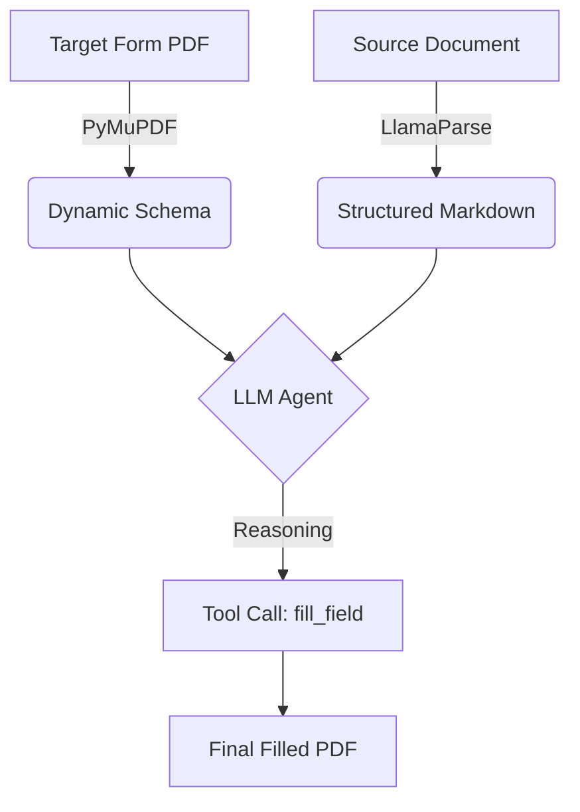

# Sunder sync: PATTERN.md

Source file: `/Users/sethlim/Documents/sunder-next-migration-20260225/.claude/templates/references/docgen-design/drafts/target-driven-form-filling/PATTERN.md`

Primary URL: https://x.com/jerryjliu0/status/2012657108500857271?s=46

Duplicate of existing source-map entry: `none`

## Capture Text

---
status: draft
captured: 2026-01-18
source: personal observation
tags: [form-automation, llm-agents, pdf-processing, schema-inference]
---

source: 

https://x.com/jerryjliu0/status/2012657108500857271?s=46 

https://github.com/jerryjliu/form_filling_app

# Pattern: Target-Driven Dynamic Form Filling

## TL;DR
> Invert traditional ETL by treating the target form as the dynamic schema source, allowing LLM agents to fill any form without code changes.

## The Pattern

This document outlines the architectural pattern for the "Schema-on-the-Fly" form-filling agent. This approach inverts traditional data extraction workflows by treating the **Target Form** as the dynamic source of truth for the schema, rather than pre-defining a rigid data model.

---

### Core Philosophy: The Inverted Workflow

In traditional ETL (Extract, Transform, Load) or automation pipelines, the data structure is defined *first* (Source-First), and the output is forced to match it. This pattern flips that logic.

#### Traditional vs. Agentic Approach

1. **Traditional (Schema-First):**
   * **Step 1:** Define a strict JSON schema (e.g., `UserSchema`).
   * **Step 2:** Parse the source document (Resume) into that schema.
   * **Step 3:** Map the schema fields to the Target Form.
   * **Failure Point:** If the Target Form asks for a field not in your schema (e.g., "Blood Type"), the pipeline fails or requires code changes.

2. **Agentic (Target-Driven):**
   * **Step 1:** Analyze the Target Form to discover what is needed.
   * **Step 2:** Parse the Source Document into unstructured, semantically rich text (Markdown).
   * **Step 3:** Use an LLM to "bridge" the specific needs of the Target with the available info in the Source.
   * **Advantage:** The system is **layout invariant**. It adapts to any new form without code changes.

> The Target Form itself acts as the schema definition.

---

### Technical Architecture

The workflow consists of three distinct phases: **Target Discovery**, **Source Parsing**, and the **Semantic Bridge**.

#### Phase 1: Target Discovery (The Schema)

The agent begins by inspecting the blank PDF to understand the "requirements" of the task.

* **Tooling:** `PyMuPDF` (aka `fitz`).
* **Action:** The agent executes a tool like `list_form_fields()`.
* **Output:** A list of technical field IDs (e.g., `TextField_01`, `CheckBox_Yes`) and their visual labels (e.g., "First Name", "Are you a US Citizen?").
* **Result:** The agent effectively builds a dynamic schema in real-time based on the specific PDF uploaded.

#### Phase 2: Source Parsing (The Context)

The agent processes the user's uploaded documents (Resume, Bank Statement, etc.) into a format optimized for LLM reasoning.

* **Tooling:** **LlamaParse**.
* **Action:** The source file is converted from a binary format (PDF/Docx) into structured Markdown.
* **Why Markdown?** Markdown retains hierarchical context (Headers, Bullet points, Tables) which allows the LLM to understand relationships between data points (e.g., distinguishing a "Current Job" from a "Previous Job").
* **Result:** The agent holds the entire document in its context window as a searchable knowledge base.

#### Phase 3: Semantic Bridge (The Logic)

The LLM acts as the reasoning engine that maps the requirements (Phase 1) to the knowledge (Phase 2).

* **Tooling:** **Claude 3.5 Sonnet** (via Anthropic API / Claude Agent SDK).
* **Logic Flow:**
  1. **Identify Requirement:** "Field `text_05` is labeled 'Employer Name'."
  2. **Query Context:** "Scan the Resume Markdown for the most recent employer."
  3. **Execute:** "Found 'Google' under the '## Experience' header."
  4. **Action:** Call `fill_form_field('text_05', 'Google')`.

---

### Tech Stack & Data Flow

#### Recommended Libraries

* **Orchestrator:** LlamaIndex or LangChain (Python).
* **PDF Manipulation:** `PyMuPDF` (Lightweight, runs locally/in-sandbox).
* **Document Parsing:** `LlamaParse` (Critical for high-fidelity Markdown conversion).
* **Compute Runtime:** E2B (Cloud Sandbox for executing the Python tools safely).

#### Data Flow Diagram

---

### Key Benefits

#### 1. Zero-Schema Configuration

Developers do not need to maintain a massive `types.ts` or JSON schema file for every possible form field (e.g., Address, SSN, DOB). The system supports any field the LLM can understand linguistically.

#### 2. Layout Invariance

The system is agnostic to the visual layout of the documents.

* **Scenario A:** A Tax Form asks for "Gross Income". The agent searches for income data.
* **Scenario B:** A Medical Form asks for "Allergies". The agent searches for medical history.
* The underlying code for the agent **does not change** between these two scenarios.

#### 3. High Tolerance for Unstructured Data

By using LlamaParse to generate Markdown, the system can handle messy source documents. It does not rely on specific coordinate systems (OCR) or rigid Regex patterns to find data.

---

### Implementation Notes for Developers

> **Context Window Management:** Ensure your LLM has a sufficient context window (e.g., 200k tokens) if you are processing large source documents, as the entire Markdown output is loaded into memory.

* **Prompt Engineering:** The system prompt must explicitly instruct the agent to verify the *label* of a form field before filling it, as PDF field IDs are often cryptic (e.g., `Text1`).
* **Tool Definition:** Provide granular tools. Instead of one `fill_all_fields` tool, provide `get_field_info(id)` and `write_field_value(id, value)` to allow the agent to "think" step-by-step.
* **Sandboxing:** Since the agent is writing code to manipulate files, always run the execution loop in an isolated environment (like E2B or a Docker container) to prevent filesystem corruption or security risks.

## Why This Is Interesting

This pattern solves a fundamental problem in document automation: brittleness. Traditional approaches require:
1. Pre-defined schemas for every form type
2. Code changes when forms change
3. Manual mapping between source data and target fields

The target-driven approach eliminates all three by leveraging LLM reasoning to dynamically bridge source content to target requirements.

## Potential Applications

- **Form auto-fill agents** - Any PDF form filling from uploaded documents
- **Document generation** - Mail merge style generation where templates define the schema
- **Data extraction** - Let the output format define what to extract from sources
- **API integrations** - Target API schemas could drive what data to collect from various sources

## Open Questions

- How well does this scale with very large target forms (100+ fields)?
- What's the error rate for ambiguous field mappings?
- Can confidence scores be generated for each field fill?
- How to handle required fields that have no source data?
