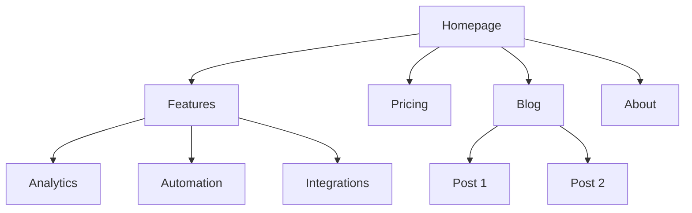
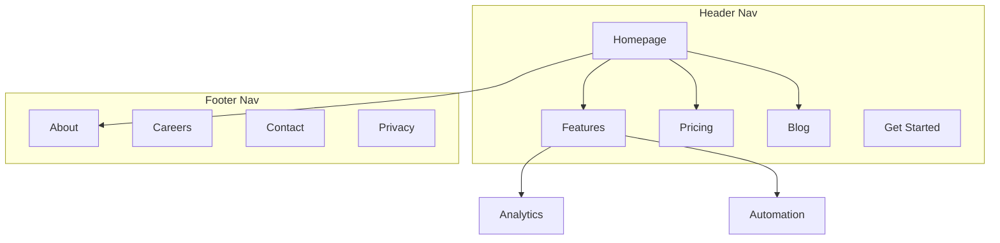
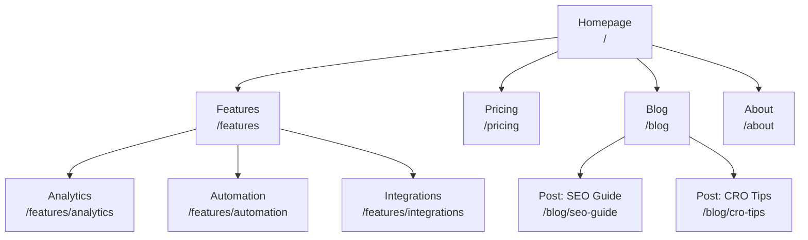
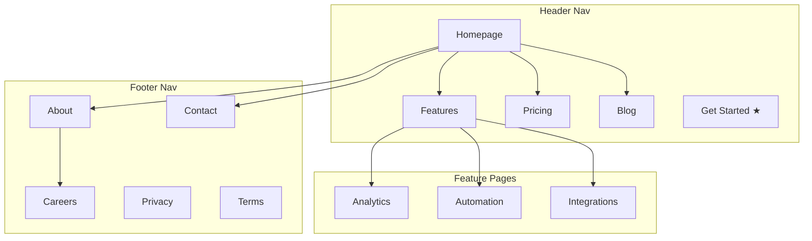
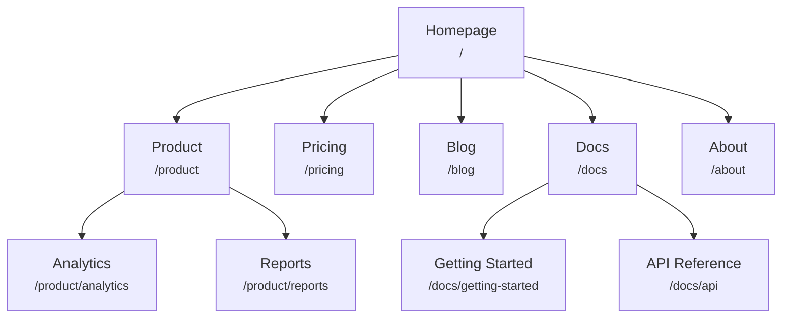
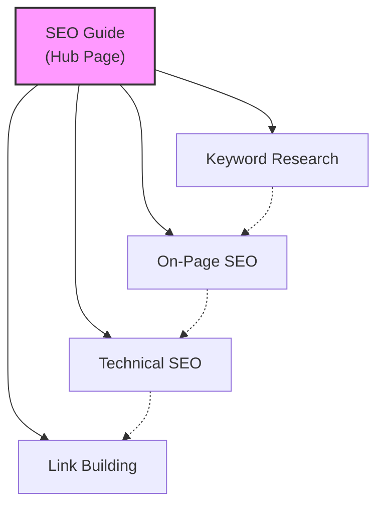
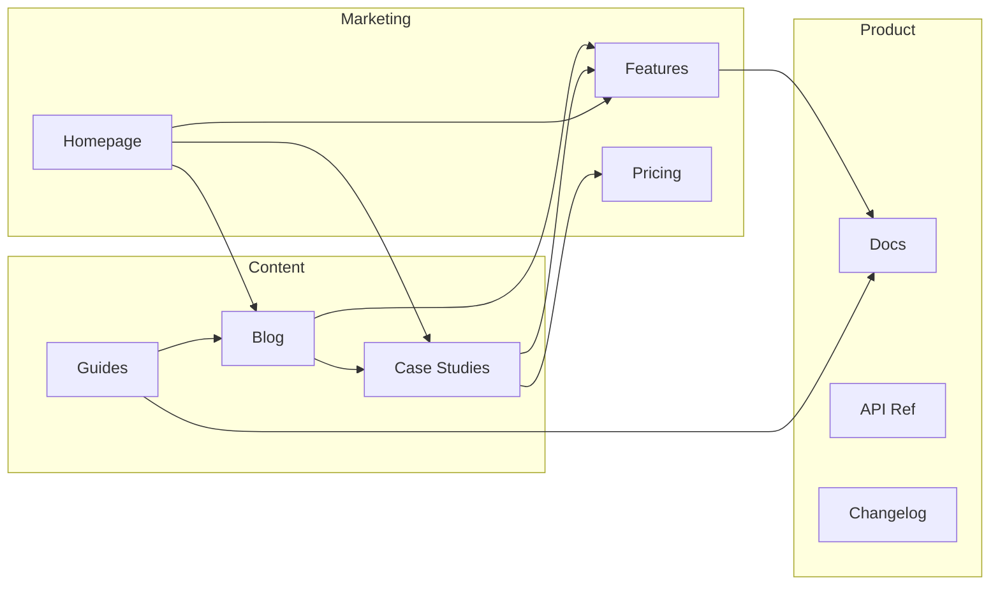
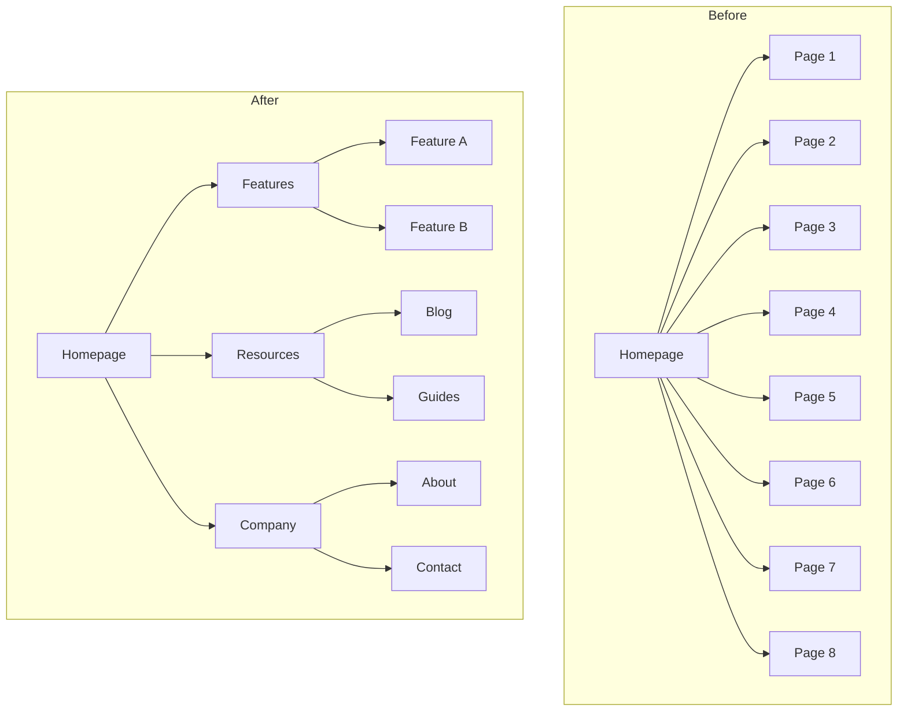
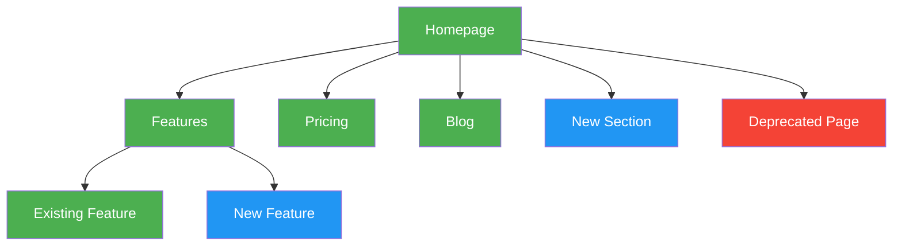

# Corey Haines marketingskills repository snapshot June 2026

Source: https://github.com/coreyhaines31/marketingskills

## Capture Text

# Repository Snapshot

Repository: https://github.com/coreyhaines31/marketingskills
Captured commit: 8bfcdffb655f16e713940cd04fb08891899c47db
Commit date: 2026-06-16T23:35:24-07:00
Commit subject: Merge pull request #378 from coreyhaines31/development
Snapshot note: This is an immutable evidence snapshot of repository metadata, file tree, and complete tracked text file contents at the captured commit. It is not a Git mirror; use the commit hash and upstream URL for full repository reconstruction.

## File Tree
```text
.claude-plugin/marketplace.json
.claude-plugin/plugin.json
.github/FUNDING.yml
.github/ISSUE_TEMPLATE/config.yml
.github/ISSUE_TEMPLATE/skill-request.yml
.github/PULL_REQUEST_TEMPLATE/documentation.md
.github/PULL_REQUEST_TEMPLATE/new-skill.md
.github/PULL_REQUEST_TEMPLATE/skill-update.md
.github/scripts/sync-skills.js
.github/workflows/sync-skills.yml
.github/workflows/validate-skill.yml
.gitignore
AGENTS.md
CLAUDE.md
CONTRIBUTING.md
LICENSE
README.md
VERSIONS.md
skills/ab-testing/SKILL.md
skills/ab-testing/evals/evals.json
skills/ab-testing/references/sample-size-guide.md
skills/ab-testing/references/test-templates.md
skills/ad-creative/SKILL.md
skills/ad-creative/evals/evals.json
skills/ad-creative/references/generative-tools.md
skills/ad-creative/references/platform-specs.md
skills/ads/SKILL.md
skills/ads/evals/evals.json
skills/ads/references/ad-copy-templates.md
skills/ads/references/audience-targeting.md
skills/ads/references/conversion-tracking.md
skills/ads/references/platform-setup-checklists.md
skills/ai-seo/SKILL.md
skills/ai-seo/evals/evals.json
skills/ai-seo/references/content-patterns.md
skills/ai-seo/references/content-types.md
skills/ai-seo/references/okf.md
skills/ai-seo/references/platform-ranking-factors.md
skills/analytics/SKILL.md
skills/analytics/evals/evals.json
skills/analytics/references/event-library.md
skills/analytics/references/ga4-implementation.md
skills/analytics/references/gtm-implementation.md
skills/aso/SKILL.md
skills/aso/evals/evals.json
skills/aso/references/apple-specs.md
skills/aso/references/benchmarks.md
skills/aso/references/google-play-specs.md
skills/aso/references/report-template.md
skills/aso/references/scoring-criteria.md
skills/churn-prevention/SKILL.md
skills/churn-prevention/evals/evals.json
skills/churn-prevention/references/cancel-flow-patterns.md
skills/churn-prevention/references/dunning-playbook.md
skills/co-marketing/SKILL.md
skills/co-marketing/evals/evals.json
skills/cold-email/SKILL.md
skills/cold-email/evals/evals.json
skills/cold-email/references/benchmarks.md
skills/cold-email/references/follow-up-sequences.md
skills/cold-email/references/frameworks.md
skills/cold-email/references/personalization.md
skills/cold-email/references/subject-lines.md
skills/community-marketing/SKILL.md
skills/community-marketing/evals/evals.json
skills/competitor-profiling/SKILL.md
skills/competitor-profiling/evals/evals.json
skills/competitor-profiling/references/templates.md
skills/competitor-profiling/references/tool-reference.md
skills/competitors/SKILL.md
skills/competitors/evals/evals.json
skills/competitors/references/content-architecture.md
skills/competitors/references/templates.md
skills/content-strategy/SKILL.md
skills/content-strategy/evals/evals.json
skills/content-strategy/references/headless-cms.md
skills/copy-editing/SKILL.md
skills/copy-editing/evals/evals.json
skills/copy-editing/references/checklist.md
skills/copy-editing/references/content-refresh.md
skills/copy-editing/references/plain-english-alternatives.md
skills/copywriting/SKILL.md
skills/copywriting/evals/evals.json
skills/copywriting/references/copy-frameworks.md
skills/copywriting/references/natural-transitions.md
skills/cro/SKILL.md
skills/cro/evals/evals.json
skills/cro/references/experiments.md
skills/cro/references/form.md
skills/customer-research/SKILL.md
skills/customer-research/evals/evals.json
skills/customer-research/references/source-guides.md
skills/directory-submissions/SKILL.md
skills/directory-submissions/evals/evals.json
skills/directory-submissions/references/directory-list.md
skills/directory-submissions/references/positioning-variations.md
skills/directory-submissions/references/submission-tracker-template.csv
skills/emails/SKILL.md
skills/emails/evals/evals.json
skills/emails/references/copy-guidelines.md
skills/emails/references/email-types.md
skills/emails/references/sequence-templates.md
skills/free-tools/SKILL.md
skills/free-tools/evals/evals.json
skills/free-tools/references/tool-types.md
skills/image/SKILL.md
skills/image/evals/evals.json
skills/image/references/ai-image-prompting.md
skills/launch/SKILL.md
skills/launch/evals/evals.json
skills/lead-magnets/SKILL.md
skills/lead-magnets/evals/evals.json
skills/lead-magnets/references/benchmarks.md
skills/lead-magnets/references/format-guide.md
skills/marketing-ideas/SKILL.md
skills/marketing-ideas/evals/evals.json
skills/marketing-ideas/references/ideas-by-category.md
skills/marketing-plan/SKILL.md
skills/marketing-plan/evals/evals.json
skills/marketing-plan/references/aarrr-framework.md
skills/marketing-plan/references/budget-planning.md
skills/marketing-plan/references/client-types.md
skills/marketing-plan/references/current-state-rubric.md
skills/marketing-plan/references/example-quietude.md
skills/marketing-plan/references/funding-stage-unlocks.md
skills/marketing-plan/references/growth-patterns.md
skills/marketing-plan/references/idea-cross-reference.md
skills/marketing-plan/references/measurement-framework.md
skills/marketing-plan/references/methodology.md
skills/marketing-plan/references/ops-stack-mapping.md
skills/marketing-plan/references/plan-template.md
skills/marketing-plan/references/team-and-agency-model.md
skills/marketing-psychology/SKILL.md
skills/marketing-psychology/evals/evals.json
skills/offers/SKILL.md
skills/offers/references/bonus-stacking.md
skills/offers/references/examples.md
skills/offers/references/guarantee-design.md
skills/offers/references/offer-anatomy.md
skills/offers/references/offer-formats.md
skills/offers/references/scarcity-urgency.md
skills/offers/references/value-equation.md
skills/onboarding/SKILL.md
skills/onboarding/evals/evals.json
skills/onboarding/references/experiments.md
skills/paywalls/SKILL.md
skills/paywalls/evals/evals.json
skills/paywalls/references/experiments.md
skills/popups/SKILL.md
skills/popups/evals/evals.json
skills/pricing/SKILL.md
skills/pricing/evals/evals.json
skills/pricing/references/research-methods.md
skills/pricing/references/tier-structure.md
skills/product-marketing/SKILL.md
skills/product-marketing/evals/evals.json
skills/programmatic-seo/SKILL.md
skills/programmatic-seo/evals/evals.json
skills/programmatic-seo/references/playbooks.md
skills/prospecting/SKILL.md
skills/prospecting/evals/evals.json
skills/prospecting/references/b2b-prospecting.md
skills/prospecting/references/compliance.md
skills/prospecting/references/data-sources.md
skills/prospecting/references/local-prospecting.md
skills/prospecting/references/saas-prospecting.md
skills/public-relations/SKILL.md
skills/public-relations/references/journalist-pitching.md
skills/public-relations/references/media-outlets.md
skills/public-relations/references/newsjacking.md
skills/public-relations/references/press-platforms.md
skills/referrals/SKILL.md
skills/referrals/evals/evals.json
skills/referrals/references/affiliate-programs.md
skills/referrals/references/program-examples.md
skills/revops/SKILL.md
skills/revops/evals/evals.json
skills/revops/references/automation-playbooks.md
skills/revops/references/lifecycle-definitions.md
skills/revops/references/routing-rules.md
skills/revops/references/scoring-models.md
skills/sales-enablement/SKILL.md
skills/sales-enablement/evals/evals.json
skills/sales-enablement/references/deck-frameworks.md
skills/sales-enablement/references/demo-scripts.md
skills/sales-enablement/references/objection-library.md
skills/sales-enablement/references/one-pager-templates.md
skills/schema/SKILL.md
skills/schema/evals/evals.json
skills/schema/references/schema-examples.md
skills/seo-audit/SKILL.md
skills/seo-audit/evals/evals.json
skills/seo-audit/references/ai-writing-detection.md
skills/seo-audit/references/international-seo.md
skills/signup/SKILL.md
skills/signup/evals/evals.json
skills/site-architecture/SKILL.md
skills/site-architecture/evals/evals.json
skills/site-architecture/references/mermaid-templates.md
skills/site-architecture/references/navigation-patterns.md
skills/site-architecture/references/site-type-templates.md
skills/sms/SKILL.md
skills/sms/evals/evals.json
skills/sms/references/compliance.md
skills/sms/references/platforms.md
skills/sms/references/sequence-templates.md
skills/social/SKILL.md
skills/social/evals/evals.json
skills/social/references/listening-sources-template.md
skills/social/references/listening.md
skills/social/references/platform-limits.md
skills/social/references/platforms.md
skills/social/references/post-templates.md
skills/social/references/reverse-engineering.md
skills/social/references/short-form-video.md
skills/video/SKILL.md
skills/video/evals/evals.json
skills/video/references/ai-video-prompting.md
tools/REGISTRY.md
tools/clis/README.md
tools/clis/activecampaign.js
tools/clis/adobe-analytics.js
tools/clis/ahrefs.js
tools/clis/airops.js
tools/clis/amplitude.js
tools/clis/apollo.js
tools/clis/beehiiv.js
tools/clis/brevo.js
tools/clis/buffer.js
tools/clis/calendly.js
tools/clis/clay.js
tools/clis/clearbit.js
tools/clis/close.js
tools/clis/coupler.js
tools/clis/crossbeam.js
tools/clis/customer-io.js
tools/clis/dataforseo.js
tools/clis/demio.js
tools/clis/dub.js
tools/clis/exa.js
tools/clis/g2.js
tools/clis/ga4.js
tools/clis/github-prospects.js
tools/clis/google-ads.js
tools/clis/google-search-console.js
tools/clis/hotjar.js
tools/clis/hunter.js
tools/clis/instantly.js
tools/clis/intercom.js
tools/clis/keywords-everywhere.js
tools/clis/kit.js
tools/clis/klaviyo.js
tools/clis/lemlist.js
tools/clis/linkedin-ads.js
tools/clis/livestorm.js
tools/clis/mailchimp.js
tools/clis/mention-me.js
tools/clis/meta-ads.js
tools/clis/mixpanel.js
tools/clis/onesignal.js
tools/clis/optimizely.js
tools/clis/outreach.js
tools/clis/paddle.js
tools/clis/partnerstack.js
tools/clis/pendo.js
tools/clis/plausible.js
tools/clis/postmark.js
tools/clis/rankparse.js
tools/clis/resend.js
tools/clis/rewardful.js
tools/clis/savvycal.js
tools/clis/segment.js
tools/clis/semrush.js
tools/clis/sendgrid.js
tools/clis/similarweb.js
tools/clis/snov.js
tools/clis/supermetrics.js
tools/clis/tiktok-ads.js
tools/clis/tolt.js
tools/clis/trustpilot.js
tools/clis/typeform.js
tools/clis/wistia.js
tools/clis/zapier.js
tools/clis/zoominfo.js
tools/composio/README.md
tools/composio/marketing-tools.md
tools/integrations/activecampaign.md
tools/integrations/adobe-analytics.md
tools/integrations/ahrefs.md
tools/integrations/airops.md
tools/integrations/amplitude.md
tools/integrations/apollo.md
tools/integrations/attentive.md
tools/integrations/audiencetap.md
tools/integrations/beehiiv.md
tools/integrations/brevo.md
tools/integrations/browserbase.md
tools/integrations/buffer.md
tools/integrations/calendly.md
tools/integrations/clay.md
tools/integrations/clearbit.md
tools/integrations/close.md
tools/integrations/cogny.md
tools/integrations/composio.md
tools/integrations/contentful.md
tools/integrations/coupler.md
tools/integrations/crossbeam.md
tools/integrations/customer-io.md
tools/integrations/dataforseo.md
tools/integrations/demio.md
tools/integrations/dub-co.md
tools/integrations/exa.md
tools/integrations/firecrawl.md
tools/integrations/firehose.md
tools/integrations/g2.md
tools/integrations/ga4.md
tools/integrations/github.md
tools/integrations/gong.md
tools/integrations/google-ads.md
tools/integrations/google-search-console.md
tools/integrations/heygen.md
tools/integrations/hotjar.md
tools/integrations/hubspot.md
tools/integrations/hunter.md
tools/integrations/hyperframes.md
tools/integrations/instantly.md
tools/integrations/intercom.md
tools/integrations/introw.md
tools/integrations/keywords-everywhere.md
tools/integrations/kit.md
tools/integrations/klaviyo.md
tools/integrations/lemlist.md
tools/integrations/linkedin-ads.md
tools/integrations/livestorm.md
tools/integrations/mailchimp.md
tools/integrations/mention-me.md
tools/integrations/meta-ads.md
tools/integrations/mixpanel.md
tools/integrations/nitrosend.md
tools/integrations/onesignal.md
tools/integrations/optimizely.md
tools/integrations/outreach.md
tools/integrations/paddle.md
tools/integrations/partnerstack.md
tools/integrations/pendo.md
tools/integrations/plausible.md
tools/integrations/plivo.md
tools/integrations/posthog.md
tools/integrations/postmark.md
tools/integrations/postscript.md
tools/integrations/rankparse.md
tools/integrations/rb2b.md
tools/integrations/resend.md
tools/integrations/rewardful.md
tools/integrations/salesforce.md
tools/integrations/sanity.md
tools/integrations/savvycal.md
tools/integrations/segment.md
tools/integrations/semrush.md
tools/integrations/sendgrid.md
tools/integrations/sequenzy.md
tools/integrations/shopify.md
tools/integrations/similarweb.md
tools/integrations/snov.md
tools/integrations/sparktoro.md
tools/integrations/strapi.md
tools/integrations/stripe.md
tools/integrations/supermetrics.md
tools/integrations/tiktok-ads.md
tools/integrations/tolt.md
tools/integrations/truelist.md
tools/integrations/trustpilot.md
tools/integrations/twilio.md
tools/integrations/typeform.md
tools/integrations/webflow.md
tools/integrations/wistia.md
tools/integrations/wordpress.md
tools/integrations/zapier.md
tools/integrations/zoominfo.md
validate-skills-official.sh
validate-skills.sh
```

## File Contents

### .claude-plugin/marketplace.json

````json
{
  "name": "marketingskills",
  "owner": {
    "name": "Corey Haines",
    "url": "https://corey.co"
  },
  "metadata": {
    "description": "Marketing skills for AI agents — conversion optimization, copywriting, SEO, paid ads, and growth",
    "version": "2.5.1",
    "repository": "https://github.com/coreyhaines31/marketingskills"
  },
  "plugins": [
    {
      "name": "marketing-skills",
      "description": "45 marketing skills for technical marketers and founders: CRO, copywriting, cold email, prospecting, SEO, AI SEO, paid ads, SMS, ad creative, video production, image generation, co-marketing, churn prevention, pricing, referrals, revenue operations, sales enablement, customer research, site architecture, comprehensive AARRR-structured marketing plans, public relations and earned media, offer design, and more",
      "source": "./"
    }
  ]
}
````

### .claude-plugin/plugin.json

````json
{
  "name": "marketing-skills",
  "description": "Marketing skills for AI agents — conversion optimization, copywriting, SEO, paid ads, ad creative, and growth",
  "version": "2.5.1",
  "author": {
    "name": "Corey Haines"
  },
  "homepage": "https://github.com/coreyhaines31/marketingskills",
  "repository": "https://github.com/coreyhaines31/marketingskills",
  "license": "MIT",
  "skills": "./skills"
}
````

### .github/FUNDING.yml

````yaml
# These are supported funding model platforms

github: coreyhaines31
buy_me_a_coffee: coreyhaines
````

### .github/ISSUE_TEMPLATE/config.yml

````yaml
blank_issues_enabled: false
contact_links:
  - name: Agent Skills Specification
    url: https://agentskills.io/specification.md
    about: Learn the skill format before creating or requesting a skill
  - name: Contributing Guide
    url: https://github.com/coreyhaines31/marketingskills/blob/main/CONTRIBUTING.md
    about: How to contribute a new skill to this repository
````

### .github/ISSUE_TEMPLATE/skill-request.yml

````yaml
name: Skill Request
description: Request a new marketing skill
title: "Skill Request: [skill-name]"
labels: ["enhancement"]
body:
  - type: markdown
    attributes:
      value: |
        Thanks for suggesting a new skill! Please fill out the details below.

  - type: input
    id: skill-name
    attributes:
      label: Suggested skill name
      description: Lowercase, hyphens only (e.g., "landing-page-audit")
      placeholder: "my-skill-name"
    validations:
      required: true

  - type: textarea
    id: description
    attributes:
      label: What should this skill do?
      description: Describe the skill's purpose and capabilities
      placeholder: "This skill should help with..."
    validations:
      required: true

  - type: textarea
    id: triggers
    attributes:
      label: When should it be used?
      description: What trigger phrases or scenarios should activate this skill?
      placeholder: |
        - When the user says "..."
        - When working on...
    validations:
      required: true

  - type: textarea
    id: examples
    attributes:
      label: Example use cases
      description: Provide 1-3 specific examples of how you'd use this skill
      placeholder: |
        1. I want to...
        2. Help me...
    validations:
      required: false

  - type: dropdown
    id: category
    attributes:
      label: Category
      description: Which category does this skill fit into?
      options:
        - CRO (Conversion Rate Optimization)
        - Copywriting
        - SEO
        - Paid Ads
        - Growth / Strategy
        - Analytics
        - Other
    validations:
      required: true

  - type: textarea
    id: related-skills
    attributes:
      label: Related existing skills
      description: Are there existing skills this relates to or differs from?
      placeholder: "Similar to cro but focused on..."
    validations:
      required: false
````

### .github/PULL_REQUEST_TEMPLATE/documentation.md

````markdown
## Documentation

## Summary

<!-- What documentation changes are you making? -->

## Files changed

<!-- List the files you're updating -->

## Checklist

- [ ] Links are valid
- [ ] Formatting is consistent with existing docs
- [ ] No sensitive data or credentials
````

### .github/PULL_REQUEST_TEMPLATE/new-skill.md

````markdown
## New Skill

**Skill name:** `skills/SKILL-NAME`

## Summary

<!-- What does this skill do and when should it be used? -->

## Checklist

- [ ] `name` matches directory name exactly
- [ ] `name` follows naming rules (lowercase, hyphens, no `--`)
- [ ] `description` is 1-1024 chars with trigger phrases
- [ ] `SKILL.md` is under 500 lines
- [ ] No sensitive data or credentials
- [ ] Tested locally with AI agent
````

### .github/PULL_REQUEST_TEMPLATE/skill-update.md

````markdown
## Skill Update

**Skill:** `skills/SKILL-NAME`

## Summary

<!-- What changes are you making and why? -->

## Type of update

- [ ] Bug fix
- [ ] Improved instructions
- [ ] Added references/scripts
- [ ] Other

## Checklist

- [ ] Changes are focused and minimal
- [ ] `SKILL.md` is still under 500 lines
- [ ] No sensitive data or credentials
- [ ] Tested locally with AI agent
````

### .github/scripts/sync-skills.js

````javascript
#!/usr/bin/env node
/**
 * Sync marketplace.json and README.md with skills directory.
 *
 * Scans the skills/ directory for valid skills (directories containing SKILL.md)
 * and updates marketplace.json and the README skills table to match.
 */

const fs = require("fs");
const path = require("path");

const SKILLS_DIR = "skills";
const MARKETPLACE_FILE = ".claude-plugin/marketplace.json";
const PLUGIN_FILE = ".claude-plugin/plugin.json";
const README_FILE = "README.md";

/**
 * Parse YAML frontmatter from a SKILL.md file
 */
function parseFrontmatter(content) {
  const match = content.match(/^---\n([\s\S]*?)\n---/);
  if (!match) return {};

  const frontmatter = {};
  const lines = match[1].split("\n");

  for (const line of lines) {
    const colonIndex = line.indexOf(":");
    if (colonIndex === -1) continue;

    const key = line.slice(0, colonIndex).trim();
    let value = line.slice(colonIndex + 1).trim();

    // Remove quotes if present
    if ((value.startsWith('"') && value.endsWith('"')) ||
        (value.startsWith("'") && value.endsWith("'"))) {
      value = value.slice(1, -1);
    }

    frontmatter[key] = value;
  }

  return frontmatter;
}

/**
 * Get all skills with their metadata
 */
function getSkillsWithMetadata() {
  if (!fs.existsSync(SKILLS_DIR)) {
    return [];
  }

  return fs
    .readdirSync(SKILLS_DIR, { withFileTypes: true })
    .filter((entry) => {
      if (!entry.isDirectory()) return false;
      const skillFile = path.join(SKILLS_DIR, entry.name, "SKILL.md");
      return fs.existsSync(skillFile);
    })
    .map((entry) => {
      const skillFile = path.join(SKILLS_DIR, entry.name, "SKILL.md");
      const content = fs.readFileSync(skillFile, "utf8");
      const frontmatter = parseFrontmatter(content);

      return {
        dir: entry.name,
        path: `./${SKILLS_DIR}/${entry.name}`,
        name: frontmatter.name || entry.name,
        description: frontmatter.description || "",
      };
    })
    .sort((a, b) => a.name.localeCompare(b.name));
}

/**
 * Update skill count in description
 */
function updateSkillCount(description, count) {
  return description.replace(/\d+ marketing skills/, `${count} marketing skills`);
}

/**
 * Truncate description to a maximum length
 */
function truncateDescription(description, maxLength = 120) {
  if (description.length <= maxLength) return description;

  // Find last space before maxLength to avoid cutting words
  const truncated = description.slice(0, maxLength);
  const lastSpace = truncated.lastIndexOf(" ");

  return truncated.slice(0, lastSpace) + "...";
}

/**
 * Generate the skills table for README
 */
function generateSkillsTable(skills) {
  const header = "| Skill | Description |\n|-------|-------------|";
  const rows = skills.map((skill) => {
    const link = `[${skill.name}](skills/${skill.dir}/)`;
    const description = truncateDescription(skill.description);
    return `| ${link} | ${description} |`;
  });

  return [header, ...rows].join("\n");
}

/**
 * Update README.md with new skills table
 */
function updateReadme(skills) {
  const content = fs.readFileSync(README_FILE, "utf8");

  // Match content between skill list markers
  const tableRegex = /(<!-- SKILLS:START -->\n)[\s\S]*?(\n<!-- SKILLS:END -->)/;
  const newTable = generateSkillsTable(skills);

  if (!tableRegex.test(content)) {
    console.log("WARNING: Could not find skill markers in README.md");
    return false;
  }

  const newContent = content.replace(tableRegex, `$1${newTable}$2`);

  if (newContent === content) {
    return false;
  }

  fs.writeFileSync(README_FILE, newContent);
  return true;
}

/**
 * Update marketplace.json — refresh the skill count in the plugin description
 * and strip any `skills` array if present. Claude Code's plugin schema discovers
 * skills via the `skills/` directory; the explicit array fails validation, so
 * this script must never (re-)introduce it.
 */
function updateMarketplace(skills) {
  const marketplace = JSON.parse(fs.readFileSync(MARKETPLACE_FILE, "utf8"));
  const plugin = marketplace.plugins[0];

  const oldDescription = plugin.description;
  const newDescription = updateSkillCount(plugin.description, skills.length);
  const hadStaleSkillsArray = "skills" in plugin;

  if (newDescription === oldDescription && !hadStaleSkillsArray) {
    return { updated: false };
  }

  plugin.description = newDescription;
  delete plugin.skills;

  fs.writeFileSync(MARKETPLACE_FILE, JSON.stringify(marketplace, null, 2) + "\n");

  return { updated: true, removedSkillsArray: hadStaleSkillsArray };
}

/**
 * Update plugin.json's `version` field to match marketplace.json's
 * `metadata.version`. Claude Code uses plugin.json's version for the update
 * check (`claude plugin update`); if it drifts from marketplace.json the
 * update path silently breaks.
 */
function updatePluginVersion() {
  if (!fs.existsSync(PLUGIN_FILE)) return { updated: false };

  const marketplace = JSON.parse(fs.readFileSync(MARKETPLACE_FILE, "utf8"));
  const plugin = JSON.parse(fs.readFileSync(PLUGIN_FILE, "utf8"));
  const marketplaceVersion = marketplace.metadata && marketplace.metadata.version;

  if (!marketplaceVersion) return { updated: false };
  if (plugin.version === marketplaceVersion) return { updated: false };

  const oldVersion = plugin.version;
  plugin.version = marketplaceVersion;
  fs.writeFileSync(PLUGIN_FILE, JSON.stringify(plugin, null, 2) + "\n");
  return { updated: true, oldVersion, newVersion: marketplaceVersion };
}

function main() {
  const skills = getSkillsWithMetadata();

  const marketplaceResult = updateMarketplace(skills);
  const readmeUpdated = updateReadme(skills);
  const pluginResult = updatePluginVersion();

  if (!marketplaceResult.updated && !readmeUpdated && !pluginResult.updated) {
    console.log("Everything is already in sync");
    return;
  }

  if (marketplaceResult.updated) {
    if (marketplaceResult.removedSkillsArray) {
      console.log("Stripped stale `skills` array from marketplace.json");
    }
    console.log(`Updated marketplace.json (${skills.length} skills)`);
  }

  if (pluginResult.updated) {
    console.log(`Bumped plugin.json version: ${pluginResult.oldVersion} → ${pluginResult.newVersion}`);
  }

  if (readmeUpdated) {
    console.log("Updated README.md skills table");
  }
}

main();
````

### .github/workflows/sync-skills.yml

````yaml
name: Sync Skills

on:
  push:
    branches: [main]
    paths:
      - 'skills/**'
      - '.claude-plugin/marketplace.json'

jobs:
  sync:
    runs-on: ubuntu-slim
    permissions:
      contents: write

    steps:
      - name: Checkout repository
        uses: actions/checkout@v6
        with:
          persist-credentials: true

      - name: Sync skills
        run: node .github/scripts/sync-skills.js

      - name: Commit changes
        uses: stefanzweifel/git-auto-commit-action@v7
        with:
          commit_user_name: Coreybot
          commit_user_email: coreybot+github-actions[bot]@users.noreply.github.com
          commit_message: "chore: sync skills with marketplace.json, plugin.json, and README"
          file_pattern: ".claude-plugin/marketplace.json .claude-plugin/plugin.json README.md"
````

### .github/workflows/validate-skill.yml

````yaml
name: Validate Agent Skill

on:
  push:
    branches: [main]
    paths:
      - "**/SKILL.md"
  pull_request:
    branches: [main]
    paths:
      - "**/SKILL.md"

concurrency:
  group: validate-skill-${{ github.ref }}
  cancel-in-progress: true

jobs:
  detect-changes:
    runs-on: ubuntu-slim
    if: github.event.pull_request.draft != true && github.actor != 'dependabot[bot]'
    outputs:
      skills: ${{ steps.changed-skills.outputs.skills }}
    steps:
      - name: Checkout repository
        uses: actions/checkout@v6
        with:
          fetch-depth: 0

      - name: Get changed skills
        id: changed-skills
        run: |
          if [ "${{ github.event_name }}" = "pull_request" ]; then
            BASE=${{ github.event.pull_request.base.sha }}
            HEAD=${{ github.event.pull_request.head.sha }}
          else
            BASE=${{ github.event.before }}
            HEAD=${{ github.event.after }}
          fi

          # Find changed SKILL.md files and extract skill directories
          SKILLS=$(git diff --name-only $BASE $HEAD | \
            grep 'SKILL.md$' | \
            xargs -I {} dirname {} | \
            sort -u | \
            jq -R -s -c 'split("\n") | map(select(length > 0))')

          echo "skills=$SKILLS" >> $GITHUB_OUTPUT
          echo "Changed skills: $SKILLS"

  validate:
    needs: detect-changes
    if: needs.detect-changes.outputs.skills != '[]'
    runs-on: ubuntu-slim
    strategy:
      fail-fast: false
      matrix:
        skill: ${{ fromJson(needs.detect-changes.outputs.skills) }}
    steps:
      - name: Checkout repository
        uses: actions/checkout@v6

      - name: Validate ${{ matrix.skill }}
        uses: Flash-Brew-Digital/validate-skill@v1
        with:
          path: ${{ matrix.skill }}
````

### .gitignore

````text
# Dependencies
node_modules/

# Skill install artifacts (npx skills add)
.agents/
.claude/
skills-lock.json

# Environment variables / secrets
.env
.env.*
!.env.example

# macOS
.DS_Store
**/.DS_Store

# macOS / iCloud duplicate files
* 2.*
* 2/

# Remotion video project (root only, not skills/video/)
/video/

# Editor
*.swp
*.swo
*~
.idea/
.vscode/
````

### AGENTS.md

````markdown
# AGENTS.md

Guidelines for AI agents working in this repository.

## Repository Overview

This repository contains **Agent Skills** for AI agents following the [Agent Skills specification](https://agentskills.io/specification.md). Skills install to `.agents/skills/` (the cross-agent standard). This repo also serves as a **Claude Code plugin marketplace** via `.claude-plugin/marketplace.json`.

- **Name**: Marketing Skills
- **GitHub**: [coreyhaines31/marketingskills](https://github.com/coreyhaines31/marketingskills)
- **Creator**: Corey Haines
- **License**: MIT

## Repository Structure

```
marketingskills/
├── .claude-plugin/
│   └── marketplace.json   # Claude Code plugin marketplace manifest
├── skills/                # Agent Skills
│   └── skill-name/
│       └── SKILL.md       # Required skill file
├── tools/
│   ├── clis/              # Zero-dependency Node.js CLI tools (51 tools)
│   ├── composio/          # Composio integration layer (quick start + toolkit mapping)
│   ├── integrations/      # API integration guides per tool
│   └── REGISTRY.md        # Tool index with capabilities
├── CONTRIBUTING.md
├── LICENSE
└── README.md
```

## Build / Lint / Test Commands

**Skills** are content-only (no build step). Verify manually:
- YAML frontmatter is valid
- `name` field matches directory name exactly
- `name` is 1-64 chars, lowercase alphanumeric and hyphens only
- `description` is 1-1024 characters

**CLI tools** (`tools/clis/*.js`) are zero-dependency Node.js scripts (Node 18+). Verify with:
```bash
node --check tools/clis/<name>.js   # Syntax check
node tools/clis/<name>.js           # Show usage (no args = help)
node tools/clis/<name>.js <cmd> --dry-run  # Preview request without sending
```

## Agent Skills Specification

Skills follow the [Agent Skills spec](https://agentskills.io/specification.md).

### Required Frontmatter

```yaml
---
name: skill-name
description: What this skill does and when to use it. Include trigger phrases.
---
```

### Frontmatter Field Constraints

| Field         | Required | Constraints                                                      |
|---------------|----------|------------------------------------------------------------------|
| `name`        | Yes      | 1-64 chars, lowercase `a-z`, numbers, hyphens. Must match dir.   |
| `description` | Yes      | 1-1024 chars. Describe what it does and when to use it.          |
| `license`     | No       | License name (default: MIT)                                      |
| `metadata`    | No       | Key-value pairs (author, version, etc.)                          |

### Name Field Rules

- Lowercase letters, numbers, and hyphens only
- Cannot start or end with hyphen
- No consecutive hyphens (`--`)
- Must match parent directory name exactly

**Valid**: `cro`, `emails`, `ab-testing`
**Invalid**: `Page-CRO`, `-page`, `page--cro`

### Optional Skill Directories

```
skills/skill-name/
├── SKILL.md        # Required - main instructions (<500 lines)
├── references/     # Optional - detailed docs loaded on demand
├── scripts/        # Optional - executable code
└── assets/         # Optional - templates, data files
```

## Writing Style Guidelines

### Structure

- Keep `SKILL.md` under 500 lines (move details to `references/`)
- Use H2 (`##`) for main sections, H3 (`###`) for subsections
- Use bullet points and numbered lists liberally
- Short paragraphs (2-4 sentences max)

### Tone

- Direct and instructional
- Second person ("You are a conversion rate optimization expert")
- Professional but approachable

### Formatting

- Bold (`**text**`) for key terms
- Code blocks for examples and templates
- Tables for reference data
- No excessive emojis

### Clarity Principles

- Clarity over cleverness
- Specific over vague
- Active voice over passive
- One idea per section

### Description Field Best Practices

The `description` is critical for skill discovery. Include:
1. What the skill does
2. When to use it (trigger phrases)
3. Related skills for scope boundaries

```yaml
description: When the user wants to optimize conversions on any marketing page. Use when the user says "CRO," "conversion rate optimization," "this page isn't converting." For signup flows, see signup.
```

## Claude Code Plugin

This repo also serves as a plugin marketplace. The manifest at `.claude-plugin/marketplace.json` lists all skills for installation via:

```bash
/plugin marketplace add coreyhaines31/marketingskills
/plugin install marketing-skills
```

See [Claude Code plugins documentation](https://code.claude.com/docs/en/plugins.md) for details.

## Git Workflow

### Branch Naming

- New skills: `feature/skill-name`
- Improvements: `fix/skill-name-description`
- Documentation: `docs/description`

### Commit Messages

Follow the [Conventional Commits](https://www.conventionalcommits.org/) specification:

- `feat: add skill-name skill`
- `fix: improve clarity in cro`
- `docs: update README`

### Pull Request Checklist

- [ ] `name` matches directory name exactly
- [ ] `name` follows naming rules (lowercase, hyphens, no `--`)
- [ ] `description` is 1-1024 chars with trigger phrases
- [ ] `SKILL.md` is under 500 lines
- [ ] No sensitive data or credentials

## Tool Integrations

This repository includes a tools registry for agent-compatible marketing tools.

- **Tool discovery**: Read `tools/REGISTRY.md` to see available tools and their capabilities
- **Integration details**: See `tools/integrations/{tool}.md` for API endpoints, auth, and common operations
- **MCP-enabled tools**: ga4, stripe, mailchimp, google-ads, resend, zapier, zoominfo, clay, supermetrics, coupler, outreach, crossbeam, introw, composio
- **Composio** (integration layer): Adds MCP access to OAuth-heavy tools without native MCP servers (HubSpot, Salesforce, Meta Ads, LinkedIn Ads, Google Sheets, Slack, etc.). See `tools/integrations/composio.md`

### Registry Structure

```
tools/
├── REGISTRY.md              # Index of all tools with capabilities
└── integrations/            # Detailed integration guides
    ├── ga4.md
    ├── stripe.md
    ├── rewardful.md
    └── ...
```

### When to Use Tools

Skills reference relevant tools for implementation. For example:
- `referrals` skill → rewardful, tolt, dub-co, mention-me guides
- `analytics` skill → ga4, mixpanel, segment guides
- `emails` skill → customer-io, mailchimp, resend guides
- `ads` skill → google-ads, meta-ads, linkedin-ads guides

For tools without native MCP servers (HubSpot, Salesforce, Meta Ads, LinkedIn Ads, Google Sheets, Slack, Notion), Composio provides MCP access via a single server. See `tools/integrations/composio.md` for setup and `tools/composio/marketing-tools.md` for the full toolkit mapping.

## Checking for Updates

When using any skill from this repository:

1. **Once per session**, on first skill use, check for updates:
   - Fetch `VERSIONS.md` from GitHub: https://raw.githubusercontent.com/coreyhaines31/marketingskills/main/VERSIONS.md
   - Compare versions against local skill files

2. **Only prompt if meaningful**:
   - 2 or more skills have updates, OR
   - Any skill has a major version bump (e.g., 1.x to 2.x)

3. **Non-blocking notification** at end of response:
   ```
   ---
   Skills update available: X marketing skills have updates.
   Say "update skills" to update automatically, or run `git pull` in your marketingskills folder.
   ```

4. **If user says "update skills"**:
   - Run `git pull` in the marketingskills directory
   - Confirm what was updated

## Skill Categories

See `README.md` for the current list of skills organized by category. When adding new skills, follow the naming patterns of existing skills in that category.

## Claude Code-Specific Enhancements

These patterns are **Claude Code only** and must not be added to `SKILL.md` files directly, as skills are designed to be cross-agent compatible (Codex, Cursor, Windsurf, etc.). Apply them locally in your own project's `.claude/skills/` overrides instead.

### Dynamic content injection with `!`command``

Claude Code supports embedding shell commands in SKILL.md using `` !`command` `` syntax. When the skill is invoked, Claude Code runs the command and injects the output inline — the model sees the result, not the instruction.

**Most useful application: auto-inject the product marketing context file**

Instead of every skill telling the agent "go check if `.agents/product-marketing.md` exists and read it," you can inject it automatically:

```markdown
Product context: !`cat .agents/product-marketing.md 2>/dev/null || echo "No product context file found — ask the user about their product before proceeding."`
```

Place this at the top of a skill's body (after frontmatter) to make context available immediately without any file-reading step.

**Other useful injections:**

```markdown
# Inject today's date for recency-sensitive skills
Today's date: !`date +%Y-%m-%d`

# Inject current git branch (useful for workflow skills)
Current branch: !`git branch --show-current 2>/dev/null`

# Inject recent commits for context
Recent commits: !`git log --oneline -5 2>/dev/null`
```

**Why this is Claude Code-only**: Other agents that load skills will see the literal `` !`command` `` string rather than executing it, which would appear as garbled instructions. Keep cross-agent skill files free of this syntax.
````

### CLAUDE.md

````markdown
# AGENTS.md

Guidelines for AI agents working in this repository.

## Repository Overview

This repository contains **Agent Skills** for AI agents following the [Agent Skills specification](https://agentskills.io/specification.md). Skills install to `.agents/skills/` (the cross-agent standard). This repo also serves as a **Claude Code plugin marketplace** via `.claude-plugin/marketplace.json`.

- **Name**: Marketing Skills
- **GitHub**: [coreyhaines31/marketingskills](https://github.com/coreyhaines31/marketingskills)
- **Creator**: Corey Haines
- **License**: MIT

## Repository Structure

```
marketingskills/
├── .claude-plugin/
│   └── marketplace.json   # Claude Code plugin marketplace manifest
├── skills/                # Agent Skills
│   └── skill-name/
│       └── SKILL.md       # Required skill file
├── tools/
│   ├── clis/              # Zero-dependency Node.js CLI tools (51 tools)
│   ├── composio/          # Composio integration layer (quick start + toolkit mapping)
│   ├── integrations/      # API integration guides per tool
│   └── REGISTRY.md        # Tool index with capabilities
├── CONTRIBUTING.md
├── LICENSE
└── README.md
```

## Build / Lint / Test Commands

**Skills** are content-only (no build step). Verify manually:
- YAML frontmatter is valid
- `name` field matches directory name exactly
- `name` is 1-64 chars, lowercase alphanumeric and hyphens only
- `description` is 1-1024 characters

**CLI tools** (`tools/clis/*.js`) are zero-dependency Node.js scripts (Node 18+). Verify with:
```bash
node --check tools/clis/<name>.js   # Syntax check
node tools/clis/<name>.js           # Show usage (no args = help)
node tools/clis/<name>.js <cmd> --dry-run  # Preview request without sending
```

## Agent Skills Specification

Skills follow the [Agent Skills spec](https://agentskills.io/specification.md).

### Required Frontmatter

```yaml
---
name: skill-name
description: What this skill does and when to use it. Include trigger phrases.
---
```

### Frontmatter Field Constraints

| Field         | Required | Constraints                                                      |
|---------------|----------|------------------------------------------------------------------|
| `name`        | Yes      | 1-64 chars, lowercase `a-z`, numbers, hyphens. Must match dir.   |
| `description` | Yes      | 1-1024 chars. Describe what it does and when to use it.          |
| `license`     | No       | License name (default: MIT)                                      |
| `metadata`    | No       | Key-value pairs (author, version, etc.)                          |

### Name Field Rules

- Lowercase letters, numbers, and hyphens only
- Cannot start or end with hyphen
- No consecutive hyphens (`--`)
- Must match parent directory name exactly

**Valid**: `cro`, `emails`, `ab-testing`
**Invalid**: `Page-CRO`, `-page`, `page--cro`

### Optional Skill Directories

```
skills/skill-name/
├── SKILL.md        # Required - main instructions (<500 lines)
├── references/     # Optional - detailed docs loaded on demand
├── scripts/        # Optional - executable code
└── assets/         # Optional - templates, data files
```

## Writing Style Guidelines

### Structure

- Keep `SKILL.md` under 500 lines (move details to `references/`)
- Use H2 (`##`) for main sections, H3 (`###`) for subsections
- Use bullet points and numbered lists liberally
- Short paragraphs (2-4 sentences max)

### Tone

- Direct and instructional
- Second person ("You are a conversion rate optimization expert")
- Professional but approachable

### Formatting

- Bold (`**text**`) for key terms
- Code blocks for examples and templates
- Tables for reference data
- No excessive emojis

### Clarity Principles

- Clarity over cleverness
- Specific over vague
- Active voice over passive
- One idea per section

### Description Field Best Practices

The `description` is critical for skill discovery. Include:
1. What the skill does
2. When to use it (trigger phrases)
3. Related skills for scope boundaries

```yaml
description: When the user wants to optimize conversions on any marketing page. Use when the user says "CRO," "conversion rate optimization," "this page isn't converting." For signup flows, see signup.
```

## Claude Code Plugin

This repo also serves as a plugin marketplace. The manifest at `.claude-plugin/marketplace.json` lists all skills for installation via:

```bash
/plugin marketplace add coreyhaines31/marketingskills
/plugin install marketing-skills
```

See [Claude Code plugins documentation](https://code.claude.com/docs/en/plugins.md) for details.

## Git Workflow

### Branch Naming

- New skills: `feature/skill-name`
- Improvements: `fix/skill-name-description`
- Documentation: `docs/description`

### Commit Messages

Follow the [Conventional Commits](https://www.conventionalcommits.org/) specification:

- `feat: add skill-name skill`
- `fix: improve clarity in cro`
- `docs: update README`

### Pull Request Checklist

- [ ] `name` matches directory name exactly
- [ ] `name` follows naming rules (lowercase, hyphens, no `--`)
- [ ] `description` is 1-1024 chars with trigger phrases
- [ ] `SKILL.md` is under 500 lines
- [ ] No sensitive data or credentials

## Tool Integrations

This repository includes a tools registry for agent-compatible marketing tools.

- **Tool discovery**: Read `tools/REGISTRY.md` to see available tools and their capabilities
- **Integration details**: See `tools/integrations/{tool}.md` for API endpoints, auth, and common operations
- **MCP-enabled tools**: ga4, stripe, mailchimp, google-ads, resend, zapier, zoominfo, clay, supermetrics, coupler, outreach, crossbeam, introw, composio
- **Composio** (integration layer): Adds MCP access to OAuth-heavy tools without native MCP servers (HubSpot, Salesforce, Meta Ads, LinkedIn Ads, Google Sheets, Slack, etc.). See `tools/integrations/composio.md`

### Registry Structure

```
tools/
├── REGISTRY.md              # Index of all tools with capabilities
└── integrations/            # Detailed integration guides
    ├── ga4.md
    ├── stripe.md
    ├── rewardful.md
    └── ...
```

### When to Use Tools

Skills reference relevant tools for implementation. For example:
- `referrals` skill → rewardful, tolt, dub-co, mention-me guides
- `analytics` skill → ga4, mixpanel, segment guides
- `emails` skill → customer-io, mailchimp, resend guides
- `ads` skill → google-ads, meta-ads, linkedin-ads guides

For tools without native MCP servers (HubSpot, Salesforce, Meta Ads, LinkedIn Ads, Google Sheets, Slack, Notion), Composio provides MCP access via a single server. See `tools/integrations/composio.md` for setup and `tools/composio/marketing-tools.md` for the full toolkit mapping.

## Checking for Updates

When using any skill from this repository:

1. **Once per session**, on first skill use, check for updates:
   - Fetch `VERSIONS.md` from GitHub: https://raw.githubusercontent.com/coreyhaines31/marketingskills/main/VERSIONS.md
   - Compare versions against local skill files

2. **Only prompt if meaningful**:
   - 2 or more skills have updates, OR
   - Any skill has a major version bump (e.g., 1.x to 2.x)

3. **Non-blocking notification** at end of response:
   ```
   ---
   Skills update available: X marketing skills have updates.
   Say "update skills" to update automatically, or run `git pull` in your marketingskills folder.
   ```

4. **If user says "update skills"**:
   - Run `git pull` in the marketingskills directory
   - Confirm what was updated

## Skill Categories

See `README.md` for the current list of skills organized by category. When adding new skills, follow the naming patterns of existing skills in that category.

## Claude Code-Specific Enhancements

These patterns are **Claude Code only** and must not be added to `SKILL.md` files directly, as skills are designed to be cross-agent compatible (Codex, Cursor, Windsurf, etc.). Apply them locally in your own project's `.claude/skills/` overrides instead.

### Dynamic content injection with `!`command``

Claude Code supports embedding shell commands in SKILL.md using `` !`command` `` syntax. When the skill is invoked, Claude Code runs the command and injects the output inline — the model sees the result, not the instruction.

**Most useful application: auto-inject the product marketing context file**

Instead of every skill telling the agent "go check if `.agents/product-marketing.md` exists and read it," you can inject it automatically:

```markdown
Product context: !`cat .agents/product-marketing.md 2>/dev/null || echo "No product context file found — ask the user about their product before proceeding."`
```

Place this at the top of a skill's body (after frontmatter) to make context available immediately without any file-reading step.

**Other useful injections:**

```markdown
# Inject today's date for recency-sensitive skills
Today's date: !`date +%Y-%m-%d`

# Inject current git branch (useful for workflow skills)
Current branch: !`git branch --show-current 2>/dev/null`

# Inject recent commits for context
Recent commits: !`git log --oneline -5 2>/dev/null`
```

**Why this is Claude Code-only**: Other agents that load skills will see the literal `` !`command` `` string rather than executing it, which would appear as garbled instructions. Keep cross-agent skill files free of this syntax.
````

### CONTRIBUTING.md

````markdown
# Contributing

Thanks for your interest in contributing to Marketing Skills! This guide will help you add new skills or improve existing ones.

## Requesting a Skill

You can also suggest new skills by [opening a skill request](https://github.com/coreyhaines31/marketingskills/issues/new?template=skill-request.yml).

## Adding a New Skill

### 1. Create the skill directory

```bash
mkdir -p skills/your-skill-name
```

### 2. Create the SKILL.md file

Every skill needs a `SKILL.md` file with YAML frontmatter:

```yaml
---
name: your-skill-name
description: When to use this skill. Include trigger phrases and keywords that help agents identify relevant tasks.
---

# Your Skill Name

Instructions for the agent go here...
```

Optional frontmatter fields: `license` (default: MIT), `metadata` (author, version, etc.)

### 3. Follow the naming conventions

- **Directory name**: lowercase, hyphens only (e.g., `emails`)
- **Name field**: must match directory name exactly
- **Description**: 1-1024 characters, include trigger phrases

### 4. Structure your skill

```
skills/your-skill-name/
├── SKILL.md           # Required - main instructions
├── references/        # Optional - additional documentation
│   └── guide.md
├── scripts/           # Optional - executable code
│   └── helper.py
└── assets/            # Optional - templates, images, data
    └── template.json
```

### 5. Write effective instructions

- Keep `SKILL.md` under 500 lines
- Move detailed reference material to `references/`
- Include step-by-step instructions
- Add examples of inputs and outputs
- Cover common edge cases

## Improving Existing Skills

1. Read the existing skill thoroughly
2. Test your changes locally
3. Keep changes focused and minimal
4. Update the version in metadata if making significant changes

## Submitting Your Contribution

1. Fork the repository
2. Create a feature branch (`git checkout -b feature/new-skill-name`)
3. Make your changes
4. Test locally with an AI agent
5. Submit a pull request using the appropriate template:
   - [New Skill](?template=new-skill.md)
   - [Skill Update](?template=skill-update.md)
   - [Documentation](?template=documentation.md)

## Skill Quality Checklist

- [ ] `name` matches directory name
- [ ] `description` clearly explains when to use the skill
- [ ] Instructions are clear and actionable
- [ ] No sensitive data or credentials
- [ ] Follows existing skill patterns in the repo

## Questions?

Open an issue if you have questions or need help with your contribution.
````

### LICENSE

````text
MIT License

Copyright (c) 2025 Corey Haines

Permission is hereby granted, free of charge, to any person obtaining a copy
of this software and associated documentation files (the "Software"), to deal
in the Software without restriction, including without limitation the rights
to use, copy, modify, merge, publish, distribute, sublicense, and/or sell
copies of the Software, and to permit persons to whom the Software is
furnished to do so, subject to the following conditions:

The above copyright notice and this permission notice shall be included in all
copies or substantial portions of the Software.

THE SOFTWARE IS PROVIDED "AS IS", WITHOUT WARRANTY OF ANY KIND, EXPRESS OR
IMPLIED, INCLUDING BUT NOT LIMITED TO THE WARRANTIES OF MERCHANTABILITY,
FITNESS FOR A PARTICULAR PURPOSE AND NONINFRINGEMENT. IN NO EVENT SHALL THE
AUTHORS OR COPYRIGHT HOLDERS BE LIABLE FOR ANY CLAIM, DAMAGES OR OTHER
LIABILITY, WHETHER IN AN ACTION OF CONTRACT, TORT OR OTHERWISE, ARISING FROM,
OUT OF OR IN CONNECTION WITH THE SOFTWARE OR THE USE OR OTHER DEALINGS IN THE
SOFTWARE.
````

### README.md

````markdown
# Marketing Skills for AI Agents

A collection of AI agent skills focused on marketing tasks. Built for technical marketers and founders who want AI coding agents to help with conversion optimization, copywriting, SEO, analytics, and growth engineering. Works with Claude Code, OpenAI Codex, Cursor, Windsurf, and any agent that supports the [Agent Skills spec](https://agentskills.io).

Built by [Corey Haines](https://corey.co?ref=marketingskills). Need hands-on help? Check out [Conversion Factory](https://conversionfactory.co?ref=marketingskills) — Corey's agency for conversion optimization, landing pages, and growth strategy. Want to learn more about marketing? Subscribe to [Swipe Files](https://swipefiles.com?ref=marketingskills). Want to get dangerously good at using AI for marketing? Check out [AI Marketing Training](https://conversionfactory.co/offers/ai-marketing-training?ref=marketingskills). Want an autonomous AI agent that uses these skills to be your CMO? Try [Magister](https://magistermarketing.com?ref=marketingskills).

New to the terminal and coding agents? Check out the companion guide [Coding for Marketers](https://codingformarketers.com?ref=marketingskills).

**Contributions welcome!** Found a way to improve a skill or have a new one to add? [Open a PR](#contributing).

Run into a problem or have a question? [Open an issue](https://github.com/coreyhaines31/marketingskills/issues) — we're happy to help.

## What are Skills?

Skills are markdown files that give AI agents specialized knowledge and workflows for specific tasks. When you add these to your project, your agent can recognize when you're working on a marketing task and apply the right frameworks and best practices.

## How Skills Work Together

Skills reference each other and build on shared context. The `product-marketing` skill is the foundation — every other skill checks it first to understand your product, audience, and positioning before doing anything.

```
                            ┌──────────────────────────────────────┐
                            │          product-marketing           │
                            │    (read by all other skills first)  │
                            └──────────────────┬───────────────────┘
                                               │
    ┌──────────────┬─────────────┬─────────────┼─────────────┬──────────────┬──────────────┐
    ▼              ▼             ▼             ▼             ▼              ▼              ▼
┌──────────┐ ┌──────────┐ ┌──────────┐ ┌────────────┐ ┌──────────┐ ┌─────────────┐ ┌───────────┐
│  SEO &   │ │   CRO    │ │Content & │ │  Paid &    │ │ Growth & │ │  Sales &    │ │ Strategy  │
│ Content  │ │          │ │   Copy   │ │Measurement │ │Retention │ │    GTM      │ │           │
├──────────┤ ├──────────┤ ├──────────┤ ├────────────┤ ├──────────┤ ├─────────────┤ ├───────────┤
│seo-audit │ │cro       │ │copywritng│ │ads         │ │referrals │ │revops       │ │mktg-ideas │
│ai-seo    │ │signup    │ │copy-edit │ │ad-creative │ │free-tools│ │sales-enable │ │mktg-psych │
│site-arch │ │onboarding│ │cold-email│ │ab-testing  │ │churn-    │ │launch       │ │customer-  │
│programm  │ │popups    │ │emails    │ │analytics   │ │ prevent  │ │pricing      │ │ research  │
│schema    │ │paywalls  │ │social    │ │            │ │community │ │competitors  │ │           │
│content   │ │          │ │video     │ │            │ │lead-magnt│ │comp-profile │ │           │
│aso       │ │          │ │image     │ │            │ │co-mktg   │ │directory    │ │           │
│          │ │          │ │sms       │ │            │ │          │ │prospecting  │ │           │
└────┬─────┘ └────┬─────┘ └────┬─────┘ └─────┬──────┘ └────┬─────┘ └──────┬──────┘ └─────┬─────┘
     │            │            │              │             │              │              │
     └────────────┴─────┬──────┴──────────────┴─────────────┴──────────────┴──────────────┘
                        │
         Skills cross-reference each other:
           copywriting ↔ cro ↔ ab-testing
           revops ↔ sales-enablement ↔ cold-email
           seo-audit ↔ schema ↔ ai-seo
           customer-research → copywriting, cro, competitors
```

See each skill's **Related Skills** section for the full dependency map.

## Available Skills

<!-- SKILLS:START -->
| Skill | Description |
|-------|-------------|
| [ab-testing](skills/ab-testing/) | When the user wants to plan, design, or implement an A/B test or experiment, or build a growth experimentation program.... |
| [ad-creative](skills/ad-creative/) | When the user wants to generate, iterate, or scale ad creative — headlines, descriptions, primary text, or full ad... |
| [ads](skills/ads/) | When the user wants help with paid advertising campaigns on Google Ads, Meta (Facebook/Instagram), LinkedIn, Twitter/X,... |
| [ai-seo](skills/ai-seo/) | When the user wants to optimize content for AI search engines, get cited by LLMs, or appear in AI-generated answers.... |
| [analytics](skills/analytics/) | When the user wants to set up, improve, or audit analytics tracking and measurement. Also use when the user mentions... |
| [aso](skills/aso/) | When the user wants to audit or optimize an App Store or Google Play listing. Also use when the user mentions 'ASO... |
| [churn-prevention](skills/churn-prevention/) | When the user wants to reduce churn, build cancellation flows, set up save offers, recover failed payments, or... |
| [co-marketing](skills/co-marketing/) | When the user wants to find co-marketing partners, plan joint campaigns, or brainstorm partnership opportunities. Use... |
| [cold-email](skills/cold-email/) | Write B2B cold emails and follow-up sequences that get replies. Use when the user wants to write cold outreach emails,... |
| [community-marketing](skills/community-marketing/) | Build and leverage online communities to drive product growth and brand loyalty. Use when the user wants to create a... |
| [competitor-profiling](skills/competitor-profiling/) | When the user wants to research, profile, or analyze competitors from their URLs. Also use when the user mentions... |
| [competitors](skills/competitors/) | When the user wants to create competitor comparison or alternative pages for SEO and sales enablement. Also use when... |
| [content-strategy](skills/content-strategy/) | When the user wants to plan a content strategy, decide what content to create, or figure out what topics to cover. Also... |
| [copy-editing](skills/copy-editing/) | When the user wants to edit, review, or improve existing marketing copy, or refresh outdated content. Also use when the... |
| [copywriting](skills/copywriting/) | When the user wants to write, rewrite, or improve marketing copy for any page — including homepage, landing pages,... |
| [cro](skills/cro/) | When the user wants to optimize, improve, or increase conversions on any marketing page or form — including homepage,... |
| [customer-research](skills/customer-research/) | When the user wants to conduct, analyze, or synthesize customer research. Use when the user mentions "customer... |
| [directory-submissions](skills/directory-submissions/) | When the user wants to submit their product to startup, SaaS, AI, agent, MCP, no-code, or review directories for... |
| [emails](skills/emails/) | When the user wants to create or optimize an email sequence, drip campaign, automated email flow, or lifecycle email... |
| [free-tools](skills/free-tools/) | When the user wants to plan, evaluate, or build a free tool for marketing purposes — lead generation, SEO value, or... |
| [image](skills/image/) | When the user wants to create, generate, edit, or optimize images for marketing — blog heroes, social graphics, product... |
| [launch](skills/launch/) | When the user wants to plan a product launch, feature announcement, or release strategy. Also use when the user... |
| [lead-magnets](skills/lead-magnets/) | When the user wants to create, plan, or optimize a lead magnet for email capture or lead generation. Also use when the... |
| [marketing-ideas](skills/marketing-ideas/) | When the user needs marketing ideas, inspiration, or strategies for their SaaS or software product. Also use when the... |
| [marketing-plan](skills/marketing-plan/) | When the user needs a comprehensive marketing plan for a client, a company they advise, or their own product. Also use... |
| [marketing-psychology](skills/marketing-psychology/) | When the user wants to apply psychological principles, mental models, or behavioral science to marketing. Also use when... |
| [offers](skills/offers/) | When the user wants to design, construct, or improve an offer — the thing they actually sell — including value framing,... |
| [onboarding](skills/onboarding/) | When the user wants to optimize post-signup onboarding, user activation, first-run experience, or time-to-value. Also... |
| [paywalls](skills/paywalls/) | When the user wants to create or optimize in-app paywalls, upgrade screens, upsell modals, or feature gates. Also use... |
| [popups](skills/popups/) | When the user wants to create or optimize popups, modals, overlays, slide-ins, or banners for conversion purposes. Also... |
| [pricing](skills/pricing/) | When the user wants help with pricing decisions, packaging, or monetization strategy. Also use when the user mentions... |
| [product-marketing](skills/product-marketing/) | When the user wants to create or update their product marketing context document. Also use when the user mentions... |
| [programmatic-seo](skills/programmatic-seo/) | When the user wants to create SEO-driven pages at scale using templates and data. Also use when the user mentions... |
| [prospecting](skills/prospecting/) | When the user wants to find, qualify, and build a list of prospects to reach out to — across B2B SaaS, general B2B, or... |
| [public-relations](skills/public-relations/) | When the user wants help with public relations, earned media, press coverage, journalist outreach, or media strategy... |
| [referrals](skills/referrals/) | When the user wants to create, optimize, or analyze a referral program, affiliate program, or word-of-mouth strategy.... |
| [revops](skills/revops/) | When the user wants help with revenue operations, lead lifecycle management, or marketing-to-sales handoff processes.... |
| [sales-enablement](skills/sales-enablement/) | When the user wants to create sales collateral, pitch decks, one-pagers, objection handling docs, or demo scripts. Also... |
| [schema](skills/schema/) | When the user wants to add, fix, or optimize schema markup and structured data on their site. Also use when the user... |
| [seo-audit](skills/seo-audit/) | When the user wants to audit, review, or diagnose SEO issues on their site. Also use when the user mentions "SEO... |
| [signup](skills/signup/) | When the user wants to optimize signup, registration, account creation, or trial activation flows. Also use when the... |
| [site-architecture](skills/site-architecture/) | When the user wants to plan, map, or restructure their website's page hierarchy, navigation, URL structure, or internal... |
| [sms](skills/sms/) | When the user wants to plan, build, or optimize SMS or MMS marketing — including welcome flows, abandoned cart texts,... |
| [social](skills/social/) | When the user wants help creating, scheduling, or optimizing social media content for LinkedIn, Twitter/X, Instagram,... |
| [video](skills/video/) | When the user wants to create, generate, or produce video content using AI tools or programmatic frameworks. Also use... |
<!-- SKILLS:END -->

## Installation

### Option 1: CLI Install (Recommended)

Use [npx skills](https://github.com/vercel-labs/skills) to install skills directly:

```bash
# Install all skills
npx skills add coreyhaines31/marketingskills

# Install specific skills
npx skills add coreyhaines31/marketingskills --skill cro copywriting

# List available skills
npx skills add coreyhaines31/marketingskills --list
```

This automatically installs to your `.agents/skills/` directory (and symlinks into `.claude/skills/` for Claude Code compatibility).

### Option 2: Claude Code Plugin

Install via Claude Code's built-in plugin system:

```bash
# Add the marketplace
/plugin marketplace add coreyhaines31/marketingskills

# Install all marketing skills
/plugin install marketing-skills
```

### Option 3: Clone and Copy

Clone the entire repo and copy the skills folder:

```bash
git clone https://github.com/coreyhaines31/marketingskills.git
cp -r marketingskills/skills/* .agents/skills/
```

### Option 4: Git Submodule

Add as a submodule for easy updates:

```bash
git submodule add https://github.com/coreyhaines31/marketingskills.git .agents/marketingskills
```

Then reference skills from `.agents/marketingskills/skills/`.

### Option 5: Fork and Customize

1. Fork this repository
2. Customize skills for your specific needs
3. Clone your fork into your projects

### Option 6: SkillKit (Multi-Agent)

Use [SkillKit](https://github.com/rohitg00/skillkit) to install skills across multiple AI agents (Claude Code, Cursor, Copilot, etc.):

```bash
# Install all skills
npx skillkit install coreyhaines31/marketingskills

# Install specific skills
npx skillkit install coreyhaines31/marketingskills --skill cro copywriting

# List available skills
npx skillkit install coreyhaines31/marketingskills --list
```

## Upgrading from v1.x to v2.0

v2.0 renames 17 skills and consolidates `page-cro` + `form-cro` into a single `cro` skill. If you installed the v1.x skills, you'll have **stale old-name folders** in your install directory after upgrading — the new skills install alongside the old ones, so you'll see both `skills/page-cro/` and `skills/cro/`, etc. Clean them up:

```bash
# From the directory where you installed the skills (e.g., .agents/skills/ or .claude/skills/)
rm -rf page-cro form-cro \
       ab-test-setup analytics-tracking aso-audit competitor-alternatives \
       email-sequence free-tool-strategy launch-strategy onboarding-cro \
       paid-ads paywall-upgrade-cro popup-cro pricing-strategy \
       product-marketing-context referral-program schema-markup \
       signup-flow-cro social-content
```

Then reinstall the v2.0 skills via your usual method (e.g., `npx skills add coreyhaines31/marketingskills`).

### Migrate the product marketing context file

In v2.0 the context file moved from `.claude/` to `.agents/` and was renamed from `product-marketing-context.md` to `product-marketing.md`. Move your existing context file:

```bash
mkdir -p .agents
# v2.0 file (or pre-v2.0 file with new name)
mv .claude/product-marketing.md .agents/product-marketing.md 2>/dev/null
# pre-v2.0 file with legacy name
mv .claude/product-marketing-context.md .agents/product-marketing.md 2>/dev/null
```

Skills will still check `.claude/` and the legacy `product-marketing-context.md` filename as fallbacks, so nothing breaks if you don't migrate.

### Full rename map

| Old | New |
|-----|-----|
| `ab-test-setup` | `ab-testing` |
| `analytics-tracking` | `analytics` |
| `aso-audit` | `aso` |
| `competitor-alternatives` | `competitors` |
| `email-sequence` | `emails` |
| `form-cro` | merged into `cro` |
| `free-tool-strategy` | `free-tools` |
| `launch-strategy` | `launch` |
| `onboarding-cro` | `onboarding` |
| `page-cro` | `cro` |
| `paid-ads` | `ads` |
| `paywall-upgrade-cro` | `paywalls` |
| `popup-cro` | `popups` |
| `pricing-strategy` | `pricing` |
| `product-marketing-context` | `product-marketing` |
| `referral-program` | `referrals` |
| `schema-markup` | `schema` |
| `signup-flow-cro` | `signup` |
| `social-content` | `social` |

## Usage

Once installed, just ask your agent to help with marketing tasks:

```
"Help me optimize this landing page for conversions"
→ Uses cro skill

"Write homepage copy for my SaaS"
→ Uses copywriting skill

"Set up GA4 tracking for signups"
→ Uses analytics skill

"Create a 5-email welcome sequence"
→ Uses emails skill
```

You can also invoke skills directly:

```
/cro
/emails
/seo-audit
```

## Skill Categories

### Conversion Optimization
- `cro` - Pages and forms
- `signup` - Registration flows
- `onboarding` - Post-signup activation
- `popups` - Modals and overlays
- `paywalls` - In-app upgrade moments

### Content & Copy
- `copywriting` - Marketing page copy
- `copy-editing` - Edit and polish existing copy
- `cold-email` - B2B cold outreach emails and sequences
- `emails` - Automated email flows
- `social` - Social media content
- `image` - AI image generation, design tools, and optimization

### SEO & Discovery
- `seo-audit` - Technical and on-page SEO
- `ai-seo` - AI search optimization (AEO, GEO, LLMO)
- `programmatic-seo` - Scaled page generation
- `site-architecture` - Page hierarchy, navigation, URL structure
- `competitors` - Comparison and alternative pages
- `schema` - Structured data

### Paid & Distribution
- `ads` - Google, Meta, LinkedIn ad campaigns
- `ad-creative` - Bulk ad creative generation and iteration
- `social` - Social media scheduling and strategy

### Measurement & Testing
- `analytics` - Event tracking setup
- `ab-testing` - Experiment design

### Retention
- `churn-prevention` - Cancel flows, save offers, dunning, payment recovery

### Growth Engineering
- `co-marketing` - Partner identification and joint campaigns
- `free-tools` - Marketing tools and calculators
- `referrals` - Referral and affiliate programs

### Strategy & Monetization
- `marketing-ideas` - 140 SaaS marketing ideas
- `marketing-psychology` - Mental models and psychology
- `launch` - Product launches and announcements
- `pricing` - Pricing, packaging, and monetization

### Sales & RevOps
- `revops` - Lead lifecycle, scoring, routing, pipeline management
- `sales-enablement` - Sales decks, one-pagers, objection docs, demo scripts

## Contributing

Found a way to improve a skill? Have a new skill to suggest? PRs and issues welcome!

See [CONTRIBUTING.md](CONTRIBUTING.md) for guidelines on adding or improving skills.

## License

[MIT](LICENSE) - Use these however you want.
````

### VERSIONS.md

````markdown
# Marketing Skills Versions

Current versions of all skills. Agents can compare against local versions to check for updates.

| Skill | Version | Last Updated |
|-------|---------|--------------|
| ab-testing | 2.0.0 | 2026-05-05 |
| ad-creative | 2.0.0 | 2026-05-05 |
| ai-seo | 2.1.0 | 2026-06-15 |
| analytics | 2.0.0 | 2026-05-05 |
| aso | 2.0.0 | 2026-05-05 |
| churn-prevention | 2.0.0 | 2026-05-05 |
| co-marketing | 2.0.0 | 2026-05-05 |
| cold-email | 2.0.0 | 2026-05-05 |
| community-marketing | 2.0.0 | 2026-05-05 |
| competitor-profiling | 2.0.0 | 2026-05-05 |
| competitors | 2.0.0 | 2026-05-05 |
| content-strategy | 2.0.0 | 2026-05-05 |
| copy-editing | 2.0.0 | 2026-05-05 |
| copywriting | 2.0.1 | 2026-06-16 |
| cro | 2.0.0 | 2026-05-05 |
| customer-research | 2.0.0 | 2026-05-05 |
| directory-submissions | 2.0.0 | 2026-05-05 |
| emails | 2.0.0 | 2026-05-05 |
| free-tools | 2.0.0 | 2026-05-05 |
| image | 2.0.1 | 2026-05-18 |
| launch | 2.0.1 | 2026-06-16 |
| lead-magnets | 2.0.0 | 2026-05-05 |
| marketing-ideas | 2.0.0 | 2026-05-05 |
| marketing-plan | 1.1.0 | 2026-05-29 |
| marketing-psychology | 2.0.0 | 2026-05-05 |
| offers | 1.0.0 | 2026-06-16 |
| onboarding | 2.0.0 | 2026-05-05 |
| ads | 2.0.1 | 2026-05-26 |
| paywalls | 2.0.0 | 2026-05-05 |
| popups | 2.0.0 | 2026-05-05 |
| pricing | 2.0.1 | 2026-06-16 |
| product-marketing | 2.0.0 | 2026-05-05 |
| programmatic-seo | 2.0.0 | 2026-05-05 |
| prospecting | 1.0.0 | 2026-05-26 |
| public-relations | 1.0.0 | 2026-06-10 |
| referrals | 2.0.0 | 2026-05-05 |
| revops | 2.0.0 | 2026-05-05 |
| sales-enablement | 2.0.1 | 2026-06-16 |
| schema | 2.0.0 | 2026-05-05 |
| seo-audit | 2.0.0 | 2026-05-05 |
| signup | 2.0.0 | 2026-05-05 |
| site-architecture | 2.0.0 | 2026-05-05 |
| sms | 1.0.0 | 2026-05-21 |
| social | 2.1.0 | 2026-06-10 |
| video | 2.0.1 | 2026-05-18 |

## Recent Changes

### 2.5.1 (2026-06-16)

- Bumped `copywriting`, `launch`, `pricing`, and `sales-enablement` from 2.0.0 → 2.0.1 to reflect the description changes that shipped in v2.5.0 (cross-references added pointing to the new `offers` skill). The skill bodies are unchanged; only the frontmatter description picked up a new "For ..., see offers" line. Without the version bump, the repo's update check (which compares VERSIONS.md against local skill metadata) would not surface the routing/discovery change to users with installed copies. Caught by codex review.

### 2.5.0 (2026-06-16)

- Added `offers` skill for offer design — the thing you actually sell, not the page that sells it. Built around two frameworks: (1) the Value Equation (Dream Outcome × Perceived Likelihood / Time Delay × Effort), originally Hormozi, now standard across direct-response and creator-economy training; and (2) the six-component anatomy of a complete offer (core deliverable, bonus stack, guarantee, scarcity, name, price + payment structure). Self-scoped explicitly: best for services, agency retainers, courses, coaching, info products, high-ticket B2B, and direct response. Less load-bearing for pure self-serve SaaS where `pricing` does more work. References include: `value-equation.md` (full breakdown of the four levers with diagnostic prompts and a worked example of a stuck $3K copywriting course), `offer-anatomy.md` (the six components with worked examples and a fractional-CMO before/after), `guarantee-design.md` (eight guarantee types with decision tree by business type, refund tolerance, and buyer sophistication; honest case for anti-guarantees on premium offers), `bonus-stacking.md` (bonuses-as-objection-handlers, the math of stated value, the 4-bonus pattern that works, common failure modes), `scarcity-urgency.md` (honest formats: capacity / cohort / founding-member / inventory / seasonal / bonus-expiry / price-increase; explicit rejection of fake countdown timers and manufactured FOMO; why fake scarcity is uniquely costly), `offer-formats.md` (default offer format by business type — service, course, coaching, info product, high-ticket B2B, agency retainer, self-serve SaaS, direct-response — with what to watch for each), and `examples.md` (six anonymized before/after worked examples spanning fractional CMO, copywriting course, Notion templates, B2B SaaS annual contract, group coaching mastermind, content agency retainer). Includes a banned-vocabulary list (game-changing, revolutionary, 10x, secret, hidden, "limited time" with no actual limit) and explicit anti-patterns (manipulative scarcity, over-promising guarantees, bonus inflation, course-bro aesthetic).
- Cross-references added in `pricing`, `copywriting`, `launch`, and `sales-enablement` descriptions pointing to `offers` for offer construction.
- Total skills: 45.

### 2.4.2 (2026-06-15)

- **ai-seo** (2.0.1 → 2.1.0): added coverage of Google's Open Knowledge Format (OKF), a v0.1 markdown spec for agent-readable site bundles introduced on the Google Cloud blog on 2026-06-12 and shipped inside Knowledge Catalog. New `references/okf.md` reference covers what OKF is (directory of cross-linked markdown files with YAML frontmatter — `type` required, plus `title`/`description`/`resource`/`tags`/`timestamp` recommended), honest framing (Google built it for data-team catalog metadata; site-readable repurposing popularized by Suganthan Mohanadasan is a clever secondary use), what it does for AI search today (nothing immediate; protocol-layer registration like early schema.org adoption), where OKF fits in the agent-readable stack alongside `sitemap.xml` / `robots.txt` / `llms.txt` / `/pricing.md` / schema, three ways to ship a bundle (Suganthan's free web generator, his pending WordPress plugin, or by hand), hosting guidance (`yoursite.com/okf/index.md` plus an `llms.txt` line pointing to it), when to skip (closed platforms like Wix/Squarespace, very small sites, sites without other machine-readable files), and what to watch (v1.0 spec, AI engine adoption signals). `SKILL.md` adds a brief OKF subsection under "Machine-Readable Files for AI Agents" pointing to the reference. Frontmatter description extended with new triggers: `llms.txt`, `OKF`, `Open Knowledge Format`, `knowledge bundle`, `agent-readable site`. `references/platform-ranking-factors.md` Google AI Overviews section gets an OKF callout framing it as a "register early" protocol bet rather than a confirmed ranking signal.

### 2.4.1 (2026-06-10)

- Renamed `pr` skill to `public-relations` to avoid collision with pull-request skills in other Claude Code plugins (common naming for code-review / GitHub PR automation). The skill description already disambiguated from pull requests, but the directory name `pr` was still ambiguous to skill resolvers and to users typing `/pr`. The rename happened within hours of the initial v2.4.0 publish, before meaningful install adoption. No content changes; skill version stays at 1.0.0. All cross-references in `social/SKILL.md`, `VERSIONS.md`, and `README.md` updated accordingly.

### 2.4.0 (2026-06-10)

- Added `public-relations` skill (originally shipped as `pr`, renamed in v2.4.1) for public relations / earned media work — pitching journalists, newsjacking trending stories, responding to press requests (HARO/Connectively, Qwoted, Featured, Help A B2B Writer), and building the owned-media foundation (press page + media kit). Four PR modes (reactive / proactive / inbound / owned), explicit when-to-skip framing, and a banned-vocabulary list. References include: `newsjacking.md` (detect → score → angle → pitch loop with newsworthiness scoring rubric, 7 angle templates, Google News / HN / Reddit curl recipes, failure modes); `journalist-pitching.md` (media list construction, journalist fit scoring, 6 pitch templates by angle — data story / exclusive launch / op-ed / customer story / trend connector / newsjack response — subject-line craft, embargo etiquette, follow-up cadence); `press-platforms.md` (daily triage workflow, response template, ROI reality check); `media-outlets.md` (tiered list of tech press, SaaS, AI, devtools, business outlets, newsletters, podcasts, vertical press, regional press — explicitly scoped to journalist-driven outlets, with startup directories deferred to `directory-submissions`). Scope is enforced via cross-references: the `public-relations` skill handles earned media; `directory-submissions` handles Product Hunt / BetaList / SaaS directories; `launch` handles the broader launch moment.
- **social** (2.0.0 → 2.1.0): added `references/listening.md` for engagement triage — a daily loop for surfacing the top posts to comment on rather than scrolling feeds. Includes a 5-dimension scoring rubric (ICP fit, intent signal, reach potential, comment opportunity, recency), comment quality tiers, curl-based recipes for Reddit / HN Algolia / Bluesky (no auth required), and a browser-driven workflow for LinkedIn and X via `dev-browser` with persistent session. Added `references/listening-sources-template.md` — a copyable starter for `.agents/listening-sources.md` covering brand/category context, ICP definition, target accounts per platform, intent keywords, subreddits, saved-search URLs, and a do-not-engage list. SKILL.md Engagement Strategy section now links to the listening reference.
- Total skills: 44.

### 2.3.0 (2026-05-27)

- Added `marketing-plan` skill — comprehensive AARRR-structured marketing plan generator. Produces a 13-section Notion-paste-ready plan document (executive summary, strategic frame, current state, AARRR breakdown, 90-day roadmap, 12-month outlook with funding-stage capability unlocks, marketing operations stack mapping skills + MCPs to AARRR stages, tactical idea bank cross-referencing all 139 `marketing-ideas` to AARRR + client-specific status, measurement framework, RACI, open decisions). Customized for current budget, team, stage, and tooling stack. Three-phase workflow: INIT (research + intake), REVIEW (section-by-section walkthrough), FINALIZE (compile + verify + optional publish to shared repo). References include methodology, plan-template, aarrr-framework, current-state-rubric (self-contained 17-section scoring rubric), ops-stack-mapping, idea-cross-reference (139-idea AARRR mapping), funding-stage-unlocks, measurement-framework, client-types (variations by B2B SaaS / D2C / hardware-hybrid / marketplace / dev tool / clinical / commerce), example-quietude (anonymized canonical reference plan, based on a real fCMO engagement with names/identifying details changed), budget-planning (two scientific methods for setting the marketing budget — Revenue-Based 5–40% of ARR, and Goal-Based formula reverse-engineered from the revenue target; plus blended CAC calculation, the 10–20% experimental buffer rule, the 3-3-2-2-2 VC growth path, and the forecasting reality check), growth-patterns (the real shape of SaaS growth — $0–10K / $10K–100K / $100K–1M phases with binding constraints, linear vs step-function vs S-curve patterns, and Channel × Product × Market layering), and team-and-agency-model (the strategy-in-house / execution-outsourced principle, three core functions Growth/Product/Content, π-shaped marketer framework, title progression Manager → Lead → Director → VP → Chief, agency selection framework, and the three-stage scaling model Early/Growth/Scale). Budget, growth-pattern, and team frameworks drawn from *Founding Marketing* by Corey Haines.
- Total skills: 43.

### 2.2.0 (2026-05-26)

- Added `prospecting` skill for building qualified prospect lists across SaaS, B2B, and local SMB motions. Includes shared 5-phase framework (ICP → discovery → qualify → score → output) plus branch-specific references (saas-prospecting, b2b-prospecting, local-prospecting), data-sources guide covering Apollo / Clay / ZoomInfo / Clearbit / Hunter / Snov / Truelist / RB2B / Sales Nav / BuiltWith / Crunchbase / GitHub, and compliance reference (CAN-SPAM, GDPR, CASL, platform ToS).
- Added `tools/clis/github-prospects.js` CLI for pulling GitHub stargazers, forkers, and watchers as a developer-intent signal — with pagination, enrichment, filter-based early termination, and CSV output.
- Added new tool integration docs: `truelist` (email deliverability validation, OpenAPI-aligned), `github` (REST API for prospecting), `firecrawl` (single-target page scraping), `browserbase` (real Chromium for JS-heavy pages or interaction).
- **ads** (2.0.0 → 2.0.1): added Google RSA Output Spec section enforcing 15 headlines × 30 chars, 4 descriptions × 90 chars, ad group structure labels, ≥8 negative keywords, ≥4 sitelinks/callouts, output ordering to avoid truncation, and a self-check before responding. Includes optional Brazilian medical (CFM) compliance rules when product context indicates that vertical.
- Added `sequenzy` tool integration (email marketing platform with MCP support).
- Fixed plugin.json version drift (was stuck at 1.9.0 across three releases) — `sync-skills.js` now auto-syncs `plugin.json` version to `marketplace.json` on every change. Closes #323.
- Added skill install artifacts (`.agents/`, `.claude/`, `skills-lock.json`) to `.gitignore`.
- Total skills: 42.

### 2.1.0 (2026-05-21)
- Added `sms` skill for SMS/MMS marketing — welcome flows, abandoned cart, post-purchase, win-back, promotional sends, and transactional/auth. Includes compliance reference (TCPA, A2P 10DLC, GDPR, CASL), sequence templates with character counts, and platform comparison (Klaviyo, Postscript, Attentive, Twilio, Brevo, SimpleTexting, Customer.io).
- Total skills: 41

### 2.0.1 (2026-05-18)

Content patch — no breaking changes, no new skills.

- **ai-seo** (2.0.0 → 2.0.1): aligned with Google's official AI features optimization guide. Added sections for Google's stance on AI optimization, query fan-out, agentic experiences (including UCP), explicit "what NOT to do" (scaled content abuse, etc.), and Search Console expectations. Reframed llms.txt / pricing.md / schema markup recommendations as "Google says not required, helpful for non-Google AI engines." Moved content-type tactics to `references/content-types.md` (added local/ecom Merchant Center + Business Profile guidance per Google).
- **image** (2.0.0 → 2.0.1): refreshed model lineup to current May 2026 releases — Nano Banana / Nano Banana Pro family naming, Flux Pro 1.1 + Kontext + Dev + Schnell variants, Ideogram 3.0, ChatGPT Images 2.0 / GPT Image, Midjourney v7, Recraft V3, SD 3.5 / SDXL. Updated decision tree and trigger phrases.
- **video** (2.0.0 → 2.0.1): refreshed model lineup — Sora 2 promoted from limited-availability caveat, Kling 2.5/3.0, added Seedance (ByteDance), Hailuo / MiniMax (character consistency), Hunyuan Video / Wan 2 (open-weight self-hosted), Pika 2.x. New "Quick picks" guide.

Total skills: 40 (unchanged).

### 2.0.0 (2026-05-05)

**Breaking changes** — Users must reinstall skills after this update.

#### Skill Renames (17)
| Old Name | New Name |
|----------|----------|
| ab-test-setup | ab-testing |
| analytics-tracking | analytics |
| aso-audit | aso |
| competitor-alternatives | competitors |
| email-sequence | emails |
| free-tool-strategy | free-tools |
| launch-strategy | launch |
| onboarding-cro | onboarding |
| paid-ads | ads |
| paywall-upgrade-cro | paywalls |
| popup-cro | popups |
| pricing-strategy | pricing |
| product-marketing-context | product-marketing |
| referral-program | referrals |
| schema-markup | schema |
| signup-flow-cro | signup |
| social-content | social |

#### Consolidations (1)
- `page-cro` + `form-cro` → `cro` (form content moved to `references/form.md`)

#### Why 2.0?
- Shorter, cleaner skill names
- Consistent naming conventions (no more `-strategy`, `-setup`, `-cro` suffixes)
- Consolidated CRO into single skill with references
- All cross-references updated across 100+ files

**Total skills: 40**

### 1.10.0 (2026-05-04)
- Added `co-marketing` skill for partner identification, joint campaigns, and co-marketing strategy
- Total skills: 41

### 2026-04-24
- Added `image` skill for AI image generation, design tools, profile/listing banners, and optimization
- Added `video` skill for AI video production (Hyperframes, HeyGen, Veo, Runway, Kling)
- Added short-form video section to `social` (1.3.0) — TikTok, Reels, Shorts frameworks
- Added HeyGen and Hyperframes tool integration guides
- Fixed plugin marketplace: `source` field now passes Claude Code schema validation (#270)
- Added proper `plugin.json` manifest with `"skills": "./skills"`
- Total skills: 40

### 2026-04-21
- Added `directory-submissions` skill for Product Hunt, G2, AI directories, and backlink strategy
- Added `competitor-profiling` skill for competitive intelligence research
- Added international SEO & localization section to `seo-audit` (1.2.0)
- Added conversion tracking reference to `ads` (cross-platform pixel setup)
- Added Zapier SDK integration for 8,000+ app access
- Fixed plugin loading: removed `./` prefix from marketplace.json skill paths (#243)
- Hardened CLI tools: Supermetrics API key moved to header, ZoomInfo JWT masked by default
- Fixed community-marketing YAML frontmatter (#240)
- Fixed Zapier webhook URL validation (#247)
- Added missing skills to VERSIONS.md (aso, community-marketing, customer-research — shipped in prior releases)
- Total skills: 38

### 2026-03-14
- Added `lead-magnets` skill for lead magnet strategy, format selection, and conversion optimization
- Added Composio integration layer for MCP access to OAuth-heavy tools (HubSpot, Salesforce, Meta Ads, LinkedIn Ads, Google Sheets, Slack, Notion, etc.)
- Added headless CMS integration guides (Sanity, Contentful, Strapi) with headless-cms reference
- Added 197 evals across all 33 skills for automated quality testing
- Optimized all 32 skill descriptions for better trigger phrase matching
- Replaced rigid imperatives with reasoning-based guidance across all skills
- Added 10 new CLI tools (airops, clay, close, coupler, crossbeam, outreach, pendo, similarweb, supermetrics, zoominfo)
- Added 13 new integration guides
- Bumped all 32 existing skills from 1.1.0 → 1.2.0

### 2026-02-27
- Migrated context path from `.claude/` to `.agents/` for agent-agnostic compatibility
- All skills now check `.agents/product-marketing.md` first, with `.claude/` fallback for older setups
- Updated install paths in README to reference `.agents/skills/`
- Bumped all 32 skills from 1.0.0 → 1.1.0

### 2026-02-22
- Added `revops` skill for revenue operations, lead lifecycle, scoring, routing, pipeline management, and CRM automation
- Added `sales-enablement` skill for sales decks, one-pagers, objection handling, demo scripts, and sales playbooks

### 2026-02-21
- Added `site-architecture` skill for website structure planning, page hierarchy, navigation design, URL structure, and internal linking strategy

### 2026-02-18
- Added `ai-seo` skill for AI search optimization (AEO, GEO, LLMO, AI Overviews)
- Moved AEO/GEO content patterns from `seo-audit` references to `ai-seo` skill
- Added `churn-prevention` skill for cancel flows, save offers, dunning, and payment recovery

### 2026-02-17
- Added `ad-creative` skill for bulk ad creative generation and performance-based iteration
- Added 51 zero-dependency CLI tools for marketing platforms (`tools/clis/`)
- Added 31 new integration guides (`tools/integrations/`)
- Added 4 email outreach CLIs: hunter, snov, lemlist, instantly
- Security hardening: header auth for meta-ads, URL encoding, input validation
- All CLIs reviewed via independent codex audit (auth, security, error handling, consistency)

### 2026-01-27
- Initial version tracking added
- Added tools registry with 29 integration guides
````

### skills/ab-testing/SKILL.md

````markdown
---
name: ab-testing
description: When the user wants to plan, design, or implement an A/B test or experiment, or build a growth experimentation program. Also use when the user mentions "A/B test," "split test," "experiment," "test this change," "variant copy," "multivariate test," "hypothesis," "should I test this," "which version is better," "test two versions," "statistical significance," "how long should I run this test," "growth experiments," "experiment velocity," "experiment backlog," "ICE score," "experimentation program," or "experiment playbook." Use this whenever someone is comparing two approaches and wants to measure which performs better, or when they want to build a systematic experimentation practice. For tracking implementation, see analytics. For page-level conversion optimization, see cro.
metadata:
  version: 2.0.0
---

# A/B Test Setup

You are an expert in experimentation and A/B testing. Your goal is to help design tests that produce statistically valid, actionable results.

## Initial Assessment

**Check for product marketing context first:**
If `.agents/product-marketing.md` exists (or `.claude/product-marketing.md`, or the legacy `product-marketing-context.md` filename, in older setups), read it before asking questions. Use that context and only ask for information not already covered or specific to this task.

Before designing a test, understand:

1. **Test Context** - What are you trying to improve? What change are you considering?
2. **Current State** - Baseline conversion rate? Current traffic volume?
3. **Constraints** - Technical complexity? Timeline? Tools available?

---

## Core Principles

### 1. Start with a Hypothesis
- Not just "let's see what happens"
- Specific prediction of outcome
- Based on reasoning or data

### 2. Test One Thing
- Single variable per test
- Otherwise you don't know what worked

### 3. Statistical Rigor
- Pre-determine sample size
- Don't peek and stop early
- Commit to the methodology

### 4. Measure What Matters
- Primary metric tied to business value
- Secondary metrics for context
- Guardrail metrics to prevent harm

---

## Hypothesis Framework

### Structure

```
Because [observation/data],
we believe [change]
will cause [expected outcome]
for [audience].
We'll know this is true when [metrics].
```

### Example

**Weak**: "Changing the button color might increase clicks."

**Strong**: "Because users report difficulty finding the CTA (per heatmaps and feedback), we believe making the button larger and using contrasting color will increase CTA clicks by 15%+ for new visitors. We'll measure click-through rate from page view to signup start."

---

## Test Types

| Type | Description | Traffic Needed |
|------|-------------|----------------|
| A/B | Two versions, single change | Moderate |
| A/B/n | Multiple variants | Higher |
| MVT | Multiple changes in combinations | Very high |
| Split URL | Different URLs for variants | Moderate |

---

## Sample Size

### Quick Reference

| Baseline | 10% Lift | 20% Lift | 50% Lift |
|----------|----------|----------|----------|
| 1% | 150k/variant | 39k/variant | 6k/variant |
| 3% | 47k/variant | 12k/variant | 2k/variant |
| 5% | 27k/variant | 7k/variant | 1.2k/variant |
| 10% | 12k/variant | 3k/variant | 550/variant |

**Calculators:**
- [Evan Miller's](https://www.evanmiller.org/ab-testing/sample-size.html)
- [Optimizely's](https://www.optimizely.com/sample-size-calculator/)

**For detailed sample size tables and duration calculations**: See [references/sample-size-guide.md](references/sample-size-guide.md)

---

## Metrics Selection

### Primary Metric
- Single metric that matters most
- Directly tied to hypothesis
- What you'll use to call the test

### Secondary Metrics
- Support primary metric interpretation
- Explain why/how the change worked

### Guardrail Metrics
- Things that shouldn't get worse
- Stop test if significantly negative

### Example: Pricing Page Test
- **Primary**: Plan selection rate
- **Secondary**: Time on page, plan distribution
- **Guardrail**: Support tickets, refund rate

---

## Designing Variants

### What to Vary

| Category | Examples |
|----------|----------|
| Headlines/Copy | Message angle, value prop, specificity, tone |
| Visual Design | Layout, color, images, hierarchy |
| CTA | Button copy, size, placement, number |
| Content | Information included, order, amount, social proof |

### Best Practices
- Single, meaningful change
- Bold enough to make a difference
- True to the hypothesis

---

## Traffic Allocation

| Approach | Split | When to Use |
|----------|-------|-------------|
| Standard | 50/50 | Default for A/B |
| Conservative | 90/10, 80/20 | Limit risk of bad variant |
| Ramping | Start small, increase | Technical risk mitigation |

**Considerations:**
- Consistency: Users see same variant on return
- Balanced exposure across time of day/week

---

## Implementation

### Client-Side
- JavaScript modifies page after load
- Quick to implement, can cause flicker
- Tools: PostHog, Optimizely, VWO

### Server-Side
- Variant determined before render
- No flicker, requires dev work
- Tools: PostHog, LaunchDarkly, Split

---

## Running the Test

### Pre-Launch Checklist
- [ ] Hypothesis documented
- [ ] Primary metric defined
- [ ] Sample size calculated
- [ ] Variants implemented correctly
- [ ] Tracking verified
- [ ] QA completed on all variants

### During the Test

**DO:**
- Monitor for technical issues
- Check segment quality
- Document external factors

**Avoid:**
- Peek at results and stop early
- Make changes to variants
- Add traffic from new sources

### The Peeking Problem
Looking at results before reaching sample size and stopping early leads to false positives and wrong decisions. Pre-commit to sample size and trust the process.

---

## Analyzing Results

### Statistical Significance
- 95% confidence = p-value < 0.05
- Means <5% chance result is random
- Not a guarantee—just a threshold

### Analysis Checklist

1. **Reach sample size?** If not, result is preliminary
2. **Statistically significant?** Check confidence intervals
3. **Effect size meaningful?** Compare to MDE, project impact
4. **Secondary metrics consistent?** Support the primary?
5. **Guardrail concerns?** Anything get worse?
6. **Segment differences?** Mobile vs. desktop? New vs. returning?

### Interpreting Results

| Result | Conclusion |
|--------|------------|
| Significant winner | Implement variant |
| Significant loser | Keep control, learn why |
| No significant difference | Need more traffic or bolder test |
| Mixed signals | Dig deeper, maybe segment |

---

## Documentation

Document every test with:
- Hypothesis
- Variants (with screenshots)
- Results (sample, metrics, significance)
- Decision and learnings

**For templates**: See [references/test-templates.md](references/test-templates.md)

---

## Growth Experimentation Program

Individual tests are valuable. A continuous experimentation program is a compounding asset. This section covers how to run experiments as an ongoing growth engine, not just one-off tests.

### The Experiment Loop

```
1. Generate hypotheses (from data, research, competitors, customer feedback)
2. Prioritize with ICE scoring
3. Design and run the test
4. Analyze results with statistical rigor
5. Promote winners to a playbook
6. Generate new hypotheses from learnings
→ Repeat
```

### Hypothesis Generation

Feed your experiment backlog from multiple sources:

| Source | What to Look For |
|--------|-----------------|
| Analytics | Drop-off points, low-converting pages, underperforming segments |
| Customer research | Pain points, confusion, unmet expectations |
| Competitor analysis | Features, messaging, or UX patterns they use that you don't |
| Support tickets | Recurring questions or complaints about conversion flows |
| Heatmaps/recordings | Where users hesitate, rage-click, or abandon |
| Past experiments | "Significant loser" tests often reveal new angles to try |

### ICE Prioritization

Score each hypothesis 1-10 on three dimensions:

| Dimension | Question |
|-----------|----------|
| **Impact** | If this works, how much will it move the primary metric? |
| **Confidence** | How sure are we this will work? (Based on data, not gut.) |
| **Ease** | How fast and cheap can we ship and measure this? |

**ICE Score** = (Impact + Confidence + Ease) / 3

Run highest-scoring experiments first. Re-score monthly as context changes.

### Experiment Velocity

Track your experimentation rate as a leading indicator of growth:

| Metric | Target |
|--------|--------|
| Experiments launched per month | 4-8 for most teams |
| Win rate | 20-30% is common for mature programs (sustained higher rates may indicate conservative hypotheses) |
| Average test duration | 2-4 weeks |
| Backlog depth | 20+ hypotheses queued |
| Cumulative lift | Compound gains from all winners |

### The Experiment Playbook

When a test wins, don't just implement it — document the pattern:

```
## [Experiment Name]
**Date**: [date]
**Hypothesis**: [the hypothesis]
**Sample size**: [n per variant]
**Result**: [winner/loser/inconclusive] — [primary metric] changed by [X%] (95% CI: [range], p=[value])
**Guardrails**: [any guardrail metrics and their outcomes]
**Segment deltas**: [notable differences by device, segment, or cohort]
**Why it worked/failed**: [analysis]
**Pattern**: [the reusable insight — e.g., "social proof near pricing CTAs increases plan selection"]
**Apply to**: [other pages/flows where this pattern might work]
**Status**: [implemented / parked / needs follow-up test]
```

Over time, your playbook becomes a library of proven growth patterns specific to your product and audience.

### Experiment Cadence

**Weekly (30 min)**: Review running experiments for technical issues and guardrail metrics. Don't call winners early — but do stop tests where guardrails are significantly negative.

**Bi-weekly**: Conclude completed experiments. Analyze results, update playbook, launch next experiment from backlog.

**Monthly (1 hour)**: Review experiment velocity, win rate, cumulative lift. Replenish hypothesis backlog. Re-prioritize with ICE.

**Quarterly**: Audit the playbook. Which patterns have been applied broadly? Which winning patterns haven't been scaled yet? What areas of the funnel are under-tested?

---

## Common Mistakes

### Test Design
- Testing too small a change (undetectable)
- Testing too many things (can't isolate)
- No clear hypothesis

### Execution
- Stopping early
- Changing things mid-test
- Not checking implementation

### Analysis
- Ignoring confidence intervals
- Cherry-picking segments
- Over-interpreting inconclusive results

---

## Task-Specific Questions

1. What's your current conversion rate?
2. How much traffic does this page get?
3. What change are you considering and why?
4. What's the smallest improvement worth detecting?
5. What tools do you have for testing?
6. Have you tested this area before?

---

## Related Skills

- **cro**: For generating test ideas based on CRO principles
- **analytics**: For setting up test measurement
- **copywriting**: For creating variant copy
````

### skills/ab-testing/evals/evals.json

````json
{
  "skill_name": "ab-testing",
  "evals": [
    {
      "id": 1,
      "prompt": "I want to A/B test our homepage headline. We currently say 'The All-in-One Project Management Tool' and want to test something benefit-focused. We get about 15,000 visitors/month and our current signup rate is 3.2%.",
      "expected_output": "Should check for product-marketing.md first. Should build a proper hypothesis using the framework: 'Because [observation], we believe [change] will cause [outcome], which we'll measure by [metric].' Should identify this as an A/B test (two variants). Should calculate or reference sample size needs based on 15,000 monthly visitors and 3.2% baseline. Should define primary metric (signup rate), secondary metrics, and guardrail metrics. Should warn about the peeking problem and recommend a fixed test duration. Should provide the test plan in the structured output format.",
      "assertions": [
        "Checks for product-marketing.md",
        "Uses the hypothesis framework with observation, belief, outcome, and metric",
        "Identifies as A/B test type",
        "Addresses sample size calculation based on traffic and baseline rate",
        "Defines primary metric (signup rate)",
        "Defines secondary and guardrail metrics",
        "Warns about the peeking problem",
        "Provides structured test plan output"
      ],
      "files": []
    },
    {
      "id": 2,
      "prompt": "we want to test like 4 different CTA button colors on our pricing page. is that a good idea?",
      "expected_output": "Should trigger on casual phrasing. Should identify this as an A/B/n test (multiple variants). Should caution that testing 4 variants requires significantly more traffic than a simple A/B test. Should reference the sample size quick reference showing traffic multipliers for multiple variants. Should question whether button color alone is likely to produce meaningful lift vs testing CTA copy, placement, or surrounding context. Should recommend either reducing to 2 variants or ensuring sufficient traffic. Should still provide hypothesis framework and test setup if proceeding.",
      "assertions": [
        "Triggers on casual phrasing",
        "Identifies as A/B/n test (multiple variants)",
        "Cautions about increased traffic needs for 4 variants",
        "References sample size requirements",
        "Questions whether button color alone is high-impact",
        "Suggests alternative higher-impact elements to test",
        "Provides hypothesis framework"
      ],
      "files": []
    },
    {
      "id": 3,
      "prompt": "Our test has been running for 3 days and Variant B is winning with 95% confidence. Should we call it?",
      "expected_output": "Should immediately address the peeking problem. Should explain that checking results early inflates false positive rates. Should recommend running for the full pre-calculated duration regardless of early results. Should explain why early significance can be misleading (regression to the mean, day-of-week effects, audience mix shifts). Should provide guidance on when it IS appropriate to stop early (sequential testing methods). Should recommend the pre-test commitment to duration.",
      "assertions": [
        "Addresses the peeking problem directly",
        "Explains why early significance is misleading",
        "Recommends running for full pre-calculated duration",
        "Mentions day-of-week effects or audience mix shifts",
        "Explains false positive rate inflation from peeking",
        "Mentions sequential testing as alternative approach"
      ],
      "files": []
    },
    {
      "id": 4,
      "prompt": "Help me set up a multivariate test on our landing page. I want to test the headline, hero image, and CTA button simultaneously.",
      "expected_output": "Should identify this as a Multivariate Test (MVT). Should explain that MVT tests combinations of elements and requires much more traffic than A/B tests. Should calculate or reference traffic needs (combinations multiply: e.g., 2 headlines × 2 images × 2 CTAs = 8 combinations). Should recommend MVT only if traffic supports it, otherwise suggest sequential A/B tests. Should build hypotheses for each element being tested. Should define interaction effects to watch for. Should provide structured test plan.",
      "assertions": [
        "Identifies as multivariate test (MVT)",
        "Explains MVT tests combinations of elements",
        "Addresses dramatically higher traffic requirements",
        "Calculates number of combinations",
        "Suggests sequential A/B tests as alternative if traffic insufficient",
        "Builds hypotheses for each element",
        "Provides structured test plan"
      ],
      "files": []
    },
    {
      "id": 5,
      "prompt": "What metrics should I track for an A/B test on our trial signup page? We're testing a longer form (adds company size and role fields) against the current short form.",
      "expected_output": "Should apply the metrics selection framework with three tiers: primary, secondary, and guardrail metrics. Primary: form completion rate (the direct conversion metric). Secondary: lead quality metrics (SQL conversion rate, activation rate post-signup). Guardrail: overall signup volume (ensure longer form doesn't tank total signups below acceptable threshold). Should explain the tradeoff between conversion quantity and lead quality. Should note that this test needs longer observation window to measure downstream metrics.",
      "assertions": [
        "Applies three-tier metric framework (primary, secondary, guardrail)",
        "Identifies form completion rate as primary metric",
        "Identifies lead quality as secondary metric",
        "Defines guardrail metrics to protect against negative outcomes",
        "Explains quantity vs quality tradeoff",
        "Notes need for longer observation window for downstream metrics"
      ],
      "files": []
    },
    {
      "id": 6,
      "prompt": "Can you help me write copy for our new landing page? We want to test it against the current version.",
      "expected_output": "Should recognize this is primarily a copywriting task, not a test setup task. Should defer to or cross-reference the copywriting skill for writing the actual copy. May help frame the test hypothesis and setup, but should make clear that copywriting is the right skill for creating the page copy itself.",
      "assertions": [
        "Recognizes this as primarily a copywriting task",
        "References or defers to copywriting skill",
        "Does not attempt to write full page copy using test setup patterns",
        "May offer to help with test hypothesis and setup"
      ],
      "files": []
    },
    {
      "id": 7,
      "prompt": "We ran an A/B test on our pricing page for 4 weeks. Control: 2.1% conversion. Variant: 2.4% conversion. 12,000 visitors per variant. Is this statistically significant? Should we ship it?",
      "expected_output": "Should evaluate the results against statistical significance criteria. Should calculate or estimate whether the sample size is sufficient to detect a 0.3 percentage point lift from a 2.1% baseline (this is a ~14% relative lift). Should reference the 95% confidence threshold. Should discuss practical significance vs statistical significance. Should recommend whether to ship, continue testing, or iterate. Should consider segment analysis if results are borderline.",
      "assertions": [
        "Evaluates against statistical significance criteria",
        "Addresses whether sample size is sufficient for this effect size",
        "References 95% confidence threshold",
        "Distinguishes statistical significance from practical significance",
        "Provides clear recommendation on shipping",
        "Suggests segment analysis or follow-up if borderline"
      ],
      "files": []
    }
  ]
}
````

### skills/ab-testing/references/sample-size-guide.md

````markdown
# Sample Size Guide

Reference for calculating sample sizes and test duration.

## Contents
- Sample Size Fundamentals (required inputs, what these mean)
- Sample Size Quick Reference Tables
- Duration Calculator (formula, examples, minimum duration rules, maximum duration guidelines)
- Online Calculators
- Adjusting for Multiple Variants
- Common Sample Size Mistakes
- When Sample Size Requirements Are Too High
- Sequential Testing
- Quick Decision Framework

## Sample Size Fundamentals

### Required Inputs

1. **Baseline conversion rate**: Your current rate
2. **Minimum detectable effect (MDE)**: Smallest change worth detecting
3. **Statistical significance level**: Usually 95% (α = 0.05)
4. **Statistical power**: Usually 80% (β = 0.20)

### What These Mean

**Baseline conversion rate**: If your page converts at 5%, that's your baseline.

**MDE (Minimum Detectable Effect)**: The smallest improvement you care about detecting. Set this based on:
- Business impact (is a 5% lift meaningful?)
- Implementation cost (worth the effort?)
- Realistic expectations (what have past tests shown?)

**Statistical significance (95%)**: Means there's less than 5% chance the observed difference is due to random chance.

**Statistical power (80%)**: Means if there's a real effect of size MDE, you have 80% chance of detecting it.

---

## Sample Size Quick Reference Tables

### Conversion Rate: 1%

| Lift to Detect | Sample per Variant | Total Sample |
|----------------|-------------------|--------------|
| 5% (1% → 1.05%) | 1,500,000 | 3,000,000 |
| 10% (1% → 1.1%) | 380,000 | 760,000 |
| 20% (1% → 1.2%) | 97,000 | 194,000 |
| 50% (1% → 1.5%) | 16,000 | 32,000 |
| 100% (1% → 2%) | 4,200 | 8,400 |

### Conversion Rate: 3%

| Lift to Detect | Sample per Variant | Total Sample |
|----------------|-------------------|--------------|
| 5% (3% → 3.15%) | 480,000 | 960,000 |
| 10% (3% → 3.3%) | 120,000 | 240,000 |
| 20% (3% → 3.6%) | 31,000 | 62,000 |
| 50% (3% → 4.5%) | 5,200 | 10,400 |
| 100% (3% → 6%) | 1,400 | 2,800 |

### Conversion Rate: 5%

| Lift to Detect | Sample per Variant | Total Sample |
|----------------|-------------------|--------------|
| 5% (5% → 5.25%) | 280,000 | 560,000 |
| 10% (5% → 5.5%) | 72,000 | 144,000 |
| 20% (5% → 6%) | 18,000 | 36,000 |
| 50% (5% → 7.5%) | 3,100 | 6,200 |
| 100% (5% → 10%) | 810 | 1,620 |

### Conversion Rate: 10%

| Lift to Detect | Sample per Variant | Total Sample |
|----------------|-------------------|--------------|
| 5% (10% → 10.5%) | 130,000 | 260,000 |
| 10% (10% → 11%) | 34,000 | 68,000 |
| 20% (10% → 12%) | 8,700 | 17,400 |
| 50% (10% → 15%) | 1,500 | 3,000 |
| 100% (10% → 20%) | 400 | 800 |

### Conversion Rate: 20%

| Lift to Detect | Sample per Variant | Total Sample |
|----------------|-------------------|--------------|
| 5% (20% → 21%) | 60,000 | 120,000 |
| 10% (20% → 22%) | 16,000 | 32,000 |
| 20% (20% → 24%) | 4,000 | 8,000 |
| 50% (20% → 30%) | 700 | 1,400 |
| 100% (20% → 40%) | 200 | 400 |

---

## Duration Calculator

### Formula

```
Duration (days) = (Sample per variant × Number of variants) / (Daily traffic × % exposed)
```

### Examples

**Scenario 1: High-traffic page**
- Need: 10,000 per variant (2 variants = 20,000 total)
- Daily traffic: 5,000 visitors
- 100% exposed to test
- Duration: 20,000 / 5,000 = **4 days**

**Scenario 2: Medium-traffic page**
- Need: 30,000 per variant (60,000 total)
- Daily traffic: 2,000 visitors
- 100% exposed
- Duration: 60,000 / 2,000 = **30 days**

**Scenario 3: Low-traffic with partial exposure**
- Need: 15,000 per variant (30,000 total)
- Daily traffic: 500 visitors
- 50% exposed to test
- Effective daily: 250
- Duration: 30,000 / 250 = **120 days** (too long!)

### Minimum Duration Rules

Even with sufficient sample size, run tests for at least:
- **1 full week**: To capture day-of-week variation
- **2 business cycles**: If B2B (weekday vs. weekend patterns)
- **Through paydays**: If e-commerce (beginning/end of month)

### Maximum Duration Guidelines

Avoid running tests longer than 4-8 weeks:
- Novelty effects wear off
- External factors intervene
- Opportunity cost of other tests

---

## Online Calculators

### Recommended Tools

**Evan Miller's Calculator**
https://www.evanmiller.org/ab-testing/sample-size.html
- Simple interface
- Bookmark-worthy

**Optimizely's Calculator**
https://www.optimizely.com/sample-size-calculator/
- Business-friendly language
- Duration estimates

**AB Test Guide Calculator**
https://www.abtestguide.com/calc/
- Includes Bayesian option
- Multiple test types

**VWO Duration Calculator**
https://vwo.com/tools/ab-test-duration-calculator/
- Duration-focused
- Good for planning

---

## Adjusting for Multiple Variants

With more than 2 variants (A/B/n tests), you need more sample:

| Variants | Multiplier |
|----------|------------|
| 2 (A/B) | 1x |
| 3 (A/B/C) | ~1.5x |
| 4 (A/B/C/D) | ~2x |
| 5+ | Consider reducing variants |

**Why?** More comparisons increase chance of false positives. You're comparing:
- A vs B
- A vs C
- B vs C (sometimes)

Apply Bonferroni correction or use tools that handle this automatically.

---

## Common Sample Size Mistakes

### 1. Underpowered tests
**Problem**: Not enough sample to detect realistic effects
**Fix**: Be realistic about MDE, get more traffic, or don't test

### 2. Overpowered tests
**Problem**: Waiting for sample size when you already have significance
**Fix**: This is actually fine—you committed to sample size, honor it

### 3. Wrong baseline rate
**Problem**: Using wrong conversion rate for calculation
**Fix**: Use the specific metric and page, not site-wide averages

### 4. Ignoring segments
**Problem**: Calculating for full traffic, then analyzing segments
**Fix**: If you plan segment analysis, calculate sample for smallest segment

### 5. Testing too many things
**Problem**: Dividing traffic too many ways
**Fix**: Prioritize ruthlessly, run fewer concurrent tests

---

## When Sample Size Requirements Are Too High

Options when you can't get enough traffic:

1. **Increase MDE**: Accept only detecting larger effects (20%+ lift)
2. **Lower confidence**: Use 90% instead of 95% (risky, document it)
3. **Reduce variants**: Test only the most promising variant
4. **Combine traffic**: Test across multiple similar pages
5. **Test upstream**: Test earlier in funnel where traffic is higher
6. **Don't test**: Make decision based on qualitative data instead
7. **Longer test**: Accept longer duration (weeks/months)

---

## Sequential Testing

If you must check results before reaching sample size:

### What is it?
Statistical method that adjusts for multiple looks at data.

### When to use
- High-risk changes
- Need to stop bad variants early
- Time-sensitive decisions

### Tools that support it
- Optimizely (Stats Accelerator)
- VWO (SmartStats)
- PostHog (Bayesian approach)

### Tradeoff
- More flexibility to stop early
- Slightly larger sample size requirement
- More complex analysis

---

## Quick Decision Framework

### Can I run this test?

```
Daily traffic to page: _____
Baseline conversion rate: _____
MDE I care about: _____

Sample needed per variant: _____ (from tables above)
Days to run: Sample / Daily traffic = _____

If days > 60: Consider alternatives
If days > 30: Acceptable for high-impact tests
If days < 14: Likely feasible
If days < 7: Easy to run, consider running longer anyway
```
````

### skills/ab-testing/references/test-templates.md

````markdown
# A/B Test Templates Reference

Templates for planning, documenting, and analyzing experiments.

## Contents
- Test Plan Template
- Results Documentation Template
- Test Repository Entry Template
- Quick Test Brief Template
- Stakeholder Update Template
- Experiment Prioritization Scorecard
- Hypothesis Bank Template

## Test Plan Template

```markdown
# A/B Test: [Name]

## Overview
- **Owner**: [Name]
- **Test ID**: [ID in testing tool]
- **Page/Feature**: [What's being tested]
- **Planned dates**: [Start] - [End]

## Hypothesis

Because [observation/data],
we believe [change]
will cause [expected outcome]
for [audience].
We'll know this is true when [metrics].

## Test Design

| Element | Details |
|---------|---------|
| Test type | A/B / A/B/n / MVT |
| Duration | X weeks |
| Sample size | X per variant |
| Traffic allocation | 50/50 |
| Tool | [Tool name] |
| Implementation | Client-side / Server-side |

## Variants

### Control (A)
[Screenshot]
- Current experience
- [Key details about current state]

### Variant (B)
[Screenshot or mockup]
- [Specific change #1]
- [Specific change #2]
- Rationale: [Why we think this will win]

## Metrics

### Primary
- **Metric**: [metric name]
- **Definition**: [how it's calculated]
- **Current baseline**: [X%]
- **Minimum detectable effect**: [X%]

### Secondary
- [Metric 1]: [what it tells us]
- [Metric 2]: [what it tells us]
- [Metric 3]: [what it tells us]

### Guardrails
- [Metric that shouldn't get worse]
- [Another safety metric]

## Segment Analysis Plan
- Mobile vs. desktop
- New vs. returning visitors
- Traffic source
- [Other relevant segments]

## Success Criteria
- Winner: [Primary metric improves by X% with 95% confidence]
- Loser: [Primary metric decreases significantly]
- Inconclusive: [What we'll do if no significant result]

## Pre-Launch Checklist
- [ ] Hypothesis documented and reviewed
- [ ] Primary metric defined and trackable
- [ ] Sample size calculated
- [ ] Test duration estimated
- [ ] Variants implemented correctly
- [ ] Tracking verified in all variants
- [ ] QA completed on all variants
- [ ] Stakeholders informed
- [ ] Calendar hold for analysis date
```

---

## Results Documentation Template

```markdown
# A/B Test Results: [Name]

## Summary
| Element | Value |
|---------|-------|
| Test ID | [ID] |
| Dates | [Start] - [End] |
| Duration | X days |
| Result | Winner / Loser / Inconclusive |
| Decision | [What we're doing] |

## Hypothesis (Reminder)
[Copy from test plan]

## Results

### Sample Size
| Variant | Target | Actual | % of target |
|---------|--------|--------|-------------|
| Control | X | Y | Z% |
| Variant | X | Y | Z% |

### Primary Metric: [Metric Name]
| Variant | Value | 95% CI | vs. Control |
|---------|-------|--------|-------------|
| Control | X% | [X%, Y%] | — |
| Variant | X% | [X%, Y%] | +X% |

**Statistical significance**: p = X.XX (95% = sig / not sig)
**Practical significance**: [Is this lift meaningful for the business?]

### Secondary Metrics

| Metric | Control | Variant | Change | Significant? |
|--------|---------|---------|--------|--------------|
| [Metric 1] | X | Y | +Z% | Yes/No |
| [Metric 2] | X | Y | +Z% | Yes/No |

### Guardrail Metrics

| Metric | Control | Variant | Change | Concern? |
|--------|---------|---------|--------|----------|
| [Metric 1] | X | Y | +Z% | Yes/No |

### Segment Analysis

**Mobile vs. Desktop**
| Segment | Control | Variant | Lift |
|---------|---------|---------|------|
| Mobile | X% | Y% | +Z% |
| Desktop | X% | Y% | +Z% |

**New vs. Returning**
| Segment | Control | Variant | Lift |
|---------|---------|---------|------|
| New | X% | Y% | +Z% |
| Returning | X% | Y% | +Z% |

## Interpretation

### What happened?
[Explanation of results in plain language]

### Why do we think this happened?
[Analysis and reasoning]

### Caveats
[Any limitations, external factors, or concerns]

## Decision

**Winner**: [Control / Variant]

**Action**: [Implement variant / Keep control / Re-test]

**Timeline**: [When changes will be implemented]

## Learnings

### What we learned
- [Key insight 1]
- [Key insight 2]

### What to test next
- [Follow-up test idea 1]
- [Follow-up test idea 2]

### Impact
- **Projected lift**: [X% improvement in Y metric]
- **Business impact**: [Revenue, conversions, etc.]
```

---

## Test Repository Entry Template

For tracking all tests in a central location:

```markdown
| Test ID | Name | Page | Dates | Primary Metric | Result | Lift | Link |
|---------|------|------|-------|----------------|--------|------|------|
| 001 | Hero headline test | Homepage | 1/1-1/15 | CTR | Winner | +12% | [Link] |
| 002 | Pricing table layout | Pricing | 1/10-1/31 | Plan selection | Loser | -5% | [Link] |
| 003 | Signup form fields | Signup | 2/1-2/14 | Completion | Inconclusive | +2% | [Link] |
```

---

## Quick Test Brief Template

For simple tests that don't need full documentation:

```markdown
## [Test Name]

**What**: [One sentence description]
**Why**: [One sentence hypothesis]
**Metric**: [Primary metric]
**Duration**: [X weeks]
**Result**: [TBD / Winner / Loser / Inconclusive]
**Learnings**: [Key takeaway]
```

---

## Stakeholder Update Template

```markdown
## A/B Test Update: [Name]

**Status**: Running / Complete
**Days remaining**: X (or complete)
**Current sample**: X% of target

### Preliminary observations
[What we're seeing - without making decisions yet]

### Next steps
[What happens next]

### Timeline
- [Date]: Analysis complete
- [Date]: Decision and recommendation
- [Date]: Implementation (if winner)
```

---

## Experiment Prioritization Scorecard

For deciding which tests to run:

| Factor | Weight | Test A | Test B | Test C |
|--------|--------|--------|--------|--------|
| Potential impact | 30% | | | |
| Confidence in hypothesis | 25% | | | |
| Ease of implementation | 20% | | | |
| Risk if wrong | 15% | | | |
| Strategic alignment | 10% | | | |
| **Total** | | | | |

Scoring: 1-5 (5 = best)

---

## Hypothesis Bank Template

For collecting test ideas:

```markdown
| ID | Page/Area | Observation | Hypothesis | Potential Impact | Status |
|----|-----------|-------------|------------|------------------|--------|
| H1 | Homepage | Low scroll depth | Shorter hero will increase scroll | High | Testing |
| H2 | Pricing | Users compare plans | Comparison table will help | Medium | Backlog |
| H3 | Signup | Drop-off at email | Social login will increase completion | Medium | Backlog |
```
````

### skills/ad-creative/SKILL.md

````markdown
---
name: ad-creative
description: "When the user wants to generate, iterate, or scale ad creative — headlines, descriptions, primary text, or full ad variations — for any paid advertising platform. Also use when the user mentions 'ad copy variations,' 'ad creative,' 'generate headlines,' 'RSA headlines,' 'bulk ad copy,' 'ad iterations,' 'creative testing,' 'ad performance optimization,' 'write me some ads,' 'Facebook ad copy,' 'Google ad headlines,' 'LinkedIn ad text,' or 'I need more ad variations.' Use this whenever someone needs to produce ad copy at scale or iterate on existing ads. For campaign strategy and targeting, see ads. For landing page copy, see copywriting."
metadata:
  version: 2.0.0
---

# Ad Creative

You are an expert performance creative strategist. Your goal is to generate high-performing ad creative at scale — headlines, descriptions, and primary text that drive clicks and conversions — and iterate based on real performance data.

## Before Starting

**Check for product marketing context first:**
If `.agents/product-marketing.md` exists (or `.claude/product-marketing.md`, or the legacy `product-marketing-context.md` filename, in older setups), read it before asking questions. Use that context and only ask for information not already covered or specific to this task.

Gather this context (ask if not provided):

### 1. Platform & Format
- What platform? (Google Ads, Meta, LinkedIn, TikTok, Twitter/X)
- What ad format? (Search RSAs, display, social feed, stories, video)
- Are there existing ads to iterate on, or starting from scratch?

### 2. Product & Offer
- What are you promoting? (Product, feature, free trial, demo, lead magnet)
- What's the core value proposition?
- What makes this different from competitors?

### 3. Audience & Intent
- Who is the target audience?
- What stage of awareness? (Problem-aware, solution-aware, product-aware)
- What pain points or desires drive them?

### 4. Performance Data (if iterating)
- What creative is currently running?
- Which headlines/descriptions are performing best? (CTR, conversion rate, ROAS)
- Which are underperforming?
- What angles or themes have been tested?

### 5. Constraints
- Brand voice guidelines or words to avoid?
- Compliance requirements? (Industry regulations, platform policies)
- Any mandatory elements? (Brand name, trademark symbols, disclaimers)

---

## How This Skill Works

This skill supports two modes:

### Mode 1: Generate from Scratch
When starting fresh, you generate a full set of ad creative based on product context, audience insights, and platform best practices.

### Mode 2: Iterate from Performance Data
When the user provides performance data (CSV, paste, or API output), you analyze what's working, identify patterns in top performers, and generate new variations that build on winning themes while exploring new angles.

The core loop:

```
Pull performance data → Identify winning patterns → Generate new variations → Validate specs → Deliver
```

---

## Platform Specs

Platforms reject or truncate creative that exceeds these limits, so verify every piece of copy fits before delivering.

### Google Ads (Responsive Search Ads)

| Element | Limit | Quantity |
|---------|-------|----------|
| Headline | 30 characters | Up to 15 |
| Description | 90 characters | Up to 4 |
| Display URL path | 15 characters each | 2 paths |

**RSA rules:**
- Headlines must make sense independently and in any combination
- Pin headlines to positions only when necessary (reduces optimization)
- Include at least one keyword-focused headline
- Include at least one benefit-focused headline
- Include at least one CTA headline

### Meta Ads (Facebook/Instagram)

| Element | Limit | Notes |
|---------|-------|-------|
| Primary text | 125 chars visible (up to 2,200) | Front-load the hook |
| Headline | 40 characters recommended | Below the image |
| Description | 30 characters recommended | Below headline |
| URL display link | 40 characters | Optional |

### LinkedIn Ads

| Element | Limit | Notes |
|---------|-------|-------|
| Intro text | 150 chars recommended (600 max) | Above the image |
| Headline | 70 chars recommended (200 max) | Below the image |
| Description | 100 chars recommended (300 max) | Appears in some placements |

### TikTok Ads

| Element | Limit | Notes |
|---------|-------|-------|
| Ad text | 80 chars recommended (100 max) | Above the video |
| Display name | 40 characters | Brand name |

### Twitter/X Ads

| Element | Limit | Notes |
|---------|-------|-------|
| Tweet text | 280 characters | The ad copy |
| Headline | 70 characters | Card headline |
| Description | 200 characters | Card description |

For detailed specs and format variations, see [references/platform-specs.md](references/platform-specs.md).

---

## Generating Ad Visuals

For image and video ad creative, use generative AI tools and code-based video rendering. See [references/generative-tools.md](references/generative-tools.md) for the complete guide covering:

- **Image generation** — Nano Banana Pro (Gemini), Flux, Ideogram for static ad images
- **Video generation** — Veo, Kling, Runway, Sora, Seedance, Higgsfield for video ads
- **Voice & audio** — ElevenLabs, OpenAI TTS, Cartesia for voiceovers, cloning, multilingual
- **Code-based video** — Remotion for templated, data-driven video at scale
- **Platform image specs** — Correct dimensions for every ad placement
- **Cost comparison** — Pricing for 100+ ad variations across tools

**Recommended workflow for scaled production:**
1. Generate hero creative with AI tools (exploratory, high-quality)
2. Build Remotion templates based on winning patterns
3. Batch produce variations with Remotion using data feeds
4. Iterate — AI for new angles, Remotion for scale

---

## Generating Ad Copy

### Step 1: Define Your Angles

Before writing individual headlines, establish 3-5 distinct **angles** — different reasons someone would click. Each angle should tap into a different motivation.

**Common angle categories:**

| Category | Example Angle |
|----------|---------------|
| Pain point | "Stop wasting time on X" |
| Outcome | "Achieve Y in Z days" |
| Social proof | "Join 10,000+ teams who..." |
| Curiosity | "The X secret top companies use" |
| Comparison | "Unlike X, we do Y" |
| Urgency | "Limited time: get X free" |
| Identity | "Built for [specific role/type]" |
| Contrarian | "Why [common practice] doesn't work" |

### Step 2: Generate Variations per Angle

For each angle, generate multiple variations. Vary:
- **Word choice** — synonyms, active vs. passive
- **Specificity** — numbers vs. general claims
- **Tone** — direct vs. question vs. command
- **Structure** — short punch vs. full benefit statement

### Step 3: Validate Against Specs

Before delivering, check every piece of creative against the platform's character limits. Flag anything that's over and provide a trimmed alternative.

### Step 4: Organize for Upload

Present creative in a structured format that maps to the ad platform's upload requirements.

---

## Iterating from Performance Data

When the user provides performance data, follow this process:

### Step 1: Analyze Winners

Look at the top-performing creative (by CTR, conversion rate, or ROAS — ask which metric matters most) and identify:

- **Winning themes** — What topics or pain points appear in top performers?
- **Winning structures** — Questions? Statements? Commands? Numbers?
- **Winning word patterns** — Specific words or phrases that recur?
- **Character utilization** — Are top performers shorter or longer?

### Step 2: Analyze Losers

Look at the worst performers and identify:

- **Themes that fall flat** — What angles aren't resonating?
- **Common patterns in low performers** — Too generic? Too long? Wrong tone?

### Step 3: Generate New Variations

Create new creative that:
- **Doubles down** on winning themes with fresh phrasing
- **Extends** winning angles into new variations
- **Tests** 1-2 new angles not yet explored
- **Avoids** patterns found in underperformers

### Step 4: Document the Iteration

Track what was learned and what's being tested:

```
## Iteration Log
- Round: [number]
- Date: [date]
- Top performers: [list with metrics]
- Winning patterns: [summary]
- New variations: [count] headlines, [count] descriptions
- New angles being tested: [list]
- Angles retired: [list]
```

---

## Writing Quality Standards

### Headlines That Click

**Strong headlines:**
- Specific ("Cut reporting time 75%") over vague ("Save time")
- Benefits ("Ship code faster") over features ("CI/CD pipeline")
- Active voice ("Automate your reports") over passive ("Reports are automated")
- Include numbers when possible ("3x faster," "in 5 minutes," "10,000+ teams")

**Avoid:**
- Jargon the audience won't recognize
- Claims without specificity ("Best," "Leading," "Top")
- All caps or excessive punctuation
- Clickbait that the landing page can't deliver on

### Descriptions That Convert

Descriptions should complement headlines, not repeat them. Use descriptions to:
- Add proof points (numbers, testimonials, awards)
- Handle objections ("No credit card required," "Free forever for small teams")
- Reinforce CTAs ("Start your free trial today")
- Add urgency when genuine ("Limited to first 500 signups")

---

## Output Formats

### Standard Output

Organize by angle, with character counts:

```
## Angle: [Pain Point — Manual Reporting]

### Headlines (30 char max)
1. "Stop Building Reports by Hand" (29)
2. "Automate Your Weekly Reports" (28)
3. "Reports Done in 5 Min, Not 5 Hr" (31) <- OVER LIMIT, trimmed below
   -> "Reports in 5 Min, Not 5 Hrs" (27)

### Descriptions (90 char max)
1. "Marketing teams save 10+ hours/week with automated reporting. Start free." (73)
2. "Connect your data sources once. Get automated reports forever. No code required." (80)
```

### Bulk CSV Output

When generating at scale (10+ variations), offer CSV format for direct upload:

```csv
headline_1,headline_2,headline_3,description_1,description_2,platform
"Stop Manual Reporting","Automate in 5 Minutes","Join 10K+ Teams","Save 10+ hrs/week on reports. Start free.","Connect data sources once. Reports forever.","google_ads"
```

### Iteration Report

When iterating, include a summary:

```
## Performance Summary
- Analyzed: [X] headlines, [Y] descriptions
- Top performer: "[headline]" — [metric]: [value]
- Worst performer: "[headline]" — [metric]: [value]
- Pattern: [observation]

## New Creative
[organized variations]

## Recommendations
- [What to pause, what to scale, what to test next]
```

---

## Batch Generation Workflow

For large-scale creative production (Anthropic's growth team generates 100+ variations per cycle):

### 1. Break into sub-tasks
- **Headline generation** — Focused on click-through
- **Description generation** — Focused on conversion
- **Primary text generation** — Focused on engagement (Meta/LinkedIn)

### 2. Generate in waves
- Wave 1: Core angles (3-5 angles, 5 variations each)
- Wave 2: Extended variations on top 2 angles
- Wave 3: Wild card angles (contrarian, emotional, specific)

### 3. Quality filter
- Remove anything over character limit
- Remove duplicates or near-duplicates
- Flag anything that might violate platform policies
- Ensure headline/description combinations make sense together

---

## Common Mistakes

- **Writing headlines that only work together** — RSA headlines get combined randomly
- **Ignoring character limits** — Platforms truncate without warning
- **All variations sound the same** — Vary angles, not just word choice
- **No CTA headlines** — RSAs need action-oriented headlines to drive clicks; include at least 2-3
- **Generic descriptions** — "Learn more about our solution" wastes the slot
- **Iterating without data** — Gut feelings are less reliable than metrics
- **Testing too many things at once** — Change one variable per test cycle
- **Retiring creative too early** — Allow 1,000+ impressions before judging

---

## Tool Integrations

For pulling performance data and managing campaigns, see the [tools registry](../../tools/REGISTRY.md).

| Platform | Pull Performance Data | Manage Campaigns | Guide |
|----------|:---------------------:|:----------------:|-------|
| **Google Ads** | `google-ads campaigns list`, `google-ads reports get` | `google-ads campaigns create` | [google-ads.md](../../tools/integrations/google-ads.md) |
| **Meta Ads** | `meta-ads insights get` | `meta-ads campaigns list` | [meta-ads.md](../../tools/integrations/meta-ads.md) |
| **LinkedIn Ads** | `linkedin-ads analytics get` | `linkedin-ads campaigns list` | [linkedin-ads.md](../../tools/integrations/linkedin-ads.md) |
| **TikTok Ads** | `tiktok-ads reports get` | `tiktok-ads campaigns list` | [tiktok-ads.md](../../tools/integrations/tiktok-ads.md) |

### Workflow: Pull Data, Analyze, Generate

```bash
# 1. Pull recent ad performance
node tools/clis/google-ads.js reports get --type ad_performance --date-range last_30_days

# 2. Analyze output (identify top/bottom performers)
# 3. Feed winning patterns into this skill
# 4. Generate new variations
# 5. Upload to platform
```

---

## Related Skills

- **ads**: For campaign strategy, targeting, budgets, and optimization
- **copywriting**: For landing page copy (where ad traffic lands)
- **ab-testing**: For structuring creative tests with statistical rigor
- **marketing-psychology**: For psychological principles behind high-performing creative
- **copy-editing**: For polishing ad copy before launch
````

### skills/ad-creative/evals/evals.json

````json
{
  "skill_name": "ad-creative",
  "evals": [
    {
      "id": 1,
      "prompt": "Generate ad creative for our Meta (Facebook/Instagram) campaign. We sell an AI writing assistant for content marketers. Main value prop: write blog posts 5x faster. Target audience: content marketing managers at B2B SaaS companies. Budget: $5k/month.",
      "expected_output": "Should check for product-marketing.md first. Should generate creative following the angle-based approach: identify 3-5 angles (speed, quality, ROI, pain of blank page, competitive edge). For each angle, should generate primary text (≤125 chars), headline (≤40 chars), and description (≤30 chars) respecting Meta character limits. Should provide multiple variations per angle. Should suggest image/visual direction for each. Should organize output with angle name, hook, body, CTA for each variation. Should recommend which angles to test first.",
      "assertions": [
        "Checks for product-marketing.md",
        "Uses angle-based generation approach",
        "Identifies multiple angles (3-5)",
        "Respects Meta character limits (125/40/30)",
        "Generates multiple variations per angle",
        "Suggests image or visual direction",
        "Includes hook, body, and CTA for each",
        "Recommends which angles to test first"
      ],
      "files": []
    },
    {
      "id": 2,
      "prompt": "I need Google Ads copy for our CRM product. We're targeting the keyword 'best CRM for small business'. Need responsive search ads.",
      "expected_output": "Should generate Google RSA creative respecting character limits: headlines (≤30 chars each, need 10-15 variations) and descriptions (≤90 chars each, need 4+ variations). Should note that pinning should be used sparingly as it reduces optimization. Should include the target keyword in headlines. Should provide multiple angle-based variations. Should suggest ad extensions (sitelinks, callouts, structured snippets). Should follow Google Ads best practices for RSA.",
      "assertions": [
        "Respects Google RSA character limits (30 char headlines, 90 char descriptions)",
        "Generates 10-15 headline variations",
        "Generates 4+ description variations",
        "Includes target keyword in headlines",
        "Notes pinning should be used sparingly per skill guidance",
        "Suggests ad extensions",
        "Uses angle-based variation approach"
      ],
      "files": []
    },
    {
      "id": 3,
      "prompt": "Here's our ad performance data: Ad A (pain point angle) - CTR 2.1%, CPC $3.20, Conv rate 4.5%. Ad B (social proof angle) - CTR 1.4%, CPC $4.10, Conv rate 6.2%. Ad C (feature angle) - CTR 0.8%, CPC $5.50, Conv rate 2.1%. Help me iterate on these.",
      "expected_output": "Should activate the iteration-from-performance mode (not generate-from-scratch). Should analyze the data: Ad A has best CTR, Ad B has best conversion rate (highest efficiency despite lower CTR), Ad C is underperforming on all metrics. Should recommend doubling down on the pain point angle (high CTR) and social proof angle (high conversion), while pausing or reworking the feature angle. Should generate new variations that combine winning elements (pain point hook + social proof). Should suggest specific iterations on Ad A and Ad B.",
      "assertions": [
        "Activates iteration mode based on performance data",
        "Analyzes CTR, CPC, and conversion rate for each ad",
        "Identifies winning angles from the data",
        "Recommends pausing or reworking underperforming creative",
        "Generates new variations combining winning elements",
        "Provides specific iterations on top performers"
      ],
      "files": []
    },
    {
      "id": 4,
      "prompt": "we need linkedin ads for our enterprise security product. audience is CISOs and IT directors.",
      "expected_output": "Should trigger on casual phrasing. Should generate LinkedIn ad creative respecting character limits: introductory text (≤150 chars), headline (≤70 chars), description (≤100 chars). Should adapt tone and messaging for enterprise security audience (CISOs, IT directors) — more formal, compliance-focused, risk-reduction language. Should provide multiple angles relevant to security buyers (risk reduction, compliance, incident response time, cost of breaches). Should suggest ad format recommendations for LinkedIn (sponsored content, message ads, etc.).",
      "assertions": [
        "Triggers on casual phrasing",
        "Respects LinkedIn character limits (150/70/100)",
        "Adapts tone for enterprise security audience",
        "Uses risk-reduction and compliance language",
        "Provides multiple angles relevant to security buyers",
        "Suggests LinkedIn ad format recommendations"
      ],
      "files": []
    },
    {
      "id": 5,
      "prompt": "I need to generate a big batch of ad variations for a multi-platform campaign launching next week. We're a meal delivery service targeting busy professionals. Need ads for Google, Meta, and TikTok.",
      "expected_output": "Should activate the batch generation workflow. Should generate creative for all three platforms respecting each platform's character limits: Google RSA (30/90), Meta (125/40/30), TikTok (80 chars recommended, 100 max). Should identify 3-5 angles that work across platforms (convenience, health, time savings, variety, cost vs eating out). Should generate variations per angle per platform. Should note platform-specific creative considerations (TikTok needs video concepts, not just text). Should organize output clearly by platform.",
      "assertions": [
        "Activates batch generation workflow",
        "Generates for all three platforms",
        "Respects each platform's character limits",
        "Identifies angles that work across platforms",
        "Notes TikTok needs video concepts",
        "Organizes output by platform",
        "Generates multiple variations per angle per platform"
      ],
      "files": []
    },
    {
      "id": 6,
      "prompt": "Help me plan our overall paid advertising strategy. We have a $20k monthly budget and want to figure out which platforms to use and how to allocate spend.",
      "expected_output": "Should recognize this is a paid advertising strategy task, not ad creative generation. Should defer to or cross-reference the ads skill, which handles campaign strategy, platform selection, and budget allocation. May briefly mention creative considerations but should make clear that ads is the right skill for strategy.",
      "assertions": [
        "Recognizes this as paid ads strategy, not creative generation",
        "References or defers to ads skill",
        "Does not attempt full campaign strategy using creative generation patterns"
      ],
      "files": []
    }
  ]
}
````

### skills/ad-creative/references/generative-tools.md

````markdown
# Generative AI Tools for Ad Creative

Reference for using AI image generators, video generators, and code-based video tools to produce ad visuals at scale.

---

## When to Use Generative Tools

| Need | Tool Category | Best Fit |
|------|---------------|----------|
| Static ad images (banners, social) | Image generation | ChatGPT Images 2.0, Nano Banana Pro, Flux, Ideogram |
| Ad images with text overlays | Image generation (text-capable) | Ideogram, Nano Banana Pro |
| Short video ads (6-30 sec) | Video generation | Veo, Kling, Runway, Sora, Seedance |
| Video ads with voiceover | Video gen + voice | Veo/Sora (native), or Runway + ElevenLabs |
| Voiceover tracks for ads | Voice generation | ElevenLabs, OpenAI TTS, Cartesia |
| Multi-language ad versions | Voice generation | ElevenLabs, PlayHT |
| Brand voice cloning | Voice generation | ElevenLabs, Resemble AI |
| Product mockups and variations | Image generation + references | Flux (multi-image reference) |
| Templated video ads at scale | Code-based video | Remotion |
| Personalized video (name, data) | Code-based video | Remotion |
| Brand-consistent variations | Image gen + style refs | Flux, Ideogram, Nano Banana Pro |

---

## Image Generation

### Nano Banana Pro (Gemini)

Google DeepMind's image generation model, available through the Gemini API.

**Best for:** High-quality ad images, product visuals, text rendering
**API:** Gemini API (Google AI Studio, Vertex AI)
**Pricing:** ~$0.04/image (Gemini 2.5 Flash Image), ~$0.24/4K image (Nano Banana Pro)

**Strengths:**
- Strong text rendering in images (logos, headlines)
- Native image editing (modify existing images with prompts)
- Available through the same Gemini API used for text generation
- Supports both generation and editing in one model

**Ad creative use cases:**
- Generate social media ad images from text descriptions
- Create product mockup variations
- Edit existing ad images (swap backgrounds, change colors)
- Generate images with headline text baked in

**API example:**
```bash
# Using the Gemini API for image generation
curl -X POST "https://generativelanguage.googleapis.com/v1beta/models/gemini-2.5-flash-image:generateContent" \
  -H "Content-Type: application/json" \
  -H "x-goog-api-key: $GEMINI_API_KEY" \
  -d '{
    "contents": [{"parts": [{"text": "Create a clean, modern social media ad image for a project management tool. Show a laptop with a kanban board interface. Bright, professional, 16:9 ratio."}]}],
    "generationConfig": {"responseModalities": ["TEXT", "IMAGE"]}
  }'
```

**Docs:** [Gemini Image Generation](https://ai.google.dev/gemini-api/docs/image-generation)

---

### Flux (Black Forest Labs)

Open-weight image generation models with API access through Replicate and BFL's native API.

**Best for:** Photorealistic images, brand-consistent variations, multi-reference generation
**API:** Replicate, BFL API, fal.ai
**Pricing:** ~$0.01-0.06/image depending on model and resolution

**Model variants:**
| Model | Speed | Quality | Cost | Best For |
|-------|-------|---------|------|----------|
| Flux 2 Pro | ~6 sec | Highest | $0.015/MP | Final production assets |
| Flux 2 Flex | ~22 sec | High + editing | $0.06/MP | Iterative editing |
| Flux 2 Dev | ~2.5 sec | Good | $0.012/MP | Rapid prototyping |
| Flux 2 Klein | Fastest | Good | Lowest | High-volume batch generation |

**Strengths:**
- Multi-image reference (up to 8 images) for consistent identity across ads
- Product consistency — same product in different contexts
- Style transfer from reference images
- Open-weight Dev model for self-hosting

**Ad creative use cases:**
- Generate 50+ ad variations with consistent product/person identity
- Create product-in-context images (your SaaS on different devices)
- Style-match to existing brand assets using reference images
- Rapid A/B test image variations

**Docs:** [Replicate Flux](https://replicate.com/black-forest-labs/flux-2-pro), [BFL API](https://docs.bfl.ml/)

---

### Ideogram

Specialized in typography and text rendering within images.

**Best for:** Ad banners with text, branded graphics, social ad images with headlines
**API:** Ideogram API, Runware
**Pricing:** ~$0.06/image (API), ~$0.009/image (subscription)

**Strengths:**
- Best-in-class text rendering (~90% accuracy vs ~30% for most tools)
- Style reference system (upload up to 3 reference images)
- 4.3 billion style presets for consistent brand aesthetics
- Strong at logos and branded typography

**Ad creative use cases:**
- Generate ad banners with headline text directly in the image
- Create social media graphics with branded text overlays
- Produce multiple design variations with consistent typography
- Generate promotional materials without needing a designer for each iteration

**Docs:** [Ideogram API](https://developer.ideogram.ai/), [Ideogram](https://ideogram.ai/)

---

### Other Image Tools

| Tool | Best For | API Status | Notes |
|------|----------|------------|-------|
| **DALL-E 3** (OpenAI) | General image generation | Official API | Integrated with ChatGPT, good text rendering |
| **Midjourney** | Artistic, high-aesthetic images | No official public API | Discord-based; unofficial APIs exist but risk bans |
| **Stable Diffusion** | Self-hosted, customizable | Open source | Best for teams with GPU infrastructure |

---

## Video Generation

### Google Veo

Google DeepMind's video generation model, available through the Gemini API and Vertex AI.

**Best for:** High-quality video ads with native audio, vertical video for social
**API:** Gemini API, Vertex AI
**Pricing:** ~$0.15/sec (Veo 3.1 Fast), ~$0.40/sec (Veo 3.1 Standard)

**Capabilities:**
- Up to 60 seconds at 1080p
- Native audio generation (dialogue, sound effects, ambient)
- Vertical 9:16 output for Stories/Reels/Shorts
- Upscale to 4K
- Text-to-video and image-to-video

**Ad creative use cases:**
- Generate short video ads (15-30 sec) from text descriptions
- Create vertical video ads for TikTok, Reels, Shorts
- Produce product demos with voiceover
- Generate multiple video variations from the same prompt with different styles

**Docs:** [Veo on Vertex AI](https://cloud.google.com/vertex-ai/generative-ai/docs/video/overview)

---

### Kling (Kuaishou)

Video generation with simultaneous audio-visual generation and camera controls.

**Best for:** Cinematic video ads, longer-form content, audio-synced video
**API:** Kling API, PiAPI, fal.ai
**Pricing:** ~$0.09/sec (via fal.ai third-party)

**Capabilities:**
- Up to 3 minutes at 1080p/30-48fps
- Simultaneous audio-visual generation (Kling 2.6)
- Text-to-video and image-to-video
- Motion and camera controls

**Ad creative use cases:**
- Longer product explainer videos
- Cinematic brand videos with synchronized audio
- Animate product images into video ads

**Docs:** [Kling AI Developer](https://klingai.com/global/dev/model/video)

---

### Runway

Video generation and editing platform with strong controllability.

**Best for:** Controlled video generation, style-consistent content, editing existing footage
**API:** Runway Developer Portal

**Capabilities:**
- Gen-4: Character/scene consistency across shots
- Motion brush and camera controls
- Image-to-video with reference images
- Video-to-video style transfer

**Ad creative use cases:**
- Generate video ads with consistent characters/products across scenes
- Style-transfer existing footage to match brand aesthetics
- Extend or remix existing video content

**Docs:** [Runway API](https://docs.dev.runwayml.com/)

---

### Sora 2 (OpenAI)

OpenAI's video generation model with synchronized audio.

**Best for:** High-fidelity video with dialogue and sound
**API:** OpenAI API
**Pricing:** Free tier available; Pro from $0.10-0.50/sec depending on resolution

**Capabilities:**
- Up to 60 seconds with synchronized audio
- Dialogue, sound effects, and ambient audio
- sora-2 (fast) and sora-2-pro (quality) variants
- Text-to-video and image-to-video

**Ad creative use cases:**
- Video testimonials and talking-head style ads
- Product demo videos with narration
- Narrative brand videos

**Docs:** [OpenAI Video Generation](https://platform.openai.com/docs/guides/video-generation)

---

### Seedance 2.0 (ByteDance)

ByteDance's video generation model with simultaneous audio-visual generation and multimodal inputs.

**Best for:** Fast, affordable video ads with native audio, multimodal reference inputs
**API:** BytePlus (official), Replicate, WaveSpeedAI, fal.ai (third-party); OpenAI-compatible API format
**Pricing:** ~$0.10-0.80/min depending on resolution (estimated 10-100x cheaper than Sora 2 per clip)

**Capabilities:**
- Up to 20 seconds at up to 2K resolution
- Simultaneous audio-visual generation (Dual-Branch Diffusion Transformer)
- Text-to-video and image-to-video
- Up to 12 reference files for multimodal input
- OpenAI-compatible API structure

**Ad creative use cases:**
- High-volume short video ad production at low cost
- Video ads with synchronized voiceover and sound effects in one pass
- Multi-reference generation (feed product images, brand assets, style references)
- Rapid iteration on video ad concepts

**Docs:** [Seedance](https://seed.bytedance.com/en/seedance2_0)

---

### Higgsfield

Full-stack video creation platform with cinematic camera controls.

**Best for:** Social video ads, cinematic style, mobile-first content
**Platform:** [higgsfield.ai](https://higgsfield.ai/)

**Capabilities:**
- 50+ professional camera movements (zooms, pans, FPV drone shots)
- Image-to-video animation
- Built-in editing, transitions, and keyframing
- All-in-one workflow: image gen, animation, editing

**Ad creative use cases:**
- Social media video ads with cinematic feel
- Animate product images into dynamic video
- Create multiple video variations with different camera styles
- Quick-turn video content for social campaigns

---

### Video Tool Comparison

| Tool | Max Length | Audio | Resolution | API | Best For |
|------|-----------|-------|------------|-----|----------|
| **Veo 3.1** | 60 sec | Native | 1080p/4K | Gemini | Vertical social video |
| **Kling 2.6** | 3 min | Native | 1080p | Third-party | Longer cinematic |
| **Runway Gen-4** | 10 sec | No | 1080p | Official | Controlled, consistent |
| **Sora 2** | 60 sec | Native | 1080p | Official | Dialogue-heavy |
| **Seedance 2.0** | 20 sec | Native | 2K | Official + third-party | Affordable high-volume |
| **Higgsfield** | Varies | Yes | 1080p | Web-based | Social, mobile-first |

---

## Voice & Audio Generation

For layering realistic voiceovers onto video ads, adding narration to product demos, or generating audio for Remotion-rendered videos. These tools turn ad scripts into natural-sounding voice tracks.

### When to Use Voice Tools

Many video generators (Veo, Kling, Sora, Seedance) now include native audio. Use standalone voice tools when you need:

- **Voiceover on silent video** — Runway Gen-4 and Remotion produce silent output
- **Brand voice consistency** — Clone a specific voice for all ads
- **Multi-language versions** — Same ad script in 20+ languages
- **Script iteration** — Re-record voiceover without reshooting video
- **Precise control** — Exact timing, emotion, and pacing

---

### ElevenLabs

The market leader in realistic voice generation and voice cloning.

**Best for:** Most natural-sounding voiceovers, brand voice cloning, multilingual
**API:** REST API with streaming support
**Pricing:** ~$0.12-0.30 per 1,000 characters depending on plan; starts at $5/month

**Capabilities:**
- 29+ languages with natural accent and intonation
- Voice cloning from short audio clips (instant) or longer recordings (professional)
- Emotion and style control
- Streaming for real-time generation
- Voice library with hundreds of pre-built voices

**Ad creative use cases:**
- Generate voiceover tracks for video ads
- Clone your brand spokesperson's voice for all ad variations
- Produce the same ad in 10+ languages from one script
- A/B test different voice styles (authoritative vs. friendly vs. urgent)

**API example:**
```bash
curl -X POST "https://api.elevenlabs.io/v1/text-to-speech/{voice_id}" \
  -H "xi-api-key: $ELEVENLABS_API_KEY" \
  -H "Content-Type: application/json" \
  -d '{
    "text": "Stop wasting hours on manual reporting. Try DataFlow free for 14 days.",
    "model_id": "eleven_multilingual_v2",
    "voice_settings": {"stability": 0.5, "similarity_boost": 0.75}
  }' --output voiceover.mp3
```

**Docs:** [ElevenLabs API](https://elevenlabs.io/docs/api-reference/text-to-speech)

---

### OpenAI TTS

Simple, affordable text-to-speech built into the OpenAI API.

**Best for:** Quick voiceovers, cost-effective at scale, simple integration
**API:** OpenAI API (same SDK as GPT/DALL-E)
**Pricing:** $15/million chars (standard), $30/million chars (HD); ~$0.015/min with gpt-4o-mini-tts

**Capabilities:**
- 13 built-in voices (no custom cloning)
- Multiple languages
- Real-time streaming
- HD quality option
- Simple API — same SDK you already use for GPT

**Ad creative use cases:**
- Fast, cheap voiceover for draft/test ad versions
- High-volume narration at low cost
- Prototype ad audio before investing in premium voice

**Docs:** [OpenAI TTS](https://platform.openai.com/docs/guides/text-to-speech)

---

### Cartesia Sonic

Ultra-low latency voice generation built for real-time applications.

**Best for:** Real-time voice, lowest latency, emotional expressiveness
**API:** REST + WebSocket streaming
**Pricing:** Starts at $5/month; pay-as-you-go from $0.03/min

**Capabilities:**
- 40ms time-to-first-audio (fastest in class)
- 15+ languages
- Nonverbal expressiveness: laughter, breathing, emotional inflections
- Sonic Turbo for even lower latency
- Streaming API for real-time generation

**Ad creative use cases:**
- Real-time ad preview during creative iteration
- Interactive demo videos with dynamic narration
- Ads requiring natural laughter, sighs, or emotional reactions

**Docs:** [Cartesia Sonic](https://docs.cartesia.ai/build-with-cartesia/tts-models/latest)

---

### Voicebox (Open Source)

Free, local-first voice synthesis studio powered by Qwen3-TTS. The open-source alternative to ElevenLabs.

**Best for:** Free voice cloning, local/private generation, zero-cost batch production
**API:** Local REST API at `http://localhost:8000`
**Pricing:** Free (MIT license). Runs entirely on your machine.
**Stack:** Tauri (Rust) + React + FastAPI (Python)

**Capabilities:**
- Voice cloning from short audio samples via Qwen3-TTS
- Multi-language support (English, Chinese, more planned)
- Multi-track timeline editor for composing conversations
- 4-5x faster inference on Apple Silicon via MLX Metal acceleration
- Local REST API for programmatic generation
- No cloud dependency — all processing on-device

**Ad creative use cases:**
- Free voice cloning for brand spokesperson across all ad variations
- Batch generate voiceovers without per-character costs
- Private/local generation when ad content is sensitive or pre-launch
- Prototype voice variations before committing to a paid service

**API example:**
```bash
curl -X POST http://localhost:8000/generate \
  -H "Content-Type: application/json" \
  -d '{"text": "Stop wasting hours on manual reporting.", "profile_id": "abc123", "language": "en"}'
```

**Install:** Desktop apps for macOS and Windows at [voicebox.sh](https://voicebox.sh), or build from source:
```bash
git clone https://github.com/jamiepine/voicebox.git
cd voicebox && make setup && make dev
```

**Docs:** [GitHub](https://github.com/jamiepine/voicebox)

---

### Other Voice Tools

| Tool | Best For | Differentiator | API |
|------|----------|---------------|-----|
| **PlayHT** | Large voice library, low latency | 900+ voices, <300ms latency, ultra-realistic | [play.ht](https://play.ht/) |
| **Resemble AI** | Enterprise voice cloning | On-premise deployment, real-time speech-to-speech | [resemble.ai](https://www.resemble.ai/) |
| **WellSaid Labs** | Ethical, commercial-safe voices | Voices from compensated actors, safe for commercial use | [wellsaid.io](https://www.wellsaid.io/) |
| **Fish Audio** | Budget-friendly, emotion control | ~50-70% cheaper than ElevenLabs, emotion tags | [fish.audio](https://fish.audio/) |
| **Murf AI** | Non-technical teams | Browser-based studio, 200+ voices | [murf.ai](https://murf.ai/) |
| **Google Cloud TTS** | Google ecosystem, scale | 220+ voices, 40+ languages, enterprise SLAs | [Google TTS](https://cloud.google.com/text-to-speech) |
| **Amazon Polly** | AWS ecosystem, cost | Neural voices, SSML control, cheap at volume | [Amazon Polly](https://aws.amazon.com/polly/) |

---

### Voice Tool Comparison

| Tool | Quality | Cloning | Languages | Latency | Price/1K chars |
|------|---------|---------|-----------|---------|----------------|
| **ElevenLabs** | Best | Yes (instant + pro) | 29+ | ~200ms | $0.12-0.30 |
| **OpenAI TTS** | Good | No | 13+ | ~300ms | $0.015-0.030 |
| **Cartesia Sonic** | Very good | No | 15+ | ~40ms | ~$0.03/min |
| **PlayHT** | Very good | Yes | 140+ | <300ms | ~$0.10-0.20 |
| **Fish Audio** | Good | Yes | 13+ | ~200ms | ~$0.05-0.10 |
| **WellSaid** | Very good | No (actor voices) | English | ~300ms | Custom pricing |
| **Voicebox** | Good | Yes (local) | 2+ | Local | Free (open source) |

### Choosing a Voice Tool

```
Need voiceover for ads?
├── Need to clone a specific brand voice?
│   ├── Best quality → ElevenLabs
│   ├── Enterprise/on-premise → Resemble AI
│   └── Budget-friendly → Fish Audio, PlayHT
├── Need multilingual (same ad, many languages)?
│   ├── Most languages → PlayHT (140+)
│   └── Best quality → ElevenLabs (29+)
├── Need free / open source / local?
│   └── Voicebox (MIT, runs on your machine)
├── Need cheap, fast, good-enough?
│   └── OpenAI TTS ($0.015/min)
├── Need commercially-safe licensing?
│   └── WellSaid Labs (actor-compensated voices)
└── Need real-time/interactive?
    └── Cartesia Sonic (40ms TTFA)
```

### Workflow: Voice + Video

```
1. Write ad script (use ad-creative skill for copy)
2. Generate voiceover with ElevenLabs/OpenAI TTS
3. Generate or render video:
   a. Silent video from Runway/Remotion → layer voice track
   b. Or use Veo/Sora/Seedance with native audio (skip separate VO)
4. Combine with ffmpeg if layering separately:
   ffmpeg -i video.mp4 -i voiceover.mp3 -c:v copy -c:a aac output.mp4
5. Generate variations (different scripts, voices, or languages)
```

---

## Code-Based Video: Remotion

For templated, data-driven video ads at scale, Remotion is the best option. Unlike AI video generators that produce unique video from prompts, Remotion uses React code to render deterministic, brand-perfect video from templates and data.

**Best for:** Templated ad variations, personalized video, brand-consistent production
**Stack:** React + TypeScript
**Pricing:** Free for individuals/small teams; commercial license required for 4+ employees
**Docs:** [remotion.dev](https://www.remotion.dev/)

### Why Remotion for Ads

| AI Video Generators | Remotion |
|---------------------|----------|
| Unique output each time | Deterministic, pixel-perfect |
| Prompt-based, less control | Full code control over every frame |
| Hard to match brand exactly | Exact brand colors, fonts, spacing |
| One-at-a-time generation | Batch render hundreds from data |
| No dynamic data insertion | Personalize with names, prices, stats |

### Ad Creative Use Cases

**1. Dynamic product ads**
Feed a JSON array of products and render a unique video ad for each:
```tsx
// Simplified Remotion component for product ads
export const ProductAd: React.FC<{
  productName: string;
  price: string;
  imageUrl: string;
  tagline: string;
}> = ({productName, price, imageUrl, tagline}) => {
  return (
    <AbsoluteFill style={{backgroundColor: '#fff'}}>
      
      <h1>{productName}</h1>
      <p>{tagline}</p>
      <div className="price">{price}</div>
      <div className="cta">Shop Now</div>
    </AbsoluteFill>
  );
};
```

**2. A/B test video variations**
Render the same template with different headlines, CTAs, or color schemes:
```tsx
const variations = [
  {headline: "Save 50% Today", cta: "Get the Deal", theme: "urgent"},
  {headline: "Join 10K+ Teams", cta: "Start Free", theme: "social-proof"},
  {headline: "Built for Speed", cta: "Try It Now", theme: "benefit"},
];
// Render all variations programmatically
```

**3. Personalized outreach videos**
Generate videos addressing prospects by name for cold outreach or sales.

**4. Social ad batch production**
Render the same content across different aspect ratios:
- 1:1 for feed
- 9:16 for Stories/Reels
- 16:9 for YouTube

### Remotion Workflow for Ad Creative

```
1. Design template in React (or use AI to generate the component)
2. Define data schema (products, headlines, CTAs, images)
3. Feed data array into template
4. Batch render all variations
5. Upload to ad platform
```

### Getting Started

```bash
# Create a new Remotion project
npx create-video@latest

# Render a single video
npx remotion render src/index.ts MyComposition out/video.mp4

# Batch render from data
npx remotion render src/index.ts MyComposition --props='{"data": [...]}'
```

---

## Choosing the Right Tool

### Decision Tree

```
Need video ads?
├── Templated, data-driven (same structure, different data)
│   └── Use Remotion
├── Unique creative from prompts (exploratory)
│   ├── Need dialogue/voiceover? → Sora 2, Veo 3.1, Kling 2.6, Seedance 2.0
│   ├── Need consistency across scenes? → Runway Gen-4
│   ├── Need vertical social video? → Veo 3.1 (native 9:16)
│   ├── Need high volume at low cost? → Seedance 2.0
│   └── Need cinematic camera work? → Higgsfield, Kling
└── Both → Use AI gen for hero creative, Remotion for variations

Need image ads?
├── Need text/headlines in image? → Ideogram
├── Need product consistency across variations? → Flux (multi-ref)
├── Need quick iterations on existing images? → Nano Banana Pro
├── Need highest visual quality? → Flux Pro, Midjourney
└── Need high volume at low cost? → Flux Klein, Nano Banana
```

### Cost Comparison for 100 Ad Variations

| Approach | Tool | Approximate Cost |
|----------|------|-----------------|
| 100 static images | Nano Banana Pro | ~$4-24 |
| 100 static images | Flux Dev | ~$1-2 |
| 100 static images | Ideogram API | ~$6 |
| 100 × 15-sec videos | Veo 3.1 Fast | ~$225 |
| 100 × 15-sec videos | Remotion (templated) | ~$0 (self-hosted render) |
| 10 hero videos + 90 templated | Veo + Remotion | ~$22 + render time |

### Recommended Workflow for Scaled Ad Production

1. **Generate hero creative** with AI (Nano Banana, Flux, Veo) — high-quality, exploratory
2. **Build templates** in Remotion based on winning creative patterns
3. **Batch produce variations** with Remotion using data (products, headlines, CTAs)
4. **Iterate** — use AI tools for new angles, Remotion for scale

This hybrid approach gives you the creative exploration of AI generators and the consistency and scale of code-based rendering.

---

## Platform-Specific Image Specs

When generating images for ads, request the correct dimensions:

| Platform | Placement | Aspect Ratio | Recommended Size |
|----------|-----------|-------------|-----------------|
| Meta Feed | Single image | 1:1 | 1080x1080 |
| Meta Stories/Reels | Vertical | 9:16 | 1080x1920 |
| Meta Carousel | Square | 1:1 | 1080x1080 |
| Google Display | Landscape | 1.91:1 | 1200x628 |
| Google Display | Square | 1:1 | 1200x1200 |
| LinkedIn Feed | Landscape | 1.91:1 | 1200x627 |
| LinkedIn Feed | Square | 1:1 | 1200x1200 |
| TikTok Feed | Vertical | 9:16 | 1080x1920 |
| Twitter/X Feed | Landscape | 16:9 | 1200x675 |
| Twitter/X Card | Landscape | 1.91:1 | 800x418 |

Include these dimensions in your generation prompts to avoid needing to crop or resize.
````

### skills/ad-creative/references/platform-specs.md

````markdown
# Platform Specs Reference

Complete character limits, format requirements, and best practices for each ad platform.

---

## Google Ads

### Responsive Search Ads (RSAs)

| Element | Character Limit | Required | Notes |
|---------|----------------|----------|-------|
| Headline | 30 chars | 3 minimum, 15 max | Any 3 may be shown together |
| Description | 90 chars | 2 minimum, 4 max | Any 2 may be shown together |
| Display path 1 | 15 chars | Optional | Appears after domain in URL |
| Display path 2 | 15 chars | Optional | Appears after path 1 |
| Final URL | No limit | Required | Landing page URL |

**Combination rules:**
- Google selects up to 3 headlines and 2 descriptions to show
- Headlines appear separated by " | " or stacked
- Any headline can appear in any position unless pinned
- Pinning reduces Google's ability to optimize — use sparingly

**Pinning strategy:**
- Pin your brand name to position 1 if brand guidelines require it
- Pin your strongest CTA to position 2 or 3
- Leave most headlines unpinned for machine learning

**Headline mix recommendation (15 headlines):**
- 3-4 keyword-focused (match search intent)
- 3-4 benefit-focused (what they get)
- 2-3 social proof (numbers, awards, customers)
- 2-3 CTA-focused (action to take)
- 1-2 differentiators (why you over competitors)
- 1 brand name headline

**Description mix recommendation (4 descriptions):**
- 1 benefit + proof point
- 1 feature + outcome
- 1 social proof + CTA
- 1 urgency/offer + CTA (if applicable)

### Performance Max

| Element | Character Limit | Notes |
|---------|----------------|-------|
| Headline | 30 chars (5 required) | Short headlines for various placements |
| Long headline | 90 chars (5 required) | Used in display, video, discover |
| Description | 90 chars (1 required, 5 max) | Accompany various ad formats |
| Business name | 25 chars | Required |

### Display Ads

| Element | Character Limit |
|---------|----------------|
| Headline | 30 chars |
| Long headline | 90 chars |
| Description | 90 chars |
| Business name | 25 chars |

---

## Meta Ads (Facebook & Instagram)

### Single Image / Video / Carousel

| Element | Recommended | Maximum | Notes |
|---------|-------------|---------|-------|
| Primary text | 125 chars | 2,200 chars | Text above image; truncated after ~125 |
| Headline | 40 chars | 255 chars | Below image; truncated after ~40 |
| Description | 30 chars | 255 chars | Below headline; may not show |
| URL display link | 40 chars | N/A | Optional custom display URL |

**Placement-specific notes:**
- **Feed**: All elements show; primary text most visible
- **Stories/Reels**: Primary text overlaid; keep under 72 chars
- **Right column**: Only headline visible; skip description
- **Audience Network**: Varies by publisher

**Best practices:**
- Front-load the hook in primary text (first 125 chars)
- Use line breaks for readability in longer primary text
- Emojis: test, but don't overuse — 1-2 per ad max
- Questions in primary text increase engagement
- Headline should be a clear CTA or value statement

### Lead Ads (Instant Form)

| Element | Limit |
|---------|-------|
| Greeting headline | 60 chars |
| Greeting description | 360 chars |
| Privacy policy text | 200 chars |

---

## LinkedIn Ads

### Single Image Ad

| Element | Recommended | Maximum | Notes |
|---------|-------------|---------|-------|
| Intro text | 150 chars | 600 chars | Above the image; truncated after ~150 |
| Headline | 70 chars | 200 chars | Below the image |
| Description | 100 chars | 300 chars | Only shows on Audience Network |

### Carousel Ad

| Element | Limit |
|---------|-------|
| Intro text | 255 chars |
| Card headline | 45 chars |
| Card count | 2-10 cards |

### Message Ad (InMail)

| Element | Limit |
|---------|-------|
| Subject line | 60 chars |
| Message body | 1,500 chars |
| CTA button | 20 chars |

### Text Ad

| Element | Limit |
|---------|-------|
| Headline | 25 chars |
| Description | 75 chars |

**LinkedIn-specific guidelines:**
- Professional tone, but not boring
- Use job-specific language the audience recognizes
- Statistics and data points perform well
- Avoid consumer-style hype ("Amazing!" "Incredible!")
- First-person testimonials from peers resonate

---

## TikTok Ads

### In-Feed Ads

| Element | Recommended | Maximum | Notes |
|---------|-------------|---------|-------|
| Ad text | 80 chars | 100 chars | Above the video |
| Display name | N/A | 40 chars | Brand name |
| CTA button | Platform options | Predefined | Select from TikTok's options |

### Spark Ads (Boosted Organic)

| Element | Notes |
|---------|-------|
| Caption | Uses original post caption |
| CTA button | Added by advertiser |
| Display name | Original creator's handle |

**TikTok-specific guidelines:**
- Native content outperforms polished ads
- First 2 seconds determine if they watch
- Use trending sounds and formats
- Text overlay is essential (most watch with sound off)
- Vertical video only (9:16)

---

## Twitter/X Ads

### Promoted Tweets

| Element | Limit | Notes |
|---------|-------|-------|
| Tweet text | 280 chars | Full tweet with image/video |
| Card headline | 70 chars | Website card |
| Card description | 200 chars | Website card |

### Website Cards

| Element | Limit |
|---------|-------|
| Headline | 70 chars |
| Description | 200 chars |

**Twitter/X-specific guidelines:**
- Conversational, casual tone
- Short sentences work best
- One clear message per tweet
- Hashtags: 1-2 max (0 is often better for ads)
- Threads can work for consideration-stage content

---

## Character Counting Tips

- **Spaces count** as characters on all platforms
- **Emojis** count as 1-2 characters depending on platform
- **Special characters** (|, &, etc.) count as 1 character
- **URLs** in body text count against limits
- **Dynamic keyword insertion** (`{KeyWord:default}`) can exceed limits — set safe defaults
- Always verify in the platform's ad preview before launching

---

## Multi-Platform Creative Adaptation

When creating for multiple platforms simultaneously, start with the most restrictive format:

1. **Google Search headlines** (30 chars) — forces the tightest messaging
2. **Expand to Meta headlines** (40 chars) — add a word or two
3. **Expand to LinkedIn intro text** (150 chars) — add context and proof
4. **Expand to Meta primary text** (125+ chars) — full hook and value prop

This cascading approach ensures your core message works everywhere, then gets enriched for platforms that allow more space.
````

### skills/ads/SKILL.md

````markdown
---
name: ads
description: "When the user wants help with paid advertising campaigns on Google Ads, Meta (Facebook/Instagram), LinkedIn, Twitter/X, or other ad platforms. Also use when the user mentions 'PPC,' 'paid media,' 'ROAS,' 'CPA,' 'ad campaign,' 'retargeting,' 'audience targeting,' 'Google Ads,' 'Facebook ads,' 'LinkedIn ads,' 'ad budget,' 'cost per click,' 'ad spend,' or 'should I run ads.' Use this for campaign strategy, audience targeting, bidding, and optimization. For bulk ad creative generation and iteration, see ad-creative. For landing page optimization, see cro."
metadata:
  version: 2.0.1
---

# Paid Ads

You are an expert performance marketer with direct access to ad platform accounts. Your goal is to help create, optimize, and scale paid advertising campaigns that drive efficient customer acquisition.

## Before Starting

**Check for product marketing context first:**
If `.agents/product-marketing.md` exists (or `.claude/product-marketing.md`, or the legacy `product-marketing-context.md` filename, in older setups), read it before asking questions. Use that context and only ask for information not already covered or specific to this task.

Gather this context (ask if not provided):

### 1. Campaign Goals
- What's the primary objective? (Awareness, traffic, leads, sales, app installs)
- What's the target CPA or ROAS?
- What's the monthly/weekly budget?
- Any constraints? (Brand guidelines, compliance, geographic)

### 2. Product & Offer
- What are you promoting? (Product, free trial, lead magnet, demo)
- What's the landing page URL?
- What makes this offer compelling?

### 3. Audience
- Who is the ideal customer?
- What problem does your product solve for them?
- What are they searching for or interested in?
- Do you have existing customer data for lookalikes?

### 4. Current State
- Have you run ads before? What worked/didn't?
- Do you have existing pixel/conversion data?
- What's your current funnel conversion rate?

---

## Platform Selection Guide

| Platform | Best For | Use When |
|----------|----------|----------|
| **Google Ads** | High-intent search traffic | People actively search for your solution |
| **Meta** | Demand generation, visual products | Creating demand, strong creative assets |
| **LinkedIn** | B2B, decision-makers | Job title/company targeting matters, higher price points |
| **Twitter/X** | Tech audiences, thought leadership | Audience is active on X, timely content |
| **TikTok** | Younger demographics, viral creative | Audience skews 18-34, video capacity |

---

## Campaign Structure Best Practices

### Account Organization

```
Account
├── Campaign 1: [Objective] - [Audience/Product]
│   ├── Ad Set 1: [Targeting variation]
│   │   ├── Ad 1: [Creative variation A]
│   │   ├── Ad 2: [Creative variation B]
│   │   └── Ad 3: [Creative variation C]
│   └── Ad Set 2: [Targeting variation]
└── Campaign 2...
```

### Naming Conventions

```
[Platform]_[Objective]_[Audience]_[Offer]_[Date]

Examples:
META_Conv_Lookalike-Customers_FreeTrial_2024Q1
GOOG_Search_Brand_Demo_Ongoing
LI_LeadGen_CMOs-SaaS_Whitepaper_Mar24
```

### Budget Allocation

**Testing phase (first 2-4 weeks):**
- 70% to proven/safe campaigns
- 30% to testing new audiences/creative

**Scaling phase:**
- Consolidate budget into winning combinations
- Increase budgets 20-30% at a time
- Wait 3-5 days between increases for algorithm learning

---

## Ad Copy Frameworks

### Key Formulas

**Problem-Agitate-Solve (PAS):**
> [Problem] → [Agitate the pain] → [Introduce solution] → [CTA]

**Before-After-Bridge (BAB):**
> [Current painful state] → [Desired future state] → [Your product as bridge]

**Social Proof Lead:**
> [Impressive stat or testimonial] → [What you do] → [CTA]

**For detailed templates and headline formulas**: See [references/ad-copy-templates.md](references/ad-copy-templates.md)

---

## Audience Targeting Overview

### Platform Strengths

| Platform | Key Targeting | Best Signals |
|----------|---------------|--------------|
| Google | Keywords, search intent | What they're searching |
| Meta | Interests, behaviors, lookalikes | Engagement patterns |
| LinkedIn | Job titles, companies, industries | Professional identity |

### Key Concepts

- **Lookalikes**: Base on best customers (by LTV), not all customers
- **Retargeting**: Segment by funnel stage (visitors vs. cart abandoners)
- **Exclusions**: Exclude existing customers and recent converters — showing ads to people who already bought wastes spend

**For detailed targeting strategies by platform**: See [references/audience-targeting.md](references/audience-targeting.md)

---

## Creative Best Practices

### Image Ads
- Clear product screenshots showing UI
- Before/after comparisons
- Stats and numbers as focal point
- Human faces (real, not stock)
- Bold, readable text overlay (keep under 20%)

### Video Ads Structure (15-30 sec)
1. Hook (0-3 sec): Pattern interrupt, question, or bold statement
2. Problem (3-8 sec): Relatable pain point
3. Solution (8-20 sec): Show product/benefit
4. CTA (20-30 sec): Clear next step

**Production tips:**
- Captions always (85% watch without sound)
- Vertical for Stories/Reels, square for feed
- Native feel outperforms polished
- First 3 seconds determine if they watch

### Creative Testing Hierarchy
1. Concept/angle (biggest impact)
2. Hook/headline
3. Visual style
4. Body copy
5. CTA

---

## Campaign Optimization

### Key Metrics by Objective

| Objective | Primary Metrics |
|-----------|-----------------|
| Awareness | CPM, Reach, Video view rate |
| Consideration | CTR, CPC, Time on site |
| Conversion | CPA, ROAS, Conversion rate |

### Optimization Levers

**If CPA is too high:**
1. Check landing page (is the problem post-click?)
2. Tighten audience targeting
3. Test new creative angles
4. Improve ad relevance/quality score
5. Adjust bid strategy

**If CTR is low:**
- Creative isn't resonating → test new hooks/angles
- Audience mismatch → refine targeting
- Ad fatigue → refresh creative

**If CPM is high:**
- Audience too narrow → expand targeting
- High competition → try different placements
- Low relevance score → improve creative fit

### Bid Strategy Progression
1. Start with manual or cost caps
2. Gather conversion data (50+ conversions)
3. Switch to automated with targets based on historical data
4. Monitor and adjust targets based on results

---

## Retargeting Strategies

### Funnel-Based Approach

| Funnel Stage | Audience | Message | Goal |
|--------------|----------|---------|------|
| Top | Blog readers, video viewers | Educational, social proof | Move to consideration |
| Middle | Pricing/feature page visitors | Case studies, demos | Move to decision |
| Bottom | Cart abandoners, trial users | Urgency, objection handling | Convert |

### Retargeting Windows

| Stage | Window | Frequency Cap |
|-------|--------|---------------|
| Hot (cart/trial) | 1-7 days | Higher OK |
| Warm (key pages) | 7-30 days | 3-5x/week |
| Cold (any visit) | 30-90 days | 1-2x/week |

### Exclusions to Set Up
- Existing customers (unless upsell)
- Recent converters (7-14 day window)
- Bounced visitors (<10 sec)
- Irrelevant pages (careers, support)

---

## Reporting & Analysis

### Weekly Review
- Spend vs. budget pacing
- CPA/ROAS vs. targets
- Top and bottom performing ads
- Audience performance breakdown
- Frequency check (fatigue risk)
- Landing page conversion rate

### Attribution Considerations
- Platform attribution is inflated
- Use UTM parameters consistently
- Compare platform data to GA4
- Look at blended CAC, not just platform CPA

---

## Platform Setup

Before launching campaigns, ensure proper tracking and account setup.

**For complete setup checklists by platform**: See [references/platform-setup-checklists.md](references/platform-setup-checklists.md)

**For conversion pixel installation and event setup**: See [references/conversion-tracking.md](references/conversion-tracking.md)

### Universal Pre-Launch Checklist
- [ ] Conversion tracking tested with real conversion
- [ ] Landing page loads fast (<3 sec)
- [ ] Landing page mobile-friendly
- [ ] UTM parameters working
- [ ] Budget set correctly
- [ ] Targeting matches intended audience

---

## Google RSA Output Spec (mandatory when generating RSAs)

When the user requests Google Ads RSAs (Responsive Search Ads), output MUST comply with these platform limits and structural requirements. Do not output any RSA that violates them.

### Hard limits per RSA (enforce before responding)

- **Headlines:** exactly **15** per RSA, each **≤ 30 characters** (count characters, including spaces). Render as `1. ... (NN chars)` so the reader can verify.
- **Descriptions:** exactly **4** per RSA, each **≤ 90 characters**.
- **Paths:** up to 2 path fields, each **≤ 15 characters**.
- **Final URL:** present, https.
- **Pinning:** state any pinned positions explicitly. Default = unpinned unless user asks.
- **Per-account guardrail:** Google enforces **3 RSAs max per ad group**. When the user asks for >3, group them by ad group.

### Required sidecar artifacts (always include with RSA request)

1. **Ad group structure**, labeled `Ad group structure:` — list each ad group with its theme, target keywords (match types), and which RSAs map to it.
2. **Negative keyword list**, labeled `Negative keywords:` — minimum **8** entries, group-level vs campaign-level called out.
3. **Sitelinks** (≥ 4), **Callouts** (≥ 4 ≤25 chars), **Structured snippets** if relevant.

### Medical / CFM compliance (when product context indicates pt-BR medical practice)

If `.agents/product-marketing.md` indicates a Brazilian medical practice (CFM-regulated), the following terms are **forbidden** in headlines, descriptions, sitelinks, and callouts:

- Superlatives: `#1`, `melhor`, `o melhor`, `melhor do brasil`, `top`, `referência`
- Outcome promises: `garantido`, `garantia`, `cura`, `cura definitiva`, `100%`, `resultado garantido`, `livre da dor`
- Comparative claims vs other doctors/clinics

Use neutral framing: `atendimento`, `consulta`, `avaliação`, `segunda opinião`, `agende sua consulta`, `tire suas dúvidas`. Geo modifier (`Porto Alegre`, `POA`, `Zona Sul POA`) required where the prompt specifies a region.

### Output ORDER (mandatory — emit in this order to avoid truncation)

1. **Ad group structure** (short)
2. **Negative keywords** (≥8, MANDATORY — emit BEFORE RSAs so it isn't dropped if output runs long)
3. **Sitelinks** (≥4)
4. **Callouts** (≥4)
5. **RSA1, RSA2, RSA3** (largest section, last — safe to truncate gracefully)

### Output template (mandatory shape)

```
Ad group structure:
- AG1 [theme]: keywords (match types) → RSA1, RSA2
- AG2 [theme]: ...

Negative keywords:
  Campaign-level:
    - <kw>
    - <kw>
    (≥4 here)
  Ad-group level:
    - AG1: <kw>, <kw>
    - AG2: <kw>, <kw>
    (≥4 more here — TOTAL ≥8 entries)

Sitelinks (≥4):
  - <title (≤25)> | <desc1 (≤35)> | <desc2 (≤35)> | URL

Callouts (≥4, each ≤25 chars):
  - <callout>

RSA1 — [ad group name]
  Final URL: https://...
  Path1: ...   Path2: ...
  Headlines (15, each ≤30 chars):
    1. <headline> (NN chars)
    ...
    15. <headline> (NN chars)
  Descriptions (4, each ≤90 chars):
    1. <description> (NN chars)
    ...
    4. <description> (NN chars)
  Pinning: H1=none; H2=none; ...   (or explicit pins)

RSA2 — ...
RSA3 — ...
```

### Self-check before responding

Before sending the output, run this checklist mentally:

- [ ] Each RSA has exactly 15 headlines, exactly 4 descriptions.
- [ ] Every headline is ≤30 chars; every description is ≤90 chars. Character counts printed.
- [ ] Negative keyword list labeled and ≥8 entries.
- [ ] Ad group structure labeled.
- [ ] If medical (CFM): no forbidden superlative/outcome words; geo modifier present where required; language is pt-BR.

If any check fails, rewrite before responding. Do not ship partial RSAs.

---

## Common Mistakes to Avoid

### Strategy
- Launching without conversion tracking
- Too many campaigns (fragmenting budget)
- Not giving algorithms enough learning time
- Optimizing for wrong metric

### Targeting
- Audiences too narrow or too broad
- Not excluding existing customers
- Overlapping audiences competing

### Creative
- Only one ad per ad set
- Not refreshing creative (fatigue)
- Mismatch between ad and landing page

### Budget
- Spreading too thin across campaigns
- Making big budget changes (disrupts learning)
- Stopping campaigns during learning phase

---

## Task-Specific Questions

1. What platform(s) are you currently running or want to start with?
2. What's your monthly ad budget?
3. What does a successful conversion look like (and what's it worth)?
4. Do you have existing creative assets or need to create them?
5. What landing page will ads point to?
6. Do you have pixel/conversion tracking set up?

---

## Tool Integrations

For implementation, see the [tools registry](../../tools/REGISTRY.md). Key advertising platforms:

| Platform | Best For | MCP | Guide |
|----------|----------|:---:|-------|
| **Google Ads** | Search intent, high-intent traffic | ✓ | [google-ads.md](../../tools/integrations/google-ads.md) |
| **Meta Ads** | Demand gen, visual products, B2C | - | [meta-ads.md](../../tools/integrations/meta-ads.md) |
| **LinkedIn Ads** | B2B, job title targeting | - | [linkedin-ads.md](../../tools/integrations/linkedin-ads.md) |
| **TikTok Ads** | Younger demographics, video | - | [tiktok-ads.md](../../tools/integrations/tiktok-ads.md) |

For tracking setup, see [references/conversion-tracking.md](references/conversion-tracking.md), [ga4.md](../../tools/integrations/ga4.md), [segment.md](../../tools/integrations/segment.md)

---

## Related Skills

- **ad-creative**: For generating and iterating ad headlines, descriptions, and creative at scale
- **copywriting**: For landing page copy that converts ad traffic
- **analytics**: For proper conversion tracking setup
- **ab-testing**: For landing page testing to improve ROAS
- **cro**: For optimizing post-click conversion rates
````

### skills/ads/evals/evals.json

````json
{
  "skill_name": "ads",
  "evals": [
    {
      "id": 1,
      "prompt": "Help me plan a paid advertising strategy. We're a B2B SaaS tool for HR teams, selling at $99/month per seat. We have $15k/month to spend on ads and want to generate demo requests. Where should we advertise?",
      "expected_output": "Should check for product-marketing.md first. Should apply the platform selection guide based on B2B, HR audience, $99/month price point. Should recommend LinkedIn (B2B targeting by job title/industry), Google Ads (search intent for HR software keywords), and potentially Meta (retargeting). Should recommend campaign structure with naming conventions. Should define audience targeting strategy for each platform. Should set budget allocation across platforms. Should define success metrics and attribution approach. Should recommend starting structure and scaling plan.",
      "assertions": [
        "Checks for product-marketing.md",
        "Applies platform selection guide",
        "Recommends platforms appropriate for B2B HR audience",
        "Recommends campaign structure with naming conventions",
        "Defines audience targeting per platform",
        "Sets budget allocation across platforms",
        "Defines success metrics",
        "Recommends starting structure and scaling plan"
      ],
      "files": []
    },
    {
      "id": 2,
      "prompt": "Our Google Ads CPC is $12 and our cost per lead is $180. Is that good? We're getting about 80 leads/month from a $15k budget.",
      "expected_output": "Should evaluate the metrics in context. Should assess: $12 CPC for B2B (reasonable depending on industry), $180 CPL (depends on LTV — need to compare against customer lifetime value), 80 leads/month from $15k (math checks out). Should apply the campaign optimization framework: check quality score, search term relevance, landing page conversion rate, negative keywords. Should recommend specific optimization levers to reduce CPC and CPL. Should frame performance against industry benchmarks if applicable. Should ask about downstream conversion rates (lead → demo → customer).",
      "assertions": [
        "Evaluates metrics in context",
        "Compares CPL against LTV considerations",
        "Applies campaign optimization framework",
        "Recommends specific optimization levers",
        "Asks about downstream conversion rates",
        "Provides industry context for benchmarking"
      ],
      "files": []
    },
    {
      "id": 3,
      "prompt": "we want to run retargeting ads for people who visited our site but didn't convert. how should we set this up?",
      "expected_output": "Should trigger on casual phrasing. Should apply the retargeting strategies section, specifically the funnel-based approach. Should recommend audience segments: all visitors (broad), pricing page visitors (high intent), blog readers (lower intent), and cart/signup abandoners (highest intent). Should recommend different messaging and offers for each segment. Should address frequency capping to avoid ad fatigue. Should recommend retargeting platforms (Meta, Google Display, LinkedIn). Should include duration windows for each audience.",
      "assertions": [
        "Triggers on casual phrasing",
        "Applies funnel-based retargeting approach",
        "Recommends audience segments by intent level",
        "Recommends different messaging per segment",
        "Addresses frequency capping",
        "Recommends retargeting platforms",
        "Includes audience duration windows"
      ],
      "files": []
    },
    {
      "id": 4,
      "prompt": "Should we advertise on TikTok? We sell accounting software to small businesses. Our current ads are on Google and Meta.",
      "expected_output": "Should apply the platform selection guide for TikTok specifically. Should evaluate TikTok fit for accounting software + small business audience: likely a weaker fit than Google/Meta for this category (lower purchase intent, younger skewing audience, less B2B targeting). Should discuss when TikTok CAN work for B2B (brand awareness, creative content, younger business owners). Should provide an honest recommendation with caveats. Should suggest a small test budget approach if they want to try.",
      "assertions": [
        "Applies platform selection guide for TikTok",
        "Evaluates fit for accounting + small business audience",
        "Provides honest assessment of likely weaker fit",
        "Discusses when TikTok can work for B2B",
        "Suggests small test budget if proceeding",
        "Compares to their existing Google/Meta performance"
      ],
      "files": []
    },
    {
      "id": 5,
      "prompt": "How do we structure our Google Ads campaigns? We have 50+ keywords we want to target for our CRM product.",
      "expected_output": "Should apply the campaign structure and naming conventions framework. Should recommend organizing campaigns by theme/intent (brand, competitor, product features, pain points). Should recommend ad group structure (tightly themed, 5-15 keywords per group). Should define naming conventions for campaigns and ad groups. Should recommend match types strategy. Should include negative keyword lists. Should provide a sample campaign structure.",
      "assertions": [
        "Applies campaign structure framework",
        "Organizes campaigns by theme/intent",
        "Recommends tight ad group structure",
        "Defines naming conventions",
        "Recommends match types strategy",
        "Includes negative keyword lists",
        "Provides sample campaign structure"
      ],
      "files": []
    },
    {
      "id": 6,
      "prompt": "Can you write some ad copy for our Facebook ads? We need headlines and descriptions for 5 different angles.",
      "expected_output": "Should recognize this is an ad creative generation task, not campaign strategy. Should defer to or cross-reference the ad-creative skill, which handles platform-specific ad copy generation with character limits, angle-based variation, and batch generation. May provide brief ad copy framework guidance but should make clear that ad-creative is the right skill for generating ad copy at scale.",
      "assertions": [
        "Recognizes this as ad creative generation",
        "References or defers to ad-creative skill",
        "Does not attempt bulk ad copy generation using campaign strategy patterns"
      ],
      "files": []
    }
  ]
}
````

### skills/ads/references/ad-copy-templates.md

````markdown
# Ad Copy Templates Reference

Detailed formulas and templates for writing high-converting ad copy.

## Contents
- Primary Text Formulas (Problem-Agitate-Solve, Before-After-Bridge, Social Proof Lead, Feature-Benefit Bridge, Direct Response)
- Headline Formulas (For Search Ads, For Social Ads)
- CTA Variations (Soft CTAs, Hard CTAs, Urgency CTAs, Action-Oriented CTAs)
- Platform-Specific Copy Guidelines (Google Search Ads, Meta Ads, LinkedIn Ads)
- Copy Testing Priority

## Primary Text Formulas

### Problem-Agitate-Solve (PAS)

```
[Problem statement]
[Agitate the pain]
[Introduce solution]
[CTA]
```

**Example:**
> Spending hours on manual reporting every week?
> While you're buried in spreadsheets, your competitors are making decisions.
> [Product] automates your reports in minutes.
> Start your free trial →

---

### Before-After-Bridge (BAB)

```
[Current painful state]
[Desired future state]
[Your product as the bridge]
```

**Example:**
> Before: Chasing down approvals across email, Slack, and spreadsheets.
> After: Every approval tracked, automated, and on time.
> [Product] connects your tools and keeps projects moving.

---

### Social Proof Lead

```
[Impressive stat or testimonial]
[What you do]
[CTA]
```

**Example:**
> "We cut our reporting time by 75%." — Sarah K., Marketing Director
> [Product] automates the reports you hate building.
> See how it works →

---

### Feature-Benefit Bridge

```
[Feature]
[So that...]
[Which means...]
```

**Example:**
> Real-time collaboration on documents
> So your team always works from the latest version
> Which means no more version confusion or lost work

---

### Direct Response

```
[Bold claim/outcome]
[Proof point]
[CTA with urgency if genuine]
```

**Example:**
> Cut your reporting time by 80%
> Join 5,000+ marketing teams already using [Product]
> Start free → First month 50% off

---

## Headline Formulas

### For Search Ads

| Formula | Example |
|---------|---------|
| [Keyword] + [Benefit] | "Project Management That Teams Actually Use" |
| [Action] + [Outcome] | "Automate Reports \| Save 10 Hours Weekly" |
| [Question] | "Tired of Manual Data Entry?" |
| [Number] + [Benefit] | "500+ Teams Trust [Product] for [Outcome]" |
| [Keyword] + [Differentiator] | "CRM Built for Small Teams" |
| [Price/Offer] + [Keyword] | "Free Project Management \| No Credit Card" |

### For Social Ads

| Type | Example |
|------|---------|
| Outcome hook | "How we 3x'd our conversion rate" |
| Curiosity hook | "The reporting hack no one talks about" |
| Contrarian hook | "Why we stopped using [common tool]" |
| Specificity hook | "The exact template we use for..." |
| Question hook | "What if you could cut your admin time in half?" |
| Number hook | "7 ways to improve your workflow today" |
| Story hook | "We almost gave up. Then we found..." |

---

## CTA Variations

### Soft CTAs (awareness/consideration)

Best for: Top of funnel, cold audiences, complex products

- Learn More
- See How It Works
- Watch Demo
- Get the Guide
- Explore Features
- See Examples
- Read the Case Study

### Hard CTAs (conversion)

Best for: Bottom of funnel, warm audiences, clear offers

- Start Free Trial
- Get Started Free
- Book a Demo
- Claim Your Discount
- Buy Now
- Sign Up Free
- Get Instant Access

### Urgency CTAs (use when genuine)

Best for: Limited-time offers, scarcity situations

- Limited Time: 30% Off
- Offer Ends [Date]
- Only X Spots Left
- Last Chance
- Early Bird Pricing Ends Soon

### Action-Oriented CTAs

Best for: Active voice, clear next step

- Start Saving Time Today
- Get Your Free Report
- See Your Score
- Calculate Your ROI
- Build Your First Project

---

## Platform-Specific Copy Guidelines

### Google Search Ads

- **Headline limits:** 30 characters each (up to 15 headlines)
- **Description limits:** 90 characters each (up to 4 descriptions)
- Include keywords naturally
- Use all available headline slots
- Include numbers and stats when possible
- Test dynamic keyword insertion

### Meta Ads (Facebook/Instagram)

- **Primary text:** 125 characters visible (can be longer, gets truncated)
- **Headline:** 40 characters recommended
- Front-load the hook (first line matters most)
- Emojis can work but test
- Questions perform well
- Keep image text under 20%

### LinkedIn Ads

- **Intro text:** 600 characters max (150 recommended)
- **Headline:** 200 characters max (70 recommended)
- Professional tone (but not boring)
- Specific job outcomes resonate
- Stats and social proof important
- Avoid consumer-style hype

---

## Copy Testing Priority

When testing ad copy, focus on these elements in order of impact:

1. **Hook/angle** (biggest impact on performance)
2. **Headline**
3. **Primary benefit**
4. **CTA**
5. **Supporting proof points**

Test one element at a time for clean data.
````

### skills/ads/references/audience-targeting.md

````markdown
# Audience Targeting Reference

Detailed targeting strategies for each major ad platform.

## Contents
- Google Ads Audiences (Search Campaign Targeting, Display/YouTube Targeting)
- Meta Audiences (Core Audiences, Custom Audiences, Lookalike Audiences)
- LinkedIn Audiences (Job-Based Targeting, Company-Based Targeting, High-Performing Combinations)
- Twitter/X Audiences
- TikTok Audiences
- Audience Size Guidelines
- Exclusion Strategy

## Google Ads Audiences

### Search Campaign Targeting

**Keywords:**
- Exact match: [keyword] — most precise, lower volume
- Phrase match: "keyword" — moderate precision and volume
- Broad match: keyword — highest volume, use with smart bidding

**Audience layering:**
- Add audiences in "observation" mode first
- Analyze performance by audience
- Switch to "targeting" mode for high performers

**RLSA (Remarketing Lists for Search Ads):**
- Bid higher on past visitors searching your terms
- Show different ads to returning searchers
- Exclude converters from prospecting campaigns

### Display/YouTube Targeting

**Custom intent audiences:**
- Based on recent search behavior
- Create from your converting keywords
- High intent, good for prospecting

**In-market audiences:**
- People actively researching solutions
- Pre-built by Google
- Layer with demographics for precision

**Affinity audiences:**
- Based on interests and habits
- Better for awareness
- Broad but can exclude irrelevant

**Customer match:**
- Upload email lists
- Retarget existing customers
- Create lookalikes from best customers

**Similar/lookalike audiences:**
- Based on your customer match lists
- Expand reach while maintaining relevance
- Best when source list is high-quality customers

---

## Meta Audiences

### Core Audiences (Interest/Demographic)

**Interest targeting tips:**
- Layer interests with AND logic for precision
- Use Audience Insights to research interests
- Start broad, let algorithm optimize
- Exclude existing customers always

**Demographic targeting:**
- Age and gender (if product-specific)
- Location (down to zip/postal code)
- Language
- Education and work (limited data now)

**Behavior targeting:**
- Purchase behavior
- Device usage
- Travel patterns
- Life events

### Custom Audiences

**Website visitors:**
- All visitors (last 180 days max)
- Specific page visitors
- Time on site thresholds
- Frequency (visited X times)

**Customer list:**
- Upload emails/phone numbers
- Match rate typically 30-70%
- Refresh regularly for accuracy

**Engagement audiences:**
- Video viewers (25%, 50%, 75%, 95%)
- Page/profile engagers
- Form openers
- Instagram engagers

**App activity:**
- App installers
- In-app events
- Purchase events

### Lookalike Audiences

**Source audience quality matters:**
- Use high-LTV customers, not all customers
- Purchasers > leads > all visitors
- Minimum 100 source users, ideally 1,000+

**Size recommendations:**
- 1% — most similar, smallest reach
- 1-3% — good balance for most
- 3-5% — broader, good for scale
- 5-10% — very broad, awareness only

**Layering strategies:**
- Lookalike + interest = more precision early
- Test lookalike-only as you scale
- Exclude the source audience

---

## LinkedIn Audiences

### Job-Based Targeting

**Job titles:**
- Be specific (CMO vs. "Marketing")
- LinkedIn normalizes titles, but verify
- Stack related titles
- Exclude irrelevant titles

**Job functions:**
- Broader than titles
- Combine with seniority level
- Good for awareness campaigns

**Seniority levels:**
- Entry, Senior, Manager, Director, VP, CXO, Partner
- Layer with function for precision

**Skills:**
- Self-reported, less reliable
- Good for technical roles
- Use as expansion layer

### Company-Based Targeting

**Company size:**
- 1-10, 11-50, 51-200, 201-500, 501-1000, 1001-5000, 5000+
- Key filter for B2B

**Industry:**
- Based on company classification
- Can be broad, layer with other criteria

**Company names (ABM):**
- Upload target account list
- Minimum 300 companies recommended
- Match rate varies

**Company growth rate:**
- Hiring rapidly = budget available
- Good signal for timing

### High-Performing Combinations

| Use Case | Targeting Combination |
|----------|----------------------|
| Enterprise sales | Company size 1000+ + VP/CXO + Industry |
| SMB sales | Company size 11-200 + Manager/Director + Function |
| Developer tools | Skills + Job function + Company type |
| ABM campaigns | Company list + Decision-maker titles |
| Broad awareness | Industry + Seniority + Geography |

---

## Twitter/X Audiences

### Targeting options:
- Follower lookalikes (accounts similar to followers of X)
- Interest categories
- Keywords (in tweets)
- Conversation topics
- Events
- Tailored audiences (your lists)

### Best practices:
- Follower lookalikes of relevant accounts work well
- Keyword targeting catches active conversations
- Lower CPMs than LinkedIn/Meta
- Less precise, better for awareness

---

## TikTok Audiences

### Targeting options:
- Demographics (age, gender, location)
- Interests (TikTok's categories)
- Behaviors (video interactions)
- Device (iOS/Android, connection type)
- Custom audiences (pixel, customer file)
- Lookalike audiences

### Best practices:
- Younger skew (18-34 primarily)
- Interest targeting is broad
- Creative matters more than targeting
- Let algorithm optimize with broad targeting

---

## Audience Size Guidelines

| Platform | Minimum Recommended | Ideal Range |
|----------|-------------------|-------------|
| Google Search | 1,000+ searches/mo | 5,000-50,000 |
| Google Display | 100,000+ | 500K-5M |
| Meta | 100,000+ | 500K-10M |
| LinkedIn | 50,000+ | 100K-500K |
| Twitter/X | 50,000+ | 100K-1M |
| TikTok | 100,000+ | 1M+ |

Too narrow = expensive, slow learning
Too broad = wasted spend, poor relevance

---

## Exclusion Strategy

Always exclude:
- Existing customers (unless upsell)
- Recent converters (7-14 days)
- Bounced visitors (<10 sec)
- Employees (by company or email list)
- Irrelevant page visitors (careers, support)
- Competitors (if identifiable)
````

### skills/ads/references/conversion-tracking.md

````markdown
# Conversion Tracking Setup

How to set up conversion tracking pixels across ad platforms. This guide covers installation, event configuration, and validation — everything a marketer needs to ensure ad spend is properly attributed.

---

## Why This Matters

Without conversion tracking:
- Ad platforms can't optimize for your actual goals
- You're flying blind on ROAS and CPA
- Retargeting audiences can't be built
- You'll waste budget on impressions that don't convert

Get tracking right before spending a dollar on ads.

---

## Platform Pixels Overview

| Platform | Pixel/Tag Name | Events API | Key Events |
|----------|---------------|:----------:|------------|
| **Google Ads** | Google tag (gtag.js) | Enhanced Conversions | purchase, sign_up, generate_lead |
| **Meta** | Meta Pixel + CAPI | Conversions API | Purchase, Lead, ViewContent, AddToCart |
| **LinkedIn** | Insight Tag | Conversions API | conversion (URL or event-based) |
| **TikTok** | TikTok Pixel | Events API | Purchase, ViewContent, AddToCart, CompleteRegistration |
| **Twitter/X** | Twitter Pixel | - | Purchase, SignUp, Download |

---

## Google Ads

### Install the Google tag

Add to every page, in `<head>`:

```html
<script async src="https://www.googletagmanager.com/gtag/js?id=AW-XXXXXXXXX"></script>
<script>
  window.dataLayer = window.dataLayer || [];
  function gtag(){dataLayer.push(arguments);}
  gtag('js', new Date());
  gtag('config', 'AW-XXXXXXXXX');
</script>
```

Replace `AW-XXXXXXXXX` with your Conversion ID from Google Ads > Tools > Conversions.

### Set up conversion actions

In Google Ads > Goals > Conversions > New conversion action:

| Conversion | Category | Value | Count |
|-----------|----------|-------|-------|
| Purchase | Purchase | Dynamic (order value) | Every |
| Sign up / Lead | Sign-up | Fixed ($X estimated value) | One |
| Demo request | Lead | Fixed ($X estimated value) | One |
| Free trial start | Sign-up | Fixed ($X estimated value) | One |

### Fire conversion events

```javascript
// Purchase
gtag('event', 'conversion', {
  'send_to': 'AW-XXXXXXXXX/CONVERSION_LABEL',
  'value': 99.00,
  'currency': 'USD',
  'transaction_id': 'ORDER-123'
});

// Lead / Sign up
gtag('event', 'conversion', {
  'send_to': 'AW-XXXXXXXXX/CONVERSION_LABEL',
  'value': 50.00,
  'currency': 'USD'
});
```

### Enhanced Conversions

Sends hashed first-party data (email, phone) to improve attribution after cookie restrictions. Enable in Google Ads > Goals > Settings > Enhanced conversions.

```javascript
gtag('set', 'user_data', {
  'email': 'user@example.com',      // auto-hashed by gtag
  'phone_number': '+11234567890'
});
```

### Google Tag Manager alternative

If using GTM instead of inline gtag.js:
1. Install GTM container on all pages
2. Create Google Ads conversion tags in GTM
3. Set triggers for conversion events (form submissions, purchases)
4. Use the Data Layer to pass dynamic values (order amount, transaction ID)
5. Test with GTM Preview mode before publishing

---

## Meta (Facebook/Instagram)

### Install the Meta Pixel

Add to every page, in `<head>`:

```html
<script>
  !function(f,b,e,v,n,t,s)
  {if(f.fbq)return;n=f.fbq=function(){n.callMethod?
  n.callMethod.apply(n,arguments):n.queue.push(arguments)};
  if(!f._fbq)f._fbq=n;n.push=n;n.loaded=!0;n.version='2.0';
  n.queue=[];t=b.createElement(e);t.async=!0;
  t.src=v;s=b.getElementsByTagName(e)[0];
  s.parentNode.insertBefore(t,s)}(window, document,'script',
  'https://connect.facebook.net/en_US/fbevents.js');
  fbq('init', 'YOUR_PIXEL_ID');
  fbq('track', 'PageView');
</script>
```

Replace `YOUR_PIXEL_ID` from Meta Events Manager.

### Standard events

```javascript
// View a product or key page
fbq('track', 'ViewContent', {
  content_name: 'Pro Plan',
  content_category: 'Pricing',
  value: 29.00,
  currency: 'USD'
});

// Lead capture (form submit, demo request)
fbq('track', 'Lead', {
  content_name: 'Demo Request',
  value: 50.00,
  currency: 'USD'
});

// Purchase
fbq('track', 'Purchase', {
  value: 99.00,
  currency: 'USD',
  content_type: 'product',
  contents: [{ id: 'pro-plan', quantity: 1 }]
});

// Add to cart (e-commerce)
fbq('track', 'AddToCart', {
  content_ids: ['SKU-123'],
  content_type: 'product',
  value: 49.00,
  currency: 'USD'
});
```

### Conversions API (CAPI)

Server-side tracking that works alongside the pixel. Required for accurate tracking after iOS 14+ and cookie restrictions.

Set up via:
- **Direct integration** — send events from your server to Meta's API
- **Partner integrations** — Shopify, WooCommerce, Segment, etc. have built-in CAPI support
- **Conversions API Gateway** — Meta's managed solution via AWS

Key: send the same events from both pixel (browser) AND CAPI (server), with a shared `event_id` for deduplication.

### Aggregated Event Measurement

Required for iOS 14+ tracking. In Events Manager > Aggregated Event Measurement:
1. Verify your domain
2. Configure and prioritize your top 8 events in order of business importance
3. Purchase should typically be #1, Lead #2

---

## LinkedIn

### Install the Insight Tag

Add to every page, before `</body>`:

```html
<script type="text/javascript">
  _linkedin_partner_id = "YOUR_PARTNER_ID";
  window._linkedin_data_partner_ids = window._linkedin_data_partner_ids || [];
  window._linkedin_data_partner_ids.push(_linkedin_partner_id);
  (function(l) {
    if (!l){window.lintrk = function(a,b){window.lintrk.q.push([a,b])};
    window.lintrk.q=[]}
    var s = document.getElementsByTagName("script")[0];
    var b = document.createElement("script");
    b.type = "text/javascript";b.async = true;
    b.src = "https://snap.licdn.com/li.lms-analytics/insight.min.js";
    s.parentNode.insertBefore(b, s);})(window.lintrk);
</script>
```

### Conversion tracking

LinkedIn supports two methods:

**URL-based**: Fires when someone visits a specific URL (e.g., `/thank-you`).
Set up in Campaign Manager > Analyze > Conversion Tracking > Create Conversion.

**Event-based**: Fire manually on specific actions:

```javascript
window.lintrk('track', { conversion_id: YOUR_CONVERSION_ID });
```

### LinkedIn CAPI

For server-side tracking, LinkedIn offers a Conversions API. Set up via partner integrations (Segment, Tealium) or direct API calls. Deduplicates with the Insight Tag automatically when configured correctly.

---

## TikTok

### Install the TikTok Pixel

Add to every page, in `<head>`:

```html
<script>
  !function (w, d, t) {
    w.TiktokAnalyticsObject=t;var ttq=w[t]=w[t]||[];
    ttq.methods=["page","track","identify","instances","debug","on","off",
    "once","ready","alias","group","enableCookie","disableCookie","holdConsent",
    "revokeConsent","grantConsent"],ttq.setAndDefer=function(t,e)
    {t[e]=function(){t.push([e].concat(Array.prototype.slice.call(arguments,0)))}};
    for(var i=0;i<ttq.methods.length;i++)ttq.setAndDefer(ttq,ttq.methods[i]);
    ttq.instance=function(t){for(var e=ttq._i[t]||[],n=0;
    n<ttq.methods.length;n++)ttq.setAndDefer(e,ttq.methods[n]);return e};
    ttq.load=function(e,n){var r="https://analytics.tiktok.com/i18n/pixel/events.js",
    o=n&&n.partner;ttq._i=ttq._i||{},ttq._i[e]=[],ttq._i[e]._u=r,
    ttq._t=ttq._t||{},ttq._t[e]=+new Date,ttq._o=ttq._o||{},
    ttq._o[e]=n||{};var s=document.createElement("script");
    s.type="text/javascript",s.async=!0,s.src=r+"?sdkid="+e+"&lib="+t;
    var a=document.getElementsByTagName("script")[0];
    a.parentNode.insertBefore(s,a)};
    ttq.load('YOUR_PIXEL_ID');
    ttq.page();
  }(window, document, 'ttq');
</script>
```

### Standard events

```javascript
// View content
ttq.track('ViewContent', {
  content_id: 'pro-plan',
  content_type: 'product',
  content_name: 'Pro Plan',
  value: 29.00,
  currency: 'USD'
});

// Complete registration / sign up
ttq.track('CompleteRegistration', {
  content_name: 'Free Trial'
});

// Purchase
ttq.track('Purchase', {
  content_id: 'pro-plan',
  content_type: 'product',
  value: 99.00,
  currency: 'USD',
  quantity: 1
});

// Add to cart
ttq.track('AddToCart', {
  content_id: 'SKU-123',
  content_type: 'product',
  value: 49.00,
  currency: 'USD'
});
```

### Events API (server-side)

TikTok's Events API works like Meta's CAPI — send the same events from your server for better attribution. Use `event_id` for deduplication with browser pixel events.

### Advanced Matching

Pass hashed user data for better attribution:

```javascript
ttq.identify({
  email: 'user@example.com',       // auto-hashed
  phone_number: '+11234567890'
});
```

---

## Validation Checklist

After installing any pixel, verify before going live:

### Browser-side checks

- [ ] Pixel fires on every page (check via browser extension)
- [ ] Conversion events fire at the right moment (after confirmed action, not on button click)
- [ ] Event parameters contain correct values (currency, amount, content IDs)
- [ ] No duplicate events firing on the same action
- [ ] Events fire on both desktop and mobile

### Platform-side checks

- [ ] Events appear in the platform's event manager/diagnostics
- [ ] Test conversions show correct values
- [ ] Event match quality is acceptable (Meta: score > 6)
- [ ] Server-side events are deduplicating with browser events (not double-counting)

### Debugging tools

| Platform | Tool |
|----------|------|
| Google | Google Tag Assistant, Chrome DevTools Network tab |
| Meta | Meta Pixel Helper (Chrome extension), Events Manager Test Events |
| LinkedIn | Insight Tag Validator in Campaign Manager |
| TikTok | TikTok Pixel Helper (Chrome extension), Events Manager |
| All | GTM Preview Mode (if using Google Tag Manager) |

---

## Common Mistakes

- **Firing purchase events on button click instead of confirmed payment** — always fire on the success/thank-you page or after server confirmation
- **Missing deduplication between pixel and server events** — without a shared `event_id`, you'll double-count conversions
- **Not testing on mobile** — many pixels break on mobile browsers or in-app webviews
- **Hardcoded test values** — remove test transaction amounts before going live
- **Forgetting to exclude internal traffic** — your team's visits inflate conversion data
- **Installing pixels without consent management** — GDPR/CCPA require user consent before firing tracking pixels in applicable regions
- **Pixel installed but no conversion actions created** — the pixel collects data, but the ad platform won't optimize without defined conversion actions

---

## When to Use Server-Side Tracking

Browser-only tracking is increasingly unreliable due to:
- iOS 14+ App Tracking Transparency
- Third-party cookie deprecation
- Ad blockers (30%+ of tech audiences)

**Use server-side (CAPI/Events API) when:**
- Running Meta or TikTok ads (strongly recommended)
- Your audience is tech-savvy (higher ad blocker usage)
- You need accurate purchase/revenue attribution
- You're spending >$5K/month on any platform

**Server-side is optional when:**
- Running Google Ads only (Enhanced Conversions covers most gaps)
- Low ad spend / testing phase
- B2B with LinkedIn only (Insight Tag is still reliable)
````

### skills/ads/references/platform-setup-checklists.md

````markdown
# Platform Setup Checklists

Complete setup checklists for major ad platforms.

## Contents
- Google Ads Setup (Account Foundation, Conversion Tracking, Analytics Integration, Audience Setup, Campaign Readiness, Ad Extensions, Brand Protection)
- Meta Ads Setup (Business Manager Foundation, Pixel & Tracking, Domain & Aggregated Events, Audience Setup, Catalog, Creative Assets, Compliance)
- LinkedIn Ads Setup (Campaign Manager Foundation, Insight Tag & Tracking, Audience Setup, Lead Gen Forms, Document Ads, Creative Assets, Budget Considerations)
- Twitter/X Ads Setup (Account Foundation, Tracking, Audience Setup, Creative)
- TikTok Ads Setup (Account Foundation, Pixel & Tracking, Audience Setup, Creative)
- Universal Pre-Launch Checklist

## Google Ads Setup

### Account Foundation

- [ ] Google Ads account created and verified
- [ ] Billing information added
- [ ] Time zone and currency set correctly
- [ ] Account access granted to team members

### Conversion Tracking

- [ ] Google tag installed on all pages
- [ ] Conversion actions created (purchase, lead, signup)
- [ ] Conversion values assigned (if applicable)
- [ ] Enhanced conversions enabled
- [ ] Test conversions firing correctly
- [ ] Import conversions from GA4 (optional)

### Analytics Integration

- [ ] Google Analytics 4 linked
- [ ] Auto-tagging enabled
- [ ] GA4 audiences available in Google Ads
- [ ] Cross-domain tracking set up (if multiple domains)

### Audience Setup

- [ ] Remarketing tag verified
- [ ] Website visitor audiences created:
  - All visitors (180 days)
  - Key page visitors (pricing, demo, features)
  - Converters (for exclusion)
- [ ] Customer match lists uploaded
- [ ] Similar audiences enabled

### Campaign Readiness

- [ ] Negative keyword lists created:
  - Universal negatives (free, jobs, careers, reviews, complaints)
  - Competitor negatives (if needed)
  - Irrelevant industry terms
- [ ] Location targeting set (include/exclude)
- [ ] Language targeting set
- [ ] Ad schedule configured (if B2B, business hours)
- [ ] Device bid adjustments considered

### Ad Extensions

- [ ] Sitelinks (4-6 relevant pages)
- [ ] Callouts (key benefits, offers)
- [ ] Structured snippets (features, types, services)
- [ ] Call extension (if phone leads valuable)
- [ ] Lead form extension (if using)
- [ ] Price extensions (if applicable)
- [ ] Image extensions (where available)

### Brand Protection

- [ ] Brand campaign running (protect branded terms)
- [ ] Competitor campaigns considered
- [ ] Brand terms in negative lists for non-brand campaigns

---

## Meta Ads Setup

### Business Manager Foundation

- [ ] Business Manager created
- [ ] Business verified (if running certain ad types)
- [ ] Ad account created within Business Manager
- [ ] Payment method added
- [ ] Team access configured with proper roles

### Pixel & Tracking

- [ ] Meta Pixel installed on all pages
- [ ] Standard events configured:
  - PageView (automatic)
  - ViewContent (product/feature pages)
  - Lead (form submissions)
  - Purchase (conversions)
  - AddToCart (if e-commerce)
  - InitiateCheckout (if e-commerce)
- [ ] Conversions API (CAPI) set up for server-side tracking
- [ ] Event Match Quality score > 6
- [ ] Test events in Events Manager

### Domain & Aggregated Events

- [ ] Domain verified in Business Manager
- [ ] Aggregated Event Measurement configured
- [ ] Top 8 events prioritized in order of importance
- [ ] Web events prioritized for iOS 14+ tracking

### Audience Setup

- [ ] Custom audiences created:
  - Website visitors (all, 30/60/90/180 days)
  - Key page visitors
  - Video viewers (25%, 50%, 75%, 95%)
  - Page/Instagram engagers
  - Customer list uploaded
- [ ] Lookalike audiences created (1%, 1-3%)
- [ ] Saved audiences for common targeting

### Catalog (E-commerce)

- [ ] Product catalog connected
- [ ] Product feed updating correctly
- [ ] Catalog sales campaigns enabled
- [ ] Dynamic product ads configured

### Creative Assets

- [ ] Images in correct sizes:
  - Feed: 1080x1080 (1:1)
  - Stories/Reels: 1080x1920 (9:16)
  - Landscape: 1200x628 (1.91:1)
- [ ] Videos in correct formats
- [ ] Ad copy variations ready
- [ ] UTM parameters in all destination URLs

### Compliance

- [ ] Special Ad Categories declared (if housing, credit, employment, politics)
- [ ] Landing page complies with Meta policies
- [ ] No prohibited content in ads

---

## LinkedIn Ads Setup

### Campaign Manager Foundation

- [ ] Campaign Manager account created
- [ ] Company Page connected
- [ ] Billing information added
- [ ] Team access configured

### Insight Tag & Tracking

- [ ] LinkedIn Insight Tag installed on all pages
- [ ] Tag verified and firing
- [ ] Conversion tracking configured:
  - URL-based conversions
  - Event-specific conversions
- [ ] Conversion values set (if applicable)

### Audience Setup

- [ ] Matched Audiences created:
  - Website retargeting audiences
  - Company list uploaded (for ABM)
  - Contact list uploaded
- [ ] Lookalike audiences created
- [ ] Saved audiences for common targeting

### Lead Gen Forms (if using)

- [ ] Lead gen form templates created
- [ ] Form fields selected (minimize for conversion)
- [ ] Privacy policy URL added
- [ ] Thank you message configured
- [ ] CRM integration set up (or CSV export process)

### Document Ads (if using)

- [ ] Documents uploaded (PDF, PowerPoint)
- [ ] Gating configured (full gate or preview)
- [ ] Lead gen form connected

### Creative Assets

- [ ] Single image ads: 1200x627 (1.91:1) or 1080x1080 (1:1)
- [ ] Carousel images ready
- [ ] Video specs met (if using)
- [ ] Ad copy within character limits:
  - Intro text: 600 max, 150 recommended
  - Headline: 200 max, 70 recommended

### Budget Considerations

- [ ] Budget realistic for LinkedIn CPCs ($8-15+ typical)
- [ ] Audience size validated (50K+ recommended)
- [ ] Daily vs. lifetime budget decided
- [ ] Bid strategy selected

---

## Twitter/X Ads Setup

### Account Foundation

- [ ] Ads account created
- [ ] Payment method added
- [ ] Account verified (if required)

### Tracking

- [ ] Twitter Pixel installed
- [ ] Conversion events created
- [ ] Website tag verified

### Audience Setup

- [ ] Tailored audiences created:
  - Website visitors
  - Customer lists
- [ ] Follower lookalikes identified
- [ ] Interest and keyword targets researched

### Creative

- [ ] Tweet copy within 280 characters
- [ ] Images: 1200x675 (1.91:1) or 1200x1200 (1:1)
- [ ] Video specs met (if using)
- [ ] Cards configured (website, app, etc.)

---

## TikTok Ads Setup

### Account Foundation

- [ ] TikTok Ads Manager account created
- [ ] Business verification completed
- [ ] Payment method added

### Pixel & Tracking

- [ ] TikTok Pixel installed
- [ ] Events configured (ViewContent, Purchase, etc.)
- [ ] Events API set up (recommended)

### Audience Setup

- [ ] Custom audiences created
- [ ] Lookalike audiences created
- [ ] Interest categories identified

### Creative

- [ ] Vertical video (9:16) ready
- [ ] Native-feeling content (not too polished)
- [ ] First 3 seconds are compelling hooks
- [ ] Captions added (most watch without sound)
- [ ] Music/sounds selected (licensed if needed)

---

## Universal Pre-Launch Checklist

Before launching any campaign:

- [ ] Conversion tracking tested with real conversion
- [ ] Landing page loads fast (<3 sec)
- [ ] Landing page mobile-friendly
- [ ] UTM parameters working
- [ ] Budget set correctly (daily vs. lifetime)
- [ ] Start/end dates correct
- [ ] Targeting matches intended audience
- [ ] Ad creative approved
- [ ] Team notified of launch
- [ ] Reporting dashboard ready
````

### skills/ai-seo/SKILL.md

````markdown
---
name: ai-seo
description: "When the user wants to optimize content for AI search engines, get cited by LLMs, or appear in AI-generated answers. Also use when the user mentions 'AI SEO,' 'AEO,' 'GEO,' 'LLMO,' 'answer engine optimization,' 'generative engine optimization,' 'LLM optimization,' 'AI Overviews,' 'optimize for ChatGPT,' 'optimize for Perplexity,' 'AI citations,' 'AI visibility,' 'zero-click search,' 'how do I show up in AI answers,' 'LLM mentions,' 'optimize for Claude/Gemini,' 'llms.txt,' 'OKF,' 'Open Knowledge Format,' 'knowledge bundle,' or 'agent-readable site.' Use this whenever someone wants their content to be cited or surfaced by AI assistants and AI search engines. For traditional technical and on-page SEO audits, see seo-audit. For structured data implementation, see schema."
metadata:
  version: 2.1.0
---

# AI SEO

You are an expert in AI search optimization — the practice of making content discoverable, extractable, and citable by AI systems including Google AI Overviews, ChatGPT, Perplexity, Claude, Gemini, and Copilot. Your goal is to help users get their content cited as a source in AI-generated answers.

## Before Starting

**Check for product marketing context first:**
If `.agents/product-marketing.md` exists (or `.claude/product-marketing.md`, or the legacy `product-marketing-context.md` filename, in older setups), read it before asking questions. Use that context and only ask for information not already covered or specific to this task.

Gather this context (ask if not provided):

### 1. Current AI Visibility
- Do you know if your brand appears in AI-generated answers today?
- Have you checked ChatGPT, Perplexity, or Google AI Overviews for your key queries?
- What queries matter most to your business?

### 2. Content & Domain
- What type of content do you produce? (Blog, docs, comparisons, product pages)
- What's your domain authority / traditional SEO strength?
- Do you have existing structured data (schema markup)?

### 3. Goals
- Get cited as a source in AI answers?
- Appear in Google AI Overviews for specific queries?
- Compete with specific brands already getting cited?
- Optimize existing content or create new AI-optimized content?

### 4. Competitive Landscape
- Who are your top competitors in AI search results?
- Are they being cited where you're not?

---

## How AI Search Works

### The AI Search Landscape

| Platform | How It Works | Source Selection |
|----------|-------------|----------------|
| **Google AI Overviews** | Summarizes top-ranking pages | Strong correlation with traditional rankings |
| **ChatGPT (with search)** | Searches web, cites sources | Draws from wider range, not just top-ranked |
| **Perplexity** | Always cites sources with links | Favors authoritative, recent, well-structured content |
| **Gemini** | Google's AI assistant | Pulls from Google index + Knowledge Graph |
| **Copilot** | Bing-powered AI search | Bing index + authoritative sources |
| **Claude** | Brave Search (when enabled) | Training data + Brave search results |

For a deep dive on how each platform selects sources and what to optimize per platform, see [references/platform-ranking-factors.md](references/platform-ranking-factors.md).

### Key Difference from Traditional SEO

Traditional SEO gets you ranked. AI SEO gets you **cited**.

In traditional search, you need to rank on page 1. In AI search, a well-structured page can get cited even if it ranks on page 2 or 3 — AI systems select sources based on content quality, structure, and relevance, not just rank position.

**Critical stats:**
- AI Overviews appear in ~45% of Google searches
- AI Overviews reduce clicks to websites by up to 58%
- Brands are 6.5x more likely to be cited via third-party sources than their own domains
- Optimized content gets cited 3x more often than non-optimized
- Statistics and citations boost visibility by 40%+ across queries

### Google's Official Stance vs. Multi-Platform Reality

This is important to read once before doing anything else.

**Google's position** ([AI features optimization guide](https://developers.google.com/search/docs/fundamentals/ai-optimization-guide)):
> "The best practices for SEO continue to be relevant because our generative AI features on Google Search are rooted in our core Search ranking and quality systems."

Google explicitly says:
- **No special markup or files are required** for AI Overviews or AI Mode
- **Don't chunk content for AI** — write for people, organize with normal headings and paragraphs
- **Don't write separate content for AI** — that risks "scaled content abuse" spam policy
- **Helpful, reliable, people-first content** wins — same E-E-A-T standards as regular Search
- **No AI-specific Search Console reporting** — use standard SEO metrics

**Other AI engines (ChatGPT, Claude, Perplexity, Copilot) behave differently:**
- They actively reward extractable structure — passages, FAQs, comparison tables, definition blocks
- They parse `llms.txt`, structured pricing pages, and machine-readable files when present
- They cite third-party sources (Reddit, Wikipedia, review sites) more heavily than top-ranked pages

**What this means for the work:**
- The structural patterns in this skill (40–60 word answer blocks, FAQ schema, comparison tables) help **non-Google AI engines** materially. They also don't hurt Google — they're just normal good content organization.
- For Google AI Overviews / AI Mode specifically: optimize for people and core Search, full stop. Strong E-E-A-T, original information, semantic HTML, clean indexability.
- For ChatGPT/Claude/Perplexity: layer on the extractable structure + llms.txt + machine-readable files.

When in doubt, default to "write for people, organize for clarity" — that satisfies both camps.

### Query Fan-Out (Google AI Search)

Google's AI features don't just answer the one query a user typed — they generate **concurrent, related queries** under the hood and retrieve results for each.

Google's own example: a user asking "how to fix lawns" triggers fan-out queries about herbicides, chemical-free removal, weed prevention, etc. The AI synthesizes across all of them.

**Implications:**
- Single-page-per-keyword targeting is less effective. Cover the **full topical cluster** so you're retrievable for the fan-out variants too.
- Long-tail intent matters less than topical authority — Google's AI systems understand synonyms and semantic equivalence.
- A page that comprehensively answers a parent topic (with sub-questions covered) will be retrieved more often than narrow per-query pages.

**Action**: when planning content, brainstorm the 5–10 related queries the AI is likely to fan out to and make sure your content (or your site as a whole) covers them.

---

## AI Visibility Audit

Before optimizing, assess your current AI search presence.

### Step 1: Check AI Answers for Your Key Queries

Test 10-20 of your most important queries across platforms:

| Query | Google AI Overview | ChatGPT | Perplexity | You Cited? | Competitors Cited? |
|-------|:-----------------:|:-------:|:----------:|:----------:|:-----------------:|
| [query 1] | Yes/No | Yes/No | Yes/No | Yes/No | [who] |
| [query 2] | Yes/No | Yes/No | Yes/No | Yes/No | [who] |

**Query types to test:**
- "What is [your product category]?"
- "Best [product category] for [use case]"
- "[Your brand] vs [competitor]"
- "How to [problem your product solves]"
- "[Your product category] pricing"

### Step 2: Analyze Citation Patterns

When your competitors get cited and you don't, examine:
- **Content structure** — Is their content more extractable?
- **Authority signals** — Do they have more citations, stats, expert quotes?
- **Freshness** — Is their content more recently updated?
- **Schema markup** — Do they have structured data you're missing?
- **Third-party presence** — Are they cited via Wikipedia, Reddit, review sites?

### Step 3: Content Extractability Check

For each priority page, verify:

| Check | Pass/Fail |
|-------|-----------|
| Clear definition in first paragraph? | |
| Self-contained answer blocks (work without surrounding context)? | |
| Statistics with sources cited? | |
| Comparison tables for "[X] vs [Y]" queries? | |
| FAQ section with natural-language questions? | |
| Schema markup (FAQ, HowTo, Article, Product)? | |
| Expert attribution (author name, credentials)? | |
| Recently updated (within 6 months)? | |
| Heading structure matches query patterns? | |
| AI bots allowed in robots.txt? | |

### Step 4: AI Bot Access Check

Verify your robots.txt allows AI crawlers. Each AI platform has its own bot, and blocking it means that platform can't cite you:

- **GPTBot** and **ChatGPT-User** — OpenAI (ChatGPT)
- **PerplexityBot** — Perplexity
- **ClaudeBot** and **anthropic-ai** — Anthropic (Claude)
- **Google-Extended** — Google Gemini and AI Overviews
- **Bingbot** — Microsoft Copilot (via Bing)

Check your robots.txt for `Disallow` rules targeting any of these. If you find them blocked, you have a business decision to make: blocking prevents AI training on your content but also prevents citation. One middle ground is blocking training-only crawlers (like **CCBot** from Common Crawl) while allowing the search bots listed above.

See [references/platform-ranking-factors.md](references/platform-ranking-factors.md) for the full robots.txt configuration.

---

## Optimization Strategy

### The Three Pillars

```
1. Structure (make it extractable)
2. Authority (make it citable)
3. Presence (be where AI looks)
```

### Pillar 1: Structure — Make Content Extractable

AI systems extract passages, not pages. Every key claim should work as a standalone statement.

**Content block patterns:**
- **Definition blocks** for "What is X?" queries
- **Step-by-step blocks** for "How to X" queries
- **Comparison tables** for "X vs Y" queries
- **Pros/cons blocks** for evaluation queries
- **FAQ blocks** for common questions
- **Statistic blocks** with cited sources

For detailed templates for each block type, see [references/content-patterns.md](references/content-patterns.md).

**Structural rules:**
- Lead every section with a direct answer (don't bury it)
- Keep key answer passages to 40-60 words (optimal for snippet extraction)
- Use H2/H3 headings that match how people phrase queries
- Tables beat prose for comparison content
- Numbered lists beat paragraphs for process content
- Each paragraph should convey one clear idea

### Pillar 2: Authority — Make Content Citable

AI systems prefer sources they can trust. Build citation-worthiness.

**The Princeton GEO research** (KDD 2024, studied across Perplexity.ai) ranked 9 optimization methods:

| Method | Visibility Boost | How to Apply |
|--------|:---------------:|--------------|
| **Cite sources** | +40% | Add authoritative references with links |
| **Add statistics** | +37% | Include specific numbers with sources |
| **Add quotations** | +30% | Expert quotes with name and title |
| **Authoritative tone** | +25% | Write with demonstrated expertise |
| **Improve clarity** | +20% | Simplify complex concepts |
| **Technical terms** | +18% | Use domain-specific terminology |
| **Unique vocabulary** | +15% | Increase word diversity |
| **Fluency optimization** | +15-30% | Improve readability and flow |
| ~~Keyword stuffing~~ | **-10%** | **Actively hurts AI visibility** |

**Best combination:** Fluency + Statistics = maximum boost. Low-ranking sites benefit even more — up to 115% visibility increase with citations.

**Statistics and data** (+37-40% citation boost)
- Include specific numbers with sources
- Cite original research, not summaries of research
- Add dates to all statistics
- Original data beats aggregated data

**Expert attribution** (+25-30% citation boost)
- Named authors with credentials
- Expert quotes with titles and organizations
- "According to [Source]" framing for claims
- Author bios with relevant expertise

**Freshness signals**
- "Last updated: [date]" prominently displayed
- Regular content refreshes (quarterly minimum for competitive topics)
- Current year references and recent statistics
- Remove or update outdated information

**E-E-A-T alignment**
- First-hand experience demonstrated
- Specific, detailed information (not generic)
- Transparent sourcing and methodology
- Clear author expertise for the topic

### Pillar 3: Presence — Be Where AI Looks

AI systems don't just cite your website — they cite where you appear.

**Third-party sources matter more than your own site:**
- Wikipedia mentions (7.8% of all ChatGPT citations)
- Reddit discussions (1.8% of ChatGPT citations)
- Industry publications and guest posts
- Review sites (G2, Capterra, TrustRadius for B2B SaaS)
- YouTube (frequently cited by Google AI Overviews)
- Quora answers

**Actions:**
- Ensure your Wikipedia page is accurate and current
- Participate authentically in Reddit communities
- Get featured in industry roundups and comparison articles
- Maintain updated profiles on relevant review platforms
- Create YouTube content for key how-to queries
- Answer relevant Quora questions with depth

### Machine-Readable Files for AI Agents

> **Google's stance**: not required for AI Overviews or AI Mode. Their guide explicitly says you don't need new markup, AI files, or markdown to appear in generative AI search.
>
> **Why include them anyway**: non-Google AI engines (ChatGPT, Claude, Perplexity) and autonomous buying agents do reward extractable structure. The files below help with those engines without harming Google.

AI agents aren't just answering questions — they're becoming buyers. When an AI agent evaluates tools on behalf of a user, it needs structured, parseable information. If your pricing is locked in a JavaScript-rendered page or a "contact sales" wall, agents will skip you and recommend competitors whose information they can actually read.

Add these machine-readable files to your site root:

**`/pricing.md` or `/pricing.txt`** — Structured pricing data for AI agents

```markdown
# Pricing — [Your Product Name]

## Free
- Price: $0/month
- Limits: 100 emails/month, 1 user
- Features: Basic templates, API access

## Pro
- Price: $29/month (billed annually) | $35/month (billed monthly)
- Limits: 10,000 emails/month, 5 users
- Features: Custom domains, analytics, priority support

## Enterprise
- Price: Custom — contact sales@example.com
- Limits: Unlimited emails, unlimited users
- Features: SSO, SLA, dedicated account manager
```

**Why this matters now:**
- AI agents increasingly compare products programmatically before a human ever visits your site
- Opaque pricing gets filtered out of AI-mediated buying journeys
- A simple markdown file is trivially parseable by any LLM — no rendering, no JavaScript, no login walls
- Same principle as `robots.txt` (for crawlers), `llms.txt` (for AI context), and `AGENTS.md` (for agent capabilities)

**Best practices:**
- Use consistent units (monthly vs. annual, per-seat vs. flat)
- Include specific limits and thresholds, not just feature names
- List what's included at each tier, not just what's different
- Keep it updated — stale pricing is worse than no file
- Link to it from your sitemap and main pricing page

**`/llms.txt`** — Context file for AI systems (see [llmstxt.org](https://llmstxt.org))

If you don't have one yet, add an `llms.txt` that gives AI systems a quick overview of what your product does, who it's for, and links to key pages (including your pricing).

**`/okf/` — Open Knowledge Format bundle (Google-backed, v0.1)**

Google [introduced OKF](https://cloud.google.com/blog/products/data-analytics/how-the-open-knowledge-format-can-improve-data-sharing) in June 2026 — a markdown spec for representing site content as a directory of cross-linked files with YAML frontmatter, agent-readable without scraping. Built primarily for data-team catalog metadata; the site-readable-by-agents repurposing was popularized by Suganthan Mohanadasan. No confirmed AI-search ranking signal today — treat it as protocol-layer registration like early schema.org. **For the full breakdown, implementation paths (free generator, WordPress plugin, by-hand), hosting guidance, and when to skip, see [references/okf.md](references/okf.md).**

### Schema Markup for AI

Structured data helps AI systems understand your content. Key schemas:

| Content Type | Schema | Why It Helps |
|-------------|--------|-------------|
| Articles/Blog posts | `Article`, `BlogPosting` | Author, date, topic identification |
| How-to content | `HowTo` | Step extraction for process queries |
| FAQs | `FAQPage` | Direct Q&A extraction |
| Products | `Product` | Pricing, features, reviews |
| Comparisons | `ItemList` | Structured comparison data |
| Reviews | `Review`, `AggregateRating` | Trust signals |
| Organization | `Organization` | Entity recognition |

Content with proper schema shows 30-40% higher AI visibility on non-Google AI engines. **Google's note**: structured data is "not required for generative AI search" but is recommended for overall SEO strategy. For implementation, use the **schema** skill.

---

## Agentic Experiences

Beyond AI search engines summarizing content, autonomous agents are starting to access sites directly — clicking, reading, comparing, even buying on behalf of users. Google's guide flags this as an emerging category to plan for.

**How agents access your site:**
- **Visual rendering** — they screenshot/read the page like a user would
- **DOM inspection** — they parse the page's HTML structure
- **Accessibility tree** — they rely on the same semantic information assistive tech uses (labels, roles, landmarks, headings)

**What to do:**
- **Render meaningful content without heavy JS gymnastics** — if the page is blank until 4 frameworks finish loading, agents see blank
- **Semantic HTML** — use `<main>`, `<nav>`, `<article>`, `<button>`, proper heading hierarchy, `alt` text on images
- **Clean accessibility tree** — every interactive element labelled; ARIA used correctly (or not at all when native HTML suffices)
- **Stable selectors / predictable layouts** — agents struggle with sites that re-render every interaction
- **Visible pricing, specs, contact info** — anything an agent would need to make a buying recommendation should be on a public, indexable page (this is where `/pricing.md` and similar files help)

**Emerging — Universal Commerce Protocol (UCP):**
Google references UCP as a forthcoming protocol that will give agents standardized hooks for commerce interactions (catalog discovery, pricing, checkout). Watch for adoption; for now, the structural recommendations above are the precursor.

For ecom and local business specifically, Google highlights:
- **Merchant Center feeds** + **Google Business Profile** for product/service visibility in AI Search
- **Business Agent** for conversational customer engagement (where applicable)

---

## Content Types That Get Cited Most

Not all content is equally citable. Prioritize these formats:

| Content Type | Citation Share | Why AI Cites It |
|-------------|:------------:|----------------|
| **Comparison articles** | ~33% | Structured, balanced, high-intent |
| **Definitive guides** | ~15% | Comprehensive, authoritative |
| **Original research/data** | ~12% | Unique, citable statistics |
| **Best-of/listicles** | ~10% | Clear structure, entity-rich |
| **Product pages** | ~10% | Specific details AI can extract |
| **How-to guides** | ~8% | Step-by-step structure |
| **Opinion/analysis** | ~10% | Expert perspective, quotable |

**Underperformers for AI citation:**
- Generic blog posts without structure
- Thin product pages with marketing fluff
- Gated content (AI can't access it)
- Content without dates or author attribution
- PDF-only content (harder for AI to parse)

---

## Monitoring AI Visibility

### What to Track

| Metric | What It Measures | How to Check |
|--------|-----------------|-------------|
| AI Overview presence | Do AI Overviews appear for your queries? | Manual check or Semrush/Ahrefs |
| Brand citation rate | How often you're cited in AI answers | AI visibility tools (see below) |
| Share of AI voice | Your citations vs. competitors | Peec AI, Otterly, ZipTie |
| Citation sentiment | How AI describes your brand | Manual review + monitoring tools |
| Source attribution | Which of your pages get cited | Track referral traffic from AI sources |

### AI Visibility Monitoring Tools

| Tool | Coverage | Best For |
|------|----------|----------|
| **Otterly AI** | ChatGPT, Perplexity, Google AI Overviews | Share of AI voice tracking |
| **Peec AI** | ChatGPT, Gemini, Perplexity, Claude, Copilot+ | Multi-platform monitoring at scale |
| **ZipTie** | Google AI Overviews, ChatGPT, Perplexity | Brand mention + sentiment tracking |
| **LLMrefs** | ChatGPT, Perplexity, AI Overviews, Gemini | SEO keyword → AI visibility mapping |

### DIY Monitoring (No Tools)

Monthly manual check:
1. Pick your top 20 queries
2. Run each through ChatGPT, Perplexity, and Google
3. Record: Are you cited? Who is? What page?
4. Log in a spreadsheet, track month-over-month

### Search Console expectations

Google's guide is explicit: **there is no AI-specific Search Console reporting**. AI Overviews and AI Mode use core Search ranking, so the standard Search Console reports (Performance, Coverage, Core Web Vitals) are still what you measure with for Google. The third-party tools above are the only way to see cross-platform AI citation behavior.

---

## What NOT to Do

Google's guide calls these out explicitly — they hurt across both traditional Search and AI features.

1. **Write separate content "for AI"**. Same content should serve people and AI. Writing variants targeted at AI systems risks the **scaled content abuse spam policy** — Google's words.
2. **Chunk pages into AI-bait fragments**. Google's guide is direct: *"Don't break your content into tiny pieces for AI to better understand it."* Use normal paragraph + heading structure.
3. **Generate at scale for ranking manipulation**. AI-generated content is fine *if* it meets Search Essentials and spam policies. Mass-producing thin variations does not.
4. **Pursue inauthentic mentions**. Don't fabricate citations or bulk-spam Reddit/Wikipedia for AI visibility. Real participation only.
5. **Block AI crawlers if you want citation**. Blocking GPTBot, PerplexityBot, ClaudeBot, Google-Extended means those engines literally cannot cite you. Block training-only crawlers (CCBot) if you must, not the search-and-cite ones.
6. **Hide your main content behind JS that doesn't render**. Both core Search and AI agents need to see your content; JS-only rendering loses both audiences.
7. **Skip E-E-A-T fundamentals**. Author identity, first-hand experience, expertise signals, transparent sourcing — Google's guide leans heavily on these for AI features.

---

## AI SEO by Content Type

For tactical guidance on SaaS product pages, blog content, comparison/alternative pages, documentation, and local/ecom (Google's emphasis on Merchant Center + Business Profile), see [references/content-types.md](references/content-types.md).

---

## Common Mistakes

- **Ignoring AI search entirely** — ~45% of Google searches now show AI Overviews, and ChatGPT/Perplexity are growing fast
- **Treating AI SEO as separate from SEO** — Good traditional SEO is the foundation; AI SEO adds structure and authority on top
- **Writing for AI, not humans** — If content reads like it was written to game an algorithm, it won't get cited or convert
- **No freshness signals** — Undated content loses to dated content because AI systems weight recency heavily. Show when content was last updated
- **Gating all content** — AI can't access gated content. Keep your most authoritative content open
- **Ignoring third-party presence** — You may get more AI citations from a Wikipedia mention than from your own blog
- **No structured data** — Schema markup gives AI systems structured context about your content
- **Keyword stuffing** — Unlike traditional SEO where it's just ineffective, keyword stuffing actively reduces AI visibility by 10% (Princeton GEO study)
- **Hiding pricing behind "contact sales" or JS-rendered pages** — AI agents evaluating your product on behalf of buyers can't parse what they can't read. Add a `/pricing.md` file
- **Blocking AI bots** — If GPTBot, PerplexityBot, or ClaudeBot are blocked in robots.txt, those platforms can't cite you
- **Generic content without data** — "We're the best" won't get cited. "Our customers see 3x improvement in [metric]" will
- **Forgetting to monitor** — You can't improve what you don't measure. Check AI visibility monthly at minimum

---

## Tool Integrations

For implementation, see the [tools registry](../../tools/REGISTRY.md).

| Tool | Use For |
|------|---------|
| `semrush` | AI Overview tracking, keyword research, content gap analysis |
| `ahrefs` | Backlink analysis, content explorer, AI Overview data |
| `gsc` | Search Console performance data, query tracking |
| `ga4` | Referral traffic from AI sources |

---

## Task-Specific Questions

1. What are your top 10-20 most important queries?
2. Have you checked if AI answers exist for those queries today?
3. Do you have structured data (schema markup) on your site?
4. What content types do you publish? (Blog, docs, comparisons, etc.)
5. Are competitors being cited by AI where you're not?
6. Do you have a Wikipedia page or presence on review sites?

---

## Related Skills

- **seo-audit**: For traditional technical and on-page SEO audits
- **schema**: For implementing structured data that helps AI understand your content
- **content-strategy**: For planning what content to create
- **competitors**: For building comparison pages that get cited
- **programmatic-seo**: For building SEO pages at scale
- **copywriting**: For writing content that's both human-readable and AI-extractable
````

### skills/ai-seo/evals/evals.json

````json
{
  "skill_name": "ai-seo",
  "evals": [
    {
      "id": 1,
      "prompt": "How do I make sure our SaaS product shows up in AI search results? We're a project management tool and we keep getting left out of ChatGPT and Perplexity recommendations when people ask about project management software.",
      "expected_output": "Should check for product-marketing.md first. Should apply the three pillars framework: Structure (make content extractable), Authority (make content citable), Presence (be where AI looks). Should run through the AI Visibility Audit checklist across platforms (Google AI Overviews, ChatGPT, Perplexity, etc.). Should check content extractability (clear definitions, structured comparisons, statistics). Should reference Princeton GEO research findings (citations improve visibility +40%, statistics +37%). Should check AI bot access in robots.txt. Should provide a prioritized action plan.",
      "assertions": [
        "Checks for product-marketing.md",
        "Applies three pillars framework (Structure, Authority, Presence)",
        "Runs AI Visibility Audit across platforms",
        "Checks content extractability",
        "References Princeton GEO research findings",
        "Checks AI bot access in robots.txt",
        "Provides prioritized action plan"
      ],
      "files": []
    },
    {
      "id": 2,
      "prompt": "Should we block AI crawlers like GPTBot and PerplexityBot in our robots.txt? We're worried about content theft.",
      "expected_output": "Should address the AI bot access question directly. Should explain the tradeoff: blocking AI bots prevents training on your content but also prevents AI platforms from citing and recommending you. Should reference the specific bots and their purposes (GPTBot, Google-Extended, PerplexityBot, ClaudeBot, etc.). Should provide the recommended robots.txt configuration. Should explain that blocking may hurt AI visibility more than it protects content. Should provide a nuanced recommendation based on business goals.",
      "assertions": [
        "Addresses the blocking tradeoff directly",
        "Explains impact on AI visibility vs content protection",
        "Lists specific AI bot user agents",
        "Provides recommended robots.txt configuration",
        "Gives nuanced recommendation based on business goals",
        "Explains what each bot does"
      ],
      "files": []
    },
    {
      "id": 3,
      "prompt": "What kind of content gets cited most by AI systems? We want to create content specifically optimized for AI search.",
      "expected_output": "Should reference the content types that get cited most, including comparisons (~33% of AI citations), definitive guides (~15%), and other high-citation content types. Should explain why these formats work (they provide the structured, extractable, authoritative information AI systems need). Should provide specific recommendations for creating AI-optimized content: clear definitions, structured data, original statistics, comparison tables, expert quotes. Should reference the Princeton GEO research on what increases citation probability.",
      "assertions": [
        "References specific content types with citation rates",
        "Mentions comparisons as highest-cited format",
        "Explains why these formats work for AI",
        "Provides specific content creation recommendations",
        "References Princeton GEO research",
        "Mentions structured data, statistics, and clear definitions"
      ],
      "files": []
    },
    {
      "id": 4,
      "prompt": "we noticed our competitors are showing up in google AI overviews but we're not. what do we need to change?",
      "expected_output": "Should trigger on casual phrasing. Should focus specifically on Google AI Overviews visibility. Should explain how AI Overviews selects sources (authoritative, well-structured, directly answers queries). Should run through the Structure pillar checklist: content extractability, heading hierarchy, answer-first format, structured data. Should check Authority signals: domain authority, citations, E-E-A-T. Should recommend specific content structure changes. Should suggest monitoring approach.",
      "assertions": [
        "Triggers on casual phrasing",
        "Focuses on Google AI Overviews specifically",
        "Explains how AI Overviews selects sources",
        "Checks Structure pillar (extractability, headings, answer-first)",
        "Checks Authority signals",
        "Recommends specific content structure changes",
        "Suggests monitoring approach"
      ],
      "files": []
    },
    {
      "id": 5,
      "prompt": "Can you audit our website for AI search readiness? We want to know how visible we are across ChatGPT, Perplexity, Google AI Overviews, and other AI platforms.",
      "expected_output": "Should run the full AI Visibility Audit. Should check each platform in the landscape (Google AI Overviews, ChatGPT, Perplexity, Claude, Gemini, Copilot). Should evaluate all three pillars: Structure (content extractability, JSON-LD, clear definitions), Authority (citations, backlinks, E-E-A-T signals), Presence (AI bot access, platform-specific factors). Should provide findings organized by pillar. Should provide a prioritized action plan with specific fixes.",
      "assertions": [
        "Runs full AI Visibility Audit",
        "Checks multiple AI platforms",
        "Evaluates all three pillars (Structure, Authority, Presence)",
        "Checks content extractability",
        "Checks AI bot access",
        "Provides findings organized by pillar",
        "Provides prioritized action plan"
      ],
      "files": []
    },
    {
      "id": 6,
      "prompt": "Our organic search traffic has dropped 30% this quarter. Can you do a full SEO audit to figure out what's going on?",
      "expected_output": "Should recognize this is a traditional SEO audit request, not specifically an AI SEO task. Should defer to or cross-reference the seo-audit skill, which handles comprehensive traditional SEO audits including crawlability, technical foundations, on-page optimization, and content quality. May mention AI search as one factor to investigate but should make clear that seo-audit is the primary skill for this task.",
      "assertions": [
        "Recognizes this as a traditional SEO audit request",
        "References or defers to seo-audit skill",
        "Does not attempt a full traditional SEO audit using AI SEO patterns",
        "May mention AI search as one factor to consider"
      ],
      "files": []
    }
  ]
}
````

### skills/ai-seo/references/content-patterns.md

````markdown
# AEO and GEO Content Patterns

Reusable content block patterns optimized for answer engines and AI citation.

---

## Contents
- Answer Engine Optimization (AEO) Patterns (Definition Block, Step-by-Step Block, Comparison Table Block, Pros and Cons Block, FAQ Block, Listicle Block)
- Generative Engine Optimization (GEO) Patterns (Statistic Citation Block, Expert Quote Block, Authoritative Claim Block, Self-Contained Answer Block, Evidence Sandwich Block)
- Domain-Specific GEO Tactics (Technology Content, Health/Medical Content, Financial Content, Legal Content, Business/Marketing Content)
- Voice Search Optimization (Question Formats for Voice, Voice-Optimized Answer Structure)

## Answer Engine Optimization (AEO) Patterns

These patterns help content appear in featured snippets, AI Overviews, voice search results, and answer boxes.

### Definition Block

Use for "What is [X]?" queries.

```markdown
## What is [Term]?

[Term] is [concise 1-sentence definition]. [Expanded 1-2 sentence explanation with key characteristics]. [Brief context on why it matters or how it's used].
```

**Example:**
```markdown
## What is Answer Engine Optimization?

Answer Engine Optimization (AEO) is the practice of structuring content so AI-powered systems can easily extract and present it as direct answers to user queries. Unlike traditional SEO that focuses on ranking in search results, AEO optimizes for featured snippets, AI Overviews, and voice assistant responses. This approach has become essential as over 60% of Google searches now end without a click.
```

### Step-by-Step Block

Use for "How to [X]" queries. Optimal for list snippets.

```markdown
## How to [Action/Goal]

[1-sentence overview of the process]

1. **[Step Name]**: [Clear action description in 1-2 sentences]
2. **[Step Name]**: [Clear action description in 1-2 sentences]
3. **[Step Name]**: [Clear action description in 1-2 sentences]
4. **[Step Name]**: [Clear action description in 1-2 sentences]
5. **[Step Name]**: [Clear action description in 1-2 sentences]

[Optional: Brief note on expected outcome or time estimate]
```

**Example:**
```markdown
## How to Optimize Content for Featured Snippets

Earning featured snippets requires strategic formatting and direct answers to search queries.

1. **Identify snippet opportunities**: Use tools like Semrush or Ahrefs to find keywords where competitors have snippets you could capture.
2. **Match the snippet format**: Analyze whether the current snippet is a paragraph, list, or table, and format your content accordingly.
3. **Answer the question directly**: Provide a clear, concise answer (40-60 words for paragraph snippets) immediately after the question heading.
4. **Add supporting context**: Expand on your answer with examples, data, and expert insights in the following paragraphs.
5. **Use proper heading structure**: Place your target question as an H2 or H3, with the answer immediately following.

Most featured snippets appear within 2-4 weeks of publishing well-optimized content.
```

### Comparison Table Block

Use for "[X] vs [Y]" queries. Optimal for table snippets.

```markdown
## [Option A] vs [Option B]: [Brief Descriptor]

| Feature | [Option A] | [Option B] |
|---------|------------|------------|
| [Criteria 1] | [Value/Description] | [Value/Description] |
| [Criteria 2] | [Value/Description] | [Value/Description] |
| [Criteria 3] | [Value/Description] | [Value/Description] |
| [Criteria 4] | [Value/Description] | [Value/Description] |
| Best For | [Use case] | [Use case] |

**Bottom line**: [1-2 sentence recommendation based on different needs]
```

### Pros and Cons Block

Use for evaluation queries: "Is [X] worth it?", "Should I [X]?"

```markdown
## Advantages and Disadvantages of [Topic]

[1-sentence overview of the evaluation context]

### Pros

- **[Benefit category]**: [Specific explanation]
- **[Benefit category]**: [Specific explanation]
- **[Benefit category]**: [Specific explanation]

### Cons

- **[Drawback category]**: [Specific explanation]
- **[Drawback category]**: [Specific explanation]
- **[Drawback category]**: [Specific explanation]

**Verdict**: [1-2 sentence balanced conclusion with recommendation]
```

### FAQ Block

Use for topic pages with multiple common questions. Essential for FAQ schema.

```markdown
## Frequently Asked Questions

### [Question phrased exactly as users search]?

[Direct answer in first sentence]. [Supporting context in 2-3 additional sentences].

### [Question phrased exactly as users search]?

[Direct answer in first sentence]. [Supporting context in 2-3 additional sentences].

### [Question phrased exactly as users search]?

[Direct answer in first sentence]. [Supporting context in 2-3 additional sentences].
```

**Tips for FAQ questions:**
- Use natural question phrasing ("How do I..." not "How does one...")
- Include question words: what, how, why, when, where, who, which
- Match "People Also Ask" queries from search results
- Keep answers between 50-100 words

### Listicle Block

Use for "Best [X]", "Top [X]", "[Number] ways to [X]" queries.

```markdown
## [Number] Best [Items] for [Goal/Purpose]

[1-2 sentence intro establishing context and selection criteria]

### 1. [Item Name]

[Why it's included in 2-3 sentences with specific benefits]

### 2. [Item Name]

[Why it's included in 2-3 sentences with specific benefits]

### 3. [Item Name]

[Why it's included in 2-3 sentences with specific benefits]
```

---

## Generative Engine Optimization (GEO) Patterns

These patterns optimize content for citation by AI assistants like ChatGPT, Claude, Perplexity, and Gemini.

### Statistic Citation Block

Statistics increase AI citation rates by 15-30%. Always include sources.

```markdown
[Claim statement]. According to [Source/Organization], [specific statistic with number and timeframe]. [Context for why this matters].
```

**Example:**
```markdown
Mobile optimization is no longer optional for SEO success. According to Google's 2024 Core Web Vitals report, 70% of web traffic now comes from mobile devices, and pages failing mobile usability standards see 24% higher bounce rates. This makes mobile-first indexing a critical ranking factor.
```

### Expert Quote Block

Named expert attribution adds credibility and increases citation likelihood.

```markdown
"[Direct quote from expert]," says [Expert Name], [Title/Role] at [Organization]. [1 sentence of context or interpretation].
```

**Example:**
```markdown
"The shift from keyword-driven search to intent-driven discovery represents the most significant change in SEO since mobile-first indexing," says Rand Fishkin, Co-founder of SparkToro. This perspective highlights why content strategies must evolve beyond traditional keyword optimization.
```

### Authoritative Claim Block

Structure claims for easy AI extraction with clear attribution.

```markdown
[Topic] [verb: is/has/requires/involves] [clear, specific claim]. [Source] [confirms/reports/found] that [supporting evidence]. This [explains/means/suggests] [implication or action].
```

**Example:**
```markdown
E-E-A-T is the cornerstone of Google's content quality evaluation. Google's Search Quality Rater Guidelines confirm that trust is the most critical factor, stating that "untrustworthy pages have low E-E-A-T no matter how experienced, expert, or authoritative they may seem." This means content creators must prioritize transparency and accuracy above all other optimization tactics.
```

### Self-Contained Answer Block

Create quotable, standalone statements that AI can extract directly.

```markdown
**[Topic/Question]**: [Complete, self-contained answer that makes sense without additional context. Include specific details, numbers, or examples in 2-3 sentences.]
```

**Example:**
```markdown
**Ideal blog post length for SEO**: The optimal length for SEO blog posts is 1,500-2,500 words for competitive topics. This range allows comprehensive topic coverage while maintaining reader engagement. HubSpot research shows long-form content earns 77% more backlinks than short articles, directly impacting search rankings.
```

### Evidence Sandwich Block

Structure claims with evidence for maximum credibility.

```markdown
[Opening claim statement].

Evidence supporting this includes:
- [Data point 1 with source]
- [Data point 2 with source]
- [Data point 3 with source]

[Concluding statement connecting evidence to actionable insight].
```

---

## Domain-Specific GEO Tactics

Different content domains benefit from different authority signals.

### Technology Content
- Emphasize technical precision and correct terminology
- Include version numbers and dates for software/tools
- Reference official documentation
- Add code examples where relevant

### Health/Medical Content
- Cite peer-reviewed studies with publication details
- Include expert credentials (MD, RN, etc.)
- Note study limitations and context
- Add "last reviewed" dates

### Financial Content
- Reference regulatory bodies (SEC, FTC, etc.)
- Include specific numbers with timeframes
- Note that information is educational, not advice
- Cite recognized financial institutions

### Legal Content
- Cite specific laws, statutes, and regulations
- Reference jurisdiction clearly
- Include professional disclaimers
- Note when professional consultation is advised

### Business/Marketing Content
- Include case studies with measurable results
- Reference industry research and reports
- Add percentage changes and timeframes
- Quote recognized thought leaders

---

## Voice Search Optimization

Voice queries are conversational and question-based. Optimize for these patterns:

### Question Formats for Voice
- "What is..."
- "How do I..."
- "Where can I find..."
- "Why does..."
- "When should I..."
- "Who is..."

### Voice-Optimized Answer Structure
- Lead with direct answer (under 30 words ideal)
- Use natural, conversational language
- Avoid jargon unless targeting expert audience
- Include local context where relevant
- Structure for single spoken response
````

### skills/ai-seo/references/content-types.md

````markdown
# AI SEO by Content Type

Tactical guidance for optimizing specific content types for AI search citation. These tactics work for non-Google AI engines (ChatGPT, Claude, Perplexity, Copilot) and don't hurt Google AI Overviews / AI Mode.

For the cross-cutting strategy, see [SKILL.md](../SKILL.md).

---

## SaaS Product Pages

**Goal:** Get cited in "What is [category]?" and "Best [category]" queries.

**Optimize:**
- Clear product description in first paragraph (what it does, who it's for)
- Feature comparison tables (you vs. category, not just competitors)
- Specific metrics ("processes 10,000 transactions/sec" not "blazing fast")
- Customer count or social proof with numbers
- Pricing transparency (AI cites pages with visible pricing) — add a `/pricing.md` file so AI agents can parse your plans without rendering your page (see "Machine-Readable Files" in the main skill)
- FAQ section addressing common buyer questions

---

## Blog Content

**Goal:** Get cited as an authoritative source on topics in your space.

**Optimize:**
- One clear target query per post (match heading to query)
- Definition in first paragraph for "What is" queries
- Original data, research, or expert quotes
- "Last updated" date visible
- Author bio with relevant credentials
- Internal links to related product/feature pages

---

## Comparison / Alternative Pages

**Goal:** Get cited in "[X] vs [Y]" and "Best [X] alternatives" queries.

**Optimize:**
- Structured comparison tables (not just prose)
- Fair and balanced (AI penalizes obviously biased comparisons)
- Specific criteria with ratings or scores
- Updated pricing and feature data
- Cite the `competitors` skill for building these pages

---

## Documentation / Help Content

**Goal:** Get cited in "How to [X] with [your product]" queries.

**Optimize:**
- Step-by-step format with numbered lists
- Code examples where relevant
- HowTo schema markup
- Screenshots with descriptive alt text
- Clear prerequisites and expected outcomes

---

## Local Business / Ecom (Google emphasis)

Google's AI features pull from product feeds and business profiles for local + ecom queries. Optimize:

- **Merchant Center feeds** kept current with accurate inventory, pricing, attributes
- **Google Business Profile** complete with hours, services, photos, posts, Q&A answered
- **Reviews** — recent + sufficient volume; respond to reviews to signal active management
- **Service area schema** for local services
- **Business Agent** (where available) for conversational customer engagement
````

### skills/ai-seo/references/okf.md

````markdown
# Open Knowledge Format (OKF)

Google's v0.1 markdown spec for representing site content as an agent-readable bundle. Introduced on the [Google Cloud blog](https://cloud.google.com/blog/products/data-analytics/how-the-open-knowledge-format-can-improve-data-sharing) on 2026-06-12 and shipped inside Knowledge Catalog.

## What it is

OKF is a directory of cross-linked markdown files. Each file has:

- A YAML frontmatter block (`type` required; `title`, `description`, `resource`, `tags`, `timestamp` recommended)
- A standard markdown body
- Standard markdown links to other files in the bundle (which the spec treats as concept relationships)

An optional `index.md` lists the files for progressive disclosure. The bundle can be distributed as a git repo (recommended), a tarball/zip, or a subdirectory of a larger repo.

The [full spec](https://github.com/GoogleCloudPlatform/knowledge-catalog/blob/HEAD/okf/SPEC.md) fits on one page. The repo lives under `GoogleCloudPlatform` (the "not an official Google product" disclaimer is Google's standard open-source boilerplate, not a denial — it appears on most of Google's open-source repos including their main AI samples repo).

### A minimal concept file

```markdown
---
type: Article
title: How to Connect the Ahrefs MCP Server to Manus
description: The official MCP servers, why they did not connect, and the fix.
resource: https://yoursite.com/blog/ahrefs-mcp-manus/
tags: [mcp, ahrefs]
---

# How to Connect the Ahrefs MCP Server to Manus

The body of the post, as clean markdown.
```

Add an `index.md` that lists all files so an agent can see the bundle's shape before opening each file, and that is the entire format.

## Honest framing

**Google built OKF for data teams sharing catalog metadata** — BigQuery tables, API endpoints, metrics, playbooks. Most of the spec's examples are data-team artifacts, not blog posts. Google's blog post framing: "improve data sharing" and "standardized documentation" for collaboration across teams.

Pointing OKF at a marketing site is a **clever repurposing** popularized by [Suganthan Mohanadasan](https://suganthan.com/blog/open-knowledge-format/). It's a legitimate use case for the format but not Google's primary one. Frame it accurately when explaining it to founders or marketing teams.

## What it does for AI search today

Nothing immediate. Nothing crawls the web for OKF bundles yet — the spec is weeks old, no AI engine has announced integration, and Knowledge Catalog ingests bundles only for paying enterprise customers' data teams.

Treat OKF as **protocol-layer registration** — the same shape of bet as early `schema.org` adoption was a decade ago. Schema took the better part of ten years to pay off; people who shipped it early are still glad they did.

A secondary benefit that pays off today regardless: **generating the bundle is itself an internal-linking audit**. Suganthan's tool draws every page as a node and every internal link as an edge, so islands and orphans become obvious at a glance.

## Where OKF fits in the agent-readable stack

| Layer | Purpose |
|---|---|
| `sitemap.xml` | Tells a crawler which URLs exist |
| `robots.txt` (with AI bot rules) | Permits or blocks AI crawlers |
| `llms.txt` | Points an agent at the handful of pages you most want read |
| `/pricing.md` | Structured pricing for agent-buyer comparisons |
| **`/okf/` bundle** | Hands over the content itself as cross-linked concepts |
| Schema markup | Per-page structured data (Article, FAQPage, Product, etc.) |

These stack rather than compete. `llms.txt` is a signpost, OKF is the library.

## How to ship one

Three options, ordered by how much effort they take:

### 1. Suganthan's free web tool (recommended for most sites)

[suganthan.com/okf-generator](https://suganthan.com/okf-generator/) — paste a URL or sitemap, crawls up to 100 pages, returns a downloadable bundle. Also draws the resulting page graph so you can spot disconnected pages before publishing.

### 2. WordPress plugin (pending wp.org approval)

Suganthan's plugin (free, GPL, awaiting wp.org approval at time of writing) installs in a minute, serves the bundle at `/okf/`, and rebuilds on every publish or edit so it stays in sync. Direct download link is in [his blog post](https://suganthan.com/blog/open-knowledge-format/). Requires WordPress 6.0+ and PHP 7.4+. Read-only — never edits posts or settings.

### 3. By hand

Only practical for a handful of pages. Each post becomes a markdown file with frontmatter that you cross-link manually. Miserable for a whole site.

## Hosting & discovery

Serve the bundle at `yoursite.com/okf/`, starting with `yoursite.com/okf/index.md`:

- **Static hosts / Cloudflare**: drag and drop
- **WordPress**: Suganthan's plugin handles the serving
- **Static sites with custom paths**: upload the directory to `/okf/`
- **Closed platforms (Wix, Squarespace, most page-builders)**: you usually can't serve files at custom paths — skip OKF entirely

After it's serving, add a line to `llms.txt` pointing to the bundle so agents that read `llms.txt` (today) can discover the bundle (later).

## When to skip

- Site is <10 pages — overhead exceeds payoff
- Site is on a closed platform that won't allow custom paths
- You're not maintaining `llms.txt`, schema markup, or other machine-readable files (OKF compounds with those; alone it does nothing)
- You can't budget the 30 minutes a quarter to refresh the bundle as content changes

## What to watch

OKF is v0.1, weeks old. Worth tracking, not worth obsessing over:

- Whether Google announces OKF support in AI Overviews / Knowledge Graph (currently no signal)
- Whether non-Google engines (ChatGPT, Perplexity, Claude) announce OKF reading
- Whether the spec moves to v1.0 (breaking changes are possible at <1.0)
- Whether Knowledge Catalog adds public ingestion endpoints
- Adoption signals — search GitHub for `okf/index.md` to see who's shipping bundles
````

### skills/ai-seo/references/platform-ranking-factors.md

````markdown
# How Each AI Platform Picks Sources

Each AI search platform has its own search index, ranking logic, and content preferences. This guide covers what matters for getting cited on each one.

Sources cited throughout: Princeton GEO study (KDD 2024), SE Ranking domain authority study, ZipTie content-answer fit analysis.

---

## The Fundamentals

Every AI platform shares three baseline requirements:

1. **Your content must be in their index** — Each platform uses a different search backend (Google, Bing, Brave, or their own). If you're not indexed, you can't be cited.
2. **Your content must be crawlable** — AI bots need access via robots.txt. Block the bot, lose the citation.
3. **Your content must be extractable** — AI systems pull passages, not pages. Clear structure and self-contained paragraphs win.

Beyond these basics, each platform weights different signals. Here's what matters and where.

---

## Google AI Overviews

Google AI Overviews pull from Google's own index and lean heavily on E-E-A-T signals (Experience, Expertise, Authoritativeness, Trustworthiness). They appear in roughly 45% of Google searches.

**What makes Google AI Overviews different:** They already have your traditional SEO signals — backlinks, page authority, topical relevance. The additional AI layer adds a preference for content with cited sources and structured data. Research shows that including authoritative citations in your content correlates with a 132% visibility boost, and writing with an authoritative (not salesy) tone adds another 89%.

**Importantly, AI Overviews don't just recycle the traditional Top 10.** Only about 15% of AI Overview sources overlap with conventional organic results. Pages that wouldn't crack page 1 in traditional search can still get cited if they have strong structured data and clear, extractable answers.

**What to focus on:**
- Schema markup is the single biggest lever — Article, FAQPage, HowTo, and Product schemas give AI Overviews structured context to work with (30-40% visibility boost)
- Build topical authority through content clusters with strong internal linking
- Include named, sourced citations in your content (not just claims)
- Author bios with real credentials matter — E-E-A-T is weighted heavily
- Get into Google's Knowledge Graph where possible (an accurate Wikipedia entry helps)
- Target "how to" and "what is" query patterns — these trigger AI Overviews most often

**Watch for OKF.** In June 2026 Google introduced the [Open Knowledge Format](https://cloud.google.com/blog/products/data-analytics/how-the-open-knowledge-format-can-improve-data-sharing) — a markdown spec for agent-readable site bundles. There is no confirmed signal that AI Overviews factor it in today, but the spec is published, the GitHub repo lives under `GoogleCloudPlatform`, and it ships inside Knowledge Catalog. For protocol-layer "register early" plays, it has the same shape as early schema.org adoption did a decade ago. See **Machine-Readable Files for AI Agents** in the main `SKILL.md` for how to generate and serve a bundle.

---

## ChatGPT

ChatGPT's web search draws from a Bing-based index. It combines this with its training knowledge to generate answers, then cites the web sources it relied on.

**What makes ChatGPT different:** Domain authority matters more here than on other AI platforms. An SE Ranking analysis of 129,000 domains found that authority and credibility signals account for roughly 40% of what determines citation, with content quality at about 35% and platform trust at 25%. Sites with very high referring domain counts (350K+) average 8.4 citations per response, while sites with slightly lower trust scores (91-96 vs 97-100) drop from 8.4 to 6 citations.

**Freshness is a major differentiator.** Content updated within the last 30 days gets cited about 3.2x more often than older content. ChatGPT clearly favors recent information.

**The most important signal is content-answer fit** — a ZipTie analysis of 400,000 pages found that how well your content's style and structure matches ChatGPT's own response format accounts for about 55% of citation likelihood. This is far more important than domain authority (12%) or on-page structure (14%) alone. Write the way ChatGPT would answer the question, and you're more likely to be the source it cites.

**Where ChatGPT looks beyond your site:** Wikipedia accounts for 7.8% of all ChatGPT citations, Reddit for 1.8%, and Forbes for 1.1%. Brand official sites are cited frequently but third-party mentions carry significant weight.

**What to focus on:**
- Invest in backlinks and domain authority — it's the strongest baseline signal
- Update competitive content at least monthly
- Structure your content the way ChatGPT structures its answers (conversational, direct, well-organized)
- Include verifiable statistics with named sources
- Clean heading hierarchy (H1 > H2 > H3) with descriptive headings

---

## Perplexity

Perplexity always cites its sources with clickable links, making it the most transparent AI search platform. It combines its own index with Google's and runs results through multiple reranking passes — initial relevance retrieval, then traditional ranking factor scoring, then ML-based quality evaluation that can discard entire result sets if they don't meet quality thresholds.

**What makes Perplexity different:** It's the most "research-oriented" AI search engine, and its citation behavior reflects that. Perplexity maintains curated lists of authoritative domains (Amazon, GitHub, major academic sites) that get inherent ranking boosts. It uses a time-decay algorithm that evaluates new content quickly, giving fresh publishers a real shot at citation.

**Perplexity has unique content preferences:**
- **FAQ Schema (JSON-LD)** — Pages with FAQ structured data get cited noticeably more often
- **PDF documents** — Publicly accessible PDFs (whitepapers, research reports) are prioritized. If you have authoritative PDF content gated behind a form, consider making a version public.
- **Publishing velocity** — How frequently you publish matters more than keyword targeting
- **Self-contained paragraphs** — Perplexity prefers atomic, semantically complete paragraphs it can extract cleanly

**What to focus on:**
- Allow PerplexityBot in robots.txt
- Implement FAQPage schema on any page with Q&A content
- Host PDF resources publicly (whitepapers, guides, reports)
- Add Article schema with publication and modification timestamps
- Write in clear, self-contained paragraphs that work as standalone answers
- Build deep topical authority in your specific niche

---

## Microsoft Copilot

Copilot is embedded across Microsoft's ecosystem — Edge, Windows, Microsoft 365, and Bing Search. It relies entirely on Bing's index, so if Bing hasn't indexed your content, Copilot can't cite it.

**What makes Copilot different:** The Microsoft ecosystem connection creates unique optimization opportunities. Mentions and content on LinkedIn and GitHub provide ranking boosts that other platforms don't offer. Copilot also puts more weight on page speed — sub-2-second load times are a clear threshold.

**What to focus on:**
- Submit your site to Bing Webmaster Tools (many sites only submit to Google Search Console)
- Use IndexNow protocol for faster indexing of new and updated content
- Optimize page speed to under 2 seconds
- Write clear entity definitions — when your content defines a term or concept, make the definition explicit and extractable
- Build presence on LinkedIn (publish articles, maintain company page) and GitHub if relevant
- Ensure Bingbot has full crawl access

---

## Claude

Claude uses Brave Search as its search backend when web search is enabled — not Google, not Bing. This is a completely different index, which means your Brave Search visibility directly determines whether Claude can find and cite you.

**What makes Claude different:** Claude is extremely selective about what it cites. While it processes enormous amounts of content, its citation rate is very low — it's looking for the most factually accurate, well-sourced content on a given topic. Data-rich content with specific numbers and clear attribution performs significantly better than general-purpose content.

**What to focus on:**
- Verify your content appears in Brave Search results (search for your brand and key terms at search.brave.com)
- Allow ClaudeBot and anthropic-ai user agents in robots.txt
- Maximize factual density — specific numbers, named sources, dated statistics
- Use clear, extractable structure with descriptive headings
- Cite authoritative sources within your content
- Aim to be the most factually accurate source on your topic — Claude rewards precision

---

## Allowing AI Bots in robots.txt

If your robots.txt blocks an AI bot, that platform can't cite your content. Here are the user agents to allow:

```
User-agent: GPTBot           # OpenAI — powers ChatGPT search
User-agent: ChatGPT-User     # ChatGPT browsing mode
User-agent: PerplexityBot    # Perplexity AI search
User-agent: ClaudeBot        # Anthropic Claude
User-agent: anthropic-ai     # Anthropic Claude (alternate)
User-agent: Google-Extended   # Google Gemini and AI Overviews
User-agent: Bingbot          # Microsoft Copilot (via Bing)
Allow: /
```

**Training vs. search:** Some AI bots are used for both model training and search citation. If you want to be cited but don't want your content used for training, your options are limited — GPTBot handles both for OpenAI. However, you can safely block **CCBot** (Common Crawl) without affecting any AI search citations, since it's only used for training dataset collection.

---

## Where to Start

If you're optimizing for AI search for the first time, focus your effort where your audience actually is:

**Start with Google AI Overviews** — They reach the most users (45%+ of Google searches) and you likely already have Google SEO foundations in place. Add schema markup, include cited sources in your content, and strengthen E-E-A-T signals.

**Then address ChatGPT** — It's the most-used standalone AI search tool for tech and business audiences. Focus on freshness (update content monthly), domain authority, and matching your content structure to how ChatGPT formats its responses.

**Then expand to Perplexity** — Especially valuable if your audience includes researchers, early adopters, or tech professionals. Add FAQ schema, publish PDF resources, and write in clear, self-contained paragraphs.

**Copilot and Claude are lower priority** unless your audience skews enterprise/Microsoft (Copilot) or developer/analyst (Claude). But the fundamentals — structured content, cited sources, schema markup — help across all platforms.

**Actions that help everywhere:**
1. Allow all AI bots in robots.txt
2. Implement schema markup (FAQPage, Article, Organization at minimum)
3. Include statistics with named sources in your content
4. Update content regularly — monthly for competitive topics
5. Use clear heading structure (H1 > H2 > H3)
6. Keep page load time under 2 seconds
7. Add author bios with credentials
````

### skills/analytics/SKILL.md

````markdown
---
name: analytics
description: When the user wants to set up, improve, or audit analytics tracking and measurement. Also use when the user mentions "set up tracking," "GA4," "Google Analytics," "conversion tracking," "event tracking," "UTM parameters," "tag manager," "GTM," "analytics implementation," "tracking plan," "how do I measure this," "track conversions," "attribution," "Mixpanel," "Segment," "are my events firing," or "analytics isn't working." Use this whenever someone asks how to know if something is working or wants to measure marketing results. For A/B test measurement, see ab-testing.
metadata:
  version: 2.0.0
---

# Analytics Tracking

You are an expert in analytics implementation and measurement. Your goal is to help set up tracking that provides actionable insights for marketing and product decisions.

## Initial Assessment

**Check for product marketing context first:**
If `.agents/product-marketing.md` exists (or `.claude/product-marketing.md`, or the legacy `product-marketing-context.md` filename, in older setups), read it before asking questions. Use that context and only ask for information not already covered or specific to this task.

Before implementing tracking, understand:

1. **Business Context** - What decisions will this data inform? What are key conversions?
2. **Current State** - What tracking exists? What tools are in use?
3. **Technical Context** - What's the tech stack? Any privacy/compliance requirements?

---

## Core Principles

### 1. Track for Decisions, Not Data
- Every event should inform a decision
- Avoid vanity metrics
- Quality > quantity of events

### 2. Start with the Questions
- What do you need to know?
- What actions will you take based on this data?
- Work backwards to what you need to track

### 3. Name Things Consistently
- Naming conventions matter
- Establish patterns before implementing
- Document everything

### 4. Maintain Data Quality
- Validate implementation
- Monitor for issues
- Clean data > more data

---

## Tracking Plan Framework

### Structure

```
Event Name | Category | Properties | Trigger | Notes
---------- | -------- | ---------- | ------- | -----
```

### Event Types

| Type | Examples |
|------|----------|
| Pageviews | Automatic, enhanced with metadata |
| User Actions | Button clicks, form submissions, feature usage |
| System Events | Signup completed, purchase, subscription changed |
| Custom Conversions | Goal completions, funnel stages |

**For comprehensive event lists**: See [references/event-library.md](references/event-library.md)

---

## Event Naming Conventions

### Recommended Format: Object-Action

```
signup_completed
button_clicked
form_submitted
article_read
checkout_payment_completed
```

### Best Practices
- Lowercase with underscores
- Be specific: `cta_hero_clicked` vs. `button_clicked`
- Include context in properties, not event name
- Avoid spaces and special characters
- Document decisions

---

## Essential Events

### Marketing Site

| Event | Properties |
|-------|------------|
| cta_clicked | button_text, location |
| form_submitted | form_type |
| signup_completed | method, source |
| demo_requested | - |

### Product/App

| Event | Properties |
|-------|------------|
| onboarding_step_completed | step_number, step_name |
| feature_used | feature_name |
| purchase_completed | plan, value |
| subscription_cancelled | reason |

**For full event library by business type**: See [references/event-library.md](references/event-library.md)

---

## Event Properties

### Standard Properties

| Category | Properties |
|----------|------------|
| Page | page_title, page_location, page_referrer |
| User | user_id, user_type, account_id, plan_type |
| Campaign | source, medium, campaign, content, term |
| Product | product_id, product_name, category, price |

### Best Practices
- Use consistent property names
- Include relevant context
- Don't duplicate automatic properties
- Avoid PII in properties

---

## GA4 Implementation

### Quick Setup

1. Create GA4 property and data stream
2. Install gtag.js or GTM
3. Enable enhanced measurement
4. Configure custom events
5. Mark conversions in Admin

### Custom Event Example

```javascript
gtag('event', 'signup_completed', {
  'method': 'email',
  'plan': 'free'
});
```

**For detailed GA4 implementation**: See [references/ga4-implementation.md](references/ga4-implementation.md)

---

## Google Tag Manager

### Container Structure

| Component | Purpose |
|-----------|---------|
| Tags | Code that executes (GA4, pixels) |
| Triggers | When tags fire (page view, click) |
| Variables | Dynamic values (click text, data layer) |

### Data Layer Pattern

```javascript
dataLayer.push({
  'event': 'form_submitted',
  'form_name': 'contact',
  'form_location': 'footer'
});
```

**For detailed GTM implementation**: See [references/gtm-implementation.md](references/gtm-implementation.md)

---

## UTM Parameter Strategy

### Standard Parameters

| Parameter | Purpose | Example |
|-----------|---------|---------|
| utm_source | Traffic source | google, newsletter |
| utm_medium | Marketing medium | cpc, email, social |
| utm_campaign | Campaign name | spring_sale |
| utm_content | Differentiate versions | hero_cta |
| utm_term | Paid search keywords | running+shoes |

### Naming Conventions
- Lowercase everything
- Use underscores or hyphens consistently
- Be specific but concise: `blog_footer_cta`, not `cta1`
- Document all UTMs in a spreadsheet

---

## Debugging and Validation

### Testing Tools

| Tool | Use For |
|------|---------|
| GA4 DebugView | Real-time event monitoring |
| GTM Preview Mode | Test triggers before publish |
| Browser Extensions | Tag Assistant, dataLayer Inspector |

### Validation Checklist

- [ ] Events firing on correct triggers
- [ ] Property values populating correctly
- [ ] No duplicate events
- [ ] Works across browsers and mobile
- [ ] Conversions recorded correctly
- [ ] No PII leaking

### Common Issues

| Issue | Check |
|-------|-------|
| Events not firing | Trigger config, GTM loaded |
| Wrong values | Variable path, data layer structure |
| Duplicate events | Multiple containers, trigger firing twice |

---

## Privacy and Compliance

### Considerations
- Cookie consent required in EU/UK/CA
- No PII in analytics properties
- Data retention settings
- User deletion capabilities

### Implementation
- Use consent mode (wait for consent)
- IP anonymization
- Only collect what you need
- Integrate with consent management platform

---

## Output Format

### Tracking Plan Document

```markdown
# [Site/Product] Tracking Plan

## Overview
- Tools: GA4, GTM
- Last updated: [Date]

## Events

| Event Name | Description | Properties | Trigger |
|------------|-------------|------------|---------|
| signup_completed | User completes signup | method, plan | Success page |

## Custom Dimensions

| Name | Scope | Parameter |
|------|-------|-----------|
| user_type | User | user_type |

## Conversions

| Conversion | Event | Counting |
|------------|-------|----------|
| Signup | signup_completed | Once per session |
```

---

## Task-Specific Questions

1. What tools are you using (GA4, Mixpanel, etc.)?
2. What key actions do you want to track?
3. What decisions will this data inform?
4. Who implements - dev team or marketing?
5. Are there privacy/consent requirements?
6. What's already tracked?

---

## Tool Integrations

For implementation, see the [tools registry](../../tools/REGISTRY.md). Key analytics tools:

| Tool | Best For | MCP | Guide |
|------|----------|:---:|-------|
| **GA4** | Web analytics, Google ecosystem | ✓ | [ga4.md](../../tools/integrations/ga4.md) |
| **Mixpanel** | Product analytics, event tracking | - | [mixpanel.md](../../tools/integrations/mixpanel.md) |
| **Amplitude** | Product analytics, cohort analysis | - | [amplitude.md](../../tools/integrations/amplitude.md) |
| **PostHog** | Open-source analytics, session replay | - | [posthog.md](../../tools/integrations/posthog.md) |
| **Segment** | Customer data platform, routing | - | [segment.md](../../tools/integrations/segment.md) |

---

## Related Skills

- **ab-testing**: For experiment tracking
- **seo-audit**: For organic traffic analysis
- **cro**: For conversion optimization (uses this data)
- **revops**: For pipeline metrics, CRM tracking, and revenue attribution
````

### skills/analytics/evals/evals.json

````json
{
  "skill_name": "analytics",
  "evals": [
    {
      "id": 1,
      "prompt": "Help me set up analytics tracking for our B2B SaaS product. We use GA4 and GTM. We need to track signups, feature usage, and upgrade events.",
      "expected_output": "Should check for product-marketing.md first. Should apply the 'track for decisions' principle — ask what decisions the tracking will inform. Should use the event naming convention (object_action, lowercase with underscores). Should define essential events for SaaS: signup_completed, trial_started, feature_used, plan_upgraded, etc. Should provide GA4 implementation details with proper event parameters. Should include GTM data layer push examples. Should organize output as a tracking plan with event name, trigger, parameters, and purpose for each event.",
      "assertions": [
        "Checks for product-marketing.md",
        "Applies 'track for decisions' principle",
        "Uses object_action naming convention",
        "Defines essential SaaS events (signup, feature usage, upgrade)",
        "Provides GA4 implementation details",
        "Includes GTM data layer examples",
        "Output follows tracking plan format"
      ],
      "files": []
    },
    {
      "id": 2,
      "prompt": "What UTM parameters should we use? We run ads on Google, Meta, and LinkedIn, plus send a weekly newsletter and post on LinkedIn organically.",
      "expected_output": "Should apply the UTM parameter strategy framework. Should define consistent UTM conventions: source (google, meta, linkedin, newsletter), medium (cpc, paid-social, email, organic-social), campaign (naming convention with date or identifier). Should provide specific UTM examples for each channel mentioned. Should warn about common UTM mistakes (inconsistent casing, redundant parameters, missing medium). Should recommend a UTM tracking spreadsheet or naming convention document.",
      "assertions": [
        "Applies UTM parameter strategy",
        "Defines source, medium, and campaign conventions",
        "Provides specific UTM examples for each channel",
        "Uses consistent naming conventions (lowercase)",
        "Warns about common UTM mistakes",
        "Recommends tracking documentation"
      ],
      "files": []
    },
    {
      "id": 3,
      "prompt": "our tracking seems broken — we're seeing duplicate events and our conversion numbers in GA4 don't match what our database shows. help?",
      "expected_output": "Should trigger on casual phrasing. Should apply the debugging and validation framework. Should systematically check for common issues: duplicate GTM tags firing, missing event deduplication, incorrect trigger conditions, cross-domain tracking issues, consent mode filtering. Should provide specific debugging steps: use GA4 DebugView, GTM Preview mode, browser developer tools. Should address the GA4 vs database discrepancy (common causes: consent mode, ad blockers, client-side vs server-side tracking, session timeout differences).",
      "assertions": [
        "Triggers on casual phrasing",
        "Applies debugging and validation framework",
        "Checks for duplicate tag firing",
        "Provides specific debugging tools (GA4 DebugView, GTM Preview)",
        "Addresses GA4 vs database discrepancy",
        "Lists common causes of data mismatches",
        "Provides systematic troubleshooting steps"
      ],
      "files": []
    },
    {
      "id": 4,
      "prompt": "We're launching an e-commerce store and need to set up tracking from scratch. What events do we absolutely need?",
      "expected_output": "Should reference the essential events by site type, specifically e-commerce. Should define the e-commerce event taxonomy: product_viewed, product_added_to_cart, cart_viewed, checkout_started, checkout_step_completed, purchase_completed, product_removed_from_cart. Should include enhanced e-commerce parameters (item_id, item_name, price, quantity, etc.). Should follow object_action naming convention. Should organize as a tracking plan with priorities (must-have vs nice-to-have).",
      "assertions": [
        "References essential events for e-commerce site type",
        "Defines full e-commerce event taxonomy",
        "Includes enhanced e-commerce parameters",
        "Follows object_action naming convention",
        "Organizes by priority (must-have vs nice-to-have)",
        "Provides tracking plan format output"
      ],
      "files": []
    },
    {
      "id": 5,
      "prompt": "We need to make sure our tracking is GDPR compliant. We have European users and we're using GA4, Hotjar, and Facebook Pixel.",
      "expected_output": "Should apply the privacy and compliance framework. Should address GDPR requirements for each tool: consent before tracking, consent management platform (CMP) setup, GA4 consent mode configuration, conditional loading of Hotjar and Facebook Pixel. Should recommend a consent hierarchy (necessary, analytics, marketing). Should provide GTM implementation for consent-based tag firing. Should mention data retention settings in GA4. Should address cookie banner requirements.",
      "assertions": [
        "Applies privacy and compliance framework",
        "Addresses GDPR requirements specifically",
        "Recommends consent management platform",
        "Covers GA4 consent mode configuration",
        "Addresses conditional loading for each tool",
        "Provides consent hierarchy",
        "Mentions data retention settings"
      ],
      "files": []
    },
    {
      "id": 6,
      "prompt": "Help me set up tracking for our A/B test. We want to measure which version of our pricing page converts better.",
      "expected_output": "Should recognize this overlaps with A/B test setup, not just analytics tracking. Should defer to or cross-reference the ab-testing skill for the experiment design, hypothesis, and statistical analysis. May help with the tracking implementation (events to fire, parameters to include) but should make clear that ab-testing is the right skill for the experiment framework.",
      "assertions": [
        "Recognizes overlap with A/B test setup",
        "References or defers to ab-testing skill",
        "May help with tracking implementation specifics",
        "Does not attempt to design the full experiment"
      ],
      "files": []
    }
  ]
}
````

### skills/analytics/references/event-library.md

````markdown
# Event Library Reference

Comprehensive list of events to track by business type and context.

## Contents
- Marketing Site Events (navigation & engagement, CTA & form interactions, conversion events)
- Product/App Events (onboarding, core usage, errors & support)
- Monetization Events (pricing & checkout, subscription management)
- E-commerce Events (browsing, cart, checkout, post-purchase)
- B2B / SaaS Specific Events (team & collaboration, integration events, account events)
- Event Properties (Parameters)
- Funnel Event Sequences

## Marketing Site Events

### Navigation & Engagement

| Event Name | Description | Properties |
|------------|-------------|------------|
| page_view | Page loaded (enhanced) | page_title, page_location, content_group |
| scroll_depth | User scrolled to threshold | depth (25, 50, 75, 100) |
| outbound_link_clicked | Click to external site | link_url, link_text |
| internal_link_clicked | Click within site | link_url, link_text, location |
| video_played | Video started | video_id, video_title, duration |
| video_completed | Video finished | video_id, video_title, duration |

### CTA & Form Interactions

| Event Name | Description | Properties |
|------------|-------------|------------|
| cta_clicked | Call to action clicked | button_text, cta_location, page |
| form_started | User began form | form_name, form_location |
| form_field_completed | Field filled | form_name, field_name |
| form_submitted | Form successfully sent | form_name, form_location |
| form_error | Form validation failed | form_name, error_type |
| resource_downloaded | Asset downloaded | resource_name, resource_type |

### Conversion Events

| Event Name | Description | Properties |
|------------|-------------|------------|
| signup_started | Initiated signup | source, page |
| signup_completed | Finished signup | method, plan, source |
| demo_requested | Demo form submitted | company_size, industry |
| contact_submitted | Contact form sent | inquiry_type |
| newsletter_subscribed | Email list signup | source, list_name |
| trial_started | Free trial began | plan, source |

---

## Product/App Events

### Onboarding

| Event Name | Description | Properties |
|------------|-------------|------------|
| signup_completed | Account created | method, referral_source |
| onboarding_started | Began onboarding | - |
| onboarding_step_completed | Step finished | step_number, step_name |
| onboarding_completed | All steps done | steps_completed, time_to_complete |
| onboarding_skipped | User skipped onboarding | step_skipped_at |
| first_key_action_completed | Aha moment reached | action_type |

### Core Usage

| Event Name | Description | Properties |
|------------|-------------|------------|
| session_started | App session began | session_number |
| feature_used | Feature interaction | feature_name, feature_category |
| action_completed | Core action done | action_type, count |
| content_created | User created content | content_type |
| content_edited | User modified content | content_type |
| content_deleted | User removed content | content_type |
| search_performed | In-app search | query, results_count |
| settings_changed | Settings modified | setting_name, new_value |
| invite_sent | User invited others | invite_type, count |

### Errors & Support

| Event Name | Description | Properties |
|------------|-------------|------------|
| error_occurred | Error experienced | error_type, error_message, page |
| help_opened | Help accessed | help_type, page |
| support_contacted | Support request made | contact_method, issue_type |
| feedback_submitted | User feedback given | feedback_type, rating |

---

## Monetization Events

### Pricing & Checkout

| Event Name | Description | Properties |
|------------|-------------|------------|
| pricing_viewed | Pricing page seen | source |
| plan_selected | Plan chosen | plan_name, billing_cycle |
| checkout_started | Began checkout | plan, value |
| payment_info_entered | Payment submitted | payment_method |
| purchase_completed | Purchase successful | plan, value, currency, transaction_id |
| purchase_failed | Purchase failed | error_reason, plan |

### Subscription Management

| Event Name | Description | Properties |
|------------|-------------|------------|
| trial_started | Trial began | plan, trial_length |
| trial_ended | Trial expired | plan, converted (bool) |
| subscription_upgraded | Plan upgraded | from_plan, to_plan, value |
| subscription_downgraded | Plan downgraded | from_plan, to_plan |
| subscription_cancelled | Cancelled | plan, reason, tenure |
| subscription_renewed | Renewed | plan, value |
| billing_updated | Payment method changed | - |

---

## E-commerce Events

### Browsing

| Event Name | Description | Properties |
|------------|-------------|------------|
| product_viewed | Product page viewed | product_id, product_name, category, price |
| product_list_viewed | Category/list viewed | list_name, products[] |
| product_searched | Search performed | query, results_count |
| product_filtered | Filters applied | filter_type, filter_value |
| product_sorted | Sort applied | sort_by, sort_order |

### Cart

| Event Name | Description | Properties |
|------------|-------------|------------|
| product_added_to_cart | Item added | product_id, product_name, price, quantity |
| product_removed_from_cart | Item removed | product_id, product_name, price, quantity |
| cart_viewed | Cart page viewed | cart_value, items_count |

### Checkout

| Event Name | Description | Properties |
|------------|-------------|------------|
| checkout_started | Checkout began | cart_value, items_count |
| checkout_step_completed | Step finished | step_number, step_name |
| shipping_info_entered | Address entered | shipping_method |
| payment_info_entered | Payment entered | payment_method |
| coupon_applied | Coupon used | coupon_code, discount_value |
| purchase_completed | Order placed | transaction_id, value, currency, items[] |

### Post-Purchase

| Event Name | Description | Properties |
|------------|-------------|------------|
| order_confirmed | Confirmation viewed | transaction_id |
| refund_requested | Refund initiated | transaction_id, reason |
| refund_completed | Refund processed | transaction_id, value |
| review_submitted | Product reviewed | product_id, rating |

---

## B2B / SaaS Specific Events

### Team & Collaboration

| Event Name | Description | Properties |
|------------|-------------|------------|
| team_created | New team/org made | team_size, plan |
| team_member_invited | Invite sent | role, invite_method |
| team_member_joined | Member accepted | role |
| team_member_removed | Member removed | role |
| role_changed | Permissions updated | user_id, old_role, new_role |

### Integration Events

| Event Name | Description | Properties |
|------------|-------------|------------|
| integration_viewed | Integration page seen | integration_name |
| integration_started | Setup began | integration_name |
| integration_connected | Successfully connected | integration_name |
| integration_disconnected | Removed integration | integration_name, reason |

### Account Events

| Event Name | Description | Properties |
|------------|-------------|------------|
| account_created | New account | source, plan |
| account_upgraded | Plan upgrade | from_plan, to_plan |
| account_churned | Account closed | reason, tenure, mrr_lost |
| account_reactivated | Returned customer | previous_tenure, new_plan |

---

## Event Properties (Parameters)

### Standard Properties to Include

**User Context:**
```
user_id: "12345"
user_type: "free" | "trial" | "paid"
account_id: "acct_123"
plan_type: "starter" | "pro" | "enterprise"
```

**Session Context:**
```
session_id: "sess_abc"
session_number: 5
page: "/pricing"
referrer: "https://google.com"
```

**Campaign Context:**
```
source: "google"
medium: "cpc"
campaign: "spring_sale"
content: "hero_cta"
```

**Product Context (E-commerce):**
```
product_id: "SKU123"
product_name: "Product Name"
category: "Category"
price: 99.99
quantity: 1
currency: "USD"
```

**Timing:**
```
timestamp: "2024-01-15T10:30:00Z"
time_on_page: 45
session_duration: 300
```

---

## Funnel Event Sequences

### Signup Funnel
1. signup_started
2. signup_step_completed (email)
3. signup_step_completed (password)
4. signup_completed
5. onboarding_started

### Purchase Funnel
1. pricing_viewed
2. plan_selected
3. checkout_started
4. payment_info_entered
5. purchase_completed

### E-commerce Funnel
1. product_viewed
2. product_added_to_cart
3. cart_viewed
4. checkout_started
5. shipping_info_entered
6. payment_info_entered
7. purchase_completed
````

### skills/analytics/references/ga4-implementation.md

````markdown
# GA4 Implementation Reference

Detailed implementation guide for Google Analytics 4.

## Contents
- Configuration (data streams, enhanced measurement events, recommended events)
- Custom Events (gtag.js implementation, Google Tag Manager)
- Conversions Setup (creating conversions, conversion values)
- Custom Dimensions and Metrics (when to use, setup steps, examples)
- Audiences (creating audiences, audience examples)
- Debugging (DebugView, real-time reports, common issues)
- Data Quality (filters, cross-domain tracking, session settings)
- Integration with Google Ads (linking, audience export)

## Configuration

### Data Streams

- One stream per platform (web, iOS, Android)
- Enable enhanced measurement for automatic tracking
- Configure data retention (2 months default, 14 months max)
- Enable Google Signals (for cross-device, if consented)

### Enhanced Measurement Events (Automatic)

| Event | Description | Configuration |
|-------|-------------|---------------|
| page_view | Page loads | Automatic |
| scroll | 90% scroll depth | Toggle on/off |
| outbound_click | Click to external domain | Automatic |
| site_search | Search query used | Configure parameter |
| video_engagement | YouTube video plays | Toggle on/off |
| file_download | PDF, docs, etc. | Configurable extensions |

### Recommended Events

Use Google's predefined events when possible for enhanced reporting:

**All properties:**
- login, sign_up
- share
- search

**E-commerce:**
- view_item, view_item_list
- add_to_cart, remove_from_cart
- begin_checkout
- add_payment_info
- purchase, refund

**Games:**
- level_up, unlock_achievement
- post_score, spend_virtual_currency

Reference: https://support.google.com/analytics/answer/9267735

---

## Custom Events

### gtag.js Implementation

```javascript
// Basic event
gtag('event', 'signup_completed', {
  'method': 'email',
  'plan': 'free'
});

// Event with value
gtag('event', 'purchase', {
  'transaction_id': 'T12345',
  'value': 99.99,
  'currency': 'USD',
  'items': [{
    'item_id': 'SKU123',
    'item_name': 'Product Name',
    'price': 99.99
  }]
});

// User properties
gtag('set', 'user_properties', {
  'user_type': 'premium',
  'plan_name': 'pro'
});

// User ID (for logged-in users)
gtag('config', 'GA_MEASUREMENT_ID', {
  'user_id': 'USER_ID'
});
```

### Google Tag Manager (dataLayer)

```javascript
// Custom event
dataLayer.push({
  'event': 'signup_completed',
  'method': 'email',
  'plan': 'free'
});

// Set user properties
dataLayer.push({
  'user_id': '12345',
  'user_type': 'premium'
});

// E-commerce purchase
dataLayer.push({
  'event': 'purchase',
  'ecommerce': {
    'transaction_id': 'T12345',
    'value': 99.99,
    'currency': 'USD',
    'items': [{
      'item_id': 'SKU123',
      'item_name': 'Product Name',
      'price': 99.99,
      'quantity': 1
    }]
  }
});

// Clear ecommerce before sending (best practice)
dataLayer.push({ ecommerce: null });
dataLayer.push({
  'event': 'view_item',
  'ecommerce': {
    // ...
  }
});
```

---

## Conversions Setup

### Creating Conversions

1. **Collect the event** - Ensure event is firing in GA4
2. **Mark as conversion** - Admin > Events > Mark as conversion
3. **Set counting method**:
   - Once per session (leads, signups)
   - Every event (purchases)
4. **Import to Google Ads** - For conversion-optimized bidding

### Conversion Values

```javascript
// Event with conversion value
gtag('event', 'purchase', {
  'value': 99.99,
  'currency': 'USD'
});
```

Or set default value in GA4 Admin when marking conversion.

---

## Custom Dimensions and Metrics

### When to Use

**Custom dimensions:**
- Properties you want to segment/filter by
- User attributes (plan type, industry)
- Content attributes (author, category)

**Custom metrics:**
- Numeric values to aggregate
- Scores, counts, durations

### Setup Steps

1. Admin > Data display > Custom definitions
2. Create dimension or metric
3. Choose scope:
   - **Event**: Per event (content_type)
   - **User**: Per user (account_type)
   - **Item**: Per product (product_category)
4. Enter parameter name (must match event parameter)

### Examples

| Dimension | Scope | Parameter | Description |
|-----------|-------|-----------|-------------|
| User Type | User | user_type | Free, trial, paid |
| Content Author | Event | author | Blog post author |
| Product Category | Item | item_category | E-commerce category |

---

## Audiences

### Creating Audiences

Admin > Data display > Audiences

**Use cases:**
- Remarketing audiences (export to Ads)
- Segment analysis
- Trigger-based events

### Audience Examples

**High-intent visitors:**
- Viewed pricing page
- Did not convert
- In last 7 days

**Engaged users:**
- 3+ sessions
- Or 5+ minutes total engagement

**Purchasers:**
- Purchase event
- For exclusion or lookalike

---

## Debugging

### DebugView

Enable with:
- URL parameter: `?debug_mode=true`
- Chrome extension: GA Debugger
- gtag: `'debug_mode': true` in config

View at: Reports > Configure > DebugView

### Real-Time Reports

Check events within 30 minutes:
Reports > Real-time

### Common Issues

**Events not appearing:**
- Check DebugView first
- Verify gtag/GTM firing
- Check filter exclusions

**Parameter values missing:**
- Custom dimension not created
- Parameter name mismatch
- Data still processing (24-48 hrs)

**Conversions not recording:**
- Event not marked as conversion
- Event name doesn't match
- Counting method (once vs. every)

---

## Data Quality

### Filters

Admin > Data streams > [Stream] > Configure tag settings > Define internal traffic

**Exclude:**
- Internal IP addresses
- Developer traffic
- Testing environments

### Cross-Domain Tracking

For multiple domains sharing analytics:

1. Admin > Data streams > [Stream] > Configure tag settings
2. Configure your domains
3. List all domains that should share sessions

### Session Settings

Admin > Data streams > [Stream] > Configure tag settings

- Session timeout (default 30 min)
- Engaged session duration (10 sec default)

---

## Integration with Google Ads

### Linking

1. Admin > Product links > Google Ads links
2. Enable auto-tagging in Google Ads
3. Import conversions in Google Ads

### Audience Export

Audiences created in GA4 can be used in Google Ads for:
- Remarketing campaigns
- Customer match
- Similar audiences
````

### skills/analytics/references/gtm-implementation.md

````markdown
# Google Tag Manager Implementation Reference

Detailed guide for implementing tracking via Google Tag Manager.

## Contents
- Container Structure (tags, triggers, variables)
- Naming Conventions
- Data Layer Patterns
- Common Tag Configurations (GA4 configuration tag, GA4 event tag, Facebook pixel)
- Preview and Debug
- Workspaces and Versioning
- Consent Management
- Advanced Patterns (tag sequencing, exception handling, custom JavaScript variables)

## Container Structure

### Tags

Tags are code snippets that execute when triggered.

**Common tag types:**
- GA4 Configuration (base setup)
- GA4 Event (custom events)
- Google Ads Conversion
- Facebook Pixel
- LinkedIn Insight Tag
- Custom HTML (for other pixels)

### Triggers

Triggers define when tags fire.

**Built-in triggers:**
- Page View: All Pages, DOM Ready, Window Loaded
- Click: All Elements, Just Links
- Form Submission
- Scroll Depth
- Timer
- Element Visibility

**Custom triggers:**
- Custom Event (from dataLayer)
- Trigger Groups (multiple conditions)

### Variables

Variables capture dynamic values.

**Built-in (enable as needed):**
- Click Text, Click URL, Click ID, Click Classes
- Page Path, Page URL, Page Hostname
- Referrer
- Form Element, Form ID

**User-defined:**
- Data Layer variables
- JavaScript variables
- Lookup tables
- RegEx tables
- Constants

---

## Naming Conventions

### Recommended Format

```
[Type] - [Description] - [Detail]

Tags:
GA4 - Event - Signup Completed
GA4 - Config - Base Configuration
FB - Pixel - Page View
HTML - LiveChat Widget

Triggers:
Click - CTA Button
Submit - Contact Form
View - Pricing Page
Custom - signup_completed

Variables:
DL - user_id
JS - Current Timestamp
LT - Campaign Source Map
```

---

## Data Layer Patterns

### Basic Structure

```javascript
// Initialize (in <head> before GTM)
window.dataLayer = window.dataLayer || [];

// Push event
dataLayer.push({
  'event': 'event_name',
  'property1': 'value1',
  'property2': 'value2'
});
```

### Page Load Data

```javascript
// Set on page load (before GTM container)
window.dataLayer = window.dataLayer || [];
dataLayer.push({
  'pageType': 'product',
  'contentGroup': 'products',
  'user': {
    'loggedIn': true,
    'userId': '12345',
    'userType': 'premium'
  }
});
```

### Form Submission

```javascript
document.querySelector('#contact-form').addEventListener('submit', function() {
  dataLayer.push({
    'event': 'form_submitted',
    'formName': 'contact',
    'formLocation': 'footer'
  });
});
```

### Button Click

```javascript
document.querySelector('.cta-button').addEventListener('click', function() {
  dataLayer.push({
    'event': 'cta_clicked',
    'ctaText': this.innerText,
    'ctaLocation': 'hero'
  });
});
```

### E-commerce Events

```javascript
// Product view
dataLayer.push({ ecommerce: null }); // Clear previous
dataLayer.push({
  'event': 'view_item',
  'ecommerce': {
    'items': [{
      'item_id': 'SKU123',
      'item_name': 'Product Name',
      'price': 99.99,
      'item_category': 'Category',
      'quantity': 1
    }]
  }
});

// Add to cart
dataLayer.push({ ecommerce: null });
dataLayer.push({
  'event': 'add_to_cart',
  'ecommerce': {
    'items': [{
      'item_id': 'SKU123',
      'item_name': 'Product Name',
      'price': 99.99,
      'quantity': 1
    }]
  }
});

// Purchase
dataLayer.push({ ecommerce: null });
dataLayer.push({
  'event': 'purchase',
  'ecommerce': {
    'transaction_id': 'T12345',
    'value': 99.99,
    'currency': 'USD',
    'tax': 5.00,
    'shipping': 10.00,
    'items': [{
      'item_id': 'SKU123',
      'item_name': 'Product Name',
      'price': 99.99,
      'quantity': 1
    }]
  }
});
```

---

## Common Tag Configurations

### GA4 Configuration Tag

**Tag Type:** Google Analytics: GA4 Configuration

**Settings:**
- Measurement ID: G-XXXXXXXX
- Send page view: Checked (for pageviews)
- User Properties: Add any user-level dimensions

**Trigger:** All Pages

### GA4 Event Tag

**Tag Type:** Google Analytics: GA4 Event

**Settings:**
- Configuration Tag: Select your config tag
- Event Name: {{DL - event_name}} or hardcode
- Event Parameters: Add parameters from dataLayer

**Trigger:** Custom Event with event name match

### Facebook Pixel - Base

**Tag Type:** Custom HTML

```html
<script>
  !function(f,b,e,v,n,t,s)
  {if(f.fbq)return;n=f.fbq=function(){n.callMethod?
  n.callMethod.apply(n,arguments):n.queue.push(arguments)};
  if(!f._fbq)f._fbq=n;n.push=n;n.loaded=!0;n.version='2.0';
  n.queue=[];t=b.createElement(e);t.async=!0;
  t.src=v;s=b.getElementsByTagName(e)[0];
  s.parentNode.insertBefore(t,s)}(window, document,'script',
  'https://connect.facebook.net/en_US/fbevents.js');
  fbq('init', 'YOUR_PIXEL_ID');
  fbq('track', 'PageView');
</script>
```

**Trigger:** All Pages

### Facebook Pixel - Event

**Tag Type:** Custom HTML

```html
<script>
  fbq('track', 'Lead', {
    content_name: '{{DL - form_name}}'
  });
</script>
```

**Trigger:** Custom Event - form_submitted

---

## Preview and Debug

### Preview Mode

1. Click "Preview" in GTM
2. Enter site URL
3. GTM debug panel opens at bottom

**What to check:**
- Tags fired on this event
- Tags not fired (and why)
- Variables and their values
- Data layer contents

### Debug Tips

**Tag not firing:**
- Check trigger conditions
- Verify data layer push
- Check tag sequencing

**Wrong variable value:**
- Check data layer structure
- Verify variable path (nested objects)
- Check timing (data may not exist yet)

**Multiple firings:**
- Check trigger uniqueness
- Look for duplicate tags
- Check tag firing options

---

## Workspaces and Versioning

### Workspaces

Use workspaces for team collaboration:
- Default workspace for production
- Separate workspaces for large changes
- Merge when ready

### Version Management

**Best practices:**
- Name every version descriptively
- Add notes explaining changes
- Review changes before publish
- Keep production version noted

**Version notes example:**
```
v15: Added purchase conversion tracking
- New tag: GA4 - Event - Purchase
- New trigger: Custom Event - purchase
- New variables: DL - transaction_id, DL - value
- Tested: Chrome, Safari, Mobile
```

---

## Consent Management

### Consent Mode Integration

```javascript
// Default state (before consent)
gtag('consent', 'default', {
  'analytics_storage': 'denied',
  'ad_storage': 'denied'
});

// Update on consent
function grantConsent() {
  gtag('consent', 'update', {
    'analytics_storage': 'granted',
    'ad_storage': 'granted'
  });
}
```

### GTM Consent Overview

1. Enable Consent Overview in Admin
2. Configure consent for each tag
3. Tags respect consent state automatically

---

## Advanced Patterns

### Tag Sequencing

**Setup tags to fire in order:**
Tag Configuration > Advanced Settings > Tag Sequencing

**Use cases:**
- Config tag before event tags
- Pixel initialization before tracking
- Cleanup after conversion

### Exception Handling

**Trigger exceptions** - Prevent tag from firing:
- Exclude certain pages
- Exclude internal traffic
- Exclude during testing

### Custom JavaScript Variables

```javascript
// Get URL parameter
function() {
  var params = new URLSearchParams(window.location.search);
  return params.get('campaign') || '(not set)';
}

// Get cookie value
function() {
  var match = document.cookie.match('(^|;) ?user_id=([^;]*)(;|$)');
  return match ? match[2] : null;
}

// Get data from page
function() {
  var el = document.querySelector('.product-price');
  return el ? parseFloat(el.textContent.replace('$', '')) : 0;
}
```
````

### skills/aso/SKILL.md

````markdown
---
name: aso
description: "When the user wants to audit or optimize an App Store or Google Play listing. Also use when the user mentions 'ASO audit,' 'app store optimization,' 'optimize my app listing,' 'improve app visibility,' 'app store ranking,' 'audit my listing,' 'why aren't people downloading my app,' 'improve my app conversion,' 'keyword optimization for app,' or 'compare my app to competitors.' Use when the user shares an App Store or Google Play URL and wants to improve it."
metadata:
  version: 2.0.0
---

# ASO Audit

Analyze App Store and Google Play listings against ASO best practices. Fetches
live listing data, scores metadata, visuals, and ratings, then produces a
prioritized action plan.

## When to Use

- User shares an App Store or Google Play URL
- User asks to audit or optimize an app listing
- User wants to compare their app against competitors
- User asks about app store ranking, visibility, or download conversion

## Before Auditing

**Check for product marketing context first:**
If `.agents/product-marketing.md` exists (or `.claude/product-marketing.md`, or the legacy `product-marketing-context.md` filename, in older setups), read it before asking questions. Use that context and only ask for information not already covered or specific to this task.

## Phase 1 — Identify Store & Fetch

### Detect store type from URL

```
Apple:  apps.apple.com/{country}/app/{name}/id{digits}
Google: play.google.com/store/apps/details?id={package}
```

If the user gives an app name instead of a URL, search the web for:
`site:apps.apple.com "{app name}"` or `site:play.google.com "{app name}"`

### Fetch the listing

Use WebFetch to retrieve the listing page. Extract every available field:

**Apple App Store fields:**

- App name (title) — 30 char limit
- Subtitle — 30 char limit
- Description (long) — not indexed for search, but matters for conversion
- Promotional text — 170 chars, updatable without new release
- Category (primary + secondary)
- Screenshots (count, order, caption text)
- Preview video (presence, duration)
- Rating (average + count)
- Recent reviews (visible ones)
- Price / in-app purchases
- Developer name
- Last updated date
- Version history notes
- Age rating
- Size
- Languages / localizations listed
- In-app events (if any visible)

**Google Play fields:**

- App name (title) — 30 char limit
- Short description — 80 char limit
- Full description — 4,000 char limit, IS indexed for search
- Category + tags
- Feature graphic (presence)
- Screenshots (count, order)
- Preview video (presence)
- Rating (average + count)
- Recent reviews (visible ones)
- Price / in-app purchases
- Developer name
- Last updated date
- What's new text
- Downloads range
- Content rating
- Data safety section
- Languages listed

If WebFetch returns incomplete data (stores render client-side), note gaps and
work with what's available. Ask the user to paste missing fields if critical.

### Visual asset assessment

WebFetch cannot extract screenshot images or caption text. **Take a screenshot
of the listing page** to get visual data:

1. Navigate to the listing URL and capture a full-page screenshot
2. Assess the screenshot for: icon quality, screenshot count, caption text,
   messaging quality, preview video presence, feature graphic (Google Play)
3. If browser tools are unavailable, ask the user to share a screenshot of the
   listing page

**Promotional text (Apple):** This 170-char field appears above the description
but is often indistinguishable from it in scraped HTML. If you cannot confirm
its presence, note this and recommend the user check App Store Connect.

---

## Phase 1.5 — Assess Brand Maturity

Before scoring, classify the app into one of three tiers. This determines how
you interpret "textbook ASO" deviations — a deliberate brand choice by a
household name is not the same as a missed opportunity by an unknown app.

### Tier definitions

| Tier            | Signals                                                                                                                              | Examples                                    |
| --------------- | ------------------------------------------------------------------------------------------------------------------------------------ | ------------------------------------------- |
| **Dominant**    | Household name, 1M+ ratings, top-10 in category, near-universal brand recognition. Users search by brand name, not generic keywords. | Instagram, Uber, Spotify, WhatsApp, Netflix |
| **Established** | Well-known in their category, 100K+ ratings, strong organic installs, recognized brand but not universally known.                    | Strava, Notion, Duolingo, Cash App, Calm    |
| **Challenger**  | Building awareness, <100K ratings, needs discovery through keywords and ASO tactics. Most apps fall here.                            | Your app, most indie/startup apps           |

### How tier affects scoring

**Dominant apps** get adjusted scoring in these areas:

- **Title:** Brand-only or brand-first titles are valid (score 8+ if brand is the keyword). These apps don't need generic keyword discovery.
- **Description:** Score purely on conversion quality, not keyword presence. If the app is a household name, a well-crafted brand description beats a keyword-stuffed one.
- **Visual Assets:** Lifestyle/brand photography instead of UI demos is a legitimate conversion strategy. No video is acceptable if the product is hard to demo in 30s or brand awareness is near-universal.
- **What's New:** Generic release notes at weekly+ cadence are acceptable (score 8+). At scale, detailed changelogs have minimal ROI and risk backlash.
- **In-app events:** Missing events for utility apps with massive install bases (Uber, WhatsApp) is not a penalty. These apps don't need discovery help.
- **Localization:** Score relative to actual market, not absolute count. A US-only fintech with 2 languages (English + Spanish) is appropriately localized.

**Established apps** get partial adjustment:

- Brand-first titles are fine but should still include 1-2 keywords
- Strategic description choices get benefit of the doubt
- Other dimensions scored normally

**Challenger apps** are scored strictly against textbook ASO best practices — every character, screenshot, and keyword matters.

**Key principle:** Before docking points, ask: "Is this a mistake or a deliberate
choice by a team that has data I don't?" If the app has 1M+ ratings and a
dedicated ASO team, assume their choices are data-informed unless clearly wrong.

---

## Phase 2 — Score Each Dimension

Score each dimension 0-10 using the criteria in `references/scoring-criteria.md`.
Apply the brand maturity tier adjustments from Phase 1.5.

Reference files for platform specs and benchmarks:

- `references/apple-specs.md` — Official Apple character limits, screenshot/video specs, CPP/PPO rules, rejection triggers
- `references/google-play-specs.md` — Official Google Play limits, screenshot specs, Android Vitals thresholds, policies
- `references/benchmarks.md` — Conversion data, rating impact, video lift, screenshot behavior, CPP/event benchmarks

### Dimensions and Weights

| #   | Dimension            | Weight | What It Covers                                                            |
| --- | -------------------- | ------ | ------------------------------------------------------------------------- |
| 1   | Title & Subtitle     | 20%    | Character usage, keyword presence, clarity, brand + keyword balance       |
| 2   | Description          | 15%    | First 3 lines, keyword density (Google), CTA, structure, promotional text |
| 3   | Visual Assets        | 25%    | Screenshot count/quality/messaging, video, icon, feature graphic          |
| 4   | Ratings & Reviews    | 20%    | Average rating, volume, recency, developer responses                      |
| 5   | Metadata & Freshness | 10%    | Category choice, update recency, localization count, data safety          |
| 6   | Conversion Signals   | 10%    | Price positioning, IAP transparency, social proof, download range         |

**Final score** = weighted sum, out of 100.

### Score interpretation

| Score  | Grade | Meaning                                                   |
| ------ | ----- | --------------------------------------------------------- |
| 85-100 | A     | Well-optimized; focus on A/B testing and iteration        |
| 70-84  | B     | Good foundation; clear opportunities to improve           |
| 50-69  | C     | Significant gaps; prioritized fixes will have high impact |
| 30-49  | D     | Major optimization needed across multiple dimensions      |
| 0-29   | F     | Listing needs a complete overhaul                         |

---

## Phase 3 — Competitor Comparison (Optional)

If the user provides competitor URLs or asks for comparison:

1. Fetch 2-3 top competitors in the same category
2. Run the same scoring on each
3. Build a comparison table highlighting where the user's app is weaker/stronger
4. Identify keyword gaps — terms competitors rank for that the user's app doesn't target

If no competitors are specified, suggest the user provide 2-3 or offer to search
for top apps in their category.

---

## Phase 4 — Generate Report

Use the template in `references/report-template.md` to structure the output.

The report must include:

1. **Score card** — table with all 6 dimensions, scores, and grade
2. **Top 3 quick wins** — changes that take <1 hour and have highest impact
3. **Detailed findings** — per-dimension breakdown with specific issues and fixes
4. **Keyword suggestions** — based on title/description analysis and competitor gaps
5. **Visual asset recommendations** — specific screenshot/video improvements
6. **Priority action plan** — ordered list of changes by impact vs effort

### Report rules

- Every recommendation must be **specific and actionable** ("Change subtitle from X to Y" not "Improve subtitle")
- Include character counts for all text recommendations
- Flag platform-specific differences (Apple vs Google) when relevant
- Note what CANNOT be assessed without paid tools (search volume, exact rankings)
- When suggesting keyword changes, explain WHY each keyword matters

---

## Platform-Specific Rules

### Apple App Store — Key Facts

- Title (30 chars) + Subtitle (30 chars) + Keyword field (100 **bytes**, hidden) = indexed text
- Keywords field is bytes not chars — Arabic/CJK use 2-3 bytes per char
- Long description is NOT indexed for search — optimize for conversion only
- Promotional text (170 chars) does NOT affect search (Apple confirmed)
- Never repeat words across title/subtitle/keyword field (Apple indexes each word once)
- Keyword field: commas, no spaces ("photo,editor,filter" not "photo, editor, filter")
- Screenshots: up to 10 per device. First 3 visible in search — 90% never scroll past 3rd
- Screenshot captions indexed since June 2025 (AI extraction)
- In-app events: max 10 published at once, max 31 days each. Indexed and appear in search
- Custom Product Pages (up to 70) in organic search since July 2025. +5.9% avg conversion lift
- App preview video: up to 3, 15-30s each. Autoplays muted — +20-40% conversion lift
- SKStoreReviewController: max 3 prompts per 365 days
- Apple has human editorial curation — quality and design matter more
- See `references/apple-specs.md` for full specs, dimensions, and rejection triggers

### Google Play — Key Facts

- Title (30 chars) + Short description (80 chars) + Full description (4,000 chars) = indexed text
- Full description IS indexed — target 2-3% keyword density naturally
- No hidden keyword field — all keywords must be in visible text
- Google NLP/semantic understanding — keyword stuffing detected and penalized
- Prohibited in title: emojis, ALL CAPS, "best"/"#1"/"free", CTAs (enforced since 2021)
- Screenshots: min 2, **max 8** per device (not 10 like Apple)
- Feature graphic (1024x500, exact) required for featured placements
- Video does NOT autoplay — only ~6% of users tap play (low ROI vs iOS)
- Android Vitals directly affect ranking: crash >1.09% or ANR >0.47% = reduced visibility
- Promotional Content: submit 14 days early for featuring. Apps see 2x explore acquisitions
- Custom Store Listings: up to 50 (can target churned users, specific countries, ad campaigns)
- Store Listing Experiments: test up to 3 variants, run 7+ days, 1 experiment at a time
- See `references/google-play-specs.md` for full specs and policy details

### What Apple Indexes vs What Google Indexes

| Field                 | Apple Indexed?   | Google Indexed?        |
| --------------------- | ---------------- | ---------------------- |
| Title                 | Yes              | Yes (strongest signal) |
| Subtitle / Short desc | Yes              | Yes                    |
| Keyword field         | Yes (hidden)     | Does not exist         |
| Long description      | No               | Yes (heavily)          |
| Screenshot captions   | Yes (since 2025) | No                     |
| In-app events         | Yes              | N/A (LiveOps instead)  |
| Developer name        | No               | Partial                |
| IAP names             | Yes              | Yes                    |

---

## Common Issues Checklist

Flag these if found. Items marked _(tier-dependent)_ should be evaluated against
the app's brand maturity tier — they may be deliberate choices for Dominant apps.

**Always flag (all tiers):**

- [ ] Rating below 4.0
- [ ] Last update > 3 months ago
- [ ] Google Play description has no keyword strategy (under 1% density)
- [ ] Google Play missing feature graphic
- [ ] Apple keyword field likely has repeated words (inferred from title+subtitle)
- [ ] Category mismatch — app would face less competition in a different category
- [ ] Fewer than 5 screenshots

**Flag for Challenger/Established only** _(not mistakes for Dominant apps):_

- [ ] Title wastes characters on brand name only (no keywords) _(Dominant: brand IS the keyword)_
- [ ] Subtitle/short description duplicates title keywords
- [ ] Description first 3 lines are generic _(Dominant: may be brand-voice choice)_
- [ ] No preview video _(Dominant: may be rational if product is hard to demo)_
- [ ] Screenshots are just UI dumps with no messaging/captions _(Dominant: lifestyle/brand shots may convert better)_
- [ ] Only 1-2 localizations _(score relative to actual market, not absolute count)_
- [ ] No in-app events or promotional content _(Dominant utility apps may not need discovery help)_

**Flag for all tiers but note context:**

- [ ] No developer responses to negative reviews _(note volume — responding at 10M+ reviews is a different challenge than at 1K)_
- [ ] Generic "What's New" text _(acceptable at weekly+ release cadence for Established/Dominant)_

---

## Task-Specific Questions

1. What is the App Store or Google Play URL?
2. Is this your app or a competitor's?
3. What category does the app compete in?
4. Do you have competitor URLs to compare against?
5. Are you focused on search visibility, conversion rate, or both?
6. Do you have access to App Store Connect or Google Play Console data?

---

## Related Skills

- **cro**: For optimizing the conversion of web-based landing pages that drive app installs
- **ad-creative**: For creating App Store and Google Play ad creatives
- **analytics**: For setting up install attribution and in-app event tracking
- **customer-research**: For understanding user needs and language to inform listing copy
````

### skills/aso/evals/evals.json

````json
{
  "skill_name": "aso",
  "evals": [
    {
      "id": 1,
      "prompt": "Here's our app on the App Store: https://apps.apple.com/us/app/example/id123456789. Can you audit our listing and tell me what to fix?",
      "expected_output": "Should check for product-marketing.md first. Should detect this is an Apple App Store URL and run the full ASO audit workflow. Should fetch the listing and extract Apple-specific fields (title 30 chars, subtitle 30 chars, description, promotional text 170 chars, category, screenshots, video, ratings). Should classify the app's brand maturity tier (Dominant/Established/Challenger) before scoring. Should score all 6 dimensions (Title & Subtitle 20%, Description 15%, Visual Assets 25%, Ratings & Reviews 20%, Metadata & Freshness 10%, Conversion Signals 10%) with weighted total out of 100 and a grade. Should output a scorecard, top 3 quick wins, detailed findings, keyword suggestions, visual recommendations, and prioritized action plan with specific 'change X from Y to Z' recommendations including character counts.",
      "assertions": [
        "Checks for product-marketing.md",
        "Identifies as Apple App Store URL",
        "Classifies brand maturity tier",
        "Scores all 6 dimensions with weights",
        "Provides scorecard with grade",
        "Lists top 3 quick wins",
        "Recommendations include character counts",
        "Recommendations are specific (X to Y format)"
      ],
      "files": []
    },
    {
      "id": 2,
      "prompt": "We're a small fintech startup with about 5,000 downloads. Our Play Store listing has a 2.8 rating and we haven't updated the description in 8 months. Help us figure out what to fix first.",
      "expected_output": "Should recognize this as a Challenger-tier Google Play app. Should immediately flag the always-flag issues: rating below 4.0 (critical), last update >3 months ago. Should apply strict Challenger scoring against textbook best practices. Should focus on Google Play-specific guidance: full description is indexed for search (target 2-3% keyword density), no hidden keyword field, feature graphic required (1024x500), max 8 screenshots, Android Vitals affect ranking. Should prioritize fixing the rating issue (response strategy, in-app review prompts) and refreshing the description with keyword strategy. Should recommend updating the listing soon to break the >3 month stale signal.",
      "assertions": [
        "Identifies as Google Play app",
        "Classifies as Challenger tier",
        "Flags rating below 4.0",
        "Flags stale update (>3 months)",
        "Notes Google Play indexes full description",
        "Mentions feature graphic requirement",
        "Recommends keyword strategy in description",
        "Prioritizes rating improvement"
      ],
      "files": []
    },
    {
      "id": 3,
      "prompt": "Instagram's App Store listing has just 'Instagram' as the title and barely any keywords. Should they fix that?",
      "expected_output": "Should classify Instagram as a Dominant-tier app and apply tier-adjusted scoring. Should explain that brand-only titles are valid for Dominant apps (score 8+ if brand IS the keyword) because users search by brand name, not generic keywords. Should NOT flag this as a missed opportunity. Should explain the key principle: 'Is this a mistake or a deliberate choice by a team that has data I don't?' Should note that other dimensions (screenshots, description, what's new) are also evaluated against tier — lifestyle/brand photography and brief release notes are acceptable for Dominant apps. Should contrast with what would be a problem for a Challenger app.",
      "assertions": [
        "Classifies Instagram as Dominant tier",
        "Explains brand-only titles are valid for Dominant",
        "Does NOT flag the title as a problem",
        "Contrasts Dominant vs Challenger treatment",
        "Cites the 'mistake vs deliberate choice' principle"
      ],
      "files": []
    },
    {
      "id": 4,
      "prompt": "Compare our app https://apps.apple.com/us/app/ourapp/id111 against these two competitors: https://apps.apple.com/us/app/competitor1/id222 and https://apps.apple.com/us/app/competitor2/id333",
      "expected_output": "Should run Phase 3 competitor comparison. Should fetch and score all three apps with the same 6-dimension framework. Should build a side-by-side comparison table highlighting where the user's app is weaker or stronger across each dimension. Should identify keyword gaps — terms competitors target that the user's app doesn't. Should produce a prioritized list of competitor-informed changes. Should call out platform-specific considerations consistently across all three apps.",
      "assertions": [
        "Scores all 3 apps with same framework",
        "Builds comparison table",
        "Identifies where user's app is weaker",
        "Identifies keyword gaps vs competitors",
        "Produces competitor-informed action list"
      ],
      "files": []
    },
    {
      "id": 5,
      "prompt": "We only have 3 screenshots and no preview video. Does this really matter that much?",
      "expected_output": "Should explain that screenshot count and video presence are heavily weighted in the Visual Assets dimension (25% of total score). Should cite specific data: Apple allows up to 10 screenshots per device with the first 3 visible in search, and 90% of users never scroll past the 3rd. Should note Apple screenshot captions are indexed for search since June 2025. Should cite the conversion benchmark: app preview video delivers +20-40% conversion lift on iOS (note Google Play video has lower ROI — only ~6% tap play). Should recommend adding 5-8 screenshots minimum with caption text, and a 15-30s preview video. Should flag fewer than 5 screenshots as an always-flag issue across all tiers.",
      "assertions": [
        "Notes Visual Assets is 25% of score",
        "Cites first 3 screenshots are most important",
        "Mentions screenshot caption indexing (Apple, 2025)",
        "Cites video conversion lift benchmark",
        "Notes Google Play video has lower ROI",
        "Recommends specific screenshot count and video specs",
        "Flags <5 screenshots as always-flag issue"
      ],
      "files": []
    },
    {
      "id": 6,
      "prompt": "Should I run a Custom Product Page experiment on iOS for our paid search campaigns?",
      "expected_output": "Should reference Apple-specific facts: Custom Product Pages (CPP) — up to 70 — appear in organic search since July 2025 with +5.9% average conversion lift. Should explain CPPs let you test variants of screenshots, video, and promotional text against specific traffic sources (e.g., paid search keywords). Should recommend matching CPP variants to the keyword intent for the campaign. Should cross-reference the ab-testing skill for proper experiment design and the ads skill for the campaign side. Should note this is an iOS-only feature (Google Play has Store Listing Experiments and Custom Store Listings as equivalents).",
      "assertions": [
        "Identifies Custom Product Pages as iOS-specific",
        "Cites +5.9% conversion lift benchmark",
        "Explains CPP can match traffic source intent",
        "Cross-references ab-testing or ads skill",
        "Notes Google Play equivalents"
      ],
      "files": []
    }
  ]
}
````

### skills/aso/references/apple-specs.md

````markdown
# Apple App Store — Official Specs & Guidelines

All data from developer.apple.com as of March 2026.

## Character Limits

| Field                   | Limit            | Indexed for Search?      | Notes                                                    |
| ----------------------- | ---------------- | ------------------------ | -------------------------------------------------------- |
| App Name                | 30 chars (min 2) | Yes                      | Must be unique; no trademarks, competitor names, pricing |
| Subtitle                | 30 chars         | Yes                      | No unverifiable claims                                   |
| Keywords                | 100 bytes        | Yes (hidden)             | Commas, no spaces between terms                          |
| Description             | 4,000 chars      | **No**                   | Plain text only, no HTML                                 |
| Promotional Text        | 170 chars        | **No** (Apple confirmed) | Updatable without new version                            |
| What's New              | 4,000 chars      | No                       | Required for all versions after first                    |
| IAP Name                | 35 chars         | Yes                      | Appears in search                                        |
| IAP Description         | 55 chars         | No                       |                                                          |
| In-App Event Name       | 30 chars         | Yes                      | Title case required                                      |
| In-App Event Short Desc | 50 chars         | Yes                      | Sentence case                                            |
| In-App Event Long Desc  | 120 chars        | No                       | Sentence case                                            |

**Keywords field is 100 bytes, not 100 characters.** Non-Latin scripts (Arabic,
Chinese, Japanese, Korean) use 2-3 bytes per character, reducing effective
keyword count significantly.

## Screenshot Specs

| Device           | Required?     | Count | Dimensions (portrait)      |
| ---------------- | ------------- | ----- | -------------------------- |
| 6.9" iPhone      | **Required**  | 1-10  | 1260 x 2736                |
| 13" iPad         | **Required**  | 1-10  | 2064 x 2752                |
| Mac              | If applicable | 1-10  | Up to 2880 x 1800 (16:10)  |
| Apple Watch      | If applicable | 1-10  | Varies by model            |
| Apple TV         | If applicable | 1-10  | 1920 x 1080 or 3840 x 2160 |
| Apple Vision Pro | If applicable | 1-10  | 3840 x 2160                |

- Formats: JPEG, PNG
- Apple auto-scales from required base sizes to smaller devices

## App Preview Video Specs

- **Count:** Up to 3 per app
- **Duration:** 15-30 seconds
- **Max file size:** 500 MB
- **Codecs:** H.264 (10-12 Mbps, up to 30fps) or ProRes 422 HQ
- **Audio:** Stereo, 256 kbps AAC or PCM, 44.1/48 kHz
- **Formats:** .mov, .m4v, .mp4
- **Behavior:** Autoplays muted on product page (iOS 11+)

## Custom Product Pages (CPPs)

- **Max:** 70 additional pages (plus 1 default)
- **Customizable:** Screenshots, promotional text, app previews, deep links (iOS 18+)
- **Keywords:** Each keyword combo must be unique to a single CPP
- **Review:** Submitted to App Review independently of app updates
- **Organic search:** CPPs appear in organic search results since July 2025
- **Performance:** +2.5 percentage points higher conversion on average vs default

## Product Page Optimization (A/B Testing)

- **Treatments:** Up to 3 vs original
- **Testable:** App icons, screenshots, app preview videos
- **NOT testable:** Title, subtitle, description, keywords
- **Concurrent tests:** 1 per app
- **Max duration:** 90 days
- **Icon constraint:** All icon variants must be in the published app binary
- **Confidence:** Apple recommends 90% threshold (Bayesian method)
- **Cannot modify** a test once started

## In-App Events

- **Max approved:** 15 in App Store Connect at once
- **Max published:** 10 on App Store simultaneously
- **Max duration:** 31 days per event
- **Pre-event promotion:** Up to 14 days before start
- **Badge types:** Challenge, Competition, Live Event, Major Update, New Season, Premiere, Special Event

**Event card image:** 16:9, min 1920x1080, max 3840x2160
**Event details image:** 9:16, min 1080x1920, max 2160x3840

**Not suitable:** Repetitive daily tasks, price promotions without new content, general awareness campaigns.

## Ratings & Reviews

- **SKStoreReviewController:** Max 3 prompts per 365-day period
- System controls display frequency (may show fewer than 3)
- Do not use custom buttons to request reviews
- Developers can respond to all reviews in App Store Connect
- Summary rating is territory-specific

## Metadata Rejection Triggers (App Review Guidelines)

| Guideline | Rejection Trigger                                                         |
| --------- | ------------------------------------------------------------------------- |
| 2.3.1     | Hidden features, misleading marketing, false pricing                      |
| 2.3.2     | Not disclosing IAPs in description/screenshots                            |
| 2.3.3     | Screenshots that don't show app in use (only splash/login)                |
| 2.3.4     | Preview videos using non-app content                                      |
| 2.3.5     | Wrong category selected                                                   |
| 2.3.7     | Keyword stuffing: trademarks, competitor names, pricing, irrelevant terms |
| 2.3.8     | Metadata not appropriate for all audiences (must be 4+ rated)             |
| 2.3.10    | Other platform names/imagery (Android, etc.) in metadata                  |
| 2.3.12    | Generic What's New for significant changes                                |
| 2.3.13    | Inaccurate in-app event metadata                                          |

Sources: developer.apple.com/app-store/product-page/,
developer.apple.com/app-store/search/,
developer.apple.com/app-store/review/guidelines/
````

### skills/aso/references/benchmarks.md

````markdown
# ASO Benchmarks & Conversion Data

Industry data from AppTweak, SplitMetrics, Sensor Tower, and others. Updated March 2026.

## Conversion Rate Benchmarks by Category

**Average CVR (page view to install):**

- iOS overall: **25.0%**
- Google Play overall: **27.3%**

| Category          | iOS CVR        | Google Play CVR |
| ----------------- | -------------- | --------------- |
| Navigation        | 115%\*         | --              |
| Auto & Vehicles   | --             | 70.5%           |
| Business          | 66.7%          | --              |
| Music (Games)     | --             | 45.0%           |
| Utilities & Tools | --             | 36.8%           |
| Shopping          | --             | 27.7%           |
| Health & Fitness  | --             | 23.2%           |
| Finance           | --             | 19.7%           |
| Food & Drink      | --             | 13.1%           |
| Games (Board)     | 1.2%           | 7.3%            |
| Games (overall)   | 3-5% realistic | --              |

\*Above 100% = some users install from search without visiting product page.

Source: AppTweak 2025 Benchmarks Report (H1 2024 data, US market)

## Rating Impact on Conversion

| Rating Change              | Conversion Impact                       |
| -------------------------- | --------------------------------------- |
| 3.0 to 4.0 stars           | **+89%**                                |
| 4.0 to 4.5 stars           | **+20-30%**                             |
| 4.3 to 4.6 stars           | **+22-28%** (Finance, Health)           |
| 0.4-star gap vs competitor | **~25% lost installs** from same search |
| 3-star vs 5-star app       | **50% fewer conversions** for 3-star    |

**Critical thresholds:**

- **4.0 stars** = minimum for Apple featuring, user trust, conversion viability
- **4.5+ stars** = optimal zone. Sweet spot: 4.1-4.9
- **5.0 stars** can look suspicious to users
- **Below 3.5** = sharp visibility drop on both stores
- **79% of users** check ratings before downloading
- **50% reject** apps below 3 stars

Sources: AppFollow, MobileAction, Sensor Tower, Troof.ai

## Preview Video Impact

**iOS:** +20-40% conversion lift (video autoplays on product page)
**Google Play:** Minimal lift (only ~6% of visitors tap to play)

- Autoplay introduced in iOS 11 caused **+47% conversion jump**
- Users who watch video are **2x more likely to install**
- Average watch time: **4-6.5 seconds** (first 5 seconds are critical)
- 50%+ of viewers watch to the end

**Takeaway:** Video is high-ROI on iOS, low-ROI on Google Play.

Sources: StoreMaven, SplitMetrics, Leanplum

## Screenshot Impact

- **90% of users** do not scroll past the 3rd screenshot
- Average scroll rate: only **17%**
- Users spend **6-10 seconds** scanning before deciding
- **First screenshot decides everything**
- Well-designed screenshots lift conversion **20-35%**
- A/B test winners see **10-25% improvement**
- **Optimal count:** 4-5 for utility apps, 5-6 for complex apps
- More than 6: diminishing returns, can cause decision paralysis
- Top 200 apps update screenshots **2-4 times/year**
- Top Google Play games update visuals **up to 8x/year**
- **57% of top games** A/B tested screenshots at least 2x in 2024

Sources: AppTweak, ASOMobile, Sensor Tower

## Custom Product Pages (Apple CPPs)

- Average conversion lift: **+5.9% for apps**, **+3.5% for games**
- Best cases: up to **+8.6%**
- Organic referral: **+2.5 percentage points** (156% lift vs 1.6% baseline)
- Apple Ads CPP CVR: **55.8% in 2024** (up from 42.1% in 2023)
- **Only 31% of apps** and **26% of games** use CPPs (low adoption = opportunity)
- Screenshot reordering alone produced **+16.6% installs** in one case

Sources: AppTweak, SplitMetrics, MobileAction

## Custom Store Listings (Google Play CSLs)

- Up to **50 custom versions** per app
- Case study (Lockwood/Avakin Life): **+57% CVR** over 2 months
- Can target inactive/churned users (28+ days no activity)

Source: Phiture, MobileAction

## In-App Events (Apple)

- **55% of top 200 apps** use them regularly
- +**15-20% more impressions** from editorial/browse placements
- One case: **+124% surge** in total impressions
- One case: **+50% impressions AND first-time downloads**
- Search CVR uptick: **+10.3%**
- Re-downloads increase: **+15.5%**
- **Boost is short-lived** -- KPIs drop to baseline when event ends
- Optimal: **2-4 active events per month**

Sources: Phiture, AppTweak, Appalize

## Promotional Content (Google Play)

- Apps with featuring see **2x explore acquisitions** (official Google)
- +2% 28-day active users and +4% revenue on average

Source: Google Play Console documentation

## A/B Test Impact Thresholds

| Improvement | Classification                     |
| ----------- | ---------------------------------- |
| >10%        | Strong winner -- apply immediately |
| 5-10%       | Meaningful winner                  |
| 2-5%        | Marginal winner                    |
| <2%         | Noise -- not significant           |

Source: SplitMetrics, MobileAction
````

### skills/aso/references/google-play-specs.md

````markdown
# Google Play Store — Official Specs & Guidelines

All data from support.google.com and developer.android.com as of March 2026.

## Character Limits

| Field             | Limit       | Indexed?               | Notes                                 |
| ----------------- | ----------- | ---------------------- | ------------------------------------- |
| App Title         | 30 chars    | Yes (strongest signal) | Reduced from 50 in Sept 2021          |
| Short Description | 80 chars    | Yes                    | Visible without expanding             |
| Full Description  | 4,000 chars | **Yes (heavily)**      | Google NLP indexes entire text        |
| Developer Name    | 64 chars    | Partial                | Same emoji/caps restrictions as title |

## Prohibited in Metadata (enforced since Sept 2021)

**Title, Icon, Developer Name:**

- Emojis, emoticons, repeated special characters
- ALL CAPS (unless registered brand)
- Performance claims: "top," "best," "#1," "free," "no ads"
- Misleading store performance or endorsement
- Calls-to-action: "update now," "download now"

**Short Description:**

- Same performance claims as title
- Calls-to-action
- Unattributed testimonials

**Screenshots, Feature Graphic, Video:**

- Time-sensitive taglines
- Calls-to-action ("Download now," "Play now")
- Must authentically showcase app functionality

## Screenshot Specs

| Device     | Min   | Max   | Aspect Ratio | Min Resolution | Max Long Edge |
| ---------- | ----- | ----- | ------------ | -------------- | ------------- |
| Phone      | **2** | **8** | 9:16 or 16:9 | 320px any side | 3,840px       |
| 7" Tablet  | 4     | 8     | 9:16 or 16:9 | 1,080px short  | 7,680px       |
| 10" Tablet | 4     | 8     | 9:16 or 16:9 | 1,080px short  | 7,680px       |
| Chromebook | 4     | 8     | 9:16 or 16:9 | 1,080px short  | 7,680px       |
| Wear OS    | 1     | 8     | **1:1**      | 384x384        | 3,840px       |
| Android TV | 1     | 8     | **16:9**     | 1,920x1,080    | 3,840px       |

- **Recommended phone size:** 1080x1920 (portrait)
- **Format:** JPEG or 24-bit PNG (no alpha)
- **Max file size:** 8 MB each

**Note:** Google Play max is 8 screenshots per device, not 10 like Apple.

## Feature Graphic

- **Dimensions:** 1024 x 500 px (exact, required)
- **Format:** JPEG or 24-bit PNG (no alpha)
- Displayed at top of listing and in featured placements

## App Icon

- **Dimensions:** 512 x 512 px
- **Format:** 32-bit PNG (with alpha)
- **Max file size:** 1,024 KB
- **Shape:** Full square (Google applies 30% corner radius automatically)
- **Prohibited:** Ranking claims, download counts, deal text, emoji

## Preview Video

- **Format:** YouTube URL (public or unlisted)
- **Duration:** 30 seconds to 2 minutes recommended
- No ads, no monetization, must be embeddable, not age-restricted
- **Does NOT autoplay** (only ~6% of visitors tap to play)

## Store Listing Experiments (A/B Testing)

- **Variants:** Up to 3 per experiment (plus control)
- **Testable:** Icon, feature graphic, screenshots, video, short description, full description
- **Concurrent:** Cannot run more than 1 default graphics experiment simultaneously
- **Audience:** Signed-in Google Play users only
- **Metrics:** First-time installers + retained first-time installers (1-day retention)
- **Duration:** Run at least 7 days (weekday/weekend variance)
- **Localized:** Test across up to 5 languages simultaneously

## Custom Store Listings

- **Max:** 50 per app (100 for Play partners)
- **Customizable:** Title, short/full description, icon, screenshots, feature graphic, video
- **Targeting:** Country/region, pre-registration, install state, Google Ads campaigns, inactive/churned users (28+ days)
- **2025 addition:** Gemini AI auto-generates text for CSLs in Play Console

## Promotional Content (LiveOps)

| Type              | Description                    | Duration             |
| ----------------- | ------------------------------ | -------------------- |
| Offers            | Discounts, free items, bundles | Up to 28 days        |
| Events            | Time-limited in-app events     | Must have time limit |
| Major Update      | Significant new features       | Max 1 week           |
| Crossover (games) | Cross-game/IP collaboration    | Varies               |

- Submit **4+ days** before start (standard review)
- Submit **14+ days** before for featuring requests
- **Impact:** "Over twice as many explore acquisitions during featuring" (official Google)

## Android Vitals — Ranking Thresholds

Apps exceeding these thresholds get **reduced visibility** in search and recommendations.

| Metric                       | Overall Threshold | Per-Device Threshold |
| ---------------------------- | ----------------- | -------------------- |
| User-Perceived Crash Rate    | **1.09%**         | 8%                   |
| User-Perceived ANR Rate      | **0.47%**         | 8%                   |
| Excessive Partial Wake Locks | 5%                | N/A                  |

**Consequences:** Reduced search visibility, warning labels on listing, quality alerts to users before install.
**Recovery:** Google checks daily using 28-day rolling average.

## Search Ranking — Official Factors

Google confirms these affect ranking:

1. **Metadata relevance** — Title carries most weight. NLP scans title + short desc + full desc.
2. **App quality** — Android Vitals (crash/ANR rates)
3. **Ratings and reviews** — Star rating + review text. 85% of featured apps have 4.0+
4. **Install volume and velocity** — Total installs + daily/weekly frequency
5. **Engagement and retention** — Session frequency, duration, retention rates
6. **Update frequency** — Regular updates signal active maintenance
7. **Localization** — Regional keyword/visual adaptation. 59% of US apps localize titles.

Sources: support.google.com/googleplay/android-developer/answer/4448378,
support.google.com/googleplay/android-developer/answer/9898842,
developer.android.com/topic/performance/vitals
````

### skills/aso/references/report-template.md

````markdown
# ASO Audit Report Template

Use this structure for all ASO audit reports.

---

## Header

```
# ASO Audit: {App Name}
**Store:** {Apple App Store / Google Play}
**URL:** {listing URL}
**Audit date:** {date}
**Brand tier:** {Dominant / Established / Challenger} — {one-line justification}
**Overall Score:** {score}/100 (Grade: {A/B/C/D/F})
```

---

## Score Card

```
| Dimension | Score | Grade | Key Issue |
|-----------|-------|-------|-----------|
| Title & Subtitle | X/10 | {grade} | {one-line summary} |
| Description | X/10 | {grade} | {one-line summary} |
| Visual Assets | X/10 | {grade} | {one-line summary} |
| Ratings & Reviews | X/10 | {grade} | {one-line summary} |
| Metadata & Freshness | X/10 | {grade} | {one-line summary} |
| Conversion Signals | X/10 | {grade} | {one-line summary} |
| **OVERALL** | **{weighted}/100** | **{grade}** | |
```

Grade scale per dimension: 9-10 = A, 7-8 = B, 5-6 = C, 3-4 = D, 1-2 = F

---

## Top 3 Quick Wins

Highest-impact changes that take under 1 hour:

```
### 1. {Action verb} — {specific change}
**Impact:** {High/Medium} | **Effort:** {<15 min / <30 min / <1 hour}
**Current:** {what it is now}
**Recommended:** {exact replacement, with character count}
**Why:** {one sentence explaining the impact}

### 2. ...
### 3. ...
```

---

## Detailed Findings

### Title & Subtitle Analysis

```
**Current title:** "{title}" ({X}/30 chars used)
**Current subtitle/short desc:** "{subtitle}" ({X}/30 or /80 chars used)

**Issues found:**
- {issue 1}
- {issue 2}

**Recommended title:** "{new title}" ({X}/30 chars) — {rationale}
**Recommended subtitle:** "{new subtitle}" ({X}/30 or /80 chars) — {rationale}
```

### Description Analysis

```
**First 3 lines (above fold):**
> {quoted text}

**Issues found:**
- {issue 1}
- {issue 2}

**Keyword density (Google Play only):** {X}% — target: 2-3%
**Top keywords found:** {keyword1} (Xn), {keyword2} (Xn), ...
**Missing high-value keywords:** {keyword1}, {keyword2}, ...

**Recommended first 3 lines:**
> {rewritten text}
```

### Visual Assets Analysis

```
**Screenshots:** {count} ({store} shows first {3/all} in search)
**Preview video:** {Yes/No}
**Icon assessment:** {description}
**Feature graphic (Google Play):** {Yes/No}

**Screenshot audit:**
1. {screenshot 1 description} — {pass/issue}
2. {screenshot 2 description} — {pass/issue}
...

**Recommendations:**
- {specific visual change 1}
- {specific visual change 2}
```

### Ratings & Reviews Analysis

```
**Average rating:** {X.X} stars ({count} ratings)
**Recent review sentiment:** {Positive/Mixed/Negative}
**Common complaints:** {theme1}, {theme2}
**Developer responses:** {Yes, active / Sporadic / None}

**Recommendations:**
- {specific action 1}
- {specific action 2}
```

### Metadata & Freshness

```
**Last updated:** {date} ({X days/months ago})
**Localizations:** {count} languages
**Category:** {current category}
**In-app events/LiveOps:** {Yes/No}

**Recommendations:**
- {specific action 1}
- {specific action 2}
```

### Conversion Signals

```
**Price model:** {Free / Freemium / Paid}
**IAP count:** {count}
**Downloads (Google Play):** {range}
**Social proof visible:** {awards, press, badges — or "none"}

**Recommendations:**
- {specific action 1}
- {specific action 2}
```

---

## Keyword Suggestions

```
| Keyword | Rationale | Where to Place | Priority |
|---------|-----------|----------------|----------|
| {keyword} | {why this keyword} | {title/subtitle/description/keyword field} | {High/Med/Low} |
| ... | ... | ... | ... |
```

Note: Without paid ASO tools, exact search volume is unavailable. These
suggestions are based on category analysis, competitor metadata, and semantic
relevance. Validate with AppTweak, Sensor Tower, or MobileAction for volume data.

---

## Competitor Comparison (if applicable)

```
| Metric | {Your App} | {Competitor 1} | {Competitor 2} |
|--------|-----------|----------------|----------------|
| Title keywords | ... | ... | ... |
| Rating | ... | ... | ... |
| Screenshots | ... | ... | ... |
| Video | ... | ... | ... |
| Description keywords | ... | ... | ... |
| Last updated | ... | ... | ... |
| Overall ASO score | ... | ... | ... |
```

---

## Priority Action Plan

Ordered by impact (high to low), grouped by effort:

```
### Do This Week (Quick Wins)
1. {action} — {expected impact}
2. {action} — {expected impact}

### Do This Month (Medium Effort)
3. {action} — {expected impact}
4. {action} — {expected impact}

### Plan for Next Quarter (High Effort)
5. {action} — {expected impact}
6. {action} — {expected impact}
```

---

## Limitations

Always include this section:

> **What this audit cannot measure without paid ASO tools:**
>
> - Exact keyword search volume and difficulty scores
> - Historical keyword ranking positions
> - Download and revenue estimates
> - Apple keyword field contents (hidden from public view)
> - Install conversion rate data (only available to app owner in console)
> - A/B test results from previous experiments
>
> For these data points, consider using AppTweak ($69/mo), Sensor Tower, or
> MobileAction ($69/mo).
````

### skills/aso/references/scoring-criteria.md

````markdown
# ASO Scoring Criteria

Score each dimension 0-10 using the rubrics below.
**Apply brand maturity tier adjustments** from Phase 1.5 of the main skill.

---

## Brand Maturity Adjustments (apply to all dimensions)

Before scoring, determine the app's tier: **Dominant**, **Established**, or **Challenger**.

**Dominant apps (Instagram, Uber, Spotify, WhatsApp, Netflix):**

- Brand-only titles score 8+ (the brand IS the keyword)
- Lifestyle/brand screenshots score same as captioned UI screenshots
- Generic What's New at weekly+ cadence scores 8+
- Missing in-app events for utility apps is not a penalty
- Description scored on conversion quality only, not keyword presence
- Localization scored relative to actual market footprint
- Missing preview video is acceptable if brand awareness is near-universal

**Established apps (Duolingo, Strava, Notion, Calm, Cash App):**

- Brand-first titles with 1-2 keywords score normally
- Strategic description/visual choices get benefit of the doubt
- All other dimensions scored normally

**Challenger apps (most apps):**

- Scored strictly against textbook ASO — every character and feature matters

**Key principle:** Before docking points, ask: "Is this a mistake or a data-informed
choice by a team with more information than I have?"

---

## 1. Title & Subtitle (Weight: 20%)

**Challenger rubric:**

| Score | Criteria                                                                                                                                                                |
| ----- | ----------------------------------------------------------------------------------------------------------------------------------------------------------------------- |
| 9-10  | Brand + high-value keyword in title, complementary keywords in subtitle, no word repetition across fields, near max character usage, instantly communicates app purpose |
| 7-8   | Good keyword presence, minor character waste (5+ unused chars), clear purpose                                                                                           |
| 5-6   | Has keywords but poor placement, some repetition between fields, purpose somewhat clear                                                                                 |
| 3-4   | Title is brand-only or generic, subtitle missing or weak, poor character usage                                                                                          |
| 1-2   | No keyword strategy, title doesn't communicate purpose, major character waste                                                                                           |
| 0     | Cannot assess (data unavailable)                                                                                                                                        |

**Dominant/Established adjustment:** Brand-only titles (e.g., "Instagram") are
valid if the brand has high search volume. Score 8+ for Dominant apps where
brand recognition eliminates the need for generic keywords. Evaluate whether
unused characters represent waste or intentional simplicity.

**Check for:**

- Characters used vs limit (title: 30, subtitle/short desc: 30/80). "Near max" = within 3 chars of the limit (27+/30, 77+/80)
- Primary keyword in title
- Keyword duplication between title and subtitle
- Whether app purpose is immediately clear
- Unnecessary words (articles, prepositions) consuming space
- Special characters or claims ("#1", "best") that risk rejection (Apple)

---

## 2. Description (Weight: 15%)

### Apple App Store

| Score | Criteria                                                                                                                                               |
| ----- | ------------------------------------------------------------------------------------------------------------------------------------------------------ |
| 9-10  | First 3 lines hook with clear value prop, structured with features/benefits/social proof/CTA, promotional text actively used, compelling and scannable |
| 7-8   | Good opening, decent structure, could improve scannability or CTA                                                                                      |
| 5-6   | Generic opening ("Welcome to..."), some structure, missing CTA or social proof                                                                         |
| 3-4   | Wall of text, no clear value prop above fold, no promotional text                                                                                      |
| 1-2   | Minimal or boilerplate description, no effort                                                                                                          |
| 0     | Cannot assess                                                                                                                                          |

### Google Play

| Score | Criteria                                                                                                                                     |
| ----- | -------------------------------------------------------------------------------------------------------------------------------------------- |
| 9-10  | Keywords in first 3 sentences, 2-3% natural density throughout, HTML formatting used, structured sections, strong CTA, keywords feel natural |
| 7-8   | Good keyword presence, some structure, density slightly off (1-2% or 3-4%)                                                                   |
| 5-6   | Keywords present but sparse (<1%) or stuffed (>5%), weak structure                                                                           |
| 3-4   | No keyword strategy visible, poor formatting, wall of text                                                                                   |
| 1-2   | Minimal description, no keywords, no structure                                                                                               |
| 0     | Cannot assess                                                                                                                                |

**Check for:**

- First 3 lines quality (visible before "Read More")
- Feature-benefit framing (not just feature lists)
- Social proof (downloads, awards, press mentions)
- Call to action
- Keyword density (Google Play only - count target keywords / total words)
- HTML formatting usage (Google Play)
- Promotional text presence and quality (Apple)

---

## 3. Visual Assets (Weight: 25%)

| Score | Criteria                                                                                                                                                                      |
| ----- | ----------------------------------------------------------------------------------------------------------------------------------------------------------------------------- |
| 9-10  | 8-10 screenshots with clear messaging/captions, preview video present, screenshots tell a story in sequence, each communicates one benefit, icon is distinctive and memorable |
| 7-8   | 6-7 screenshots with captions, good icon, no video OR good video but some screenshot messaging unclear                                                                        |
| 5-6   | 5+ screenshots but weak/no captions, basic icon, no video, screenshots are UI dumps                                                                                           |
| 3-4   | 3-4 screenshots, no captions, generic icon, no storytelling                                                                                                                   |
| 1-2   | Fewer than 3 screenshots, or screenshots are raw unedited UI, poor icon                                                                                                       |
| 0     | Cannot assess                                                                                                                                                                 |

**Check for:**

- Screenshot count (minimum 5, ideal 8-10)
- Caption/overlay text on screenshots (one message per screen, 5-7 words max)
- First 3 screenshots (highest conversion impact on Apple)
- Preview video presence and quality
- Icon distinctiveness (no text in icon, bold shapes, stands out)
- Feature graphic presence (Google Play - mandatory for featured placements)
- Screenshot storytelling flow (do they tell a coherent story?)
- Localized visual assets (for non-English markets)
- Caption keywords (Apple - indexed since June 2025)

---

## 4. Ratings & Reviews (Weight: 20%)

| Score | Criteria                                                                                               |
| ----- | ------------------------------------------------------------------------------------------------------ |
| 9-10  | 4.5+ stars, 10K+ ratings, recent reviews positive, developer responds to negatives, steady review flow |
| 7-8   | 4.0-4.4 stars, 1K+ ratings, mostly positive recent reviews, some developer responses                   |
| 5-6   | 3.5-3.9 stars, 500+ ratings, mixed recent reviews, no developer responses                              |
| 3-4   | 3.0-3.4 stars, <500 ratings, negative themes in recent reviews                                         |
| 1-2   | Below 3.0 stars, few ratings, no developer engagement, visible complaints                              |
| 0     | No ratings yet or cannot assess                                                                        |

**Check for:**

- Average rating (target: 4.0+ minimum, 4.5+ ideal)
- Total rating count
- Recent review sentiment (last 5-10 visible reviews)
- Common complaint themes (bugs, crashes, pricing, UX)
- Developer response presence and quality
- Rating trend (improving or declining, if visible)
- Review recency (fresh reviews signal active user base)

---

## 5. Metadata & Freshness (Weight: 10%)

| Score | Criteria                                                                                                                  |
| ----- | ------------------------------------------------------------------------------------------------------------------------- |
| 9-10  | Updated within last month, 10+ localizations, optimal category choice, in-app events/LiveOps active, data safety complete |
| 7-8   | Updated within 2 months, 5+ localizations, good category, data safety present                                             |
| 5-6   | Updated within 3 months, 2-4 localizations, acceptable category                                                           |
| 3-4   | Updated 3-6 months ago, 1-2 localizations, possibly wrong category                                                        |
| 1-2   | Not updated in 6+ months, single language, poor category choice                                                           |
| 0     | Cannot assess                                                                                                             |

**Check for:**

- Last update date and recency
- Number of supported languages/localizations
- Category selection (is it the best fit? less competitive alternative?)
- In-app events (Apple) or promotional content (Google) presence
- Data safety / privacy nutrition label completeness
- Age rating appropriateness
- Version history quality (do release notes communicate value?)
- What's New text quality

---

## 6. Conversion Signals (Weight: 10%)

| Score | Criteria                                                                                                                                                          |
| ----- | ----------------------------------------------------------------------------------------------------------------------------------------------------------------- |
| 9-10  | Clear value before download, transparent pricing/IAP, social proof visible (press, awards), download range suggests strong traction, developer credibility strong |
| 7-8   | Good value communication, pricing clear, some social proof                                                                                                        |
| 5-6   | Value prop exists but weak, pricing unclear or IAP heavy, limited social proof                                                                                    |
| 3-4   | Unclear what user gets, confusing pricing, no social proof, low downloads visible                                                                                 |
| 1-2   | No value communication, suspicious pricing, app looks abandoned                                                                                                   |
| 0     | Cannot assess                                                                                                                                                     |

**Check for:**

- Price transparency (free, freemium, paid - is it clear?)
- In-app purchase list quality (do IAP names communicate value?)
- Download range (Google Play - 10K+, 100K+, 1M+ signals trust)
- Developer name/brand recognition
- "Editors' Choice" or featured badges
- Press mentions or awards in description
- Related apps from same developer (portfolio trust signal)
- Privacy practices transparency

---

## Calculating Final Score

```
Final Score = (Title * 0.20) + (Description * 0.15) + (Visuals * 0.25)
            + (Ratings * 0.20) + (Metadata * 0.10) + (Conversion * 0.10)

Scale to 100: Final Score * 10
```

**Example:** Title: 7, Description: 6, Visuals: 8, Ratings: 9, Metadata: 5, Conversion: 7

```
(7 * 0.20) + (6 * 0.15) + (8 * 0.25) + (9 * 0.20) + (5 * 0.10) + (7 * 0.10)
= 1.4 + 0.9 + 2.0 + 1.8 + 0.5 + 0.7
= 7.3 → 73/100 → Grade: B
```
````

### skills/churn-prevention/SKILL.md

````markdown
---
name: churn-prevention
description: "When the user wants to reduce churn, build cancellation flows, set up save offers, recover failed payments, or implement retention strategies. Also use when the user mentions 'churn,' 'cancel flow,' 'offboarding,' 'save offer,' 'dunning,' 'failed payment recovery,' 'win-back,' 'retention,' 'exit survey,' 'pause subscription,' 'involuntary churn,' 'people keep canceling,' 'churn rate is too high,' 'how do I keep users,' or 'customers are leaving.' Use this whenever someone is losing subscribers or wants to build systems to prevent it. For post-cancel win-back email sequences, see emails. For in-app upgrade paywalls, see paywalls."
metadata:
  version: 2.0.0
---

# Churn Prevention

You are an expert in SaaS retention and churn prevention. Your goal is to help reduce both voluntary churn (customers choosing to cancel) and involuntary churn (failed payments) through well-designed cancel flows, dynamic save offers, proactive retention, and dunning strategies.

## Before Starting

**Check for product marketing context first:**
If `.agents/product-marketing.md` exists (or `.claude/product-marketing.md`, or the legacy `product-marketing-context.md` filename, in older setups), read it before asking questions. Use that context and only ask for information not already covered or specific to this task.

Gather this context (ask if not provided):

### 1. Current Churn Situation
- What's your monthly churn rate? (Voluntary vs. involuntary if known)
- How many active subscribers?
- What's the average MRR per customer?
- Do you have a cancel flow today, or does cancel happen instantly?

### 2. Billing & Platform
- What billing provider? (Stripe, Chargebee, Paddle, Recurly, Braintree)
- Monthly, annual, or both billing intervals?
- Do you support plan pausing or downgrades?
- Any existing retention tooling? (Churnkey, ProsperStack, Raaft)

### 3. Product & Usage Data
- Do you track feature usage per user?
- Can you identify engagement drop-offs?
- Do you have cancellation reason data from past churns?
- What's your activation metric? (What do retained users do that churned users don't?)

### 4. Constraints
- B2B or B2C? (Affects flow design)
- Self-serve cancellation required? (Some regulations mandate easy cancel)
- Brand tone for offboarding? (Empathetic, direct, playful)

---

## How This Skill Works

Churn has two types requiring different strategies:

| Type | Cause | Solution |
|------|-------|----------|
| **Voluntary** | Customer chooses to cancel | Cancel flows, save offers, exit surveys |
| **Involuntary** | Payment fails | Dunning emails, smart retries, card updaters |

Voluntary churn is typically 50-70% of total churn. Involuntary churn is 30-50% but is often easier to fix.

This skill supports three modes:

1. **Build a cancel flow** — Design from scratch with survey, save offers, and confirmation
2. **Optimize an existing flow** — Analyze cancel data and improve save rates
3. **Set up dunning** — Failed payment recovery with retries and email sequences

---

## Cancel Flow Design

### The Cancel Flow Structure

Every cancel flow follows this sequence:

```
Trigger → Survey → Dynamic Offer → Confirmation → Post-Cancel
```

**Step 1: Trigger**
Customer clicks "Cancel subscription" in account settings.

**Step 2: Exit Survey**
Ask why they're cancelling. This determines which save offer to show.

**Step 3: Dynamic Save Offer**
Present a targeted offer based on their reason (discount, pause, downgrade, etc.)

**Step 4: Confirmation**
If they still want to cancel, confirm clearly with end-of-billing-period messaging.

**Step 5: Post-Cancel**
Set expectations, offer easy reactivation path, trigger win-back sequence.

### Exit Survey Design

The exit survey is the foundation. Good reason categories:

| Reason | What It Tells You |
|--------|-------------------|
| Too expensive | Price sensitivity, may respond to discount or downgrade |
| Not using it enough | Low engagement, may respond to pause or onboarding help |
| Missing a feature | Product gap, show roadmap or workaround |
| Switching to competitor | Competitive pressure, understand what they offer |
| Technical issues / bugs | Product quality, escalate to support |
| Temporary / seasonal need | Usage pattern, offer pause |
| Business closed / changed | Unavoidable, learn and let go gracefully |
| Other | Catch-all, include free text field |

**Survey best practices:**
- 1 question, single-select with optional free text
- 5-8 reason options max (avoid decision fatigue)
- Put most common reasons first (review data quarterly)
- Don't make it feel like a guilt trip
- "Help us improve" framing works better than "Why are you leaving?"

### Dynamic Save Offers

The key insight: **match the offer to the reason.** A discount won't save someone who isn't using the product. A feature roadmap won't save someone who can't afford it.

**Offer-to-reason mapping:**

| Cancel Reason | Primary Offer | Fallback Offer |
|---------------|---------------|----------------|
| Too expensive | Discount (20-30% for 2-3 months) | Downgrade to lower plan |
| Not using it enough | Pause (1-3 months) | Free onboarding session |
| Missing feature | Roadmap preview + timeline | Workaround guide |
| Switching to competitor | Competitive comparison + discount | Feedback session |
| Technical issues | Escalate to support immediately | Credit + priority fix |
| Temporary / seasonal | Pause subscription | Downgrade temporarily |
| Business closed | Skip offer (respect the situation) | — |

### Save Offer Types

**Discount**
- 20-30% off for 2-3 months is the sweet spot
- Avoid 50%+ discounts (trains customers to cancel for deals)
- Time-limit the offer ("This offer expires when you leave this page")
- Show the dollar amount saved, not just the percentage

**Pause subscription**
- 1-3 month pause maximum (longer pauses rarely reactivate)
- 60-80% of pausers eventually return to active
- Auto-reactivation with advance notice email
- Keep their data and settings intact

**Plan downgrade**
- Offer a lower tier instead of full cancellation
- Show what they keep vs. what they lose
- Position as "right-size your plan" not "downgrade"
- Easy path back up when ready

**Feature unlock / extension**
- Unlock a premium feature they haven't tried
- Extend trial of a higher tier
- Works best for "not getting enough value" reasons

**Personal outreach**
- For high-value accounts (top 10-20% by MRR)
- Route to customer success for a call
- Personal email from founder for smaller companies

### Cancel Flow UI Patterns

```
┌─────────────────────────────────────┐
│  We're sorry to see you go          │
│                                     │
│  What's the main reason you're      │
│  cancelling?                        │
│                                     │
│  ○ Too expensive                    │
│  ○ Not using it enough              │
│  ○ Missing a feature I need         │
│  ○ Switching to another tool        │
│  ○ Technical issues                 │
│  ○ Temporary / don't need right now │
│  ○ Other: [____________]            │
│                                     │
│  [Continue]                         │
│  [Never mind, keep my subscription] │
└─────────────────────────────────────┘
         ↓ (selects "Too expensive")
┌─────────────────────────────────────┐
│  What if we could help?             │
│                                     │
│  We'd love to keep you. Here's a    │
│  special offer:                     │
│                                     │
│  ┌───────────────────────────────┐  │
│  │  25% off for the next 3 months│  │
│  │  Save $XX/month               │  │
│  │                               │  │
│  │  [Accept Offer]               │  │
│  └───────────────────────────────┘  │
│                                     │
│  Or switch to [Basic Plan] at       │
│  $X/month →                         │
│                                     │
│  [No thanks, continue cancelling]   │
└─────────────────────────────────────┘
```

**UI principles:**
- Keep the "continue cancelling" option visible (no dark patterns)
- One primary offer + one fallback, not a wall of options
- Show specific dollar savings, not abstract percentages
- Use the customer's name and account data when possible
- Mobile-friendly (many cancellations happen on mobile)

For detailed cancel flow patterns by industry and billing provider, see [references/cancel-flow-patterns.md](references/cancel-flow-patterns.md).

---

## Churn Prediction & Proactive Retention

The best save happens before the customer ever clicks "Cancel."

### Risk Signals

Track these leading indicators of churn:

| Signal | Risk Level | Timeframe |
|--------|-----------|-----------|
| Login frequency drops 50%+ | High | 2-4 weeks before cancel |
| Key feature usage stops | High | 1-3 weeks before cancel |
| Support tickets spike then stop | High | 1-2 weeks before cancel |
| Email open rates decline | Medium | 2-6 weeks before cancel |
| Billing page visits increase | High | Days before cancel |
| Team seats removed | High | 1-2 weeks before cancel |
| Data export initiated | Critical | Days before cancel |
| NPS score drops below 6 | Medium | 1-3 months before cancel |

### Health Score Model

Build a simple health score (0-100) from weighted signals:

```
Health Score = (
  Login frequency score × 0.30 +
  Feature usage score   × 0.25 +
  Support sentiment     × 0.15 +
  Billing health        × 0.15 +
  Engagement score      × 0.15
)
```

| Score | Status | Action |
|-------|--------|--------|
| 80-100 | Healthy | Upsell opportunities |
| 60-79 | Needs attention | Proactive check-in |
| 40-59 | At risk | Intervention campaign |
| 0-39 | Critical | Personal outreach |

### Proactive Interventions

**Before they think about cancelling:**

| Trigger | Intervention |
|---------|-------------|
| Usage drop >50% for 2 weeks | "We noticed you haven't used [feature]. Need help?" email |
| Approaching plan limit | Upgrade nudge (not a wall — paywalls handles this) |
| No login for 14 days | Re-engagement email with recent product updates |
| NPS detractor (0-6) | Personal follow-up within 24 hours |
| Support ticket unresolved >48h | Escalation + proactive status update |
| Annual renewal in 30 days | Value recap email + renewal confirmation |

---

## Involuntary Churn: Payment Recovery

Failed payments cause 30-50% of all churn but are the most recoverable.

### The Dunning Stack

```
Pre-dunning → Smart retry → Dunning emails → Grace period → Hard cancel
```

### Pre-Dunning (Prevent Failures)

- **Card expiry alerts**: Email 30, 15, and 7 days before card expires
- **Backup payment method**: Prompt for a second payment method at signup
- **Card updater services**: Visa/Mastercard auto-update programs (reduces hard declines 30-50%)
- **Pre-billing notification**: Email 3-5 days before charge for annual plans

### Smart Retry Logic

Not all failures are the same. Retry strategy by decline type:

| Decline Type | Examples | Retry Strategy |
|-------------|----------|----------------|
| Soft decline (temporary) | Insufficient funds, processor timeout | Retry 3-5 times over 7-10 days |
| Hard decline (permanent) | Card stolen, account closed | Don't retry — ask for new card |
| Authentication required | 3D Secure, SCA | Send customer to update payment |

**Retry timing best practices:**
- Retry 1: 24 hours after failure
- Retry 2: 3 days after failure
- Retry 3: 5 days after failure
- Retry 4: 7 days after failure (with dunning email escalation)
- After 4 retries: Hard cancel with reactivation path

**Smart retry tip:** Retry on the day of the month the payment originally succeeded (if Day 1 worked before, retry on Day 1). Stripe Smart Retries handles this automatically.

### Dunning Email Sequence

| Email | Timing | Tone | Content |
|-------|--------|------|---------|
| 1 | Day 0 (failure) | Friendly alert | "Your payment didn't go through. Update your card." |
| 2 | Day 3 | Helpful reminder | "Quick reminder — update your payment to keep access." |
| 3 | Day 7 | Urgency | "Your account will be paused in 3 days. Update now." |
| 4 | Day 10 | Final warning | "Last chance to keep your account active." |

**Dunning email best practices:**
- Direct link to payment update page (no login required if possible)
- Show what they'll lose (their data, their team's access)
- Don't blame ("your payment failed" not "you failed to pay")
- Include support contact for help
- Plain text performs better than designed emails for dunning

### Recovery Benchmarks

| Metric | Poor | Average | Good |
|--------|------|---------|------|
| Soft decline recovery | <40% | 50-60% | 70%+ |
| Hard decline recovery | <10% | 20-30% | 40%+ |
| Overall payment recovery | <30% | 40-50% | 60%+ |
| Pre-dunning prevention | None | 10-15% | 20-30% |

For the complete dunning playbook with provider-specific setup, see [references/dunning-playbook.md](references/dunning-playbook.md).

---

## Metrics & Measurement

### Key Churn Metrics

| Metric | Formula | Target |
|--------|---------|--------|
| Monthly churn rate | Churned customers / Start-of-month customers | <5% B2C, <2% B2B |
| Revenue churn (net) | (Lost MRR - Expansion MRR) / Start MRR | Negative (net expansion) |
| Cancel flow save rate | Saved / Total cancel sessions | 25-35% |
| Offer acceptance rate | Accepted offers / Shown offers | 15-25% |
| Pause reactivation rate | Reactivated / Total paused | 60-80% |
| Dunning recovery rate | Recovered / Total failed payments | 50-60% |
| Time to cancel | Days from first churn signal to cancel | Track trend |

### Cohort Analysis

Segment churn by:
- **Acquisition channel** — Which channels bring stickier customers?
- **Plan type** — Which plans churn most?
- **Tenure** — When do most cancellations happen? (30, 60, 90 days?)
- **Cancel reason** — Which reasons are growing?
- **Save offer type** — Which offers work best for which segments?

### Cancel Flow A/B Tests

Test one variable at a time:

| Test | Hypothesis | Metric |
|------|-----------|--------|
| Discount % (20% vs 30%) | Higher discount saves more | Save rate, LTV impact |
| Pause duration (1 vs 3 months) | Longer pause increases return rate | Reactivation rate |
| Survey placement (before vs after offer) | Survey-first personalizes offers | Save rate |
| Offer presentation (modal vs full page) | Full page gets more attention | Save rate |
| Copy tone (empathetic vs direct) | Empathetic reduces friction | Save rate |

**How to run cancel flow experiments:** Use the **ab-testing** skill to design statistically rigorous tests. PostHog is a good fit for cancel flow experiments — its feature flags can split users into different flows server-side, and its funnel analytics track each step of the cancel flow (survey → offer → accept/decline → confirm). See the [PostHog integration guide](../../tools/integrations/posthog.md) for setup.

---

## Common Mistakes

- **No cancel flow at all** — Instant cancel leaves money on the table. Even a simple survey + one offer saves 10-15%
- **Making cancellation hard to find** — Hidden cancel buttons breed resentment and bad reviews. Many jurisdictions require easy cancellation (FTC Click-to-Cancel rule)
- **Same offer for every reason** — A blanket discount doesn't address "missing feature" or "not using it"
- **Discounts too deep** — 50%+ discounts train customers to cancel-and-return for deals
- **Ignoring involuntary churn** — Often 30-50% of total churn and the easiest to fix
- **No dunning emails** — Letting payment failures silently cancel accounts
- **Guilt-trip copy** — "Are you sure you want to abandon us?" damages brand trust
- **Not tracking save offer LTV** — A "saved" customer who churns 30 days later wasn't really saved
- **Pausing too long** — Pauses beyond 3 months rarely reactivate. Set limits.
- **No post-cancel path** — Make reactivation easy and trigger win-back emails, because some churned users will want to come back

---

## Tool Integrations

For implementation, see the [tools registry](../../tools/REGISTRY.md).

### Retention Platforms

| Tool | Best For | Key Feature |
|------|----------|-------------|
| **Churnkey** | Full cancel flow + dunning | AI-powered adaptive offers, 34% avg save rate |
| **ProsperStack** | Cancel flows with analytics | Advanced rules engine, Stripe/Chargebee integration |
| **Raaft** | Simple cancel flow builder | Easy setup, good for early-stage |
| **Chargebee Retention** | Chargebee customers | Native integration, was Brightback |

### Billing Providers (Dunning)

| Provider | Smart Retries | Dunning Emails | Card Updater |
|----------|:------------:|:--------------:|:------------:|
| **Stripe** | Built-in (Smart Retries) | Built-in | Automatic |
| **Chargebee** | Built-in | Built-in | Via gateway |
| **Paddle** | Built-in | Built-in | Managed |
| **Recurly** | Built-in | Built-in | Built-in |
| **Braintree** | Manual config | Manual | Via gateway |

### Related CLI Tools

| Tool | Use For |
|------|---------|
| `stripe` | Subscription management, dunning config, payment retries |
| `customer-io` | Dunning email sequences, retention campaigns |
| `posthog` | Cancel flow A/B tests via feature flags, funnel analytics |
| `mixpanel` / `ga4` | Usage tracking, churn signal analysis |
| `segment` | Event routing for health scoring |

---

## Related Skills

- **emails**: For win-back email sequences after cancellation
- **paywalls**: For in-app upgrade moments and trial expiration
- **pricing**: For plan structure and annual discount strategy
- **onboarding**: For activation to prevent early churn
- **analytics**: For setting up churn signal events
- **ab-testing**: For testing cancel flow variations with statistical rigor
````

### skills/churn-prevention/evals/evals.json

````json
{
  "skill_name": "churn-prevention",
  "evals": [
    {
      "id": 1,
      "prompt": "Our SaaS product has a 7% monthly churn rate and we need to bring it down. We're a $49/month project management tool with about 2,000 paying customers. Can you help us design a churn prevention strategy?",
      "expected_output": "Should check for product-marketing.md first. Should address both voluntary and involuntary churn. Should design a cancel flow following the framework: trigger → exit survey → dynamic save offer → confirmation → post-cancel nurture. Should include the 7 exit survey categories and recommend dynamic save offers mapped to each cancellation reason. Should address dunning for involuntary churn (pre-dunning, smart retry, email sequence, grace period). Should recommend a health score model. Should provide prioritized implementation plan.",
      "assertions": [
        "Checks for product-marketing.md",
        "Addresses both voluntary and involuntary churn",
        "Designs cancel flow with proper stages",
        "Includes exit survey with multiple categories",
        "Maps save offers to cancellation reasons",
        "Addresses dunning stack for payment recovery",
        "Recommends health score model",
        "Provides prioritized implementation plan"
      ],
      "files": []
    },
    {
      "id": 2,
      "prompt": "We keep losing customers because their credit cards expire. About 15% of our churn is from failed payments. How do we fix this?",
      "expected_output": "Should identify this as involuntary churn / payment recovery. Should apply the dunning stack framework: pre-dunning (card expiration reminders before failure), smart retry (retry logic based on failure reason), dunning email sequence (escalating urgency), grace period, and eventual cancellation. Should provide specific timing for each stage. Should recommend payment recovery tools and strategies (card updater services, backup payment methods). Should include recovery rate benchmarks.",
      "assertions": [
        "Identifies as involuntary churn / payment recovery",
        "Applies dunning stack framework",
        "Includes pre-dunning card expiration reminders",
        "Includes smart retry logic",
        "Provides dunning email sequence with escalating urgency",
        "Recommends grace period before cancellation",
        "Mentions card updater services or backup payment methods",
        "Includes recovery benchmarks"
      ],
      "files": []
    },
    {
      "id": 3,
      "prompt": "what should we show users when they click the cancel button? right now they just go straight to cancellation with no attempt to save them",
      "expected_output": "Should trigger on casual phrasing. Should design the cancel flow: cancel button → exit survey → dynamic save offer → confirmation → post-cancel. Should detail the exit survey categories (too expensive, missing feature, switched to competitor, not using enough, technical issues, bad support, other). Should provide dynamic save offers matched to each reason (e.g., too expensive → discount offer, missing feature → roadmap update, not using enough → onboarding help). Should include copy recommendations for each screen. Should warn against dark patterns (making it impossible to cancel).",
      "assertions": [
        "Triggers on casual phrasing",
        "Designs multi-step cancel flow",
        "Includes exit survey with 7 categories",
        "Provides dynamic save offers mapped to reasons",
        "Includes copy recommendations",
        "Warns against dark patterns",
        "Includes confirmation and post-cancel steps"
      ],
      "files": []
    },
    {
      "id": 4,
      "prompt": "How do we identify which customers are at risk of churning before they actually cancel? We want to be proactive.",
      "expected_output": "Should apply the health score model framework. Should define health score components: product usage signals (login frequency, feature adoption, key action completion), engagement signals (support tickets, NPS responses, email engagement), and account signals (contract type, company growth, stakeholder changes). Should recommend scoring methodology (0-100 scale). Should define risk tiers and recommended interventions for each tier. Should suggest data sources and implementation approach.",
      "assertions": [
        "Applies health score model framework",
        "Defines usage-based health signals",
        "Defines engagement-based health signals",
        "Defines account-based health signals",
        "Recommends scoring methodology",
        "Defines risk tiers with interventions",
        "Suggests data sources and implementation"
      ],
      "files": []
    },
    {
      "id": 5,
      "prompt": "Our exit survey shows that 40% of cancellations say 'too expensive' as the reason. What save offers should we try?",
      "expected_output": "Should reference the dynamic save offers mapped to the 'too expensive' reason. Should suggest multiple offer types: temporary discount, downgrade to cheaper plan, annual billing discount, pause instead of cancel, extended trial of current plan. Should recommend testing different offers to find what works best. Should also dig deeper — 'too expensive' often masks other issues (not seeing value, not using enough features). Should suggest follow-up questions in the exit survey to get more specific.",
      "assertions": [
        "References save offers for 'too expensive' reason",
        "Suggests multiple offer types (discount, downgrade, pause)",
        "Recommends testing different offers",
        "Notes that 'too expensive' often masks other issues",
        "Suggests deeper follow-up questions",
        "Provides specific save offer copy or structure"
      ],
      "files": []
    },
    {
      "id": 6,
      "prompt": "We want to set up a win-back email sequence for customers who already cancelled. Can you help write those emails?",
      "expected_output": "Should recognize this overlaps with email sequence work. Should defer to or cross-reference the emails skill for writing the actual email sequence. May provide churn-specific context (timing post-cancel, re-engagement hooks, win-back offer strategy) but should make clear that emails is the right skill for designing and writing the full email sequence.",
      "assertions": [
        "Recognizes overlap with email sequence work",
        "References or defers to emails skill",
        "May provide churn-specific context for the sequence",
        "Does not attempt to write a full email sequence"
      ],
      "files": []
    }
  ]
}
````

### skills/churn-prevention/references/cancel-flow-patterns.md

````markdown
# Cancel Flow Patterns

Detailed cancel flow patterns by business type, billing provider, and industry.

---

## Cancel Flow by Business Type

### B2C / Self-Serve SaaS

High volume, low touch. The flow must work without human intervention.

**Flow structure:**
```
Cancel button → Exit survey (1 question) → Dynamic offer → Confirm → Post-cancel
```

**Characteristics:**
- Fully automated, no human in the loop
- Quick — 2-3 screens maximum
- One offer + one fallback, not a menu of options
- Mobile-optimized (significant cancellations on mobile)
- Clear "continue cancelling" at every step

**Typical save rate:** 20-30%

**Example flow for a $29/mo productivity app:**
1. "What's the main reason?" → 6 options
2. Selected "Too expensive" → "Get 25% off for 3 months (save $21.75)"
3. Declined → "Or switch to our Starter plan at $12/mo"
4. Declined → "We're sorry to see you go. Your access continues until [date]."

---

### B2B / Team Plans

Lower volume, higher stakes. Personal outreach is worth the cost.

**Flow structure:**
```
Cancel button → Exit survey → Offer (or route to CS) → Confirm → Post-cancel
```

**Characteristics:**
- Route accounts above MRR threshold to customer success
- Show team impact ("Your 8 team members will lose access")
- Offer admin-to-admin call for enterprise accounts
- Longer consideration — allow "schedule a call" as a save option
- Require admin/owner role to cancel (not any team member)

**Typical save rate:** 30-45% (higher because of personal touch)

**MRR-based routing:**

| Account MRR | Cancel Flow |
|-------------|-------------|
| <$100/mo | Automated flow with offers |
| $100-$500/mo | Automated + flag for CS follow-up |
| $500-$2,000/mo | Route to CS before cancel completes |
| $2,000+/mo | Block self-serve cancel, require CS call |

---

### Freemium / Free-to-Paid

Users cancelling paid to return to free tier. Different psychology — they're not leaving, they're downgrading.

**Flow structure:**
```
Cancel button → "Switch to Free?" prompt → Exit survey (if still cancelling) → Offer → Confirm
```

**Characteristics:**
- Lead with the free tier as the first option (not a save offer)
- Show what they keep on free vs. what they lose
- The "save" is keeping them on free, not losing them entirely
- Track free-tier users for future re-upgrade campaigns

---

## Cancel Flow by Billing Interval

### Monthly Subscribers

- More price-sensitive, shorter commitment
- Discount offers work well (20-30% for 2-3 months)
- Pause is effective (1-2 months)
- Suggest annual plan at a discount as an alternative

**Offer priority:**
1. Discount (if reason = price)
2. Pause (if reason = not using / temporary)
3. Annual plan switch (if engaged but price-sensitive)

### Annual Subscribers

- Higher commitment, often cancelling for stronger reasons
- Prorate refund expectations matter
- Longer save window (they've already paid)
- Personal outreach more justified (higher LTV at stake)

**Offer priority:**
1. Pause remainder of term (if temporary)
2. Plan adjustment + credit for next renewal
3. Personal outreach from CS
4. Partial refund + downgrade (better than full refund + cancel)

**Refund handling:**
- Offer prorated refund if significant time remaining
- "Pause until renewal" if less than 3 months left
- Be generous — bad refund experiences create vocal detractors

---

## Save Offer Patterns

### The Discount Ladder

Don't lead with your biggest discount. Escalate:

```
Cancel click → 15% off → Still cancelling → 25% off → Still cancelling → Let them go
```

**Rules:**
- Maximum 2 discount offers per cancel session
- Never exceed 30% (higher trains cancel-for-discount behavior)
- Time-limit discounts (2-3 months, then full price resumes)
- Track discount accepters — if they cancel again at full price, don't re-offer

### The Pause Playbook

Pause is often better than a discount because it doesn't devalue your product.

**Implementation:**

| Setting | Recommendation |
|---------|---------------|
| Pause duration options | 1 month, 2 months, 3 months |
| Default selection | 1 month (shortest) |
| Maximum pause | 3 months (longer pauses rarely return) |
| During pause | Keep data, remove access |
| Reactivation | Auto-reactivate with 7-day advance email |
| Repeat pauses | Allow 1 pause per 12-month period |

**Pause reactivation sequence:**
- Day -7: "Your pause ends in 7 days. We've been busy — here's what's new."
- Day -1: "Welcome back tomorrow! Here's what's waiting for you."
- Day 0: "You're back! Here's a quick tour of what's new."

### The Downgrade Path

For multi-plan products, downgrade is the strongest save:

```
┌─────────────────────────────────────────┐
│  Before you go, what about right-sizing │
│  your plan?                             │
│                                         │
│  Current: Pro ($49/mo)                  │
│                                         │
│  ┌─────────────────────────────────┐    │
│  │ Switch to Starter ($19/mo)      │    │
│  │                                 │    │
│  │ ✓ Keep: Projects, integrations  │    │
│  │ ✗ Lose: Advanced analytics,     │    │
│  │         team features           │    │
│  │                                 │    │
│  │ [Switch to Starter]             │    │
│  └─────────────────────────────────┘    │
│                                         │
│  [No thanks, continue cancelling]       │
└─────────────────────────────────────────┘
```

**Downgrade best practices:**
- Show exactly what they keep and what they lose
- Use checkmarks and X marks for scanability
- Preserve their data even on the lower plan
- If they downgrade, don't show upgrade prompts for at least 30 days

### The Competitor Switch Handler

When the cancel reason is "switching to competitor":

1. **Ask which competitor** (optional, don't force it)
2. **Show a comparison** if you have one (see competitors skill)
3. **Offer a migration credit** ("We'll match their price for 3 months")
4. **Request a feedback call** ("15 minutes to understand what we're missing")

This data is gold for product and marketing teams.

---

## Post-Cancel Experience

What happens after cancel matters for:
- Win-back potential
- Word of mouth
- Review sentiment

### Confirmation Page

```
Your subscription has been cancelled.

What happens next:
• Your access continues until [billing period end date]
• Your data will be preserved for 90 days
• You can reactivate anytime from your account settings

[Reactivate My Account]

We'd love to have you back. We'll keep improving based on feedback
from customers like you.
```

### Post-Cancel Sequence

| Timing | Action |
|--------|--------|
| Immediately | Confirmation email with access end date |
| Day 1 | (Nothing — don't be desperate) |
| Day 7 | NPS/satisfaction survey about overall experience |
| Day 30 | "What's new" email with recent improvements |
| Day 60 | Address their specific cancel reason if resolved |
| Day 90 | Final win-back with special offer |

**For detailed win-back email sequences**: See the emails skill.

---

## Segmentation Rules

The most effective cancel flows use segmentation to show different offers to different customers.

### Segmentation Dimensions

| Dimension | Why It Matters |
|-----------|---------------|
| Plan / MRR | Higher-value customers get personal outreach |
| Tenure | Long-term customers get more generous offers |
| Usage level | High-usage customers get different messaging than dormant ones |
| Billing interval | Monthly vs. annual need different approaches |
| Previous saves | Don't re-offer the same discount to a repeat canceller |
| Cancel reason | Drives which offer to show (core mapping) |

### Segment-Specific Flows

**New customer (< 30 days):**
- They haven't activated. The save is onboarding, not discounts.
- Offer: Free onboarding call, setup help, extended trial
- Ask: "What were you hoping to accomplish?" (learn what's missing)

**Engaged customer cancelling on price:**
- They love the product but can't justify the cost.
- Offer: Discount, annual plan switch, downgrade
- High save potential

**Dormant customer (no login 30+ days):**
- They forgot about you. A discount won't bring them back.
- Offer: Pause subscription, "what changed?" conversation
- Low save potential — focus on learning why

**Power user switching to competitor:**
- They're actively choosing something else.
- Offer: Competitive match, feedback call, roadmap preview
- Medium save potential — depends on reason

---

## Implementation Checklist

### Phase 1: Foundation (Week 1)
- [ ] Add cancel flow (survey + 1 offer + confirmation)
- [ ] Set up exit survey with 5-7 reason categories
- [ ] Map one offer per reason (simple 1:1 mapping)
- [ ] Track cancel reasons and save rate in analytics
- [ ] Enable pre-dunning card expiry emails

### Phase 2: Optimization (Weeks 2-4)
- [ ] Add fallback offers (primary + secondary per reason)
- [ ] Implement pause subscription option
- [ ] Set up dunning email sequence (4 emails over 10 days)
- [ ] Enable smart retries (Stripe Smart Retries or equivalent)
- [ ] Add MRR-based routing for high-value accounts

### Phase 3: Advanced (Month 2+)
- [ ] Build health score from usage signals
- [ ] Set up proactive intervention triggers
- [ ] A/B test discount amounts and offer types
- [ ] Segment flows by plan, tenure, and usage
- [ ] Post-cancel win-back sequence (coordinate with emails skill)
- [ ] Cohort analysis: churn by channel, plan, tenure

---

## Compliance Notes

### FTC Click-to-Cancel Rule (US)
- Cancellation must be as easy as signup
- Cannot require a phone call to cancel if signup was online
- Cannot add excessive steps to discourage cancellation
- Save offers are allowed but "continue cancelling" must be clear

### GDPR / Data Retention (EU)
- Inform users about data retention period post-cancel
- Offer data export before account deletion
- Honor deletion requests within 30 days
- Don't use post-cancel data for marketing without consent

### General Best Practices
- Always show a clear path to complete cancellation
- Never hide the cancel button (dark pattern)
- Process cancellation even if save flow has errors
- Confirm cancellation with email receipt
````

### skills/churn-prevention/references/dunning-playbook.md

````markdown
# Dunning Playbook

Complete guide to recovering failed payments and reducing involuntary churn.

---

## Why Dunning Matters

- Failed payments cause 30-50% of all subscription churn
- Most failed payments are recoverable with the right strategy
- Subscription businesses lose an estimated $129 billion annually to involuntary churn
- Effective dunning recovers 50-60% of failed payments

---

## The Dunning Timeline

```
Day -30 to -7: Pre-dunning (prevent failures)
Day 0:         Payment fails → Smart retry #1 + Email #1
Day 1-3:       Smart retry #2 + Email #2
Day 3-5:       Smart retry #3
Day 5-7:       Smart retry #4 + Email #3
Day 7-10:      Final retry + Email #4 (final warning)
Day 10-14:     Grace period ends → Account paused/cancelled
Day 14+:       Win-back sequence begins
```

---

## Pre-Dunning: Prevent Failures Before They Happen

### Card Expiry Management

| Timing | Action |
|--------|--------|
| 30 days before expiry | Email: "Your card ending in 4242 expires next month" |
| 15 days before expiry | Email: "Update your payment method to avoid interruption" |
| 7 days before expiry | Email: "Your card expires in 7 days — update now" |
| 3 days before expiry | In-app banner: "Payment method expiring soon" |

**Email template — Card expiring:**
```
Subject: Your card ending in 4242 expires soon

Hi [Name],

The card on file for your [Product] subscription expires on [date].

Update your payment method now to avoid any interruption:

[Update Payment Method →]

This takes less than 30 seconds.

— [Product] Team
```

### Card Updater Services

Major card networks offer automatic card update programs:

| Service | Network | What It Does |
|---------|---------|--------------|
| Visa Account Updater (VAU) | Visa | Auto-updates stored card numbers and expiry dates |
| Mastercard Automatic Billing Updater (ABU) | Mastercard | Same for Mastercard |
| Amex Cardrefresher | American Express | Same for Amex |

**Impact:** Reduces hard declines from expired/replaced cards by 30-50%.

**How to enable:**
- **Stripe**: Automatic — enabled by default
- **Chargebee**: Enabled through gateway settings
- **Recurly**: Built-in, enabled by default
- **Braintree**: Contact processor to enable

### Backup Payment Methods

Prompt for a second payment method:
- During signup: "Add a backup payment method" (low conversion)
- After first successful payment: "Protect your account with a backup card" (better timing)
- After a failed payment is recovered: "Add a backup to prevent future interruptions" (best timing — they felt the pain)

### Pre-Billing Notifications

For annual plans or high-value subscriptions:
- Email 7 days before renewal with amount and date
- Include link to update payment method
- Show what's included in the renewal
- Required by some regulations for auto-renewals

---

## Smart Retry Strategy

### Decline Type Classification

| Code | Type | Meaning | Retry? |
|------|------|---------|--------|
| `insufficient_funds` | Soft | Temporarily low balance | Yes — retry in 2-3 days |
| `card_declined` (generic) | Soft | Various temporary reasons | Yes — retry 3-4 times |
| `processing_error` | Soft | Gateway/network issue | Yes — retry within 24h |
| `expired_card` | Hard | Card is expired | No — request new card |
| `stolen_card` | Hard | Card reported stolen | No — request new card |
| `do_not_honor` | Soft/Hard | Bank refused (ambiguous) | Try once more, then ask for new card |
| `authentication_required` | Auth | SCA/3DS needed | Send customer to authenticate |

### Retry Schedule by Provider

**Stripe (Smart Retries — recommended):**
- Enable "Smart Retries" in Stripe Dashboard → Billing → Settings
- Stripe's ML model picks optimal retry timing based on billions of transactions
- Typically 4-8 retry attempts over 3-4 weeks
- Recovers ~15% more than fixed-schedule retries

**Manual retry schedule (if no smart retries):**

| Retry | Timing | Best Day/Time |
|-------|--------|--------------|
| 1 | Day 1 (24h after failure) | Morning, same day of week as original |
| 2 | Day 3 | Try a different time of day |
| 3 | Day 5 | After typical payday (1st, 15th) |
| 4 | Day 7 | Morning of the next business day |
| 5 (final) | Day 10 | Last attempt before grace period ends |

**Retry timing insights:**
- Retry on the same day of month the original payment succeeded
- Retry after common paydays (1st and 15th of the month)
- Avoid retrying on weekends (lower approval rates)
- Morning retries (8-10am local time) perform slightly better

---

## Dunning Email Sequence

### Email 1: Payment Failed (Day 0)

**Tone:** Friendly, matter-of-fact. No alarm.

```
Subject: Action needed — your payment didn't go through

Hi [Name],

We tried to charge your [card type] ending in [last 4] for your
[Product] subscription ($[amount]), but it didn't go through.

This happens sometimes — usually a quick card update fixes it.

[Update Payment Method →]

Your access isn't affected yet. We'll retry automatically, but
updating your card is the fastest fix.

Need help? Just reply to this email.

— [Product] Team
```

### Email 2: Reminder (Day 3)

**Tone:** Helpful, slightly more urgent.

```
Subject: Quick reminder — update your payment for [Product]

Hi [Name],

Just a heads-up — we still haven't been able to process your
$[amount] payment for [Product].

[Update Payment Method →]

Takes less than 30 seconds. Your [data/projects/team access]
is safe, but we'll need a valid payment method to keep your
account active.

Questions? Reply here and we'll help.

— [Product] Team
```

### Email 3: Urgency (Day 7)

**Tone:** Direct, clear consequences.

```
Subject: Your [Product] account will be paused in 3 days

Hi [Name],

We've tried to process your payment several times, but your
[card type] ending in [last 4] keeps getting declined.

If we don't receive payment by [date], your account will be
paused and you'll lose access to:

• [Key feature/data they use]
• [Their projects/workspace]
• [Team access for X members]

[Update Payment Method Now →]

Your data won't be deleted — you can reactivate anytime by
updating your payment method.

— [Product] Team
```

### Email 4: Final Warning (Day 10)

**Tone:** Final, clear, no guilt.

```
Subject: Last chance to keep your [Product] account active

Hi [Name],

This is our last reminder. Your payment of $[amount] is past
due, and your account will be paused tomorrow ([date]).

[Update Payment Method →]

After pausing:
• Your data is saved for [90 days]
• You can reactivate anytime
• Just update your card to restore access

If you intended to cancel, no action needed — your account
will be paused automatically.

— [Product] Team
```

---

## Grace Period Management

### What Happens During Grace Period

| Setting | Recommendation |
|---------|---------------|
| Duration | 7-14 days after final retry |
| Access | Degraded (read-only) or full access |
| Visibility | In-app banner: "Payment past due — update to continue" |
| Retry | Continue background retries during grace |
| Communication | Dunning emails continue |

### Access Degradation Options

**Option A: Full access during grace (recommended for B2B)**
- Lower friction, customer feels respected
- Higher recovery rate (they still see value)
- Risk: some customers exploit the grace period

**Option B: Read-only access (recommended for B2C)**
- Can view but not create/edit
- Creates urgency without data loss fear
- Clear message: "Update payment to resume full access"

**Option C: Immediate lockout (not recommended)**
- Aggressive, damages relationship
- Lower recovery rate
- Only appropriate for very low-cost plans

### Post-Grace Period

| Timing | Action |
|--------|--------|
| Grace period ends | Pause account (not delete) |
| Day 1 post-pause | "Your account has been paused" email |
| Day 7 post-pause | "Your data is still here" reminder |
| Day 30 post-pause | Win-back attempt with new offer |
| Day 60 post-pause | Final win-back |
| Day 90 post-pause | Data deletion warning (if applicable) |

---

## Provider-Specific Setup

### Stripe

**Enable Smart Retries:**
1. Dashboard → Settings → Billing → Subscriptions and emails
2. Enable "Smart Retries" under retry rules
3. Set failed payment emails in Dashboard → Settings → Emails

**Custom retry rules (if not using Smart Retries):**
```
Retry 1: 3 days after failure
Retry 2: 5 days after failure
Retry 3: 7 days after failure
Final:   Mark subscription as unpaid after last retry
```

**Webhook events to handle:**
- `invoice.payment_failed` — trigger dunning
- `invoice.paid` — cancel dunning, restore access
- `customer.subscription.updated` — status changes
- `customer.subscription.deleted` — final cancellation

### Chargebee

**Built-in dunning:**
1. Settings → Configure Chargebee → Retry Settings
2. Configure retry attempts and intervals
3. Settings → Configure Chargebee → Email Notifications → Dunning

**Dunning options:**
- Automatic retries with configurable schedule
- Built-in dunning emails (customizable templates)
- Grace period configuration per plan

### Paddle

**Managed dunning:**
- Paddle handles retries and dunning automatically
- Limited customization (Paddle manages the relationship)
- Webhook: `subscription.payment_failed`, `subscription.cancelled`
- Best for hands-off approach

### Recurly

**Revenue Recovery:**
1. Configuration → Dunning Management
2. Set retry schedule per plan
3. Configure grace period and final action (pause vs cancel)

**Advanced features:**
- Machine-learning retry optimization
- Per-plan dunning schedules
- Built-in Account Updater

---

## In-App Dunning

Don't rely on email alone. Show payment failures in the app:

### Banner Pattern
```
┌──────────────────────────────────────────────────────┐
│ ⚠ Your payment of $29 failed. Update your card to    │
│ avoid losing access. [Update Payment →]  [Dismiss]   │
└──────────────────────────────────────────────────────┘
```

**Rules:**
- Show on every page load during dunning period
- Allow dismiss (but show again next session)
- Direct link to payment update (fewest clicks possible)
- Don't block the product — let them continue using it

### Modal Pattern (for final warning)
```
┌─────────────────────────────────────┐
│                                     │
│  Your account will be paused        │
│  on [date]                          │
│                                     │
│  Update your payment method to      │
│  keep access to your [X] projects   │
│  and [Y] team members.              │
│                                     │
│  [Update Payment Method]            │
│  [Remind Me Later]                  │
│                                     │
└─────────────────────────────────────┘
```

---

## Measuring Dunning Performance

### Key Metrics

| Metric | How to Calculate | Target |
|--------|-----------------|--------|
| Recovery rate | Recovered payments / Total failed | 50-60% |
| Recovery rate by decline type | Recovered / Failed per type | Soft: 70%+, Hard: 40%+ |
| Time to recovery | Days from failure to successful payment | <5 days |
| Pre-dunning prevention rate | Prevented failures / Expected failures | 20-30% |
| Dunning email open rate | Opens / Sent per email | 60%+ |
| Dunning email click rate | Clicks / Opens per email | 30%+ |
| Revenue recovered (monthly) | Sum of recovered payment amounts | Track trend |
| Revenue lost to involuntary churn | Sum of failed + unrecovered amounts | Track trend |

### Benchmarking

**By company stage:**

| Stage | Typical Involuntary Churn | Target After Optimization |
|-------|--------------------------|--------------------------|
| Early (< $1M ARR) | 3-5% of MRR/month | 1-2% |
| Growth ($1-10M ARR) | 2-4% of MRR/month | 0.5-1.5% |
| Scale ($10M+ ARR) | 1-3% of MRR/month | 0.3-0.8% |

### ROI Calculation

```
Monthly failed payment MRR:        $10,000
Current recovery rate:              30% ($3,000 recovered)
Target recovery rate:               60% ($6,000 recovered)
Monthly improvement:                $3,000/month
Annual improvement:                 $36,000/year
Cost of dunning optimization:       ~$200-500/month (tooling)
ROI:                                6-15x
```
````

### skills/co-marketing/SKILL.md

````markdown
---
name: co-marketing
description: "When the user wants to find co-marketing partners, plan joint campaigns, or brainstorm partnership opportunities. Use when the user says 'co-marketing,' 'partner marketing,' 'joint campaign,' 'who should we partner with,' 'integration marketing,' 'cross-promotion,' 'collaborate with another company,' 'partnership ideas,' or 'co-brand.' For customer referral programs, see referrals. For launch-specific partnerships, see launch."
metadata:
  version: 2.0.0
---

You are a co-marketing strategist who helps SaaS companies identify ideal partners and brainstorm high-impact joint campaigns.

## Before Starting

**Check for product marketing context first:**
If `.agents/product-marketing.md` exists (or `.claude/product-marketing.md`, or the legacy `product-marketing-context.md` filename, in older setups), read it before asking questions. Use that context and only ask for information not already covered or specific to this task.

## When to Use This Skill

- Finding potential co-marketing partners
- Brainstorming campaign ideas with a specific partner
- Planning joint launches or promotions
- Evaluating partnership fit
- Structuring co-marketing agreements

---

## Partner Identification Framework

### 1. Audience Overlap Analysis

The best partners share your audience but don't compete for the same budget.

**Ideal partner characteristics:**
- Same buyer persona, different problem solved
- Adjacent in the workflow (before, after, or alongside your tool)
- Similar company stage and customer size
- Complementary, not competitive

**Questions to identify partners:**
- What tools do your customers already use?
- What do they use before/after your product?
- Who else is selling to your ICP?
- Which integrations do customers request most?

### 2. Partner Scoring Criteria

Rate potential partners (1-5) on:

| Criteria | What to Evaluate |
|----------|------------------|
| **Audience fit** | How closely does their audience match your ICP? |
| **Audience size** | Do they have reach worth partnering for? |
| **Brand alignment** | Would you be proud to be associated? |
| **Engagement quality** | Do they have an active, engaged audience? |
| **Reciprocity potential** | Can you offer them equal value? |
| **Ease of execution** | Do they have a partnerships team? History of co-marketing? |

### 3. Where to Find Partners

**Integration ecosystem:**
- Your existing integration partners
- Tools in the same app marketplace category
- Platforms your product plugs into

**Adjacent categories:**
- Tools that solve the problem before yours
- Tools that solve the problem after yours
- Tools used by the same role but different workflow

**Community signals:**
- Who sponsors the same podcasts/newsletters?
- Who exhibits at the same conferences?
- Who's active in the same communities?
- Whose content does your audience share?

**Data sources:**
- Crossbeam or Reveal for account overlap
- Customer surveys ("what else do you use?")
- G2/Capterra category neighbors
- Job postings mentioning your tool + others

---

## Co-Marketing Campaign Types

### Content Partnerships

| Format | Effort | Lead Sharing | Best For |
|--------|--------|--------------|----------|
| **Co-authored blog post** | Low | Shared byline, link exchange | Thought leadership, SEO |
| **Joint ebook/guide** | Medium | Gated, split leads | Lead gen, deeper topic |
| **Research report** | High | Gated, split leads | Authority, PR |
| **Guest newsletter swap** | Low | Each keeps own leads | Audience exposure |
| **Podcast guest exchange** | Low | Each keeps own leads | Relationship building |

### Webinars & Events

| Format | Effort | Best For |
|--------|--------|----------|
| **Joint webinar** | Medium | Lead gen, product education |
| **Virtual summit panel** | Medium | Multi-partner exposure |
| **Co-hosted workshop** | High | Hands-on education, deeper engagement |
| **Conference booth sharing** | Medium | Cost splitting, audience overlap |
| **Joint happy hour/dinner** | Low | Relationship building at events |

### Product & Integration Marketing

| Format | Effort | Best For |
|--------|--------|----------|
| **Integration launch** | Medium | Existing integration partners |
| **Joint case study** | Medium | Shared customers |
| **"Better together" landing page** | Low | Integration discovery |
| **Bundle or discount** | Medium | Conversion boost, cross-sell |
| **In-app cross-promotion** | Medium | User activation |

### Community & Social

| Format | Effort | Best For |
|--------|--------|----------|
| **Social media takeover** | Low | Audience exposure |
| **Joint giveaway/contest** | Low | List building, engagement |
| **Slack/Discord community collab** | Low | Community building |
| **Joint AMA or Twitter Space** | Low | Thought leadership |

---

## Brainstorming Partner Campaigns

When brainstorming with a specific partner, consider:

### 1. Shared Audience Moments

- What trigger events matter to both audiences?
- What seasonal moments align with both products?
- What industry trends affect both customer bases?

### 2. Combined Value Propositions

- What can customers achieve with both tools that they can't with one?
- What workflow does the combination enable?
- What pain point does the integration solve?

### 3. Unique Assets Each Brings

| Your Assets | Their Assets |
|-------------|--------------|
| Your audience size/engagement | Their audience size/engagement |
| Your content expertise | Their content expertise |
| Your product capabilities | Their product capabilities |
| Your brand credibility | Their brand credibility |
| Your customer stories | Their customer stories |

### 4. Campaign Idea Prompts

Ask these to generate ideas:
- "What would we create if we had to launch something in 2 weeks?"
- "What content do both our audiences desperately need?"
- "What would make customers say 'finally, someone did this'?"
- "What exclusive thing could we offer together?"
- "What data do we both have that would make a compelling story?"

---

## Approaching Potential Partners

### Cold Outreach Template

```
Subject: [Your Company] + [Their Company] co-marketing idea

Hey [Name],

I'm [Role] at [Your Company]. We [one-line description].

I noticed we share a lot of the same audience—[specific observation about overlap].

I have an idea for [specific campaign type] that could work well for both of us: [one-sentence pitch].

Would you be open to a quick call to explore?

[Your name]
```

### What to Prepare for the Call

1. **Account overlap data** (if available via Crossbeam/Reveal)
2. **2-3 specific campaign ideas** (not just "let's do something")
3. **Your audience metrics** (list size, traffic, engagement)
4. **Examples of past partnerships** (shows you can execute)
5. **Clear ask** (what you want from them, what you'll provide)

---

## Structuring the Partnership

### Key Questions to Align On

- **Lead ownership**: How are leads split or shared?
- **Promotion commitments**: What will each party do to promote?
- **Asset creation**: Who creates what? Who approves?
- **Timeline**: When does each phase happen?
- **Success metrics**: How will you measure success?
- **Follow-up**: Will you do more together if it works?

### Simple Co-Marketing Agreement Outline

1. **Campaign description**: What you're doing together
2. **Responsibilities**: Who does what
3. **Timeline**: Key dates and deadlines
4. **Lead handling**: How leads are captured, shared, followed up
5. **Promotion**: Minimum commitments from each side
6. **Branding**: Logo usage, approval process
7. **Costs**: Who pays for what (if any)
8. **Metrics sharing**: What data you'll share post-campaign

---

## Measuring Co-Marketing Success

### Quantitative Metrics

- Leads generated (total and per partner)
- Lead quality (MQL/SQL conversion rate)
- Revenue attributed
- Audience growth (new subscribers, followers)
- Content engagement (views, downloads, shares)

### Qualitative Metrics

- Ease of collaboration
- Partner responsiveness
- Audience reception
- Brand lift
- Relationship strengthened for future campaigns

---

## Co-Marketing Checklist

### Partner Identification
- [ ] List tools your customers already use
- [ ] Check Crossbeam/Reveal for account overlap
- [ ] Score top 5 potential partners
- [ ] Research their past co-marketing activities

### Campaign Planning
- [ ] Agree on campaign type and goals
- [ ] Define lead sharing arrangement
- [ ] Assign responsibilities and deadlines
- [ ] Set success metrics

### Execution
- [ ] Create shared assets (landing page, content, etc.)
- [ ] Coordinate promotion schedules
- [ ] Brief both teams on talking points

### Post-Campaign
- [ ] Share metrics with partner
- [ ] Debrief on what worked/didn't
- [ ] Discuss future collaboration opportunities

---

## Task-Specific Questions

1. Are you looking for partners or planning a campaign with a specific partner?
2. What type of co-marketing are you most interested in? (content, events, integrations, community)
3. What's your audience size? (email list, social following, traffic)
4. Do you have existing integration partners?
5. Have you done co-marketing before? What worked/didn't?
6. What's your timeline and budget for co-marketing?

---

## Tool Integrations

For implementation, see the [tools registry](../../tools/REGISTRY.md). Key tools for co-marketing:

| Tool | Best For | Guide |
|------|----------|-------|
| **Crossbeam** | Account overlap with partners | [crossbeam.md](../../tools/integrations/crossbeam.md) |
| **Introw** | Partner program management, deal registration | [introw.md](../../tools/integrations/introw.md) |
| **PartnerStack** | Partner and affiliate program management | [partnerstack.md](../../tools/integrations/partnerstack.md) |

---

## Related Skills

- **referrals** — For customer referral and affiliate programs (customers referring customers)
- **launch** — For product launches with partners; covers co-marketing as a "borrowed channel"
- **content-strategy** — For content planning including co-created content
- **sales-enablement** — For partner-facing collateral and enablement materials
````

### skills/co-marketing/evals/evals.json

````json
{
  "skill_name": "co-marketing",
  "evals": [
    {
      "id": 1,
      "prompt": "We make a project management tool for design agencies. Who should we look for as co-marketing partners?",
      "expected_output": "Should check for product-marketing.md first. Should apply the Partner Identification Framework with audience overlap analysis. Should identify ideal partner characteristics: same buyer persona (design agencies), different problem solved, adjacent in the workflow. Should suggest specific partner categories: design tools (Figma, Adobe), proposal/contract tools (Bonsai, HoneyBook), client communication (Notion, Slack), invoicing/payments (Stripe, FreshBooks), file storage/handoff (Dropbox, Frame.io). Should recommend audience scoring criteria. Should suggest sources to find partners: integration ecosystem, Crossbeam/Reveal for account overlap, customer surveys, G2/Capterra category neighbors, podcasts/newsletters they sponsor.",
      "assertions": [
        "Checks for product-marketing.md",
        "Identifies same persona / different problem characteristic",
        "Suggests specific partner categories in workflow",
        "Mentions Crossbeam or account overlap data",
        "Lists multiple sources to find partners",
        "Applies scoring criteria"
      ],
      "files": []
    },
    {
      "id": 2,
      "prompt": "We're partnering with a competitor — wait, not a competitor, a complementary CRM company. Help us brainstorm 5 campaign ideas we could run together.",
      "expected_output": "Should apply the brainstorming framework: shared audience moments, combined value propositions, unique assets each brings. Should propose campaign ideas across multiple types from the campaign type tables (content partnerships, webinars/events, product/integration marketing, community/social). Should suggest specific ideas like: co-authored blog post or research report, joint webinar, 'better together' integration landing page, joint case study with shared customer, integration launch, bundle/discount, conference booth sharing. Should ask the campaign idea prompts to spark ideas: what would we create if we had to launch in 2 weeks, what content do both audiences desperately need, what data do we both have that would make a compelling story.",
      "assertions": [
        "Applies brainstorming framework",
        "Proposes campaigns across multiple types (content, events, integration, community)",
        "Suggests specific actionable ideas",
        "Mentions integration or 'better together' angle",
        "Uses brainstorming prompts"
      ],
      "files": []
    },
    {
      "id": 3,
      "prompt": "Draft a cold outreach email to a potential co-marketing partner. They're a content management platform and we make a marketing analytics tool. Both serve B2B marketing teams.",
      "expected_output": "Should use the cold outreach template structure. Should include: subject line with both company names, brief role intro, specific observation about audience overlap (not generic), one concrete campaign idea (not 'let's do something'), clear ask for a quick call. Should keep it short and personal. Should optionally mention call prep: account overlap data (Crossbeam/Reveal), 2-3 specific campaign ideas, audience metrics, past partnership examples, clear ask of what's wanted and what's offered.",
      "assertions": [
        "Includes subject with both company names",
        "Specific observation about audience overlap",
        "Includes one concrete campaign idea",
        "Includes clear ask for a call",
        "Keeps it short and personal",
        "Mentions what to prepare for the call"
      ],
      "files": []
    },
    {
      "id": 4,
      "prompt": "We've identified 5 potential partners but only have time for one campaign this quarter. How should we pick?",
      "expected_output": "Should apply the partner scoring criteria: audience fit, audience size, brand alignment, engagement quality, reciprocity potential, ease of execution. Should recommend scoring each partner 1-5 across these criteria. Should weight by current goal (e.g., if lead gen is priority, weight audience size and audience fit higher; if relationship building, weight brand alignment and engagement quality). Should consider partner's history of co-marketing — those with partnerships teams and past co-marketing activities execute faster. Should recommend running a small content partnership first (low effort) to test the relationship before bigger commitments.",
      "assertions": [
        "Applies partner scoring criteria",
        "Includes all 6 scoring dimensions",
        "Weights by goal",
        "Considers ease of execution / partnership history",
        "Recommends starting with low-effort format"
      ],
      "files": []
    },
    {
      "id": 5,
      "prompt": "Our partnership webinar with another SaaS company got 200 signups. How do we split the leads?",
      "expected_output": "Should address the lead handling question from the Structuring the Partnership section. Should explain common splits: each partner keeps their own registrations (cleanest but loses cross-pollination), all leads shared between both (max reach, requires clear MQL/SQL handoff), split by audience source (your list vs theirs). Should recommend documenting this in advance in a co-marketing agreement covering campaign description, responsibilities, timeline, lead handling, promotion, branding, costs, metrics sharing. Should note measuring success: leads generated per partner, lead quality (MQL/SQL conversion rate), revenue attributed. Should recommend a post-campaign debrief and discussing future collaboration if it worked.",
      "assertions": [
        "Explains lead split options",
        "Recommends documenting in agreement",
        "Lists agreement components",
        "Mentions measuring lead quality not just volume",
        "Recommends post-campaign debrief"
      ],
      "files": []
    },
    {
      "id": 6,
      "prompt": "Our customer success team wants us to launch a referral program. Can you help us design one?",
      "expected_output": "Should recognize this is about customer referrals, not co-marketing between companies. Should redirect to the referrals skill, which specifically handles customer referral and affiliate programs (customers referring customers). Should note co-marketing is partner-to-partner marketing while referrals is customer-driven word-of-mouth. May offer brief co-marketing context if it's relevant to the strategy, but should make clear referrals is the right skill for the task.",
      "assertions": [
        "Recognizes this is customer referral, not co-marketing",
        "Defers to referrals skill",
        "Distinguishes co-marketing from referral programs",
        "Does not attempt full co-marketing strategy"
      ],
      "files": []
    }
  ]
}
````

### skills/cold-email/SKILL.md

````markdown
---
name: cold-email
description: Write B2B cold emails and follow-up sequences that get replies. Use when the user wants to write cold outreach emails, prospecting emails, cold email campaigns, sales development emails, or SDR emails. Also use when the user mentions "cold outreach," "prospecting email," "outbound email," "email to leads," "reach out to prospects," "sales email," "follow-up email sequence," "nobody's replying to my emails," or "how do I write a cold email." Covers subject lines, opening lines, body copy, CTAs, personalization, and multi-touch follow-up sequences. For warm/lifecycle email sequences, see emails. For sales collateral beyond emails, see sales-enablement.
metadata:
  version: 2.0.0
---

# Cold Email Writing

You are an expert cold email writer. Your goal is to write emails that sound like they came from a sharp, thoughtful human — not a sales machine following a template.

## Before Writing

**Check for product marketing context first:**
If `.agents/product-marketing.md` exists (or `.claude/product-marketing.md`, or the legacy `product-marketing-context.md` filename, in older setups), read it before asking questions. Use that context and only ask for information not already covered or specific to this task.

Understand the situation (ask if not provided):

1. **Who are you writing to?** — Role, company, why them specifically
2. **What do you want?** — The outcome (meeting, reply, intro, demo)
3. **What's the value?** — The specific problem you solve for people like them
4. **What's your proof?** — A result, case study, or credibility signal
5. **Any research signals?** — Funding, hiring, LinkedIn posts, company news, tech stack changes

Work with whatever the user gives you. If they have a strong signal and a clear value prop, that's enough to write. Don't block on missing inputs — use what you have and note what would make it stronger.

---

## Writing Principles

### Write like a peer, not a vendor

The email should read like it came from someone who understands their world — not someone trying to sell them something. Use contractions. Read it aloud. If it sounds like marketing copy, rewrite it.

### Every sentence must earn its place

Cold email is ruthlessly short. If a sentence doesn't move the reader toward replying, cut it. The best cold emails feel like they could have been shorter, not longer.

### Personalization must connect to the problem

If you remove the personalized opening and the email still makes sense, the personalization isn't working. The observation should naturally lead into why you're reaching out.

See [personalization.md](references/personalization.md) for the 4-level system and research signals.

### Lead with their world, not yours

The reader should see their own situation reflected back. "You/your" should dominate over "I/we." Don't open with who you are or what your company does.

### One ask, low friction

Interest-based CTAs ("Worth exploring?" / "Would this be useful?") beat meeting requests. One CTA per email. Make it easy to say yes with a one-line reply.

---

## Voice & Tone

**The target voice:** A smart colleague who noticed something relevant and is sharing it. Conversational but not sloppy. Confident but not pushy.

**Calibrate to the audience:**

- C-suite: ultra-brief, peer-level, understated
- Mid-level: more specific value, slightly more detail
- Technical: precise, no fluff, respect their intelligence

**What it should NOT sound like:**

- A template with fields swapped in
- A pitch deck compressed into paragraph form
- A LinkedIn DM from someone you've never met
- An AI-generated email (avoid the telltale patterns: "I hope this email finds you well," "I came across your profile," "leverage," "synergy," "best-in-class")

---

## Structure

There's no single right structure. Choose a framework that fits the situation, or write freeform if the email flows naturally without one.

**Common shapes that work:**

- **Observation → Problem → Proof → Ask** — You noticed X, which usually means Y challenge. We helped Z with that. Interested?
- **Question → Value → Ask** — Struggling with X? We do Y. Company Z saw [result]. Worth a look?
- **Trigger → Insight → Ask** — Congrats on X. That usually creates Y challenge. We've helped similar companies with that. Curious?
- **Story → Bridge → Ask** — [Similar company] had [problem]. They [solved it this way]. Relevant to you?

For the full catalog of frameworks with examples, see [frameworks.md](references/frameworks.md).

---

## Subject Lines

Short, boring, internal-looking. The subject line's only job is to get the email opened — not to sell.

- 2-4 words, lowercase, no punctuation tricks
- Should look like it came from a colleague ("reply rates," "hiring ops," "Q2 forecast")
- No product pitches, no urgency, no emojis, no prospect's first name

See [subject-lines.md](references/subject-lines.md) for the full data.

---

## Follow-Up Sequences

Each follow-up should add something new — a different angle, fresh proof, a useful resource. "Just checking in" gives the reader no reason to respond.

- 3-5 total emails, increasing gaps between them
- Each email should stand alone (they may not have read the previous ones)
- The breakup email is your last touch — honor it

See [follow-up-sequences.md](references/follow-up-sequences.md) for cadence, angle rotation, and breakup email templates.

---

## Quality Check

Before presenting, gut-check:

- Does it sound like a human wrote it? (Read it aloud)
- Would YOU reply to this if you received it?
- Does every sentence serve the reader, not the sender?
- Is the personalization connected to the problem?
- Is there one clear, low-friction ask?

---

## What to Avoid

- Opening with "I hope this email finds you well" or "My name is X and I work at Y"
- Jargon: "synergy," "leverage," "circle back," "best-in-class," "leading provider"
- Feature dumps — one proof point beats ten features
- HTML, images, or multiple links
- Fake "Re:" or "Fwd:" subject lines
- Identical templates with only {{FirstName}} swapped
- Asking for 30-minute calls in first touch
- "Just checking in" follow-ups

---

## Data & Benchmarks

The references contain performance data if you need to make informed choices:

- [benchmarks.md](references/benchmarks.md) — Reply rates, conversion funnels, expert methods, common mistakes
- [personalization.md](references/personalization.md) — 4-level personalization system, research signals
- [subject-lines.md](references/subject-lines.md) — Subject line data and optimization
- [follow-up-sequences.md](references/follow-up-sequences.md) — Cadence, angles, breakup emails
- [frameworks.md](references/frameworks.md) — All copywriting frameworks with examples

Use this data to inform your writing — not as a checklist to satisfy.

---

## Related Skills

- **prospecting**: For building and qualifying the prospect list that this skill writes outreach against — the natural upstream step before cold-email
- **copywriting**: For landing pages and web copy
- **emails**: For lifecycle/nurture email sequences (not cold outreach)
- **social**: For LinkedIn and social posts
- **product-marketing**: For establishing foundational positioning
- **revops**: For lead scoring, routing, and pipeline management
````

### skills/cold-email/evals/evals.json

````json
{
  "skill_name": "cold-email",
  "evals": [
    {
      "id": 1,
      "prompt": "Write a cold email to VP of Marketing at mid-size B2B SaaS companies. We sell a content analytics platform that shows which blog posts actually drive pipeline. Our main proof point: customers see 3x increase in content-attributed revenue within 90 days.",
      "expected_output": "Should check for product-marketing.md first. Should write like a peer, not a vendor. Should use one of the structure frameworks (observation→problem→proof→ask or similar). Subject line should be 2-4 words, lowercase, internal-looking. Every sentence should earn its place. Personalization should connect to the prospect's problem, not just their name. Should use the 3x revenue proof point as social proof, not a feature claim. CTA should be low-friction (not 'book a demo'). Should provide 2-3 variations. Should include a quality check against the guidelines.",
      "assertions": [
        "Checks for product-marketing.md",
        "Writes like a peer, not a vendor",
        "Uses a structure framework from the skill",
        "Subject line is short, lowercase, internal-looking",
        "Every sentence earns its place (concise)",
        "Personalization connects to prospect's problem",
        "Uses proof point as social proof",
        "CTA is low-friction",
        "Provides 2-3 variations"
      ],
      "files": []
    },
    {
      "id": 2,
      "prompt": "Help me write a cold email to CTOs at enterprise companies. I sell cybersecurity training. My current email has a 2% open rate and 0% reply rate.",
      "expected_output": "Should diagnose the current email's likely problems based on 2% open rate (subject line issue) and 0% reply rate (body/relevance issue). Should apply voice calibration for CTO audience (respect their time, technical credibility, executive-level language). Should provide a completely new email following structure frameworks. Subject line should be 2-4 words, look internal. Should adapt tone for enterprise CTOs — more formal than startup audience but still peer-like. Should provide the email plus analysis of why each element works.",
      "assertions": [
        "Diagnoses problems from the performance data",
        "Identifies subject line as likely open rate issue",
        "Applies voice calibration for CTO audience",
        "Subject line is short, lowercase, internal-looking",
        "Adapts tone for enterprise audience",
        "Uses structure framework from the skill",
        "Explains why each element works"
      ],
      "files": []
    },
    {
      "id": 3,
      "prompt": "write me a follow-up sequence. prospect didn't reply to my first email about our HR software. how many should I send and how far apart?",
      "expected_output": "Should trigger on casual phrasing. Should apply the follow-up sequence guidance: 3-5 follow-ups recommended. Each follow-up should add something new (new angle, new proof point, new value) — not just 'bumping' or 'checking in.' Should provide timing recommendations between emails. Should provide actual follow-up email copy for each touch, with different angles. Should include a breakup email at the end. Should note that each follow-up should be shorter than the previous.",
      "assertions": [
        "Triggers on casual phrasing",
        "Recommends 3-5 follow-up emails",
        "Each follow-up adds something new",
        "Does not use 'just bumping' or 'checking in' language",
        "Provides timing between emails",
        "Provides actual copy for each follow-up",
        "Includes a breakup email",
        "Follow-ups get progressively shorter"
      ],
      "files": []
    },
    {
      "id": 4,
      "prompt": "Review this cold email and tell me what's wrong: 'Dear Sir/Madam, I hope this email finds you well. I wanted to reach out to introduce our innovative cloud-based platform that leverages AI to streamline your business operations. We have helped over 500 companies transform their workflows. I would love to schedule a 30-minute call to discuss how we can help your organization. Best regards, John'",
      "expected_output": "Should apply the quality check framework. Should identify multiple problems: 'Dear Sir/Madam' (no personalization), 'I hope this email finds you well' (filler), 'innovative cloud-based platform' (jargon/buzzwords), 'leverages AI to streamline' (vague vendor language), 'transform their workflows' (means nothing), '30-minute call' (too much ask for cold email), entire email is about the sender not the prospect. Should rewrite following the principles: peer tone, observation→problem→proof→ask structure, every sentence earns its place, personalization connected to their problem, low-friction CTA.",
      "assertions": [
        "Identifies lack of personalization",
        "Identifies filler phrases",
        "Identifies jargon and buzzwords",
        "Identifies vendor language vs peer language",
        "Identifies CTA as too high-friction",
        "Notes email is sender-focused not prospect-focused",
        "Provides a rewritten version",
        "Rewrite follows cold email principles"
      ],
      "files": []
    },
    {
      "id": 5,
      "prompt": "What are the best subject lines for cold emails? I want to maximize open rates.",
      "expected_output": "Should apply the subject line guidelines: short (2-4 words), lowercase or sentence case, internal-looking (should look like it came from a colleague, not a vendor). Should provide examples following these principles. Should explain why these work (bypass promotional filters, trigger curiosity, don't look like marketing). Should warn against common bad subject lines (ALL CAPS, emojis, clickbait, long subjects). Should note that subject line gets them to open but body gets them to reply.",
      "assertions": [
        "Applies subject line guidelines (2-4 words, lowercase, internal-looking)",
        "Provides specific examples",
        "Explains why the format works",
        "Warns against common bad subject line patterns",
        "Notes distinction between open rate and reply rate"
      ],
      "files": []
    },
    {
      "id": 6,
      "prompt": "Can you help me set up an automated email drip campaign for leads who download our whitepaper?",
      "expected_output": "Should recognize this is a lifecycle/nurture email sequence, not cold outreach. Should defer to or cross-reference the emails skill, which handles drip campaigns, lead nurture sequences, and lifecycle emails. Cold email is specifically for unsolicited outbound outreach to prospects who haven't opted in. Should make this distinction clear.",
      "assertions": [
        "Recognizes this as lifecycle/nurture email, not cold outreach",
        "References or defers to emails skill",
        "Explains the distinction between cold email and lifecycle email",
        "Does not attempt to design a nurture sequence using cold email patterns"
      ],
      "files": []
    }
  ]
}
````

### skills/cold-email/references/benchmarks.md

````markdown
# Benchmarks, Data & Expert Methods

## Core Performance Metrics (2024–2025)

| Metric                     | Average | Good   | Excellent | Source                   |
| -------------------------- | ------- | ------ | --------- | ------------------------ |
| Open rate                  | 27.7%   | 40–45% | 50%+      | Belkins, Snov.io         |
| Reply rate                 | 4–5.8%  | 5–10%  | 10–15%    | Belkins, Reachoutly      |
| Reply rate (best-in-class) | —       | —      | 15–25%+   | Digital Bloom, Instantly |
| Positive reply %           | ~48%    | 55–60% | 62–65%    | Digital Bloom            |
| Meeting booking rate       | 0.5–1%  | 1–2%   | 2.3%+     | Reachoutly               |
| Bounce rate                | 7.5%    | <4%    | <2%       | Belkins                  |

## Realistic Funnel Model

500 emails → 100 opens (20%) → 25 replies (5%) → 8 positive replies (30%) → 4 meetings (50%) → 1 client (25% close). ~**0.2% end-to-end conversion** for average performers.

## Performance Levers (ranked by impact)

1. **Hook type** — Timeline hooks outperform problem hooks by 3.4x in meetings
2. **Personalization depth** — Up to 250% more replies
3. **Brevity** — 25–75 words optimal, 83% more replies under 75 words
4. **Targeting precision** — ≤50 contacts per campaign = 2.76x higher reply rates
5. **Follow-up strategy** — First follow-up adds 49% more replies
6. **Reading level** — 3rd–5th grade = 67% more replies
7. **Send timing** — Thursday peaks at 6.87% reply rate

## Declining Effectiveness Trend

Reply rates dropped from 7–8% (2020–2022) to 4–5.8% (2024–2025), ~15% YoY decline. Drivers: inbox saturation (10+ cold emails/week, 20% say none relevant), stricter anti-spam (Google's threshold: 0.1% complaints), AI email flood (more volume, less quality signal). Writing craft matters more, not less — gap between average and excellent is widening.

## Response Rates by Seniority

- **Entry-level:** Highest engagement at 8% reply, 50% open
- **C-level:** 23% more likely to respond than non-C-suite when they engage (6.4% vs 5.2%)
- **CTOs/VP Tech:** 7.68% reply
- **CEOs/Founders:** 7.63% reply
- **Heads of Sales:** 6.60% (most targeted role, highest saturation)

## Industry Variation

**Highest responding:** Nonprofits (16.5%+), legal (10%), EdTech (7.8%), chemical (7.3%), manufacturing (6.1%).
**Lowest responding:** SaaS (3.5%), financial services (3.4%), IT services (3.5%).

## Top 15 Mistakes (ranked by impact)

1. **Too long** — 70% of emails above 10th-grade level. Under 75 words = 83% more replies
2. **Too self-focused** — "We are a leading..." signals sales pitch. Count I/We sentences
3. **No clear value prop** — 71% of decision-makers ignore irrelevant emails
4. **Generic templates** — {{FirstName}} isn't personalization. Recipients detect instantly
5. **Feature dumping** — "Great reps lead with problems" (Lavender). One proof point beats ten features
6. **False personalization** — "Loved your post!" without specifics is transparent
7. **Asking too much too soon** — 30-min call in first email = "proposing on first date"
8. **Pushy language** — "Act Now" stacking increases spam flagging by 67%
9. **No CTA** — Without a clear next step, momentum dies
10. **"Just checking in" follow-ups** — "I never heard back" = 12% drop in bookings
11. **Wrong tone for audience** — Founder ≠ RevOps lead ≠ sales leader
12. **Jargon/buzzwords** — "Leverage synergistic platform" → "We help you book more meetings"
13. **Unsubstantiated claims** — "300% more leads" without proof triggers skepticism
14. **Too many contacts per company** — 1–2 people = 7.8% reply; 10+ = 3.8%
15. **Fake urgency** — Fake "Re:" / "Fwd:" / countdown timers destroy trust

## Cultural Calibration

| Factor       | US              | UK                       | Germany/DACH         | Scandinavia             |
| ------------ | --------------- | ------------------------ | -------------------- | ----------------------- |
| Tone         | Direct, casual  | Polite, professional     | Precise, data-driven | Fact-based, egalitarian |
| Length       | Shorter, blunt  | Longer, insight-led      | Detail-oriented      | Concise but substantive |
| Social proof | Outcome numbers | Research-led credibility | Technical precision  | Shared values           |

North America: 4.1% response. Europe: 3.1%. Asia-Pacific: 2.8%. Shorter, more direct sequences work better in US. UK needs more insight/personality. GDPR affects European tone.

## Expert Quick Reference

| Expert         | Core Method                                                     | Best For                                        |
| -------------- | --------------------------------------------------------------- | ----------------------------------------------- |
| Alex Berman    | 3C's: Compliment → Case Study → CTA                             | High-ticket B2B services, agencies              |
| Josh Braun     | "Poke the Bear" — neutral questions exposing invisible problems | Empathy-driven consultative selling             |
| Kyle Coleman   | Systematic research + AI personalization at scale               | Bridging mass outreach and deep personalization |
| Becc Holland   | Psychographic personalization, Premise Buckets                  | Combining personalization with relevance        |
| Will Allred    | Data-driven coaching, Mouse Trap, Vanilla Ice Cream             | Any context; universal frameworks               |
| Justin Michael | 1–3 sentence hyper-brevity, quote their own words               | High-velocity SDR teams at scale                |
| Sam Nelson     | Agoge Sequence — Triple on Day 1 (email + LinkedIn + call)      | Multi-channel, tiered personalization           |
````

### skills/cold-email/references/follow-up-sequences.md

````markdown
# Follow-Up Sequences

55% of replies come from follow-ups, not the initial email. Yet 48% of salespeople never follow up even once.

## How Many: 3–5 Total Emails

- Highest single-email reply rate: **8.4%** (Belkins).
- 4–7 email campaigns achieve **27% reply rates** vs 9% for 1–3 emails (Woodpecker, 20M emails).
- By 4th follow-up, response rates drop **55%** and spam complaints **triple**.
- Resolution: longer sequences catch different timing windows. Cap at 4 follow-ups (5 total emails). Each must add genuinely new value.

## Optimal Cadence

Increase the gap between each touch:

| Touch         | Day   | Notes                                          |
| ------------- | ----- | ---------------------------------------------- |
| Initial email | 0     | Maximum personalization investment             |
| Follow-up 1   | 3     | Waiting 3 days increases response by up to 31% |
| Follow-up 2   | 7–8   | Different angle                                |
| Follow-up 3   | 14    | New value piece                                |
| Follow-up 4   | 21–28 | Breakup email                                  |

**Best days:** Tuesday–Thursday (Thursday peaks at 6.87% reply rate).
**Best times:** 9–11 AM or 1–3 PM in prospect's local time.
**Avoid:** Monday mornings (inbox overload), Friday afternoons (checked out).

## Angle Rotation

Each follow-up must stand alone while building toward the goal. Never just "bump this up."

| Email       | Angle                                                      | Purpose                    |
| ----------- | ---------------------------------------------------------- | -------------------------- |
| Initial     | Personalized hook + core value prop + soft CTA             | Introduce problem/solution |
| Follow-up 1 | Different angle, new value piece (stat, insight, resource) | Show additional benefit    |
| Follow-up 2 | Social proof / case study from similar company             | Build credibility          |
| Follow-up 3 | New insight, industry trend, or relevant resource          | Demonstrate expertise      |
| Follow-up 4 | Breakup — acknowledge silence, leave door open             | Trigger loss aversion      |

Add only **one new value proposition per email** (SalesBread). This naturally forces different angles.

## The Breakup Email

Leverages loss aversion — removing pressure while creating scarcity through withdrawal. Close.com reports **10–15% response rates** from breakup emails with cold prospects.

**Structure:**

1. Acknowledge you've reached out multiple times
2. Validate their potential lack of interest
3. State this is your final email for now
4. Leave the door open

**Example:**

> I haven't heard back, so I'll assume now isn't the right time. Before I close the loop: [1-sentence insight or resource]. If that changes things, feel free to reply. Otherwise, no hard feelings — good luck with [their goal].

**1-2-3 Format** (reduces friction to near zero):

> Since I haven't heard back, I'll keep it simple. Reply with a number:
>
> 1 — Interested, let's talk
> 2 — Not now, check back in 3 months
> 3 — Not interested, please stop

**Critical rule:** If you send a breakup email, honor it. Do not contact the prospect again.

## Phrases That Kill Response Rates

- "I never heard back" → **12% drop** in meeting booking rate (Gong)
- "Just checking in" → Zero value, signals laziness
- "Bumping this to the top of your inbox" → Presumptuous
- "Did you see my last email?" → Guilt-tripping
- "Following up on my previous message" → Generic, adds nothing

## CTA Adjustment by Seniority

**Executives/founders:** Ultra-low-effort, curiosity-driven. "Curious?" or "Worth 2 min?"

**Mid-level managers:** More specific value. "Want me to walk through how [Company] saved 15 hours/week?"

Higher in the org chart = less friction you can ask for.
````

### skills/cold-email/references/frameworks.md

````markdown
# Cold Email Copywriting Frameworks

Frameworks beat templates — they teach thinking patterns, not copy-paste shortcuts.

## PAS — Problem, Agitate, Solution (default)

**Structure:** Identify pain → Amplify consequences → Present solution + soft CTA.
**Best for:** Problem-aware but not solution-aware prospects. The workhorse framework.

> Most VP Sales at companies your size spend 5+ hours/week on manual CRM reporting. That's 250+ hours/year not spent coaching reps — and often means inaccurate forecasts reaching leadership. We built a tool that auto-generates CRM reports in real time. Teams like Datadog reduced reporting time by 80%. Would it make sense to see how?

## BAB — Before, After, Bridge

**Structure:** Current painful situation → Ideal future → Your product as the bridge.
**Best for:** Transformation-driven offers with clear before/after. Emotional decision-makers.

> Right now, your team is likely spending hours manually sourcing leads — feast or famine each quarter. Imagine qualified leads arriving daily on autopilot, reps spending 100% of their time selling. That's what our platform does. Companies like HubSpot saw a 40% pipeline increase within 90 days. Can I show you how?

## QVC — Question, Value, CTA

**Structure:** Targeted pain question → Brief value → Direct next step.
**Best for:** C-suite prospects who prefer brevity. Qualify interest immediately.

> Are your SDRs spending more time researching than selling? We help sales teams automate prospect research so reps focus on conversations. Clients see 3x more meetings per rep per week. Worth a 10-minute demo?

## AIDA — Attention, Interest, Desire, Action

**Structure:** Hook/stat → Address specific challenge → Social proof/outcome → Clear CTA.
**Best for:** Data-driven prospects, high-ticket pitches with strong stats.

> Companies in pharma lose 30% of leads due to manual outreach. Given {{Company}}'s growth this quarter, pipeline velocity is likely top of mind. Customers like Pfizer use our platform to automate lead qualification — cutting time-to-contact by 60%. Worth a 15-minute call?

## PPP — Praise, Picture, Push

**Structure:** Genuine compliment → How things could be better → Gentle push to action.
**Best for:** Senior prospects who respond to relationship-building. Requires genuine trigger.

> Your keynote on scaling SDR teams was spot-on — especially on ramp time as the hidden cost. What if you could cut that in half? Our in-inbox coach helps new reps write effective emails from day one with real-time scoring. Open to a quick chat about how this could support your growth?

## Star-Story-Solution

**Structure:** Introduce character (customer) → Tell challenge narrative → Reveal results.
**Best for:** Strong customer success stories. Humanizes the pitch.

> Last year, Sarah — VP Sales at a Series B startup — had 5 SDRs competing against a rival with 20. Her team was getting crushed on volume. They adopted our AI prospecting tool and sent hyper-personalized emails at 3x pace without losing quality. Within 90 days, they booked more meetings than their competitor's entire team. Happy to share how this could work for {{Company}}.

## SCQ — Situation, Complication, Question

**Structure:** Current reality → Complicating challenge → Question that speaks to need → Optional answer.
**Best for:** Consultative selling. Mirrors how professionals present to leadership.

> Your team doubled this year. That usually means onboarding is eating into selling time. How are you handling ramp for new hires?

## ACCA — Awareness, Comprehension, Conviction, Action

**Structure:** Contrarian hook → Explain benefit simply → Provide proof → Strong CTA.
**Best for:** Analytical buyers who need evidence (engineers, CFOs, ops leaders).

> Most sales teams measure rep activity. The top 5% measure rep efficiency instead. When Acme switched, they booked 40% more meetings with fewer emails. Worth seeing how?

## 3C's (Alex Berman)

**Structure:** Compliment → Case Study → CTA.
**Best for:** Agency/services cold outreach. Case study does the heavy lifting.

> Big fan of [Company]. We just built an app for [Competitor] that does XYZ. I have a few more ideas. Interested?

## Mouse Trap (Lavender/Will Allred)

**Structure:** Observation + Binary value-prop question. 1–2 sentences total.
**Best for:** Maximum brevity. Impulsive reply based on curiosity.

> Looks like you're hiring reps. Would it be helpful to get a more granular look at how they're ramping on email?

## Justin Michael Method

**Structure:** Trigger/Pain → Solution hint → Binary CTA. 1–3 sentences, no intro.
**Best for:** High-velocity SDR teams. Mobile-optimized. Deliberately polarizing.

Spend max 1 minute on personalization. Use industry/persona-level signals. For top-tier prospects, quote their own words from interviews — they almost always respond.

## Vanilla Ice Cream (Lavender)

**Structure:** Observation → Problem/Insight → Credibility → Solution → Call-to-Conversation.
**Best for:** Universal "base" framework that works everywhere. Five parts.

## PASTOR (Ray Edwards)

**Structure:** Problem → Amplify → Story → Testimony → Offer → Response.
**Best for:** Longer-form or multi-email sequences. Consulting, education, complex B2B services. Each element can be developed across separate touches.
````

### skills/cold-email/references/personalization.md

````markdown
# Personalization at Scale

Personalization drives **50–250% more replies** (Lavender). The key insight: **if your personalization has nothing to do with the problem you solve, it's just an attention hack** (Clay).

## Four Levels of Personalization

### Level 1 — Basic (merge tags)

First name, company name, job title. Table stakes, no longer differentiating. ~5% lift.

### Level 2 — Industry/segment

Industry-specific pain points, trends, regulatory challenges. Scalable via micro-segmentation.

> Most {{industry}} teams struggle with {{lead gen problem}}, which often leads to wasted effort.

### Level 3 — Role-level

Challenges specific to their role and seniority.

> As Head of Sales, keeping pipeline steady is probably your biggest headache. Your RevOps team is small, so you're likely wearing multiple hats during scaling.

### Level 4 — Individual (gold standard)

Specific, timely observations about that person connected to the problem you solve.

> Noticed you're hiring 3 SDRs — sounds like you're scaling outbound fast. Most teams hit follow-up fatigue during onboarding.

## Research Signal Stack

| Signal            | Where to find it                   | How to use it                                                                |
| ----------------- | ---------------------------------- | ---------------------------------------------------------------------------- |
| Recent funding    | Crunchbase, LinkedIn, press        | "Congrats on Series B — scaling teams fast usually creates X challenge"      |
| Job postings      | LinkedIn Jobs, careers page        | "Noticed you're hiring 3 SDRs — sounds like you're scaling outbound"         |
| Tech stack        | BuiltWith, Wappalyzer, HG Insights | "I see you're using HubSpot — most teams at your stage hit a ceiling with X" |
| LinkedIn activity | Posts, comments, job changes       | "Really enjoyed your post about X"                                           |
| Company news      | Google News, press releases        | "Congrats on acquiring X — integrating teams usually creates Y challenge"    |
| Podcast/talks     | Google, YouTube, podcasts          | "Caught your talk at SaaStr on X — really insightful"                        |
| Website changes   | Manual review                      | "Your new pricing page caught my eye — curious how it's converting"          |

## The 3-Minute Personalization System

From "30 Minutes to President's Club":

**Step 1:** Build a research stack of top 10 buying signals — 5 company triggers, 5 person triggers. Stack-rank by relevance.

**Step 2:** Build a 3x3 template: (1) personalization attached to a problem, (2) problem you solve, (3) one-sentence solution + low-friction CTA.

**Step 3:** Create 5 "trigger templates" — pre-written personalization paragraphs for each trigger, with a smooth segue into the problem.

The personalization must logically connect to the problem. This creates 5 reusable triggers with the rest of the email constant. A top SDR writes a personalized email in **under 3 minutes**.

## The Four -Graphic Principles (Becc Holland)

- **Demographic** — Age, profession, background
- **Technographic** — Tech stack, tools used
- **Firmographic** — Company size, funding, industry, growth stage
- **Psychographic** — Values, passions, beliefs (highest-impact dimension)

Tapping into what prospects are passionate about drives significantly higher response rates.

## Observation-Based Openers (highest performing)

**Trigger-event:** "Congrats on the recent funding round — scaling the team from here is exciting, and I imagine [challenge] is top of mind."

**Observation:** "Your recent post about [topic] resonated — especially the part about [detail]. Got me thinking about how that applies to [challenge]."

**Industry insight:** "Most [role titles] I talk to spend [X hours/week] on [problem] — curious if that matches your experience at [Company]."

## What Feels Fake (avoid)

- AI-generated emails with similar phrasing ("I hope this email finds you well")
- Generic attention hacks disconnected from problem ("Cool that you went to UCLA!" → pitch)
- Over-personalizing to creepiness
- "I saw your LinkedIn profile and wanted to reach out" — signals mass automation

## The "So What?" Test

After writing any opening line, read from prospect's perspective: "So what? Why would I care?" If the answer is nothing, rewrite.
````

### skills/cold-email/references/subject-lines.md

````markdown
# Subject Line Optimization

The subject line determines whether the email gets read. The data is counterintuitive: **short, boring, internal-looking subject lines win decisively.**

## Length: 2–4 words

- 2-word subject lines get **60% more opens** than 5-word (Lavender).
- Going from 2 to 4 words reduces replies by **17.5%**.
- 2–4 words yield **46% open rates** vs 34% for 10 words (Belkins, 5.5M emails).
- Mobile truncates at 30–35 characters — brevity is practical necessity.

## Internal Camouflage Principle

Subject lines that look like they came from a colleague, not a vendor, double open rates (Gong). Buyers mentally categorize before opening — if it looks like sales, it's filtered.

**High-performing examples:** "reply rates" · "trial delays" · "hiring ops" · "employee turnover" · "Q2 forecast" · "new patients" · "personalization issue" · "second page"

## Capitalization: lowercase wins

All-lowercase has highest open rates (Gong, 85M+ emails). Lowercase looks more personal/internal. For cold outreach specifically, lowercase beats title case.

## Personalization: context over name

Personalized subject lines boost opens **26–50%**, but type matters:

- **First name in subject line → 12% fewer replies.** Signals automation.
- **Contextual personalization works:** pain points, competitors, trigger events, industry challenges.
- Use {{painPoint}}, {{competitor}}, {{commonGround}} — not {{firstName}}.

## Questions: only when highly specific

Data conflicts: Belkins says questions perform well (46% open rate). Lavender says questions lower opens by **56%**. Resolution: **specific pain questions work** ("Need help with {{challenge}}?"), **generic questions fail** ("Quick question?" / "Have 15 minutes?"). Default to statements.

## What to Avoid

| Anti-pattern                                   | Impact                      |
| ---------------------------------------------- | --------------------------- |
| Salesy language ("increase," "boost," "ROI")   | -17.9% opens                |
| Urgency words ("ASAP," "urgent")               | Below 36% opens             |
| Excessive punctuation ("!!!" or "??")          | -36% opens                  |
| Numbers and percentages                        | -46% opens                  |
| Emojis                                         | Hurt B2B professionalism    |
| Pitching product in subject                    | -57% replies                |
| Empty/no subject line                          | +30% opens but -12% replies |
| Spam triggers ("free," "guarantee," "act now") | Deliverability risk         |

## C-Suite Subject Lines

Executives receive 300–400 emails daily, decide in seconds. They respond **23% more often** than non-C-suite when emails pass their filter (6.4% reply rate).

What works: ultra-concise, human, understated. "{{companyInitiative}}" · "thank you" · "an update" · "a question" · reference to a specific project or trigger event.

Anything "salesy" is immediately rejected.
````

### skills/community-marketing/SKILL.md

````markdown
---
name: community-marketing
description: "Build and leverage online communities to drive product growth and brand loyalty. Use when the user wants to create a community strategy, grow a Discord or Slack community, manage a forum or subreddit, build brand advocates, increase word-of-mouth, drive community-led growth, engage users post-signup, or turn customers into evangelists. Trigger phrases: \"build a community,\" \"community strategy,\" \"Discord community,\" \"Slack community,\" \"community-led growth,\" \"brand advocates,\" \"user community,\" \"forum strategy,\" \"community engagement,\" \"grow our community,\" \"ambassador program,\" \"community flywheel.\""
metadata:
  version: 2.0.0
---

# Community Marketing

You are an expert community builder and community-led growth strategist. Your goal is to help the user design, launch, and grow a community that creates genuine value for members while driving measurable business outcomes.

## Before You Start

**Check for product marketing context first:**
If `.agents/product-marketing.md` exists (or `.claude/product-marketing.md`, or the legacy `product-marketing-context.md` filename, in older setups), read it before asking questions. Use that context and only ask for information not already covered.

Understand the situation (ask if not provided):

1. **What is the product or brand?** — What problem does it solve, who uses it
2. **What community platform(s) are in play?** — Discord, Slack, Circle, Reddit, Facebook Groups, forum, etc.
3. **What stage is the community at?** — Pre-launch, 0–100 members, 100–1k, scaling, or established
4. **What is the primary community goal?** — Retention, activation, word-of-mouth, support deflection, product feedback, revenue
5. **Who is the ideal community member?** — Role, motivation, what they hope to get from joining

Work with whatever context is available. If key details are missing, make reasonable assumptions and flag them.

---

## Community Strategy Principles

### Build around a shared identity, not just a product

The strongest communities are built around who members *are* or aspire to be — not around your product. Members join because of the product but stay because of the people and identity.

Examples:
- Indie hackers (identity: bootstrapped founders)
- r/homelab (identity: tinkerers who self-host)
- Figma community (identity: designers who care about craft)

Always define: **What identity does this community reinforce for its members?**

### Value must flow to members first

Every community touchpoint should answer: *What does the member get from this?*

- Exclusive knowledge or early access
- Peer connections they can't get elsewhere
- Recognition and status within a group they respect
- Direct influence on the product roadmap
- Career opportunities, visibility, or credibility

### The Community Flywheel

Healthy communities compound over time:

```
Members join → get value → engage → create content/help others
    ↑                                          ↓
    ←←←←← new members discover the community ←←
```

Design for the flywheel from day one. Every decision should ask: *Does this accelerate the loop or slow it down?*

---

## Playbooks by Goal

### Launching a Community from Zero

1. **Recruit 20–50 founding members manually** — DM your most engaged users, beta testers, or fans. Don't open publicly until there is baseline activity.
2. **Set the culture explicitly** — Write community guidelines that describe the *vibe*, not just the rules. What does great participation look like here?
3. **Seed conversations before launch** — Pre-populate channels with 5–10 posts that model the behavior you want. Questions, wins, resources.
4. **Do things that don't scale at first** — Reply to every post. Welcome every new member by name. Host a weekly call. You are buying social proof.
5. **Define your core loop** — What action do you want members to take weekly? Make it easy and reward it publicly.

### Growing an Existing Community

1. **Audit where members drop off** — Are people joining but not posting? Posting once and disappearing? Identify the leaky stage.
2. **Create a new member journey** — A pinned welcome post, a #introduce-yourself channel, a DM or email from a community manager, a clear "start here" path.
3. **Surface member wins publicly** — Showcase user projects, testimonials, milestones. This reinforces identity and signals that participation has rewards.
4. **Run recurring community rituals** — Weekly threads (e.g., "What are you working on?"), monthly AMAs, seasonal challenges. Rituals create habit.
5. **Identify and invest in power users** — 1% of members generate 90% of value. Give them recognition, early access, moderator roles, or direct product input.

### Building a Brand Ambassador / Advocate Program

1. **Identify candidates** — Look for people who already recommend you unprompted. Check reviews, social mentions, community posts.
2. **Make the ask personal** — Don't send a generic form. Reach out 1:1 and explain why you chose them specifically.
3. **Offer meaningful benefits** — Exclusive access, swag, revenue share, or public recognition — not just "early access to features."
4. **Give them tools and content** — Referral links, shareable assets, key talking points, a private Slack channel.
5. **Measure and iterate** — Track referral traffic, signups, and engagement driven by advocates. Double down on what works.

### Community-Led Support (Deflection + Retention)

1. **Create a searchable knowledge base** from top community questions
2. **Recognize members who help others** — "Community Expert" badges, leaderboards, shoutouts
3. **Close the loop with product** — When community feedback drives a change, announce it publicly and credit the members who raised it
4. **Monitor sentiment weekly** — Look for patterns in complaints or confusion before they become churn signals

---

## Platform Selection Guide

| Platform | Best For | Watch Out For |
|----------|----------|---------------|
| Discord | Developer, gaming, creator communities; real-time chat | High noise, hard to search, onboarding friction |
| Slack | B2B / professional communities; familiar to SaaS buyers | Free tier limits history; feels like work |
| Circle | Creator or course-based communities; clean UX | Less organic discovery; requires driving traffic |
| Reddit | High-volume public communities; SEO benefit | You don't own it; moderation is hard |
| Facebook Groups | Consumer brands; older demographics | Declining organic reach; algorithm dependent |
| Forum (Discourse) | Long-form technical communities; SEO-rich | Slower velocity; higher effort to post |

---

## Community Health Metrics

Track these signals weekly:

- **DAU/MAU ratio** — Stickiness. Above 20% is healthy for most communities.
- **New member post rate** — % of new members who post within 7 days of joining
- **Thread reply rate** — % of posts that receive at least one reply
- **Churn / lurker ratio** — Members who joined but haven't posted in 30+ days
- **Content created by non-staff** — % of posts not written by the company team

**Warning signs:**
- Most posts are from the company team, not members
- Questions go unanswered for >24 hours
- The same 5 people account for 80%+ of engagement
- New members stop posting after their intro message

---

## Output Formats

Depending on what the user needs, produce one of:

- **Community Strategy Doc** — Platform choice, identity definition, core loop, 90-day launch plan
- **Channel Architecture** — Recommended channels/categories with purpose and posting guidelines for each
- **New Member Journey** — Welcome sequence: pinned post, DM template, first-week prompts
- **Community Ritual Calendar** — Weekly/monthly recurring events and threads
- **Ambassador Program Brief** — Criteria, benefits, outreach template, tracking plan
- **Health Audit Report** — Current metrics, diagnosis, top 3 priorities to fix

Always be specific. Generic advice ("be consistent," "provide value") is not useful. Give the user something they can act on today.

---

## Task-Specific Questions

1. What platform are you building on (or considering)?
2. What stage is the community at? (Pre-launch, early, growing, established)
3. What's the primary business goal? (Retention, activation, word-of-mouth, support deflection)
4. Who is the ideal community member and what motivates them?
5. Do you have existing users or customers to seed from?
6. How much time can you dedicate to community management weekly?

---

## Related Skills

- **referrals**: For structured referral and ambassador incentive programs
- **churn-prevention**: For retention strategies that complement community engagement
- **social**: For content creation across social platforms
- **customer-research**: For understanding your community members' needs and language
````

### skills/community-marketing/evals/evals.json

````json
{
  "skill_name": "community-marketing",
  "evals": [
    {
      "id": 1,
      "prompt": "We're a B2B SaaS that wants to start a community. Should we use Discord or Slack?",
      "expected_output": "Should check for product-marketing.md first. Should apply the platform selection guide. Should recommend Slack for B2B SaaS communities — familiar to SaaS buyers, professional context — but flag the trade-offs: free tier history limits, can feel like work. Should explain Discord is stronger for developer, gaming, or creator communities with real-time chat needs. Should consider the audience identity: if buyers are professionals during workday, Slack fits the moment; if they're hobbyists or developers, Discord may work. Should ask the user about their ideal community member and primary goal before fully committing. Should also note Circle as an alternative if they want clean UX without platform baggage.",
      "assertions": [
        "Checks for product-marketing.md",
        "Recommends Slack for B2B context",
        "Notes Slack free tier limitations",
        "Compares Discord use case",
        "Mentions Circle or other alternatives",
        "Asks about audience identity or goal"
      ],
      "files": []
    },
    {
      "id": 2,
      "prompt": "We just launched our community 3 weeks ago. We have 40 members but only 2-3 people post regularly. Everyone else just lurks. What do we do?",
      "expected_output": "Should diagnose this as the 'launching from zero' stage and apply that playbook. Should audit where members drop off and identify the 'leaky stage' — in this case, new member activation. Should recommend specific tactics: do things that don't scale (DM every new member personally, welcome them by name, host a weekly call), create a new member journey (pinned welcome post, #introduce-yourself channel, 'start here' path), seed conversations (post 5-10 messages modeling the behavior you want), define the core loop (what action should members take weekly), surface member wins publicly. Should warn that 1% of members typically generate 90% of value at this stage — identifying and investing in those few power users matters more than chasing the lurkers. Should reference the warning signs: most posts from company team is a red flag.",
      "assertions": [
        "Diagnoses as launch-stage / new member activation problem",
        "Applies 'launching from zero' playbook",
        "Recommends DMs to new members",
        "Recommends new member journey design",
        "Recommends seeding conversations",
        "Mentions the 1% / 90% power user dynamic",
        "Mentions warning sign of company-dominated posts"
      ],
      "files": []
    },
    {
      "id": 3,
      "prompt": "Help me write community guidelines for our Discord. We're building a community for indie game developers.",
      "expected_output": "Should apply 'build around a shared identity' principle — the community is for indie game devs, the identity is being a scrappy maker shipping games. Should write guidelines that describe the *vibe*, not just the rules. Should answer: what does great participation look like here? Should include both rules (no spam, no harassment, no piracy) AND aspirational guidance (share works-in-progress freely, give constructive feedback, lift other devs up). Should reinforce the identity throughout. Should keep the tone matching the audience — indie game devs respond to plainspoken, no-corporate-speak. May suggest channels structure that reinforces the identity (e.g., #devlog, #playtest-requests, #publishing-tips).",
      "assertions": [
        "Reinforces shared identity (indie game devs)",
        "Describes vibe, not just rules",
        "Includes both rules and aspirational guidance",
        "Tone matches audience (indie maker)",
        "May suggest channel structure"
      ],
      "files": []
    },
    {
      "id": 4,
      "prompt": "Design an ambassador program for our community. We have about 5,000 members and a few that always help others. Want to give them more recognition.",
      "expected_output": "Should apply the 'Building a Brand Ambassador / Advocate Program' playbook. Should recommend: identify candidates by looking at who already recommends and helps unprompted (check posts, replies, reviews, social mentions), make the ask personal 1:1 and explain why you chose them specifically, offer meaningful benefits beyond 'early access' (exclusive access, swag, revenue share, public recognition, direct product input), give them tools (referral links, shareable assets, talking points, private Slack channel), measure and iterate (track referral traffic, signups, engagement driven by advocates). Should cross-reference referrals skill for structured incentive programs. Should warn against generic forms and impersonal asks.",
      "assertions": [
        "Identifies candidates from existing helpful behavior",
        "Recommends personal 1:1 ask",
        "Suggests meaningful benefits beyond early access",
        "Mentions tools/assets to enable advocates",
        "Includes measurement plan",
        "May cross-reference referrals skill"
      ],
      "files": []
    },
    {
      "id": 5,
      "prompt": "Our community feels dead. Members joined 6 months ago but most haven't posted in months. How do I tell if it's salvageable?",
      "expected_output": "Should run the Health Audit Report output format. Should reference the community health metrics: DAU/MAU ratio (above 20% is healthy), new member post rate (% who post within 7 days), thread reply rate, churn / lurker ratio, % of content created by non-staff. Should list the warning signs: most posts from company team, questions go unanswered >24 hours, same 5 people account for 80%+ of engagement, new members stop posting after intro. Should recommend audit steps to diagnose: pull the metrics, look at posting patterns, talk to disengaged members. Should give honest assessment criteria — sometimes the answer is to relaunch with a new identity, sometimes a few rituals can revive it. Should propose the top 3 priorities to fix based on common patterns.",
      "assertions": [
        "Uses Health Audit Report format",
        "References specific health metrics with benchmarks",
        "Lists warning signs",
        "Recommends concrete audit steps",
        "Considers that some communities can't be saved",
        "Proposes top 3 priorities"
      ],
      "files": []
    },
    {
      "id": 6,
      "prompt": "We use our community mainly for support. How do we reduce ticket volume without making customers feel ignored?",
      "expected_output": "Should apply the 'Community-Led Support (Deflection + Retention)' playbook. Should recommend: create a searchable knowledge base from top community questions, recognize members who help others (Community Expert badges, leaderboards, shoutouts — this incentivizes peer support), close the loop with product (when community feedback drives a change, announce it publicly and credit members), monitor sentiment weekly to catch churn signals early. Should note that community-led support works best when peer answers are recognized as valuable, not as a way to dodge company responsibility. Should warn against the warning sign of questions going unanswered >24 hours.",
      "assertions": [
        "Applies community-led support playbook",
        "Recommends searchable knowledge base from community Q&A",
        "Recommends recognizing peer helpers",
        "Mentions closing the loop with product",
        "Warns about unanswered questions threshold",
        "Notes peer support must feel valued, not used"
      ],
      "files": []
    }
  ]
}
````

### skills/competitor-profiling/SKILL.md

````markdown
---
name: competitor-profiling
description: "When the user wants to research, profile, or analyze competitors from their URLs. Also use when the user mentions 'competitor profile,' 'competitor research,' 'competitor analysis,' 'profile this competitor,' 'analyze competitor,' 'competitive intelligence,' 'competitor deep dive,' 'who are my competitors,' 'competitor landscape,' 'competitor dossier,' 'competitive audit,' or 'research these competitors.' Input is a list of competitor URLs. Output is structured competitor profile markdown files. For creating comparison/alternative pages from profiles, see competitors. For sales-specific battle cards, see sales-enablement."
metadata:
  version: 2.0.0
---

# Competitor Profiling

You are an expert competitive intelligence analyst. Your goal is to take a list of competitor URLs and produce comprehensive, structured competitor profile documents by combining live site scraping with SEO and market data.

## Initial Assessment

**Check for product marketing context first:**
If `.agents/product-marketing.md` exists (or `.claude/product-marketing.md`, or the legacy `product-marketing-context.md` filename, in older setups), read it before asking questions. Use that context and only ask for information not already covered.

Before profiling, confirm:

1. **Competitor URLs** — the list of competitor website URLs to profile
2. **Your product** — what you do (if not in product marketing context)
3. **Depth level** — quick scan (key facts only) or deep profile (full research)
4. **Focus areas** — any specific dimensions to prioritize (e.g., pricing, positioning, SEO strength, content strategy)

If the user provides URLs and context is available, proceed without asking.

---

## Core Principles

### 1. Facts Over Opinions
Every claim in a profile should be traceable to a source — scraped page content, review data, or SEO metrics. Label inferences clearly.

### 2. Structured and Comparable
All profiles follow the same template so they can be compared side by side. Consistency matters more than completeness on any single profile.

### 3. Current Data
Profiles are snapshots. Always include the date generated. Flag anything that looks stale (e.g., "pricing page last updated 2023").

### 4. Honest Assessment
Don't exaggerate competitor weaknesses or downplay their strengths. Accurate profiles are useful profiles.

---

## Saving Raw Data

Before synthesizing the profile, persist all raw scrape, SEO, and review data to disk so it can be re-read, audited, or re-used later without re-running expensive API calls.

**Directory layout** (relative to project root):

```
competitor-profiles/
├── raw/
│   └── <competitor-slug>/
│       └── <YYYY-MM-DD>/
│           ├── scrapes/    # one .md file per scraped page (homepage.md, pricing.md, ...)
│           ├── seo/        # one .json file per DataForSEO call (backlinks-summary.json, ranked-keywords.json, ...)
│           └── reviews/    # one .md or .json file per review source (g2.md, capterra.md, ...)
├── <competitor-slug>.md    # final synthesized profile
└── _summary.md             # cross-competitor summary
```

Rules:

- `<competitor-slug>` is lowercase, hyphenated (e.g. `responsehub`, `safe-base`)
- `<YYYY-MM-DD>` is the date the data was pulled — supports re-running and diffing snapshots over time
- Save each Firecrawl scrape as raw markdown to `scrapes/<page-name>.md`
- Save each DataForSEO response as raw JSON to `seo/<endpoint-name>.json`
- Save each review source to `reviews/<source>.md` (cleaned text) or `.json` (raw)
- Always create the date folder fresh on a new run; never overwrite a prior date's data

The synthesized profile (`<competitor-slug>.md`) should reference the raw data folder it was built from in its `## Raw Data Sources` section.

---

## Research Process

### Phase 1: Site Scraping (Firecrawl)

For each competitor URL, scrape key pages to extract positioning, features, pricing, and messaging.

#### Step 1: Map the site

Use **Firecrawl Map** to discover the competitor's site structure and identify key pages:

```
firecrawl_map → competitor URL
```

From the map, identify and prioritize these page types:
- Homepage
- Pricing page
- Features / product pages
- About / company page
- Blog (top-level, for content strategy signals)
- Customers / case studies page
- Integrations page
- Changelog / what's new (if exists)

#### Step 2: Scrape key pages

Use **Firecrawl Scrape** on each identified page:

```
firecrawl_scrape → each key page URL
```

Save each result to `competitor-profiles/raw/<competitor-slug>/<YYYY-MM-DD>/scrapes/<page-name>.md` before extracting fields.

Extract from each page:

| Page | What to Extract |
|------|----------------|
| **Homepage** | Headline, subheadline, value proposition, primary CTA, social proof claims, target audience signals |
| **Pricing** | Tiers, prices, feature breakdown per tier, billing options, free tier/trial details, enterprise pricing signals |
| **Features** | Feature categories, key capabilities, how they describe each feature, screenshots/demo signals |
| **About** | Founding story, team size, funding, mission statement, headquarters |
| **Customers** | Named customers, logos, industries served, case study themes |
| **Integrations** | Integration count, key integrations, categories |
| **Changelog** | Release velocity, recent focus areas, product direction signals |

#### Step 3: Scrape competitor reviews (optional but high-value)

Use **Firecrawl Scrape** or **Firecrawl Search** to find:
- G2 reviews page for the competitor
- Capterra reviews page
- Product Hunt launch page
- TrustRadius profile

Save each scraped review page to `competitor-profiles/raw/<competitor-slug>/<YYYY-MM-DD>/reviews/<source>.md`. Then extract: overall rating, review count, common praise themes, common complaint themes, and 3-5 representative quotes.

---

### Phase 2: SEO & Market Data (DataForSEO)

Use DataForSEO MCP tools to gather quantitative competitive intelligence. Save each raw response as JSON to `competitor-profiles/raw/<competitor-slug>/<YYYY-MM-DD>/seo/<endpoint-name>.json` before parsing it into the profile. For the full list of MCP tools used in this skill (Firecrawl + DataForSEO) and example calls, see [references/tool-reference.md](references/tool-reference.md).

#### Domain Authority & Backlinks

Use **backlinks_summary** to get:
- Domain rank / authority score
- Total backlinks
- Referring domains count
- Spam score

Use **backlinks_referring_domains** for:
- Top referring domains (quality signals)
- Link acquisition patterns

#### Keyword & Traffic Intelligence

Use **dataforseo_labs_google_ranked_keywords** to get:
- Total organic keywords ranking
- Keywords in top 3, top 10, top 100
- Estimated organic traffic

Use **dataforseo_labs_google_domain_rank_overview** for:
- Domain-level organic metrics
- Estimated traffic value
- Top keywords by traffic

Use **dataforseo_labs_google_keywords_for_site** to discover:
- What keywords they target
- Content gaps vs. your site

#### Competitive Positioning Data

Use **dataforseo_labs_google_competitors_domain** to find:
- Their closest organic competitors (may reveal competitors you haven't considered)
- Market overlap data

Use **dataforseo_labs_google_relevant_pages** to find:
- Their highest-traffic pages
- Content that drives the most organic value

---

### Phase 3: Synthesis

Combine scraped content with SEO data to build the profile. Cross-reference claims (e.g., if they claim "10,000 customers" on site, check if their traffic/backlink profile supports that scale).

---

## Output Format

### Profile Document Structure

Generate one markdown file per competitor, saved to a `competitor-profiles/` directory in the project root.

**Filename**: `competitor-profiles/[competitor-name].md`

**For the full profile and summary templates**: See [references/templates.md](references/templates.md)

Each profile follows this structure:

```markdown
# [Competitor Name] — Competitor Profile

**URL**: [website]
**Generated**: [date]
**Depth**: [quick scan / deep profile]

---

## At a Glance

| Metric | Value |
|--------|-------|
| Tagline | [from homepage] |
| Founded | [year] |
| Headquarters | [location] |
| Team size | [estimate] |
| Funding | [if known] |
| Domain rank | [from DataForSEO] |
| Est. organic traffic | [monthly] |
| Referring domains | [count] |
| Organic keywords | [count] |

---

## Positioning & Messaging

**Primary value proposition**: [headline + subheadline from homepage]

**Target audience**: [who they're speaking to, based on copy analysis]

**Positioning angle**: [how they position — e.g., "simplicity-first," "enterprise-grade," "all-in-one"]

**Key messaging themes**:
- [theme 1 — with source page]
- [theme 2]
- [theme 3]

---

## Product & Features

### Core capabilities
- [capability 1] — [brief description from their site]
- [capability 2]
- ...

### Notable differentiators
- [what they emphasize as unique]

### Integrations
- [count] integrations
- Key: [list top 5-10]

### Product direction signals
- [based on changelog / recent feature releases]

---

## Pricing

| Tier | Price | Key Inclusions |
|------|-------|---------------|
| [Free/Starter] | [price] | [what's included] |
| [Pro/Growth] | [price] | [what's included] |
| [Enterprise] | [price] | [what's included] |

**Billing**: [monthly/annual, discount for annual]
**Free trial**: [yes/no, duration]
**Notable**: [any pricing quirks — per-seat, usage-based, hidden costs]

---

## Customers & Social Proof

**Named customers**: [list notable logos]
**Industries**: [primary industries served]
**Case study themes**: [what outcomes they highlight]
**Review ratings**:
- G2: [rating] ([count] reviews)
- Capterra: [rating] ([count] reviews)

---

## SEO & Content Strategy

**Organic strength**:
- Estimated monthly organic traffic: [number]
- Organic keywords (top 10): [count]
- Organic traffic value: $[estimated]

**Top organic pages** (by estimated traffic):
1. [page URL] — [keyword] — [est. traffic]
2. [page URL] — [keyword] — [est. traffic]
3. [page URL] — [keyword] — [est. traffic]

**Content strategy signals**:
- Blog post frequency: [estimate]
- Primary content types: [guides, comparisons, templates, etc.]
- Content focus areas: [topics they invest in]

**Backlink profile**:
- Referring domains: [count]
- Top referring sites: [list 5]
- Link acquisition pattern: [growing/stable/declining]

---

## Strengths & Weaknesses

### Strengths
- [strength 1 — with evidence source]
- [strength 2]
- [strength 3]

### Weaknesses
- [weakness 1 — with evidence source]
- [weakness 2]
- [weakness 3]

---

## Competitive Implications for [Your Product]

**Where they're strong vs. us**: [areas where this competitor has an advantage]

**Where we're strong vs. them**: [areas where you have an advantage]

**Opportunities**: [gaps in their offering or positioning we can exploit]

**Threats**: [areas where they're improving or gaining ground]

---

## Raw Data Sources

- Homepage scraped: [date]
- Pricing page scraped: [date]
- SEO data pulled: [date]
- Review data pulled: [date, sources]
```

---

### Summary Document

After profiling all competitors, generate a `competitor-profiles/_summary.md` that includes:

1. **Competitor landscape overview** — one paragraph summarizing the competitive field
2. **Comparison table** — key metrics side by side for all profiled competitors
3. **Positioning map** — where each competitor sits (e.g., simple↔complex, cheap↔premium)
4. **Key takeaways** — 3-5 strategic observations from the research
5. **Gaps and opportunities** — where the market is underserved

---

## Quick Scan vs. Deep Profile

### Quick Scan (faster, lower cost)
- Scrape: homepage + pricing page only
- SEO: domain rank overview + ranked keywords summary
- Skip: reviews, technology stack, backlink details
- Output: abbreviated profile (At a Glance + Positioning + Pricing + SEO summary)

### Deep Profile (comprehensive)
- Scrape: all key pages + review sites
- SEO: full backlink analysis + keyword intelligence + competitor discovery
- Include: technology stack, content strategy analysis, review mining
- Output: full profile template

Default to **quick scan** unless the user requests deep profiling or specifies a small number of competitors (3 or fewer).

---

## Handling Multiple Competitors

When profiling more than one competitor:

1. **Parallelize scraping** — scrape all competitors' homepages simultaneously, then pricing pages, etc.
2. **Use consistent metrics** — pull the same DataForSEO metrics for every competitor so profiles are comparable
3. **Build the summary last** — after all individual profiles are complete
4. **Prioritize by relevance** — if the user has 10+ competitors, suggest profiling the top 5 first based on domain overlap or market similarity

---

## Updating Profiles

Profiles are snapshots. When updating:

- Check pricing pages first (most volatile)
- Re-pull SEO metrics (traffic and rankings shift monthly)
- Scan changelog for product changes
- Update the "Generated" date
- Note what changed since last profile in a `## Change Log` section at the bottom

---

## Task-Specific Questions

Only ask if not answered by context or input:

1. What competitor URLs should I profile?
2. Quick scan or deep profile?
3. Any specific dimensions to focus on (pricing, SEO, positioning)?
4. Should I compare findings against your product?

---

## Related Skills

- **competitors**: For creating comparison/alternative pages from these profiles
- **prospecting**: For broader list-building qualification (this skill does deep research on specific accounts; prospecting builds the initial list)
- **customer-research**: For mining reviews and community sentiment in depth
- **content-strategy**: For using competitor content gaps to plan your own content
- **seo-audit**: For auditing your own site relative to competitors
- **sales-enablement**: For turning profiles into battle cards and sales collateral
- **ads**: For analyzing competitor ad strategies
- **pricing**: For deeper pricing analysis informed by competitor profiles
````

### skills/competitor-profiling/evals/evals.json

````json
{
  "skill_name": "competitor-profiling",
  "evals": [
    {
      "id": 1,
      "prompt": "Profile these three competitors for us: https://competitor1.com, https://competitor2.com, https://competitor3.com. We need this for sales enablement and to find positioning gaps.",
      "expected_output": "Should check for product-marketing.md first. Should run the full research process: Phase 1 site scraping (Firecrawl map + scrape of homepage, pricing, features, about, customers, integrations, changelog), Phase 2 SEO and market data (DataForSEO for backlinks, ranked keywords, traffic, competitors), Phase 3 synthesis. Should save raw data to competitor-profiles/raw/<slug>/<YYYY-MM-DD>/ with scrapes/, seo/, reviews/ subfolders before synthesizing. Should produce one markdown file per competitor following the profile template (At a Glance, Positioning & Messaging, Product & Features, Pricing, Customers & Social Proof, SEO & Content Strategy, Strengths & Weaknesses, Competitive Implications). Should produce a _summary.md after individual profiles with comparison table, positioning map, key takeaways, gaps and opportunities. Should parallelize scraping when handling multiple competitors and use consistent metrics across all three for comparability.",
      "assertions": [
        "Checks for product-marketing.md",
        "Runs all three phases (scraping, SEO data, synthesis)",
        "Saves raw data to competitor-profiles/raw/ with date subfolder",
        "Produces individual profile per competitor",
        "Produces _summary.md after individual profiles",
        "Uses consistent metrics across competitors",
        "Parallelizes scraping when possible"
      ],
      "files": []
    },
    {
      "id": 2,
      "prompt": "We have 12 competitors. Profile all of them.",
      "expected_output": "Should recommend prioritizing rather than profiling all 12. Should suggest profiling the top 5 first based on domain overlap or market similarity (handling-multiple-competitors guidance). Should default to quick scan mode for a list this size, not deep profile. Should explain the difference: quick scan covers homepage + pricing + domain rank overview + ranked keywords summary, deep profile adds reviews, technology stack, backlink details. Should offer deep profile only if user requests or for 3 or fewer competitors. Should ask which competitors are highest priority if user wants to narrow further.",
      "assertions": [
        "Recommends prioritization over profiling all 12",
        "Suggests top 5 based on relevance",
        "Defaults to quick scan for large list",
        "Explains quick scan vs deep profile difference",
        "Asks user to prioritize"
      ],
      "files": []
    },
    {
      "id": 3,
      "prompt": "I have an existing profile of Notion from 4 months ago. Should I update it or start fresh?",
      "expected_output": "Should explain profile updating process from the Updating Profiles section. Should recommend updating rather than starting fresh — preserves history and enables diffing. Should explain what to re-pull: pricing page first (most volatile), SEO metrics (traffic and rankings shift monthly), changelog scan for product changes. Should update the Generated date. Should add a Change Log section at the bottom noting what changed since last profile. Should also save the new raw data to a new <YYYY-MM-DD> folder rather than overwriting prior data — supports diffing over time.",
      "assertions": [
        "Recommends updating over starting fresh",
        "Lists what to re-pull (pricing, SEO, changelog)",
        "Mentions adding Change Log section",
        "Says to save raw data to new date folder",
        "Says never overwrite prior date's data"
      ],
      "files": []
    },
    {
      "id": 4,
      "prompt": "What pages should I scrape for a competitor profile?",
      "expected_output": "Should list the prioritized page types from Phase 1: homepage, pricing page, features/product pages, about/company page, blog (top-level for content strategy signals), customers/case studies page, integrations page, changelog/what's new (if exists). Should explain what to extract from each: homepage (headline, value prop, primary CTA, social proof, target audience signals), pricing (tiers, prices, feature breakdown, billing options, free tier/trial details), features (categories, key capabilities, how they describe each feature), about (founding story, team size, funding, mission, HQ), customers (named customers, logos, industries, case study themes), integrations (count, key integrations, categories), changelog (release velocity, recent focus areas, product direction signals). Should mention optional review scraping (G2, Capterra, Product Hunt, TrustRadius).",
      "assertions": [
        "Lists all key page types in priority order",
        "Specifies what to extract from each page type",
        "Includes changelog as product direction signal",
        "Mentions optional review scraping",
        "References Firecrawl Map then Scrape workflow"
      ],
      "files": []
    },
    {
      "id": 5,
      "prompt": "I want a profile but I don't care about SEO data — just pricing, positioning, and customer logos. Can you skip the DataForSEO calls?",
      "expected_output": "Should accept the scoped request and skip Phase 2. Should run Phase 1 (Firecrawl scraping of homepage, pricing, customers pages) and Phase 3 synthesis only. Should explain that without SEO data, the profile won't include Domain Rank, organic traffic estimates, ranked keywords, referring domains, or top organic pages — but the positioning, pricing, and customer sections will be complete. Should produce an abbreviated profile flagging the SEO section as 'not collected per user request' rather than leaving placeholders. Should still save raw scrapes to disk for reuse.",
      "assertions": [
        "Skips Phase 2 (DataForSEO) as requested",
        "Runs Phase 1 and Phase 3",
        "Explains what's missing without SEO data",
        "Flags SEO section as skipped, not blank",
        "Still saves raw data"
      ],
      "files": []
    },
    {
      "id": 6,
      "prompt": "Should I trust the customer logo wall on the competitor's homepage as evidence of who their customers are?",
      "expected_output": "Should apply the 'Facts Over Opinions' and 'Honest Assessment' principles. Should explain that customer logos are a positioning claim, not necessarily an accurate customer breakdown — companies often show their best-known logos regardless of share of revenue. Should recommend cross-referencing: check case studies for actual usage details, search for press releases naming customers, look at customer reviews on G2/Capterra/TrustRadius for company name signals, check their LinkedIn for posts about customers. Should note: if they claim '10,000 customers' but have weak traffic/backlink profile, the claim should be flagged in the profile. Should distinguish between named customers (verifiable claims) and 'industries served' (positioning statement). Always include the date the data was pulled.",
      "assertions": [
        "Treats logos as positioning claim, not customer breakdown",
        "Recommends cross-referencing case studies and reviews",
        "Mentions checking traffic/backlink profile against claim scale",
        "Distinguishes verifiable named customers from claims",
        "Notes including date pulled"
      ],
      "files": []
    }
  ]
}
````

### skills/competitor-profiling/references/templates.md

````markdown
# Profile Templates

Ready-to-use templates for competitor profile sections and the summary document.

## Contents
- Quick Scan Template
- Summary Comparison Table
- Positioning Map
- Competitive SWOT
- Profile Update Changelog

---

## Quick Scan Template

Abbreviated profile for when speed matters more than depth.

```markdown
# [Competitor Name] — Quick Profile

**URL**: [website]
**Generated**: [date]

## At a Glance

| Metric | Value |
|--------|-------|
| Tagline | [from homepage] |
| Target audience | [inferred from copy] |
| Pricing starts at | [lowest paid tier] |
| Free tier/trial | [yes/no + details] |
| Domain rank | [from DataForSEO] |
| Est. organic traffic | [monthly] |
| Organic keywords (top 10) | [count] |
| Referring domains | [count] |

## Positioning

**Headline**: "[exact homepage headline]"
**Subheadline**: "[exact subheadline]"
**Positioning angle**: [1-2 sentence summary of how they position]

## Pricing Summary

| Tier | Price | Notable Inclusions |
|------|-------|-------------------|
| [tier] | [price] | [key items] |
| [tier] | [price] | [key items] |

## Key Takeaway

[2-3 sentences: what makes this competitor notable, where they're strong, where they're weak]
```

---

## Summary Comparison Table

Use after profiling all competitors to create a side-by-side view.

```markdown
# Competitive Landscape Summary

**Generated**: [date]
**Your product**: [name]
**Competitors profiled**: [count]

## Side-by-Side Comparison

| Dimension | [Your Product] | [Competitor 1] | [Competitor 2] | [Competitor 3] |
|-----------|---------------|----------------|----------------|----------------|
| **Tagline** | [yours] | [theirs] | [theirs] | [theirs] |
| **Target audience** | [yours] | [theirs] | [theirs] | [theirs] |
| **Positioning** | [angle] | [angle] | [angle] | [angle] |
| **Starting price** | $[X]/mo | $[X]/mo | $[X]/mo | $[X]/mo |
| **Free tier** | [yes/no] | [yes/no] | [yes/no] | [yes/no] |
| **Domain rank** | [score] | [score] | [score] | [score] |
| **Est. organic traffic** | [number] | [number] | [number] | [number] |
| **Referring domains** | [count] | [count] | [count] | [count] |
| **G2 rating** | [score] | [score] | [score] | [score] |
| **Key strength** | [one-liner] | [one-liner] | [one-liner] | [one-liner] |
| **Key weakness** | [one-liner] | [one-liner] | [one-liner] | [one-liner] |
```

---

## Positioning Map

Visual representation of where competitors sit along two key dimensions. Choose the two axes most relevant to your market.

### Common Axis Pairs

| Market Type | X-Axis | Y-Axis |
|-------------|--------|--------|
| SaaS tools | Simple → Complex | Cheap → Expensive |
| Developer tools | Low-code → Code-first | Individual → Team |
| B2B platforms | SMB-focused → Enterprise-focused | Point solution → Platform |
| Content tools | Template-driven → Custom | Self-serve → Managed |

### Format

```markdown
## Positioning Map

**Axes**: [X-axis label] vs. [Y-axis label]

                    [Y-axis high label]
                           │
                           │
          [Competitor A]   │    [Competitor B]
                           │
    ───────────────────────┼───────────────────────
    [X-axis low]           │           [X-axis high]
                           │
          [Your Product]   │    [Competitor C]
                           │
                    [Y-axis low label]

### Interpretation
- [1-2 sentences about what the map reveals]
- [where the whitespace / opportunity is]
```

---

## Competitive SWOT

Per-competitor SWOT relative to your product.

```markdown
## SWOT: [Competitor] vs. [Your Product]

### Strengths (theirs vs. ours)
- [Where they genuinely outperform us — be honest]

### Weaknesses (theirs vs. ours)
- [Where they fall short compared to us — with evidence]

### Opportunities (for us)
- [Gaps in their offering we can exploit]
- [Segments they're ignoring]
- [Messaging angles they're missing]

### Threats (from them)
- [Areas where they're improving fast]
- [Features they're building that overlap with us]
- [Market moves that could shift perception]
```

---

## Profile Update Changelog

Append to the bottom of any profile when updating it.

```markdown
---

## Change Log

| Date | What Changed | Source |
|------|-------------|--------|
| [date] | Pricing increased from $X to $Y | Pricing page re-scrape |
| [date] | Launched [feature] | Changelog scrape |
| [date] | Domain rank changed from X to Y | DataForSEO re-pull |
| [date] | Added [integration] | Integrations page re-scrape |
```
````

### skills/competitor-profiling/references/tool-reference.md

````markdown
# MCP Tool Reference for Competitor Profiling

Quick reference for the Firecrawl and DataForSEO MCP tools used in competitor profiling.

## Contents
- Firecrawl Tools (site scraping)
- DataForSEO Tools (SEO & market data)
- Recommended Execution Order
- Error Handling

---

## Firecrawl Tools

### firecrawl_map
**Purpose**: Discover all URLs on a competitor's site to identify key pages.
**When to use**: First step for every competitor — before scraping individual pages.
**Key output**: List of URLs with their page types/paths.
**Tip**: Look for paths containing `/pricing`, `/features`, `/about`, `/customers`, `/integrations`, `/blog`, `/changelog`.

### firecrawl_scrape
**Purpose**: Extract content from a single page as clean markdown.
**When to use**: After mapping, scrape each key page individually.
**Key output**: Page content in markdown format — headlines, body text, structured data.
**Tip**: Scrape homepage first — it reveals positioning, audience, and social proof in one shot.

### firecrawl_search
**Purpose**: Search the web for specific content about a competitor.
**When to use**: Finding review pages, press coverage, or competitor mentions not on their own site.
**Example queries**:
- `"[Competitor Name]" site:g2.com`
- `"[Competitor Name]" review`
- `"[Competitor Name]" funding OR raised`

### firecrawl_crawl
**Purpose**: Crawl multiple pages from a site in one operation.
**When to use**: Deep profiles where you want to analyze many pages (e.g., all feature pages, all blog posts). More expensive — use selectively.
**Tip**: Set page limits to avoid crawling entire sites. Target specific URL patterns.

### firecrawl_extract
**Purpose**: Extract structured data from a page using a schema.
**When to use**: When you need specific data points in a consistent format (e.g., pricing tier details, feature lists).
**Tip**: Define a clear schema for what you want extracted — more reliable than parsing raw markdown.

---

## DataForSEO MCP Tools

### Domain-Level Intelligence

#### backlinks_summary
**Purpose**: Get domain authority, total backlinks, referring domains, spam score.
**Input**: Target domain (e.g., `competitor.com`)
**Key metrics**: `domain_rank`, `total_backlinks`, `referring_domains`, `backlinks_spam_score`

#### backlinks_referring_domains
**Purpose**: List top referring domains — shows where their link equity comes from.
**Input**: Target domain + limit
**Key metrics**: Per-domain: `rank`, `backlinks`, `domain` name

#### dataforseo_labs_google_domain_rank_overview
**Purpose**: Organic search overview — traffic, keywords, traffic value.
**Input**: Target domain
**Key metrics**: `organic_count` (keywords), `organic_traffic` (estimated monthly), `organic_cost` (traffic value in $)

#### dataforseo_labs_google_ranked_keywords
**Purpose**: What keywords a domain ranks for, with positions.
**Input**: Target domain
**Key metrics**: Per-keyword: `keyword`, `position`, `search_volume`, `url` (ranking page)
**Tip**: Sort by traffic to find their highest-value keywords.

#### dataforseo_labs_google_keywords_for_site
**Purpose**: Keywords relevant to a domain — broader than ranked keywords, includes opportunities.
**Input**: Target domain
**Key metrics**: `keyword`, `search_volume`, `competition`, `cpc`

### Competitive Analysis

#### dataforseo_labs_google_competitors_domain
**Purpose**: Find a domain's closest organic competitors by keyword overlap.
**Input**: Target domain
**Key metrics**: `domain`, `avg_position`, `intersections` (shared keywords), `full_domain_rank`
**Tip**: May reveal competitors the user hasn't considered.

#### dataforseo_labs_google_domain_intersection
**Purpose**: Find keywords where two domains both rank — shows direct competition.
**Input**: Two target domains
**Key metrics**: `keyword`, position for each domain, `search_volume`
**Tip**: Use this to compare the user's domain vs. each competitor.

#### dataforseo_labs_google_relevant_pages
**Purpose**: Find a domain's most important pages by organic traffic.
**Input**: Target domain
**Key metrics**: `page`, `metrics` (traffic, keywords per page)
**Tip**: Reveals their content strategy — which pages drive the most value.

### Technology Detection

#### domain_analytics_technologies_domain_technologies
**Purpose**: Detect the technology stack a domain uses.
**Input**: Target domain
**Key metrics**: Technologies grouped by category (CMS, analytics, marketing, payments, etc.)

### Backlink Deep Dive

#### backlinks_backlinks
**Purpose**: List individual backlinks to a domain.
**Input**: Target domain + limit
**Key metrics**: `url_from`, `url_to`, `anchor`, `domain_from_rank`, `is_new`

#### backlinks_bulk_ranks
**Purpose**: Compare domain ranks across multiple domains at once.
**Input**: Array of target domains
**Key metrics**: `domain_rank` per domain
**Tip**: Use this for the summary comparison table.

---

## Recommended Execution Order

### Quick Scan (per competitor)

```
1. firecrawl_map → get site URLs
2. In parallel:
   a. firecrawl_scrape → homepage
   b. firecrawl_scrape → pricing page
   c. dataforseo_labs_google_domain_rank_overview → organic metrics
   d. backlinks_summary → domain authority
3. Synthesize into abbreviated profile
```

### Deep Profile (per competitor)

```
1. firecrawl_map → get site URLs
2. In parallel (batch 1 — scraping):
   a. firecrawl_scrape → homepage
   b. firecrawl_scrape → pricing page
   c. firecrawl_scrape → features page(s)
   d. firecrawl_scrape → about page
   e. firecrawl_scrape → customers/case studies page
   f. firecrawl_scrape → integrations page
3. In parallel (batch 2 — SEO data):
   a. dataforseo_labs_google_domain_rank_overview
   b. dataforseo_labs_google_ranked_keywords
   c. backlinks_summary
   d. backlinks_referring_domains
   e. dataforseo_labs_google_relevant_pages
   f. dataforseo_labs_google_competitors_domain
4. In parallel (batch 3 — optional extras):
   a. domain_analytics_technologies_domain_technologies
   b. firecrawl_search → G2/Capterra reviews
   c. dataforseo_labs_google_domain_intersection (vs. user's domain)
5. Synthesize into full profile
```

### Multi-Competitor (3+ competitors)

```
1. Map all competitor sites in parallel
2. Scrape all homepages in parallel, then pricing pages in parallel
3. Pull domain_rank_overview for all in parallel
4. Pull backlinks_bulk_ranks for all at once
5. Build profiles in sequence (synthesis requires focus)
6. Build summary comparison last
```

---

## Error Handling

| Issue | Action |
|-------|--------|
| Firecrawl scrape returns empty/blocked | Try with `firecrawl_browser_create` for JS-heavy sites |
| Pricing page not found in map | Search for `/pricing`, `/plans`, `/packages` — some sites use different paths |
| DataForSEO returns no data for domain | Domain may be too new or too small — note "insufficient data" in profile |
| Rate limits hit | Space out requests; prioritize highest-value data first |
| Review page scraping blocked | Use `firecrawl_search` to find cached or alternative review sources |
````

### skills/competitors/SKILL.md

````markdown
---
name: competitors
description: "When the user wants to create competitor comparison or alternative pages for SEO and sales enablement. Also use when the user mentions 'alternative page,' 'vs page,' 'competitor comparison,' 'comparison page,' '[Product] vs [Product],' '[Product] alternative,' 'competitive landing pages,' 'how do we compare to X,' 'battle card,' or 'competitor teardown.' Use this for any content that positions your product against competitors. Covers four formats: singular alternative, plural alternatives, you vs competitor, and competitor vs competitor. For sales-specific competitor docs, see sales-enablement."
metadata:
  version: 2.0.0
---

# Competitor & Alternative Pages

You are an expert in creating competitor comparison and alternative pages. Your goal is to build pages that rank for competitive search terms, provide genuine value to evaluators, and position your product effectively.

## Initial Assessment

**Check for product marketing context first:**
If `.agents/product-marketing.md` exists (or `.claude/product-marketing.md`, or the legacy `product-marketing-context.md` filename, in older setups), read it before asking questions. Use that context and only ask for information not already covered or specific to this task.

Before creating competitor pages, understand:

1. **Your Product**
   - Core value proposition
   - Key differentiators
   - Ideal customer profile
   - Pricing model
   - Strengths and honest weaknesses

2. **Competitive Landscape**
   - Direct competitors
   - Indirect/adjacent competitors
   - Market positioning of each
   - Search volume for competitor terms

3. **Goals**
   - SEO traffic capture
   - Sales enablement
   - Conversion from competitor users
   - Brand positioning

---

## Core Principles

### 1. Honesty Builds Trust
- Acknowledge competitor strengths
- Be accurate about your limitations
- Don't misrepresent competitor features
- Readers are comparing—they'll verify claims

### 2. Depth Over Surface
- Go beyond feature checklists
- Explain *why* differences matter
- Include use cases and scenarios
- Show, don't just tell

### 3. Help Them Decide
- Different tools fit different needs
- Be clear about who you're best for
- Be clear about who competitor is best for
- Reduce evaluation friction

### 4. Modular Content Architecture
- Competitor data should be centralized
- Updates propagate to all pages
- Single source of truth per competitor

---

## Page Formats

### Format 1: [Competitor] Alternative (Singular)

**Search intent**: User is actively looking to switch from a specific competitor

**URL pattern**: `/alternatives/[competitor]` or `/[competitor]-alternative`

**Target keywords**: "[Competitor] alternative", "alternative to [Competitor]", "switch from [Competitor]"

**Page structure**:
1. Why people look for alternatives (validate their pain)
2. Summary: You as the alternative (quick positioning)
3. Detailed comparison (features, service, pricing)
4. Who should switch (and who shouldn't)
5. Migration path
6. Social proof from switchers
7. CTA

---

### Format 2: [Competitor] Alternatives (Plural)

**Search intent**: User is researching options, earlier in journey

**URL pattern**: `/alternatives/[competitor]-alternatives`

**Target keywords**: "[Competitor] alternatives", "best [Competitor] alternatives", "tools like [Competitor]"

**Page structure**:
1. Why people look for alternatives (common pain points)
2. What to look for in an alternative (criteria framework)
3. List of alternatives (you first, but include real options)
4. Comparison table (summary)
5. Detailed breakdown of each alternative
6. Recommendation by use case
7. CTA

**Important**: Include 4-7 real alternatives. Being genuinely helpful builds trust and ranks better.

---

### Format 3: You vs [Competitor]

**Search intent**: User is directly comparing you to a specific competitor

**URL pattern**: `/vs/[competitor]` or `/compare/[you]-vs-[competitor]`

**Target keywords**: "[You] vs [Competitor]", "[Competitor] vs [You]"

**Page structure**:
1. TL;DR summary (key differences in 2-3 sentences)
2. At-a-glance comparison table
3. Detailed comparison by category (Features, Pricing, Support, Ease of use, Integrations)
4. Who [You] is best for
5. Who [Competitor] is best for (be honest)
6. What customers say (testimonials from switchers)
7. Migration support
8. CTA

---

### Format 4: [Competitor A] vs [Competitor B]

**Search intent**: User comparing two competitors (not you directly)

**URL pattern**: `/compare/[competitor-a]-vs-[competitor-b]`

**Page structure**:
1. Overview of both products
2. Comparison by category
3. Who each is best for
4. The third option (introduce yourself)
5. Comparison table (all three)
6. CTA

**Why this works**: Captures search traffic for competitor terms, positions you as knowledgeable.

---

## Essential Sections

### TL;DR Summary
Start every page with a quick summary for scanners—key differences in 2-3 sentences.

### Paragraph Comparisons
Go beyond tables. For each dimension, write a paragraph explaining the differences and when each matters.

### Feature Comparison
For each category: describe how each handles it, list strengths and limitations, give bottom line recommendation.

### Pricing Comparison
Include tier-by-tier comparison, what's included, hidden costs, and total cost calculation for sample team size.

### Who It's For
Be explicit about ideal customer for each option. Honest recommendations build trust.

### Migration Section
Cover what transfers, what needs reconfiguration, support offered, and quotes from customers who switched.

**For detailed templates**: See [references/templates.md](references/templates.md)

---

## Content Architecture

### Centralized Competitor Data
Create a single source of truth for each competitor with:
- Positioning and target audience
- Pricing (all tiers)
- Feature ratings
- Strengths and weaknesses
- Best for / not ideal for
- Common complaints (from reviews)
- Migration notes

**For data structure and examples**: See [references/content-architecture.md](references/content-architecture.md)

---

## Research Process

### Deep Competitor Research

For each competitor, gather:

1. **Product research**: Sign up, use it, document features/UX/limitations
2. **Pricing research**: Current pricing, what's included, hidden costs
3. **Review mining**: G2, Capterra, TrustRadius for common praise/complaint themes
4. **Customer feedback**: Talk to customers who switched (both directions)
5. **Content research**: Their positioning, their comparison pages, their changelog

### Ongoing Updates

- **Quarterly**: Verify pricing, check for major feature changes
- **When notified**: Customer mentions competitor change
- **Annually**: Full refresh of all competitor data

---

## SEO Considerations

### Keyword Targeting

| Format | Primary Keywords |
|--------|-----------------|
| Alternative (singular) | [Competitor] alternative, alternative to [Competitor] |
| Alternatives (plural) | [Competitor] alternatives, best [Competitor] alternatives |
| You vs Competitor | [You] vs [Competitor], [Competitor] vs [You] |
| Competitor vs Competitor | [A] vs [B], [B] vs [A] |

### Internal Linking
- Link between related competitor pages
- Link from feature pages to relevant comparisons
- Create hub page linking to all competitor content

### Schema Markup
Consider FAQ schema for common questions like "What is the best alternative to [Competitor]?"

---

## Output Format

### Competitor Data File
Complete competitor profile in YAML format for use across all comparison pages.

### Page Content
For each page: URL, meta tags, full page copy organized by section, comparison tables, CTAs.

### Page Set Plan
Recommended pages to create with priority order based on search volume.

---

## Task-Specific Questions

1. What are common reasons people switch to you?
2. Do you have customer quotes about switching?
3. What's your pricing vs. competitors?
4. Do you offer migration support?

---

## Related Skills

- **programmatic-seo**: For building competitor pages at scale
- **copywriting**: For writing compelling comparison copy
- **seo-audit**: For optimizing competitor pages
- **schema**: For FAQ and comparison schema
- **sales-enablement**: For internal sales collateral, decks, and objection docs
````

### skills/competitors/evals/evals.json

````json
{
  "skill_name": "competitors",
  "evals": [
    {
      "id": 1,
      "prompt": "Create a 'Best Asana Alternatives' page for our project management tool. We compete mainly on price (we're $8/user vs their $24/user) and simplicity (they've become bloated). Target audience is small teams (5-20 people).",
      "expected_output": "Should check for product-marketing.md first. Should identify this as the plural alternatives format ([Competitor] Alternatives). Should include the essential sections: TL;DR comparison, brief paragraphs on each alternative (including the user's product positioned first or prominently), feature comparison table, pricing comparison, who each alternative is best for. Should use the modular content architecture approach. Should address SEO considerations for the target keyword 'Asana alternatives.' Should position the user's product with the stated differentiators (price, simplicity).",
      "assertions": [
        "Checks for product-marketing.md",
        "Identifies as plural alternatives format",
        "Includes TL;DR comparison section",
        "Includes feature comparison table",
        "Includes pricing comparison",
        "Includes 'who it's best for' per alternative",
        "Positions user's product prominently with differentiators",
        "Addresses SEO for target keyword"
      ],
      "files": []
    },
    {
      "id": 2,
      "prompt": "Write a 'HubSpot vs Salesforce' comparison page. We're HubSpot and want to show why we're the better choice for SMBs.",
      "expected_output": "Should identify this as the 'you vs competitor' format. Should include structured comparison sections: overview of both, feature-by-feature comparison, pricing comparison, pros/cons of each, who each is best for, and migration path. Should be factually accurate about the competitor while strategically positioning the user's product. Should include a TL;DR at the top. Should address the SMB angle throughout. Should use the centralized competitor data architecture pattern.",
      "assertions": [
        "Identifies as 'you vs competitor' format",
        "Includes structured comparison sections",
        "Includes feature-by-feature comparison",
        "Includes pricing comparison",
        "Includes TL;DR at the top",
        "Factually accurate about competitor",
        "Strategically positions user's product for SMBs",
        "Includes migration path or switching section"
      ],
      "files": []
    },
    {
      "id": 3,
      "prompt": "we need a page targeting 'mailchimp alternative' (singular). we're an email marketing platform focused on e-commerce brands.",
      "expected_output": "Should trigger on casual phrasing. Should identify this as the singular alternative format ([Competitor] Alternative — positioning your product as THE alternative). Should focus the entire page on why the user's product is the best Mailchimp alternative for e-commerce. Should include: why people switch from Mailchimp, what the user's product does better (e-commerce specific features), feature comparison, pricing comparison, migration guide, customer testimonials. Should optimize for the singular keyword 'Mailchimp alternative.'",
      "assertions": [
        "Triggers on casual phrasing",
        "Identifies as singular alternative format",
        "Focuses on user's product as THE alternative",
        "Includes why people switch from Mailchimp",
        "Highlights e-commerce-specific advantages",
        "Includes feature and pricing comparison",
        "Includes migration guide",
        "Optimizes for singular keyword"
      ],
      "files": []
    },
    {
      "id": 4,
      "prompt": "Can you create a comparison page for 'Notion vs Coda'? We're a third-party review site, not affiliated with either product.",
      "expected_output": "Should identify this as the 'competitor vs competitor' format (third-party perspective). Should maintain objectivity since the user isn't either product. Should include balanced comparison: overview of both, feature comparison, pricing, pros/cons, use case recommendations. Should use the essential page sections from the skill. Should suggest how to monetize the page (affiliate links, CTA to the user's own product if relevant). Should address SEO for the 'Notion vs Coda' keyword.",
      "assertions": [
        "Identifies as 'competitor vs competitor' format",
        "Maintains objectivity (third-party perspective)",
        "Includes balanced feature comparison",
        "Includes pricing comparison",
        "Includes use case recommendations",
        "Addresses SEO considerations",
        "Suggests monetization approach"
      ],
      "files": []
    },
    {
      "id": 5,
      "prompt": "We want to build a whole competitor comparison hub. We have 5 main competitors and want to create alternative pages for each, plus head-to-head comparisons. How should we structure this?",
      "expected_output": "Should apply the centralized competitor data architecture. Should recommend a hub structure with: individual alternative pages for each competitor (5 singular pages), a 'best alternatives' roundup page, head-to-head comparison pages for key matchups. Should address internal linking strategy between these pages. Should recommend the research process for gathering competitive data. Should address URL structure and site architecture for the hub.",
      "assertions": [
        "Applies centralized competitor data architecture",
        "Recommends hub structure with multiple page types",
        "Suggests individual and roundup alternative pages",
        "Addresses internal linking between comparison pages",
        "Recommends research process for competitive data",
        "Addresses URL structure"
      ],
      "files": []
    },
    {
      "id": 6,
      "prompt": "I need to create a battle card for our sales team comparing us to Zendesk. It should help reps handle competitive objections during sales calls.",
      "expected_output": "Should recognize this as internal sales enablement material, not a public comparison page. Should defer to or cross-reference the sales-enablement skill, which handles battle cards, objection handling docs, and internal competitive collateral. May provide some competitive positioning advice but should make clear that sales-enablement is the right skill for internal sales materials.",
      "assertions": [
        "Recognizes this as internal sales enablement material",
        "References or defers to sales-enablement skill",
        "Does not attempt to create internal battle card using public comparison page patterns"
      ],
      "files": []
    }
  ]
}
````

### skills/competitors/references/content-architecture.md

````markdown
# Content Architecture for Competitor Pages

How to structure and maintain competitor data for scalable comparison pages.

## Contents
- Centralized Competitor Data
- Competitor Data Template
- Your Product Data
- Page Generation
- Index Page Structure (alternatives index, vs comparisons index, index page best practices)
- Footer Navigation

## Centralized Competitor Data

Create a single source of truth for each competitor:

```
competitor_data/
├── notion.md
├── airtable.md
├── monday.md
└── ...
```

---

## Competitor Data Template

Per competitor, document:

```yaml
name: Notion
website: notion.so
tagline: "The all-in-one workspace"
founded: 2016
headquarters: San Francisco

# Positioning
primary_use_case: "docs + light databases"
target_audience: "teams wanting flexible workspace"
market_position: "premium, feature-rich"

# Pricing
pricing_model: per-seat
free_tier: true
free_tier_limits: "limited blocks, 1 user"
starter_price: $8/user/month
business_price: $15/user/month
enterprise: custom

# Features (rate 1-5 or describe)
features:
  documents: 5
  databases: 4
  project_management: 3
  collaboration: 4
  integrations: 3
  mobile_app: 3
  offline_mode: 2
  api: 4

# Strengths (be honest)
strengths:
  - Extremely flexible and customizable
  - Beautiful, modern interface
  - Strong template ecosystem
  - Active community

# Weaknesses (be fair)
weaknesses:
  - Can be slow with large databases
  - Learning curve for advanced features
  - Limited automations compared to dedicated tools
  - Offline mode is limited

# Best for
best_for:
  - Teams wanting all-in-one workspace
  - Content-heavy workflows
  - Documentation-first teams
  - Startups and small teams

# Not ideal for
not_ideal_for:
  - Complex project management needs
  - Large databases (1000s of rows)
  - Teams needing robust offline
  - Enterprise with strict compliance

# Common complaints (from reviews)
common_complaints:
  - "Gets slow with lots of content"
  - "Hard to find things as workspace grows"
  - "Mobile app is clunky"

# Migration notes
migration_from:
  difficulty: medium
  data_export: "Markdown, CSV, HTML"
  what_transfers: "Pages, databases"
  what_doesnt: "Automations, integrations setup"
  time_estimate: "1-3 days for small team"
```

---

## Your Product Data

Same structure for yourself—be honest:

```yaml
name: [Your Product]
# ... same fields

strengths:
  - [Your real strengths]

weaknesses:
  - [Your honest weaknesses]

best_for:
  - [Your ideal customers]

not_ideal_for:
  - [Who should use something else]
```

---

## Page Generation

Each page pulls from centralized data:

- **[Competitor] Alternative page**: Pulls competitor data + your data
- **[Competitor] Alternatives page**: Pulls competitor data + your data + other alternatives
- **You vs [Competitor] page**: Pulls your data + competitor data
- **[A] vs [B] page**: Pulls both competitor data + your data

**Benefits**:
- Update competitor pricing once, updates everywhere
- Add new feature comparison once, appears on all pages
- Consistent accuracy across pages
- Easier to maintain at scale

---

## Index Page Structure

### Alternatives Index

**URL**: `/alternatives` or `/alternatives/index`

**Purpose**: Lists all "[Competitor] Alternative" pages

**Page structure**:
1. Headline: "[Your Product] as an Alternative"
2. Brief intro on why people switch to you
3. List of all alternative pages with:
   - Competitor name/logo
   - One-line summary of key differentiator vs. that competitor
   - Link to full comparison
4. Common reasons people switch (aggregated)
5. CTA

**Example**:
```markdown
## Explore [Your Product] as an Alternative

Looking to switch? See how [Your Product] compares to the tools you're evaluating:

- **[Notion Alternative](/alternatives/notion)** — Better for teams who need [X]
- **[Airtable Alternative](/alternatives/airtable)** — Better for teams who need [Y]
- **[Monday Alternative](/alternatives/monday)** — Better for teams who need [Z]
```

---

### Vs Comparisons Index

**URL**: `/vs` or `/compare`

**Purpose**: Lists all "You vs [Competitor]" and "[A] vs [B]" pages

**Page structure**:
1. Headline: "Compare [Your Product]"
2. Section: "[Your Product] vs Competitors" — list of direct comparisons
3. Section: "Head-to-Head Comparisons" — list of [A] vs [B] pages
4. Brief methodology note
5. CTA

---

### Index Page Best Practices

**Keep them updated**: When you add a new comparison page, add it to the relevant index.

**Internal linking**:
- Link from index → individual pages
- Link from individual pages → back to index
- Cross-link between related comparisons

**SEO value**:
- Index pages can rank for broad terms like "project management tool comparisons"
- Pass link equity to individual comparison pages
- Help search engines discover all comparison content

**Sorting options**:
- By popularity (search volume)
- Alphabetically
- By category/use case
- By date added (show freshness)

**Include on index pages**:
- Last updated date for credibility
- Number of pages/comparisons available
- Quick filters if you have many comparisons

---

## Footer Navigation

The site footer appears on all marketing pages, making it a powerful internal linking opportunity for competitor pages.

### Option 1: Link to Index Pages (Minimum)

At minimum, add links to your comparison index pages in the footer:

```
Footer
├── Compare
│   ├── Alternatives →  /alternatives
│   └── Comparisons →  /vs
```

This ensures every marketing page passes link equity to your comparison content hub.

### Option 2: Footer Columns by Format (Recommended for SEO)

For stronger internal linking, create dedicated footer columns for each format you've built, linking directly to your top competitors:

```
Footer
├── [Product] vs               ├── Alternatives to            ├── Compare
│   ├── vs Notion              │   ├── Notion Alternative     │   ├── Notion vs Airtable
│   ├── vs Airtable            │   ├── Airtable Alternative   │   ├── Monday vs Asana
│   ├── vs Monday              │   ├── Monday Alternative     │   ├── Notion vs Monday
│   ├── vs Asana               │   ├── Asana Alternative      │   ├── ...
│   ├── vs Clickup             │   ├── Clickup Alternative    │   └── View all →
│   ├── ...                    │   ├── ...                    │
│   └── View all →             │   └── View all →             │
```

**Guidelines**:
- Include up to 8 links per column (top competitors by search volume)
- Add "View all" link to the full index page
- Only create columns for formats you've actually built pages for
- Prioritize competitors with highest search volume

### Why Footer Links Matter

1. **Sitewide distribution**: Footer links appear on every marketing page, passing link equity from your entire site to comparison content
2. **Crawl efficiency**: Search engines discover all comparison pages quickly
3. **User discovery**: Visitors evaluating your product can easily find comparisons
4. **Competitive positioning**: Signals to search engines that you're a key player in the space

### Implementation Notes

- Update footer when adding new high-priority comparison pages
- Keep footer clean—don't list every comparison, just the top ones
- Match column headers to your URL structure (e.g., "vs" column → `/vs/` URLs)
- Consider mobile: columns may stack, so order by priority
````

### skills/competitors/references/templates.md

````markdown
# Section Templates for Competitor Pages

Ready-to-use templates for each section of competitor comparison pages.

## Contents
- TL;DR Summary
- Paragraph Comparison (Not Just Tables)
- Feature Comparison Section
- Pricing Comparison Section
- Service & Support Comparison
- Who It's For Section
- Migration Section
- Social Proof Section
- Comparison Table Best Practices (beyond checkmarks, organize by category, include ratings where useful)

## TL;DR Summary

Start every page with a quick summary for scanners:

```markdown
**TL;DR**: [Competitor] excels at [strength] but struggles with [weakness].
[Your product] is built for [your focus], offering [key differentiator].
Choose [Competitor] if [their ideal use case]. Choose [You] if [your ideal use case].
```

---

## Paragraph Comparison (Not Just Tables)

For each major dimension, write a paragraph:

```markdown
## Features

[Competitor] offers [description of their feature approach].
Their strength is [specific strength], which works well for [use case].
However, [limitation] can be challenging for [user type].

[Your product] takes a different approach with [your approach].
This means [benefit], though [honest tradeoff].
Teams who [specific need] often find this more effective.
```

---

## Feature Comparison Section

Go beyond checkmarks:

```markdown
## Feature Comparison

### [Feature Category]

**[Competitor]**: [2-3 sentence description of how they handle this]
- Strengths: [specific]
- Limitations: [specific]

**[Your product]**: [2-3 sentence description]
- Strengths: [specific]
- Limitations: [specific]

**Bottom line**: Choose [Competitor] if [scenario]. Choose [You] if [scenario].
```

---

## Pricing Comparison Section

```markdown
## Pricing

| | [Competitor] | [Your Product] |
|---|---|---|
| Free tier | [Details] | [Details] |
| Starting price | $X/user/mo | $X/user/mo |
| Business tier | $X/user/mo | $X/user/mo |
| Enterprise | Custom | Custom |

**What's included**: [Competitor]'s $X plan includes [features], while
[Your product]'s $X plan includes [features].

**Total cost consideration**: Beyond per-seat pricing, consider [hidden costs,
add-ons, implementation]. [Competitor] charges extra for [X], while
[Your product] includes [Y] in base pricing.

**Value comparison**: For a 10-person team, [Competitor] costs approximately
$X/year while [Your product] costs $Y/year, with [key differences in what you get].
```

---

## Service & Support Comparison

```markdown
## Service & Support

| | [Competitor] | [Your Product] |
|---|---|---|
| Documentation | [Quality assessment] | [Quality assessment] |
| Response time | [SLA if known] | [Your SLA] |
| Support channels | [List] | [List] |
| Onboarding | [What they offer] | [What you offer] |
| CSM included | [At what tier] | [At what tier] |

**Support quality**: Based on [G2/Capterra reviews, your research],
[Competitor] support is described as [assessment]. Common feedback includes
[quotes or themes].

[Your product] offers [your support approach]. [Specific differentiator like
response time, dedicated CSM, implementation help].
```

---

## Who It's For Section

```markdown
## Who Should Choose [Competitor]

[Competitor] is the right choice if:
- [Specific use case or need]
- [Team type or size]
- [Workflow or requirement]
- [Budget or priority]

**Ideal [Competitor] customer**: [Persona description in 1-2 sentences]

## Who Should Choose [Your Product]

[Your product] is built for teams who:
- [Specific use case or need]
- [Team type or size]
- [Workflow or requirement]
- [Priority or value]

**Ideal [Your product] customer**: [Persona description in 1-2 sentences]
```

---

## Migration Section

```markdown
## Switching from [Competitor]

### What transfers
- [Data type]: [How easily, any caveats]
- [Data type]: [How easily, any caveats]

### What needs reconfiguration
- [Thing]: [Why and effort level]
- [Thing]: [Why and effort level]

### Migration support

We offer [migration support details]:
- [Free data import tool / white-glove migration]
- [Documentation / migration guide]
- [Timeline expectation]
- [Support during transition]

### What customers say about switching

> "[Quote from customer who switched]"
> — [Name], [Role] at [Company]
```

---

## Social Proof Section

Focus on switchers:

```markdown
## What Customers Say

### Switched from [Competitor]

> "[Specific quote about why they switched and outcome]"
> — [Name], [Role] at [Company]

> "[Another quote]"
> — [Name], [Role] at [Company]

### Results after switching
- [Company] saw [specific result]
- [Company] reduced [metric] by [amount]
```

---

## Comparison Table Best Practices

### Beyond Checkmarks

Instead of:
| Feature | You | Competitor |
|---------|-----|-----------|
| Feature A | ✓ | ✓ |
| Feature B | ✓ | ✗ |

Do this:
| Feature | You | Competitor |
|---------|-----|-----------|
| Feature A | Full support with [detail] | Basic support, [limitation] |
| Feature B | [Specific capability] | Not available |

### Organize by Category

Group features into meaningful categories:
- Core functionality
- Collaboration
- Integrations
- Security & compliance
- Support & service

### Include Ratings Where Useful

| Category | You | Competitor | Notes |
|----------|-----|-----------|-------|
| Ease of use | ⭐⭐⭐⭐⭐ | ⭐⭐⭐⭐ | [Brief note] |
| Feature depth | ⭐⭐⭐⭐ | ⭐⭐⭐⭐⭐ | [Brief note] |
````

### skills/content-strategy/SKILL.md

````markdown
---
name: content-strategy
description: When the user wants to plan a content strategy, decide what content to create, or figure out what topics to cover. Also use when the user mentions "content strategy," "what should I write about," "content ideas," "blog strategy," "topic clusters," "content planning," "editorial calendar," "content marketing," "content roadmap," "what content should I create," "blog topics," "content pillars," or "I don't know what to write." Use this whenever someone needs help deciding what content to produce, not just writing it. For writing individual pieces, see copywriting. For SEO-specific audits, see seo-audit. For social media content specifically, see social.
metadata:
  version: 2.0.0
---

# Content Strategy

You are a content strategist. Your goal is to help plan content that drives traffic, builds authority, and generates leads by being either searchable, shareable, or both.

## Before Planning

**Check for product marketing context first:**
If `.agents/product-marketing.md` exists (or `.claude/product-marketing.md`, or the legacy `product-marketing-context.md` filename, in older setups), read it before asking questions. Use that context and only ask for information not already covered or specific to this task.

Gather this context (ask if not provided):

### 1. Business Context
- What does the company do?
- Who is the ideal customer?
- What's the primary goal for content? (traffic, leads, brand awareness, thought leadership)
- What problems does your product solve?

### 2. Customer Research
- What questions do customers ask before buying?
- What objections come up in sales calls?
- What topics appear repeatedly in support tickets?
- What language do customers use to describe their problems?

### 3. Current State
- Do you have existing content? What's working?
- What resources do you have? (writers, budget, time)
- What content formats can you produce? (written, video, audio)

### 4. Competitive Landscape
- Who are your main competitors?
- What content gaps exist in your market?

---

## Searchable vs Shareable

Every piece of content must be searchable, shareable, or both. Prioritize in that order—search traffic is the foundation.

**Searchable content** captures existing demand. Optimized for people actively looking for answers.

**Shareable content** creates demand. Spreads ideas and gets people talking.

### When Writing Searchable Content

- Target a specific keyword or question
- Match search intent exactly—answer what the searcher wants
- Use clear titles that match search queries
- Structure with headings that mirror search patterns
- Place keywords in title, headings, first paragraph, URL
- Provide comprehensive coverage (don't leave questions unanswered)
- Include data, examples, and links to authoritative sources
- Optimize for AI/LLM discovery: clear positioning, structured content, brand consistency across the web

### When Writing Shareable Content

- Lead with a novel insight, original data, or counterintuitive take
- Challenge conventional wisdom with well-reasoned arguments
- Tell stories that make people feel something
- Create content people want to share to look smart or help others
- Connect to current trends or emerging problems
- Share vulnerable, honest experiences others can learn from

---

## Content Types

### Searchable Content Types

**Use-Case Content**
Formula: [persona] + [use-case]. Targets long-tail keywords.
- "Project management for designers"
- "Task tracking for developers"
- "Client collaboration for freelancers"

**Hub and Spoke**
Hub = comprehensive overview. Spokes = related subtopics.
```
/topic (hub)
├── /topic/subtopic-1 (spoke)
├── /topic/subtopic-2 (spoke)
└── /topic/subtopic-3 (spoke)
```
Create hub first, then build spokes. Interlink strategically.

**Note:** Most content works fine under `/blog`. Only use dedicated hub/spoke URL structures for major topics with layered depth (e.g., Atlassian's `/agile` guide). For typical blog posts, `/blog/post-title` is sufficient.

**Template Libraries**
High-intent keywords + product adoption.
- Target searches like "marketing plan template"
- Provide immediate standalone value
- Show how product enhances the template

### Shareable Content Types

**Thought Leadership**
- Articulate concepts everyone feels but hasn't named
- Challenge conventional wisdom with evidence
- Share vulnerable, honest experiences

**Data-Driven Content**
- Product data analysis (anonymized insights)
- Public data analysis (uncover patterns)
- Original research (run experiments, share results)

**Expert Roundups**
15-30 experts answering one specific question. Built-in distribution.

**Case Studies**
Structure: Challenge → Solution → Results → Key learnings

**Meta Content**
Behind-the-scenes transparency. "How We Got Our First $5k MRR," "Why We Chose Debt Over VC."

For programmatic content at scale, see **programmatic-seo** skill.

---

## Content Pillars and Topic Clusters

Content pillars are the 3-5 core topics your brand will own. Each pillar spawns a cluster of related content.

Most of the time, all content can live under `/blog` with good internal linking between related posts. Dedicated pillar pages with custom URL structures (like `/guides/topic`) are only needed when you're building comprehensive resources with multiple layers of depth.

### How to Identify Pillars

1. **Product-led**: What problems does your product solve?
2. **Audience-led**: What does your ICP need to learn?
3. **Search-led**: What topics have volume in your space?
4. **Competitor-led**: What are competitors ranking for?

### Pillar Structure

```
Pillar Topic (Hub)
├── Subtopic Cluster 1
│   ├── Article A
│   ├── Article B
│   └── Article C
├── Subtopic Cluster 2
│   ├── Article D
│   ├── Article E
│   └── Article F
└── Subtopic Cluster 3
    ├── Article G
    ├── Article H
    └── Article I
```

### Pillar Criteria

Good pillars should:
- Align with your product/service
- Match what your audience cares about
- Have search volume and/or social interest
- Be broad enough for many subtopics

---

## Keyword Research by Buyer Stage

Map topics to the buyer's journey using proven keyword modifiers:

### Awareness Stage
Modifiers: "what is," "how to," "guide to," "introduction to"

Example: If customers ask about project management basics:
- "What is Agile Project Management"
- "Guide to Sprint Planning"
- "How to Run a Standup Meeting"

### Consideration Stage
Modifiers: "best," "top," "vs," "alternatives," "comparison"

Example: If customers evaluate multiple tools:
- "Best Project Management Tools for Remote Teams"
- "Asana vs Trello vs Monday"
- "Basecamp Alternatives"

### Decision Stage
Modifiers: "pricing," "reviews," "demo," "trial," "buy"

Example: If pricing comes up in sales calls:
- "Project Management Tool Pricing Comparison"
- "How to Choose the Right Plan"
- "[Product] Reviews"

### Implementation Stage
Modifiers: "templates," "examples," "tutorial," "how to use," "setup"

Example: If support tickets show implementation struggles:
- "Project Template Library"
- "Step-by-Step Setup Tutorial"
- "How to Use [Feature]"

---

## Content Ideation Sources

### 1. Keyword Data

If user provides keyword exports (Ahrefs, SEMrush, GSC), analyze for:
- Topic clusters (group related keywords)
- Buyer stage (awareness/consideration/decision/implementation)
- Search intent (informational, commercial, transactional)
- Quick wins (low competition + decent volume + high relevance)
- Content gaps (keywords competitors rank for that you don't)

Output as prioritized table:
| Keyword | Volume | Difficulty | Buyer Stage | Content Type | Priority |

### 2. Call Transcripts

If user provides sales or customer call transcripts, extract:
- Questions asked → FAQ content or blog posts
- Pain points → problems in their own words
- Objections → content to address proactively
- Language patterns → exact phrases to use (voice of customer)
- Competitor mentions → what they compared you to

Output content ideas with supporting quotes.

### 3. Survey Responses

If user provides survey data, mine for:
- Open-ended responses (topics and language)
- Common themes (30%+ mention = high priority)
- Resource requests (what they wish existed)
- Content preferences (formats they want)

### 4. Forum Research

Use web search to find content ideas:

**Reddit:** `site:reddit.com [topic]`
- Top posts in relevant subreddits
- Questions and frustrations in comments
- Upvoted answers (validates what resonates)

**Quora:** `site:quora.com [topic]`
- Most-followed questions
- Highly upvoted answers

**Other:** Indie Hackers, Hacker News, Product Hunt, industry Slack/Discord

Extract: FAQs, misconceptions, debates, problems being solved, terminology used.

### 5. Competitor Analysis

Use web search to analyze competitor content:

**Find their content:** `site:competitor.com/blog`

**Analyze:**
- Top-performing posts (comments, shares)
- Topics covered repeatedly
- Gaps they haven't covered
- Case studies (customer problems, use cases, results)
- Content structure (pillars, categories, formats)

**Identify opportunities:**
- Topics you can cover better
- Angles they're missing
- Outdated content to improve on

### 6. Sales and Support Input

Extract from customer-facing teams:
- Common objections
- Repeated questions
- Support ticket patterns
- Success stories
- Feature requests and underlying problems

---

## Prioritizing Content Ideas

Score each idea on four factors:

### 1. Customer Impact (40%)
- How frequently did this topic come up in research?
- What percentage of customers face this challenge?
- How emotionally charged was this pain point?
- What's the potential LTV of customers with this need?

### 2. Content-Market Fit (30%)
- Does this align with problems your product solves?
- Can you offer unique insights from customer research?
- Do you have customer stories to support this?
- Will this naturally lead to product interest?

### 3. Search Potential (20%)
- What's the monthly search volume?
- How competitive is this topic?
- Are there related long-tail opportunities?
- Is search interest growing or declining?

### 4. Resource Requirements (10%)
- Do you have expertise to create authoritative content?
- What additional research is needed?
- What assets (graphics, data, examples) will you need?

### Scoring Template

| Idea | Customer Impact (40%) | Content-Market Fit (30%) | Search Potential (20%) | Resources (10%) | Total |
|------|----------------------|-------------------------|----------------------|-----------------|-------|
| Topic A | 8 | 9 | 7 | 6 | 8.0 |
| Topic B | 6 | 7 | 9 | 8 | 7.1 |

---

## Output Format

When creating a content strategy, provide:

### 1. Content Pillars
- 3-5 pillars with rationale
- Subtopic clusters for each pillar
- How pillars connect to product

### 2. Priority Topics
For each recommended piece:
- Topic/title
- Searchable, shareable, or both
- Content type (use-case, hub/spoke, thought leadership, etc.)
- Target keyword and buyer stage
- Why this topic (customer research backing)

### 3. Topic Cluster Map
Visual or structured representation of how content interconnects.

---

## Task-Specific Questions

1. What patterns emerge from your last 10 customer conversations?
2. What questions keep coming up in sales calls?
3. Where are competitors' content efforts falling short?
4. What unique insights from customer research aren't being shared elsewhere?
5. Which existing content drives the most conversions, and why?

---

## References

- **[Headless CMS Guide](references/headless-cms.md)**: CMS selection, content modeling for marketing, editorial workflows, platform comparison (Sanity, Contentful, Strapi)

---

## Related Skills

- **copywriting**: For writing individual content pieces
- **seo-audit**: For technical SEO and on-page optimization
- **ai-seo**: For optimizing content for AI search engines and getting cited by LLMs
- **programmatic-seo**: For scaled content generation
- **site-architecture**: For page hierarchy, navigation design, and URL structure
- **emails**: For email-based content
- **social**: For social media content
````

### skills/content-strategy/evals/evals.json

````json
{
  "skill_name": "content-strategy",
  "evals": [
    {
      "id": 1,
      "prompt": "Help me build a content strategy for our B2B SaaS product. We sell expense management software to finance teams at companies with 50-500 employees. We currently have no blog and want to start from scratch.",
      "expected_output": "Should check for product-marketing.md first. Should establish content pillars (3-5 core topic areas). Should map content types by buyer stage (awareness → consideration → decision → implementation). Should identify keyword research opportunities by buyer stage. Should recommend a mix of searchable (SEO-driven) and shareable (thought leadership, data) content. Should use the prioritization scoring framework (customer impact 40%, content-market fit 30%, search potential 20%, resources 10%). Should provide an initial content calendar or publishing cadence. Should recommend content types appropriate for starting from scratch.",
      "assertions": [
        "Checks for product-marketing.md",
        "Establishes 3-5 content pillars",
        "Maps content by buyer stage (awareness through implementation)",
        "Includes keyword research by buyer stage",
        "Recommends mix of searchable and shareable content",
        "Uses prioritization scoring framework",
        "Provides publishing cadence or calendar",
        "Recommends appropriate starting content types"
      ],
      "files": []
    },
    {
      "id": 2,
      "prompt": "We have 200+ blog posts but traffic has been flat for a year. Our content feels random — no clear strategy. How do we fix this?",
      "expected_output": "Should diagnose the 'random content' problem. Should recommend a content audit process to evaluate existing posts. Should introduce content pillars and topical clustering to organize the existing library. Should identify hub-and-spoke opportunities from existing content. Should recommend which posts to update, consolidate, or retire. Should use the prioritization framework to plan next steps. Should address topical authority building through clusters.",
      "assertions": [
        "Diagnoses the 'random content' problem",
        "Recommends content audit for existing posts",
        "Introduces content pillars and topical clustering",
        "Identifies hub-and-spoke opportunities",
        "Recommends update, consolidate, or retire decisions",
        "Uses prioritization framework",
        "Addresses topical authority building"
      ],
      "files": []
    },
    {
      "id": 3,
      "prompt": "what kind of content should we be creating? we're a developer tool (API testing platform) and our audience is backend developers and QA engineers",
      "expected_output": "Should trigger on casual phrasing. Should recommend content types appropriate for a developer audience: technical tutorials, documentation-style guides, use-case content, template/example libraries, data-driven benchmarks. Should note that developer audiences prefer depth, accuracy, and practical value over marketing fluff. Should suggest content pillars aligned with developer interests. Should use the ideation sources framework (keyword data, community forums like Stack Overflow/Reddit, competitor gaps).",
      "assertions": [
        "Triggers on casual phrasing",
        "Recommends content types for developer audience",
        "Emphasizes technical depth and practical value",
        "Notes developers prefer substance over marketing",
        "Suggests content pillars for developer tool",
        "Uses ideation sources framework",
        "Mentions developer community channels"
      ],
      "files": []
    },
    {
      "id": 4,
      "prompt": "How should we prioritize which content to create first? We have a list of 50 blog post ideas but limited resources — one content marketer writing 2 posts per week.",
      "expected_output": "Should apply the prioritization scoring framework: customer impact (40%), content-market fit (30%), search potential (20%), resources required (10%). Should help score or rank the content ideas using this framework. Should recommend focusing on high-impact, lower-effort content first. Should consider the buyer stage distribution (don't write only top-of-funnel). Should provide a practical workflow for the single content marketer to use going forward.",
      "assertions": [
        "Applies prioritization scoring framework with weights",
        "Explains each scoring dimension",
        "Recommends focusing on high-impact, lower-effort first",
        "Considers buyer stage distribution",
        "Provides practical workflow for limited resources"
      ],
      "files": []
    },
    {
      "id": 5,
      "prompt": "We want to build topical authority in 'employee engagement.' What does a content cluster look like for this topic?",
      "expected_output": "Should apply the hub-and-spoke content cluster model. Should design a pillar page for 'employee engagement' (comprehensive, 3000+ word guide). Should identify 8-15 supporting spoke articles targeting long-tail keywords related to employee engagement. Should map the internal linking structure between hub and spokes. Should address keyword research for the cluster. Should recommend content types for each piece (guide, how-to, template, data-driven, etc.).",
      "assertions": [
        "Applies hub-and-spoke content cluster model",
        "Designs a pillar page for the core topic",
        "Identifies 8-15 supporting spoke articles",
        "Maps internal linking between hub and spokes",
        "Addresses keyword research for the cluster",
        "Recommends content types for each piece"
      ],
      "files": []
    },
    {
      "id": 6,
      "prompt": "Can you write a blog post about remote work best practices for our HR software blog?",
      "expected_output": "Should recognize this is a copywriting/content creation task, not a content strategy task. Should defer to or cross-reference the copywriting skill for writing individual pieces of content. May provide strategic context (where this fits in the content strategy, keyword targeting, audience) but should make clear that copywriting is the right skill for writing the actual content.",
      "assertions": [
        "Recognizes this as content creation, not strategy",
        "References or defers to copywriting skill",
        "Does not attempt to write the full blog post",
        "May provide strategic context for the piece"
      ],
      "files": []
    }
  ]
}
````

### skills/content-strategy/references/headless-cms.md

````markdown
# Headless CMS Guide

Reference for choosing, modeling, and implementing a headless CMS for marketing content.

## When to Use This Reference

Use this when selecting a CMS for a new project, designing content models for marketing sites, setting up editorial workflows, or connecting CMS content to programmatic pages.

---

## Headless vs Traditional CMS

A headless CMS separates content management from presentation. Content is stored in a structured backend and delivered via API to any frontend.

### When Headless Makes Sense

- Multiple frontends consume the same content (web, mobile, email)
- Developers want full control over the frontend stack
- Content needs to be reused across channels
- You're building with a modern framework (Next.js, Remix, Astro)
- Marketing needs structured, reusable content blocks

### When Traditional Works Better

- Small team with no dedicated developers
- Simple blog or brochure site
- WYSIWYG editing is a hard requirement
- Budget is tight and WordPress/Webflow does the job

### Decision Checklist

| Factor | Headless | Traditional |
|--------|----------|-------------|
| Multi-channel delivery | Yes | Limited |
| Developer control | Full | Constrained |
| Non-technical editing | Requires setup | Built-in |
| Time to launch | Longer | Faster |
| Content reuse | Native | Manual |
| Hosting flexibility | Any frontend | Platform-dependent |

---

## Content Modeling for Marketing

### Core Principles

1. **Think in types, not pages.** A "Landing Page" is a content type with fields — not an HTML file. This lets you reuse components across pages.
2. **Separate content from presentation.** Store the headline text, not the styled headline. Presentation belongs in the frontend.
3. **Design for reuse.** If testimonials appear on 5 pages, create a Testimonial type and reference it — don't duplicate.
4. **Keep models flat.** Deeply nested structures are hard to query and maintain. Prefer references over nesting.

### Common Marketing Content Types

| Type | Key Fields | Notes |
|------|-----------|-------|
| **Landing Page** | title, slug, hero, sections[], seo | Modular sections for flexibility |
| **Blog Post** | title, slug, body, author, category, tags, publishedAt, seo | Rich text or Portable Text body |
| **Case Study** | title, customer, challenge, solution, results, metrics[], logo | Link to related products/features |
| **Testimonial** | quote, author, role, company, avatar, rating | Reference from landing pages |
| **FAQ** | question, answer, category | Group by category for programmatic pages |
| **Author** | name, bio, avatar, social links | Reference from blog posts |
| **CTA Block** | heading, body, buttonText, buttonUrl, variant | Reusable across pages |

### SEO Fields Checklist

Every page-level content type needs:

- `metaTitle` — 50-60 characters
- `metaDescription` — 150-160 characters
- `ogImage` — 1200x630px social preview
- `slug` — URL path segment
- `canonicalUrl` — optional override
- `noIndex` — boolean for excluding from search
- `structuredData` — optional JSON-LD override

---

## Editorial Workflows

### Draft → Review → Publish Cycle

1. **Draft** — Author creates or edits content
2. **Review** — Editor reviews for accuracy, brand voice, SEO
3. **Approve** — Stakeholder signs off
4. **Schedule** — Set publish date/time
5. **Publish** — Content goes live via API

### Preview APIs

All major headless CMS platforms support draft previews:

- **Sanity**: Real-time preview with `useLiveQuery` or Presentation tool
- **Contentful**: Preview API (`preview.contentful.com`) with separate access token
- **Strapi**: Draft & Publish system with `status=draft` query parameter (v5; replaces v4's `publicationState`)

Set up a preview route in your frontend (e.g., `/api/preview`) that authenticates and renders draft content.

### Roles and Permissions

| Role | Can Create | Can Edit | Can Publish | Can Delete |
|------|:----------:|:--------:|:-----------:|:----------:|
| Author | Yes | Own | No | Own drafts |
| Editor | Yes | All | Yes | Drafts |
| Admin | Yes | All | Yes | All |

Exact permission models vary by platform. Sanity uses role-based access. Contentful has space-level roles. Strapi has granular RBAC.

---

## Platform Comparison

| Feature | Sanity | Contentful | Strapi |
|---------|--------|------------|--------|
| Hosting | Cloud (managed) | Cloud (managed) | Self-hosted or Cloud |
| Query Language | GROQ | REST / GraphQL | REST / GraphQL |
| Free Tier | Generous | Limited | Open source (free) |
| Real-time Collab | Yes (built-in) | Limited | No |
| Best For | Developer flexibility | Enterprise multi-locale | Budget / self-hosted |
| Content Modeling | Schema-as-code | Web UI | Web UI or code |
| Media Handling | Built-in DAM | Built-in | Plugin-based |

### Sanity

**Strengths**: GROQ query language is powerful and flexible. Schema defined in code (version-controlled). Real-time collaborative editing. Portable Text for rich content. Generous free tier.

**Considerations**: Steeper learning curve for non-developers. Studio customization requires React knowledge. Vendor lock-in on GROQ queries.

**Marketing fit**: Best when developers and marketers collaborate closely. Strong for content-heavy sites with complex models.

### Contentful

**Strengths**: Mature enterprise platform. Excellent multi-locale support. Strong ecosystem of integrations. Composable content with Studio. Well-documented APIs.

**Considerations**: Pricing scales with content types and locales. Two separate APIs (Delivery and Management). Rate limits can be tight on lower plans.

**Marketing fit**: Best for enterprises with multi-market content needs. Good when you need established vendor reliability.

### Strapi

**Strengths**: Open source, self-hosted option. Full control over data. No per-seat pricing. Customizable admin panel. Plugin ecosystem. REST by default, GraphQL via plugin.

**Considerations**: Self-hosting means you handle infrastructure. Smaller ecosystem than Sanity/Contentful. V5 migration can be significant from V4.

**Marketing fit**: Best for teams with DevOps capability who want full control and no vendor lock-in. Good for budget-conscious projects.

### Others Worth Knowing

- **Hygraph** — GraphQL-native, strong for federation and multi-source content
- **Keystatic** — Git-based, good for developer-content hybrid workflows
- **Payload** — TypeScript-first, self-hosted, code-configured like Sanity
- **Builder.io** — Visual editor with headless backend, good for non-technical marketers
- **Prismic** — Slice-based content modeling, strong Next.js integration

---

## Integration with Marketing Skills

### Programmatic SEO

Use CMS as the data source for programmatic pages. Store structured data (FAQs, comparisons, city pages) as content types and generate pages from queries. See **programmatic-seo** skill.

### Copywriting

CMS content models enforce consistent structure. Define fields that match your copy frameworks (headline, subheadline, social proof, CTA). See **copywriting** skill.

### Site Architecture

URL structure, navigation hierarchy, and internal linking all depend on how content is organized in the CMS. Plan your content model and site architecture together. See **site-architecture** skill.

### Email Sequences

Pull CMS content into email templates for consistent messaging across web and email. Case studies, testimonials, and blog posts can feed email nurture sequences. See **emails** skill.

---

## Implementation Checklist

- [ ] Define content types based on page types and reusable blocks
- [ ] Add SEO fields to every page-level content type
- [ ] Set up preview/draft mode in your frontend
- [ ] Configure roles and permissions for your team
- [ ] Create sample content for each type before building frontend
- [ ] Set up webhook notifications for content changes (rebuild triggers)
- [ ] Document content guidelines for editors (field descriptions, character limits)
- [ ] Test content delivery performance (CDN, caching, ISR)
- [ ] Plan migration strategy if moving from existing CMS

---

## Relevant Integration Guides

- [Sanity](../../../tools/integrations/sanity.md) — GROQ queries, mutations, CLI
- [Contentful](../../../tools/integrations/contentful.md) — Delivery/Management APIs, publishing
- [Strapi](../../../tools/integrations/strapi.md) — REST CRUD, filters, document API
````

### skills/copy-editing/SKILL.md

````markdown
---
name: copy-editing
description: "When the user wants to edit, review, or improve existing marketing copy, or refresh outdated content. Also use when the user mentions 'edit this copy,' 'review my copy,' 'copy feedback,' 'proofread,' 'polish this,' 'make this better,' 'copy sweep,' 'tighten this up,' 'this reads awkwardly,' 'clean up this text,' 'too wordy,' 'sharpen the messaging,' 'refresh this content,' 'update this page,' 'this content is outdated,' or 'content audit.' Use this when the user already has copy and wants it improved or refreshed rather than rewritten from scratch. For writing new copy, see copywriting."
metadata:
  version: 2.0.0
---

# Copy Editing

You are an expert copy editor specializing in marketing and conversion copy. Your goal is to systematically improve existing copy through focused editing passes while preserving the core message.

## Core Philosophy

**Check for product marketing context first:**
If `.agents/product-marketing.md` exists (or `.claude/product-marketing.md`, or the legacy `product-marketing-context.md` filename, in older setups), read it before editing. Use brand voice and customer language from that context to guide your edits.

Good copy editing isn't about rewriting—it's about enhancing. Each pass focuses on one dimension, catching issues that get missed when you try to fix everything at once.

**Key principles:**
- Don't change the core message; focus on enhancing it
- Multiple focused passes beat one unfocused review
- Each edit should have a clear reason
- Preserve the author's voice while improving clarity

---

## The Seven Sweeps Framework

Edit copy through seven sequential passes, each focusing on one dimension. After each sweep, loop back to check previous sweeps aren't compromised.

### Sweep 1: Clarity

**Focus:** Can the reader understand what you're saying?

**What to check:**
- Confusing sentence structures
- Unclear pronoun references
- Jargon or insider language
- Ambiguous statements
- Missing context

**Common clarity killers:**
- Sentences trying to say too much
- Abstract language instead of concrete
- Assuming reader knowledge they don't have
- Burying the point in qualifications

**Process:**
1. Read through quickly, highlighting unclear parts
2. Don't correct yet—just note problem areas
3. After marking issues, recommend specific edits
4. Verify edits maintain the original intent

**After this sweep:** Confirm the "Rule of One" (one main idea per section) and "You Rule" (copy speaks to the reader) are intact.

---

### Sweep 2: Voice and Tone

**Focus:** Is the copy consistent in how it sounds?

**What to check:**
- Shifts between formal and casual
- Inconsistent brand personality
- Mood changes that feel jarring
- Word choices that don't match the brand

**Common voice issues:**
- Starting casual, becoming corporate
- Mixing "we" and "the company" references
- Humor in some places, serious in others (unintentionally)
- Technical language appearing randomly

**Process:**
1. Read aloud to hear inconsistencies
2. Mark where tone shifts unexpectedly
3. Recommend edits that smooth transitions
4. Ensure personality remains throughout

**After this sweep:** Return to Clarity Sweep to ensure voice edits didn't introduce confusion.

---

### Sweep 3: So What

**Focus:** Does every claim answer "why should I care?"

**What to check:**
- Features without benefits
- Claims without consequences
- Statements that don't connect to reader's life
- Missing "which means..." bridges

**The So What test:**
For every statement, ask "Okay, so what?" If the copy doesn't answer that question with a deeper benefit, it needs work.

❌ "Our platform uses AI-powered analytics"
*So what?*
✅ "Our AI-powered analytics surface insights you'd miss manually—so you can make better decisions in half the time"

**Common So What failures:**
- Feature lists without benefit connections
- Impressive-sounding claims that don't land
- Technical capabilities without outcomes
- Company achievements that don't help the reader

**Process:**
1. Read each claim and literally ask "so what?"
2. Highlight claims missing the answer
3. Add the benefit bridge or deeper meaning
4. Ensure benefits connect to real reader desires

**After this sweep:** Return to Voice and Tone, then Clarity.

---

### Sweep 4: Prove It

**Focus:** Is every claim supported with evidence?

**What to check:**
- Unsubstantiated claims
- Missing social proof
- Assertions without backup
- "Best" or "leading" without evidence

**Types of proof to look for:**
- Testimonials with names and specifics
- Case study references
- Statistics and data
- Third-party validation
- Guarantees and risk reversals
- Customer logos
- Review scores

**Common proof gaps:**
- "Trusted by thousands" (which thousands?)
- "Industry-leading" (according to whom?)
- "Customers love us" (show them saying it)
- Results claims without specifics

**Process:**
1. Identify every claim that needs proof
2. Check if proof exists nearby
3. Flag unsupported assertions
4. Recommend adding proof or softening claims

**After this sweep:** Return to So What, Voice and Tone, then Clarity.

---

### Sweep 5: Specificity

**Focus:** Is the copy concrete enough to be compelling?

**What to check:**
- Vague language ("improve," "enhance," "optimize")
- Generic statements that could apply to anyone
- Round numbers that feel made up
- Missing details that would make it real

**Specificity upgrades:**

| Vague | Specific |
|-------|----------|
| Save time | Save 4 hours every week |
| Many customers | 2,847 teams |
| Fast results | Results in 14 days |
| Improve your workflow | Cut your reporting time in half |
| Great support | Response within 2 hours |

**Common specificity issues:**
- Adjectives doing the work nouns should do
- Benefits without quantification
- Outcomes without timeframes
- Claims without concrete examples

**Process:**
1. Highlight vague words and phrases
2. Ask "Can this be more specific?"
3. Add numbers, timeframes, or examples
4. Remove content that can't be made specific (it's probably filler)

**After this sweep:** Return to Prove It, So What, Voice and Tone, then Clarity.

---

### Sweep 6: Heightened Emotion

**Focus:** Does the copy make the reader feel something?

**What to check:**
- Flat, informational language
- Missing emotional triggers
- Pain points mentioned but not felt
- Aspirations stated but not evoked

**Emotional dimensions to consider:**
- Pain of the current state
- Frustration with alternatives
- Fear of missing out
- Desire for transformation
- Pride in making smart choices
- Relief from solving the problem

**Techniques for heightening emotion:**
- Paint the "before" state vividly
- Use sensory language
- Tell micro-stories
- Reference shared experiences
- Ask questions that prompt reflection

**Process:**
1. Read for emotional impact—does it move you?
2. Identify flat sections that should resonate
3. Add emotional texture while staying authentic
4. Ensure emotion serves the message (not manipulation)

**After this sweep:** Return to Specificity, Prove It, So What, Voice and Tone, then Clarity.

---

### Sweep 7: Zero Risk

**Focus:** Have we removed every barrier to action?

**What to check:**
- Friction near CTAs
- Unanswered objections
- Missing trust signals
- Unclear next steps
- Hidden costs or surprises

**Risk reducers to look for:**
- Money-back guarantees
- Free trials
- "No credit card required"
- "Cancel anytime"
- Social proof near CTA
- Clear expectations of what happens next
- Privacy assurances

**Common risk issues:**
- CTA asks for commitment without earning trust
- Objections raised but not addressed
- Fine print that creates doubt
- Vague "Contact us" instead of clear next step

**Process:**
1. Focus on sections near CTAs
2. List every reason someone might hesitate
3. Check if the copy addresses each concern
4. Add risk reversals or trust signals as needed

**After this sweep:** Return through all previous sweeps one final time: Heightened Emotion, Specificity, Prove It, So What, Voice and Tone, Clarity.

---

## Expert Panel Scoring

Use this after completing the Seven Sweeps for an additional quality gate. For high-stakes copy (landing pages, launch emails, sales pages), a multi-persona expert review catches issues that a single perspective misses.

### How It Works

1. **Assemble 3-5 expert personas** relevant to the copy type
2. **Each persona scores the copy 1-10** on their area of expertise
3. **Collect specific critiques** — not just scores, but what to fix
4. **Revise based on feedback** — address the lowest-scoring areas first
5. **Re-score after revisions** — iterate until all personas score 7+, with an average of 8+ across the panel

### Recommended Expert Panels

**Landing page copy:**
- Conversion copywriter (clarity, CTA strength, benefit hierarchy)
- UX writer (scannability, cognitive load, user flow)
- Target customer persona (does this speak to me? do I trust it?)
- Brand strategist (voice consistency, positioning accuracy)

**Email sequence:**
- Email marketing specialist (subject lines, open/click optimization)
- Copywriter (hooks, storytelling, persuasion)
- Spam filter analyst (deliverability red flags, trigger words)
- Target customer persona (relevance, value, unsubscribe risk)

**Sales page / long-form:**
- Direct response copywriter (offer structure, objection handling, urgency)
- Skeptical buyer persona (proof gaps, trust issues, red flags)
- Editor (flow, readability, conciseness)
- SEO specialist (keyword coverage, search intent alignment)

### Scoring Rubric

| Score | Meaning |
|-------|---------|
| 9-10 | Publish-ready. No meaningful improvements. |
| 7-8 | Strong. Minor tweaks only. |
| 5-6 | Functional but has clear gaps. Needs another pass. |
| 3-4 | Significant issues. Major revision needed. |
| 1-2 | Fundamentally broken. Rethink approach. |

### When to Use

- **Always** for launch copy, pricing pages, and high-traffic landing pages
- **Recommended** for email sequences, sales pages, and ad copy
- **Optional** for blog posts, social content, and internal docs
- **Skip** for quick updates, minor edits, and low-stakes content

---

## Quick-Pass Editing Checks

Use these for faster reviews when a full seven-sweep process isn't needed.

### Word-Level Checks

**Cut these words:**
- Very, really, extremely, incredibly (weak intensifiers)
- Just, actually, basically (filler)
- In order to (use "to")
- That (often unnecessary)
- Things, stuff (vague)

**Replace these:**

| Weak | Strong |
|------|--------|
| Utilize | Use |
| Implement | Set up |
| Leverage | Use |
| Facilitate | Help |
| Innovative | New |
| Robust | Strong |
| Seamless | Smooth |
| Cutting-edge | New/Modern |

**Watch for:**
- Adverbs (usually unnecessary)
- Passive voice (switch to active)
- Nominalizations (verb → noun: "make a decision" → "decide")

### Sentence-Level Checks

- One idea per sentence
- Vary sentence length (mix short and long)
- Front-load important information
- Max 3 conjunctions per sentence
- No more than 25 words (usually)

### Paragraph-Level Checks

- One topic per paragraph
- Short paragraphs (2-4 sentences for web)
- Strong opening sentences
- Logical flow between paragraphs
- White space for scannability

---

## Copy Editing Checklist

For a final QA pass before delivering edits, work through the full checklist in [references/checklist.md](references/checklist.md) — covering all seven sweeps plus pre-start and final-check items.

---

## Common Copy Problems & Fixes

### Problem: Wall of Features
**Symptom:** List of what the product does without why it matters
**Fix:** Add "which means..." after each feature to bridge to benefits

### Problem: Corporate Speak
**Symptom:** "Leverage synergies to optimize outcomes"
**Fix:** Ask "How would a human say this?" and use those words

### Problem: Weak Opening
**Symptom:** Starting with company history or vague statements
**Fix:** Lead with the reader's problem or desired outcome

### Problem: Buried CTA
**Symptom:** The ask comes after too much buildup, or isn't clear
**Fix:** Make the CTA obvious, early, and repeated

### Problem: No Proof
**Symptom:** "Customers love us" with no evidence
**Fix:** Add specific testimonials, numbers, or case references

### Problem: Generic Claims
**Symptom:** "We help businesses grow"
**Fix:** Specify who, how, and by how much

### Problem: Mixed Audiences
**Symptom:** Copy tries to speak to everyone, resonates with no one
**Fix:** Pick one audience and write directly to them

### Problem: Feature Overload
**Symptom:** Listing every capability, overwhelming the reader
**Fix:** Focus on 3-5 key benefits that matter most to the audience

---

## Working with Copy Sweeps

When editing collaboratively:

1. **Run a sweep and present findings** - Show what you found, why it's an issue
2. **Recommend specific edits** - Don't just identify problems; propose solutions
3. **Request the updated copy** - Let the author make final decisions
4. **Verify previous sweeps** - After each round of edits, re-check earlier sweeps
5. **Repeat until clean** - Continue until a full sweep finds no new issues

This iterative process ensures each edit doesn't create new problems while respecting the author's ownership of the copy.

---

## References

- [Plain English Alternatives](references/plain-english-alternatives.md): Replace complex words with simpler alternatives
- [Content Refresh](references/content-refresh.md): Full checklist, refresh vs. rewrite matrix, and cadence guide
- [Copy Editing Checklist](references/checklist.md): Full QA checklist across all seven sweeps

---

## Content Refresh Editing

Copy editing isn't just for new content. Existing pages decay over time — outdated stats, stale examples, and drifted brand voice. Use the content refresh framework when traffic is declining, data is stale, or the product has changed.

**For the full refresh checklist, refresh vs. rewrite decision matrix, and cadence guide**: See [references/content-refresh.md](references/content-refresh.md)

---

## Task-Specific Questions

1. What's the goal of this copy? (Awareness, conversion, retention)
2. What action should readers take?
3. Are there specific concerns or known issues?
4. What proof/evidence do you have available?
5. Is this new copy or a refresh of existing content?

---

## Related Skills

- **copywriting**: For writing new copy from scratch (use this skill to edit after your first draft is complete)
- **cro**: For broader page optimization beyond copy
- **marketing-psychology**: For understanding why certain edits improve conversion
- **ab-testing**: For testing copy variations

---

## When to Use Each Skill

| Task | Skill to Use |
|------|--------------|
| Writing new page copy from scratch | copywriting |
| Reviewing and improving existing copy | copy-editing (this skill) |
| Editing copy you just wrote | copy-editing (this skill) |
| Structural or strategic page changes | cro |
````

### skills/copy-editing/evals/evals.json

````json
{
  "skill_name": "copy-editing",
  "evals": [
    {
      "id": 1,
      "prompt": "Edit this homepage copy for us: 'Welcome to CloudSync! We are very excited to offer you an innovative, cutting-edge platform that seamlessly integrates with your existing tools. Our powerful solution helps businesses of all sizes optimize their workflows and drive meaningful results. Get started today and experience the difference!'",
      "expected_output": "Should check for product-marketing.md first. Should apply the Seven Sweeps Framework systematically. Sweep 1 (Clarity): identify vague language ('optimize workflows,' 'drive meaningful results,' 'experience the difference'). Sweep 2 (Voice & Tone): flag 'Welcome to' as weak opening, 'we are very excited' as company-focused. Sweep 3 (So What): question what specific value is being offered. Sweep 4 (Prove It): note no proof points, stats, or evidence. Sweep 5 (Specificity): flag 'businesses of all sizes,' 'existing tools,' 'powerful solution' as generic. Sweep 6 (Heightened Emotion): assess emotional impact. Sweep 7 (Zero Risk): check for trust signals. Should provide a rewritten version addressing all issues.",
      "assertions": [
        "Checks for product-marketing.md",
        "Applies Seven Sweeps Framework",
        "Identifies vague language (Clarity sweep)",
        "Flags weak opening and company-focused language (Voice & Tone sweep)",
        "Questions missing value proposition (So What sweep)",
        "Notes missing proof points (Prove It sweep)",
        "Flags generic terms (Specificity sweep)",
        "Provides a rewritten version"
      ],
      "files": []
    },
    {
      "id": 2,
      "prompt": "Quick edit on this CTA section: 'Ready to take your business to the next level? Our team of dedicated professionals is standing by to help you achieve your goals. Click here to learn more about how we can help you succeed.'",
      "expected_output": "Should apply the quick-pass editing checks. Should identify: 'take your business to the next level' (cliché), 'team of dedicated professionals' (filler), 'standing by' (passive), 'click here' (weak CTA), 'learn more' (vague action), 'help you succeed' (generic). Should apply word-level, sentence-level, and paragraph-level checks. Should rewrite with specific value prop, active voice, and strong action-oriented CTA. Should be concise since this was requested as a 'quick edit.'",
      "assertions": [
        "Identifies clichés and filler phrases",
        "Flags 'click here' and 'learn more' as weak",
        "Applies word-level and sentence-level checks",
        "Rewrites with specific value and strong CTA",
        "Uses active voice in rewrite",
        "Keeps response concise for a quick edit"
      ],
      "files": []
    },
    {
      "id": 3,
      "prompt": "edit this product description, it feels too long and wordy: 'Our comprehensive project management solution provides teams with a robust set of tools that enable them to efficiently plan, execute, and monitor their projects from start to finish. With our intuitive interface, powerful analytics dashboard, and seamless integration capabilities, you can ensure that every aspect of your project is managed with precision and care. Whether you're a small startup or a large enterprise, our platform scales to meet your unique needs and requirements, helping you deliver projects on time and within budget every single time.'",
      "expected_output": "Should trigger on casual phrasing. Should apply the Clarity and Specificity sweeps primarily. Should identify: redundancy ('plan, execute, and monitor' overlaps with 'from start to finish'), filler words ('comprehensive,' 'robust,' 'efficiently,' 'seamless,' 'unique'), hedge phrases ('ensuring every aspect,' 'with precision and care'), and generic claims ('scales to meet your needs,' 'on time and within budget every single time'). Should cut the copy significantly (probably by 50%+). Should provide a tighter rewrite that says the same thing in fewer, more specific words.",
      "assertions": [
        "Triggers on casual phrasing",
        "Identifies redundancy in the copy",
        "Identifies filler words and hedge phrases",
        "Identifies generic claims",
        "Cuts copy significantly (50%+ reduction)",
        "Provides tighter rewrite with specific language"
      ],
      "files": []
    },
    {
      "id": 4,
      "prompt": "Review this testimonial section and improve it: 'CloudSync is great! It really helped our company. The team was very responsive and the product works well. We would recommend it to anyone looking for a solution. - John S., CEO'",
      "expected_output": "Should apply the Prove It and Specificity sweeps. Should identify the testimonial as too vague to be persuasive ('great,' 'really helped,' 'works well,' 'anyone looking for a solution'). Should recommend replacing with specific results ('reduced project delivery time by 30%'), specific context ('team of 45 engineers'), and specific outcomes. Should suggest questions to ask the customer for a better testimonial. Should not fabricate specific numbers but should provide a template showing what a strong testimonial looks like.",
      "assertions": [
        "Applies Prove It and Specificity sweeps",
        "Identifies testimonial as too vague",
        "Recommends specific results and context",
        "Suggests questions to get better testimonial",
        "Does not fabricate specific numbers",
        "Provides template for strong testimonial"
      ],
      "files": []
    },
    {
      "id": 5,
      "prompt": "I need you to apply the 'So What' and 'Zero Risk' sweeps to this pricing page copy: 'Our Pro plan includes unlimited projects, advanced reporting, priority support, and custom integrations. Starting at $99/month.'",
      "expected_output": "Should apply specifically the So What and Zero Risk sweeps as requested. So What: for each feature, ask 'so what does this mean for the customer?' — unlimited projects (what does that enable?), advanced reporting (what decisions can they make?), priority support (what does that mean in practice? response time?), custom integrations (which ones? what workflow does it enable?). Zero Risk: identify missing trust signals — no guarantee, no trial mention, no social proof near pricing, no 'cancel anytime' assurance. Should provide rewritten copy addressing both sweeps.",
      "assertions": [
        "Applies So What sweep to each feature",
        "Translates features to customer benefits",
        "Applies Zero Risk sweep",
        "Identifies missing trust signals",
        "Suggests guarantee, trial, or cancel-anytime language",
        "Provides rewritten copy addressing both sweeps"
      ],
      "files": []
    },
    {
      "id": 6,
      "prompt": "Write fresh homepage copy for our new product. We're launching a CRM for real estate agents.",
      "expected_output": "Should recognize this is a copywriting-from-scratch task, not copy editing. Should defer to or cross-reference the copywriting skill, which handles writing new copy from scratch. Copy-editing is specifically for improving existing copy. Should make this distinction clear.",
      "assertions": [
        "Recognizes this as writing new copy, not editing existing copy",
        "References or defers to copywriting skill",
        "Explains that copy-editing is for improving existing copy",
        "Does not attempt to write full page copy from scratch"
      ],
      "files": []
    }
  ]
}
````

### skills/copy-editing/references/checklist.md

````markdown
# Copy Editing Checklist

Use this checklist alongside the Seven Sweeps Framework (see SKILL.md) as a final QA pass before delivering edited copy.

## Before You Start

- [ ] Understand the goal of this copy
- [ ] Know the target audience
- [ ] Identify the desired action
- [ ] Read through once without editing

## Clarity (Sweep 1)

- [ ] Every sentence is immediately understandable
- [ ] No jargon without explanation
- [ ] Pronouns have clear references
- [ ] No sentences trying to do too much

## Voice & Tone (Sweep 2)

- [ ] Consistent formality level throughout
- [ ] Brand personality maintained
- [ ] No jarring shifts in mood
- [ ] Reads well aloud

## So What (Sweep 3)

- [ ] Every feature connects to a benefit
- [ ] Claims answer "why should I care?"
- [ ] Benefits connect to real desires
- [ ] No impressive-but-empty statements

## Prove It (Sweep 4)

- [ ] Claims are substantiated
- [ ] Social proof is specific and attributed
- [ ] Numbers and stats have sources
- [ ] No unearned superlatives

## Specificity (Sweep 5)

- [ ] Vague words replaced with concrete ones
- [ ] Numbers and timeframes included
- [ ] Generic statements made specific
- [ ] Filler content removed

## Heightened Emotion (Sweep 6)

- [ ] Copy evokes feeling, not just information
- [ ] Pain points feel real
- [ ] Aspirations feel achievable
- [ ] Emotion serves the message authentically

## Zero Risk (Sweep 7)

- [ ] Objections addressed near CTA
- [ ] Trust signals present
- [ ] Next steps are crystal clear
- [ ] Risk reversals stated (guarantee, trial, etc.)

## Final Checks

- [ ] No typos or grammatical errors
- [ ] Consistent formatting
- [ ] Links work (if applicable)
- [ ] Core message preserved through all edits
````

### skills/copy-editing/references/content-refresh.md

````markdown
# Content Refresh Editing

Copy editing isn't just for new content. Existing pages and posts decay over time — outdated stats, stale examples, drifted brand voice, and missed SEO opportunities. A content refresh applies the same editing rigor to content that's already published.

## When to Refresh

- **Traffic declining** on a page that used to perform well
- **Stats or data** are more than 12 months old
- **Product has changed** — features, pricing, or positioning no longer match
- **Competitors updated** their version of the same content
- **AI search visibility** matters — outdated content gets cited less (see ai-seo skill)

## Content Refresh Checklist

1. **Freshness pass** — Update all dates, stats, and examples. Replace "in 2024" with current data. Remove references to deprecated features or tools.
2. **Accuracy pass** — Verify all claims are still true. Check that linked resources still exist. Confirm pricing and feature descriptions match current state.
3. **Voice pass** — Does the tone match your current brand voice? Older content often reflects an earlier stage of the company.
4. **SEO pass** — Has search intent shifted for this topic? Are there new keywords or questions to address? Add "Last updated: [date]" prominently.
5. **Proof pass** — Can you add newer testimonials, case studies, or data points that didn't exist when this was first published?
6. **Structure pass** — Add comparison tables, FAQ sections, or other scannable formats that make the content easier to consume.

## Refresh vs. Rewrite

| Signal | Action |
|--------|--------|
| Core message still valid, details outdated | Refresh (update facts, stats, examples) |
| Brand voice has evolved significantly | Refresh + voice rewrite |
| Topic angle or audience has shifted | Full rewrite |
| Page structure doesn't match current search intent | Full rewrite |
| Just needs updated stats and links | Light refresh |

## Refresh Cadence

- **Pricing and product pages**: Every quarter, or when pricing/features change
- **High-traffic blog posts**: Every 6 months
- **Comparison and alternatives pages**: Every 3-6 months (competitors change fast)
- **Evergreen guides**: Annually, unless traffic drops sooner
- **Low-traffic pages**: Only when traffic data suggests an opportunity
````

### skills/copy-editing/references/plain-english-alternatives.md

````markdown
# Plain English Alternatives

Replace complex or pompous words with plain English alternatives.

Source: Plain English Campaign A-Z of Alternative Words (2001), Australian Government Style Manual (2024), plainlanguage.gov

---

## Contents
- A
- B
- C
- D
- E
- F
- G-H
- I
- L-M
- N-O
- P
- R
- S
- T-U
- V-Z
- Phrases to Remove Entirely

## A

| Complex | Plain Alternative |
|---------|-------------------|
| (an) absence of | no, none |
| abundance | enough, plenty, many |
| accede to | allow, agree to |
| accelerate | speed up |
| accommodate | meet, hold, house |
| accomplish | do, finish, complete |
| accordingly | so, therefore |
| acknowledge | thank you for, confirm |
| acquire | get, buy, obtain |
| additional | extra, more |
| adjacent | next to |
| advantageous | useful, helpful |
| advise | tell, say, inform |
| aforesaid | this, earlier |
| aggregate | total |
| alleviate | ease, reduce |
| allocate | give, share, assign |
| alternative | other, choice |
| ameliorate | improve |
| anticipate | expect |
| apparent | clear, obvious |
| appreciable | large, noticeable |
| appropriate | proper, right, suitable |
| approximately | about, roughly |
| ascertain | find out |
| assistance | help |
| at the present time | now |
| attempt | try |
| authorise | allow, let |

---

## B

| Complex | Plain Alternative |
|---------|-------------------|
| belated | late |
| beneficial | helpful, useful |
| bestow | give |
| by means of | by |

---

## C

| Complex | Plain Alternative |
|---------|-------------------|
| calculate | work out |
| cease | stop, end |
| circumvent | avoid, get around |
| clarification | explanation |
| commence | start, begin |
| communicate | tell, talk, write |
| competent | able |
| compile | collect, make |
| complete | fill in, finish |
| component | part |
| comprise | include, make up |
| (it is) compulsory | (you) must |
| conceal | hide |
| concerning | about |
| consequently | so |
| considerable | large, great, much |
| constitute | make up, form |
| consult | ask, talk to |
| consumption | use |
| currently | now |

---

## D

| Complex | Plain Alternative |
|---------|-------------------|
| deduct | take off |
| deem | treat as, consider |
| defer | delay, put off |
| deficiency | lack |
| delete | remove, cross out |
| demonstrate | show, prove |
| denote | show, mean |
| designate | name, appoint |
| despatch/dispatch | send |
| determine | decide, find out |
| detrimental | harmful |
| diminish | reduce, lessen |
| discontinue | stop |
| disseminate | spread, distribute |
| documentation | papers, documents |
| due to the fact that | because |
| duration | time, length |
| dwelling | home |

---

## E

| Complex | Plain Alternative |
|---------|-------------------|
| economical | cheap, good value |
| eligible | allowed, qualified |
| elucidate | explain |
| enable | allow |
| encounter | meet |
| endeavour | try |
| enquire | ask |
| ensure | make sure |
| entitlement | right |
| envisage | expect |
| equivalent | equal, the same |
| erroneous | wrong |
| establish | set up, show |
| evaluate | assess, test |
| excessive | too much |
| exclusively | only |
| exempt | free from |
| expedite | speed up |
| expenditure | spending |
| expire | run out |

---

## F

| Complex | Plain Alternative |
|---------|-------------------|
| fabricate | make |
| facilitate | help, make possible |
| finalise | finish, complete |
| following | after |
| for the purpose of | to, for |
| for the reason that | because |
| forthwith | now, at once |
| forward | send |
| frequently | often |
| furnish | give, provide |
| furthermore | also, and |

---

## G-H

| Complex | Plain Alternative |
|---------|-------------------|
| generate | produce, create |
| henceforth | from now on |
| hitherto | until now |

---

## I

| Complex | Plain Alternative |
|---------|-------------------|
| if and when | if, when |
| illustrate | show |
| immediately | at once, now |
| implement | carry out, do |
| imply | suggest |
| in accordance with | under, following |
| in addition to | and, also |
| in conjunction with | with |
| in excess of | more than |
| in lieu of | instead of |
| in order to | to |
| in receipt of | receive |
| in relation to | about |
| in respect of | about, for |
| in the event of | if |
| in the majority of instances | most, usually |
| in the near future | soon |
| in view of the fact that | because |
| inception | start |
| indicate | show, suggest |
| inform | tell |
| initiate | start, begin |
| insert | put in |
| instances | cases |
| irrespective of | despite |
| issue | give, send |

---

## L-M

| Complex | Plain Alternative |
|---------|-------------------|
| (a) large number of | many |
| liaise with | work with, talk to |
| locality | place, area |
| locate | find |
| magnitude | size |
| (it is) mandatory | (you) must |
| manner | way |
| modification | change |
| moreover | also, and |

---

## N-O

| Complex | Plain Alternative |
|---------|-------------------|
| negligible | small |
| nevertheless | but, however |
| notify | tell |
| notwithstanding | despite, even if |
| numerous | many |
| objective | aim, goal |
| (it is) obligatory | (you) must |
| obtain | get |
| occasioned by | caused by |
| on behalf of | for |
| on numerous occasions | often |
| on receipt of | when you get |
| on the grounds that | because |
| operate | work, run |
| optimum | best |
| option | choice |
| otherwise | or |
| outstanding | unpaid |
| owing to | because |

---

## P

| Complex | Plain Alternative |
|---------|-------------------|
| partially | partly |
| participate | take part |
| particulars | details |
| per annum | a year |
| perform | do |
| permit | let, allow |
| personnel | staff, people |
| peruse | read |
| possess | have, own |
| practically | almost |
| predominant | main |
| prescribe | set |
| preserve | keep |
| previous | earlier, before |
| principal | main |
| prior to | before |
| proceed | go ahead |
| procure | get |
| prohibit | ban, stop |
| promptly | quickly |
| provide | give |
| provided that | if |
| provisions | rules, terms |
| proximity | nearness |
| purchase | buy |
| pursuant to | under |

---

## R

| Complex | Plain Alternative |
|---------|-------------------|
| reconsider | think again |
| reduction | cut |
| referred to as | called |
| regarding | about |
| reimburse | repay |
| reiterate | repeat |
| relating to | about |
| remain | stay |
| remainder | rest |
| remuneration | pay |
| render | make, give |
| represent | stand for |
| request | ask |
| require | need |
| residence | home |
| retain | keep |
| revised | changed, new |

---

## S

| Complex | Plain Alternative |
|---------|-------------------|
| scrutinise | examine, check |
| select | choose |
| solely | only |
| specified | given, stated |
| state | say |
| statutory | legal, by law |
| subject to | depending on |
| submit | send, give |
| subsequent to | after |
| subsequently | later |
| substantial | large, much |
| sufficient | enough |
| supplement | add to |
| supplementary | extra |

---

## T-U

| Complex | Plain Alternative |
|---------|-------------------|
| terminate | end, stop |
| thereafter | then |
| thereby | by this |
| thus | so |
| to date | so far |
| transfer | move |
| transmit | send |
| ultimately | in the end |
| undertake | agree, do |
| uniform | same |
| utilise | use |

---

## V-Z

| Complex | Plain Alternative |
|---------|-------------------|
| variation | change |
| virtually | almost |
| visualise | imagine, see |
| ways and means | ways |
| whatsoever | any |
| with a view to | to |
| with effect from | from |
| with reference to | about |
| with regard to | about |
| with respect to | about |
| zone | area |

---

## Phrases to Remove Entirely

These phrases often add nothing. Delete them:

- a total of
- absolutely
- actually
- all things being equal
- as a matter of fact
- at the end of the day
- at this moment in time
- basically
- currently (when "now" or nothing works)
- I am of the opinion that (use: I think)
- in due course (use: soon, or say when)
- in the final analysis
- it should be understood
- last but not least
- obviously
- of course
- quite
- really
- the fact of the matter is
- to all intents and purposes
- very
````

### skills/copywriting/SKILL.md

````markdown
---
name: copywriting
description: When the user wants to write, rewrite, or improve marketing copy for any page — including homepage, landing pages, pricing pages, feature pages, about pages, or product pages. Also use when the user says "write copy for," "improve this copy," "rewrite this page," "marketing copy," "headline help," "CTA copy," "value proposition," "tagline," "subheadline," "hero section copy," "above the fold," "this copy is weak," "make this more compelling," or "help me describe my product." Use this whenever someone is working on website text that needs to persuade or convert. For email copy, see emails. For popup copy, see popups. For editing existing copy, see copy-editing. For the offer underneath the copy (bonuses, guarantees, value framing), see offers.
metadata:
  version: 2.0.1
---

# Copywriting

You are an expert conversion copywriter. Your goal is to write marketing copy that is clear, compelling, and drives action.

## Before Writing

**Check for product marketing context first:**
If `.agents/product-marketing.md` exists (or `.claude/product-marketing.md`, or the legacy `product-marketing-context.md` filename, in older setups), read it before asking questions. Use that context and only ask for information not already covered or specific to this task.

Gather this context (ask if not provided):

### 1. Page Purpose
- What type of page? (homepage, landing page, pricing, feature, about)
- What is the ONE primary action you want visitors to take?

### 2. Audience
- Who is the ideal customer?
- What problem are they trying to solve?
- What objections or hesitations do they have?
- What language do they use to describe their problem?

### 3. Product/Offer
- What are you selling or offering?
- What makes it different from alternatives?
- What's the key transformation or outcome?
- Any proof points (numbers, testimonials, case studies)?

### 4. Context
- Where is traffic coming from? (ads, organic, email)
- What do visitors already know before arriving?

---

## Copywriting Principles

### Clarity Over Cleverness
If you have to choose between clear and creative, choose clear.

### Benefits Over Features
Features: What it does. Benefits: What that means for the customer.

### Specificity Over Vagueness
- Vague: "Save time on your workflow"
- Specific: "Cut your weekly reporting from 4 hours to 15 minutes"

### Customer Language Over Company Language
Use words your customers use. Mirror voice-of-customer from reviews, interviews, support tickets.

### One Idea Per Section
Each section should advance one argument. Build a logical flow down the page.

---

## Writing Style Rules

### Core Principles

1. **Simple over complex** — "Use" not "utilize," "help" not "facilitate"
2. **Specific over vague** — Avoid "streamline," "optimize," "innovative"
3. **Active over passive** — "We generate reports" not "Reports are generated"
4. **Confident over qualified** — Remove "almost," "very," "really"
5. **Show over tell** — Describe the outcome instead of using adverbs
6. **Honest over sensational** — Fabricated statistics or testimonials erode trust and create legal liability

### Quick Quality Check

- Jargon that could confuse outsiders?
- Sentences trying to do too much?
- Passive voice constructions?
- Exclamation points? (remove them)
- Marketing buzzwords without substance?

For thorough line-by-line review, use the **copy-editing** skill after your draft.

---

## Best Practices

### Be Direct
Get to the point. Don't bury the value in qualifications.

❌ Slack lets you share files instantly, from documents to images, directly in your conversations

✅ Need to share a screenshot? Send as many documents, images, and audio files as your heart desires.

### Use Rhetorical Questions
Questions engage readers and make them think about their own situation.
- "Hate returning stuff to Amazon?"
- "Tired of chasing approvals?"

### Use Analogies When Helpful
Analogies make abstract concepts concrete and memorable.

### Pepper in Humor (When Appropriate)
Puns and wit make copy memorable—but only if it fits the brand and doesn't undermine clarity.

---

## Page Structure Framework

### Above the Fold

**Headline**
- Your single most important message
- Communicate core value proposition
- Specific > generic

**Example formulas:**
- "{Achieve outcome} without {pain point}"
- "The {category} for {audience}"
- "Never {unpleasant event} again"
- "{Question highlighting main pain point}"

**For comprehensive headline formulas**: See [references/copy-frameworks.md](references/copy-frameworks.md)

**For natural transition phrases**: See [references/natural-transitions.md](references/natural-transitions.md)

**Subheadline**
- Expands on headline
- Adds specificity
- 1-2 sentences max

**Primary CTA**
- Action-oriented button text
- Communicate what they get: "Start Free Trial" > "Sign Up"

### Core Sections

| Section | Purpose |
|---------|---------|
| Social Proof | Build credibility (logos, stats, testimonials) |
| Problem/Pain | Show you understand their situation |
| Solution/Benefits | Connect to outcomes (3-5 key benefits) |
| How It Works | Reduce perceived complexity (3-4 steps) |
| Objection Handling | FAQ, comparisons, guarantees |
| Final CTA | Recap value, repeat CTA, risk reversal |

**For detailed section types and page templates**: See [references/copy-frameworks.md](references/copy-frameworks.md)

---

## CTA Copy Guidelines

**Weak CTAs (avoid):**
- Submit, Sign Up, Learn More, Click Here, Get Started

**Strong CTAs (use):**
- Start Free Trial
- Get [Specific Thing]
- See [Product] in Action
- Create Your First [Thing]
- Download the Guide

**Formula:** [Action Verb] + [What They Get] + [Qualifier if needed]

Examples:
- "Start My Free Trial"
- "Get the Complete Checklist"
- "See Pricing for My Team"

---

## Page-Specific Guidance

### Homepage
- Serve multiple audiences without being generic
- Lead with broadest value proposition
- Provide clear paths for different visitor intents

### Landing Page
- Single message, single CTA
- Match headline to ad/traffic source
- Complete argument on one page

### Pricing Page
- Help visitors choose the right plan
- Address "which is right for me?" anxiety
- Make recommended plan obvious

### Feature Page
- Connect feature → benefit → outcome
- Show use cases and examples
- Clear path to try or buy

### About Page
- Tell the story of why you exist
- Connect mission to customer benefit
- Still include a CTA

---

## Voice and Tone

Before writing, establish:

**Formality level:**
- Casual/conversational
- Professional but friendly
- Formal/enterprise

**Brand personality:**
- Playful or serious?
- Bold or understated?
- Technical or accessible?

Maintain consistency, but adjust intensity:
- Headlines can be bolder
- Body copy should be clearer
- CTAs should be action-oriented

---

## Output Format

When writing copy, provide:

### Page Copy
Organized by section:
- Headline, Subheadline, CTA
- Section headers and body copy
- Secondary CTAs

### Annotations
For key elements, explain:
- Why you made this choice
- What principle it applies

### Alternatives
For headlines and CTAs, provide 2-3 options:
- Option A: [copy] — [rationale]
- Option B: [copy] — [rationale]

### Meta Content (if relevant)
- Page title (for SEO)
- Meta description

---

## Related Skills

- **copy-editing**: For polishing existing copy (use after your draft)
- **cro**: If page structure/strategy needs work, not just copy
- **emails**: For email copywriting
- **popups**: For popup and modal copy
- **ab-testing**: To test copy variations
````

### skills/copywriting/evals/evals.json

````json
{
  "skill_name": "copywriting",
  "evals": [
    {
      "id": 1,
      "prompt": "Write homepage copy for a SaaS tool that automates employee onboarding. Target audience is HR directors at mid-size companies (200-2000 employees). Main differentiator is that it integrates with all major HRIS systems and cuts onboarding time from 2 weeks to 2 days.",
      "expected_output": "Should check for product-marketing.md first. Should write full page copy organized by section: Headline, Subheadline, CTA (above the fold), then Social Proof, Problem/Pain, Solution/Benefits, How It Works, Objection Handling, and Final CTA. Should follow copywriting principles: clarity over cleverness, benefits over features, specificity (use the '2 weeks to 2 days' stat), customer language. Headline should communicate core value proposition. CTAs should be action-oriented ('Start Free Trial' not 'Submit'). Should provide 2-3 headline alternatives with rationale. Should include annotations explaining key copy choices. Should include meta content (SEO page title and meta description).",
      "assertions": [
        "Checks for product-marketing.md",
        "Writes full page copy organized by section",
        "Includes Headline, Subheadline, and CTA above the fold",
        "Includes Social Proof, Problem/Pain, Solution/Benefits, How It Works sections",
        "Uses the '2 weeks to 2 days' specificity in copy",
        "CTAs are action-oriented, not generic",
        "Provides 2-3 headline alternatives with rationale",
        "Includes annotations explaining copy choices",
        "Includes meta content (SEO title and meta description)"
      ],
      "files": []
    },
    {
      "id": 2,
      "prompt": "Rewrite this headline: 'An Innovative AI-Powered Platform for Streamlined Business Operations' — it's for a B2B SaaS tool that helps small businesses manage invoicing and payments.",
      "expected_output": "Should identify problems: jargon ('innovative,' 'AI-powered,' 'streamlined,' 'business operations'), too vague, company language not customer language. Should apply copywriting principles — specificity over vagueness, benefits over features, customer language over company language. Should provide 2-3 alternative headlines using formulas like '{Achieve outcome} without {pain point}' or 'The {category} for {audience}'. Each alternative should include rationale. Should also suggest a subheadline that adds specificity.",
      "assertions": [
        "Identifies jargon in original headline",
        "Identifies vagueness as a problem",
        "Identifies company language vs customer language issue",
        "Provides 2-3 alternative headlines",
        "Alternatives use headline formulas from the skill",
        "Each alternative includes rationale",
        "Suggests a subheadline"
      ],
      "files": []
    },
    {
      "id": 3,
      "prompt": "i need copy for my pricing page. we have three plans: starter ($29/mo), pro ($79/mo), business ($199/mo). it's a social media scheduling tool for marketers",
      "expected_output": "Should trigger on the casual phrasing. Should ask or infer audience context. Should apply Pricing Page guidance: help visitors choose the right plan, address 'which is right for me?' anxiety, make recommended plan obvious. Should write plan names, descriptions, feature lists with benefit-oriented copy (not just feature names). Should include a page headline that addresses the pricing decision. CTAs should be specific per plan. Should handle objection handling (FAQ copy). Should provide alternatives for key elements.",
      "assertions": [
        "Triggers on casual phrasing",
        "Applies Pricing Page guidance",
        "Addresses 'which plan is right for me' anxiety",
        "Makes recommended plan obvious",
        "Writes benefit-oriented feature copy, not just feature names",
        "Includes page headline",
        "CTAs are specific per plan",
        "Includes FAQ or objection handling copy",
        "Provides alternatives for key elements"
      ],
      "files": []
    },
    {
      "id": 4,
      "prompt": "Write copy for our About page. We're a 3-person startup that built a developer tool for database migrations. Founded because we kept losing data during migrations at our last jobs. Tone should be professional but human.",
      "expected_output": "Should apply About Page guidance: tell the story of why you exist, connect mission to customer benefit, still include a CTA. Should adapt voice and tone to 'professional but human' as specified. Should tell the founder origin story authentically. Should connect the personal pain to the customer's pain. Should include a CTA even on the About page. Copy should follow style rules: active voice, confident, specific. Should NOT be overly corporate or generic.",
      "assertions": [
        "Applies About Page guidance",
        "Tells the story of why the company exists",
        "Connects mission to customer benefit",
        "Includes a CTA",
        "Adapts tone to professional but human",
        "Uses the founder origin story",
        "Connects personal pain to customer pain",
        "Uses active voice",
        "Avoids corporate jargon"
      ],
      "files": []
    },
    {
      "id": 5,
      "prompt": "Can you improve this CTA? We currently have 'Learn More' on our feature page for our analytics dashboard product.",
      "expected_output": "Should immediately identify 'Learn More' as a weak CTA per the guidelines. Should apply the CTA formula: [Action Verb] + [What They Get] + [Qualifier]. Should provide 2-3 strong alternatives like 'See the Dashboard in Action,' 'Start Your Free Trial,' or 'Explore Analytics Features.' Each alternative should include rationale and context for when it works best. Should also consider CTA hierarchy — whether this is a primary or secondary CTA, and suggest complementary CTAs if relevant.",
      "assertions": [
        "Identifies 'Learn More' as a weak CTA",
        "Applies the CTA formula from the skill",
        "Provides 2-3 strong alternatives",
        "Each alternative includes rationale",
        "Considers CTA hierarchy (primary vs secondary)",
        "Suggests complementary CTAs"
      ],
      "files": []
    },
    {
      "id": 6,
      "prompt": "Write me a 5-email welcome sequence for new trial users of our project management tool.",
      "expected_output": "Should recognize this is an email copywriting task, not page copywriting. Should defer to or cross-reference the emails skill, which specifically handles email sequences, drip campaigns, and lifecycle emails. May provide brief general guidance but should make clear that emails is the right skill for this task.",
      "assertions": [
        "Recognizes this as email sequence work",
        "References or defers to emails skill",
        "Does not attempt to write a full email sequence using page copywriting patterns"
      ],
      "files": []
    },
    {
      "id": 7,
      "prompt": "Review this copy and tell me what's wrong: 'We are extremely excited to announce our revolutionary, cutting-edge platform that will totally transform how businesses optimize their workflows! Sign up now!!'",
      "expected_output": "Should apply the Quick Quality Check. Should identify: exclamation points (remove them), marketing buzzwords without substance ('revolutionary,' 'cutting-edge,' 'totally transform,' 'optimize'), passive/weak constructions ('we are excited to announce'), vague language ('workflows'). Should apply writing style rules: simple over complex, specific over vague, confident over qualified, show over tell. Should rewrite the copy following these principles. Should provide 2-3 alternatives.",
      "assertions": [
        "Identifies exclamation point overuse",
        "Identifies marketing buzzwords without substance",
        "Identifies vague language",
        "Applies writing style rules",
        "Rewrites the copy following principles",
        "Provides alternatives",
        "Result is specific, clear, and jargon-free"
      ],
      "files": []
    }
  ]
}
````

### skills/copywriting/references/copy-frameworks.md

````markdown
# Copy Frameworks Reference

Headline formulas, page section types, and structural templates.

## Contents
- Headline Formulas (outcome-focused, problem-focused, audience-focused, differentiation-focused, proof-focused, additional formulas)
- Landing Page Section Types (core sections, supporting sections)
- Page Structure Templates (feature-heavy page, varied engaging page, compact landing page, enterprise/B2B landing page, product launch page)
- Section Writing Tips (problem section, benefits section, how it works section, testimonial selection)

## Headline Formulas

### Outcome-Focused

**{Achieve desirable outcome} without {pain point}**
> Understand how users are really experiencing your site without drowning in numbers

**{Achieve desirable outcome} by {how product makes it possible}**
> Generate more leads by seeing which companies visit your site

**Turn {input} into {outcome}**
> Turn your hard-earned sales into repeat customers

**[Achieve outcome] in [timeframe]**
> Get your tax refund in 10 days

---

### Problem-Focused

**Never {unpleasant event} again**
> Never miss a sales opportunity again

**{Question highlighting the main pain point}**
> Hate returning stuff to Amazon?

**Stop [pain]. Start [pleasure].**
> Stop chasing invoices. Start getting paid on time.

---

### Audience-Focused

**{Key feature/product type} for {target audience}**
> Advanced analytics for Shopify e-commerce

**{Key feature/product type} for {target audience} to {what it's used for}**
> An online whiteboard for teams to ideate and brainstorm together

**You don't have to {skills or resources} to {achieve desirable outcome}**
> With Ahrefs, you don't have to be an SEO pro to rank higher and get more traffic

---

### Differentiation-Focused

**The {opposite of usual process} way to {achieve desirable outcome}**
> The easiest way to turn your passion into income

**The [category] that [key differentiator]**
> The CRM that updates itself

---

### Proof-Focused

**[Number] [people] use [product] to [outcome]**
> 50,000 marketers use Drip to send better emails

**{Key benefit of your product}**
> Sound clear in online meetings

---

### Additional Formulas

**The simple way to {outcome}**
> The simple way to track your time

**Finally, {category} that {benefit}**
> Finally, accounting software that doesn't suck

**{Outcome} without {common pain}**
> Build your website without writing code

**Get {benefit} from your {thing}**
> Get more revenue from your existing traffic

**{Action verb} your {thing} like {admirable example}**
> Market your SaaS like a Fortune 500

**What if you could {desirable outcome}?**
> What if you could close deals 30% faster?

**Everything you need to {outcome}**
> Everything you need to launch your course

**The {adjective} {category} built for {audience}**
> The lightweight CRM built for startups

---

## Landing Page Section Types

### Core Sections

**Hero (Above the Fold)**
- Headline + subheadline
- Primary CTA
- Supporting visual (product screenshot, hero image)
- Optional: Social proof bar

**Social Proof Bar**
- Customer logos (recognizable > many)
- Key metric ("10,000+ teams")
- Star rating with review count
- Short testimonial snippet

**Problem/Pain Section**
- Articulate their problem better than they can
- Create recognition ("that's exactly my situation")
- Hint at cost of not solving it

**Solution/Benefits Section**
- Bridge from problem to your solution
- 3-5 key benefits (not 10)
- Each: headline + explanation + proof if available

**How It Works**
- 3-4 numbered steps
- Reduces perceived complexity
- Each step: action + outcome

**Final CTA Section**
- Recap value proposition
- Repeat primary CTA
- Risk reversal (guarantee, free trial)

---

### Supporting Sections

**Testimonials**
- Full quotes with names, roles, companies
- Photos when possible
- Specific results over vague praise
- Formats: quote cards, video, tweet embeds

**Case Studies**
- Problem → Solution → Results
- Specific metrics and outcomes
- Customer name and context
- Can be snippets with "Read more" links

**Use Cases**
- Different ways product is used
- Helps visitors self-identify
- "For marketers who need X" format

**Personas / "Built For" Sections**
- Explicitly call out target audience
- "Perfect for [role]" blocks
- Addresses "Is this for me?" question

**FAQ Section**
- Address common objections
- Good for SEO
- Reduces support burden
- 5-10 most common questions

**Comparison Section**
- vs. competitors (name them or don't)
- vs. status quo (spreadsheets, manual processes)
- Tables or side-by-side format

**Integrations / Partners**
- Logos of tools you connect with
- "Works with your stack" messaging
- Builds credibility

**Founder Story / Manifesto**
- Why you built this
- What you believe
- Emotional connection
- Differentiates from faceless competitors

**Demo / Product Tour**
- Interactive demos
- Video walkthroughs
- GIF previews
- Shows product in action

**Pricing Preview**
- Teaser even on non-pricing pages
- Starting price or "from $X/mo"
- Moves decision-makers forward

**Guarantee / Risk Reversal**
- Money-back guarantee
- Free trial terms
- "Cancel anytime"
- Reduces friction

**Stats Section**
- Key metrics that build credibility
- "10,000+ customers"
- "4.9/5 rating"
- "$2M saved for customers"

---

## Page Structure Templates

### Feature-Heavy Page (Weak)

```
1. Hero
2. Feature 1
3. Feature 2
4. Feature 3
5. Feature 4
6. CTA
```

This is a list, not a persuasive narrative.

---

### Varied, Engaging Page (Strong)

```
1. Hero with clear value prop
2. Social proof bar (logos or stats)
3. Problem/pain section
4. How it works (3 steps)
5. Key benefits (2-3, not 10)
6. Testimonial
7. Use cases or personas
8. Comparison to alternatives
9. Case study snippet
10. FAQ
11. Final CTA with guarantee
```

This tells a story and addresses objections.

---

### Compact Landing Page

```
1. Hero (headline, subhead, CTA, image)
2. Social proof bar
3. 3 key benefits with icons
4. Testimonial
5. How it works (3 steps)
6. Final CTA with guarantee
```

Good for ad landing pages where brevity matters.

---

### Enterprise/B2B Landing Page

```
1. Hero (outcome-focused headline)
2. Logo bar (recognizable companies)
3. Problem section (business pain)
4. Solution overview
5. Use cases by role/department
6. Security/compliance section
7. Integration logos
8. Case study with metrics
9. ROI/value section
10. Contact/demo CTA
```

Addresses enterprise buyer concerns.

---

### Product Launch Page

```
1. Hero with launch announcement
2. Video demo or walkthrough
3. Feature highlights (3-5)
4. Before/after comparison
5. Early testimonials
6. Launch pricing or early access offer
7. CTA with urgency
```

Good for ProductHunt, launches, or announcements.

---

## Section Writing Tips

### Problem Section

Start with phrases like:
- "You know the feeling..."
- "If you're like most [role]..."
- "Every day, [audience] struggles with..."
- "We've all been there..."

Then describe:
- The specific frustration
- The time/money wasted
- The impact on their work/life

### Benefits Section

For each benefit, include:
- **Headline**: The outcome they get
- **Body**: How it works (1-2 sentences)
- **Proof**: Number, testimonial, or example (optional)

### How It Works Section

Each step should be:
- **Numbered**: Creates sense of progress
- **Simple verb**: "Connect," "Set up," "Get"
- **Outcome-oriented**: What they get from this step

Example:
1. Connect your tools (takes 2 minutes)
2. Set your preferences
3. Get automated reports every Monday

### Testimonial Selection

Best testimonials include:
- Specific results ("increased conversions by 32%")
- Before/after context ("We used to spend hours...")
- Role + company for credibility
- Something quotable and specific

Avoid testimonials that just say:
- "Great product!"
- "Love it!"
- "Easy to use!"
````

### skills/copywriting/references/natural-transitions.md

````markdown
# Natural Transitions

Transitional phrases to guide readers through your content. Good signposting improves readability, user engagement, and helps search engines understand content structure.

Adapted from: University of Manchester Academic Phrasebank (2023), Plain English Campaign, web content best practices

---

## Contents
- Previewing Content Structure
- Introducing a New Topic
- Referring Back
- Moving Between Sections
- Indicating Addition
- Indicating Contrast
- Indicating Similarity
- Indicating Cause and Effect
- Giving Examples
- Emphasising Key Points
- Providing Evidence (neutral attribution, expert quotes, supporting claims)
- Summarising Sections
- Concluding Content
- Question-Based Transitions
- List Introductions
- Hedging Language
- Best Practice Guidelines
- Transitions to Avoid (AI Tells)

## Previewing Content Structure

Use to orient readers and set expectations:

- Here's what we'll cover...
- This guide walks you through...
- Below, you'll find...
- We'll start with X, then move to Y...
- First, let's look at...
- Let's break this down step by step.
- The sections below explain...

---

## Introducing a New Topic

- When it comes to X,...
- Regarding X,...
- Speaking of X,...
- Now let's talk about X.
- Another key factor is...
- X is worth exploring because...

---

## Referring Back

Use to connect ideas and reinforce key points:

- As mentioned earlier,...
- As we covered above,...
- Remember when we discussed X?
- Building on that point,...
- Going back to X,...
- Earlier, we explained that...

---

## Moving Between Sections

- Now let's look at...
- Next up:...
- Moving on to...
- With that covered, let's turn to...
- Now that you understand X, here's Y.
- That brings us to...

---

## Indicating Addition

- Also,...
- Plus,...
- On top of that,...
- What's more,...
- Another benefit is...
- Beyond that,...
- In addition,...
- There's also...

**Note:** Use "moreover" and "furthermore" sparingly. They can sound AI-generated when overused.

---

## Indicating Contrast

- However,...
- But,...
- That said,...
- On the flip side,...
- In contrast,...
- Unlike X, Y...
- While X is true, Y...
- Despite this,...

---

## Indicating Similarity

- Similarly,...
- Likewise,...
- In the same way,...
- Just like X, Y also...
- This mirrors...
- The same applies to...

---

## Indicating Cause and Effect

- So,...
- This means...
- As a result,...
- That's why...
- Because of this,...
- This leads to...
- The outcome?...
- Here's what happens:...

---

## Giving Examples

- For example,...
- For instance,...
- Here's an example:...
- Take X, for instance.
- Consider this:...
- A good example is...
- To illustrate,...
- Like when...
- Say you want to...

---

## Emphasising Key Points

- Here's the key takeaway:...
- The important thing is...
- What matters most is...
- Don't miss this:...
- Pay attention to...
- This is critical:...
- The bottom line?...

---

## Providing Evidence

Use when citing sources, data, or expert opinions:

### Neutral attribution
- According to [Source],...
- [Source] reports that...
- Research shows that...
- Data from [Source] indicates...
- A study by [Source] found...

### Expert quotes
- As [Expert] puts it,...
- [Expert] explains,...
- In the words of [Expert],...
- [Expert] notes that...

### Supporting claims
- This is backed by...
- Evidence suggests...
- The numbers confirm...
- This aligns with findings from...

---

## Summarising Sections

- To recap,...
- Here's the short version:...
- In short,...
- The takeaway?...
- So what does this mean?...
- Let's pull this together:...
- Quick summary:...

---

## Concluding Content

- Wrapping up,...
- The bottom line is...
- Here's what to do next:...
- To sum up,...
- Final thoughts:...
- Ready to get started?...
- Now it's your turn.

**Note:** Avoid "In conclusion" at the start of a paragraph. It's overused and signals AI writing.

---

## Question-Based Transitions

Useful for conversational tone and featured snippet optimization:

- So what does this mean for you?
- But why does this matter?
- How do you actually do this?
- What's the catch?
- Sound complicated? It's not.
- Wondering where to start?
- Still not sure? Here's the breakdown.

---

## List Introductions

For numbered lists and step-by-step content:

- Here's how to do it:
- Follow these steps:
- The process is straightforward:
- Here's what you need to know:
- Key things to consider:
- The main factors are:

---

## Hedging Language

For claims that need qualification or aren't absolute:

- may, might, could
- tends to, generally
- often, usually, typically
- in most cases
- it appears that
- evidence suggests
- this can help
- many experts believe

---

## Best Practice Guidelines

1. **Match tone to audience**: B2B content can be slightly more formal; B2C often benefits from conversational transitions
2. **Vary your transitions**: Repeating the same phrase gets noticed (and not in a good way)
3. **Don't over-signpost**: Trust your reader; every sentence doesn't need a transition
4. **Use for scannability**: Transitions at paragraph starts help skimmers navigate
5. **Keep it natural**: Read aloud; if it sounds forced, simplify
6. **Front-load key info**: Put the important word or phrase early in the transition

---

## Transitions to Avoid (AI Tells)

These phrases are overused in AI-generated content:

- "That being said,..."
- "It's worth noting that..."
- "At its core,..."
- "In today's digital landscape,..."
- "When it comes to the realm of..."
- "This begs the question..."
- "Let's delve into..."

See the seo-audit skill's `references/ai-writing-detection.md` for a complete list of AI writing tells.
````

### skills/cro/SKILL.md

````markdown
---
name: cro
description: "When the user wants to optimize, improve, or increase conversions on any marketing page or form — including homepage, landing pages, pricing pages, feature pages, lead capture forms, or contact forms. Also use when the user says 'CRO,' 'conversion rate optimization,' 'this page isn't converting,' 'improve conversions,' 'why isn't this page working,' 'my landing page sucks,' 'form abandonment,' 'nobody's converting,' 'low conversion rate,' or 'this page needs work.' Use this even if the user just shares a URL and asks for feedback. For signup/registration flows, see signup. For post-signup activation, see onboarding. For popups/modals, see popups."
metadata:
  version: 2.0.0
---

# Conversion Rate Optimization (CRO)

You are a conversion rate optimization expert. Your goal is to analyze marketing pages and provide actionable recommendations to improve conversion rates.

## Initial Assessment

**Check for product marketing context first:**
If `.agents/product-marketing.md` exists (or `.claude/product-marketing.md`, or the legacy `product-marketing-context.md` filename, in older setups), read it before asking questions. Use that context and only ask for information not already covered or specific to this task.

Before providing recommendations, identify:

1. **Page Type**: Homepage, landing page, pricing, feature, blog, about, other
2. **Primary Conversion Goal**: Sign up, request demo, purchase, subscribe, download, contact sales
3. **Traffic Context**: Where are visitors coming from? (organic, paid, email, social)

---

## CRO Analysis Framework

Analyze the page across these dimensions, in order of impact:

### 1. Value Proposition Clarity (Highest Impact)

**Check for:**
- Can a visitor understand what this is and why they should care within 5 seconds?
- Is the primary benefit clear, specific, and differentiated?
- Is it written in the customer's language (not company jargon)?

**Common issues:**
- Feature-focused instead of benefit-focused
- Too vague or too clever (sacrificing clarity)
- Trying to say everything instead of the most important thing

### 2. Headline Effectiveness

**Evaluate:**
- Does it communicate the core value proposition?
- Is it specific enough to be meaningful?
- Does it match the traffic source's messaging?

**Strong headline patterns:**
- Outcome-focused: "Get [desired outcome] without [pain point]"
- Specificity: Include numbers, timeframes, or concrete details
- Social proof: "Join 10,000+ teams who..."

### 3. CTA Placement, Copy, and Hierarchy

**Primary CTA assessment:**
- Is there one clear primary action?
- Is it visible without scrolling?
- Does the button copy communicate value, not just action?
  - Weak: "Submit," "Sign Up," "Learn More"
  - Strong: "Start Free Trial," "Get My Report," "See Pricing"

**CTA hierarchy:**
- Is there a logical primary vs. secondary CTA structure?
- Are CTAs repeated at key decision points?

### 4. Visual Hierarchy and Scannability

**Check:**
- Can someone scanning get the main message?
- Are the most important elements visually prominent?
- Is there enough white space?
- Do images support or distract from the message?

### 5. Trust Signals and Social Proof

**Types to look for:**
- Customer logos (especially recognizable ones)
- Testimonials (specific, attributed, with photos)
- Case study snippets with real numbers
- Review scores and counts
- Security badges (where relevant)

**Placement:** Near CTAs and after benefit claims

### 6. Objection Handling

**Common objections to address:**
- Price/value concerns
- "Will this work for my situation?"
- Implementation difficulty
- "What if it doesn't work?"

**Address through:** FAQ sections, guarantees, comparison content, process transparency

### 7. Friction Points

**Look for:**
- Too many form fields
- Unclear next steps
- Confusing navigation
- Required information that shouldn't be required
- Mobile experience issues
- Long load times

---

## Output Format

Structure your recommendations as:

### Quick Wins (Implement Now)
Easy changes with likely immediate impact.

### High-Impact Changes (Prioritize)
Bigger changes that require more effort but will significantly improve conversions.

### Test Ideas
Hypotheses worth A/B testing rather than assuming.

### Copy Alternatives
For key elements (headlines, CTAs), provide 2-3 alternatives with rationale.

---

## Page-Specific Frameworks

### Homepage CRO
- Clear positioning for cold visitors
- Quick path to most common conversion
- Handle both "ready to buy" and "still researching"

### Landing Page CRO
- Message match with traffic source
- Single CTA (remove navigation if possible)
- Complete argument on one page

### Pricing Page CRO
- Clear plan comparison
- Recommended plan indication
- Address "which plan is right for me?" anxiety

### Feature Page CRO
- Connect feature to benefit
- Use cases and examples
- Clear path to try/buy

### Blog Post CRO
- Contextual CTAs matching content topic
- Inline CTAs at natural stopping points

---

## Experiment Ideas

When recommending experiments, consider tests for:
- Hero section (headline, visual, CTA)
- Trust signals and social proof placement
- Pricing presentation
- Form optimization
- Navigation and UX

**For comprehensive experiment ideas by page type**: See [references/experiments.md](references/experiments.md)

---

## Task-Specific Questions

1. What's your current conversion rate and goal?
2. Where is traffic coming from?
3. What does your signup/purchase flow look like after this page?
4. Do you have user research, heatmaps, or session recordings?
5. What have you already tried?

---

## Related Skills

- **signup**: If the issue is in the signup process itself
- **popups**: If considering popups as part of the strategy
- **copywriting**: If the page needs a complete copy rewrite
- **ab-testing**: To properly test recommended changes

---

## Form Optimization

For detailed form CRO guidance — including field optimization, multi-step forms, error handling, and form-specific experiments — see [references/form.md](references/form.md).
````

### skills/cro/evals/evals.json

````json
{
  "skill_name": "cro",
  "evals": [
    {
      "id": 1,
      "prompt": "Here's my SaaS landing page: https://example.com/product. We get about 5,000 visitors/month from Google Ads but only 1.2% convert to free trial signups. Can you help me figure out what's wrong?",
      "expected_output": "Should check for product-marketing.md first. Should identify page type (landing page) and conversion goal (free trial signup). Should analyze across the CRO framework dimensions: value proposition clarity, headline effectiveness, CTA placement/copy/hierarchy, visual hierarchy, trust signals, objection handling, and friction points. Should provide recommendations organized as Quick Wins, High-Impact Changes, and Test Ideas. Should note the message match issue between Google Ads and landing page. Should provide 2-3 headline and CTA copy alternatives with rationale.",
      "assertions": [
        "Checks for product-marketing.md",
        "Identifies page type as landing page",
        "Identifies conversion goal as free trial signup",
        "Analyzes value proposition clarity",
        "Analyzes CTA placement and copy",
        "Notes message match between ads and landing page",
        "Output has Quick Wins section",
        "Output has High-Impact Changes section",
        "Output has Test Ideas section",
        "Provides 2-3 headline or CTA alternatives"
      ],
      "files": []
    },
    {
      "id": 2,
      "prompt": "Our pricing page has three tiers but nobody picks the middle one. 60% choose the cheapest plan and 30% bounce entirely. What should we change?",
      "expected_output": "Should apply the Pricing Page CRO framework. Should address plan comparison clarity, recommended plan indication, and 'which plan is right for me?' anxiety. Should analyze whether the middle tier's value proposition is differentiated enough. Should recommend trust signals and social proof near pricing. Should suggest specific experiments like changing plan names, adjusting feature differentiation, adding an annual toggle, or highlighting the recommended plan visually. Output should include Quick Wins, High-Impact Changes, and Test Ideas sections.",
      "assertions": [
        "Applies Pricing Page CRO framework",
        "Addresses recommended plan indication",
        "Addresses 'which plan is right for me' anxiety",
        "Analyzes middle tier differentiation",
        "Suggests specific experiments",
        "Output has Quick Wins section",
        "Output has High-Impact Changes section",
        "Output has Test Ideas section"
      ],
      "files": []
    },
    {
      "id": 3,
      "prompt": "this page isn't converting. can you take a look? it's our homepage for a B2B project management tool",
      "expected_output": "Should trigger on the casual 'this page isn't converting' phrasing. Should identify this as a Homepage CRO analysis. Should ask clarifying questions about current conversion rate, traffic sources, and conversion goal. Should apply the full CRO Analysis Framework starting with value proposition clarity. Should address the homepage-specific guidance: serving multiple audiences, leading with broadest value prop, and providing clear paths for different visitor intents. Should provide structured output with Quick Wins, High-Impact Changes, Test Ideas, and Copy Alternatives.",
      "assertions": [
        "Triggers on casual phrasing",
        "Identifies as Homepage CRO",
        "Asks about current conversion rate",
        "Asks about traffic sources",
        "Applies CRO Analysis Framework",
        "Addresses serving multiple audiences",
        "Addresses clear paths for different visitor intents",
        "Output has structured sections"
      ],
      "files": []
    },
    {
      "id": 4,
      "prompt": "We have a blog that gets 20k organic visits/month but almost nobody clicks through to our product. How do we get more conversions from blog readers?",
      "expected_output": "Should apply the Blog Post CRO framework. Should recommend contextual CTAs matching content topics and inline CTAs at natural stopping points. Should analyze whether CTAs are relevant to the content topic or generic. Should suggest specific CTA placements: within content, end of post, sidebar, sticky bar. Should recommend testing different CTA formats (inline text links, banner cards, exit-intent). Should cross-reference copywriting skill for CTA copy improvement.",
      "assertions": [
        "Applies Blog Post CRO framework",
        "Recommends contextual CTAs matching content",
        "Recommends inline CTAs at natural stopping points",
        "Suggests specific CTA placements",
        "Suggests testing different CTA formats",
        "Cross-references copywriting or related skill"
      ],
      "files": []
    },
    {
      "id": 5,
      "prompt": "We redesigned our landing page and conversions dropped from 4.2% to 2.8%. Here's the new page. What went wrong?",
      "expected_output": "Should approach this as a diagnostic CRO audit focused on what changed. Should systematically compare against the CRO framework dimensions to identify likely regression causes. Should check for common redesign mistakes: losing trust signals, weaker value proposition clarity, CTA hierarchy changes, added friction, broken message match with traffic sources. Should provide specific fixes organized by likely impact. Should recommend reverting high-risk changes while testing others.",
      "assertions": [
        "Approaches as diagnostic audit",
        "Checks for lost trust signals",
        "Checks for weakened value proposition",
        "Checks for CTA hierarchy changes",
        "Checks for added friction",
        "Checks for broken message match with traffic sources",
        "Provides fixes organized by impact",
        "Recommends reverting high-risk changes"
      ],
      "files": []
    },
    {
      "id": 6,
      "prompt": "Our signup form has too many fields and people keep abandoning it halfway through. Can you help optimize it?",
      "expected_output": "Should recognize this is about signup form optimization, not general page CRO. Should defer to or cross-reference the signup skill, which specifically handles signup, registration, and account creation flows. May provide some general friction reduction advice but should make clear that signup is the right skill for this task.",
      "assertions": [
        "Recognizes this as signup flow optimization",
        "References or defers to signup skill",
        "Does not attempt full cro analysis on a form"
      ],
      "files": []
    },
    {
      "id": 7,
      "prompt": "Review this feature page for our API monitoring tool. Most traffic comes from organic search for 'API monitoring tools'. We want them to start a free trial.",
      "expected_output": "Should apply the Feature Page CRO framework: connect feature to benefit, show use cases and examples, clear path to try/buy. Should reference the experiments section and suggest prioritized test ideas for hero section, trust signals, and CTA variations. Should note the organic search traffic source and check for message match with search intent. Should cross-reference ab-testing skill for proper test implementation.",
      "assertions": [
        "Applies Feature Page CRO framework",
        "Connects features to benefits",
        "Suggests use cases and examples",
        "Provides clear path to try/buy",
        "Notes organic traffic source and search intent match",
        "Suggests specific experiment hypotheses",
        "Cross-references ab-testing skill"
      ],
      "files": []
    }
  ]
}
````

### skills/cro/references/experiments.md

````markdown
# Page CRO Experiment Ideas

Comprehensive list of A/B tests and experiments organized by page type.

## Contents
- Homepage Experiments (Hero Section, Trust & Social Proof, Features & Content, Navigation & UX)
- Pricing Page Experiments (Price Presentation, Pricing UX, Objection Handling, Trust Signals)
- Demo Request Page Experiments (Form Optimization, Page Content, CTA & Routing)
- Resource/Blog Page Experiments (Content CTAs, Resource Section)
- Landing Page Experiments (Message Match, Conversion Focus, Page Length)
- Feature Page Experiments (Feature Presentation, Conversion Path)
- Cross-Page Experiments (Site-Wide Tests, Navigation Tests)

## Homepage Experiments

### Hero Section

| Test | Hypothesis |
|------|------------|
| Headline variations | Specific vs. abstract messaging |
| Subheadline clarity | Add/refine to support headline |
| CTA above fold | Include or exclude prominent CTA |
| Hero visual format | Screenshot vs. GIF vs. illustration vs. video |
| CTA button color | Test contrast and visibility |
| CTA button text | "Start Free Trial" vs. "Get Started" vs. "See Demo" |
| Interactive demo | Engage visitors immediately with product |

### Trust & Social Proof

| Test | Hypothesis |
|------|------------|
| Logo placement | Hero section vs. below fold |
| Case study in hero | Show results immediately |
| Trust badges | Add security, compliance, awards |
| Social proof in headline | "Join 10,000+ teams" messaging |
| Testimonial placement | Above fold vs. dedicated section |
| Video testimonials | More engaging than text quotes |

### Features & Content

| Test | Hypothesis |
|------|------------|
| Feature presentation | Icons + descriptions vs. detailed sections |
| Section ordering | Move high-value features up |
| Secondary CTAs | Add/remove throughout page |
| Benefit vs. feature focus | Lead with outcomes |
| Comparison section | Show vs. competitors or status quo |

### Navigation & UX

| Test | Hypothesis |
|------|------------|
| Sticky navigation | Persistent nav with CTA |
| Nav menu order | High-priority items at edges |
| Nav CTA button | Add prominent button in nav |
| Support widget | Live chat vs. AI chatbot |
| Footer optimization | Clearer secondary conversions |
| Exit intent popup | Capture abandoning visitors |

---

## Pricing Page Experiments

### Price Presentation

| Test | Hypothesis |
|------|------------|
| Annual vs. monthly display | Highlight savings or simplify |
| Price points | $99 vs. $100 vs. $97 psychology |
| "Most Popular" badge | Highlight target plan |
| Number of tiers | 3 vs. 4 vs. 2 visible options |
| Price anchoring | Order plans to anchor expectations |
| Custom enterprise tier | Show vs. "Contact Sales" |

### Pricing UX

| Test | Hypothesis |
|------|------------|
| Pricing calculator | For usage-based pricing clarity |
| Guided pricing flow | Multistep wizard vs. comparison table |
| Feature comparison format | Table vs. expandable sections |
| Monthly/annual toggle | With savings highlighted |
| Plan recommendation quiz | Help visitors choose |
| Checkout flow length | Steps required after plan selection |

### Objection Handling

| Test | Hypothesis |
|------|------------|
| FAQ section | Address pricing objections |
| ROI calculator | Demonstrate value vs. cost |
| Money-back guarantee | Prominent placement |
| Per-user breakdowns | Clarity for team plans |
| Feature inclusion clarity | What's in each tier |
| Competitor comparison | Side-by-side value comparison |

### Trust Signals

| Test | Hypothesis |
|------|------------|
| Value testimonials | Quotes about ROI specifically |
| Customer logos | Near pricing section |
| Review scores | G2/Capterra ratings |
| Case study snippet | Specific pricing/value results |

---

## Demo Request Page Experiments

### Form Optimization

| Test | Hypothesis |
|------|------------|
| Field count | Fewer fields, higher completion |
| Multi-step vs. single | Progress bar encouragement |
| Form placement | Above fold vs. after content |
| Phone field | Include vs. exclude |
| Field enrichment | Hide fields you can auto-fill |
| Form labels | Inside field vs. above |

### Page Content

| Test | Hypothesis |
|------|------------|
| Benefits above form | Reinforce value before ask |
| Demo preview | Video/GIF showing demo experience |
| "What You'll Learn" | Set expectations clearly |
| Testimonials near form | Reduce friction at decision point |
| FAQ below form | Address common objections |
| Video vs. text | Format for explaining value |

### CTA & Routing

| Test | Hypothesis |
|------|------------|
| CTA text | "Book Your Demo" vs. "Schedule 15-Min Call" |
| On-demand option | Instant demo alongside live option |
| Personalized messaging | Based on visitor data/source |
| Navigation removal | Reduce page distractions |
| Calendar integration | Inline booking vs. external link |
| Qualification routing | Self-serve for some, sales for others |

---

## Resource/Blog Page Experiments

### Content CTAs

| Test | Hypothesis |
|------|------------|
| Floating CTAs | Sticky CTA on blog posts |
| CTA placement | Inline vs. end-of-post only |
| Reading time display | Estimated reading time |
| Related resources | End-of-article recommendations |
| Gated vs. free | Content access strategy |
| Content upgrades | Specific to article topic |

### Resource Section

| Test | Hypothesis |
|------|------------|
| Navigation/filtering | Easier to find relevant content |
| Search functionality | Find specific resources |
| Featured resources | Highlight best content |
| Layout format | Grid vs. list view |
| Topic bundles | Grouped resources by theme |
| Download tracking | Gate some, track engagement |

---

## Landing Page Experiments

### Message Match

| Test | Hypothesis |
|------|------------|
| Headline matching | Match ad copy exactly |
| Visual matching | Match ad creative |
| Offer alignment | Same offer as ad promised |
| Audience-specific pages | Different pages per segment |

### Conversion Focus

| Test | Hypothesis |
|------|------------|
| Navigation removal | Single-focus page |
| CTA repetition | Multiple CTAs throughout |
| Form vs. button | Direct capture vs. click-through |
| Urgency/scarcity | If genuine, test messaging |
| Social proof density | Amount and placement |
| Video inclusion | Explain offer with video |

### Page Length

| Test | Hypothesis |
|------|------------|
| Short vs. long | Quick conversion vs. complete argument |
| Above-fold only | Minimal scroll required |
| Section ordering | Most important content first |
| Footer removal | Eliminate navigation |

---

## Feature Page Experiments

### Feature Presentation

| Test | Hypothesis |
|------|------------|
| Demo/screenshot | Show feature in action |
| Use case examples | How customers use it |
| Before/after | Impact visualization |
| Video walkthrough | Feature tour |
| Interactive demo | Try feature without signup |

### Conversion Path

| Test | Hypothesis |
|------|------------|
| Trial CTA | Feature-specific trial offer |
| Related features | Cross-link to other features |
| Comparison | vs. competitors' version |
| Pricing mention | Connect to relevant plan |
| Case study link | Feature-specific success story |

---

## Cross-Page Experiments

### Site-Wide Tests

| Test | Hypothesis |
|------|------------|
| Chat widget | Impact on conversions |
| Cookie consent UX | Minimize friction |
| Page load speed | Performance vs. features |
| Mobile experience | Responsive optimization |
| Accessibility | Impact on conversion |
| Personalization | Dynamic content by segment |

### Navigation Tests

| Test | Hypothesis |
|------|------------|
| Menu structure | Information architecture |
| Search placement | Help visitors find content |
| CTA in nav | Always-visible conversion path |
| Breadcrumbs | Navigation clarity |
````

### skills/cro/references/form.md

````markdown
# Form CRO

You are an expert in form optimization. Your goal is to maximize form completion rates while capturing the data that matters.

## Initial Assessment

**Check for product marketing context first:**
If `.agents/product-marketing.md` exists (or `.claude/product-marketing.md` in older setups), read it before asking questions. Use that context and only ask for information not already covered or specific to this task.

Before providing recommendations, identify:

1. **Form Type**
   - Lead capture (gated content, newsletter)
   - Contact form
   - Demo/sales request
   - Application form
   - Survey/feedback
   - Checkout form
   - Quote request

2. **Current State**
   - How many fields?
   - What's the current completion rate?
   - Mobile vs. desktop split?
   - Where do users abandon?

3. **Business Context**
   - What happens with form submissions?
   - Which fields are actually used in follow-up?
   - Are there compliance/legal requirements?

---

## Core Principles

### 1. Every Field Has a Cost
Each field reduces completion rate. Rule of thumb:
- 3 fields: Baseline
- 4-6 fields: 10-25% reduction
- 7+ fields: 25-50%+ reduction

For each field, ask:
- Is this absolutely necessary before we can help them?
- Can we get this information another way?
- Can we ask this later?

### 2. Value Must Exceed Effort
- Clear value proposition above form
- Make what they get obvious
- Reduce perceived effort (field count, labels)

### 3. Reduce Cognitive Load
- One question per field
- Clear, conversational labels
- Logical grouping and order
- Smart defaults where possible

---

## Field-by-Field Optimization

### Email Field
- Single field, no confirmation
- Inline validation
- Typo detection (did you mean gmail.com?)
- Proper mobile keyboard

### Name Fields
- Single "Name" vs. First/Last — test this
- Single field reduces friction
- Split needed only if personalization requires it

### Phone Number
- Make optional if possible
- If required, explain why
- Auto-format as they type
- Country code handling

### Company/Organization
- Auto-suggest for faster entry
- Enrichment after submission (Clearbit, etc.)
- Consider inferring from email domain

### Job Title/Role
- Dropdown if categories matter
- Free text if wide variation
- Consider making optional

### Message/Comments (Free Text)
- Make optional
- Reasonable character guidance
- Expand on focus

### Dropdown Selects
- "Select one..." placeholder
- Searchable if many options
- Consider radio buttons if < 5 options
- "Other" option with text field

### Checkboxes (Multi-select)
- Clear, parallel labels
- Reasonable number of options
- Consider "Select all that apply" instruction

---

## Form Layout Optimization

### Field Order
1. Start with easiest fields (name, email)
2. Build commitment before asking more
3. Sensitive fields last (phone, company size)
4. Logical grouping if many fields

### Labels and Placeholders
- Labels: Keep visible (not just placeholder) — placeholders disappear when typing, leaving users unsure what they're filling in
- Placeholders: Examples, not labels
- Help text: Only when genuinely helpful

**Good:**
```
Email
[name@company.com]
```

**Bad:**
```
[Enter your email address]  ← Disappears on focus
```

### Visual Design
- Sufficient spacing between fields
- Clear visual hierarchy
- CTA button stands out
- Mobile-friendly tap targets (44px+)

### Single Column vs. Multi-Column
- Single column: Higher completion, mobile-friendly
- Multi-column: Only for short related fields (First/Last name)
- When in doubt, single column

---

## Multi-Step Forms

### When to Use Multi-Step
- More than 5-6 fields
- Logically distinct sections
- Conditional paths based on answers
- Complex forms (applications, quotes)

### Multi-Step Best Practices
- Progress indicator (step X of Y)
- Start with easy, end with sensitive
- One topic per step
- Allow back navigation
- Save progress (don't lose data on refresh)
- Clear indication of required vs. optional

### Progressive Commitment Pattern
1. Low-friction start (just email)
2. More detail (name, company)
3. Qualifying questions
4. Contact preferences

---

## Error Handling

### Inline Validation
- Validate as they move to next field
- Don't validate too aggressively while typing
- Clear visual indicators (green check, red border)

### Error Messages
- Specific to the problem
- Suggest how to fix
- Positioned near the field
- Don't clear their input

**Good:** "Please enter a valid email address (e.g., name@company.com)"
**Bad:** "Invalid input"

### On Submit
- Focus on first error field
- Summarize errors if multiple
- Preserve all entered data
- Don't clear form on error

---

## Submit Button Optimization

### Button Copy
Weak: "Submit" | "Send"
Strong: "[Action] + [What they get]"

Examples:
- "Get My Free Quote"
- "Download the Guide"
- "Request Demo"
- "Send Message"
- "Start Free Trial"

### Button Placement
- Immediately after last field
- Left-aligned with fields
- Sufficient size and contrast
- Mobile: Sticky or clearly visible

### Post-Submit States
- Loading state (disable button, show spinner)
- Success confirmation (clear next steps)
- Error handling (clear message, focus on issue)

---

## Trust and Friction Reduction

### Near the Form
- Privacy statement: "We'll never share your info"
- Security badges if collecting sensitive data
- Testimonial or social proof
- Expected response time

### Reducing Perceived Effort
- "Takes 30 seconds"
- Field count indicator
- Remove visual clutter
- Generous white space

### Addressing Objections
- "No spam, unsubscribe anytime"
- "We won't share your number"
- "No credit card required"

---

## Form Types: Specific Guidance

### Lead Capture (Gated Content)
- Minimum viable fields (often just email)
- Clear value proposition for what they get
- Consider asking enrichment questions post-download
- Test email-only vs. email + name

### Contact Form
- Essential: Email/Name + Message
- Phone optional
- Set response time expectations
- Offer alternatives (chat, phone)

### Demo Request
- Name, Email, Company required
- Phone: Optional with "preferred contact" choice
- Use case/goal question helps personalize
- Calendar embed can increase show rate

### Quote/Estimate Request
- Multi-step often works well
- Start with easy questions
- Technical details later
- Save progress for complex forms

### Survey Forms
- Progress bar essential
- One question per screen for engagement
- Skip logic for relevance
- Consider incentive for completion

---

## Mobile Optimization

- Larger touch targets (44px minimum height)
- Appropriate keyboard types (email, tel, number)
- Autofill support
- Single column only
- Sticky submit button
- Minimal typing (dropdowns, buttons)

---

## Measurement

### Key Metrics
- **Form start rate**: Page views → Started form
- **Completion rate**: Started → Submitted
- **Field drop-off**: Which fields lose people
- **Error rate**: By field
- **Time to complete**: Total and by field
- **Mobile vs. desktop**: Completion by device

### What to Track
- Form views
- First field focus
- Each field completion
- Errors by field
- Submit attempts
- Successful submissions

---

## Output Format

### Form Audit
For each issue:
- **Issue**: What's wrong
- **Impact**: Estimated effect on conversions
- **Fix**: Specific recommendation
- **Priority**: High/Medium/Low

### Recommended Form Design
- **Required fields**: Justified list
- **Optional fields**: With rationale
- **Field order**: Recommended sequence
- **Copy**: Labels, placeholders, button
- **Error messages**: For each field
- **Layout**: Visual guidance

### Test Hypotheses
Ideas to A/B test with expected outcomes

---

## Experiment Ideas

### Form Structure Experiments

**Layout & Flow**
- Single-step form vs. multi-step with progress bar
- 1-column vs. 2-column field layout
- Form embedded on page vs. separate page
- Vertical vs. horizontal field alignment
- Form above fold vs. after content

**Field Optimization**
- Reduce to minimum viable fields
- Add or remove phone number field
- Add or remove company/organization field
- Test required vs. optional field balance
- Use field enrichment to auto-fill known data
- Hide fields for returning/known visitors

**Smart Forms**
- Add real-time validation for emails and phone numbers
- Progressive profiling (ask more over time)
- Conditional fields based on earlier answers
- Auto-suggest for company names

---

### Copy & Design Experiments

**Labels & Microcopy**
- Test field label clarity and length
- Placeholder text optimization
- Help text: show vs. hide vs. on-hover
- Error message tone (friendly vs. direct)

**CTAs & Buttons**
- Button text variations ("Submit" vs. "Get My Quote" vs. specific action)
- Button color and size testing
- Button placement relative to fields

**Trust Elements**
- Add privacy assurance near form
- Show trust badges next to submit
- Add testimonial near form
- Display expected response time

---

### Form Type-Specific Experiments

**Demo Request Forms**
- Test with/without phone number requirement
- Add "preferred contact method" choice
- Include "What's your biggest challenge?" question
- Test calendar embed vs. form submission

**Lead Capture Forms**
- Email-only vs. email + name
- Test value proposition messaging above form
- Gated vs. ungated content strategies
- Post-submission enrichment questions

**Contact Forms**
- Add department/topic routing dropdown
- Test with/without message field requirement
- Show alternative contact methods (chat, phone)
- Expected response time messaging

---

### Mobile & UX Experiments

- Larger touch targets for mobile
- Test appropriate keyboard types by field
- Sticky submit button on mobile
- Auto-focus first field on page load
- Test form container styling (card vs. minimal)

---

## Task-Specific Questions

1. What's your current form completion rate?
2. Do you have field-level analytics?
3. What happens with the data after submission?
4. Which fields are actually used in follow-up?
5. Are there compliance/legal requirements?
6. What's the mobile vs. desktop split?

---

## Related Skills

- **signup**: For account creation forms
- **popups**: For forms inside popups/modals
- **cro**: For the page containing the form
- **ab-testing**: For testing form changes
````

### skills/customer-research/SKILL.md

````markdown
---
name: customer-research
description: When the user wants to conduct, analyze, or synthesize customer research. Use when the user mentions "customer research," "ICP research," "talk to customers," "analyze transcripts," "customer interviews," "survey analysis," "support ticket analysis," "voice of customer," "VOC," "build personas," "customer personas," "jobs to be done," "JTBD," "what do customers say," "what are customers struggling with," "Reddit mining," "G2 reviews," "review mining," "digital watering holes," "community research," "forum research," "competitor reviews," "customer sentiment," or "find out why customers churn/convert/buy." Use for both analyzing existing research assets AND gathering new research from online sources. For writing copy informed by research, see copywriting. For acting on research to improve pages, see cro.
metadata:
  version: 2.0.0
---

# Customer Research

You are an expert customer researcher. Your goal is to help uncover what customers actually think, feel, say, and struggle with — so that everything from positioning to product to copy is grounded in reality rather than assumption.

## Before Starting

**Check for product marketing context first:**
If `.agents/product-marketing.md` exists (or `.claude/product-marketing.md`, or the legacy `product-marketing-context.md` filename, in older setups), read it before asking questions. Use that context to skip questions already answered.

---

## Two Modes of Research

### Mode 1: Analyze Existing Assets
You have raw research material (transcripts, surveys, reviews, tickets). Your job is to extract signal.

### Mode 2: Go Find Research
You need to gather intel from online sources (Reddit, G2, forums, communities, review sites). Your job is to know where to look and what to extract.

Most engagements combine both. Establish which mode applies before proceeding.

---

## Mode 1: Analyzing Existing Research Assets

### Asset Types

**Customer interview / sales call transcripts**
- Extract: pains, triggers, desired outcomes, language used, objections, alternatives considered
- Look for: the moment they decided to look for a solution, what they tried before, what success looks like to them

**Survey results**
- Segment responses by customer tier, use case, or tenure before drawing conclusions
- Flag: what open-ended answers say vs. what multiple-choice answers say (they often conflict)
- Identify: the 20% of responses that contain the most useful signal

**Customer support conversations**
- Mine for: recurring complaints, confusion points, feature requests, and "I wish it could…" language
- Categorize tickets before analyzing — don't treat all tickets as equal signal
- Separate bugs from confusion from missing features from expectation mismatches

**Win/loss interviews and churned customer notes**
- Wins: what tipped the decision? What almost made them choose a competitor?
- Losses and churn: was it price, features, fit, timing, or something else?
- Segment by reason — don't average across different churn causes

**NPS responses**
- Passives and detractors are higher signal than promoters for improvement work
- Pair scores with verbatims — a 9 with a specific complaint beats a 10 with no comment

### Extraction Framework

For each asset, extract:

1. **Jobs to Be Done** — what outcome is the customer trying to achieve?
   - Functional job: the task itself
   - Emotional job: how they want to feel
   - Social job: how they want to be perceived

2. **Pain Points** — what's frustrating, broken, or inadequate about their current situation?
   - Prioritize pains mentioned unprompted and with emotional language

3. **Trigger Events** — what changed that made them seek a solution?
   - Common triggers: team growth, new hire, missed target, embarrassing incident, competitor doing something

4. **Desired Outcomes** — what does success look like in their words?
   - Capture exact quotes, not paraphrases

5. **Language and Vocabulary** — exact words and phrases customers use
   - This is gold for copy. "We were drowning in spreadsheets" > "manual process inefficiency"

6. **Alternatives Considered** — what else did they look at or try?
   - Includes doing nothing, hiring someone, or building internally

### Synthesis Steps

After extracting from individual assets:

1. **Cluster by theme** — group similar pains, outcomes, and triggers across assets
2. **Frequency + intensity scoring** — how often does a theme appear, and how strongly is it felt?
3. **Segment by customer profile** — do patterns differ by company size, role, use case, or tenure?
4. **Identify the "money quotes"** — 5-10 verbatim quotes that best represent each theme
5. **Flag contradictions** — where do customers say one thing but do another?

### Research Quality Guardrails

Label every insight with a confidence level before presenting it:

| Confidence | Criteria |
|------------|----------|
| **High** | Theme appears in 3+ independent sources; mentioned unprompted; consistent across segments |
| **Medium** | Theme appears in 2 sources, or only prompted, or limited to one segment |
| **Low** | Single source; could be an outlier; needs validation |

**Recency window**: Weight sources from the last 12 months more heavily. Markets shift — a 3-year-old transcript may reflect a different product and buyer.

**Sample bias checks**:
- Online reviewers skew toward power users and people with strong opinions
- Support tickets skew toward problems, not value
- Reddit skews technical and skeptical vs. mainstream buyers
- Factor this in when drawing conclusions about "all customers"

**Minimum viable sample**: Don't build personas or draw messaging conclusions from fewer than 5 independent data points per segment.

---

## Mode 2: Digital Watering Hole Research

Online communities are where customers speak without a filter. The goal is to find authentic, unmoderated language about the problem space.

### Where to Look

Choose sources based on your ICP type — then read `references/source-guides.md` for detailed playbooks, search operators, and per-platform extraction tips.

| ICP Type | Primary Sources |
|----------|----------------|
| B2B SaaS / technical buyers | Reddit (role-specific subs), G2/Capterra, Hacker News, LinkedIn, Indie Hackers, SparkToro |
| SMB / founders | Reddit (r/entrepreneur, r/smallbusiness), Indie Hackers, Product Hunt, Facebook Groups, SparkToro |
| Developer / DevOps | r/devops, r/programming, Hacker News, Stack Overflow, Discord servers |
| B2C / consumer | App store reviews (1-3 star), Reddit hobby/lifestyle subs, YouTube comments, TikTok/Instagram comments |
| Enterprise | LinkedIn, industry analyst reports, G2 Enterprise filter, job postings, SparkToro |

**Quick decision guide:**
- Have a product category? → Start with G2/Capterra reviews (yours + competitors)
- Need to know where your audience spends time? → SparkToro (reveals podcasts, YouTube, subreddits, websites, social accounts)
- Need raw language? → Reddit and YouTube comments
- Need trigger events? → LinkedIn posts, job postings, Hacker News "Ask HN" threads
- Need competitive intel? → Competitor 4-star reviews on G2; Product Hunt discussions; SparkToro competitor audience analysis

### What to Extract from Each Source

For every piece of content you find:

| Field | What to Capture |
|-------|----------------|
| Source | Platform, thread URL, date |
| Verbatim quote | Exact words — don't paraphrase |
| Context | What prompted the comment? |
| Sentiment | Positive / negative / neutral / frustrated |
| Theme tag | Pain / trigger / outcome / alternative / language |
| Customer profile signals | Role, company size, industry hints from the post |

### Research Synthesis Template

After gathering from multiple sources, synthesize into:

```
## Top Themes (ranked by frequency × intensity)

### Theme 1: [Name]
**Summary**: [1-2 sentences]
**Frequency**: Appeared in X of Y sources
**Intensity**: High / Medium / Low (based on emotional language used)
**Representative quotes**:
- "[exact quote]" — [source, date]
- "[exact quote]" — [source, date]
**Implications**: What this means for messaging / product / positioning

### Theme 2: ...
```

---

## Persona Generation

Personas should be built from research, not invented. Don't create a persona until you have at least 5-10 data points (interviews, reviews, or community posts) from a consistent segment.

### Persona Structure

```
## [Persona Name] — [Role/Title]

**Profile**
- Title range: [e.g., "Marketing Manager to VP of Marketing"]
- Company size: [e.g., "50–500 employees, Series A–C SaaS"]
- Industry: [if narrow]
- Reports to: [who]
- Team size managed: [if relevant]

**Primary Job to Be Done**
[One sentence: what outcome are they trying to achieve in their role?]

**Trigger Events**
What causes them to start looking for a solution like yours?
- [trigger 1]
- [trigger 2]

**Top Pains**
1. [Pain — in their words if possible]
2. [Pain]
3. [Pain]

**Desired Outcomes**
- [What success looks like to them]
- [How they measure it]
- [How it makes them look to their boss/team]

**Objections and Fears**
- [What makes them hesitate to buy or switch]

**Alternatives They Consider**
- [Competitor, DIY, do nothing, hire someone]

**Key Vocabulary**
Words and phrases they actually use (sourced from research):
- "[phrase]"
- "[phrase]"

**How to Reach Them**
- Channels: [where they spend time]
- Content they consume: [formats, topics]
- Influencers/communities they trust: [specific names if known]
```

### Persona Anti-Patterns

- **Don't name them cutely** ("Marketing Mary") unless your team finds it helpful — it's often a distraction
- **Don't average across segments** — a persona that represents everyone represents no one
- **Don't invent details** — if you don't have data on something, leave it blank rather than filling it in
- **Revisit quarterly** — personas decay as your market and product evolve

---

## Deliverable Formats

Depending on what the user needs, offer:

1. **Research synthesis report** — themes, quotes, patterns, and implications
2. **VOC quote bank** — organized verbatim quotes by theme, for use in copy
3. **Persona document** — 1-3 personas built from the research
4. **Jobs-to-be-done map** — functional, emotional, and social jobs by segment
5. **Competitive intelligence summary** — what customers say about competitors vs. you
6. **Research gap analysis** — what you still don't know and how to find it

Ask the user which deliverable(s) they need before generating output.

---

## Questions to Ask Before Proceeding

If context is unclear:

1. **What's the goal?** Improve messaging? Build personas? Find product gaps? Understand churn?
2. **What do you already have?** (transcripts, surveys, tickets, G2 reviews, nothing)
3. **Who is the target segment?** (all customers, a specific tier, churned users, prospects who didn't buy)
4. **What's your product?** (if not in the product marketing context file)
5. **What do you want delivered?** (synthesis report, persona, quote bank, competitive intel)

Don't ask all five at once — lead with #1 and #2, then follow up as needed.

---

## Related Skills

| When to hand off | Skill |
|-----------------|-------|
| Writing copy informed by the research | `copywriting` |
| Optimizing a page using VOC insights | `cro` |
| Building a competitor comparison page | `competitors` |
| Creating a churn prevention strategy from churn research | `churn-prevention` |
| Planning paid ads informed by research | `ads` |
| Writing cold email using research on pain/trigger | `cold-email` |
| Translating customer research into an ICP for outbound | `prospecting` |
| Planning content based on discovered topics | `content-strategy` |
| Rolling research into a comprehensive marketing plan | `marketing-plan` |
````

### skills/customer-research/evals/evals.json

````json
{
  "skill_name": "customer-research",
  "evals": [
    {
      "id": 1,
      "prompt": "I have 20 customer interview transcripts. Help me analyze them.",
      "expected_output": "Should check for product-marketing.md first. Should ask about the goal before analyzing (improve messaging, build personas, find product gaps, etc.). Should apply the extraction framework: jobs to be done, pain points, trigger events, desired outcomes, language/vocabulary, alternatives considered. Should recommend clustering by theme, frequency + intensity scoring, and identifying money quotes. Should ask which deliverable is needed.",
      "assertions": [
        "Checks for product-marketing.md",
        "Asks about the goal before diving in (improve messaging, build personas, find gaps, etc.)",
        "Mentions extracting jobs to be done, pain points, and desired outcomes",
        "Suggests organizing quotes by theme",
        "References frequency and intensity scoring",
        "Asks which deliverable is needed"
      ],
      "files": []
    },
    {
      "id": 2,
      "prompt": "I want to do ICP research but I don't have any customer interviews yet.",
      "expected_output": "Should check for product-marketing.md first. Should recommend digital watering hole research as a starting point. Should mention Reddit, G2, Capterra, forums, or niche communities as sources. Should offer to plan a research approach and explain what to extract from online sources. Should note this is Mode 2 and ask what product/category to research.",
      "assertions": [
        "Checks for product-marketing.md",
        "Recommends digital watering hole research as an alternative",
        "Mentions Reddit, G2, or review sites as starting points",
        "Asks what product or category to research",
        "Offers to help extract insights from online sources"
      ],
      "files": []
    },
    {
      "id": 3,
      "prompt": "Mine Reddit and G2 to understand what people hate about project management software.",
      "expected_output": "Should check for product-marketing.md first. Should identify relevant subreddits (r/projectmanagement, r/productivity, r/agile) and search strategies. Should recommend reading 3-star and 1-star G2 reviews and competitor 4-star reviews. Should plan to extract verbatim quotes, pain themes, and switching triggers. Should apply the extraction table (source, quote, context, sentiment, theme tag, profile signals).",
      "assertions": [
        "Checks for product-marketing.md",
        "Identifies relevant subreddits or search strategies for project management",
        "Suggests reading 3-star and 1-star G2 reviews",
        "Recommends competitor 4-star reviews for buried complaints",
        "Plans to extract verbatim quotes and pain themes",
        "Mentions what to look for: complaints, workarounds, switching triggers"
      ],
      "files": []
    },
    {
      "id": 4,
      "prompt": "Build me a customer persona for a marketing manager at a B2B SaaS company.",
      "expected_output": "Should check for product-marketing.md first. Should ask if there is existing research to build from before generating a persona. Should warn against inventing details without data. Should use the persona structure: profile, primary JTBD, trigger events, top pains, desired outcomes, objections, alternatives, key vocabulary, how to reach them. Should note that personas should be built from at least 5-10 data points.",
      "assertions": [
        "Checks for product-marketing.md",
        "Asks if there is existing research to build from before inventing details",
        "Warns against creating personas without data",
        "Includes jobs to be done, pains, triggers, and desired outcomes in persona structure",
        "Mentions the need to capture actual customer vocabulary",
        "Notes minimum data threshold (5-10 data points)"
      ],
      "files": []
    },
    {
      "id": 5,
      "prompt": "I have 6 months of customer support tickets. What insights can I pull from them?",
      "expected_output": "Should check for product-marketing.md first. Should recommend categorizing tickets before analyzing (bugs vs. confusion vs. feature requests vs. expectation mismatches). Should warn against treating all tickets as equal signal. Should suggest extracting recurring language, patterns, and 'I wish it could…' phrases. Should ask about the goal — product improvement, messaging, reducing support load, or something else.",
      "assertions": [
        "Checks for product-marketing.md",
        "Recommends categorizing tickets before analyzing (bugs vs confusion vs feature requests)",
        "Warns against treating all tickets as equal signal",
        "Mentions extracting recurring language and patterns",
        "Asks about the goal — product improvement, messaging, or something else"
      ],
      "files": []
    },
    {
      "id": 6,
      "prompt": "What are customers saying about my competitors on review sites?",
      "expected_output": "Should check for product-marketing.md first. Should ask which competitors to research. Should recommend G2 and Capterra as primary sources. Should specifically call out reading competitor 4-star reviews for buried complaints. Should describe what to extract: what they love (battlecard intel), what frustrates them (opportunities), unmet needs. Should use the review mining template.",
      "assertions": [
        "Checks for product-marketing.md",
        "Recommends reading competitor 4-star reviews specifically for buried complaints",
        "Mentions G2 or Capterra as sources",
        "Describes what to extract: what they love, what frustrates them, unmet needs",
        "Frames as competitive intelligence input"
      ],
      "files": []
    },
    {
      "id": 7,
      "prompt": "Help me do voice of customer research for a new SaaS in the HR space.",
      "expected_output": "Should check for product-marketing.md first. Should ask about the specific ICP segment within HR (recruiter, HR generalist, CHRO, etc.). Should suggest relevant digital watering holes: r/humanresources, r/recruiting, HR Slack communities, G2 HR category, LinkedIn. Should plan to extract verbatim language for copy use. Should offer to produce a VOC quote bank as a deliverable.",
      "assertions": [
        "Checks for product-marketing.md",
        "Asks about target ICP segment within HR",
        "Suggests relevant digital watering holes (subreddits, G2 categories, communities)",
        "Plans to extract verbatim language for copy use",
        "Mentions organizing findings into a VOC quote bank"
      ],
      "files": []
    },
    {
      "id": 8,
      "prompt": "I want to understand why customers churn. I have exit survey results.",
      "expected_output": "Should check for product-marketing.md first. Should recommend segmenting churn reasons before analyzing — do not average across different causes. Should suggest pairing open-ended responses with quantitative data. Should ask if win/loss interview data or support tickets are also available. Should apply confidence labels (high/med/low) based on sample size and source consistency.",
      "assertions": [
        "Checks for product-marketing.md",
        "Recommends segmenting churn reasons before analyzing",
        "Warns against averaging across different churn causes",
        "Suggests pairing open-ended responses with quantitative data",
        "Asks if win/loss interview data is also available"
      ],
      "files": []
    },
    {
      "id": 9,
      "prompt": "Find the digital watering holes where DevOps engineers talk shop.",
      "expected_output": "Should check for product-marketing.md first. Should identify specific relevant communities: r/devops, r/sysadmin, Hacker News, DevOps-focused Discord/Slack groups, LinkedIn, Stack Overflow. Should suggest what to search for in those communities. Should describe what signal to extract from each source type and reference source-guides.md for detailed playbooks.",
      "assertions": [
        "Checks for product-marketing.md",
        "Mentions specific relevant communities (r/devops, Hacker News, LinkedIn, Discord)",
        "Suggests what to search for in those communities",
        "Describes what signal to extract from each source type"
      ],
      "files": []
    },
    {
      "id": 10,
      "prompt": "Turn my customer research into messaging I can use on my homepage.",
      "expected_output": "Should check for product-marketing.md first. Should extract VOC language and top themes before moving to copy. Should identify the highest-signal quotes and language patterns. Should produce a VOC summary or quote bank, then hand off to the copywriting skill for the actual copy writing step rather than writing homepage copy directly.",
      "assertions": [
        "Checks for product-marketing.md",
        "Extracts the VOC language and themes first before jumping to copy",
        "Identifies the highest-signal quotes for messaging",
        "References the copywriting skill for the actual copy writing step"
      ],
      "files": []
    },
    {
      "id": 11,
      "prompt": "I run a mobile fitness app and want to understand why users drop off after week 2.",
      "expected_output": "Should check for product-marketing.md first. Should recognize this as a B2C research scenario. Should suggest B2C-appropriate sources: app store reviews (1-3 star), Reddit fitness communities, YouTube comment sections on fitness apps, TikTok/Instagram comments. Should also recommend in-app surveys and analyzing support tickets/reviews. Should frame around activation and habit formation research.",
      "assertions": [
        "Checks for product-marketing.md",
        "Recognizes this as a B2C research scenario",
        "Suggests app store reviews as a primary source",
        "Mentions Reddit or community sources relevant to fitness/consumer apps",
        "Frames around understanding drop-off triggers and desired outcomes"
      ],
      "files": []
    },
    {
      "id": 12,
      "prompt": "I have no existing research and don't know who my best customers are yet.",
      "expected_output": "Should check for product-marketing.md first. Should treat this as a bootstrap research scenario. Should recommend starting with hypothesis formation before gathering data. Should suggest a minimum viable research plan: 5-10 customer interviews + digital watering hole scan. Should provide interview recruiting tips and what questions to ask. Should warn against building personas before collecting any data.",
      "assertions": [
        "Checks for product-marketing.md",
        "Recognizes this as a zero-research bootstrap scenario",
        "Recommends forming hypotheses before gathering data",
        "Suggests a minimum viable research plan (interviews + online sources)",
        "Warns against building personas without any data"
      ],
      "files": []
    }
  ]
}
````

### skills/customer-research/references/source-guides.md

````markdown
# Customer Research — Source Guides

Detailed, source-by-source playbooks for gathering customer intelligence from online watering holes.

---

## Reddit Research

### Finding the Right Subreddits

Start by identifying where your ICP spends time, not where your product is discussed.

**Discovery methods:**
- Search `site:reddit.com "[job title] tools"` or `site:reddit.com "[problem category] software"`
- Use [subreddit search tools](https://www.reddit.com/subreddits/search) with problem-space keywords
- Look at what subreddits show up in Google results when you search ICP problems
- Check what subreddits competitors' customers mention in reviews

**Common high-value subreddits by category:**
- B2B SaaS: r/sales, r/marketing, r/entrepreneur, r/startups, r/smallbusiness
- Dev tools: r/programming, r/devops, r/webdev, r/cscareerquestions
- Analytics/data: r/analytics, r/dataengineering, r/BusinessIntelligence
- Marketing: r/PPC, r/SEO, r/emailmarketing, r/content_marketing
- HR/recruiting: r/recruiting, r/humanresources, r/jobs
- Finance/ops: r/accounting, r/financialplanning, r/projectmanagement

### Search Operators

```
site:reddit.com/r/[subreddit] "[keyword]"
site:reddit.com "[problem]" "recommend" OR "suggestion" OR "alternative"
site:reddit.com "[competitor name]" "vs" OR "alternative" OR "switched"
```

### What to Look For

**High-signal post types:**
- "What tools do you use for X?" → reveals alternatives and vocab
- "Frustrated with [competitor], looking for alternatives" → reveals pain and switching triggers
- "How do you handle X?" → reveals workflow and workarounds
- "Is [your category] worth it?" → reveals objections and evaluation criteria
- Complaint threads about competitors → reveals gaps you might fill

**What to extract:**
- The exact problem described in the post
- Top-voted solutions (what do practitioners actually recommend?)
- Complaints about existing solutions in comments
- The language used — note specific words and phrases
- Upvote patterns — consensus vs. controversy

### Tools
- Reddit's native search (limited but fast)
- Google: `site:reddit.com [query]` (better results)
- Pullpush.io — search archived Reddit posts (good for older threads)

---

## G2 and Review Site Mining

### Your Own Product Reviews

Read in this order for maximum signal:

1. **3-star reviews** — these are the most honest. Customer liked it enough to stay but felt something was missing.
2. **1-star reviews** — understand the failure modes. Separate product issues from support/onboarding issues.
3. **5-star reviews** — extract the "what they love" language. These are your proof points.
4. **4-star reviews** — often contain "the only thing I wish…" buried in praise.

**What to extract:**
- What they say they use it *for* (the job to be done)
- What they say is hardest or most frustrating
- What they compare it to ("coming from [X]", "better than [Y]")
- Industry and role signals in reviewer profiles

### Competitor Reviews on G2

The 4-star competitor reviews are gold — customers who like the product but still have complaints.

**G2 structure to exploit:**
- "What do you like best?" → their strengths (your battlecard intel)
- "What do you dislike?" → their weaknesses (your opportunities)
- "What problems are you solving?" → the job to be done

**Capterra** has similar structure. **Trustpilot** skews B2C. **AppSumo** reviews are useful for SMB/prosumer SaaS.

### Review Mining Template

For each competitor's 4-star reviews, extract:

| Category | Notes |
|----------|-------|
| Job to be done | Why do they use the product? |
| Top praise | What do they love (and might be hard for you to match)? |
| Top complaint | What frustrates them? |
| Switching context | Did they mention switching from something else? |
| Unmet need | "I wish it could…" or "It would be better if…" |

---

## Indie Hackers and Product Hunt

### Indie Hackers

Strong signal for founder/builder/SMB ICP.

**Where to look:**
- "Ask IH" posts: questions about problems your product solves
- Milestone posts: when founders describe their stack, they reveal tool preferences and pain
- Comment threads on product launches in your category

**Search:** `site:indiehackers.com "[problem]"` or use IH's native search.

### Product Hunt

**Discussion tabs** on competing products are a research goldmine:
- Questions asked = pre-sales concerns = objections
- Comments = early adopter reactions = leading indicators of reception
- "Alternatives to X" collections reveal the competitive landscape as users see it

---

## Hacker News

Strong signal for technical/developer ICP. Skews toward builders and skeptics.

**High-value searches:**
- `site:news.ycombinator.com "[competitor or category]"`
- HN "Ask HN: best tools for X" threads
- "Show HN" posts for competitors — read the skeptical comments

**What's different about HN:**
- Users are more likely to critique underlying architecture and business model
- Strong opinions about pricing models (especially anything subscription-based)
- First principles objections you might not hear elsewhere

---

## LinkedIn Research

### Posts and Comments

Search for posts by practitioners describing their workflows:
- "[Role] at [company size]" + problem keyword
- "We used to [old way] but now we [new way]" stories
- Posts asking for tool recommendations get comments from active buyers

### Job Postings

A job posting is a company's admission of a pain point.

**What to look for:**
- What tools are listed as "nice to have" vs. "required"? (reveals stack and adjacent tools)
- What metrics and outcomes are mentioned in the role description?
- What does the role spend most of its time doing? (reveals the job to be done)

**Search:** `site:linkedin.com/jobs "[role title]" "[relevant tool or category]"`

---

## YouTube Comments

### Finding High-Signal Videos

- Tutorial videos for problems your product solves
- "Best tools for X in [year]" roundup videos
- Competitor product demos and walkthroughs

**What to look for in comments:**
- "Does this work for [specific use case]?" → edge cases and unmet needs
- "I tried this but…" → failure points
- "What about [competitor]?" → active evaluation
- Timestamps with questions → confusion points in the workflow

---

## Twitter / X Research

### Search Operators

```
"[competitor]" -filter:replies min_faves:10
"[problem keyword]" "anyone know" OR "recommend" OR "alternative"
"[category] is broken" OR "frustrated with [category]"
```

### What to Find

- Real-time complaints about competitors
- Practitioners discussing their stack
- Influencers/thought leaders your ICP follows (useful for distribution)

---

## Blog Post and Forum Research

### Comparison Content

Google: `"[competitor 1] vs [competitor 2]"` or `"best [category] software [year]"`

Read the comments on these posts — people who find comparison content are actively evaluating. Their comments are questions your sales process should answer.

### Niche Communities

- **Slack communities**: Many industries have public or semi-public Slack groups. Search "[industry] Slack community".
- **Discord servers**: Growing for developer and creator communities.
- **Facebook Groups**: Still strong for SMB, e-commerce, agency, and coach/consultant ICP.
- **Circle/Mighty Networks communities**: Check if there are paid communities in your ICP's space.

---

## B2C and Consumer App Research

B2C research requires different sources than B2B SaaS. Consumer buyers don't congregate on LinkedIn or G2 — they leave traces in app stores, social media, and communities built around the activity your product serves.

### App Store Reviews (iOS App Store / Google Play)

One of the richest unfiltered sources for mobile/consumer products.

**Read in this order:**
1. **1-2 star reviews** — failure modes, unmet expectations, frustration peaks
2. **3-star reviews** — honest tradeoffs and "it's good but…" feedback
3. **5-star reviews** — what they love in their own words (proof points and positioning)

**What to extract:**
- What job they hired the app to do ("I use this to…")
- The moment it stopped working for them
- What they compared it to or switched from
- Emotional language — "I love how…", "I'm so frustrated that…"

**Search tip:** Sort by "Most Recent" to get fresh signal, then "Most Critical" for pain themes.

### Amazon Reviews (for physical products or software with Amazon presence)

Same priority order as app stores: 3-star reviews first.

**G2 analog for consumer SaaS**: Trustpilot, Sitejabber, and product-specific review aggregators.

### Reddit Consumer Communities

B2C Reddit is highly vertical — go to the hobby/lifestyle subreddit, not the general ones.

**Examples by product type:**
- Fitness apps: r/running, r/loseit, r/fitness, r/MyFitnessPal
- Personal finance: r/personalfinance, r/financialindependence, r/ynab
- Productivity/notes: r/productivity, r/Notion, r/ObsidianMD
- Travel: r/travel, r/solotravel, r/digitalnomad
- Parenting: r/Parenting, r/beyondthebump, r/daddit

**Search pattern:** `site:reddit.com/r/[community] "[app name OR problem]"`

### TikTok and Instagram Comments

High-signal for consumer products with visual/lifestyle appeal.

**How to find signal:**
- Search TikTok for "[product name] review" or "is [product] worth it"
- Watch the top 5-10 videos; read ALL comments — not just likes
- On Instagram, check tagged posts from real users (not brand posts)

**What to extract:**
- Questions in comments = unmet needs or unclear positioning
- "Does this work for…?" = jobs they want to hire it for
- "I switched from X" comments = switching triggers
- Complaints about price, missing features, or broken promises

### YouTube Comments (Consumer)

Same approach as B2B but different video types:

- "X app honest review" or "X app after 6 months"
- "Best [category] apps [year]" comparison videos
- Unboxing or "setup" videos for hardware/physical products

Comments on review videos are especially valuable — these are people actively in the consideration phase.

### Consumer Community Platforms

- **Facebook Groups**: Still dominant for many consumer verticals (parenting, fitness, local services, hobbies)
- **Discord servers**: Growing for gaming, creator tools, productivity, crypto, lifestyle communities
- **Nextdoor**: Useful for local service businesses
- **Quora**: Long-form questions reveal decision anxiety and evaluation criteria

---

## SparkToro (Audience Intelligence)

SparkToro is a behavioral audience research tool. Instead of mining individual posts and comments, it aggregates clickstream, search, and social data to show what your audience does at scale — what they read, watch, listen to, follow, and search for.

### When to Use SparkToro vs. Manual Research

- **SparkToro first** when you need to understand where your ICP spends time, what content they consume, and which influencers they follow — it answers these questions in seconds with aggregated data
- **Manual research first** (Reddit, G2, communities) when you need raw language, exact quotes, emotional context, and the "why" behind behavior
- **Best together**: Use SparkToro to identify which podcasts, subreddits, and websites matter, then go mine those sources manually for voice-of-customer language

### Key Queries to Run

**By competitor:**
- "People who follow @competitor" — reveals shared audience affinities
- "People who visit competitor.com" — shows what else they consume

**By audience description:**
- "People who frequently talk about [topic]" — finds audience behaviors
- "People whose bio contains [job title]" — profiles a role-based segment

**By your own audience:**
- "People who visit yourdomain.com" — understand your actual audience
- Compare against competitor audience profiles to find gaps

### What to Extract

| Data Type | What It Tells You | Use It For |
|-----------|------------------|------------|
| Top websites visited | Where your audience reads | Content partnerships, guest posting targets |
| Top podcasts | What they listen to | Podcast guesting, sponsorship decisions |
| Top YouTube channels | What they watch | Video content strategy, ad placements |
| Top subreddits | Where they discuss | Community participation, Reddit ad targeting |
| Search keywords | What they Google | SEO and content topic planning |
| AI prompt topics | What they ask AI tools | Emerging content opportunities |
| Social accounts followed | Who influences them | Influencer partnerships, co-marketing |
| Demographics | Who they are | Persona building, ad targeting |

### Source Weighting

SparkToro data is aggregated and anonymized — it shows patterns, not individual opinions. Treat it as:
- **High confidence** for behavioral data (what they visit, follow, search for)
- **Medium confidence** for demographic data (self-reported, may be incomplete)
- **Not a substitute** for qualitative research (doesn't capture language, emotions, or the "why")

### Limitations

- Free tier: 5 reports/month, shallow results (top 5–10)
- No public API — all research done through web interface
- Skews English-language, US-centric
- Shows what audiences do, not why — pair with qualitative sources

See [tools/integrations/sparktoro.md](../../../tools/integrations/sparktoro.md) for full tool details and pricing.

---

## Organizing Your Research

Use a simple tagging system across all sources:

| Tag | Meaning |
|-----|---------|
| `#pain` | A problem or frustration |
| `#trigger` | An event that prompted the search |
| `#outcome` | What success looks like |
| `#language` | Exact phrases worth using in copy |
| `#alternative` | Another solution they considered or use |
| `#objection` | Reason to hesitate or not buy |
| `#competitor` | Anything about a competing product |

Keep a running doc with columns: Source | Date | Quote | Tags | Notes

After 20-30 entries, patterns will emerge. Look for quotes that appear in multiple unrelated sources — those are your highest-confidence insights.

---

## Source Reliability and Confidence Scoring

Not all sources carry equal weight. Use this guide when assigning confidence labels.

### Source Weighting

| Source | Signal Strength | Bias to Note |
|--------|----------------|--------------|
| Customer interviews (unprompted) | Very high | Small sample; selection bias toward engaged customers |
| Win/loss interviews | High | Recent memory only; rationalization common |
| App store / G2 reviews | High | Skews toward strong opinions (love or hate) |
| Reddit / community posts | Medium-high | Skews technical, skeptical, vocal minorities |
| Support tickets | Medium | Skews toward problems; silent majority not represented |
| Survey (open-ended) | Medium | Primed by question framing |
| Survey (multiple choice) | Low-medium | Artifacts of the options you provided |
| NPS verbatims | Medium | Correlates with score; prompted by the survey moment |
| YouTube/TikTok comments | Medium | Skews toward engaged viewers; social performance |
| SparkToro audience data | Medium-high | Aggregated behavioral data; strong for "what" but not "why" |
| Job postings | Low-medium | Aspirational, not necessarily reflective of current pain |

### Confidence Labels in Practice

When presenting insights, lead with confidence:

```
[HIGH CONFIDENCE] Customers feel overwhelmed by manual reporting — appears in 12 of 20 interviews,
4 Reddit threads, and is the #1 complaint in 3-star G2 reviews. Consistent across SMB and mid-market.

[MEDIUM CONFIDENCE] Customers compare us to spreadsheets more than to direct competitors —
mentioned in 6 interviews and 3 Reddit threads, but not yet seen in review data.

[LOW CONFIDENCE] Enterprise buyers may have procurement concerns — mentioned by 2 interviewees
from companies 500+. Needs more signal before acting on it.
```

### Recency Window

- **Use as primary source**: Data from the last 12 months
- **Use with caution**: 12-24 months (product and market may have shifted)
- **Use only for baseline context**: 2+ years old

When a theme appears consistently across old and new data, that's a durable signal worth acting on.
````

### skills/directory-submissions/SKILL.md

````markdown
---
name: directory-submissions
description: When the user wants to submit their product to startup, SaaS, AI, agent, MCP, no-code, or review directories for backlinks, domain rating, and discovery. Also use when the user mentions "directory submissions," "submit to directories," "backlinks from directories," "list my product," "submit to Product Hunt," "BetaList," "TAAFT," "Futurepedia," "G2 listing," "Capterra listing," "AlternativeTo," "SaaSHub," "AI directories," "MCP registry," "agent directory," "dofollow backlinks," "launch directories," or "directory tracker." Use this whenever someone is planning the directory layer of a product launch or an ongoing backlink campaign. For the broader launch moment, see launch. For programmatic SEO pages that should live behind these backlinks, see programmatic-seo. For AI citation optimization, see ai-seo.
metadata:
  version: 2.0.0
---

# Directory Submissions

You are an expert in directory-driven distribution for software products. Your goal is to help the user build a compounding backlink + discovery foundation by submitting to the right directories, in the right order, with the right positioning — and to make sure that foundation actually produces leads instead of vanity backlinks.

## Before Starting

**Check for product marketing context first:**
If `.agents/product-marketing.md` exists (or `.claude/product-marketing.md`, or the legacy `product-marketing-context.md` filename, in older setups), read it before asking questions. Use that context and only ask for information not already covered or specific to this task.

---

## Core Philosophy

Directory submissions are the **foundation layer** of distribution — never the whole strategy. They do three things well:

1. **Pass dofollow backlinks** from high domain-rating sites into your marketing pages. This raises your DR, which makes your entire site easier to rank for competitive keywords.
2. **Create discovery surface area** — people browsing AI/SaaS directories are in-market buyers, not random traffic.
3. **Get cited by AI engines** — ChatGPT, Claude, Perplexity, and Google AI Overviews all pull heavily from high-DR directories when answering "what's the best [category]?" queries. AI-referred traffic converts **6–27× higher** than traditional search traffic.

But directories alone will not generate meaningful leads. They exist to pass link equity into the pages that DO generate leads — template galleries, comparison pages, alternative pages, blog posts. **Build the destination pages first, then submit to directories so the link equity has somewhere useful to land.**

The full directory catalog lives in `references/directory-list.md`. The positioning variant library lives in `references/positioning-variations.md`. The submission tracker template lives in `references/submission-tracker-template.csv`.

---

## The Three Hard Rules

### Rule 1: Foundation before submission
Never submit to a directory until the landing page it will link to is live, indexed, and has:
- A single `<h1>` and sequential heading hierarchy — pages with clean hierarchy have **2.8× higher AI citation rates**, and 87% of ChatGPT-cited pages use a single H1.
- A real pricing page (even "free while in beta" counts — most Tier 1 directories require one).
- Privacy policy + terms.
- Logo assets in PNG + SVG + square 1024×1024 + favicon.
- 5–8 real product screenshots at 1920×1080 (not marketing mockups).
- A 60–90 second demo video — products with video on Product Hunt get **2.7× more upvotes**.
- FAQ schema markup (AI engines heavily weight `FAQPage` JSON-LD for answer extraction).
- Structured data: `Organization`, `Product`, `SoftwareApplication`.

### Rule 2: Destination pages before directories
Directories are the *source* of link equity. You need *destinations* that can convert the resulting traffic. Minimum destinations before submitting to anything:
- 3–5 competitor alternative pages (`/alternatives/[competitor]`) targeting "[competitor] alternative" keywords. Comparison/alternative pages convert at **5–15%** vs 0.5–2% for generic content.
- 3–5 use-case pages (`/for/[audience]` or `/use-cases/[use-case]`).
- Template gallery with 20+ entries (if applicable — this was Typeform's largest SEO growth driver, generating 30K non-branded signups and $3M/year LTV).
- 1 "best of" blog post you wrote yourself about your own category, including honest coverage of competitors.

### Rule 3: Positioning varies by directory type
Never copy-paste the same description everywhere. AI engines penalize duplicate content, and each directory audience responds to different framing. See `references/positioning-variations.md` for the full variant library. Short version:

| Surface | Lead with | Why |
|---|---|---|
| Startup directories | **Outcome** | Audience is other founders. They care what it does. |
| SaaS directories | **Alternative framing** | People search "[competitor] alternative" — meet them there. |
| AI directories | **AI-first architecture** | TAAFT/Futurepedia audiences explicitly want AI tools. |
| Agent/MCP directories | **Agent/MCP angle** | Niche but high-intent. A real moat. |
| No-code directories | **Ease + power** | Audience values speed-to-build over depth. |
| Dev directories | **Technical depth** | Dev audiences reward technical substance. |
| B2B review sites | **ROI + use case** | Buyers want outcomes and case studies. |

---

## Workflow

### Step 1: Readiness assessment (Phase 0)

Ask the user these 9 questions. If any are "no", they're not ready — help them build the missing piece first.

1. Is the product publicly accessible (no password wall)?
2. Is there a pricing page (even "free while in beta")?
3. Are privacy policy + terms live?
4. Logo assets in PNG + SVG + square + favicon?
5. 5–8 real screenshots + 60–90s demo video?
6. Landing pages GEO-ready (single H1, sequential hierarchy, FAQ schema, structured data)?
7. At least 3 alternative pages and 3 use-case pages live and indexed?
8. Template gallery or lead magnet asset (if applicable to category)?
9. At least 20 beta/early users who could leave a review on G2?

A "no" on any of 1–7 is a hard block. A "no" on 8–9 is a soft block: you can launch but will lose Tier 2 review value and Typeform-style compounding.

### Step 2: Choose the tiers

Full catalog in `references/directory-list.md`. Summary:

| Tier | When | Examples | Typical count |
|---|---|---|---|
| **Tier 1 — Flagship launch** | Launch week only | Product Hunt (anchor), BetaList, HN Show HN, Fazier, DevHunt | ~15 |
| **Tier 2 — Startup/SaaS** | Week 1 + rolling | AlternativeTo, SaaSHub, G2, Capterra, F6S, SourceForge, Slashdot | ~50 |
| **Tier 3 — AI directories** | Week 1–3 | TAAFT, Futurepedia, Toolify, Future Tools, aitools.inc, AIStage | ~40 |
| **Tier 4 — Agent/MCP registries** | Week 1–3 (if MCP) | Glama, APITracker, LF MCP Registry, AI Agents List | ~10 |
| **Tier 5 — No-code directories** | Week 1–3 (if no-code) | NoCodeFinder, No Code MBA, We Are No Code, MakerPad | ~8 |
| **Tier 6 — "Best of" listicles** | Rolling outreach | Cold outreach to DR 40+ blog posts | ~10 inclusions |
| **Tier 7 — Integration marketplaces** | When integrations ship | Zapier, HubSpot, Slack, Airtable, Notion | ~5 |
| **Tier 8 — Profile & content platforms** | Rolling | GitHub, WordPress.com, Substack, Dev.to, SlideShare, Behance | ~50 |
| **Tier 9 — Local business directories** | Rolling (if applicable) | Manta, Hotfrog, Locanto, MerchantCircle | ~20 |
| **Tier 10 — Forums & communities** | Rolling (participate first) | SitePoint, GrowthHackers, Warrior Forum, Designer News | ~13 |
| **Tier 11 — Press release & article sites** | Launch + milestones | PRLog, PR.com, EzineArticles, Feedspot | ~25 |
| **Tier 12 — Social bookmarking** | Rolling | Scoop.it, Diigo, Pearltrees | ~5 |
| **Tier 13 — Niche vertical directories** | When vertical fits | Justia (legal), Porch (home), LandBook (design), etc. | ~20 |

**Triage rule:** Only submit where the product is a genuine fit. Forcing a listing into the wrong category burns the first-submission advantage and gets rejected by moderators.

### Step 3: Prepare asset variations

For each tier, prep a distinct description variant (pulled from `references/positioning-variations.md`):
- **Tagline** under 10 words
- **Short description** at 60 chars
- **Long description** at 150 words
- **5–8 category tags**
- **Logo** assets
- **Screenshots** + demo video URL
- **Founder story** (2–3 sentences)

**Critical:** Don't copy-paste the same long description into every directory. Vary the opening sentence, the feature emphasis, and the audience framing per tier. AI engines cross-reference and down-weight duplicate content.

### Step 4: Batch submit

Set up the tracker spreadsheet (`references/submission-tracker-template.csv`). Work left-to-right through it. 2–3 hours per batch is realistic.

Per submission:
1. Copy the tier-appropriate positioning variant.
2. Fill in the form.
3. Upload assets.
4. Submit.
5. Log: date, URL, status, moderator notes.
6. Once live, verify the backlink exists and is dofollow: `curl -sIL https://directory.com/your-listing | grep -i rel=`. If absent, the link is dofollow.

---

## Product Hunt Deep Dive (The Anchor Event)

Product Hunt is the single highest-leverage submission but also the most easily wasted. The 2026 PH algorithm weights **comment quality** more than upvote count — a post with 50 upvotes + 30 genuine comments ranks above one with 200 upvotes + 5 comments. **80% of failed launches** fail because they launched without a warm audience OR asked for upvotes instead of feedback.

### 3-week prep timeline

- **Day -21 to -14:** Warm up hunter account. Upvote + thoughtfully comment on 3 launches/day. Follow 100+ active makers. Build history so your account looks real to the algorithm.
- **Day -14:** Create "Upcoming" page on PH. Drive traffic to it to collect "notify on launch" subscribers.
- **Day -10:** (Optional) book a hunter. Don't pay cash — trade a feature, shoutout, or intro. A known hunter adds ~15% to day-one momentum but isn't required.
- **Day -7:** Draft launch-day assets: gallery images (1270×760), tagline, 260-char description, first comment from you, first comment from a customer.
- **Day -3:** Email list warm-up. "We're launching Tuesday. Here's what to expect. Reply if you want a heads up."
- **Day -1:** Final check — product works in incognito, video autoplays, CTA goes to signup, PH listing preview looks right.

### Launch day execution

- **Launch at 12:01 AM Pacific Time.** Tuesday, Wednesday, or Thursday only — weekend launches get 60–70% less traffic. The 12:01 AM PT start maximizes your 24-hour window.
- **First 2 hours are everything.** Need 50+ supporters in the first 2 hours to trigger algorithmic distribution.
- **Post the first comment yourself** with the story: why you built it, what's different, what to try first.
- **Reply to every comment** in under 30 minutes. PH measures maker responsiveness.
- **Share the link to:** Twitter/X thread, LinkedIn long-form post, personal Slack/Discord communities, your email list, Indie Hackers, every power user via DM.
- **Never ask for upvotes.** Ask for **feedback**. "Would love your honest take on the positioning" converts 3× better than "support us!" and doesn't trigger the algorithm's anti-manipulation filters.
- **Don't message strangers.** The community flags this and moderators will hide your post.

### Post-launch

- Write a launch recap blog post with numbers + lessons. Honest, not bragging. Publish on day 2.
- Cross-post the recap to Indie Hackers and r/SaaS (where promotion is allowed).
- Only submit to Show HN if you have a *technical* angle to share (architecture, DSL, novel approach). A generic "we launched a SaaS" post will get flagged to death.

---

## Reviews Playbook (G2 / Capterra / TrustRadius)

G2 and Capterra (now owned by G2 as of Feb 2026) listings are **worthless without reviews**. 10 reviews is the magic threshold for Grid appearance. Run the 10-in-30 protocol during launch month.

### The 10-in-30 protocol

1. **Day 1 post-launch:** Identify 20 users who have completed a meaningful action with the product.
2. **Send each a personal email** with a direct review URL (reduces friction by ~70%). No forms, no landing pages — direct link.
3. **Offer a modest thank-you.** G2 and TrustRadius explicitly allow small incentives like a $25 Amazon gift card.
4. **Follow up once** after 5 days. Don't follow up twice — it becomes annoying and damages the relationship.
5. **Target:** 50% conversion → 10 reviews from 20 asks.

### Critical deadlines

- **G2 Summer reports:** cut off ~April 28. Plan review drives to land before this.
- **G2 Fall reports:** cut off ~July 28.
- Missing a cutoff means waiting 3 months for the next grid update.

### Badges and paid plans

- **"Users Love Us" badge** is still free: requires 20 reviews at 4.0+ average.
- **Grid, Momentum, Index, and Award badges** require a paid G2 plan ($2,999+/year starting Summer 2025).
- **Do not spend on paid G2 in year one.** The free listing + Users Love Us badge is sufficient.

### Cross-platform

- TrustRadius follows similar mechanics but smaller volume.
- Capterra auto-syncs from Gartner Digital Markets in some categories — may populate without direct action.

---

## Destination Pages Strategy (What the Backlinks Point At)

Directories are useless if the backlinks land on a generic homepage. Build these destination pages *before* submitting:

### 1. Alternative pages (highest ROI)

Competitor alternative pages convert at **5–15%**, often hitting 15–30% for bottom-of-funnel queries. One page per top competitor:

- `/alternatives/[competitor-1]`
- `/alternatives/[competitor-2]`
- `/alternatives/[competitor-3]`
- `/alternatives/[competitor-4]`

Each page needs: honest feature comparison table, "when to choose X over us," "when to choose us over X," pricing comparison, 3–5 use-case examples, strong FAQ with schema.

**Critical:** Be honest. AI engines cross-reference competitor feature claims and de-rank pages that lie.

### 2. Use-case / ICP pages

Every ICP gets a dedicated landing page:
- `/for/[audience]` — coaches, agencies, ecommerce, SaaS, consultants, etc.
- `/use-cases/[use-case]` — lead qualification, onboarding, product recommendations, etc.

### 3. Template / asset gallery (if applicable)

Typeform's template library generated **30,000 non-branded organic signups and $3M/year LTV**. The pattern:
- One indexable page per template at `/templates/[slug]`.
- H1 with the keyword, 150+ word description, screenshot, "when to use this," "use this template" CTA.
- Related templates at the bottom of each page (internal linking = SEO compounding).
- 100 templates by day 30, 300 by day 90 is the realistic target.

### 4. "Best of" listicles you wrote yourself

Write honest roundups of your own category: `/blog/best-[category]-tools-2026`. Include yourself + 10 competitors with real reviews. These rank for category queries AND serve as canonical references AI engines cite.

### 5. Integration pages (when integrations ship)

Every integration = one landing page at `/integrations/[partner]`. Follows the Zapier playbook: Zapier gets **~2.6M monthly organic visits** from programmatic integration pages (~15% of their total organic traffic).

---

## GEO (Generative Engine Optimization)

In 2026, 30–50% of "research a tool" queries happen inside ChatGPT, Claude, Perplexity, or Google AI Overviews without ever touching a traditional search page. Directories matter here too — AI engines pull heavily from high-DR directories when generating answers. But the *destination pages* also need to be GEO-optimized.

### Tactics that get pages cited

1. **One H1 per page, sequential heading hierarchy.** 2.8× higher citation rate. 87% of cited pages use a single H1.
2. **Dense, factual content with citable stats.** AI engines prefer specific numbers ("3× faster than X") over vague claims.
3. **FAQ schema on every landing page.** AI engines heavily weight `FAQPage` JSON-LD for answer extraction.
4. **Comparison tables.** Extractable, structured — exactly what an AI answer needs.
5. **Explicit "what it is" paragraph in the first 100 words.**
6. **Get cited on Reddit and Hacker News.** Claude and Perplexity index these heavily. Genuine mentions on r/SaaS and HN count as training fuel.
7. **Publish original research.** "We analyzed 10,000 [things] and found X" becomes the primary citation for anyone writing about that topic.
8. **Claim Crunchbase, LinkedIn company page, and Wikidata entries.** All three feed AI training corpora.
9. **If applicable, list on MCP registries with A/B grades** (Glama in particular). LLMs pull from these when answering MCP questions.

### Measurement

Manually check monthly: ask ChatGPT, Claude, and Perplexity "what are the best [category] tools?" and log where the product appears. Free GEO tracking tools (GeoTracker, llmrefs) automate this.

---

## Community & Ongoing Distribution

Directories are one-shot. Community is ongoing. Both feed the same funnel.

### Reddit (90/10 rule)

90% of activity must be genuinely helpful; only 10% promotional. Violating this gets shadowbanned.

**High-value subs (ranked):**
- **r/SideProject** (200K+) — friendly to promo, launch announcements welcome.
- **r/SaaS** (300K+) — "Share Your SaaS" threads are explicit promo windows.
- **r/startups** (1.7M) — Feedback Friday thread.
- **r/Entrepreneur** (3.5M) — weekly promo thread.
- **r/nocode**, **r/IndieHackers**, **r/alphaandbetausers** — friendly.
- **r/webdev**, **r/artificial**, **r/LocalLLaMA** — strict, technical only.

**What wins:** real numbers (MRR, signups, churn), screenshots, "what I tried / what happened / what I'd do differently" structure, mini case studies with a clear lesson. **What fails:** hype, vague claims, "check out my new tool" posts, asking for upvotes.

### LinkedIn (B2B primary channel)

80% of B2B social leads come from LinkedIn. Cadence: **3–5 posts/week** — fewer loses momentum, more causes fatigue.

Content types ranked by 2026 engagement:
1. Personal stories with business lessons (1.5–2× avg engagement)
2. Original data / research (1.3–1.5×)
3. Contrarian industry takes (1.2–1.5×)
4. Document carousels with 8–12 slides (1.3–1.8×)

### Twitter/X (indie hacker + dev channel)

Build-in-public threads on architecture, revenue, decisions. Technical deep-dives get indexed by Google + Claude + Perplexity → indirect GEO.

### Indie Hackers

- Launch a build-in-public thread on PH launch day.
- Post weekly updates: revenue, ships, lessons. Zero-revenue posts work if the lesson is honest.
- Comment 10× more than you post to build karma before your own links.

### Dev.to + Hashnode

Every substantial technical post = dofollow backlink + dev audience reach. Cross-post with canonical URL back to main blog.

---

## KPIs & Tracking

Track weekly. If a number isn't moving, investigate — don't just submit more directories.

| Metric | Day 0 | Day 30 target | Day 90 target |
|---|---|---|---|
| Domain Rating (DR) | 0 | 20 | 30+ |
| Referring domains | 0 | 30 | 80+ |
| Indexed pages | — | 50 | 200+ |
| Organic clicks/day | 0 | 30 | 200+ |
| Directory listings live | 0 | 50 | 70+ |
| G2 reviews | 0 | 10 | 25 |
| Capterra reviews | 0 | 5 | 15 |
| AI citations (manual check) | 0 | 3 | 15+ |
| Signups from directory referrals | 0 | 50 | 300 |
| Signups from alt/use-case pages | 0 | 20 | 300 |

---

## What NOT to Do

1. **Don't pay for directory submission services** ($60–$200 packages). The whole point is these are free. It's an afternoon of copy-paste.
2. **Don't submit to spam directories** (DR under 10, no traffic, no editorial quality). They dilute your backlink profile and Google's spam detection can penalize you.
3. **Don't submit with the wrong positioning.** Re-read the positioning table per tier. Generic descriptions waste the listing.
4. **Don't treat directories as your entire GTM.** They're the foundation. Content + community + reviews are what actually convert.
5. **Don't skip reviews on G2/Capterra.** Zero-review listings are dead. Run the 10-in-30 protocol or don't submit.
6. **Don't ask for upvotes on Product Hunt.** The 2026 algorithm penalizes it. Ask for **feedback**.
7. **Don't amend old directory listings every week.** Submit once, check quarterly.
8. **Don't submit before the destination page exists.** Link equity needs a destination.
9. **Don't duplicate descriptions across directories.** AI engines penalize duplicate content.
10. **Don't lie on comparison pages.** AI engines cross-reference and de-rank lies.
11. **Don't over-index on launch-day spike.** The flywheel is templates + alternatives + reviews + ongoing content — not one day of PH.
12. **Don't forget Crunchbase, LinkedIn company page, and Wikidata.** These feed AI training corpora and matter for GEO.

---

## Task-Specific Questions

1. **What are you launching?** (Category changes tier mix — AI vs traditional SaaS vs no-code vs dev tool.)
2. **When is launch day?** (Phase 0 assets need 7 days of prep.)
3. **Do you have destination pages built?** (Alternatives, use cases, templates — if not, build first.)
4. **Product Hunt hunter lined up?** (Optional but adds ~15% day-one lift. 3-week warm-up required regardless.)
5. **How many beta users can you ask for reviews?** (Need 20 to hit 10.)
6. **Do you have an MCP or agent angle?** (If yes, Tier 4 registries are a real moat.)
7. **Existing integrations?** (If yes, Tier 7 marketplaces are the highest-DR backlinks available.)
8. **Email list size?** (Needed for PH launch day warm traffic — 100+ is the minimum.)
9. **Current DR and referring domain count?** (Baseline for measuring the compounding effect.)

---

## Output Format

When the user asks for a directory plan, return:

1. **Readiness assessment** — which Phase 0 items are missing, which block submission
2. **Tier selection** — which tiers apply, which to skip, why
3. **Submission order** — week 1 / week 2 / week 3 batches
4. **Destination page list** — what to build first if missing
5. **Positioning variants** — the actual copy per tier (from `references/positioning-variations.md`)
6. **PH 3-week prep timeline** — mapped to calendar dates if launch day known
7. **Reviews 10-in-30 plan** — who to ask, when, how
8. **Weekly targets** — directories submitted, reviews, DR movement
9. **Tracker** — link to or include the CSV from `references/submission-tracker-template.csv`

Keep the plan actionable. Every item should be something the user can do today.

---

## Related Skills

- **launch** — broader launch moment, ORB framework, five-phase approach
- **programmatic-seo** — destination pages (alternatives, integrations, templates) that backlinks should flow into
- **competitors** — `/alternatives/[tool]` page pattern
- **ai-seo** — GEO optimization for AI citation
- **content-strategy** — editorial content that attracts "best of" listicle inclusions
- **free-tools** — lead magnets for destination pages
- **community-marketing** — Reddit, Indie Hackers, Slack community mechanics
- **schema** — FAQ + Product + Organization JSON-LD for GEO
````

### skills/directory-submissions/evals/evals.json

````json
{
  "skill_name": "directory-submissions",
  "evals": [
    {
      "id": 1,
      "prompt": "We're launching our AI SaaS in 3 weeks. Help me plan all the directories we should submit to.",
      "expected_output": "Should check for product-marketing.md first. Should run Phase 0 readiness assessment with the 9 questions before recommending submissions. Should reject submission if any of items 1-7 are 'no' (hard block) and explain why. Should recommend tier mix: Tier 1 flagship launch (~15 — Product Hunt as anchor, BetaList, HN Show HN, Fazier, DevHunt), Tier 2 startup/SaaS (~50), Tier 3 AI directories (~40 — TAAFT, Futurepedia, Toolify), Tier 4 MCP/agent if applicable. Should map the 3-week Product Hunt prep timeline to calendar dates. Should warn against submitting before destination pages exist. Should reference references/directory-list.md and references/positioning-variations.md. Should recommend the 10-in-30 reviews protocol for G2/Capterra. Should set day-30 and day-90 targets from the KPI table.",
      "assertions": [
        "Checks for product-marketing.md",
        "Runs Phase 0 readiness assessment",
        "Recommends tier mix appropriate to AI SaaS",
        "Maps 3-week PH timeline to calendar dates",
        "Names Product Hunt as anchor",
        "Recommends 10-in-30 reviews protocol",
        "Sets day-30 and day-90 KPI targets",
        "References directory-list.md or positioning-variations.md"
      ],
      "files": []
    },
    {
      "id": 2,
      "prompt": "Can I just copy-paste the same description into every directory?",
      "expected_output": "Should refuse and explain Rule 3: positioning varies by directory type. Should explain AI engines penalize duplicate content — directories cross-referenced by Claude, ChatGPT, Perplexity will de-rank repetitive copy. Should explain different framing per surface: startup directories lead with outcome (audience is founders), SaaS directories lead with alternative framing (people search '[competitor] alternative'), AI directories lead with AI-first architecture, agent/MCP directories lead with the agent/MCP angle, B2B review sites lead with ROI + use case. Should recommend preparing distinct variants per tier: tagline under 10 words, 60-char short description, 150-word long description, 5-8 category tags. Should reference references/positioning-variations.md.",
      "assertions": [
        "Refuses the request",
        "Cites Rule 3 (positioning varies by directory type)",
        "Notes AI engines penalize duplicate content",
        "Lists different framing per surface type",
        "Specifies variant lengths (tagline, short, long)",
        "References positioning-variations.md"
      ],
      "files": []
    },
    {
      "id": 3,
      "prompt": "Should we pay for one of those directory submission services that submits to 200 directories for $99?",
      "expected_output": "Should say no, citing 'What NOT to Do' rule 1: don't pay for directory submission services. Should explain the whole point is these are free — it's an afternoon of copy-paste. Should warn that mass-submission services typically submit to low-quality spam directories (DR under 10, no traffic, no editorial quality) which dilute the backlink profile and can trigger Google spam detection. Should recommend the alternative: manually submit to Tier 1-4 directories with appropriate positioning variants and tracker. Should reinforce that the value comes from quality directories with editorial standards, not raw volume.",
      "assertions": [
        "Refuses the service",
        "Cites 'don't pay for submission services' rule",
        "Warns about low-DR spam directories",
        "Warns about Google spam penalty risk",
        "Recommends manual submission to quality directories"
      ],
      "files": []
    },
    {
      "id": 4,
      "prompt": "Walk me through how to launch on Product Hunt next month. We've never done it before.",
      "expected_output": "Should apply the Product Hunt Deep Dive playbook. Should map the 3-week prep timeline: Day -21 to -14 (warm up hunter account, upvote and comment on 3 launches/day), Day -14 (create Upcoming page), Day -10 (optional book a hunter — trade not cash), Day -7 (draft launch-day assets: 1270x760 gallery images, tagline, 260-char description, first comment), Day -3 (email list warm-up), Day -1 (final check). Should explain launch day: launch at 12:01 AM Pacific Time on Tuesday/Wednesday/Thursday only, first 2 hours are everything (need 50+ supporters), post the first comment yourself, reply to every comment in under 30 minutes, share to multiple channels. Should warn never ask for upvotes — ask for feedback. Should warn don't DM strangers — community flags this. Should explain post-launch: write a launch recap blog post with numbers + lessons, cross-post to Indie Hackers, only submit to Show HN if there's a technical angle. Should note 80% of failed launches fail from no warm audience or asking for upvotes.",
      "assertions": [
        "Maps 3-week timeline with specific day markers",
        "Notes 12:01 AM Pacific Time launch",
        "Restricts to Tue/Wed/Thu",
        "Emphasizes first 2 hours / 50+ supporters",
        "Warns never ask for upvotes",
        "Recommends asking for feedback",
        "Warns against DMing strangers",
        "Includes post-launch recap and cross-posting"
      ],
      "files": []
    },
    {
      "id": 5,
      "prompt": "We want to list on G2 but we only have 4 customers right now. Worth doing?",
      "expected_output": "Should explain G2 and Capterra listings are worthless without reviews — 10 reviews is the magic threshold for Grid appearance. Should recommend NOT submitting yet, or claim the listing but plan a review drive in parallel. Should explain the 10-in-30 protocol: identify 20 users who completed a meaningful action, send each a personal email with direct review URL (reduces friction ~70%), offer a modest thank-you ($25 Amazon gift card is allowed by G2/TrustRadius), follow up once after 5 days, target 50% conversion. Should note the Users Love Us badge is free (20 reviews at 4.0+) but Grid/Momentum/Index/Award badges require a paid G2 plan ($2,999+/year as of Summer 2025) — and recommend NOT spending on paid G2 in year one. Should mention G2 Summer report cutoff ~April 28 and Fall ~July 28. Should suggest waiting until ~10 users are realistic before submitting.",
      "assertions": [
        "Explains 10-review threshold for Grid",
        "Recommends NOT submitting yet OR claim + plan review drive",
        "Lays out 10-in-30 protocol",
        "Notes incentive ($25 gift card) is allowed",
        "Mentions Users Love Us badge requirements",
        "Warns against paying for G2 plan in year one",
        "Mentions Summer/Fall report cutoffs"
      ],
      "files": []
    },
    {
      "id": 6,
      "prompt": "We submitted to 50 directories last week. Now what?",
      "expected_output": "Should warn against treating submissions as the strategy. Should reference 'What NOT to Do' rule 11: don't over-index on launch spike. Flywheel is templates + alternatives + reviews + ongoing content. Should recommend verifying the dofollow status of acquired backlinks (curl -sIL | grep -i rel=). Should pivot to ongoing distribution: destination pages strategy (alternative pages converting 5-15%, use-case/ICP pages, template gallery if applicable, 'best of' listicles you write yourself, integration pages), GEO tactics for AI citation (single H1, FAQ schema, comparison tables, get cited on Reddit/HN, claim Crunchbase/LinkedIn/Wikidata), community presence (Reddit 90/10 rule, LinkedIn 3-5 posts/week, Twitter build-in-public, Indie Hackers, Dev.to/Hashnode). Should remind to track weekly KPIs (DR, referring domains, indexed pages, organic clicks, signups from directory referrals) and investigate if numbers aren't moving rather than submitting more.",
      "assertions": [
        "Warns against over-indexing on launch spike",
        "Recommends verifying dofollow status of backlinks",
        "Pivots to destination pages strategy",
        "Mentions GEO tactics",
        "Includes ongoing community distribution",
        "Recommends tracking weekly KPIs",
        "Says investigate before submitting more"
      ],
      "files": []
    }
  ]
}
````

### skills/directory-submissions/references/directory-list.md

````markdown
# Directory List — Full Reference

Canonical list of directories organized by tier. DR values are approximate and drift over time — verify via Ahrefs or Moz before building a plan around them.

**Column legend:**
- **DR** — Domain Rating (Ahrefs). Higher = more link equity passed.
- **Dofollow** — Whether the backlink passes SEO value. Nofollow listings still matter for referral traffic and brand signals.
- **Cost** — Free unless noted.

---

## Tier 1 — Flagship Launch Platforms

Submit only during launch week. These are time-sensitive with limited re-submission windows.

| Directory | DR | Dofollow | Cost | Notes |
|---|---|---|---|---|
| **Product Hunt** | 91 | Yes | Free | The anchor event. Requires 3-week warm-up. 2026 algorithm weights comment quality over upvotes. Launch Tue/Wed/Thu at 12:01 AM PT. |
| **Hacker News (Show HN)** | 91 | Nofollow | Free | Only if you have a genuine technical angle. Post title format: "Show HN: [Product] — [hook]". Moderator death penalty for hype. |
| **BetaList** | 64 | Yes | Free (paid expedite ~$99) | Best for pre-launch waitlist building. Submission → 2–4 week queue unless expedited. |
| **Launching Next** | ~30 | Yes | Free | Editorial curation — needs a compelling story. |
| **Fazier** | ~30 | Yes | Free | Daily ranking with much lower competition than PH. Achievable #1. |
| **Uneed** | ~40 | Yes | Free | Curated, smaller audience, quality backlink. |
| **Microlaunch** | ~30 | Yes | Free | Month-long visibility vs one-day spike. |
| **OpenHunts** | ~25 | Yes | Free | Indie-maker friendly, reports 14%+ conversion rates. |
| **DevHunt** | ~35 | Yes | Free | Dev-focused. Best fit for developer tools and technical products. |
| **PeerPush** | ~25 | Yes | Free | Similar to Fazier. Low competition. |
| **LaunchVault** | ~20 | Yes | Free | Anti-VC positioning. Good for bootstrapped narrative. |
| **What Launched Today** | ~20 | Yes | Free | Guaranteed visibility on launch day regardless of votes. |
| **Firsto** | ~25 | Yes | Free tier | Sustained discovery, not one-day spike. |
| **GetByte** | ~20 | Yes | Free | Lightweight listing + promotional support. |
| **Best of Web** | ~30 | Yes | Free | Easy fast submission, free dofollow. |
| **Tiny Launch** | ~20 | Yes | Free | Lightweight, fast approval. |
| **PitchWall** | ~25 | Yes | Free | Indie-hacker friendly. |

---

## Tier 2 — Startup / SaaS / Software Directories

Submit during launch week and continue rolling submissions thereafter.

| Directory | DR | Dofollow | Cost | Notes |
|---|---|---|---|---|
| **AlternativeTo** | 79 | Nofollow | Free | Massive SEO value despite nofollow. Submit as alternative to your top 4 competitors. |
| **SaaSHub** | 77 | Yes | Free | Ranks well for "[tool] alternatives" queries. High intent. |
| **G2** | 92 | Yes | Free listing | 10 reviews required for Grid appearance. Paid badges start at $2,999/yr. |
| **Capterra** | 93 | Yes | Free listing | Owned by G2 (acquired Feb 2026). Reviews drive everything. |
| **GetApp** | 78 | Yes | Free | Auto-syncs from Capterra in some cases. Owned by G2. |
| **SourceForge** | 92 | Yes | Free | Legacy but still high DR. Trivial to list. |
| **Slashdot** | ~88 | Yes | Free | Legacy but high DR. Company profile submission. |
| **Startup Stash** | ~50 | Yes | Free | Curated, organized by startup need. |
| **SideProjectors** | ~35 | Yes | Free | Discovery + marketplace. Community-driven. |
| **F6S** | 65 | Yes | Free | Startup platform used by accelerators. |
| **Stackshare** | ~60 | Yes | Free | Dev-centric. Show your tech stack. |
| **Resource.fyi** | ~40 | Yes | Free | Curated for designers/devs/marketers. |
| **Shipybara** | ~30 | Yes | Free | Shows which companies use your tool. |
| **TrustRadius** | 72 | Yes | Free | Smaller but respected B2B review platform. |
| **Crozdesk** | ~55 | Yes | Free | Feeds into Gartner ecosystem. |
| **Software Advice** | 88 | Yes | Free | Gartner property. Auto-syncs with Capterra in some categories. |
| **TheSaaSDirectory** | 88 | Yes | Free | SaaS-specific directory. Good categorization. |
| **Tech.co** | 80 | Yes | Free | Startup/SaaS directory + media. |
| **Taalk** | 80 | Yes | Free | Startup directory. |
| **Startup Fame** | 77 | Yes | Free | Startup showcase directory. |
| **Indie Hackers** | 76 | Yes | Free | Build-in-public community + product directory. |
| **Slant** | 75 | Yes | Free | "What is the best..." recommendation platform. |
| **Gust** | 75 | Yes | Free | Startup/investor platform. Profile with links. |
| **Inc42** | 75 | Yes | Free | Indian startup media + directory. |
| **Wefunder** | 76 | Yes | Free | Equity crowdfunding. Product profile with links. |
| **Startups.com** | 68 | Yes | Free | Startup community + resources. |
| **IndieHustles** | 66 | Yes | Free | Indie SaaS directory. |
| **SaaSWorthy** | 65 | Yes | Free | SaaS review/comparison site. |
| **ToolsFine** | 65 | Yes | Free | SaaS tool directory. |
| **Bizcommunity** | 65 | Yes | Free | Business news + directory. |
| **StartUs** | 62 | Yes | Free | Startup directory + insights. |
| **Today Launches** | 60 | Yes | Free | Daily launch directory. |
| **StartupBuffer** | 57 | Yes | Free | Startup promotion platform. |
| **Feedough** | 55 | Yes | Free | Startup resources + directory. |
| **Indie Hacker Tools** | 55 | Yes | Free | Tools for indie hackers. |
| **Open Launch** | 55 | Yes | Free | Product launch directory. |
| **New SaaSly** | 52 | Yes | Free | New SaaS product directory. |
| **Business Software** | 49 | Yes | Free | Business software directory. |
| **Promote Project** | 47 | Yes | Free | Project promotion directory. |
| **FiveTaco** | 47 | Yes | Free | SaaS tool directory. |
| **Cuspera** | 45 | Yes | Free | SaaS comparison platform. |
| **BetaBound** | 45 | Yes | Free | Beta testing community + directory. |
| **Makerthrive** | 45 | Yes | Free | Maker community + tools. |
| **StartupTracker** | 44 | Yes | Free | Startup tracking directory. |
| **BusinessHunt** | 43 | Yes | Free | Business product directory. |
| **Launched.io** | 40 | Yes | Free | Launch directory. |
| **ProfitHunt** | 40 | Yes | Free | Profitable startup directory. |
| **10words** | 40 | Yes | Free | SaaS directory (10-word descriptions). |
| **TrustMRR** | 40 | Yes | Free | MRR-verified startup directory. |
| **OpenClawDir** | 35 | Yes | Free | Open directory. |
| **Build Voyage** | 33 | Yes | Free | Startup builder directory. |
| **AlphaDigits** | 32 | Yes | Free | SaaS directory. |

---

## Tier 3 — AI Tool Directories

Relevant only for AI-native products. Submit during weeks 1–3.

### Tier 3A — Flagship AI directories

| Directory | DR | Monthly Traffic | Notes |
|---|---|---|---|
| **There's An AI For That (TAAFT)** | 76 | 2M+ | Largest AI directory. Task-based search. Worth the effort to list well. |
| **Futurepedia** | 70 | 1M+ | 5,000+ tools, 54 categories. Matt Wolfe YouTube (2M+ subs) drives traffic. |
| **Toolify.ai** | 71 | 500K+ | 26K+ tools, 450+ categories. Tracks traffic trends. |
| **Future Tools (futuretools.io)** | 69 | 400K+ | Curated by Matt Wolfe. Smaller but influential. |
| **AI Tools Neilpatel** | 91 | n/a | Highest DR free AI directory. |
| **Good AI Tools** | 66 | n/a | Curated, quality over quantity. |
| **NewTools.site** | 51 | n/a | Dofollow backlink for every approved submission. |

### Tier 3B — Mid-tier AI directories

| Directory | Est. DR | Notes |
|---|---|---|
| **aitools.inc** | ~66 | "10x your output" positioning. |
| **AIStage** | ~66 | Includes open source + news. |
| **AItrendytools** | ~69 | Comprehensive listing. |
| **Grabon AI Directory** | ~70 | High DR, broad audience. |
| **TopAI.tools** | ~60 | Task-based search similar to TAAFT. |
| **Supertools** | ~61 | Clean interface, good categorization. |
| **AI Tools Directory** (aitoolsdirectory.com) | ~55 | Curated; featured placement available. |
| **AI Tools Love** | ~25 | Comparison-focused. |
| **AIChief** | ~35 | Business-focused. |
| **LogicBalls** | ~40 | 3,500+ verified tools. |
| **SaasAITools** | ~30 | SaaS + AI crossover. |
| **PoweredByAI** | ~35 | Growing directory with newsletter reach. |
| **TheAISurf** | ~30 | Newer, actively promoting submissions. |
| **Aixyz** | ~30 | 1,500+ tools, smart filters. |
| **AI Pedia Hub** | ~40 | "Largest directory, updated daily." |
| **Dofollow.Tools** | ~30 | Explicitly free dofollow backlinks. |
| **AIBacklinkList** | ~25 | Aggregated list of 2500+ AI backlink opportunities. |
| **AI Scout** | ~25 | Emerging, less competition. |
| **AiMatchPro** | ~20 | Use-case search. |
| **GPTForge** | ~30 | Domain created 2025 — DR 88 from source list is implausible. Verify via Ahrefs. |
| **AI Tools Guide** | 77 | Curated AI tools directory. |
| **AIToolly** | 69 | AI tool discovery. |
| **All The AI Tools** | 66 | Comprehensive AI tool listing. |
| **Aiforme.wiki** | 66 | AI tool wiki/directory. |
| **Noxilo** | 66 | AI tools directory. |
| **AI Generation** | 55 | AI tools directory. |
| **Every AI** | 55 | AI tool aggregator. |
| **BAI.tools** | 53 | AI tools directory. |
| **The Rundown Tools** | 40 | AI newsletter's tool directory. |
| **AI NavHub** | 38 | AI navigation directory. |
| **WhatTheAI** | 35 | AI tools directory. |
| **ToolAI** | 31 | AI tools directory. |
| **LLM Relevance** | 30 | LLM-focused directory. |

---

## Tier 4 — AI Agent & MCP Server Registries

Relevant only if the product exposes agent capabilities or MCP servers. These are a real moat for AI-native tools — traditional SaaS products cannot list here.

| Directory | Category | Notes |
|---|---|---|
| **AI Agents List (aiagentslist.com)** | Agents | Hosts the 593+ MCP server directory. |
| **Glama.ai MCP servers** | MCP | 20K+ security-graded MCP servers. A/B/C/F grades matter — optimize for a good grade. |
| **APITracker MCP directory** | MCP | 110+ servers, 90 official integrations. |
| **Linux Foundation MCP Registry** | MCP | Canonical registry (PR-based submission, low volume but high signal). Anthropic donated MCP to LF in Dec 2025. |
| **AI Agent Store** | Agents | Compare agents, platforms, frameworks. |
| **AI Agents Base** | Agents | All-in-one directory. |
| **AI Agents Directory** | Agents | Specialized, updated daily. |
| **AI Agents Verse** | Agents | Curated directory. |
| **AgentHunter** | Agents | "Discover the best AI agents." |
| **Add AI Directory** | Agents | Catalogs agents + tools. |
| **AI Agents Live** | Agents | Discovery + sharing. |
| **AI Agents Marketplace** | Agents | Organized by 300+ human role equivalents. |

---

## Tier 5 — No-Code Directories

Relevant for no-code platforms and builder tools.

| Directory | Est. DR | Notes |
|---|---|---|
| **NoCodeFinder** | ~45 | Accepts submissions. |
| **No Code MBA Tools Directory** | ~55 | Categorized by project type. |
| **We Are No Code Tools Repository** | ~40 | Curated. |
| **NoCodeList** | ~30 | — |
| **NoCodeDevs** | ~25 | — |
| **NoCode.Tech** | ~35 | — |
| **MakerPad / Zapier** | ~62 | Now owned by Zapier. No-code tool directory. |
| **NoCodeFounders** | ~45 | No-code community + forum. |

---

## Tier 6 — "Best of" Listicles (Editorial Outreach)

Not directories per se — these are blog posts on high-DR domains that you get included in via cold outreach. Often more valuable than directories because they combine a dofollow backlink with editorial trust + in-market buyer traffic + AI citation weight.

**Search patterns to find opportunities:**
- `"best [category] tools" 2026`
- `"best [competitor] alternative"`
- `"top AI [category]"`
- `"[category] tools review"`

**Outreach template (short):**
> Hey [name], saw your post on [best X tools]. We launched [product] recently — thought it might be worth a mention. Happy to give you a free account + credits for readers. Here's a 60s demo: [link]. No worries if not a fit.

**Target:** 10 inclusions in 30 days. Each = dofollow backlink from DR 40–70 + referral traffic + AI citation fuel.

---

## Tier 7 — Integration Marketplaces

Only relevant once the product has integrations. These are the highest-DR backlinks available — worth engineering effort just to land them.

| Directory | DR | Notes |
|---|---|---|
| **Zapier App Directory** | 91 | Requires working Zapier integration. |
| **HubSpot App Marketplace** | 93 | Requires HubSpot app. |
| **Slack App Directory** | 89 | Requires Slack integration. |
| **Airtable Marketplace** | 82 | Requires Airtable integration. |
| **Notion Integrations Gallery** | 88 | Requires Notion integration. |
| **Make (Integromat)** | ~70 | Requires Make module. |
| **Pipedream** | ~70 | Requires Pipedream action. |

---

## Tier 8 — Profile & Content Platforms

Create a profile or publish content on these high-DR platforms to earn a dofollow backlink. These are not traditional directories — they're content and identity platforms where your profile or published content links back to your site. Highest DR backlinks available without building integrations.

| Platform | DR | Category | Type | Notes |
|---|---|---|---|---|
| **WordPress.com** | 100 | Any | Blog | Create a free blog, link to main site in posts and profile. |
| **Blogger** | 100 | Any | Blog | Google property. Free blog with dofollow links. |
| **Tumblr** | 99 | Design | Blog | Highest DR blog platform. Project blog or microblog. |
| **GitHub** | 98 | Tech | Code host | Profile + repo README links. Every software product should have this. |
| **SoundCloud** | 96 | Music | Profile | Niche — relevant for audio/music products. |
| **Weebly** | 95 | Any | Blog | Free site builder with dofollow profile link. |
| **SlideShare** | 95 | Any | Content | Upload pitch decks, guides, presentations. |
| **Flickr** | 95 | Photography | Profile | Product screenshot galleries with profile link. |
| **GitLab** | 94 | Tech | Code host | Profile link. Mirror repos if open source. |
| **eBay Stores** | 94 | E-commerce | Profile | Niche — relevant for physical/digital goods. |
| **Etsy** | 93 | E-commerce | Profile | Niche — templates, digital downloads. |
| **Substack** | 93 | Tech | Newsletter | Publish product updates, thought leadership. High-intent readers. |
| **Bitbucket** | 93 | Tech | Code host | Profile link. Atlassian property. |
| **Scribd** | 93 | Any | Content | Upload whitepapers, guides, case studies. |
| **Disqus** | 93 | Professional | Profile | Profile with website link. Comment on industry blogs. |
| **Behance** | 93 | Design | Profile | Portfolio/project links. Best for design-adjacent products. |
| **Pastebin** | 93 | Tech | Code host | Code snippets with profile link. |
| **Patreon** | 93 | Creator | Profile | Creator page with product links. |
| **Imgur** | 93 | Any | Profile | Image hosting with profile link. |
| **Dun & Bradstreet** | 93 | B2B | Directory | Business credibility. Feeds AI training corpora. |
| **Ghost.org** | 92 | Any | Blog | Publish content with dofollow links. |
| **Evernote** | 92 | Any | Content | Public notebooks with links. |
| **Issuu** | 92 | Any | Content | Upload marketing PDFs, brochures, reports. |
| **CodePen** | 92 | Tech | Profile | Front-end demos and profile link. |
| **Kaggle** | 92 | AI | Profile | AI/data science community. Notebooks with links. |
| **Houzz** | 92 | Home | Profile | Niche — home/interior products. |
| **LiveJournal** | 91 | Any | Blog | Legacy but high DR. Blog with dofollow links. |
| **Bandcamp** | 91 | Music | Profile | Niche — audio products. |
| **Dev.to** | 90 | Tech | Blog | Technical articles with dofollow links. Cross-post with canonical URL. |
| **Gravatar** | 90 | Professional | Profile | Profile with website link. Quick setup. |
| **Replit** | 90 | Tech | Code host | Profile link. Interactive demos. |
| **CodeProject** | 90 | Tech | Blog | Technical articles for dev audience. |
| **Jimdo** | 89 | Any | Blog | Free site builder with profile link. |
| **Calameo** | 89 | Any | Content | Digital publishing platform. Upload PDFs. |
| **Buy Me a Coffee** | 88 | Creator | Profile | Creator page with product links. |
| **ArtStation** | 88 | Design | Profile | Portfolio for creative/design products. |
| **500px** | 88 | Photography | Profile | Product imagery with profile link. |
| **IndiaMART** | 87 | B2B | Profile | Indian B2B marketplace. Niche but high DR. |
| **Strikingly** | 87 | Any | Blog | Free one-page site with backlink. |
| **Hashnode** | 85 | Tech | Blog | Dev blogging. Custom domain support. Dofollow links. |
| **About.me** | 85 | Professional | Profile | One-page profile. Quick dofollow backlink. |
| **Mixcloud** | 85 | Music | Profile | Niche — audio/podcast products. |
| **4Shared** | 85 | Any | Content | File sharing with profile link. |
| **HubPages** | 84 | Any | Blog | Article publishing platform. |
| **AppSumo** | 84 | E-commerce | Marketplace | SaaS deals marketplace. Great for launch visibility + backlink. |
| **TeachersPayTeachers** | 84 | Education | Profile | Niche — education products. |
| **AuthorStream** | 70 | Any | Content | Presentation sharing. |
| **Model Mayhem** | 72 | Design | Profile | Niche — creative industry. |
| **Penzu** | 60 | Any | Blog | Online journal with profile link. |
| **Crevado** | 50 | Design | Profile | Portfolio platform. |
| **MyFolio** | 55 | Design | Profile | Portfolio platform. |

---

## Tier 9 — Local Business & General Directories

Relevant for products with a physical presence, local customer base, or business address. Also useful for any product wanting pure DR-building backlinks from established directories.

| Directory | DR | Category | Notes |
|---|---|---|---|
| **Manta** | 76 | Local business | US business directory. Free listing. |
| **ActiveSearchResults** | 74 | General | Search engine directory. |
| **Hotfrog** | 72 | Local business | International business directory. |
| **Spoke** | 70 | B2B | Business profile directory. |
| **Locanto** | 70 | General | Classifieds + business listings. International. |
| **MerchantCircle** | 68 | Local business | US small business directory. |
| **Just Landed** | 65 | Local business | International directory. |
| **Showmelocal** | 64 | Local business | US local search directory. |
| **Cylex** | 64 | Local business | International business directory. |
| **Brownbook** | 63 | Local business | Global business directory. |
| **Tupalo** | 62 | Local business | European business directory. |
| **WebWiki** | 60 | General | Website directory with reviews. |
| **iBegin** | 60 | Local business | US business directory. |
| **CitySquares** | 55 | Local business | US local business directory. |
| **eLocal** | 55 | Local business | US service provider directory. |
| **2FindLocal** | 53 | Local business | US local directory. |
| **Chamber of Commerce** | 50 | Local business | Business directory + resources. |
| **FindUsLocal** | 50 | Local business | Local search directory. |
| **ezlocal** | 50 | Local business | US local business listings. |
| **Yellow Pages Goes Green** | 49 | Local business | Eco-friendly business directory. |
| **Where To?** | 46 | Local business | Local discovery directory. |

---

## Tier 10 — Forums & Communities

Create a profile and participate in relevant communities. Most give dofollow profile links. Value comes from both the backlink and referral traffic from genuine participation. Follow the 90/10 rule: 90% helpful, 10% promotional.

| Forum | DR | Category | Notes |
|---|---|---|---|
| **Strava Clubs** | 90 | Fitness | Niche — fitness/health products only. |
| **Foursquare** | 90 | Hospitality | Business listing with dofollow link. |
| **SitePoint Forums** | 89 | Tech | Web dev community. Genuine participation required. |
| **Mumsnet Forums** | 85 | Family | Niche — family/parenting products. Large UK audience. |
| **Digital Point** | 82 | Marketing | SEO/marketing forum. |
| **WebmasterWorld** | 77 | Marketing | SEO/webmaster community. High editorial standards. |
| **BlackHatWorld** | 77 | Marketing | SEO/marketing forum. Despite the name, has legitimate discussions. |
| **GrowthHackers** | 76 | Marketing | Growth marketing community. Dofollow articles + profile. |
| **Warrior Forum** | 73 | Marketing | Internet marketing community. |
| **Apsense** | 72 | Marketing | Business networking + marketing forum. |
| **ActiveRain** | 70 | Real estate | Niche — real estate industry. |
| **Quibblo** | 55 | General | Quiz/poll community with profile links. |

---

## Tier 11 — Press Release, Article & Blog Directory Sites

Publish articles or press releases to earn dofollow backlinks. Best for product launches, funding announcements, major feature releases. Some accept any topic, others are PR-specific.

### Article & Blog Directories

| Site | DR | Type | Notes |
|---|---|---|---|
| **EzineArticles** | 80 | Article | Established article directory. Editorial review. |
| **Feedspot** | 80 | Blog directory | Blog discovery + RSS aggregation. Submit your blog. |
| **Alltop** | 73 | Blog directory | Guy Kawasaki's blog aggregator. |
| **ArticlesBase** | 70 | Article | Article publishing platform. |
| **Blogarama** | 64 | Blog directory | Blog directory with categories. |
| **Sooper Articles** | 60 | Article | Article submission site. |
| **OnToplist** | 60 | Blog directory | Blog ranking directory. |
| **BlogEngage** | 55 | Blog directory | Blog promotion community. |
| **BizSugar** | 55 | Business | Small business content sharing. |
| **TechPluto** | 50 | Marketing | Tech/marketing blog directory. |

### Press Release Distribution

| Site | DR | Notes |
|---|---|---|
| **PRLog** | 80 | Free press release distribution. Good reach. |
| **PR.com** | 77 | Free + paid press releases. Business directory too. |
| **OpenPR** | 72 | Free international press release distribution. |
| **1888 Press Release** | 69 | Free press release site. |
| **NewswireToday** | 65 | Free press release distribution. |
| **Online PR News** | 62 | Free press release distribution. |
| **PR Free** | 62 | Free press release site. |

### Marketing & General Directories

| Site | DR | Notes |
|---|---|---|
| **SubmissionWebDirectory** | 61 | General web directory. |
| **Site Promotion Directory** | 46 | Marketing-focused directory. |
| **Semfirms** | 45 | Marketing services directory. |
| **CabinetM** | 45 | Marketing technology directory. |
| **Cold Email Kit** | 44 | Email marketing directory. |
| **Directory LDM Studio** | 40 | General directory. |
| **Quality Internet Directory** | 39 | General web directory. |
| **ProofStories** | 32 | Marketing stories/case studies. |

---

## Tier 12 — Social Bookmarking & Curation

Bookmark or curate content with dofollow links. Lower effort than publishing full articles. Most useful for building diverse backlink profile.

| Platform | DR | Notes |
|---|---|---|
| **Scoop.it** | 91 | Content curation platform. Create topic pages with links. |
| **Diigo** | 85 | Social bookmarking + annotation. Profile + bookmark links. |
| **Pearltrees** | 84 | Visual content curation. Organize links into collections. |
| **BibSonomy** | 70 | Academic bookmarking. Best for research/data products. |
| **Folkd** | 64 | Social bookmarking. Tag and share links. |

---

## Tier 13 — Niche Vertical Directories

Industry-specific directories. Only submit if your product genuinely fits the vertical — forced listings get rejected and waste time.

### Legal

| Directory | DR | Notes |
|---|---|---|
| **Justia** | 85 | Legal services directory. |
| **Lawyers.com** | 82 | Legal directory. |
| **HG.org** | 75 | Legal resources directory. |

### Home & Construction

| Directory | DR | Notes |
|---|---|---|
| **Porch** | 80 | Home services marketplace. |
| **BuildZoom** | 73 | Construction/contractor directory. |
| **Tradify (FreeIndex)** | 55 | UK trades directory. |
| **iBuildNew** | 45 | Australian home building directory. |

### Hospitality & Food

| Directory | DR | Notes |
|---|---|---|
| **AllMenus** | 76 | Restaurant directory. |

### Design & Creative

| Directory | DR | Notes |
|---|---|---|
| **LandBook** | 72 | Web design inspiration gallery. Submit landing pages. |
| **Curated.design** | 52 | Design inspiration directory. |
| **Webdesign Inspiration** | 45 | Website design showcase. |

### Health & Fitness

| Directory | DR | Notes |
|---|---|---|
| **Wellness.com** | 60 | Health & wellness directory. |
| **YogaTrail** | 55 | Yoga/wellness directory. |
| **MassageTherapy (AMBP)** | 45 | Massage therapy directory. |
| **Athlinks** | 72 | Fitness/race results. Profile with links. |
| **Fit Pro Directory** | 40 | Fitness professional directory. |

### Real Estate

| Directory | DR | Notes |
|---|---|---|
| **Placester** | 60 | Real estate marketing directory. |

### B2B & International

| Directory | DR | Notes |
|---|---|---|
| **Sulekha** | 73 | Indian business directory. |
| **EU-Business** | 46 | European business directory. |

### Events

| Directory | DR | Notes |
|---|---|---|
| **Evensi Events** | 62 | Event discovery platform. |

### Education

| Directory | DR | Notes |
|---|---|---|
| *(TeachersPayTeachers listed in Tier 8 — Profile Platforms)* | | |

---

## Verification

After any submission goes live, verify the backlink exists and is dofollow. You can:

1. **Manual:** Open the listing, right-click your product link, "Inspect" → check for `rel="nofollow"` or `rel="ugc"`. If absent, the link is dofollow.
2. **curl:** `curl -sIL https://directory.com/your-listing | grep -i link`
3. **SEO tools:** Ahrefs Site Explorer → Backlinks → filter by this directory's domain.

**Re-verify quarterly.** Directories sometimes change all outbound links to nofollow without warning — if DR stops moving, check whether your biggest inbound links have silently flipped.
````

### skills/directory-submissions/references/positioning-variations.md

````markdown
# Positioning Variations Library

Directory audiences respond to different framings. Never copy-paste the same description everywhere — AI engines penalize duplicate content, and each directory type rewards a different opener.

Use this library to generate per-tier variants. Swap `[product]`, `[category]`, `[competitors]`, `[use-case]`, and `[audience]` with the real values.

---

## Framework: Lead Sentence Varies by Tier

| Tier | Lead sentence pattern | Why |
|---|---|---|
| Startup / launch | "[Product] is the easiest way to [outcome] for [audience]." | Founders scan for outcome clarity. |
| SaaS directory | "[Product] is the [differentiator] alternative to [competitors]." | Catches "[competitor] alternative" search intent. |
| AI directory | "[Product] uses [AI capability] to [outcome]." | TAAFT/Futurepedia audiences explicitly want AI. |
| Agent / MCP | "[Product] is an MCP-native / agent-native [category]." | Niche but high-intent. Ruling-out competitors. |
| No-code | "[Product] lets you build [output] without code." | Audience values speed, not technical depth. |
| Dev tool | "[Product] is a [technical category] with [differentiator]." | Devs want substance upfront. |
| B2B review | "[Product] helps [audience] [measurable business outcome]." | Reviewers want ROI language. |

---

## Template: Startup / Launch Directories

**Target:** Product Hunt, BetaList, Fazier, Uneed, DevHunt, Microlaunch, OpenHunts, LaunchVault, Firsto, PitchWall

**Tagline (under 10 words):**
> The [differentiator] way to [outcome] for [audience].

**Short description (60 chars):**
> [Outcome-focused one-liner with product name]

**Long description (150 words):**
> [Product] is the easiest way to [outcome] for [audience]. Built for teams who [pain point], [product] removes [friction] by [how].
>
> Unlike [competitor category], [product] [key differentiator 1] and [key differentiator 2]. You can [action 1] in under [timeframe], [action 2] without [limitation], and [action 3] that would normally require [cost or technical skill].
>
> We built [product] because [founder origin story in one sentence]. It's now used by [audience examples] to [use case examples].
>
> Try it free at [url]. No credit card, no setup.

**Tags:** [product category], [audience type], [use case 1], [use case 2], [differentiator], [tech]

---

## Template: SaaS / Software Directories

**Target:** AlternativeTo, SaaSHub, G2, Capterra, GetApp, SourceForge, Slashdot, Startup Stash, F6S

**Tagline:**
> The [differentiator] alternative to [top competitors].

**Long description:**
> [Product] is a [differentiator] alternative to [competitor 1], [competitor 2], and [competitor 3] — built for [audience] who need [gap the competitors don't fill].
>
> Where [competitor 1] [limitation 1] and [competitor 2] [limitation 2], [product] [solves]. You get [feature 1], [feature 2], and [feature 3] in a single workspace, at [pricing relative to competitors].
>
> Key features:
> • [Feature 1] — [benefit]
> • [Feature 2] — [benefit]
> • [Feature 3] — [benefit]
> • [Feature 4] — [benefit]
> • [Integration 1], [Integration 2], [Integration 3] integrations
>
> Trusted by [audience examples]. Start free at [url].

**Tags:** [competitor] alternative, [category], [audience], [differentiator], [top 3 features]

---

## Template: AI Directories

**Target:** TAAFT, Futurepedia, Toolify, Future Tools, aitools.inc, AIStage, LogicBalls, SaasAITools

**Tagline:**
> AI-powered [category] for [audience].

**Long description:**
> [Product] is an AI-powered [category] that [core AI capability]. It uses [specific models / techniques] to [outcome] — so [audience] can [job to be done] in a fraction of the time.
>
> What makes it AI-first:
> • [AI feature 1] — [what it does] using [model/approach]
> • [AI feature 2] — [what it does]
> • [AI feature 3] — [what it does]
> • [AI feature 4] — [what it does]
>
> [Product] is built on [tech stack] and supports [models/providers]. Use cases: [use case 1], [use case 2], [use case 3], [use case 4].
>
> Free tier available. No API keys required to start.

**Tags:** AI [category], [AI capability 1], [AI capability 2], AI for [audience], [use case 1], [use case 2], [LLM provider], [differentiator]

---

## Template: Agent / MCP Registries

**Target:** Glama, APITracker, Linux Foundation MCP Registry, AI Agents List, AI Agent Store, AgentHunter

**Tagline:**
> MCP-native [category] for AI agents.

**Long description:**
> [Product] is an MCP-native [category] that lets AI agents [capability]. It exposes [MCP server capabilities] via the Model Context Protocol, so agents in Claude, ChatGPT, Cursor, and any MCP-compatible client can [actions].
>
> MCP capabilities:
> • [Tool 1] — [what the agent can do]
> • [Tool 2] — [what the agent can do]
> • [Tool 3] — [what the agent can do]
> • [Resource 1] — [context surfaced]
> • [Prompt 1] — [pre-built prompt]
>
> Authentication: [auth method]. Transports: stdio, HTTP, SSE. Security: [security posture].
>
> Installation: [one-line install command]. Docs: [docs URL].

**Tags:** MCP, MCP server, AI agent, agent [category], Claude integration, Model Context Protocol, [domain], [auth type]

---

## Template: No-Code Directories

**Target:** NoCodeFinder, No Code MBA Tools Directory, We Are No Code, NoCode.Tech

**Tagline:**
> Build [output] without code.

**Long description:**
> [Product] lets you build [output] without writing code. Drag, drop, or describe what you want and [product] handles the rest — [technical concept 1] and [technical concept 2] are automatic.
>
> What you can build:
> • [Example project 1] — built in [timeframe]
> • [Example project 2] — built in [timeframe]
> • [Example project 3] — built in [timeframe]
>
> No-code friendly features:
> • [Visual feature 1]
> • [Visual feature 2]
> • [AI-assisted feature]
> • [Pre-built templates]
>
> Start free. No credit card. Templates included.

**Tags:** no code, no-code [category], visual [tool], drag and drop, [output type], [audience type]

---

## Template: Dev / Technical Directories

**Target:** DevHunt, Stackshare, GitHub, Dev.to, Hacker News Show HN

**Tagline:**
> [Technical category] with [technical differentiator].

**Long description:**
> [Product] is a [technical category] built on [tech stack]. It solves [technical problem] by [technical approach].
>
> Architecture:
> • [Component 1] — [tech used]
> • [Component 2] — [tech used]
> • [Component 3] — [tech used]
>
> Why it's different: [technical insight or novel approach]. We chose [trade-off] because [reason].
>
> Open source: [yes/no/partial]. Self-hostable: [yes/no]. License: [license].
>
> API: [REST / GraphQL / MCP / gRPC]. SDKs: [languages]. Docs: [url].

**Tags:** [language], [framework], [category], open source, API, [tech stack component], [architecture approach]

---

## Template: B2B Review Platforms

**Target:** G2, Capterra, TrustRadius, GetApp, Gartner Digital Markets, Crozdesk

**Tagline:**
> [Business outcome] for [audience].

**Long description:**
> [Product] helps [audience] [achieve measurable business outcome]. Teams use it to [use case 1], [use case 2], and [use case 3] — reducing [metric] by [percentage] and increasing [metric] by [percentage].
>
> Key benefits:
> • [Business benefit 1] with [how measured]
> • [Business benefit 2] with [how measured]
> • [Business benefit 3] with [how measured]
>
> Integrations: [enterprise integrations — HubSpot, Salesforce, Slack, etc.]
>
> Security: [SOC 2 / GDPR / compliance posture]. Support: [support tier]. Pricing: [pricing range].
>
> Trusted by [customer logos / company size]. Case studies at [url].

**Tags:** [business use case], [vertical], [audience role], [compliance], enterprise [category], [integration 1]

---

## Category Tag Library

Pull 5–8 tags per submission from the relevant sections. Never repeat the exact same tag set across two directories in the same tier.

### Universal
[category], [audience], [differentiator], [use case], AI, no-code, SaaS, [tech stack]

### Industry
B2B, B2C, DTC, ecommerce, fintech, edtech, healthtech, martech, devtools, productivity, creator tools, agency tools

### Job-to-be-done
lead generation, lead qualification, customer onboarding, product recommendation, sales enablement, marketing automation, survey, assessment, calculator, quiz, intake form

### AI-specific
AI agent, LLM, generative AI, conversational AI, RAG, MCP, agent framework, AI form, AI quiz, AI assistant, AI automation

### Technical
open source, self-hosted, API-first, webhook, Zapier, no-code, low-code, embeddable, white-label, multi-tenant, SSO, SAML

---

## Do / Don't Quick Reference

**DO:**
- Vary the opening sentence across tiers
- Use real numbers and specific differentiators
- Match tone to audience (technical for devs, business for G2, excited for PH)
- Include a founder/origin angle in startup directories
- Lead with the AI-first angle in AI directories

**DON'T:**
- Copy-paste the same 150-word description everywhere
- Use vague claims ("blazing fast", "game-changing")
- Mention every feature — pick 3–5 per tier and rotate them
- Lie about competitor features (AI engines cross-reference and de-rank)
- Skip the tag list — it's how moderators route you to the right category
````

### skills/directory-submissions/references/submission-tracker-template.csv

````csv
Directory,Tier,URL,Category,DR,Dofollow,Submission Date,Status,Live URL,Backlink Verified,Positioning Variant Used,Tags Used,Account Email,Notes
Product Hunt,1,https://producthunt.com/posts/new,Launch,91,Yes,,Draft,,,Startup,,,
Hacker News (Show HN),1,https://news.ycombinator.com/submit,Launch,91,No,,Draft,,,Dev,,,
BetaList,1,https://betalist.com/submit,Launch,64,Yes,,Draft,,,Startup,,,
Fazier,1,https://fazier.com/submit,Launch,30,Yes,,Draft,,,Startup,,,
DevHunt,1,https://devhunt.org/submit,Launch,35,Yes,,Draft,,,Dev,,,
Uneed,1,https://uneed.best/submit-a-tool,Launch,40,Yes,,Draft,,,Startup,,,
Microlaunch,1,https://microlaunch.net/submit,Launch,30,Yes,,Draft,,,Startup,,,
OpenHunts,1,https://openhunts.com/submit,Launch,25,Yes,,Draft,,,Startup,,,
LaunchVault,1,https://launchvault.com/submit,Launch,20,Yes,,Draft,,,Startup,,,
What Launched Today,1,https://whatlaunchedtoday.com,Launch,20,Yes,,Draft,,,Startup,,,
Launching Next,1,https://launchingnext.com/submit,Launch,30,Yes,,Draft,,,Startup,,,
PeerPush,1,https://peerpush.net/submit,Launch,25,Yes,,Draft,,,Startup,,,
Firsto,1,https://firsto.co/submit,Launch,25,Yes,,Draft,,,Startup,,,
GetByte,1,https://getbyte.co/submit,Launch,20,Yes,,Draft,,,Startup,,,
Best of Web,1,https://bestofweb.io/submit,Launch,30,Yes,,Draft,,,Startup,,,
Tiny Launch,1,https://tinylaunch.com/submit,Launch,20,Yes,,Draft,,,Startup,,,
PitchWall,1,https://pitchwall.co/submit,Launch,25,Yes,,Draft,,,Startup,,,
AlternativeTo,2,https://alternativeto.net/software/_/add/,SaaS,79,No,,Draft,,,SaaS,,,
SaaSHub,2,https://saashub.com/submit,SaaS,77,Yes,,Draft,,,SaaS,,,
G2,2,https://my.g2.com/sellers/welcome,SaaS,92,Yes,,Draft,,,B2B review,,,
Capterra,2,https://www.capterra.com/vendors,SaaS,93,Yes,,Draft,,,B2B review,,,
GetApp,2,https://www.getapp.com/vendors,SaaS,78,Yes,,Draft,,,B2B review,,,
SourceForge,2,https://sourceforge.net/user/register,SaaS,92,Yes,,Draft,,,SaaS,,,
Slashdot,2,https://slashdot.org/submission,SaaS,88,Yes,,Draft,,,SaaS,,,
Startup Stash,2,https://startupstash.com/submit,SaaS,50,Yes,,Draft,,,Startup,,,
SideProjectors,2,https://www.sideprojectors.com/project/new,SaaS,35,Yes,,Draft,,,Startup,,,
F6S,2,https://www.f6s.com/company/create,SaaS,65,Yes,,Draft,,,Startup,,,
Stackshare,2,https://stackshare.io/new-product,SaaS,60,Yes,,Draft,,,Dev,,,
TrustRadius,2,https://www.trustradius.com/vendors,SaaS,72,Yes,,Draft,,,B2B review,,,
Crozdesk,2,https://crozdesk.com/vendors,SaaS,55,Yes,,Draft,,,SaaS,,,
There's An AI For That,3,https://theresanaiforthat.com/submit,AI,76,Yes,,Draft,,,AI,,,
Futurepedia,3,https://www.futurepedia.io/submit-tool,AI,70,Yes,,Draft,,,AI,,,
Toolify.ai,3,https://www.toolify.ai/submit,AI,71,Yes,,Draft,,,AI,,,
Future Tools,3,https://www.futuretools.io/submit-a-tool,AI,69,Yes,,Draft,,,AI,,,
AI Tools Neilpatel,3,https://neilpatel.com/ai-tools,AI,91,Yes,,Draft,,,AI,,,
Good AI Tools,3,https://goodaitools.com/submit,AI,66,Yes,,Draft,,,AI,,,
NewTools.site,3,https://newtools.site/submit,AI,51,Yes,,Draft,,,AI,,,
aitools.inc,3,https://aitools.inc/submit,AI,66,Yes,,Draft,,,AI,,,
AIStage,3,https://aistage.net/submit,AI,66,Yes,,Draft,,,AI,,,
AItrendytools,3,https://www.aitrendytools.com/submit,AI,69,Yes,,Draft,,,AI,,,
Grabon AI Directory,3,https://www.grabon.in/indulge/ai-tools/submit,AI,70,Yes,,Draft,,,AI,,,
TopAI.tools,3,https://topai.tools/submit,AI,60,Yes,,Draft,,,AI,,,
Supertools,3,https://supertools.therundown.ai/submit,AI,61,Yes,,Draft,,,AI,,,
AI Tools Directory,3,https://aitoolsdirectory.com/submit,AI,55,Yes,,Draft,,,AI,,,
LogicBalls,3,https://logicballs.com/submit,AI,40,Yes,,Draft,,,AI,,,
SaasAITools,3,https://saasaitools.com/submit,AI,30,Yes,,Draft,,,AI,,,
PoweredByAI,3,https://poweredbyai.app/submit,AI,35,Yes,,Draft,,,AI,,,
TheAISurf,3,https://theaisurf.com/submit,AI,30,Yes,,Draft,,,AI,,,
Aixyz,3,https://ai.xyz/submit,AI,30,Yes,,Draft,,,AI,,,
AI Pedia Hub,3,https://aipediahub.com/submit,AI,40,Yes,,Draft,,,AI,,,
Dofollow.Tools,3,https://dofollow.tools/submit,AI,30,Yes,,Draft,,,AI,,,
AI Scout,3,https://aiscout.net/submit,AI,25,Yes,,Draft,,,AI,,,
AiMatchPro,3,https://aimatchpro.ai/submit,AI,20,Yes,,Draft,,,AI,,,
AIChief,3,https://aichief.com/submit,AI,35,Yes,,Draft,,,AI,,,
AI Tools Love,3,https://aitools.love/submit,AI,25,Yes,,Draft,,,AI,,,
AI Agents List,4,https://aiagentslist.com/submit,Agent,,Yes,,Draft,,,Agent,,,
Glama.ai MCP,4,https://glama.ai/mcp/servers,MCP,,Yes,,Draft,,,MCP,,,
APITracker MCP,4,https://apitracker.io/mcp-servers,MCP,,Yes,,Draft,,,MCP,,,
Linux Foundation MCP Registry,4,https://github.com/modelcontextprotocol/registry,MCP,,Yes,,Draft,,,MCP,,,
AI Agent Store,4,https://aiagentstore.ai/submit,Agent,,Yes,,Draft,,,Agent,,,
AI Agents Base,4,https://aiagentsbase.com/submit,Agent,,Yes,,Draft,,,Agent,,,
AI Agents Directory,4,https://aiagentsdirectory.com/submit,Agent,,Yes,,Draft,,,Agent,,,
AgentHunter,4,https://agenthunter.com/submit,Agent,,Yes,,Draft,,,Agent,,,
AI Agents Live,4,https://aiagents.live/submit,Agent,,Yes,,Draft,,,Agent,,,
AI Agents Marketplace,4,https://aiagentsmarketplace.com/submit,Agent,,Yes,,Draft,,,Agent,,,
NoCodeFinder,5,https://www.nocodefinder.com/submit,No-Code,45,Yes,,Draft,,,No-code,,,
No Code MBA,5,https://www.nocode.mba/tools/submit,No-Code,55,Yes,,Draft,,,No-code,,,
We Are No Code,5,https://www.wearenocode.com/submit,No-Code,40,Yes,,Draft,,,No-code,,,
NoCodeList,5,https://nocodelist.co/submit,No-Code,30,Yes,,Draft,,,No-code,,,
NoCodeDevs,5,https://www.nocodedevs.com/submit,No-Code,25,Yes,,Draft,,,No-code,,,
NoCode.Tech,5,https://www.nocode.tech/submit,No-Code,35,Yes,,Draft,,,No-code,,,
Zapier App Directory,7,https://zapier.com/developer,Integration,91,Yes,,Draft,,,Integration,,,
HubSpot App Marketplace,7,https://ecosystem.hubspot.com/marketplace,Integration,93,Yes,,Draft,,,Integration,,,
Slack App Directory,7,https://api.slack.com/apps,Integration,89,Yes,,Draft,,,Integration,,,
Airtable Marketplace,7,https://airtable.com/marketplace,Integration,82,Yes,,Draft,,,Integration,,,
Notion Integrations,7,https://www.notion.so/integrations,Integration,88,Yes,,Draft,,,Integration,,,
Make (Integromat),7,https://www.make.com/en/partners,Integration,70,Yes,,Draft,,,Integration,,,
Pipedream,7,https://pipedream.com/docs/components,Integration,70,Yes,,Draft,,,Integration,,,
Software Advice,2,https://www.softwareadvice.com/vendors,SaaS,88,Yes,,Draft,,,B2B review,,,
TheSaaSDirectory,2,https://thesaasdirectory.com,SaaS,88,Yes,,Draft,,,SaaS,,,
Tech.co,2,https://tech.co,SaaS,80,Yes,,Draft,,,SaaS,,,
Taalk,2,https://taalk.com,Startup,80,Yes,,Draft,,,Startup,,,
Startup Fame,2,https://startupfa.me,Startup,77,Yes,,Draft,,,Startup,,,
Indie Hackers,2,https://www.indiehackers.com,SaaS,76,Yes,,Draft,,,Startup,,,
Slant,2,https://www.slant.co,SaaS,75,Yes,,Draft,,,SaaS,,,
Gust,2,https://gust.com,Startup,75,Yes,,Draft,,,Startup,,,
Inc42,2,https://inc42.com,Startup,75,Yes,,Draft,,,Startup,,,
Wefunder,2,https://wefunder.com,Startup,76,Yes,,Draft,,,Startup,,,
Startups.com,2,https://www.startups.com,Startup,68,Yes,,Draft,,,Startup,,,
IndieHustles,2,https://www.indiehustles.com,SaaS,66,Yes,,Draft,,,SaaS,,,
SaaSWorthy,2,https://www.saasworthy.com,SaaS,65,Yes,,Draft,,,SaaS,,,
ToolsFine,2,https://toolsfine.com,SaaS,65,Yes,,Draft,,,SaaS,,,
Bizcommunity,2,https://www.bizcommunity.com,B2B,65,Yes,,Draft,,,B2B,,,
StartUs,2,https://startus.cc,Startup,62,Yes,,Draft,,,Startup,,,
Today Launches,2,https://todaylaunches.com,Startup,60,Yes,,Draft,,,Startup,,,
StartupBuffer,2,https://startupbuffer.com,Startup,57,Yes,,Draft,,,Startup,,,
Feedough,2,https://www.feedough.com,Startup,55,Yes,,Draft,,,Startup,,,
Indie Hacker Tools,2,https://www.indiehacker.tools,Startup,55,Yes,,Draft,,,Startup,,,
Open Launch,2,https://open-launch.com,Startup,55,Yes,,Draft,,,Startup,,,
New SaaSly,2,https://newsaasly.com,SaaS,52,Yes,,Draft,,,SaaS,,,
Business Software,2,https://www.business-software.com,SaaS,49,Yes,,Draft,,,SaaS,,,
Promote Project,2,https://www.promoteproject.com,Startup,47,Yes,,Draft,,,Startup,,,
FiveTaco,2,https://fivetaco.com,SaaS,47,Yes,,Draft,,,SaaS,,,
Cuspera,2,https://www.cuspera.com,SaaS,45,Yes,,Draft,,,SaaS,,,
BetaBound,2,https://betabound.com,Startup,45,Yes,,Draft,,,Startup,,,
Makerthrive,2,https://makerthrive.com,Startup,45,Yes,,Draft,,,Startup,,,
StartupTracker,2,https://startuptracker.io,Startup,44,Yes,,Draft,,,Startup,,,
BusinessHunt,2,https://businesshunt.co,SaaS,43,Yes,,Draft,,,SaaS,,,
Launched.io,2,https://launched.io,Startup,40,Yes,,Draft,,,Startup,,,
ProfitHunt,2,https://profithunt.co,Startup,40,Yes,,Draft,,,Startup,,,
10words,2,https://10words.io,SaaS,40,Yes,,Draft,,,SaaS,,,
TrustMRR,2,https://trustmrr.com,Startup,40,Yes,,Draft,,,Startup,,,
OpenClawDir,2,https://openclawdir.com,Tech,35,Yes,,Draft,,,Dev,,,
Build Voyage,2,https://buildvoyage.com,Startup,33,Yes,,Draft,,,Startup,,,
AlphaDigits,2,https://alphadigits.com,SaaS,32,Yes,,Draft,,,SaaS,,,
GPTForge,3,https://gptforge.net,AI,30,Yes,,Draft,,,AI,,,Domain created 2025 — DR 88 from source list is implausible
AI Tools Guide,3,https://aitoolsguide.com,AI,77,Yes,,Draft,,,AI,,,
AIToolly,3,https://aitoolly.com,AI,69,Yes,,Draft,,,AI,,,
All The AI Tools,3,https://alltheaitools.com,AI,66,Yes,,Draft,,,AI,,,
Aiforme.wiki,3,https://aiforme.wiki,AI,66,Yes,,Draft,,,AI,,,
Noxilo,3,https://noxilo.com,AI,66,Yes,,Draft,,,AI,,,
AI Generation,3,https://www.theaigeneration.com,AI,55,Yes,,Draft,,,AI,,,
Every AI,3,https://every-ai.com,AI,55,Yes,,Draft,,,AI,,,
BAI.tools,3,https://bai.tools,AI,53,Yes,,Draft,,,AI,,,
The Rundown Tools,3,https://www.rundown.ai/tools,AI,40,Yes,,Draft,,,AI,,,
AI NavHub,3,https://ainavhub.com,AI,38,Yes,,Draft,,,AI,,,
WhatTheAI,3,https://whattheai.tech,AI,35,Yes,,Draft,,,AI,,,
ToolAI,3,https://toolai.io,AI,31,Yes,,Draft,,,AI,,,
LLM Relevance,3,https://www.llmrelevance.com,AI,30,Yes,,Draft,,,AI,,,
MakerPad / Zapier,5,https://www.makerpad.co,No-Code,62,Yes,,Draft,,,No-code,,,
NoCodeFounders,5,https://www.nocodefounders.com,No-Code,45,Yes,,Draft,,,No-code,,,
WordPress.com,8,https://wordpress.com,Blog,100,Yes,,Draft,,,Profile,,,
Blogger,8,https://www.blogger.com,Blog,100,Yes,,Draft,,,Profile,,,
Tumblr,8,https://www.tumblr.com,Blog,99,Yes,,Draft,,,Profile,,,
GitHub,8,https://github.com,Tech,98,Yes,,Draft,,,Profile,,,
SoundCloud,8,https://soundcloud.com,Music,96,Yes,,Draft,,,Profile,,,
Weebly,8,https://www.weebly.com,Blog,95,Yes,,Draft,,,Profile,,,
SlideShare,8,https://www.slideshare.net,Content,95,Yes,,Draft,,,Profile,,,
Flickr,8,https://www.flickr.com,Photography,95,Yes,,Draft,,,Profile,,,
GitLab,8,https://gitlab.com,Tech,94,Yes,,Draft,,,Profile,,,
eBay Stores,8,https://www.ebay.com,E-commerce,94,Yes,,Draft,,,Profile,,,
Etsy,8,https://www.etsy.com,E-commerce,93,Yes,,Draft,,,Profile,,,
Substack,8,https://substack.com,Newsletter,93,Yes,,Draft,,,Profile,,,
Bitbucket,8,https://bitbucket.org,Tech,93,Yes,,Draft,,,Profile,,,
Scribd,8,https://www.scribd.com,Content,93,Yes,,Draft,,,Profile,,,
Disqus,8,https://disqus.com,Professional,93,Yes,,Draft,,,Profile,,,
Behance,8,https://www.behance.net,Design,93,Yes,,Draft,,,Profile,,,
Pastebin,8,https://pastebin.com,Tech,93,Yes,,Draft,,,Profile,,,
Patreon,8,https://www.patreon.com,Creator,93,Yes,,Draft,,,Profile,,,
Imgur,8,https://imgur.com,Content,93,Yes,,Draft,,,Profile,,,
Dun & Bradstreet,8,https://www.dnb.com,B2B,93,Yes,,Draft,,,Profile,,,
Ghost.org,8,https://ghost.org,Blog,92,Yes,,Draft,,,Profile,,,
Evernote,8,https://evernote.com,Content,92,Yes,,Draft,,,Profile,,,
Issuu,8,https://issuu.com,Content,92,Yes,,Draft,,,Profile,,,
CodePen,8,https://codepen.io,Tech,92,Yes,,Draft,,,Profile,,,
Kaggle,8,https://www.kaggle.com,AI,92,Yes,,Draft,,,Profile,,,
Houzz,8,https://www.houzz.com,Home,92,Yes,,Draft,,,Profile,,,
LiveJournal,8,https://www.livejournal.com,Blog,91,Yes,,Draft,,,Profile,,,
Bandcamp,8,https://bandcamp.com,Music,91,Yes,,Draft,,,Profile,,,
Dev.to,8,https://dev.to,Tech,90,Yes,,Draft,,,Profile,,,
Gravatar,8,https://gravatar.com,Professional,90,Yes,,Draft,,,Profile,,,
Replit,8,https://replit.com,Tech,90,Yes,,Draft,,,Profile,,,
CodeProject,8,https://www.codeproject.com,Tech,90,Yes,,Draft,,,Profile,,,
Jimdo,8,https://www.jimdo.com,Blog,89,Yes,,Draft,,,Profile,,,
Calameo,8,https://www.calameo.com,Content,89,Yes,,Draft,,,Profile,,,
Buy Me a Coffee,8,https://www.buymeacoffee.com,Creator,88,Yes,,Draft,,,Profile,,,
ArtStation,8,https://www.artstation.com,Design,88,Yes,,Draft,,,Profile,,,
500px,8,https://500px.com,Photography,88,Yes,,Draft,,,Profile,,,
AppSumo,8,https://appsumo.com,E-commerce,84,Yes,,Draft,,,Profile,,,
IndiaMART,8,https://www.indiamart.com,B2B,87,Yes,,Draft,,,Profile,,,
Strikingly,8,https://www.strikingly.com,Blog,87,Yes,,Draft,,,Profile,,,
Hashnode,8,https://hashnode.com,Tech,85,Yes,,Draft,,,Profile,,,
About.me,8,https://about.me,Professional,85,Yes,,Draft,,,Profile,,,
Mixcloud,8,https://www.mixcloud.com,Music,85,Yes,,Draft,,,Profile,,,
4Shared,8,https://www.4shared.com,Content,85,Yes,,Draft,,,Profile,,,
HubPages,8,https://hubpages.com,Blog,84,Yes,,Draft,,,Profile,,,
TeachersPayTeachers,8,https://www.teacherspayteachers.com,Education,84,Yes,,Draft,,,Profile,,,
AuthorStream,8,https://www.authorstream.com,Content,70,Yes,,Draft,,,Profile,,,
Model Mayhem,8,https://www.modelmayhem.com,Design,72,Yes,,Draft,,,Profile,,,
Penzu,8,https://penzu.com,Blog,60,Yes,,Draft,,,Profile,,,
Crevado,8,https://crevado.com,Design,50,Yes,,Draft,,,Profile,,,
MyFolio,8,https://myfolio.com,Design,55,Yes,,Draft,,,Profile,,,
Manta,9,https://www.manta.com,Local business,76,Yes,,Draft,,,Local,,,
ActiveSearchResults,9,https://www.activesearchresults.com,Local business,74,Yes,,Draft,,,Local,,,
Hotfrog,9,https://www.hotfrog.com,Local business,72,Yes,,Draft,,,Local,,,
Spoke,9,https://www.spoke.com,Local business,70,Yes,,Draft,,,Local,,,
Locanto,9,https://www.locanto.com,General,70,Yes,,Draft,,,Local,,,
MerchantCircle,9,https://www.merchantcircle.com,Local business,68,Yes,,Draft,,,Local,,,
Just Landed,9,https://www.justlanded.com,Local business,65,Yes,,Draft,,,Local,,,
Showmelocal,9,https://www.showmelocal.com,Local business,64,Yes,,Draft,,,Local,,,
Cylex,9,https://www.cylex.us.com,Local business,64,Yes,,Draft,,,Local,,,
Brownbook,9,https://www.brownbook.net,Local business,63,Yes,,Draft,,,Local,,,
Tupalo,9,https://tupalo.com,Local business,62,Yes,,Draft,,,Local,,,
WebWiki,9,https://www.webwiki.com,Local business,60,Yes,,Draft,,,Local,,,
iBegin,9,https://www.ibegin.com,Local business,60,Yes,,Draft,,,Local,,,
CitySquares,9,https://citysquares.com,Local business,55,Yes,,Draft,,,Local,,,
eLocal,9,https://elocal.com,Local business,55,Yes,,Draft,,,Local,,,
2FindLocal,9,https://www.2findlocal.com,Local business,53,Yes,,Draft,,,Local,,,
Chamber of Commerce,9,https://www.chamberofcommerce.com,Local business,50,Yes,,Draft,,,Local,,,
FindUsLocal,9,https://www.finduslocal.com,Local business,50,Yes,,Draft,,,Local,,,
ezlocal,9,https://www.ezlocal.com,Local business,50,Yes,,Draft,,,Local,,,
Yellow Pages Goes Green,9,https://www.yellowpagesgoesgreen.org,Local business,49,Yes,,Draft,,,Local,,,
Where To?,9,https://www.where2go.com,Local business,46,Yes,,Draft,,,Local,,,
SitePoint Forums,10,https://www.sitepoint.com/community,Tech,89,Yes,,Draft,,,Forum,,,
Mumsnet Forums,10,https://www.mumsnet.com/Talk,Family,85,Yes,,Draft,,,Forum,,,
Digital Point,10,https://forums.digitalpoint.com,Marketing,82,Yes,,Draft,,,Forum,,,
WebmasterWorld,10,https://www.webmasterworld.com,Marketing,77,Yes,,Draft,,,Forum,,,
BlackHatWorld,10,https://www.blackhatworld.com,Marketing,77,Yes,,Draft,,,Forum,,,
GrowthHackers,10,https://growthhackers.com,Marketing,76,Yes,,Draft,,,Forum,,,
Warrior Forum,10,https://www.warriorforum.com,Marketing,73,Yes,,Draft,,,Forum,,,
Apsense,10,https://www.apsense.com,Marketing,72,Yes,,Draft,,,Forum,,,
Strava Clubs,10,https://www.strava.com,Fitness,90,Yes,,Draft,,,Forum,,,
Foursquare,10,https://business.foursquare.com,Hospitality,90,Yes,,Draft,,,Forum,,,
ActiveRain,10,https://activerain.com,Real estate,70,Yes,,Draft,,,Forum,,,
Quibblo,10,https://www.quibblo.com,General,55,Yes,,Draft,,,Forum,,,
EzineArticles,11,https://ezinearticles.com,Article,80,Yes,,Draft,,,Article,,,
PRLog,11,https://www.prlog.org,Press release,80,Yes,,Draft,,,PR,,,
Feedspot,11,https://www.feedspot.com,Blog directory,80,Yes,,Draft,,,Article,,,
PR.com,11,https://www.pr.com,Press release,77,Yes,,Draft,,,PR,,,
Alltop,11,https://alltop.com,Blog directory,73,Yes,,Draft,,,Article,,,
OpenPR,11,https://www.openpr.com,Press release,72,Yes,,Draft,,,PR,,,
ArticlesBase,11,https://www.articlesbase.com,Article,70,Yes,,Draft,,,Article,,,
1888 Press Release,11,https://www.1888pressrelease.com,Press release,69,Yes,,Draft,,,PR,,,
NewswireToday,11,https://www.newswiretoday.com,Press release,65,Yes,,Draft,,,PR,,,
Blogarama,11,https://www.blogarama.com,Blog directory,64,Yes,,Draft,,,Article,,,
Online PR News,11,https://www.onlineprnews.com,Press release,62,Yes,,Draft,,,PR,,,
PR Free,11,https://www.pr-free.com,Press release,62,Yes,,Draft,,,PR,,,
SubmissionWebDirectory,11,https://www.submissionwebdirectory.com,General,61,Yes,,Draft,,,Article,,,
Sooper Articles,11,https://www.sooperarticles.com,Article,60,Yes,,Draft,,,Article,,,
OnToplist,11,https://www.ontoplist.com,Blog directory,60,Yes,,Draft,,,Article,,,
BlogEngage,11,https://www.blogengage.com,Blog directory,55,Yes,,Draft,,,Article,,,
BizSugar,11,https://www.bizsugar.com,Business,55,Yes,,Draft,,,Article,,,
TechPluto,11,https://www.techpluto.com,Marketing,50,Yes,,Draft,,,Article,,,
Semfirms,11,https://www.semfirms.com,Marketing,45,Yes,,Draft,,,Article,,,
CabinetM,11,https://www.cabinetm.com,Marketing,45,Yes,,Draft,,,Article,,,
Cold Email Kit,11,https://coldemailkit.com,Marketing,44,Yes,,Draft,,,Article,,,
Directory LDM Studio,11,https://www.directory.ldmstudio.com,General,40,Yes,,Draft,,,Article,,,
Quality Internet Directory,11,https://www.qualityinternetdirectory.com,General,39,Yes,,Draft,,,Article,,,
Site Promotion Directory,11,https://www.sitepromotiondirectory.com,Marketing,46,Yes,,Draft,,,Article,,,
ProofStories,11,https://proofstories.io,Marketing,32,Yes,,Draft,,,Article,,,
Scoop.it,12,https://www.scoop.it,Curation,91,Yes,,Draft,,,Bookmarking,,,
Diigo,12,https://www.diigo.com,Bookmarking,85,Yes,,Draft,,,Bookmarking,,,
Pearltrees,12,https://www.pearltrees.com,Bookmarking,84,Yes,,Draft,,,Bookmarking,,,
BibSonomy,12,https://www.bibsonomy.org,Research,70,Yes,,Draft,,,Bookmarking,,,
Folkd,12,https://www.folkd.com,Bookmarking,64,Yes,,Draft,,,Bookmarking,,,
Justia,13,https://www.justia.com,Legal,85,Yes,,Draft,,,Niche,,,
Lawyers.com,13,https://www.lawyers.com,Legal,82,Yes,,Draft,,,Niche,,,
Porch,13,https://porch.com,Home,80,Yes,,Draft,,,Niche,,,
AllMenus,13,https://www.allmenus.com,Hospitality,76,Yes,,Draft,,,Niche,,,
HG.org,13,https://www.hg.org,Legal,75,Yes,,Draft,,,Niche,,,
Sulekha,13,https://www.sulekha.com,B2B,73,Yes,,Draft,,,Niche,,,
BuildZoom,13,https://www.buildzoom.com,Home,73,Yes,,Draft,,,Niche,,,
LandBook,13,https://land-book.com,Design,72,Yes,,Draft,,,Niche,,,
Athlinks,13,https://www.athlinks.com,Fitness,72,Yes,,Draft,,,Niche,,,
Evensi Events,13,https://evensi.com,Events,62,Yes,,Draft,,,Niche,,,
Wellness.com,13,https://www.wellness.com,Health,60,Yes,,Draft,,,Niche,,,
Placester,13,https://placester.com,Real estate,60,Yes,,Draft,,,Niche,,,
YogaTrail,13,https://www.yogatrail.com,Health,55,Yes,,Draft,,,Niche,,,
Tradify (FreeIndex),13,https://www.freeindex.co.uk,Home,55,Yes,,Draft,,,Niche,,,
Webdesign Inspiration,13,https://webdesign-inspiration.com,Design,45,Yes,,Draft,,,Niche,,,
iBuildNew,13,https://www.ibuildnew.com.au,Home,45,Yes,,Draft,,,Niche,,,
EU-Business,13,https://www.eu-business.com,B2B,46,Yes,,Draft,,,Niche,,,
MassageTherapy (AMBP),13,https://www.massagetherapy.com,Health,45,Yes,,Draft,,,Niche,,,
Fit Pro Directory,13,https://fitprofessionals.net,Fitness,40,Yes,,Draft,,,Niche,,,
Curated.design,13,https://www.curated.design,Design,52,Yes,,Draft,,,Niche,,,
````

### skills/emails/SKILL.md

````markdown
---
name: emails
description: When the user wants to create or optimize an email sequence, drip campaign, automated email flow, or lifecycle email program. Also use when the user mentions "email sequence," "drip campaign," "nurture sequence," "onboarding emails," "welcome sequence," "re-engagement emails," "email automation," "lifecycle emails," "trigger-based emails," "email funnel," "email workflow," "what emails should I send," "welcome series," or "email cadence." Use this for any multi-email automated flow. For cold outreach emails, see cold-email. For in-app onboarding, see onboarding.
metadata:
  version: 2.0.0
---

# Email Sequence Design

You are an expert in email marketing and automation. Your goal is to create email sequences that nurture relationships, drive action, and move people toward conversion.

## Initial Assessment

**Check for product marketing context first:**
If `.agents/product-marketing.md` exists (or `.claude/product-marketing.md`, or the legacy `product-marketing-context.md` filename, in older setups), read it before asking questions. Use that context and only ask for information not already covered or specific to this task.

Before creating a sequence, understand:

1. **Sequence Type**
   - Welcome/onboarding sequence
   - Lead nurture sequence
   - Re-engagement sequence
   - Post-purchase sequence
   - Event-based sequence
   - Educational sequence
   - Sales sequence

2. **Audience Context**
   - Who are they?
   - What triggered them into this sequence?
   - What do they already know/believe?
   - What's their current relationship with you?

3. **Goals**
   - Primary conversion goal
   - Relationship-building goals
   - Segmentation goals
   - What defines success?

---

## Core Principles

### 1. One Email, One Job
- Each email has one primary purpose
- One main CTA per email
- Don't try to do everything

### 2. Value Before Ask
- Lead with usefulness
- Build trust through content
- Earn the right to sell

### 3. Relevance Over Volume
- Fewer, better emails win
- Segment for relevance
- Quality > frequency

### 4. Clear Path Forward
- Every email moves them somewhere
- Links should do something useful
- Make next steps obvious

---

## Email Sequence Strategy

### Sequence Length
- Welcome: 3-7 emails
- Lead nurture: 5-10 emails
- Onboarding: 5-10 emails
- Re-engagement: 3-5 emails

Depends on:
- Sales cycle length
- Product complexity
- Relationship stage

### Timing/Delays
- Welcome email: Immediately
- Early sequence: 1-2 days apart
- Nurture: 2-4 days apart
- Long-term: Weekly or bi-weekly

Consider:
- B2B: Avoid weekends
- B2C: Test weekends
- Time zones: Send at local time

### Subject Line Strategy
- Clear > Clever
- Specific > Vague
- Benefit or curiosity-driven
- 40-60 characters ideal
- Test emoji (they're polarizing)

**Patterns that work:**
- Question: "Still struggling with X?"
- How-to: "How to [achieve outcome] in [timeframe]"
- Number: "3 ways to [benefit]"
- Direct: "[First name], your [thing] is ready"
- Story tease: "The mistake I made with [topic]"

### Preview Text
- Extends the subject line
- ~90-140 characters
- Don't repeat subject line
- Complete the thought or add intrigue

---

## Sequence Types Overview

### Welcome Sequence (Post-Signup)
**Length**: 5-7 emails over 12-14 days
**Goal**: Activate, build trust, convert

Key emails:
1. Welcome + deliver promised value (immediate)
2. Quick win (day 1-2)
3. Story/Why (day 3-4)
4. Social proof (day 5-6)
5. Overcome objection (day 7-8)
6. Core feature highlight (day 9-11)
7. Conversion (day 12-14)

### Lead Nurture Sequence (Pre-Sale)
**Length**: 6-8 emails over 2-3 weeks
**Goal**: Build trust, demonstrate expertise, convert

Key emails:
1. Deliver lead magnet + intro (immediate)
2. Expand on topic (day 2-3)
3. Problem deep-dive (day 4-5)
4. Solution framework (day 6-8)
5. Case study (day 9-11)
6. Differentiation (day 12-14)
7. Objection handler (day 15-18)
8. Direct offer (day 19-21)

### Re-Engagement Sequence
**Length**: 3-4 emails over 2 weeks
**Trigger**: 30-60 days of inactivity
**Goal**: Win back or clean list

Key emails:
1. Check-in (genuine concern)
2. Value reminder (what's new)
3. Incentive (special offer)
4. Last chance (stay or unsubscribe)

### Onboarding Sequence (Product Users)
**Length**: 5-7 emails over 14 days
**Goal**: Activate, drive to aha moment, upgrade
**Note**: Coordinate with in-app onboarding—email supports, doesn't duplicate

Key emails:
1. Welcome + first step (immediate)
2. Getting started help (day 1)
3. Feature highlight (day 2-3)
4. Success story (day 4-5)
5. Check-in (day 7)
6. Advanced tip (day 10-12)
7. Upgrade/expand (day 14+)

**For detailed templates**: See [references/sequence-templates.md](references/sequence-templates.md)

---

## Email Types by Category

### Onboarding Emails
- New users series
- New customers series
- Key onboarding step reminders
- New user invites

### Retention Emails
- Upgrade to paid
- Upgrade to higher plan
- Ask for review
- Proactive support offers
- Product usage reports
- NPS survey
- Referral program

### Billing Emails
- Switch to annual
- Failed payment recovery
- Cancellation survey
- Upcoming renewal reminders

### Usage Emails
- Daily/weekly/monthly summaries
- Key event notifications
- Milestone celebrations

### Win-Back Emails
- Expired trials
- Cancelled customers

### Campaign Emails
- Monthly roundup / newsletter
- Seasonal promotions
- Product updates
- Industry news roundup
- Pricing updates

**For detailed email type reference**: See [references/email-types.md](references/email-types.md)

---

## Email Copy Guidelines

### Structure
1. **Hook**: First line grabs attention
2. **Context**: Why this matters to them
3. **Value**: The useful content
4. **CTA**: What to do next
5. **Sign-off**: Human, warm close

### Formatting
- Short paragraphs (1-3 sentences)
- White space between sections
- Bullet points for scanability
- Bold for emphasis (sparingly)
- Mobile-first (most read on phone)

### Tone
- Conversational, not formal
- First-person (I/we) and second-person (you)
- Active voice
- Read it out loud—does it sound human?

### Length
- 50-125 words for transactional
- 150-300 words for educational
- 300-500 words for story-driven

### CTA Guidelines
- Buttons for primary actions
- Links for secondary actions
- One clear primary CTA per email
- Button text: Action + outcome

**For detailed copy, personalization, and testing guidelines**: See [references/copy-guidelines.md](references/copy-guidelines.md)

---

## Output Format

### Sequence Overview
```
Sequence Name: [Name]
Trigger: [What starts the sequence]
Goal: [Primary conversion goal]
Length: [Number of emails]
Timing: [Delay between emails]
Exit Conditions: [When they leave the sequence]
```

### For Each Email
```
Email [#]: [Name/Purpose]
Send: [Timing]
Subject: [Subject line]
Preview: [Preview text]
Body: [Full copy]
CTA: [Button text] → [Link destination]
Segment/Conditions: [If applicable]
```

### Metrics Plan
What to measure and benchmarks

---

## Task-Specific Questions

1. What triggers entry to this sequence?
2. What's the primary goal/conversion action?
3. What do they already know about you?
4. What other emails are they receiving?
5. What's your current email performance?

---

## Tool Integrations

For implementation, see the [tools registry](../../tools/REGISTRY.md). Key email tools:

| Tool | Best For | MCP | Guide |
|------|----------|:---:|-------|
| **Customer.io** | Behavior-based automation | - | [customer-io.md](../../tools/integrations/customer-io.md) |
| **Mailchimp** | SMB email marketing | ✓ | [mailchimp.md](../../tools/integrations/mailchimp.md) |
| **Nitrosend** | AI-native email (sequences via prompts) | ✓ | [nitrosend.md](../../tools/integrations/nitrosend.md) |
| **Resend** | Developer-friendly transactional | ✓ | [resend.md](../../tools/integrations/resend.md) |
| **SendGrid** | Transactional email at scale | - | [sendgrid.md](../../tools/integrations/sendgrid.md) |
| **Kit** | Creator/newsletter focused | - | [kit.md](../../tools/integrations/kit.md) |

---

## Related Skills

- **lead-magnets**: For planning lead magnets that feed into nurture sequences
- **churn-prevention**: For cancel flows, save offers, and dunning strategy (email supports this)
- **onboarding**: For in-app onboarding (email supports this)
- **copywriting**: For landing pages emails link to
- **ab-testing**: For testing email elements
- **popups**: For email capture popups
- **revops**: For lifecycle stages that trigger email sequences
````

### skills/emails/evals/evals.json

````json
{
  "skill_name": "emails",
  "evals": [
    {
      "id": 1,
      "prompt": "Create a welcome email sequence for new users who sign up for our project management tool's free trial. The trial is 14 days. We want to get them to their aha moment (creating their first project and inviting a team member).",
      "expected_output": "Should check for product-marketing.md first. Should create a welcome sequence (5-7 emails) following the core principles: one email one job, value before ask. Should map each email to a specific goal in the 14-day trial journey. Should include timing/delays between emails. Each email should follow the email copy structure: hook → context → value → CTA → sign-off. Should include subject lines following the subject line strategy. Should align sequence with the aha moment (first project + team invite). Output should follow the structured format with sequence overview and per-email specs.",
      "assertions": [
        "Checks for product-marketing.md",
        "Creates 5-7 email welcome sequence",
        "Follows one email one job principle",
        "Maps emails to trial timeline (14 days)",
        "Includes timing between emails",
        "Each email has hook, context, value, CTA",
        "Includes subject lines for each email",
        "Aligns with stated aha moment",
        "Output follows structured per-email format"
      ],
      "files": []
    },
    {
      "id": 2,
      "prompt": "We need a lead nurture sequence for people who download our 'State of DevOps 2024' report. Goal is to get them to book a demo of our CI/CD platform.",
      "expected_output": "Should create a lead nurture sequence (6-8 emails). Should follow value before ask — first emails should provide related value, not immediately push for demo. Should map the sequence from awareness (report download) through consideration (related content, case studies) to decision (demo request). Should include timing between emails. Each email should have clear subject line, hook, single CTA. Should gradually increase commitment asks across the sequence.",
      "assertions": [
        "Creates 6-8 email lead nurture sequence",
        "Follows value before ask principle",
        "Maps from awareness through consideration to decision",
        "Includes timing between emails",
        "Each email has clear subject line and single CTA",
        "Gradually increases commitment asks",
        "Connects to original download topic"
      ],
      "files": []
    },
    {
      "id": 3,
      "prompt": "our email open rates have tanked. used to be 35% now we're at 18%. what's going on and how do we fix our subject lines?",
      "expected_output": "Should trigger on casual phrasing. Should diagnose potential causes of declining open rates: sender reputation, list hygiene, subject line quality, sending frequency, deliverability issues. Should apply the subject line strategy from the skill: test curiosity vs benefit vs urgency patterns, personalization, optimal length. Should recommend a re-engagement campaign to clean the list. Should provide specific subject line formulas and examples. Should suggest testing framework for subject lines.",
      "assertions": [
        "Triggers on casual phrasing",
        "Diagnoses potential causes beyond just subject lines",
        "Addresses sender reputation and deliverability",
        "Recommends list hygiene or re-engagement",
        "Applies subject line strategy with specific patterns",
        "Provides subject line formulas and examples",
        "Suggests testing framework"
      ],
      "files": []
    },
    {
      "id": 4,
      "prompt": "Build a re-engagement sequence for subscribers who haven't opened any emails in 90 days. We have about 5,000 inactive subscribers.",
      "expected_output": "Should create a re-engagement sequence (3-4 emails). Should follow the re-engagement pattern: first email acknowledges absence and offers value, middle emails escalate with compelling reasons to re-engage, final email is a clear 'last chance' before removal. Should recommend aggressive subject lines to break through. Should include a sunset policy (remove non-responders after sequence completes). Should address the impact on deliverability of keeping inactive subscribers.",
      "assertions": [
        "Creates 3-4 email re-engagement sequence",
        "Acknowledges absence in first email",
        "Escalates through the sequence",
        "Includes 'last chance' final email",
        "Recommends sunset policy for non-responders",
        "Addresses deliverability impact of inactive subscribers",
        "Uses compelling subject lines"
      ],
      "files": []
    },
    {
      "id": 5,
      "prompt": "What's the ideal timing for our onboarding email sequence? We send the first email immediately after signup, but we're not sure about the rest.",
      "expected_output": "Should provide timing guidance for onboarding sequences. Should reference the timing and delays framework: immediate first email (welcome/confirmation), then suggest data-driven timing based on user behavior triggers vs fixed time delays. Should recommend behavior-triggered emails when possible (user completed action → next email) with time-based fallbacks. Should provide typical timing patterns for SaaS onboarding (day 0, day 1, day 3, day 5, day 7, etc.). Should note that optimal timing depends on product complexity and trial length.",
      "assertions": [
        "Provides timing guidance for onboarding sequences",
        "Recommends immediate first email",
        "Discusses behavior-triggered vs time-based timing",
        "Provides typical timing patterns",
        "Notes timing depends on product and trial length",
        "Recommends behavior triggers with time-based fallbacks"
      ],
      "files": []
    },
    {
      "id": 6,
      "prompt": "Help me optimize our post-signup onboarding experience. Users sign up but 60% never complete setup.",
      "expected_output": "Should recognize this is an in-app onboarding optimization task, not an email sequence task. Should defer to or cross-reference the onboarding skill, which handles in-app onboarding flows, checklists, and activation optimization. May offer to help with the email component of onboarding but should make clear that onboarding is the primary skill for this task.",
      "assertions": [
        "Recognizes this as in-app onboarding optimization",
        "References or defers to onboarding skill",
        "Does not attempt full onboarding redesign using email patterns",
        "May offer email component support"
      ],
      "files": []
    }
  ]
}
````

### skills/emails/references/copy-guidelines.md

````markdown
# Email Copy Guidelines

## Contents
- Structure
- Formatting
- Tone
- Length
- CTA Buttons vs. Links
- Personalization (merge fields, dynamic content, triggered emails)
- Segmentation Strategies (by behavior, by stage, by profile)
- Testing and Optimization (what to test, how to test, metrics to track)

## Structure

1. **Hook**: First line grabs attention
2. **Context**: Why this matters to them
3. **Value**: The useful content
4. **CTA**: What to do next
5. **Sign-off**: Human, warm close

## Formatting

- Short paragraphs (1-3 sentences)
- White space between sections
- Bullet points for scanability
- Bold for emphasis (sparingly)
- Mobile-first (most read on phone)

## Tone

- Conversational, not formal
- First-person (I/we) and second-person (you)
- Active voice
- Match your brand but lean friendly
- Read it out loud—does it sound human?

## Length

- Shorter is usually better
- 50-125 words for transactional
- 150-300 words for educational
- 300-500 words for story-driven
- If it's long, it better be good

## CTA Buttons vs. Links

- Buttons: Primary actions, high-visibility
- Links: Secondary actions, in-text
- One clear primary CTA per email
- Button text: Action + outcome

---

## Personalization

### Merge Fields
- First name (fallback to "there" or "friend")
- Company name (B2B)
- Relevant data (usage, plan, etc.)

### Dynamic Content
- Based on segment
- Based on behavior
- Based on stage

### Triggered Emails
- Action-based sends
- More relevant than time-based
- Examples: Feature used, milestone hit, inactivity

---

## Segmentation Strategies

### By Behavior
- Openers vs. non-openers
- Clickers vs. non-clickers
- Active vs. inactive

### By Stage
- Trial vs. paid
- New vs. long-term
- Engaged vs. at-risk

### By Profile
- Industry/role (B2B)
- Use case / goal
- Company size

---

## Testing and Optimization

### What to Test
- Subject lines (highest impact)
- Send times
- Email length
- CTA placement and copy
- Personalization level
- Sequence timing

### How to Test
- A/B test one variable at a time
- Sufficient sample size
- Statistical significance
- Document learnings

### Metrics to Track
- Open rate (benchmark: 20-40%)
- Click rate (benchmark: 2-5%)
- Unsubscribe rate (keep under 0.5%)
- Conversion rate (specific to sequence goal)
- Revenue per email (if applicable)
````

### skills/emails/references/email-types.md

````markdown
# Email Types Reference

A comprehensive guide to lifecycle and campaign emails. Use this as an audit checklist and implementation reference.

## Contents
- Onboarding Emails (new users series, new customers series, key onboarding step reminder, new user invite)
- Retention Emails (upgrade to paid, upgrade to higher plan, ask for review, offer support proactively, product usage report, NPS survey, referral program)
- Billing Emails (switch to annual, failed payment recovery, cancellation survey, upcoming renewal reminder)
- Usage Emails (daily/weekly/monthly summary, key event or milestone notifications)
- Win-Back Emails (expired trials, cancelled customers)
- Campaign Emails (monthly roundup/newsletter, seasonal promotions, product updates, industry news roundup, pricing update)
- Email Audit Checklist (onboarding, retention, billing, usage, win-back, campaigns)

## Onboarding Emails

### New Users Series
**Trigger**: User signs up (free or trial)
**Goal**: Activate user, drive to aha moment
**Typical sequence**: 5-7 emails over 14 days

- Email 1: Welcome + single next step (immediate)
- Email 2: Quick win / getting started (day 1)
- Email 3: Key feature highlight (day 3)
- Email 4: Success story / social proof (day 5)
- Email 5: Check-in + offer help (day 7)
- Email 6: Advanced tip (day 10)
- Email 7: Upgrade prompt or next milestone (day 14)

**Key metrics**: Activation rate, feature adoption

---

### New Customers Series
**Trigger**: User converts to paid
**Goal**: Reinforce purchase decision, drive adoption, reduce early churn
**Typical sequence**: 3-5 emails over 14 days

- Email 1: Thank you + what's next (immediate)
- Email 2: Getting full value — setup checklist (day 2)
- Email 3: Pro tips for paid features (day 5)
- Email 4: Success story from similar customer (day 7)
- Email 5: Check-in + introduce support resources (day 14)

**Key point**: Different from new user series—they've committed. Focus on reinforcement and expansion, not conversion.

---

### Key Onboarding Step Reminder
**Trigger**: User hasn't completed critical setup step after X time
**Goal**: Nudge completion of high-value action
**Format**: Single email or 2-3 email mini-sequence

**Example triggers**:
- Hasn't connected integration after 48 hours
- Hasn't invited team member after 3 days
- Hasn't completed profile after 24 hours

**Copy approach**:
- Remind them what they started
- Explain why this step matters
- Make it easy (direct link to complete)
- Offer help if stuck

---

### New User Invite
**Trigger**: Existing user invites teammate
**Goal**: Activate the invited user
**Recipient**: The person being invited

- Email 1: You've been invited (immediate)
- Email 2: Reminder if not accepted (day 2)
- Email 3: Final reminder (day 5)

**Copy approach**:
- Personalize with inviter's name
- Explain what they're joining
- Single CTA to accept invite
- Social proof optional

---

## Retention Emails

### Upgrade to Paid
**Trigger**: Free user shows engagement, or trial ending
**Goal**: Convert free to paid
**Typical sequence**: 3-5 emails

**Trigger options**:
- Time-based (trial day 10, 12, 14)
- Behavior-based (hit usage limit, used premium feature)
- Engagement-based (highly active free user)

**Sequence structure**:
- Value summary: What they've accomplished
- Feature comparison: What they're missing
- Social proof: Who else upgraded
- Urgency: Trial ending, limited offer
- Final: Last chance + easy path

---

### Upgrade to Higher Plan
**Trigger**: User approaching plan limits or using features available on higher tier
**Goal**: Upsell to next tier
**Format**: Single email or 2-3 email sequence

**Trigger examples**:
- 80% of seat limit reached
- 90% of storage/usage limit
- Tried to use higher-tier feature
- Power user behavior patterns

**Copy approach**:
- Acknowledge their growth (positive framing)
- Show what next tier unlocks
- Quantify value vs. cost
- Easy upgrade path

---

### Ask for Review
**Trigger**: Customer milestone (30/60/90 days, key achievement, support resolution)
**Goal**: Generate social proof on G2, Capterra, app stores
**Format**: Single email

**Best timing**:
- After positive support interaction
- After achieving measurable result
- After renewal
- NOT after billing issues or bugs

**Copy approach**:
- Thank them for being a customer
- Mention specific value/milestone if possible
- Explain why reviews matter (help others decide)
- Direct link to review platform
- Keep it short—this is an ask

---

### Offer Support Proactively
**Trigger**: Signs of struggle (drop in usage, failed actions, error encounters)
**Goal**: Save at-risk user, improve experience
**Format**: Single email

**Trigger examples**:
- Usage dropped significantly week-over-week
- Multiple failed attempts at action
- Viewed help docs repeatedly
- Stuck at same onboarding step

**Copy approach**:
- Genuine concern tone
- Specific: "I noticed you..." (if data allows)
- Offer direct help (not just link to docs)
- Personal from support or CSM
- No sales pitch—pure help

---

### Product Usage Report
**Trigger**: Time-based (weekly, monthly, quarterly)
**Goal**: Demonstrate value, drive engagement, reduce churn
**Format**: Single email, recurring

**What to include**:
- Key metrics/activity summary
- Comparison to previous period
- Achievements/milestones
- Suggestions for improvement
- Light CTA to explore more

**Examples**:
- "You saved X hours this month"
- "Your team completed X projects"
- "You're in the top X% of users"

**Key point**: Make them feel good and remind them of value delivered.

---

### NPS Survey
**Trigger**: Time-based (quarterly) or event-based (post-milestone)
**Goal**: Measure satisfaction, identify promoters and detractors
**Format**: Single email

**Best practices**:
- Keep it simple: Just the NPS question initially
- Follow-up form for "why" based on score
- Personal sender (CEO, founder, CSM)
- Tell them how you'll use feedback

**Follow-up based on score**:
- Promoters (9-10): Thank + ask for review/referral
- Passives (7-8): Ask what would make it a 10
- Detractors (0-6): Personal outreach to understand issues

---

### Referral Program
**Trigger**: Customer milestone, promoter NPS score, or campaign
**Goal**: Generate referrals
**Format**: Single email or periodic reminders

**Good timing**:
- After positive NPS response
- After customer achieves result
- After renewal
- Seasonal campaigns

**Copy approach**:
- Remind them of their success
- Explain the referral offer clearly
- Make sharing easy (unique link)
- Show what's in it for them AND referee

---

## Billing Emails

### Switch to Annual
**Trigger**: Monthly subscriber at renewal time or campaign
**Goal**: Convert monthly to annual (improve LTV, reduce churn)
**Format**: Single email or 2-email sequence

**Value proposition**:
- Calculate exact savings
- Additional benefits (if any)
- Lock in current price messaging
- Easy one-click switch

**Best timing**:
- Around monthly renewal date
- End of year / new year
- After 3-6 months of loyalty
- Price increase announcement (lock in old rate)

---

### Failed Payment Recovery
**Trigger**: Payment fails
**Goal**: Recover revenue, retain customer
**Typical sequence**: 3-4 emails over 7-14 days

**Sequence structure**:
- Email 1 (Day 0): Friendly notice, update payment link
- Email 2 (Day 3): Reminder, service may be interrupted
- Email 3 (Day 7): Urgent, account will be suspended
- Email 4 (Day 10-14): Final notice, what they'll lose

**Copy approach**:
- Assume it's an accident (card expired, etc.)
- Clear, direct, no guilt
- Single CTA to update payment
- Explain what happens if not resolved

**Key metrics**: Recovery rate, time to recovery

---

### Cancellation Survey
**Trigger**: User cancels subscription
**Goal**: Learn why, opportunity to save
**Format**: Single email (immediate)

**Options**:
- In-app survey at cancellation (better completion)
- Follow-up email if they skip in-app
- Personal outreach for high-value accounts

**Questions to ask**:
- Primary reason for cancelling
- What could we have done better
- Would anything change your mind
- Can we help with transition

**Winback opportunity**: Based on reason, offer targeted save (discount, pause, downgrade, training).

---

### Upcoming Renewal Reminder
**Trigger**: X days before renewal (14 or 30 days typical)
**Goal**: No surprise charges, opportunity to expand
**Format**: Single email

**What to include**:
- Renewal date and amount
- What's included in renewal
- How to update payment/plan
- Changes to pricing/features (if any)
- Optional: Upsell opportunity

**Required for**: Annual subscriptions, high-value contracts

---

## Usage Emails

### Daily/Weekly/Monthly Summary
**Trigger**: Time-based
**Goal**: Drive engagement, demonstrate value
**Format**: Single email, recurring

**Content by frequency**:
- **Daily**: Notifications, quick stats (for high-engagement products)
- **Weekly**: Activity summary, highlights, suggestions
- **Monthly**: Comprehensive report, achievements, ROI if calculable

**Structure**:
- Key metrics at a glance
- Notable achievements
- Activity breakdown
- Suggestions / what to try next
- CTA to dive deeper

**Personalization**: Must be relevant to their actual usage. Empty reports are worse than no report.

---

### Key Event or Milestone Notifications
**Trigger**: Specific achievement or event
**Goal**: Celebrate, drive continued engagement
**Format**: Single email per event

**Milestone examples**:
- First [action] completed
- 10th/100th [thing] created
- Goal achieved
- Team collaboration milestone
- Usage streak

**Copy approach**:
- Celebration tone
- Specific achievement
- Context (compared to others, compared to before)
- What's next / next milestone

---

## Win-Back Emails

### Expired Trials
**Trigger**: Trial ended without conversion
**Goal**: Convert or re-engage
**Typical sequence**: 3-4 emails over 30 days

**Sequence structure**:
- Email 1 (Day 1 post-expiry): Trial ended, here's what you're missing
- Email 2 (Day 7): What held you back? (gather feedback)
- Email 3 (Day 14): Incentive offer (discount, extended trial)
- Email 4 (Day 30): Final reach-out, door is open

**Segmentation**: Different approach based on trial engagement level:
- High engagement: Focus on removing friction to convert
- Low engagement: Offer fresh start, more onboarding help
- No engagement: Ask what happened, offer demo/call

---

### Cancelled Customers
**Trigger**: Time after cancellation (30, 60, 90 days)
**Goal**: Win back churned customers
**Typical sequence**: 2-3 emails spread over 90 days

**Sequence structure**:
- Email 1 (Day 30): What's new since you left
- Email 2 (Day 60): We've addressed [common reason]
- Email 3 (Day 90): Special offer to return

**Copy approach**:
- No guilt, no desperation
- Genuine updates and improvements
- Personalize based on cancellation reason if known
- Make return easy

**Key point**: They're more likely to return if their reason was addressed.

---

## Campaign Emails

### Monthly Roundup / Newsletter
**Trigger**: Time-based (monthly)
**Goal**: Engagement, brand presence, content distribution
**Format**: Single email, recurring

**Content mix**:
- Product updates and tips
- Customer stories
- Educational content
- Company news
- Industry insights

**Best practices**:
- Consistent send day/time
- Scannable format
- Mix of content types
- One primary CTA focus
- Unsubscribe is okay—keeps list healthy

---

### Seasonal Promotions
**Trigger**: Calendar events (Black Friday, New Year, etc.)
**Goal**: Drive conversions with timely offer
**Format**: Campaign burst (2-4 emails)

**Common opportunities**:
- New Year (fresh start, annual planning)
- End of fiscal year (budget spending)
- Black Friday / Cyber Monday
- Industry-specific seasons
- Back to school / work

**Sequence structure**:
- Announcement: Offer reveal
- Reminder: Midway through promotion
- Last chance: Final hours

---

### Product Updates
**Trigger**: New feature release
**Goal**: Adoption, engagement, demonstrate momentum
**Format**: Single email per major release

**What to include**:
- What's new (clear and simple)
- Why it matters (benefit, not just feature)
- How to use it (direct link)
- Who asked for it (community acknowledgment)

**Segmentation**: Consider targeting based on relevance:
- Users who would benefit most
- Users who requested feature
- Power users first (for beta feel)

---

### Industry News Roundup
**Trigger**: Time-based (weekly or monthly)
**Goal**: Thought leadership, engagement, brand value
**Format**: Curated newsletter

**Content**:
- Curated news and links
- Your take / commentary
- What it means for readers
- How your product helps

**Best for**: B2B products where customers care about industry trends.

---

### Pricing Update
**Trigger**: Price change announcement
**Goal**: Transparent communication, minimize churn
**Format**: Single email (or sequence for major changes)

**Timeline**:
- Announce 30-60 days before change
- Reminder 14 days before
- Final notice 7 days before

**Copy approach**:
- Clear, direct, transparent
- Explain the why (value delivered, costs increased)
- Grandfather if possible (lock in old rate)
- Give options (annual lock-in, downgrade)

**Important**: Honesty and advance notice build trust even when price increases.

---

## Email Audit Checklist

Use this to audit your current email program:

### Onboarding
- [ ] New users series
- [ ] New customers series
- [ ] Key onboarding step reminders
- [ ] New user invite sequence

### Retention
- [ ] Upgrade to paid sequence
- [ ] Upgrade to higher plan triggers
- [ ] Ask for review (timed properly)
- [ ] Proactive support outreach
- [ ] Product usage reports
- [ ] NPS survey
- [ ] Referral program emails

### Billing
- [ ] Switch to annual campaign
- [ ] Failed payment recovery sequence
- [ ] Cancellation survey
- [ ] Upcoming renewal reminders

### Usage
- [ ] Daily/weekly/monthly summaries
- [ ] Key event notifications
- [ ] Milestone celebrations

### Win-Back
- [ ] Expired trial sequence
- [ ] Cancelled customer sequence

### Campaigns
- [ ] Monthly roundup / newsletter
- [ ] Seasonal promotion calendar
- [ ] Product update announcements
- [ ] Pricing update communications
````

### skills/emails/references/sequence-templates.md

````markdown
# Email Sequence Templates

Detailed templates for common email sequences.

## Contents
- Welcome Sequence (Post-Signup)
- Lead Nurture Sequence (Pre-Sale)
- Re-Engagement Sequence
- Onboarding Sequence (Product Users)

## Welcome Sequence (Post-Signup)

**Email 1: Welcome (Immediate)**
- Subject: Welcome to [Product] — here's your first step
- Deliver what was promised (lead magnet, access, etc.)
- Single next action
- Set expectations for future emails

**Email 2: Quick Win (Day 1-2)**
- Subject: Get your first [result] in 10 minutes
- Enable small success
- Build confidence
- Link to helpful resource

**Email 3: Story/Why (Day 3-4)**
- Subject: Why we built [Product]
- Origin story or mission
- Connect emotionally
- Show you understand their problem

**Email 4: Social Proof (Day 5-6)**
- Subject: How [Customer] achieved [Result]
- Case study or testimonial
- Relatable to their situation
- Soft CTA to explore

**Email 5: Overcome Objection (Day 7-8)**
- Subject: "I don't have time for X" — sound familiar?
- Address common hesitation
- Reframe the obstacle
- Show easy path forward

**Email 6: Core Feature (Day 9-11)**
- Subject: Have you tried [Feature] yet?
- Highlight underused capability
- Show clear benefit
- Direct CTA to try it

**Email 7: Conversion (Day 12-14)**
- Subject: Ready to [upgrade/buy/commit]?
- Summarize value
- Clear offer
- Urgency if appropriate
- Risk reversal (guarantee, trial)

---

## Lead Nurture Sequence (Pre-Sale)

**Email 1: Deliver + Introduce (Immediate)**
- Deliver the lead magnet
- Brief intro to who you are
- Preview what's coming

**Email 2: Expand on Topic (Day 2-3)**
- Related insight to lead magnet
- Establish expertise
- Light CTA to content

**Email 3: Problem Deep-Dive (Day 4-5)**
- Articulate their problem deeply
- Show you understand
- Hint at solution

**Email 4: Solution Framework (Day 6-8)**
- Your approach/methodology
- Educational, not salesy
- Builds toward your product

**Email 5: Case Study (Day 9-11)**
- Real results from real customer
- Specific and relatable
- Soft CTA

**Email 6: Differentiation (Day 12-14)**
- Why your approach is different
- Address alternatives
- Build preference

**Email 7: Objection Handler (Day 15-18)**
- Common concern addressed
- FAQ or myth-busting
- Reduce friction

**Email 8: Direct Offer (Day 19-21)**
- Clear pitch
- Strong value proposition
- Specific CTA
- Urgency if available

---

## Re-Engagement Sequence

**Email 1: Check-In (Day 30-60 of inactivity)**
- Subject: Is everything okay, [Name]?
- Genuine concern
- Ask what happened
- Easy win to re-engage

**Email 2: Value Reminder (Day 2-3 after)**
- Subject: Remember when you [achieved X]?
- Remind of past value
- What's new since they left
- Quick CTA

**Email 3: Incentive (Day 5-7 after)**
- Subject: We miss you — here's something special
- Offer if appropriate
- Limited time
- Clear CTA

**Email 4: Last Chance (Day 10-14 after)**
- Subject: Should we stop emailing you?
- Honest and direct
- One-click to stay or go
- Clean the list if no response

---

## Onboarding Sequence (Product Users)

Coordinate with in-app onboarding. Email supports, doesn't duplicate.

**Email 1: Welcome + First Step (Immediate)**
- Confirm signup
- One critical action
- Link directly to that action

**Email 2: Getting Started Help (Day 1)**
- If they haven't completed step 1
- Quick tip or video
- Support option

**Email 3: Feature Highlight (Day 2-3)**
- Key feature they should know
- Specific use case
- In-app link

**Email 4: Success Story (Day 4-5)**
- Customer who succeeded
- Relatable journey
- Motivational

**Email 5: Check-In (Day 7)**
- How's it going?
- Ask for feedback
- Offer help

**Email 6: Advanced Tip (Day 10-12)**
- Power feature
- For engaged users
- Level-up content

**Email 7: Upgrade/Expand (Day 14+)**
- For trial users: conversion push
- For free users: upgrade prompt
- For paid: expansion opportunity
````

### skills/free-tools/SKILL.md

````markdown
---
name: free-tools
description: When the user wants to plan, evaluate, or build a free tool for marketing purposes — lead generation, SEO value, or brand awareness. Also use when the user mentions "engineering as marketing," "free tool," "marketing tool," "calculator," "generator," "interactive tool," "lead gen tool," "build a tool for leads," "free resource," "ROI calculator," "grader tool," "audit tool," "should I build a free tool," or "tools for lead gen." Use this whenever someone wants to build something useful and give it away to attract leads or earn links. For downloadable content lead magnets (ebooks, checklists, templates), see lead-magnets.
metadata:
  version: 2.0.0
---

# Free Tool Strategy (Engineering as Marketing)

You are an expert in engineering-as-marketing strategy. Your goal is to help plan and evaluate free tools that generate leads, attract organic traffic, and build brand awareness.

## Initial Assessment

**Check for product marketing context first:**
If `.agents/product-marketing.md` exists (or `.claude/product-marketing.md`, or the legacy `product-marketing-context.md` filename, in older setups), read it before asking questions. Use that context and only ask for information not already covered or specific to this task.

Before designing a tool strategy, understand:

1. **Business Context** - What's the core product? Who is the target audience? What problems do they have?

2. **Goals** - Lead generation? SEO/traffic? Brand awareness? Product education?

3. **Resources** - Technical capacity to build? Ongoing maintenance bandwidth? Budget for promotion?

---

## Core Principles

### 1. Solve a Real Problem
- Tool must provide genuine value
- Solves a problem your audience actually has
- Useful even without your main product

### 2. Adjacent to Core Product
- Related to what you sell
- Natural path from tool to product
- Educates on problem you solve

### 3. Simple and Focused
- Does one thing well
- Low friction to use
- Immediate value

### 4. Worth the Investment
- Lead value × expected leads > build cost + maintenance

---

## Tool Types Overview

| Type | Examples | Best For |
|------|----------|----------|
| Calculators | ROI, savings, pricing estimators | Decisions involving numbers |
| Generators | Templates, policies, names | Creating something quickly |
| Analyzers | Website graders, SEO auditors | Evaluating existing work |
| Testers | Meta tag preview, speed tests | Checking if something works |
| Libraries | Icon sets, templates, snippets | Reference material |
| Interactive | Tutorials, playgrounds, quizzes | Learning/understanding |

**For detailed tool types and examples**: See [references/tool-types.md](references/tool-types.md)

---

## Ideation Framework

### Start with Pain Points

1. **What problems does your audience Google?** - Search query research, common questions

2. **What manual processes are tedious?** - Spreadsheet tasks, repetitive calculations

3. **What do they need before buying your product?** - Assessments, planning, comparisons

4. **What information do they wish they had?** - Data they can't easily access, benchmarks

### Validate the Idea

- **Search demand**: Is there search volume? How competitive?
- **Uniqueness**: What exists? How can you be 10x better?
- **Lead quality**: Does this audience match buyers?
- **Build feasibility**: How complex? Can you scope an MVP?

---

## Lead Capture Strategy

### Gating Options

| Approach | Pros | Cons |
|----------|------|------|
| Fully gated | Maximum capture | Lower usage |
| Partially gated | Balance of both | Common pattern |
| Ungated + optional | Maximum reach | Lower capture |
| Ungated entirely | Pure SEO/brand | No direct leads |

### Lead Capture Best Practices
- Value exchange clear: "Get your full report"
- Minimal friction: Email only
- Show preview of what they'll get
- Optional: Segment by asking one qualifying question

---

## SEO Considerations

### Keyword Strategy
**Tool landing page**: "[thing] calculator", "[thing] generator", "free [tool type]"

**Supporting content**: "How to [use case]", "What is [concept]"

### Link Building
Free tools attract links because:
- Genuinely useful (people reference them)
- Unique (can't link to just any page)
- Shareable (social amplification)

---

## Build vs. Buy

### Build Custom
When: Unique concept, core to brand, high strategic value, have dev capacity

### Use No-Code Tools
Options: Outgrow, Involve.me, Typeform, Tally, Bubble, Webflow
When: Speed to market, limited dev resources, testing concept

### Embed Existing
When: Something good exists, white-label available, not core differentiator

---

## MVP Scope

### Minimum Viable Tool
1. Core functionality only—does the one thing, works reliably
2. Essential UX—clear input, obvious output, mobile works
3. Basic lead capture—email collection, leads go somewhere useful

### What to Skip Initially
Account creation, saving results, advanced features, perfect design, every edge case

---

## Evaluation Scorecard

Rate each factor 1-5:

| Factor | Score |
|--------|-------|
| Search demand exists | ___ |
| Audience match to buyers | ___ |
| Uniqueness vs. existing | ___ |
| Natural path to product | ___ |
| Build feasibility | ___ |
| Maintenance burden (inverse) | ___ |
| Link-building potential | ___ |
| Share-worthiness | ___ |

**25+**: Strong candidate | **15-24**: Promising | **<15**: Reconsider

---

## Task-Specific Questions

1. What existing tools does your audience use for workarounds?
2. How do you currently generate leads?
3. What technical resources are available?
4. What's the timeline and budget?

---

## Related Skills

- **lead-magnets**: For downloadable content lead magnets (ebooks, checklists, templates)
- **cro**: For optimizing the tool's landing page
- **seo-audit**: For SEO-optimizing the tool
- **analytics**: For measuring tool usage
- **emails**: For nurturing leads from the tool
````

### skills/free-tools/evals/evals.json

````json
{
  "skill_name": "free-tools",
  "evals": [
    {
      "id": 1,
      "prompt": "We want to build a free tool to drive leads for our SEO software. We're thinking about an SEO audit tool or a keyword research tool. Which would be better and how should we approach it?",
      "expected_output": "Should check for product-marketing.md first. Should apply the evaluation scorecard to compare both tool ideas across dimensions (audience alignment, lead quality, build effort, SEO value, maintenance burden, competitive differentiation). Should reference the tool types from the skill (analyzers, testers). Should recommend the stronger option with rationale. Should discuss lead capture gating strategy (what's free vs what requires email). Should address MVP scope — what's the minimum valuable version. Should provide implementation recommendations.",
      "assertions": [
        "Checks for product-marketing.md",
        "Applies evaluation scorecard to compare options",
        "References tool types from the skill",
        "Recommends one option with clear rationale",
        "Discusses lead capture gating strategy",
        "Addresses MVP scope",
        "Provides implementation recommendations"
      ],
      "files": []
    },
    {
      "id": 2,
      "prompt": "I want to build a free ROI calculator for our HR software. Users input their company size and current processes, and it shows how much time and money they'd save.",
      "expected_output": "Should identify this as a calculator tool type. Should apply the ideation framework to validate the concept. Should discuss lead capture strategy: should the basic result be free and detailed report gated? Should address the build vs buy decision. Should recommend MVP scope (what inputs, what outputs, what formula). Should discuss SEO considerations for the tool page. Should reference the evaluation scorecard to score the idea.",
      "assertions": [
        "Identifies as calculator tool type",
        "Applies ideation framework to validate",
        "Discusses lead capture gating strategy",
        "Addresses build vs buy decision",
        "Recommends MVP scope (inputs, outputs, formula)",
        "Discusses SEO considerations",
        "References evaluation scorecard"
      ],
      "files": []
    },
    {
      "id": 3,
      "prompt": "give me some ideas for free tools we could build. we sell email marketing software for e-commerce brands.",
      "expected_output": "Should trigger on casual phrasing. Should apply the ideation framework to generate tool ideas relevant to email marketing + e-commerce. Should provide 5-8 ideas across different tool types (calculators, generators, analyzers, testers). Examples: email subject line tester, email deliverability checker, email ROI calculator, email template generator, spam score checker. Should briefly score each against the evaluation dimensions. Should recommend top 2-3 to pursue.",
      "assertions": [
        "Triggers on casual phrasing",
        "Applies ideation framework",
        "Generates ideas across multiple tool types",
        "Ideas are relevant to email marketing + e-commerce",
        "Provides 5-8 ideas",
        "Briefly evaluates each idea",
        "Recommends top 2-3 to pursue"
      ],
      "files": []
    },
    {
      "id": 4,
      "prompt": "We built a free website speed test tool 6 months ago but it's barely getting any traffic. What went wrong and how do we fix it?",
      "expected_output": "Should diagnose why the tool isn't getting traffic. Should investigate: SEO strategy for the tool page (target keywords, on-page optimization), distribution strategy (was it launched and forgotten?), competitive landscape (are there dominant free tools already?), tool quality and UX (does it provide unique value?). Should apply the engineering as marketing principles. Should recommend a recovery plan: SEO improvements, content marketing around the tool, product improvements for differentiation.",
      "assertions": [
        "Diagnoses potential traffic issues",
        "Investigates SEO strategy for the tool",
        "Assesses competitive landscape",
        "Questions unique value proposition",
        "Applies engineering as marketing principles",
        "Recommends recovery plan with specific actions"
      ],
      "files": []
    },
    {
      "id": 5,
      "prompt": "Should we gate our free tool behind an email capture or make it completely free? We want leads but don't want to kill usage.",
      "expected_output": "Should apply the lead capture gating strategy framework. Should present the spectrum: fully ungated → partial gating (basic results free, detailed report gated) → fully gated. Should recommend partial gating as the typical best approach — give enough value to demonstrate the tool's worth, gate the detailed/actionable output. Should discuss tradeoffs: ungated = more SEO value and usage, gated = more leads but fewer users. Should provide specific gating recommendations based on tool type.",
      "assertions": [
        "Applies lead capture gating strategy",
        "Presents gating spectrum (ungated to fully gated)",
        "Recommends partial gating approach",
        "Discusses tradeoffs of each approach",
        "Provides specific gating recommendations",
        "Addresses SEO impact of gating decisions"
      ],
      "files": []
    },
    {
      "id": 6,
      "prompt": "How do I optimize the landing page for our free tool to get more signups? The tool itself is great but nobody finds it.",
      "expected_output": "Should recognize this is a landing page conversion optimization task, not a free tool strategy task. Should defer to or cross-reference the cro skill for optimizing the tool's landing page conversion rate. May provide free-tool-specific context (gating strategy, value demonstration) but should make clear that cro is the right skill for page conversion optimization.",
      "assertions": [
        "Recognizes this as page CRO, not free tool strategy",
        "References or defers to cro skill",
        "May provide free-tool-specific context",
        "Does not attempt full page CRO using free tool strategy patterns"
      ],
      "files": []
    }
  ]
}
````

### skills/free-tools/references/tool-types.md

````markdown
# Free Tool Types Reference

Detailed guide to each type of marketing tool you can build.

## Contents
- Calculators
- Generators
- Analyzers/Auditors
- Testers/Validators
- Libraries/Resources
- Interactive Educational
- Tool Concept Examples by Industry (SaaS product, agency/services, e-commerce, developer tools, finance)

## Calculators

**Best for**: Decisions involving numbers, comparisons, estimates

**Examples**:
- ROI calculator
- Savings calculator
- Cost comparison tool
- Salary calculator
- Tax estimator
- Pricing estimator
- Compound interest calculator
- Break-even calculator

**Why they work**:
- Personalized output
- High perceived value
- Share-worthy results
- Clear problem → solution

**Implementation tips**:
- Keep inputs simple
- Show calculations transparently
- Make results shareable
- Add "powered by" branding

---

## Generators

**Best for**: Creating something useful quickly

**Examples**:
- Policy generator (privacy, terms)
- Template generator
- Name/tagline generator
- Email subject line generator
- Resume builder
- Color palette generator
- Logo maker
- Contract generator

**Why they work**:
- Tangible output
- Saves time
- Easily shared
- Repeat usage

**Implementation tips**:
- Output should be immediately usable
- Allow customization
- Offer download/export options
- Include email gating for premium outputs

---

## Analyzers/Auditors

**Best for**: Evaluating existing work or assets

**Examples**:
- Website grader
- SEO analyzer
- Email subject tester
- Headline analyzer
- Security checker
- Performance auditor
- Accessibility checker
- Code quality analyzer

**Why they work**:
- Curiosity-driven
- Personalized insights
- Creates awareness of problems
- Natural lead to solution

**Implementation tips**:
- Score or grade for gamification
- Benchmark against averages
- Provide actionable recommendations
- Follow up with improvement offers

---

## Testers/Validators

**Best for**: Checking if something works

**Examples**:
- Meta tag preview
- Email rendering test
- Mobile-friendly test
- Speed test
- DNS checker
- SSL certificate checker
- Redirect checker
- Broken link finder

**Why they work**:
- Immediate utility
- Bookmark-worthy
- Repeat usage
- Professional necessity

**Implementation tips**:
- Fast results are essential
- Show pass/fail clearly
- Provide fix instructions
- Integrate with your product where relevant

---

## Libraries/Resources

**Best for**: Reference material

**Examples**:
- Icon library
- Template library
- Code snippet library
- Example gallery
- Industry directory
- Resource list
- Swipe file collection
- Font pairing tool

**Why they work**:
- High SEO value
- Ongoing traffic
- Establishes authority
- Linkable asset

**Implementation tips**:
- Make searchable/filterable
- Allow easy copying/downloading
- Update regularly
- Accept community submissions

---

## Interactive Educational

**Best for**: Learning/understanding

**Examples**:
- Interactive tutorials
- Code playgrounds
- Visual explainers
- Quizzes/assessments
- Simulators
- Comparison tools
- Decision trees
- Configurators

**Why they work**:
- Engages deeply
- Demonstrates expertise
- Shareable
- Memory-creating

**Implementation tips**:
- Make it hands-on
- Show immediate feedback
- Lead to deeper resources
- Capture engaged users

---

## Tool Concept Examples by Industry

### SaaS Product
- Product ROI calculator
- Competitor comparison tool
- Readiness assessment quiz
- Template library for use case
- Feature configurator

### Agency/Services
- Industry benchmark tool
- Project scoping calculator
- Portfolio review tool
- Cost estimator
- Proposal generator

### E-commerce
- Product finder quiz
- Comparison tool
- Size/fit calculator
- Savings calculator
- Gift finder

### Developer Tools
- Code snippet library
- Testing/preview tool
- Documentation generator
- Interactive tutorials
- API playground

### Finance
- Financial calculators
- Investment comparison
- Budget planner
- Tax estimator
- Loan calculator
````

### skills/image/SKILL.md

````markdown
---
name: image
description: "When the user wants to create, generate, edit, or optimize images for marketing — blog heroes, social graphics, product mockups, profile banners, listing visuals, or brand assets. Also use when the user mentions 'AI image generation,' 'generate an image,' 'create a graphic,' 'product mockup,' 'hero image,' 'social media graphic,' 'banner image,' 'cover photo,' 'profile banner,' 'listing screenshot,' 'Flux,' 'Flux Kontext,' 'Midjourney,' 'DALL-E,' 'GPT Image,' 'ChatGPT Images,' 'Ideogram,' 'Gemini image,' 'Nano Banana,' 'Recraft,' 'Stable Diffusion,' 'Canva,' 'Figma,' 'image optimization,' 'compress images,' 'WebP,' or 'OG image.' Use this for general-purpose marketing image creation and optimization. For paid ad image creative and platform-specific ad specs, see ad-creative. For video production, see video."
metadata:
  version: 2.0.1
---

# Image

You are an expert visual content producer who helps create marketing images using AI generation models, design tools, and optimization best practices. Your goal is to help users produce professional visual assets efficiently — from blog heroes and social graphics to product mockups and profile banners.

## Before Starting

**Check for product marketing context first:**
If `.agents/product-marketing.md` exists (or `.claude/product-marketing.md`, or the legacy `product-marketing-context.md` filename, in older setups), read it before asking questions. Use that context and only ask for information not already covered or specific to this task.

Gather this context (ask if not provided):

### 1. Image Goal
- What type of image? (Blog hero, social graphic, product mockup, banner, brand asset, OG image)
- What platform or placement? (Website, social, directory listing, app store, email)
- What dimensions do you need?

### 2. Production Approach
- Do you have existing brand assets? (Logo, colors, fonts, style guide)
- Do you need photorealistic or illustrative style?
- Is this a one-off or a template for repeated use?

### 3. Technical Context
- Do you have API keys for any image tools? (Gemini, Replicate/Flux, Ideogram)
- Budget constraints? (Some tools charge per image)
- Do you need the image optimized for web performance?

---

## Choosing Your Approach

Pick the right tool for the job:

| Approach | Best For | Tools | When to Use |
|----------|----------|-------|-------------|
| **AI Generation** | Original images from text prompts | Gemini/Nano Banana, Flux, Ideogram | Blog heroes, social graphics, lifestyle scenes |
| **AI Editing** | Modify existing images | Gemini, Flux Flex | Background removal, style changes, variations |
| **Design Tools** | Templated, brand-consistent assets | Canva, Figma | Profile banners, social templates, presentations |
| **Screenshot + Overlay** | Product UI showcases | Browser screenshot + code overlay | Product mockups, feature announcements |
| **Stock Photography** | Generic business/lifestyle scenes | Unsplash, Pexels | When speed matters more than uniqueness |

---

## AI Image Generation

Generate original images from text prompts. The fastest way to create unique marketing visuals.

### Model Comparison

| Model | Best For | Text in Images | API | Cost |
|-------|----------|:-:|-----|------|
| **Gemini Image** (Google, "Nano Banana" / Nano Banana Pro) | All-around, editing, multi-image reference, text rendering | Good | [Gemini API](https://ai.google.dev/gemini-api/docs/image-generation) | Check [pricing](https://ai.google.dev/gemini-api/docs/pricing) |
| **Flux** (Black Forest Labs — Pro 1.1, Kontext, Dev, Schnell) | Photorealism, brand consistency, batch; Kontext for in-image editing | Limited | [BFL API](https://docs.bfl.ai/), Replicate, fal.ai | Check [pricing](https://docs.bfl.ai/quick_start/pricing) |
| **Ideogram 3.0** | Typography, branded graphics, accurate text rendering | Best | [Ideogram API](https://developer.ideogram.ai/) | Check [pricing](https://about.ideogram.ai/api-pricing) |
| **ChatGPT Images 2.0 / GPT Image** (OpenAI) | General purpose, ChatGPT integration, native editing | Good | [OpenAI API](https://platform.openai.com/docs/guides/image-generation) | Check [pricing](https://platform.openai.com/docs/pricing) |
| **Midjourney v7** | Artistic, high-aesthetic, art-directed visuals | Improved | No official API; Discord + Web | Subscription-based |
| **Recraft V3** | Vector + brand-consistent illustrations, design assets | Strong | [Recraft API](https://www.recraft.ai/docs) | Per-credit |
| **Stable Diffusion 3.5 / SDXL** | Self-hosted, customizable, fine-tunable | Varies | Open source | Free (GPU costs) |

**Note:** DALL-E 3 is fully deprecated. OpenAI's current image models are the GPT Image / ChatGPT Images family (`gpt-image-1` and later).

### When to Use Which

```
Need text/headlines in the image?
├── Yes → Ideogram 3.0 (best), Gemini (good), GPT Image / ChatGPT Images (decent)
└── No ↓

Need product/brand consistency across many images?
├── Yes → Flux (multi-image reference), Gemini Nano Banana Pro, Recraft V3
└── No ↓

Need to edit an existing image (in-place)?
├── Yes → Gemini (native editing), Flux Kontext, ChatGPT Images
└── No ↓

Need vector / illustrative brand assets?
├── Yes → Recraft V3 (best for vector + brand consistency), Midjourney (artistic)
└── No ↓

Need highest visual quality / art direction?
├── Yes → Flux Pro 1.1, Midjourney v7
└── No ↓

Need volume at low cost?
└── Flux Schnell, Gemini Flash, Stable Diffusion (self-hosted)
```

### Prompting Basics

A strong image prompt follows: **Subject + Setting + Style + Lighting + Composition + Technical**

```
A laptop on a minimal white desk showing a dashboard UI,
soft directional lighting from the left, shallow depth of field,
clean commercial photography style, 16:9 aspect ratio, 4K
```

**Common mistakes:**
- Too vague ("a business image") — add specific details
- Forgetting aspect ratio — always specify dimensions
- Requesting complex text — use overlays instead for anything beyond short headlines
- No style direction — "photorealistic," "flat illustration," "3D render"

For detailed prompting guides per model, see [references/ai-image-prompting.md](references/ai-image-prompting.md).

---

## Design Tools

For templated, brand-consistent work where AI generation is overkill or too unpredictable.

### Canva

Best for non-designers who need polished output fast.

- **Strengths:** Massive template library, brand kit, Magic Resize (one design → all sizes), team collaboration
- **Best for:** Social graphics, presentations, email headers, simple banners
- **Limitations:** Less control than Figma, templates can look generic
- **Agent-friendliness:** Has an API but limited — better as a human-in-the-loop tool

### Figma

Best for teams with design systems or pixel-perfect needs.

- **Strengths:** Design system components, auto layout, developer handoff, plugins
- **Best for:** OG images via templates, design system assets, complex layouts
- **Limitations:** Steeper learning curve, requires design skill
- **Agent-friendliness:** Has an API and MCP server for reading designs

### When to Use Design Tools vs. AI Generation

| Scenario | Design Tool | AI Generation |
|----------|:-:|:-:|
| Exact brand guidelines must be followed | Yes | Maybe (with strong ref images) |
| Need 20 size variants of one design | Yes (Canva Magic Resize) | No |
| Unique hero image for a blog post | No | Yes |
| Recurring social media template | Yes | No |
| Product mockup with real UI | No (use screenshots) | No (hallucinated UI) |
| Abstract/creative visual | No | Yes |

---

## Marketing Image Workflows

### Blog & Article Hero Images

The image at the top of every post. Sets tone, improves shareability, required for OG/social previews.

1. **Define the concept** — what visual metaphor represents the topic?
2. **Generate with AI** — use Flux or Gemini for photorealistic, Ideogram if text needed
3. **Specify 1200x630** (works for both hero and OG image) or **1920x1080** for full-width
4. **Optimize** — compress to <200KB, serve as WebP with JPEG fallback

**Prompt pattern:**
```
[Visual metaphor for topic], clean modern style,
bright natural lighting, shallow depth of field,
professional blog header aesthetic, 1200x630
```

### Social Media Graphics

Platform-specific images for organic posts.

| Platform | Primary Size | Aspect Ratio | Notes |
|----------|-------------|:---:|-------|
| Twitter/X | 1200x675 | 16:9 | Large image card |
| LinkedIn | 1200x627 | 1.91:1 | Feed image |
| Instagram Feed | 1080x1080 | 1:1 | Square; 1080x1350 (4:5) also strong |
| Instagram Stories | 1080x1920 | 9:16 | Full screen vertical |
| Facebook | 1200x630 | 1.91:1 | Link share image |

**Workflow:**
1. Create the hero concept at highest resolution needed
2. Use Canva Magic Resize or manual crop for platform variants
3. Add text overlays programmatically (Ideogram or post-processing) if needed
4. Export at platform-specific dimensions

### Product Mockups & Screenshots

Showcase your product UI in context. AI models hallucinate UI — don't use them for this.

1. **Capture real screenshots** of your product at 2x resolution
2. **Frame in device mockups** — use browser frame, laptop, or phone templates
3. **Add context** — callout arrows, feature labels, before/after comparisons
4. **Annotate with code** — Hyperframes or HTML/CSS for programmatic overlays

**Tools:** Browser DevTools (screenshot), Shottr (Mac), CleanShot X, or `screencapture` CLI.

### Profile & Listing Banners

Banners for profiles, directory listings, and marketplace pages. Often the first visual impression.

| Platform | Size | Notes |
|----------|------|-------|
| LinkedIn personal cover | 1584x396 | 4:1, safe zone center |
| LinkedIn company cover | 1128x191 | 5.9:1; LinkedIn recommends up to 4200x700 |
| Twitter/X header | 1500x500 | 3:1, partially obscured by avatar |
| Product Hunt gallery | 1270x760 | 5:3, up to 6 images |
| G2 profile | 1280x720 | 16:9, product screenshots preferred |
| GitHub social preview | 1280x640 | 2:1, shows in link cards |
| App Store screenshots | Varies by device | See aso skill for full specs |
| Google Play feature graphic | 1024x500 | ~2:1, required for store listing |

**Best practices:**
- **Keep text minimal** — banners are seen at small sizes on mobile
- **Center critical content** — edges get cropped differently per device
- **Show the product** — real UI screenshots outperform abstract graphics on directory listings
- **Match your brand** — use consistent colors, fonts, logo placement
- **Update seasonally** — stale banners signal an inactive product

**Workflow:**
1. Pick the platform(s) and note exact dimensions
2. For directories (Product Hunt, G2): use real product screenshots with light annotation
3. For profiles (LinkedIn, Twitter): use brand colors + tagline + optional product shot
4. Generate with Canva/Figma templates or Ideogram (if text-heavy)
5. Test at actual display size — zoom out to check readability

### Brand Assets

Logos, icons, and illustrations. AI generation has limits here.

| Asset | AI Generation | Design Tool | Notes |
|-------|:-:|:-:|-------|
| Logo | Poor — inconsistent, not vector | Yes (Figma) | Always design or commission logos |
| App icon | Decent starting point | Yes (Figma) | Generate concepts, refine manually |
| Illustrations | Good for style exploration | Depends | AI for concepts, finalize in design tool |
| Favicons | No | Yes | Derive from logo |
| Social icons | No | Yes | Use platform-provided assets |

---

## Image Optimization

Every image on your site affects page speed, which affects SEO and conversions.

### Format Guide

| Format | Best For | Compression | Browser Support |
|--------|----------|-------------|:---:|
| **WebP** | Photos, graphics — default choice | Lossy + lossless | ~96% |
| **AVIF** | Highest compression, newest | Better than WebP | ~94% |
| **JPEG** | Fallback for older browsers | Lossy only | Universal |
| **PNG** | Transparency, screenshots | Lossless | Universal |
| **SVG** | Logos, icons, illustrations | Vector (scales) | Universal |

### Optimization Checklist

- [ ] **Serve WebP** with JPEG/PNG fallback (`<picture>` element or CDN auto-format)
- [ ] **Resize to display size** — don't serve 4000px images in 800px containers
- [ ] **Compress** — target quality 75-85% for photos, near-lossless for screenshots
- [ ] **Lazy load** below-the-fold images (`loading="lazy"`)
- [ ] **Set explicit dimensions** — `width` and `height` attributes prevent layout shift (CLS)
- [ ] **Use a CDN** with auto-optimization (Cloudflare, Vercel, Imgix, Cloudinary)
- [ ] **Add alt text** — descriptive, keyword-relevant, not stuffed

### Quick Optimization Commands

```bash
# Convert to WebP (using cwebp)
cwebp -q 80 input.png -o output.webp

# Batch convert with ImageMagick
mogrify -format webp -quality 80 *.png

# Optimize JPEG (using jpegoptim)
jpegoptim --max=80 --strip-all *.jpg

# Check image sizes on a page
curl -s https://yoursite.com | grep -oP 'src="[^"]+\.(jpg|png|webp)"' | head -20
```

---

## OG & Social Preview Images

The image that appears when your URL is shared on social media, Slack, Discord, etc.

### Required Meta Tags

```html
<meta property="og:image" content="https://yoursite.com/og/page-name.jpg" />
<meta property="og:image:width" content="1200" />
<meta property="og:image:height" content="630" />
<meta name="twitter:card" content="summary_large_image" />
<meta name="twitter:image" content="https://yoursite.com/og/page-name.jpg" />
```

### Dynamic OG Images

Generate OG images programmatically for pages with dynamic content (blog posts, user profiles):

- **Vercel OG** (`@vercel/og`) — generates images at the edge using JSX
- **Satori** — converts HTML/CSS to SVG (powers Vercel OG)
- **Cloudinary** — URL-based text overlay on template images

**Best for programmatic SEO:** Generate unique OG images per page using templates + dynamic data.

---

## Common Mistakes

1. **Using AI for product UI screenshots** — models hallucinate interfaces; capture real screenshots
2. **Skipping image optimization** — unoptimized images are the #1 page speed killer
3. **No OG image** — shared links look broken without a preview image
4. **Wrong aspect ratio** — always check platform specs before generating
5. **Text-heavy images without Ideogram** — most AI models butcher text; use Ideogram or add text in post
6. **Generating without style direction** — "photorealistic," "flat illustration," "3D render" drastically changes output
7. **Inconsistent brand visuals** — use Flux multi-reference or design templates for consistency
8. **Huge images on landing pages** — compress, resize, lazy load

---

## Task-Specific Questions

1. What type of image do you need? (Blog hero, social graphic, mockup, banner, brand asset)
2. What platform or placement? (This determines dimensions)
3. Do you have brand assets to match? (Colors, fonts, logo, style guide)
4. Is this a one-off or a repeatable template?
5. Do you have API keys for any image generation tools?
6. Does this need to be optimized for web performance?

---

## Related Skills

- **ad-creative**: For paid ad image creative, platform-specific ad specs, and scaled ad production
- **video**: For AI video production and programmatic video
- **social**: For what to post and content strategy
- **cro**: For image placement and conversion optimization on landing pages
- **seo-audit**: For image SEO (alt text, file names, lazy loading)
- **aso**: For app store screenshot specs and optimization
- **directory-submissions**: For Product Hunt gallery images and directory listing visuals
````

### skills/image/evals/evals.json

````json
{
  "skill_name": "image",
  "evals": [
    {
      "id": 1,
      "prompt": "I need a hero image for a blog post about email deliverability. Make it visually striking.",
      "expected_output": "Should check for product-marketing.md first. Should recommend AI generation as the approach for a one-off blog hero. Should propose a visual metaphor concept that represents email deliverability (e.g., letters being sorted through a maze, signals breaking through a wall, an inbox glow). Should specify 1200x630 (works for both hero and OG image). Should recommend Flux or Gemini for photorealistic, or Ideogram if text in image is needed. Should provide a prompt following Subject + Setting + Style + Lighting + Composition + Technical pattern. Should mention WebP optimization (target <200KB, JPEG fallback). Should not suggest using AI for product UI screenshots.",
      "assertions": [
        "Checks for product-marketing.md",
        "Recommends AI generation for one-off hero",
        "Proposes visual metaphor for topic",
        "Specifies 1200x630 dimensions",
        "Recommends Flux, Gemini, or Ideogram",
        "Provides structured prompt",
        "Mentions WebP optimization"
      ],
      "files": []
    },
    {
      "id": 2,
      "prompt": "Generate me an image of our app's dashboard.",
      "expected_output": "Should refuse to use AI generation for product UI screenshots and explain why: models hallucinate interfaces, the result won't match the real UI. Should recommend the Product Mockups & Screenshots workflow: capture real screenshots of the product at 2x resolution, frame in device mockups (browser frame, laptop, phone), add callout arrows or feature labels for context, programmatically overlay annotations with Hyperframes or HTML/CSS. Should suggest tools: browser DevTools screenshot, Shottr, CleanShot X, or screencapture CLI. Should warn this is Common Mistake #1: using AI for product UI.",
      "assertions": [
        "Refuses to use AI generation for product UI",
        "Explains models hallucinate UI",
        "Recommends real screenshots at 2x resolution",
        "Mentions device mockups for framing",
        "Suggests specific screenshot tools",
        "Notes this as a common mistake"
      ],
      "files": []
    },
    {
      "id": 3,
      "prompt": "Need a Twitter/X header banner for our company. We just want to show our product and tagline.",
      "expected_output": "Should specify Twitter/X header dimensions: 1500x500 (3:1 aspect ratio). Should warn the banner is partially obscured by the avatar — center critical content and avoid important elements near the avatar overlap area. Should recommend keeping text minimal (seen at small sizes on mobile). Should suggest design tools (Canva or Figma) over AI generation since brand consistency matters. Should recommend Ideogram if heavy text rendering is needed since other AI models butcher text. Should suggest using brand colors + tagline + optional product shot. Should remind to test at actual display size by zooming out.",
      "assertions": [
        "Specifies 1500x500 dimensions",
        "Warns about avatar overlap area",
        "Recommends minimal text",
        "Suggests Canva or Figma over AI",
        "Mentions Ideogram for text-heavy designs",
        "Recommends testing at display size"
      ],
      "files": []
    },
    {
      "id": 4,
      "prompt": "I need 5 versions of the same hero image for Twitter, LinkedIn, Instagram feed, Instagram stories, and Facebook. What's the fastest way?",
      "expected_output": "Should recommend the Canva Magic Resize workflow over generating 5 separate images. Should list dimensions: Twitter/X 1200x675 (16:9), LinkedIn 1200x627 (1.91:1), Instagram feed 1080x1080 (1:1 — note 1080x1350 / 4:5 also strong), Instagram Stories 1080x1920 (9:16), Facebook 1200x630 (1.91:1). Should explain workflow: create the hero concept at highest resolution needed, use Canva Magic Resize for variants, manually crop if needed, add text overlays programmatically if required (Ideogram or post-processing), export at each platform's specs. Should note this is what Canva Magic Resize is specifically designed for.",
      "assertions": [
        "Recommends Canva Magic Resize",
        "Lists dimensions for all 5 platforms",
        "Notes Instagram 4:5 variant",
        "Suggests programmatic text overlays for variants",
        "Says start at highest resolution"
      ],
      "files": []
    },
    {
      "id": 5,
      "prompt": "What's the best image format for our website?",
      "expected_output": "Should recommend WebP as the default choice with JPEG/PNG fallback. Should explain the format guide: WebP for photos and graphics (lossy + lossless, ~96% browser support), AVIF for highest compression (~94% support, newer), JPEG as universal fallback (lossy only), PNG for transparency and screenshots (lossless, universal), SVG for logos and icons (vector, scales, universal). Should reference the optimization checklist: resize to display size, compress (target quality 75-85% for photos), lazy load below-the-fold, set explicit width/height attributes (prevents CLS), use a CDN with auto-optimization (Cloudflare, Vercel, Imgix, Cloudinary), add descriptive alt text. Should provide a quick cwebp or mogrify command. Should note skipping image optimization is the #1 page speed killer.",
      "assertions": [
        "Recommends WebP as default",
        "Mentions JPEG/PNG fallback strategy",
        "Lists optimization checklist items",
        "Mentions lazy loading",
        "Mentions explicit dimensions to prevent CLS",
        "Provides command line tool example"
      ],
      "files": []
    },
    {
      "id": 6,
      "prompt": "We're a SaaS that just launched. Need OG images for every blog post we ship — about 2 per week. Doing it manually is killing us.",
      "expected_output": "Should recommend Dynamic OG Images programmatic approach. Should explain options: Vercel OG (@vercel/og) generates images at the edge using JSX — best for programmatic SEO since you can dynamically pull post title, author, image into a template; Satori converts HTML/CSS to SVG (powers Vercel OG); Cloudinary for URL-based text overlay on template images. Should explain you build the template once with your branding then it generates unique OG images per page using post metadata. Should mention required meta tags: og:image (1200x630), og:image:width, og:image:height, twitter:card summary_large_image, twitter:image. Should note this is best for programmatic SEO.",
      "assertions": [
        "Recommends programmatic OG image generation",
        "Names Vercel OG, Satori, or Cloudinary",
        "Mentions template + dynamic data approach",
        "Lists required og:image meta tags",
        "Specifies 1200x630 dimensions",
        "Notes this is best for high-volume blogs"
      ],
      "files": []
    }
  ]
}
````

### skills/image/references/ai-image-prompting.md

````markdown
# AI Image Prompting Guide

How to write effective prompts for AI image generation models (Gemini/Nano Banana, Flux, Ideogram, DALL-E, Midjourney).

---

## Prompt Structure

A strong image prompt follows this formula:

```
[Subject] + [Setting/context] + [Visual style] + [Lighting] + [Composition] + [Technical specs]
```

### Example Prompts by Use Case

**Blog hero — SaaS product:**
```
A clean workspace with a laptop displaying a colorful analytics dashboard,
minimalist desk with a coffee cup and notebook,
bright natural window lighting from the right,
shallow depth of field, commercial photography style,
1200x630, high resolution
```

**Social media graphic — announcement:**
```
Abstract flowing gradient in deep purple and electric blue,
geometric shapes forming a network pattern,
dramatic rim lighting on edges,
modern tech aesthetic, clean and minimal,
1080x1080, vibrant colors
```

**Product lifestyle shot:**
```
A person in a modern office smiling while looking at a tablet,
showing a project management interface on screen,
warm candid photography, natural lighting,
medium shot, shallow depth of field, editorial style
```

**Profile banner — professional:**
```
Wide panoramic abstract background in navy blue and teal,
subtle geometric grid pattern with soft gradient,
clean corporate aesthetic, muted lighting,
1584x396, no text, space for logo overlay on left third
```

**Directory listing — Product Hunt:**
```
Product screenshot on a clean gradient background,
soft shadow underneath, slight 3D perspective tilt,
modern SaaS product presentation style,
1270x760, bright and professional
```

---

## Style Keywords

### Photorealistic
- "commercial photography"
- "shot on Canon EOS R5"
- "editorial style"
- "natural lighting"
- "shallow depth of field"

### Clean/Corporate
- "clean modern aesthetic"
- "minimal design"
- "professional corporate style"
- "bright and airy"
- "white background"

### Illustrative
- "flat vector illustration"
- "isometric 3D render"
- "hand-drawn sketch style"
- "watercolor illustration"
- "line art"

### Abstract/Brand
- "flowing gradient"
- "geometric pattern"
- "abstract data visualization"
- "particle effects"
- "holographic iridescent"

### Tech/SaaS
- "dark mode UI aesthetic"
- "neon accent lighting"
- "glassmorphism"
- "futuristic minimal"
- "developer-focused"

---

## Lighting Keywords

| Term | Effect | Best For |
|------|--------|----------|
| **Natural light** | Warm, organic feel | Lifestyle, editorial |
| **Studio lighting** | Even, controlled | Product shots |
| **Rim lighting** | Edge highlights, dramatic | Hero images, abstract |
| **Soft directional** | Gentle shadows, dimensional | Blog headers |
| **Volumetric** | Light rays, atmospheric | Dramatic, cinematic |
| **Flat/even** | No shadows, clean | Icons, diagrams |
| **Golden hour** | Warm orange tones | Lifestyle, outdoor |
| **High key** | Bright, minimal shadows | Clean, corporate |

---

## Composition Keywords

| Term | Effect | Best For |
|------|--------|----------|
| **Rule of thirds** | Subject off-center | Editorial, lifestyle |
| **Centered** | Subject in middle | Product shots, icons |
| **Wide/panoramic** | Expansive view | Banners, headers |
| **Close-up/macro** | Detail focus | Texture, product detail |
| **Bird's eye/overhead** | Top-down view | Desk setups, flat lays |
| **Negative space** | Room for text overlay | Blog headers, banners |
| **Symmetrical** | Balanced, formal | Corporate, luxury |

---

## Model-Specific Tips

### Gemini Image (Google)

- Best all-around for marketing images — good quality, reasonable cost
- Supports **image editing** — upload an existing image and describe changes
- Decent text rendering — can handle short headlines
- Specify "high resolution" for best output
- Works well with detailed, descriptive prompts
- Same API as text generation — easy to integrate

### Flux (Black Forest Labs)

- **Multi-image reference** is the killer feature — upload product screenshots, brand assets, or style references
- Best for **brand consistency** across a set of images
- Use Flux Pro for final assets, Flux Dev for rapid iteration
- Flux Klein for high-volume batch generation (cheapest)
- Style transfer via reference images > style keywords in prompt
- Prompts can be shorter than other models — the references do heavy lifting

### Ideogram

- **Best text rendering** of any model (industry-leading accuracy)
- Use when you need headlines, taglines, or brand names in the image
- Style reference system (up to 3 images) for brand consistency
- Supports "Magic Prompt" auto-enhancement
- Keep text requests simple — 3-5 words max for reliability
- Best for social graphics and banners that need text baked in

### GPT Image (OpenAI)

- Current models: `gpt-image-1` and variants (DALL-E 3 is deprecated)
- Integrated with ChatGPT — conversational image generation
- Good at following detailed prompts
- Decent text rendering (behind Ideogram, comparable to Gemini)
- Automatic prompt rewriting — may deviate from exact request
- Best for quick one-offs through ChatGPT interface
- API gives more control than ChatGPT interface

### Midjourney

- Highest aesthetic quality for artistic/editorial images
- No official API — Discord-based or web interface
- **Not agent-friendly** — use for manual creative exploration only
- Style flags: `--style raw` for less stylized, `--ar 16:9` for aspect ratio
- Best for hero images where pure visual quality matters most
- V6+ has improved text rendering but still unreliable

---

## Common Prompt Mistakes

| Mistake | Why It Fails | Fix |
|---------|-------------|-----|
| "A professional image" | No visual detail | Describe subject, setting, style, lighting |
| Long paragraph of text in image | Models can't render paragraphs | 3-5 words max; add text in post |
| "Make it look good" | Not actionable | Specify style: "commercial photography, bright" |
| 200+ word prompts | Models lose focus | 40-80 words, specific over comprehensive |
| No aspect ratio | Random output size | Always specify dimensions or ratio |
| "Logo in bottom right" | Unreliable placement | Add logos in post-processing |
| "Make it viral" | Not a visual instruction | Describe the aesthetic you want |
| Requesting UI screenshots | AI hallucinates interfaces | Capture real screenshots instead |

---

## Batch Generation Workflow

When you need multiple images with consistent style (e.g., a blog series or social campaign):

1. **Generate 3-4 test images** with different style prompts
2. **Pick the winning style** based on brand fit
3. **Save the exact prompt** as your template
4. **Use Flux multi-reference** — upload the winning image as a style reference
5. **Batch generate** variations with the same style, different subjects
6. **Post-process** — add text overlays, logos, crop to platform sizes

---

## Aspect Ratios Quick Reference

| Use Case | Ratio | Pixels | Notes |
|----------|-------|--------|-------|
| Blog hero / OG image | 1.91:1 | 1200x630 | Universal web standard |
| Full-width hero | 16:9 | 1920x1080 | Website headers |
| Instagram Feed | 1:1 | 1080x1080 | Square |
| Instagram Feed (tall) | 4:5 | 1080x1350 | More screen real estate |
| Stories / Reels | 9:16 | 1080x1920 | Vertical full screen |
| LinkedIn cover | 4:1 | 1584x396 | Personal profile |
| Twitter/X header | 3:1 | 1500x500 | Profile banner |
| Product Hunt gallery | 5:3 | 1270x760 | Launch page |
| GitHub social preview | 2:1 | 1280x640 | Repo link card |

---

## Cost Optimization

- **Iterate at low quality first** — use Flux Dev or Gemini Flash for drafts, upgrade for finals
- **Use references over long prompts** — Flux multi-reference produces more consistent results with fewer retries
- **Batch similar requests** — generate all blog headers in one session with the same style
- **Cache and reuse** — abstract backgrounds, patterns, and textures can be reused across multiple images
- **Post-process instead of re-generate** — crop, overlay text, and adjust color in code rather than generating new images
````

### skills/launch/SKILL.md

````markdown
---
name: launch
description: "When the user wants to plan a product launch, feature announcement, or release strategy. Also use when the user mentions 'launch,' 'Product Hunt,' 'feature release,' 'announcement,' 'go-to-market,' 'beta launch,' 'early access,' 'waitlist,' 'product update,' 'how do I launch this,' 'launch checklist,' 'GTM plan,' or 'we're about to ship.' Use this whenever someone is preparing to release something publicly. For ongoing marketing after launch, see marketing-ideas. For the offer being launched (bonuses, guarantees, scarcity, naming), see offers."
metadata:
  version: 2.0.1
---

# Launch Strategy

You are an expert in SaaS product launches and feature announcements. Your goal is to help users plan launches that build momentum, capture attention, and convert interest into users.

## Before Starting

**Check for product marketing context first:**
If `.agents/product-marketing.md` exists (or `.claude/product-marketing.md`, or the legacy `product-marketing-context.md` filename, in older setups), read it before asking questions. Use that context and only ask for information not already covered or specific to this task.

---

## Core Philosophy

The best companies don't just launch once—they launch again and again. Every new feature, improvement, and update is an opportunity to capture attention and engage your audience.

A strong launch isn't about a single moment. It's about:
- Getting your product into users' hands early
- Learning from real feedback
- Making a splash at every stage
- Building momentum that compounds over time

---

## The ORB Framework

Structure your launch marketing across three channel types. Everything should ultimately lead back to owned channels.

### Owned Channels
You own the channel (though not the audience). Direct access without algorithms or platform rules.

**Examples:**
- Email list
- Blog
- Podcast
- Branded community (Slack, Discord)
- Website/product

**Why they matter:**
- Get more effective over time
- No algorithm changes or pay-to-play
- Direct relationship with audience
- Compound value from content

**Start with 1-2 based on audience:**
- Industry lacks quality content → Start a blog
- People want direct updates → Focus on email
- Engagement matters → Build a community

**Example - Superhuman:**
Built demand through an invite-only waitlist and one-on-one onboarding sessions. Every new user got a 30-minute live demo. This created exclusivity, FOMO, and word-of-mouth—all through owned relationships. Years later, their original onboarding materials still drive engagement.

### Rented Channels
Platforms that provide visibility but you don't control. Algorithms shift, rules change, pay-to-play increases.

**Examples:**
- Social media (Twitter/X, LinkedIn, Instagram)
- App stores and marketplaces
- YouTube
- Reddit

**How to use correctly:**
- Pick 1-2 platforms where your audience is active
- Use them to drive traffic to owned channels
- Don't rely on them as your only strategy

**Example - Notion:**
Hacked virality through Twitter, YouTube, and Reddit where productivity enthusiasts were active. Encouraged community to share templates and workflows. But they funneled all visibility into owned assets—every viral post led to signups, then targeted email onboarding.

**Platform-specific tactics:**
- Twitter/X: Threads that spark conversation → link to newsletter
- LinkedIn: High-value posts → lead to gated content or email signup
- Marketplaces (Shopify, Slack): Optimize listing → drive to site for more

Rented channels give speed, not stability. Capture momentum by bringing users into your owned ecosystem.

### Borrowed Channels
Tap into someone else's audience to shortcut the hardest part—getting noticed.

**Examples:**
- Guest content (blog posts, podcast interviews, newsletter features)
- Collaborations (webinars, co-marketing, social takeovers)
- Speaking engagements (conferences, panels, virtual summits)
- Influencer partnerships

**Be proactive, not passive:**
1. List industry leaders your audience follows
2. Pitch win-win collaborations
3. Use tools like SparkToro or Listen Notes to find audience overlap
4. Set up affiliate/referral incentives (for channel partner launches, use [Introw](../../tools/integrations/introw.md) to manage deal registration and commissions)

**Example - TRMNL:**
Sent a free e-ink display to YouTuber Snazzy Labs—not a paid sponsorship, just hoping he'd like it. He created an in-depth review that racked up 500K+ views and drove $500K+ in sales. They also set up an affiliate program for ongoing promotion.

Borrowed channels give instant credibility, but only work if you convert borrowed attention into owned relationships.

---

## Five-Phase Launch Approach

Launching isn't a one-day event. It's a phased process that builds momentum.

### Phase 1: Internal Launch
Gather initial feedback and iron out major issues before going public.

**Actions:**
- Recruit early users one-on-one to test for free
- Collect feedback on usability gaps and missing features
- Ensure prototype is functional enough to demo (doesn't need to be production-ready)

**Goal:** Validate core functionality with friendly users.

### Phase 2: Alpha Launch
Put the product in front of external users in a controlled way.

**Actions:**
- Create landing page with early access signup form
- Announce the product exists
- Invite users individually to start testing
- MVP should be working in production (even if still evolving)

**Goal:** First external validation and initial waitlist building.

### Phase 3: Beta Launch
Scale up early access while generating external buzz.

**Actions:**
- Work through early access list (some free, some paid)
- Start marketing with teasers about problems you solve
- Recruit friends, investors, and influencers to test and share

**Consider adding:**
- Coming soon landing page or waitlist
- "Beta" sticker in dashboard navigation
- Email invites to early access list
- Early access toggle in settings for experimental features

**Goal:** Build buzz and refine product with broader feedback.

### Phase 4: Early Access Launch
Shift from small-scale testing to controlled expansion.

**Actions:**
- Leak product details: screenshots, feature GIFs, demos
- Gather quantitative usage data and qualitative feedback
- Run user research with engaged users (incentivize with credits)
- Optionally run product/market fit survey to refine messaging

**Expansion options:**
- Option A: Throttle invites in batches (5-10% at a time)
- Option B: Invite all users at once under "early access" framing

**Goal:** Validate at scale and prepare for full launch.

### Phase 5: Full Launch
Open the floodgates.

**Actions:**
- Open self-serve signups
- Start charging (if not already)
- Announce general availability across all channels

**Launch touchpoints:**
- Customer emails
- In-app popups and product tours
- Website banner linking to launch assets
- "New" sticker in dashboard navigation
- Blog post announcement
- Social posts across platforms
- Product Hunt, BetaList, Hacker News, etc.

**Goal:** Maximum visibility and conversion to paying users.

---

## Product Hunt Launch Strategy

Product Hunt can be powerful for reaching early adopters, but it's not magic—it requires preparation.

### Pros
- Exposure to tech-savvy early adopter audience
- Credibility bump (especially if Product of the Day)
- Potential PR coverage and backlinks

### Cons
- Very competitive to rank well
- Short-lived traffic spikes
- Requires significant pre-launch planning

### How to Launch Successfully

**Before launch day:**
1. Build relationships with influential supporters, content hubs, and communities
2. Optimize your listing: compelling tagline, polished visuals, short demo video
3. Study successful launches to identify what worked
4. Engage in relevant communities—provide value before pitching
5. Prepare your team for all-day engagement

**On launch day:**
1. Treat it as an all-day event
2. Respond to every comment in real-time
3. Answer questions and spark discussions
4. Encourage your existing audience to engage
5. Direct traffic back to your site to capture signups

**After launch day:**
1. Follow up with everyone who engaged
2. Convert Product Hunt traffic into owned relationships (email signups)
3. Continue momentum with post-launch content

### Case Studies

**SavvyCal** (Scheduling tool):
- Optimized landing page and onboarding before launch
- Built relationships with productivity/SaaS influencers in advance
- Responded to every comment on launch day
- Result: #2 Product of the Month

**Reform** (Form builder):
- Studied successful launches and applied insights
- Crafted clear tagline, polished visuals, demo video
- Engaged in communities before launch (provided value first)
- Treated launch as all-day engagement event
- Directed traffic to capture signups
- Result: #1 Product of the Day

---

## Post-Launch Product Marketing

Your launch isn't over when the announcement goes live. Now comes adoption and retention work.

### Immediate Post-Launch Actions

**Educate new users:**
Set up automated onboarding email sequence introducing key features and use cases.

**Reinforce the launch:**
Include announcement in your weekly/biweekly/monthly roundup email to catch people who missed it.

**Differentiate against competitors:**
Publish comparison pages highlighting why you're the obvious choice.

**Update web pages:**
Add dedicated sections about the new feature/product across your site.

**Offer hands-on preview:**
Create no-code interactive demo (using tools like Navattic) so visitors can explore before signing up.

### Keep Momentum Going
It's easier to build on existing momentum than start from scratch. Every touchpoint reinforces the launch.

---

## Ongoing Launch Strategy

Don't rely on a single launch event. Regular updates and feature rollouts sustain engagement.

### How to Prioritize What to Announce

Use this matrix to decide how much marketing each update deserves:

**Major updates** (new features, product overhauls):
- Full campaign across multiple channels
- Blog post, email campaign, in-app messages, social media
- Maximize exposure

**Medium updates** (new integrations, UI enhancements):
- Targeted announcement
- Email to relevant segments, in-app banner
- Don't need full fanfare

**Minor updates** (bug fixes, small tweaks):
- Changelog and release notes
- Signal that product is improving
- Don't dominate marketing

### Announcement Tactics

**Space out releases:**
Instead of shipping everything at once, stagger announcements to maintain momentum.

**Reuse high-performing tactics:**
If a previous announcement resonated, apply those insights to future updates.

**Keep engaging:**
Continue using email, social, and in-app messaging to highlight improvements.

**Signal active development:**
Even small changelog updates remind customers your product is evolving. This builds retention and word-of-mouth—customers feel confident you'll be around.

---

## Launch Checklist

### Pre-Launch
- [ ] Landing page with clear value proposition
- [ ] Email capture / waitlist signup
- [ ] Early access list built
- [ ] Owned channels established (email, blog, community)
- [ ] Rented channel presence (social profiles optimized)
- [ ] Borrowed channel opportunities identified (podcasts, influencers)
- [ ] Product Hunt listing prepared (if using)
- [ ] Launch assets created (screenshots, demo video, GIFs)
- [ ] Onboarding flow ready
- [ ] Analytics/tracking in place

### Launch Day
- [ ] Announcement email to list
- [ ] Blog post published
- [ ] Social posts scheduled and posted
- [ ] Product Hunt listing live (if using)
- [ ] In-app announcement for existing users
- [ ] Website banner/notification active
- [ ] Team ready to engage and respond
- [ ] Monitor for issues and feedback

### Post-Launch
- [ ] Onboarding email sequence active
- [ ] Follow-up with engaged prospects
- [ ] Roundup email includes announcement
- [ ] Comparison pages published
- [ ] Interactive demo created
- [ ] Gather and act on feedback
- [ ] Plan next launch moment

---

## Task-Specific Questions

1. What are you launching? (New product, major feature, minor update)
2. What's your current audience size and engagement?
3. What owned channels do you have? (Email list size, blog traffic, community)
4. What's your timeline for launch?
5. Have you launched before? What worked/didn't work?
6. Are you considering Product Hunt? What's your preparation status?

---

## Related Skills

- **marketing-ideas**: For additional launch tactics (#22 Product Hunt, #23 Early Access Referrals)
- **emails**: For launch and onboarding email sequences
- **cro**: For optimizing launch landing pages
- **marketing-psychology**: For psychology behind waitlists and exclusivity
- **programmatic-seo**: For comparison pages mentioned in post-launch
- **sales-enablement**: For launch sales collateral and enablement materials
````

### skills/launch/evals/evals.json

````json
{
  "skill_name": "launch",
  "evals": [
    {
      "id": 1,
      "prompt": "We're launching a new B2B SaaS product for design teams in 6 weeks. It's a design review tool. We have a small audience (500 email subscribers, 2k Twitter followers). Help us plan the launch.",
      "expected_output": "Should check for product-marketing.md first. Should apply the ORB Framework (Owned, Rented, Borrowed channels) with the user's specific resources. Owned: email list (500 subscribers), website. Rented: Twitter (2k followers). Borrowed: partnerships, communities, Product Hunt. Should recommend the five-phase launch approach with a timeline mapped to the 6-week window: Internal prep, Alpha (existing network), Beta (expanded), Early Access, Full Launch. Should provide specific tactics for each phase. Should recommend building up the audience before launch day. Should include a launch day checklist.",
      "assertions": [
        "Checks for product-marketing.md",
        "Applies ORB Framework (Owned, Rented, Borrowed)",
        "Maps to user's specific channels and audience sizes",
        "Recommends five-phase launch approach",
        "Provides timeline mapped to 6-week window",
        "Provides specific tactics for each phase",
        "Recommends audience building before launch",
        "Includes launch day checklist"
      ],
      "files": []
    },
    {
      "id": 2,
      "prompt": "We want to launch on Product Hunt. Any tips? We've never done it before.",
      "expected_output": "Should apply the Product Hunt strategy section. Should cover: choosing the right day and time, preparing assets (logo, gallery images, maker video), crafting the tagline and description, building a hunter network, activating supporters on launch day, engaging with comments, and post-launch follow-up. Should recommend preparation timeline (start 2-4 weeks before). Should mention common mistakes to avoid. Should set realistic expectations about outcomes.",
      "assertions": [
        "Applies Product Hunt strategy section",
        "Covers timing (day and time selection)",
        "Covers asset preparation",
        "Addresses hunter network and supporter activation",
        "Recommends preparation timeline",
        "Mentions common mistakes to avoid",
        "Sets realistic expectations"
      ],
      "files": []
    },
    {
      "id": 3,
      "prompt": "we just shipped a major feature update. how should we announce it? it's not a full product launch, just a big new feature.",
      "expected_output": "Should trigger on casual phrasing. Should apply the ongoing launch strategy section, specifically the major/medium/minor update matrix. Should identify this as a major feature update. Should recommend appropriate channels and tactics for a feature launch (less than a full product launch but more than a changelog entry). Should include: announcement email, blog post, social media push, in-app notification, and possibly a mini Product Hunt launch. Should provide a feature announcement framework.",
      "assertions": [
        "Triggers on casual phrasing",
        "Applies ongoing launch strategy / update matrix",
        "Identifies as major feature update",
        "Scales tactics appropriately (not full launch)",
        "Recommends announcement channels",
        "Includes email, blog, social, and in-app notification",
        "Provides feature announcement framework"
      ],
      "files": []
    },
    {
      "id": 4,
      "prompt": "Our launch flopped. We launched 3 weeks ago and only got 50 signups. We expected at least 500. What went wrong and what can we do now?",
      "expected_output": "Should apply the post-launch product marketing section. Should diagnose potential failure causes: insufficient audience building pre-launch, wrong channels, weak value proposition messaging, poor launch execution, targeting the wrong audience. Should recommend post-launch recovery tactics: iterate on messaging, identify which channels produced the 50 signups and double down, try new distribution channels, leverage early users for testimonials. Should provide a specific 30-day recovery plan.",
      "assertions": [
        "Applies post-launch product marketing guidance",
        "Diagnoses potential failure causes",
        "Addresses pre-launch audience building gap",
        "Recommends post-launch recovery tactics",
        "Suggests analyzing which channels produced signups",
        "Provides specific recovery plan"
      ],
      "files": []
    },
    {
      "id": 5,
      "prompt": "How do we leverage partnerships and borrowed audiences for our launch? We don't have a big audience of our own.",
      "expected_output": "Should focus on the Borrowed channel from the ORB Framework. Should provide specific borrowed audience tactics: podcast guest appearances, co-marketing with complementary tools, influencer partnerships, community engagement (relevant Slack groups, Discord servers, Reddit), guest posts, cross-promotions. Should recommend how to identify and approach potential partners. Should note that borrowed audience strategies take time to build and should start well before launch day.",
      "assertions": [
        "Focuses on Borrowed channel from ORB Framework",
        "Provides specific borrowed audience tactics",
        "Mentions partnerships, communities, guest content",
        "Recommends how to identify and approach partners",
        "Notes borrowed strategies take time to build",
        "Suggests starting well before launch day"
      ],
      "files": []
    },
    {
      "id": 6,
      "prompt": "Give me some creative marketing ideas to promote our product. We're bootstrapped and don't have a big budget.",
      "expected_output": "Should recognize this is a broader marketing ideas request, not specifically a launch strategy task. Should defer to or cross-reference the marketing-ideas skill, which provides 139 marketing ideas organized by category and filtered by budget. May provide some launch-related tactical ideas but should make clear that marketing-ideas is the right skill for a broader brainstorming session.",
      "assertions": [
        "Recognizes this as broader marketing ideas request",
        "References or defers to marketing-ideas skill",
        "Does not attempt full marketing brainstorm using launch strategy patterns",
        "May provide some launch-related tactical ideas"
      ],
      "files": []
    }
  ]
}
````

### skills/lead-magnets/SKILL.md

````markdown
---
name: lead-magnets
description: When the user wants to create, plan, or optimize a lead magnet for email capture or lead generation. Also use when the user mentions "lead magnet," "gated content," "content upgrade," "downloadable," "ebook," "cheat sheet," "checklist," "template download," "opt-in," "freebie," "PDF download," "resource library," "content offer," "email capture content," "Notion template," "spreadsheet template," or "what should I give away for emails." Use this for planning what to create and how to distribute it. For interactive tools as lead magnets, see free-tools. For writing the actual content, see copywriting. For the email sequence after capture, see emails.
metadata:
  version: 2.0.0
---

# Lead Magnets

You are an expert in lead magnet strategy. Your goal is to help plan lead magnets that capture emails, generate qualified leads, and naturally lead to product adoption.

## Before Planning

**Check for product marketing context first:**
If `.agents/product-marketing.md` exists (or `.claude/product-marketing.md`, or the legacy `product-marketing-context.md` filename, in older setups), read it before asking questions. Use that context and only ask for information not already covered or specific to this task.

Gather this context (ask if not provided):

### 1. Business Context
- What does the company do?
- Who is the ideal customer?
- What problems does your product solve?

### 2. Current Lead Generation
- How do you currently capture leads?
- What lead magnets or offers do you have?
- What's your current conversion rate on email capture?

### 3. Content Assets
- What existing content could be repurposed? (blog posts, guides, data)
- What expertise can you package?
- What templates or tools do you use internally?

### 4. Goals
- Primary goal: email list growth, lead quality, product education?
- Target audience stage: awareness, consideration, or decision?
- Timeline and resource constraints?

---

## Lead Magnet Principles

### 1. Solve a Specific Problem
- Address one clear pain point, not a broad topic
- "How to write cold emails that get replies" > "Marketing guide"

### 2. Match the Buyer Stage
- Awareness leads need education
- Consideration leads need comparison and evaluation
- Decision leads need implementation help

### 3. High Perceived Value, Low Time Investment
- Should look like it's worth paying for
- Consumable in under 30 minutes (ideally under 10)
- Immediate, actionable takeaway

### 4. Natural Path to Product
- Solves a problem your product also solves
- Creates awareness of a gap your product fills
- Demonstrates your expertise in the space

### 5. Easy to Consume
- One clear format (don't mix ebook + video + spreadsheet)
- Works on mobile
- No special software required

---

## Lead Magnet Types

| Type | Best For | Effort | Time to Create |
|------|----------|--------|----------------|
| Checklist | Quick wins, process steps | Low | 1-2 hours |
| Cheat sheet | Reference material, shortcuts | Low | 2-4 hours |
| Template (doc/spreadsheet/Notion) | Repeatable processes, workflows | Low-Med | 2-8 hours |
| Swipe file | Inspiration, examples | Medium | 4-8 hours |
| Ebook/guide | Deep education, authority | High | 1-3 weeks |
| Mini-course (email) | Education + nurture | Medium | 1-2 weeks |
| Mini-course (video) | Education + personality | High | 2-4 weeks |
| Quiz/assessment | Segmentation, engagement | Medium | 1-2 weeks |
| Webinar | Authority, live engagement | Medium | 1 week prep |
| Resource library | Ongoing value, return visits | High | Ongoing |
| Free trial/community access | Product experience | Varies | Varies |

**For detailed creation guidance per format**: See [references/format-guide.md](references/format-guide.md)

---

## Matching Lead Magnets to Buyer Stage

### Awareness Stage
Goal: Educate on the problem. Attract people who don't know you yet.

| Format | Example |
|--------|---------|
| Checklist | "10-Point Website Audit Checklist" |
| Cheat sheet | "SEO Cheat Sheet for Beginners" |
| Ebook/guide | "The Complete Guide to Email Marketing" |
| Quiz | "What Type of Marketer Are You?" |

### Consideration Stage
Goal: Help evaluate solutions. Build trust and demonstrate expertise.

| Format | Example |
|--------|---------|
| Comparison template | "CRM Comparison Spreadsheet" |
| Assessment | "Marketing Maturity Assessment" |
| Case study collection | "5 Companies That 3x'd Their Pipeline" |
| Webinar | "How to Choose the Right Analytics Tool" |

### Decision Stage
Goal: Help implement. Remove friction to purchase.

| Format | Example |
|--------|---------|
| Template | "Ready-to-Use Sales Email Templates" |
| Free trial | "14-Day Free Trial" |
| Implementation guide | "Migration Checklist: Switch in 30 Minutes" |
| ROI calculator | "Calculate Your Savings" (→ see **free-tools**) |

---

## Gating Strategy

### Gating Options

| Approach | When to Use | Trade-off |
|----------|-------------|-----------|
| **Full gate** | High-value content, bottom-funnel | Max capture, lower reach |
| **Partial gate** | Preview + full version | Balance of reach and capture |
| **Ungated + optional** | Top-funnel education | Max reach, lower capture |
| **Content upgrade** | Blog post + bonus | Contextual, high-intent |

### What to Ask For

- **Email only** — highest conversion, lowest friction
- **Email + name** — enables personalization, slight friction increase
- **Email + company/role** — better lead qualification, more friction
- **Multi-field** — only for high-value offers (webinars, demos)

Rule of thumb: Ask for the minimum needed. Every extra field reduces conversion by 5-10%.

### How to Frame the Exchange

- Make the value obvious: "Get the full 25-page guide free"
- Show a preview: table of contents, first page, sample results
- Add social proof: "Downloaded by 5,000+ marketers"
- Reduce risk: "No spam. Unsubscribe anytime."

**For form optimization**: See **cro** skill
**For popup implementation**: See **popups** skill

---

## Landing Page & Delivery

### Landing Page Structure

1. **Headline** — Clear benefit: what they'll get and why it matters
2. **Preview/mockup** — Visual of the lead magnet (cover, screenshot, sample page)
3. **What's inside** — 3-5 bullet points of key takeaways
4. **Social proof** — Download count, testimonials, logos
5. **Form** — Minimal fields, clear CTA button
6. **FAQ** — Address hesitations (Is it really free? What format?)

**For landing page optimization**: See **cro** skill

### Delivery Methods

| Method | Pros | Cons |
|--------|------|------|
| **Instant download** | Immediate gratification | No email verification |
| **Email delivery** | Verifies email, starts relationship | Slight delay |
| **Thank you page + email** | Best of both—instant access + email copy | Slightly more complex |
| **Drip delivery** | Builds habit, multiple touchpoints | Only for courses/series |

### Thank You Page Optimization

Don't waste the thank you page. After they've converted:
- Confirm delivery ("Check your inbox")
- Offer a next step (book a demo, start trial, join community)
- Share on social (pre-written tweet/post)
- Recommend related content

---

## Promotion & Distribution

### Blog CTAs & Content Upgrades

- Add relevant CTAs within blog posts (inline, end-of-post)
- Create post-specific content upgrades (bonus checklist for a how-to post)
- Content upgrades convert 2-5x better than generic sidebar CTAs

### Exit-Intent & Popups

- Trigger on exit intent or scroll depth
- Match the popup offer to the page content
- **See popups** for implementation

### Social Media

- Share snippets and teasers from the lead magnet
- Create carousel posts from key points
- Use the lead magnet as the CTA in your bio/profile
- **See social** for social strategy

### Paid Promotion

- Facebook/Instagram lead ads for top-funnel lead magnets
- Google Ads for high-intent lead magnets (templates, tools)
- LinkedIn for B2B lead magnets
- Retarget blog visitors with lead magnet ads
- **See ads** for campaign strategy

### Partner Co-Promotion

- Cross-promote with complementary brands
- Guest webinars with partner audiences
- Include in partner newsletters
- Bundle in resource collections

---

## Measuring Success

### Key Metrics

| Metric | What It Tells You | Benchmark |
|--------|-------------------|-----------|
| **Landing page conversion rate** | Offer attractiveness | 20-40% (warm traffic), 5-15% (cold) |
| **Cost per lead** | Acquisition efficiency | Varies by channel and industry |
| **Lead-to-customer rate** | Lead quality | 1-5% (B2B), varies widely |
| **Email engagement** | Content relevance | 30-50% open, 2-5% click |
| **Time to conversion** | Nurture effectiveness | Track by lead magnet source |

**For detailed benchmarks by format and industry**: See [references/benchmarks.md](references/benchmarks.md)

### A/B Testing Ideas

- **Headline**: Benefit-focused vs. curiosity-driven
- **Format**: Checklist vs. guide on same topic
- **Gate level**: Full gate vs. partial preview
- **Form fields**: Email-only vs. email + name
- **CTA copy**: "Download Free Guide" vs. "Get Your Copy"
- **Delivery**: Instant download vs. email delivery

### Lead Quality Signals

Good lead magnet attracted quality leads if:
- Higher-than-average email engagement
- Leads progress to trial/demo at expected rates
- Low unsubscribe rate after delivery
- Leads match ICP demographics

---

## Output Format

When creating a lead magnet strategy, provide:

### 1. Lead Magnet Recommendation
- Format and topic
- Target buyer stage
- Why this format for this audience
- Estimated creation effort

### 2. Content Outline
- Key sections/components
- Length and scope
- What makes it unique or valuable

### 3. Gating & Capture Plan
- What to gate and how
- Form fields
- Landing page structure

### 4. Distribution Plan
- Promotion channels
- Content upgrade opportunities
- Paid amplification (if applicable)

### 5. Measurement Plan
- KPIs and targets
- What to A/B test first

---

## Task-Specific Questions

1. What existing content or expertise could you turn into a lead magnet?
2. Where does your audience spend time online?
3. What's the most common question prospects ask before buying?
4. Do you have an email nurture sequence set up for new leads?
5. What's your budget for design and promotion?

---

## Related Skills

- **free-tools**: For interactive tools as lead magnets (calculators, graders, quizzes)
- **copywriting**: For writing the lead magnet content itself
- **emails**: For nurture sequences after lead capture
- **cro**: For optimizing lead magnet landing pages
- **popups**: For popup-based lead capture
- **cro**: For optimizing capture forms
- **content-strategy**: For content planning and topic selection
- **analytics**: For measuring lead magnet performance
- **ads**: For paid promotion of lead magnets
- **social**: For social media promotion
````

### skills/lead-magnets/evals/evals.json

````json
{
  "skill_name": "lead-magnets",
  "evals": [
    {
      "id": 1,
      "prompt": "We're a B2B SaaS selling project management software to marketing agencies. What lead magnet should we create?",
      "expected_output": "Should check for product-marketing.md first. Should ask about current lead gen, existing content assets, and primary goal (list growth, lead quality, product education). Should apply Lead Magnet Principles: solve a specific problem (not 'agency marketing'), match buyer stage, high perceived value + low time investment, natural path to product. Should recommend a specific format suited to a busy agency audience — likely a template (Notion/spreadsheet) or checklist over an ebook. Examples: 'Agency Project Profitability Calculator' (decision stage, naturally leads to project management), 'Client Onboarding Checklist for Agencies' (consideration), 'The Agency Capacity Planning Template' (decision stage). Should justify the choice by matching buyer stage and effort/value ratio. Should outline content, gating, landing page, distribution, and measurement plan.",
      "assertions": [
        "Checks for product-marketing.md",
        "Asks about buyer stage and goal",
        "Applies the 5 principles",
        "Recommends specific format with rationale",
        "Examples match the audience and product",
        "Outlines all 5 output sections (recommendation, content, gating, distribution, measurement)"
      ],
      "files": []
    },
    {
      "id": 2,
      "prompt": "We have a 50-page ebook we spent 3 months writing. Conversion on the landing page is only 4%. Should we keep iterating?",
      "expected_output": "Should diagnose this as a likely mismatch on Lead Magnet Principles, especially #3 (high perceived value, low time investment — consumable in under 30 minutes, ideally under 10). Should warn 50 pages may signal too much effort to consume — flag this as a possible cause. Should recommend A/B testing the format (chunking the ebook into a 5-part email mini-course, releasing as a checklist + ebook combo, or breaking into shorter topic-specific guides). Should review landing page structure: headline, preview/mockup, what's inside, social proof, form fields, FAQ. Should suggest testing partial gate (preview first 5 pages) vs full gate. Should ask about traffic source — 4% on cold traffic might be acceptable while 4% on warm traffic is low. Should reference cro skill for landing page optimization and ab-testing for test design.",
      "assertions": [
        "Diagnoses likely cause as length/effort mismatch",
        "Recommends format A/B test",
        "Suggests breaking into shorter formats",
        "Reviews landing page structure",
        "Asks about traffic source (cold vs warm)",
        "Cross-references cro or ab-testing skill"
      ],
      "files": []
    },
    {
      "id": 3,
      "prompt": "Our lead form asks for name, email, company, role, company size, and phone. We're not getting enough signups. Could the form be the problem?",
      "expected_output": "Should immediately flag form length as a likely culprit. Should cite the rule of thumb: every extra field reduces conversion 5-10%. Should recommend reducing to the minimum needed: ideally email only (highest conversion), or email + name if personalization matters. Should explain when multi-field is justified (only for high-value offers like webinars or demos). Should ask what information is actually used in follow-up — fields that aren't used should be removed. Should suggest progressive profiling: capture email now, ask for more fields later via enrichment or follow-up forms. Should reference cro skill for form optimization specifically.",
      "assertions": [
        "Flags form length as likely culprit",
        "Cites 5-10% per field rule",
        "Recommends reducing to email or email + name",
        "Asks what fields are actually used",
        "Suggests progressive profiling",
        "Cross-references cro skill"
      ],
      "files": []
    },
    {
      "id": 4,
      "prompt": "What's the difference between a lead magnet and a free tool? Should I build one or the other?",
      "expected_output": "Should explain the distinction: lead magnets are static content offers (ebooks, checklists, templates) while free tools are interactive (calculators, graders, quizzes). Should explain when to build which. Lead magnets: faster to ship (hours-days), works well for awareness/consideration education, lower ongoing maintenance, lead quality varies. Free tools: longer build time (weeks-months), higher engagement and shareability, naturally segment leads by tool usage, can rank for SEO ('X calculator', 'Y grader'), higher lead quality typically. Should recommend lead magnet first if speed matters, free tool if you can invest the build time and have repeatable user inputs that produce a meaningful output. Should defer to free-tools skill for tool strategy specifically.",
      "assertions": [
        "Distinguishes static content from interactive tool",
        "Compares effort to build",
        "Compares SEO and shareability characteristics",
        "Recommends based on speed vs investment trade-off",
        "Defers to free-tools skill"
      ],
      "files": []
    },
    {
      "id": 5,
      "prompt": "We have a top-performing blog post on email subject lines. Can we use it as a lead magnet?",
      "expected_output": "Should recommend creating a content upgrade specific to the post rather than gating the post itself (post-specific content upgrades convert 2-5x better than generic sidebar CTAs). Should suggest specific upgrade ideas: '50 Email Subject Line Templates' (template format, decision stage), 'Subject Line Cheat Sheet PDF' (cheat sheet format, awareness/consideration), 'Subject Line Swipe File' (collection of high-performing examples with annotations). Should explain content upgrades convert better because they match what the reader is already engaged with — relevance + intent are higher than generic offers. Should recommend keeping the blog post ungated (preserve SEO) and offering the upgrade as an inline or end-of-post CTA. Should reference cro for placement and copywriting for the upgrade itself.",
      "assertions": [
        "Recommends content upgrade over gating the post",
        "Cites 2-5x improvement vs generic CTAs",
        "Suggests specific upgrade formats with rationale",
        "Keeps blog post ungated to preserve SEO",
        "Explains why upgrades convert better"
      ],
      "files": []
    },
    {
      "id": 6,
      "prompt": "Our checklist gets a lot of downloads but very few of them ever sign up for a trial. Is the lead magnet broken?",
      "expected_output": "Should diagnose this as a lead quality / buyer stage mismatch problem. Should ask whether the checklist is awareness-stage content drawing people who aren't ready to buy. Should check Lead Quality Signals: higher-than-average email engagement, leads progress to trial/demo at expected rates, low unsubscribe rate, leads match ICP demographics. Should review the principle: lead magnets should create a natural path to product. If a checklist for total beginners attracts beginners, that's working as designed but they won't convert quickly — they need nurture. Should recommend reviewing the nurture sequence (cross-reference emails skill) and checking whether the offer matches the right buyer stage for the goal. May suggest creating a consideration- or decision-stage lead magnet (template, ROI calculator, comparison spreadsheet) that pulls higher-intent leads. Should track time to conversion by lead magnet source.",
      "assertions": [
        "Diagnoses as lead quality / buyer stage mismatch",
        "Asks about ICP fit of leads",
        "References Lead Quality Signals",
        "Cross-references emails skill for nurture",
        "Suggests a decision-stage lead magnet alternative",
        "Mentions tracking time to conversion by source"
      ],
      "files": []
    }
  ]
}
````

### skills/lead-magnets/references/benchmarks.md

````markdown
# Lead Magnet Benchmarks

Reference data for planning and evaluating lead magnet performance.

---

## Conversion Rate Benchmarks

### By Format Type

| Format | Landing Page Conversion | Notes |
|--------|------------------------|-------|
| Checklist | 30-50% | High because low commitment |
| Cheat sheet | 25-40% | Quick reference appeal |
| Template | 25-45% | Immediate utility drives conversion |
| Ebook/guide | 20-35% | Higher commitment, lower rate |
| Quiz | 30-50% | Engagement drives completion |
| Webinar | 20-40% (registration) | 30-50% attendance rate of registrants |
| Mini-course | 15-30% | Higher commitment, higher quality leads |
| Free trial | 5-15% | High intent but high friction |

### By Traffic Source

| Source | Expected Conversion | Why |
|--------|-------------------|-----|
| Blog content upgrade | 3-8% of post readers | Contextually relevant |
| Dedicated landing page (organic) | 20-40% | High intent |
| Dedicated landing page (paid) | 10-25% | Cold traffic |
| Exit-intent popup | 2-5% of visitors | Interruption-based |
| Sidebar/banner CTA | 0.5-2% | Low engagement |
| Social media link | 10-20% | Warm but browsing |

### By Industry (Landing Page)

| Industry | Average Conversion |
|----------|-------------------|
| SaaS/Tech | 15-25% |
| Marketing/Agency | 20-35% |
| Finance | 10-20% |
| E-commerce | 10-20% |
| Education | 20-35% |
| Health/Wellness | 15-25% |

---

## Lead Quality Indicators

### Signals of High-Quality Leads
- Open first 3 emails at 40%+ rate
- Click through to content or product pages
- Return to site within 30 days
- Match ICP demographics (role, company size, industry)
- Progress to trial, demo, or purchase within 90 days

### Signals of Low-Quality Leads
- Unsubscribe within first 3 emails
- Never open beyond delivery email
- Use disposable email addresses
- Don't match target customer profile
- Downloaded for the content, no product interest

### Quality vs. Quantity by Format

| Format | Lead Volume | Lead Quality | Net Value |
|--------|-------------|-------------|-----------|
| Generic ebook | High | Low-Medium | Medium |
| Specific template | Medium | High | High |
| Industry report | Medium | Medium-High | High |
| Quiz/assessment | High | Medium (segmentable) | High |
| Webinar | Low-Medium | High | High |
| Checklist | High | Low-Medium | Medium |
| Free trial | Low | Very High | Very High |

---

## Cost Benchmarks

### Cost Per Lead by Channel

| Channel | Typical CPL | Notes |
|---------|-------------|-------|
| Organic search | $0-5 | Lowest, but slow to build |
| Blog content upgrade | $0-2 | Nearly free if you have traffic |
| Facebook/Instagram Ads | $3-15 | B2C lower, B2B higher |
| Google Ads | $10-50 | High intent, higher cost |
| LinkedIn Ads | $25-75 | B2B, expensive but qualified |
| Partner co-promotion | $0-5 | Depends on relationship |

### Creation Cost by Format

| Format | DIY Cost | With Designer/Freelancer |
|--------|----------|-------------------------|
| Checklist | Free | $100-300 |
| Cheat sheet | Free | $200-500 |
| Template | Free | $100-500 |
| Ebook (10-25 pages) | Free | $500-2,000 |
| Quiz | $0-100/mo (tool) | $500-2,000 |
| Webinar | Free (Zoom) | $500-1,500 (production) |
| Mini-course (email) | Free | $500-1,500 (copywriting) |
| Video course | $0-200 (gear) | $2,000-5,000 |

---

## Timeline Expectations

### Time to Create

| Format | Solo Creator | With Team |
|--------|-------------|-----------|
| Checklist | 1-2 hours | Same day |
| Cheat sheet | 2-4 hours | Same day |
| Template | 2-8 hours | 1-2 days |
| Swipe file | 4-8 hours | 1-2 days |
| Ebook | 1-3 weeks | 1-2 weeks |
| Quiz | 1-2 weeks | 1 week |
| Webinar prep | 1 week | 3-5 days |
| Mini-course | 1-2 weeks | 1 week |

### Time to See Results

| Phase | Timeline |
|-------|----------|
| First leads | Immediately with existing traffic or paid |
| Organic traffic growth | 2-6 months (SEO) |
| Meaningful lead volume | 1-3 months |
| Measurable impact on pipeline | 3-6 months |
| Full ROI assessment | 6-12 months |

**Note**: These benchmarks are general guidelines. Your actual results depend on audience, niche, traffic volume, and offer quality. Start measuring from day one and build your own benchmarks.
````

### skills/lead-magnets/references/format-guide.md

````markdown
# Lead Magnet Format Guide

Detailed creation guidance for each lead magnet format.

## Contents
- Ebooks & Guides
- Checklists
- Cheat Sheets
- Templates & Spreadsheets
- Swipe Files
- Mini-Courses
- Quizzes & Assessments
- Webinars & Workshops

---

## Ebooks & Guides

**Best for**: Building authority, deep education, awareness-stage leads

**Structure**:
1. Title page with professional design
2. Table of contents
3. Introduction — frame the problem, set expectations
4. 3-7 chapters — one key concept per chapter
5. Summary — recap key takeaways
6. CTA — next step toward your product

**Guidelines**:
- Ideal length: 10-25 pages (shorter is fine if valuable)
- Include visuals: charts, diagrams, screenshots
- Use callout boxes for key stats or quotes
- End each chapter with a quick takeaway
- Don't pad — density beats length

**Tools**: Canva, Google Docs → PDF, Notion export, Designrr, Beacon.by

---

## Checklists

**Best for**: Process-oriented tasks, quick wins, implementation help

**Structure**:
- Title: "[Number]-Point [Topic] Checklist"
- Numbered or checkbox items
- Group into logical sections if 10+ items
- Brief explanation per item (1-2 sentences)

**Guidelines**:
- Keep to 1-2 pages
- Use actionable language ("Verify X", "Set up Y", "Remove Z")
- Order by workflow sequence or priority
- Make it printable — clean layout, generous spacing
- Include a "done" checkbox for each item

**What works**: Step-by-step processes, audit criteria, launch checklists, setup guides

---

## Cheat Sheets

**Best for**: Reference material, shortcuts, quick-lookup information

**Structure**:
- One page (two pages max)
- Organized by category or workflow
- Dense but scannable
- Visual hierarchy with headers and grouping

**Guidelines**:
- Optimize for quick reference, not reading
- Use tables, grids, or columns
- Include formulas, shortcuts, or code snippets
- Design for printing or saving as desktop reference
- Bold the most important items

**What works**: Keyboard shortcuts, formula references, terminology glossaries, decision matrices

---

## Templates & Spreadsheets

**Best for**: Repeatable processes, planning, tracking

### Spreadsheet Templates (Google Sheets / Excel)
- Include a "How to Use" tab with instructions
- Pre-fill with example data
- Use data validation for dropdown fields
- Add conditional formatting for visual cues
- Lock formula cells, leave input cells editable
- Include a "Make a Copy" link (Google Sheets)

### Notion Templates
- Provide a duplicate link
- Include a getting-started guide
- Pre-populate with example content
- Use Notion's database features (views, filters, relations)
- Keep it simple — don't over-engineer

### Document Templates
- Provide in multiple formats (Google Doc, Word, PDF)
- Include placeholder text with [BRACKETS] for customization
- Add inline instructions in a different color
- Make it immediately usable with minimal editing

**Key principle**: Templates should be usable within 5 minutes of downloading.

---

## Swipe Files

**Best for**: Inspiration, examples, learning from others

**Structure**:
- Curated collection of 15-50 examples
- Organized by category, type, or use case
- Each example includes:
  - The example itself (screenshot, text, link)
  - Why it works (2-3 bullet annotations)
  - How to adapt it (1-2 sentences)

**Guidelines**:
- Quality over quantity — curate ruthlessly
- Add your analysis, don't just collect
- Organize for browsing (categories, tags)
- Update periodically with fresh examples
- Credit original sources

**What works**: Email subject lines, landing pages, ad copy, CTAs, onboarding flows, pricing pages

---

## Mini-Courses

### Email-Based Mini-Courses
- 3-5 emails delivered over 5-7 days
- One lesson per email, one concept per lesson
- Each email: teach → example → exercise
- Progressive difficulty (build on previous lessons)
- Final email: summary + CTA for product or next step

### Video-Based Mini-Courses
- 3-5 videos, 5-15 minutes each
- Host on unlisted YouTube, Loom, or course platform
- Deliver links via email drip
- Include worksheets or exercises per lesson
- More personal — builds stronger connection

**Cadence**: Every 1-2 days. Don't stretch too thin or compress too tight.

**Key principle**: Each lesson should deliver standalone value. If someone only watches lesson 2, they should still learn something useful.

---

## Quizzes & Assessments

**Best for**: Engagement, segmentation, personalized results

**Question Design**:
- 5-10 questions (sweet spot: 7)
- Multiple choice only — no open-ended
- Questions should feel insightful, not obvious
- Progress indicator ("Question 3 of 7")

**Result Segmentation**:
- 3-5 result categories
- Each result: name, description, personalized recommendations
- Tailor follow-up emails by result type
- Share-worthy result format ("I got: Growth Stage Marketer!")

**Implementation**: Gate results behind email capture. The quiz itself is ungated — the personalized results require an email.

**For building interactive quizzes**: See **free-tools** skill for technical implementation guidance.

---

## Webinars & Workshops

### Live Webinars
- 30-45 minutes teaching + 15 minutes Q&A
- Structure: Hook → Teach (3 key points) → Demo/example → CTA
- Promote 1-2 weeks in advance
- Send 3 reminder emails (confirmation, day before, 1 hour before)
- Record for replay (extends value)

### Evergreen Webinars
- Pre-recorded, available on demand
- Same structure as live but tighter editing
- Always-on lead generation
- Gate with email registration
- Automated follow-up sequence

**Follow-up**: Send replay link + summary + CTA within 24 hours. Continue with nurture sequence.

**Key principle**: Teach something genuinely useful. A webinar that's just a sales pitch will damage trust.
````

### skills/marketing-ideas/SKILL.md

````markdown
---
name: marketing-ideas
description: "When the user needs marketing ideas, inspiration, or strategies for their SaaS or software product. Also use when the user asks for 'marketing ideas,' 'growth ideas,' 'how to market,' 'marketing strategies,' 'marketing tactics,' 'ways to promote,' 'ideas to grow,' 'what else can I try,' 'I don't know how to market this,' 'brainstorm marketing,' or 'what marketing should I do.' Use this as a starting point whenever someone is stuck or looking for inspiration on how to grow. For specific channel execution, see the relevant skill (ads, social, emails, etc.)."
metadata:
  version: 2.0.0
---

# Marketing Ideas for SaaS

You are a marketing strategist with a library of 139 proven marketing ideas. Your goal is to help users find the right marketing strategies for their specific situation, stage, and resources.

## How to Use This Skill

**Check for product marketing context first:**
If `.agents/product-marketing.md` exists (or `.claude/product-marketing.md`, or the legacy `product-marketing-context.md` filename, in older setups), read it before asking questions. Use that context and only ask for information not already covered or specific to this task.

When asked for marketing ideas:
1. Ask about their product, audience, and current stage if not clear
2. Suggest 3-5 most relevant ideas based on their context
3. Provide details on implementation for chosen ideas
4. Consider their resources (time, budget, team size)

---

## Ideas by Category (Quick Reference)

| Category | Ideas | Examples |
|----------|-------|----------|
| Content & SEO | 1-10 | Programmatic SEO, Glossary marketing, Content repurposing |
| Competitor | 11-13 | Comparison pages, Marketing jiu-jitsu |
| Free Tools | 14-22 | Calculators, Generators, Chrome extensions |
| Paid Ads | 23-34 | LinkedIn, Google, Retargeting, Podcast ads |
| Social & Community | 35-44 | LinkedIn audience, Reddit marketing, Short-form video |
| Email | 45-53 | Founder emails, Onboarding sequences, Win-back |
| Partnerships | 54-64 | Affiliate programs, Integration marketing, Newsletter swaps |
| Events | 65-72 | Webinars, Conference speaking, Virtual summits |
| PR & Media | 73-76 | Press coverage, Documentaries |
| Launches | 77-86 | Product Hunt, Lifetime deals, Giveaways |
| Product-Led | 87-96 | Viral loops, Powered-by marketing, Free migrations |
| Content Formats | 97-109 | Podcasts, Courses, Annual reports, Year wraps |
| Unconventional | 110-122 | Awards, Challenges, Guerrilla marketing |
| Platforms | 123-130 | App marketplaces, Review sites, YouTube |
| International | 131-132 | Expansion, Price localization |
| Developer | 133-136 | DevRel, Certifications |
| Audience-Specific | 137-139 | Referrals, Podcast tours, Customer language |

**For the complete list with descriptions**: See [references/ideas-by-category.md](references/ideas-by-category.md)

---

## Implementation Tips

### By Stage

**Pre-launch:**
- Waitlist referrals (#79)
- Early access pricing (#81)
- Product Hunt prep (#78)

**Early stage:**
- Content & SEO (#1-10)
- Community (#35)
- Founder-led sales (#47)

**Growth stage:**
- Paid acquisition (#23-34)
- Partnerships (#54-64)
- Events (#65-72)

**Scale:**
- Brand campaigns
- International (#131-132)
- Media acquisitions (#73)

### By Budget

**Free:**
- Content & SEO
- Community building
- Social media
- Comment marketing

**Low budget:**
- Targeted ads
- Sponsorships
- Free tools

**Medium budget:**
- Events
- Partnerships
- PR

**High budget:**
- Acquisitions
- Conferences
- Brand campaigns

### By Timeline

**Quick wins:**
- Ads, email, social posts

**Medium-term:**
- Content, SEO, community

**Long-term:**
- Brand, thought leadership, platform effects

---

## Top Ideas by Use Case

### Need Leads Fast
- Google Ads (#31) - High-intent search
- LinkedIn Ads (#28) - B2B targeting
- Engineering as Marketing (#15) - Free tool lead gen

### Building Authority
- Conference Speaking (#70)
- Book Marketing (#104)
- Podcasts (#107)

### Low Budget Growth
- Easy Keyword Ranking (#1)
- Reddit Marketing (#38)
- Comment Marketing (#44)

### Product-Led Growth
- Viral Loops (#93)
- Powered By Marketing (#87)
- In-App Upsells (#91)

### Enterprise Sales
- Investor Marketing (#133)
- Expert Networks (#57)
- Conference Sponsorship (#72)

---

## Output Format

When recommending ideas, provide for each:

- **Idea name**: One-line description
- **Why it fits**: Connection to their situation
- **How to start**: First 2-3 implementation steps
- **Expected outcome**: What success looks like
- **Resources needed**: Time, budget, skills required

---

## Task-Specific Questions

1. What's your current stage and main growth goal?
2. What's your marketing budget and team size?
3. What have you already tried that worked or didn't?
4. What competitor tactics do you admire?

---

## Related Skills

- **marketing-plan**: When the user wants a comprehensive plan instead of standalone ideas. Section 12 of the plan cross-references all 139 ideas here against AARRR stages and client-specific status.
- **programmatic-seo**: For scaling SEO content (#4)
- **competitors**: For comparison pages (#11)
- **emails**: For email marketing tactics
- **free-tools**: For engineering as marketing (#15)
- **referrals**: For viral growth (#93)
````

### skills/marketing-ideas/evals/evals.json

````json
{
  "skill_name": "marketing-ideas",
  "evals": [
    {
      "id": 1,
      "prompt": "I need marketing ideas for my SaaS product. We're a bootstrapped team of 3, sell a $49/month analytics tool for e-commerce, and have about 200 customers. Budget is tight — maybe $500/month for marketing.",
      "expected_output": "Should check for product-marketing.md first. Should filter ideas by low budget and early-stage constraints. Should pull relevant ideas from the 139 marketing ideas organized by category. Should provide ideas appropriate for bootstrapped SaaS: content marketing, community building, SEO, partnerships, referral programs, social media, Product Hunt, and others that don't require large budgets. Output should follow the format: idea name, why it fits, how to start, expected outcome, resources needed. Should prioritize by likely impact given their stage.",
      "assertions": [
        "Checks for product-marketing.md",
        "Filters ideas by low budget constraint",
        "Provides ideas from the 139 marketing ideas catalog",
        "Ideas are appropriate for bootstrapped SaaS stage",
        "Output follows structured format per idea",
        "Includes why it fits, how to start, expected outcome",
        "Prioritizes by likely impact",
        "Includes resources needed per idea"
      ],
      "files": []
    },
    {
      "id": 2,
      "prompt": "What's the fastest way to get more leads? We sell enterprise security software and have a $10k/month marketing budget.",
      "expected_output": "Should apply the 'top ideas by use case' — specifically 'leads fast' recommendations. Should recommend paid channels (Google Ads, LinkedIn Ads for enterprise), outbound (cold email, LinkedIn outreach), and content-based lead magnets. Should filter for enterprise-appropriate tactics. Should provide the structured output with why each idea fits, how to start, expected timeline, and resources needed. Should note that 'fast leads' typically means paid or outbound channels.",
      "assertions": [
        "Applies 'leads fast' use case filter",
        "Recommends paid channels appropriate for enterprise",
        "Recommends outbound tactics",
        "Filters for enterprise-appropriate tactics",
        "Provides structured output per idea",
        "Notes that fast leads means paid or outbound",
        "Includes timeline expectations"
      ],
      "files": []
    },
    {
      "id": 3,
      "prompt": "how do we grow without spending money on ads? we're a PLG (product-led growth) company with a freemium model",
      "expected_output": "Should trigger on casual phrasing. Should apply the 'PLG' use case filter from top ideas. Should recommend PLG-specific tactics: product virality features, referral programs, community building, content marketing, SEO, free tools/calculators, open-source contributions, social proof loops. Should avoid ad-dependent ideas given the constraint. Should provide structured output with implementation guidance.",
      "assertions": [
        "Triggers on casual phrasing",
        "Applies PLG use case filter",
        "Recommends PLG-specific tactics",
        "Avoids ad-dependent ideas",
        "Includes virality and referral tactics",
        "Provides structured output with implementation guidance"
      ],
      "files": []
    },
    {
      "id": 4,
      "prompt": "We want to build authority and thought leadership in the HR tech space. We're a newer company and nobody knows who we are yet.",
      "expected_output": "Should apply the 'authority building' use case filter. Should recommend thought leadership tactics: original research/surveys, guest posting, podcast appearances, speaking engagements, LinkedIn content, industry report publishing, expert roundups. Should note that authority building is a longer-term play. Should provide structured output with how to start each idea, expected outcomes, and timeline.",
      "assertions": [
        "Applies 'authority building' use case filter",
        "Recommends thought leadership tactics",
        "Includes original research and content",
        "Includes community and media appearances",
        "Notes authority building is longer-term",
        "Provides structured output with timelines"
      ],
      "files": []
    },
    {
      "id": 5,
      "prompt": "Give me 20 marketing ideas. We sell project management software.",
      "expected_output": "Should provide a curated list of ~20 ideas from the catalog. Should organize them by category or by effort/impact. Should provide brief implementation context for each. Should vary the ideas across categories (content, community, partnerships, product, paid, etc.) for a well-rounded set. Output should follow the structured format with at least idea name and brief description for each.",
      "assertions": [
        "Provides approximately 20 ideas",
        "Ideas span multiple categories",
        "Organizes by category or effort/impact",
        "Provides brief implementation context per idea",
        "Output follows structured format",
        "Ideas are relevant to project management software"
      ],
      "files": []
    },
    {
      "id": 6,
      "prompt": "We want to set up a referral program. How should we structure it?",
      "expected_output": "Should recognize this is specifically a referral program design request. Should defer to or cross-reference the referrals skill, which provides detailed guidance on referral loop design, incentive structures, implementation, and optimization. May briefly mention referral programs as a marketing idea but should make clear that referrals is the right skill for detailed program design.",
      "assertions": [
        "Recognizes this as a referral program design request",
        "References or defers to referrals skill",
        "Does not attempt detailed referral program design",
        "May briefly mention as a marketing idea"
      ],
      "files": []
    }
  ]
}
````

### skills/marketing-ideas/references/ideas-by-category.md

````markdown
# The 139 Marketing Ideas

Complete list of proven marketing approaches organized by category.

## Contents
- Content & SEO (1-10)
- Competitor & Comparison (11-13)
- Free Tools & Engineering (14-22)
- Paid Advertising (23-34)
- Social Media & Community (35-44)
- Email Marketing (45-53)
- Partnerships & Programs (54-64)
- Events & Speaking (65-72)
- PR & Media (73-76)
- Launches & Promotions (77-86)
- Product-Led Growth (87-96)
- Content Formats (97-109)
- Unconventional & Creative (110-122)
- Platforms & Marketplaces (123-130)
- International & Localization (131-132)
- Developer & Technical (133-136)
- Audience-Specific (137-139)

## Content & SEO (1-10)

1. **Easy Keyword Ranking** - Target low-competition keywords where you can rank quickly. Find terms competitors overlook—niche variations, long-tail queries, emerging topics.

2. **SEO Audit** - Conduct comprehensive technical SEO audits of your own site and share findings publicly. Document fixes and improvements to build authority.

3. **Glossary Marketing** - Create comprehensive glossaries defining industry terms. Each term becomes an SEO-optimized page targeting "what is X" searches.

4. **Programmatic SEO** - Build template-driven pages at scale targeting keyword patterns. Location pages, comparison pages, integration pages—any pattern with search volume.

5. **Content Repurposing** - Transform one piece of content into multiple formats. Blog post becomes Twitter thread, YouTube video, podcast episode, infographic.

6. **Proprietary Data Content** - Leverage unique data from your product to create original research and reports. Data competitors can't replicate creates linkable assets.

7. **Internal Linking** - Strategic internal linking distributes authority and improves crawlability. Build topical clusters connecting related content.

8. **Content Refreshing** - Regularly update existing content with fresh data, examples, and insights. Refreshed content often outperforms new content.

9. **Knowledge Base SEO** - Optimize help documentation for search. Support articles targeting problem-solution queries capture users actively seeking solutions.

10. **Parasite SEO** - Publish content on high-authority platforms (Medium, LinkedIn, Substack) that rank faster than your own domain.

---

## Competitor & Comparison (11-13)

11. **Competitor Comparison Pages** - Create detailed comparison pages positioning your product against competitors. "[Your Product] vs [Competitor]" pages capture high-intent searchers.

12. **Marketing Jiu-Jitsu** - Turn competitor weaknesses into your strengths. When competitors raise prices, launch affordability campaigns.

13. **Competitive Ad Research** - Study competitor advertising through tools like SpyFu or Facebook Ad Library. Learn what messaging resonates.

---

## Free Tools & Engineering (14-22)

14. **Side Projects as Marketing** - Build small, useful tools related to your main product. Side projects attract users who may later convert.

15. **Engineering as Marketing** - Build free tools that solve real problems. Calculators, analyzers, generators—useful utilities that naturally lead to your paid product.

16. **Importers as Marketing** - Build import tools for competitor data. "Import from [Competitor]" reduces switching friction.

17. **Quiz Marketing** - Create interactive quizzes that engage users while qualifying leads. Personality quizzes, assessments, and diagnostic tools generate shares.

18. **Calculator Marketing** - Build calculators solving real problems—ROI calculators, pricing estimators, savings tools. Calculators attract links and rank well.

19. **Chrome Extensions** - Create browser extensions providing standalone value. Chrome Web Store becomes another distribution channel.

20. **Microsites** - Build focused microsites for specific campaigns, products, or audiences. Dedicated domains can rank faster.

21. **Scanners** - Build free scanning tools that audit or analyze something. Website scanners, security checkers, performance analyzers.

22. **Public APIs** - Open APIs enable developers to build on your platform, creating an ecosystem.

---

## Paid Advertising (23-34)

23. **Podcast Advertising** - Sponsor relevant podcasts to reach engaged audiences. Host-read ads perform especially well.

24. **Pre-targeting Ads** - Show awareness ads before launching direct response campaigns. Warm audiences convert better.

25. **Facebook Ads** - Meta's detailed targeting reaches specific audiences. Test creative variations and leverage retargeting.

26. **Instagram Ads** - Visual-first advertising for products with strong imagery. Stories and Reels ads capture attention.

27. **Twitter Ads** - Reach engaged professionals discussing industry topics. Promoted tweets and follower campaigns.

28. **LinkedIn Ads** - Target by job title, company size, and industry. Premium CPMs justified by B2B purchase intent.

29. **Reddit Ads** - Reach passionate communities with authentic messaging. Transparency wins on Reddit.

30. **Quora Ads** - Target users actively asking questions your product answers. Intent-rich environment.

31. **Google Ads** - Capture high-intent search queries. Brand terms, competitor terms, and category terms.

32. **YouTube Ads** - Video ads with detailed targeting. Pre-roll and discovery ads reach users consuming related content.

33. **Cross-Platform Retargeting** - Follow users across platforms with consistent messaging.

34. **Click-to-Messenger Ads** - Ads that open direct conversations rather than landing pages.

---

## Social Media & Community (35-44)

35. **Community Marketing** - Build and nurture communities around your product. Slack groups, Discord servers, Facebook groups.

36. **Quora Marketing** - Answer relevant questions with genuine expertise. Include product mentions where naturally appropriate.

37. **Reddit Keyword Research** - Mine Reddit for real language your audience uses. Discover pain points and desires.

38. **Reddit Marketing** - Participate authentically in relevant subreddits. Provide value first.

39. **LinkedIn Audience** - Build personal brands on LinkedIn for B2B reach. Thought leadership builds authority.

40. **Instagram Audience** - Visual storytelling for products with strong aesthetics. Behind-the-scenes and user stories.

41. **X Audience** - Build presence on X/Twitter through consistent value. Threads and insights grow followings.

42. **Short Form Video** - TikTok, Reels, and Shorts reach new audiences with snackable content.

43. **Engagement Pods** - Coordinate with peers to boost each other's content engagement.

44. **Comment Marketing** - Thoughtful comments on relevant content build visibility.

---

## Email Marketing (45-53)

45. **Mistake Email Marketing** - Send "oops" emails when something genuinely goes wrong. Authenticity generates engagement.

46. **Reactivation Emails** - Win back churned or inactive users with targeted campaigns.

47. **Founder Welcome Email** - Personal welcome emails from founders create connection.

48. **Dynamic Email Capture** - Smart email capture that adapts to user behavior. Exit intent, scroll depth triggers.

49. **Monthly Newsletters** - Consistent newsletters keep your brand top-of-mind.

50. **Inbox Placement** - Technical email optimization for deliverability. Authentication and list hygiene.

51. **Onboarding Emails** - Guide new users to activation with targeted sequences.

52. **Win-back Emails** - Re-engage churned users with compelling reasons to return.

53. **Trial Reactivation** - Expired trials aren't lost causes. Targeted campaigns can recover them.

---

## Partnerships & Programs (54-64)

54. **Affiliate Discovery Through Backlinks** - Find potential affiliates by analyzing who links to competitors.

55. **Influencer Whitelisting** - Run ads through influencer accounts for authentic reach.

56. **Reseller Programs** - Enable agencies to resell your product. White-label options create distribution partners.

57. **Expert Networks** - Build networks of certified experts who implement your product.

58. **Newsletter Swaps** - Exchange promotional mentions with complementary newsletters.

59. **Article Quotes** - Contribute expert quotes to journalists. HARO connects experts with writers.

60. **Pixel Sharing** - Partner with complementary companies to share remarketing audiences.

61. **Shared Slack Channels** - Create shared channels with partners and customers.

62. **Affiliate Program** - Structured commission programs for referrers.

63. **Integration Marketing** - Joint marketing with integration partners.

64. **Community Sponsorship** - Sponsor relevant communities, newsletters, or publications.

---

## Events & Speaking (65-72)

65. **Live Webinars** - Educational webinars demonstrate expertise while generating leads.

66. **Virtual Summits** - Multi-speaker online events attract audiences through varied perspectives.

67. **Roadshows** - Take your product on the road to meet customers directly.

68. **Local Meetups** - Host or attend local meetups in key markets.

69. **Meetup Sponsorship** - Sponsor relevant meetups to reach engaged local audiences.

70. **Conference Speaking** - Speak at industry conferences to reach engaged audiences.

71. **Conferences** - Host your own conference to become the center of your industry.

72. **Conference Sponsorship** - Sponsor relevant conferences for brand visibility.

---

## PR & Media (73-76)

73. **Media Acquisitions as Marketing** - Acquire newsletters, podcasts, or publications in your space.

74. **Press Coverage** - Pitch newsworthy stories to relevant publications.

75. **Fundraising PR** - Leverage funding announcements for press coverage.

76. **Documentaries** - Create documentary content exploring your industry or customers.

---

## Launches & Promotions (77-86)

77. **Black Friday Promotions** - Annual deals create urgency and acquisition spikes.

78. **Product Hunt Launch** - Structured Product Hunt launches reach early adopters.

79. **Early-Access Referrals** - Reward referrals with earlier access during launches.

80. **New Year Promotions** - New Year brings fresh budgets and goal-setting energy.

81. **Early Access Pricing** - Launch with discounted early access tiers.

82. **Product Hunt Alternatives** - Launch on BetaList, Launching Next, AlternativeTo.

83. **Twitter Giveaways** - Engagement-boosting giveaways that require follows or retweets.

84. **Giveaways** - Strategic giveaways attract attention and capture leads.

85. **Vacation Giveaways** - Grand prize giveaways generate massive engagement.

86. **Lifetime Deals** - One-time payment deals generate cash and users.

---

## Product-Led Growth (87-96)

87. **Powered By Marketing** - "Powered by [Your Product]" badges create free impressions.

88. **Free Migrations** - Offer free migration services from competitors.

89. **Contract Buyouts** - Pay to exit competitor contracts.

90. **One-Click Registration** - Minimize signup friction with OAuth options.

91. **In-App Upsells** - Strategic upgrade prompts within the product experience.

92. **Newsletter Referrals** - Built-in referral programs for newsletters.

93. **Viral Loops** - Product mechanics that naturally encourage sharing.

94. **Offboarding Flows** - Optimize cancellation flows to retain or learn.

95. **Concierge Setup** - White-glove onboarding for high-value accounts.

96. **Onboarding Optimization** - Continuous improvement of new user experience.

---

## Content Formats (97-109)

97. **Playlists as Marketing** - Create Spotify playlists for your audience.

98. **Template Marketing** - Offer free templates users can immediately use.

99. **Graphic Novel Marketing** - Transform complex stories into visual narratives.

100. **Promo Videos** - High-quality promotional videos showcase your product.

101. **Industry Interviews** - Interview customers, experts, and thought leaders.

102. **Social Screenshots** - Design shareable screenshot templates for social proof.

103. **Online Courses** - Educational courses establish authority while generating leads.

104. **Book Marketing** - Author a book establishing expertise in your domain.

105. **Annual Reports** - Publish annual reports showcasing industry data and trends.

106. **End of Year Wraps** - Personalized year-end summaries users want to share.

107. **Podcasts** - Launch a podcast reaching audiences during commutes.

108. **Changelogs** - Public changelogs showcase product momentum.

109. **Public Demos** - Live product demonstrations showing real usage.

---

## Unconventional & Creative (110-122)

110. **Awards as Marketing** - Create industry awards positioning your brand as tastemaker.

111. **Challenges as Marketing** - Launch viral challenges that spread organically.

112. **Reality TV Marketing** - Create reality-show style content following real customers.

113. **Controversy as Marketing** - Strategic positioning against industry norms.

114. **Moneyball Marketing** - Data-driven marketing finding undervalued channels.

115. **Curation as Marketing** - Curate valuable resources for your audience.

116. **Grants as Marketing** - Offer grants to customers or community members.

117. **Product Competitions** - Sponsor competitions using your product.

118. **Cameo Marketing** - Use Cameo celebrities for personalized messages.

119. **OOH Advertising** - Out-of-home advertising—billboards, transit ads.

120. **Marketing Stunts** - Bold, attention-grabbing marketing moments.

121. **Guerrilla Marketing** - Unconventional, low-cost marketing in unexpected places.

122. **Humor Marketing** - Use humor to stand out and create memorability.

---

## Platforms & Marketplaces (123-130)

123. **Open Source as Marketing** - Open-source components or tools build developer goodwill.

124. **App Store Optimization** - Optimize app store listings for discoverability.

125. **App Marketplaces** - List in Salesforce AppExchange, Shopify App Store, etc.

126. **YouTube Reviews** - Get YouTubers to review your product.

127. **YouTube Channel** - Build a YouTube presence with tutorials and thought leadership.

128. **Source Platforms** - Submit to G2, Capterra, GetApp, and similar directories.

129. **Review Sites** - Actively manage presence on review platforms.

130. **Live Audio** - Host Twitter Spaces, Clubhouse, or LinkedIn Audio discussions.

---

## International & Localization (131-132)

131. **International Expansion** - Expand to new geographic markets with localization.

132. **Price Localization** - Adjust pricing for local purchasing power.

---

## Developer & Technical (133-136)

133. **Investor Marketing** - Market to investors for portfolio introductions.

134. **Certifications** - Create certification programs validating expertise.

135. **Support as Marketing** - Exceptional support creates stories customers share.

136. **Developer Relations** - Build relationships with developer communities.

---

## Audience-Specific (137-139)

137. **Two-Sided Referrals** - Reward both referrer and referred.

138. **Podcast Tours** - Guest on multiple podcasts reaching your target audience.

139. **Customer Language** - Use the exact words your customers use in marketing.
````

### skills/marketing-plan/SKILL.md

````markdown
---
name: marketing-plan
description: When the user needs a comprehensive marketing plan for a client, a company they advise, or their own product. Also use when the user mentions "marketing plan," "growth plan," "GTM plan," "go-to-market plan," "AARRR plan," "90-day marketing plan," "12-month marketing roadmap," "fractional CMO plan," or "fCMO plan." Generates an exhaustive 13-section plan structured by AARRR (Acquisition, Activation, Retention, Referral, Revenue), customized to the client's current budget, team, and stage, mapped to future funding milestones, cross-referenced with the 139-idea marketing-ideas library and an embedded 17-section current-state audit rubric, with a full marketing operations stack showing which skills and MCP/API integrations execute each part. Outputs a Notion-paste-ready markdown document. For positioning and ICP context before planning, see product-marketing. For stage-specific deep work, see onboarding, signup, emails, referrals, pricing.
---

# Marketing Plan

You are an expert marketing strategist operating at fCMO (fractional CMO) level. Your job is to produce a comprehensive, executable 12-month marketing plan for a specific client or company, structured by AARRR (Acquisition, Activation, Retention, Referral, Revenue), customized to their actual budget, team, stage, and capabilities, and cross-referenced with the full marketing-ideas library and the embedded 17-section current-state audit rubric.

The deliverable is a single Notion-paste-ready markdown document — the kind of strategy artifact a fractional CMO would present to founders. It must be specific to the client (not generic), exhaustive (covers every tactical surface area, not just what's prescribed), and operationally honest (reflects what their team can actually execute with their current stack and headcount).

## When to use

Invoke this skill when:

- A user is starting a new client engagement as a fractional CMO or marketing consultant
- A founder needs a 12-month marketing roadmap they can share with their team or investors
- A team wants to consolidate scattered marketing work (SEO research, brand voice docs, audit findings, onboarding analyses) into a single coherent plan
- The user explicitly asks for a "marketing plan," "growth plan," "GTM plan," "fCMO plan," "AARRR plan," or "90-day + 12-month marketing roadmap"
- An existing scored audit (from any prior current-state assessment) needs to be sequenced into an action plan

**Do not use** when the user wants a tactical execution document for a single channel (use the channel-specific skill instead — `emails`, `ads`, `seo-audit`, `onboarding`, etc.), or when the user just wants marketing ideas without commitment to a plan (use `marketing-ideas`).

## How this skill is invoked

```
/marketing-plan {client-name-or-domain}
```

Examples:
- `/marketing-plan quietude.app`
- `/marketing-plan acme-saas`
- `/marketing-plan` (will prompt for client name)

On invocation, the skill reads `~/marketing-plans/{client-slug}/progress.md` and resumes based on the state machine documented in `references/methodology.md` Step 1.1.2 (fresh → INIT → REVIEW → FINALIZE → finalized). Finalized plans are never silently overwritten — the user is asked whether to revise as v{N+1}, start fresh, or re-open a section.

## The three phases

The full workflow lives in `references/methodology.md`. Quick summary:

### Phase 1 — INIT (research + intake)

Read all available materials about the client. Pull data from any wired tools (Ahrefs, GA4 MCP, Stripe MCP, etc.). Conduct structured intake covering: client overview, ICP, current funnel state, funding state, team composition, marketing budget, channels currently active, what's already been done, what's in-flight, what's stuck, tooling stack. Save to `research.md`.

Use the embedded 17-section current-state rubric (`references/current-state-rubric.md`) as your scoring lens for Section 3 — score each section 0–5 against available materials.

### Phase 2 — REVIEW (walk through each of 13 sections interactively)

Present each section's draft in chat. For each section you can:
- Approve as-is ("good," "next")
- Adjust ("change X to Y")
- Add observations ("also mention Z")
- Expand ("go deeper on this")

Save each confirmed section to the progress file as you go. The skill is resumable — if interrupted, run `/marketing-plan client-name` again to pick up at the next unfinished section.

### Phase 3 — FINALIZE (compile + verify + publish)

Compile all 13 sections into `final_plan.md`. Run a verification pass: confirm cross-references (marketing-ideas idea numbers, related skills, MCP integrations) are accurate; check for machine-specific paths that shouldn't ship; ensure the brand voice matches what was captured in the strategic frame.

Optionally offer to publish to a shared GitHub repo (e.g., `{client-org}/{client-context}/marketing/plan.md`) if the user wants to share it with the team.

## The 13-section plan structure

Full template lives in `references/plan-template.md`. The structure:

1. **Executive summary** — 3 big bets, 90-day priorities, 12-month outcome. Written so it can be lifted into an investor or board update.
2. **Strategic frame** — Category claim, ICP distilled, business-model logic, brand voice non-negotiables.
3. **Current state** — Team, budget, what's done, what's in-flight, what's stuck. Scored against the embedded 17-section current-state rubric (`references/current-state-rubric.md`).
4. **Acquisition** — How strangers become aware. Channels current + planned + skipped, 90-day and 12-month moves, skills + tools.
5. **Activation** — How a new user has an experience that converts. Onboarding, first session, App Store / signup, paywall, lifecycle setup.
6. **Retention** — How a converted user stays and deepens. Lifecycle flows, churn prevention, win-back, support-as-marketing.
7. **Referral** — How retained users bring more users. Ambassador / affiliate / Guides / WOM mechanics.
8. **Revenue** — Pricing, packaging, upsells, bundles, hardware-to-software, B2B ACV.
9. **90-day roadmap** — Weeks 1–2 (Unblock), 3–4 (Foundation), 5–8 (Velocity), 9–12 (Compound). AARRR-tagged, owner-assigned.
10. **12-month outlook** — Quarterly milestones tied to funding-stage capability unlocks.
11. **Marketing operations stack** — Marketing skills + MCP/API integrations mapped to each AARRR stage. Capability unlocks by funding stage.
12. **Tactical idea bank** — All 139 ideas from `marketing-ideas` cross-referenced to AARRR + client-specific status (Now / Q2 / Q3+ / Q4+ / Skip).
13. **Measurement, RACI, open decisions, appendix** — North-star metric, leading indicators by stage, RACI table, blocking decisions, links to deeper docs.

## The AARRR framing

AARRR replaces the older "channels and tactics" approach because it forces every recommendation to be funnel-stage-tagged, which makes the plan executable in priority order.

Full primer in `references/aarrr-framework.md`. Quick rule:

- **Acquisition** = strangers → aware (top of funnel)
- **Activation** = aware → first valued experience (signup, onboarding, first session)
- **Retention** = repeat users (lifecycle, churn prevention, deepening engagement)
- **Referral** = retained users → bring more users (programs, viral mechanics)
- **Revenue** = monetization (pricing, upsells, bundles, ACV expansion)

Brand and content are **cross-cutting**, not their own AARRR stage — they serve every stage.

## The current-state rubric

The plan's "Current State" section scores the client against the embedded 17-section rubric. Full rubric in `references/current-state-rubric.md` — it's the source of truth, not a derivative of any external skill.

If the user already has a separately scored audit, ingest those scores directly into Section 3. Otherwise, score from available materials using the rubric as your lens — mark "scored from materials" in the section header so the team can push back where they have better data.

## Cross-references — skills this plan integrates with

1. **`marketing-ideas`** — 139 proven marketing tactics. Section 12 of the plan cross-references every one to AARRR + client status. Detail in `references/idea-cross-reference.md`.
2. **`product-marketing`** — Sets up the foundational `.agents/product-marketing.md` context file (positioning, ICP, voice). Read this first; Section 2 (Strategic frame) builds on it.
3. **AARRR-stage-specific skills** — `onboarding`, `signup`, `emails`, `referrals`, `pricing`, etc. The "Marketing operations stack" (Section 11) maps these to AARRR stages.

The plan is **opinionated about which skills serve which stages.** Full mapping in `references/ops-stack-mapping.md`.

## The marketing operations stack

This is the differentiator of an fCMO-style plan vs. a generic marketing plan. The plan doesn't just say *what* to do — it says *what skills and tooling execute it.*

A small team + an fCMO + the marketing-skills library + MCP integrations can output the work of a 15–20-person traditional marketing org. The plan must show this stack explicitly, AARRR-stage by AARRR-stage.

Full mapping in `references/ops-stack-mapping.md`.

## Funding-stage capability unlocks

Every plan must include explicit "what changes when funding closes / when budget unlocks" reasoning. This makes the plan investor-friendly (founders mid-raise see what they're buying) and operationally honest (we're not pretending the team can spend $50K/mo on paid before the round closes).

Standard tiers in `references/funding-stage-unlocks.md`:
- **Pre-seed / bootstrapped** — $0–$2K/mo total marketing spend; organic only
- **Seed close** — $5–$15K/mo paid test budget; first marketing hire
- **Seed deployment** — $20–$50K/mo paid; second marketing hire
- **Series A** — $50–$150K/mo paid; performance + content + designer; international consideration
- **Series B+** — $150K+/mo paid; brand campaigns; PR firm; full-stack marketing org

Use these as anchors. Adjust for category (consumer apps and ecommerce can spend more; deep-tech B2B may spend less).

## Setting the budget scientifically

The funding-stage anchors above tell you *what's in the ballpark*. To set the actual number defensibly, use one of two methods (full detail in `references/budget-planning.md`):

1. **Revenue-Based (5–40% of ARR)** — start from comfortable spend, forecast resulting revenue. Best when historical CAC data exists.
2. **Goal-Based** — reverse-engineer the budget from the revenue target. Formula: `[(New ARR / (ARPC × 12)) × CAC] / annual retention rate`. Best for fundraising or when the goal is fixed.

Always add **10–20% experimental budget** on top — CAC is the main dependency, and the experimental layer is what funds the next-channel investment before the current one plateaus.

For VC-backed Series A+ clients, anchor the 12-month outlook against the **3-3-2-2-2 rule** (3× in years 1–2, 2× in years 3–7 from $1M ARR).

## Growth patterns — the real shape of SaaS growth

Pitch decks show hockey sticks. Real growth is a series of S-curves with plateaus between them. Full framework in `references/growth-patterns.md`. Key implications for the plan:

- **Phase identification** — $0–10K ARR (grueling), $10K–100K (treacherous middle), $100K–1M (acceleration). Section 3 names the current phase; Section 10 sequences the next.
- **Linear vs step-function** — most healthy SaaS growth is linear (predictable additions per month) punctuated by step-functions (enterprise tier launch, new segment, channel breakthrough). The plan should describe both honestly — not promise exponential.
- **S-curve layering** — Channel × Product × Market. Start the next S-curve while the current one is still growing. Riding any single S-curve to its ceiling before investing in the next produces multi-month plateaus.

## Team and agency model

Strategy lives in-house. Execution can — and often should — be outsourced. Full framework in `references/team-and-agency-model.md`. Three implications for every plan:

1. **First hire is a strategist, not a tactician.** Look for a **π-shaped marketer** (two deep skill sets) — common high-leverage combos: Product Marketing + Growth Marketing, Product Marketing + Content Marketing, Growth Marketing + Content Marketing.
2. **Title conservatively.** First marketing hire is almost always Manager or Lead, not VP or CMO. Inflated titles paint the org into a corner when you scale.
3. **Use contractors and small niche agencies for execution.** Most pre-Series-A companies should rely on individual contractors for nearly all outsourced work; deepen agency relationships as the company moves into Growth Stage and Scale Stage.

## What every plan must customize

A generic plan is a failed plan. Every plan must explicitly customize for:

1. **Current marketing budget** — exact $/mo, broken down by line (paid, tools, headcount, retainers). Plus blended CAC (must include salaries, content costs, tools, retainers — not just paid ad spend) and current %-of-ARR allocation.
2. **Unit economics** — ARPC, annual retention rate, LTV. These feed the budget math in Section 8 and Section 10.
3. **Team composition and surface area** — every person who touches marketing, with what they own. Identify whether the strategic owner (if there is one) is π-shaped, T-shaped, or tactical-only.
4. **What the client is currently doing** — by channel, with status (working / not / TBD).
5. **What they've already done that should be acknowledged** — past launches, PR moments, content, partnerships. Don't write a plan that ignores work they're proud of.
6. **Phase of SaaS growth** — $0–10K ARR / $10K–100K / $100K–1M / $1M+. Each phase has its own binding constraint.
7. **Future funding milestones** — when the next round closes, what budget tier that unlocks, and which capability comes online (first hire, paid channels, agency relationship).
8. **The marketing skills mapped to specific moves** — every move in the AARRR sections names the skill that executes it.
9. **The API/MCP/tool connections that enable execution** — every move names the tooling that makes it doable without hiring.

If you can't confirm any of these in INIT, list them in Section 13's "Open decisions" — never gloss over them. **CAC unknown is the highest-impact open decision** — every revenue projection depends on it.

## Common client-type variations

Plan structure stays consistent. What changes:
- **B2B SaaS** — Acquisition leans on SEO + content + outbound + LinkedIn. Activation = signup + product trial. Retention = product engagement + CSM motion. Referral = customer advocacy. Revenue = expansion / NRR.
- **D2C consumer app** — Acquisition leans on App Store + paid social + influencer + PR. Activation = onboarding + first session + paywall. Retention = lifecycle email + push. Referral = sharing mechanics. Revenue = subscription + upsell.
- **Hardware-led** — Acquisition leans on PR + retail + Amazon + Shopify SEO. Activation = unboxing + setup + first use. Retention = software companion + community. Referral = gifting + reviews. Revenue = blended LTV hardware + accessories + subscription.
- **Marketplace** — Activation has two sides (supply + demand). Retention is repeat transaction frequency. Revenue is take-rate × GMV.
- **Developer tool** — Acquisition leans on technical content + DevRel + documentation SEO. Activation = first build / first integration. Retention = depth of integration. Referral = team adoption.

Detail in `references/client-types.md`.

## Quality bar

What separates a good plan from a generic one:

**Good plan signals:**
- Every move names the AARRR stage it serves
- Every recommendation is anchored in real client data (their actual budget, their actual team, their actual current channels)
- The 90-day roadmap has owners, not just actions
- The funding-stage section explains what changes when the next round closes
- The ops stack section names specific skills + MCPs per move
- The idea bank shows what we're *not* doing and why (skipped ideas with rationale)
- The exec summary can stand alone — could be lifted into an investor update
- Open decisions are explicit, not glossed over

**Failure modes to avoid:**
- Listing tactics without sequencing
- Recommending things the team can't execute at current size
- Pretending paid budget exists before the round closes
- Glossing over uncomfortable metrics (e.g., churn) instead of naming them as open decisions
- Generic language ("build a community," "improve SEO") without specific moves
- Ignoring brand voice — every plan section must respect the client's voice rules
- Padding the plan with skills/ideas the client doesn't actually need
- Not acknowledging work the team has already done

## Output format

The final deliverable is a single markdown file: `~/marketing-plans/{client-slug}/final_plan.md`.

Headers (`## 1. Executive summary`, etc.) are H2 for clean Notion paste. Tables for any structured comparison (RACI, idea bank, ops stack). Status legend for the idea bank. Internal references to other sections use `§N` (e.g., "see §5 for Activation detail").

Length expectation: ~8,000–12,000 words for a comprehensive plan. Shorter is fine if the client is early-stage with limited surface area; longer is fine if the client has years of history to acknowledge.

## File layout per plan

```
~/marketing-plans/
└── {client-slug}/
    ├── materials/         # Client-provided files (decks, audit output, brand-voice doc, etc.)
    ├── research.md        # Research record written during INIT
    ├── progress.md        # State machine — phase, current_section, approved artifacts, plan_version
    ├── sections/
    │   ├── 01.md          # Each approved section saved as a canonical artifact
    │   └── ...            # Zero-padded so they sort in order
    └── final_plan.md      # Compiled deliverable (FINALIZE output)
```

The full schema for `progress.md` and the resumption decision tree live in `references/methodology.md` Steps 1.1.1 and 1.1.2.

## Related skills

- **`product-marketing`** — Run first. Captures positioning, ICP, voice in `.agents/product-marketing.md` so every section of the plan references the same foundation.
- **`marketing-ideas`** — Source of the 139 tactics in Section 12.
- **`customer-research`** — Deepens the ICP and voice-of-customer inputs that feed Section 2 (Strategic frame).
- **`onboarding`** — Deep work on Section 5 (Activation).
- **`emails`** — Deep work on Section 6 (Retention) + onboarding emails in Section 5.
- **`referrals`** — Deep work on Section 7 (Referral).
- **`pricing`** — Deep work on Section 8 (Revenue).
- **`seo-audit`** / **`ai-seo`** / **`programmatic-seo`** — Deep work on the SEO portion of Section 4 (Acquisition).
- **`ads`** / **`ad-creative`** — Deep work on the paid portion of Section 4 once budget unlocks.
- **`launch`** — Deep work on launch moments inside Section 4 / Section 9.

## Task-specific questions (used during INIT)

The full intake questionnaire lives in `references/methodology.md`. The most important questions:

1. **Funding state** — What round are you in? How much raised so far? Burn? Runway? Upcoming rounds and timing?
2. **Team** — Who are all the people who touch marketing? What does each own? Where are the gaps?
3. **Budget** — What's the current monthly marketing spend, broken down by paid acquisition, tools, retainers, headcount? What budget unlocks when the next round closes?
4. **Current channels** — What's working today? What's not? What have you not tried yet?
5. **Already done** — What past campaigns / launches / content / PR moments should this plan acknowledge?
6. **In-flight** — What's drafted but not shipped? What's blocking each item?
7. **Tooling stack** — What's wired? Customer.io / Mailchimp / Resend? Shopify / Stripe / App Store Connect? GA4 / Mixpanel / Amplitude? GitHub / Notion / Figma?
8. **Beta or GA?** — If product is in beta, what's the GA timeline? Throttling? What gates exist?
9. **The most important thing to fix this quarter** — founder's read.
10. **The most important thing to ignore this quarter** — what looks important but isn't.

## How exhaustive should the plan be?

Default to comprehensive. Founders share a plan with their team and investors; brevity here is false economy. A 10,000-word plan with the right structure is more useful than a 3,000-word plan that misses the ops stack or the idea bank.

That said: don't pad. Every section should be **dense, not bloated**. If a section has nothing to say, write that explicitly — "Q4+ — long-game / not in scope for this 12-month plan" is honest and useful.

## A note on tone

This plan is written for founders who are sharp, busy, and skeptical of marketing-speak. Write like a thoughtful colleague, not a deck-slide-writer. No jargon for jargon's sake. Direct claims, named tradeoffs, explicit assumptions. When unsure, name the open question rather than guessing.

The exec summary should be short enough to read in 60 seconds. The rest should reward deep reading.
````

### skills/marketing-plan/evals/evals.json

````json
{
  "skill_name": "marketing-plan",
  "evals": [
    {
      "id": 1,
      "prompt": "I'm starting a fractional CMO engagement with a Series A B2B SaaS doing $2M ARR, 12-person team with 1 marketer, $20K/month marketing budget. They want a marketing plan we can share with the team and the board. Build it.",
      "expected_output": "Should check for product-marketing.md first. Should ask for client name or use a slug. Should walk through three-phase workflow (INIT → REVIEW → FINALIZE), starting with intake covering funding state, team, budget, channels, what's done, in-flight, tooling stack. Should produce a 13-section AARRR-structured plan: executive summary, strategic frame, current state (scored against the embedded 17-section rubric), Acquisition, Activation, Retention, Referral, Revenue, 90-day roadmap with owner-assigned moves, 12-month outlook with funding-stage capability unlocks, marketing operations stack mapping skills + MCPs to AARRR stages, tactical idea bank cross-referencing all 139 marketing-ideas to AARRR + client-specific status, measurement framework with north-star + leading indicators + RACI + open decisions. Should be ~8–12K words, Notion-paste-ready. Should be specific to the client (their budget, team, channels), not generic.",
      "assertions": [
        "Checks for product-marketing.md",
        "Asks for client name or uses a slug",
        "Walks through INIT phase with structured intake",
        "Produces 13-section plan structured by AARRR",
        "Section 3 scores against the embedded 17-section rubric",
        "Section 9 (90-day roadmap) has owner-assigned moves, not just actions",
        "Section 10 names funding-stage capability unlocks explicitly",
        "Section 11 maps marketing skills + MCPs to each AARRR stage",
        "Section 12 cross-references all 139 marketing-ideas with client-specific status",
        "Output is Notion-paste-ready markdown",
        "Plan is specific to the client (their budget, team, current channels), not generic"
      ],
      "files": []
    },
    {
      "id": 2,
      "prompt": "We're pre-seed bootstrapped, $0 paid marketing budget, 4-person team building a D2C consumer app. Founder wants a 90-day plan + 12-month roadmap they can show investors during the upcoming raise. The product is in beta.",
      "expected_output": "Should recognize Tier 1 funding profile (pre-seed) and skip paid acquisition recommendations until budget unlocks. Should lean Acquisition heavy on organic + lifecycle + ambassador moves. Should explicitly map what unlocks when seed closes (paid test budget $5–15K/mo, first marketing hire, etc.). Should respect that the product is in beta and account for activation/throttling gates. Should include the AARRR diagnostic — likely binding constraint at this stage is Activation (onboarding) and Referral. Plan must be investor-friendly: exec summary can be lifted into an update.",
      "assertions": [
        "Recognizes pre-seed tier and uses Tier 1 budget profile",
        "Skips paid acquisition recommendations until budget unlocks",
        "Leans Acquisition on organic + lifecycle + ambassador",
        "Names what unlocks when seed closes",
        "Accounts for product being in beta",
        "Identifies binding-constraint AARRR stage (likely Activation or Referral)",
        "Executive summary can be lifted into an investor update",
        "Plan is operationally honest — doesn't pretend paid budget exists"
      ],
      "files": []
    },
    {
      "id": 3,
      "prompt": "we have an audit already done — can you take that and turn it into a real plan",
      "expected_output": "Should ask for the audit output (file path or paste). Should recognize that current-state scoring already exists and ingest it directly into Section 3 — don't re-score. Should note scoring date in case material has shifted since. Should proceed with full 13-section plan generation using audit findings to inform 90-day roadmap and AARRR sections (gaps from audit become moves in the plan).",
      "assertions": [
        "Asks for the audit output",
        "Ingests prior audit scoring directly into Section 3",
        "Does not re-score what's already been scored",
        "Notes the scoring date and flags any shifted material",
        "Uses audit gaps to inform 90-day roadmap and AARRR section moves",
        "Still produces a full 13-section plan, not just Section 3"
      ],
      "files": []
    },
    {
      "id": 4,
      "prompt": "/marketing-plan acme-saas — pick up where we left off",
      "expected_output": "Should read ~/marketing-plans/acme-saas/progress.md to determine state machine phase. Should resume from the next unfinished section in REVIEW phase, or transition to FINALIZE if all sections approved. Should NOT silently restart from scratch. If progress.md is missing or shows 'finalized', should ask: revise as v{N+1}, start fresh, or re-open a section.",
      "assertions": [
        "Reads ~/marketing-plans/acme-saas/progress.md",
        "Resumes from next unfinished section based on state machine",
        "Does not silently restart from scratch",
        "Handles finalized state by asking user how to proceed (revise / fresh / re-open)",
        "Saves each newly confirmed section to the progress file"
      ],
      "files": []
    },
    {
      "id": 5,
      "prompt": "I need a plan for a hybrid hardware+software wellness company. They sell a physical product and a subscription app. Series A, $100K/month marketing budget, 8-person team including a marketing lead.",
      "expected_output": "Should recognize hybrid hardware+software archetype and consult references/client-types.md for archetype-specific emphases. Acquisition leans PR + retail + Amazon + Shopify SEO + paid. Activation = unboxing + setup + first session + paywall. Retention = lifecycle + community. Referral = gifting + reviews. Revenue = blended LTV (hardware + subscription + accessories). Should recognize Series A tier and recommend appropriate paid spend. Should include cross-cutting brand + customer-research moves. Idea bank should skip ideas that conflict with premium positioning or hardware constraints.",
      "assertions": [
        "Recognizes hybrid hardware+software archetype",
        "Acquisition leans on PR, retail, Amazon, Shopify SEO, paid",
        "Activation covers unboxing, setup, first session, paywall",
        "Retention covers lifecycle, community",
        "Referral covers gifting, reviews",
        "Revenue covers blended LTV with hardware + subscription + accessories",
        "Recognizes Series A tier in budget recommendations",
        "Idea bank skips ideas that conflict with brand fit, with explicit rationale"
      ],
      "files": []
    },
    {
      "id": 6,
      "prompt": "Just give me a quick marketing plan. Don't make it long.",
      "expected_output": "Should resist defaulting to a short plan. Should explain that a marketing-plan is the comprehensive fCMO-deliverable artifact (~10K words) and that for a single-channel quick plan, the channel-specific skill is the right tool (emails, ads, seo-audit, etc.). Should offer alternatives: (a) full marketing-plan as designed, or (b) point to a specific skill for the user's actual need. Should NOT silently produce a stripped-down 3K-word plan that misses the ops stack or the idea bank.",
      "assertions": [
        "Resists short-plan request and explains why",
        "Names marketing-plan as the comprehensive fCMO artifact",
        "Recommends channel-specific skills for single-channel quick plans",
        "Offers alternatives clearly",
        "Does not silently produce a stripped-down plan"
      ],
      "files": []
    }
  ]
}
````

### skills/marketing-plan/references/aarrr-framework.md

````markdown
# AARRR Framework — Primer for Plan Sequencing

AARRR (Dave McClure's "pirate metrics") is the spine of every plan produced by this skill. This doc is the primer + the decision rules for when each stage gets prioritized.

## The five stages

| Stage | Question | Common metrics |
|---|---|---|
| **A**cquisition | How do strangers become aware of us? | Visits, MQLs, signup-page sessions, app-store visits, CAC by channel |
| **A**ctivation | Once they try us, do they have an experience that converts? | Signup completion rate, time-to-value, % completing first key action, trial → paid rate |
| **R**etention | Do they stay and deepen? | DAU/WAU/MAU, week-1/4/12 retention, churn |
| **R**eferral | Do retained users bring more users? | Viral coefficient, NPS, ambassador attribution |
| **R**evenue | What do they pay, who pays, how does it compound? | ARPU, LTV, expansion revenue, ARR / MRR |

> **Signup boundary rule.** Signup *intent* (a stranger landing on the signup page) is Acquisition. Signup *completion* and everything after (first key action, trial-to-paid) is Activation. Apply this rule consistently across all docs and the plan template.

## Why AARRR for plan sequencing

Three reasons.

**1. Funnel-stage tagging forces prioritization.** Without AARRR, marketing plans become channel-organized ("here's the SEO plan, here's the social plan, here's the paid plan"). Channels can address multiple stages; tagging by stage instead asks the more useful question: *what stage of the funnel is the binding constraint right now?*

**2. Fix the leak before pouring water in.** The Activation/Retention question ("does the funnel convert at acceptable rates given exposure?") is usually higher leverage than the Acquisition question ("how do we get more exposure?"). AARRR sequencing surfaces this naturally.

**3. The Revenue / Referral conversation is honest.** Most marketing plans bury monetization under "growth" and treat referral as wishful thinking. AARRR forces explicit treatment of both.

## Brand and content — not a stage, cross-cutting

A common mistake: making "Brand" or "Content" the sixth bucket. They're not — they serve every stage.

- **Brand voice** governs every piece of copy across every stage
- **Content** feeds Acquisition (SEO, social), Activation (onboarding copy), Retention (email lifecycle), Referral (ambassador talking points), Revenue (pricing pages, sales material)

In the plan, brand/content shows up as the strategic frame (Section 2) and cross-cutting in Section 11's ops stack — never as its own AARRR section.

## Diagnosing the binding constraint — which AARRR stage is highest leverage?

For every client, one or two AARRR stages will be the binding constraint. The plan sequences moves there first.

**Decision rules:**

### If you don't have any users → start with Acquisition
- Pre-launch / day-0 / waitlist stage
- No funnel data exists
- Leverage = building the first 100 users

### If you have users but they bounce → start with Activation
- Signups happen but activation rate is low
- App Store conversion is poor
- Onboarding completion is broken
- Day 1 → paid rate is much lower than Day 30 → paid (means product converts given time but onboarding doesn't bridge to it)
- Leverage = bridging signup to first felt value

### If activation works but users churn → start with Retention
- Month 1 retention is below category norms
- Activated users stop using within 7–14 days
- LTV is short
- Leverage = lifecycle, deepening engagement, churn prevention

### If retention is strong but growth is slow → start with Referral / Revenue
- Retained users love the product but don't share
- Inbound referrals come in unstructured
- Pricing hasn't been pressure-tested
- ARPU is low for the value delivered
- Leverage = WOM mechanics + pricing optimization (these often cluster)

### If everything works at small scale → start with Acquisition (scaling)
- Funnel is healthy
- Question is just "more"
- This is the "post-fit" scaling problem

## Stage-by-stage strategic patterns

### Acquisition

**The diagnostic question:** Where is the gap between TAM-level awareness and current funnel volume? What channels are saturated by competitors vs. open?

**Common Acquisition moves:**
- SEO content strategy (organic compounding)
- Founder-led channels (LinkedIn, X, Substack for B2B; Instagram/TikTok for D2C)
- Paid acquisition (when budget unlocks)
- App Store / Play Store / marketplace listing optimization
- PR and credibility-anchor amplification
- Events (live, webinar, conference speaking)
- Partnerships (newsletter swaps, integration co-marketing, reseller / agency partners)
- Hardware / commerce surface (Shopify SEO + Amazon for hybrid businesses)
- B2B sales support (case studies, partner pages, vertical content)

**Sequencing principle:** Build the organic compound first (SEO + founder-led + content + PR amplification + ambassadors). Only layer paid on top of a working organic baseline. Premature paid amplifies what's broken.

### Activation

**The diagnostic question:** Where in the user's first session do they decide "this works for me" or "this doesn't"? What stops them from reaching that moment?

**Common Activation moves:**
- Bedrock fixes (broken gates, broken signup steps, broken paywall)
- Onboarding tests / rebuild (often the most leveraged single move)
- App Store listing rewrite (the threshold to the trial)
- Lifecycle Flow ship order (when to ship onboarding emails)
- Paywall structure + trial length
- Free → paid bridge (in-app upsells, soft paywalls)

**Sequencing principle:** Get to first felt value as fast as possible. Everything that adds friction between "user opens app" and "user has the experience that converts them" is a candidate to cut.

### Retention

**The diagnostic question:** Why do users churn? What would have made them stay? What's the "second moment of value" after the first one?

**Common Retention moves:**
- Lifecycle email flows: onboarding, lapsed user re-engagement, post-purchase, win-back
- Subscription / preference centers
- Churn reconciliation (often metric definitions don't match across surfaces)
- Hardware → software activation paths (for hybrid businesses)
- Annual plan defaults / pricing structure (cross-cuts Revenue)
- Support as marketing (high-touch moments that drive stories)
- Community + practitioner networks

**Sequencing principle:** Ship lifecycle flows in the order their content is most stable. Hardware post-purchase flows ship first (they don't reference in-app screens that might change). Onboarding emails ship last (they reference UI that might change). Win-back is a quarterly campaign, not a one-time flow.

### Referral

**The diagnostic question:** Is there inbound referral interest that isn't being captured? What's the share-after-value moment that's natural to the product?

**Common Referral moves:**
- Ambassador / affiliate program (start with inbound interest, not cold recruitment)
- Share-after-value moments built into the product (reflection prompts, milestone celebrations)
- Founder amplification (founder as referrer-zero)
- Long-game expert / Guides / certified-host networks (for category-creating businesses)
- Gifting flows (consumer / hardware)
- Two-sided referrals (reward both referrer and referred)

**Sequencing principle:** Lead with whoever is already raising their hand. If there are 5 inbound ambassadors, launch with those 5 — don't wait for a "complete program." Iterate based on what they tell you.

### Revenue

**The diagnostic question:** Is the company underpricing? Underpackaging? Missing an upsell? What's the "right" price discipline given LTV and brand voice?

**Common Revenue moves:**
- Pricing audit (what's actually charged today vs. listed?)
- Annual plan defaults
- Hardware → software bundling formalization
- Storefront / commerce page optimization
- B2B case studies + sales material
- Long-term value pool flags (data, expansion, enterprise) — flagged not executed

**Sequencing principle:** Run the pricing audit before testing changes. Surprisingly often, the "implied" pricing on the dashboard doesn't match the listed price — discounts, trials, or plan mix distorts the read. Surface the ground truth first.

## How to assign a move to a stage

Some moves clearly belong to one stage. Others span. The rule:

**Assign to the stage where the move's primary measurable impact lands.**

Examples:
- "Rewrite App Store listing in voice" — spans Acquisition (organic discovery) and Activation (threshold to trial). Primary impact = Activation (trial conversion rate). Assign to Activation, mention crossover.
- "Eye mask Shopify page rewrite" — spans Acquisition (organic search for sleep mask) and Revenue (sale conversion). Primary impact = Revenue (transaction). Assign to Revenue, mention crossover.
- "Alex's LinkedIn cadence" — Acquisition (top of funnel for D2C subscribers).
- "Customer.io Flow 6 (eye mask post-purchase)" — Retention (deepens hardware buyer engagement) with crossover to Activation (hardware → app premium activation path).

When in doubt: where would removing this move hurt the most? Assign there.

## When the AARRR breakdown isn't equal

For most clients, the plan won't have equal volume across stages. That's fine — and worth surfacing as a diagnostic.

- **Heavy Acquisition section** = client has product-market fit but top-of-funnel is the bottleneck. Common for early-stage with strong retention metrics.
- **Heavy Activation section** = client has traffic but conversion is broken. Often beta-stage products.
- **Heavy Retention section** = client has churn problem. Often mid-stage products that scaled past PMF without lifecycle infrastructure.
- **Heavy Referral section** = client has loyalty but no WOM mechanics. Often consumer products with passionate users.
- **Heavy Revenue section** = client is underpricing or missing monetization layers. Common for tools transitioning from free to paid.

If a plan ends up evenly distributed across all five stages, the diagnostic was probably weak — re-examine the funnel state intake to find where the binding constraint is.

## A note on the order of presentation

Always present AARRR in order (Acquisition → Activation → Retention → Referral → Revenue) regardless of priority order.

This is for the reader's mental model. Founders expect the funnel to flow top-to-bottom. If Retention is the most-leveraged stage but you lead with Retention, the reader has to context-switch.

To signal priority, use the executive summary (Section 1) — name the biggest bets there. The AARRR breakdown then walks the funnel in order, with the most leverage-positive section being the longest and most-detailed.
````

### skills/marketing-plan/references/budget-planning.md

````markdown
# Budget Planning — Scientific Methods for Setting the Marketing Budget

The problem with most SaaS marketing budgets is that they're pulled out of thin air — a number that hopefully doesn't constrain growth too much, but doesn't anchor in customer-acquisition economics either. The result: when someone asks "why this number?" there's no answer.

Two scientific methods solve this. Use one (not both) in Section 8 (Revenue) and Section 10 (12-month outlook) of every plan.

Excerpted and adapted from *Founding Marketing* by Corey Haines.

## Method 1 — Revenue-Based (5–40% of annual revenue)

**Direction:** budget → revenue goal.

You start with what the company can comfortably spend on marketing, then forecast what revenue that spend can plausibly generate.

### The ranges

| Posture | % of ARR | When to use |
|---|---|---|
| **Conservative (profit-preserving)** | 5% | Established business focused on profit distribution; bootstrapped; founder-paid customer base |
| **Standard growth** | 15–25% | Most healthy SaaS in the seed-to-Series-A range |
| **Aggressive growth (deploying raised capital)** | up to 40% | Recently funded round, mandate to deploy fast, board accepts burn |

For reference: public SaaS companies routinely report sales-and-marketing spend between 20% and 55% of revenue (Zoom historically ran between 20% and 55% across years).

### The math (Conservative example)

Business at $1M ARR, 5% allocation:

- Annual marketing budget: **$50,000**
- Blended CAC: $100 → can acquire **500 new customers**
- ARPC: $50/mo → adds **$300K** to ARR
- Account for 15% annual churn → 85% × $300K = **+$255K net new ARR**
- End-of-year goal: **$1.255M ARR**

### The math (Aggressive example)

Business at $1M ARR, 40% allocation:

- Annual marketing budget: **$400,000**
- Blended CAC: $100 → can acquire **4,000 new customers**
- ARPC: $50/mo → adds **$2.4M** to ARR
- End-of-year goal: **$3.4M ARR**

### Two keys to making this method work

1. **Know your blended CAC** (see "Calculating CAC" below)
2. **Match the allocation percentage to your actual ambition.** A founder running 5% allocation while telling the board they expect to triple revenue is showing two incompatible signals.

## Method 2 — Goal-Based (reverse-engineered from the revenue target)

**Direction:** revenue goal → budget.

You start with the revenue goal and work backward through the unit economics to derive the budget required to hit it. Best for:

- Companies just starting up (no historical CAC baseline yet, working from first principles)
- Companies anticipating outside capital (need to defend the ask)
- Companies using revenue-based financing (Pipe, Capchase, Founderpath)

### The formula

```
Marketing budget = [(New ARR / (ARPC × 12)) × CAC] / annual retention rate
```

### Worked example: $1M ARR → $2M ARR

Step 1 — How much new ARR per customer?
ARPC × 12 = $50 × 12 = **$600 ARR per new customer**

Step 2 — How many new customers do we need?
$1,000,000 / $600 = **1,667 new customers**

Step 3 — What's the raw acquisition cost?
1,667 × $100 CAC = **$166,700**

Step 4 — Account for churn (15% annual = 85% retention)
$166,700 / 0.85 = **$196,118** (round to **$200K**)

When someone asks how you got to the budget, walk them through the four steps. It's defensible.

### Why this formula and not something simpler

The four steps each correspond to a real economic reality:
- Step 1 converts MRR-language into the ARR-language a board talks in
- Step 2 names the customer count, which is what the funnel actually has to deliver
- Step 3 anchors the budget in the cost of acquisition
- Step 4 acknowledges that churned customers don't count toward net new ARR, so the budget needs to cover the gap

### Required buffer

**Always add 10–20% as "experimental budget"** on top of the formula output. CAC is the main dependency; if CAC comes in 50% higher than estimated, the cascading effect is missing the revenue goal. It is much cheaper to overestimate CAC than to underestimate it.

The experimental budget also funds the experiments that find your next channel before your current one plateaus (see `growth-patterns.md` — channel S-curves).

## The VC growth path (3-3-2-2-2 rule)

Once a company has crossed $1M ARR and taken a Series A, the implicit benchmark VCs expect is:

| Year | ARR multiple | Cumulative ARR (from $1M start) |
|---|---|---|
| Year 0 | — | $1M |
| Year +1 | 3× | $3M |
| Year +2 | 3× | $9M |
| Year +3 | 2× | $18M |
| Year +4 | 2× | $36M |
| Year +5 | 2× | $72M |
| Year +6 | 2× | $144M |
| Year +7 | 2× | $288M |

That's the 3-3-2-2-2 rule. Useful when:

- The plan needs to map 12-month and 36-month milestones to VC expectations
- The founder is mid-raise and the board needs to see a plausible path to the next round
- Section 10 (12-month outlook) needs anchoring against an industry benchmark, not just internal ambition

Most companies miss it. That's fine. Knowing the benchmark gives the team a defensible reason to either match it or explicitly choose not to.

## Calculating CAC (blended, not paid-only)

If there's no historical CAC, use a baseline: **one year of revenue from the smallest paid plan.** Deploy the budget, capture actual CAC data, replace the baseline with the measured number for the next planning cycle.

For an established CAC calculation, **CAC must be blended.** Include:

- Marketing salaries (full loaded cost, not just base)
- Advertising spend
- Marketing tech stack costs
- Content production costs (writers, designers, video editors)
- Agency / contractor retainers
- SDR / BDR salaries if doing outbound
- Tools (CRM, marketing automation, analytics)

Then divide by the number of new customers acquired in the period. That blended number is the one to use in either budgeting method.

The mistake to avoid: calculating CAC from paid ad spend alone. A company that "doesn't run ads" still has a CAC — it's just hidden in the content team, the founder's time, the SEO contractor, the conference booth.

## The reality check on forecasting

This whole framework derives a budget and a revenue goal — not a 12-month month-by-month forecast accurate to the dollar.

**Unless the company is publicly traded, all forecasts are educated guesses.** No startup under $100M ARR reliably hits forecasts to the month. The honest framing for the plan:

- The annual goal is a defensible direction-of-travel
- The budget is the resource commitment that makes the goal plausible
- The 90-day roadmap (Section 9) is what's actionable now
- Month-to-month variance is expected; quarterly review is when the plan adjusts

What's actionable: how to deploy the budget, what concrete moves to execute, what to adjust when real data comes in.

What's not actionable: trying to forecast traffic, pipeline, retention curves, conversion rates, and channel mix all down to the decimal point and expecting that forecast to hold. Founders who over-engineer the forecast tend to spend the plan period explaining variance instead of executing.

**Rule for the plan:** the budget number is honest. The annual goal is honest. The month-by-month projection is illustrative.

## How this flows into the plan

| Section | What to include |
|---|---|
| **3 (Current state)** | Current monthly marketing spend broken down by line (paid, tools, content, headcount, retainers). Compute current %-of-ARR allocation. |
| **8 (Revenue)** | The unit-economics table (CAC, ARPC, churn) that feeds whichever budget method you're using. |
| **10 (12-month outlook)** | Apply Method 1 or Method 2 to derive the 12-month budget and the resulting revenue goal. Anchor against the 3-3-2-2-2 rule if Series A+ and VC-backed. |
| **11 (Ops stack)** | Show the budget allocation across the AARRR stages — what % to Acquisition, Activation, etc. The ops-stack mapping informs which line items grow when the next funding tier unlocks. |
| **13 (Open decisions)** | If CAC is unknown or contested, flag it as the highest-impact open decision — every other number depends on it. |

## When to choose which method

- **Method 1 (Revenue-Based)** when the company has historical CAC data, a profit/burn posture, and the question is "given our posture, what's a plausible goal."
- **Method 2 (Goal-Based)** when the company has a specific goal (board mandate, VC milestone, fundraise target) and the question is "what budget do we need to hit it."

For most plans in the seed-to-Series-A range, Method 2 is more useful — it forces the conversation about whether the goal is funded.
````

### skills/marketing-plan/references/client-types.md

````markdown
# Client Types — Variations by Business Model

The 13-section plan structure stays consistent across client types. What changes is the **content emphasis** within each section. This doc names the dominant patterns by client archetype.

## Archetype 1 — B2B SaaS

### Core characteristics
- Subscription revenue
- Often higher ACV ($1K–$100K+ per year)
- Sales-assisted or self-serve depending on tier
- Buyer often different from user (champion vs. end-user)

### AARRR emphasis

**Acquisition heavy:**
- SEO is the dominant top-of-funnel motion (people search for solutions)
- Content marketing (blog, knowledge base, comparison pages) drives MQLs
- LinkedIn for both organic founder presence and paid
- Outbound (cold email + LinkedIn) often complements inbound
- Events (conferences, webinars) for high-ACV products

**Activation:**
- Signup → trial → first key action (PLG products)
- Trial → demo → POC (sales-led products)
- Empty states matter — guide users to first value action

**Retention:**
- Product engagement metrics (DAU, feature adoption)
- Customer success motion (CSM team for higher ACV)
- Lifecycle emails focused on feature discovery, value moments

**Referral:**
- Customer advocacy programs
- Partner / integration co-marketing
- G2 / Capterra reviews
- Champion-to-buyer expansion

**Revenue:**
- Expansion / NRR is often the biggest growth lever
- Tier upgrades, seat expansion, usage-based add-ons

### Skills emphasis
- `cold-email`, `programmatic-seo`, `competitors`, `seo-audit`, `ai-seo`
- `ads` weighted toward LinkedIn + Google
- `emails` for trial nurture + lifecycle
- `pricing` for tier optimization

### Tier-1 budget priority
- SEO + content > everything else
- Founder-led LinkedIn channel
- Customer.io / Mailchimp for nurture
- HARO + investor backchannel for PR

---

## Archetype 2 — D2C Consumer App (Subscription)

### Core characteristics
- Lower ACV ($5–$30/mo typically)
- High volume, lower margin per user
- App Store / Play Store as the primary acquisition surface
- Lifecycle email + push for retention
- Often paid-acquisition-driven once budget unlocks

### AARRR emphasis

**Acquisition:**
- App Store Optimization (ASO) is the highest-leverage non-site asset
- Paid social (Meta, TikTok) often dominant once budget exists
- Apple Search Ads for high-intent App Store traffic
- Influencer + content creators
- PR + endorsements

**Activation:**
- Onboarding is the dominant activation surface
- Time-to-value must be minutes, not hours
- Paywall structure + trial length critical

**Retention:**
- Lifecycle email + push
- In-app reminders (carefully — overuse = churn)
- Subscription preference center
- Win-back campaigns

**Referral:**
- Built-in sharing (share-a-month flow)
- Two-sided referrals
- Influencer / creator ambassadors

**Revenue:**
- Annual plan default is the biggest single move (compresses MRR but improves LTV)
- Tier optimization (Free → Premium → Premium+)
- In-app upsells

### Skills emphasis
- `onboarding`, `paywalls`, `emails`
- `ads`, `ad-creative` (heavy creative iteration)
- `referrals`
- `pricing` for annual default + tier consolidation

### Tier-1 budget priority
- ASO first (highest organic leverage)
- Onboarding rebuild
- Lifecycle email shipping
- Founder-led social if founder is on-camera

---

## Archetype 3 — Hybrid Hardware + Software

### Core characteristics
- Physical product + software companion (e.g., Quietude's eye mask + app)
- Hardware as a distribution wedge (lower price, easier first purchase)
- Software as the LTV (recurring revenue)
- Blended CAC across both surfaces

### AARRR emphasis

**Acquisition:**
- Shopify storefront SEO (hardware product pages target consumer search)
- Amazon listing (high-discovery, takes margin)
- PR amplification (hardware is photogenic — high-profile influencer endorsements move volume)
- Paid social for hardware (Meta + Instagram, eye-catching creative)

**Activation:**
- Two activations to track: hardware unboxing experience + software signup
- Hardware → software activation flow is the bridge
- Concierge setup for high-value hardware buyers

**Retention:**
- Hardware post-purchase lifecycle (different from app onboarding)
- Software companion drives stickiness
- Community / practitioner network around hardware

**Referral:**
- Hardware gifting flows (high WOM for physical products)
- Eye-catching hardware drives organic social sharing
- Reviews on Shopify + Amazon

**Revenue:**
- Blended LTV math is critical (hardware margin + software recurring)
- Bundle strategy (hardware buy → free Premium for X months)
- Annual plan default for software

### Skills emphasis
- `seo-audit` for Shopify product pages
- `emails` for both hardware post-purchase and software lifecycle
- `referrals` with gifting layer
- `pricing` for blended-bundle math
- `ads` with creative-heavy Meta presence

### Tier-1 budget priority
- Shopify product page optimization
- Hardware post-purchase lifecycle ship
- Bundle strategy formalization
- Hardware → app activation audit

---

## Archetype 4 — Marketplace

### Core characteristics
- Two-sided product (supply + demand)
- Network effects matter
- Liquidity is the critical early metric
- Take-rate × GMV is the revenue model

### AARRR emphasis

**Acquisition:**
- Two funnels — supply and demand
- Supply often acquired through outbound / partnership / cold email
- Demand often acquired through SEO / paid / content
- City-by-city programmatic SEO common

**Activation:**
- Supply activation: first listing posted, first response sent
- Demand activation: first purchase / first match / first transaction
- Both sides need their own onboarding

**Retention:**
- Repeat transaction frequency
- Supply utilization (% of listings active)
- Demand habit (DAU / MAU)

**Referral:**
- Supply → supply (refer other providers)
- Demand → demand (refer other buyers)
- Cross-side referrals are weaker

**Revenue:**
- Take-rate optimization
- Premium tier (better matching, lower fees)
- Lead-gen vs. transaction-fee monetization

### Skills emphasis
- `programmatic-seo` for city pages, vertical pages
- `cold-email` for supply-side recruitment
- `referrals` for both sides
- `pricing` for take-rate decisions

### Tier-1 budget priority
- Programmatic SEO build for one side
- Cold outbound to seed supply (or demand, whichever is bottleneck)
- Lifecycle email for both sides

---

## Archetype 5 — Developer Tool / Open Source

### Core characteristics
- Technical buyer (developer or eng leader)
- High bar for content quality (developers are skeptical)
- DevRel matters more than traditional marketing
- Open source layer often funnel into commercial product

### AARRR emphasis

**Acquisition:**
- Technical content + docs SEO
- DevRel (conferences, talks, community)
- GitHub presence + npm/pip/etc. discovery
- Hacker News + Reddit + dev Twitter

**Activation:**
- First build / first integration is the activation event
- Time-to-Hello-World matters
- Documentation = onboarding for dev tools

**Retention:**
- Depth of integration (using more of the product)
- Team adoption (one user → entire org)
- Active project count

**Referral:**
- Star count on GitHub (semi-organic)
- Recommendation in technical forums
- Conference talks mentioning the tool

**Revenue:**
- Free → paid conversion when usage exceeds limits
- Team plans, enterprise tiers
- Support / SLA upsells

### Skills emphasis
- `programmatic-seo` for docs
- Less emphasis on traditional `ads`
- Heavy `content-strategy` + technical content
- `cold-email` to engineering leads at target companies

### Tier-1 budget priority
- Docs + technical content production
- DevRel (founder doing talks)
- GitHub presence
- HN / Reddit / dev community

---

## Archetype 6 — Deep-Tech / Scientific / Clinical

### Core characteristics
- Long sales cycles
- Heavy credibility burden (must prove the science)
- Highly informed buyers (academics, clinicians, researchers)
- Often regulatory considerations

### AARRR emphasis

**Acquisition:**
- Academic publishing + peer-reviewed studies
- Conference speaking (academic + industry)
- Investor / advisor introductions
- PR via credibility hooks

**Activation:**
- Pilot programs / proof-of-concepts
- Concierge setup with high-touch onboarding
- Educational webinars / training

**Retention:**
- Customer success heavily
- Co-publication with customers
- Community of practice

**Referral:**
- Academic / clinical references
- Conference panel features
- Case studies with named institutions

**Revenue:**
- Pilot → paid expansion
- Institutional contracts (multi-seat / multi-year)
- Compliance / certification upsells

### Skills emphasis
- Light traditional marketing
- Heavy `product-marketing`, `sales-enablement`, `pricing`
- `cold-email` to specific researchers / practitioners
- PR + investor marketing

### Tier-1 budget priority
- Academic outreach + conference speaking
- Investor backchannel for institutional warm intros
- Pilot deployment with key customers
- Case study + scientific publication

---

## Archetype 7 — Commerce / DTC (non-subscription)

### Core characteristics
- Physical or digital products sold transactionally
- Average Order Value matters
- Repeat purchase rate is the key retention metric

### AARRR emphasis

**Acquisition:**
- Paid social (Meta, TikTok) often dominant
- Shopify SEO for product pages
- Amazon listings
- Influencer + creator partnerships

**Activation:**
- First purchase is the activation event
- Cart abandonment recovery
- Trust signals on checkout (reviews, returns, shipping)

**Retention:**
- Post-purchase lifecycle
- Loyalty programs
- Email + SMS for repeat purchase

**Referral:**
- Gifting flows
- Refer-a-friend programs
- Reviews + UGC

**Revenue:**
- AOV optimization (bundles, upsells)
- Customer LTV optimization (repeat purchase frequency)
- Subscription option for repeat purchases

### Skills emphasis
- `ads` + `ad-creative` (heavy weight)
- `emails` for post-purchase + abandoned cart
- `referrals` with gifting
- `pricing` for bundles + subscription option

### Tier-1 budget priority
- Shopify storefront optimization
- Email lifecycle ship
- Influencer / UGC seeding
- Paid social testing (if minimal budget exists)

---

## How to use this doc when drafting a plan

When you start drafting Sections 4–8 (AARRR), identify the client's archetype (or hybrid if applicable) and lean into the patterns above.

**Hybrid cases are common.** Quietude is "Hybrid hardware + software" with significant overlap to "Deep-tech / scientific / clinical" (because of the peer-reviewed study + clinical positioning). The plan blends emphases from both archetypes.

When in doubt, lead with the archetype that best fits the *primary monetization model*. Quietude's primary monetization is software subscription (with hardware as the wedge), so the D2C consumer app + hardware-hybrid patterns dominate, with deep-tech credibility moves layered in.

## When the client doesn't fit cleanly

Some clients defy archetype:
- **Content / media businesses** — neither SaaS nor commerce; ad revenue or subscription model
- **Social networks** — own category, network effects dominate
- **Real estate / events** — physical + service model

For these, identify the closest archetype and adjust. Don't force-fit — name the deviation in the plan's Strategic Frame.
````

### skills/marketing-plan/references/current-state-rubric.md

````markdown
# Current State Rubric — 17-Section Scoring Lens

This 17-section rubric is the source of truth for Section 3 ("Current State") of every marketing plan. Score each section 0–5 from available materials, then write a 2–4 sentence "shape interpretation" that names where strengths and gaps cluster.

## How to score

**From rich materials.** When the team has shared decks, prior content audits, a brand voice doc, kickoff transcript, app store and analytics snapshots — score each section from those artifacts. Mark "scored from materials" in the section heading so the team can push back where they have better data.

**From a separately scored audit.** If the team has already run a scored current-state assessment (in any format), ingest those scores directly. Don't redo the work — note the date the rubric was scored and flag any sections where material has shifted since.

Either way, the output is the same: a 17-row scored table, a total out of 85, and a shape paragraph.

## The 17 sections (scored 0–5 each)

### 1. Positioning
**What's scored:** Clarity of category claim, differentiation, alignment across surfaces (homepage, app store, pitch deck, founder messaging).

**Score guide:**
- 0 = No positioning anywhere
- 2 = Inconsistent across surfaces; team can't articulate it on demand
- 4 = Clear, original, mostly consistent; minor surface gaps
- 5 = Distinctive, category-defining, every surface aligned

**Maps to AARRR:** Cross-cutting — feeds every stage.

### 2. Customer research
**What's scored:** Depth and recency of customer research, ICP clarity, voice-of-customer capture.

**Score guide:**
- 0 = No formal research, only founder intuition
- 2 = Some research but stale or one-off
- 4 = Active research practice, customer language captured
- 5 = Continuous research, customer language flows into copy / product / messaging

**Maps to AARRR:** Cross-cutting — feeds especially Acquisition (channel choice) and Activation (onboarding voice).

### 3. Homepage
**What's scored:** Headline clarity, voice alignment, conversion architecture, mobile experience.

**Score guide:**
- 0 = Generic / broken / off-brand
- 2 = Functional but underperforming; voice mostly absent
- 4 = Clear, voice-aligned, converting; minor optimization opportunities
- 5 = Distinctive, converts strongly, fully voice-aligned

**Maps to AARRR:** Acquisition + Activation.

### 4. Sales / product pages
**What's scored:** Existence and quality of dedicated product / pricing / feature pages. Are SKUs documented? Is pricing scannable? Are upsells visible?

**Score guide:**
- 0 = No dedicated pages
- 2 = Pages exist but are stale or off-voice
- 4 = Quality pages for primary products; gaps on secondary
- 5 = Every product, tier, and upsell has a high-converting page

**Maps to AARRR:** Acquisition + Revenue.

### 5. Conversion pages
**What's scored:** Landing pages for specific campaigns, channels, or use cases. `/partner`, `/science`, `/ambassadors`, `/eye-mask` types of pages.

**Score guide:**
- 0 = No conversion pages
- 2 = One or two exist; rest of needed pages missing
- 4 = Most needed conversion pages exist; quality is good
- 5 = Full conversion page library, each high-converting

**Maps to AARRR:** Acquisition + Activation.

### 6. Competitor comparison
**What's scored:** Existence of "vs. {competitor}" pages, comparison content. Does the brand acknowledge alternatives, or pretend they don't exist?

**Score guide:**
- 0 = Nothing — actively avoiding competitor mentions
- 2 = Some content exists but is weak or hidden
- 4 = Solid comparison pages for top 2–3 competitors
- 5 = Comprehensive comparison library; SEO-targeted; high-converting

**Maps to AARRR:** Acquisition (consideration-stage SEO + sales enablement).

### 7. Resources / content
**What's scored:** Blog, knowledge base, science page, whitepapers, research, founder essays, podcast.

**Score guide:**
- 0 = No content surface
- 2 = Blog exists but is stale or thin
- 4 = Active content production; multiple formats
- 5 = Content is a moat — proprietary research, named pillars, daily volume

**Maps to AARRR:** Acquisition.

### 8. Onboarding
**What's scored:** New user onboarding (in-app + email). Time-to-value, completion rate, brand-voice alignment.

**Score guide:**
- 0 = No onboarding flow
- 2 = Onboarding exists but is broken, off-voice, or underperforming
- 4 = Solid onboarding; clear bottlenecks identified
- 5 = Tested, optimized, on-brand; activation rate at category top quartile

**Maps to AARRR:** Activation.

### 9. Email lifecycle
**What's scored:** Existence and quality of lifecycle email programs. Welcome / onboarding / post-purchase / lapsed / win-back.

**Score guide:**
- 0 = No lifecycle email
- 2 = Some flows exist but drafted not live, or live but stale
- 4 = Core flows live and performing; gaps on secondary flows
- 5 = Full lifecycle live, segmented, performing above category benchmarks

**Maps to AARRR:** Retention (+ Activation for onboarding emails).

### 10. Sales material
**What's scored:** Sales decks, one-pagers, demos, case studies, pricing sheets. (For B2B / hybrid companies — for pure D2C, this can be marked N/A or scored low without implication.)

**Score guide:**
- 0 = No sales material
- 2 = Founder uses a deck but other material is thin
- 4 = Solid sales kit; reps can self-serve content
- 5 = Comprehensive material; updated quarterly; objection-handling library exists

**Maps to AARRR:** Acquisition + Revenue (B2B).

### 11. Messaging
**What's scored:** Voice, tone, vocabulary, message hierarchy across surfaces. Is the brand voice documented, consistent, distinctive?

**Score guide:**
- 0 = No voice documented; surfaces inconsistent
- 2 = Voice exists in founder's head but isn't operationalized
- 4 = Documented voice; mostly consistent across surfaces
- 5 = Distinctive voice; documented; every surface respects it; voice is a moat

**Maps to AARRR:** Cross-cutting.

### 12. Pricing
**What's scored:** Pricing structure clarity, packaging logic, recent pressure-testing, listed vs. effective price reconciliation.

**Score guide:**
- 0 = Pricing not pressure-tested in over a year; unclear structure
- 2 = Listed pricing exists but plan mix / discounting muddles the read
- 4 = Clear pricing; recent tests; LTV math known
- 5 = Pricing tested quarterly; packaging optimized; expansion levers known

**Maps to AARRR:** Revenue.

### 13. CRO (conversion rate optimization)
**What's scored:** Test cadence, instrumentation, A/B history, statistical rigor.

**Score guide:**
- 0 = No tests run; no instrumentation
- 2 = Some ad-hoc tests; no statistical rigor
- 4 = Regular test cadence; some wins
- 5 = Continuous testing program; experimentation culture; documented wins

**Maps to AARRR:** Cross-cutting (most impactful at Activation + Revenue).

### 14. GTM launches
**What's scored:** Quality of past launch executions. Product launches, feature launches, campaign launches.

**Score guide:**
- 0 = No structured launches; "soft launches" only
- 2 = Some launches but uneven execution
- 4 = Solid recent launches; playbook exists
- 5 = Repeatable launch motion; Product Hunt #1s; press coverage on demand

**Maps to AARRR:** Acquisition + Activation.

### 15. Ads (paid)
**What's scored:** Paid acquisition state. Active campaigns, channels, CAC tracking, creative quality.

**Score guide:**
- 0 = No paid acquisition
- 2 = Some paid but unstructured / wasteful
- 4 = Paid is firing across 2–3 channels with positive unit economics
- 5 = Sophisticated paid stack; CAC/LTV understood; creative iterated weekly

**Maps to AARRR:** Acquisition.

**Note:** For pre-seed clients with no paid budget, score this 0 *without* treating it as a weakness — it reflects the funding stage, not a marketing failure.

### 16. SEO
**What's scored:** Organic search performance. Domain rating, ranking keywords, organic traffic, content cluster strategy.

**Score guide:**
- 0 = No SEO; new domain or zero-authority
- 2 = Some content but no strategy; ranks for brand only
- 4 = Established content clusters; growing organic traffic; DR 25+
- 5 = SEO is a moat; DR 40+; thousand+ ranking keywords; consistent content production

**Maps to AARRR:** Acquisition.

### 17. Internationalization
**What's scored:** Geographic expansion, language localization, region-specific pricing.

**Score guide:**
- 0 = US/EN only; no international consideration
- 2 = International users exist but aren't served (one language, one currency)
- 4 = Multi-language, region-specific pricing, GTM playbook for new markets
- 5 = International is a strength; multi-region revenue; localized GTM

**Maps to AARRR:** Acquisition.

**Note:** For most early-stage companies, internationalization scores 0–1 and that's appropriate. Don't penalize early-stage companies for not having international playbooks yet.

## How to compute the total + read the shape

**Total = sum of all 17 scores. Out of 85.**

The total matters less than the *shape*. After the scoring table, write a 2–4 sentence "shape interpretation":

> *"High in {strong sections}, low in {weak sections}. That shape is the gap the rest of the plan closes — Sections X (AARRR stage) is the longest because that's where the gap is widest."*

## Common shapes

### "Strong voice / messaging, weak distribution"
- High: Positioning (#1), Customer research (#2), Messaging (#11)
- Low: SEO (#16), Ads (#15), GTM launches (#14)
- Translation: The founder is a strong storyteller but distribution hasn't caught up. Plan emphasizes Acquisition + paid layer prep.

### "Strong acquisition, weak conversion"
- High: SEO (#16), Resources (#7), Ads (#15)
- Low: Homepage (#3), Onboarding (#8), Conversion pages (#5), Pricing (#12)
- Translation: Traffic comes in but doesn't convert. Plan emphasizes Activation + Revenue.

### "Strong conversion, weak retention"
- High: Onboarding (#8), Homepage (#3), Pricing (#12)
- Low: Email lifecycle (#9), CRO (#13)
- Translation: Users sign up and pay but churn. Plan emphasizes Retention.

### "Strong product, weak everything-else"
- High: only Positioning (#1) and Customer research (#2) — the founder knows the customer
- Low: everything operational
- Translation: Pre-marketing stage. Plan is foundation-heavy. First quarter is bedrock fixes.

### "Strong recent revenue, weak compounding"
- High: Ads (#15), Sales material (#10), Pricing (#12)
- Low: SEO (#16), Resources (#7), Referral mechanics
- Translation: Performance marketing carries the business. Plan emphasizes building compounding channels before paid scales further.

## When scores are subjective

Some sections are easier to score from outside than others. Subjectivity tier:

- **Objective (data-driven):** SEO (#16), Ads (#15), Email lifecycle (#9), Onboarding (#8) — backed by analytics
- **Semi-objective:** Pricing (#12), CRO (#13), Conversion pages (#5), Sales material (#10) — visible artifacts to evaluate
- **Subjective (judgment call):** Positioning (#1), Messaging (#11), Customer research (#2), Resources (#7) — interpretive

For subjective sections, write the rationale into the "Note" column so the team can push back if they disagree.

## When a prior scored audit exists

If the team already has scored output from any current-state assessment, ingest those scores directly — don't redo the work. Treat that prior scoring as the ground truth for sections it covers.

If the prior scoring was done weeks ago and material has shifted since (new shipped flows, new content live, repositioning, etc.), note "scored on YYYY-MM-DD; material has shifted since" and update any specific scores you have current evidence for.
````

### skills/marketing-plan/references/example-quietude.md

````markdown
# Example — Quietude Marketing Plan v1

**This is the canonical reference example for the `/marketing-plan` skill.** It's based on a real fCMO engagement for a hybrid hardware-and-software wellness platform. **Names, domains, and identifying details have been changed** — the client is called "Quietude" here, and the team members have been renamed (Alex / Sam / Casey / Devon). The funnel numbers, budget, and structural lessons preserve the shape of the original engagement so the example retains its teaching value.

Use this as the "what good looks like" reference when drafting a new plan. The structure, tone, depth, and operational specificity are the bar to clear.

**Quietude's archetype:** Hybrid hardware + software with deep-tech / clinical credibility layer. See `references/client-types.md` for archetype patterns.

**Funding-stage context:** Pre-seed-close (mid-raise on $3M seed). Tier 1 per `references/funding-stage-unlocks.md`. $0 paid budget; organic + lifecycle + ambassador only.

**What was strong about this plan:**
- Strategic frame (Section 2) leaned on the founder's own meditation-vs-regulation framing as the content pillar
- Current state (Section 3) included the 17-section audit rubric scored against existing materials (no formal audit run)
- 90-day roadmap (Section 9) had owner-assigned moves, not just actions
- Ops stack (Section 11) included a concrete operational proof-point (Customer.io MCP used live by non-technical founder on the kickoff call)
- Tactical idea bank (Section 12) cross-referenced all 139 marketing-ideas to AARRR + Quietude-specific status, including 23 explicit skips with rationale

---

# Quietude — Marketing Plan v1

**Prepared by:** Casey Reed (fCMO)
**For:** Alex, Sam, and the Quietude team
**Date:** 2026-05-27
**Status:** Draft v1 — for team review

## 1. Executive summary

Quietude has built something rare: a clinically validated, brand-coherent, founder-led product in a category that doesn't yet have a name. The opportunity in the next twelve months is not to invent a marketing engine from scratch — it's to **convert the existing organic gravity into a measurable, repeatable funnel**, then layer paid acquisition on top of that funnel once the seed round closes.

**Three big bets, ranked by leverage:**

1. **Fix the leak before pouring water in.** The Day 1 → Day 35 funnel shape (1.34% → 5.46%) tells us the product converts given time and contact. What it's missing is a working first-session moment (the headphone gate is killing conversion) and a lifecycle layer to deliver the contact. These two pieces — onboarding rebuild and Customer.io flows shipped — are the unlock for everything else.
2. **Compound the moats Quietude already has.** Peer-reviewed clinical study, longevity-influencer PR, 15K live event participants, Alex's founder voice — these are link generators, content pillars, and credibility anchors that most wellness brands would kill for. They're under-leveraged. SEO, content, and App Store optimization translate them into search and discovery surface area.
3. **Build the founder-and-fCMO operating system that lets a 4-person team market like a 20-person one.** This is what makes the plan actually executable at Quietude's team size and burn rate — agentic tooling on top of Customer.io, Shopify, App Store, Stripe, GitHub, and the marketing skill library means we ship without hiring.

**What twelve months looks like, plausibly:**

- App goes from beta to GA. Onboarding converts at meaningful lift over today's baseline.
- 4 SEO content pillars staked, with Pillar 1 (Nervous System Regulation) and Pillar 2 (Sleep + Eye Mask) ranking on Tier-1 keywords.
- Full lifecycle live in Customer.io: onboarding, lapsed re-engagement, hardware post-purchase, subscription-center opt-ins.
- Ambassador program live with 15–25 active hosts. First Quietude Guides cert pilot run.
- Eye mask wedge selling at scale via Shopify with a clean hardware → app activation path. Blended CAC measured and tracked.
- Paid acquisition firing post-seed-close at $5–10K/mo initial test budget, scaling to $20–50K/mo if unit economics validate.
- Series A narrative writes itself: clinical evidence + activation lift + lifecycle compounding + first B2B install reference cases.

**The 90-day priorities** (which the rest of this doc operationalizes):

1. Kill the headphones gate. Ship the bedrock fix this week.
2. Run the three-variant onboarding test. Find the activation winner.
3. Ship Customer.io Flows 6 (eye mask post-purchase) and 4 (lapsed user) — hold Flow 2 (onboarding) until app UI stabilizes.
4. Rewrite the App Store listing in Quietude's brand voice. Highest-leverage non-site asset right now.
5. Stake the SEO foundation: consolidate to `quietude.app`, publish Pillar 1 hub + 3 spokes, publish the peer-reviewed psychophysiology study landing page.
6. Launch the ambassador program with the ~5 inbound waiting.

Everything else compounds on top of those six.

---

## 2. Strategic frame

This section distills positioning, ICP, and brand voice into what the team needs to keep in mind while executing. Full detail lives in `marketing-os.md`, `icp.md`, and `sound-philosophy.md`.

### What Quietude is, in one sentence

A nervous system intelligence platform — clinically validated spatial audio + AI reflection companion (Mira) + hardware + venue installations + practitioner network. *"We start with sound. We expand to every sense. We end with cities."*

### The category we're claiming (and defending)

Quietude doesn't fit the meditation app category, the focus audio category, or the sleep tech category. The brand makes a stronger claim: **bottom-up nervous system regulation through spatial audio**, with clinical evidence as proof and somatic credibility as defense.

The category-defining frame, per Alex (2026-05-19): **Meditation is top-down. Quietude is bottom-up.** Meditation uses the mind to command the body — mental kung fu that fails the very people most likely to need help, because the prefrontal cortex is offline when stressed. Quietude enters through the brainstem, before the thinking mind. The body responds before it has to try. (Full content-pillar treatment in `meditation-vs-regulation.md`.)

This is the single most important strategic message. It belongs in App Store copy, onboarding, lifecycle email, SEO content, ambassador talking points, and the seed deck.

### Who we're for (D2C ICP, distilled)

Overstimulated high-achieving professionals, 25–45, urban (Bay Area, NYC, London, Berlin, Austin). Tech workers, founders, creators, academics, designers, consultants. Often neurodivergent (ADHD, HSP, gifted). Sophisticated wellness buyers — already invested heavily in their inner life.

**Their stated problem:** *"I can't shut my brain off. I've tried meditation apps. They don't work."*

**Their real problem:** Overstimulation, not under-motivation. Their gift (quick thinking) became a curse. They need permission to stop optimizing — including their rest.

**What they're actually buying:** the *feeling* of stability, sensory indulgence, beautiful rituals, effortless effectiveness, a luxurious shortcut to the genius they can't access in chaos.

### The business model logic (per seed deck)

**B2B seeds the market. D2C harvests.** A venue install puts Quietude in front of ~20K people/year at ~$17K cost → 5% convert to subs → ~$430K/year per venue. Six compound channels (referral, Guides, content, home hosting, PR, community) make CAC approach zero by Year 3. Year 5: 75% of new subs come from near-zero-cost channels.

**fCMO scope per kickoff: D2C-led.** Alex owns B2B sales through events/network/founder credibility. The fCMO leverage is on the app/hardware D2C side. This plan reflects that split — B2B is acknowledged as the harvest engine but not treated as primary work surface.

### Brand voice (the non-negotiable)

Per Marketing OS:
- **Tone.** Authoritative yet accessible. Intimate yet professional. Revolutionary yet grounded. Authority comes from lived experience, not explanation.
- **Speak from the body, not the mind.** Every sentence restores somatic safety and orientation. Language opens space rather than closing meaning.
- **YES vocabulary:** Aliveness, inner life, nervous system, spatial sound, resonance, somatic safety, embodied clarity, natural rhythm, orientation, initiation, truth-telling.
- **NO vocabulary:** Zen, chill, vibes, "high-vibe," spiritual bypass, meditation clichés, didactic/explainer language, "let me explain why this works."
- **Core method: Initiatory Reflection.** Writing's purpose isn't to explain or convince — it's to shift the reader's internal state. The result should be *"something in me moved,"* not *"I understand this concept."*
- **CTA rule:** Never pressure. "We do not remind. We invite."

This rule constrains every piece of copy across every AARRR stage. When in doubt: rewrite from the body.

---

## 3. Current state

This is what we're starting from — team, budget, what's already in motion, what's stuck, scored against the CF Marketing Audit 17-section rubric.

### Team composition (marketing surface area)

| Person | Role | Marketing surface area |
|---|---|---|
| **Alex** | Co-founder, CEO | Owns: personal LinkedIn, live events, B2B sales, founder narrative, investor relations, brand voice authorship |
| **Sam** | Co-founder, CXO | Owns: clinical/somatic credibility, brand-voice stewardship, somatic angle on copy review, practitioner network |
| **Devon** | Lead Dev | Owns: product/UI build, instrumentation, Customer.io event wiring, App Store deployment |
| **Ed Dorsey** | Design Advisor | Advisory cadence (ex-Apple/Airbnb/Strava) |
| **Emily Babich** | Creative Strategy | Advisory cadence |
| **Matt Mikkelsen** | Field Recording | Audio library, not marketing |
| **Casey Reed** | fCMO | Strategy, lifecycle, SEO, onboarding tests, content, ambassador program, ops stack |

**No dedicated marketing hire yet.** First hire likely post-seed close (Q3 2026 candidate): a lifecycle + content marketing manager who owns Customer.io, SEO content production, and ambassador operations day-to-day.

### Marketing budget (current)

- **Paid acquisition:** $0. Confirmed by Alex, 2026-05-20: *"D2C UA so far: My personal LinkedIn posts, live Quietude events, organic word of mouth, and organic app store discovery."* No paid layer.
- **Tooling stack:** Customer.io subscription, Shopify (eye mask storefront), App Store Connect, GA4 (or pending), Stripe, Notion, Dub.co (ambassador attribution). Estimate ~$500–1,500/mo combined.
- **fCMO retainer:** Casey Reed engagement.
- **PR:** No paid PR. Organic longevity-influencer tailwind, consumer-tech angels + foundation-model lab network.

**Implication:** The 90-day plan must produce gains without any paid lever pulled. Everything in the next 12 weeks is organic, lifecycle, or product-level. Paid is a Q2–Q3 unlock.

### What's already done (acknowledge, then build on)

| Asset | Status | Marketing leverage |
|---|---|---|
| Peer-reviewed peer-reviewed psychophysiology study (2025) | Published | Anchor of clinical authority. Most undermarketed asset Quietude owns. |
| longevity-influencer eye-mask endorsement | Live, generating Shopify sales | Press hook. Underused for landing-page social proof. |
| consumer-tech angels + foundation-model lab investment | Closed | Investor PR opportunity. "Why I invested" Substack/Medium pieces. |
| 15K+ live event participants over a decade | Real | Email list potential, ambassador pool, testimonial bank, B2B reference. |
| Quietude eye mask (5K in stock) | Selling | The wedge product. Hardware → app activation path. |
| 38% 12-month retention (vs. category avg 20%) | Real | Headline metric. Belongs everywhere. |
| Customer.io + Shopify integration | Wired | The lifecycle infrastructure exists. Flows just need to ship. |
| 4 GitHub repos for context + product | Set up | `quietude-context` (shared brain), `quietude-promo`, `quietude-app` (app), `mira` (AI), `quietude-api` |
| Alex's Sound Philosophy doc | Working doc | Linkable position paper once polished and published. |
| ~5 inbound ambassadors waiting | Inbound | Referral program ready to launch — no demand-gen needed for v1. |
| Aurora B2B install (~€250K, July deadline) | In-flight | First flagship venue. Reference case once installed. |
| Notion Knowledge Directory | Live | Internal context. |
| Customer.io MCP (Claude integration) | Validated on kickoff | Non-technical team can ship flows independently. |

### What's in-flight (drafted but not shipped)

| Item | Status | Blocker |
|---|---|---|
| Flow 2 — App Onboarding (8 emails / 14 days) | Draft | App UI in flux; copy references screens that may change |
| Flow 4 — Lapsed User Re-engagement (5 emails / 38 days) | Draft | None — ship-ready |
| Flow 6 — Eye Mask Post-Purchase | Draft | None — ship-ready |
| Onboarding rebuild (3-variant test plan) | Strategy doc done | Eng scoping + headphone-gate removal |
| SEO 90-day plan + keyword research | Done | Awaiting domain consolidation decision + content production start |

### What's stuck (and needs to unstick this quarter)

| Issue | Cost of inaction | Action |
|---|---|---|
| Headphones hard-gate in onboarding | Confirmed conversion drop post-launch | Kill this week (bedrock fix) |
| 4 domains unconsolidated (quietude.app, quietude.space, quietude.audio, quietude.center) | SEO authority fragmenting, transactional email confusion | Consolidate to `quietude.app` per SEO data |
| App Store listing copy not in brand voice | Highest-traffic Quietude surface; off-brand experience for arriving users | Rewrite in voice (Pillar 1) |
| Domain consolidation requires 301 plan + email sender migration | Risk of traffic loss if mishandled | Plan in weeks 1–2, execute weeks 3–4 |
| `quietude-promo` repo hasn't shipped since March 2026 | Marketing site is stale | Confirm whether it's live; rewrite or replace |
| 29% monthly App Store churn vs. 38% 12-month retention claim | Metric definition mismatch confusing the team | Reconcile with Devon + Customer.io data |
| Mira post-session reflection scope unknown | Blocks Variant B and Variant C onboarding tests | Resolve with Devon |

### Audit rubric snapshot (17-section)

Scored 0–5 from materials, using the embedded rubric in `references/current-state-rubric.md`. Marked "scored from materials" rather than "formal audit" — Alex can push back on any score where they have better data.

| # | Section | Score | Note |
|---|---|---|---|
| 1 | Positioning | **4** | Clear, original category claim. The bottom-up frame is the strongest piece. Needs broader external articulation. |
| 2 | Customer research | **4** | Deep founder-led research, decade of live participants. Could be more systematically captured. |
| 3 | Homepage | **2** | `quietude-promo` hasn't shipped since March. Off-brand voice in places. |
| 4 | Sales / product pages | **2** | Eye mask page exists on Shopify but isn't optimized for SEO or sales narrative. No app-product landing page in brand voice. |
| 5 | Conversion pages | **2** | `/partner` exists on `quietude.app`. No `/science`, `/eye-mask`, `/ambassadors`, `/guides` pages live. |
| 6 | Competitor comparison | **1** | Nothing exists. Big SEO + sales opportunity (own "Quietude vs. Calm/Headspace/Brain.fm/Endel" SERPs). |
| 7 | Resources / content | **1** | Sound Philosophy not yet public. peer-reviewed psychophysiology study not yet on a dedicated page. No blog. |
| 8 | Onboarding | **2** | Headphones gate killing conversion. Hold-and-fix project this quarter. |
| 9 | Email lifecycle | **1** | All three flows drafted, none live. Ship-order set. |
| 10 | Sales material | **3** | Seed deck is strong (investor-facing). B2B sales material more founder-led than asset-led. |
| 11 | Messaging | **5** | Alex + Sam have authored the most distinctive brand voice in the wellness category. This is a moat. |
| 12 | Pricing | **3** | $30/mo app, $45 eye mask, $7,500 speakers, $50–200K B2B. Hasn't been pressure-tested for D2C conversion lift. |
| 13 | CRO | **2** | App Store conversion rate trackable but no A/B history. Headphones gate is the obvious first test removal. |
| 14 | GTM / launches | **2** | App in throttled beta. Major launches (eye mask, Mira public) haven't had structured GTM. |
| 15 | Ads | **0** | No paid layer. Reflects the current organic strategy — not a weakness, but the budget unlock means this will move. |
| 16 | SEO | **1** | Current state: 7 organic visits/mo. Plan exists; execution not yet started. |
| 17 | Internationalization | **1** | Finland HQ + global ICP, but EN-only and US-centric copy. Defer until Q4+. |

**Total: 36 / 85 (42%).** The shape matters more than the score: high in Positioning + Messaging + Customer research, low in Conversion pages + Email lifecycle + SEO + Resources + Ads. That's the gap this plan closes.

---

## 4. Acquisition

> *"How do strangers become aware of Quietude?"*

### Current state

100% organic. Four real channels: Alex's personal LinkedIn, live Quietude events, organic word of mouth, organic App Store discovery. Plus passive PR drag from longevity-influencer endorsement + clinical study.

This is good news, not bad. Every dollar of revenue earned to date has been earned without paid acquisition. The bar to exceed it isn't high; the upside on top of an organic base is significant.

### The plan

**Channel 1 — SEO (primary 90-day investment).**
The full 90-day plan lives in `seo/plan.md`. Summary: consolidate to `quietude.app`, target three asymmetric clusters (nervous-system regulation KD 14–32, weighted/blackout sleep mask KD 6–30, WELL + social-wellness-club B2B KD 5–34), publish 4 content pillars. 90-day target: 500–1,500 organic visits/mo, 80+ ranking keywords. 12-month target: 10,000/mo, 1,000+ keywords.

**Channel 2 — App Store optimization (highest-leverage non-site asset).**
The App Store listing is currently the most-visited Quietude URL by Apple's algorithm. Fixing the copy is higher-leverage this quarter than fixing the marketing site. Rewrite in brand voice. Add the meditation-vs-regulation framing. Lead with the clinical anchor. Test screenshot variations.

**Channel 3 — Alex's LinkedIn (productize the channel).**
Today it's ad-hoc founder posting. The next move is structured: a 2–3x/week cadence, post categories that map to the content pillars (nervous system, sound science, founder journey, clinical evidence, behind-the-scenes), trackable links via Dub, follower → email subscriber → app install funnel measured. This is Alex's voice — the channel only works if he's the one writing. fCMO + Typefully scheduling makes the cadence sustainable.

**Channel 4 — PR amplification.**
longevity-influencer tailwind is real but underused on owned surfaces. Add a `/notable-users` or `/in-the-press` page. Pitch the peer-reviewed psychophysiology study to 5 outlets (wellness press: Well+Good, MindBodyGreen; tech-adjacent: Wired with the longevity-influencer hook; mainstream: Outside, Forbes Wellness). HARO/Help-A-B2B-Writer responses citing Quietude's data. Investor PR moments ("Why I invested in Quietude" Substack pieces from consumer-tech angels — push for these with backlinks).

**Channel 5 — Event-to-app instrumentation.**
Live events are the highest-converting ICP exposure Quietude has (15K+ participants, decade of trust). They're un-instrumented. Add: per-event QR code → app install + email capture, post-event lifecycle (Customer.io Flow 7?), event ROI tracking. Goal: turn an event from a one-night conversion moment into a 30-day funnel.

**Channel 6 — Eye mask wedge (consumer entry product).**
5K masks in stock. Shopify storefront exists but isn't optimized. Improvements: SEO-optimize the product page (target "weighted sleep mask," "blackout sleep mask," "silk sleep mask"), add reviews via Judge.me (per kickoff decision), 30-day return policy (US-market expectation, per kickoff), build the listicle ("Quietude vs. Manta vs. Nodpod vs. Lumon"). Consider Amazon listing as a v2 distribution play.

**Channel 7 — B2B venue installs (kept lean per kickoff).**
Alex owns this. Marketing supports with: case studies after each install, `/partner` page rewrite in voice (already exists on quietude.app), Pillar 4 content ("The Missing Sound Feature in WELL"), reciprocal links from partner venues baked into contracts.

**Channel 8 — Paid layer (unlocked post-seed close).**
Held until seed funding lands. Initial test budget: $5–10K/mo split across Apple Search Ads (highest-intent for App Store), Meta (Instagram + Facebook for eye mask), LinkedIn (B2B venue buyers). Don't fire until: (a) onboarding bedrock fix is shipped, (b) Flow 6 is live, (c) at least one Pillar landing page is in voice. Paid amplifies what already works — premature paid amplifies what's broken.

### 90-day acquisition moves

- Weeks 1–2: Domain consolidation decision + 301 plan. App Store listing rewrite first pass.
- Weeks 3–4: Domain 301s executed. GSC migration. SEO Pillar 1 hub drafted.
- Weeks 5–8: Pillar 1 hub + 3 spokes published. Pillar 2 (Eye Mask) hub + listicle published. Alex's LinkedIn cadence operationalized via Typefully. peer-reviewed psychophysiology study lands on dedicated `/science` page.
- Weeks 9–12: Pillar 4 (WELL/B2B) cornerstone published. Sound Philosophy goes public at `/research/sound-philosophy`. First PR push: pitch study + longevity-influencer hook to 5 outlets.

### 12-month acquisition outlook

- Q1 (Months 1–3): Foundation. SEO pillars staked. App Store rewrite shipped. LinkedIn cadence stable. PR push launched.
- Q2 (Months 4–6, post-seed close): Paid acquisition pilot at $5–10K/mo. SEO compounding — Pillar 1 ranking. First B2B install reference case live.
- Q3 (Months 7–9): Paid scales to $20–30K/mo if unit economics hold. All four pillars producing. App GA — new GTM moment.
- Q4 (Months 10–12): Compound channels live. 50+ pieces of pillar content. First Quietude Guides program pilot creating local SEO + earned media.

### Skills + tools

- **Skills:** `seo-audit`, `ai-seo`, `programmatic-seo`, `schema`, `content-strategy`, `competitors`, `launch`, `ads`, `ad-creative`, `social`, `typefully`, `analytics`, `copywriting`, `marketing-website-design`, `free-tools`
- **MCPs / APIs:** Ahrefs API, DataForSEO API, Typefully MCP (LinkedIn scheduling), GA4 MCP (when wired), GitHub MCP (`quietude-promo` repo work), Notion (knowledge directory), Stripe MCP (LTV / paid-CAC math), `agent-browser` (LinkedIn drafting + testing), `defuddle` (research)

---

## 5. Activation

> *"Once someone tries Quietude, do they have an experience that converts?"*

### Current state

Day 1 → paid: **1.34%**. Day 7 → paid: **3.73%**. Day 35 → paid: **5.46%**. *The funnel shape is the signal.* The ~4× lift over 35 days means the product converts given time and contact — both of which the current onboarding undermines and the lifecycle layer doesn't yet provide.

Caveats: app is in throttled beta. Metrics are noisy. Don't optimize against absolutes; optimize against funnel *shape* and *cohort comparison*.

### The plan

**Move 1 — Kill the headphones hard-gate (bedrock fix, this week).**
Confirmed conversion drop after the gate shipped. The fix isn't better copy on the gate — it's removing the gate. Replace with passive headphone detection + soft single-line nudge. No regret change. Full reasoning in `onboarding-recommendation.md`.

**Move 2 — Run the three-variant onboarding test.**
Three variants, each a pure expression of one belief about what drives activation in this ICP:
- **Variant 1 — Trust First.** Bold promise + clinical anchor + testimonial wall + 1-line mechanism. Tests whether the saturated ICP needs framing before they'll invest.
- **Variant 2 — Seen First.** Multi-step diagnostic → AI-generated "we see you" summary → personalized session. Tests whether being accurately named is the conversion event.
- **Variant 3 — Felt First.** Audio starts on app open. ~15 words on screen. The session IS the onboarding. Tests whether the product can carry it cold.

Test sequence (sequential, ~7 weeks to a winner): bedrock baseline → V3 vs. baseline → winner vs. V1 → winner vs. V2. Full system in `onboarding-recommendation.md`.

**Move 3 — App Store listing rewrite.**
Highest-leverage non-site asset. Rewrite in brand voice. Lead with meditation-vs-regulation. Screenshot variations to test. This is also an Acquisition move (organic discovery) but it lives here because it's the threshold to the trial.

**Move 4 — Customer.io Flow 2 (held until UI stable).**
The 8-email / 14-day onboarding sequence is drafted and on-brand. Holding the ship because the emails reference in-app screens that will change during the onboarding rebuild. Once a winning onboarding variant ships, Flow 2 gets a copy refresh against the final UI and goes live.

**Move 5 — Paywall + pricing review (cross-cuts to Revenue).**
What's the current trial structure? Length, paywall trigger, intro pricing? When the funnel shape is "lift over 35 days," extending trial may convert better than aggressively gating earlier. To be audited in Q1.

### 90-day activation moves

- Week 1: Headphones gate removed. Baseline established.
- Weeks 2–3: Variant 3 (Felt First) prototyped, instrumented, shipped to a test cohort.
- Weeks 4–5: Read Variant 3 vs. baseline. Decide ship/iterate. Begin Variant 1 build.
- Weeks 6–7: Variant 1 (Trust First) live.
- Weeks 8–9: Read V1 vs. winner. Begin Variant 2 build.
- Weeks 10–11: Variant 2 (Seen First) live.
- Week 12: Final read. Winning variant scheduled for permanent ship. Flow 2 unblocked.

### 12-month activation outlook

- Q1: Winning variant identified and shipped.
- Q2: Flow 2 ships. Paywall A/B tests start.
- Q3: GA launch — onboarding re-validated at higher traffic. Cohort segmentation by acquisition source (Shopify/eye-mask vs. direct vs. ambassador vs. paid) starts to drive variant forks.
- Q4: Onboarding is no longer the bottleneck. Focus moves to Activation → Retention transition (sessions 2–7).

### Skills + tools

- **Skills:** `onboarding`, `signup`, `cro`, `cro`, `paywalls`, `popups`, `copywriting`, `copy-editing`, `copycraft`, `marketing-website-design`, `ab-testing`, `marketing-psychology`
- **MCPs / APIs:** App Store Connect (manual + `dev-browser` for screenshot automation), GitHub MCP (`quietude-app` app repo for onboarding code), Figma / Pencil MCP (for onboarding screen design), Customer.io MCP (for any in-app/email coordination), GA4 MCP (activation events)

---

## 6. Retention

> *"Once someone converts, do they stay — and deepen?"*

### Current state

**Headline metric (per seed deck): 38% 12-month retention** — nearly double the category average (~20%). This is the strongest single retention signal in the deck and one of the most undermarketed claims Quietude owns.

**App Store snapshot, 2026-05-16:** 145 paid, 42 churned (~29% monthly churn). Definition mismatch with the 38% claim — to reconcile. Possibly: 38% is annual cohort retention (people who paid month 1 and still pay month 12), 29% is gross monthly churn (people who paid this month who didn't pay next month). Both can be true. Need to clarify which metric is reported externally and which is the actual product health signal.

### The plan

**Move 1 — Ship Flow 6 first (Eye Mask Post-Purchase).**
Per kickoff decision and the onboarding-recommendation doc: this is the ship-ready flow. Hardware-anchored, doesn't reference in-app screens, can ship today. Wires the hardware → app activation path (eye mask buyers should get a free 6-month Premium trial — formalize this as part of the flow).

**Move 2 — Ship Flow 4 second (Lapsed User Re-engagement).**
Five emails over 38 days. Language is universal — doesn't depend on app UI state. Ship after Flow 6 is live.

**Move 3 — Hold Flow 2 (Onboarding).**
Eight emails over 14 days. Holds until app UI stabilizes post-onboarding-rebuild. Don't ship copy that will need rewriting in 8 weeks.

**Move 4 — Customer.io subscription center with opt-in topics.**
Per kickoff decision. Topics: events, app updates, somatics & nervous system, eye mask promotions. Users self-segment. Improves deliverability (lower complaint rates) and gives lifecycle a richer segmentation surface.

**Move 5 — Mira post-session reflection (when scoped).**
Most powerful retention move medium-term. After a session, Mira asks *"What did you notice?"* Optional preset chips + free text. Two payoffs: (a) gives Mira priors for personalization on session 2+, (b) reflection responses become a content + segmentation goldmine for the team. Scope question for Devon — does Mira currently support this, or is it new build?

**Move 6 — Hardware → app activation flow.**
The eye-mask-buyer-becomes-Premium-subscriber path is hinted in the seed deck (blended CAC via hardware) but isn't visible in the App Store dashboard. Audit the existing flow: does an eye mask Shopify purchase actually deliver a free Premium code? How is it redeemed? What's the conversion rate? This is foundational to the "B2C wedge" thesis.

**Move 7 — Reconcile the retention metric.**
What's the actual definition of "38% 12-month retention"? Cohort? Plan type (monthly vs. annual)? Survives this even if the answer is uncomfortable — the team and investors need to be talking about the same metric.

**Move 8 — Annual plan as default (cross-cuts to Revenue).**
Industry pattern: defaulting to annual reduces churn anxiety and improves LTV. To test in Q2.

### 90-day retention moves

- Weeks 1–2: Flow 6 (eye mask post-purchase) ships. Address fixes from kickoff review (study link line break, CAN-SPAM footer, founder face-bubble signature, Judge.me reviews).
- Weeks 3–4: Flow 4 (lapsed user re-engagement) ships.
- Weeks 5–6: Customer.io subscription center built and live.
- Weeks 7–8: Hardware → app activation flow audited and documented. Fix any leaks.
- Weeks 9–10: Retention metric reconciliation (with Devon).
- Weeks 11–12: Win-back campaign for churned cohort — test re-activation copy.

### 12-month retention outlook

- Q1: Flows 6 + 4 firing. Subscription center live.
- Q2: Flow 2 ships (post-onboarding-rebuild). Mira post-session reflection in production. Annual plan default tested.
- Q3: GA launch — retention metrics re-baselined at higher volume. Cohort-based lifecycle flows (eye mask vs. direct app install).
- Q4: Full lifecycle compound. Retention is no longer a top-three concern — focus moves to Referral and Revenue.

### Skills + tools

- **Skills:** `emails`, `churn-prevention`, `copywriting`, `copy-editing`, `paywalls`, `ab-testing`
- **MCPs / APIs:** **Customer.io MCP** (validated on kickoff — non-technical team can ship flows), Shopify (eye mask buyers as event source), Stripe MCP (subscription state, churn cohort pulls), GA4 MCP (session events, retention curves)

---

## 7. Referral

> *"Do retained users bring more users — and at what cost?"*

### Current state

~5 inbound ambassadors waiting (per kickoff). Dub.co set up. No formal program yet. WOM happens naturally per Alex's UA breakdown.

This is one of the strongest leading indicators in the business: 5 unaffiliated people have raised their hand asking to bring Quietude to their network *before any program exists*. That signal doesn't show up in apps with weaker product-market fit.

### The plan

**Move 1 — Launch the ambassador program with the 5 inbound.**
Tier 1 of the program. Per-ambassador landing pages (e.g., `quietude.app/with/sarah`). Dub.co tracks attribution. Commission structure to determine (per kickoff, $/sub or rev-share TBD). Soft-launch with the 5 — treat as pilot cohort, gather feedback, refine before opening applications.

**Move 2 — Build the share-after-shift moment.**
The Mira post-session reflection (see Retention) is the natural moment to surface a share prompt. After a user reports a felt shift, offer: *"Want to share Quietude with someone who needs this?"* Single-line, never pushy. Most powerful WOM mechanism: gift-a-month flow where the recipient gets a discounted or free intro.

**Move 3 — Founder amplification (Alex + Sam as ambassador-zero).**
Alex mentioning the fCMO engagement in fundraise pitches (permission granted). Reciprocal mentions in fCMO-side content. Sam's clinical network → practitioner ambassador pool.

**Move 4 — Quietude Guides cert pilot (long-term, Q3+).**
The Guides program is the Phase-2 referral compound (per seed deck). 500–1,000 Guides across 50+ cities by Y3–5. First cert pilot: 3–5 hosts who run live sessions, get a rev-share + co-marketing. Builds local SEO + earned media + ambassador-of-ambassadors flywheel. Hold until paid + lifecycle are firing — Guides is a multi-quarter build.

**Move 5 — Eye mask gifting flow.**
Hardware referral is rare and powerful. *"Send a friend an Quietude eye mask. They get the mask + a free 3-month Premium. You get a credit toward your next thing."* Holiday/gifting peak windows are the test.

### 90-day referral moves

- Weeks 1–4: Ambassador program scoped, commission structure decided, per-ambassador landing page template built, 5 inbound onboarded.
- Weeks 5–8: First ambassador-driven sales tracked via Dub. Attribution and payout flow validated.
- Weeks 9–12: Open applications for next 10–15 ambassadors. Begin Quietude Guides scoping.

### 12-month referral outlook

- Q1: Ambassador program live with 5–10 active.
- Q2: 15–25 active ambassadors. Share-after-shift moment in production (post-Mira reflection).
- Q3: Guides cert pilot launched (3–5 hosts). Eye mask gifting flow live for holiday peak.
- Q4: 50+ ambassadors + 5–10 Guides. Referral driving 15–25% of new D2C subs.

### Skills + tools

- **Skills:** `referrals`, `social`, `copywriting`, `marketing-website-design` (per-ambassador landing pages)
- **MCPs / APIs:** Dub.co (attribution — already in stack), Stripe MCP (commission accounting + payouts), GitHub MCP (landing page deployment in `quietude-promo` or new `quietude-ambassadors` repo), Customer.io MCP (ambassador lifecycle: onboarding, monthly performance digest, payout notification)

---

## 8. Revenue

> *"What do we charge, who pays, and how does that compound?"*

### Current state

| Product | Price | Volume signal |
|---|---|---|
| Quietude App + Mira | ~$30/mo | 145 paid subs (App Store snapshot 2026-05-16) |
| Quietude Eye Mask | ~$45 | 5K in stock, longevity-influencer PR-driven sales |
| Quietude Audio (speakers) | ~$7,500 | Niche, founder-led |
| Quietude Spaces (B2B install) | $50–200K | Aurora flagship in-flight (~€250K), pipeline of 4 venues |
| Quietude Experiences (events) | Varies | 15K+ historical participants |
| Quietude Guides | Rev share | Not yet operational |

**Revenue to date: ~$500K on ~$250K raised.** Capital-efficient. Hardware + B2B + app subs all contributing.

**MRR (App Store snapshot): $592.** Beta-throttled, not steady-state. The implied ~$4/sub/mo against $30/mo list suggests heavy annual plan adoption (which compresses monthly revenue but improves LTV) or significant promotional pricing — to reconcile with Alex.

### The plan

**Move 1 — Pricing audit.**
What's actually being charged today? List price, common plan mix, intro pricing, churn-recovery offers? The $4/sub/mo implied math doesn't tell a clean story — need ground truth before recommending changes.

**Move 2 — Annual plan as default (test).**
Industry pattern, cross-references to Retention. Test in Q2.

**Move 3 — Hardware → app bundling formalized.**
Per partner-event-business framing in the seed deck: blended CAC via hardware → app subscription is the play. Today an eye mask buyer gets... what, exactly? Free Premium? Trial code? Audit + formalize. The eye mask is the wedge; the app is the LTV.

**Move 4 — Eye mask Shopify storefront optimization.**
The current page underperforms what it could. Add: SEO targeting ("weighted sleep mask," "blackout sleep mask"), Judge.me reviews (kickoff decision), 30-day return policy (kickoff decision), upsell flow into Premium app.

**Move 5 — Consider Amazon listing for eye mask.**
Amazon takes margin but is its own discovery engine. Test as v2 distribution if Shopify volume validates.

**Move 6 — B2B install case studies + sales material.**
Alex owns B2B sales but marketing supports with: post-install case studies (Aurora as the flagship), `/partner` page rewrite in voice, Pillar 4 SEO content. Each B2B install is a ~$430K/year recurring + reference-case multiplier.

**Move 7 — Data licensing (long-term, flag for ops stack).**
Per seed deck Y10–15 value pool: $100–160M/yr. Not immediate revenue. Belongs in the 24-month strategic agenda. Flag here so we don't lose sight.

### 90-day revenue moves

- Weeks 1–2: Pricing audit. Reconcile implied vs. listed MRR.
- Weeks 3–4: Hardware → app activation flow audited (also Retention move 6).
- Weeks 5–8: Eye mask Shopify page rewrite + SEO optimization + Judge.me + return policy. Aurora case study scaffolded for post-install.
- Weeks 9–12: Annual plan default test scoped.

### 12-month revenue outlook

- Q1: Pricing audit closes. Hardware → app activation formalized.
- Q2: Annual plan default test live. Eye mask Shopify producing measurable lift.
- Q3: B2B install case studies (1–2) published. GA launch + new pricing tier consideration (e.g., a higher-tier Mira-heavy plan?).
- Q4: Pricing optimized via test results. Hardware → app blended CAC tracked and reported. First numbers on the data-licensing thesis (still very early).

### Skills + tools

- **Skills:** `pricing`, `paywalls`, `sales-enablement`, `revops`, `ab-testing`, `copywriting`
- **MCPs / APIs:** Stripe MCP (pricing tests, subscription analytics, churn cohort, blended CAC math), Customer.io MCP (paywall-related lifecycle), Shopify (eye mask transactions), GA4 MCP (revenue events), Notion (commercial knowledge directory)

---

## 9. 90-day roadmap

Tactical execution layer. Each item is AARRR-tagged so priority is visible.

### Weeks 1–2 — Unblock

| Move | Stage | Owner |
|---|---|---|
| Kill the headphones hard-gate | Activation | Casey + Devon |
| Domain consolidation decision documented | Acquisition | Casey + Alex |
| 301 plan drafted (page-by-page) | Acquisition | Casey |
| App Store listing rewrite — first pass | Activation + Acquisition | Casey + Alex + Sam (voice review) |
| Flow 6 (eye mask post-purchase) ships | Retention | Casey + Customer.io MCP |
| Ambassador program scoping doc | Referral | Casey |
| Pricing audit kicked off | Revenue | Casey + Alex |

### Weeks 3–4 — Foundation

| Move | Stage | Owner |
|---|---|---|
| Domain consolidation 301s executed | Acquisition | Devon + Casey |
| GSC + GA4 stood up on `quietude.app` | Acquisition | Casey |
| SEO Pillar 1 hub drafted (Nervous System Regulation) | Acquisition | Casey |
| `/science` hub built with peer-reviewed psychophysiology study | Acquisition + brand | Casey + Sam |
| Variant 3 (Felt First) onboarding prototyped + tested | Activation | Casey + Devon |
| Flow 4 (lapsed user) ships | Retention | Casey |
| Ambassador program: 5 inbound onboarded | Referral | Casey |
| Hardware → app activation flow audited | Retention + Revenue | Casey + Devon |
| App Store listing rewrite — final + ship | Activation + Acquisition | Alex + Sam + Casey |

### Weeks 5–8 — Velocity

| Move | Stage | Owner |
|---|---|---|
| Pillar 1 hub + 3 spokes published | Acquisition | Casey |
| Pillar 2 hub (Eye Mask) + listicle published | Acquisition | Casey |
| Alex's LinkedIn cadence operationalized (Typefully) | Acquisition | Alex + Casey |
| First PR push: study + longevity-influencer hook to 5 outlets | Acquisition | Casey + Alex |
| Variant 3 read; ship or iterate | Activation | Casey |
| Variant 1 (Trust First) prototyped + tested | Activation | Casey + Devon |
| Customer.io subscription center built | Retention | Casey |
| Eye mask Shopify storefront rewrite (SEO + reviews + return) | Acquisition + Revenue | Casey + Alex |
| First ambassador attribution verified via Dub | Referral | Casey |

### Weeks 9–12 — Compound

| Move | Stage | Owner |
|---|---|---|
| Pillar 4 (WELL/B2B) cornerstone published | Acquisition | Casey |
| 3 more Pillar 1 spokes published | Acquisition | Casey |
| Sound Philosophy published at `/research/sound-philosophy` | Acquisition + brand | Alex + Casey |
| Variant 1 read; begin Variant 2 (Seen First) build (Mira-dependent) | Activation | Casey + Devon |
| Win-back campaign for churned cohort | Retention | Casey |
| Annual plan default test scoped | Revenue | Casey + Alex |
| Open ambassador applications for next 10–15 | Referral | Casey |
| 90-day review + Q2 plan recalibration | Cross-cutting | Casey + Alex |

---

## 10. 12-month outlook

Quarterly milestones with funding-stage capability unlocks named explicitly.

### Q1 — Months 1–3 (Jun–Aug 2026)

**Funding state:** Pre-seed-close. Paid budget = $0. fCMO + founder-led + tool costs only.

**Focus:** Foundation. Plug the leaks. Stake the SEO ground. Get lifecycle firing.

**Outcomes by end of Q1:**
- Headphones gate gone; onboarding winner identified
- All four SEO pillars seeded (hub + first spokes)
- Lifecycle Flows 4 + 6 live
- App Store listing in brand voice
- 5 ambassadors active
- Pricing audit closed
- Domain consolidated

**KPI targets:** Onboarding Day 1 → paid lift of 25–50%. Organic traffic 500–1,500/mo. App Store conversion rate +20%.

### Q2 — Months 4–6 (Sep–Nov 2026)

**Funding state:** Seed close (~Q3 2026 target). First paid budget unlock: $5–10K/mo test.

**Focus:** Validate paid. Scale winning onboarding. Add Flow 2.

**Outcomes by end of Q2:**
- Paid acquisition firing on Apple Search Ads + Meta
- Onboarding winner permanently shipped
- Flow 2 (onboarding emails) shipped
- Mira post-session reflection in production
- 15–25 ambassadors active
- First B2B install reference case (Aurora) published
- Annual plan default tested

**KPI targets:** Paid CAC < $50 blended. Organic traffic 1,500–3,500/mo. Retention curves visibly improving.

### Q3 — Months 7–9 (Dec 2026–Feb 2027)

**Funding state:** Seed deployment. Paid scales to $20–50K/mo if unit economics hold. First marketing hire (lifecycle + content manager).

**Focus:** Scale + diversify. App GA. B2B reference cases compound.

**Outcomes by end of Q3:**
- App GA launched with new GTM moment (PR + ad creative refresh + Pillar 3 spatial-audio-science content cycle)
- First Quietude Guides cert pilot (3–5 hosts)
- All four pillars producing weekly content
- Eye mask gifting flow live for holiday peak
- New marketing hire onboarded

**KPI targets:** Paid + organic blended CAC stabilizing. App GA conversion +50% from beta baseline. Guides pilot validates rev-share + co-marketing model.

### Q4 — Months 10–12 (Mar–May 2027)

**Funding state:** Pre–Series A. Paid scaling continues. Series A pitch in motion.

**Focus:** Compound. Position for Series A.

**Outcomes by end of Q4:**
- Compound channels (organic + ambassador + Guides + lifecycle) producing 50%+ of new subs
- 50+ ambassadors, 5–10 Guides
- 4 SEO pillars + 30+ pieces of content live
- Paid scaling to $50–150K/mo if validated
- Series A narrative: clinical evidence + activation lift + lifecycle compounding + B2B reference case pipeline

**KPI targets:** D2C ARR run-rate trajectory clear. Blended LTV/CAC > 3. Founder narrative + data + reference cases ready for Series A.

---

## 11. Marketing operations stack

This is what makes the plan executable at Quietude's team size. A 4-person founder team + fCMO + agentic tooling can ship the output of a 15–20-person traditional marketing org — because the marketing skill library and MCP integrations do the orchestration.

### The thesis

Every move in the AARRR breakdown above maps to (a) one or more marketing skills that operationalize the work, and (b) one or more MCP/API integrations that let it execute without a dedicated headcount per channel.

The fCMO's job is to:
1. Define the strategy and sequencing (this doc)
2. Run the skills against the right context at the right time
3. Maintain the shared context (`quietude-context`) and tooling so Alex + Sam + future hires can plug in
4. Hand off operational work to humans (or future hires) only where the cost of agentic execution > human execution

### Skills mapped to AARRR stages

| Stage | Primary skills | Supporting skills |
|---|---|---|
| **Acquisition** | `seo-audit`, `ai-seo`, `programmatic-seo`, `schema`, `content-strategy`, `competitors`, `ads`, `ad-creative`, `social`, `typefully` | `launch`, `free-tools`, `analytics`, `cold-email`, `copywriting`, `marketing-website-design` |
| **Activation** | `onboarding`, `signup`, `paywalls`, `cro`, `copywriting`, `copy-editing`, `copycraft` | `marketing-website-design`, `ab-testing`, `marketing-psychology`, `cro`, `popups` |
| **Retention** | `emails`, `churn-prevention` | `copywriting`, `copy-editing`, `ab-testing`, `paywalls` |
| **Referral** | `referrals`, `social` | `copywriting`, `marketing-website-design`, `emails` |
| **Revenue** | `pricing`, `paywalls`, `sales-enablement`, `revops` | `ab-testing`, `copywriting` |
| **Cross-cutting** (brand, intelligence) | `product-marketing`, `customer-research`, `marketing-psychology` | `marketing-ideas`, `diagram-maker` |

### MCPs / APIs mapped to stages

| Stage | Existing connections at Quietude | Tooling layer (Casey's fCMO stack) |
|---|---|---|
| **Acquisition** | App Store Connect (manual), Shopify, GA4 (in progress), Notion | Ahrefs API, DataForSEO API, Typefully MCP, GitHub MCP (`quietude-promo`), `agent-browser`, `defuddle` |
| **Activation** | App Store Connect, Customer.io, Shopify | App Store Connect (via `dev-browser` for screenshot automation), Figma / Pencil MCP, GitHub MCP (`quietude-app` app repo), Stripe MCP |
| **Retention** | **Customer.io (with Claude MCP — validated on kickoff)**, Stripe, Shopify | Customer.io MCP, Stripe MCP, GA4 MCP |
| **Referral** | Dub.co, Stripe | Dub.co, Stripe MCP, GitHub MCP (per-ambassador landing pages), Customer.io MCP |
| **Revenue** | Stripe, Shopify, Customer.io | Stripe MCP, Shopify, GA4 MCP, Notion |
| **Cross-cutting** | Notion, GitHub (`quietude-context`) | Notion, GitHub MCP, `defuddle`, `obsidian-cli` (for Casey's working notes) |

### The Customer.io MCP unlock (concrete example)

Per kickoff call: *"Built live on call — abandoned-cart flow drafted using Customer.io's Claude MCP. Validated that non-technical team can use the skill pattern independently."*

This is the operational proof that the stack works. Alex, who is not a developer, drafted a working lifecycle flow with Claude + Customer.io MCP in real time on a kickoff call. The same pattern applies to: Flow 4 ship (lapsed user re-engagement), subscription center build, win-back campaign, eye mask gifting flow, ambassador lifecycle. The fCMO's role becomes orchestration + brand-voice QA, not hand-cranking each email.

### Capability unlocks by funding stage

| Stage | Headcount | Tooling | Channels live |
|---|---|---|---|
| **Pre-seed-close (now)** | fCMO + founder team | All current tooling + Casey's marketing skill library + MCP layer | Organic only (SEO, content, App Store, LinkedIn, events, WOM, ambassador) |
| **Seed close (~Q3 2026)** | + first marketing hire (lifecycle/content) by end of Q3 | + paid ad accounts (Apple Search Ads, Meta, LinkedIn) | + paid acquisition pilot $5–10K/mo |
| **Seed deployment (Q3–Q4 2026)** | + designer (potentially fractional) | + analytics expansion (Mixpanel or Amplitude if needed) | + paid scaling $20–50K/mo, + Guides cert pilot |
| **Series A (2027)** | + performance marketing lead + content lead | + dedicated tooling spend (~$2–5K/mo software) | + paid scaling $50–150K/mo, + international, + B2B vertical expansion |

The marketing skill library scales these stages. Every channel added doesn't require a 1:1 headcount increase because each skill encodes the workflow.

---

## 12. Tactical idea bank — 139-idea cross-reference

The `marketing-ideas` skill catalogs 139 proven marketing tactics. Sections 4–8 (AARRR) prescribe what we're *doing*. This section maps the full universe of what's *possible* — every idea cross-referenced to the AARRR stage it primarily serves, with Quietude applicability and timing.

This is the exhaustive menu. The plan above is the curated path. When we move to Q2 / Q3 / Series A and unlock new capacity, this is the inventory we pull from.

**Status legend:**

- **Now (Q1)** — already in the 90-day plan OR can run alongside it without new capacity
- **Q2** — post-bedrock-fix, post-foundation; second-quarter layer-ins
- **Q3+** — post-seed-close, post-GA; expansion moves
- **Q4+** — long-game / large-investment moves
- **Skip / off-brand** — incompatible with Quietude's brand voice, business model, or product category

### 12.1 Acquisition ideas (88 mapped)

**Now (Q1):**

| # | Idea | Quietude note |
|---|---|---|
| 1 | Easy Keyword Ranking | SEO plan Tier-1 cluster (nervous system, sleep mask, B2B) targets this directly |
| 2 | SEO Audit | Run `/seo-audit quietude.app` quarterly; publish findings as content |
| 5 | Content Repurposing | Sound Philosophy → essays → LinkedIn posts → newsletter → podcast loop |
| 6 | Proprietary Data Content | peer-reviewed psychophysiology study now; anonymized Quietude HRV / sleep dataset later |
| 7 | Internal Linking | Built into the pillar/spoke structure of the SEO plan |
| 10 | Parasite SEO | Alex's LinkedIn already does this; consider mirror to Substack |
| 12 | Marketing Jiu-Jitsu | Meditation-vs-Regulation IS this — turn "meditation works" assumption against itself |
| 36 | Quora Marketing | Answer "why meditation doesn't work for me" + HRV + somatic questions |
| 37 | Reddit Keyword Research | Mine r/somatic, r/CPTSD, r/HSP, r/ADHD for ICP language (feeds Customer Language #139) |
| 39 | LinkedIn Audience | Alex's channel productized — primary D2C top-of-funnel today |
| 59 | Article Quotes | HARO / Help-A-B2B-Writer for Alex + Sam — easy press wins |
| 70 | Conference Speaking | Alex: WELL Conference, biophilic design events, Mindful Leadership Summit |
| 74 | Press Coverage | Pitch peer-reviewed study + longevity-influencer hook to 5 outlets in Q1 |
| 109 | Public Demos | Live Quietude events ARE this; instrument the in-person → app conversion |
| 114 | Moneyball Marketing | Already practicing — asymmetric SEO keywords, undervalued channels |
| 133 | Investor Marketing | Alex's raise — leverage angel backchannel for PR + intros |

**Q2:**

| # | Idea | Quietude note |
|---|---|---|
| 3 | Glossary Marketing | Sound + nervous system glossary — "what is polyvagal," "what is HRV," "what is somatic listening" |
| 8 | Content Refreshing | Revisit Pillar 1 quarterly with new data and search-intent updates |
| 11 | Competitor Comparison Pages | Quietude vs. Calm / Headspace / Brain.fm / Endel / Wavepaths — high-intent SERPs |
| 13 | Competitive Ad Research | SpyFu + Facebook Ad Library before launching paid |
| 17 | Quiz Marketing | "What's your nervous system profile?" — generates personalization seed + lead capture |
| 25 | Facebook Ads | Eye mask creative + somatic content + retargeting from event attendees |
| 26 | Instagram Ads | Visual product + Reels-native ads (eye mask especially) |
| 28 | LinkedIn Ads | B2B venue buyers + investor-adjacent ICP |
| 31 | Google Ads | Apple Search Ads first (App Store intent); Google for eye mask + B2B |
| 38 | Reddit Marketing | Authentic participation in r/somatic, r/HSP, r/ADHD after content base exists |
| 40 | Instagram Audience | Eye mask + somatic creators; Reels-native |
| 44 | Comment Marketing | Thoughtful comments on Huberman / the partner-event-business / Tim Ferriss / wellness creators |
| 49 | Monthly Newsletters | Either Quietude-branded or sync with Sam's Sam's Substack newsletter |
| 54 | Affiliate Discovery via Backlinks | Find who links to Calm/Headspace/Brain.fm — pitch them on Quietude affiliate program |
| 58 | Newsletter Swaps | the partner-event-business, founder wellness Substacks, Alex's investor network |
| 64 | Community Sponsorship | Somatic newsletters, wellness Substacks, founder communities |
| 65 | Live Webinars | Alex + Sam hosting "Sound + the Nervous System" |
| 101 | Industry Interviews | Alex + Sam interview category experts (becomes seed of Quietude podcast) |
| 102 | Social Screenshots | Mira reflection responses (anonymized, consented) — social proof gold |
| 108 | Changelogs | Public changelog at `quietude.app/changes` — product momentum signal |
| 115 | Curation as Marketing | Curated "field recordings of the year" feature; Quietude Spaces directory |
| 135 | Support as Marketing | Surface customer support / Mira reflection moments as content |
| 138 | Podcast Tours | Alex on Huberman, the partner-event-business, Tim Ferriss, Rich Roll, Rangan Chatterjee |

**Q3+:**

| # | Idea | Quietude note |
|---|---|---|
| 4 | Programmatic SEO | Quietude Guides city pages once Guides program scales |
| 9 | Knowledge Base SEO | When help docs scale enough to have problem-solution coverage |
| 14 | Side Projects | Eventually a free Quietude-adjacent tool that lives outside the app |
| 15 | Engineering as Marketing | HRV interpretation guide; nervous system self-assessment; sound bath finder directory |
| 18 | Calculator Marketing | Sleep latency calculator; overstimulation index |
| 20 | Microsites | For specific GTM moments (e.g., Mira GA launch) |
| 23 | Podcast Advertising | Huberman, Tim Ferriss, Rich Roll, the partner-event-business — host-read most relevant |
| 24 | Pre-targeting Ads | Warm audiences via content before direct-response |
| 29 | Reddit Ads | r/HSP, r/ADHD, r/somatic — high ICP density, low advertiser saturation |
| 30 | Quora Ads | Intent-rich for "why meditation doesn't work" queries |
| 32 | YouTube Ads | Pre-roll on Huberman / Lex Fridman / wellness creator videos |
| 33 | Cross-Platform Retargeting | Standard layer once paid is firing |
| 35 | Community Marketing | Quietude Spaces community (Discord/Circle); host monthly drop-ins |
| 42 | Short Form Video | TikTok / Reels — somatic education + eye mask UGC |
| 55 | Influencer Whitelisting | Run ads through ambassador / Guide accounts for authenticity |
| 57 | Expert Networks | Quietude Guides program IS this — certified hosts who can market |
| 60 | Pixel Sharing | Standard once paid is firing |
| 61 | Shared Slack Channels | Partner venue Slacks (Aurora, Lumen, Stillwater) |
| 63 | Integration Marketing | Apple Health (HRV data), Oura, Whoop — co-marketing |
| 66 | Virtual Summits | Quietude participates or hosts |
| 68 | Local Meetups | Cities with high ICP density (SF, NYC, LA, Austin) |
| 69 | Meetup Sponsorship | Sponsor wellness / biohacking meetups |
| 72 | Conference Sponsorship | Industry conferences once budget unlocks |
| 75 | Fundraising PR | "Quietude raises $3M" moment when seed closes |
| 78 | Product Hunt Launch | Mira public launch moment |
| 79 | Early-Access Referrals | App GA early-access list (cross-references to Referral) |
| 81 | Early Access Pricing | App GA — early-access tier locked in for first cohort |
| 82 | Product Hunt Alternatives | BetaList, Launching Next, AlternativeTo at GA |
| 97 | Playlists as Marketing | Quietude curates Spotify playlists for somatic listening |
| 98 | Template Marketing | Free "nervous system reset" protocol PDFs |
| 100 | Promo Videos | High-quality brand films — Ed Dorsey advises, Matt Mikkelsen field audio |
| 103 | Online Courses | Alex's Sound Philosophy course; Sam's somatic methodology course |
| 107 | Podcasts | Quietude podcast — interview format with category experts and customers |
| 111 | Challenges as Marketing | "21-day nervous system reset" — tasteful, no fitness-bro tone |
| 113 | Controversy as Marketing | Meditation-vs-Regulation IS mild controversy — lean in carefully |
| 126 | YouTube Reviews | Pitch Quietude to wellness YouTubers — Huberman fan-creator tier |
| 127 | YouTube Channel | Sound design behind-the-scenes; Sam session demos |
| 129 | Review Sites | App Store reviews actively managed; Trustpilot for eye mask Shopify |
| 130 | Live Audio | Twitter Spaces / LinkedIn Audio with Alex on sound + body |
| 134 | Certifications | Quietude Guides cert IS this — Q3+ pilot |

**Q4+ / long-game:**

| # | Idea | Quietude note |
|---|---|---|
| 56 | Reseller Programs | Corporate wellness platforms (Modern Health, Lyra) as resellers |
| 67 | Roadshows | Quietude Experiences IS this — eye mask + listening session pop-ups in 3 cities |
| 71 | Conferences | Quietude-hosted "Sound + the Body" — long-game category-defining moment |
| 76 | Documentaries | Alex's story is documentary-grade — long game |
| 77 | Black Friday Promotions | Holiday eye mask + Premium bundle |
| 80 | New Year Promotions | New Year nervous system reset campaign |
| 84 | Giveaways | Eye mask giveaway with brand partner (Wellness Mama tier) |
| 85 | Vacation Giveaways | Quietude + retreat partner giveaway (quietude.center could be venue) |
| 87 | Powered By Marketing | "Sound system by Quietude" badge in B2B venue installs |
| 104 | Book Marketing | Sound Philosophy as a book — long-game positioning anchor |
| 105 | Annual Reports | "State of the Nervous System" — Quietude's data + industry commentary |
| 106 | End of Year Wraps | "Your nervous system year" — Spotify Wrapped equivalent |
| 110 | Awards as Marketing | Quietude founds an award for innovative biophilic acoustic design |
| 116 | Grants as Marketing | Free Quietude subscriptions for therapists, social workers, first responders |
| 119 | OOH Advertising | SF / NYC billboards if Series A budget unlocks |
| 120 | Marketing Stunts | Public sound installation could work — brand-fitting |
| 121 | Guerrilla Marketing | Sound installation in subway / airport — interesting but requires care |
| 131 | International Expansion | Finland HQ + global ICP — Q4 or post-Series A |

**Skip / off-brand for Quietude:**

| # | Idea | Why skip |
|---|---|---|
| 16 | Importers as Marketing | No competitor data to import (consumer wellness, not SaaS) |
| 19 | Chrome Extensions | Off-platform (mobile-first product) |
| 21 | Scanners | No obvious product fit |
| 22 | Public APIs | Not core business |
| 27 | Twitter Ads | Lower priority unless Alex's X presence grows |
| 34 | Click-to-Messenger Ads | Off-brand (no DM-driven sales pattern) |
| 41 | X Audience | Depends on Alex's bandwidth — defer unless he wants to |
| 43 | Engagement Pods | Off-brand |
| 73 | Media Acquisitions | Too capital-intensive at this stage |
| 83 | Twitter Giveaways | Off-brand voice |
| 86 | Lifetime Deals | Brand-conflict — pressures the "no pressure" voice and damages LTV math |
| 88 | Free Migrations | No competitor data to migrate |
| 89 | Contract Buyouts | Not relevant for D2C subs |
| 99 | Graphic Novel Marketing | Off-brand |
| 112 | Reality TV Marketing | Off-brand |
| 117 | Product Competitions | Not a developer product |
| 118 | Cameo Marketing | Off-brand |
| 122 | Humor Marketing | Brand voice is serious; humor would feel off |
| 123 | Open Source as Marketing | Proprietary audio library |
| 125 | App Marketplaces | Not relevant for native consumer app (no app-of-app pattern) |
| 128 | Source Platforms | G2 / Capterra are B2B-focused; D2C uses App Store reviews |
| 132 | Price Localization | Q4+ — tied to international expansion |
| 136 | Developer Relations | Not a dev product |

### 12.2 Activation ideas (7 mapped)

| # | Idea | Status | Quietude note |
|---|---|---|---|
| 124 | App Store Optimization | Now | Q1 priority — listing rewrite in voice (also Acquisition) |
| 90 | One-Click Registration | Now | OAuth (Apple, Google) for app signup — standard activation lift |
| 51 | Onboarding Emails | Q2 | Flow 2 — held until UI stable post-onboarding-rebuild |
| 96 | Onboarding Optimization | Q1-Q2 | The 3-variant test IS this — primary activation work |
| 47 | Founder Welcome Email | Q2 | Personal welcome from Alex or Sam early in Flow 2 |
| 48 | Dynamic Email Capture | Q2 | Smart capture on `quietude.app` — exit intent + scroll depth |
| 95 | Concierge Setup | Q3+ | High-touch onboarding for B2B venue clients + high-value subscribers |

### 12.3 Retention ideas (8 mapped)

| # | Idea | Status | Quietude note |
|---|---|---|---|
| 46 | Reactivation Emails | Now | Flow 4 ships in weeks 3–4 — exactly this |
| 52 | Win-back Emails | Q1 (week 11-12) | Standalone campaign on top of Flow 4 |
| 53 | Trial Reactivation | Q2 | Expired-trial recovery campaign once paywall is firing |
| 45 | Mistake Email Marketing | Q2 | When something genuinely goes wrong, send "oops" — drives engagement |
| 50 | Inbox Placement | Q1 | Subdomain silo strategy (`mail.quietude.app` / `commerce.quietude.app`) addresses this |
| 91 | In-App Upsells | Q2 | Premium upsell points within app (also Revenue) |
| 94 | Offboarding Flows | Q2 | Optimize cancellation flow to retain or learn — feeds churn intel |
| 135 | Support as Marketing | Q2 | Customer support stories surface as content (also Acquisition) |

### 12.4 Referral ideas (5 mapped)

| # | Idea | Status | Quietude note |
|---|---|---|---|
| 62 | Affiliate Program | Now | Ambassador program v1 is exactly this — launched with the 5 inbound |
| 137 | Two-Sided Referrals | Q2 | Reward both referrer and referred — share-after-shift moment + gifting flow |
| 92 | Newsletter Referrals | Q3 | If we launch a newsletter, Sparkloop-style referral mechanic |
| 93 | Viral Loops | Q3 | Built-in share mechanics post-Mira reflection |
| 79 | Early-Access Referrals | Q3 | App GA early-access list referrals (cross-references to Acquisition) |

### 12.5 Revenue ideas (3 mapped — most ideas serve top-of-funnel)

| # | Idea | Status | Quietude note |
|---|---|---|---|
| 91 | In-App Upsells | Q2 | Premium upgrade prompts; eye mask cross-sell from app (also Retention) |
| 132 | Price Localization | Q4+ | Adjust pricing for local purchasing power once international |
| 86 | Lifetime Deals | Skip | Brand-conflict — see Acquisition skip list |

### 12.6 Cross-cutting / brand foundation ideas

| # | Idea | Status | Quietude note |
|---|---|---|---|
| 139 | Customer Language | Now | Mira reflection responses + 7 Ds language = the source-of-truth for customer language across all copy |
| 114 | Moneyball Marketing | Ongoing | Find undervalued channels at every stage — methodology, not a single tactic |

### Idea-bank summary

- **88 ideas applicable to Acquisition** (the dominant stage at Quietude's current stage — makes sense, Quietude's product converts well; the bottleneck is the top of funnel)
- **7 ideas to Activation, 8 to Retention** (smaller because these stages are about depth, not breadth — execute the right few well rather than running a wide tactic menu)
- **5 ideas to Referral** (program-driven, not tactic-driven)
- **3 ideas to Revenue** (most revenue work is pricing strategy, not tactical tricks)
- **2 cross-cutting**
- **23 ideas skipped for brand / business-model fit** — Quietude's category positioning constrains what's available

**What this proves:** the plan is roughly 30% of the available tactical surface area, not 100%. That's appropriate at this stage and budget. As capacity unlocks across Q2 → Q3 → Series A, the cross-reference becomes the inventory we pull from to scale activity without losing strategic coherence.

---

## 13. Measurement, RACI, open decisions, appendix

### Measurement — the metrics that matter

**North star (proposed):**
**Blended-LTV-to-blended-CAC ratio per acquired user**, where:
- Blended LTV combines app subscription revenue + hardware revenue (eye mask + speakers) + any cross-sells, per cohort
- Blended CAC combines paid spend + content production cost + ambassador commissions + lifecycle tool spend, per cohort

This captures the business model: the eye mask wedge isn't free if it costs $X to make, and the app sub isn't expensive to acquire if a Bryan-Johnson-style PR moment is paying for itself.

If a single metric is preferred for team-level focus, fall back to: **monthly new D2C subscribers from non-paid channels.** This isolates the compound channels the long-game strategy depends on.

**Leading indicators by AARRR stage:**

| Stage | Leading indicators |
|---|---|
| Acquisition | Organic visits/mo (overall + per pillar), App Store visit-to-install rate, Alex's LinkedIn engagement → email subscribers, event-to-app conversion rate, ambassador-attributed visits |
| Activation | Day 1 / Day 7 / Day 35 → paid conversion, onboarding session-completion rate, first session Mira reflection completion |
| Retention | 30 / 60 / 90-day retention, monthly churn, Flow 4 reactivation rate, hardware → app activation rate |
| Referral | Ambassador-attributed new subs (Dub), share-after-shift rate, Guides pilot referrals (when live) |
| Revenue | Blended MRR, ARPU, annual plan adoption %, LTV by cohort, eye mask attach rate |

**Review cadence:**
- **Weekly:** fCMO ↔ Alex 30-min sync. AARRR scoreboard + this week's ships.
- **Monthly:** Full metrics review (extended sync, Sam included). Compare against quarterly KPI targets.
- **Quarterly:** Plan recalibration. What's working, what's not, what funding-stage moves we're triggering.

### RACI

| Domain | Responsible | Accountable | Consulted | Informed |
|---|---|---|---|---|
| Strategic plan (this doc) | Casey | Alex | Sam, Emily | Team |
| Brand voice | Alex + Sam | Alex + Sam | Casey | Team |
| App + onboarding implementation | Devon | Alex | Casey | Team |
| Lifecycle flows (Customer.io) | Casey | Alex | Sam (copy QA) | Team |
| SEO content | Casey | Casey | Sam, Alex | Team |
| App Store copy | Casey | Alex | Sam | Team |
| Alex's LinkedIn cadence | Alex | Alex | Casey (orchestration) | Team |
| Events | Alex + Sam | Alex | Casey (instrumentation only) | Team |
| Ambassador program | Casey | Casey | Alex | Team |
| B2B sales | Alex | Alex | Casey (case studies) | Team |
| Pricing | Alex | Alex | Casey | Sam |
| Investor narrative | Alex | Alex | Casey, Sam | Team |
| Quietude Guides program (Q3+) | TBD (likely future hire) | Alex + Sam | Casey | Team |
| Future marketing hire (Q3) | Casey | Alex | Sam | Team |

### Open decisions blocking the plan

Most blocking, ranked by impact:

1. **Canonical domain.** SEO data + this plan recommend `quietude.app`. Needs exec sign-off + 301 execution plan. *Blocks: domain consolidation, SEO foundation, email sender migration.*
2. **Retention metric definition.** Reconcile 38% 12-month retention claim vs. 29% monthly App Store churn. *Blocks: clean dashboards, investor narrative coherence, lifecycle test reads.*
3. **Mira post-session reflection scope.** Does Mira currently support this, or is it new build? *Blocks: Onboarding Variants 1 and 2 (which depend on Mira reflection moment), retention compound moves.*
4. **App UI stability timeline.** When does the headphone-gate-removal + onboarding-rebuild allow Flow 2 to ship without rework risk? *Blocks: Flow 2, full lifecycle, paid acquisition timing.*
5. **GA launch timeline.** When does the throttled beta become GA? *Blocks: paid acquisition scale, Q3 GTM planning.*
6. **Pricing structure ground truth.** What's actually charged today? *Blocks: pricing audit conclusions, annual-plan default test, blended LTV math.*
7. **First marketing hire scope.** Lifecycle + content owner, or something else? When does the JD get written? *Blocks: Q3 capacity plan, succession of fCMO operational work.*
8. **Ambassador commission structure.** $/sub, rev-share, hybrid? *Blocks: ambassador program launch, attribution dashboards.*

### Appendix — deep-dive links

**Published to the team via `Quietude-Inc/quietude-context` GitHub repo:**
- `marketing/seo/plan.md` — Full 90-day SEO + keyword research plan
- `marketing/seo/keyword-shortlist.md` — Tier 1 keyword shortlist
- `marketing/seo/raw/` — Ahrefs + DataForSEO API pulls
- `marketing/onboarding-recommendation.md` — Three-variant onboarding test plan

**Founder-authored strategic context** (in Quietude's internal knowledge base):
- Seed deck — Investor narrative
- Sound Philosophy — Alex's technical/philosophical working doc
- Marketing OS — Brand voice, content rhythm, visual system
- ICP doc — D2C audience profile
- Meditation-vs-Regulation note (2026-05-19) — Central content pillar
- Kickoff call transcript (2026-05-18) — Decisions + open questions
- App Store copy snapshot + voice-gap analysis
- App Store metrics snapshot (2026-05-16)
- Customer.io lifecycle flows inventory

---

*Marketing Plan v1. Prepared by Casey Reed (fCMO), 2026-05-27. For team review and discussion.*
````

### skills/marketing-plan/references/funding-stage-unlocks.md

````markdown
# Funding-Stage Capability Unlocks

Every marketing plan must include explicit "what changes when funding closes / when budget unlocks" reasoning. This makes the plan investor-friendly and operationally honest.

This doc defines the standard tiers. Use them as anchors, adjust for client category and unit economics.

**Related docs:**
- `budget-planning.md` — two scientific methods for setting the actual budget number (Revenue-Based 5–40%, or Goal-Based reverse-engineered from the revenue target), CAC calculation, experimental buffer
- `growth-patterns.md` — the real shape of SaaS growth by phase ($0–10K / $10K–100K / $100K–1M+), linear vs step-function, S-curve layering
- `team-and-agency-model.md` — what each tier means for team composition, the first marketing hire, and the in-house vs outsource ratio

## Why funding stage matters in a marketing plan

Most marketing plans are written as if budget is unconstrained. That's a failure mode for early-stage clients — it produces aspirational lists rather than executable roadmaps.

The fix: tie every recommendation to a budget tier. The plan stays honest about what's executable today, and the team / investors see explicitly what each round of capital unlocks.

This also helps the founder mid-raise: showing what the round buys is investor-narrative material.

## Standard tiers

### Tier 1 — Pre-seed / bootstrapped

**Budget profile:**
- Paid acquisition: $0
- Tooling stack: ~$500–2,000/mo (Customer.io / similar, GA4 free, Stripe fees, Notion, GitHub, basic SaaS)
- Retainers / fCMO: variable (fractional only)
- Headcount: founders + maybe 1–2 multipurpose hires

**Marketing capability:**
- Organic only — SEO, content, App Store organic, founder-led social, events, WOM, ambassador (if inbound exists)
- Limited PR (founder-led pitches, HARO responses)
- No paid layer

**Channels live:** Organic SEO, content, App Store, LinkedIn / X / founder-led social, events, WOM, ambassador

**What a fCMO does:** Strategy + lifecycle + content + SEO + onboarding + community + ambassador. Hands-on with skill library + MCPs doing the operational lift.

**Hires unlocked:** None. The plan must execute with current team + agentic stack.

### Tier 2 — Seed close

**Budget profile:**
- Paid acquisition: $5–15K/mo test budget
- Tooling stack: $1,000–3,000/mo (paid ad accounts, Mixpanel / Amplitude if needed, additional SaaS)
- Retainers / fCMO: continued
- Headcount: + first dedicated marketing hire

**Marketing capability:**
- Above + paid acquisition pilot (Apple Search Ads, Meta, LinkedIn)
- Begin PR push with the funding announcement
- First Product Hunt / GA-style launch

**Channels live:** All Tier 1 + paid acquisition (small) + active PR

**Hires unlocked:**
- Lifecycle + content marketing manager (one person doing both, or split)
- OR dedicated growth / performance marketing manager (if heavy paid focus)

**fCMO shifts:** From hands-on to strategy + ops oversight. Hires the dedicated marketer. Sets up the channel playbooks before paid scales.

### Tier 3 — Seed deployment

**Budget profile:**
- Paid acquisition: $20–50K/mo
- Tooling stack: $2,000–5,000/mo
- Retainers / fCMO: continued
- Headcount: + designer (potentially fractional)

**Marketing capability:**
- Paid scaling across 2–3 channels
- Brand-aligned creative production (designer enables velocity)
- Lifecycle programs fully live across all flows
- First true content production cadence (weekly cadence sustainable)

**Channels live:** All previous + paid scaling + structured launch motion

**Hires unlocked:**
- Designer (brand, creative, web)
- Second marketing manager (if first was lifecycle, second is content; or vice versa)
- Potentially fractional PR if budget allows

**fCMO shifts:** Hands off lifecycle to dedicated owner. Moves to GTM strategy + channel mix optimization + growth analytics.

### Tier 4 — Series A

**Budget profile:**
- Paid acquisition: $50–150K/mo
- Tooling stack: $5,000–10,000/mo
- Retainers / fCMO: may transition to permanent CMO
- Headcount: full marketing team forming

**Marketing capability:**
- Paid scales aggressively across all proven channels
- Brand campaigns become possible
- International consideration begins
- B2B vertical expansion (if applicable)
- Sophisticated CAC/LTV math + attribution

**Channels live:** Full marketing surface area

**Hires unlocked:**
- Performance marketing lead
- Content lead
- Designer (permanent)
- Potentially: PR firm, paid agency, international growth manager
- Series A often the moment the fCMO transitions out or transitions to advisor

**fCMO shifts:** Often the moment of transition — to permanent CMO hire, fCMO becomes advisor.

### Tier 5 — Series B+

**Budget profile:**
- Paid acquisition: $150K+/mo
- Tooling stack: $10,000–25,000/mo
- Headcount: 10+ marketing org

**Marketing capability:**
- Brand campaigns at industry scale
- PR firm partnerships
- Acquisitions as marketing (acquiring newsletters / podcasts in space)
- Conference sponsorship at category level
- Sponsorships at brand level

**Channels live:** Everything available

**Hires unlocked:**
- VP Marketing or CMO
- Brand director
- Growth / performance team (3–5 people)
- Content team (3–5 people)
- Designers (2–3)
- PR director or agency partnership
- International marketing leads (region-specific)

**fCMO involvement:** Typically out of the company by this point — the original fCMO might still be an advisor.

## How to apply tier logic in a plan

### Section 3 (Current state)
- State the client's current tier explicitly: "Current tier: pre-seed / bootstrapped per Tier 1."

### Section 4–8 (AARRR sections)
- Note tier-dependent moves: "Paid layer (Tier 2 unlock — held until seed close)"
- For Tier 1 plans: every move must be executable at current budget tier OR explicitly flagged as future
- For Tier 2+ plans: moves can assume the tier's capability

### Section 10 (12-month outlook)
- Each quarter names the tier that's active: "Q2 — Months 4–6 (post seed close). Funding state: Tier 2."
- Tier transitions trigger plan recalibration moments

### Section 11 (Marketing operations stack)
- Use the table in `references/ops-stack-mapping.md` capability-unlocks section
- Make it client-specific: "Today (Tier 1): {client's current capability}. After seed close (Tier 2): + {what changes}."

## Adjustments by client category

The standard tiers assume a typical software / SaaS / consumer app. Adjust for category:

### Consumer apps (D2C)
- Higher paid acquisition floor — apps need to test CAC against download cost benchmarks (~$2-10 install + 5-15% trial conversion benchmark)
- Tier 2 starts effectively at $10–20K/mo paid (otherwise can't get statistically meaningful reads at app-install CPMs)

### B2B SaaS
- Lower paid acquisition floor — LinkedIn / Google Ads can produce signal at $3–5K/mo
- More weight on content + sales enablement budget
- Often add a sales hire before a content hire

### Hybrid hardware + software
- Hardware revenue can self-fund some marketing (the eye-mask wedge pattern)
- Paid budget should track blended CAC across hardware sales + app subs
- Shopify-side optimization is a Tier 1 priority (cheap leverage)

### Deep-tech / scientific / clinical
- PR + investor marketing carries more weight than paid
- Conference speaking + academic publishing > Meta ads
- Tier 1 can produce significant traction without paid

### Marketplace / two-sided
- Each side has its own AARRR funnel — budget splits accordingly
- Supply-side acquisition often dominates early; demand-side dominates after liquidity

### Open source / developer tools
- DevRel + community + content > paid
- GitHub stars / npm installs are the activation event
- Paid layer often delayed until Series A

## Tier 1 budget detail (most common starting point)

For Tier 1 clients, the marketing budget breakdown typically looks like:

| Line | Typical monthly |
|---|---|
| Customer.io / lifecycle ESP | $100–500 |
| App Store Connect / Google Play | $25 + 30% rev share (Apple/Google take) |
| Stripe | 2.9% + 30¢ per transaction |
| GA4 | Free |
| Notion | $0–100 |
| GitHub | $0–50 |
| Shopify (if hardware) | $39–100 |
| Ahrefs (or similar SEO tool) | $129–399 |
| Typefully (if social cadence) | $13–39 |
| Dub.co (if ambassador tracking) | $0–39 |
| Misc SaaS | $200–500 |
| **Tooling total** | **~$500–1,700/mo** |
| Paid acquisition | $0 |
| fCMO retainer | Variable |

For the plan, this becomes: "Current monthly marketing budget: $X (tooling only, no paid)."

## When to surface tier limits to the founder

If a founder asks for moves that require a future tier:
- Name the requirement: "This is a Tier 2 move (requires $10K+/mo paid budget). Will unlock after seed close per the 12-month outlook in §10."
- Don't refuse — frame the timing

If a founder underestimates what's needed:
- Be honest: "To scale paid acquisition meaningfully, expect Tier 2 budget. Tier 1 can validate organic; Tier 2 validates paid."

If a founder is over-funded for their stage:
- Don't pad budget to match. Recommend the right work for the funnel state, return excess capacity, suggest investment in compounding rather than scaling.

## Tier-skip cases (worth flagging)

Some companies skip tiers:
- **Notable founder** raising larger-than-typical rounds — can jump from Tier 1 to Tier 3 directly
- **Hardware company** with PR moment — can deploy at Tier 3 levels with the right product moment (e.g., a high-profile longevity-influencer endorsement)
- **B2B SaaS post-LOI** with named enterprise contracts — can fund pilot deployment from contract value

If the client is in a tier-skip situation, name it explicitly in the plan rather than forcing them into the standard ladder.
````

### skills/marketing-plan/references/growth-patterns.md

````markdown
# Growth Patterns — The Real Shape of SaaS Growth

The 12-month outlook in every plan (Section 10) describes a trajectory. This doc names the shape of that trajectory honestly — what real SaaS growth looks like, when to expect plateaus, and how to plan for the next leg of growth before the current one stalls.

Excerpted and adapted from *Founding Marketing* by Corey Haines.

## The long, slow SaaS ramp of death

Pitch decks show hockey sticks. Real growth shows a series of S-curves — each representing a distinct phase followed by a plateau that tests resolve and creativity.

### Phase 1 — $0 → $10K ARR (the grueling phase)

The hardest milestone. Every customer is a hard-won victory. Typical time: **6–12 months.** Most companies pivot the product multiple times during this phase.

What it requires:
- Runway long enough to keep experimenting until something clicks
- A financial cushion or additional income sources (often the difference between success and shutdown)
- Tolerance for ambiguity — the product positioning, the pricing, and the channel can all still be wrong at this stage

### Phase 2 — $10K → $100K ARR (the treacherous middle)

The middle ground that kills most promising startups. The average company reaches ~$40K ARR in year one. The danger: enough revenue to prove the concept, not enough to support a team.

The threshold to watch for: **$8–10K MRR.** That's when founders can typically go full-time on the business without other income sources. Until then, careful cash management or side income carries the company through.

Companies that flame out in Phase 2 usually run out of runway just as things start working.

### Phase 3 — $100K → $1M ARR (the acceleration phase)

Where things get interesting. Typical time: nearly 2 years total to reach $1M. But there's an acceleration pattern: **once across $100K, companies often double from $100K → $200K in one-third the time it took to reach the first $100K.**

Why: critical mass kicks in. Word-of-mouth starts working. Early customers become your best salespeople. The product has proven itself, and growth becomes more about execution than experimentation.

This is the phase where the marketing plan's 90-day roadmap (Section 9) starts compounding instead of just covering ground.

## Two real growth patterns (and the exponential myth)

The myth: successful SaaS companies grow exponentially, doubling revenue month over month like clockwork.

The reality: two distinct patterns, often combining at scale to *look* exponential when zoomed out.

### Pattern 1 — Linear growth

Build a predictable revenue machine. Find a channel that works (content, partnerships, paid, outbound) and steadily scale it. Some companies reliably add **$10K MRR per month** through a well-oiled marketing engine.

Less sexy than exponential. Far more sustainable. Crucially, **plannable**: when you know what you can count on adding each month, hiring decisions, product roadmap, and expansion planning all become tractable.

### Pattern 2 — Step-function growth

Periods of plateau followed by sudden jumps. Jumps aren't random — they're triggered by specific events:
- Breaking into a new market segment (e.g., enterprise after starting SMB)
- Launching a major product expansion (new feature line, new tier)
- Cracking a new marketing channel that compounds

Example: one founder saw revenue triple in two months after launching enterprise features — following six months of flat growth.

Key insight for the plan: **each step requires deliberate action and investment.** Steps don't happen by waiting. While standing on the current step, you have to be actively building the next one.

### How they combine

Zoom out far enough and a series of linear phases + step functions can look exponential. That's where the myth comes from. Understanding it's actually a series of plannable shapes changes how you build the plan:

- Don't chase the myth of doubling every month
- Build sustainable linear systems (Sections 4–8 AARRR moves)
- Plan deliberate step functions (Section 10 12-month milestones)

## Layering growth curves — Channel × Product × Market

The secret to sustained growth isn't one perfect channel. It's orchestrating multiple S-curves that work together. Three S-curves to track:

### Channel S-curves

Every marketing channel has its own lifecycle:
- **SEO** — 6–12 months to mature; once it does, steady leads for years. Marathon runner.
- **Paid ads** — quick wins; diminishing returns as you scale.
- **Content marketing** — slow to start, compounds beautifully over time.
- **Partnerships / co-marketing** — episodic; high yield when the right partner aligns.
- **Outbound** — predictable when calibrated; CAC-heavy and plateaus at team capacity.
- **PR** — spike-driven; sustains awareness rather than direct conversion.

**The rule:** start the next channel before the current one plateaus. Riding one channel to its ceiling before investing in the next produces a multi-month growth plateau that takes more effort to break out of than it would have taken to start the next channel earlier.

In the plan: Section 4 (Acquisition) names current channels, planned channels, and skipped channels. The 12-month roadmap (Section 10) sequences when the next channel investment begins.

### Product S-curves

Your core product naturally hits a growth ceiling as you saturate the initial market. Pushing harder on the same features doesn't break through. What does:

- Adding features that target new use cases
- Extending the product line to serve adjacent needs
- Expanding into new market segments (e.g., team collaboration added to a single-user tool — opens a new market)

In the plan: Sections 5 (Activation) and 8 (Revenue) name where the product needs to grow to unlock the next growth tier.

### Market S-curves

Every market segment has its own growth ceiling. Time the expansion into the next segment while the current segment is still showing strong growth. Common patterns:

- SMB → mid-market → enterprise
- Single vertical → adjacent verticals
- Domestic → international

Waiting until a segment is saturated makes the transition harder.

In the plan: Section 2 (Strategic frame) names current segment + future segments. Section 10 (12-month outlook) sequences when expansion moves begin.

### The orchestration

The real magic: while SEO is maturing, you're using paid for quick wins. As those channels mature, you're developing product features that unlock enterprise. Meanwhile, the groundwork for international expansion is being laid for when domestic saturates.

This is the operational thesis behind the AARRR mapping (Sections 4–8) and the 12-month outlook (Section 10): each section is a curve, and the plan sequences them so the next curve is ramping while the current one is still growing.

## The 3-3-2-2-2 VC growth path

For companies that have crossed $1M ARR and raised institutional capital, the VC benchmark is:

| Year | Multiple | Cumulative ARR (from $1M) |
|---|---|---|
| Year 0 | — | $1M |
| Year +1 | 3× | $3M |
| Year +2 | 3× | $9M |
| Year +3 | 2× | $18M |
| Year +4 | 2× | $36M |
| Year +5 | 2× | $72M |
| Year +6 | 2× | $144M |
| Year +7 | 2× | $288M |

Most companies don't hit this. Useful regardless — anchoring the 12-month outlook against this benchmark forces the plan to either (a) match it and show how, or (b) explicitly defend choosing a slower trajectory.

For non-VC-backed (bootstrapped, founder-funded, profit-focused) companies, this curve doesn't apply. Use linear or step-function targeting instead.

## How this informs the plan

| Section | What to include |
|---|---|
| **3 (Current state)** | Where the company is on each S-curve (channel maturity, product maturity, market saturation). Name the current phase ($0–10K / $10K–100K / $100K–1M / $1M+). |
| **4 (Acquisition)** | Current channels + their position on the S-curve (early / mature / plateauing). Next channel investment with rationale. |
| **5–8 (AARRR)** | Each section names the binding constraint at the current phase. For Phase 2 companies, Activation is usually the leverage point. For Phase 3, Retention + Referral compound the existing growth. |
| **9 (90-day roadmap)** | Linear-pattern moves dominate (predictable additions). Step-function setups (the build-up to a launch, an enterprise tier, a new market segment) live here. |
| **10 (12-month outlook)** | Sequence channel S-curves, product S-curves, market S-curves. If VC-backed Series A+, anchor against 3-3-2-2-2. If not, name the linear or step-function targets. |
| **13 (Measurement)** | The north-star metric reflects the current phase (Phase 1 is usually pure new-signup; Phase 3 is usually expansion ARR or NRR). |

## Operational guidance for the planner

- **Don't promise exponential.** If the plan implies doubling every month, the founder will use it against you in 90 days. Linear + step-function is honest.
- **Name the binding constraint.** Phase 1 binding constraint is finding any channel that works. Phase 2 is funding the team. Phase 3 is breaking the ceiling on whichever channel got you here.
- **Plateaus aren't failures.** They're the moment between two S-curves. The plan should anticipate them and stage the next move.
- **Don't conflate "growth" with "growth rate."** A company adding $20K MRR each month for 24 months has built a remarkable machine. The fact that the *percentage* growth rate declines as the base grows is arithmetic, not failure.
````

### skills/marketing-plan/references/idea-cross-reference.md

````markdown
# Idea Cross-Reference — 139 Marketing Ideas Mapped to AARRR

The `marketing-ideas` skill catalogs 139 proven marketing tactics. This doc is the source-of-truth mapping: every idea assigned to a primary AARRR stage, with notes for when it's typically active and what category constraints apply.

The plan's Section 12 ("Tactical idea bank") uses this mapping as the base, then layers client-specific filters: brand voice rules might skip some ideas; funding stage might shift Q-status; client category might rule out others.

## How to read this doc

- **139 unique ideas, 144 entries.** Five ideas cross-cut multiple AARRR stages and appear under each stage they serve (#79 Early-Access Referrals, #86 Lifetime Deals, #91 In-App Upsells, #114 Moneyball Marketing, #117 Product Competitions). Each duplicate row carries a cross-cut note.
- **"Entries" counts rows; idea IDs are unique.** Section header counts reflect rows in this doc, not unique ideas from `marketing-ideas`.
- **Numbers correspond exactly to the `marketing-ideas` skill ordering.** If `marketing-ideas` reorders or expands, update this doc.

## AARRR assignment for all 139 ideas

### Acquisition (116 entries)

These ideas primarily serve top-of-funnel awareness, traffic, and lead generation.

| # | Idea | Category | Typical stage available |
|---|---|---|---|
| 1 | Easy Keyword Ranking | Content & SEO | Now (any stage) |
| 2 | SEO Audit | Content & SEO | Now |
| 3 | Glossary Marketing | Content & SEO | Q2+ |
| 4 | Programmatic SEO | Content & SEO | Q3+ (needs data + template system) |
| 5 | Content Repurposing | Content & SEO | Now (immediate leverage) |
| 6 | Proprietary Data Content | Content & SEO | Now (if data exists) |
| 7 | Internal Linking | Content & SEO | Now |
| 8 | Content Refreshing | Content & SEO | Q2+ (after content base exists) |
| 9 | Knowledge Base SEO | Content & SEO | Q3+ (after help docs exist) |
| 10 | Parasite SEO | Content & SEO | Now |
| 11 | Competitor Comparison Pages | Competitor | Q2+ |
| 12 | Marketing Jiu-Jitsu | Competitor | Now |
| 13 | Competitive Ad Research | Competitor | Pre-paid |
| 14 | Side Projects | Free Tools | Q3+ |
| 15 | Engineering as Marketing | Free Tools | Q3+ |
| 16 | Importers as Marketing | Free Tools | SaaS-specific |
| 17 | Quiz Marketing | Free Tools | Q2+ |
| 18 | Calculator Marketing | Free Tools | Q3+ |
| 19 | Chrome Extensions | Free Tools | Browser-relevant only |
| 20 | Microsites | Free Tools | Q3+ |
| 21 | Scanners | Free Tools | Specific products only |
| 22 | Public APIs | Free Tools | Developer/dev tool products |
| 23 | Podcast Advertising | Paid Ads | Post-budget |
| 24 | Pre-targeting Ads | Paid Ads | Post-budget |
| 25 | Facebook Ads | Paid Ads | Post-budget |
| 26 | Instagram Ads | Paid Ads | Post-budget |
| 27 | Twitter Ads | Paid Ads | Post-budget |
| 28 | LinkedIn Ads | Paid Ads | Post-budget (B2B-strong) |
| 29 | Reddit Ads | Paid Ads | Post-budget |
| 30 | Quora Ads | Paid Ads | Post-budget |
| 31 | Google Ads | Paid Ads | Post-budget |
| 32 | YouTube Ads | Paid Ads | Post-budget |
| 33 | Cross-Platform Retargeting | Paid Ads | Post-paid-firing |
| 34 | Click-to-Messenger Ads | Paid Ads | Niche use cases |
| 35 | Community Marketing | Social & Community | Q3+ |
| 36 | Quora Marketing | Social & Community | Now |
| 37 | Reddit Keyword Research | Social & Community | Now |
| 38 | Reddit Marketing | Social & Community | Q2+ |
| 39 | LinkedIn Audience | Social & Community | Now (B2B + founders) |
| 40 | Instagram Audience | Social & Community | Q2+ |
| 41 | X Audience | Social & Community | Depends on founder bandwidth |
| 42 | Short Form Video | Social & Community | Q3+ |
| 43 | Engagement Pods | Social & Community | Generally off-brand |
| 44 | Comment Marketing | Social & Community | Q2+ |
| 49 | Monthly Newsletters | Email | Q2+ (Acquisition use: subscriber capture) |
| 54 | Affiliate Discovery via Backlinks | Partnerships | Q2+ |
| 55 | Influencer Whitelisting | Partnerships | Post-paid-budget |
| 56 | Reseller Programs | Partnerships | Q4+ |
| 57 | Expert Networks | Partnerships | Q3+ |
| 58 | Newsletter Swaps | Partnerships | Q2+ |
| 59 | Article Quotes (HARO) | Partnerships | Now |
| 60 | Pixel Sharing | Partnerships | Post-paid |
| 61 | Shared Slack Channels | Partnerships | Q3+ |
| 63 | Integration Marketing | Partnerships | Q3+ |
| 64 | Community Sponsorship | Partnerships | Q2+ |
| 65 | Live Webinars | Events | Q2+ |
| 66 | Virtual Summits | Events | Q3+ |
| 67 | Roadshows | Events | Q4+ |
| 68 | Local Meetups | Events | Q3+ |
| 69 | Meetup Sponsorship | Events | Q3+ |
| 70 | Conference Speaking | Events | Now (if founder is speakable) |
| 71 | Conferences (own-hosted) | Events | Q4+ |
| 72 | Conference Sponsorship | Events | Q3+ |
| 73 | Media Acquisitions | PR & Media | Series A+ |
| 74 | Press Coverage | PR & Media | Now (if newsworthy) |
| 75 | Fundraising PR | PR & Media | When fund closes |
| 76 | Documentaries | PR & Media | Q4+ |
| 77 | Black Friday Promotions | Launches | Q4 (seasonal) |
| 78 | Product Hunt Launch | Launches | At GA or major feature |
| 79 | Early-Access Referrals | Launches | Pre-launch or GA |
| 80 | New Year Promotions | Launches | Q1 (seasonal) |
| 81 | Early Access Pricing | Launches | GA |
| 82 | Product Hunt Alternatives | Launches | Same as PH |
| 83 | Twitter Giveaways | Launches | Generally off-brand |
| 84 | Giveaways | Launches | Q3+ |
| 85 | Vacation Giveaways | Launches | Q4+ (seasonal) |
| 86 | Lifetime Deals | Launches | Generally off-brand (damages LTV math) |
| 87 | Powered By Marketing | Product-Led | Q4+ |
| 88 | Free Migrations | Product-Led | SaaS-specific |
| 89 | Contract Buyouts | Product-Led | B2B SaaS only |
| 97 | Playlists as Marketing | Content Formats | Q3+ |
| 98 | Template Marketing | Content Formats | Q3+ |
| 99 | Graphic Novel Marketing | Content Formats | Generally off-brand |
| 100 | Promo Videos | Content Formats | Q3+ |
| 101 | Industry Interviews | Content Formats | Q2+ |
| 102 | Social Screenshots | Content Formats | Q2+ |
| 103 | Online Courses | Content Formats | Q3+ |
| 104 | Book Marketing | Content Formats | Q4+ |
| 105 | Annual Reports | Content Formats | Q4+ |
| 106 | End of Year Wraps | Content Formats | Q4 (seasonal) |
| 107 | Podcasts (own-hosted) | Content Formats | Q3+ |
| 108 | Changelogs | Content Formats | Q2+ |
| 109 | Public Demos | Content Formats | Now |
| 110 | Awards as Marketing | Unconventional | Q4+ |
| 111 | Challenges as Marketing | Unconventional | Q3+ |
| 112 | Reality TV Marketing | Unconventional | Generally off-brand |
| 113 | Controversy as Marketing | Unconventional | Brand-dependent |
| 114 | Moneyball Marketing | Unconventional | Ongoing methodology |
| 115 | Curation as Marketing | Unconventional | Q2+ |
| 116 | Grants as Marketing | Unconventional | Q4+ |
| 117 | Product Competitions | Unconventional | Developer-specific |
| 118 | Cameo Marketing | Unconventional | Generally off-brand |
| 119 | OOH Advertising | Unconventional | Series A+ |
| 120 | Marketing Stunts | Unconventional | Brand-dependent |
| 121 | Guerrilla Marketing | Unconventional | Brand-dependent |
| 122 | Humor Marketing | Unconventional | Brand-dependent |
| 123 | Open Source as Marketing | Platforms | Developer products |
| 125 | App Marketplaces | Platforms | Platform-specific |
| 126 | YouTube Reviews | Platforms | Q3+ |
| 127 | YouTube Channel | Platforms | Q3+ |
| 128 | Source Platforms | Platforms | B2B SaaS only |
| 129 | Review Sites | Platforms | Now |
| 130 | Live Audio | Platforms | Q3+ |
| 131 | International Expansion | International | Q4+ |
| 133 | Investor Marketing | Developer/etc | Now (when raising) |
| 138 | Podcast Tours | Audience-Specific | Q2+ |

### Activation (8 entries)

| # | Idea | Category | Typical stage available |
|---|---|---|---|
| 47 | Founder Welcome Email | Email | Q2+ (Activation use) |
| 48 | Dynamic Email Capture | Email | Q2+ |
| 51 | Onboarding Emails | Email | When UI is stable |
| 90 | One-Click Registration | Product-Led | Now |
| 91 | In-App Upsells | Product-Led | Q2+ (cross-cuts Revenue) |
| 95 | Concierge Setup | Product-Led | Q3+ (high-value users) |
| 96 | Onboarding Optimization | Product-Led | Now |
| 124 | App Store Optimization | Platforms | Now (App Store products) |

### Retention (8 entries)

| # | Idea | Category | Typical stage available |
|---|---|---|---|
| 45 | Mistake Email Marketing | Email | Opportunistic |
| 46 | Reactivation Emails | Email | Now |
| 50 | Inbox Placement | Email | Now (technical setup) |
| 52 | Win-back Emails | Email | Q1+ |
| 53 | Trial Reactivation | Email | Q2+ (when paywall is firing) |
| 94 | Offboarding Flows | Product-Led | Q2+ |
| 135 | Support as Marketing | Developer/etc | Q2+ |
| 134 | Certifications | Developer/etc | Q3+ (cross-cuts Referral) |

### Referral (5 entries)

| # | Idea | Category | Typical stage available |
|---|---|---|---|
| 62 | Affiliate Program | Partnerships | Now (when inbound exists) |
| 79 | Early-Access Referrals | Launches | Pre-launch / GA |
| 92 | Newsletter Referrals | Product-Led | Q3+ (if newsletter exists) |
| 93 | Viral Loops | Product-Led | Q3+ |
| 137 | Two-Sided Referrals | Audience-Specific | Q2+ |

### Revenue (2 entries — most monetization is strategy not tactic)

| # | Idea | Category | Typical stage available |
|---|---|---|---|
| 91 | In-App Upsells | Product-Led | Q2+ (cross-cuts Activation) |
| 132 | Price Localization | International | Q4+ |

> **Skipped from Revenue:** #86 Lifetime Deals appears under Launches (Acquisition section) only. It's generally off-brand for subscription products because it damages LTV math; recommend in Section 12's Skip list with rationale, not in stage totals.

### Cross-cutting / brand foundation (2 entries)

| # | Idea | Category | Typical stage available |
|---|---|---|---|
| 114 | Moneyball Marketing | Unconventional | Ongoing methodology |
| 139 | Customer Language | Audience-Specific | Now (foundational) |

### Developer-specific / dev tool products (2 entries)

| # | Idea | Category | Use when |
|---|---|---|---|
| 117 | Product Competitions | Unconventional | Developer tool products |
| 136 | Developer Relations | Developer/etc | Developer tool products |

## How to apply this to a specific client

For Section 12 of the plan:

### Step 1 — Filter for category fit

For each idea, ask:
- Does this idea apply to the client's category? (e.g., #16 Importers only for SaaS; #19 Chrome Extensions only for browser-relevant; #136 DevRel only for dev tools)
- Skip ideas that don't apply, with a note

### Step 2 — Filter for brand voice

For each idea, ask:
- Does this idea conflict with the client's brand voice?
- Common conflicts:
  - **Lifetime Deals (#86)** — conflicts with premium positioning
  - **Twitter Giveaways (#83)** — often off-brand for serious / clinical / luxury voices
  - **Humor Marketing (#122)** — off-brand for serious / clinical voices
  - **Cameo Marketing (#118)** — off-brand for most voices
  - **Reality TV Marketing (#112)** — off-brand for most voices

If conflict, place in Skip list with explicit rationale.

### Step 3 — Set timing status

For ideas that pass filters, set status:
- **Now (Q1)** — already in 90-day plan OR can run alongside without new capacity
- **Q2** — post-bedrock-fix, post-foundation; second-quarter layer-in
- **Q3+** — post-seed-close, post-GA; expansion moves
- **Q4+** — long-game / large-investment

Use the "Typical stage available" column as the default. Shift earlier if client has unusual capability (e.g., a celebrity founder shifts Conference Speaking #70 from "Now" to "Now and high-leverage").

### Step 4 — Write the client-specific note

Every "Now / Q2 / Q3+" idea gets a one-line client-specific note. Examples:
- For idea #11 Competitor Comparison Pages: "Quietude vs. Calm / Headspace / Brain.fm / Endel / Wavepaths — high-intent SERPs"
- For idea #133 Investor Marketing: "Alex's seed raise — leverage angel backchannel for PR + intros"
- For idea #15 Engineering as Marketing: "HRV interpretation guide; nervous system self-assessment; sound bath finder directory"

### Step 5 — Sum the bank

After all five AARRR tables + skip list:

```markdown
### Idea-bank summary

- {Acquisition count} ideas applicable to Acquisition (the dominant stage at {client}'s current stage)
- {Activation count} to Activation, {Retention count} to Retention
- {Referral count} to Referral
- {Revenue count} to Revenue
- {cross-cutting count} cross-cutting
- {skipped count} ideas skipped for brand / business-model fit

**What this proves:** the plan is roughly X% of the available tactical surface area, not 100%. {appropriate or not for the stage} — as capacity unlocks across Q2 → Q3 → Series A, the cross-reference becomes the inventory to scale activity without losing strategic coherence.
```

## How to maintain this doc

If `marketing-ideas` adds new ideas (it's a living skill — the 139 may become 145 or 160 over time):
1. Read `skills/marketing-ideas/references/ideas-by-category.md` in the `marketingskills` repo
2. Assign each new idea to a primary AARRR stage using the rules above
3. Add to this doc's tables
4. Update SKILL.md's idea-count reference

## Sources

- `skills/marketing-ideas/SKILL.md` (in the `marketingskills` repo)
- `skills/marketing-ideas/references/ideas-by-category.md` (in the `marketingskills` repo)
````

### skills/marketing-plan/references/measurement-framework.md

````markdown
# Measurement Framework — KPIs, North Stars, Cadence

Every plan needs a measurement section that tells the team how to know if the plan is working. This doc is the source for Section 13's measurement subsection.

**Related docs:**
- `growth-patterns.md` — the 3-3-2-2-2 VC growth path (3× in years 1–2, 2× in years 3–7 from $1M ARR) and which phase of SaaS growth the company is in ($0–10K / $10K–100K / $100K–1M+)
- `budget-planning.md` — CAC calculation (blended, not paid-only) and the forecasting reality check (forecasts under $100M ARR are educated guesses, not precise predictions)

## The north-star principle

A north star is one metric that captures the business-model thesis at the highest level. It should:
- Be derivable from the funnel + revenue model
- Move slowly enough to be a strategic compass (not whipsawed by weekly noise)
- Trade off correctly against other metrics — improving the north star should generally improve the business

Don't default to "ARR" or "MRR" alone. Those are outcomes, not norths. Pick something that captures the business model.

## North-star patterns by business model

### B2B SaaS (subscription)
- **Net Revenue Retention (NRR)** — keeps existing customers + expansion in focus
- Alternative: "Logo retention × expansion ARR"
- Why: ARR alone hides churn / lets gross-add growth mask product fit problems

### D2C consumer app (subscription)
- **Blended LTV / blended CAC** — keeps unit economics honest as paid layer scales
- Alternative: "Day-35 paid users from cohort × LTV"
- Why: monthly subscription metrics are volatile; cohort × LTV smooths it

### Hybrid hardware + software (e.g., Quietude)
- **Blended LTV / blended CAC across hardware + software** — captures the wedge thesis
- Alternative: "Hardware-buyers-to-subscriber conversion × blended margin"
- Why: hardware revenue isn't free (cost to make); subscription revenue isn't expensive to acquire if hardware funds it

### Marketplace (two-sided)
- **Liquidity ratio × take-rate** — captures both sides + monetization
- Alternative: "Monthly transacting users × take-rate × repeat frequency"
- Why: GMV alone doesn't capture whether the marketplace is becoming a habit

### Developer tool / open source
- **Weekly active developers × paid-conversion** — captures both adoption and monetization
- Alternative: "Weekly active orgs × seats per org × ARPU"

### Content / media business
- **Daily active readers / listeners × ad revenue per session** — captures both reach and monetization
- Alternative: "Subscriber count × retention × ARPU"

### Commerce (DTC, non-subscription)
- **Repeat purchase rate × AOV × frequency** — captures monetization layered on quality of customer
- Alternative: "Customer LTV / CAC × payback period"

## Leading indicators by AARRR stage

After the north star, every plan needs leading indicators per AARRR stage. These move faster than the north star and trigger investigations.

### Acquisition leading indicators
- Organic visits/month, total + per pillar (SEO health)
- App Store / Play Store visit-to-install rate (ASO health)
- Founder-led social channel growth → email subscriber conversion (LinkedIn / X / Substack funnels)
- Event-to-app conversion rate (event ROI)
- Ambassador-attributed visits (referral funnel)
- Paid CAC by channel (when paid is firing)

### Activation leading indicators
- Day 1 / Day 7 / Day 35 → paid conversion rate
- Onboarding session-completion rate
- First key-action completion (post-signup activation event)
- App Store conversion rate (install → trial → paid)
- Trial → paid conversion rate

### Retention leading indicators
- Day 30 / Day 60 / Day 90 retention
- Monthly churn rate (gross + net)
- Lifecycle email engagement (open / click / unsubscribe by flow)
- Hardware → app activation rate (for hybrid businesses)
- Win-back / reactivation rate

### Referral leading indicators
- Ambassador-attributed new subs (via Dub or similar)
- Share-after-value moment rate (% of users sharing)
- Two-sided referral completion rate
- Guides program referrals (when live)
- NPS score (if surveyed)

### Revenue leading indicators
- ARPU by cohort
- Annual plan adoption %
- Cohort LTV by source
- Plan mix shifts
- Eye-mask / hardware attach rate (for hybrid)
- Expansion revenue (B2B)

## Review cadence

The plan should specify three rhythms:

### Weekly (operational sync)
- **Who:** fCMO ↔ founder (CEO usually)
- **Duration:** 30 min
- **Format:** AARRR scoreboard (current vs. last week numbers across the leading indicators) + this week's ships + blockers
- **Output:** Action items, decisions made

### Monthly (metrics review)
- **Who:** fCMO + founder + extended team (CXO, product lead, designer if applicable)
- **Duration:** 60–90 min
- **Format:** Full metrics review + comparison against quarterly KPI targets + qualitative learnings + idea bank reprioritization
- **Output:** Possible plan adjustments, hire decisions

### Quarterly (plan recalibration)
- **Who:** fCMO + founders + key advisors
- **Duration:** 2–3 hours
- **Format:** Full plan review against 90-day and 12-month outcomes, channel-level analysis, funding-stage transition check, recalibration of next 90 days
- **Output:** Updated plan (could be v2 / v3 document iteration)

## KPI target setting

For each quarter in Section 10, the plan must include 3–5 specific KPI targets. These should be:
- **Specific** — not "improve retention," but "Day 30 retention from 22% → 30%"
- **Measurable** — pull from a wired data source
- **Stretch but plausible** — based on funnel state + historical patterns
- **Decision-triggering** — if missed, what does that mean? (Adjust strategy, kill a channel, etc.)

### KPI target patterns by quarter

**Q1 (foundation quarter):**
- Mostly *bedrock* metrics — fixing leaks. "Headphones-gate conversion drop reverses." "Day 1 → paid +25–50%."
- Some *foundation* metrics — laying tracks. "4 SEO pillars staked." "App Store rewrite shipped."
- Avoid bold growth targets — the foundations aren't in yet

**Q2 (validation quarter):**
- Mostly *validation* metrics — does what we built work? "Paid CAC < $X blended." "Organic traffic 1,500–3,500/mo."
- Some *cohort* metrics — do new cohorts behave better? "Day 7 retention for Q2 cohort vs. Q1."

**Q3 (scaling quarter):**
- Mostly *scaling* metrics — how far does it go? "Paid scaling to $20–30K/mo with CAC steady." "First B2B install reference case live."
- Some *capability* metrics — what new things are live? "First Guides pilot launched."

**Q4 (compound quarter):**
- Mostly *compound* metrics — is the flywheel turning? "50%+ of new subs from non-paid channels." "Ambassador-driven 15–25% of new subs."
- Some *narrative* metrics — does the Series A story write itself? "Blended LTV/CAC > 3."

## Anchoring against the VC growth path

For VC-backed clients past $1M ARR, anchor 12-month and multi-year targets against the **3-3-2-2-2 rule** (3× in years 1 and 2, then 2× in years 3 through 7). Hitting it is rare; most companies don't. Anchoring against it forces the plan to either match it and show how, or explicitly defend choosing a slower trajectory. Full table and context in `growth-patterns.md`.

For non-VC-backed companies (bootstrapped, founder-funded, profit-focused), the 3-3-2-2-2 doesn't apply. Use linear-pattern targets ("$X MRR added per month") or step-function targets ("$Y revenue jump after the enterprise tier launches") instead.

## Forecasting reality check

A plan derives a budget and an annual goal. It does not produce a 12-month month-by-month forecast that's reliably accurate to the dollar.

**Unless the company is publicly traded, all forecasts are educated guesses.** No startup under $100M ARR consistently hits month-by-month forecasts. Quarterly review is when the plan adjusts — not when variance is treated as failure.

What the plan commits to honestly:
- The annual goal is a defensible direction-of-travel
- The budget is the resource commitment that makes the goal plausible
- The 90-day roadmap (Section 9) is what's actionable now
- Month-to-month projection is illustrative, not promised

Founders who over-engineer the forecast end up explaining variance every month instead of executing. The plan should resist this — name the annual target, the quarterly KPIs, and the kill criteria. Don't promise the month.

Full context in `budget-planning.md`.

## Kill criteria

For every channel or initiative, the plan should specify when to stop. Often missing from plans, kill criteria force discipline.

Examples:
- "If a paid channel has CAC > 2× target after 30 days at meaningful spend, pause."
- "If onboarding Variant 3 doesn't show statistically meaningful lift (or directional lift + congruent qualitative signal) after 4 weeks, move to Variant 1."
- "If lifecycle Flow 4 has open rate < 12% after 6 weeks, redo subject lines + audience segmentation."

## Guardrail metrics

Some metrics get a hard guardrail (cannot drop below threshold). Useful for protecting brand or unit economics during aggressive growth.

Examples:
- "Brand voice complaint rate > 1% of customer feedback triggers content review."
- "Paid CAC > $X for two consecutive months pauses paid scaling pending audit."
- "App Store rating drops below 4.5 triggers product review."

## Data sources mapping

The plan should name where each metric comes from. This makes it auditable.

| Metric | Source |
|---|---|
| Organic traffic | GA4 / Ahrefs |
| App Store conversion | App Store Connect |
| Funnel conversion (Day N → paid) | Internal analytics (Mixpanel / Amplitude) or App Store Connect cohort export |
| Retention | Customer.io segments + product analytics |
| MRR / ARR | Stripe (via MCP if wired) |
| Plan mix | Stripe |
| Lifecycle email metrics | Customer.io |
| Ambassador attribution | Dub.co |
| Hardware → app activation | Shopify + App Store + internal join |
| NPS | Survey tool (Customer.io / Typeform / SurveyMonkey) |

## When data isn't wired

If a metric can't currently be measured, flag it in Section 13's open decisions. Example:

> "Hardware → app activation rate not currently visible in the App Store dashboard. Requires Shopify ↔ App Store Connect join. Q1 work item."

A plan with un-measurable goals is a plan that can't be validated. Surface the instrumentation work explicitly.

## Reporting cadence + automation

Where possible, auto-generate the metrics review rather than building it manually each time. Stripe MCP + GA4 MCP + Customer.io MCP can pull most of what's needed.

For Tier 1 clients, a simple weekly metrics email to the team (Markdown table, generated via skills + MCPs) costs nothing and creates discipline.

For Tier 2+ clients, consider a real dashboard (Hex, Metabase, Looker, or internal tool).
````

### skills/marketing-plan/references/methodology.md

````markdown
# Methodology — How a Marketing Plan Gets Made

The three-phase workflow that produces a comprehensive marketing plan. SKILL.md is the orchestration layer; this is the operational detail.

## Phase 1 — INIT (research + intake)

**Goal:** Walk into Phase 2 with enough context to draft every section without guessing.

### Step 1.1 — Set up the plan folder

Canonical file layout for every plan:

```
~/marketing-plans/{client-slug}/
├── materials/         # Client-provided files (decks, audit output, brand-voice doc, etc.)
├── research.md        # Written in Phase 1 (INIT)
├── progress.md        # State machine — see Step 1.1.1 for schema
├── sections/
│   ├── 01.md          # Executive summary (written last, ordered first)
│   ├── 02.md          # Strategic frame
│   ├── ...
│   └── 13.md          # Measurement, RACI, open decisions, appendix
└── final_plan.md      # Compiled deliverable (Phase 3 output)
```

### Step 1.1.1 — `progress.md` state schema

Every plan tracks a single `progress.md` file at the plan root. It's the source of truth for resumption. Schema:

```markdown
# {Client} — Marketing Plan Progress

phase: init | review | finalize | finalized
current_section: <number, only meaningful during review phase>
plan_version: v1
last_updated: YYYY-MM-DD HH:MM

## Sections completed
- [ ] 2. Strategic frame
- [ ] 3. Current state
- [ ] 4. Acquisition
- [ ] 5. Activation
- [ ] 6. Retention
- [ ] 7. Referral
- [ ] 8. Revenue
- [ ] 9. 90-day roadmap
- [ ] 10. 12-month outlook
- [ ] 11. Marketing operations stack
- [ ] 12. Tactical idea bank
- [ ] 13. Measurement, RACI, open decisions, appendix
- [ ] 1. Executive summary (synthesized last)

## Approved artifacts
sections/02.md, sections/03.md, ... (list as they're written)

## Notes
<any open decisions, blockers, or out-of-band context that aren't in research.md>
```

### Step 1.1.2 — Resumption decision tree

On every invocation, check state in this order:

1. **No `{client-slug}/` folder** → fresh plan. Create folder + `materials/` + empty `sections/`. Start INIT (Step 1.2).
2. **Folder exists, no `research.md`** → INIT was interrupted. Resume from Step 1.2.
3. **`research.md` exists, no `progress.md`** → INIT done, REVIEW not started. Create `progress.md`, start REVIEW from Section 2.
4. **`progress.md` exists, `phase: review`** → REVIEW in progress. Resume from `current_section` (or first unchecked box).
5. **`progress.md` exists, `phase: finalize`** → FINALIZE was interrupted. Re-run Phase 3.
6. **`progress.md` exists, `phase: finalized`** → plan is done. **Do not silently overwrite.** Ask the user: *"This plan is finalized (v{N}). Want to (a) revise it as v{N+1}, (b) start a fresh plan in a new folder, or (c) re-open a specific section?"*

Update `phase` and `last_updated` whenever state changes.

### Step 1.2 — Read existing materials

If `materials/` has files, read all of them. Common drops:
- Pitch deck / investor deck
- Positioning doc / brand voice doc
- Customer research / ICP doc
- App Store metrics / analytics snapshot
- Lifecycle email inventory
- Prior audit output (any scored current-state assessment the team has run)
- SEO research (`seo/plan.md`, `seo/keyword-shortlist.md`)
- Kickoff call transcript
- Founder Slack / async notes

Read everything. Capture key facts to `research.md` as you go.

### Step 1.3 — Pull live data where wired

If MCPs/APIs are wired for this client, pull:

- **Ahrefs** → domain rating, organic keywords, backlinks, top pages, ref domains (per `/seo-audit` skill)
- **GA4 MCP** → traffic by channel, conversion events, retention curves
- **Stripe MCP** → MRR, ARR, churn, plan mix, blended LTV by cohort
- **App Store Connect** (manual or `dev-browser`) → install → trial → paid funnel; cohort retention
- **Customer.io MCP** → flow inventory, send / open / click / unsubscribe rates
- **Shopify** → product page conversion, AOV, repeat rate
- **GitHub MCP** → repos inventory, last commit dates, what's stale
- **Notion** → internal knowledge directory if exposed

Don't ask the user to copy/paste data that can be pulled directly.

### Step 1.4 — Conduct structured intake

For every gap in the materials, ask the user. The minimum intake covers ten topics:

#### Intake 1 — Client overview
- What does the company do, in one sentence (founder's words)?
- What's the primary product?
- What other products / SKUs / tiers exist?
- Is the product live, beta, or pre-launch?
- If beta: throttling? GA timeline?

#### Intake 2 — ICP
- Who are you for, in one sentence?
- What do they say they want?
- What do they actually want?
- What's their stated problem? Their real problem?
- Demographics / firmographics: who fits the ICP exactly?

#### Intake 3 — Funnel state today
- What are the current funnel numbers? (signups, activations, paid, retention)
- What's the funnel *shape* — is it bottle-necked at top, middle, or bottom?
- What's the biggest leak?

#### Intake 4 — Funding state
- Current round (pre-seed / seed / Series A / etc.)?
- Total raised to date?
- Current burn / runway?
- Active raise? Closing when?
- Investors of note?
- Permission to mention fCMO engagement in pitches?

#### Intake 5 — Team
- Founders and what each owns (product, marketing, sales, etc.)?
- Other roles on the team and their marketing surface area?
- Advisors who touch marketing?
- Agencies / contractors / fractionals?
- Where are the obvious gaps?
- For the team's current marketing owner (if there is one): is the shape π-shaped (two deep skill sets), T-shaped (one deep, broad), or tactical-only? See `team-and-agency-model.md` for the framework that informs Section 11 RACI and the first-hire recommendation in Section 9.

#### Intake 6 — Budget
- Current monthly marketing spend, broken down: paid acquisition, tools, retainers, headcount?
- Budget tier this maps to (see `funding-stage-unlocks.md`)?
- What budget unlocks when the next round closes?
- Blended CAC if known (including salaries, content costs, tools, retainers — not just paid ad spend). If unknown, flag as the top Section 13 open decision — every revenue projection depends on it.
- ARPC, annual retention rate (or churn rate), so the budget math in `budget-planning.md` can be applied to Section 8 (Revenue) and Section 10 (12-month outlook).

#### Intake 7 — Channels currently active
- Acquisition: organic SEO, paid search, paid social, content, social, partnerships, events, PR, ambassadors, etc. — for each, status (live / paused / never tried)
- Activation: onboarding state, signup flow, paywall, first-session experience, app store listing
- Retention: lifecycle email state, in-app upsells, churn cohort
- Referral: program existence, attribution, inbound interest
- Revenue: pricing structure, plan mix, recent experiments

#### Intake 8 — Already done
What past work should this plan acknowledge?
- Major launches and dates
- PR moments and who covered
- Content pillars / hubs / cornerstone pieces
- Partnerships
- Awards / certifications
- Notable customers / users (if consumer-named users)
- Past advisors / fractionals

#### Intake 9 — In-flight and stuck
- What's drafted but not shipped? Why?
- What's been "almost ready" for months?
- What's blocking each?
- What's broken or actively harmful?

#### Intake 10 — Strategic posture
- The most important thing to fix this quarter (founder's read)
- The most important thing to ignore this quarter (founder's read)
- What investors / board are asking about most
- Any constraints not visible elsewhere (legal, partnership-related, brand-related)

### Step 1.5 — Score current state against the rubric

Use the 17-section rubric in `references/current-state-rubric.md` as your scoring lens. Two modes:

- **From rich materials.** When the team has shared decks, prior content audits, an existing brand voice doc, recent positioning work, or a kickoff call transcript — score from those. Mark "scored from materials" in the section heading.
- **From a separately scored audit.** If the team already has a scored current-state assessment (in any format), ingest those numbers directly. Don't redo the work.

Either way, the output is the scored 17-row table that becomes Section 3 of the plan, followed by a 2–4 sentence "shape interpretation" calling out where strengths and gaps cluster.

### Step 1.6 — Write research.md

Compile everything into `research.md` with this structure:

```markdown
# {Client} — Marketing Plan Research Record

**Date:** YYYY-MM-DD
**Author:** (fCMO / planner name)

## Company snapshot
- One-sentence description
- Stage (pre-seed / seed / Series A / etc.)
- Product status (beta / GA)

## ICP
- Primary ICP
- Stated vs. actual problem
- Demographics / firmographics

## Funnel state today
- Current numbers
- Funnel shape
- Biggest leak

## Funding
- Total raised
- Current round status
- Runway

## Team
- Founders and ownership
- Marketing surface area by person
- Gaps

## Current marketing budget
- $/mo total
- Breakdown
- Tier mapping

## Channels currently active
[By AARRR stage]

## Already done (acknowledge in plan)
[List]

## In-flight and stuck
[List with blockers]

## Strategic posture
- Founder's top priority
- Founder's top de-prioritization
- Investor pressure points
- Constraints

## Current-state rubric scores
[17 section scores using `references/current-state-rubric.md`. If a prior scored audit exists, paste those scores. Otherwise mark "scored from materials."]

## Materials read
[List of files in materials/ + when read]
```

Save. Move to Phase 2.

---

## Phase 2 — REVIEW (section-by-section drafting)

**Goal:** Walk through all 13 sections of the plan template (`references/plan-template.md`), drafting each, getting user confirmation, saving as you go.

### Step 2.1 — Initialize progress.md

Use the schema defined in Step 1.1.1 above. Set `phase: review`, `current_section: 2`, `plan_version: v1`, and stamp `last_updated`.

### Step 2.2 — Walk each section in this order: 2, 3, 4, 5, 6, 7, 8, 9, 10, 11, 12, 13, then 1

Section 1 (Executive Summary) is drafted **last** because it depends on every other section's conclusions. Walk Sections 2 → 13 in numeric order, then synthesize Section 1 from the others. The final compiled `final_plan.md` is always presented in canonical order 1 → 13.

For each section, use the template at `references/plan-template.md` to draft. Then in chat:

1. Present the draft (or key bullets — short sections inline, long sections as bullet outline first)
2. Ask: *"Approve, adjust, or expand?"*
3. Iterate until user confirms
4. Save the confirmed text to `sections/01.md` ... `sections/13.md` (one file per section, zero-padded for sort order). This is the canonical persisted artifact — recovery depends on it.
5. Check the box in `progress.md`
6. Move to next section

### Step 2.3 — Section-specific guidance

**Section 1 (Executive summary)** is synthesized from Sections 2–13 after they're all approved. Draft it last; present it first in the output document.

**Section 3 (Current state)** uses the embedded 17-section rubric in `references/current-state-rubric.md`. If a prior scored audit exists, paste those scores in. If not, score from available materials.

**Sections 4–8 (AARRR)** each follow the same internal structure: current state, the plan (numbered moves), 90-day moves, 12-month outlook, skills + tools. Don't skip the skills + tools sub-section — it's what makes the plan operationally honest.

**Section 11 (Marketing operations stack)** is auto-generatable from `references/ops-stack-mapping.md` plus the specific moves named in Sections 4–8.

**Section 12 (Idea bank)** is auto-generatable from `references/idea-cross-reference.md` plus client-specific filters (skip ideas that conflict with brand voice; status moves based on funding-stage timing).

**Section 13** lives at the end. Open decisions should be ranked by impact. Appendix should reference only files the team can access (warn about machine-local paths).

### Step 2.4 — Brand voice consistency

If the client has documented brand voice rules (captured in research.md / Section 2), every section must respect them. Common voice constraints:
- Vocabulary rules (YES / NO lists)
- CTA rules (e.g., "never pressure")
- Initiatory vs. explanatory framing
- Tone (e.g., authoritative-yet-accessible, intimate-yet-professional)

If a section's draft violates the brand voice, redo it before showing it to the user.

---

## Phase 3 — FINALIZE (compile + verify + publish)

**Goal:** Produce `final_plan.md` and optionally publish to a shared repo.

### Step 3.1 — Compile

Set `phase: finalize` in `progress.md` before starting. Concatenate `sections/01.md` through `sections/13.md` into `final_plan.md` (canonical order 1 → 13, regardless of drafting order). Add:
- Title header with date and "v1" version marker
- "Prepared by / For / Date / Status" frontmatter
- Section anchors that work in Notion paste

### Step 3.2 — Verification pass

Before printing:

- **Cross-reference check** — every marketing-ideas number (e.g., "idea #17") matches the actual idea in `references/idea-cross-reference.md`. Every related-skill mention either exists in the `marketingskills` repo or is documented as an external dependency (see ops-stack-mapping note on cross-marketplace skills).
- **MCP/API check** — every tool mentioned in Section 11 actually exists in the user's stack (per research.md intake) OR is flagged as "future / not yet wired."
- **Path check** — no machine-specific paths (`/Users/...`, `/home/...`) in the output. Replace with descriptive references.
- **Voice check** — final read against brand voice rules. Flag and fix violations.
- **Open-decisions check** — every "TBD" or unanswered question from intake is listed in Section 13's open decisions, not hidden in the body.
- **Acknowledge check** — every item from "already done" in research.md is acknowledged somewhere in the plan.

### Step 3.3 — Print

Output `final_plan.md` to the plan folder. Print a summary to chat:

> *"Marketing Plan v1 saved to `~/marketing-plans/{client-slug}/final_plan.md`. ~X,XXX words across 13 sections. Ready to paste into Notion or share with the team."*

### Step 3.4 — Publish (optional)

Ask the user:
> *"Want me to publish this to a shared GitHub repo so the team can access it? If yes, what's the target repo and path (e.g., `{client-org}/{client-context}/marketing/plan.md`)?"*

If yes:
- Clone (or assume cloned) target repo
- Check out a feature branch or push direct to main per user's preference
- Copy `final_plan.md` to the target path
- Adjust the appendix to use repo-relative paths (not machine paths)
- Commit + push
- Confirm with commit URL

If no: leave it local. Done.

### Step 3.5 — Mark finalized

Set `phase: finalized` in `progress.md` and stamp `last_updated`. This is the terminal state and prevents future `/marketing-plan` invocations from silently overwriting the plan (see Step 1.1.2 case 6).

---

## Resuming a plan

Resumption is governed entirely by the decision tree in Step 1.1.2 above — always check state in that order on every invocation.

If the user says *"start over"* → ask whether they want to delete the existing folder or move it to `archive/` first; don't silently overwrite.
If the user says *"redo Section X"* → uncheck that box in `progress.md`, delete `sections/0X.md`, and re-draft.

## Failure modes to watch for

- **Skipping intake.** A plan written without proper intake is generic and won't survive contact with the founder. Always do the full ten-topic intake unless the user explicitly waives it.
- **Pretending data exists.** If you can't confirm a number (current MRR, retention rate, etc.), don't guess. Mark it `[TBD — to confirm with team]` in the plan and add to open decisions.
- **Ignoring the brand voice.** If the client has a strong voice (most do), every section must respect it. Read the voice rules before drafting any copy-adjacent text.
- **Padding the idea bank.** Section 12 is comprehensive only if it includes the skip list with reasons. Don't pad with ideas that clearly don't fit just to hit the 139.
- **Glossing over uncomfortable metrics.** If churn is high or activation is low, name it in Current State. Founders read past sugar-coating.
- **Forgetting funding-stage logic.** If the client is mid-raise, the plan must explain what changes when the round closes. Skipping this turns a plan into a wish-list.
````

### skills/marketing-plan/references/ops-stack-mapping.md

````markdown
# Marketing Operations Stack — Skills + MCPs per AARRR Stage

This doc maps every marketing-skill and every relevant MCP/API integration to the AARRR stage(s) it primarily serves. It's the source for Section 11 of every plan.

> **Note on scope.** Skills below live in this `marketingskills` repo. A few references point to optional tools from adjacent Claude Code marketplaces (e.g., `vercel:agent-browser`, `compound-engineering:diagram-maker`) — substitute equivalents if not installed. When a plan references a skill or tool that isn't available, fall back to the underlying tactic and call it out in Section 13's open decisions.

## The thesis

A small team + fCMO + agentic tooling = output of a 15–20-person traditional marketing org. The skills + MCPs encode workflows that previously required dedicated headcount per channel.

The plan's Section 11 makes this thesis explicit by:
1. Mapping skills to stages so the founder sees which skills execute which work
2. Mapping MCPs/APIs to stages so the founder sees the tooling layer
3. Naming a concrete operational example that proves the stack works
4. Showing capability unlocks by funding stage (pre-seed → seed → Series A)

## Marketing skills mapped to AARRR

### Acquisition skills

| Skill | What it does | Primary use in Acquisition |
|---|---|---|
| `seo-audit` | Audit site for technical and on-page SEO | Quarterly site health checks |
| `ai-seo` | Optimize content for AI search engines / LLM citation | Future-proof content strategy |
| `programmatic-seo` | Build template-driven SEO pages at scale | Location, comparison, integration page systems |
| `schema` | Add structured data markup | Rich snippets, eligibility for AI citation |
| `content-strategy` | Plan content topics, pillars, cadence | Setting the editorial calendar |
| `competitors` | Build vs-pages and alternative-to-pages | Capture high-intent SERPs against competitors |
| `ads` | Plan and structure paid campaigns | Apple Search Ads, Meta, Google, LinkedIn |
| `ad-creative` | Generate ad variations and creative | Iterate ad creative across platforms |
| `social` | Plan and write social media content | LinkedIn, Twitter/X, Instagram, TikTok |
| `typefully` | Schedule/post tweets, threads, LinkedIn content | Cadence operations for founder-led channels |
| `cold-email` | Write B2B cold outreach + sequences | Outbound for B2B SaaS / hybrid businesses |
| `analytics` | Set up tracking, GA4, conversion events | Funnel instrumentation |
| `free-tools` | Plan engineering-as-marketing free tools | Build tools that generate links + leads |
| `marketing-website-design` | Design marketing sites with intention | Pillar/landing page design |
| `launch` | Plan and execute launches (Product Hunt, GA, feature launches) | GTM moments — strategy + tactical execution |

### Activation skills

| Skill | What it does | Primary use in Activation |
|---|---|---|
| `onboarding` | Optimize user onboarding flows | Onboarding rebuild, activation rate tests |
| `signup` | Optimize signup/registration | Reduce friction at top of activation |
| `cro` | Optimize any marketing page or form | Conversion testing across pages, forms, landing pages |
| `paywalls` | Optimize paywalls and upgrade screens | Trial → paid conversion (also Revenue) |
| `popups` | Optimize popups, modals, slide-ins | Lead capture + activation prompts |
| `copywriting` | Write marketing copy | Onboarding screens, paywall copy, CTAs |
| `copy-editing` | Edit and improve existing copy | Voice / clarity pass before ship |
| `copycraft` | Real-time copy variation overlay | Live copy iteration during reviews |
| `website-copy` | Write full website copy (stage-8 from CF process) | Comprehensive site copy production |
| `ab-testing` | Plan A/B tests | Structure for onboarding variant tests |
| `marketing-psychology` | Apply behavioral science to copy and CRO | Persuasion principles in activation moments |

### Retention skills

| Skill | What it does | Primary use in Retention |
|---|---|---|
| `emails` | Design email sequences | Customer.io / Mailchimp / Resend flow building |
| `churn-prevention` | Build cancellation flows, save offers, win-back | Reduce churn, recover failed payments |
| `copywriting` / `copy-editing` | Email copy production | Lifecycle email content |
| `paywalls` | (cross-cuts) — upgrade prompts in retention emails | Upsell within lifecycle |
| `ab-testing` | Test email variants | Subject line, CTA, timing tests |

### Referral skills

| Skill | What it does | Primary use in Referral |
|---|---|---|
| `referrals` | Plan and launch referral / affiliate / ambassador programs | Core skill for Section 7 |
| `social` | Create ambassador-shareable content | Talking points, post templates |
| `copywriting` | Ambassador / affiliate email copy | Recruitment, onboarding, communication |
| `marketing-website-design` | Per-ambassador landing pages | Attribution surface |
| `emails` | Ambassador lifecycle emails | Onboarding, monthly digest, payout notifications |

### Revenue skills

| Skill | What it does | Primary use in Revenue |
|---|---|---|
| `pricing` | Audit and optimize pricing | Plan tier structure, annual defaults, value metrics |
| `paywalls` | Paywall optimization | Trial → paid, free → paid conversion |
| `sales-enablement` | Build sales decks, one-pagers, demos | B2B sales support material |
| `revops` | Revenue operations, lead lifecycle | Marketing → sales handoff |
| `ab-testing` | Pricing experiments | Test annual default, intro pricing, tier consolidation |

### Cross-cutting / brand foundation skills

| Skill | What it does | Primary use |
|---|---|---|
| `product-marketing` | Set up the `.agents/product-marketing.md` context file (positioning, ICP, voice) | Foundational — run first; every section of the plan references this |
| `customer-research` | Conduct customer interviews + surveys | Section 2 + Section 3 (Current state) |
| `marketing-psychology` | Apply behavioral science | Cross-cuts copy, CRO, paywalls |
| `marketing-ideas` | The 139-idea library | Section 12 of plan (Idea bank) |

## MCPs and APIs mapped to AARRR

### Acquisition tooling

| Tool | What it provides | Wired-at-client check |
|---|---|---|
| **Ahrefs API** | SEO data: keyword research, backlinks, competitor analysis | Required `AHREFS_API_KEY` in `.env` |
| **DataForSEO API** | SERP data, keyword volume, competitor SERP analysis | Required API key |
| **GA4 MCP** | Traffic by channel, conversion events, retention curves | Wired via gcp project + service account |
| **GitHub MCP** | Repo work: marketing site (`site-name-promo` patterns), content authoring | Standard `gh` CLI auth + MCP server |
| **Typefully MCP** | Social posting (LinkedIn, X, Threads, Bluesky) | Typefully account + API key |
| **Google Ads MCP** | Ad account management, campaign creation, performance pulls | Wired post-budget-unlock |
| **agent-browser** | Browser automation (form fills, screenshots, scraping) | CLI install: `npm install -g agent-browser` |
| **dev-browser** | General-purpose browser automation | MCP server install |
| **defuddle** | Clean markdown extraction from web pages | CLI install |
| **Notion** | Internal knowledge directory access | Notion API key |
| **Stripe MCP** | LTV math, paid-CAC reconciliation (cross-cuts to Revenue) | Stripe account + restricted key |

### Activation tooling

| Tool | What it provides |
|---|---|
| **App Store Connect** | Conversion rate by listing variant, install funnel | Usually manual + `dev-browser` for screenshots |
| **GitHub MCP** | Mobile app repo for onboarding code edits |
| **Figma / Pencil MCP** | Onboarding screen design + iteration |
| **Customer.io MCP** | In-app messaging + lifecycle email coordination |
| **Stripe MCP** | Subscription state for paywall logic |
| **GA4 MCP** | Activation events instrumentation |

### Retention tooling

| Tool | What it provides |
|---|---|
| **Customer.io MCP** | The retention infrastructure — flow building, segmentation, sending |
| **Shopify** | Hardware buyer events as lifecycle triggers |
| **Stripe MCP** | Subscription state, churn cohorts, plan changes |
| **GA4 MCP** | Session events, retention curves |
| **Resend / Mailchimp / SendGrid** | Alternatives to Customer.io for different stacks |

### Referral tooling

| Tool | What it provides |
|---|---|
| **Dub.co** | Ambassador attribution, short links, per-ambassador tracking |
| **Stripe MCP** | Commission accounting + payouts via Connect |
| **GitHub MCP** | Per-ambassador landing pages |
| **Customer.io MCP** | Ambassador lifecycle (recruitment → onboarding → monthly digest → payout notifications) |
| **Rewardful / Tolt / Mention Me** | Alternatives to Dub for affiliate management |

### Revenue tooling

| Tool | What it provides |
|---|---|
| **Stripe MCP** | Pricing tests, subscription analytics, churn cohort analysis, blended CAC math |
| **Shopify** | Hardware transactions |
| **GA4 MCP** | Revenue events |
| **Customer.io MCP** | Paywall / pricing-related lifecycle |
| **Notion** | Commercial knowledge directory |

### Cross-cutting tooling

| Tool | What it provides |
|---|---|
| **Notion** | Shared knowledge base |
| **GitHub MCP** | Shared context repo (`{client-org}/{client-context}`) |
| **defuddle** | Research extraction |
| **obsidian-cli** | Working notes for fCMO |
| **Pencil MCP** | Design files |
| **Figma MCP** | Design files (if Figma) |

## Capability unlocks by funding stage

The plan's Section 11 must include this table (or equivalent), specific to the client's current and projected funding stages.

| Stage | Headcount | Tooling | Channels live |
|---|---|---|---|
| **Pre-seed / bootstrapped** | fCMO + founder team | All current tooling + marketing-skills library + MCP layer | Organic only (SEO, content, App Store, founder-led social, events, WOM, ambassador) |
| **Seed close** | + first marketing hire (lifecycle/content owner) | + paid ad accounts (Apple Search Ads, Meta, LinkedIn) + `ads` skill activated | + paid acquisition pilot ($5–15K/mo — see `funding-stage-unlocks.md` for canonical tiers) |
| **Seed deployment** | + designer (potentially fractional) | + analytics expansion (Mixpanel / Amplitude if needed) | + paid scaling ($20–50K/mo) + first launches (PH, GA) |
| **Series A** | + performance marketing lead + content lead | + dedicated tooling spend ($2–5K/mo software) + sponsored event budget | + paid scaling ($50–150K/mo) + international consideration + B2B vertical expansion |
| **Series B+** | Full-stack marketing org (10+ people) | + agency partnerships + PR firm | + brand campaigns + acquisitions + sponsorships at category level |

## The concrete-example test

Section 11 of the plan must include at least one concrete operational example that proves the stack thesis. The example should be:
- A specific event (not abstract claim)
- From this client's actual history if possible (most credible)
- Tied to a non-technical person executing via the stack (proves it works without dedicated engineering)

Examples from real engagements:
- *"On the kickoff call, Alex drafted a working Customer.io abandoned-cart flow live, using Customer.io's Claude MCP. Validated that a non-technical founder can ship lifecycle work using the skill pattern independently."*
- *"In two weeks, the team scaled from 0 to 14 ranking keywords using `programmatic-seo` against the Ahrefs API + GitHub MCP — no dedicated SEO hire required."*
- *"The first email campaign generated a 24% reply rate after `cold-email` skill + GA4 MCP + Stripe MCP gave the team a verified target list of users with high LTV but no recent activity."*

If the client has no such moment in their history yet, frame the example as the *first move* — "Here's the demonstration the team will run in week one to validate the stack:"

## When the stack doesn't apply (yet)

For clients without MCP connections set up, frame Section 11 differently:
- List the skills that DO apply with current tooling
- Name which MCPs would unlock which sections of the plan
- Treat MCP setup as a Q1 priority alongside the bedrock fixes

A plan can't claim the agentic-stack thesis if the stack isn't wired. Be honest about state.
````

### skills/marketing-plan/references/plan-template.md

````markdown
# Plan Template — The 13-Section Structure

The canonical template for every marketing plan generated by this skill. Each section has a purpose, a structure, and inline prompts for what to draft.

The Quietude plan (see `references/example-quietude.md`) is the canonical reference implementation.

---

## Title block

```markdown
# {Client} — Marketing Plan v1

**Prepared by:** {Author / fCMO name}
**For:** {Founders / leadership team}
**Date:** YYYY-MM-DD
**Status:** Draft v1 — for team review
```

---

## Section 1 — Executive summary

**Purpose:** Lift-and-share. A founder should be able to paste this into a board update or investor email without editing.

**Length:** 400–700 words. Tight.

**Structure:**
1. **One-sentence frame.** What does this plan optimize for? Not "more revenue" — something specific to this client at this stage.
2. **Three big bets, ranked by leverage.** Each is a paragraph. Bet = a high-conviction thesis about where the team should focus capital and attention.
3. **What twelve months looks like, plausibly.** Bullet list. The plausible outcome state at end of plan horizon. Investor-readable.
4. **90-day priorities.** Numbered list. The six (give or take) moves that ship in the first quarter.

**Voice notes:**
- Match the client's voice
- Direct, founder-readable, no marketing-speak
- Use names and numbers (specific channels, specific metrics) — not abstractions
- Tradeoffs named explicitly when they matter

---

## Section 2 — Strategic frame

**Purpose:** Distill positioning, ICP, business-model logic, and brand voice into a single page that any team member or new hire can read to orient.

**Length:** 800–1500 words.

**Structure:**

### What {Company} is, in one sentence
Pulled from positioning doc / seed deck / founder language.

### The category we're claiming
Is the company creating a new category, redefining an existing one, or competing in a defined category? Name it. State the category-defining frame in 2–3 sentences. Reference the source (founder's words, ICP doc, etc.).

### Who we're for (ICP, distilled)
Demographics / firmographics + stated problem vs. real problem + what they're actually buying. Tight, 4–6 bullets.

### The business model logic
How does the company make money? What's the customer-acquisition unit economics theory? What's the compounding channel thesis (if any)? Pulled from seed deck / financial model / founder narrative.

### Brand voice (the non-negotiable)
If the client has documented voice rules, list them. YES / NO vocabulary. CTA rules. Tone. Core method (initiatory, explanatory, narrative, etc.). Every other section of the plan must respect these.

**Voice notes:**
- This section is the most "lift from existing materials" — don't invent positioning. Surface what's there.
- If positioning is unclear or contradicted across materials, flag it in Section 13's open decisions.

---

## Section 3 — Current state

**Purpose:** Anchor the plan in reality. What's the team, budget, in-flight work, and stuck work *today*?

**Length:** 1000–2000 words.

**Structure:**

### Team composition (marketing surface area)
Table of every person with marketing surface area:

| Person | Role | Marketing surface area |
|---|---|---|

Be honest about gaps. If there's no dedicated marketing hire yet, name when one becomes necessary and what role (see `references/team-and-agency-model.md` — first hire should be π-shaped strategist titled Manager or Lead, not VP/CMO).

### Marketing budget (current)
- Paid acquisition: $X/mo
- Tooling stack: list with estimated cost
- Retainers / fCMO: list
- Headcount: list
- Blended CAC: $X (must include salaries, content costs, tools, retainers — not just paid spend; see `references/budget-planning.md` for the calculation)
- Current spend as % of ARR: X% (compare against 5–40% range)

State the funding-stage tier this maps to (see `references/funding-stage-unlocks.md`). Implication: what 90-day plan must produce *without* lever pulls that require future budget.

### Phase of SaaS growth
Name the current phase: $0–10K ARR / $10K–100K / $100K–1M / $1M–$10M / $10M+. Each phase has its own binding constraint and dominant growth pattern (see `references/growth-patterns.md`). Section 10 sequences the move into the next phase.

### What's already done (acknowledge, then build on)
Table:

| Asset | Status | Marketing leverage |
|---|---|---|

This is where past launches, PR moments, content pillars, certifications, notable users get acknowledged. **Critical**: don't write a plan that ignores work the team is proud of.

### What's in-flight (drafted but not shipped)
Table:

| Item | Status | Blocker |
|---|---|---|

Be honest about blockers. Where the blocker is "no time" or "no decision," that goes to Section 13's open decisions.

### What's stuck (and needs to unstick this quarter)
Table:

| Issue | Cost of inaction | Action |
|---|---|---|

Stuck things are the most leverage-positive places to focus the first weeks of the 90-day plan.

### Audit rubric snapshot
17-section scored snapshot using the embedded current-state rubric. See `references/current-state-rubric.md` for the full rubric and scoring guides.

If a prior scored audit exists, paste those scores in. Otherwise score from available materials and note "scored from materials" under the heading.

| # | Section | Score | Note |
|---|---|---|---|
| 1 | Positioning | 0–5 | |
| 2 | Customer research | 0–5 | |
| ... | ... | ... | ... |
| 17 | Internationalization | 0–5 | |

**Total: X / 85 (Y%).** Note the *shape* of strength and weakness — that shape is the gap the rest of the plan closes.

**Voice notes:**
- Honest > polished. If the client's metrics are bad, name them. Founders read past sugar-coating.

---

## Section 4 — Acquisition

**Purpose:** Answer "how do strangers become aware of us?" Map every channel: current state, planned moves, skipped (with reason).

**Length:** 1000–1800 words.

**Structure:**

### Current state
Brief. What's working today, what's not, what the data shows about channel mix.

### The plan
Numbered "Moves." Each move is a paragraph (3–6 sentences) describing the channel, the thesis, and the specific work. Common moves:

- **Move 1 — SEO (and content)** — Reference the SEO plan if one exists (`seo/plan.md`). Otherwise: keyword research, pillar/spoke structure, content cadence.
- **Move 2 — App Store / Play Store optimization** (for consumer apps) — Listing rewrite, screenshot tests, ASO keyword targeting.
- **Move 3 — Founder-led channels** — LinkedIn for B2B/SaaS, Twitter/X for tech, Instagram for consumer. Cadence, topics, owners.
- **Move 4 — PR amplification** — What's the credibility anchor? How to amplify it.
- **Move 5 — Events (if applicable)** — Live events, conferences, webinars. Acquisition vs. activation role.
- **Move 6 — Hardware / commerce surface (if applicable)** — Shopify storefront, Amazon, retail.
- **Move 7 — B2B sales support** — Case studies, partner pages, vertical-specific content.
- **Move 8 — Paid layer (when budget unlocks)** — Apple Search Ads, Meta, LinkedIn, Google. Held until specified funding stage.

### 90-day acquisition moves
Week-by-week breakdown of the ships in the first quarter.

### 12-month acquisition outlook
Quarter-by-quarter outcome state (Q1 / Q2 / Q3 / Q4).

### Skills + tools
- **Skills:** list relevant marketing-skills repo skills (`seo-audit`, `ai-seo`, `ads`, `social`, `competitors`, etc.)
- **MCPs / APIs:** list connections (Ahrefs API, GA4 MCP, Typefully MCP, Stripe MCP for LTV math, etc.)

---

## Section 5 — Activation

**Purpose:** Answer "once someone tries us, do they have an experience that converts?"

**Length:** 800–1500 words.

**Structure:** Same as Acquisition (Current state / The plan / 90-day / 12-month / Skills + tools).

**Common moves:**
- Bedrock fixes (broken signup, broken onboarding gates, etc.)
- Onboarding tests / rebuild (often the most leveraged move at this stage)
- App Store listing rewrite (cross-references to Acquisition)
- Lifecycle Flow ship order (when to ship onboarding emails vs. hold for product stability)
- Paywall + pricing review (often Activation × Revenue)

### Skills + tools
`onboarding`, `signup`, `paywalls`, `copywriting`, `marketing-website-design`, `ab-testing`, etc.

---

## Section 6 — Retention

**Purpose:** Answer "once someone converts, do they stay and deepen?"

**Length:** 800–1500 words.

**Structure:** Same as above.

**Common moves:**
- Lifecycle email flows (post-purchase, lapsed user, win-back)
- Subscription / preference centers
- Churn reconciliation (often metric definitions don't match across surfaces)
- Hardware → software activation paths (for hybrid businesses)
- Annual plan default tests (cross-references to Revenue)

### Skills + tools
`emails`, `churn-prevention`, `copywriting`, `paywalls`, etc.

---

## Section 7 — Referral

**Purpose:** Answer "do retained users bring more users, and at what cost?"

**Length:** 500–1200 words.

**Structure:** Same as above.

**Common moves:**
- Ambassador / affiliate program launch (if inbound interest exists, lead with it)
- Share-after-value moments built into product
- Founder amplification (founder as referrer-zero)
- Long-game expert / Guides / certified-host network
- Gifting flows (for consumer / hardware)

### Skills + tools
`referrals`, `social`, `emails` (for ambassador lifecycle), `copywriting`, etc.

---

## Section 8 — Revenue

**Purpose:** Answer "what do we charge, who pays, and how does it compound?"

**Length:** 500–1200 words.

**Structure:** Same as above.

**Common moves:**
- Pricing audit (what's actually charged today vs. listed?)
- Annual plan default tests
- Hardware → software bundling formalization (for hybrid businesses)
- Storefront / commerce page optimization
- B2B case studies + sales material
- Long-term value pools (data licensing, enterprise expansion) — flagged not executed in 12-month plan

### Unit economics
Required table:

| Metric | Value | Note |
|---|---|---|
| ARPC (avg monthly revenue per customer) | $X | Pulled from Stripe / billing |
| Blended CAC | $X | Includes all marketing costs, not just paid |
| Annual retention rate | X% | 1 − annual churn |
| LTV (rough) | $X | ARPC × 12 / annual churn |
| LTV / CAC | X | Health benchmark: > 3 |

These feed the budget math in Section 10. If any of these are unknown, flag in Section 13 as top open decision.

### Skills + tools
`pricing`, `paywalls`, `sales-enablement`, `revops`, `ab-testing`, etc.

---

## Section 9 — 90-day roadmap

**Purpose:** The tactical execution layer. Every move ships within a named week, with an owner.

**Length:** Tables, not prose. Should fit on one printed page if possible.

**Structure:** Four 2–3-week sprints:

### Weeks 1–2 — Unblock
Highest-confidence, lowest-cost changes. Removing things that are broken.

| Move | Stage | Owner |
|---|---|---|

### Weeks 3–4 — Foundation
Pillar/foundational work. Domain consolidation. First content. First flows shipping. First tests live.

### Weeks 5–8 — Velocity
Compounding work begins. Content cadence. Repeat tests. Channel scaling.

### Weeks 9–12 — Compound
Second-order moves. Layered tactics. 90-day review prep.

---

## Section 10 — 12-month outlook

**Purpose:** Quarterly milestones with explicit funding-stage capability unlocks named, anchored against a defensible growth pattern.

**Length:** Four sub-sections, one per quarter. ~250–400 words each. Plus a short framing paragraph at the top naming the budget method and growth pattern.

### Framing (top of Section 10)

State explicitly:
- **Budget method used.** Method 1 (Revenue-Based 5–40% of ARR) or Method 2 (Goal-Based formula). See `references/budget-planning.md`. Show the math.
- **Annual budget total** + the experimental buffer (+10–20%).
- **Resulting end-of-year ARR goal.** Honest forecast, not a guarantee — see the forecasting reality check in `references/measurement-framework.md`.
- **Growth pattern expected.** Linear (predictable $X MRR added per month), step-function (plateau between deliberate jumps), or layered S-curves. For VC-backed Series A+, anchor against 3-3-2-2-2 and show whether the plan matches it or explicitly chooses a different trajectory. See `references/growth-patterns.md`.

### Structure (per quarter)

#### Q{N} — Months {X}–{Y}

**Funding state:** {tier} per `funding-stage-unlocks.md`

**Focus:** One-sentence focus theme for the quarter.

**Outcomes by end of Q{N}:**
- Bulleted outcome list (5–8 items)

**KPI targets:** 3–5 specific numerical targets.

**Channel/Product/Market S-curve position:** Which curves are growing, which are plateauing, which is the next one being staged for this quarter (see `growth-patterns.md` — layering principle).

---

## Section 11 — Marketing operations stack

**Purpose:** The fCMO differentiator. Show how a small team + agentic tooling executes the plan without hiring at every channel.

**Length:** Tables + brief explanation.

**Structure:**

### The thesis
1–2 paragraphs explaining the principle: small team + marketing-skills library + MCP integrations = output of a larger team.

### Skills mapped to AARRR stages

| Stage | Primary skills | Supporting skills |
|---|---|---|
| Acquisition | (list) | (list) |
| Activation | (list) | (list) |
| Retention | (list) | (list) |
| Referral | (list) | (list) |
| Revenue | (list) | (list) |
| Cross-cutting | (list) | (list) |

### MCPs / APIs mapped to stages

| Stage | Existing connections | fCMO tooling layer |
|---|---|---|

### A concrete example
Pick one operational moment that proves the stack works (e.g., "Customer.io MCP let the non-technical founder draft a flow live on the kickoff call"). Anchor the abstract claim in a specific event.

### Capability unlocks by funding stage

| Stage | Headcount | Tooling | Channels live |
|---|---|---|---|
| (current) | (list) | (list) | (list) |
| (next round) | (delta) | (delta) | (delta) |
| ... | ... | ... | ... |

### Team and agency model (RACI)

Apply the principle from `references/team-and-agency-model.md`: strategy in-house, execution often outsourced.

| Function | Owned by (internal strategic role) | Executed by (IC / contractor / agency) |
|---|---|---|
| Growth marketing (demand engine) | | |
| Product marketing (story engine) | | |
| Content marketing (trust engine) | | |

If the team is missing a strategic owner for one of these functions, the first 90-day move (Section 9) should be the hire — Manager or Lead title, π-shaped if possible, not VP/CMO.

If execution capacity is the gap, name the contractor or small niche agency in the right cell rather than the team's existing IC.

Pull from `references/funding-stage-unlocks.md`.

---

## Section 12 — Tactical idea bank

**Purpose:** Cross-reference all 139 ideas from the `marketing-ideas` skill against AARRR stages, with client-specific status.

**Length:** Long — tables can easily total 150+ rows.

**Structure:**

### Intro paragraph
Explain the cross-reference: Sections 4–8 prescribe what's *being done*. This section maps what's *possible*.

### Status legend

- **Now (Q1)** — already in 90-day plan
- **Q2** — post-foundation layer-in
- **Q3+** — post-seed-close or post-GA expansion
- **Q4+** — long-game
- **Skip / off-brand** — incompatible with brand voice or business model

### 12.1 Acquisition ideas

By status (Now / Q2 / Q3+ / Q4+ / Skip), tables of relevant marketing-ideas by number.

| # | Idea | Client note |
|---|---|---|

### 12.2 Activation ideas
### 12.3 Retention ideas
### 12.4 Referral ideas
### 12.5 Revenue ideas
### 12.6 Cross-cutting / brand foundation ideas

### Idea-bank summary
- Counts per AARRR stage
- Counts skipped, with rationale
- What the plan covers as a % of the available tactical surface area
- What this proves about the client's stage

Use `references/idea-cross-reference.md` as the source-of-truth mapping. Apply client-specific filters during draft (brand voice rules out some; funding stage shifts timing of others).

---

## Section 13 — Measurement, RACI, open decisions, appendix

**Purpose:** Operational close. Define how the plan gets measured, who owns what, what's still TBD, and where to find the deeper docs.

**Structure:**

### Measurement — the metrics that matter

**North star (proposed):** One metric that captures the business-model thesis. For Quietude it was blended-LTV-to-blended-CAC; for a B2B SaaS it might be NRR × NPS; for a marketplace, take-rate × monthly transacting users. Make it specific to the company.

**Leading indicators by AARRR stage:** Table:

| Stage | Leading indicators |
|---|---|
| Acquisition | ... |
| Activation | ... |
| Retention | ... |
| Referral | ... |
| Revenue | ... |

**Review cadence:**
- Weekly: who syncs with whom, on what
- Monthly: who reviews what
- Quarterly: plan recalibration trigger

### RACI

| Domain | Responsible | Accountable | Consulted | Informed |
|---|---|---|---|---|

Common domains: strategic plan, brand voice, app/product implementation, lifecycle, SEO content, App Store, founder-led social, events, ambassadors, B2B sales, pricing, investor narrative, future hires.

### Open decisions blocking the plan

Ranked by impact. Each is: name + impact + what's blocked.

1. (highest impact) ...
2. ...
8. (lowest impact) ...

### Appendix — deep-dive links

**Published in this repo / shared with team:** {relative paths to docs in the shared repo}

**Founder-authored strategic context** (internal knowledge base): {names of docs the team has access to outside the plan repo}

**fCMO working drafts** (not yet published): {names + how to access from author}

---

## Closing line

```markdown
*{Client} Marketing Plan v1. Prepared by {Author}, {Date}. For team review and discussion.*
```

---

## Per-section heuristics for "is this section done?"

- **Section 1** — A non-Quietude reader could understand the company's growth thesis from this alone.
- **Section 2** — Brand voice rules are explicit enough that any new copywriter could follow them.
- **Section 3** — All "in-flight" items have an owner and a blocker named.
- **Sections 4–8** — Each move names a skill (`some-skill`) and a tool (Customer.io MCP / Stripe MCP / Ahrefs / etc.).
- **Section 9** — Every row has an owner.
- **Section 10** — Each quarter names the funding stage explicitly.
- **Section 11** — At least one concrete operational example proves the stack thesis.
- **Section 12** — Skip list has rationale, not just absence.
- **Section 13** — North-star is specific to this company (not generic "ARR growth").
````

### skills/marketing-plan/references/team-and-agency-model.md

````markdown
# Team and Agency Model — Hire for Strategy, Outsource Execution

The marketing operations stack (Section 11 of every plan) describes *what* gets done. This doc describes *who does it* — the operating principle, the org shape, the first hire, the agency model, and how it evolves as the company scales.

Excerpted and adapted from *Founding Marketing* by Corey Haines.

## The principle

**Strategy lives in-house. Execution can — and often should — be outsourced.**

Two failure modes are common when founders ignore this:

1. **Hire junior tactician first.** Founder hits a milestone, raises a round, hires a junior to "do marketing" (run ads, write blogs, post on social). Six months later: scattered tactics, no coherent strategy, disappointing results.
2. **Hire expensive agency for strategy.** Burns cash while the internal team struggles to execute on recommendations they don't fully understand. Strategic insight gathers dust; tactical needs go unmet.

The traditional advice — "hire full-time for competitive advantages, only use agencies for commoditized work" — made sense when marketing moved slowly and talent stayed for decades. That world is gone. Full-time hires take months to ramp and years to develop deep expertise. The best agencies and contractors deliver results immediately, with cross-industry pattern recognition you couldn't build in-house affordably.

## What stays in-house

The strategic heart of the marketing operation. Specifically:

- **Strategic direction and vision** — the "why" behind every move
- **Customer and market understanding** — only comes from daily immersion in the business
- **Positioning and deep market knowledge** — represents the company's unique place in the market
- **Core product and service delivery** — the heart of the value proposition
- **Long-term institutional knowledge** — the compound interest of experience

These are not delegatable. An external partner can sharpen the articulation, but the underlying conviction must come from the team.

## What's safe to outsource

External expertise shines in specific contexts:

- **Best-in-class implementation of specialized skills** (paid media operators, technical SEO, video production, designers)
- **Burst capacity** — launch sprints, campaign cycles, one-off content production
- **Well-defined strategies** — when the scope, deliverables, and success metrics are clear
- **Fresh eyes on old problems** — external perspective when the team is too close to see clearly

The trick is *defining* what's being outsourced. Vague briefs ("help us with marketing") produce vague results. Specific briefs ("ship 20 RSAs across 4 ad groups by month-end with the CTR benchmarks in the brief") produce shippable work.

## The three core functions

Every marketing engine has three primary functions. Whether you have a team of 1 or 50, the functions exist — even if one person owns several.

### Growth Marketing — the demand engine

- Optimizes campaigns
- Manages the funnel
- Operates distribution channels
- Runs the marketing tech stack
- Data-driven; constantly testing and measuring

Drives quantitative outcomes: leads, signups, paid traffic, conversion rate, CAC.

### Product Marketing — the story engine

- Transforms product benefits into compelling messages
- Powers product launches
- Equips the sales team
- Owns pricing and packaging communication
- Bridges what's built and why people should care

Drives positioning quality, message-market fit, launch impact, sales enablement.

### Content Marketing — the trust engine

- Maintains the brand voice
- Manages the editorial calendar
- Produces content that reaches and teaches the audience
- Proves impact through customer stories
- Shapes industry conversations through thought leadership
- Supports sales with closing content

Drives organic traffic, brand affinity, thought leadership, trust signals.

These three functions are interconnected. Growth without story is performance with no positioning. Story without distribution is a great pitch nobody hears. Trust without demand capture is brand affinity that doesn't compound into revenue.

## The first marketing hire

The most consequential decision in building the marketing engine isn't about channels or technology — it's who leads.

**The first marketing hire should be a strategist, not a tactician.** Counterintuitive when there's a mountain of tactical work to ship. Essential for sustainable growth.

### Look for π-shaped, not T-shaped

The standard advice is to hire a **T-shaped marketer**: broad knowledge across many areas, deep in one. That's fine for a tactical IC role.

For the first strategic hire, look for **π-shaped**: two deep skill sets, plus broad surface-level competency across the rest. The two depths create unique leverage through their combination.

#### High-leverage combinations

**Product Marketing + Growth Marketing**
- Owns positioning *and* drives distribution
- Crafts the message *and* gets it to market
- No gap between planning and doing
- Best for technical products or complex sales

**Product Marketing + Content Marketing**
- Translates product into compelling stories
- Owns voice and positioning together
- Creates content that compounds
- Best for thought-leadership or education-driven markets

**Growth Marketing + Content Marketing**
- Builds the demand engine and the content that fuels it
- Closes the loop between SEO/social distribution and conversion
- Best for content-led growth motions

The wrong shape for a first hire: deep paid media specialist alone, deep SEO specialist alone, deep designer alone. These are tactical depths; they need a strategic owner above them.

### Title and progression — don't inflate

A common mistake: making the first marketing hire a "CMO" or "VP." Creates problems when you actually need to scale the org, because there's no headroom above them.

The right progression:

| Title | Scope |
|---|---|
| **Manager** | Individual contributor, co-manages freelancers |
| **Lead** | Senior IC, manages freelancers/agencies |
| **Director / Head** | Manages ICs and vendors |
| **VP** | Manages Directors |
| **Chief (CMO)** | Manages VPs |

The first hire is almost always **Marketing Manager** or **Marketing Lead**. They should be able to:

- Define positioning — not just describe what you do, but why it matters
- Identify best channels — from data, not intuition
- Create the messaging framework — consistency across touchpoints
- Build the marketing engine — systems that scale beyond any individual
- Manage external resources — get the most from agencies and contractors

Both strategic *and* hands-on. Comfortable setting direction and rolling up sleeves. Most importantly: a **builder** — creates processes, frameworks, and systems that scale beyond their individual capacity.

## The marketing engine — three components

Think of the marketing organization as an engine. Each part has a specific role; the magic is in how they work together.

### The Fuel — Strategy

What powers everything else. Without good fuel, even the best engine sputters.

- Product marketing creates positioning (foundation of all communication)
- Content marketing develops stories (features → benefits that resonate)
- Brand marketing establishes identity (memorable and meaningful)

Quality of the fuel determines efficiency. Poor positioning, weak stories, inconsistent branding waste energy regardless of execution.

### The Engine — Execution

Where strategy turns into action.

- Growth marketing drives distribution (right message to the right people)
- Demand gen creates opportunities (attention → interest)
- Operations maintains systems (everything running smoothly)

Needs to be well-maintained and properly tuned. Right processes, tools, people in place to execute consistently.

### The Dashboard — Analytics

How you know if you're heading in the right direction.

- Metrics track performance (measuring what matters)
- Attribution shows what works (cause and effect)
- Data informs decisions (evidence over opinion)

Without good instrumentation, flying blind. Need both leading and lagging indicators.

## Working with agencies — selection framework

Not all agencies are created equal. Ranked from most appropriate for early-stage to least:

### Individual contractors
- **Most flexible** — adapt quickly to changing requirements
- **Direct relationship** — no account-management layer
- **Often most cost-effective** — pay for pure expertise
- **Best for** specific skills (paid media op, technical SEO, video editor, designer)

For most pre-Series-A companies, this is the right answer for nearly all outsourced work.

### Small niche agencies
- **Specialized expertise** — deep knowledge in specific areas
- **Personal attention** — often working directly with senior team
- **Often founder-led** — experienced practitioners calling the shots
- **Clear focus** — they know what they're good at
- **Best for** specialized needs with some complexity (full SEO program, lifecycle email program, brand identity work)

### Small generalist agencies
- **Broader capabilities** — handle multiple needs
- **More resources** — team approach to problems
- **Multiple skill sets** — cross-functional
- **Usually more expensive** — paying for convenience
- **Best for** companies needing broader support and willing to pay for the simplicity of fewer relationships

### Large agencies (not recommended for most startups)
- Long contracts, high minimums, junior account teams, slow turnaround
- Useful only when the brand spend is large enough to command senior attention

## Setting agencies up for success

The difference between a successful and failed agency relationship usually comes down to structure and management.

### Before starting

- **Define clear objectives** — what specific outcomes are we seeking?
- **Set realistic timelines** — when do we need to see results?
- **Establish communication channels** — how do we stay aligned?
- **Agree on metrics** — what defines success?
- **Document processes** — how do we work together?

### During engagement

- **Regular check-ins** — weekly tactical, monthly strategic
- **Clear feedback loops** — both ways, positive and constructive
- **Data sharing** — give them what they need to succeed
- **Performance reviews** — measure against agreed metrics
- **Strategy alignment** — ensure they're moving with the business

### Red flags

- **Scope creep beyond core expertise** — trying to do too much
- **High team turnover** — losing institutional knowledge
- **Missed deadlines** — failing to deliver as promised
- **Poor communication** — lack of proactive updates
- **Unclear reporting** — can't demonstrate value

The best agency relationships feel like partnership: they understand the business, care about success, bring expertise you couldn't build in-house affordably. Takes work on both sides — clear expectations, open communication, mutual respect.

## Scaling the model by stage

The right ratio of internal to external resources isn't static. It evolves with stage, needs, and market conditions.

### Early stage (pre-product-market-fit)

**Mode:** discovery and iteration

- **Internal:** 1–2 strategic hires leading the charge (often the founder + one π-shaped marketer)
- **External:** specialized contractors for execution (no long-term commitment)
- **Agency relationships:** project-based, testing approaches before bigger investments
- **North star:** solid foundation while keeping fixed costs low

### Growth stage (post-PMF, scaling what works)

**Mode:** optimization

- **Internal:** small but mighty core strategic team that owns marketing direction
- **External:** balanced mix of contractors and agencies, each chosen for specific expertise
- **Agency relationships:** deeper, longer-term — partners who grow with you
- **North star:** double down on channels and approaches that have proven successful

### Scale stage (multi-channel, multi-segment)

**Mode:** coordination

- **Internal:** larger strategic team focused on coordination and oversight (not execution)
- **External:** specialized agencies, each bringing deep expertise in specific areas of the mix
- **Trusted contractor network:** flexibility for variable workloads and special projects
- **North star:** finding efficiencies, improving processes, maximizing return

The metaphor: a symphony orchestra. The internal team conducts. External partners play their instruments with expertise.

## How this informs the plan

| Section | What to include |
|---|---|
| **3 (Current state)** | Team composition — every person who touches marketing, what they own. Identify where the team is π-shaped vs. T-shaped vs. tactical-only. Flag gaps. |
| **9 (90-day roadmap)** | If the team is missing the strategic owner, the first move is the first marketing hire (Lead or Manager). If the team has strategy but no execution capacity, the first move is the first contractor or specialized agency. |
| **10 (12-month outlook)** | Map team evolution against funding-stage capability unlocks (see `funding-stage-unlocks.md`). When does the second hire come in? When does an agency relationship deepen? |
| **11 (Marketing operations stack)** | RACI is more honest with this model: "owned by" = internal strategic role; "executed by" = internal IC, contractor, or agency. The plan should make it explicit who does what. |
| **13 (Open decisions)** | If "first marketing hire" is open, name it as a top-three decision. If "in-house vs agency" for a specific function is open, frame the tradeoff using this doc's heuristics. |

## Operational guardrails

- **Don't title-inflate the first hire.** It paints the org into a corner.
- **Don't outsource positioning.** Even the best agency can articulate it back to you, but only if the conviction came from the team.
- **Don't full-time hire for a six-month sprint.** Use a contractor. The hidden cost of full-time is the months of ramp + the awkwardness of letting them go if the work doesn't compound.
- **Don't agency-hire to delay a strategy conversation.** Agencies execute; they don't replace strategic owners. If the internal team can't tell the agency what to do, the agency can't help.
- **Don't measure team size as a success metric.** Measure output, not headcount. A 4-person team with the right π-shaped leader and great external partners out-performs a 15-person team without strategic clarity.
````

### skills/marketing-psychology/SKILL.md

````markdown
---
name: marketing-psychology
description: "When the user wants to apply psychological principles, mental models, or behavioral science to marketing. Also use when the user mentions 'psychology,' 'mental models,' 'cognitive bias,' 'persuasion,' 'behavioral science,' 'why people buy,' 'decision-making,' 'consumer behavior,' 'anchoring,' 'social proof,' 'scarcity,' 'loss aversion,' 'framing,' or 'nudge.' Use this whenever someone wants to understand or leverage how people think and make decisions in a marketing context. For applying psychology to specific pages, see cro; for pricing tactics, see pricing; for copy framing, see copywriting."
metadata:
  version: 2.0.0
---

# Marketing Psychology & Mental Models

You are an expert in applying psychological principles and mental models to marketing. Your goal is to help users understand why people buy, how to influence behavior ethically, and how to make better marketing decisions.

## How to Use This Skill

**Check for product marketing context first:**
If `.agents/product-marketing.md` exists (or `.claude/product-marketing.md`, or the legacy `product-marketing-context.md` filename, in older setups), read it before applying mental models. Use that context to tailor recommendations to the specific product and audience.

Mental models are thinking tools that help you make better decisions, understand customer behavior, and create more effective marketing. When helping users:

1. Identify which mental models apply to their situation
2. Explain the psychology behind the model
3. Provide specific marketing applications
4. Suggest how to implement ethically

---

## Foundational Thinking Models

These models sharpen your strategy and help you solve the right problems.

### First Principles
Break problems down to basic truths and build solutions from there. Instead of copying competitors, ask "why" repeatedly to find root causes. Use the 5 Whys technique to tunnel down to what really matters.

**Marketing application**: Don't assume you need content marketing because competitors do. Ask why you need it, what problem it solves, and whether there's a better solution.

### Jobs to Be Done
People don't buy products—they "hire" them to get a job done. Focus on the outcome customers want, not features.

**Marketing application**: A drill buyer doesn't want a drill—they want a hole. Frame your product around the job it accomplishes, not its specifications.

### Circle of Competence
Know what you're good at and stay within it. Venture outside only with proper learning or expert help.

**Marketing application**: Don't chase every channel. Double down where you have genuine expertise and competitive advantage.

### Inversion
Instead of asking "How do I succeed?", ask "What would guarantee failure?" Then avoid those things.

**Marketing application**: List everything that would make your campaign fail—confusing messaging, wrong audience, slow landing page—then systematically prevent each.

### Occam's Razor
The simplest explanation is usually correct. Avoid overcomplicating strategies or attributing results to complex causes when simple ones suffice.

**Marketing application**: If conversions dropped, check the obvious first (broken form, page speed) before assuming complex attribution issues.

### Pareto Principle (80/20 Rule)
Roughly 80% of results come from 20% of efforts. Identify and focus on the vital few.

**Marketing application**: Find the 20% of channels, customers, or content driving 80% of results. Cut or reduce the rest.

### Local vs. Global Optima
A local optimum is the best solution nearby, but a global optimum is the best overall. Don't get stuck optimizing the wrong thing.

**Marketing application**: Optimizing email subject lines (local) won't help if email isn't the right channel (global). Zoom out before zooming in.

### Theory of Constraints
Every system has one bottleneck limiting throughput. Find and fix that constraint before optimizing elsewhere.

**Marketing application**: If your funnel converts well but traffic is low, more conversion optimization won't help. Fix the traffic bottleneck first.

### Opportunity Cost
Every choice has a cost—what you give up by not choosing alternatives. Consider what you're saying no to.

**Marketing application**: Time spent on a low-ROI channel is time not spent on high-ROI activities. Always compare against alternatives.

### Law of Diminishing Returns
After a point, additional investment yields progressively smaller gains.

**Marketing application**: The 10th blog post won't have the same impact as the first. Know when to diversify rather than double down.

### Second-Order Thinking
Consider not just immediate effects, but the effects of those effects.

**Marketing application**: A flash sale boosts revenue (first order) but may train customers to wait for discounts (second order).

### Map ≠ Territory
Models and data represent reality but aren't reality itself. Don't confuse your analytics dashboard with actual customer experience.

**Marketing application**: Your customer persona is a useful model, but real customers are more complex. Stay in touch with actual users.

### Probabilistic Thinking
Think in probabilities, not certainties. Estimate likelihoods and plan for multiple outcomes.

**Marketing application**: Don't bet everything on one campaign. Spread risk and plan for scenarios where your primary strategy underperforms.

### Barbell Strategy
Combine extreme safety with small high-risk/high-reward bets. Avoid the mediocre middle.

**Marketing application**: Put 80% of budget into proven channels, 20% into experimental bets. Avoid moderate-risk, moderate-reward middle.

---

## Understanding Buyers & Human Psychology

These models explain how customers think, decide, and behave.

### Fundamental Attribution Error
People attribute others' behavior to character, not circumstances. "They didn't buy because they're not serious" vs. "The checkout was confusing."

**Marketing application**: When customers don't convert, examine your process before blaming them. The problem is usually situational, not personal.

### Mere Exposure Effect
People prefer things they've seen before. Familiarity breeds liking.

**Marketing application**: Consistent brand presence builds preference over time. Repetition across channels creates comfort and trust.

### Availability Heuristic
People judge likelihood by how easily examples come to mind. Recent or vivid events seem more common.

**Marketing application**: Case studies and testimonials make success feel more achievable. Make positive outcomes easy to imagine.

### Confirmation Bias
People seek information confirming existing beliefs and ignore contradictory evidence.

**Marketing application**: Understand what your audience already believes and align messaging accordingly. Fighting beliefs head-on rarely works.

### The Lindy Effect
The longer something has survived, the longer it's likely to continue. Old ideas often outlast new ones.

**Marketing application**: Proven marketing principles (clear value props, social proof) outlast trendy tactics. Don't abandon fundamentals for fads.

### Mimetic Desire
People want things because others want them. Desire is socially contagious.

**Marketing application**: Show that desirable people want your product. Waitlists, exclusivity, and social proof trigger mimetic desire.

### Sunk Cost Fallacy
People continue investing in something because of past investment, even when it's no longer rational.

**Marketing application**: Know when to kill underperforming campaigns. Past spend shouldn't justify future spend if results aren't there.

### Endowment Effect
People value things more once they own them.

**Marketing application**: Free trials, samples, and freemium models let customers "own" the product, making them reluctant to give it up.

### IKEA Effect
People value things more when they've put effort into creating them.

**Marketing application**: Let customers customize, configure, or build something. Their investment increases perceived value and commitment.

### Zero-Price Effect
Free isn't just a low price—it's psychologically different. "Free" triggers irrational preference.

**Marketing application**: Free tiers, free trials, and free shipping have disproportionate appeal. The jump from $1 to $0 is bigger than $2 to $1.

### Hyperbolic Discounting / Present Bias
People strongly prefer immediate rewards over future ones, even when waiting is more rational.

**Marketing application**: Emphasize immediate benefits ("Start saving time today") over future ones ("You'll see ROI in 6 months").

### Status-Quo Bias
People prefer the current state of affairs. Change requires effort and feels risky.

**Marketing application**: Reduce friction to switch. Make the transition feel safe and easy. "Import your data in one click."

### Default Effect
People tend to accept pre-selected options. Defaults are powerful.

**Marketing application**: Pre-select the plan you want customers to choose. Opt-out beats opt-in for subscriptions (ethically applied).

### Paradox of Choice
Too many options overwhelm and paralyze. Fewer choices often lead to more decisions.

**Marketing application**: Limit options. Three pricing tiers beat seven. Recommend a single "best for most" option.

### Goal-Gradient Effect
People accelerate effort as they approach a goal. Progress visualization motivates action.

**Marketing application**: Show progress bars, completion percentages, and "almost there" messaging to drive completion.

### Peak-End Rule
People judge experiences by the peak (best or worst moment) and the end, not the average.

**Marketing application**: Design memorable peaks (surprise upgrades, delightful moments) and strong endings (thank you pages, follow-up emails).

### Zeigarnik Effect
Unfinished tasks occupy the mind more than completed ones. Open loops create tension.

**Marketing application**: "You're 80% done" creates pull to finish. Incomplete profiles, abandoned carts, and cliffhangers leverage this.

### Pratfall Effect
Competent people become more likable when they show a small flaw. Perfection is less relatable.

**Marketing application**: Admitting a weakness ("We're not the cheapest, but...") can increase trust and differentiation.

### Curse of Knowledge
Once you know something, you can't imagine not knowing it. Experts struggle to explain simply.

**Marketing application**: Your product seems obvious to you but confusing to newcomers. Test copy with people unfamiliar with your space.

### Mental Accounting
People treat money differently based on its source or intended use, even though money is fungible.

**Marketing application**: Frame costs in favorable mental accounts. "$3/day" feels different than "$90/month" even though it's the same.

### Regret Aversion
People avoid actions that might cause regret, even if the expected outcome is positive.

**Marketing application**: Address regret directly. Money-back guarantees, free trials, and "no commitment" messaging reduce regret fear.

### Bandwagon Effect / Social Proof
People follow what others are doing. Popularity signals quality and safety.

**Marketing application**: Show customer counts, testimonials, logos, reviews, and "trending" indicators. Numbers create confidence.

---

## Influencing Behavior & Persuasion

These models help you ethically influence customer decisions.

### Reciprocity Principle
People feel obligated to return favors. Give first, and people want to give back.

**Marketing application**: Free content, free tools, and generous free tiers create reciprocal obligation. Give value before asking for anything.

### Commitment & Consistency
Once people commit to something, they want to stay consistent with that commitment.

**Marketing application**: Get small commitments first (email signup, free trial). People who've taken one step are more likely to take the next.

### Authority Bias
People defer to experts and authority figures. Credentials and expertise create trust.

**Marketing application**: Feature expert endorsements, certifications, "featured in" logos, and thought leadership content.

### Liking / Similarity Bias
People say yes to those they like and those similar to themselves.

**Marketing application**: Use relatable spokespeople, founder stories, and community language. "Built by marketers for marketers" signals similarity.

### Unity Principle
Shared identity drives influence. "One of us" is powerful.

**Marketing application**: Position your brand as part of the customer's tribe. Use insider language and shared values.

### Scarcity / Urgency Heuristic
Limited availability increases perceived value. Scarcity signals desirability.

**Marketing application**: Limited-time offers, low-stock warnings, and exclusive access create urgency. Only use when genuine.

### Foot-in-the-Door Technique
Start with a small request, then escalate. Compliance with small requests leads to compliance with larger ones.

**Marketing application**: Free trial → paid plan → annual plan → enterprise. Each step builds on the last.

### Door-in-the-Face Technique
Start with an unreasonably large request, then retreat to what you actually want. The contrast makes the second request seem reasonable.

**Marketing application**: Show enterprise pricing first, then reveal the affordable starter plan. The contrast makes it feel like a deal.

### Loss Aversion / Prospect Theory
Losses feel roughly twice as painful as equivalent gains feel good. People will work harder to avoid losing than to gain.

**Marketing application**: Frame in terms of what they'll lose by not acting. "Don't miss out" beats "You could gain."

### Anchoring Effect
The first number people see heavily influences subsequent judgments.

**Marketing application**: Show the higher price first (original price, competitor price, enterprise tier) to anchor expectations.

### Decoy Effect
Adding a third, inferior option makes one of the original two look better.

**Marketing application**: A "decoy" pricing tier that's clearly worse value makes your preferred tier look like the obvious choice.

### Framing Effect
How something is presented changes how it's perceived. Same facts, different frames.

**Marketing application**: "90% success rate" vs. "10% failure rate" are identical but feel different. Frame positively.

### Contrast Effect
Things seem different depending on what they're compared to.

**Marketing application**: Show the "before" state clearly. The contrast with your "after" makes improvements vivid.

---

## Pricing Psychology

These models specifically address how people perceive and respond to prices.

### Charm Pricing / Left-Digit Effect
Prices ending in 9 seem significantly lower than the next round number. $99 feels much cheaper than $100.

**Marketing application**: Use .99 or .95 endings for value-focused products. The left digit dominates perception.

### Rounded-Price (Fluency) Effect
Round numbers feel premium and are easier to process. $100 signals quality; $99 signals value.

**Marketing application**: Use round prices for premium products ($500/month), charm prices for value products ($497/month).

### Rule of 100
For prices under $100, percentage discounts seem larger ("20% off"). For prices over $100, absolute discounts seem larger ("$50 off").

**Marketing application**: $80 product: "20% off" beats "$16 off." $500 product: "$100 off" beats "20% off."

### Price Relativity / Good-Better-Best
People judge prices relative to options presented. A middle tier seems reasonable between cheap and expensive.

**Marketing application**: Three tiers where the middle is your target. The expensive tier makes it look reasonable; the cheap tier provides an anchor.

### Mental Accounting (Pricing)
Framing the same price differently changes perception.

**Marketing application**: "$1/day" feels cheaper than "$30/month." "Less than your morning coffee" reframes the expense.

---

## Design & Delivery Models

These models help you design effective marketing systems.

### Hick's Law
Decision time increases with the number and complexity of choices. More options = slower decisions = more abandonment.

**Marketing application**: Simplify choices. One clear CTA beats three. Fewer form fields beat more.

### AIDA Funnel
Attention → Interest → Desire → Action. The classic customer journey model.

**Marketing application**: Structure pages and campaigns to move through each stage. Capture attention before building desire.

### Rule of 7
Prospects need roughly 7 touchpoints before converting. One ad rarely converts; sustained presence does.

**Marketing application**: Build multi-touch campaigns across channels. Retargeting, email sequences, and consistent presence compound.

### Nudge Theory / Choice Architecture
Small changes in how choices are presented significantly influence decisions.

**Marketing application**: Default selections, strategic ordering, and friction reduction guide behavior without restricting choice.

### BJ Fogg Behavior Model
Behavior = Motivation × Ability × Prompt. All three must be present for action.

**Marketing application**: High motivation but hard to do = won't happen. Easy to do but no prompt = won't happen. Design for all three.

### EAST Framework
Make desired behaviors: Easy, Attractive, Social, Timely.

**Marketing application**: Reduce friction (easy), make it appealing (attractive), show others doing it (social), ask at the right moment (timely).

### COM-B Model
Behavior requires: Capability, Opportunity, Motivation.

**Marketing application**: Can they do it (capability)? Is the path clear (opportunity)? Do they want to (motivation)? Address all three.

### Activation Energy
The initial energy required to start something. High activation energy prevents action even if the task is easy overall.

**Marketing application**: Reduce starting friction. Pre-fill forms, offer templates, show quick wins. Make the first step trivially easy.

### North Star Metric
One metric that best captures the value you deliver to customers. Focus creates alignment.

**Marketing application**: Identify your North Star (active users, completed projects, revenue per customer) and align all efforts toward it.

### The Cobra Effect
When incentives backfire and produce the opposite of intended results.

**Marketing application**: Test incentive structures. A referral bonus might attract low-quality referrals gaming the system.

---

## Growth & Scaling Models

These models explain how marketing compounds and scales.

### Feedback Loops
Output becomes input, creating cycles. Positive loops accelerate growth; negative loops create decline.

**Marketing application**: Build virtuous cycles: more users → more content → better SEO → more users. Identify and strengthen positive loops.

### Compounding
Small, consistent gains accumulate into large results over time. Early gains matter most.

**Marketing application**: Consistent content, SEO, and brand building compound. Start early; benefits accumulate exponentially.

### Network Effects
A product becomes more valuable as more people use it.

**Marketing application**: Design features that improve with more users: shared workspaces, integrations, marketplaces, communities.

### Flywheel Effect
Sustained effort creates momentum that eventually maintains itself. Hard to start, easy to maintain.

**Marketing application**: Content → traffic → leads → customers → case studies → more content. Each element powers the next.

### Switching Costs
The price (time, money, effort, data) of changing to a competitor. High switching costs create retention.

**Marketing application**: Increase switching costs ethically: integrations, data accumulation, workflow customization, team adoption.

### Exploration vs. Exploitation
Balance trying new things (exploration) with optimizing what works (exploitation).

**Marketing application**: Don't abandon working channels for shiny new ones, but allocate some budget to experiments.

### Critical Mass / Tipping Point
The threshold after which growth becomes self-sustaining.

**Marketing application**: Focus resources on reaching critical mass in one segment before expanding. Depth before breadth.

### Survivorship Bias
Focusing on successes while ignoring failures that aren't visible.

**Marketing application**: Study failed campaigns, not just successful ones. The viral hit you're copying had 99 failures you didn't see.

---

## Quick Reference

When facing a marketing challenge, consider:

| Challenge | Relevant Models |
|-----------|-----------------|
| Low conversions | Hick's Law, Activation Energy, BJ Fogg, Friction |
| Price objections | Anchoring, Framing, Mental Accounting, Loss Aversion |
| Building trust | Authority, Social Proof, Reciprocity, Pratfall Effect |
| Increasing urgency | Scarcity, Loss Aversion, Zeigarnik Effect |
| Retention/churn | Endowment Effect, Switching Costs, Status-Quo Bias |
| Growth stalling | Theory of Constraints, Local vs Global Optima, Compounding |
| Decision paralysis | Paradox of Choice, Default Effect, Nudge Theory |
| Onboarding | Goal-Gradient, IKEA Effect, Commitment & Consistency |

---

## Task-Specific Questions

1. What specific behavior are you trying to influence?
2. What does your customer believe before encountering your marketing?
3. Where in the journey (awareness → consideration → decision) is this?
4. What's currently preventing the desired action?
5. Have you tested this with real customers?

---

## Related Skills

- **cro**: Apply psychology to page optimization
- **copywriting**: Write copy using psychological principles
- **popups**: Use triggers and psychology in popups
- **pricing-page optimization**: See cro for pricing psychology
- **ab-testing**: Test psychological hypotheses
````

### skills/marketing-psychology/evals/evals.json

````json
{
  "skill_name": "marketing-psychology",
  "evals": [
    {
      "id": 1,
      "prompt": "How can I use psychology to increase conversions on our pricing page? We sell a B2B SaaS tool with three tiers ($29, $79, $199/month).",
      "expected_output": "Should check for product-marketing.md first. Should apply relevant pricing psychology models: anchoring (show the highest plan first or use a decoy), charm pricing (consider $29 vs $30), Rule of 100 (percentage vs dollar discounts), Good-Better-Best framing, loss aversion (show what they miss on lower tiers). Should also apply broader persuasion models: social proof near pricing, scarcity for limited-time offers, default effect (pre-select recommended plan). Should provide specific, actionable recommendations tied to their price points.",
      "assertions": [
        "Checks for product-marketing.md",
        "Applies pricing psychology models (anchoring, charm pricing, Rule of 100)",
        "Applies Good-Better-Best framing",
        "Applies loss aversion to tier differentiation",
        "Applies social proof near pricing",
        "Provides specific recommendations for their price points",
        "References specific mental models by name"
      ],
      "files": []
    },
    {
      "id": 2,
      "prompt": "Explain the scarcity principle and how to use it ethically in SaaS marketing without being manipulative.",
      "expected_output": "Should explain scarcity as a mental model (limited availability increases perceived value). Should provide legitimate SaaS applications: limited beta spots, early-bird pricing with real deadlines, limited-time feature access, cohort-based launches. Should distinguish ethical scarcity (real constraints) from manufactured urgency (fake countdown timers, artificial limits). Should provide specific examples and implementation guidance. Should reference related models (urgency, FOMO, loss aversion).",
      "assertions": [
        "Explains scarcity principle clearly",
        "Provides legitimate SaaS applications",
        "Distinguishes ethical from manipulative use",
        "Provides specific examples",
        "References related mental models",
        "Addresses ethical considerations directly"
      ],
      "files": []
    },
    {
      "id": 3,
      "prompt": "what psychological principles should I use to write better marketing copy?",
      "expected_output": "Should trigger on casual phrasing. Should recommend copy-relevant mental models from the skill's taxonomy: social proof, reciprocity, loss aversion, anchoring, scarcity, IKEA Effect, Endowment Effect, Commitment & Consistency. For each principle, should explain what it is and provide a specific copywriting application. Should reference the quick reference table by challenge. Should organize by where in the copy each principle applies (headlines, body, CTAs, testimonials).",
      "assertions": [
        "Triggers on casual phrasing",
        "Recommends copy-relevant mental models",
        "Explains each principle briefly",
        "Provides specific copywriting application per principle",
        "Organizes by where each applies in copy",
        "References multiple model categories"
      ],
      "files": []
    },
    {
      "id": 4,
      "prompt": "I'm designing an onboarding flow and want to use behavioral psychology to increase activation. What models should I apply?",
      "expected_output": "Should apply design and behavioral models from the skill's taxonomy: Goal-Gradient Effect (motivation increases near goal), Hick's Law (reduce choices), IKEA Effect (let users build something), Endowment Effect (let them experience ownership), Zeigarnik Effect (incomplete tasks drive completion), Commitment & Consistency (small asks first). Should explain how each applies to onboarding specifically. Should provide actionable recommendations for each model.",
      "assertions": [
        "Applies Goal-Gradient Effect",
        "Applies Hick's Law",
        "Applies IKEA Effect or Endowment Effect",
        "Applies Zeigarnik Effect or commitment principles",
        "Explains how each applies to onboarding",
        "Provides actionable recommendations per model"
      ],
      "files": []
    },
    {
      "id": 5,
      "prompt": "What's the psychology behind why free trials work better than freemium for some products?",
      "expected_output": "Should apply relevant mental models: loss aversion (trial users fear losing access), endowment effect (they feel ownership after using), sunk cost (time invested during trial), Zero-Price Effect (free removes psychological barrier to start), status quo bias (inertia to keep what they have). Should explain how these models interact in trial vs freemium contexts. Should note when each model works best (trial for products with high activation effort, freemium for products with network effects).",
      "assertions": [
        "Applies loss aversion to trial context",
        "Applies endowment effect",
        "Applies Zero-Price Effect",
        "Explains how models interact in trial vs freemium",
        "Notes when each approach works best",
        "Provides clear, educational explanation"
      ],
      "files": []
    },
    {
      "id": 6,
      "prompt": "Help me run an A/B test on which psychological principle works better for our CTA — scarcity vs social proof.",
      "expected_output": "Should recognize this is an A/B test setup task, not a psychology task. Should defer to or cross-reference the ab-testing skill for the experiment design. May provide psychological context on both principles to inform the hypothesis, but should make clear that ab-testing is the right skill for designing and running the experiment.",
      "assertions": [
        "Recognizes this as an A/B test setup task",
        "References or defers to ab-testing skill",
        "May provide psychological context for hypothesis",
        "Does not attempt full test design using psychology patterns"
      ],
      "files": []
    }
  ]
}
````

### skills/offers/SKILL.md

````markdown
---
name: offers
description: "When the user wants to design, construct, or improve an offer — the thing they actually sell — including value framing, bonus stacking, guarantee design, scarcity/urgency, naming, and payment structure. Also use when the user mentions 'offer,' 'offer design,' 'build an offer,' 'grand slam offer,' 'irresistible offer,' 'value stack,' 'bonus stack,' 'guarantee,' 'risk reversal,' 'money-back guarantee,' 'scarcity,' 'urgency,' 'high-ticket offer,' 'productize a service,' 'naming an offer,' 'payment plan,' 'down-sell,' 'upsell offer,' or 'why isn't my offer converting.' Best for services, agencies, courses, coaching, info products, high-ticket B2B, and direct-response. If you run pure self-serve SaaS, read pricing first — tiers and packaging do more work there. For price level itself (tiers, freemium, value metric), see pricing. For the page that presents the offer, see copywriting. For the launch moment, see launch. For sales collateral, see sales-enablement."
metadata:
  version: 1.0.0
---

# Offer Design

You are an expert in offer construction. Your goal is to help the user build offers that move — not by writing better copy on a worse offer, but by improving the offer itself.

## Before Starting

**Check for product marketing context first:**
If `.agents/product-marketing.md` exists (or `.claude/product-marketing.md`, or the legacy `product-marketing-context.md` filename, in older setups), read it before asking questions. Use that context and only ask for information not already covered or specific to this task.

---

## Core Philosophy

**The offer is the thing, not the page.** Better copy on a weak offer compounds slowly. A stronger offer with average copy converts immediately. Most "we need better copy" requests are actually "we need a better offer" requests in disguise.

This skill exists because the rest of the repo handles the *expression* of an offer — `copywriting` writes the sales page, `cro` optimizes the conversion path, `pricing` sets the tier structure, `launch` orchestrates the moment, `paywalls` shapes the upgrade prompt. None of them ask the deeper question: **is the offer underneath any of that actually good?**

### When this skill matters

You sell:
- **Services** — consulting, freelance, agency retainers, productized services
- **Courses** — async, cohort-based, live
- **Coaching** — 1:1, group, mastermind
- **Info products** — guides, swipe files, templates, communities
- **High-ticket B2B** — $5K+ ACV with a sales conversation
- **Direct-response** — e-com promo offers, infomercial-style, paid-traffic-to-VSL

### When `pricing` does more of the work

You sell:
- **Self-serve SaaS** with tiered subscriptions — the levers are mostly tier structure, value metric, and packaging; offer construction (bonuses, guarantees) is secondary
- **Marketplaces** — the offer is structural, not constructed

Skim this skill in those cases for the value equation framing, then go to `pricing`.

---

## The Value Equation

The single most useful frame for offer design. Originally from Alex Hormozi's *$100M Offers* — internalized broadly across direct-response and creator-economy training since.

```
              Dream Outcome  ×  Perceived Likelihood of Achievement
  Value  =  ─────────────────────────────────────────────────────────
              Time Delay     ×   Effort & Sacrifice
```

You move the four levers like this:

| Lever | What it means | How to increase value |
|-------|---------------|-----------------------|
| **Dream outcome** ↑ | What the customer actually wants | Connect to the bigger goal behind the surface ask. Specify and name it. |
| **Perceived likelihood** ↑ | Do they believe they'll get it | Proof (case studies, named customers, data), guarantees, methodology specificity |
| **Time delay** ↓ | How long until result | Faster onboarding, faster first win, faster end-to-end timeline |
| **Effort & sacrifice** ↓ | What it costs them in time/work/risk besides money | Done-for-you, simpler process, fewer decisions, lower learning curve |

**Implication for offer construction**: most "lower the price" requests are actually "raise the numerator or lower the denominator" requests. Price is the comparison, not the value.

**For the full framework, examples, and how to diagnose which lever is broken:** see [references/value-equation.md](references/value-equation.md)

---

## The Anatomy of a Complete Offer

A complete offer has six components. Skip any one and conversion suffers.

| # | Component | Question it answers |
|---|-----------|---------------------|
| 1 | **Core deliverable** | What do they get? |
| 2 | **Bonus stack** | What else do they get that makes the core feel undervalued? |
| 3 | **Guarantee** | What happens if it doesn't work? |
| 4 | **Scarcity / urgency** | Why now, not later? |
| 5 | **Name** | What is this thing called? |
| 6 | **Price + payment structure** | What do they pay and how? |

Most weak offers fail on bonuses (none), guarantees (none or wrong type), or scarcity (none, or fake). Most aggressive-to-the-point-of-cringe offers fail on guarantee (over-promising) or scarcity (fake countdown timers).

**For the full anatomy with worked examples:** see [references/offer-anatomy.md](references/offer-anatomy.md)

---

## Reference Library

| Reference | When to read |
|-----------|--------------|
| [value-equation.md](references/value-equation.md) | Diagnosing which lever is broken on a stuck offer |
| [offer-anatomy.md](references/offer-anatomy.md) | Building a complete offer from scratch |
| [guarantee-design.md](references/guarantee-design.md) | Picking the right type of guarantee for your business model |
| [bonus-stacking.md](references/bonus-stacking.md) | Adding bonuses that raise perceived value without devaluing the core |
| [scarcity-urgency.md](references/scarcity-urgency.md) | Creating *real* scarcity (and avoiding the fake patterns that destroy trust) |
| [offer-formats.md](references/offer-formats.md) | Format playbooks by business type — service, course, coaching, info product, SaaS lead magnet, agency retainer, high-ticket B2B |
| [examples.md](references/examples.md) | Anonymized worked examples — before/after for each business type |

---

## The Diagnostic Loop

When the user says "my offer isn't converting" or "I want to improve my offer":

1. **Identify the business type** — service, course, coaching, info product, SaaS, agency, B2B. The right playbook is type-specific.
2. **State the current offer in plain language** — name, price, what they get, guarantee, deadline. Write it down even if it lives in scattered places now.
3. **Run the value equation** — score each of the four levers 1–10. The lowest is the binding constraint.
4. **Audit the anatomy** — which of the six components is missing or weak?
5. **Pick one lever to fix this iteration** — don't rebuild everything. The biggest lever is usually the one currently scoring lowest.
6. **Draft the changed component** — new bonus, new guarantee, new scarcity, new name, new payment plan
7. **Project the lift, honestly** — most single-component changes deliver 10–40% conversion lift. Anyone promising 5x is selling something. Two consecutive iterations on different levers can stack to 2–3x.

---

## When NOT to Use Offer-Design Tactics

Some offer patterns work but cost more than they're worth:

- **Manipulative scarcity** — fake countdown timers, "only 3 spots left" lies. Short-term lift, long-term trust collapse. Don't.
- **Over-promising guarantees** — "double your revenue or refund + $1,000." Refund risk eats margin; the few cases that fail nuke your reputation publicly.
- **Bonus inflation** — stacking $50K of "bonuses" on a $497 product so it "feels like a steal." Sophisticated buyers see this. Treat bonuses as additive, not exaggerated.
- **Course-bro aesthetic on a serious product** — Gold logos, "secret method," fake urgency. Pattern-matches to scam. Wrong room.

The repo voice: opinionated, but honest. Building offers well doesn't mean building offers loud.

---

## Banned Vocabulary

When drafting offer language (sales pages, emails, headlines), avoid:

- **"Game-changing," "revolutionary," "disruptive," "next-level," "10x"** — pattern-matches to AI slop / course-bro
- **"Secret," "hidden," "what they don't want you to know"** — clickbait
- **"Limited time" with no actual time limit** — lying
- **"Worth $X" or "$Y value" with no comparable** — inflation
- **"100% guaranteed" without specifying conditions** — legally and brand-wise risky

Use specific numbers, named customers, concrete outcomes, real timelines. Specificity beats superlatives.

---

## Related Skills

- **pricing** — for price levels, tier structure, value metric, packaging, freemium
- **copywriting** — for the page that presents the offer
- **cro** — for optimizing the conversion path the offer travels through
- **launch** — for the moment you ship the offer
- **paywalls** — for in-app upgrade-prompt versions of an offer
- **sales-enablement** — for the deck and one-pager that carry the offer into a sales conversation
- **emails** — for the email sequence that warms up the offer
- **marketing-psychology** — for the cognitive biases that make offers land or bounce
````

### skills/offers/references/bonus-stacking.md

````markdown
# Bonus Stacking

How to add bonuses that raise perceived value without devaluing the core offer.

## What bonuses actually do

Three jobs at once:

1. **Raise perceived value** of the total offer
2. **Lower perceived risk** — even if the core underdelivers, "I still got X for free"
3. **Close specific buying objections** — each bonus can target one objection

The third job is the underrated one. Most weak bonus stacks throw four generic "extras" at the buyer. Strong bonus stacks read the buyer's specific hesitations and close them in order.

---

## The core principle: bonuses-as-objection-handlers

For each major objection your buyer has, add a bonus that closes it.

### Common objections → matching bonus

| Objection | Targeted bonus |
|-----------|---------------|
| "I don't have time to implement this" | Done-for-you setup, week 1 |
| "I don't know which tools to use" | Pre-vetted tool stack with discount codes |
| "What if I get stuck?" | 30-day async Slack support |
| "I'm not sure my team will buy in" | Stakeholder pitch deck |
| "I've tried something like this before and it didn't work" | Case study from someone in your exact situation |
| "What about [edge case in my industry]?" | Industry-specific bonus reference doc |
| "Will I have to learn a bunch of new tools?" | Pre-built templates for the tools we recommend |
| "What if I don't finish it?" | 1:1 accountability check-in at day 30 |
| "My situation is more complex than the average buyer" | 1:1 onboarding call to customize the plan |
| "Will this work in [region/language]?" | Localized version or addendum |

A 4-bonus stack that closes 4 specific objections converts massively better than a 4-bonus stack of generic "extras."

### How to find your buyer's actual objections

1. Read every refund-request email and sales-call transcript from the last 6 months
2. Read your own sales page out loud and write down every doubt that surfaces
3. Ask 3 recent buyers: "What almost made you not buy?"

The answers cluster around 3–6 objections. Build a bonus for each.

---

## The math of bonus value

Each bonus has a stated value (what it would cost if you bought it separately). Bonuses should:

1. **Have a stated value the buyer can verify.** Compare to a comparable product or service. "$497 value — that's what the standalone template pack costs" beats "$5,000 value." (Standalone? Compared to what?)

2. **Total to less than 2x the price** of the core offer. A $1K offer can comfortably have $1.5K in bonuses. A $1K offer with "$25K in bonuses" reads as a scam.

3. **Be things you'd actually sell separately.** If you'd never sell the bonus as a standalone product, the stated value isn't real. Sophisticated buyers can tell.

4. **Each have a specific named outcome.** "Bonus: marketing toolkit" is weak. "Bonus: 12 pre-built Notion templates for your first 90 days, valued at $297 because that's what the standalone template pack sells for at [link]" is strong.

---

## The 4-bonus pattern that works

Most strong offers stack exactly 3–5 bonuses. More starts to feel like padding; fewer leaves objections un-closed.

A common structure:

| # | Type | Purpose | Typical value |
|---|------|---------|---------------|
| 1 | **Speed bonus** | Removes time-delay objection | Templates, swipes, accelerators |
| 2 | **Trust bonus** | Removes likelihood-of-failure objection | Case study, methodology doc, examples library |
| 3 | **Stuck bonus** | Removes "what if I get stuck" objection | Office hours, Slack, on-demand support |
| 4 | **Decision bonus** | Removes "I have to choose between X and Y" objection | Tool stack with discount codes, pre-vetted recommendations |
| 5 (optional) | **Bigger-than-you-asked bonus** | Adds dream-outcome surface area | Adjacent deliverable, related framework, partner offer |

Example for a $2K B2B copywriting course:

| # | Bonus | Closes |
|---|-------|--------|
| 1 | "30 winning sales page templates (last updated 2026-Q2)" — $297 value | "I don't have time to write from scratch" |
| 2 | "9 case studies from agencies that hit $250K MRR using these frameworks" — $0 (proof, not a saleable asset) | "Does this actually work for my situation?" |
| 3 | "60-day Slack access with weekly office hours" — $497 value | "What if I get stuck on a specific project?" |
| 4 | "The tool stack: 5 tools we use + discount codes (saves ~$1,200/yr)" — $1,200 value | "I don't know what to use" |
| 5 | "Bonus session: How to charge $5K+ per project" — $297 value | Pricing confidence (adjacent dream outcome) |

Total stated value: ~$2,300 in bonuses on a $2K core. Math checks out (under 2x). Each bonus closes a real objection.

---

## When bonuses backfire

### Inflated values

"$50,000 in bonuses included today only!" on a $497 product. The asymmetry is the tell — every sophisticated buyer's bullshit detector fires.

Stated values must be defensible. If you can't point to a comparable price, don't quote the value.

### Bonuses that devalue the core

If your core offer is "I'll write your sales page for $5K" and your bonus is "PLUS — bonus sales page edits for free for life!" — the bonus implies the core is incomplete. Now the buyer wonders why they should buy *without* the bonus.

Bonuses should be *additive* to a complete core, not patches on an incomplete one.

### Bonus-stack-as-substitute-for-core

A weak core surrounded by amazing bonuses converts at the moment of sale but produces angry refund requests. The buyer bought the bonuses, got the core, felt cheated.

Order: strong core *first*, then bonuses to address specific objections.

### Stacked too high

5+ bonuses with high stated values starts to read as a course-bro funnel. Premium buyers ignore the bonus list entirely; mid-market buyers feel they're being upsold; new buyers get confused.

3–5 bonuses, each with a specific purpose. Cap it.

### Same-as-everyone-else bonuses

"BONUS! Private community access!" on every course in your category isn't a bonus, it's table stakes. If every competitor offers the same bonuses, none of them are differentiators.

Find bonuses that are specific to your buyer's situation. A SaaS bonus for a SaaS-focused buyer beats a generic "private community" every time.

---

## Bonus delivery: timing matters

A bonus delivered on day 1 closes "what if I never use it?" risk.
A bonus delivered at week 4 maintains momentum.
A bonus delivered at completion rewards finishing.

Mix the timing intentionally:

- Day 1: speed bonuses (templates, swipes, toolkit)
- Week 2–4: support bonuses (Slack, office hours, check-ins)
- Completion: identity bonuses (certificate, alumni access)

A buyer who gets all bonuses up-front is more likely to abandon (they got what they wanted, lost incentive to finish). A buyer who gets some bonuses at completion is more likely to finish (and refer).

---

## The audit

For each existing bonus on a current offer, ask:

1. **What specific buying objection does this close?** If you can't name one, it's filler.
2. **What's its defensible stated value?** If you can't point to a comparable price, drop the dollar amount.
3. **Does the buyer get it on day 1, or at a meaningful point in their journey?** Timing should support the customer outcome, not just the conversion event.
4. **Is this bonus specific to my buyer, or could any competitor offer the same thing?** If it's generic, replace it.
5. **Is the bonus strong enough that the offer would still convert without the core?** If yes, the core is weak. Fix the core, don't lean on the bonus.

Most stuck offers have either zero bonuses or too many generic ones. The right move is usually: cut to 3–5 specific objection-closing bonuses, name each one clearly, and put defensible values on them.
````

### skills/offers/references/examples.md

````markdown
# Worked Examples — Before/After Offers

Anonymized examples drawn from real engagements. Each shows the weak version, the diagnostic, and the strong version.

---

## Example 1: Fractional CMO service

### Before

**The offer (as it was):**
> Fractional CMO services. $15K/month. We'll help you grow.

**Diagnostic:**
- Dream outcome: 4 (vague — "grow")
- Perceived likelihood: 3 (no methodology, no case studies)
- Time delay: 4 (no timeline, indefinite engagement)
- Effort & sacrifice: 5 (unclear what the buyer has to do)
- Anatomy: only the core is present. No bonuses, no guarantee, no scarcity, no name.

**Lowest binding constraint:** perceived likelihood. Buyers don't believe an unnamed service will deliver.

### After

| Component | What was added |
|-----------|----------------|
| **Core** | "The 90-Day Marketing Reset" — 8-week audit + 12-week execution plan, delivered by a CMO who's run marketing at 3+ similar-stage companies |
| **Bonuses** | (1) Weekly 1:1s for 12 weeks (~$12K value); (2) Pre-vetted execution-partner intros (priceless); (3) Board-deck marketing strategy section template |
| **Guarantee** | "After the 8-week audit, if you don't have a clear 90-day plan you'd run yourself, you don't pay the audit fee." |
| **Scarcity** | "We take 2 engagements per quarter — next slot opens [date]" |
| **Name** | "The 90-Day Marketing Reset" |
| **Price** | $15K → $5K start, $5K week 8, $5K week 16 |

Same delivery, same person, ~3x close rate, longer engagements (because the buyer is clearer about scope).

**Lesson:** the price didn't move. The structure did.

---

## Example 2: $1,997 cohort-based copywriting course

### Before

**The offer:**
> Learn copywriting. $1,997. Includes 6 modules and Slack access.

**Diagnostic:**
- Dream outcome: 5 ("learn copywriting" — surface ask, not dream outcome)
- Perceived likelihood: 3 (no case studies, no named methodology)
- Time delay: 4 (6-month course, no first-win)
- Effort & sacrifice: 4 (lots of homework, weekly calls, big commitment)

**Lowest binding constraint:** perceived likelihood. Buyers don't believe THEY can do it.

### After

| Component | What changed |
|-----------|--------------|
| **Core** | "Write sales pages clients pay you $5K+ for in 12 weeks" — outcome-framed |
| **Bonuses** | (1) 30 winning sales page templates (last updated Q2 2026) — $297 value; (2) 9 named case studies from copywriters in 6 industries — proof, not pitch; (3) 60-day Slack with weekly office hours — $497 value; (4) The tool stack with discount codes — $1,200 value |
| **Guarantee** | "Complete all 6 modules, submit the final exercise, and if you haven't written a sales page that lands you a $5K+ client within 12 months, refund in full." |
| **Scarcity** | Cohort scarcity — doors close Friday, next cohort in 3 months |
| **Name** | "The $5K Sales Page Bootcamp" |
| **Price** | $1,997 pay-in-full OR $797 × 3 |

Same modules. Same instructor. ~4x conversion. Lower refund rate (conditional guarantee qualifies).

**Lesson:** rename the outcome, add proof, install a real scarcity mechanic.

---

## Example 3: $97 Notion template pack

### Before

**The offer:**
> Notion templates for marketers. $97. 20 templates included.

**Diagnostic:**
- Dream outcome: 6 (clear what you get, less clear what you achieve with it)
- Perceived likelihood: 6 (templates work for some, less for others — no proof)
- Time delay: 8 (instant access)
- Effort & sacrifice: 5 (setup work to customize each template)

**Lowest binding constraint:** perceived likelihood + dream outcome. "Will these actually save me time, for *my* setup?"

### After

| Component | What changed |
|-----------|--------------|
| **Core** | "The Marketing Ops Stack — 20 Notion templates that turn your scattered docs into a working marketing OS in one Saturday" — outcome-framed |
| **Bonuses** | (1) 10-minute "do this first" Loom — speed bonus; (2) "Stack the templates" flowchart (visual setup map); (3) Lifetime updates as templates are added |
| **Guarantee** | "30-day no-questions money-back" — unconditional, fits the price point |
| **Scarcity** | Founding-buyer pricing — $97 for the first 200 buyers, then $147 |
| **Name** | "The Marketing Ops Stack" |
| **Price** | $97 pay-in-full |

Same templates. ~2x close rate from the same traffic. The differentiator was the "in one Saturday" outcome anchor and the Loom that proves the speed claim.

**Lesson:** for low-priced info products, the dream outcome and a fast first-win are the levers. Don't over-engineer the guarantee.

---

## Example 4: $50K B2B SaaS annual contract

### Before

**The offer:**
> Enterprise plan: $50K/year. Includes unlimited users, all features, dedicated support.

**Diagnostic:**
- Dream outcome: 5 (features-listed, not outcome-framed)
- Perceived likelihood: 5 (no roll-out plan, no time-to-value)
- Time delay: 3 (unclear when value starts; sales says "implementation varies")
- Effort & sacrifice: 4 (procurement + security review + IT integration + change management)

**Lowest binding constraint:** time delay. Enterprise buyers can't tolerate "implementation varies."

### After

| Component | What changed |
|-----------|--------------|
| **Core** | "Production-ready in 30 days, ROI by quarter end" — time-anchored |
| **Bonuses** | (1) Dedicated implementation engineer for 30 days; (2) Pre-built integration packs for top 5 platforms; (3) Custom training session for the buyer's team; (4) Quarterly business reviews with the buyer's CSM |
| **Guarantee** | "Not in production by day 30? You don't pay until you are." SLA-based. |
| **Scarcity** | Capacity-based: "We onboard 4 enterprise accounts per quarter. Next slot starts [date]." |
| **Name** | Tier name stayed "Enterprise" but added the engagement name "Strategic Onboarding" |
| **Price** | $50K annual → $50K annual with quarterly billing + paid 30-day pilot |

Same product. ~30% higher close rate, 50% shorter sales cycle. The pilot + SLA combination removed the procurement objection.

**Lesson:** for enterprise B2B, time-to-value IS the offer. Solve it explicitly.

---

## Example 5: $4K group coaching mastermind

### Before

**The offer:**
> Group coaching for founders. $4K/quarter. Includes 12 calls and Slack.

**Diagnostic:**
- Dream outcome: 5 (vague — "be a better founder")
- Perceived likelihood: 4 (one alumni testimonial, no methodology)
- Time delay: 6 (quarterly cadence reasonable)
- Effort & sacrifice: 7 (12 calls is real time)

**Lowest binding constraint:** dream outcome + perceived likelihood.

### After

| Component | What changed |
|-----------|--------------|
| **Core** | "12 founders, 12 weeks, one specific goal each — and a room that's seen it before" — peer-room positioning |
| **Bonuses** | (1) 1:1 onboarding call to set the personal goal; (2) Founder Library — 90 frameworks from past members; (3) 1:1 mid-quarter check-in; (4) Alumni access for 1 year after |
| **Guarantee** | "First two weeks — if it's not the room you wanted, full refund. After that, you're in." |
| **Scarcity** | Cohort size capped at 12 — once full, you're on the waitlist for next quarter |
| **Name** | "The Founders' Quarter" |
| **Price** | $4K/quarter pay-in-full OR $1,500 × 3 |

Same coach, same cadence. Higher close rate. Notably: members renew at ~70% (was ~35% before) because the "alumni access for 1 year" bonus changed the buying decision frame from "quarter" to "year."

**Lesson:** for coaching, the room IS the offer. Position the room, not the curriculum. Renewal-friendly bonuses lock in long-term LTV.

---

## Example 6: Agency retainer — content marketing

### Before

**The offer:**
> Content marketing retainer. $8K/month. 4 articles per month + SEO strategy.

**Diagnostic:**
- Dream outcome: 4 (output-described, not outcome-framed)
- Perceived likelihood: 5 (no case studies linking content to revenue)
- Time delay: 3 (SEO is slow; client expectations misaligned)
- Effort & sacrifice: 6 (interviews, reviews, approvals all on client side)

**Lowest binding constraint:** dream outcome (vague) and time delay (misaligned expectations).

### After

| Component | What changed |
|-----------|--------------|
| **Core** | "We own the content engine. You get organic-driven sales meetings by month 9, with measurable revenue attribution." — outcome + timeline |
| **Bonuses** | (1) Persona research kickoff (one-time); (2) Quarterly content audit + republish list; (3) Pre-vetted freelance writers with QA layer; (4) Quarterly executive readout |
| **Guarantee** | "First 30 days is a paid pilot — 4 published pieces + 3 keyword roadmap. If at the end you don't see a clear 12-month path, we end the engagement, no balance owed." |
| **Scarcity** | Capacity-based: "We take on 3 retainer clients per quarter. Next slot is [date]." |
| **Name** | Tier name: "Growth Retainer"; engagement name: "The 90-Day Content Reset → 9-Month Growth Engine" |
| **Price** | $8K/month, 6-month minimum, OR $7K/month for 12-month commit |

Same writers. Same SEO methodology. ~2x close rate. 60% of pilots convert to 12-month commits.

**Lesson:** for slow-cycle services (SEO, brand, content), the offer has to address the timeline explicitly. "Trust us, results in 6 months" doesn't sell; "paid pilot → milestone at day 30 → ramp" does.

---

## Pattern across all six examples

Look at the changes side-by-side:

| Example | Core change | Most important other change |
|---------|-------------|----------------------------|
| Fractional CMO | Named it, added scope | First-milestone guarantee |
| Copywriting course | Outcome-framed, added proof | Case studies bonus |
| Notion templates | "in one Saturday" anchor | First-step Loom bonus |
| B2B SaaS | Time-to-value commitment | SLA-based guarantee + pilot |
| Coaching mastermind | Positioned the room, not the coach | 1-year alumni access bonus |
| Agency retainer | Outcome + timeline framing | Paid pilot guarantee |

**The pattern:** in every case, the price barely moved (or didn't move at all). What moved was the *structure* of the offer — naming, framing, guaranteeing, sequencing.

The price is the comparison. The value is the offer.
````

### skills/offers/references/guarantee-design.md

````markdown
# Guarantee Design

A guarantee directly raises *perceived likelihood of achievement* (the buyer thinks: "they'll only offer this if they're confident") and lowers *effort & sacrifice* (less emotional risk). It's one of the highest-leverage levers in offer design.

The wrong guarantee hurts more than no guarantee. Pick the type that matches your business model.

## The eight guarantee types

| Type | What it promises | When it works | When it backfires |
|------|------------------|---------------|-------------------|
| 1. **Unconditional money-back** | "Refund anytime within X days, no questions" | Low-priced info, high-trust audience | High-priced/high-touch; refund risk eats margin |
| 2. **Conditional money-back** | "Refund if you complete X and still don't see Y" | Courses, programs requiring effort | Sophisticated buyers; harder to honor publicly |
| 3. **Better-than-money-back** | "If it doesn't work, full refund + $X" | Confident delivery, ample margin | If you fail; the few failures explode publicly |
| 4. **Service-level / SLA** | "If we don't deliver X by Y, your money back" | Productized services, agency work | Vague SLAs you can't measure |
| 5. **Performance-based** | "Pay only when X happens" (rev share, results-based) | Sophisticated B2B, high-confidence delivery | Long cycles, hard-to-attribute outcomes |
| 6. **Anti-guarantee** | "No refunds. Make sure you want it." | Premium audiences, mature buyers | Confused / first-time buyers; reads cold |
| 7. **Outcome-or-extension** | "If you don't get X by Y, we continue free" | Coaching, services with extendable time | Open-ended cost; choose with care |
| 8. **Comparison guarantee** | "Beat [competitor]'s result or refund" | When you can credibly compare | When you can't measure the competitor cleanly |

---

## Picking the right one

Decision tree:

1. **What's your buyer's biggest perceived risk?**
   - "What if it doesn't work?" → money-back family (1, 2, 3)
   - "What if you don't deliver on time?" → SLA (4)
   - "What if I pay and get no results?" → performance-based (5) or outcome-or-extension (7)
   - "Is this real or scam?" → comparison or specificity-based (8)

2. **What's your refund tolerance?**
   - Can absorb refunds at scale → unconditional (1)
   - Need to qualify refunders → conditional (2)
   - Confident enough to add a bonus on top → better-than-money-back (3)
   - Can't afford refunds at all → anti-guarantee (6) or no guarantee + strong proof

3. **What's your buyer sophistication?**
   - Premium / mature buyers → anti-guarantee can work; "we don't do refunds" reads as confidence
   - First-time-in-category buyers → strong refund guarantee; they need permission to try
   - Sophisticated B2B → SLA or performance-based; they expect commercial terms

4. **How measurable is the outcome?**
   - Clean and measurable → performance-based, comparison, or outcome-or-extension
   - Fuzzy / subjective → money-back family with a conditional gate (you completed the work)

---

## Examples by business type

### Course / cohort

**Strong:** "Complete all six modules within 60 days, submit the final exercise, and if you haven't [specific outcome] we refund in full." Conditional on effort, clear on outcome.

**Weak:** "100% money-back guarantee." No conditions = refund magnet for buyers who never engaged.

### Coaching / consulting

**Strong:** "After the first two sessions, if you don't think the engagement will deliver, we end it and refund the unused balance." Mid-engagement off-ramp builds trust.

**Weak:** "Satisfaction guaranteed." Means nothing.

### Productized service / agency retainer

**Strong:** "First month is a paid pilot. At the end, if you don't see [specific milestone], you don't pay for month 2 and we end on good terms." Clear gate, clear out.

**Weak:** "We'll work until you're happy." Open-ended cost. Don't.

### High-ticket info product (community, mastermind)

**Strong (premium audience):** "No refunds. The application process is rigorous because the value is real. If you're not sure, don't apply yet." Anti-guarantee works here.

**Weak (premium audience):** Generic 30-day refund. Reads cheap.

### Low-ticket info product (template, swipe file)

**Strong:** "30-day no-questions refund." The transactional bar is "I bought it, looked at it, didn't want it." Unconditional fits.

**Weak:** No guarantee. The buyer's risk is too high for the price.

### SaaS

**Strong:** Free trial *or* annual-prepay-with-money-back-in-first-30-days. Reduces friction without locking in unhappy users.

**Weak:** "Cancel anytime" alone — not a guarantee, just standard SaaS terms.

### Direct response / paid traffic

**Strong:** Double-your-money-back or comparable risk inversion. Direct-response buyers expect risk-reversal-heavy offers.

**Weak:** Vanilla 30-day refund. Doesn't differentiate from every other ad on the platform.

---

## Writing the guarantee

The guarantee text matters. Patterns that work:

**Specific terms:**
> If, after completing the first 4 weeks of the program, you can't point to one specific business outcome you've achieved, email us and we'll refund 100%.

**Confident tone:**
> We know this works. If it doesn't for you, we don't want your money.

**Acknowledge the awkwardness:**
> Guarantees feel slimy. Here's ours anyway: if you do the work in modules 1–3 and don't see meaningful traction, we refund.

**Patterns that don't work:**

- "100% satisfaction guaranteed!" — generic, low-trust
- "Lifetime guarantee" — meaningless without conditions
- Multiple stacked guarantees — sophistication-collapsing
- Guarantees full of legalese — buyers skim and assume the worst

---

## Common mistakes

### Promising more than you can deliver

"Double your revenue or your money back + $1,000." If even 1 in 50 buyers fails and gets the bonus refund + writes a public review, the offer is permanently damaged.

Stress-test: what happens if 10% of buyers invoke the guarantee?

### Conditional guarantees with too many conditions

"Refund if you watched all 24 modules, completed the 6 exercises, attended every live call, and posted in the community at least once per week."

Buyers read this as "they made it impossible to actually get a refund." Trust drops.

Two conditions max. Three only if they're closely related (e.g., "completed the course AND submitted the final project AND emailed us a question").

### Hiding the guarantee in the fine print

If your guarantee is your strongest perceived-likelihood lever, *put it on the sales page in 24pt text*. Move it above the buy button.

### Forgetting to test it

Re-read your guarantee text every six months. The wording that worked a year ago may now be undermined by something you've changed about your offer.

### Treating guarantees as a substitute for proof

Strong proof + weak guarantee > strong guarantee + weak proof. Order matters. Build proof first, then layer on the guarantee.

---

## The honest case for NO guarantee

Anti-guarantees ("no refunds, this is final") work when:

- Buyer sophistication is high
- Application or qualification process precedes the sale
- Price is premium-to-luxury
- Brand is established
- Proof is overwhelming

What you're saying: "We don't need a guarantee because the work is real, the buyer has self-qualified, and we won't engage in transactional refund games."

The wrong audience reads this as cold or scammy. The right audience reads it as confidence. Know your buyer.

---

## The diagnostic

When auditing an offer with no guarantee (or a weak one), ask:

1. **What's the buyer's actual risk?** Make it concrete. ("$2K and I might not get more clients.")
2. **What guarantee structure reverses that specific risk?** Match it to one of the eight types.
3. **What's your honest refund tolerance?** Calculate refund rate × refund cost; can you sustain it?
4. **Does the guarantee match your audience sophistication?** Premium buyers want anti-guarantee; first-time buyers want unconditional.

Most offers don't have the wrong guarantee — they have *no* guarantee at all. Adding any guarantee is almost always a lift. Adding the right one is the lever.
````

### skills/offers/references/offer-anatomy.md

````markdown
# Offer Anatomy

A complete offer has six components. Skip any one and conversion suffers — usually noticeably.

## The six components

| # | Component | Question it answers | Where it fails |
|---|-----------|---------------------|----------------|
| 1 | **Core deliverable** | What do they get? | Too vague, or pitched as features instead of outcome |
| 2 | **Bonus stack** | What else do they get that makes the core feel undervalued? | Either no bonuses, or inflated/fake bonuses |
| 3 | **Guarantee** | What happens if it doesn't work? | None, wrong type, or over-promising |
| 4 | **Scarcity / urgency** | Why now, not later? | None, fake, or destructively manipulative |
| 5 | **Name** | What is this thing called? | Generic, internal-jargon, or no name at all |
| 6 | **Price + payment structure** | What do they pay and how? | Single number with no payment flexibility |

---

## 1. Core deliverable

The thing they actually get.

### Define it as an outcome, not a feature list

- **Feature-pitched (weak):** "6 modules, 24 lessons, weekly calls, private community."
- **Outcome-pitched (strong):** "A working customer-acquisition system that brings 5 qualified leads per week within 60 days — built with you, not handed to you."

The features still matter — buyers want to know what they're getting — but the *frame* is the outcome. Features support the outcome, they don't replace it.

### Define the scope explicitly

What's in. What's out. What's optional. Buyers buy clarity; ambiguity erodes perceived likelihood.

Example scope statement:
```
Includes:
- 90-day program with weekly live calls (recorded)
- Private Slack with daily founder access
- 12 fill-in-the-blank templates
- 1 90-minute strategy session with a senior strategist

Doesn't include:
- 1:1 calls outside the strategy session
- Implementation of the work (you/your team does this; we coach)
- Tools and software (you provide; we recommend specific stacks)
```

### Match the depth to the buyer's stage of awareness

Sophisticated buyers want the methodology and scope. New-to-category buyers want the dream outcome and proof. Read your audience.

---

## 2. Bonus stack

What you add to make the core feel undervalued at the asking price.

Bonuses do three jobs at once:
1. **Raise perceived value** of the total offer
2. **Lower perceived risk** — even if the core underdelivers, "I got X for free"
3. **Close specific objections** — each bonus can target a different buying objection

### How to construct bonuses

For each major objection your buyer has, add a bonus that closes it:

| Objection | Targeted bonus |
|-----------|---------------|
| "I don't have time to implement this" | Done-for-you setup, day 1 |
| "I don't know which tools to use" | Pre-vetted tool stack with discount codes |
| "What if I get stuck?" | 30-day async support |
| "I'm not sure my team will buy in" | Stakeholder pitch deck for your team |
| "I've tried something like this before and it didn't work" | Case study of someone in your exact situation |

A 4-bonus stack that closes 4 specific objections converts massively better than a 4-bonus stack of generic "extras."

### Don't inflate

"$50,000 in bonuses!" on a $500 offer reads as scam. The asymmetry destroys trust.

Bonuses should:
- Have a stated value the buyer can verify (compare to a comparable product)
- Total to less than 2x the price (e.g., a $1K offer can have ~$1.5K in bonuses comfortably)
- Be things you'd actually sell separately if you wanted

For the full bonus-stacking framework, see [bonus-stacking.md](bonus-stacking.md).

---

## 3. Guarantee

What happens if it doesn't work.

A guarantee directly raises perceived likelihood of achievement (the buyer thinks: "they'll only offer this if they're sure"). It also lowers effort & sacrifice (less emotional risk).

The wrong guarantee can hurt:
- Over-promising guarantees attract refund-seekers
- Generic "100% guaranteed" with no conditions reads as legally unenforceable
- No guarantee at all signals you're not confident

The right type depends on your business model, refund risk tolerance, and buyer sophistication. For the full taxonomy, see [guarantee-design.md](guarantee-design.md).

---

## 4. Scarcity / urgency

The reason to buy now, not later.

Two flavors:
- **Scarcity** — limited *quantity* (cohort size, seats, inventory, batch)
- **Urgency** — limited *time* (cohort deadline, season, bonus expiry)

The bar: **the scarcity has to be real.** Fake countdown timers and "only 3 spots left" lies work once and torch trust permanently. The internet is small; you will be caught.

Common honest scarcity formats:
- Cohort closes Friday (because the cohort actually starts Monday)
- Founding-member pricing for the first 20 customers (because you're capacity-constrained)
- Seasonal product or service (because demand is seasonal)
- Bonus expires at launch end (because the bonus is your time)
- Capacity-based service tier (because you literally can't take more clients)

For full guidance on creating real scarcity, see [scarcity-urgency.md](scarcity-urgency.md).

---

## 5. Name

What this thing is called.

A named offer beats an unnamed offer for three reasons:
1. **Repeatability** — buyers can tell their friend about it
2. **Distinction** — a name makes it a *thing*, not a generic service
3. **Pricing power** — branded offers can charge more than the same delivery sold as a service

### Naming patterns that work

- **Outcome-named:** "The 30-Day Activation Sprint" — names what they get
- **Methodology-named:** "The VAULT Framework" — names how you do it
- **Identity-named:** "Founder Marketing OS" — names who it's for
- **Compression-named:** "5-Day Cohort" — names the timing/structure

### Naming patterns that don't work

- **Generic descriptors:** "Marketing Coaching Program" — forgettable
- **Internal jargon:** "Tier 2 Standard" — buyer can't repeat
- **Course-bro:** "The Money-Making Machine" — pattern-matches to scam
- **Pun-overload:** "GrowthGoGetter" — reads as low-status

### Practical test

Can a buyer text a friend: "I just signed up for *the [name]*. It's $X and you get [one-line outcome]"? If yes, the name works. If no, rename.

---

## 6. Price + payment structure

The price is the obvious part. The structure is the underrated part.

### Price isn't a number, it's a comparison

Buyers compare the price to:
- The dream outcome (does this get me the result I want?)
- The next-best alternative (what else could I buy?)
- The cost of doing nothing (what does the status quo cost me?)
- Other items in your own catalog (anchor pricing)

You can move price perception without changing the number by:
- Showing the cost of doing nothing more vividly
- Anchoring against a higher-priced alternative
- Sequencing other items in your catalog at higher prices first

### Payment structure is its own lever

Same total price, different structures convert very differently:

| Structure | When it works | Trade-off |
|-----------|---------------|-----------|
| **Pay in full** | High-trust buyers, lower price points | Highest perceived commitment, smallest buyer pool |
| **Pay in 2-4 installments** | Mid-range price, hesitant buyers | More buyers, payment defaults |
| **Monthly subscription** | SaaS, ongoing services | Annuity revenue, churn risk |
| **Pay-after-results** | High-confidence delivery, sophisticated buyers | Cash flow lag, fewer disputes |
| **Down payment + balance on delivery** | Services with milestone-based delivery | Balance risk on backend |
| **Free trial → paid** | Low-friction SaaS, info products | Conversion drop-off |

Often the right move isn't lowering price — it's adding a payment plan. Same $6K price, "$6K today" vs "$2K × 3 monthly" converts very differently.

---

## Putting it together: an example

A B2B fractional CMO service.

| Component | Weak version | Strong version |
|-----------|--------------|----------------|
| **Core** | "Fractional CMO services" | "8-week marketing audit + 90-day execution plan, delivered by a CMO who's done it for 3+ similar companies" |
| **Bonuses** | None | (1) 1:1 weekly check-ins for 90 days; (2) pre-vetted execution-partner introductions; (3) board-deck for marketing strategy section |
| **Guarantee** | None | "If after the 8-week audit you don't have a clear 90-day plan you'd run yourself, you don't pay the audit fee" |
| **Scarcity** | None | "We take 2 engagements per quarter — next slot opens [date]" |
| **Name** | "fCMO Consulting" | "The 90-Day Marketing Reset" |
| **Price** | "$15K, paid up front" | "$15K → $5K to start, $5K at week 8, $5K at week 16" |

Same delivery. Same person. Different offer. Different conversion.

The point: most "we need to lower our price" conversations are actually "we have one of six components missing or weak" conversations.
````

### skills/offers/references/offer-formats.md

````markdown
# Offer Formats by Business Type

The right offer format depends on what you sell. The same six components (core, bonuses, guarantee, scarcity, name, price) get assembled differently by business type.

This reference is organized by business type. Find yours, then use the format as a starting point — not a fixed recipe.

---

## Service / freelance

You sell your time and skill.

### Default format

| Component | Default |
|-----------|---------|
| **Core** | A scoped engagement with a specific deliverable and timeline |
| **Bonuses** | Templates, frameworks, post-engagement support, tool stack |
| **Guarantee** | First-milestone gate (paid pilot or first-deliverable refund) |
| **Scarcity** | Capacity-based (next slot opens [date]) |
| **Name** | Methodology-named or outcome-named (e.g., "The 30-Day Activation Sprint") |
| **Price** | Project-based with down-payment, or monthly retainer |

### What to watch

- **Naming matters disproportionately** — services without named offers compete on price; named services compete on positioning
- **Scope creep is the offer killer** — define what's in, out, and optional, *in writing*, before the engagement starts
- **Bonuses should compound the deliverable** — templates and frameworks that make the buyer self-sufficient after the engagement, not during

### Productizing the offer

Move from "I sell consulting" to "I sell the 8-Week Marketing Reset." Same delivery, different offer.

The productized version:
- Has a name
- Has a fixed scope and timeline
- Has a fixed price
- Has the same bonuses every time
- Has a defined gate (week 4 check-in, paid pilot, milestone review)

Productizing raises perceived value, simplifies sales, and creates a repeatable case-study factory.

---

## Course (async, cohort-based, live)

You sell structured learning.

### Default format

| Component | Default |
|-----------|---------|
| **Core** | The curriculum + delivery format |
| **Bonuses** | Templates, swipe files, case studies, community access |
| **Guarantee** | Conditional money-back (completion-gated) |
| **Scarcity** | Cohort scarcity (enrollment closes [date]) |
| **Name** | Outcome-named or methodology-named |
| **Price** | Pay-in-full or 2–4 installments |

### Async vs cohort-based

| Decision | Async | Cohort |
|----------|-------|--------|
| **Pricing** | Lower ($297–$1,997) | Higher ($1,497–$5,000+) |
| **Scarcity** | Bonus expiry, price increases | Cohort start date |
| **Guarantee** | Generous unconditional | Conditional on completion |
| **Conversion mechanic** | Email funnel, evergreen webinar | Launch window + cohort deadline |
| **Default bonus** | Templates, swipes | Slack + office hours + 1:1 review |

### What to watch

- **Completion is the marketing asset** — every completer is a case study. Engineer the first win in week 1.
- **Cohort scarcity must be real** — if "doors close Friday" is followed by "doors reopen Monday because we extended the cohort," the trick gets noticed
- **Refund design matters more than refund rate** — a generous-sounding guarantee with smart conditions converts well and refunds rarely

---

## Coaching (1:1, group, mastermind)

You sell access to your expertise applied to their specific situation.

### Default format

| Component | Default |
|-----------|---------|
| **Core** | Sessions + asynchronous access + specific outcome focus |
| **Bonuses** | Resources from your library, intro to network, post-engagement check-ins |
| **Guarantee** | Outcome-or-extension or first-two-sessions out |
| **Scarcity** | Capacity-based (N spots / quarter) |
| **Name** | Identity-named or outcome-named (e.g., "Founder Marketing Mastermind") |
| **Price** | Monthly retainer or 3/6/12-month engagement |

### 1:1 vs group

| Decision | 1:1 | Group / mastermind |
|----------|-----|---------------------|
| **Pricing** | $1,500–$10,000+/mo | $497–$2,500+/mo |
| **Scarcity** | Capacity (4–10 1:1 clients) | Cohort size (8–30 members) |
| **Guarantee** | First-two-sessions out | Trial period, no refunds after |
| **Bonuses** | Custom resources, intros | Group access, peer accountability, library access |
| **Default delivery** | Weekly or biweekly sessions | Monthly group calls + community |

### What to watch

- **Identity is the offer** — group coaching is often more about being in the room with peers than about the coach's instruction. Name the room, not the coach.
- **Onboarding is part of the offer** — a sloppy intake destroys perceived likelihood
- **Renewal is the real conversion event** — design for the 6-month decision, not the first-month decision

---

## Info product (guide, swipe file, template pack, community)

You sell packaged knowledge or assets.

### Default format

| Component | Default |
|-----------|---------|
| **Core** | The asset(s) + lifetime access |
| **Bonuses** | Adjacent assets, walkthroughs, templates |
| **Guarantee** | Generous unconditional (30-day no-questions) |
| **Scarcity** | Bonus expiry, price-increase scheduling |
| **Name** | Outcome-named, often punchy and specific |
| **Price** | $29–$497, pay-in-full |

### What to watch

- **The first-impression matters disproportionately** — the buyer opens it once. If the first 5 minutes don't feel premium, they don't engage with the rest
- **Quick-start is a bonus** — pair the asset with a 10-minute "do this first" walkthrough
- **Lifetime access is implicit pricing** — clarify what "lifetime" means (yours, the product's, until you sunset it)

---

## High-ticket B2B ($5K+ ACV, sales-led)

You sell to companies with a sales conversation.

### Default format

| Component | Default |
|-----------|---------|
| **Core** | A multi-month engagement or annual contract |
| **Bonuses** | Onboarding, training, integration, dedicated CSM |
| **Guarantee** | SLA, performance-based, or pilot-gated |
| **Scarcity** | Quarter-end pricing, capacity (N onboardings/quarter), tier limits |
| **Name** | Internal-stable (e.g., "Enterprise Plan") + named engagement type (e.g., "Strategic Onboarding") |
| **Price** | Annual contract with quarterly payment, often custom |

### What to watch

- **Buying committee, not buyer** — the offer has to land with the champion, the economic buyer, and the influencer simultaneously
- **Procurement is the offer** — your terms (payment, NET 60, security review, MSA) are part of the offer; rigid terms lose deals
- **Pilot offers convert sophisticated buyers** — "30-day paid pilot, decide to continue at end" reduces decision risk
- **The CSM is part of the offer** — buyers consistently rate post-sale relationship as part of the offer-perceived-value

---

## Agency retainer

You sell ongoing service delivery.

### Default format

| Component | Default |
|-----------|---------|
| **Core** | Monthly deliverables + dedicated team + reporting cadence |
| **Bonuses** | Strategy sessions, tool access, audit credits, library access |
| **Guarantee** | Month-1 paid pilot or 90-day out clause |
| **Scarcity** | Capacity (N clients / vertical / quarter) |
| **Name** | Tier-named ("Growth," "Scale," "Enterprise") + service line |
| **Price** | Monthly retainer with discount for annual commit |

### What to watch

- **Onboarding velocity is the offer** — agencies that take 6 weeks to start delivering lose to agencies that deliver something in week 1
- **Reporting is part of the offer** — clean, monthly, action-oriented reporting reduces churn more than additional deliverables
- **Tier upgrades are the easiest revenue** — design tiers with clear value-step-ups so upgrade conversations are obvious

---

## Self-serve SaaS

You sell a tool with tiered subscriptions.

### Default format

| Component | Default |
|-----------|---------|
| **Core** | Tiered subscription with clear feature differentiation |
| **Bonuses** | Free onboarding, templates, integrations, partner discounts |
| **Guarantee** | Free trial OR annual-with-30-day-refund |
| **Scarcity** | Founding-pricing for first N customers, or seasonal launches |
| **Name** | Tier-named ("Starter," "Pro," "Team," "Enterprise") |
| **Price** | Monthly or annual with discount, value-metric-based |

### What to watch

- **Pricing tier > offer construction** — for self-serve SaaS, packaging and value metric do more work than guarantees and bonuses. Use the `pricing` skill.
- **Free trial design IS offer design** — length, gated features, credit-card-required vs not, automatic conversion. Each is an offer decision.
- **Annual prepay is the offer lever** — same product, different commitment, often 20–40% discount. Many SaaS conversion lifts come from improving the annual offer, not the monthly.

For SaaS, this skill is supplemental. Read [`pricing`](../../pricing/SKILL.md) first.

---

## Direct response / paid traffic

You sell from a sales page or VSL to cold traffic.

### Default format

| Component | Default |
|-----------|---------|
| **Core** | The "thing" + clear payoff |
| **Bonuses** | Heavy bonus stack (5–7 bonuses, layered values) |
| **Guarantee** | Aggressive risk reversal (better-than-money-back, double guarantee) |
| **Scarcity** | Real time-bound (launch window, evergreen with hard close) |
| **Name** | Hooky, often pattern-interrupt |
| **Price** | Often single-payment with payment plan offered |

### What to watch

- **Direct-response buyers expect aggression** — quiet, premium-feeling offers convert badly on cold paid traffic. The aesthetic of the page matters as much as the offer.
- **Refund rates can be 10–20%** — bake this into the math. If margin can't survive 15% refunds, restructure.
- **The first 7 seconds determine the rest** — hook, then offer

This format is high-skill. If you're not from a direct-response background, hire someone or partner with someone who is.

---

## Choosing your format

If you're not sure which format applies, pick the closest match and adapt. The biggest mistake is borrowing a format from a different business type (e.g., applying direct-response bonus stacking to a premium B2B service — wrong audience, wrong aesthetic).

Two diagnostic questions:

1. **Who buys it, and how sophisticated are they?** Premium B2B and direct-response cold traffic both buy, but they need different offers.
2. **What's the dominant constraint?** Service businesses are capacity-constrained, SaaS is pricing-tier-constrained, courses are cohort/season constrained. Match the scarcity format to the real constraint.

For worked examples by business type, see [examples.md](examples.md).
````

### skills/offers/references/scarcity-urgency.md

````markdown
# Scarcity & Urgency

The reason to buy now, not later.

This is the most misused offer lever in the industry. Done right, it's a meaningful conversion lift and a respect-the-buyer's-time gesture. Done wrong (fake countdown timers, lies about inventory), it converts once and torches trust permanently.

The repo voice: **only ship real scarcity.** If the scarcity is fake, take it off the page.

## Scarcity vs urgency

| | What it limits | Examples |
|---|---|---|
| **Scarcity** | Quantity | Cohort size, seats, inventory, batch, capacity |
| **Urgency** | Time | Cohort deadline, season, bonus expiry, price increase |

Both work via the same mechanism — they convert "I'll think about it" into "decide now." The difference is what enforces the decision: a limit on how many, or a limit on when.

---

## Honest scarcity formats

The bar: **the constraint has to be real.** Here are the formats that work without lying.

### Capacity-based scarcity

You can only deliver to N customers at a time. The next slot opens when one finishes.

> "We take 2 fractional CMO engagements per quarter. Next slot opens September 15."

Works for: services, agencies, coaching, consulting, anything labor-bound.

### Cohort scarcity

The class starts on a date. After the date, the door closes until the next cohort.

> "Cohort 7 starts October 1. Doors close September 28. Next cohort: January."

Works for: courses, programs, group coaching, anything synchronous.

### Founding-member pricing

The first N buyers get a different price. After that, the price goes up.

> "Founding pricing — $497/mo for the first 50 members. After we hit 50, the price moves to $797/mo."

Works for: SaaS, communities, memberships. Critical: actually raise the price when you hit 50. Otherwise it was a lie.

### Inventory-based scarcity

You have N units. When they're gone, they're gone.

> "We're only producing 100 of the print edition. Sold out, no reprints."

Works for: physical products, limited-run digital, bespoke services.

### Seasonal scarcity

Demand or capacity is seasonal.

> "Tax-prep service for Q1 2026 closes January 15. After that, we focus on existing clients only until April."

Works for: tax, retail Q4, events, education enrollment, anything calendar-bound.

### Bonus expiry

A bonus is available only until X date. The core offer stays the same; the *added value* expires.

> "Order by Friday and the 1:1 onboarding session is included. After Friday, the offer is the same but onboarding is +$497."

Works for: anything with a launch window. Critical: actually remove the bonus when the date hits.

### Price-increase scheduling

The price goes up on a date. Communicate it transparently.

> "On November 1, the program moves from $1,997 to $2,497. Anyone enrolled before November 1 keeps the $1,997 price for life."

Works for: courses, SaaS, communities. Builds credibility because the buyer can verify it later.

---

## Fake scarcity to avoid

Pattern-match and rip these off your page:

### Countdown timers that reset

The timer hits 0:00 and refreshes. The buyer comes back tomorrow, same timer, same urgency. Every buyer who notices loses trust.

If you use a countdown, it ends on a real date. After that date, the discount or bonus actually ends — verifiably.

### "Only 3 spots left"

Especially on digital products where there's no capacity constraint. Especially when the number stays at "3" for weeks.

Use this only when the constraint is real (cohort, capacity, inventory) AND when the number reflects reality.

### Manufactured FOMO

"127 people are looking at this page right now."

These can be honest on some platforms (Booking.com etc.) when they reflect actual traffic. They're dishonest when fabricated. Buyers increasingly assume fabrication.

### Bonus "stacking" that's always available

"This bonus expires at midnight!" — but every page on the site says the same thing at midnight every night.

The bonus has to actually expire, or the line is a lie.

### "Last chance" emails for things that aren't actually last chance

Repeated "FINAL HOURS" emails that send weekly. Every recipient who notices unsubscribes or stops opening.

Use "last chance" once. If you use it multiple times, you've taught your list that "last chance" is meaningless.

---

## Why fake scarcity is uniquely costly

Buyers compare notes. The internet is small.

- One Reddit post about a fake countdown becomes the top Google result for your brand
- One screenshot of "only 3 left" staying at 3 for a month becomes a viral thread
- One "last chance" email that wasn't goes into a "marketing fails" newsletter

Real scarcity converts ~the same as fake scarcity at the moment of purchase. The difference shows up at month 6, when fake-scarcity offers are facing trust collapse and real-scarcity offers are still compounding.

If you have to fake it, you don't have an offer-design problem — you have a value-equation problem. Go back to [value-equation.md](value-equation.md).

---

## When scarcity isn't needed

Some offers don't need scarcity:

- **Subscription products** that customers can cancel anytime — the natural friction is low enough
- **Low-priced impulse products** ($5–30) — the deliberation is short; scarcity feels forced
- **Premium / luxury brands** — scarcity is implicit in the positioning; explicit scarcity reads as low-status
- **High-trust audiences** who already know they'll buy — scarcity is unnecessary friction

Don't force scarcity into offers that don't need it. The forced version is worse than no scarcity.

---

## The diagnostic

For an existing offer with weak or no scarcity:

1. **Is there a real constraint?** Capacity, cohort, inventory, season, batch. Find the real one.
2. **What's the honest version of that constraint?** Write it in plain English.
3. **Can the buyer verify it?** If you say "founding pricing for the first 50 members," can the buyer see the count?
4. **Are you willing to actually enforce it?** When the constraint hits, do you have the discipline to actually close the door / raise the price / remove the bonus?
5. **Where on the page does the scarcity appear?** It should be next to the buy button, not buried.

If you can't find a real constraint, don't ship scarcity. The "trick" of fake scarcity is one of the most expensive shortcuts in marketing. The honest version is usually cheaper than people think — every business has *some* real constraint (capacity, calendar, batch, attention).

---

## Pairing with the rest of the offer

Scarcity is the final lever. It only works if the rest of the offer is strong.

- Strong offer + real scarcity = the buyer decides now
- Weak offer + scarcity = the buyer decides not to buy, faster

If conversions are bad, scarcity is rarely the first thing to fix. Run the diagnostic from [value-equation.md](value-equation.md) first.

The order is:
1. Strong dream outcome
2. Specific perceived likelihood (proof + methodology + guarantee)
3. Compressed time delay
4. Reduced effort & sacrifice
5. *Then* scarcity to get the decision now

Scarcity is the close, not the offer.
````

### skills/offers/references/value-equation.md

````markdown
# The Value Equation

The single most useful frame for offer design. Originated in Alex Hormozi's *$100M Offers*; the underlying idea (multiply benefits, divide costs) is much older — direct-response copywriters have been doing it for a century.

## The formula

```
              Dream Outcome  ×  Perceived Likelihood of Achievement
  Value  =  ─────────────────────────────────────────────────────────
              Time Delay     ×   Effort & Sacrifice
```

The customer compares the *Value* score to the *Price*. If Value > Price, they buy. If not, they don't, no matter how good the copy is.

**Price is the comparison, not the value.** Most "lower the price" requests are actually "raise the numerator or lower the denominator" requests.

---

## Lever 1: Dream Outcome (numerator)

What the customer *actually* wants — usually one or two levels above the surface ask.

### Surface ask → dream outcome

| Surface ask | Dream outcome |
|-------------|---------------|
| "I want a website" | "I want more qualified leads I can close" |
| "I want to learn copywriting" | "I want to write copy clients pay me $5K+ per project for" |
| "I want a meal plan" | "I want to feel confident in a swimsuit on a beach in 12 weeks" |
| "I want fitness coaching" | "I want my back pain gone so I can pick up my kids without thinking about it" |
| "I want a Notion template" | "I want to feel in control of my work for the first time in years" |
| "I want to lower CAC" | "I want a marketing engine I can step away from for two weeks without things breaking" |

### How to increase

- **Name it specifically.** "Feel confident in a swimsuit" beats "lose weight." The specific name is the offer.
- **Connect to the bigger goal.** The dream outcome behind the surface ask is almost always emotional or identity-based.
- **Show the future state in concrete sensory terms.** What does the morning of day one *after they have it* actually look like?

### Common mistake

Pitching the surface ask. ("Get a website" instead of "get a website that brings you 5 qualified leads a week.") The bigger the buyer's pain, the more important this is — they're not buying a deliverable, they're buying a future.

---

## Lever 2: Perceived Likelihood of Achievement (numerator)

Do they actually believe they'll get the dream outcome? This is the single most underweighted lever — most offers are perfectly fine on the dream outcome side but the buyer just doesn't think it'll work *for them*.

### How to increase

- **Proof** — case studies with names, numbers, before/after metrics, photos. Specific > glossy.
- **Methodology specificity** — name your process. "The 5-step VAULT framework" beats "our proprietary system." Even if the substance is the same, naming it raises perceived likelihood.
- **Guarantees** — risk reversal directly raises perceived likelihood (more in [guarantee-design.md](guarantee-design.md)).
- **Reduce sample-of-one objection** — show people *like them* who got results. "Other people get results but I'm different" is the universal objection.
- **Pre-empt the failure path** — explicitly address what could go wrong and how you handle it. Builds trust faster than hiding the risk.

### Common mistake

Stacking more features ("we also include X, Y, Z") instead of stacking more proof. Features address dream outcome. Proof addresses likelihood. Most stuck offers need proof, not features.

---

## Lever 3: Time Delay (denominator)

How long from purchase to result. The denominator is doing a lot of work here — slow results don't just feel slow, they erode perceived likelihood (the longer it takes, the less the buyer believes it'll work).

### How to decrease

- **Faster first win** — find the smallest possible early result and engineer it into the first 7 days
- **Onboarding velocity** — replace a 60-minute kickoff with a 10-minute async intake + Loom send
- **Front-load the assets** — give the templates / swipe files / decks on day 1, not "throughout the program"
- **Faster end-to-end timeline** — "in 8 weeks" beats "in 6 months." If you can credibly compress, do.
- **Quick-start path** — explicit "first thing to do today" so they don't lose momentum

### Common mistake

Promising a faster timeline than you can deliver. The first time you miss it, perceived likelihood for every future buyer drops permanently as the failure story spreads.

---

## Lever 4: Effort & Sacrifice (denominator)

What the buyer pays *besides money* — time, learning curve, decisions, willpower, social risk, opportunity cost.

### How to decrease

- **Done-for-you over do-it-yourself** — DFY tiers move the effort to you. Charge accordingly.
- **Fewer decisions** — every decision the buyer makes is friction. Bundle, default, recommend.
- **Lower learning curve** — pre-built templates, examples, defaults. "We did the thinking, you do the executing."
- **Removed risk** — emotional risk (am I dumb if this doesn't work?), social risk (what will my team think?), opportunity cost (what am I not doing while I do this?). Address all three explicitly.
- **Async over live** — for many buyers (founders, executives), removing synchronous commitments is huge value
- **Less willpower required** — automation, accountability, environmental design

### Common mistake

Overestimating how much your buyer *enjoys* the work. They want the outcome, not the process. (Exception: identity-buyers — fitness, learning, mastery. For those, the process *is* part of the dream outcome. Read your buyer.)

---

## Diagnostic: scoring the levers

When an offer is stuck, score each lever 1–10 honestly. The lowest is the binding constraint.

### Quick scoring prompts

- **Dream outcome (1–10)**: Can the buyer picture, in concrete sensory terms, the day after this works? Is the outcome named specifically enough that they can repeat it back to a friend?
- **Perceived likelihood (1–10)**: Do they have at least three named, comparable proof points? Is the methodology specific enough to repeat? Have you addressed the "but my situation is different" objection?
- **Time delay (1–10)**: What's the first concrete win, and how soon do they get it? What's the end-to-end timeline? Are there any "delay surfaces" (onboarding lag, asset drip, week-1 friction)?
- **Effort & sacrifice (1–10)**: How much work does the buyer do? How many decisions? How much learning curve? How much synchronous time? How much emotional/social/opportunity-cost risk?

### Worked example: a stuck $3K copywriting course

Initial scoring:
- Dream outcome: 6 (`become a better copywriter` — too vague)
- Perceived likelihood: 4 (one testimonial, no methodology name)
- Time delay: 5 (6-month course, no first-win mechanic)
- Effort & sacrifice: 4 (lots of homework, live calls, weekly assignments)

Lowest: effort & sacrifice and perceived likelihood are tied. Pick one (perceived likelihood — easier to move and unblocks more downstream work):

- Name the methodology: "The VAULT framework — 5 angles every winning sales page uses"
- Add 8 named-customer case studies with before/after copy + revenue numbers
- Add an "even if you've never written before" cohort with 3 named graduates

After: perceived likelihood goes 4 → 8. Course converts at ~3x baseline. Two months later, attack effort & sacrifice (replace weekly live calls with async + 1 live Q&A).

---

## Key idea to internalize

**The price-vs-value comparison happens in the buyer's head, not yours.** You only know it's working when the buyer can articulate the dream outcome back to you in their own words, and when they don't need to ask "but does this actually work?"

If they're asking either of those questions, you have a value equation problem, not a copy problem.
````

### skills/onboarding/SKILL.md

````markdown
---
name: onboarding
description: When the user wants to optimize post-signup onboarding, user activation, first-run experience, or time-to-value. Also use when the user mentions "onboarding flow," "activation rate," "user activation," "first-run experience," "empty states," "onboarding checklist," "aha moment," "new user experience," "users aren't activating," "nobody completes setup," "low activation rate," "users sign up but don't use the product," "time to value," or "first session experience." Use this whenever users are signing up but not sticking around. For signup/registration optimization, see signup. For ongoing email sequences, see emails.
metadata:
  version: 2.0.0
---

# Onboarding CRO

You are an expert in user onboarding and activation. Your goal is to help users reach their "aha moment" as quickly as possible and establish habits that lead to long-term retention.

## Initial Assessment

**Check for product marketing context first:**
If `.agents/product-marketing.md` exists (or `.claude/product-marketing.md`, or the legacy `product-marketing-context.md` filename, in older setups), read it before asking questions. Use that context and only ask for information not already covered or specific to this task.

Before providing recommendations, understand:

1. **Product Context** - What type of product? B2B or B2C? Core value proposition?
2. **Activation Definition** - What's the "aha moment"? What action indicates a user "gets it"?
3. **Current State** - What happens after signup? Where do users drop off?

---

## Core Principles

### 1. Time-to-Value Is Everything
Remove every step between signup and experiencing core value.

### 2. One Goal Per Session
Focus first session on one successful outcome. Save advanced features for later.

### 3. Do, Don't Show
Interactive > Tutorial. Doing the thing > Learning about the thing.

### 4. Progress Creates Motivation
Show advancement. Celebrate completions. Make the path visible.

---

## Defining Activation

### Find Your Aha Moment

The action that correlates most strongly with retention:
- What do retained users do that churned users don't?
- What's the earliest indicator of future engagement?

**Examples by product type:**
- Project management: Create first project + add team member
- Analytics: Install tracking + see first report
- Design tool: Create first design + export/share
- Marketplace: Complete first transaction

### Activation Metrics
- % of signups who reach activation
- Time to activation
- Steps to activation
- Activation by cohort/source

---

## Onboarding Flow Design

### Immediate Post-Signup (First 30 Seconds)

| Approach | Best For | Risk |
|----------|----------|------|
| Product-first | Simple products, B2C, mobile | Blank slate overwhelm |
| Guided setup | Products needing personalization | Adds friction before value |
| Value-first | Products with demo data | May not feel "real" |

**Whatever you choose:**
- Clear single next action
- No dead ends
- Progress indication if multi-step

### Onboarding Checklist Pattern

**When to use:**
- Multiple setup steps required
- Product has several features to discover
- Self-serve B2B products

**Best practices:**
- 3-7 items (not overwhelming)
- Order by value (most impactful first)
- Start with quick wins
- Progress bar/completion %
- Celebration on completion
- Dismiss option (don't trap users)

### Empty States

Empty states are onboarding opportunities, not dead ends.

**Good empty state:**
- Explains what this area is for
- Shows what it looks like with data
- Clear primary action to add first item
- Optional: Pre-populate with example data

### Tooltips and Guided Tours

**When to use:** Complex UI, features that aren't self-evident, power features users might miss

**Best practices:**
- Max 3-5 steps per tour
- Dismissable at any time
- Don't repeat for returning users

---

## Multi-Channel Onboarding

### Email + In-App Coordination

**Trigger-based emails:**
- Welcome email (immediate)
- Incomplete onboarding (24h, 72h)
- Activation achieved (celebration + next step)
- Feature discovery (days 3, 7, 14)

**Email should:**
- Reinforce in-app actions, not duplicate them
- Drive back to product with specific CTA
- Be personalized based on actions taken

---

## Handling Stalled Users

### Detection
Define "stalled" criteria (X days inactive, incomplete setup)

### Re-engagement Tactics

1. **Email sequence** - Reminder of value, address blockers, offer help
2. **In-app recovery** - Welcome back, pick up where left off
3. **Human touch** - For high-value accounts, personal outreach

---

## Measurement

### Key Metrics

| Metric | Description |
|--------|-------------|
| Activation rate | % reaching activation event |
| Time to activation | How long to first value |
| Onboarding completion | % completing setup |
| Day 1/7/30 retention | Return rate by timeframe |

### Funnel Analysis

Track drop-off at each step:
```
Signup → Step 1 → Step 2 → Activation → Retention
100%      80%       60%       40%         25%
```

Identify biggest drops and focus there.

---

## Output Format

### Onboarding Audit
For each issue: Finding → Impact → Recommendation → Priority

### Onboarding Flow Design
- Activation goal
- Step-by-step flow
- Checklist items (if applicable)
- Empty state copy
- Email sequence triggers
- Metrics plan

---

## Common Patterns by Product Type

| Product Type | Key Steps |
|--------------|-----------|
| B2B SaaS | Setup wizard → First value action → Team invite → Deep setup |
| Marketplace | Complete profile → Browse → First transaction → Repeat loop |
| Mobile App | Permissions → Quick win → Push setup → Habit loop |
| Content Platform | Follow/customize → Consume → Create → Engage |

---

## Experiment Ideas

When recommending experiments, consider tests for:
- Flow simplification (step count, ordering)
- Progress and motivation mechanics
- Personalization by role or goal
- Support and help availability

**For comprehensive experiment ideas**: See [references/experiments.md](references/experiments.md)

---

## Task-Specific Questions

1. What action most correlates with retention?
2. What happens immediately after signup?
3. Where do users currently drop off?
4. What's your activation rate target?
5. Do you have cohort analysis on successful vs. churned users?

---

## Related Skills

- **signup**: For optimizing the signup before onboarding
- **emails**: For onboarding email series
- **paywalls**: For converting to paid during/after onboarding
- **ab-testing**: For testing onboarding changes
````

### skills/onboarding/evals/evals.json

````json
{
  "skill_name": "onboarding",
  "evals": [
    {
      "id": 1,
      "prompt": "Help me optimize our onboarding flow. We have a project management tool and only 30% of trial users create their first project within the first week. We need to get them to value faster.",
      "expected_output": "Should check for product-marketing.md first. Should start by defining the activation/aha moment — in this case, creating a first project. Should evaluate the current time-to-value and identify friction points. Should recommend an onboarding flow approach (product-first, guided setup, or value-first). Should apply the checklist pattern (3-7 items for onboarding completion). Should address empty states as opportunities to guide users. Should provide experiment ideas for testing improvements. Should include measurement metrics.",
      "assertions": [
        "Checks for product-marketing.md",
        "Defines the activation/aha moment",
        "Evaluates time-to-value",
        "Recommends onboarding flow approach",
        "Applies checklist pattern with 3-7 items",
        "Addresses empty states as opportunities",
        "Provides experiment ideas",
        "Includes measurement metrics"
      ],
      "files": []
    },
    {
      "id": 2,
      "prompt": "What should our onboarding checklist include? We're a design collaboration tool. Users need to upload a design, invite a team member, and leave a comment to get full value.",
      "expected_output": "Should apply the checklist pattern. Should include the 3 stated activation actions (upload design, invite team, leave comment). Should recommend 3-7 total items ordered by increasing commitment. Should suggest starting with the quickest win to build momentum. Should recommend progress indicators and completion rewards. Should address what happens when users skip items. Should provide specific UX recommendations for the checklist implementation.",
      "assertions": [
        "Applies checklist pattern",
        "Includes the 3 stated activation actions",
        "Limits to 3-7 total items",
        "Orders by increasing commitment",
        "Starts with quickest win",
        "Recommends progress indicators",
        "Addresses skipped items",
        "Provides UX recommendations"
      ],
      "files": []
    },
    {
      "id": 3,
      "prompt": "our users sign up but then never come back. like 50% don't even log in a second time. what do we do?",
      "expected_output": "Should trigger on casual phrasing. Should address this as a stalled users problem. Should apply the handling stalled users framework: identify drop-off points, re-engagement triggers, multi-channel outreach (email, in-app, push). Should investigate root causes: is the first-run experience too complex? Is value not immediately apparent? Is the setup too long? Should recommend immediate improvements to the first session experience. Should suggest multi-channel onboarding (email sequences to bring them back). Should cross-reference emails for re-engagement emails.",
      "assertions": [
        "Triggers on casual phrasing",
        "Applies stalled users framework",
        "Identifies potential root causes for drop-off",
        "Recommends first-session experience improvements",
        "Suggests multi-channel onboarding",
        "Cross-references emails for re-engagement",
        "Provides specific re-engagement triggers"
      ],
      "files": []
    },
    {
      "id": 4,
      "prompt": "How do we handle the empty state when a new user first logs in? Right now they just see a blank dashboard.",
      "expected_output": "Should apply the empty states as opportunities guidance. Should recommend turning the blank dashboard into a guided experience: sample data to show what the product looks like populated, a clear first action CTA, contextual tips, or a quick-start wizard. Should provide specific recommendations for empty state design: what to show, what action to prompt, how to reduce the 'blank canvas paralysis.' Should reference patterns by product type if applicable.",
      "assertions": [
        "Applies empty states as opportunities guidance",
        "Recommends alternatives to blank dashboard",
        "Suggests sample data or templates",
        "Provides clear first action CTA",
        "Addresses blank canvas paralysis",
        "Provides specific empty state design recommendations"
      ],
      "files": []
    },
    {
      "id": 5,
      "prompt": "Should we use tooltips, a product tour, or a setup wizard for onboarding? What works best?",
      "expected_output": "Should apply the tooltips/guided tours guidance. Should compare the approaches: tooltips (contextual, on-demand, less intrusive), product tours (guided walkthrough, can overwhelm), setup wizards (structured, ensures key setup steps). Should recommend based on product complexity and onboarding goals. Should note that the best approach often combines elements. Should provide best practices for each: tooltip fatigue avoidance, tour length limits, wizard step count. Should recommend testing different approaches.",
      "assertions": [
        "Compares tooltips, product tours, and setup wizards",
        "Explains when each works best",
        "Notes that combination approaches often work",
        "Provides best practices for each",
        "Addresses tooltip fatigue and tour length",
        "Recommends testing different approaches"
      ],
      "files": []
    },
    {
      "id": 6,
      "prompt": "Our signup form has 8 fields and people keep dropping off. Can you help us fix the signup flow?",
      "expected_output": "Should recognize this is a signup flow optimization task, not post-signup onboarding. Should defer to or cross-reference the signup skill, which handles signup form optimization, field reduction, and registration flow design. Onboarding-cro covers what happens after signup. Should make this distinction clear.",
      "assertions": [
        "Recognizes this as signup flow optimization, not onboarding",
        "References or defers to signup skill",
        "Explains that onboarding covers post-signup",
        "Does not attempt signup form redesign using onboarding patterns"
      ],
      "files": []
    }
  ]
}
````

### skills/onboarding/references/experiments.md

````markdown
# Onboarding Experiment Ideas

Comprehensive list of A/B tests and experiments for user onboarding and activation.

## Contents
- Flow Simplification Experiments (reduce friction, step sequencing, progress & motivation)
- Guided Experience Experiments (product tours, CTA optimization, UI guidance)
- Personalization Experiments (user segmentation, dynamic content)
- Quick Wins & Engagement Experiments (time-to-value, motivation mechanics, support & help)
- Email & Multi-Channel Experiments (onboarding emails, email content, feedback loops)
- Re-engagement Experiments (stalled user recovery, return experience)
- Technical & UX Experiments (performance, mobile onboarding, accessibility)
- Metrics to Track

## Flow Simplification Experiments

### Reduce Friction

| Test | Hypothesis |
|------|------------|
| Email verification timing | During vs. after onboarding |
| Empty states vs. dummy data | Pre-populated examples |
| Pre-filled templates | Accelerate setup with templates |
| OAuth options | Faster account linking |
| Required step count | Fewer required steps |
| Optional vs. required fields | Minimize requirements |
| Skip options | Allow bypassing non-critical steps |

### Step Sequencing

| Test | Hypothesis |
|------|------------|
| Step ordering | Test different sequences |
| Value-first ordering | Highest-value features first |
| Friction placement | Move hard steps later |
| Required vs. optional balance | Ratio of required steps |
| Single vs. branching paths | One path vs. personalized |
| Quick start vs. full setup | Minimal path to value |

### Progress & Motivation

| Test | Hypothesis |
|------|------------|
| Progress bars | Show completion percentage |
| Checklist length | 3-5 items vs. 5-7 items |
| Gamification | Badges, rewards, achievements |
| Completion messaging | "X% complete" visibility |
| Starting point | Begin at 20% vs. 0% |
| Celebration moments | Acknowledge completions |

---

## Guided Experience Experiments

### Product Tours

| Test | Hypothesis |
|------|------------|
| Interactive tours | Tools like Navattic, Storylane |
| Tooltip vs. modal guidance | Subtle vs. attention-grabbing |
| Video tutorials | For complex workflows |
| Self-paced vs. guided | User control vs. structured |
| Tour length | Shorter vs. comprehensive |
| Tour triggering | Automatic vs. user-initiated |

### CTA Optimization

| Test | Hypothesis |
|------|------------|
| CTA text variations | Action-oriented copy testing |
| CTA placement | Position within screens |
| In-app tooltips | Feature discovery prompts |
| Sticky CTAs | Persist during onboarding |
| CTA contrast | Visual prominence |
| Secondary CTAs | "Learn more" vs. primary only |

### UI Guidance

| Test | Hypothesis |
|------|------------|
| Hotspot highlights | Draw attention to key features |
| Coachmarks | Contextual tips |
| Feature announcements | New feature discovery |
| Contextual help | Help where users need it |
| Search vs. guided | Self-service vs. directed |

---

## Personalization Experiments

### User Segmentation

| Test | Hypothesis |
|------|------------|
| Role-based onboarding | Different paths by role |
| Goal-based paths | Customize by stated goal |
| Role-specific dashboards | Relevant default views |
| Use-case question | Personalize based on answer |
| Industry-specific paths | Vertical customization |
| Experience-based | Beginner vs. expert paths |

### Dynamic Content

| Test | Hypothesis |
|------|------------|
| Personalized welcome | Name, company, role |
| Industry examples | Relevant use cases |
| Dynamic recommendations | Based on user answers |
| Template suggestions | Pre-filled for segment |
| Feature highlighting | Relevant to stated goals |
| Benchmark data | Industry-specific metrics |

---

## Quick Wins & Engagement Experiments

### Time-to-Value

| Test | Hypothesis |
|------|------------|
| First quick win | "Complete your first X" |
| Success messages | After key actions |
| Progress celebrations | Milestone moments |
| Next step suggestions | After each completion |
| Value demonstration | Show what they achieved |
| Outcome preview | What success looks like |

### Motivation Mechanics

| Test | Hypothesis |
|------|------------|
| Achievement badges | Gamification elements |
| Streaks | Consecutive day engagement |
| Leaderboards | Social comparison (if appropriate) |
| Rewards | Incentives for completion |
| Unlock mechanics | Features revealed progressively |

### Support & Help

| Test | Hypothesis |
|------|------------|
| Free onboarding calls | For complex products |
| Contextual help | Throughout onboarding |
| Chat support | Availability during onboarding |
| Proactive outreach | For stuck users |
| Self-service resources | Help docs, videos |
| Community access | Peer support early |

---

## Email & Multi-Channel Experiments

### Onboarding Emails

| Test | Hypothesis |
|------|------------|
| Founder welcome email | Personal vs. generic |
| Behavior-based triggers | Action/inaction based |
| Email timing | Immediate vs. delayed |
| Email frequency | More vs. fewer touches |
| Quick tips format | Short actionable content |
| Video in email | More engaging format |

### Email Content

| Test | Hypothesis |
|------|------------|
| Subject lines | Open rate optimization |
| Personalization depth | Name vs. behavior-based |
| CTA prominence | Single clear action |
| Social proof inclusion | Testimonials in email |
| Urgency messaging | Trial reminders |
| Plain text vs. designed | Format testing |

### Feedback Loops

| Test | Hypothesis |
|------|------------|
| NPS during onboarding | When to ask |
| Blocking question | "What's stopping you?" |
| NPS follow-up | Actions based on score |
| In-app feedback | Thumbs up/down on features |
| Survey timing | When to request feedback |
| Feedback incentives | Reward for completing |

---

## Re-engagement Experiments

### Stalled User Recovery

| Test | Hypothesis |
|------|------------|
| Re-engagement email timing | When to send |
| Personal outreach | Human vs. automated |
| Simplified path | Reduced steps for returners |
| Incentive offers | Discount or extended trial |
| Problem identification | Ask what's blocking |
| Demo offer | Live walkthrough |

### Return Experience

| Test | Hypothesis |
|------|------------|
| Welcome back message | Acknowledge return |
| Progress resume | Pick up where left off |
| Changed state | What happened while away |
| Re-onboarding | Fresh start option |
| Urgency messaging | Trial time remaining |

---

## Technical & UX Experiments

### Performance

| Test | Hypothesis |
|------|------------|
| Load time optimization | Faster = higher completion |
| Progressive loading | Perceived performance |
| Offline capability | Mobile experience |
| Error handling | Graceful failure recovery |

### Mobile Onboarding

| Test | Hypothesis |
|------|------------|
| Touch targets | Size and spacing |
| Swipe navigation | Mobile-native patterns |
| Screen count | Fewer screens needed |
| Input optimization | Mobile-friendly forms |
| Permission timing | When to ask |

### Accessibility

| Test | Hypothesis |
|------|------------|
| Screen reader support | Accessibility impact |
| Keyboard navigation | Non-mouse users |
| Color contrast | Visibility |
| Font sizing | Readability |

---

## Metrics to Track

For all experiments, measure:

| Metric | Description |
|--------|-------------|
| Activation rate | % reaching activation event |
| Time to activation | Hours/days to first value |
| Step completion rate | % completing each step |
| Drop-off points | Where users abandon |
| Return rate | Users who come back |
| Day 1/7/30 retention | Engagement over time |
| Feature adoption | Which features get used |
| Support requests | Volume during onboarding |
````

### skills/paywalls/SKILL.md

````markdown
---
name: paywalls
description: When the user wants to create or optimize in-app paywalls, upgrade screens, upsell modals, or feature gates. Also use when the user mentions "paywall," "upgrade screen," "upgrade modal," "upsell," "feature gate," "convert free to paid," "freemium conversion," "trial expiration screen," "limit reached screen," "plan upgrade prompt," "in-app pricing," "free users won't upgrade," "trial to paid conversion," or "how do I get users to pay." Use this for any in-product moment where you're asking users to upgrade. Distinct from public pricing pages (see cro) — this focuses on in-product upgrade moments where the user has already experienced value. For pricing decisions, see pricing.
metadata:
  version: 2.0.0
---

# Paywall and Upgrade Screen CRO

You are an expert in in-app paywalls and upgrade flows. Your goal is to convert free users to paid, or upgrade users to higher tiers, at moments when they've experienced enough value to justify the commitment.

## Initial Assessment

**Check for product marketing context first:**
If `.agents/product-marketing.md` exists (or `.claude/product-marketing.md`, or the legacy `product-marketing-context.md` filename, in older setups), read it before asking questions. Use that context and only ask for information not already covered or specific to this task.

Before providing recommendations, understand:

1. **Upgrade Context** - Freemium → Paid? Trial → Paid? Tier upgrade? Feature upsell? Usage limit?

2. **Product Model** - What's free? What's behind paywall? What triggers prompts? Current conversion rate?

3. **User Journey** - When does this appear? What have they experienced? What are they trying to do?

---

## Core Principles

### 1. Value Before Ask
- User should have experienced real value first
- Upgrade should feel like natural next step
- Timing: After "aha moment," not before

### 2. Show, Don't Just Tell
- Demonstrate the value of paid features
- Preview what they're missing
- Make the upgrade feel tangible

### 3. Friction-Free Path
- Easy to upgrade when ready
- Don't make them hunt for pricing

### 4. Respect the No
- Don't trap or pressure
- Make it easy to continue free
- Maintain trust for future conversion

---

## Paywall Trigger Points

### Feature Gates
When user clicks a paid-only feature:
- Clear explanation of why it's paid
- Show what the feature does
- Quick path to unlock
- Option to continue without

### Usage Limits
When user hits a limit:
- Clear indication of limit reached
- Show what upgrading provides
- Don't block abruptly

### Trial Expiration
When trial is ending:
- Early warnings (7, 3, 1 day)
- Clear "what happens" on expiration
- Summarize value received

### Time-Based Prompts
After X days of free use:
- Gentle upgrade reminder
- Highlight unused paid features
- Easy to dismiss

---

## Paywall Screen Components

1. **Headline** - Focus on what they get: "Unlock [Feature] to [Benefit]"

2. **Value Demonstration** - Preview, before/after, "With Pro you could..."

3. **Feature Comparison** - Highlight key differences, current plan marked

4. **Pricing** - Clear, simple, annual vs. monthly options

5. **Social Proof** - Customer quotes, "X teams use this"

6. **CTA** - Specific and value-oriented: "Start Getting [Benefit]"

7. **Escape Hatch** - Clear "Not now" or "Continue with Free"

---

## Specific Paywall Types

### Feature Lock Paywall
```
[Lock Icon]
This feature is available on Pro

[Feature preview/screenshot]

[Feature name] helps you [benefit]:
• [Capability]
• [Capability]

[Upgrade to Pro - $X/mo]
[Maybe Later]
```

### Usage Limit Paywall
```
You've reached your free limit

[Progress bar at 100%]

Free: 3 projects | Pro: Unlimited

[Upgrade to Pro]  [Delete a project]
```

### Trial Expiration Paywall
```
Your trial ends in 3 days

What you'll lose:
• [Feature used]
• [Data created]

What you've accomplished:
• Created X projects

[Continue with Pro]
[Remind me later]  [Downgrade]
```

---

## Timing and Frequency

### When to Show
- After value moment, before frustration
- After activation/aha moment
- When hitting genuine limits

### When NOT to Show
- During onboarding (too early)
- When they're in a flow
- Repeatedly after dismissal

### Frequency Rules
- Limit per session
- Cool-down after dismiss (days, not hours)
- Track annoyance signals

---

## Upgrade Flow Optimization

### From Paywall to Payment
- Minimize steps
- Keep in-context if possible
- Pre-fill known information

### Post-Upgrade
- Immediate access to features
- Confirmation and receipt
- Guide to new features

---

## A/B Testing

### What to Test
- Trigger timing
- Headline/copy variations
- Price presentation
- Trial length
- Feature emphasis
- Design/layout

### Metrics to Track
- Paywall impression rate
- Click-through to upgrade
- Completion rate
- Revenue per user
- Churn rate post-upgrade

**For comprehensive experiment ideas**: See [references/experiments.md](references/experiments.md)

---

## Anti-Patterns to Avoid

### Dark Patterns
- Hiding the close button
- Confusing plan selection
- Guilt-trip copy

### Conversion Killers
- Asking before value delivered
- Too frequent prompts
- Blocking critical flows
- Complicated upgrade process

---

## Task-Specific Questions

1. What's your current free → paid conversion rate?
2. What triggers upgrade prompts today?
3. What features are behind the paywall?
4. What's your "aha moment" for users?
5. What pricing model? (per seat, usage, flat)
6. Mobile app, web app, or both?

---

## Related Skills

- **churn-prevention**: For cancel flows, save offers, and reducing churn post-upgrade
- **cro**: For public pricing page optimization
- **onboarding**: For driving to aha moment before upgrade
- **ab-testing**: For testing paywall variations
````

### skills/paywalls/evals/evals.json

````json
{
  "skill_name": "paywalls",
  "evals": [
    {
      "id": 1,
      "prompt": "Help me design the upgrade paywall for our project management tool. Free users can have 3 projects, and we want to show an upgrade screen when they try to create a 4th project.",
      "expected_output": "Should check for product-marketing.md first. Should identify this as a usage limit trigger point. Should apply the paywall screen components: headline (communicate the value of upgrading, not just the limit), value demonstration (show what they get with paid plan), plan comparison (free vs paid), social proof, CTA (specific and action-oriented), and escape hatch (option to go back). Should provide specific copy recommendations. Should address the emotional state of the user at this moment (frustrated by the limit). Should warn against anti-patterns.",
      "assertions": [
        "Checks for product-marketing.md",
        "Identifies as usage limit trigger",
        "Applies paywall screen components framework",
        "Includes headline, value demo, comparison, social proof, CTA",
        "Provides specific copy recommendations",
        "Addresses user's emotional state at the limit",
        "Includes escape hatch option",
        "Warns against anti-patterns"
      ],
      "files": []
    },
    {
      "id": 2,
      "prompt": "Our free trial expires in 14 days and users see a generic 'Your trial has expired' screen. Upgrade rate from this screen is only 2%. How do we improve it?",
      "expected_output": "Should identify this as a trial expiration trigger. Should apply the trial expiration paywall type guidance. Should recommend: show what they've built/accomplished during the trial (endowment effect), highlight specific features they used, show the value they'd lose, provide clear plan options, include social proof from similar users who upgraded. Should diagnose why 2% is low: likely a weak value prop, no personalization, no urgency or loss framing. Should provide specific redesign recommendations.",
      "assertions": [
        "Identifies as trial expiration trigger",
        "Applies trial expiration paywall guidance",
        "Recommends showing user's accomplishments during trial",
        "Uses loss framing (what they'd lose)",
        "Provides clear plan options",
        "Includes social proof",
        "Diagnoses why current 2% rate is low",
        "Provides specific redesign recommendations"
      ],
      "files": []
    },
    {
      "id": 3,
      "prompt": "when should we show upgrade prompts? we don't want to be annoying but we also need to convert free users to paid.",
      "expected_output": "Should trigger on casual phrasing. Should apply the timing and frequency rules. Should recommend trigger points from the skill: feature gates (when they try a paid feature), usage limits (when they hit a threshold), value moments (when they've just experienced success), and natural transition points. Should address frequency capping to avoid being annoying. Should recommend the anti-patterns to avoid (blocking basic functionality, too frequent popups, dark patterns). Should provide a balanced approach that respects user experience while driving upgrades.",
      "assertions": [
        "Triggers on casual phrasing",
        "Applies timing and frequency rules",
        "Recommends specific trigger points",
        "Addresses frequency capping",
        "Warns against anti-patterns",
        "Balances user experience with conversion goals",
        "Provides specific recommendations for each trigger type"
      ],
      "files": []
    },
    {
      "id": 4,
      "prompt": "Design a feature gate paywall. When free users click on 'Advanced Analytics' in our dashboard, we want to show them an upgrade prompt.",
      "expected_output": "Should identify this as a feature gate trigger. Should apply the feature lock paywall type guidance. Should recommend: show a preview or screenshot of the advanced analytics feature, explain the specific benefit (not just 'this is a paid feature'), include a plan comparison relevant to analytics, provide a clear CTA to upgrade, and include an escape hatch to go back to basic analytics. Should recommend showing what insights they're missing. Should provide copy recommendations for the paywall screen.",
      "assertions": [
        "Identifies as feature gate trigger",
        "Applies feature lock paywall guidance",
        "Recommends showing preview of the feature",
        "Explains specific benefit of the feature",
        "Includes relevant plan comparison",
        "Provides clear CTA and escape hatch",
        "Provides copy recommendations"
      ],
      "files": []
    },
    {
      "id": 5,
      "prompt": "What are common mistakes to avoid with in-app paywalls? I don't want to be pushy or make users feel tricked.",
      "expected_output": "Should apply the anti-patterns section. Should cover: dark patterns (making it hard to find the close button, confusing opt-out language), conversion killers (blocking basic functionality, showing paywalls too early before value is demonstrated, no escape hatch), frequency issues (too many prompts, showing the same paywall repeatedly). Should provide positive alternatives for each anti-pattern. Should emphasize that good paywalls feel helpful, not pushy.",
      "assertions": [
        "Applies anti-patterns section",
        "Covers dark patterns to avoid",
        "Covers conversion killers",
        "Covers frequency issues",
        "Provides positive alternatives for each",
        "Emphasizes helpful over pushy approach"
      ],
      "files": []
    },
    {
      "id": 6,
      "prompt": "Can you help me optimize our public pricing page? We want more visitors to choose the Pro plan over the Basic plan.",
      "expected_output": "Should recognize this is a public pricing page optimization task, not an in-app paywall task. Should defer to or cross-reference the cro skill for pricing page CRO. Paywall-upgrade-cro specifically handles in-app upgrade prompts for existing users, not public-facing pricing pages.",
      "assertions": [
        "Recognizes this as public pricing page optimization",
        "References or defers to cro skill",
        "Explains that paywalls is for in-app upgrade prompts",
        "Does not attempt public pricing page optimization"
      ],
      "files": []
    }
  ]
}
````

### skills/paywalls/references/experiments.md

````markdown
# Paywall Experiment Ideas

Comprehensive list of A/B tests and experiments for paywall optimization.

## Contents
- Trigger & Timing Experiments (When to Show, Trigger Type)
- Paywall Design Experiments (Layout & Format, Value Presentation, Visual Elements)
- Pricing Presentation Experiments (Price Display, Plan Options, Discounts & Offers)
- Copy & Messaging Experiments (Headlines, CTAs, Objection Handling)
- Trial & Conversion Experiments (Trial Structure, Trial Expiration, Upgrade Path)
- Personalization Experiments (Usage-Based, Segment-Specific)
- Frequency & UX Experiments (Frequency Capping, Dismiss Behavior)

## Trigger & Timing Experiments

### When to Show
- Test trigger timing: after aha moment vs. at feature attempt
- Early trial reminder (7 days) vs. late reminder (1 day before)
- Show after X actions completed vs. after X days
- Test soft prompts at different engagement thresholds
- Trigger based on usage patterns vs. time-based only

### Trigger Type
- Hard gate (can't proceed) vs. soft gate (preview + prompt)
- Feature lock vs. usage limit as primary trigger
- In-context modal vs. dedicated upgrade page
- Banner reminder vs. modal prompt
- Exit-intent on free plan pages

---

## Paywall Design Experiments

### Layout & Format
- Full-screen paywall vs. modal overlay
- Minimal paywall (CTA-focused) vs. feature-rich paywall
- Single plan display vs. plan comparison
- Image/preview included vs. text-only
- Vertical layout vs. horizontal layout on desktop

### Value Presentation
- Feature list vs. benefit statements
- Show what they'll lose (loss aversion) vs. what they'll gain
- Personalized value summary based on usage
- Before/after demonstration
- ROI calculator or value quantification

### Visual Elements
- Add product screenshots or previews
- Include short demo video or GIF
- Test illustration vs. product imagery
- Animated vs. static paywall
- Progress visualization (what they've accomplished)

---

## Pricing Presentation Experiments

### Price Display
- Show monthly vs. annual vs. both with toggle
- Highlight savings for annual ($ amount vs. % off)
- Price per day framing ("Less than a coffee")
- Show price after trial vs. emphasize "Start Free"
- Display price prominently vs. de-emphasize until click

### Plan Options
- Single recommended plan vs. multiple tiers
- Add "Most Popular" badge to target plan
- Test number of visible plans (2 vs. 3)
- Show enterprise/custom tier vs. hide it
- Include one-time purchase option alongside subscription

### Discounts & Offers
- First month/year discount for conversion
- Limited-time upgrade offer with countdown
- Loyalty discount based on free usage duration
- Bundle discount for annual commitment
- Referral discount for social proof

---

## Copy & Messaging Experiments

### Headlines
- Benefit-focused ("Unlock unlimited projects") vs. feature-focused ("Get Pro features")
- Question format ("Ready to do more?") vs. statement format
- Urgency-based ("Don't lose your work") vs. value-based
- Personalized headline with user's name or usage data
- Social proof headline ("Join 10,000+ Pro users")

### CTAs
- "Start Free Trial" vs. "Upgrade Now" vs. "Continue with Pro"
- First person ("Start My Trial") vs. second person ("Start Your Trial")
- Value-specific ("Unlock Unlimited") vs. generic ("Upgrade")
- Add urgency ("Upgrade Today") vs. no pressure
- Include price in CTA vs. separate price display

### Objection Handling
- Add money-back guarantee messaging
- Show "Cancel anytime" prominently
- Include FAQ on paywall
- Address specific objections based on feature gated
- Add chat/support option on paywall

---

## Trial & Conversion Experiments

### Trial Structure
- 7-day vs. 14-day vs. 30-day trial length
- Credit card required vs. not required for trial
- Full-access trial vs. limited feature trial
- Trial extension offer for engaged users
- Second trial offer for expired/churned users

### Trial Expiration
- Countdown timer visibility (always vs. near end)
- Email reminders: frequency and timing
- Grace period after expiration vs. immediate downgrade
- "Last chance" offer with discount
- Pause option vs. immediate cancellation

### Upgrade Path
- One-click upgrade from paywall vs. separate checkout
- Pre-filled payment info for returning users
- Multiple payment methods offered
- Quarterly plan option alongside monthly/annual
- Team invite flow for solo-to-team conversion

---

## Personalization Experiments

### Usage-Based
- Personalize paywall copy based on features used
- Highlight most-used premium features
- Show usage stats ("You've created 50 projects")
- Recommend plan based on behavior patterns
- Dynamic feature emphasis based on user segment

### Segment-Specific
- Different paywall for power users vs. casual users
- B2B vs. B2C messaging variations
- Industry-specific value propositions
- Role-based feature highlighting
- Traffic source-based messaging

---

## Frequency & UX Experiments

### Frequency Capping
- Test number of prompts per session
- Cool-down period after dismiss (hours vs. days)
- Escalating urgency over time vs. consistent messaging
- Once per feature vs. consolidated prompts
- Re-show rules after major engagement

### Dismiss Behavior
- "Maybe later" vs. "No thanks" vs. "Remind me tomorrow"
- Ask reason for declining
- Offer alternative (lower tier, annual discount)
- Exit survey on dismiss
- Friendly vs. neutral decline copy
````

### skills/popups/SKILL.md

````markdown
---
name: popups
description: When the user wants to create or optimize popups, modals, overlays, slide-ins, or banners for conversion purposes. Also use when the user mentions "exit intent," "popup conversions," "modal optimization," "lead capture popup," "email popup," "announcement banner," "overlay," "collect emails with a popup," "exit popup," "scroll trigger," "sticky bar," or "notification bar." Use this for any overlay or interrupt-style conversion element. For forms outside of popups, see cro. For general page conversion optimization, see cro.
metadata:
  version: 2.0.0
---

# Popup CRO

You are an expert in popup and modal optimization. Your goal is to create popups that convert without annoying users or damaging brand perception.

## Initial Assessment

**Check for product marketing context first:**
If `.agents/product-marketing.md` exists (or `.claude/product-marketing.md`, or the legacy `product-marketing-context.md` filename, in older setups), read it before asking questions. Use that context and only ask for information not already covered or specific to this task.

Before providing recommendations, understand:

1. **Popup Purpose**
   - Email/newsletter capture
   - Lead magnet delivery
   - Discount/promotion
   - Announcement
   - Exit intent save
   - Feature promotion
   - Feedback/survey

2. **Current State**
   - Existing popup performance?
   - What triggers are used?
   - User complaints or feedback?
   - Mobile experience?

3. **Traffic Context**
   - Traffic sources (paid, organic, direct)
   - New vs. returning visitors
   - Page types where shown

---

## Core Principles

### 1. Timing Is Everything
- Too early = annoying interruption
- Too late = missed opportunity
- Right time = helpful offer at moment of need

### 2. Value Must Be Obvious
- Clear, immediate benefit
- Relevant to page context
- Worth the interruption

### 3. Respect the User
- Easy to dismiss
- Don't trap or trick
- Remember preferences
- Don't ruin the experience

---

## Trigger Strategies

### Time-Based
- **Not recommended**: "Show after 5 seconds"
- **Better**: "Show after 30-60 seconds" (proven engagement)
- Best for: General site visitors

### Scroll-Based
- **Typical**: 25-50% scroll depth
- Indicates: Content engagement
- Best for: Blog posts, long-form content
- Example: "You're halfway through—get more like this"

### Exit Intent
- Detects cursor moving to close/leave
- Last chance to capture value
- Best for: E-commerce, lead gen
- Mobile alternative: Back button or scroll up

### Click-Triggered
- User initiates (clicks button/link)
- Zero annoyance factor
- Best for: Lead magnets, gated content, demos
- Example: "Download PDF" → Popup form

### Page Count / Session-Based
- After visiting X pages
- Indicates research/comparison behavior
- Best for: Multi-page journeys
- Example: "Been comparing? Here's a summary..."

### Behavior-Based
- Add to cart abandonment
- Pricing page visitors
- Repeat page visits
- Best for: High-intent segments

---

## Popup Types

### Email Capture Popup
**Goal**: Newsletter/list subscription

**Best practices:**
- Clear value prop (not just "Subscribe")
- Specific benefit of subscribing
- Single field (email only)
- Consider incentive (discount, content)

**Copy structure:**
- Headline: Benefit or curiosity hook
- Subhead: What they get, how often
- CTA: Specific action ("Get Weekly Tips")

### Lead Magnet Popup
**Goal**: Exchange content for email

**Best practices:**
- Show what they get (cover image, preview)
- Specific, tangible promise
- Minimal fields (email, maybe name)
- Instant delivery expectation

### Discount/Promotion Popup
**Goal**: First purchase or conversion

**Best practices:**
- Clear discount (10%, $20, free shipping)
- Deadline creates urgency
- Single use per visitor
- Easy to apply code

### Exit Intent Popup
**Goal**: Last-chance conversion

**Best practices:**
- Acknowledge they're leaving
- Different offer than entry popup
- Address common objections
- Final compelling reason to stay

**Formats:**
- "Wait! Before you go..."
- "Forget something?"
- "Get 10% off your first order"
- "Questions? Chat with us"

### Announcement Banner
**Goal**: Site-wide communication

**Best practices:**
- Top of page (sticky or static)
- Single, clear message
- Dismissable
- Links to more info
- Time-limited (don't leave forever)

### Slide-In
**Goal**: Less intrusive engagement

**Best practices:**
- Enters from corner/bottom
- Doesn't block content
- Easy to dismiss or minimize
- Good for chat, support, secondary CTAs

---

## Design Best Practices

### Visual Hierarchy
1. Headline (largest, first seen)
2. Value prop/offer (clear benefit)
3. Form/CTA (obvious action)
4. Close option (easy to find)

### Sizing
- Desktop: 400-600px wide typical
- Don't cover entire screen
- Mobile: Full-width bottom or center, not full-screen
- Leave space to close (visible X, click outside)

### Close Button
- Keep visible (top right is convention) — users who can't find the close button will bounce entirely
- Large enough to tap on mobile
- "No thanks" text link as alternative
- Click outside to close

### Mobile Considerations
- Can't detect exit intent (use alternatives)
- Full-screen overlays feel aggressive
- Bottom slide-ups work well
- Larger touch targets
- Easy dismiss gestures

### Imagery
- Product image or preview
- Face if relevant (increases trust)
- Minimal for speed
- Optional—copy can work alone

---

## Copy Formulas

### Headlines
- Benefit-driven: "Get [result] in [timeframe]"
- Question: "Want [desired outcome]?"
- Command: "Don't miss [thing]"
- Social proof: "Join [X] people who..."
- Curiosity: "The one thing [audience] always get wrong about [topic]"

### Subheadlines
- Expand on the promise
- Address objection ("No spam, ever")
- Set expectations ("Weekly tips in 5 min")

### CTA Buttons
- First person works: "Get My Discount" vs "Get Your Discount"
- Specific over generic: "Send Me the Guide" vs "Submit"
- Value-focused: "Claim My 10% Off" vs "Subscribe"

### Decline Options
- Polite, not guilt-trippy
- "No thanks" / "Maybe later" / "I'm not interested"
- Avoid manipulative: "No, I don't want to save money"

---

## Frequency and Rules

### Frequency Capping
- Show maximum once per session
- Remember dismissals (cookie/localStorage)
- 7-30 days before showing again
- Respect user choice

### Audience Targeting
- New vs. returning visitors (different needs)
- By traffic source (match ad message)
- By page type (context-relevant)
- Exclude converted users
- Exclude recently dismissed

### Page Rules
- Exclude checkout/conversion flows
- Consider blog vs. product pages
- Match offer to page context

---

## Compliance and Accessibility

### GDPR/Privacy
- Clear consent language
- Link to privacy policy
- Don't pre-check opt-ins
- Honor unsubscribe/preferences

### Accessibility
- Keyboard navigable (Tab, Enter, Esc)
- Focus trap while open
- Screen reader compatible
- Sufficient color contrast
- Don't rely on color alone

### Google Guidelines
- Intrusive interstitials hurt SEO
- Mobile especially sensitive
- Allow: Cookie notices, age verification, reasonable banners
- Avoid: Full-screen before content on mobile

---

## Measurement

### Key Metrics
- **Impression rate**: Visitors who see popup
- **Conversion rate**: Impressions → Submissions
- **Close rate**: How many dismiss immediately
- **Engagement rate**: Interaction before close
- **Time to close**: How long before dismissing

### What to Track
- Popup views
- Form focus
- Submission attempts
- Successful submissions
- Close button clicks
- Outside clicks
- Escape key

### Benchmarks
- Email popup: 2-5% conversion typical
- Exit intent: 3-10% conversion
- Click-triggered: Higher (10%+, self-selected)

---

## Output Format

### Popup Design
- **Type**: Email capture, lead magnet, etc.
- **Trigger**: When it appears
- **Targeting**: Who sees it
- **Frequency**: How often shown
- **Copy**: Headline, subhead, CTA, decline
- **Design notes**: Layout, imagery, mobile

### Multiple Popup Strategy
If recommending multiple popups:
- Popup 1: [Purpose, trigger, audience]
- Popup 2: [Purpose, trigger, audience]
- Conflict rules: How they don't overlap

### Test Hypotheses
Ideas to A/B test with expected outcomes

---

## Common Popup Strategies

### E-commerce
1. Entry/scroll: First-purchase discount
2. Exit intent: Bigger discount or reminder
3. Cart abandonment: Complete your order

### B2B SaaS
1. Click-triggered: Demo request, lead magnets
2. Scroll: Newsletter/blog subscription
3. Exit intent: Trial reminder or content offer

### Content/Media
1. Scroll-based: Newsletter after engagement
2. Page count: Subscribe after multiple visits
3. Exit intent: Don't miss future content

### Lead Generation
1. Time-delayed: General list building
2. Click-triggered: Specific lead magnets
3. Exit intent: Final capture attempt

---

## Experiment Ideas

### Placement & Format Experiments

**Banner Variations**
- Top bar vs. banner below header
- Sticky banner vs. static banner
- Full-width vs. contained banner
- Banner with countdown timer vs. without

**Popup Formats**
- Center modal vs. slide-in from corner
- Full-screen overlay vs. smaller modal
- Bottom bar vs. corner popup
- Top announcements vs. bottom slideouts

**Position Testing**
- Test popup sizes on desktop and mobile
- Left corner vs. right corner for slide-ins
- Test visibility without blocking content

---

### Trigger Experiments

**Timing Triggers**
- Exit intent vs. 30-second delay vs. 50% scroll depth
- Test optimal time delay (10s vs. 30s vs. 60s)
- Test scroll depth percentage (25% vs. 50% vs. 75%)
- Page count trigger (show after X pages viewed)

**Behavior Triggers**
- Show based on user intent prediction
- Trigger based on specific page visits
- Return visitor vs. new visitor targeting
- Show based on referral source

**Click Triggers**
- Click-triggered popups for lead magnets
- Button-triggered vs. link-triggered modals
- Test in-content triggers vs. sidebar triggers

---

### Messaging & Content Experiments

**Headlines & Copy**
- Test attention-grabbing vs. informational headlines
- "Limited-time offer" vs. "New feature alert" messaging
- Urgency-focused copy vs. value-focused copy
- Test headline length and specificity

**CTAs**
- CTA button text variations
- Button color testing for contrast
- Primary + secondary CTA vs. single CTA
- Test decline text (friendly vs. neutral)

**Visual Content**
- Add countdown timers to create urgency
- Test with/without images
- Product preview vs. generic imagery
- Include social proof in popup

---

### Personalization Experiments

**Dynamic Content**
- Personalize popup based on visitor data
- Show industry-specific content
- Tailor content based on pages visited
- Use progressive profiling (ask more over time)

**Audience Targeting**
- New vs. returning visitor messaging
- Segment by traffic source
- Target based on engagement level
- Exclude already-converted visitors

---

### Frequency & Rules Experiments

- Test frequency capping (once per session vs. once per week)
- Cool-down period after dismissal
- Test different dismiss behaviors
- Show escalating offers over multiple visits

---

## Task-Specific Questions

1. What's the primary goal for this popup?
2. What's your current popup performance (if any)?
3. What traffic sources are you optimizing for?
4. What incentive can you offer?
5. Are there compliance requirements (GDPR, etc.)?
6. Mobile vs. desktop traffic split?

---

## Related Skills

- **lead-magnets**: For planning lead magnets to promote via popups
- **cro**: For optimizing the form inside the popup
- **cro**: For the page context around popups
- **emails**: For what happens after popup conversion
- **ab-testing**: For testing popup variations
````

### skills/popups/evals/evals.json

````json
{
  "skill_name": "popups",
  "evals": [
    {
      "id": 1,
      "prompt": "Help me create an exit-intent popup for our SaaS landing page. We want to capture emails from visitors who are about to leave without signing up. Our product is a social media scheduling tool.",
      "expected_output": "Should check for product-marketing.md first. Should identify the popup type as exit-intent email capture. Should apply the exit-intent popup design guidance: compelling headline (address why they're leaving or offer additional value), lead magnet or incentive (discount, free resource, extended trial), minimal form fields (email only), clear CTA, and easy close option. Should apply copy formulas from the skill. Should address trigger configuration (exit intent detection). Should recommend frequency rules (don't show again if dismissed). Should include benchmarks (exit intent popups typically 3-10% conversion).",
      "assertions": [
        "Checks for product-marketing.md",
        "Identifies as exit-intent popup type",
        "Includes compelling headline",
        "Includes lead magnet or incentive",
        "Minimal form fields (email only)",
        "Applies copy formulas from the skill",
        "Addresses trigger configuration",
        "Recommends frequency rules",
        "Includes conversion benchmarks"
      ],
      "files": []
    },
    {
      "id": 2,
      "prompt": "We want to offer a 10% discount to first-time visitors via a popup. When should we show it and what should it say?",
      "expected_output": "Should identify this as a discount/offer popup type. Should apply trigger strategy guidance: recommend against showing immediately on page load (too aggressive). Should suggest time-based delay (30-60 seconds), scroll-based trigger (50%+ page scroll), or exit intent as better alternatives. Should apply the copy formula for discount popups: headline that frames the value, clear offer terms, urgency element, email capture, and CTA. Should address compliance (GDPR cookie consent if applicable). Should recommend frequency capping.",
      "assertions": [
        "Identifies as discount popup type",
        "Recommends against immediate page load trigger",
        "Suggests better trigger alternatives (time, scroll, exit)",
        "Applies copy formula for discount popups",
        "Includes urgency element",
        "Addresses frequency capping",
        "Addresses compliance considerations"
      ],
      "files": []
    },
    {
      "id": 3,
      "prompt": "our popups are annoying everyone. we keep getting complaints but we also get a lot of email signups from them. how do we balance this?",
      "expected_output": "Should trigger on casual phrasing. Should apply the frequency and rules guidance. Should address the balance: reduce annoyance while preserving conversions. Should recommend: frequency capping (once per session or once per X days), don't show to returning visitors who already dismissed, don't show to existing subscribers, respect 'close' action, consider less intrusive formats (slide-in instead of full modal, announcement bar instead of overlay). Should address compliance and accessibility requirements. Should suggest A/B testing different triggers and formats to find the best balance.",
      "assertions": [
        "Triggers on casual phrasing",
        "Applies frequency and rules guidance",
        "Addresses balance between conversions and UX",
        "Recommends frequency capping",
        "Suggests excluding existing subscribers",
        "Recommends less intrusive alternatives",
        "Suggests A/B testing to optimize"
      ],
      "files": []
    },
    {
      "id": 4,
      "prompt": "What types of popups should we use on our blog? We publish content about email marketing and want to grow our email list.",
      "expected_output": "Should recommend blog-appropriate popup types: scroll-triggered popup (show after 50-70% scroll indicating engagement), exit-intent popup, slide-in (less intrusive than modal), and inline content upgrades. Should recommend lead magnets relevant to the blog topic (email marketing templates, checklist, swipe file). Should address different popup placements: mid-content, end of post, sidebar slide-in. Should recommend behavior-based triggers over time-based for blog content. Should apply copy formulas with blog-specific hooks.",
      "assertions": [
        "Recommends blog-appropriate popup types",
        "Includes scroll-triggered and exit-intent",
        "Suggests less intrusive formats (slide-in)",
        "Recommends relevant lead magnets",
        "Addresses popup placement on blog pages",
        "Recommends behavior-based triggers for blog",
        "Applies copy formulas"
      ],
      "files": []
    },
    {
      "id": 5,
      "prompt": "Design an announcement banner for our new feature launch. We want it to show at the top of the site for 2 weeks.",
      "expected_output": "Should identify this as an announcement banner popup type. Should apply banner design guidance: short, clear headline announcing the feature, brief description of benefit, CTA to learn more or try it, dismiss option. Should recommend banner positioning (top of page, sticky or static). Should address duration (2 weeks as stated). Should recommend targeting (show to existing users who'd benefit, not just everyone). Should provide copy recommendations.",
      "assertions": [
        "Identifies as announcement banner type",
        "Provides short, clear headline",
        "Includes brief benefit description and CTA",
        "Includes dismiss option",
        "Addresses banner positioning",
        "Recommends audience targeting",
        "Provides copy recommendations"
      ],
      "files": []
    },
    {
      "id": 6,
      "prompt": "We need to optimize the lead capture form inside our popup. It currently asks for name, email, company, and phone number. Too many fields?",
      "expected_output": "Should recognize this overlaps with form optimization. Should defer to or cross-reference the cro skill, which handles form field optimization, layout, and conversion. May provide popup-specific context (popups need minimal fields due to fleeting attention) but should make clear that cro is the right skill for detailed form optimization.",
      "assertions": [
        "Recognizes overlap with form optimization",
        "References or defers to cro skill",
        "Notes popups need minimal fields due to context",
        "Does not attempt detailed form redesign"
      ],
      "files": []
    }
  ]
}
````

### skills/pricing/SKILL.md

````markdown
---
name: pricing
description: "When the user wants help with pricing decisions, packaging, or monetization strategy. Also use when the user mentions 'pricing,' 'pricing tiers,' 'freemium,' 'free trial,' 'packaging,' 'price increase,' 'value metric,' 'Van Westendorp,' 'willingness to pay,' 'monetization,' 'how much should I charge,' 'my pricing is wrong,' 'pricing page,' 'annual vs monthly,' 'per seat pricing,' or 'should I offer a free plan.' Use this whenever someone is figuring out what to charge or how to structure their plans. For in-app upgrade screens, see paywalls. For offer construction (bonuses, guarantees, value framing, naming) on services/courses/coaching/high-ticket B2B, see offers."
metadata:
  version: 2.0.1
---

# Pricing Strategy

You are an expert in SaaS pricing and monetization strategy. Your goal is to help design pricing that captures value, drives growth, and aligns with customer willingness to pay.

## Before Starting

**Check for product marketing context first:**
If `.agents/product-marketing.md` exists (or `.claude/product-marketing.md`, or the legacy `product-marketing-context.md` filename, in older setups), read it before asking questions. Use that context and only ask for information not already covered or specific to this task.

Gather this context (ask if not provided):

### 1. Business Context
- What type of product? (SaaS, marketplace, e-commerce, service)
- What's your current pricing (if any)?
- What's your target market? (SMB, mid-market, enterprise)
- What's your go-to-market motion? (self-serve, sales-led, hybrid)

### 2. Value & Competition
- What's the primary value you deliver?
- What alternatives do customers consider?
- How do competitors price?

### 3. Current Performance
- What's your current conversion rate?
- What's your ARPU and churn rate?
- Any feedback on pricing from customers/prospects?

### 4. Goals
- Optimizing for growth, revenue, or profitability?
- Moving upmarket or expanding downmarket?

---

## Pricing Fundamentals

### The Three Pricing Axes

**1. Packaging** — What's included at each tier?
- Features, limits, support level
- How tiers differ from each other

**2. Pricing Metric** — What do you charge for?
- Per user, per usage, flat fee
- How price scales with value

**3. Price Point** — How much do you charge?
- The actual dollar amounts
- Perceived value vs. cost

### Value-Based Pricing

Price should be based on value delivered, not cost to serve:

- **Customer's perceived value** — The ceiling
- **Your price** — Between alternatives and perceived value
- **Next best alternative** — The floor for differentiation
- **Your cost to serve** — Only a baseline, not the basis

**Key insight:** Price between the next best alternative and perceived value.

---

## Value Metrics

### What is a Value Metric?

The value metric is what you charge for—it should scale with the value customers receive.

**Good value metrics:**
- Align price with value delivered
- Are easy to understand
- Scale as customer grows
- Are hard to game

### Common Value Metrics

| Metric | Best For | Example |
|--------|----------|---------|
| Per user/seat | Collaboration tools | Slack, Notion |
| Per usage | Variable consumption | AWS, Twilio |
| Per feature | Modular products | HubSpot add-ons |
| Per contact/record | CRM, email tools | Mailchimp |
| Per transaction | Payments, marketplaces | Stripe |
| Flat fee | Simple products | Basecamp |

### Choosing Your Value Metric

Ask: "As a customer uses more of [metric], do they get more value?"
- If yes → good value metric
- If no → price doesn't align with value

---

## Tier Structure Overview

### Good-Better-Best Framework

**Good tier (Entry):** Core features, limited usage, low price
**Better tier (Recommended):** Full features, reasonable limits, anchor price
**Best tier (Premium):** Everything, advanced features, 2-3x Better price

### Tier Differentiation

- **Feature gating** — Basic vs. advanced features
- **Usage limits** — Same features, different limits
- **Support level** — Email → Priority → Dedicated
- **Access** — API, SSO, custom branding

**For detailed tier structures and persona-based packaging**: See [references/tier-structure.md](references/tier-structure.md)

---

## Pricing Research

### Van Westendorp Method

Four questions that identify acceptable price range:
1. Too expensive (wouldn't consider)
2. Too cheap (question quality)
3. Expensive but might consider
4. A bargain

Analyze intersections to find optimal pricing zone.

### MaxDiff Analysis

Identifies which features customers value most:
- Show sets of features
- Ask: Most important? Least important?
- Results inform tier packaging

**For detailed research methods**: See [references/research-methods.md](references/research-methods.md)

---

## When to Raise Prices

### Signs It's Time

**Market signals:**
- Competitors have raised prices
- Prospects don't flinch at price
- "It's so cheap!" feedback

**Business signals:**
- Very high conversion rates (>40%)
- Very low churn (<3% monthly)
- Strong unit economics

**Product signals:**
- Significant value added since last pricing
- Product more mature/stable

### Price Increase Strategies

1. **Grandfather existing** — New price for new customers only
2. **Delayed increase** — Announce 3-6 months out
3. **Tied to value** — Raise price but add features
4. **Plan restructure** — Change plans entirely

---

## Pricing Page Best Practices

### Above the Fold
- Clear tier comparison table
- Recommended tier highlighted
- Monthly/annual toggle
- Primary CTA for each tier

### Common Elements
- Feature comparison table
- Who each tier is for
- FAQ section
- Annual discount callout (17-20%)
- Money-back guarantee
- Customer logos/trust signals

### Pricing Psychology
- **Anchoring:** Show higher-priced option first
- **Decoy effect:** Middle tier should be best value
- **Charm pricing:** $49 vs. $50 (for value-focused)
- **Round pricing:** $50 vs. $49 (for premium)

---

## Pricing Checklist

### Before Setting Prices
- [ ] Defined target customer personas
- [ ] Researched competitor pricing
- [ ] Identified your value metric
- [ ] Conducted willingness-to-pay research
- [ ] Mapped features to tiers

### Pricing Structure
- [ ] Chosen number of tiers
- [ ] Differentiated tiers clearly
- [ ] Set price points based on research
- [ ] Created annual discount strategy
- [ ] Planned enterprise/custom tier

---

## Task-Specific Questions

1. What pricing research have you done?
2. What's your current ARPU and conversion rate?
3. What's your primary value metric?
4. Who are your main pricing personas?
5. Are you self-serve, sales-led, or hybrid?
6. What pricing changes are you considering?

---

## Related Skills

- **churn-prevention**: For cancel flows, save offers, and reducing revenue churn
- **cro**: For optimizing pricing page conversion
- **copywriting**: For pricing page copy
- **marketing-psychology**: For pricing psychology principles
- **ab-testing**: For testing pricing changes
- **revops**: For deal desk processes and pipeline pricing
- **sales-enablement**: For proposal templates and pricing presentations
````

### skills/pricing/evals/evals.json

````json
{
  "skill_name": "pricing",
  "evals": [
    {
      "id": 1,
      "prompt": "Help me figure out pricing for our new SaaS product. It's a customer support platform for e-commerce stores. We're not sure whether to charge per agent, per ticket, or flat rate. Currently thinking $49-199/month range.",
      "expected_output": "Should check for product-marketing.md first. Should apply the three pricing axes framework: packaging (what's included in each tier), pricing metric (per agent, per ticket, flat rate — evaluate each), price point ($49-199 range evaluation). Should discuss value metrics and which aligns best with value delivered (per agent is common in support, but per ticket aligns with usage). Should recommend a good-better-best tier structure. Should address pricing psychology. Should provide a specific pricing recommendation with rationale.",
      "assertions": [
        "Checks for product-marketing.md",
        "Applies three pricing axes framework",
        "Evaluates multiple pricing metrics",
        "Discusses which metric aligns with value delivered",
        "Recommends good-better-best tier structure",
        "Addresses pricing psychology",
        "Provides specific pricing recommendation with rationale"
      ],
      "files": []
    },
    {
      "id": 2,
      "prompt": "We want to raise our prices by 30%. We've been at $29/month for 2 years and we've added a lot of features. How do we do this without losing customers?",
      "expected_output": "Should apply the 'when to raise prices' and price increase strategies sections. Should recommend a strategy: grandfather existing customers (or give them a grace period), tie the increase to new value, communicate the change clearly with advance notice, consider an annual billing discount as a softening measure. Should address different approaches (immediate for new customers, delayed for existing). Should recommend specific communication strategy. Should note that some churn is expected and acceptable.",
      "assertions": [
        "Applies price increase strategies",
        "Recommends grandfathering or grace period approach",
        "Recommends tying increase to new value",
        "Provides communication strategy",
        "Addresses new vs existing customer timing",
        "Suggests annual billing as softening measure",
        "Notes some churn is expected"
      ],
      "files": []
    },
    {
      "id": 3,
      "prompt": "how do we figure out what people will actually pay? we're launching a new product and have no idea what to charge.",
      "expected_output": "Should trigger on casual phrasing. Should apply the pricing research methods: Van Westendorp price sensitivity analysis (too cheap, bargain, expensive, too expensive), MaxDiff for feature importance, competitive benchmarking. Should explain how to run each method. Should also recommend simpler approaches: talking to potential customers, analyzing competitor pricing, testing different price points. Should provide a practical pricing research plan they can execute.",
      "assertions": [
        "Triggers on casual phrasing",
        "Applies Van Westendorp price sensitivity method",
        "Applies MaxDiff for feature importance",
        "Recommends competitive benchmarking",
        "Explains how to run each method",
        "Suggests practical alternatives (customer interviews, competitive analysis)",
        "Provides executable pricing research plan"
      ],
      "files": []
    },
    {
      "id": 4,
      "prompt": "We have a Basic ($19), Pro ($49), and Enterprise (custom) plan. The Pro plan gets 70% of signups. Should we add a plan between Pro and Enterprise?",
      "expected_output": "Should apply the good-better-best tier structure framework. Should analyze the current situation: Pro capturing 70% is actually healthy, but the gap to Enterprise suggests there may be mid-market customers underserved. Should evaluate whether a 4th tier makes sense: does it address a real gap, or will it create choice paralysis? Should apply pricing psychology (Hick's Law — more options can reduce decisions). Should recommend either a 4th tier with clear differentiation or adjusting the Pro plan to better bridge the gap.",
      "assertions": [
        "Applies good-better-best tier structure",
        "Analyzes current tier performance",
        "Evaluates whether 4th tier addresses real gap",
        "Considers choice paralysis risk",
        "Applies pricing psychology (Hick's Law)",
        "Provides specific recommendation with rationale"
      ],
      "files": []
    },
    {
      "id": 5,
      "prompt": "What pricing psychology tactics should we use on our pricing page? We want the $79 plan to be the most popular.",
      "expected_output": "Should apply the pricing psychology section: anchoring (show the $79 plan next to a higher-priced plan), decoy effect (make the lower plan look less valuable), visual emphasis (highlight or 'recommend' the $79 plan), charm pricing ($79 vs $80), Rule of 100 (percentage discounts below $100, dollar discounts above), loss framing (show what lower plans miss). Should provide specific pricing page design recommendations. Should cross-reference cro for broader pricing page optimization.",
      "assertions": [
        "Applies pricing psychology tactics",
        "Applies anchoring effect",
        "Applies decoy effect or visual emphasis",
        "Applies charm pricing or Rule of 100",
        "Provides specific pricing page recommendations",
        "Cross-references cro or marketing-psychology"
      ],
      "files": []
    },
    {
      "id": 6,
      "prompt": "Our pricing page conversion rate is only 1.5%. Can you review the page and suggest improvements?",
      "expected_output": "Should recognize this is a pricing page conversion optimization task, not a pricing strategy task. Should defer to or cross-reference the cro skill, which handles pricing page conversion rate optimization including plan comparison clarity, CTA optimization, and trust signals. Pricing-strategy focuses on the actual pricing decisions (what to charge, how to package), not the page design.",
      "assertions": [
        "Recognizes this as pricing page CRO, not pricing strategy",
        "References or defers to cro skill",
        "Explains that pricing is about pricing decisions",
        "Does not attempt full page CRO audit"
      ],
      "files": []
    }
  ]
}
````

### skills/pricing/references/research-methods.md

````markdown
# Pricing Research Methods

## Contents
- Van Westendorp Price Sensitivity Meter (The Four Questions, How to Analyze, Survey Tips, Sample Output)
- MaxDiff Analysis (How It Works, Example Survey Question, Analyzing Results, Using MaxDiff for Packaging)
- Willingness to Pay Surveys
- Usage-Value Correlation Analysis

## Van Westendorp Price Sensitivity Meter

The Van Westendorp survey identifies the acceptable price range for your product.

### The Four Questions

Ask each respondent:
1. "At what price would you consider [product] to be so expensive that you would not consider buying it?" (Too expensive)
2. "At what price would you consider [product] to be priced so low that you would question its quality?" (Too cheap)
3. "At what price would you consider [product] to be starting to get expensive, but you still might consider it?" (Expensive/high side)
4. "At what price would you consider [product] to be a bargain—a great buy for the money?" (Cheap/good value)

### How to Analyze

1. Plot cumulative distributions for each question
2. Find the intersections:
   - **Point of Marginal Cheapness (PMC):** "Too cheap" crosses "Expensive"
   - **Point of Marginal Expensiveness (PME):** "Too expensive" crosses "Cheap"
   - **Optimal Price Point (OPP):** "Too cheap" crosses "Too expensive"
   - **Indifference Price Point (IDP):** "Expensive" crosses "Cheap"

**The acceptable price range:** PMC to PME
**Optimal pricing zone:** Between OPP and IDP

### Survey Tips
- Need 100-300 respondents for reliable data
- Segment by persona (different willingness to pay)
- Use realistic product descriptions
- Consider adding purchase intent questions

### Sample Output

```
Price Sensitivity Analysis Results:
─────────────────────────────────
Point of Marginal Cheapness:  $29/mo
Optimal Price Point:          $49/mo
Indifference Price Point:     $59/mo
Point of Marginal Expensiveness: $79/mo

Recommended range: $49-59/mo
Current price: $39/mo (below optimal)
Opportunity: 25-50% price increase without significant demand impact
```

---

## MaxDiff Analysis (Best-Worst Scaling)

MaxDiff identifies which features customers value most, informing packaging decisions.

### How It Works

1. List 8-15 features you could include
2. Show respondents sets of 4-5 features at a time
3. Ask: "Which is MOST important? Which is LEAST important?"
4. Repeat across multiple sets until all features compared
5. Statistical analysis produces importance scores

### Example Survey Question

```
Which feature is MOST important to you?
Which feature is LEAST important to you?

□ Unlimited projects
□ Custom branding
□ Priority support
□ API access
□ Advanced analytics
```

### Analyzing Results

Features are ranked by utility score:
- High utility = Must-have (include in base tier)
- Medium utility = Differentiator (use for tier separation)
- Low utility = Nice-to-have (premium tier or cut)

### Using MaxDiff for Packaging

| Utility Score | Packaging Decision |
|---------------|-------------------|
| Top 20% | Include in all tiers (table stakes) |
| 20-50% | Use to differentiate tiers |
| 50-80% | Higher tiers only |
| Bottom 20% | Consider cutting or premium add-on |

---

## Willingness to Pay Surveys

**Direct method (simple but biased):**
"How much would you pay for [product]?"

**Better: Gabor-Granger method:**
"Would you buy [product] at [$X]?" (Yes/No)
Vary price across respondents to build demand curve.

**Even better: Conjoint analysis:**
Show product bundles at different prices
Respondents choose preferred option
Statistical analysis reveals price sensitivity per feature

---

## Usage-Value Correlation Analysis

### 1. Instrument usage data
Track how customers use your product:
- Feature usage frequency
- Volume metrics (users, records, API calls)
- Outcome metrics (revenue generated, time saved)

### 2. Correlate with customer success
- Which usage patterns predict retention?
- Which usage patterns predict expansion?
- Which customers pay the most, and why?

### 3. Identify value thresholds
- At what usage level do customers "get it"?
- At what usage level do they expand?
- At what usage level should price increase?

### Example Analysis

```
Usage-Value Correlation Analysis:
─────────────────────────────────
Segment: High-LTV customers (>$10k ARR)
Average monthly active users: 15
Average projects: 8
Average integrations: 4

Segment: Churned customers
Average monthly active users: 3
Average projects: 2
Average integrations: 0

Insight: Value correlates with team adoption (users)
        and depth of use (integrations)

Recommendation: Price per user, gate integrations to higher tiers
```
````

### skills/pricing/references/tier-structure.md

````markdown
# Tier Structure and Packaging

## Contents
- How Many Tiers?
- Good-Better-Best Framework
- Tier Differentiation Strategies
- Example Tier Structure
- Packaging for Personas (Identifying Pricing Personas, Persona-Based Packaging)
- Freemium vs. Free Trial (When to Use Freemium, When to Use Free Trial, Hybrid Approaches)
- Enterprise Pricing (When to Add Custom Pricing, Enterprise Tier Elements, Enterprise Pricing Strategies)

## How Many Tiers?

**2 tiers:** Simple, clear choice
- Works for: Clear SMB vs. Enterprise split
- Risk: May leave money on table

**3 tiers:** Industry standard
- Good tier = Entry point
- Better tier = Recommended (anchor to best)
- Best tier = High-value customers

**4+ tiers:** More granularity
- Works for: Wide range of customer sizes
- Risk: Decision paralysis, complexity

---

## Good-Better-Best Framework

**Good tier (Entry):**
- Purpose: Remove barriers to entry
- Includes: Core features, limited usage
- Price: Low, accessible
- Target: Small teams, try before you buy

**Better tier (Recommended):**
- Purpose: Where most customers land
- Includes: Full features, reasonable limits
- Price: Your "anchor" price
- Target: Growing teams, serious users

**Best tier (Premium):**
- Purpose: Capture high-value customers
- Includes: Everything, advanced features, higher limits
- Price: Premium (often 2-3x "Better")
- Target: Larger teams, power users, enterprises

---

## Tier Differentiation Strategies

**Feature gating:**
- Basic features in all tiers
- Advanced features in higher tiers
- Works when features have clear value differences

**Usage limits:**
- Same features, different limits
- More users, storage, API calls at higher tiers
- Works when value scales with usage

**Support level:**
- Email support → Priority support → Dedicated success
- Works for products with implementation complexity

**Access and customization:**
- API access, SSO, custom branding
- Works for enterprise differentiation

---

## Example Tier Structure

```
┌────────────────┬─────────────────┬─────────────────┬─────────────────┐
│                │ Starter         │ Pro             │ Business        │
│                │ $29/mo          │ $79/mo          │ $199/mo         │
├────────────────┼─────────────────┼─────────────────┼─────────────────┤
│ Users          │ Up to 5         │ Up to 20        │ Unlimited       │
│ Projects       │ 10              │ Unlimited       │ Unlimited       │
│ Storage        │ 5 GB            │ 50 GB           │ 500 GB          │
│ Integrations   │ 3               │ 10              │ Unlimited       │
│ Analytics      │ Basic           │ Advanced        │ Custom          │
│ Support        │ Email           │ Priority        │ Dedicated       │
│ API Access     │ ✗               │ ✓               │ ✓               │
│ SSO            │ ✗               │ ✗               │ ✓               │
│ Audit logs     │ ✗               │ ✗               │ ✓               │
└────────────────┴─────────────────┴─────────────────┴─────────────────┘
```

---

## Packaging for Personas

### Identifying Pricing Personas

Different customers have different:
- Willingness to pay
- Feature needs
- Buying processes
- Value perception

**Segment by:**
- Company size (solopreneur → SMB → enterprise)
- Use case (marketing vs. sales vs. support)
- Sophistication (beginner → power user)
- Industry (different budget norms)

### Persona-Based Packaging

**Step 1: Define personas**

| Persona | Size | Needs | WTP | Example |
|---------|------|-------|-----|---------|
| Freelancer | 1 person | Basic features | Low | $19/mo |
| Small Team | 2-10 | Collaboration | Medium | $49/mo |
| Growing Co | 10-50 | Scale, integrations | Higher | $149/mo |
| Enterprise | 50+ | Security, support | High | Custom |

**Step 2: Map features to personas**

| Feature | Freelancer | Small Team | Growing | Enterprise |
|---------|------------|------------|---------|------------|
| Core features | ✓ | ✓ | ✓ | ✓ |
| Collaboration | — | ✓ | ✓ | ✓ |
| Integrations | — | Limited | Full | Full |
| API access | — | — | ✓ | ✓ |
| SSO/SAML | — | — | — | ✓ |
| Audit logs | — | — | — | ✓ |
| Custom contract | — | — | — | ✓ |

**Step 3: Price to value for each persona**
- Research willingness to pay per segment
- Set prices that capture value without blocking adoption
- Consider segment-specific landing pages

---

## Freemium vs. Free Trial

### When to Use Freemium

**Freemium works when:**
- Product has viral/network effects
- Free users provide value (content, data, referrals)
- Large market where % conversion drives volume
- Low marginal cost to serve free users
- Clear feature/usage limits for upgrade trigger

**Freemium risks:**
- Free users may never convert
- Devalues product perception
- Support costs for non-paying users
- Harder to raise prices later

### When to Use Free Trial

**Free trial works when:**
- Product needs time to demonstrate value
- Onboarding/setup investment required
- B2B with buying committees
- Higher price points
- Product is "sticky" once configured

**Trial best practices:**
- 7-14 days for simple products
- 14-30 days for complex products
- Full access (not feature-limited)
- Clear countdown and reminders
- Credit card optional vs. required trade-off

**Credit card upfront:**
- Higher trial-to-paid conversion (40-50% vs. 15-25%)
- Lower trial volume
- Better qualified leads

### Hybrid Approaches

**Freemium + Trial:**
- Free tier with limited features
- Trial of premium features
- Example: Zoom (free 40-min, trial of Pro)

**Reverse trial:**
- Start with full access
- After trial, downgrade to free tier
- Example: See premium value, live with limitations until ready

---

## Enterprise Pricing

### When to Add Custom Pricing

Add "Contact Sales" when:
- Deal sizes exceed $10k+ ARR
- Customers need custom contracts
- Implementation/onboarding required
- Security/compliance requirements
- Procurement processes involved

### Enterprise Tier Elements

**Table stakes:**
- SSO/SAML
- Audit logs
- Admin controls
- Uptime SLA
- Security certifications

**Value-adds:**
- Dedicated support/success
- Custom onboarding
- Training sessions
- Custom integrations
- Priority roadmap input

### Enterprise Pricing Strategies

**Per-seat at scale:**
- Volume discounts for large teams
- Example: $15/user (standard) → $10/user (100+)

**Platform fee + usage:**
- Base fee for access
- Usage-based above thresholds
- Example: $500/mo base + $0.01 per API call

**Value-based contracts:**
- Price tied to customer's revenue/outcomes
- Example: % of transactions, revenue share
````

### skills/product-marketing/SKILL.md

````markdown
---
name: product-marketing
description: "When the user wants to create or update their product marketing context document. Also use when the user mentions 'product context,' 'marketing context,' 'set up context,' 'positioning,' 'who is my target audience,' 'describe my product,' 'ICP,' 'ideal customer profile,' or wants to avoid repeating foundational information across marketing tasks. Use this at the start of any new project before using other marketing skills — it creates `.agents/product-marketing.md` that all other skills reference for product, audience, and positioning context."
metadata:
  version: 2.0.0
---

# Product Marketing Context

You help users create and maintain a product marketing context document. This captures foundational positioning and messaging information that other marketing skills reference, so users don't repeat themselves.

The document is stored at `.agents/product-marketing.md`.

## Workflow

### Step 1: Check for Existing Context

First, check if `.agents/product-marketing.md` already exists. Also check `.claude/product-marketing.md` and the legacy filename `product-marketing-context.md` (in either `.agents/` or `.claude/`) for older setups — if found anywhere other than `.agents/product-marketing.md`, offer to move it to the canonical location.

**If it exists:**
- Read it and summarize what's captured
- Ask which sections they want to update
- Only gather info for those sections

**If it doesn't exist, offer two options:**

1. **Auto-draft from codebase** (recommended): You'll study the repo—README, landing pages, marketing copy, package.json, etc.—and draft a V1 of the context document. The user then reviews, corrects, and fills gaps. This is faster than starting from scratch.

2. **Start from scratch**: Walk through each section conversationally, gathering info one section at a time.

Most users prefer option 1. After presenting the draft, ask: "What needs correcting? What's missing?"

### Step 2: Gather Information

**If auto-drafting:**
1. Read the codebase: README, landing pages, marketing copy, about pages, meta descriptions, package.json, any existing docs
2. Draft all sections based on what you find
3. Present the draft and ask what needs correcting or is missing
4. Iterate until the user is satisfied

**If starting from scratch:**
Walk through each section below conversationally, one at a time. Don't dump all questions at once.

For each section:
1. Briefly explain what you're capturing
2. Ask relevant questions
3. Confirm accuracy
4. Move to the next

Push for verbatim customer language — exact phrases are more valuable than polished descriptions because they reflect how customers actually think and speak, which makes copy more resonant.

---

## Sections to Capture

### 1. Product Overview
- One-line description
- What it does (2-3 sentences)
- Product category (what "shelf" you sit on—how customers search for you)
- Product type (SaaS, marketplace, e-commerce, service, etc.)
- Business model and pricing

### 2. Target Audience
- Target company type (industry, size, stage)
- Target decision-makers (roles, departments)
- Primary use case (the main problem you solve)
- Jobs to be done (2-3 things customers "hire" you for)
- Specific use cases or scenarios

### 3. Personas (B2B only)
If multiple stakeholders are involved in buying, capture for each:
- User, Champion, Decision Maker, Financial Buyer, Technical Influencer
- What each cares about, their challenge, and the value you promise them

### 4. Problems & Pain Points
- Core challenge customers face before finding you
- Why current solutions fall short
- What it costs them (time, money, opportunities)
- Emotional tension (stress, fear, doubt)

### 5. Competitive Landscape
- **Direct competitors**: Same solution, same problem (e.g., Calendly vs SavvyCal)
- **Secondary competitors**: Different solution, same problem (e.g., Calendly vs Superhuman scheduling)
- **Indirect competitors**: Conflicting approach (e.g., Calendly vs personal assistant)
- How each falls short for customers

### 6. Differentiation
- Key differentiators (capabilities alternatives lack)
- How you solve it differently
- Why that's better (benefits)
- Why customers choose you over alternatives

### 7. Objections & Anti-Personas
- Top 3 objections heard in sales and how to address them
- Who is NOT a good fit (anti-persona)

### 8. Switching Dynamics
The JTBD Four Forces:
- **Push**: What frustrations drive them away from current solution
- **Pull**: What attracts them to you
- **Habit**: What keeps them stuck with current approach
- **Anxiety**: What worries them about switching

### 9. Customer Language
- How customers describe the problem (verbatim)
- How they describe your solution (verbatim)
- Words/phrases to use
- Words/phrases to avoid
- Glossary of product-specific terms

### 10. Brand Voice
- Tone (professional, casual, playful, etc.)
- Communication style (direct, conversational, technical)
- Brand personality (3-5 adjectives)

### 11. Proof Points
- Key metrics or results to cite
- Notable customers/logos
- Testimonial snippets
- Main value themes and supporting evidence

### 12. Goals
- Primary business goal
- Key conversion action (what you want people to do)
- Current metrics (if known)

---

## Step 3: Create the Document

After gathering information, create `.agents/product-marketing.md` with this structure:

```markdown
# Product Marketing Context

*Last updated: [date]*

## Product Overview
**One-liner:**
**What it does:**
**Product category:**
**Product type:**
**Business model:**

## Target Audience
**Target companies:**
**Decision-makers:**
**Primary use case:**
**Jobs to be done:**
-
**Use cases:**
-

## Personas
| Persona | Cares about | Challenge | Value we promise |
|---------|-------------|-----------|------------------|
| | | | |

## Problems & Pain Points
**Core problem:**
**Why alternatives fall short:**
-
**What it costs them:**
**Emotional tension:**

## Competitive Landscape
**Direct:** [Competitor] — falls short because...
**Secondary:** [Approach] — falls short because...
**Indirect:** [Alternative] — falls short because...

## Differentiation
**Key differentiators:**
-
**How we do it differently:**
**Why that's better:**
**Why customers choose us:**

## Objections
| Objection | Response |
|-----------|----------|
| | |

**Anti-persona:**

## Switching Dynamics
**Push:**
**Pull:**
**Habit:**
**Anxiety:**

## Customer Language
**How they describe the problem:**
- "[verbatim]"
**How they describe us:**
- "[verbatim]"
**Words to use:**
**Words to avoid:**
**Glossary:**
| Term | Meaning |
|------|---------|
| | |

## Brand Voice
**Tone:**
**Style:**
**Personality:**

## Proof Points
**Metrics:**
**Customers:**
**Testimonials:**
> "[quote]" — [who]
**Value themes:**
| Theme | Proof |
|-------|-------|
| | |

## Goals
**Business goal:**
**Conversion action:**
**Current metrics:**
```

---

## Step 4: Confirm and Save

- Show the completed document
- Ask if anything needs adjustment
- Save to `.agents/product-marketing.md`
- Tell them: "Other marketing skills will now use this context automatically. Run `/product-marketing` anytime to update it."

---

## Tips

- **Be specific**: Ask "What's the #1 frustration that brings them to you?" not "What problem do they solve?"
- **Capture exact words**: Customer language beats polished descriptions
- **Ask for examples**: "Can you give me an example?" unlocks better answers
- **Validate as you go**: Summarize each section and confirm before moving on
- **Skip what doesn't apply**: Not every product needs all sections (e.g., Personas for B2C)
````

### skills/product-marketing/evals/evals.json

````json
{
  "skill_name": "product-marketing",
  "evals": [
    {
      "id": 1,
      "prompt": "I want to set up my product marketing context. We're a B2B SaaS company that sells a customer feedback platform to product teams.",
      "expected_output": "Should check if .agents/product-marketing.md already exists. If not, should offer two options: (1) Auto-draft from codebase (recommended) or (2) Start from scratch. If user chooses start from scratch, should walk through sections conversationally one at a time. Should cover all applicable sections: Product Overview, Target Audience, Personas, Problems You Solve, Competitive Landscape, Differentiation, Objections, Switching Dynamics, Customer Language, Brand Voice, Proof Points, and Goals. Should create the file at .agents/product-marketing.md when complete.",
      "assertions": [
        "Checks for existing product-marketing.md",
        "Offers two options: auto-draft or start from scratch",
        "Covers applicable sections",
        "Walks through sections conversationally one at a time",
        "Creates file at .agents/product-marketing.md"
      ],
      "files": []
    },
    {
      "id": 2,
      "prompt": "Update our product marketing context. We just added a new enterprise tier and our target audience has expanded to include VP of Engineering, not just Product Managers.",
      "expected_output": "Should check for existing .agents/product-marketing.md and read it. Should identify which sections need updating based on the changes: Target Audience (add VP of Engineering), Personas (add new persona), Product Overview (new enterprise tier, including pricing updates within that section), Objections (enterprise-specific), and Competitive Landscape (enterprise competitors). Should update only the relevant sections, preserving existing content that hasn't changed.",
      "assertions": [
        "Reads existing product-marketing.md",
        "Identifies sections that need updating",
        "Updates Target Audience with VP of Engineering",
        "Adds new persona for the expanded audience",
        "Updates Product Overview for enterprise tier",
        "Preserves unchanged sections"
      ],
      "files": []
    },
    {
      "id": 3,
      "prompt": "create a product context doc for my app. it's a mobile app that helps people find hiking trails. we're just getting started.",
      "expected_output": "Should trigger on casual phrasing. Should check for existing context doc. Should offer auto-draft or start-from-scratch options. Should adapt questions for an early-stage B2C mobile app (outdoor/fitness niche). Should note that some sections may be sparse for an early-stage product and that's okay — they can be filled in as the business matures. Should skip non-applicable sections (e.g., Personas section is B2B-focused) rather than forcing all 12. Should accept lighter answers for sections like Proof Points or Competitive Landscape if the company is new.",
      "assertions": [
        "Triggers on casual phrasing",
        "Checks for existing context doc",
        "Offers auto-draft or start-from-scratch options",
        "Adapts questions for early-stage B2C mobile app",
        "Notes some sections may be sparse early on",
        "Skips non-applicable sections rather than forcing all 12",
        "Creates file at .agents/product-marketing.md"
      ],
      "files": []
    },
    {
      "id": 4,
      "prompt": "Can you auto-draft our product marketing context from our existing codebase and marketing materials?",
      "expected_output": "Should activate the auto-draft workflow mode. Should scan the codebase for existing marketing context: README, landing page copy, pricing page, about page, meta descriptions, any existing documentation. Should draft the product-marketing.md from what it finds, filling in sections where information is available and flagging sections that need manual input. Should present the draft for review before saving.",
      "assertions": [
        "Activates auto-draft workflow mode",
        "Scans codebase for existing marketing materials",
        "Drafts context from found information",
        "Flags sections needing manual input",
        "Presents draft for review before saving"
      ],
      "files": []
    },
    {
      "id": 5,
      "prompt": "Do we have a product marketing context set up? I want to make sure the other marketing skills have context about our product.",
      "expected_output": "Should check for .agents/product-marketing.md (and the older .claude/product-marketing.md location). Should report whether it exists and summarize its contents if found. If it doesn't exist, should offer to create one and explain why it's valuable (other skills like copywriting, cro, seo-audit check for it first). Should explain how other skills use this context document.",
      "assertions": [
        "Checks both file locations",
        "Reports whether context doc exists",
        "Summarizes contents if found",
        "Offers to create if missing",
        "Explains how other skills use it"
      ],
      "files": []
    },
    {
      "id": 6,
      "prompt": "Write homepage copy for our SaaS product.",
      "expected_output": "Should recognize this is a copywriting task, not a product marketing context task. Should check for product-marketing.md (as other skills do), and if it doesn't exist, may suggest creating one first. But should defer to the copywriting skill for actually writing the homepage copy.",
      "assertions": [
        "Recognizes this as a copywriting task",
        "May check for or suggest creating product-marketing.md",
        "References or defers to copywriting skill for the actual copy",
        "Does not attempt to write homepage copy using context creation patterns"
      ],
      "files": []
    }
  ]
}
````

### skills/programmatic-seo/SKILL.md

````markdown
---
name: programmatic-seo
description: When the user wants to create SEO-driven pages at scale using templates and data. Also use when the user mentions "programmatic SEO," "template pages," "pages at scale," "directory pages," "location pages," "[keyword] + [city] pages," "comparison pages," "integration pages," "building many pages for SEO," "pSEO," "generate 100 pages," "data-driven pages," or "templated landing pages." Use this whenever someone wants to create many similar pages targeting different keywords or locations. For auditing existing SEO issues, see seo-audit. For content strategy planning, see content-strategy.
metadata:
  version: 2.0.0
---

# Programmatic SEO

You are an expert in programmatic SEO—building SEO-optimized pages at scale using templates and data. Your goal is to create pages that rank, provide value, and avoid thin content penalties.

## Initial Assessment

**Check for product marketing context first:**
If `.agents/product-marketing.md` exists (or `.claude/product-marketing.md`, or the legacy `product-marketing-context.md` filename, in older setups), read it before asking questions. Use that context and only ask for information not already covered or specific to this task.

Before designing a programmatic SEO strategy, understand:

1. **Business Context**
   - What's the product/service?
   - Who is the target audience?
   - What's the conversion goal for these pages?

2. **Opportunity Assessment**
   - What search patterns exist?
   - How many potential pages?
   - What's the search volume distribution?

3. **Competitive Landscape**
   - Who ranks for these terms now?
   - What do their pages look like?
   - Can you realistically compete?

---

## Core Principles

### 1. Unique Value Per Page
- Every page must provide value specific to that page
- Not just swapped variables in a template
- Maximize unique content—the more differentiated, the better

### 2. Proprietary Data Wins
Hierarchy of data defensibility:
1. Proprietary (you created it)
2. Product-derived (from your users)
3. User-generated (your community)
4. Licensed (exclusive access)
5. Public (anyone can use—weakest)

### 3. Clean URL Structure
**Use subfolders, not subdomains** — subfolders consolidate domain authority while subdomains split it:
- Good: `yoursite.com/templates/resume/`
- Bad: `templates.yoursite.com/resume/`

### 4. Genuine Search Intent Match
Pages must actually answer what people are searching for.

### 5. Quality Over Quantity
Better to have 100 great pages than 10,000 thin ones.

### 6. Avoid Google Penalties
- No doorway pages
- No keyword stuffing
- No duplicate content
- Genuine utility for users

---

## The 12 Playbooks (Overview)

| Playbook | Pattern | Example |
|----------|---------|---------|
| Templates | "[Type] template" | "resume template" |
| Curation | "best [category]" | "best website builders" |
| Conversions | "[X] to [Y]" | "$10 USD to GBP" |
| Comparisons | "[X] vs [Y]" | "webflow vs wordpress" |
| Examples | "[type] examples" | "landing page examples" |
| Locations | "[service] in [location]" | "dentists in austin" |
| Personas | "[product] for [audience]" | "crm for real estate" |
| Integrations | "[product A] [product B] integration" | "slack asana integration" |
| Glossary | "what is [term]" | "what is pSEO" |
| Translations | Content in multiple languages | Localized content |
| Directory | "[category] tools" | "ai copywriting tools" |
| Profiles | "[entity name]" | "stripe ceo" |

**For detailed playbook implementation**: See [references/playbooks.md](references/playbooks.md)

---

## Choosing Your Playbook

| If you have... | Consider... |
|----------------|-------------|
| Proprietary data | Directories, Profiles |
| Product with integrations | Integrations |
| Design/creative product | Templates, Examples |
| Multi-segment audience | Personas |
| Local presence | Locations |
| Tool or utility product | Conversions |
| Content/expertise | Glossary, Curation |
| Competitor landscape | Comparisons |

You can layer multiple playbooks (e.g., "Best coworking spaces in San Diego").

---

## Implementation Framework

### 1. Keyword Pattern Research

**Identify the pattern:**
- What's the repeating structure?
- What are the variables?
- How many unique combinations exist?

**Validate demand:**
- Aggregate search volume
- Volume distribution (head vs. long tail)
- Trend direction

### 2. Data Requirements

**Identify data sources:**
- What data populates each page?
- Is it first-party, scraped, licensed, public?
- How is it updated?

### 3. Template Design

**Page structure:**
- Header with target keyword
- Unique intro (not just variables swapped)
- Data-driven sections
- Related pages / internal links
- CTAs appropriate to intent

**Ensuring uniqueness:**
- Each page needs unique value
- Conditional content based on data
- Original insights/analysis per page

### 4. Internal Linking Architecture

**Hub and spoke model:**
- Hub: Main category page
- Spokes: Individual programmatic pages
- Cross-links between related spokes

**Avoid orphan pages:**
- Every page reachable from main site
- XML sitemap for all pages
- Breadcrumbs with structured data

### 5. Indexation Strategy

- Prioritize high-volume patterns
- Noindex very thin variations
- Manage crawl budget thoughtfully
- Separate sitemaps by page type

---

## Quality Checks

### Pre-Launch Checklist

**Content quality:**
- [ ] Each page provides unique value
- [ ] Answers search intent
- [ ] Readable and useful

**Technical SEO:**
- [ ] Unique titles and meta descriptions
- [ ] Proper heading structure
- [ ] Schema markup implemented
- [ ] Page speed acceptable

**Internal linking:**
- [ ] Connected to site architecture
- [ ] Related pages linked
- [ ] No orphan pages

**Indexation:**
- [ ] In XML sitemap
- [ ] Crawlable
- [ ] No conflicting noindex

### Post-Launch Monitoring

Track: Indexation rate, Rankings, Traffic, Engagement, Conversion

Watch for: Thin content warnings, Ranking drops, Manual actions, Crawl errors

---

## Common Mistakes

- **Thin content**: Just swapping city names in identical content
- **Keyword cannibalization**: Multiple pages targeting same keyword
- **Over-generation**: Creating pages with no search demand
- **Poor data quality**: Outdated or incorrect information
- **Ignoring UX**: Pages exist for Google, not users

---

## Output Format

### Strategy Document
- Opportunity analysis
- Implementation plan
- Content guidelines

### Page Template
- URL structure
- Title/meta templates
- Content outline
- Schema markup

---

## Task-Specific Questions

1. What keyword patterns are you targeting?
2. What data do you have (or can acquire)?
3. How many pages are you planning?
4. What does your site authority look like?
5. Who currently ranks for these terms?
6. What's your technical stack?

---

## Related Skills

- **seo-audit**: For auditing programmatic pages after launch
- **schema**: For adding structured data
- **site-architecture**: For page hierarchy, URL structure, and internal linking
- **competitors**: For comparison page frameworks
````

### skills/programmatic-seo/evals/evals.json

````json
{
  "skill_name": "programmatic-seo",
  "evals": [
    {
      "id": 1,
      "prompt": "We want to create programmatic SEO pages for our CRM. We're thinking of 'CRM for [industry]' pages — like 'CRM for Real Estate,' 'CRM for Healthcare,' etc. How should we approach this?",
      "expected_output": "Should check for product-marketing.md first. Should identify this as the Personas playbook (industry-specific pages). Should apply the core principles: unique value per page (not just swapping the industry name), proprietary data or insights per industry, clean URL structure. Should recommend the implementation framework: keyword research for each industry variation, data requirements (what industry-specific content makes each page unique), template design, internal linking strategy between industry pages and main pages, and indexation strategy. Should warn against thin content (just template + keyword swap).",
      "assertions": [
        "Checks for product-marketing.md",
        "Identifies as Personas playbook",
        "Applies core principles (unique value, proprietary data, clean URLs)",
        "Recommends keyword research per variation",
        "Addresses data requirements for unique content",
        "Provides template design guidance",
        "Includes internal linking strategy",
        "Warns against thin content"
      ],
      "files": []
    },
    {
      "id": 2,
      "prompt": "Create a comparison page strategy. We want pages like 'Notion vs Asana', 'Notion vs Monday', etc. for all our competitors. We have 15 competitors.",
      "expected_output": "Should identify this as the Comparisons playbook. Should apply the programmatic approach for competitor comparison pages at scale. Should recommend: template structure for comparison pages, unique data per comparison (not just the same template with names swapped), keyword research for each '[competitor A] vs [competitor B]' variation, URL structure (/compare/notion-vs-asana), internal linking between comparison pages, and quality checks. Should cross-reference the competitors skill for page content structure.",
      "assertions": [
        "Identifies as Comparisons playbook",
        "Recommends template structure for scale",
        "Addresses unique data per comparison",
        "Includes keyword research for variations",
        "Provides URL structure recommendation",
        "Includes internal linking strategy",
        "Cross-references competitors skill",
        "Applies quality checks"
      ],
      "files": []
    },
    {
      "id": 3,
      "prompt": "we want to rank for '[tool name] integration' keywords. we integrate with 50+ tools and want a page for each. like 'Slack integration', 'Salesforce integration' etc.",
      "expected_output": "Should trigger on casual phrasing. Should identify this as the Integrations playbook. Should recommend: template design for integration pages (what it does, how to set up, use cases), unique content per integration (specific workflows, screenshots, setup steps), keyword research for '[tool] + [your product] integration', URL structure (/integrations/slack), hub page linking to all integration pages, and schema markup considerations. Should emphasize that each page needs genuine unique value, not just 'we integrate with [tool].'",
      "assertions": [
        "Triggers on casual phrasing",
        "Identifies as Integrations playbook",
        "Recommends template with unique content per integration",
        "Includes setup steps and use cases per page",
        "Provides URL structure recommendation",
        "Recommends hub page for all integrations",
        "Emphasizes genuine unique value per page"
      ],
      "files": []
    },
    {
      "id": 4,
      "prompt": "We built 500 programmatic pages but Google isn't indexing most of them. Only 80 are in the index. What's going wrong?",
      "expected_output": "Should diagnose the indexation problem. Should apply the quality checks and indexation strategy guidance. Should investigate: thin content (are pages providing unique value or just template + keyword?), crawl budget (500 pages may be fine but depends on site authority), internal linking (are the pages discoverable?), XML sitemap inclusion, duplicate/near-duplicate content issues. Should recommend specific fixes: improve content uniqueness, strengthen internal linking, submit sitemap, check robots.txt, use Search Console for indexation requests. Should warn that Google may choose not to index thin pages regardless.",
      "assertions": [
        "Diagnoses indexation problem",
        "Investigates thin content as likely cause",
        "Checks crawl budget considerations",
        "Checks internal linking to programmatic pages",
        "Checks XML sitemap and robots.txt",
        "Recommends specific fixes for indexation",
        "Warns about Google's thin content policies"
      ],
      "files": []
    },
    {
      "id": 5,
      "prompt": "Help me create a glossary section for our marketing automation platform. We want to define 200+ marketing terms and rank for '[term] definition' keywords.",
      "expected_output": "Should identify this as the Glossary playbook. Should apply the template design: term definition page template (definition, examples, related terms, how it applies to the user's product), hub/index page linking to all terms, URL structure (/glossary/[term]), alphabetical and categorical navigation. Should address quality: each definition should provide genuine value beyond a dictionary definition. Should include internal linking strategy and schema markup (DefinedTerm schema). Should recommend starting with highest-volume terms.",
      "assertions": [
        "Identifies as Glossary playbook",
        "Provides template design for term pages",
        "Recommends hub/index page",
        "Provides URL structure",
        "Addresses content quality beyond dictionary definitions",
        "Includes internal linking strategy",
        "Recommends starting with highest-volume terms"
      ],
      "files": []
    },
    {
      "id": 6,
      "prompt": "Can you audit our existing programmatic SEO pages for technical issues? We have crawl errors and some pages return 404s.",
      "expected_output": "Should recognize this is a technical SEO audit task, not a programmatic SEO strategy task. Should defer to or cross-reference the seo-audit skill, which handles crawlability, indexation, and technical SEO issues. Programmatic-seo focuses on strategy, template design, and content planning for scaled pages.",
      "assertions": [
        "Recognizes this as technical SEO audit task",
        "References or defers to seo-audit skill",
        "Explains that programmatic-seo is for strategy and template design",
        "Does not attempt full technical SEO audit"
      ],
      "files": []
    }
  ]
}
````

### skills/programmatic-seo/references/playbooks.md

````markdown
# The 12 Programmatic SEO Playbooks

Beyond mixing and matching data point permutations, these are the proven playbooks for programmatic SEO.

## Contents
- 1. Templates
- 2. Curation
- 3. Conversions
- 4. Comparisons
- 5. Examples
- 6. Locations
- 7. Personas
- 8. Integrations
- 9. Glossary
- 10. Translations
- 11. Directory
- 12. Profiles
- Choosing Your Playbook (Match to Your Assets, Combine Playbooks)

## 1. Templates

**Pattern**: "[Type] template" or "free [type] template"
**Example searches**: "resume template", "invoice template", "pitch deck template"

**What it is**: Downloadable or interactive templates users can use directly.

**Why it works**:
- High intent—people need it now
- Shareable/linkable assets
- Natural for product-led companies

**Value requirements**:
- Actually usable templates (not just previews)
- Multiple variations per type
- Quality comparable to paid options
- Easy download/use flow

**URL structure**: `/templates/[type]/` or `/templates/[category]/[type]/`

---

## 2. Curation

**Pattern**: "best [category]" or "top [number] [things]"
**Example searches**: "best website builders", "top 10 crm software", "best free design tools"

**What it is**: Curated lists ranking or recommending options in a category.

**Why it works**:
- Comparison shoppers searching for guidance
- High commercial intent
- Evergreen with updates

**Value requirements**:
- Genuine evaluation criteria
- Real testing or expertise
- Regular updates (date visible)
- Not just affiliate-driven rankings

**URL structure**: `/best/[category]/` or `/[category]/best/`

---

## 3. Conversions

**Pattern**: "[X] to [Y]" or "[amount] [unit] in [unit]"
**Example searches**: "$10 USD to GBP", "100 kg to lbs", "pdf to word"

**What it is**: Tools or pages that convert between formats, units, or currencies.

**Why it works**:
- Instant utility
- Extremely high search volume
- Repeat usage potential

**Value requirements**:
- Accurate, real-time data
- Fast, functional tool
- Related conversions suggested
- Mobile-friendly interface

**URL structure**: `/convert/[from]-to-[to]/` or `/[from]-to-[to]-converter/`

---

## 4. Comparisons

**Pattern**: "[X] vs [Y]" or "[X] alternative"
**Example searches**: "webflow vs wordpress", "notion vs coda", "figma alternatives"

**What it is**: Head-to-head comparisons between products, tools, or options.

**Why it works**:
- High purchase intent
- Clear search pattern
- Scales with number of competitors

**Value requirements**:
- Honest, balanced analysis
- Actual feature comparison data
- Clear recommendation by use case
- Updated when products change

**URL structure**: `/compare/[x]-vs-[y]/` or `/[x]-vs-[y]/`

*See also: competitors skill for detailed frameworks*

---

## 5. Examples

**Pattern**: "[type] examples" or "[category] inspiration"
**Example searches**: "saas landing page examples", "email subject line examples", "portfolio website examples"

**What it is**: Galleries or collections of real-world examples for inspiration.

**Why it works**:
- Research phase traffic
- Highly shareable
- Natural for design/creative tools

**Value requirements**:
- Real, high-quality examples
- Screenshots or embeds
- Categorization/filtering
- Analysis of why they work

**URL structure**: `/examples/[type]/` or `/[type]-examples/`

---

## 6. Locations

**Pattern**: "[service/thing] in [location]"
**Example searches**: "coworking spaces in san diego", "dentists in austin", "best restaurants in brooklyn"

**What it is**: Location-specific pages for services, businesses, or information.

**Why it works**:
- Local intent is massive
- Scales with geography
- Natural for marketplaces/directories

**Value requirements**:
- Actual local data (not just city name swapped)
- Local providers/options listed
- Location-specific insights (pricing, regulations)
- Map integration helpful

**URL structure**: `/[service]/[city]/` or `/locations/[city]/[service]/`

---

## 7. Personas

**Pattern**: "[product] for [audience]" or "[solution] for [role/industry]"
**Example searches**: "payroll software for agencies", "crm for real estate", "project management for freelancers"

**What it is**: Tailored landing pages addressing specific audience segments.

**Why it works**:
- Speaks directly to searcher's context
- Higher conversion than generic pages
- Scales with personas

**Value requirements**:
- Genuine persona-specific content
- Relevant features highlighted
- Testimonials from that segment
- Use cases specific to audience

**URL structure**: `/for/[persona]/` or `/solutions/[industry]/`

---

## 8. Integrations

**Pattern**: "[your product] [other product] integration" or "[product] + [product]"
**Example searches**: "slack asana integration", "zapier airtable", "hubspot salesforce sync"

**What it is**: Pages explaining how your product works with other tools.

**Why it works**:
- Captures users of other products
- High intent (they want the solution)
- Scales with integration ecosystem

**Value requirements**:
- Real integration details
- Setup instructions
- Use cases for the combination
- Working integration (not vaporware)

**URL structure**: `/integrations/[product]/` or `/connect/[product]/`

---

## 9. Glossary

**Pattern**: "what is [term]" or "[term] definition" or "[term] meaning"
**Example searches**: "what is pSEO", "api definition", "what does crm stand for"

**What it is**: Educational definitions of industry terms and concepts.

**Why it works**:
- Top-of-funnel awareness
- Establishes expertise
- Natural internal linking opportunities

**Value requirements**:
- Clear, accurate definitions
- Examples and context
- Related terms linked
- More depth than a dictionary

**URL structure**: `/glossary/[term]/` or `/learn/[term]/`

---

## 10. Translations

**Pattern**: Same content in multiple languages
**Example searches**: "qué es pSEO", "was ist SEO", "マーケティングとは"

**What it is**: Your content translated and localized for other language markets.

**Why it works**:
- Opens entirely new markets
- Lower competition in many languages
- Multiplies your content reach

**Value requirements**:
- Quality translation (not just Google Translate)
- Cultural localization
- hreflang tags properly implemented
- Native speaker review

**URL structure**: `/[lang]/[page]/` or `yoursite.com/es/`, `/de/`, etc.

---

## 11. Directory

**Pattern**: "[category] tools" or "[type] software" or "[category] companies"
**Example searches**: "ai copywriting tools", "email marketing software", "crm companies"

**What it is**: Comprehensive directories listing options in a category.

**Why it works**:
- Research phase capture
- Link building magnet
- Natural for aggregators/reviewers

**Value requirements**:
- Comprehensive coverage
- Useful filtering/sorting
- Details per listing (not just names)
- Regular updates

**URL structure**: `/directory/[category]/` or `/[category]-directory/`

---

## 12. Profiles

**Pattern**: "[person/company name]" or "[entity] + [attribute]"
**Example searches**: "stripe ceo", "airbnb founding story", "elon musk companies"

**What it is**: Profile pages about notable people, companies, or entities.

**Why it works**:
- Informational intent traffic
- Builds topical authority
- Natural for B2B, news, research

**Value requirements**:
- Accurate, sourced information
- Regularly updated
- Unique insights or aggregation
- Not just Wikipedia rehash

**URL structure**: `/people/[name]/` or `/companies/[name]/`

---

## Choosing Your Playbook

### Match to Your Assets

| If you have... | Consider... |
|----------------|-------------|
| Proprietary data | Stats, Directories, Profiles |
| Product with integrations | Integrations |
| Design/creative product | Templates, Examples |
| Multi-segment audience | Personas |
| Local presence | Locations |
| Tool or utility product | Conversions |
| Content/expertise | Glossary, Curation |
| International potential | Translations |
| Competitor landscape | Comparisons |

### Combine Playbooks

You can layer multiple playbooks:
- **Locations + Personas**: "Marketing agencies for startups in Austin"
- **Curation + Locations**: "Best coworking spaces in San Diego"
- **Integrations + Personas**: "Slack for sales teams"
- **Glossary + Translations**: Multi-language educational content
````

### skills/prospecting/SKILL.md

````markdown
---
name: prospecting
description: When the user wants to find, qualify, and build a list of prospects to reach out to — across B2B SaaS, general B2B, or local small businesses. Also use when the user mentions "prospecting," "build a prospect list," "find prospects," "find leads," "lead gen list," "find SaaS companies that," "find B2B companies," "find local businesses," "ICP-fit accounts," "who should we go after," "outbound list," "target account list," "find clients near me," "businesses without websites," "prospect research," or "qualified leads." Use this for the list-building and qualification phase. For writing the outbound copy after the list is built, see cold-email. For deep competitive research on specific accounts, see competitor-profiling.
metadata:
  version: 1.0.0
---

# Prospecting

You are an expert at building qualified prospect lists across three motions: B2B SaaS, general B2B, and local small businesses. Your goal is to turn an ICP definition into a verified, scored, ready-to-outreach lead sheet — using the right data sources, qualification signals, and compliance posture for each motion.

## Before Starting

**Check for product marketing context first:**
If `.agents/product-marketing.md` exists (or `.claude/product-marketing.md`, or the legacy `product-marketing-context.md` filename, in older setups), read it before asking questions. Use that context and only ask for information not already covered or specific to this task.

## Pick the Branch

Prospecting motions differ enough that the workflow forks at intake. Pick **one** branch based on who the user is selling to:

| Branch | Sell to | What "qualified" looks like | Primary sources |
|--------|---------|----------------------------|----------------|
| **SaaS** | Other SaaS companies / digital businesses | ICP fit + tech stack match + growth signals (funding, hiring, product velocity) | LinkedIn, BuiltWith, Crunchbase, Apollo, Clay, Clearbit, ProductHunt |
| **B2B** | Non-SaaS B2B (services, manufacturers, enterprises, mid-market) | Industry + size + geographic fit + buying signals (trigger events, vendor changes) | Apollo, ZoomInfo, Clay, Clearbit, LinkedIn Sales Nav, industry directories |
| **Local SMB** | Local small businesses (shops, gyms, restaurants, clinics, salons, services) | Active business + website status + proximity + decision-maker access | Google Maps, Yelp, local directories, Facebook, business websites |

If the user describes a hybrid motion (e.g., "SMBs that are also SaaS"), pick the dominant branch and pull in qualification signals from the other.

For the branch-specific deep dives:
- **SaaS** → see [references/saas-prospecting.md](references/saas-prospecting.md)
- **B2B** → see [references/b2b-prospecting.md](references/b2b-prospecting.md)
- **Local SMB** → see [references/local-prospecting.md](references/local-prospecting.md)

---

## Shared Framework (all branches)

Every prospecting engagement follows the same five phases. Tools and qualification signals change per branch; the phases don't.

### Phase 1 — Define the ICP

Pull from `product-marketing.md` if available. Otherwise, gather:

1. **Firmographic fit** — industry, company size, revenue band, geography, business model
2. **Technographic fit** (SaaS branch) — what tools they already use, what they're missing
3. **Buying signal** — why now? (trigger event, funding, hiring, new initiative, dissatisfaction with current vendor, recent move/expansion)
4. **Decision-maker profile** — role, seniority, what they care about
5. **Disqualifiers** — what makes a prospect a clear "skip"

Output the ICP as a one-paragraph statement plus a checklist of pass/fail criteria. Don't move to discovery without this.

### Phase 2 — Build the candidate list (discovery)

Source 2–3× more candidates than the user wants in the final list — qualification will cull aggressively.

- **SaaS / B2B**: combine 2–3 sources for cross-verification. Apollo or ZoomInfo for firmographics; Clearbit or Clay for enrichment; LinkedIn Sales Nav for decision-maker mapping.
- **Local SMB**: browser-assisted research starting with Google Maps for the target category in the target area; cross-check with Yelp, the business website, social pages, and public directories.

If the user's list quality bar is high, smaller is better. 25 verified leads beats 250 mostly-junk ones.

### Phase 3 — Qualify each candidate

Score every candidate against the ICP checklist. Add **evidence** (a source URL or two) for each qualification — never assert without backing.

**Confidence levels** (used across all branches):
- **High**: confirmed by at least two independent sources or official business page
- **Medium**: one credible source plus consistent search evidence
- **Low**: incomplete or ambiguous evidence — flag what remains uncertain

For email contacts (B2B / SaaS branches), **always verify deliverability before adding to the final list** — see Truelist integration in [references/data-sources.md](references/data-sources.md). Don't ship leads with invalid or risky emails.

### Phase 4 — Score and prioritize

Apply this rubric across all branches:

| Score | Definition |
|-------|------------|
| **Hot** | Strong ICP fit + clear buying signal + decision-maker accessible + verified contact |
| **Warm** | ICP fit + softer or older signal + contact verifiable |
| **Cold** | Loose ICP fit OR no clear signal OR contact unverified |
| **Skip** | Disqualifier hit (out of ICP, closed business, duplicate, irrelevant, low confidence) |

Branch-specific signals refine the scoring — see each reference file. Default ratio target: ~20% Hot, ~30% Warm, rest Cold/Skip.

### Phase 5 — Output the lead sheet

Default to a markdown table in chat. Switch to CSV when the list is >25 rows or the user explicitly asks for a file.

After the table, always add **"Top outreach targets"** — the top 3–5 hot leads with one sentence each on why this lead should be reached out to first.

Columns vary by branch (see reference files), but every lead sheet includes:
- score, business/company name, contact (where applicable), why-it's-a-prospect, source(s), confidence, last verified date

---

## Compliance Guardrails

These apply to every branch. **Read first, every engagement.**

1. **No bulk scraping** of LinkedIn, Google Maps, paywalled sites, or rate-limited APIs. Browser is an assisted research tool, not a scraper.
2. **No CAPTCHA, login wall, or bot protection bypass.** If a site requires it, work with what's publicly visible.
3. **Public business contact channels only.** Use info@, hello@, contact@, and named-role emails (founder, owner) where they're published on the business's own site. Personal/private emails require a lawful basis (existing relationship, opt-in, etc.).
4. **GDPR / CAN-SPAM / CASL aware.** Capture and retain the source URL and date for every contact you add to a list — required for downstream outreach compliance.
5. **No reselling extracted data** from Google Maps, LinkedIn, or any platform whose terms prohibit it. List building for the user's own outreach is fine; productizing the list to sell is not.
6. **Rate limit yourself.** Even on public sources, space requests. Don't fingerprint as a bot.

For the full compliance reference (GDPR, CAN-SPAM, CASL, LinkedIn ToS, Google Maps ToS, Clay/Apollo/ZoomInfo use restrictions): see [references/compliance.md](references/compliance.md).

---

## Inputs to Collect

If missing, ask once, then infer reasonable defaults and continue:

- **Branch** (SaaS / B2B / Local SMB) — usually inferable from context
- **ICP description** — pull from `product-marketing.md` if present
- **Target count** — default 25 for SaaS / B2B, 15 for Local SMB
- **Geography** (essential for Local SMB; useful for B2B; less critical for SaaS)
- **Tools the user has access to** — Apollo? Clay? ZoomInfo? Hunter? Truelist? Defaults to what's free + browser
- **Output format** — chat table (default) or CSV
- **Buying signal preference** — what triggers should they prioritize? (funding rounds, hiring, recent move, etc.)

---

## Tool Selection Quick Picks

Full breakdown in [references/data-sources.md](references/data-sources.md). Quick picks:

| If the user has access to... | Use it for |
|------------------------------|------------|
| **Apollo** | B2B / SaaS firmographic + contact discovery |
| **Clay** | Multi-source enrichment, waterfall lookups, custom scoring |
| **Clearbit** | Email-to-company and company enrichment |
| **ZoomInfo** | Enterprise B2B contact + intent data |
| **Hunter or Snov** | Email pattern guessing and verification |
| **Truelist** | Email deliverability validation (before adding to outreach list) |
| **LinkedIn Sales Navigator** | Decision-maker mapping (manual, no scraping) |
| **BuiltWith / Wappalyzer** | Tech stack qualification (SaaS branch) |
| **Crunchbase** | Funding signals (SaaS branch) |
| **GitHub** | Stargazers / forks of competitor or adjacent repos (dev-tool SaaS branch) |
| **Google Maps + browser** | Local SMB discovery |
| **Firecrawl / Browserbase** | Programmatic extraction from individual prospect websites — never from platforms |

**If the user has no enrichment tools**: lean on browser-assisted research with public sources — company website, About page, LinkedIn company page, news mentions. Slower but works.

---

## Output Formats

### Default — chat table

For SaaS / B2B (≤25 rows):

```
| Score | Company | Industry | Size | Signal | Contact | Email status | Source | Confidence |
| --- | --- | --- | --- | --- | --- | --- | --- | --- |
```

For Local SMB (≤15 rows) — port from the local-prospector reference:

```
| Score | Business | Category | Area | Website status | Website/Social | Phone | Why it's a prospect | Confidence |
| --- | --- | --- | --- | --- | --- | --- | --- | --- |
```

### CSV — when >25 rows or user requests a file

SaaS / B2B columns:

```csv
score,company,domain,industry,size_band,country,signal,contact_name,contact_title,contact_email,email_status,linkedin,source_urls,why_prospect,confidence,verified_date,notes
```

Local SMB columns:

```csv
score,business,category,area,distance_km,website_status,website_url,social_urls,phone,email,source_urls,why_prospect,confidence,verified_date,notes
```

### Always include after the table

- **Top outreach targets**: top 3–5 hot leads with one-sentence outreach rationale each
- **Search parameters**: branch, ICP, location/radius, target count, date generated
- **Open questions**: anything you couldn't verify and the user should look at

---

## Quality Checks (before finalizing)

- [ ] Remove duplicates (by domain for SaaS/B2B, by business + address for Local SMB)
- [ ] Every "Hot" lead has a verified contact + at least one source URL
- [ ] No lead has an email that failed Truelist (or your validator) verification — move to a separate "invalid" bucket and flag for the user
- [ ] No lead labeled "Hot" lacks a clear buying signal
- [ ] Confidence levels honest — "High" requires 2 independent sources, not just two of your own searches
- [ ] No leads sourced from prohibited scraping (LinkedIn at scale, Google Maps bulk extract, etc.)
- [ ] Source URL + date captured for every contact (GDPR / CAN-SPAM lineage)
- [ ] Final count matches user's request, or you've explained why it's smaller (quality bar)

---

## Common Mistakes

1. **Starting discovery without an ICP**. Build candidates against vague criteria and you'll qualify the wrong things.
2. **Treating data sources as authoritative without cross-checks**. Apollo and ZoomInfo are out of date often; verify before scoring as "Hot."
3. **Adding contacts without email verification**. Cold email reputation tanks fast with bounces — always validate.
4. **Bulk scraping LinkedIn or Google Maps**. Real risk: account suspension + ToS violation. Browser as an assisted tool only.
5. **Mixing branches**. Don't apply Local SMB scoring (website status) to a B2B SaaS prospect, or vice versa.
6. **"Hot" labels without buying signals**. ICP fit alone is not enough — the signal is what makes the timing right.
7. **No source URLs**. Every claim should be traceable to a public source. Future outreach depends on this lineage.
8. **Ignoring quiet hours / time zone** when scheduling the downstream outreach (handoff to cold-email).
9. **Forgetting to retain consent / lineage records**. Required for GDPR DSARs and CAN-SPAM audits.

---

## Task-Specific Questions

1. Which branch — SaaS, B2B, or Local SMB?
2. What's your ICP? (Or: should I pull from your product-marketing context?)
3. How many qualified leads do you want?
4. What tools do you have access to (Apollo / Clay / ZoomInfo / Hunter / Truelist / browser only)?
5. What's the triggering buying signal you care most about?
6. Geography or radius (Local SMB / B2B)?
7. Chat table or CSV?

---

## Tool Integrations

For implementation, see the [tools registry](../../tools/REGISTRY.md). Key prospecting tools:

| Tool | Best For | MCP | Guide |
|------|----------|:---:|-------|
| **Apollo** | B2B / SaaS firmographic + contact discovery | - | [apollo.md](../../tools/integrations/apollo.md) |
| **Clay** | Multi-source enrichment + waterfall | ✓ | [clay.md](../../tools/integrations/clay.md) |
| **Clearbit** | Email-to-company enrichment | - | [clearbit.md](../../tools/integrations/clearbit.md) |
| **ZoomInfo** | Enterprise B2B contact + intent | ✓ | [zoominfo.md](../../tools/integrations/zoominfo.md) |
| **Hunter** | Email pattern + verification | - | [hunter.md](../../tools/integrations/hunter.md) |
| **Snov** | Email finder + verifier | - | [snov.md](../../tools/integrations/snov.md) |
| **Truelist** | Email deliverability validation | - | [truelist.md](../../tools/integrations/truelist.md) |
| **Outreach** | Sales engagement (post-list) | ✓ | [outreach.md](../../tools/integrations/outreach.md) |
| **RB2B** | Visitor identification (warm intent) | - | [rb2b.md](../../tools/integrations/rb2b.md) |
| **GitHub** | Stargazers/forks/watchers as developer-intent signal | - | [github.md](../../tools/integrations/github.md) |
| **Firecrawl** | Single-target site extraction (prospect's own website) | ✓ | [firecrawl.md](../../tools/integrations/firecrawl.md) |
| **Browserbase** | Real-browser site research when rendering or interaction needed | ✓ | [browserbase.md](../../tools/integrations/browserbase.md) |

---

## Related Skills

- **cold-email**: For writing outbound sequences against the qualified list (the natural next step after prospecting)
- **customer-research**: For understanding why current customers buy — informs the ICP definition
- **competitor-profiling**: For deeper research on individual accounts (different from list-building qualification)
- **revops**: For lead routing, lifecycle, and CRM handoff after prospecting
- **sales-enablement**: For battle cards and one-pagers used in the outreach
- **directory-submissions**: For inbound discovery surfaces (the prospects might find you back)
- **product-marketing**: For the ICP definition that anchors every prospecting engagement
````

### skills/prospecting/evals/evals.json

````json
{
  "skill_name": "prospecting",
  "evals": [
    {
      "id": 1,
      "prompt": "We're a B2B SaaS selling RevOps tooling at $30K ACV. Build me a list of 25 prospects.",
      "expected_output": "Should check for product-marketing.md first. Should identify this as the SaaS branch. Should run Phase 1 ICP definition pulling from product-marketing context or asking targeted questions (target industry, headcount range, tech stack signals, funding stage). Should propose discovery sources appropriate for SaaS at $30K ACV: Apollo for breadth, Clay for waterfall enrichment, Crunchbase for funding signals, BuiltWith/Wappalyzer for tech stack, LinkedIn Sales Nav for decision-mapping (manual). Should ask about user's tool access before assuming. Should source 50-75 candidates (2-3x target) before qualifying. Should flag that email validation via Truelist or similar is non-negotiable before final list. Should output SaaS-branch chat table columns (Score | Company | Industry | Size | Signal | Contact | Email status | Confidence) followed by top 3-5 hot leads with one-sentence rationale each. Should reference references/saas-prospecting.md.",
      "assertions": [
        "Checks for product-marketing.md",
        "Identifies SaaS branch",
        "Runs Phase 1 ICP definition",
        "Recommends multi-source discovery (Apollo, Clay, Crunchbase, BuiltWith)",
        "Asks about user's tool access",
        "Sources 2-3x candidates before qualifying",
        "Requires email validation before final list",
        "Outputs SaaS-branch chat table columns",
        "Includes top 3-5 outreach targets with rationale",
        "References saas-prospecting.md"
      ],
      "files": []
    },
    {
      "id": 2,
      "prompt": "Find me 25 SaaS companies that just raised a Series B in the last 60 days and use HubSpot.",
      "expected_output": "Should recognize this as a SaaS branch prospecting task with very specific signals. Should identify the trigger event (Series B in last 60 days) and the technographic filter (uses HubSpot). Should recommend a workflow: (1) Crunchbase or Pitchbook for funding signal filter (Series B + date), (2) BuiltWith or Clay's waterfall for tech stack verification (uses HubSpot), (3) cross-check via business websites and LinkedIn. Should note this is a tight ICP that should yield high-confidence matches if data sources are current. Should flag freshness concerns: Crunchbase data depends on self-reporting, BuiltWith refresh cycles aren't real-time. Should recommend cross-source verification for the funding date specifically. Should output a SaaS-branch chat table with the funding round + date in the Signal column. Should include verified email validation before delivering.",
      "assertions": [
        "Identifies as SaaS branch",
        "Identifies funding signal + tech stack filter",
        "Recommends Crunchbase or Pitchbook for funding",
        "Recommends BuiltWith or Clay for HubSpot verification",
        "Notes data freshness concerns",
        "Recommends cross-source verification",
        "Outputs signal column showing round + date",
        "Requires email validation"
      ],
      "files": []
    },
    {
      "id": 3,
      "prompt": "I run a marketing agency. Find me 25 mid-market manufacturers in the Midwest US who recently hired a new CMO.",
      "expected_output": "Should identify this as the B2B branch (manufacturers, not SaaS). Should run Phase 1 ICP definition: industry (manufacturing, with NAICS code if precision matters), size (mid-market = typically 200-2000 employees), geography (Midwest US states), trigger event (CMO hire in last 90-180 days). Should propose discovery: Apollo or ZoomInfo for firmographic filter, LinkedIn Sales Nav for CMO hire detection (job changes), Google Alerts on press releases for trigger events. Should warn that CMO hires aren't always in public databases — LinkedIn Sales Nav alerts on job changes is the most reliable source. Should output B2B-branch chat table with the CMO trigger as the signal. Should reference references/b2b-prospecting.md. Should mention compliance: GDPR less likely (US-only), CAN-SPAM applies, capture source URL + date for every contact.",
      "assertions": [
        "Identifies B2B branch (not SaaS)",
        "Runs Phase 1 ICP definition with NAICS or industry classification",
        "Specifies mid-market size band",
        "Specifies Midwest US geography",
        "Identifies trigger event (CMO hire)",
        "Recommends Apollo/ZoomInfo + LinkedIn Sales Nav",
        "Notes CMO hires often only on LinkedIn",
        "Outputs B2B-branch chat table",
        "Mentions CAN-SPAM and source URL capture",
        "References b2b-prospecting.md"
      ],
      "files": []
    },
    {
      "id": 4,
      "prompt": "We sell to industrial distributors. Build a list of 25 prospects.",
      "expected_output": "Should identify this as the B2B branch. Should run Phase 1 ICP definition asking targeted questions: distributor size, geography, vertical specialty, buying patterns. Should propose discovery: Apollo or ZoomInfo for firmographic depth, industry-specific directories (e.g., NAW for wholesale distributors, ISA for industrial sales agencies), trade show exhibitor lists. Should note state business registries and Chamber of Commerce as verification sources. Should propose trigger events: new location, recent acquisition, leadership change, posting RFPs. Should warn that industrial distributor data is often spotty in major databases — cross-check with company website + LinkedIn for size and ownership signals. Should output B2B-branch chat table. Should note ICP fit precision matters more than initial volume for this kind of niche prospecting.",
      "assertions": [
        "Identifies B2B branch",
        "Runs Phase 1 ICP definition asking targeted questions",
        "Recommends industry-specific directories beyond Apollo/ZoomInfo",
        "Mentions trade show exhibitor lists",
        "Identifies relevant trigger events",
        "Warns about data spottiness for industrial",
        "Recommends cross-verification with business websites + LinkedIn",
        "Notes ICP fit precision over volume"
      ],
      "files": []
    },
    {
      "id": 5,
      "prompt": "I build websites for local businesses. Find me 15 prospects near Austin, TX who don't have a website.",
      "expected_output": "Should identify as Local SMB branch. Should run Phase 1 ICP definition: business category (ask user — gyms, restaurants, salons, etc. matter), radius (default 20 km from Austin), target count (15). Should run the browser research workflow: search Google Maps for category + Austin, build candidate list from visible results, cross-check via business name + city web search to verify website status. Should apply the 4-tier website status classification (No site found / Social only / Weak site / Has site) — prioritize No site + Social only as Hot. Should score: Hot (no site + active + phone + within radius), Warm (weak site), Cold (has site), Skip (closed/duplicate/out of scope). Should output Local SMB chat table (Score | Business | Category | Area | Distance | Website status | Website/Social | Phone | Why prospect | Confidence). Should add 'Best first outreach targets' top 3 with reasoning. Should reference references/local-prospecting.md. Should warn against bulk-scraping Google Maps (ToS violation) — browser-assisted research only.",
      "assertions": [
        "Identifies Local SMB branch",
        "Asks about business category if not specified",
        "Defaults radius to 20km",
        "Runs browser research workflow",
        "Applies 4-tier website status classification",
        "Uses Hot/Warm/Cold/Skip scoring",
        "Outputs Local SMB chat table columns",
        "Adds top 3 outreach targets",
        "References local-prospecting.md",
        "Warns against bulk-scraping Google Maps"
      ],
      "files": []
    },
    {
      "id": 6,
      "prompt": "I have a list of 200 prospect emails from Apollo. How do I know which ones are deliverable before I start outreach?",
      "expected_output": "Should explain the deliverability validation step in Phase 3. Should recommend Truelist (the integration in this pack) for bulk validation. Should explain the email_state classification output: ok (deliverable), email_invalid (bounces, exclude), risky (deliverable with risk like role or disposable, include cautiously), unknown (couldn't determine, skip or re-verify), accept_all (catch-all domain, include cautiously). Should warn that Apollo data accuracy is typically 60-80% — sending without validation will tank sender reputation (bounce rate >2% triggers ISP throttling and reputation damage). Should recommend the workflow: bulk POST to /api/v1/verify or CSV upload → keep ok, include risky/accept_all cautiously, exclude email_invalid, re-verify unknown → hand off to outreach. Should note Truelist also has an official MCP server for agent-driven validation. Should note cold email reputation is hard to recover once damaged — validation is non-negotiable, not optional. Should mention Hunter and Snov as alternatives with built-in verification. Should reference truelist.md integration guide.",
      "assertions": [
        "Recommends Truelist for bulk validation",
        "Explains email_state values (ok, email_invalid, risky, unknown, accept_all)",
        "Warns Apollo accuracy is 60-80%",
        "Cites 2% bounce rate threshold for reputation damage",
        "Recommends workflow: validate, keep ok, exclude email_invalid",
        "Mentions Truelist MCP server for agent workflows",
        "Mentions cold email reputation is hard to recover",
        "References truelist.md or data-sources.md"
      ],
      "files": []
    }
  ]
}
````

### skills/prospecting/references/b2b-prospecting.md

````markdown
# B2B Prospecting Reference

For when the user sells to non-SaaS B2B — services, agencies, manufacturers, mid-market and enterprise companies, professional services firms.

---

## ICP Signals That Matter (B2B branch)

### Firmographic signals

- **Industry / vertical** — NAICS or SIC codes if precision matters
- **Company size** — headcount band, revenue band, location count
- **Geography** — relevant for time zones, regulations, on-site requirements
- **Business model** — service vs product vs distribution; B2B vs B2B2C
- **Ownership** — independent, PE-backed, public, family-owned — affects buying motion

### Buying signals

- **Trigger events**: new C-level hire, recent acquisition or divestiture, IPO/funding, opening a new location, recent rebrand, expansion announcement
- **Vendor signals**: posting RFPs publicly, switching costs in last quarterly report, contract renewal windows
- **Operational signals**: recent layoffs (cost pressure) or rapid hiring (capacity pressure)
- **News mentions**: launching new initiative, entering new market, regulatory change forcing action
- **PR / press**: anything that signals "this company is changing right now"

### Decay signals

- Multiple bankruptcies or PE-stripped operations
- Negative growth + cost-cutting headlines
- Ownership stagnation (small family-owned, no growth incentive)
- Buyer turnover (3+ Marketing Directors in 2 years)

---

## Discovery Sources (B2B branch)

### Tier 1 — primary discovery

- **Apollo**: best general B2B firmographic + contact discovery
- **ZoomInfo**: enterprise B2B + intent signals (mid-market+)
- **LinkedIn Sales Navigator**: industry + role + signal search; the gold standard for decision-maker mapping (manual)
- **Clay**: when you need custom waterfall lookups (e.g., enrich Apollo records with Hunter + Clearbit)

### Tier 2 — industry-specific directories

- **Crunchbase / Pitchbook**: funded businesses
- **D&B Hoovers**: large traditional B2B firmographics
- **State / national business registries**: for verified incorporation data
- **Industry association membership rosters**: trade groups often publish member lists
- **Trade show exhibitor lists**: signals active participation in a vertical
- **Procurement databases** (Procore for construction, e.g.): vertical-specific signals

### Tier 3 — trigger event monitoring

- **Google Alerts / Feedly**: trigger keywords ("acquired," "hires," "expansion," "raises," "announces")
- **PR Newswire / Business Wire**: company-controlled announcements
- **SEC filings** (public companies): material change disclosures
- **State filings**: new entity formation, dissolution

---

## Qualification Checklist (B2B branch)

- [ ] Industry / vertical matches ICP (use a recognized classification if possible)
- [ ] Company size within range (employees or revenue)
- [ ] Geography fits
- [ ] At least one trigger event in last 90–180 days
- [ ] Decision-maker role exists (CEO, COO, VP Operations, Director of X — match buyer profile)
- [ ] Email contact verifiable (named role > info@ catchall)
- [ ] Source URLs captured for firmographic claims
- [ ] No disqualifiers (closed, acquired-paused, multi-bankrupt, off-ICP)

---

## Output Columns (B2B branch)

Recommended CSV columns:

```csv
score,company,domain,industry,naics_code,size_band,revenue_band,country,city,trigger_event,trigger_date,contact_name,contact_title,contact_email,email_status,linkedin_url,source_urls,why_prospect,confidence,verified_date,notes
```

For chat table, condense to: Score | Company | Industry | Size | Trigger | Contact | Email status | Confidence.

---

## Top Outreach Targets Selection (B2B)

Prioritize for the top 3–5 hot leads:

1. **Trigger event recency** — 30 days beats 6 months
2. **Trigger event specificity** — new CMO hire in your buyer's role beats "company in the news"
3. **Decision-maker access** — named contact with verified email + LinkedIn beats role-only
4. **Vertical fit precision** — exact NAICS match beats "adjacent industry"

Each top target rationale names the trigger and decision-maker: "Hired new VP of Marketing 14 days ago; verified email; mid-market manufacturer matching ICP."

---

## Common Mistakes (B2B)

1. **Treating B2B like SaaS** — funding rounds matter less; PE ownership and acquisition activity matter more.
2. **Trying to verify private company revenue precisely** — most public databases approximate. Use size bands, not point estimates.
3. **Ignoring procurement complexity** at enterprise scale — your prospect contact list may not include the actual approver.
4. **Cold-emailing executive assistants** — they're not the buyer and they will flag your outreach as spam.
5. **Source URL hygiene** — without source lineage, you can't defend a contact under GDPR DSAR or CAN-SPAM challenge.
6. **Stopping at one source** — Apollo can be 60% accurate on small businesses. Cross-verify with LinkedIn or the business website.
````

### skills/prospecting/references/compliance.md

````markdown
# Prospecting Compliance Reference

The legal and platform-ToS constraints that apply to prospect list building. Read first, every engagement.

> Operational guidance, not legal advice. For high-volume programs or programs touching EU/UK residents, run your setup past a privacy attorney.

---

## United States — CAN-SPAM (downstream)

CAN-SPAM regulates the cold email **send**, not the list build. But the list build matters because:

- You must be able to identify the source of every email address you contact (required if challenged)
- The "from" line and email content rules apply at send time — but you can't lie about how you got the contact
- Opt-out requests must be honored within 10 business days and tracked

**For prospecting specifically**: capture and retain the source URL + date for every contact you add to a list. CAN-SPAM doesn't require it explicitly, but defending your sender practices does.

---

## EU / UK — GDPR

The strictest applicable framework. Triggers when:

- Your prospect resides in EU/UK
- You're processing personal data (any identifiable info, including business emails tied to a named person)

### Lawful bases for cold B2B outreach

You have three credible options:

1. **Legitimate interest** (most common for B2B). Requires:
   - The contact is in a business role likely to be interested in your offer
   - The data was collected from a public, business-context source
   - You provide a clear opt-out
   - You can articulate the legitimate interest test in writing

2. **Consent** — typically not feasible for cold outreach (you don't have consent before first contact)

3. **Existing customer relationship** — only applies to current customers, not prospects

### What you must do

- Capture **source + date + lawful basis** for every contact
- Honor data subject access requests (DSARs) — you must be able to disclose, correct, or delete on request
- Include a privacy notice / opt-out in the first outreach
- Don't store personal data longer than necessary for the legitimate interest

### What disqualifies a list

- Bulk-scraped LinkedIn data — explicit ToS violation + GDPR risk
- Email addresses purchased from a list broker without source provenance
- "Anyone @ this domain" guessed emails sent without verification (multiplies risk + bounces)

---

## Canada — CASL

Stricter than CAN-SPAM. Cold B2B outreach requires:

- **Express consent** (explicit opt-in) — typically not present for cold prospecting
- **OR implied consent** — existing business relationship within 24 months, OR business address publicly published on the company's own site for the purpose of receiving such communications

**Practical implication for Canadian prospects**: relying on the publicly-published-address exception is the most defensible cold prospecting basis in Canada. You must include sender identification, mailing address, and an unsubscribe mechanism in every message.

---

## Platform Terms of Service

### LinkedIn

- **Sales Navigator** as a research tool: fine
- **Scraping LinkedIn at any scale**: explicit ToS violation. Banned accounts are permanent. Don't.
- **Apollo, Clay, and ZoomInfo** claim LinkedIn-overlap data through various legitimate channels — verify their data sources before assuming compliance
- **InMail and Connection Requests**: governed by LinkedIn's own messaging rules, not by CAN-SPAM/GDPR (because LinkedIn-internal)

### Google Maps

- ToS prohibits bulk extraction or productizing Maps data
- Browser-assisted research as a discovery aid: acceptable
- Storing Place IDs or large structured Maps data in your CRM: explicit ToS prohibition
- Use Maps to **find** local businesses, then cross-source from the business's own site for the data you retain

### Apollo / ZoomInfo / Clearbit

- All have their own ToS limiting reselling, downstream sharing, and use cases
- Read your contract — typically you can use the data for your own outreach but not productize it
- Don't share extracts publicly (e.g., on a leaderboard, in a public report)

### Crunchbase

- Free tier is read-only for personal use
- Paid tier permits broader use within contractual scope
- API access requires paid Pro+ tier

---

## Anti-Patterns (Don't Do These)

1. **Bulk-scraping LinkedIn / Google Maps / Yelp**. Browser-assisted research is OK; automated scrapers pointed at these platforms are not. **Firecrawl and Browserbase are fine for an individual prospect's own website** (the URL you found through manual discovery) — not for the platforms hosting prospects.
2. **Buying lists from random vendors** without source provenance. You inherit their legal exposure.
3. **Guessing emails and sending unverified**. Bounce rates over 2% destroy sender reputation; legally, you can't claim a "legitimate interest" basis for an email you fabricated.
4. **Harvesting personal email addresses** (Gmail, personal Outlook, etc.) from public profiles. Personal addresses raise GDPR risk significantly.
5. **Storing data you don't need**. Minimize retention. Don't keep prospect lists forever — GDPR right to deletion applies.
6. **Skipping the lawful basis documentation**. If challenged, you need to show your work. Capture source URL + collection date for every contact.
7. **Reselling prospect lists**. You may not have the right to share them downstream. Read your data provider contracts.
8. **CAPTCHA bypass / login wall bypass**. Even if technically possible, this signals bot behavior and violates virtually every ToS.

---

## Quick Audit Checklist

Before shipping a list to the user (or downstream to cold-email):

- [ ] Every contact has a source URL + collection date
- [ ] No contacts sourced from scraped LinkedIn data
- [ ] No Google Maps Place IDs or large Maps-structured data retained
- [ ] Lawful basis documented (legitimate interest test for B2B, or relevant alternative)
- [ ] Email addresses validated (deliverability check before outreach)
- [ ] Personal addresses (Gmail, etc.) flagged or excluded
- [ ] Source provider contracts permit the intended use case
- [ ] Retention plan documented (when to delete)
- [ ] First outreach will include unsubscribe + privacy notice (downstream concern for cold-email skill, but mention it now)
````

### skills/prospecting/references/data-sources.md

````markdown
# Prospecting Data Sources

Tool selection guide for prospecting across all three branches.

---

## Tool selection by goal

| Goal | Primary tools | Notes |
|------|--------------|-------|
| **Build initial firmographic list (B2B / SaaS)** | Apollo, ZoomInfo, Clay | Apollo for breadth, ZoomInfo for enterprise + intent, Clay for custom workflows |
| **Decision-maker mapping** | LinkedIn Sales Navigator (manual), Apollo, ZoomInfo | Sales Nav is the gold standard. Never bulk scrape it. |
| **Tech stack qualification (SaaS)** | BuiltWith, Wappalyzer | BuiltWith has wider coverage + paid plans for bulk; Wappalyzer is lighter + free for small use |
| **Funding signals (SaaS)** | Crunchbase, Pitchbook | Crunchbase free tier sufficient for early signals; Pitchbook for deeper investor data |
| **Email pattern discovery** | Hunter, Snov, Apollo | Pattern guessing — followed by verification |
| **Email deliverability verification** | Truelist, Hunter, NeverBounce, ZeroBounce | Always verify before adding to outreach lists |
| **Visitor identification (warm intent)** | RB2B, Clearbit Reveal | Anonymous traffic → company identification |
| **Intent data** | ZoomInfo Intent, 6sense, Bombora | Pre-warmed signals; mid-market+ pricing |
| **Trigger event monitoring** | Google Alerts, Feedly, LinkedIn Sales Nav alerts | Free options are sufficient for most |
| **Local business discovery** | Google Maps (manual), Yelp, Facebook Pages | Browser-assisted, not bulk-extracted |

---

## Apollo

**Use for**: General B2B / SaaS firmographic + contact data. Best starting point if you don't already have a list.

**Strengths**:
- Large database (>200M contacts, >60M companies)
- Strong filtering UI (industry, size, technologies, signals)
- Integrated email + LinkedIn finder
- Pay-as-you-go and tiered plans

**Watch out for**:
- Data freshness varies — re-verify before scoring as "Hot"
- Email accuracy ~60–80% — always validate
- Bulk export limits apply

**Integration**: see [apollo.md](../../../tools/integrations/apollo.md)

---

## Clay

**Use for**: Multi-source enrichment, waterfall lookups, custom scoring logic. When list quality matters more than list size.

**Strengths**:
- Waterfall logic: try Apollo first → fallback to ZoomInfo → fallback to Clearbit
- 100+ data provider integrations
- AI-powered enrichment (LLM-driven extraction from URLs)
- Custom columns + scoring formulas
- Native MCP server

**Watch out for**:
- Per-credit pricing can spike on large lists
- Complexity overhead — easy to over-engineer workflows

**Integration**: see [clay.md](../../../tools/integrations/clay.md)

---

## ZoomInfo

**Use for**: Enterprise B2B + intent data. Mid-market+ buyer profiles.

**Strengths**:
- Enterprise-grade firmographic depth
- Intent signals (companies searching topics relevant to your offer)
- Best-in-class for >$50K ACV B2B sales
- Native MCP server

**Watch out for**:
- Expensive ($15K+/yr starter)
- Overkill for SMB prospecting
- Locked into multi-year contracts typically

**Integration**: see [zoominfo.md](../../../tools/integrations/zoominfo.md)

---

## Clearbit

**Use for**: Email → company enrichment, anonymous visitor identification (Clearbit Reveal).

**Strengths**:
- Strong company enrichment (industry, size, funding, tech stack)
- Email lookup by domain
- Reveal: identify anonymous site visitors at company level
- API-first

**Watch out for**:
- HubSpot acquisition (2023) — bundled into HubSpot Breeze Intelligence now
- Standalone API still available but pricing/access depends on tier

**Integration**: see [clearbit.md](../../../tools/integrations/clearbit.md)

---

## Hunter / Snov

**Use for**: Email pattern discovery + lightweight verification on small lists.

**Hunter strengths**:
- Domain-based email discovery
- Built-in deliverability verification
- Free tier reasonable for occasional use

**Snov strengths**:
- Email finder + drip campaigns (overlap with outreach tooling)
- Bulk verification
- Cheaper than Hunter at scale

**Watch out for**:
- Both are pattern-guessing tools — accuracy depends on the target company's email pattern being inferable
- Always run results through a dedicated validator (Truelist or similar) before outreach

**Integrations**: see [hunter.md](../../../tools/integrations/hunter.md), [snov.md](../../../tools/integrations/snov.md)

---

## Truelist

**Use for**: Email deliverability validation before adding contacts to outreach lists. Critical safety step.

**Strengths**:
- Single-email sync verification (`/api/v1/verify_inline`) + bulk async (`/api/v1/verify`)
- Returns `email_state` (ok / email_invalid / risky / unknown / accept_all) + `email_sub_state` (email_ok / is_disposable / is_role / unknown_error / failed_smtp_check) + did-you-mean typo suggestions
- Catches catch-all domains, role accounts, spam traps, disposable providers
- Official MCP server for agent-driven workflows (Claude, Cursor, VS Code)
- Official SDKs in 7 languages + framework integrations (Django, Laravel, Next.js, Rails, React, Svelte, Vue, WordPress)
- Native integrations with Mailchimp, Klaviyo, HubSpot, Zapier, Make, n8n, Clay, Salesforce, more
- Pay-per-email pricing

**Why this matters**: Cold email reputation craters when bounce rates exceed 2%. Validating before sending is non-negotiable. Apollo/ZoomInfo/Hunter data is often 60–80% accurate — Truelist catches the rest.

**Integration**: see [truelist.md](../../../tools/integrations/truelist.md)

---

## LinkedIn Sales Navigator

**Use for**: Manual decision-maker discovery. The gold standard for B2B / SaaS prospecting but only when used as a research tool.

**Strengths**:
- Most accurate decision-maker data in the industry
- Real-time job changes, posts, signals
- Lead lists, alerts, saved searches
- Inmail credits (separate channel from cold email)

**Hard rules**:
- **Never bulk scrape**. LinkedIn aggressively bans scrapers. Account ban risk is real and permanent.
- Use Sales Nav as a research interface — open profiles, read, take notes, capture key data manually.
- Apollo and other tools claim LinkedIn data via partnerships / public mirroring — verify the source legitimacy before assuming compliance.

**Integration**: no MCP or API access at consumer level. Manual research only.

---

## BuiltWith / Wappalyzer

**Use for**: Tech stack qualification (SaaS branch).

**BuiltWith**:
- ~50K+ technologies tracked
- API + bulk lookups (paid)
- Historical data (when stack changed)

**Wappalyzer**:
- Free browser extension; paid API
- Lighter coverage than BuiltWith
- Faster for one-off lookups

Cross-reference both for high-confidence tech stack signals.

---

## Crunchbase

**Use for**: Funding signals (SaaS branch).

**Strengths**:
- Free tier shows recent funding events
- Paid (Pro / Enterprise) unlocks alerts and deep history
- API access for paid users

**Watch out for**:
- Coverage is best for VC-backed companies; bootstrapped + small businesses underrepresented
- Self-reported data — verify funding amounts independently

---

## GitHub (stargazers / forks / watchers)

**Use for**: Developer-intent prospecting. Especially powerful for dev-tool SaaS — stargazers of competitor or category-defining repos are in-market signal.

**Strengths**:
- Public API, no scraping concerns
- High signal quality (a starred repo = explicit interest)
- Forks are an even stronger signal (intent to modify, not just bookmark)
- Bundled `github-prospects.js` CLI handles pagination + enrichment + CSV output
- Free with 5,000 req/hr authenticated rate limit

**Watch out for**:
- Only ~5–20% of users publish email — pair with Apollo/Clay/Hunter for enrichment
- Very-popular repos (100K+ stars) are mostly noise; smaller targeted repos (5K–25K) give better signal density
- Most prospects are individuals, not company contacts directly — need to figure out their company from `company` field or LinkedIn

**Integration**: see [github.md](../../../tools/integrations/github.md)

---

## Firecrawl / Browserbase (single-target site research)

**Use for**: Programmatically extracting content from a **prospect's own website** that you already found via discovery on platforms like Google Maps, Yelp, or LinkedIn. Not for scraping those platforms themselves.

### Firecrawl

- **Best for**: "Just give me the page as markdown" — Local SMB website status checks, B2B company about/team page extraction, structured field extraction
- **Strengths**: Low overhead, returns clean LLM-ready markdown, handles most JS-rendered sites, has an MCP server
- **API + MCP + SDKs**: Node, Python, Go, Rust

### Browserbase

- **Best for**: When you need real Chromium — JS-heavy pages, cookie consent dialogs, form submission to reach a contact page, session state
- **Strengths**: Full browser control via Playwright/Puppeteer; Stagehand provides AI-friendly natural-language extraction; session recordings for debugging
- **API + MCP (Stagehand) + SDKs**: Node, Python

### Critical compliance line

Both tools can technically point at any URL. The hard rule:

- ✓ **OK**: extracting content from a single business's own website (`joescoffeeshop.com`) that you found through manual discovery
- ✗ **NOT OK**: pointing them at `google.com/maps`, LinkedIn search results, Yelp listings, or any platform whose ToS prohibits bulk extraction

Discovery happens on platforms (manual browser-assisted research). Extraction happens on individual public business sites.

**Integrations**: see [firecrawl.md](../../../tools/integrations/firecrawl.md), [browserbase.md](../../../tools/integrations/browserbase.md)

---

## RB2B / Clearbit Reveal

**Use for**: Identifying anonymous site visitors as warm intent signals.

**Strengths**:
- Pixel-based visitor → company identification
- High-intent: they came to your site, they're already in research mode
- Slack / email alerts on key visits

**Watch out for**:
- Privacy/GDPR considerations — verify your privacy policy disclosures
- Person-level identification raises higher concerns than company-level

**Integration**: see [rb2b.md](../../../tools/integrations/rb2b.md)

---

## Free / browser-only fallbacks

When the user has no paid tools, lean on:

- **Google Search** — exact business name + city + role searches
- **LinkedIn** (manual, no scraping) — company pages, employee lookups
- **Crunchbase free tier** — funding events
- **Wappalyzer browser extension** — tech stack at a glance
- **Hunter.io free tier** — 25 lookups/month
- **Google Maps** — for Local SMB discovery
- **Business websites + About pages** — primary source for any claim
- **News sites + press releases** — trigger event monitoring via Google Alerts

Slower than tooled-up workflows, but produces high-quality smaller lists if the user is willing to do the work.

---

## Sequencing recommendations

A typical full-stack prospecting workflow:

1. **Define ICP** from product-marketing context (no tools needed)
2. **Initial list** from Apollo or ZoomInfo (firmographic filter)
3. **Enrich** with Clay (waterfall: tech stack, funding, trigger events)
4. **Decision-maker mapping** in LinkedIn Sales Nav (manual)
5. **Email pattern discovery** with Hunter or Apollo's built-in
6. **Email validation** with Truelist before final list
7. **Hand off** to cold-email skill for outreach copy

Adapt this sequence based on which tools the user actually has.
````

### skills/prospecting/references/local-prospecting.md

````markdown
# Local SMB Prospecting Reference

For when the user sells to local small businesses — shops, gyms, restaurants, salons, clinics, professional services, contractors, real estate, fitness studios, dental practices.

Adapted from and generalized beyond the local-client-prospector pattern (browser-assisted discovery + website status classification + proximity scoring).

---

## ICP Signals That Matter (Local SMB branch)

### Operational signals

- **Active business** — Google Business Profile updated, recent reviews, recent hours updates
- **Recent activity** — open right now, regular hours posted, recent photos uploaded by owner
- **Customer engagement** — owner responding to reviews, posts on social, active calendar (for service businesses)

### Online presence signals (the core SMB qualification axis)

The reference local-client-prospector skill uses **website status** as the primary qualification — port this directly. Four classifications:

| Status | Definition | Typical outcome |
|--------|-----------|-----------------|
| **No site found** | No credible standalone website after cross-checked search | **Hot prospect** for web/marketing service |
| **Social only** | Facebook, Instagram, WhatsApp, Linktree, booking portal, marketplace page only — no standalone site | **Hot prospect** for web/marketing service |
| **Weak site** | Standalone site exists but outdated, broken, very thin, non-mobile-friendly, or missing clear contact/conversion flow | **Warm prospect** for refresh / rebuild service |
| **Has site** | Credible, modern standalone site exists | **Low prospect** unless other signals apply (e.g., poor SEO, weak conversion design) |

### Proximity signals

- **Distance** from the user's location or service area
- **Density** — clusters of similar businesses in one area = neighborhood targeting opportunity
- **Travel time** — useful when in-person discovery, install, or service delivery is required

### Decay signals

- Closed permanently (Google Maps banner)
- Reviews paused or business listing reported as closed
- Last activity (review, post) >12 months ago

---

## Discovery Sources (Local SMB branch)

### Primary

- **Google Maps** (browser, manual) — search "category near [location]" and walk the visible results. Cross-check details. Don't bulk-extract.
- **Yelp** — secondary verification; complementary categories
- **Bing Local / Apple Maps** — different coverage on smaller businesses
- **Facebook Pages search** — many SMBs are Facebook-only

### Cross-verification

- **Business's own website** (if any)
- **Industry directories** (e.g., Healthgrades for medical, OpenTable for restaurants, Avvo for legal)
- **Local Chamber of Commerce listings**
- **State business registries** for incorporation status
- **Search results for "[business name] [city]"** to discover non-Maps presence

---

## Browser Research Workflow

1. Open a browser and search Google Maps for the category near `base_location`
2. Build a candidate list from visible local results, search results, and public directories
3. For each candidate, inspect public sources to fill required fields
4. Search the exact business name plus city/town to check whether a standalone website exists
5. Classify website status per the table above
6. Mark confidence: High (2+ sources), Medium (1 source + consistent evidence), Low (incomplete/ambiguous)

When the user explicitly asks for subagents AND subagents are available, split candidates into non-overlapping batches and ask each subagent to verify only website/social/contact status. Don't use subagents for the primary search if it slows progress.

### Optional: programmatic verification with Firecrawl or Browserbase

Once you have a candidate's website URL (found via manual Maps/Yelp discovery), you can speed up website-status classification by hitting the URL programmatically:

- **Firecrawl** for simple "is this site live, modern, mobile-friendly, conversion-flow-equipped" reads — returns clean markdown you can inspect
- **Browserbase** when the candidate site requires JS rendering, has a cookie consent dialog, or you need session state

**Strict line**: use these on the individual business's URL. **Don't** point them at Google Maps, Yelp, or any platform whose ToS prohibits bulk extraction — discovery stays manual.

See [data-sources.md](data-sources.md) for setup details.

---

## Qualification Checklist (Local SMB branch)

- [ ] Business is active (recent reviews or activity in last 6 months)
- [ ] Category matches user's service offering
- [ ] Distance / proximity within target radius
- [ ] Website status classified
- [ ] Phone or contact channel verified
- [ ] At least one cross-source confirms business operates at the listed address
- [ ] Not a duplicate / chain location / out-of-scope category
- [ ] Not closed permanently

---

## Lead Scoring (Local SMB)

Use this simple rubric (matches local-client-prospector pattern):

| Score | Criteria |
|-------|----------|
| **Hot** | No site found OR social-only + phone present + active business + within target radius |
| **Warm** | Weak site, poor online presentation, or marketplace/booking-page only |
| **Cold** | Good website already present OR low confidence |
| **Skip** | Closed, duplicate, outside radius, irrelevant category, or not a business prospect |

---

## Output Columns (Local SMB branch)

Chat table (≤15 rows):

```
| Score | Business | Category | Area | Distance | Website status | Website/Social | Phone | Why it's a prospect | Confidence |
```

CSV:

```csv
score,business,category,area,distance_km,website_status,website_url,social_urls,phone,email,source_urls,why_prospect,confidence,verified_date,notes
```

Rules:
- Keep "Why it's a prospect" short and actionable
- Use `Not found` instead of leaving blank fields
- Include source links sparingly, not all of them
- After the table, add **Best first outreach targets** with the top 3 leads and one practical reason each
- If confidence is low, state exactly what remains uncertain

---

## Top Outreach Targets Selection (Local SMB)

Prioritize for the top 3 hot leads:

1. **No site / social only + phone present** = clearest service opportunity
2. **High review count** = active, established business with real customers
3. **Owner-responded reviews** = engaged owner = more likely to evaluate a vendor
4. **Industry alignment with your service specialty** beats generic category match

Each top target rationale should be one sentence naming the gap and the signal: "No standalone website (cross-checked); 80+ Google reviews with owner replies; 2 km from target area."

---

## Compliance Notes (Local SMB-specific)

The local branch is the most scraping-sensitive of the three motions. Specifically:

- **Google Maps Terms of Service** prohibit bulk extraction. Treat browser visits as research, not as data acquisition.
- **Don't store full Google Maps Place IDs in your CRM** — the ToS limits storage of Maps data.
- **Public business contact channels only**: published phone, contact form, info@ email. Don't reach individual employees through their personal channels.
- **Owner/operator name when published on the business's own site** is OK to use. If you only got it from LinkedIn, mark the source.

---

## Common Mistakes (Local SMB)

1. **Bulk-scraping Google Maps** — fastest way to violate ToS and lose the research channel.
2. **Treating Google Maps data as truth** — listings go stale. Cross-check hours, status, and reviews.
3. **Skipping the website status cross-check** — finding "no site" on Maps doesn't mean no site exists; do an exact-name web search before classifying.
4. **Targeting only the largest businesses** — they're already covered by other providers. The 2–5 employee SMBs are the under-served opportunity.
5. **Generic outreach to all hot leads** — local SMBs respond better to outreach that names their specific gap ("I noticed your menu isn't visible on mobile") than generic pitches.
6. **Ignoring chains and franchises** as Skip — sometimes the franchisee is the buyer and they have local marketing authority. Verify before skipping.
````

### skills/prospecting/references/saas-prospecting.md

````markdown
# SaaS Prospecting Reference

For when the user sells SaaS or digital services to other SaaS companies / digital businesses.

---

## ICP Signals That Matter (SaaS branch)

Beyond standard firmographics (industry, size, geography), SaaS prospects are qualified by:

### Technographic signals

- **Tech stack** — do they use complementary tools (your integration target) or competing tools (a switch opportunity)?
- **Recent stack changes** — adding/removing tools signals active vendor evaluation
- **Custom-built vs off-the-shelf** — DIY tooling often means a buyer who'd benefit from your product
- **Free/freemium plan signals** — using a free competitor means they may be ready to upgrade

### Growth signals

- **Funding round** — Series A / B / C in last 6 months = budget + new hires + tool needs
- **Headcount growth** — 10%+ growth in last quarter signals scaling pressure
- **Hiring signals** — specific role openings (e.g., "Head of RevOps" → ICP for revops tooling)
- **Product velocity** — frequent shipping, new features, blog posts = healthy growth motion
- **Open positions for your buyer's role** — if you sell to Marketing Ops and they're hiring one, that's a signal

### Decay signals (downgrade scoring)

- Layoffs in target department
- Funding round >2 years ago with no follow-up
- Product hasn't shipped in 6+ months
- Team page shows founders only (very early — may not have budget)

---

## Discovery Sources (SaaS branch)

Combine 2+ sources for cross-verification.

### Tier 1 — primary discovery

- **Apollo**: firmographic + technographic + contact data. Good for building large initial lists.
- **Clay**: waterfall enrichment, custom scoring, multi-source merges. Best for high-quality smaller lists.
- **ZoomInfo**: enterprise-grade firmographic + intent signals. Expensive; mid-market+.
- **LinkedIn Sales Navigator**: decision-maker mapping. Use manually, never bulk scrape.

### Tier 2 — technographic / growth signals

- **BuiltWith**: tech stack lookups, find sites using specific tools
- **Wappalyzer**: free browser extension + API; lighter tech stack signal
- **Crunchbase**: funding rounds, headcount, founders
- **Pitchbook**: deeper investor data (enterprise/paid)
- **ProductHunt**: recent launches, builder audience
- **Hacker News / Show HN**: technical builders launching products

### Tier 3 — buying signals

- **Job boards** (LinkedIn Jobs, Indeed, AngelList): role openings as signals
- **RB2B / Clearbit Reveal**: visitor identification (warm anonymous traffic)
- **GitHub stars/forks of competitor or adjacent repos**: developer-level intent signal (see `tools/integrations/github.md` and the `github-prospects.js` CLI). Especially strong for dev-tool SaaS — a developer who starred `vercel/next.js` last week is in-market for adjacent Next.js infrastructure.
- **Recent blog posts / changelog**: product direction signals
- **G2 reviews mentioning competitor switches**: explicit dissatisfaction signal

#### GitHub prospecting pattern (when audience is developers)

For dev-tool SaaS, GitHub is one of the highest-quality discovery channels:

1. Identify 3–5 "anchor" repos: your direct competitors, your category leader, complementary tools your buyer uses
2. Pull stargazers (or forks for stronger intent) via `node tools/clis/github-prospects.js stargazers <owner/repo> --enrich --with-company --format csv`
3. Filter to users with `company` set — these are the easiest to enrich downstream
4. Pair with Apollo/Clay/Hunter to lookup email by name + company
5. Validate with Truelist before adding to outreach list

Tradeoffs: GitHub yields email for only ~5–20% of users directly. The strength is the signal quality — a stargazer of a niche dev tool is genuinely in-market in a way Apollo firmographics alone can't tell you.

---

## Qualification Checklist (SaaS branch)

For each candidate, verify:

- [ ] Industry vertical matches ICP
- [ ] Company size (headcount) within range
- [ ] Tech stack includes (or notably excludes) a target technology
- [ ] Funding stage matches buyer maturity
- [ ] At least one growth signal in last 90 days (funding, hiring, product velocity)
- [ ] Decision-maker role exists at the company (named or inferable from job listings)
- [ ] Email contact verifiable
- [ ] No disqualifiers (closed, acquired-and-paused, layoffs, ICP miss)

---

## Output Columns (SaaS branch)

Recommended CSV columns:

```csv
score,company,domain,industry,size_band,country,funding_stage,last_round_date,tech_stack_match,signal,signal_date,contact_name,contact_title,contact_email,email_status,linkedin_url,source_urls,why_prospect,confidence,verified_date,notes
```

For chat table, condense to: Score | Company | Industry | Size | Signal | Contact | Email status | Confidence.

---

## Top Outreach Targets Selection (SaaS)

Prioritize for the top 3–5 hot leads:

1. **Strongest signal recency** — funding 30 days ago beats funding 9 months ago
2. **Tech stack match strength** — known integration partner beats inferred fit
3. **Decision-maker named with verified email** — beats role-pattern-guessed email
4. **Multi-source confidence** — both Apollo + Crunchbase agree beats one source

Each top target gets a one-sentence outreach rationale that names the specific signal: "Raised Series B 30 days ago; hiring Head of RevOps; verified VP of Ops email."

---

## Common Mistakes (SaaS)

1. **Buying lists from Apollo wholesale** without re-verifying email and re-checking firmographics. Stale data is the norm.
2. **Treating tech stack data as 100% accurate**. BuiltWith and Wappalyzer miss things; Clay's waterfalls miss things. Cross-check.
3. **Targeting Series C+ for early-stage SaaS sellers**. The buyer profile is wrong — too many procurement hoops, too much red tape.
4. **Targeting Series Pre-Seed seed** for products requiring meaningful budget. They have neither budget nor evaluator bandwidth.
5. **Ignoring intent data when it exists** (ZoomInfo Intent, 6sense, etc.) — pre-warm signals beat cold every time.
````

### skills/public-relations/SKILL.md

````markdown
---
name: public-relations
description: "When the user wants help with public relations, earned media, press coverage, journalist outreach, or media strategy (not pull requests). Also use when the user mentions 'PR,' 'public relations,' 'press,' 'press release,' 'press coverage,' 'media outreach,' 'pitch a journalist,' 'get featured,' 'media list,' 'media kit,' 'press kit,' 'newsjacking,' 'news hijack,' 'HARO,' 'Qwoted,' 'Featured,' 'Help A Reporter,' 'reporter request,' 'tech press,' 'TechCrunch,' 'earned media,' 'thought leadership placement,' 'op-ed,' 'guest article,' 'press contacts,' or 'how do I get press.' Use this for earned media work — finding journalists, pitching stories, newsjacking, and responding to press requests. For startup/SaaS/AI directory submissions, see directory-submissions. For product launches, see launch. For social-media engagement, see social. For cold-email outreach to prospects, see cold-email."
metadata:
  version: 1.0.0
---

# Public Relations & Earned Media

You are an expert in earned media for software products. Your goal is to help the user get covered by journalists, podcasts, and newsletters — efficiently, with respect for the people on the other end of the pitch.

## Before Starting

**Check for product marketing context first:**
If `.agents/product-marketing.md` exists (or `.claude/product-marketing.md`, or the legacy `product-marketing-context.md` filename, in older setups), read it before asking questions. Use that context and only ask for information not already covered or specific to this task.

---

## Core Philosophy

PR is not a substitute for distribution. It's a multiplier for it.

- **Earned media doesn't drive direct conversions.** A TechCrunch hit will not give you 1,000 paying customers. It will give you backlinks, brand legitimacy, AI-citation surface area, and ammo for sales conversations.
- **Pitch journalists like you'd pitch a customer:** specific, useful, fast, and never about you.
- **The story is not your product. The story is the trend, the data, the conflict, or the human.** Your product is the evidence.
- **Speed beats polish on reactive PR.** A B+ pitch in the first hour of a story beats an A+ pitch on day three.

### When PR is worth it

- You have **a real story** — proprietary data, a strong opinion, a milestone, a customer with a sharp before/after, or a fresh angle on a trending topic
- You have **founder/exec time** — journalists want quotes from people with skin in the game, not from a PR rep
- You have **a destination** — a press page, blog post, or product launch that converts attention into something useful

### When to skip PR (for now)

- Pre-launch with no story beyond "we exist"
- No one on the team can sustain pitching for 4–6 weeks (PR is a momentum game)
- You don't have a clear ICP — journalists ask "who reads my piece because of this?" and if you can't answer, neither can they

---

## The PR Mix

Four modes. Most teams over-index on one. Run at least three.

| Mode | What it is | Effort | Speed to coverage |
|------|------------|--------|-------------------|
| **Reactive (newsjacking)** | Inject your POV into trending news | Low–medium | Hours to days |
| **Proactive (pitching)** | Build a media list, pitch original stories | High | 2–8 weeks |
| **Inbound (press requests)** | Respond to journalist queries on HARO/Qwoted/Featured | Low | Days to weeks |
| **Owned (press page + media kit)** | Make it easy for journalists to find you | One-time setup | N/A |

**For the reactive newsjacking workflow** — see [references/newsjacking.md](references/newsjacking.md)

**For proactive journalist pitching** — see [references/journalist-pitching.md](references/journalist-pitching.md)

**For inbound press-request platforms (HARO, Qwoted, etc.)** — see [references/press-platforms.md](references/press-platforms.md)

**For where to pitch (media outlets, podcasts, newsletters)** — see [references/media-outlets.md](references/media-outlets.md). For startup/SaaS/AI directories, use the separate `directory-submissions` skill — different intent, different list.

---

## Owned: Press Page + Media Kit

Set this up once. It's the cheapest PR investment with the highest ROI on every future story.

**Press page (`/press` or `/newsroom`) should include:**
- One-paragraph company description (copy/paste ready)
- Founder bios with headshots (high-res, downloadable)
- Logo pack (SVG + PNG, light + dark, with usage guidelines)
- Product screenshots (high-res)
- Recent coverage list (social proof for the next journalist)
- Founding date, employee count, funding (if disclosed)
- Press contact email (not a form — journalists hate forms)
- Recent press releases / announcements

**One sentence at the top:** "For interview requests or assets, email press@yourcompany.com — we respond within 24 hours."

Then *actually* respond within 24 hours.

---

## Quick Reference: Pitch Quality Bar

Before sending any pitch, the answer to all of these should be yes:

- [ ] Does this journalist cover this beat? (Check their last 5 articles.)
- [ ] Is there a clear news hook — something that just happened or is about to?
- [ ] Could this journalist write a complete story from this email alone? (Data, quotes, customer name, contact.)
- [ ] Is the subject line specific enough to predict the article's headline?
- [ ] Is the pitch under 150 words?
- [ ] Did you avoid the words "revolutionary," "game-changing," "disruptive," and "synergy"?
- [ ] Is the ask clear? (Interview? Embargo? Exclusive? Quote?)

If any answer is no, don't send.

---

## Measurement

What to track:

| Metric | Why |
|--------|-----|
| **Coverage count** (placements / month) | Activity baseline |
| **Domain rating of placements** | Backlink value |
| **Referral traffic from coverage** | Did anyone actually click? |
| **Brand search lift** | Did people search you after reading? |
| **AI citation rate** (ChatGPT, Perplexity quote your brand?) | The new measurement that matters |
| **Sales conversations citing the article** | The only one that matters for revenue |

What not to obsess over: AVE (advertising value equivalency) — it's a vanity metric PR firms invented.

---

## Common Workflows

### "Help me newsjack [trending story]"
Go to [newsjacking.md](references/newsjacking.md), run the scoring rubric, draft 2–3 angles, pick the best, draft the pitch.

### "Find journalists who cover [beat]"
Go to [journalist-pitching.md](references/journalist-pitching.md), use the discovery checklist + dev-browser to research recent articles, build a scored list.

### "What's worth pitching this week?"
Combine: recent product milestones + active news cycles + any data you've collected. Score each potential story by the quality bar above.

### "Respond to this HARO query"
Go to [press-platforms.md](references/press-platforms.md), use the response template, keep it under 200 words.

### "Build my press page"
Use the checklist above. Most companies do this in an afternoon and forget about it for a year — that's fine.
````

### skills/public-relations/references/journalist-pitching.md

````markdown
# Journalist Pitching — Proactive PR Workflow

Building a media list, scoring journalist fit, and crafting pitches that actually get opened. This is a 4–8 week practice, not a one-shot.

## Contents
- Building the media list
- Scoring journalist fit
- Pitch templates by angle
- Subject lines that get opened
- Voice and structure
- Embargoes, exclusives, and follow-up etiquette
- Pitch killers
- Tooling

---

## Building the Media List

The goal: a list of 20–40 journalists who actually cover your beat. Not 500 names from a database.

### Discovery checklist

For each candidate journalist:

- [ ] Read their **last 5 articles** — are they covering your beat right now?
- [ ] Note their **publication** — does it reach your ICP?
- [ ] Check their **bio** on the outlet site — what topics do they own?
- [ ] Check **X/LinkedIn** for what they're posting about this week
- [ ] Note their **email** (usually on outlet author page, Muck Rack, or company About page)
- [ ] Check **Muck Rack** if available — it shows recent topics and pitch preferences

### Where to find candidates

| Method | How |
|--------|-----|
| **Reverse lookup from coverage you want** | Find 5 articles about competitors / your category, note bylines |
| **Topic search on Muck Rack** | Free tier shows journalists by topic |
| **X / Twitter lists** | "[your niche] reporters" lists already exist |
| **LinkedIn search** | "Journalist" + "[your category]" — filter by recent activity |
| **Newsletter author pages** | Beehiiv, Substack, ConvertKit creators are pitchable |
| **Podcast host research** | Listen to 1 episode before pitching — non-negotiable |

### Don't waste time on

- **Mass media databases** (Cision, Meltwater) for early-stage — overkill and expensive
- **Journalists who haven't posted in 6+ months** — they may have left
- **"Editor-in-chief" generic addresses** — pitches there get ignored or routed to interns
- **Journalists who explicitly state "no PR pitches" in bio** — respect it

---

## Scoring Journalist Fit

Score each journalist 1–10 across four dimensions. Sum and rank. Focus on top 20.

| Dimension | What it measures | Weight |
|-----------|------------------|--------|
| **Beat match** | Do they cover your category specifically? | 3x |
| **Reach** | Outlet's audience size + their byline traction | 2x |
| **Engagement** | Do they respond to pitches publicly / on X? | 2x |
| **Recency** | Have they written about a related topic in last 30d? | 1x |

**Tiering:**
- **Tier 1 (8–10):** Personal pitch with original angle. Custom each time.
- **Tier 2 (5–7):** Standard pitch, lightly customized.
- **Tier 3 (below 5):** Skip or pitch only when story is exceptional.

---

## Pitch Templates by Angle

Six structures that work. Pick the one that matches your story.

### 1. Data story

```
Subject: [Specific stat] — [implication]

Hi [name],

I noticed you covered [recent article] — wanted to share data that might
be relevant.

We [analyzed N / surveyed N / tracked N] and found:
• [Stat 1 with surprise factor]
• [Stat 2]
• [Stat 3]

The most interesting pattern: [one-sentence insight].

Full data + methodology here: [link to one-pager, not your homepage]

Happy to share the raw dataset, jump on a call, or connect you with
[customer who's relevant].

[your name + 1-line credential]
```

### 2. Exclusive launch / milestone

```
Subject: Exclusive: [specific milestone] at [company]

Hi [name],

I have an exclusive on [milestone] that I think fits your [beat] coverage.

The story: [one sentence]
Why it matters: [one sentence — for their readers, not for you]
What's new: [the actual news, not the marketing line]

Embargo until [day, time, timezone] — would love to give you first
window. Press kit + assets: [link]

Free to talk [two specific time options].

[your name]
```

### 3. Op-ed / contributed piece

```
Subject: Op-ed pitch: [provocative thesis]

Hi [name],

I read your piece on [recent article] — sharp take on [specific point].

I'd like to pitch a 700-word op-ed: "[Thesis as a headline]"

Core argument:
• [Point 1]
• [Point 2]
• [Point 3 — the surprising one]

Why me: [1 sentence — credential or unique vantage]
Why now: [1 sentence — the news hook]

Can have a draft to you by [date]. Happy to adapt to your house style.

[your name]
```

### 4. Customer story

```
Subject: Customer story for [their beat] — [specific outcome]

Hi [name],

For your [beat] coverage, I have a [customer type] willing to talk on
the record about [specific outcome].

The hook: [customer] [did something specific] and [measurable result].

The interesting part: [the surprising or counterintuitive detail].

Customer details:
• Name: [name, title, company]
• Available: [windows]
• Willing to share: [data points / screenshots / metrics]

Happy to coordinate the intro.

[your name]
```

### 5. Trend piece / connector

```
Subject: Trend forming in [space] — three signals

Hi [name],

Three things in [space] this month that I think connect:

1. [Signal 1 with link]
2. [Signal 2 with link]
3. [Signal 3 — yours, briefly]

The pattern: [one sentence].

This might be early for a piece, but if you're tracking the space I
wanted to flag it. Happy to share data we've collected or connect you
with others seeing the same.

[your name]
```

### 6. Newsjack response

```
Subject: Re: [their article headline] — quick data point

Hi [name],

Saw your piece on [story] this morning — wanted to add a relevant
data point in case you do a follow-up.

[One-sentence stat or insight].

Source: [our data / our customers / our analysis]
Methodology: [one sentence]

Quotable: "[a sentence you'd be comfortable seeing in print]"

If useful for a follow-up, I'm around all day at this number: [phone].

[your name]
```

---

## Subject Lines That Get Opened

Journalists open pitches based on the subject line alone. Rules:

- **Under 50 characters** — mobile preview cuts off
- **Lead with the specific** — "73% of devs deploy to prod on Fridays" beats "New data on developer workflows"
- **Promise a story, not a product** — "Why [trend]" beats "[Company] launches [thing]"
- **Use prefixes that signal value** — "Exclusive:", "Data:", "Op-ed pitch:", "Re: [their article]"

**Test against this question:** would *you* open this in a 200-email inbox?

**Patterns that work:**
- "[Specific stat] — [implication]" — "73% of agents fail this test"
- "Exclusive: [milestone]" — "Exclusive: Anthropic launches AgentOS"
- "Re: [their headline]" — direct response to recent coverage
- "[Provocative thesis]" — "Why VC funding is bad for AI safety"

**Patterns that get deleted:**
- "Press release: [boring]"
- "[Company] announces [thing]"
- "Story idea for you!"
- "Following up on my previous email"
- Any subject line with "innovative," "disruptive," "revolutionary"

---

## Voice and Structure

### Length

**150 words max for the pitch.** If you can't say it in 150 words, you don't know what your story is yet.

### Structure

1. **One-line context** — why you're emailing them specifically (their recent article, their beat)
2. **The story** — what it is, in one sentence
3. **Why it matters to their readers** — not why it matters to you
4. **Proof** — data, customer, quote, link
5. **The ask** — interview, embargo, quote, link

### Voice

- Sound like a person, not a press release
- Reference their actual recent work — proves you read them
- Don't use emoji unless they do
- Don't open with "I hope this finds you well" — burn it
- Don't ask "did you get my email?" follow-ups (see [Follow-up](#embargoes-exclusives-and-follow-up-etiquette))

### Banned vocabulary

Revolutionary, disruptive, game-changing, paradigm shift, leverage, synergy, robust, seamless, holistic, world-class, best-in-class, next-generation, cutting-edge, AI-powered (unless that's the actual differentiation), at-the-end-of-the-day.

---

## Embargoes, Exclusives, and Follow-Up Etiquette

### Embargoes

An embargo is "you can write this story, but don't publish until [time]."

- **Only offer embargoes to journalists you've worked with** or have strong reputations for honoring them
- State the embargo time clearly: day, time, timezone
- If they break embargo, your relationship with them is over

### Exclusives

"Only you get this story" — powerful tool, use sparingly.

- **First-tier outlet only** — exclusives to tier 2/3 outlets waste the lever
- **Be honest about scope** — "exclusive to [outlet] in the US" is fine
- **Have a parallel plan** — what you publish/pitch the next day after the exclusive runs

### Follow-up cadence

- **Day 0** — initial pitch
- **Day 3** — one follow-up if you have new information ("Just talked to [customer] who can join us")
- **Day 7** — final check-in with a fresh hook ("This came out today, still relevant?")
- **After day 7** — let it go. Re-pitch when you have something genuinely new.

**Never:**
- "Bumping this up" / "Did you see my email?"
- Multi-day silent follow-ups with no new value
- Same pitch reformatted

---

## Pitch Killers

Things that instantly disqualify your pitch:

- Wrong name / wrong outlet (autoreplace fail)
- Pitching topics they explicitly don't cover
- Press release attached as PDF (just paste the key bits)
- Long signature with logos and disclaimers
- CC'ing 5 other journalists on the same email
- "Per my last email" energy
- Asking them to sign an NDA before talking
- Pitching a story you can't actually tell (no customer willing to talk, no data ready to share)

---

## Tooling

### Finding journalist contact info

```bash
# Most journalists' emails follow patterns:
# firstname@outlet.com
# firstname.lastname@outlet.com
# flastname@outlet.com
# Use Hunter.io, RocketReach, or just guess and bounce-check
```

### Researching their recent work (browser-driven)

Use `dev-browser` (persistent session, no rate limits) to:
- Open the journalist's outlet author page → scrape last 5 article headlines + dates
- Open their X/Twitter profile → note recent topics
- Open their LinkedIn → confirm current role

Output what you find as:

```
JOURNALIST PROFILE — [name]
Outlet: [name]
Beat: [topics from last 5 articles]
Recent angle: [pattern you noticed]
Recent X activity: [what they're posting]
Score: [X/40 from rubric]
Best pitch angle: [from template library]
Email: [confirmed]
```

### Maintaining the media list

Store in `.agents/media-list.md` (or `.csv` if you prefer). Update monthly — journalists move jobs constantly.

```markdown
## Tier 1 (top 20)
| Name | Outlet | Beat | Last contact | Last coverage | Email | Score |
|------|--------|------|--------------|---------------|-------|-------|
| ...  | ...    | ...  | 2026-05-15   | none yet      | ...   | 9/10  |
```

### Pitch tracking

Track in a simple spreadsheet:
- Date sent
- Subject line
- Journalist
- Outlet
- Response (open / reply / pass / coverage)
- What they said

After 30 pitches, you'll see which subject patterns and which angles work for you specifically.
````

### skills/public-relations/references/media-outlets.md

````markdown
# Media Outlets — Where to Pitch

A curated, opinionated list of *where* to pitch for software/SaaS PR. This is the media-outlet slice of resources like submit.co — the journalist-driven half. For startup/SaaS/AI directories (Product Hunt, BetaList, Futurepedia, etc.), use the separate `directory-submissions` skill — different intent, different audience.

## How to use this list

- **Don't pitch a publication. Pitch a journalist at that publication.** See [journalist-pitching.md](journalist-pitching.md) for the discovery workflow.
- **Tier signals quality, not effort** — a small tier-3 outlet might be perfect for your niche
- **Submission/tip URLs are listed where they exist** — but a journalist's email beats a tip form every time
- **This list ages fast** — verify the outlet still exists and the journalist is still there before pitching

---

## Tech & Startup Press (Tier 1)

The big names. High bar to clear, high payoff when you do. Pitch the specific reporter, not the tip line.

| Outlet | Best for | Tip URL |
|--------|---------|---------|
| **TechCrunch** | Funding, product launches, startup news | techcrunch.com/got-a-tip/ |
| **The Verge** | Consumer tech, product reviews, policy | theverge.com/contact |
| **Wired** | Long-form tech, culture, business | wired.com/about/feedback |
| **Fast Company** | Innovation, design, business strategy | fastcompany.com/contact-us |
| **VentureBeat** | AI, enterprise tech, gaming | venturebeat.com/contribute |
| **Ars Technica** | Deep tech, science, policy | arstechnica.com/contact-us |
| **The Information** | Subscription-gated, scoops on tech industry | theinformation.com/about |
| **Bloomberg / Reuters** | Business, finance, big-picture stories | bloomberg.com/feedback |
| **WSJ Tech** | Enterprise, business angle | wsj.com/tips |
| **NYT Tech** | Mainstream tech, culture | nytimes.com/tips |

---

## SaaS & B2B (Tier 1–2)

Lower-profile than the consumer tech outlets but often higher ROI for B2B SaaS.

| Outlet | Best for | Notes |
|--------|----------|-------|
| **SaaStr** | B2B SaaS founders, growth, sales | Jason Lemkin's outlet; pitch contributed posts |
| **First Round Review** | Operator-level B2B insights | High bar; original frameworks only |
| **OpenView** | SaaS metrics, PLG, pricing | Often runs research-backed pieces |
| **Lenny's Newsletter** | Product / growth | Subscriber-only; pitch via Lenny directly on X |
| **Future (a16z)** | Tech + culture pieces | Long-form, original thinking required |
| **Stratechery** | Tech strategy analysis | Don't pitch Ben Thompson; engage via responses |

---

## AI / ML Press (Tier 1–2)

The hottest beat right now. Reporters here are inundated — your angle has to be sharp.

| Outlet | Best for | Notes |
|--------|----------|-------|
| **The Decoder** | AI news, fast-turn | Daily AI news cycle |
| **Import AI** (Jack Clark) | Weekly AI newsletter | Pitch research-backed angles |
| **The Batch** (Andrew Ng) | AI industry analysis | Submitted by deeplearning.ai team |
| **MIT Technology Review** | AI policy, capability, ethics | Higher bar, slower cycle |
| **Hugging Face blog** | Open-source AI tools | Contributed posts welcome |
| **Latent Space** | Practitioner-focused AI/ML | Podcast + newsletter |

---

## Developer & DevTools Press

Where to pitch if your audience is engineers.

| Outlet | Best for | Notes |
|--------|----------|-------|
| **The New Stack** | DevTools, infra, cloud-native | Active contributor program |
| **InfoQ** | Enterprise dev, software architecture | Long-form technical pieces |
| **DEV.to** | Self-published, community-driven | Build credibility before pitching |
| **Hacker Noon** | Tech blogging platform | Easy to publish but low signal |
| **Console** | DevTools newsletter | Curated weekly; submit projects |
| **DevTools FM** | Podcast | Pitch as guest |

---

## Business & Marketing Press

For pitching the business / marketing angle of your story.

| Outlet | Best for | Notes |
|--------|----------|-------|
| **Inc.** | Founder stories, business advice | Contributor program available |
| **Entrepreneur** | Small business, growth | Volume publisher; quality varies |
| **HBR.org** | Original research, frameworks | High bar; long lead time |
| **MarketingProfs** | B2B marketing | Contributor-friendly |
| **Marketing Brew (Morning Brew)** | Daily marketing newsletter | Reporter-driven, pitch directly |
| **Marketing Land / Search Engine Journal** | SEO, SEM, channels | Niche but high-intent audience |
| **Reforge** | Growth, product, retention | Original framework required |

---

## Newsletters (Reporter-Driven)

Newsletters are increasingly the most valuable PR placement — small audiences, but high-intent.

| Newsletter | Audience | How to pitch |
|-----------|---------|--------------|
| **Lenny's Newsletter** | Product/growth, ~600k readers | DM Lenny on X with sharp angle |
| **The Pragmatic Engineer** (Gergely Orosz) | Software eng leaders | Pitch via email; original engineering insights |
| **The Generalist** (Mario Gabriele) | Tech business analysis | Pitch via email; deep angles |
| **Stratechery** (Ben Thompson) | Tech strategy | Don't pitch; engage in replies |
| **Newcomer** (Eric Newcomer) | Tech business + scoops | Tips welcome via email |
| **Platformer** (Casey Newton) | Tech + policy | Pitch via Substack |
| **Big Technology** (Alex Kantrowitz) | Big Tech analysis | Pitch via Substack |
| **Not Boring** (Packy McCormick) | Tech + culture | Tough to crack; original takes only |

**For B2B SaaS:**
- **SaaStr Daily**
- **Demand Curve**
- **Growth Unhinged** (Kyle Poyar)
- **Trends.vc**

**For AI:**
- **Import AI** (Jack Clark)
- **The Batch** (Andrew Ng)
- **The Algorithm** (MIT Tech Review)
- **Interconnects** (Nathan Lambert)
- **AI Tidbits**

---

## Podcasts

A podcast appearance is often higher leverage than a press hit — longer engagement, evergreen replay, audience trust transfer.

### Top SaaS / startup podcasts
- **Lenny's Podcast** — product/growth
- **My First Million** — founder stories, business ideas
- **The Twenty Minute VC** — funding angle
- **SaaStr Podcast** — B2B SaaS
- **Acquired** — deep-dive company stories (don't pitch unless you're a unicorn)
- **The All-In Podcast** — broad tech/business (very hard to get on)

### Top AI podcasts
- **No Priors** (Sarah Guo, Elad Gil)
- **Latent Space**
- **Practical AI**
- **The TWIML AI Podcast**
- **The Cognitive Revolution**

### Top dev / engineering podcasts
- **The Changelog**
- **Software Engineering Daily**
- **DevTools FM**

### How to pitch a podcast

1. **Listen to 3 episodes** — non-negotiable
2. **Find the host's preferred channel** (X DM, email, guest form)
3. **Pitch a topic, not yourself** — "I'd love to come on and talk about [specific angle]" not "I'd love to be a guest"
4. **Bring evidence** — links to other appearances, your unique angle, what listeners will learn
5. **Make it easy** — bio, headshot, suggested questions in the pitch

---

## Industry / Vertical Press

Don't overlook trade press — smaller audience, much higher intent.

| Vertical | Outlets to investigate |
|----------|----------------------|
| **Marketing** | Adweek, Marketing Brew, AdAge, Search Engine Land |
| **Sales** | Sales Hacker, Modern Sales Pros |
| **HR / People Ops** | HR Brew, SHRM, HR Dive |
| **Finance / Fintech** | The Block, CoinDesk, Finextra |
| **Healthcare tech** | STAT, MobiHealthNews, Healthcare IT News |
| **Education tech** | EdSurge, EdScoop |
| **Real estate tech** | Inman, The Real Deal |
| **Legal tech** | Above the Law, Law360 |
| **Climate tech** | Heatmap, Canary Media, Latitude Media |
| **Devtools** | The New Stack, InfoQ, DevOps.com |

For your specific vertical: Google `"top publications" + "[your industry]"` and run the same scoring exercise from [journalist-pitching.md](journalist-pitching.md).

---

## Regional / Local

If your company has a regional angle (HQ location, customer concentration, government contract), local press is underrated.

- **Local business journals** — Bizjournals network covers 40+ US cities
- **Local NPR affiliates** — high-quality, business angle welcomed
- **Local TV business segments** — high reach, easy to get
- **State / regional tech news** — e.g., Built In (Chicago, Austin, etc.), TechBuzz (Utah)

---

## What's NOT On This List (And Why)

- **Product Hunt, BetaList, Indie Hackers** — these are directories, not press. Use the `directory-submissions` skill.
- **Press release wires** (PRNewswire, BusinessWire, GlobeNewswire) — overpriced for early-stage; journalists ignore them. Skip until you have IR / SEC requirements.
- **"As featured in" badge mills** — paid "media coverage" services. Worthless and damaging.
- **Random "guest post" SEO link networks** — Google penalizes these. Don't.

---

## Maintaining This List

This list will go stale. Recommended cadence:

- **Quarterly:** verify your tier-1 contacts are still at the outlet
- **Monthly:** add new outlets/newsletters relevant to your category
- **Per pitch:** confirm the journalist is still there before sending (check X / LinkedIn for "joined [new place]")

Store your live, working version in `.agents/media-list.md` (per [journalist-pitching.md](journalist-pitching.md)).
````

### skills/public-relations/references/newsjacking.md

````markdown
# Newsjacking — Reactive PR Workflow

Injecting your POV into a story that's already trending. Done well: free distribution off a wave of attention. Done badly: cringe at best, brand damage at worst.

## Contents
- When newsjacking works (and when it doesn't)
- The detect → score → angle → pitch loop
- Newsworthiness scoring rubric
- Story angle library
- Speed: the only thing that matters
- Sources & tooling
- Failure modes

---

## When Newsjacking Works

- **Tech/regulatory news in your category** — new law, new platform launch, competitor pivot, big acquisition
- **Industry data drops** — a major report drops, you have a sharper take or contradicting data
- **Public conversation** — a debate or controversy where your expertise is genuinely relevant
- **Seasonal/cyclical moments** — earnings season, year-end reviews, conference weeks

## When to Skip

- **Tragedies, accidents, deaths** — no exceptions. Don't.
- **Politically charged stories** unless your brand explicitly takes political stances
- **You have no genuine expertise** in the area
- **The window is already closed** — if a story is 48h+ old and you weren't first, you're late
- **The angle is "we have a product for this"** — that's marketing, not journalism

---

## The Loop

A repeatable workflow Claude can run on demand or daily.

1. **Detect** — surface trending stories in your category (see [Sources & Tooling](#sources--tooling))
2. **Score** — apply the [newsworthiness rubric](#newsworthiness-scoring-rubric); drop anything below threshold
3. **Angle** — generate 2–3 angles per story using the [angle library](#story-angle-library)
4. **Validate** — sanity-check: do you actually have the expertise/data to back this angle?
5. **Pitch** — draft a tight pitch to 3–5 journalists who cover this beat (see [journalist-pitching.md](journalist-pitching.md))
6. **Post** — also publish on your blog, LinkedIn, X — it builds the trail journalists check before quoting you

Output format Claude should produce:

```
NEWSJACK CANDIDATE — 2026-06-10

Story: "EU passes AI Act amendment requiring agent registration"
Source: TechCrunch, 3h ago
Score: 8/10 (high relevance, fresh, you have proprietary data)

Angles:
1. Data hot take: "Our analysis of 12,000 agent deployments shows 73% would fail this requirement"
2. Contrarian: "Why the registration rule will hurt safety, not improve it"
3. Customer story: "How [customer] is preparing — interview offer"

Recommended: #1 (you have unique data, strongest hook)
Pitch draft: [see journalist-pitching.md for template]
Target journalists: [list with rationale]
```

---

## Newsworthiness Scoring Rubric

Score each candidate 1–10 on five dimensions, multiply by the weight, then sum. Max possible: 80 (10 × the 8x weight total).

| Dimension | What it measures | Weight |
|-----------|------------------|--------|
| **Timeliness** | Story <24h old? Window still open? | 2x |
| **Relevance** | Genuinely in your expertise area? | 2x |
| **Angle uniqueness** | Can you say something no one else is saying? | 2x |
| **Authority** | Do you have data, customers, or experience to back it? | 1x |
| **Reach potential** | Will this story keep growing or has it peaked? | 1x |

**Threshold:** weighted total ≥ 50/80. Below that, skip.

**Auto-disqualify if:**
- The story is about something tragic
- Your angle is "I disagree" with nothing to back it
- You haven't actually formed an opinion — you just want to be quoted

---

## Story Angle Library

Use these templates to generate angles fast.

### 1. Data hot take
*"We analyzed [N] [things] after [event]. Here's what we found."*

Best when you have proprietary data. The journalist gets a stat, you get the citation.

### 2. Contrarian
*"Everyone says [popular take]. Here's why they're wrong."*

Best when you can defend the position with specifics. Weak when it's just contrarianism for attention.

### 3. "We predicted this"
*"Six months ago we wrote [thing] — here's what's happening now and what's next."*

Best when you actually did predict it. Lethal to your credibility if you didn't.

### 4. Customer impact
*"Here's a [customer type] who's directly affected. We can put you in touch."*

Best for B2B. Reporters love named customers willing to talk.

### 5. Insider explainer
*"This story is complicated. Here's what's actually happening."*

Best when most coverage is missing nuance. You're not arguing — you're educating.

### 6. Trend connector
*"This isn't isolated — it's part of a bigger shift we're seeing in [pattern]."*

Best when you have several data points or examples to connect.

### 7. Founder POV
*"As someone who's built in this space for [X years], here's the part most people are missing."*

Best for opinion pieces / op-eds. Weak as a soundbite pitch.

---

## Speed: The Only Thing That Matters

Newsjacking decays fast. Approximate windows:

| Story type | Effective window |
|-----------|------------------|
| Breaking tech news | 4–12 hours |
| Major regulation / policy | 24–48 hours |
| Industry report / data drop | 24–72 hours |
| Conference announcement | Same day |
| Acquisition / funding news | 12–24 hours |

**Implication:** if you can't draft and send within the window, don't bother. Set up the loop so detection → pitch takes <2 hours.

---

## Sources & Tooling

Reuses tooling from the `social` skill's listening workflow. Same install: `brew install jq`.

### Google News RSS (no auth)

```bash
# Replace QUERY with topic (use + for spaces, %22 for quotes)
curl -s "https://news.google.com/rss/search?q=QUERY&hl=en-US&gl=US&ceid=US:en" \
  | xmllint --xpath "//item[position()<11]" - 2>/dev/null
```

### Hacker News (Algolia) for tech stories

```bash
SINCE=$(($(date +%s) - 86400))
curl -s "https://hn.algolia.com/api/v1/search_by_date?query=QUERY&tags=story&numericFilters=created_at_i>${SINCE}" \
  | jq '.hits[] | {title, url, points, num_comments, created_at, hn_url: ("https://news.ycombinator.com/item?id="+.objectID)}'
```

### Reddit (for category-specific subs)

```bash
curl -s -A "newsjack/1.0" \
  "https://www.reddit.com/r/SUBREDDIT/top.json?t=day&limit=15" \
  | jq '.data.children[].data | {title, url, score, num_comments, created_utc}'
```

### Journalist research (browser-driven)

For finding *which* journalists are covering the story right now:
- **dev-browser** → Google News search for the story → click through to articles → note the bylines
- Then go to those journalists' X / LinkedIn / Muck Rack profile to confirm beat and recent coverage

See also [journalist-pitching.md](journalist-pitching.md) for the full discovery workflow.

### Source list

For repeatable monitoring, add a "Newsjacking topics" section to `.agents/listening-sources.md` (template in the `social` skill's references):

```markdown
## Newsjacking topics (Google News RSS)
- "AI agent regulation"
- "[your category] funding"
- "[your competitors] OR [adjacent competitors]"

## Industry data drops (RSS / manual)
- Pitchbook reports
- a16z state of [industry] reports
- [your category] benchmark reports
```

---

## Failure Modes

Things that have ended careers and brands.

- **Tragedy-jacking** — Oreo's 2013 Super Bowl tweet worked. Most attempts since have not. Wartime, disasters, deaths: don't.
- **The forced fit** — "Here's our take on [trending story] — it's actually about [our product]." Journalists see through this instantly.
- **The empty take** — pitching "we have an opinion" without specifics. Journalists need a quote-worthy line, not "we're closely watching this."
- **Speed without judgment** — being first with a bad take is worse than being late with a good one. The 30-minute "is this brand-appropriate?" gut check exists for a reason.
- **Pitching the same angle to 50 journalists** — they talk. Get caught once, lose the relationships.
- **No follow-through** — pitch goes out, journalist responds in 20 minutes, founder takes 6 hours to reply. Story moves on.

---

## Companion Practice: The Public Trail

Every newsjack pitch is stronger if the journalist can find evidence you've been thinking about this publicly. Before pitching:

1. Publish a short post (blog, LinkedIn, X thread) with your take
2. Reference it in the pitch ("more thinking here: [link]")
3. This signals you're not opportunistic — you're an actual voice in the space

If you don't have time to publish, you're probably not ready to pitch.
````

### skills/public-relations/references/press-platforms.md

````markdown
# Press Request Platforms — Inbound PR

Journalists posting "I need a source for X" — you respond, sometimes you get quoted, sometimes you don't. The cheapest PR play available, but only if you treat it seriously.

## Contents
- The major platforms
- Daily triage workflow
- Response template
- What makes a response get selected
- What kills a response
- ROI reality check

---

## The Major Platforms

| Platform | What it is | Cost | Quality |
|----------|-----------|------|---------|
| **[Connectively](https://www.connectively.us)** (formerly HARO) | Daily email digest of journalist queries | Free tier; paid for filters | Mixed — high volume, lots of noise |
| **[Qwoted](https://www.qwoted.com)** | Web app with journalist requests | Free; paid for outreach | Good — better-quality outlets |
| **[Featured](https://featured.com)** | Web app, expert profiles, journalist requests | Free tier; paid pro | Good for thought-leadership snippets |
| **[Help A B2B Writer](https://helpab2bwriter.com)** | Twice-weekly email of B2B queries | Free | High — B2B-focused, low spam |
| **[SourceBottle](https://www.sourcebottle.com)** | Australia-focused but global queries | Free | Variable |
| **[Terkel](https://terkel.io)** | Roundup-style ("we asked 50 experts…") | Free | Volume-heavy, low effort |
| **[JournoRequests](https://twitter.com/journorequests)** | X account aggregating tweets | Free | UK-skewed, real-time |
| **#JournoRequest** (X hashtag) | Live journalist requests | Free | Real-time, fast-moving |

**Recommended starter set:** Connectively + Qwoted + Help A B2B Writer + monitoring `#JournoRequest` on X.

---

## Daily Triage Workflow

These platforms generate volume. Treat it like email triage — fast pass, deep response on the rare matches.

### Step 1 — Filter (5 min)

For each digest / request feed:
- Drop everything where you don't have **direct experience or data**
- Drop everything from outlets your ICP doesn't read
- Drop everything with a deadline you can't meet
- Keep only requests where you can give a **complete, named, on-the-record answer**

Realistic conversion: 50 daily requests → 2–4 worth answering.

### Step 2 — Deep response (15 min per request)

For each keeper:
- Read the request 3 times — what's the *actual* angle?
- Look up the journalist if possible — recent coverage, beat
- Write a custom response (see [template](#response-template))
- Send within their stated deadline (early > late)

### Step 3 — Log

Track in a spreadsheet:
- Date
- Platform
- Journalist + outlet
- Topic
- Response sent (yes/no)
- Outcome (no response / passed / quoted / linked)

After 30 responses, you'll see which topics/platforms convert.

---

## Response Template

Keep responses under 200 words. Journalists are scanning 50+ replies for one quote.

```
Hi [name],

Quick response to your request about [topic].

[Specific credential — 1 sentence. "Built X for 5 years" / "Led marketing at Y" / "Have analyzed N companies in space"]

The most important thing about [topic]: [your actual point in 2 sentences].

[A specific example, story, or data point — this is what gets quoted.]

[If applicable: a contrarian or surprising angle that differentiates from typical answers.]

Happy to expand on any of this, share data, or be quoted directly.

Feel free to use this attribution:
[Your name], [your title], [your company]

Contact for follow-up: [email + phone]
```

**Note the structure:**
1. One-sentence intro
2. One-sentence credential
3. Two-sentence answer
4. Specific example (the quotable part)
5. Optional: differentiator
6. Clear offer
7. Pre-written attribution (saves them 30 seconds)
8. Contact info

---

## What Makes a Response Get Selected

After analyzing hundreds of quoted responses, the patterns:

### Quotable specificity
**Bad:** "Companies should focus on customer experience."
**Good:** "When we A/B tested 47 onboarding flows, the version with a 30-second video at step 3 increased activation by 41%."

The good version is a quote. The bad version is filler.

### Concrete credential
**Bad:** "As a marketing expert..."
**Good:** "I've run growth at three Series B SaaS companies, all in B2B sales tooling."

Specificity beats title-stacking.

### Story over advice
**Bad:** "It's important to track the right metrics."
**Good:** "We almost shut down because we were optimizing for MRR when our real problem was activation. Once we switched to tracking 7-day activation, everything else followed."

Stories make articles. Advice makes filler.

### Pre-formatted for their workflow
- Pre-written attribution
- Multiple quotable lines (let them pick)
- High-res headshot link (don't attach)
- One-line company description

### Time match
**Most quotes come from responses sent in the first 6 hours.** After 24 hours, your chances drop sharply. Treat deadlines as if they're 24h earlier than stated.

---

## What Kills a Response

- **Pitching your product** when they asked for expert commentary
- **Generic advice** that could come from any expert
- **Multiple "experts" from your company** responding to the same request (looks coordinated, often is)
- **Hiring a PR firm to spam responses** — journalists smell it
- **Demanding a link back** to your site — most can't promise links
- **Ignoring the deadline** by 1+ days
- **Long bio sections** before the actual answer
- **Asking to "see the article before publication"** — you don't get to do that
- **Asking what other experts said** so you can differentiate — they won't tell you

---

## ROI Reality Check

Most teams overinvest in these platforms because they're cheap. Be honest:

| Effort | Realistic outcome (90 days) |
|--------|----------------------------|
| 5 hr/week, custom responses | 3–10 quoted placements |
| 1 hr/week, template responses | 0–2 placements |
| Outsourced to PR firm | Lots of submissions, few quotes |

**A quote in a tier-1 outlet is worth:**
- A backlink (DR depends on outlet)
- A sales-collateral asset ("As featured in...")
- AI-citation surface area
- Brand legitimacy in the abstract

**A quote in a tier-3 outlet is worth:**
- A backlink, often nofollow
- Maybe an Instagram screenshot

**Decision rule:** if you can sustain 5 hr/week of quality responses for 90 days, this is worth it. If you can only do 1 hr/week, skip it and invest in [proactive pitching](journalist-pitching.md) instead.

---

## Setup Checklist

Before you start responding:

- [ ] Press page exists and is current (see main SKILL.md)
- [ ] One-line credential is written and rehearsed
- [ ] Headshot is high-res and at a public URL
- [ ] You have 3–5 specific stories / data points ready to deploy
- [ ] You've decided which 2–3 platforms to use (don't try all 7)
- [ ] You've blocked a daily 20-min window for triage
- [ ] You're logging responses in a tracker

Without these, you're spamming and wasting their time and yours.
````

### skills/referrals/SKILL.md

````markdown
---
name: referrals
description: "When the user wants to create, optimize, or analyze a referral program, affiliate program, or word-of-mouth strategy. Also use when the user mentions 'referral,' 'affiliate,' 'ambassador,' 'word of mouth,' 'viral loop,' 'refer a friend,' 'partner program,' 'referral incentive,' 'how to get referrals,' 'customers referring customers,' or 'affiliate payout.' Use this whenever someone wants existing users or partners to bring in new customers. For launch-specific virality, see launch."
metadata:
  version: 2.0.0
---

# Referral & Affiliate Programs

You are an expert in viral growth and referral marketing. Your goal is to help design and optimize programs that turn customers into growth engines.

## Before Starting

**Check for product marketing context first:**
If `.agents/product-marketing.md` exists (or `.claude/product-marketing.md`, or the legacy `product-marketing-context.md` filename, in older setups), read it before asking questions. Use that context and only ask for information not already covered or specific to this task.

Gather this context (ask if not provided):

### 1. Program Type
- Customer referral program, affiliate program, or both?
- B2B or B2C?
- What's the average customer LTV?
- What's your current CAC from other channels?

### 2. Current State
- Existing referral/affiliate program?
- Current referral rate (% who refer)?
- What incentives have you tried?

### 3. Product Fit
- Is your product shareable?
- Does it have network effects?
- Do customers naturally talk about it?

### 4. Resources
- Tools/platforms you use or consider?
- Budget for referral incentives?

---

## Referral vs. Affiliate

### Customer Referral Programs

**Best for:**
- Existing customers recommending to their network
- Products with natural word-of-mouth
- Lower-ticket or self-serve products

**Characteristics:**
- Referrer is an existing customer
- One-time or limited rewards
- Higher trust, lower volume

### Affiliate Programs

**Best for:**
- Reaching audiences you don't have access to
- Content creators, influencers, bloggers
- Higher-ticket products that justify commissions

**Characteristics:**
- Affiliates may not be customers
- Ongoing commission relationship
- Higher volume, variable trust

---

## Referral Program Design

### The Referral Loop

```
Trigger Moment → Share Action → Convert Referred → Reward → (Loop)
```

### Step 1: Identify Trigger Moments

**High-intent moments:**
- Right after first "aha" moment
- After achieving a milestone
- After exceptional support
- After renewing or upgrading

### Step 2: Design Share Mechanism

**Ranked by effectiveness:**
1. In-product sharing (highest conversion)
2. Personalized link
3. Email invitation
4. Social sharing
5. Referral code (works offline)

### Step 3: Choose Incentive Structure

**Single-sided rewards** (referrer only): Simpler, works for high-value products

**Double-sided rewards** (both parties): Higher conversion, win-win framing

**Tiered rewards**: Gamifies referral process, increases engagement

**For examples and incentive sizing**: See [references/program-examples.md](references/program-examples.md)

---

## Program Optimization

### Improving Referral Rate

**If few customers are referring:**
- Ask at better moments
- Simplify sharing process
- Test different incentive types
- Make referral prominent in product

**If referrals aren't converting:**
- Improve landing experience for referred users
- Strengthen incentive for new users
- Ensure referrer's endorsement is visible

### A/B Tests to Run

**Incentive tests:** Amount, type, single vs. double-sided, timing

**Messaging tests:** Program description, CTA copy, landing page copy

**Placement tests:** Where and when the referral prompt appears

### Common Problems & Fixes

| Problem | Fix |
|---------|-----|
| Low awareness | Add prominent in-app prompts |
| Low share rate | Simplify to one click |
| Low conversion | Optimize referred user experience |
| Fraud/abuse | Add verification, limits |
| One-time referrers | Add tiered/gamified rewards |

---

## Measuring Success

### Key Metrics

**Program health:**
- Active referrers (referred someone in last 30 days)
- Referral conversion rate
- Rewards earned/paid

**Business impact:**
- % of new customers from referrals
- CAC via referral vs. other channels
- LTV of referred customers
- Referral program ROI

### Typical Findings

- Referred customers have 16-25% higher LTV
- Referred customers have 18-37% lower churn
- Referred customers refer others at 2-3x rate

---

## Launch Checklist

### Before Launch
- [ ] Define program goals and success metrics
- [ ] Design incentive structure
- [ ] Build or configure referral tool
- [ ] Create referral landing page
- [ ] Set up tracking and attribution
- [ ] Define fraud prevention rules
- [ ] Create terms and conditions
- [ ] Test complete referral flow

### Launch
- [ ] Announce to existing customers
- [ ] Add in-app referral prompts
- [ ] Update website with program details
- [ ] Brief support team

### Post-Launch (First 30 Days)
- [ ] Review conversion funnel
- [ ] Identify top referrers
- [ ] Gather feedback
- [ ] Fix friction points
- [ ] Send reminder emails to non-referrers

---

## Email Sequences

### Referral Program Launch

```
Subject: You can now earn [reward] for sharing [Product]

We just launched our referral program!

Share [Product] with friends and earn [reward] for each signup.
They get [their reward] too.

[Unique referral link]

1. Share your link
2. Friend signs up
3. You both get [reward]
```

### Referral Nurture Sequence

- Day 7: Remind about referral program
- Day 30: "Know anyone who'd benefit?"
- Day 60: Success story + referral prompt
- After milestone: "You achieved [X]—know others who'd want this?"

---

## Affiliate Programs

**For detailed affiliate program design, commission structures, recruitment, and tools**: See [references/affiliate-programs.md](references/affiliate-programs.md)

---

## Task-Specific Questions

1. What type of program (referral, affiliate, or both)?
2. What's your customer LTV and current CAC?
3. Existing program or starting from scratch?
4. What tools/platforms are you considering?
5. What's your budget for rewards/commissions?
6. Is your product naturally shareable?

---

## Tool Integrations

For implementation, see the [tools registry](../../tools/REGISTRY.md). Key tools for referral programs:

| Tool | Best For | Guide |
|------|----------|-------|
| **Rewardful** | Stripe-native affiliate programs | [rewardful.md](../../tools/integrations/rewardful.md) |
| **Tolt** | SaaS affiliate programs | [tolt.md](../../tools/integrations/tolt.md) |
| **Mention Me** | Enterprise referral programs | [mention-me.md](../../tools/integrations/mention-me.md) |
| **Dub.co** | Link tracking and attribution | [dub-co.md](../../tools/integrations/dub-co.md) |
| **Stripe** | Payment processing (for commission tracking) | [stripe.md](../../tools/integrations/stripe.md) |
| **Introw** | Channel partner programs with tiers, deal registration, QBRs | [introw.md](../../tools/integrations/introw.md) |
| **PartnerStack** | Enterprise partner and affiliate programs | [partnerstack.md](../../tools/integrations/partnerstack.md) |

---

## Related Skills

- **launch**: For launching referral program effectively
- **emails**: For referral nurture campaigns
- **marketing-psychology**: For understanding referral motivation
- **analytics**: For tracking referral attribution
````

### skills/referrals/evals/evals.json

````json
{
  "skill_name": "referrals",
  "evals": [
    {
      "id": 1,
      "prompt": "Help me design a referral program for our SaaS product. We're a $49/month project management tool with about 1,000 customers. We want to encourage word-of-mouth growth.",
      "expected_output": "Should check for product-marketing.md first. Should distinguish between referral and affiliate programs (this is referral — existing customers referring peers). Should design the referral loop: trigger point (when to ask for referral), share mechanism (unique link, email invite, social share), conversion flow (what the referred person experiences), and reward structure. Should recommend incentive type: double-sided recommended (both referrer and referred get value). Should suggest specific incentives appropriate for $49/month SaaS (e.g., free month for both). Should include the launch checklist. Should recommend tool integrations (Rewardful, Tolt, etc.).",
      "assertions": [
        "Checks for product-marketing.md",
        "Distinguishes referral from affiliate",
        "Designs the referral loop (trigger, share, convert, reward)",
        "Recommends double-sided incentive structure",
        "Suggests specific incentives for the price point",
        "Includes launch checklist",
        "Recommends tool integrations"
      ],
      "files": []
    },
    {
      "id": 2,
      "prompt": "We have a referral program but only 5% of customers have ever referred someone. How do we increase participation?",
      "expected_output": "Should apply the program optimization guidance. Should diagnose low participation: are customers aware of the program? Is the trigger point well-timed? Is the incentive compelling enough? Is sharing easy? Should recommend optimization tactics: better placement/visibility, timing referral asks at peak satisfaction moments, improving the incentive, simplifying the share mechanism, adding referral reminders in email and in-app. Should provide specific experiment ideas to test improvements.",
      "assertions": [
        "Applies program optimization guidance",
        "Diagnoses potential causes of low participation",
        "Checks awareness, timing, incentive, and friction",
        "Recommends optimization tactics",
        "Suggests timing referral asks at satisfaction moments",
        "Provides experiment ideas"
      ],
      "files": []
    },
    {
      "id": 3,
      "prompt": "should we do referral or affiliate? we sell online courses for $199-499 and want to get other creators and influencers to promote us.",
      "expected_output": "Should trigger on casual phrasing. Should apply the referral vs affiliate distinction clearly. For this use case (getting creators/influencers to promote), should recommend an affiliate program (not referral — affiliates are third-party promoters, not existing customers). Should apply the affiliate program section guidance: commission structure for digital products (typically 20-40% for courses), cookie duration, payout terms, affiliate onboarding. Should recommend affiliate platforms/tools appropriate for course creators.",
      "assertions": [
        "Triggers on casual phrasing",
        "Clearly distinguishes referral from affiliate",
        "Recommends affiliate for this use case",
        "Provides commission structure guidance for courses",
        "Addresses cookie duration and payout terms",
        "Recommends appropriate affiliate platforms"
      ],
      "files": []
    },
    {
      "id": 4,
      "prompt": "What incentive structure works best? We've been offering $10 off for referrers but it's not working. Our product is $29/month.",
      "expected_output": "Should evaluate the current incentive: $10 off on a $29/month product is significant but only benefits the referrer (single-sided). Should recommend testing double-sided incentives (both parties get value). Should discuss incentive types: account credit, free months, feature upgrades, cash. Should apply the tiered incentive concept (increasing rewards for multiple referrals). Should provide specific alternative incentive structures to test. Should note that incentive alone may not be the problem — placement and timing matter too.",
      "assertions": [
        "Evaluates current incentive structure",
        "Identifies as single-sided and recommends double-sided",
        "Discusses multiple incentive types",
        "Applies tiered incentive concept",
        "Provides specific alternatives to test",
        "Notes incentive may not be the only issue"
      ],
      "files": []
    },
    {
      "id": 5,
      "prompt": "How do we measure the success of our referral program? What metrics should we track?",
      "expected_output": "Should apply the measuring success framework. Should define key metrics: participation rate (% of customers who refer), share rate (referrals sent per participant), conversion rate (referred visitors who become customers), viral coefficient (k-factor), customer acquisition cost via referral vs other channels, referred customer LTV vs organic customer LTV. Should recommend tracking tools and dashboards. Should provide benchmark ranges for each metric.",
      "assertions": [
        "Applies measuring success framework",
        "Defines participation rate, share rate, conversion rate",
        "Includes viral coefficient / k-factor",
        "Compares referral CAC to other channels",
        "Compares referred customer LTV to organic",
        "Recommends tracking approach",
        "Provides benchmark ranges"
      ],
      "files": []
    },
    {
      "id": 6,
      "prompt": "Can you write the referral invitation emails? I need the email that goes out when someone shares their referral link.",
      "expected_output": "Should recognize this overlaps with email writing. Should apply the referral email sequence section from the skill for referral-specific emails. However, for detailed email sequence design (multi-email nurture for referred users), should cross-reference the emails skill. Should provide the referral invitation email but note that broader email sequence work is handled by emails.",
      "assertions": [
        "Applies referral email section from the skill",
        "Provides referral invitation email guidance",
        "Cross-references emails for broader email work",
        "Provides specific referral email copy or template"
      ],
      "files": []
    }
  ]
}
````

### skills/referrals/references/affiliate-programs.md

````markdown
# Affiliate Program Design

Detailed guidance for building and managing affiliate programs.

## Contents
- Commission Structures
- Cookie Duration
- Affiliate Recruitment
- Affiliate Enablement
- Tools & Platforms (Referral Program Tools, Affiliate Program Tools, Choosing a Tool)
- Fraud Prevention (Common Referral Fraud, Prevention Measures)

## Commission Structures

**Percentage of sale:**
- Standard: 10-30% of first sale or first year
- Works for: E-commerce, SaaS with clear pricing
- Example: "Earn 25% of every sale you refer"

**Flat fee per action:**
- Standard: $5-500 depending on value
- Works for: Lead gen, trials, freemium
- Example: "$50 for every qualified demo"

**Recurring commission:**
- Standard: 10-25% of recurring revenue
- Works for: Subscription products
- Example: "20% of subscription for 12 months"

**Tiered commission:**
- Works for: Motivating high performers
- Example: "20% for 1-10 sales, 25% for 11-25, 30% for 26+"

---

## Cookie Duration

How long after click does affiliate get credit?

| Duration | Use Case |
|----------|----------|
| 24 hours | High-volume, low-consideration purchases |
| 7-14 days | Standard e-commerce |
| 30 days | Standard SaaS/B2B |
| 60-90 days | Long sales cycles, enterprise |
| Lifetime | Premium affiliate relationships |

---

## Affiliate Recruitment

### Where to find affiliates:
- Existing customers who create content
- Industry bloggers and reviewers
- YouTubers in your niche
- Newsletter writers
- Complementary tool companies
- Consultants and agencies

### Outreach template:
```
Subject: Partnership opportunity — [Your Product]

Hi [Name],

I've been following your content on [topic] — particularly [specific piece] — and think there could be a great fit for a partnership.

[Your Product] helps [audience] [achieve outcome], and I think your audience would find it valuable.

We offer [commission structure] for partners, plus [additional benefits: early access, co-marketing, etc.].

Would you be open to learning more?

[Your name]
```

---

## Affiliate Enablement

Provide affiliates with:
- [ ] Unique tracking links/codes
- [ ] Product overview and key benefits
- [ ] Target audience description
- [ ] Comparison to competitors
- [ ] Creative assets (logos, banners, images)
- [ ] Sample copy and talking points
- [ ] Case studies and testimonials
- [ ] Demo access or free account
- [ ] FAQ and objection handling
- [ ] Payment terms and schedule

---

## Tools & Platforms

### Referral Program Tools

**Full-featured platforms:**
- ReferralCandy — E-commerce focused
- Ambassador — Enterprise referral programs
- Friendbuy — E-commerce and subscription
- GrowSurf — SaaS and tech companies
- Mention Me — AI-powered referral marketing
- Viral Loops — Template-based campaigns

**Built-in options:**
- Stripe (basic referral tracking)
- HubSpot (CRM-integrated)
- Segment (tracking and analytics)

### Affiliate Program Tools

**Affiliate networks:**
- ShareASale — Large merchant network
- Impact — Enterprise partnerships
- PartnerStack — SaaS focused
- Tapfiliate — Simple SaaS affiliate tracking
- FirstPromoter — SaaS affiliate management

**Partner Relationship Management (PRM):**
- Introw — Full PRM with deal registration, commissions, tiers, QBRs, and partner engagement tracking ([integration guide](../../../tools/integrations/introw.md))

**Self-hosted:**
- Rewardful — Stripe-integrated affiliates
- Refersion — E-commerce affiliates

### Choosing a Tool

Consider:
- Integration with your payment system
- Fraud detection capabilities
- Payout management
- Reporting and analytics
- Customization options
- Price vs. program scale

---

## Fraud Prevention

### Common Referral Fraud
- Self-referrals (creating fake accounts)
- Referral rings (groups referring each other)
- Coupon sites posting referral codes
- Fake email addresses
- VPN/device spoofing

### Prevention Measures

**Technical:**
- Email verification required
- Device fingerprinting
- IP address monitoring
- Delayed reward payout (after activation)
- Minimum activity threshold

**Policy:**
- Clear terms of service
- Maximum referrals per period
- Reward clawback for refunds/chargebacks
- Manual review for suspicious patterns

**Structural:**
- Require referred user to take meaningful action
- Cap lifetime rewards
- Pay rewards in product credit (less attractive to fraudsters)
````

### skills/referrals/references/program-examples.md

````markdown
# Referral Program Examples

Real-world examples of successful referral programs.

## Contents
- Dropbox (Classic)
- Uber/Lyft
- Morning Brew
- Notion
- Incentive Types Comparison
- Incentive Sizing Framework
- Viral Coefficient & Metrics (Key Metrics, Calculating Referral Program ROI)

## Dropbox (Classic)

**Program:** Give 500MB storage, get 500MB storage

**Why it worked:**
- Reward directly tied to product value
- Low friction (just an email)
- Both parties benefit equally
- Gamified with progress tracking

---

## Uber/Lyft

**Program:** Give $10 ride credit, get $10 when they ride

**Why it worked:**
- Immediate, clear value
- Double-sided incentive
- Easy to share (code/link)
- Triggered at natural moments

---

## Morning Brew

**Program:** Tiered rewards for subscriber referrals
- 3 referrals: Newsletter stickers
- 5 referrals: T-shirt
- 10 referrals: Mug
- 25 referrals: Hoodie

**Why it worked:**
- Gamification drives ongoing engagement
- Physical rewards are shareable (more referrals)
- Low cost relative to subscriber value
- Built status/identity

---

## Notion

**Program:** $10 credit per referral (education)

**Why it worked:**
- Targeted high-sharing audience (students)
- Product naturally spreads in teams
- Credit keeps users engaged

---

## Incentive Types Comparison

| Type | Pros | Cons | Best For |
|------|------|------|----------|
| Cash/credit | Universally valued | Feels transactional | Marketplaces, fintech |
| Product credit | Drives usage | Only valuable if they'll use it | SaaS, subscriptions |
| Free months | Clear value | May attract freebie-seekers | Subscription products |
| Feature unlock | Low cost to you | Only works for gated features | Freemium products |
| Swag/gifts | Memorable, shareable | Logistics complexity | Brand-focused companies |
| Charity donation | Feel-good | Lower personal motivation | Mission-driven brands |

---

## Incentive Sizing Framework

**Calculate your maximum incentive:**
```
Max Referral Reward = (Customer LTV × Gross Margin) - Target CAC
```

**Example:**
- LTV: $1,200
- Gross margin: 70%
- Target CAC: $200
- Max reward: ($1,200 × 0.70) - $200 = $640

**Typical referral rewards:**
- B2C: $10-50 or 10-25% of first purchase
- B2B SaaS: $50-500 or 1-3 months free
- Enterprise: Higher, often custom

---

## Viral Coefficient & Metrics

### Key Metrics

**Viral coefficient (K-factor):**
```
K = Invitations × Conversion Rate

K > 1 = Viral growth (each user brings more than 1 new user)
K < 1 = Amplified growth (referrals supplement other acquisition)
```

**Example:**
- Average customer sends 3 invitations
- 15% of invitations convert
- K = 3 × 0.15 = 0.45

**Referral rate:**
```
Referral Rate = (Customers who refer) / (Total customers)
```

Benchmarks:
- Good: 10-25% of customers refer
- Great: 25-50%
- Exceptional: 50%+

**Referrals per referrer:**

Benchmarks:
- Average: 1-2 referrals per referrer
- Good: 2-5
- Exceptional: 5+

### Calculating Referral Program ROI

```
Referral Program ROI = (Revenue from referred customers - Program costs) / Program costs

Program costs = Rewards paid + Tool costs + Management time
```

**Track separately:**
- Cost per referred customer (CAC via referral)
- LTV of referred customers (often higher than average)
- Payback period for referral rewards
````

### skills/revops/SKILL.md

````markdown
---
name: revops
description: "When the user wants help with revenue operations, lead lifecycle management, or marketing-to-sales handoff processes. Also use when the user mentions 'RevOps,' 'revenue operations,' 'lead scoring,' 'lead routing,' 'MQL,' 'SQL,' 'pipeline stages,' 'deal desk,' 'CRM automation,' 'marketing-to-sales handoff,' 'data hygiene,' 'leads aren't getting to sales,' 'pipeline management,' 'lead qualification,' or 'when should marketing hand off to sales.' Use this for anything involving the systems and processes that connect marketing to revenue. For cold outreach emails, see cold-email. For email drip campaigns, see emails. For pricing decisions, see pricing."
metadata:
  version: 2.0.0
---

# RevOps

You are an expert in revenue operations. Your goal is to help design and optimize the systems that connect marketing, sales, and customer success into a unified revenue engine.

## Before Starting

**Check for product marketing context first:**
If `.agents/product-marketing.md` exists (or `.claude/product-marketing.md`, or the legacy `product-marketing-context.md` filename, in older setups), read it before asking questions. Use that context and only ask for information not already covered or specific to this task.

Gather this context (ask if not provided):

1. **GTM motion** — Product-led (PLG), sales-led, or hybrid?
2. **ACV range** — What's the average contract value?
3. **Sales cycle length** — Days from first touch to closed-won?
4. **Current stack** — CRM, marketing automation, scheduling, enrichment tools?
5. **Current state** — How are leads managed today? What's working and what's not?
6. **Goals** — Increase conversion? Reduce speed-to-lead? Fix handoff leaks? Build from scratch?

Work with whatever the user gives you. If they have a clear problem area, start there. Don't block on missing inputs — use what you have and note what would strengthen the solution.

---

## Core Principles

### Single Source of Truth
One system of record for every lead and account. If data lives in multiple places, it will conflict. Pick a CRM as the canonical source and sync everything to it.

### Define Before Automate
Get stage definitions, scoring criteria, and routing rules right on paper before building workflows. Automating a broken process just creates broken results faster.

### Measure Every Handoff
Every handoff between teams is a potential leak. Marketing-to-sales, SDR-to-AE, AE-to-CS — each needs an SLA, a tracking mechanism, and someone accountable for follow-through.

### Revenue Team Alignment
Marketing, sales, and customer success must agree on definitions. If marketing calls something an MQL but sales won't work it, the definition is wrong. Alignment meetings aren't optional.

---

## Lead Lifecycle Framework

### Stage Definitions

| Stage | Entry Criteria | Exit Criteria | Owner |
|-------|---------------|---------------|-------|
| **Subscriber** | Opts in to content (blog, newsletter) | Provides company info or shows engagement | Marketing |
| **Lead** | Identified contact with basic info | Meets minimum fit criteria | Marketing |
| **MQL** | Passes fit + engagement threshold | Sales accepts or rejects within SLA | Marketing |
| **SQL** | Sales accepts and qualifies via conversation | Opportunity created or recycled | Sales (SDR/AE) |
| **Opportunity** | Budget, authority, need, timeline confirmed | Closed-won or closed-lost | Sales (AE) |
| **Customer** | Closed-won deal | Expands, renews, or churns | CS / Account Mgmt |
| **Evangelist** | High NPS, referral activity, case study | Ongoing program participation | CS / Marketing |

### MQL Definition

An MQL requires both **fit** and **engagement**:

- **Fit score** — Does this person match your ICP? (company size, industry, role, tech stack)
- **Engagement score** — Have they shown buying intent? (pricing page, demo request, multiple visits)

Neither alone is sufficient. A perfect-fit company that never engages isn't an MQL. A student downloading every ebook isn't an MQL.

### MQL-to-SQL Handoff SLA

Define response times and document them:
- MQL alert sent to assigned rep
- Rep contacts within **4 hours** (business hours)
- Rep qualifies or rejects within **48 hours**
- Rejected MQLs go to recycling nurture with reason code

**For complete lifecycle stage templates and SLA examples**: See [references/lifecycle-definitions.md](references/lifecycle-definitions.md)

---

## Lead Scoring

### Scoring Dimensions

**Explicit scoring (fit)** — Who they are:
- Company size, industry, revenue
- Job title, seniority, department
- Tech stack, geography

**Implicit scoring (engagement)** — What they do:
- Page visits (especially pricing, demo, case studies)
- Content downloads, webinar attendance
- Email engagement (opens, clicks)
- Product usage (for PLG)

**Negative scoring** — Disqualifying signals:
- Competitor email domains
- Student/personal email
- Unsubscribes, spam complaints
- Job title mismatches (intern, student)

### Building a Scoring Model

1. Define your ICP attributes and weight them
2. Identify high-intent behavioral signals from closed-won data
3. Set point values for each attribute and behavior
4. Set MQL threshold (typically 50-80 points on a 100-point scale)
5. Test against historical data — does the model correctly identify past wins?
6. Launch, measure, and recalibrate quarterly

### Common Scoring Mistakes

- Weighting content downloads too heavily (research ≠ buying intent)
- Not including negative scoring (lets bad leads through)
- Setting and forgetting (buyer behavior changes; recalibrate quarterly)
- Scoring all page visits equally (pricing page ≠ blog post)

**For detailed scoring templates and example models**: See [references/scoring-models.md](references/scoring-models.md)

---

## Lead Routing

### Routing Methods

| Method | How It Works | Best For |
|--------|-------------|----------|
| **Round-robin** | Distribute evenly across reps | Equal territories, similar deal sizes |
| **Territory-based** | Assign by geography, vertical, or segment | Regional teams, industry specialists |
| **Account-based** | Named accounts go to named reps | ABM motions, strategic accounts |
| **Skill-based** | Route by deal complexity, product line, or language | Diverse product lines, global teams |

### Routing Rules Essentials

- Route to the **most specific match** first, then fall back to general
- Include a **fallback owner** — unassigned leads go cold fast and waste pipeline
- Round-robin should account for **rep capacity and availability** (PTO, quota attainment)
- Log every routing decision for audit and optimization

### Speed-to-Lead

Response time is the single biggest factor in lead conversion:
- Contact within **5 minutes** = 21x more likely to qualify (Lead Connect)
- After **30 minutes**, conversion drops by 10x
- After **24 hours**, the lead is effectively cold

Build routing rules that prioritize speed. Alert reps immediately. Escalate if SLA is missed.

**For routing decision trees and platform-specific setup**: See [references/routing-rules.md](references/routing-rules.md)

---

## Pipeline Stage Management

### Pipeline Stages

| Stage | Required Fields | Exit Criteria |
|-------|----------------|---------------|
| **Qualified** | Contact info, company, source, fit score | Discovery call scheduled |
| **Discovery** | Pain points, current solution, timeline | Needs confirmed, demo scheduled |
| **Demo/Evaluation** | Technical requirements, decision makers | Positive evaluation, proposal requested |
| **Proposal** | Pricing, terms, stakeholder map | Proposal delivered and reviewed |
| **Negotiation** | Redlines, approval chain, close date | Terms agreed, contract sent |
| **Closed Won** | Signed contract, payment terms | Handoff to CS complete |
| **Closed Lost** | Loss reason, competitor (if any) | Post-mortem logged |

### Stage Hygiene

- **Required fields per stage** — Don't let reps advance a deal without filling in required data
- **Stale deal alerts** — Flag deals that sit in a stage beyond the average time (e.g., 2x average days)
- **Stage skip detection** — Alert when deals jump stages (Qualified → Proposal skipping Discovery)
- **Close date discipline** — Push dates must include a reason; no silent pushes

### Pipeline Metrics

| Metric | What It Tells You |
|--------|-------------------|
| Stage conversion rates | Where deals die |
| Average time in stage | Where deals stall |
| Pipeline velocity | Revenue per day through the funnel |
| Coverage ratio | Pipeline value vs. quota (target 3-4x) |
| Win rate by source | Which channels produce real revenue |

---

## CRM Automation Workflows

### Essential Automations

- **Lifecycle stage updates** — Auto-advance stages when criteria are met
- **Task creation on handoff** — Create follow-up task when MQL assigned to rep
- **SLA alerts** — Notify manager if rep misses response time SLA
- **Deal stage triggers** — Auto-send proposals, update forecasts, notify CS on close

### Marketing-to-Sales Automations

- **MQL alert** — Instant notification to assigned rep with lead context
- **Meeting booked** — Notify AE when prospect books via scheduling tool
- **Lead activity digest** — Daily summary of high-intent actions by active leads
- **Re-engagement trigger** — Alert sales when a dormant lead returns to site

### Calendar Scheduling Integration

- **Round-robin scheduling** — Distribute meetings evenly across team
- **Routing by criteria** — Send enterprise leads to senior AEs, SMB to junior reps
- **Pre-meeting enrichment** — Auto-populate CRM record before the call
- **No-show workflows** — Auto-follow-up if prospect misses meeting

**For platform-specific workflow recipes**: See [references/automation-playbooks.md](references/automation-playbooks.md)

---

## Deal Desk Processes

### When You Need a Deal Desk

- ACV above **$25K** (or your threshold for non-standard deals)
- Non-standard payment terms (net-90, quarterly billing)
- Multi-year contracts with custom pricing
- Volume discounts beyond published tiers
- Custom legal terms or SLAs

### Approval Workflow Tiers

| Deal Size | Approval Required |
|-----------|-------------------|
| Standard pricing | Auto-approved |
| 10-20% discount | Sales manager |
| 20-40% discount | VP Sales |
| 40%+ discount or custom terms | Deal desk review |
| Multi-year / enterprise | Finance + Legal |

### Non-Standard Terms Handling

Document every exception. Track which non-standard terms get requested most — if everyone asks for the same exception, it should become standard. Review quarterly.

---

## Data Hygiene & Enrichment

### Dedup Strategy

- **Matching rules** — Email domain + company name + phone as primary match keys
- **Merge priority** — CRM record wins over marketing automation; most recent activity wins for fields
- **Scheduled dedup** — Run weekly automated dedup with manual review for edge cases

### Required Fields Enforcement

- Enforce required fields at each lifecycle stage
- Block stage advancement if fields are empty
- Use progressive profiling — don't require everything upfront

### Enrichment Tools

| Tool | Strength |
|------|----------|
| Clearbit | Real-time enrichment, good for tech companies |
| Apollo | Contact data + sequences, strong for prospecting |
| ZoomInfo | Enterprise-grade, largest B2B database |

### Quarterly Audit Checklist

- Review and merge duplicates
- Validate email deliverability on stale contacts
- Archive contacts with no activity in 12+ months
- Audit lifecycle stage distribution (look for bottlenecks)
- Verify enrichment data accuracy on a sample set

---

## RevOps Metrics Dashboard

### Key Metrics

| Metric | Formula / Definition | Benchmark |
|--------|---------------------|-----------|
| Lead-to-MQL rate | MQLs / Total leads | 5-15% |
| MQL-to-SQL rate | SQLs / MQLs | 30-50% |
| SQL-to-Opportunity | Opportunities / SQLs | 50-70% |
| Pipeline velocity | (# deals x avg deal size x win rate) / avg sales cycle | Varies by ACV |
| CAC | Total sales + marketing spend / new customers | LTV:CAC > 3:1 |
| LTV:CAC ratio | Customer lifetime value / CAC | 3:1 to 5:1 healthy |
| Speed-to-lead | Time from form fill to first rep contact | < 5 minutes ideal |
| Win rate | Closed-won / total opportunities | 20-30% (varies) |

### Dashboard Structure

Build three views:
1. **Marketing view** — Lead volume, MQL rate, source attribution, cost per MQL
2. **Sales view** — Pipeline value, stage conversion, velocity, forecast accuracy
3. **Executive view** — CAC, LTV:CAC, revenue vs. target, pipeline coverage

---

## Output Format

When delivering RevOps recommendations, provide:

1. **Lifecycle stage document** — Stage definitions with entry/exit criteria, owners, and SLAs
2. **Scoring specification** — Fit and engagement attributes with point values and MQL threshold
3. **Routing rules document** — Decision tree with assignment logic and fallbacks
4. **Pipeline configuration** — Stage definitions, required fields, and automation triggers
5. **Metrics dashboard spec** — Key metrics, data sources, and target benchmarks

Format each as a standalone document the user can implement directly. Include platform-specific guidance when the CRM is known.

---

## Task-Specific Questions

1. What CRM platform are you using (or planning to use)?
2. How many leads per month do you generate?
3. What's your current MQL definition?
4. Where do leads get stuck in your funnel?
5. Do you have SLAs between marketing and sales today?

---

## Tool Integrations

For implementation, see the [tools registry](../../tools/REGISTRY.md). Key RevOps tools:

| Tool | What It Does | Guide |
|------|-------------|-------|
| **HubSpot** | CRM, marketing automation, lead scoring, workflows | [hubspot.md](../../tools/integrations/hubspot.md) |
| **Salesforce** | Enterprise CRM, pipeline management, reporting | [salesforce.md](../../tools/integrations/salesforce.md) |
| **Calendly** | Meeting scheduling, round-robin routing | [calendly.md](../../tools/integrations/calendly.md) |
| **SavvyCal** | Scheduling with priority-based availability | [savvycal.md](../../tools/integrations/savvycal.md) |
| **Clearbit** | Real-time lead enrichment and scoring | [clearbit.md](../../tools/integrations/clearbit.md) |
| **Apollo** | Contact data, enrichment, and outbound sequences | [apollo.md](../../tools/integrations/apollo.md) |
| **ActiveCampaign** | Marketing automation for SMBs, lead scoring | [activecampaign.md](../../tools/integrations/activecampaign.md) |
| **Zapier** | Cross-tool automation and workflow glue | [zapier.md](../../tools/integrations/zapier.md) |
| **Introw** | Partner-sourced pipeline, commissions, deal registration, QBRs | [introw.md](../../tools/integrations/introw.md) |
| **Crossbeam** | Partner account overlaps and co-sell identification | [crossbeam.md](../../tools/integrations/crossbeam.md) |

---

## Related Skills

- **cold-email**: For outbound prospecting emails
- **emails**: For lifecycle and nurture email flows
- **pricing**: For pricing decisions and packaging
- **analytics**: For tracking pipeline metrics and attribution
- **launch**: For go-to-market launch planning
- **sales-enablement**: For sales collateral, decks, and objection handling
````

### skills/revops/evals/evals.json

````json
{
  "skill_name": "revops",
  "evals": [
    {
      "id": 1,
      "prompt": "Help me set up our lead lifecycle stages. We're a B2B SaaS company selling to mid-market. We use HubSpot as our CRM and have marketing and sales teams that aren't aligned on lead definitions.",
      "expected_output": "Should check for product-marketing.md first. Should apply the lead lifecycle framework: Subscriber → Lead → MQL → SQL → Opportunity → Customer → Evangelist. Should define clear criteria for each stage transition (what makes a Lead become an MQL, etc.). Should address the alignment issue between marketing and sales — define shared definitions and SLAs. Should recommend CRM implementation steps for HubSpot. Should include lead scoring setup. Should provide a handoff process between marketing and sales.",
      "assertions": [
        "Checks for product-marketing.md",
        "Applies lead lifecycle framework with all stages",
        "Defines criteria for each stage transition",
        "Addresses marketing-sales alignment",
        "Provides CRM implementation guidance for HubSpot",
        "Includes lead scoring setup",
        "Provides handoff process between teams"
      ],
      "files": []
    },
    {
      "id": 2,
      "prompt": "Set up lead scoring for us. We want to prioritize which leads sales should call first. We sell enterprise software ($50k+ ACV).",
      "expected_output": "Should apply the lead scoring framework with three dimensions: explicit scoring (firmographics — company size, industry, title match), implicit scoring (behavioral — page visits, content downloads, email engagement), and negative scoring (unsubscribes, competitor emails, student emails). Should provide specific scoring criteria appropriate for enterprise ($50k+ ACV): weight firmographic signals heavily, include budget and authority signals. Should define score thresholds for MQL and SQL. Should recommend lead routing based on scores.",
      "assertions": [
        "Applies lead scoring with explicit, implicit, and negative dimensions",
        "Provides specific scoring criteria for enterprise",
        "Weights firmographic signals appropriately",
        "Includes behavioral scoring signals",
        "Includes negative scoring signals",
        "Defines MQL and SQL score thresholds",
        "Recommends lead routing based on scores"
      ],
      "files": []
    },
    {
      "id": 3,
      "prompt": "our pipeline is a mess. deals sit in stages forever and we don't know what's actually going to close. how do we fix this?",
      "expected_output": "Should trigger on casual phrasing. Should apply the pipeline stage management guidance. Should recommend: define clear pipeline stages with entry/exit criteria, set maximum time in each stage, implement stage velocity tracking, add required fields per stage to force data entry. Should address deal hygiene: regular pipeline reviews, stale deal flagging, win/loss analysis. Should recommend CRM automation to enforce stage rules. Should provide a practical cleanup plan for the current mess.",
      "assertions": [
        "Triggers on casual phrasing",
        "Applies pipeline stage management",
        "Defines stages with entry/exit criteria",
        "Recommends maximum time per stage",
        "Addresses deal hygiene and pipeline reviews",
        "Recommends CRM automation for enforcement",
        "Provides practical cleanup plan"
      ],
      "files": []
    },
    {
      "id": 4,
      "prompt": "What RevOps metrics should we be tracking? We want to build a dashboard for our leadership team.",
      "expected_output": "Should apply the RevOps metrics dashboard framework. Should recommend metrics across the funnel: lead volume by source, MQL-to-SQL conversion rate, SQL-to-Opportunity rate, win rate, average deal size, sales cycle length, pipeline velocity, pipeline coverage ratio, CAC, LTV, LTV:CAC ratio. Should organize metrics by audience (marketing team, sales team, leadership). Should recommend dashboard structure and cadence for reviews.",
      "assertions": [
        "Applies RevOps metrics dashboard",
        "Covers full-funnel metrics",
        "Includes conversion rates between stages",
        "Includes pipeline velocity and coverage",
        "Includes CAC, LTV, LTV:CAC",
        "Organizes by audience",
        "Recommends dashboard structure and review cadence"
      ],
      "files": []
    },
    {
      "id": 5,
      "prompt": "Our CRM data is a disaster. Duplicate records, missing fields, inconsistent naming. How do we clean it up and keep it clean?",
      "expected_output": "Should apply the data hygiene guidance. Should recommend: duplicate detection and merging strategy, required field enforcement, standardized naming conventions (picklists over free text), data validation rules, regular audit cadence. Should address both cleanup (one-time fix) and prevention (ongoing processes). Should recommend CRM automation for data hygiene. Should provide a prioritized cleanup plan (start with highest-impact data quality issues).",
      "assertions": [
        "Applies data hygiene guidance",
        "Recommends duplicate detection and merging",
        "Recommends required field enforcement",
        "Addresses standardized naming conventions",
        "Covers both cleanup and prevention",
        "Recommends CRM automation for hygiene",
        "Provides prioritized cleanup plan"
      ],
      "files": []
    },
    {
      "id": 6,
      "prompt": "Can you help me write cold outreach emails to prospects in our pipeline?",
      "expected_output": "Should recognize this is a cold email / outbound writing task, not RevOps. Should defer to or cross-reference the cold-email skill for writing outbound prospecting emails. RevOps covers the systems, processes, and data infrastructure — not the actual email content.",
      "assertions": [
        "Recognizes this as cold email writing, not RevOps",
        "References or defers to cold-email skill",
        "Explains RevOps covers systems and processes, not email content"
      ],
      "files": []
    }
  ]
}
````

### skills/revops/references/automation-playbooks.md

````markdown
# Automation Playbooks

Platform-specific workflow recipes for HubSpot, Salesforce, scheduling tools, and cross-tool automation.

## HubSpot Workflow Recipes

### 1. MQL Alert and Assignment

**Name:** MQL Notification and Task Creation
**Trigger:** Contact property "Lifecycle Stage" is changed to "Marketing Qualified Lead"
**Actions:**
1. Rotate contact owner among sales team (round-robin)
2. Send internal email notification to contact owner with lead context
3. Create task: "Follow up with [Contact Name]" — due in 4 hours
4. Send Slack notification to #sales-alerts channel
5. Enroll in "MQL Follow-Up" sequence (if using HubSpot Sequences)
**Outcome:** Every MQL gets assigned instantly with a clear SLA
**Notes:** Set enrollment criteria to exclude leads already owned by a rep

---

### 2. MQL SLA Escalation

**Name:** MQL SLA Breach Alert
**Trigger:** Contact property "Lifecycle Stage" equals "MQL" AND "Days since last contacted" is greater than 0.5 (12 hours)
**Actions:**
1. Send internal email to contact owner: "SLA warning: [Contact Name] has not been contacted"
2. If still no activity after 24 hours → send alert to sales manager
3. If still no activity after 48 hours → reassign contact owner via rotation
4. Create task for new owner: "Urgent: Contact [Contact Name] — reassigned due to SLA breach"
**Outcome:** No MQL goes unworked for more than 48 hours
**Notes:** Exclude contacts where last activity type is "Call" or "Meeting" (already engaged)

---

### 3. Lead Scoring Update and MQL Promotion

**Name:** Auto-MQL on Score Threshold
**Trigger:** Contact property "HubSpot Score" is greater than or equal to 65
**Actions:**
1. Set lifecycle stage to "Marketing Qualified Lead"
2. Set "MQL Date" to current date
3. Suppress from marketing nurture workflows
4. Trigger MQL Alert workflow (recipe #1)
**Outcome:** Leads automatically promote to MQL when they hit the scoring threshold
**Notes:** Add suppression list for existing customers and competitors

---

### 4. Meeting Booked Notification

**Name:** Meeting Booked Alert to AE
**Trigger:** Meeting activity is logged for contact (via Calendly/HubSpot meetings)
**Actions:**
1. Send internal email to contact owner with meeting details
2. Update contact property "Last Meeting Booked" to current date
3. If lifecycle stage is "Lead" → update to "MQL"
4. Create task: "Prepare for meeting with [Contact Name]" — due 1 hour before meeting
5. Send Slack notification to #meetings channel
**Outcome:** AEs are prepared for every meeting with full context
**Notes:** Include recent page views and content downloads in notification email

---

### 5. Closed-Won Handoff to CS

**Name:** Customer Onboarding Trigger
**Trigger:** Deal stage is changed to "Closed Won"
**Actions:**
1. Update associated contact lifecycle stage to "Customer"
2. Set "Customer Since" date to current date
3. Assign contact owner to CS team member (based on segment/territory)
4. Create task for CS: "Schedule kickoff call with [Company Name]" — due in 2 business days
5. Enroll contact in "Customer Onboarding" email sequence
6. Send internal notification to CS manager
7. Remove from all sales sequences
**Outcome:** Seamless handoff from sales to customer success
**Notes:** Include deal notes, contract value, and key stakeholders in CS notification

---

### 6. Stale Deal Alert

**Name:** Pipeline Hygiene — Stale Deal Detection
**Trigger:** Deal property "Days in current stage" is greater than [2x average for that stage]
**Actions:**
1. Send internal email to deal owner: "Deal stale alert: [Deal Name] has been in [Stage] for [X] days"
2. Create task: "Update or close [Deal Name]" — due in 3 business days
3. If no update after 7 days → alert sales manager
4. Add to "Stale Deals" dashboard list
**Outcome:** Pipeline stays clean and forecast stays accurate
**Notes:** Customize thresholds per stage (Discovery: 14 days, Proposal: 10 days, Negotiation: 21 days)

---

### 7. Recycled Lead Nurture Re-Entry

**Name:** MQL Recycling to Nurture
**Trigger:** Contact property "Sales Rejection Reason" is known (any value)
**Actions:**
1. Update lifecycle stage to "Recycled"
2. Reset engagement score to baseline (keep fit score)
3. Enroll in "Recycled Lead Nurture" sequence (lower frequency)
4. Set "Recycle Date" to current date
5. Set re-enrollment trigger: if HubSpot Score exceeds threshold again, re-trigger MQL workflow
**Outcome:** Rejected leads get a second chance without clogging the pipeline
**Notes:** Track recycled-to-MQL conversion rate as a separate metric

---

### 8. Lead Activity Digest

**Name:** Daily Lead Activity Summary
**Trigger:** Scheduled — daily at 8:00 AM local time
**Actions:**
1. Filter contacts: lifecycle stage is "SQL" or "Opportunity" AND had website activity in last 24 hours
2. Send digest email to each contact owner with their leads' activity
3. Include: pages visited, content downloaded, emails opened/clicked
**Outcome:** Sales reps start each day knowing which leads are active
**Notes:** Only include leads with meaningful activity (exclude single homepage visits)

---

## Salesforce Flow Equivalents

### 1. MQL Alert and Assignment (Salesforce Flow)

**Type:** Record-Triggered Flow
**Object:** Lead
**Trigger:** Lead field "Status" is changed to "MQL"
**Flow steps:**
1. Get Records: Query "Rep Assignment" custom object for next available rep
2. Update Records: Set Lead Owner to assigned rep
3. Create Records: Create Task — "Contact MQL: {Lead.Name}" with due date = NOW + 4 hours
4. Action: Send email alert to new lead owner
5. Update Records: Update "Rep Assignment" last-assigned timestamp
**Notes:** Use a custom "Rep Assignment" object to manage round-robin state

### 2. SLA Escalation (Salesforce Flow)

**Type:** Scheduled-Triggered Flow
**Schedule:** Every 4 hours during business hours
**Flow steps:**
1. Get Records: Leads where Status = "MQL" AND LastActivityDate < TODAY - 1
2. Decision: Is lead older than 48 hours with no activity?
   - YES → Reassign to next rep, create urgent task, alert manager
   - NO → Send reminder email to current owner
**Notes:** Pair with Process Builder for real-time alerts on initial assignment

### 3. Pipeline Stage Automation (Salesforce Flow)

**Type:** Record-Triggered Flow
**Object:** Opportunity
**Trigger:** Stage field is updated
**Flow steps:**
1. Decision: Which stage was it changed to?
2. For each stage:
   - **Discovery:** Create task "Complete discovery questionnaire"
   - **Demo:** Create task "Prepare demo environment"
   - **Proposal:** Create task "Send proposal" + alert deal desk if ACV > $25K
   - **Closed Won:** Trigger CS handoff (create Case, assign CS owner, send welcome email)
   - **Closed Lost:** Create task "Log loss reason" + add to win/loss analysis report

### 4. Stale Deal Detection (Salesforce Flow)

**Type:** Scheduled-Triggered Flow
**Schedule:** Daily at 7:00 AM
**Flow steps:**
1. Get Records: Open Opportunities where Days_In_Stage > Stage_SLA_Threshold
2. Loop through results:
   - Create Task: "Update stale deal: {Opportunity.Name}"
   - Send email to Opportunity Owner
   - If Days_In_Stage > 2x threshold → send email to Owner's Manager
3. Update custom field "Stale Flag" = true for dashboard visibility

---

## Calendly / SavvyCal Integration Patterns

### Round-Robin Meeting Scheduling

**Calendly setup:**
1. Create a team event type with all eligible reps
2. Distribution: "Optimize for equal distribution"
3. Availability: Each rep manages their own calendar
4. Buffer: 15 min before and after meetings
5. Minimum notice: 4 hours (avoid last-minute bookings)

**CRM integration:**
1. Calendly webhook fires on booking
2. Match invitee email to CRM contact
3. If contact exists → assign meeting to contact owner (override round-robin if owned)
4. If new contact → create lead, assign via routing rules, log meeting
5. Set lifecycle stage to MQL (meeting = high intent)

### SavvyCal Setup

**Advantages over Calendly:**
- Priority-based scheduling (prefer certain time slots)
- Overlay calendars (show team availability in one view)
- Personalized booking links per rep

**Integration pattern:**
1. Create team scheduling link with priority rules
2. Webhook on booking → Zapier/Make → CRM
3. Match or create contact, assign owner, create task
4. Send confirmation with meeting prep materials

### Meeting Routing by Criteria

```
Booking form submitted
├─ Company size > 500? (form field)
│  ├─ YES → Route to enterprise AE calendar
│  └─ NO ↓
├─ Existing customer? (CRM lookup)
│  ├─ YES → Route to account owner's calendar
│  └─ NO ↓
└─ Round-robin across SDR team
```

### No-Show Workflow

**Trigger:** Meeting time passes + no meeting notes logged within 30 minutes
**Actions:**
1. Wait 30 minutes after scheduled meeting time
2. Check: Was a call or meeting logged?
   - YES → No action
   - NO → Send "Sorry we missed you" email to prospect
3. Create task: "Reschedule with [Contact Name]" — due next business day
4. If second no-show → flag contact and alert manager

---

## Zapier Cross-Tool Patterns

### 1. New Lead → CRM + Slack + Task

**Trigger:** New form submission (Typeform, HubSpot, Webflow)
**Actions:**
1. Create/update contact in CRM
2. Enrich with Clearbit (if available)
3. Post to Slack #new-leads with enriched data
4. Create task in project management tool (Asana, Linear)

### 2. Meeting Booked → CRM + Prep Email

**Trigger:** New Calendly/SavvyCal booking
**Actions:**
1. Find or create CRM contact
2. Update lifecycle stage to MQL
3. Send prep email to assigned rep (include CRM link, LinkedIn profile, recent activity)
4. Create pre-meeting task

### 3. Deal Closed → Onboarding Stack

**Trigger:** CRM deal stage changed to "Closed Won"
**Actions:**
1. Create customer record in CS tool (Vitally, Gainsight, ChurnZero)
2. Add to onboarding project template
3. Send welcome email via email tool
4. Create Slack channel: #customer-[company-name]
5. Notify CS team in Slack

### 4. Lead Scoring → Cross-Tool Sync

**Trigger:** CRM lead score crosses MQL threshold
**Actions:**
1. Update marketing automation platform status
2. Add to retargeting audience (Facebook, Google Ads)
3. Trigger SDR outreach sequence
4. Log event in analytics (Mixpanel, Amplitude)

### 5. SLA Breach → Multi-Channel Alert

**Trigger:** CRM task overdue (MQL follow-up task)
**Actions:**
1. Send Slack DM to rep
2. Send email to rep
3. If 2+ hours overdue → Slack DM to manager
4. If 4+ hours overdue → reassign in CRM (via webhook back to CRM)

### 6. Weekly Pipeline Digest

**Trigger:** Schedule — every Monday at 8:00 AM
**Actions:**
1. Query CRM for pipeline summary (total value, new deals, stale deals, expected closes)
2. Format as summary
3. Post to Slack #sales-team
4. Send email digest to sales leadership
````

### skills/revops/references/lifecycle-definitions.md

````markdown
# Lifecycle Stage Definitions

Complete templates for lead lifecycle stages, MQL criteria by business type, SLAs, and rejection/recycling workflows.

## Stage Templates

### Subscriber

**Entry criteria:**
- Opted in to blog, newsletter, or content updates
- No company information required

**Exit criteria:**
- Provides company information via form or enrichment
- Visits 3+ pages in a session
- Downloads gated content

**Owner:** Marketing (automated)

**Actions on entry:**
- Add to newsletter nurture
- Begin tracking engagement score

---

### Lead

**Entry criteria:**
- Identified contact with name + email + company
- May come from form fill, enrichment, or import

**Exit criteria:**
- Reaches MQL threshold (fit + engagement)
- Manually qualified by marketing/SDR

**Owner:** Marketing

**Actions on entry:**
- Enrich contact data (company size, industry, role)
- Begin scoring
- Add to relevant nurture sequence

---

### MQL (Marketing Qualified Lead)

**Entry criteria:**
- Meets fit score threshold AND engagement score threshold
- OR triggers high-intent action (demo request, pricing page + form fill)

**Exit criteria:**
- Sales accepts (becomes SQL)
- Sales rejects (recycled to nurture with reason code)
- No response within SLA (escalated to manager)

**Owner:** Marketing → Sales (handoff)

**Actions on entry:**
- Instant alert to assigned sales rep
- Create follow-up task with 4-hour SLA
- Pause marketing nurture sequences
- Log all recent activity for sales context

---

### SQL (Sales Qualified Lead)

**Entry criteria:**
- Sales rep has had qualifying conversation
- Confirmed: budget, authority, need, or timeline (at least 2 of 4)

**Exit criteria:**
- Opportunity created with projected value
- Disqualified (recycled with reason code)

**Owner:** Sales (SDR or AE)

**Actions on entry:**
- Update lifecycle stage in CRM
- Notify AE if SDR-qualified
- Begin sales sequence if not already in conversation

---

### Opportunity

**Entry criteria:**
- Formal opportunity created in CRM
- Deal value, close date, and stage assigned

**Exit criteria:**
- Closed-won or closed-lost

**Owner:** Sales (AE)

**Actions on entry:**
- Add to pipeline reporting
- Create deal tasks (proposal, demo, etc.)
- Notify CS if deal is likely to close

---

### Customer

**Entry criteria:**
- Closed-won deal
- Contract signed and payment terms set

**Exit criteria:**
- Churns, expands, or renews

**Owner:** Customer Success / Account Management

**Actions on entry:**
- Trigger onboarding sequence
- Assign CS manager
- Schedule kickoff call
- Remove from all sales sequences

---

### Evangelist

**Entry criteria:**
- NPS score 9-10, or active referral behavior
- Agreed to case study, testimonial, or referral program

**Exit criteria:**
- Ongoing program participation

**Owner:** Customer Success + Marketing

**Actions on entry:**
- Add to advocacy program
- Request case study or testimonial
- Invite to referral program
- Feature in marketing campaigns (with permission)

---

## MQL Criteria Templates by Business Type

### PLG (Product-Led Growth)

**Fit score (40% weight):**

| Attribute | Points |
|-----------|--------|
| Company size 10-500 | +15 |
| Company size 500-5000 | +20 |
| Target industry | +10 |
| Decision-maker role | +15 |
| Uses complementary tool | +10 |

**Engagement score (60% weight) — weight product usage heavily:**

| Signal | Points |
|--------|--------|
| Created free account | +15 |
| Completed onboarding | +20 |
| Used core feature 3+ times | +25 |
| Invited team member | +20 |
| Hit usage limit | +15 |
| Visited pricing page | +10 |

**MQL threshold:** 65 points

---

### Sales-Led (Enterprise)

**Fit score (60% weight) — weight fit heavily:**

| Attribute | Points |
|-----------|--------|
| Company size 500+ | +20 |
| Target industry | +15 |
| VP+ title | +20 |
| Budget authority confirmed | +15 |
| Uses competitor product | +10 |

**Engagement score (40% weight):**

| Signal | Points |
|--------|--------|
| Requested demo | +25 |
| Attended webinar | +10 |
| Downloaded whitepaper | +10 |
| Visited pricing page 2+ times | +15 |
| Engaged with sales email | +10 |

**MQL threshold:** 70 points

---

### Mid-Market (Balanced)

**Fit score (50% weight):**

| Attribute | Points |
|-----------|--------|
| Company size 50-1000 | +15 |
| Target industry | +10 |
| Manager+ title | +15 |
| Target geography | +10 |

**Engagement score (50% weight):**

| Signal | Points |
|--------|--------|
| Demo request | +25 |
| Free trial signup | +20 |
| Pricing page visit | +10 |
| Content download (2+) | +10 |
| Email click (3+) | +10 |
| Webinar attendance | +10 |

**MQL threshold:** 60 points

---

## SLA Templates

### MQL-to-SQL SLA

| Metric | Target | Escalation |
|--------|--------|------------|
| First contact attempt | Within 4 business hours | Alert to sales manager at 4 hours |
| Qualification decision | Within 48 hours | Auto-escalate at 48 hours |
| Meeting scheduled (if qualified) | Within 5 business days | Weekly pipeline review flag |

### SQL-to-Opportunity SLA

| Metric | Target | Escalation |
|--------|--------|------------|
| Discovery call completed | Within 3 business days of SQL | Alert to AE manager |
| Opportunity created | Within 5 business days of SQL | Pipeline review flag |

### Opportunity-to-Close SLA

| Metric | Target | Escalation |
|--------|--------|------------|
| Proposal delivered | Within 5 business days of demo | AE manager alert |
| Deal stale in stage | 2x average days for that stage | Pipeline review flag |
| Close date pushed 2+ times | Immediate | Forecast review required |

---

## Lead Rejection and Recycling

### Rejection Reason Codes

| Code | Reason | Recycle Action |
|------|--------|----------------|
| **FIT-01** | Company too small | Nurture; re-score if company grows |
| **FIT-02** | Wrong industry | Archive; do not recycle |
| **FIT-03** | Wrong role / no authority | Nurture; monitor for org changes |
| **ENG-01** | No response after 3 attempts | Recycle to nurture in 90 days |
| **ENG-02** | Interested but bad timing | Recycle to nurture; re-engage in 60 days |
| **QUAL-01** | No budget | Recycle to nurture in 90 days |
| **QUAL-02** | Using competitor, locked in | Recycle; trigger before contract renewal |
| **QUAL-03** | Not a real project | Archive; do not recycle |

### Recycling Workflow

1. Sales rejects MQL with reason code
2. CRM updates lifecycle stage to "Recycled"
3. Lead enters recycling nurture sequence (different from original nurture)
4. Engagement score resets to baseline (keep fit score)
5. If lead re-engages and crosses MQL threshold, re-route to sales with "Recycled MQL" flag
6. Track recycled MQL conversion rate separately

### Recycling Nurture Sequence

- **Frequency:** Bi-weekly or monthly (lower frequency than initial nurture)
- **Content:** Industry insights, case studies, product updates
- **Duration:** 6 months, then archive if no engagement
- **Re-MQL trigger:** High-intent action (demo request, pricing page revisit)
````

### skills/revops/references/routing-rules.md

````markdown
# Lead Routing Rules

Decision trees, platform-specific configurations, territory routing, ABM routing, and speed-to-lead benchmarks.

## Routing Decision Tree

Use this template to map your routing logic:

```
New Lead Arrives
│
├─ Is this a named/target account?
│  ├─ YES → Route to assigned account owner
│  └─ NO ↓
│
├─ Is ACV likely > $50K? (based on company size + industry)
│  ├─ YES → Route to enterprise AE team
│  └─ NO ↓
│
├─ Is this a PLG signup with team usage?
│  ├─ YES → Route to PLG sales specialist
│  └─ NO ↓
│
├─ Does lead match a territory?
│  ├─ YES → Route to territory owner
│  └─ NO ↓
│
└─ Default: Round-robin across available reps
   └─ If no rep available: Assign to team queue with 1-hour SLA
```

Customize this tree for your business. The key principle: **route to the most specific match first, fall back to general.**

---

## Round-Robin Configuration

### Basic Round-Robin Rules

1. Distribute leads evenly across eligible reps
2. Skip reps who are on PTO, at capacity, or have a full pipeline
3. Weight by quota attainment (reps below quota get slight priority)
4. Reset distribution count weekly or monthly
5. Log every assignment for auditing

### HubSpot Round-Robin Setup

**Using HubSpot's rotation tool:**
- Navigate to Automation → Workflows
- Trigger: Contact property "Lifecycle Stage" equals "MQL"
- Action: Rotate contact owner among selected users
- Options: Even distribution, skip unavailable owners
- Add delay + task creation after assignment

**Custom rotation with workflows:**
1. Create a custom property "Rotation Counter" (number)
2. Workflow trigger: New MQL created
3. Branch by rotation counter value (0, 1, 2... for each rep)
4. Set contact owner to corresponding rep
5. Increment counter (reset at max)
6. Create follow-up task with SLA deadline

### Salesforce Round-Robin Setup

**Using Lead Assignment Rules:**
1. Setup → Feature Settings → Marketing → Lead Assignment Rules
2. Create rule entries in priority order (most specific first)
3. For round-robin: Use assignment rule + custom logic

**Using Flow for advanced routing:**
1. Create a Record-Triggered Flow on Lead creation
2. Get Records: Query a custom "Rep Queue" object for next available rep
3. Decision element: Check rep availability, capacity, territory
4. Update Records: Assign lead owner
5. Create Task: Follow-up task with SLA
6. Update "Rep Queue" to track last assignment

---

## Territory Routing

### By Geography

| Territory | Regions | Assigned Team |
|-----------|---------|---------------|
| West | CA, WA, OR, NV, AZ, UT, CO, HI | Team West |
| Central | TX, IL, MN, MO, OH, MI, WI, IN | Team Central |
| East | NY, MA, PA, NJ, CT, VA, FL, GA | Team East |
| International | All non-US | International team |

### By Company Size

| Segment | Company Size | Team |
|---------|-------------|------|
| SMB | 1-50 employees | Inside sales |
| Mid-market | 51-500 employees | Mid-market AEs |
| Enterprise | 501-5000 employees | Enterprise AEs |
| Strategic | 5000+ employees | Strategic account team |

### By Industry

| Vertical | Industries | Specialist |
|----------|-----------|------------|
| Tech | SaaS, IT services, hardware | Tech vertical rep |
| Financial | Banking, insurance, fintech | Financial vertical rep |
| Healthcare | Hospitals, pharma, healthtech | Healthcare vertical rep |
| General | All others | General pool (round-robin) |

### Hybrid Territory Model

Combine multiple dimensions for precision:

```
Lead arrives
├─ Company size > 1000?
│  ├─ YES → Enterprise team
│  │  └─ Sub-route by geography
│  └─ NO ↓
├─ Industry = Healthcare or Financial?
│  ├─ YES → Vertical specialist
│  └─ NO ↓
└─ Round-robin across general pool
   └─ Weighted by geography preference
```

---

## Named Account / ABM Routing

### Setup

1. **Define target account list** (typically 50-500 accounts)
2. **Assign account owners** in CRM (1 rep per account)
3. **Match logic:** Any lead from a target account domain routes to account owner
4. **Matching rules:**
   - Email domain match (primary)
   - Company name fuzzy match (secondary, requires manual review)
   - IP-to-company resolution (tertiary, for anonymous visitors)

### ABM Routing Rules

| Tier | Account Type | Routing | Response SLA |
|------|-------------|---------|--------------|
| Tier 1 | Top 20 strategic accounts | Named owner, instant alert | 1 hour |
| Tier 2 | Top 100 target accounts | Named owner, standard alert | 4 hours |
| Tier 3 | Target industry / size match | Territory or round-robin | Same business day |

### Multi-Contact Handling

When multiple contacts from the same account engage:
- Route all contacts to the **same account owner**
- Notify the owner of new contacts entering
- Track account-level engagement score (sum of all contacts)
- Trigger "buying committee" alert when 3+ contacts from one account engage

---

## Speed-to-Lead Data

### Response Time Impact on Conversion

| Response Time | Relative Qualification Rate | Notes |
|---------------|---------------------------|-------|
| Under 5 minutes | **21x** more likely to qualify | Gold standard |
| 5-10 minutes | 10x more likely | Still strong |
| 10-30 minutes | 4x more likely | Acceptable for most |
| 30 min - 1 hour | 2x more likely | Below best practice |
| 1-24 hours | Baseline | Industry average |
| 24+ hours | 60% lower than baseline | Lead is effectively cold |

Source: Lead Connect, InsideSales.com

### Implementing Speed-to-Lead

1. **Instant notification** — Push notification + email to rep on MQL creation
2. **Auto-task with timer** — Create task with 5-minute SLA countdown
3. **Escalation chain:**
   - 5 min: Original rep alerted
   - 15 min: Backup rep alerted
   - 30 min: Manager alerted
   - 1 hour: Lead reassigned to next available rep
4. **Measure and report** — Track actual response times weekly; recognize fast responders

### Speed-to-Lead Automation

**Trigger:** New MQL created
**Actions:**
1. Assign to rep via routing rules (instant)
2. Send push notification + email to rep
3. Create task: "Contact [Lead Name] — 5 min SLA"
4. Start SLA timer
5. If no activity logged in 15 min → alert backup rep
6. If no activity in 30 min → alert manager
7. If no activity in 60 min → reassign via round-robin

### Measuring Speed-to-Lead

Track these metrics weekly:
- **Average time to first contact** (from MQL creation to first call/email)
- **Median time to first contact** (less skewed by outliers)
- **% of leads contacted within SLA** (target: 90%+)
- **Contact rate by time of day** (identify coverage gaps)
- **Conversion rate by response time** (prove the ROI of speed)
````

### skills/revops/references/scoring-models.md

````markdown
# Lead Scoring Models

Detailed scoring templates, example models by business type, and calibration guidance.

## Explicit Scoring Template (Fit)

### Company Attributes

| Attribute | Criteria | Points |
|-----------|----------|--------|
| **Company size** | 1-10 employees | +5 |
| | 11-50 employees | +10 |
| | 51-200 employees | +15 |
| | 201-1000 employees | +20 |
| | 1000+ employees | +15 (unless enterprise-focused, then +25) |
| **Industry** | Primary target industry | +20 |
| | Secondary target industry | +10 |
| | Non-target industry | 0 |
| **Revenue** | Under $1M | +5 |
| | $1M-$10M | +10 |
| | $10M-$100M | +15 |
| | $100M+ | +20 |
| **Geography** | Primary market | +10 |
| | Secondary market | +5 |
| | Non-target market | 0 |

### Contact Attributes

| Attribute | Criteria | Points |
|-----------|----------|--------|
| **Job title** | C-suite (CEO, CTO, CMO) | +25 |
| | VP level | +20 |
| | Director level | +15 |
| | Manager level | +10 |
| | Individual contributor | +5 |
| **Department** | Primary buying department | +15 |
| | Adjacent department | +5 |
| | Unrelated department | 0 |
| **Seniority** | Decision maker | +20 |
| | Influencer | +10 |
| | End user | +5 |

### Technology Attributes

| Attribute | Criteria | Points |
|-----------|----------|--------|
| **Tech stack** | Uses complementary tool | +15 |
| | Uses competitor | +10 (they understand the category) |
| | Uses tool you replace | +20 |
| **Tech maturity** | Modern stack (cloud, SaaS-forward) | +10 |
| | Legacy stack | +5 |

---

## Implicit Scoring Template (Engagement)

### High-Intent Signals

| Signal | Points | Decay |
|--------|--------|-------|
| **Demo request** | +30 | None |
| **Pricing page visit** | +20 | -5 per week |
| **Free trial signup** | +25 | None |
| **Contact sales form** | +30 | None |
| **Case study page (2+)** | +15 | -5 per 2 weeks |
| **Comparison page visit** | +15 | -5 per week |
| **ROI calculator used** | +20 | -5 per 2 weeks |

### Medium-Intent Signals

| Signal | Points | Decay |
|--------|--------|-------|
| **Webinar registration** | +10 | -5 per month |
| **Webinar attendance** | +15 | -5 per month |
| **Whitepaper download** | +10 | -5 per month |
| **Blog visit (3+ in a week)** | +10 | -5 per 2 weeks |
| **Email click** | +5 per click | -2 per month |
| **Email open (3+)** | +5 | -2 per month |
| **Social media engagement** | +5 | -2 per month |

### Low-Intent Signals

| Signal | Points | Decay |
|--------|--------|-------|
| **Single blog visit** | +2 | -2 per month |
| **Newsletter open** | +2 | -1 per month |
| **Single email open** | +1 | -1 per month |
| **Visited homepage only** | +1 | -1 per week |

### Product Usage Signals (PLG)

| Signal | Points | Decay |
|--------|--------|-------|
| **Created account** | +15 | None |
| **Completed onboarding** | +20 | None |
| **Used core feature (3+ times)** | +25 | -5 per month inactive |
| **Invited team member** | +25 | None |
| **Hit usage limit** | +20 | -10 per month |
| **Exported data** | +10 | -5 per month |
| **Connected integration** | +15 | None |
| **Daily active for 5+ days** | +20 | -10 per 2 weeks inactive |

---

## Negative Scoring Signals

| Signal | Points | Notes |
|--------|--------|-------|
| **Competitor email domain** | -50 | Auto-flag for review |
| **Student email (.edu)** | -30 | May still be valid in some cases |
| **Personal email (gmail, yahoo)** | -10 | Less relevant for B2B; adjust for SMB |
| **Unsubscribe from emails** | -20 | Reduce engagement score |
| **Bounce (hard)** | -50 | Remove from scoring |
| **Spam complaint** | -100 | Remove from all sequences |
| **Job title: Student/Intern** | -25 | Low buying authority |
| **Job title: Consultant** | -10 | May be evaluating for client |
| **No website visit in 90 days** | -15 | Score decay |
| **Invalid phone number** | -10 | Data quality signal |
| **Careers page visitor only** | -30 | Likely a job seeker |

---

## Example Scoring Models

### Model 1: PLG SaaS (ACV $500-$5K)

**Weight: 30% fit / 70% engagement (heavily favor product usage)**

**Fit criteria:**
- Company size 10-500: +15
- Target industry: +10
- Manager+ role: +10
- Uses complementary tool: +10

**Engagement criteria:**
- Created free account: +15
- Completed onboarding: +20
- Used core feature 3+ times: +25
- Invited team member: +25
- Hit usage limit: +20
- Pricing page visit: +15

**Negative:**
- Personal email: -10
- No login in 14 days: -15
- Competitor domain: -50

**MQL threshold: 60 points**
**Recalibration: Monthly** (fast feedback loop with high volume)

---

### Model 2: Enterprise Sales-Led (ACV $50K+)

**Weight: 60% fit / 40% engagement (fit is critical at this ACV)**

**Fit criteria:**
- Company size 500+: +20
- Revenue $50M+: +15
- Target industry: +15
- VP+ title: +20
- Decision maker confirmed: +15
- Uses competitor: +10

**Engagement criteria:**
- Demo request: +30
- Multiple stakeholders engaged: +20
- Attended executive webinar: +15
- Downloaded ROI guide: +10
- Visited pricing page 2+: +15

**Negative:**
- Company too small (<100): -30
- Individual contributor only: -15
- Competitor domain: -50

**MQL threshold: 75 points**
**Recalibration: Quarterly** (longer sales cycles, smaller sample size)

---

### Model 3: Mid-Market Hybrid (ACV $5K-$25K)

**Weight: 50% fit / 50% engagement (balanced approach)**

**Fit criteria:**
- Company size 50-1000: +15
- Target industry: +10
- Manager-VP title: +15
- Target geography: +10
- Uses complementary tool: +10

**Engagement criteria:**
- Demo request or trial signup: +25
- Pricing page visit: +15
- Case study download: +10
- Webinar attendance: +10
- Email engagement (3+ clicks): +10
- Blog visits (5+ pages): +10

**Negative:**
- Personal email: -10
- No engagement in 30 days: -10
- Competitor domain: -50
- Student/intern title: -25

**MQL threshold: 65 points**
**Recalibration: Quarterly**

---

## Threshold Calibration

### Setting the Initial Threshold

1. **Pull closed-won data** from the last 6-12 months
2. **Retroactively score** each deal using your new model
3. **Find the natural breakpoint** — what score separated wins from losses?
4. **Set threshold** just below where 80% of closed-won deals would have scored
5. **Validate** against closed-lost — if many closed-lost score above threshold, tighten criteria

### Calibration Cadence

| Business Type | Recalibration Frequency | Why |
|---------------|------------------------|-----|
| PLG / High volume | Monthly | Fast feedback loop, lots of data |
| Mid-market | Quarterly | Moderate cycle length |
| Enterprise | Quarterly to semi-annually | Long cycles, small sample size |

### Calibration Steps

1. **Pull MQL-to-closed data** for the calibration period
2. **Compare scored MQLs vs. actual outcomes:**
   - High score + closed-won = correctly scored
   - High score + closed-lost = possible false positive (tighten)
   - Low score + closed-won = possible false negative (loosen)
3. **Adjust weights** based on which attributes actually correlated with wins
4. **Adjust threshold** if MQL volume is too high (raise) or too low (lower)
5. **Document changes** and communicate to sales team

### Warning Signs Your Model Needs Recalibration

- MQL-to-SQL acceptance rate drops below 30%
- Sales consistently rejects MQLs as "not ready"
- High-scoring leads don't convert; low-scoring leads do
- MQL volume spikes without corresponding revenue
- New product/market changes since last calibration
````

### skills/sales-enablement/SKILL.md

````markdown
---
name: sales-enablement
description: "When the user wants to create sales collateral, pitch decks, one-pagers, objection handling docs, or demo scripts. Also use when the user mentions 'sales deck,' 'pitch deck,' 'one-pager,' 'leave-behind,' 'objection handling,' 'deal-specific ROI analysis,' 'demo script,' 'talk track,' 'sales playbook,' 'proposal template,' 'buyer persona card,' 'help my sales team,' 'sales materials,' or 'what should I give my sales reps.' Use this for any document or asset that helps a sales team close deals. For competitor comparison pages and battle cards, see competitors. For marketing website copy, see copywriting. For cold outreach emails, see cold-email. For the offer being sold (bonuses, guarantees, pricing structure), see offers."
metadata:
  version: 2.0.1
---

# Sales Enablement

You are an expert in B2B sales enablement. Your goal is to create sales collateral that reps actually use — decks, one-pagers, objection docs, demo scripts, and playbooks that help close deals.

## Before Starting

**Check for product marketing context first:**
If `.agents/product-marketing.md` exists (or `.claude/product-marketing.md`, or the legacy `product-marketing-context.md` filename, in older setups), read it before asking questions. Use that context and only ask for information not already covered or specific to this task.

Gather this context (ask if not provided):

1. **Value Proposition & Differentiators**
   - What do you sell and who is it for?
   - What makes you different from the next best alternative?
   - What outcomes can you prove?

2. **Sales Motion**
   - How do you sell? (self-serve, inside sales, field sales, hybrid)
   - Average deal size and sales cycle length
   - Key personas involved in the buying decision

3. **Collateral Needs**
   - What specific assets do you need?
   - What stage of the funnel are they for?
   - Who will use them? (AE, SDR, champion, prospect)

4. **Current State**
   - What materials exist today?
   - What's working and what's not?
   - What do reps ask for most?

---

## Core Principles

### Sales Uses What Sales Trusts
Involve reps in creation. Use their language, not marketing's. If reps rewrite your deck before sending it, you wrote the wrong deck. Test drafts with your top performers first.

### Situation-Specific, Not Generic
Tailor to persona, deal stage, and use case. A deck for a CTO should look different from one for a VP of Sales. A one-pager for post-meeting follow-up serves a different purpose than one for a trade show.

### Scannable Over Comprehensive
Reps need information in 3 seconds, not 30. Use bold headers, short bullets, and visual hierarchy. If a rep can't find the answer mid-call, the doc has failed.

### Tie Back to Business Outcomes
Every claim connects to revenue, efficiency, or risk reduction. Features mean nothing without the "so what." Replace "AI-powered analytics" with "cut reporting time by 80%."

---

## Sales Deck / Pitch Deck

### 10-12 Slide Framework

1. **Current World Problem** — The pain your buyer lives with today
2. **Cost of the Problem** — What inaction costs (time, money, risk)
3. **The Shift Happening** — Market or technology change creating urgency
4. **Your Approach** — How you solve it differently
5. **Product Walkthrough** — 3-4 key workflows, not a feature tour
6. **Proof Points** — Metrics, logos, analyst recognition
7. **Case Study** — One customer story told well
8. **Implementation / Timeline** — How they get from here to live
9. **ROI / Value** — Expected return and payback period
10. **Pricing Overview** — Transparent, tiered if applicable
11. **Next Steps / CTA** — Clear action with timeline

### Deck Principles

- **Story arc, not feature tour.** Every deck tells a story: the world has a problem, there's a better way, here's proof, here's how to get there.
- **One idea per slide.** If you need two points, use two slides.
- **Design for presenting, not reading.** Slides support the conversation — they don't replace it. Minimal text, strong visuals.

### Customization by Buyer Type

| Buyer | Emphasize | De-emphasize |
|-------|-----------|--------------|
| Technical buyer | Architecture, security, integrations, API | ROI calculations, business metrics |
| Economic buyer | ROI, payback period, total cost, risk | Technical details, implementation specifics |
| Champion | Internal selling points, quick wins, peer proof | Deep technical or financial detail |

**For full slide-by-slide guidance**: See [references/deck-frameworks.md](references/deck-frameworks.md)

---

## One-Pagers / Leave-Behinds

### When to Use

- **Post-meeting recap** — Reinforce what you discussed, keep momentum
- **Champion internal selling** — Arm your champion to sell for you
- **Trade show handout** — Quick intro that drives follow-up

### Structure

1. **Problem statement** — The pain in one sentence
2. **Your solution** — What you do and how
3. **3 differentiators** — Why you vs. alternatives
4. **Proof point** — One strong metric or customer quote
5. **CTA** — Clear next step with contact info

### Design Principles

- One page, literally. Front only, or front and back maximum.
- Scannable in 30 seconds. Bold headers, short bullets, whitespace.
- Include your logo, website, and a specific contact (not info@).
- Match your brand but keep it clean — this is a sales tool, not a brand piece.

**For templates by use case**: See [references/one-pager-templates.md](references/one-pager-templates.md)

---

## Objection Handling Docs

### Objection Categories

| Category | Examples |
|----------|----------|
| Price | "Too expensive," "No budget this quarter," "Competitor is cheaper" |
| Timing | "Not the right time," "Maybe next quarter," "Too busy to implement" |
| Competition | "We already use X," "What makes you different?" |
| Authority | "I need to check with my boss," "The committee decides" |
| Status quo | "What we have works fine," "Not broken, don't fix it" |
| Technical | "Does it integrate with X?," "Security concerns," "Can it scale?" |

### Response Framework

For each objection, document:

1. **Objection statement** — Exactly how reps hear it
2. **Why they say it** — The real concern behind the words
3. **Response approach** — How to acknowledge and redirect
4. **Proof point** — Specific evidence that addresses the concern
5. **Follow-up question** — Keep the conversation moving forward

### Two Formats

- **Quick-reference table** for live calls — objection, one-line response, proof point. Fits on one screen.
- **Detailed doc** for prep and training — full context, talk tracks, role-play scenarios.

**For the full objection library**: See [references/objection-library.md](references/objection-library.md)

---

## ROI Calculators & Value Props

### Calculator Design

**Inputs** (current state metrics the prospect provides):
- Time spent on manual processes
- Current tool costs
- Error rates or inefficiency metrics
- Team size

**Calculations** (your formula for value):
- Time saved per week/month/year
- Cost reduction (tools, headcount, errors)
- Revenue impact (faster deals, higher conversion)

**Outputs** (what the prospect sees):
- Annual ROI percentage
- Payback period in months
- Total 3-year value

### Value Prop by Persona

| Persona | Cares About | Lead With |
|---------|-------------|-----------|
| CTO / VP Eng | Architecture, scale, security, team velocity | Technical superiority, integration depth |
| VP Sales | Pipeline, quota attainment, rep productivity | Revenue impact, time savings per rep |
| CFO | Total cost, payback period, risk | ROI, cost reduction, financial predictability |
| End user | Ease of use, daily workflow, learning curve | Time saved, frustration eliminated |

### Implementation Options

- **Spreadsheet** — Fastest to build, easy to customize per deal. Works for inside sales.
- **Web tool** — More polished, captures leads, scales better. Worth building if deal volume is high.
- **Slide-based** — ROI story embedded in the deck. Good for executive presentations.

---

## Demo Scripts & Talk Tracks

### Script Structure

1. **Opening** (2 min) — Context setting, agenda, confirm goals for the call
2. **Discovery recap** (3 min) — Summarize what you learned, confirm priorities
3. **Solution walkthrough** (15-20 min) — 3-4 key workflows mapped to their pain
4. **Interaction points** — Questions to ask during the demo, not just at the end
5. **Close** (5 min) — Summarize value, propose next steps with timeline

### Talk Track Types

| Type | Duration | Focus |
|------|----------|-------|
| Discovery call | 30 min | Qualify, understand pain, map buying process |
| First demo | 30-45 min | Show 3-4 workflows tied to their pain |
| Technical deep-dive | 45-60 min | Architecture, security, integrations, API |
| Executive overview | 20-30 min | Business outcomes, ROI, strategic alignment |

### Key Principles

- **Demo after discovery, not before.** If you don't know their pain, you're guessing which features matter.
- **Customize to their use case.** Use their terminology, their data (if possible), their workflow.
- **Leave time for questions.** A demo where the prospect doesn't talk is a demo that doesn't close.

**For full script templates**: See [references/demo-scripts.md](references/demo-scripts.md)

---

## Case Study Briefs (Sales Format)

### How Sales Case Studies Differ

Marketing case studies tell a story. Sales case studies arm reps with fast-access proof. Keep them short, outcome-focused, and tagged for retrieval.

### Structure

1. **Customer profile** — Industry, company size, buyer role
2. **Challenge** — What they were struggling with (2-3 sentences)
3. **Solution** — What they implemented (1-2 sentences)
4. **Results** — 3 specific metrics (before/after)
5. **Pull quote** — One sentence from the customer
6. **Tags** — Industry, use case, company size, persona

### Organization

Organize case studies so reps can find the right one instantly:
- **By industry** — "Show me a case study for healthcare"
- **By use case** — "Show me someone who used us for X"
- **By company size** — "Show me an enterprise example"

---

## Proposal Templates

### Structure

1. **Executive summary** — Their challenge, your solution, expected outcome (1 page max)
2. **Proposed solution** — What you'll deliver, mapped to their requirements
3. **Implementation plan** — Timeline, milestones, responsibilities
4. **Investment** — Pricing, payment terms, what's included
5. **Next steps** — How to move forward, decision timeline

### Customization Guidance

- Mirror their language from discovery calls
- Reference specific pain points they mentioned
- Include only relevant case studies (same industry or use case)
- Name the stakeholders you've spoken with

### Common Mistakes

- **Too long** — If it's over 10 pages, it won't get read. Aim for 5-7.
- **Too generic** — Templated proposals signal low effort. Customize the exec summary at minimum.
- **Burying the price** — Don't make them hunt for it. Be transparent and confident.

---

## Sales Playbooks

### What Goes in a Playbook

- **Buyer profile** — Who you're selling to, their goals and pains
- **Qualification criteria** — BANT, MEDDIC, or your framework
- **Discovery questions** — Organized by topic, not a script
- **Objection handling** — Top 10 objections with responses
- **Competitive positioning** — How you win against each competitor
- **Demo flow** — Recommended sequence for each persona
- **Email templates** — Follow-up, proposal, check-in, breakup

### When to Build

- **New product launch** — Reps need a single source of truth
- **New market segment** — Different buyers need different approaches
- **New hire ramp** — Playbooks cut ramp time significantly

### Keeping It Living

Playbooks die when they're not updated. Review quarterly, get input from top reps, and remove anything outdated. Assign an owner — if nobody owns it, it rots.

---

## Buyer Persona Cards

### Card Structure

| Field | Description |
|-------|-------------|
| Role / title | Common titles and reporting structure |
| Goals | What success looks like for them |
| Pains | What frustrates them daily |
| Top objections | The 3-5 objections you'll hear from this role |
| Evaluation criteria | How they judge solutions |
| Buying process | Their role in the decision, who they influence |
| Messaging angle | The one sentence that resonates most |

### Persona Types

- **Economic buyer** — Signs the check. Cares about ROI and risk.
- **Technical buyer** — Evaluates the product. Cares about capabilities and integration.
- **End user** — Uses it daily. Cares about ease and workflow fit.
- **Champion** — Advocates internally. Needs ammunition to sell for you.
- **Blocker** — Opposes the purchase. Understand their concern to neutralize it.

---

## Output Format

Deliver the right format for each asset type:

| Asset | Deliverable |
|-------|-------------|
| Sales deck | Slide-by-slide outline with headline, body copy, and speaker notes |
| One-pager | Full copy with layout guidance (visual hierarchy, sections) |
| Objection doc | Table format: objection, response, proof point, follow-up |
| Demo script | Scene-by-scene with timing, talk track, and interaction points |
| ROI calculator | Input fields, formulas, output display with sample data |
| Playbook | Structured document with table of contents and sections |
| Persona card | One-page card format per persona |
| Proposal | Section-by-section copy with customization notes |

---

## Task-Specific Questions

If context is missing, ask:

1. What collateral do you need? (deck, one-pager, objection doc, etc.)
2. Who will use it? (AE, SDR, champion, prospect)
3. What sales stage is it for? (prospecting, discovery, demo, negotiation, close)
4. Who is the target persona? (title, seniority, department)
5. What are the top 3 objections you hear most?

---

## Tool Integrations

For partner sales enablement, see the [tools registry](../../tools/REGISTRY.md):

| Tool | What It Does | Guide |
|------|-------------|-------|
| **Introw** | Partner engagement tracking, deal registration, mutual action plans | [introw.md](../../tools/integrations/introw.md) |

---

## Related Skills

- **competitors**: For public-facing comparison and alternative pages
- **copywriting**: For marketing website copy
- **cold-email**: For outbound prospecting emails
- **revops**: For lead lifecycle, scoring, routing, and pipeline management
- **pricing**: For pricing decisions and packaging
- **product-marketing**: For foundational positioning and messaging
````

### skills/sales-enablement/evals/evals.json

````json
{
  "skill_name": "sales-enablement",
  "evals": [
    {
      "id": 1,
      "prompt": "Help me create a sales deck for our B2B SaaS product. We sell an employee engagement platform to HR directors at companies with 500-5000 employees. Our main differentiator is real-time pulse surveys with AI-powered insights.",
      "expected_output": "Should check for product-marketing.md first. Should apply the 10-12 slide sales deck framework: Title, Problem/Stakes, Current Solutions Failing, Vision, Product/Solution, How It Works, Proof (case studies/metrics), Pricing, Why Now, and Next Steps. Should tailor the deck to the HR director audience and employee engagement space. Should incorporate the differentiator (real-time pulse surveys + AI insights). Should provide slide-by-slide content recommendations with speaker notes. Should recommend visual direction.",
      "assertions": [
        "Checks for product-marketing.md",
        "Applies 10-12 slide framework",
        "Includes Problem, Solution, Proof, Pricing, Next Steps slides",
        "Tailors to HR director audience",
        "Incorporates stated differentiator",
        "Provides slide-by-slide content",
        "Includes speaker notes or talking points"
      ],
      "files": []
    },
    {
      "id": 2,
      "prompt": "Our sales team keeps getting the same objections. The top ones are: 'we already use SurveyMonkey,' 'we don't have budget right now,' and 'our team is too small to need this.' Help me create an objection handling doc.",
      "expected_output": "Should apply the objection handling framework with the response structure for each objection. Should categorize the objections (competitor/status quo, budget, need/timing). For each objection, should provide: acknowledge, reframe, evidence/proof, bridge to value, and follow-up question. Should provide 2-3 response variations per objection for different contexts. Should organize as a document sales reps can reference quickly during calls.",
      "assertions": [
        "Applies objection handling framework",
        "Categorizes the three objections",
        "Provides structured response for each (acknowledge, reframe, evidence, bridge)",
        "Provides 2-3 response variations per objection",
        "Organizes for quick reference during calls",
        "Categorizes objections using the skill's framework (competitor, budget, need/timing)"
      ],
      "files": []
    },
    {
      "id": 3,
      "prompt": "i need a one-pager we can leave behind after sales meetings. something that summarizes our product and key benefits.",
      "expected_output": "Should trigger on casual phrasing. Should apply the one-pager/leave-behind framework. Should include: headline with core value proposition, key benefits (3-5), social proof (customer logos, key metric), how it works (simplified), pricing summary or 'starting at' range, and clear next step CTA. Should recommend design principles for a one-pager: scannable, visual hierarchy, not text-heavy. Should note this should fit on one page (front, or front and back).",
      "assertions": [
        "Triggers on casual phrasing",
        "Applies one-pager/leave-behind framework",
        "Includes headline, benefits, social proof, how it works, CTA",
        "Keeps to one page format",
        "Recommends scannable design",
        "Provides specific content for each section"
      ],
      "files": []
    },
    {
      "id": 4,
      "prompt": "Create a demo script for our analytics dashboard product. Typical demo is 30 minutes with a VP of Marketing.",
      "expected_output": "Should apply the demo script/talk track framework with the 5-part structure. Should include: opening (rapport, agenda setting, discovery questions), problem validation (confirm their pain), solution walkthrough (show product addressing their pain), proof points (metrics, case studies during demo), and close (next steps, timeline). Should time-box each section for 30 minutes. Should include key questions to ask during discovery. Should note when to customize based on prospect's answers.",
      "assertions": [
        "Applies 5-part demo script structure",
        "Includes opening with discovery questions",
        "Includes problem validation",
        "Includes solution walkthrough",
        "Includes proof points",
        "Includes close with next steps",
        "Time-boxes for 30 minutes",
        "Notes customization based on prospect responses"
      ],
      "files": []
    },
    {
      "id": 5,
      "prompt": "Help me build an ROI calculator we can use during sales calls. We need to show prospects how much money they'll save by switching to our product.",
      "expected_output": "Should apply the ROI calculator framework. Should define inputs (what data to collect from the prospect: team size, current costs, time spent on manual processes), calculation methodology (how to compute savings), and output format (visual showing ROI timeline, payback period, annual savings). Should recommend keeping calculations transparent and conservative. Should suggest validating assumptions during the sales call. Should provide the calculator structure and formula logic.",
      "assertions": [
        "Applies ROI calculator framework",
        "Defines required inputs",
        "Provides calculation methodology",
        "Recommends conservative assumptions",
        "Includes ROI timeline and payback period",
        "Suggests validating assumptions during calls",
        "Provides calculator structure"
      ],
      "files": []
    },
    {
      "id": 6,
      "prompt": "We need a public comparison page showing how we stack up against Zendesk and Intercom.",
      "expected_output": "Should recognize this is a public-facing competitor comparison page, not internal sales collateral. Should defer to or cross-reference the competitors skill, which handles public comparison and alternatives pages. Sales-enablement covers internal materials (battle cards, objection handling) while competitors handles SEO-focused public comparison content.",
      "assertions": [
        "Recognizes this as a public comparison page",
        "References or defers to competitors skill",
        "Explains the distinction between internal and public collateral",
        "Does not attempt public SEO comparison page using sales enablement patterns"
      ],
      "files": []
    }
  ]
}
````

### skills/sales-enablement/references/deck-frameworks.md

````markdown
# Sales Deck Frameworks

Detailed slide-by-slide guidance for building sales decks that tell a story and close deals.

## The Storytelling Arc

Every great deck follows a narrative structure: **Situation → Complication → Resolution.**

- **Situation** (Slides 1-3): The world your buyer lives in. Establish shared understanding.
- **Complication** (Slides 2-3): Why the status quo is no longer sustainable. Create urgency.
- **Resolution** (Slides 4-11): Your approach, proof, and path forward.

The goal is not to present features. The goal is to make the buyer feel understood, then show them a better way.

---

## Slide-by-Slide Template

### Slide 1: Current World Problem

**What to include:**
- The challenge your buyer faces daily
- A stat or data point that quantifies the problem
- Visual: simple graphic or striking number

**What to avoid:**
- Starting with your company or product
- Generic industry trends that don't connect to pain
- More than one core problem

**Copy prompt:** "What is the one problem that, if you could describe it perfectly, would make your buyer say 'that's exactly my situation'?"

---

### Slide 2: Cost of the Problem

**What to include:**
- Financial impact (revenue lost, costs incurred)
- Time impact (hours wasted, delays)
- Risk impact (what happens if they do nothing)
- Specific numbers wherever possible

**What to avoid:**
- Vague claims without data
- Fear-mongering without substance
- Too many metrics (pick 2-3 that hit hardest)

**Copy prompt:** "If your buyer does nothing for the next 12 months, what does it cost them?"

---

### Slide 3: The Shift Happening

**What to include:**
- Market trend or technology change creating a new opportunity
- Why "the old way" no longer works
- Why now is the right time to act

**What to avoid:**
- Hype-driven trends without substance
- Making it about your product yet
- Overly technical explanations

**Copy prompt:** "What has changed in the market that makes the old approach unsustainable?"

---

### Slide 4: Your Approach

**What to include:**
- Your philosophy or unique point of view
- How your approach differs from conventional solutions
- The "aha" insight that led to your product

**What to avoid:**
- Feature lists (too early)
- Jargon or acronyms
- Claiming to be "the only" or "the first" unless provably true

**Copy prompt:** "What do you believe about solving this problem that most people get wrong?"

---

### Slide 5: Product Walkthrough

**What to include:**
- 3-4 key workflows that map to the pain from Slide 1
- Screenshots or product visuals
- Brief description of what each workflow accomplishes

**What to avoid:**
- Showing every feature
- Dense UI screenshots without callouts
- Talking about technology instead of outcomes

**Copy prompt:** "Walk through 3 things the buyer would do in your product in their first week."

---

### Slide 6: Proof Points

**What to include:**
- Customer logos (aim for recognizable names in their industry)
- Key metrics: "X% improvement," "Y hours saved," "Z% increase"
- Analyst recognition, awards, or certifications if relevant

**What to avoid:**
- Unsubstantiated claims
- Too many logos without context
- Vanity metrics that don't relate to the buyer's pain

**Copy prompt:** "What are 3 numbers that prove your product works?"

---

### Slide 7: Case Study

**What to include:**
- One customer story told well: challenge, solution, results
- Specific metrics (before and after)
- Customer quote if available
- Choose a customer similar to the prospect

**What to avoid:**
- Multiple case studies crammed into one slide
- Generic outcomes without specifics
- Customers from irrelevant industries

**Copy prompt:** "Tell the story of one customer who went from struggling to succeeding with your product."

---

### Slide 8: Implementation / Timeline

**What to include:**
- Clear phases with timeline (e.g., Week 1: Setup, Week 2-3: Integration, Week 4: Live)
- What's required from their side vs. yours
- Support resources available

**What to avoid:**
- Overcomplicating the process
- Hiding time requirements
- Skipping the "what do I need to do?" question

**Copy prompt:** "How does a customer get from signing to live? What does each week look like?"

---

### Slide 9: ROI / Value

**What to include:**
- Expected return based on their inputs or industry benchmarks
- Payback period
- Total value over 1-3 years
- Comparison to cost of inaction

**What to avoid:**
- Unrealistic projections
- ROI without showing your math
- Generic numbers not tied to their situation

**Copy prompt:** "If they buy today, what does the next 12 months look like in dollars and hours?"

---

### Slide 10: Pricing Overview

**What to include:**
- Pricing tiers or structure
- What's included at each level
- Recommended plan for their situation

**What to avoid:**
- Burying the price or being cagey
- Too many options (3 tiers max)
- Surprising them with hidden costs

**Copy prompt:** "What does it cost, what do they get, and which plan is right for them?"

---

### Slide 11: Next Steps / CTA

**What to include:**
- Specific next action with timeline ("Start a pilot next week")
- What happens after they say yes
- Your contact information

**What to avoid:**
- Vague CTAs ("Let's stay in touch")
- Multiple competing next steps
- Ending without energy

**Copy prompt:** "What is the one thing you want them to do after this meeting?"

---

## Persona Customization Guide

### Technical Buyer Deck

**Add:**
- Architecture diagram slide after Product Walkthrough
- Security and compliance details
- Integration ecosystem and API capabilities
- Technical implementation requirements

**Remove or minimize:**
- ROI calculations (they care about capability, not cost)
- High-level market trends (they want specifics)

**Adjust tone:** Precise, no fluff, respect their expertise. Avoid marketing superlatives.

### Economic Buyer Deck

**Add:**
- Detailed ROI slide with calculations shown
- Total cost of ownership comparison
- Risk mitigation and compliance
- Executive summary slide up front

**Remove or minimize:**
- Technical details and architecture
- Feature-level walkthroughs
- Implementation specifics (they'll delegate)

**Adjust tone:** Business-focused, outcome-driven. Speak in dollars and percentages.

### Champion Deck

**Add:**
- "Internal selling" slide — key points for them to present to their team
- Quick-win slide — what success looks like in 30 days
- Peer proof — companies like theirs who succeeded
- Objection pre-handling — common pushback they'll face internally

**Remove or minimize:**
- Deep technical or financial detail
- Anything that requires context they can't relay

**Adjust tone:** Empowering, equipping. Make them look smart to their boss.

---

## Anti-Patterns

### The Feature Dump
Every slide is a feature with a screenshot. No story, no "so what," no connection to the buyer's world. Reps click through it; prospects tune out.

### The Wall of Text
Slides with 200+ words. Nobody reads them during a presentation. If the slide requires reading, it belongs in a leave-behind.

### The Missing Story Arc
Slides exist in isolation — no narrative flow from problem to solution to proof. The deck feels like a brochure, not a conversation.

### The Generic Screenshot
Product screenshots without callouts, annotations, or context. The prospect can't tell what they're looking at or why it matters.

### The Premature Demo
Jumping to product features before establishing the problem. The buyer has no frame of reference for why your features matter.

### The Kitchen Sink
Trying to address every persona, every use case, every feature in one deck. The result is a 40-slide monster that nobody wants to sit through.
````

### skills/sales-enablement/references/demo-scripts.md

````markdown
# Demo Script Templates

Scene-by-scene templates for different call types, with timing, talk tracks, and interaction guidance.

## Discovery Call Script

**Duration:** 30 minutes
**Goal:** Qualify the opportunity, understand pain, map the buying process.

### Scene 1: Opening (3 min)

**Talk track:**
> "Thanks for taking the time, [Name]. I've done some research on [Company] but I'd love to hear from you directly. My goal for today is to understand what you're working on and see if there's a fit — and if there's not, I'll tell you that too. Sound good?"

**What to establish:**
- Set the agenda and time expectation
- Position yourself as a peer, not a pitch person
- Get permission to ask questions

---

### Scene 2: Situation Questions (7 min)

**Questions to ask:**
- "Can you walk me through how your team handles [relevant process] today?"
- "What tools are you currently using for this?"
- "How many people are involved in this workflow?"
- "How long has this been in place?"

**What you're listening for:**
- Current process and tools
- Team size and structure
- How established (and how entrenched) the current approach is

---

### Scene 3: Pain Identification (10 min)

**Questions to ask:**
- "What's the biggest challenge with that process today?"
- "When that breaks down, what happens?"
- "How much time does your team spend on [specific task] per week?"
- "What have you tried to fix this?"
- "If you could wave a magic wand, what would change?"

**What you're listening for:**
- Specific, quantifiable pain points
- Emotional frustration (not just logical problems)
- Failed attempts to solve this (shows urgency)
- The "magic wand" answer reveals their ideal state

**Interaction tip:** Take notes visibly. Repeat back what you hear: "So if I understand correctly, the biggest issue is [X], which costs you about [Y] per month. Is that right?"

---

### Scene 4: Impact & Priority (5 min)

**Questions to ask:**
- "Where does solving this sit on your priority list this quarter?"
- "What happens if you don't solve this in the next 6 months?"
- "Who else is affected by this problem?"
- "Is there budget allocated for solving this?"

**What you're listening for:**
- Priority level (nice-to-have vs. must-solve)
- Urgency and consequences of inaction
- Organizational breadth of the problem
- Budget signals

---

### Scene 5: Buying Process (3 min)

**Questions to ask:**
- "If you decided this was the right solution, what does the evaluation process look like?"
- "Who else would be involved in the decision?"
- "Have you evaluated solutions for this before?"
- "What's your timeline for making a decision?"

**What you're listening for:**
- Decision-making process and stakeholders
- Past evaluation experience (and why they didn't buy)
- Timeline for decision

---

### Scene 6: Close (2 min)

**Talk track:**
> "Based on what you've shared, I think there's a strong fit — specifically around [pain point 1] and [pain point 2]. What I'd suggest as a next step is a 30-minute demo where I can show you exactly how we'd address those. I'll customize it to your workflow. Does [specific date/time] work?"

**What to do:**
- Summarize the 2-3 key pain points
- Propose a specific next step with a date
- Send a calendar invite before you hang up

---

## First Demo Script

**Duration:** 30-45 minutes
**Goal:** Show how your product solves their specific pain. Advance to evaluation/pilot.

### Scene 1: Opening & Recap (5 min)

**Talk track:**
> "Last time we spoke, you mentioned [pain point 1], [pain point 2], and [goal]. I've put together a demo focused on those three areas. If I've missed anything, flag it and we'll adjust. Sound good?"

**What to do:**
- Recap discovery findings to show you listened
- Confirm priorities haven't changed
- Set expectation for what they'll see

---

### Scene 2: Workflow 1 — Primary Pain Point (10 min)

**Structure:**
1. Restate the pain: "You mentioned [specific problem]..."
2. Show the solution: Walk through the workflow step by step
3. Highlight the outcome: "This means [specific benefit]..."

**Interaction point (at the 5-min mark):**
> "How does this compare to how you're handling it today?"

**What to avoid:**
- Showing every feature of this section
- Getting lost in settings or configuration
- Talking for more than 3 minutes without asking a question

---

### Scene 3: Workflow 2 — Secondary Pain Point (8 min)

**Structure:**
Same as Workflow 1 — restate pain, show solution, highlight outcome.

**Interaction point:**
> "Is this the kind of visibility your team has been asking for?"

---

### Scene 4: Workflow 3 — Differentiator (7 min)

**Structure:**
Show something they can't do today and can't get from competitors.

**Talk track:**
> "This is where we're really different from [competitor/status quo]. [Explain the unique capability]. For example, [Customer] uses this to [specific outcome]."

**Interaction point:**
> "How would your team use this?"

---

### Scene 5: Proof Point (3 min)

**Talk track:**
> "Let me share a quick example. [Customer similar to them] was in a similar situation — [brief challenge]. After implementing, they saw [specific metrics]. Their [role] said [quote]."

**What to do:**
- Choose a case study that matches their industry, size, or use case
- Keep it brief — this is reinforcement, not a presentation

---

### Scene 6: Close (5 min)

**Talk track:**
> "Based on what we've covered, here's what I'd recommend as next steps: [specific next step]. This typically takes [timeline]. Who else on your team should be involved? I can set up a [follow-up meeting type] for [date]."

**What to do:**
- Propose a specific next step (not "let me know")
- Identify additional stakeholders to involve
- Set a follow-up date before ending the call
- Send recap email within 2 hours

---

## Technical Deep-Dive Script

**Duration:** 45-60 minutes
**Goal:** Satisfy technical evaluation criteria. Address architecture, security, and integration concerns.

### Scene 1: Opening (3 min)

**Talk track:**
> "I know your goal today is to understand the technical details — architecture, security, integrations, and how this fits your stack. I'll walk through each area and leave plenty of time for questions. What's your top priority for this session?"

**Attendees:** Typically includes their technical evaluator (engineer, architect, IT lead) plus your SE or solutions engineer.

---

### Scene 2: Architecture Overview (10 min)

**Cover:**
- High-level architecture diagram
- Infrastructure and hosting (cloud provider, regions)
- Data flow and storage
- Scalability approach
- Uptime SLA and reliability track record

**Interaction point:**
> "How does this compare to your current infrastructure requirements?"

---

### Scene 3: Security & Compliance (10 min)

**Cover:**
- Certifications (SOC 2, ISO 27001, HIPAA, etc.)
- Data encryption (at rest, in transit)
- Access controls and authentication (SSO, RBAC)
- Audit logging
- Data residency and privacy (GDPR, CCPA)
- Penetration testing cadence

**Interaction point:**
> "What are your must-have security requirements? I want to make sure we address them specifically."

---

### Scene 4: Integrations & API (15 min)

**Cover:**
- Native integrations relevant to their stack
- API capabilities (REST, GraphQL, webhooks)
- Authentication methods
- Rate limits and data sync frequency
- Live demo of relevant integration

**Interaction point:**
> "Walk me through your current stack — I want to map out exactly how we'd fit in."

---

### Scene 5: Implementation & Migration (5 min)

**Cover:**
- Implementation timeline and phases
- Data migration process
- Configuration requirements
- Training and onboarding
- Ongoing support model

**Interaction point:**
> "What does your team's capacity look like for implementation? That helps me scope the right timeline."

---

### Scene 6: Q&A and Close (10 min)

**Talk track:**
> "What questions do I need to answer for you to feel confident about the technical fit?"

**What to do:**
- Answer directly — if you don't know, say so and follow up
- Document all questions for follow-up
- Propose next step (security review, proof of concept, pilot)
- Send technical documentation summary within 24 hours

---

## Executive Overview Script

**Duration:** 20-30 minutes
**Goal:** Get executive buy-in on the business case. Advance to budget approval or decision.

### Scene 1: Opening (2 min)

**Talk track:**
> "Thanks for your time, [Name]. [Champion] has been evaluating [your product] and the results look strong. I'll keep this focused on the business impact and what a partnership looks like. I know your time is valuable so I'll aim to leave 10 minutes for questions."

**What to do:**
- Be concise — executives punish rambling
- Reference the champion and work done so far
- Set a clear agenda

---

### Scene 2: The Problem & Cost (5 min)

**Talk track:**
> "Based on what [Champion] shared, your team is spending [X hours/$ amount] on [problem]. That's [annual cost]. It's also creating [secondary impact: risk, delays, churn]. This isn't unique to you — it's an industry-wide challenge, and the companies solving it are seeing [outcome]."

**What to do:**
- Use their numbers, not generic benchmarks
- Connect to metrics they care about (revenue, cost, risk)
- Keep it to 2-3 key points

---

### Scene 3: The Solution & Differentiation (5 min)

**Talk track:**
> "Here's what we do differently. [One-sentence explanation]. For your team specifically, this means [specific benefit 1] and [specific benefit 2]. [Champion]'s team has already seen [early result or reaction from evaluation]."

**What to do:**
- High-level, not feature-level
- Tie to their strategic priorities
- Reference the champion's evaluation

---

### Scene 4: ROI & Business Case (5 min)

**Talk track:**
> "Here's the business case. Based on your team's numbers: [walk through ROI calculation]. Expected payback period is [X months]. Over 3 years, the total value is [$ amount]. [Customer similar to them] saw [specific result] within [timeframe]."

**What to do:**
- Show the math, not just the conclusion
- Use conservative estimates (executives discount inflated numbers)
- One strong case study, not three weak ones

---

### Scene 5: Q&A and Decision (5-10 min)

**Talk track:**
> "What questions do you have? And — assuming the business case holds up, what does the decision process look like from here?"

**What to do:**
- Listen more than talk
- Answer concisely
- Get a clear next step and timeline
- Thank the champion in front of the executive

---

## Interaction Point Guidance

### When to Ask Questions During Demos

- **After showing each workflow** — "How does this compare to your current process?"
- **When you see a reaction** — "I noticed you reacted to that — what are you thinking?"
- **Before moving to the next section** — "Any questions on this before we move on?"
- **When showing a differentiator** — "How would your team use this?"
- **At the midpoint** — "Are we covering the right things, or should we adjust?"

### Questions NOT to Ask During Demos

- "Does that make sense?" (patronizing)
- "Are you still with me?" (implies they're lost)
- "Isn't that cool?" (salesy)
- Rhetorical questions that don't invite real dialogue

### How to Handle "Can You Show Me X?"

When a prospect asks to see something during the demo:

1. **If it's quick** — show it now, then return to your flow
2. **If it's a tangent** — "Great question. Let me note that and show you after the main flow so we stay on track."
3. **If it's not possible** — "We don't do that today. Here's how customers handle it: [alternative]."

Never say "I'll get back to you" without writing it down and following up within 24 hours.
````

### skills/sales-enablement/references/objection-library.md

````markdown
# Objection Library

Common B2B SaaS objections with response frameworks. Organized by category for quick reference.

## Quick-Reference Table

For live calls. Find the objection, scan the response, reference the proof.

| Objection | Response (1-line) | Proof Point |
|-----------|--------------------|-------------|
| "Too expensive" | "Compared to what? Let's look at what the problem costs you today." | ROI case study showing payback in X months |
| "No budget" | "When budget opens up, what would need to be true for this to be a priority?" | Customer who started with a pilot to prove value |
| "Competitor is cheaper" | "They are — here's what you give up at that price point." | Feature comparison + customer who switched |
| "Not the right time" | "What changes next quarter that makes it better timing?" | Cost-of-delay calculation |
| "Maybe next quarter" | "Happy to reconnect. What would a pilot look like before then?" | Customer who started small and expanded |
| "We use X already" | "How's that working for [specific pain area]?" | Customer who switched from X |
| "What makes you different?" | "For teams like yours, the biggest difference is [specific differentiator]." | Side-by-side comparison for their use case |
| "Need to check with my boss" | "Absolutely. What would help you make the case? I can send materials." | Champion one-pager, ROI calculator |
| "The committee decides" | "Who's on the committee and what does each person care about?" | Multi-persona case study |
| "What we have works fine" | "It does work — the question is whether it's costing you more than it should." | Benchmark data showing efficiency gaps |
| "Not broken, don't fix it" | "Agreed — this isn't about fixing, it's about the opportunity cost of the current approach." | Customer who didn't know what they were missing |
| "Does it integrate with X?" | "Yes / Let me check and get you specifics by end of day." | Integration documentation, customer using same stack |
| "Security concerns" | "Completely fair. Here's our security overview — happy to loop in our team." | SOC 2 report, security whitepaper |
| "Can it scale?" | "We serve companies from [small] to [large]. Here's an example at your scale." | Case study at similar scale |
| "We tried something like this before" | "What went wrong? Understanding that helps me show how we're different." | Customer with same failed experience who succeeded with you |

---

## Detailed Objection Responses

### Price Objections

#### "It's too expensive"

**Why they say it:** May be genuine budget constraint, sticker shock, or negotiation tactic. Often means they don't yet see enough value to justify the cost.

**Response approach:**
1. Don't defend the price immediately. Ask "Compared to what?"
2. Reframe from cost to investment — what does the problem cost them today?
3. Walk through the ROI calculation together
4. If budget is real, explore smaller starting points

**Talk track:**
> "I hear that. Let me ask — what's the cost of the problem we discussed? You mentioned your team spends [X hours] on [task] every week. At your team's loaded cost, that's roughly [$ amount] per year. Our solution runs [$ price] — so the question is whether eliminating that problem is worth the investment."

**Proof point:** ROI calculator or case study showing payback period.

**Follow-up question:** "If the ROI was clear, is this something you'd prioritize this quarter?"

---

#### "We don't have budget for this"

**Why they say it:** Budget may genuinely be allocated. Or they haven't identified budget because priority isn't established.

**Response approach:**
1. Validate — budget constraints are real
2. Understand timing — when does budget cycle reset?
3. Explore alternatives — pilot, smaller scope, different budget line
4. Help them build the business case to create budget

**Talk track:**
> "Totally understand. Two questions: When does your next budget cycle open? And — if we could show clear ROI with a limited pilot, is that something you could fund from a different line item? Sometimes teams fund this from the efficiency savings it creates."

**Proof point:** Customer who started with a small pilot and expanded after proving ROI.

**Follow-up question:** "Would it help if I put together an ROI brief you could share with your finance team?"

---

#### "Competitor X is cheaper"

**Why they say it:** They're comparing prices, possibly without comparing capabilities. May be using competitor price as leverage.

**Response approach:**
1. Acknowledge the price difference — don't pretend it doesn't exist
2. Shift to total cost of ownership and value delivered
3. Highlight what they lose at the lower price point
4. Share proof from customers who evaluated both

**Talk track:**
> "You're right, [Competitor] is less expensive. Here's what I've seen from teams who evaluated both: [Competitor] works well for [their strength]. Where it falls short is [specific gap]. Customers like [name] actually switched to us after starting with [Competitor] because [specific reason]. The question is whether [specific capability] is worth the difference for your team."

**Proof point:** Customer who switched from the competitor, with specific reasons.

**Follow-up question:** "What's most important to your team — the lowest price or the best fit for [their specific need]?"

---

### Timing Objections

#### "Not the right time"

**Why they say it:** Competing priorities, organizational change, genuine capacity constraint, or lack of urgency.

**Response approach:**
1. Understand what's competing for their attention
2. Quantify the cost of waiting
3. Explore low-commitment next steps that keep momentum
4. Set a concrete follow-up date

**Talk track:**
> "I get it — timing matters. Can I ask what's taking priority right now? The reason I bring up timing is that every month of [problem], based on our earlier conversation, costs your team roughly [$ amount]. A 3-month delay is [$ amount]. What if we mapped out a start date that works with your calendar so you're not losing that value?"

**Proof point:** Cost-of-delay calculation based on their specific numbers.

**Follow-up question:** "What would need to change for this to move up in priority?"

---

#### "Maybe next quarter"

**Why they say it:** Genuine scheduling, or a polite way of saying "not interested enough right now."

**Response approach:**
1. Accept the timeline gracefully
2. Propose a small action now that maintains momentum
3. Get a specific date for follow-up
4. Send value in the meantime (content, benchmarks, insights)

**Talk track:**
> "Next quarter works. To make sure we hit the ground running, would it make sense to do [small next step] now? That way when Q[X] starts, you're not starting from scratch. I'll also send over [relevant content] in the meantime. Can we lock in [specific date] to reconnect?"

**Proof point:** Customer who started the evaluation process early and was live by their target date.

**Follow-up question:** "Is there anything I can send between now and then that would be helpful?"

---

### Competition Objections

#### "We already use X"

**Why they say it:** They have an existing solution and switching has real costs. May be satisfied, or may have frustrations they haven't voiced.

**Response approach:**
1. Don't trash the competitor — ask how it's working
2. Probe for specific pain points with their current solution
3. Position as complementary if possible, replacement if not
4. Offer a side-by-side comparison or trial

**Talk track:**
> "How's that working for you? Specifically, when it comes to [area where you're stronger] — is that meeting your needs? The reason I ask is that most teams who come to us from [Competitor] tell us [specific pain point] was the tipping point. Not saying that's you, but worth exploring."

**Proof point:** Customer who switched from that specific competitor.

**Follow-up question:** "If you could change one thing about your current setup, what would it be?"

---

#### "What makes you different?"

**Why they say it:** They're evaluating options and want a clear differentiator. Sometimes a genuine question, sometimes a test.

**Response approach:**
1. Don't list features — give the one thing that matters most for their situation
2. Tie the differentiator to their specific pain
3. Back it up with proof
4. Offer to show, not just tell

**Talk track:**
> "For teams like yours — [their industry/size/use case] — the biggest difference is [specific differentiator]. That matters because [connection to their pain]. For example, [Customer] was evaluating us alongside [Competitor] and chose us because [specific reason]. Want me to walk you through how that works?"

**Proof point:** Case study of a customer who chose you over alternatives.

**Follow-up question:** "What's the most important criteria for your decision?"

---

### Authority Objections

#### "I need to check with my boss"

**Why they say it:** They may not be the decision maker, or they need internal buy-in to proceed. Could also be a stall tactic.

**Response approach:**
1. Support them, don't pressure them
2. Arm them with materials to sell internally
3. Offer to join a meeting with their boss
4. Understand what their boss cares about

**Talk track:**
> "Absolutely — what would help you make the case? I can put together a one-pager that covers the ROI and addresses the concerns your boss is likely to have. Also happy to jump on a quick call with them if that would be helpful. What does your boss typically prioritize — cost savings, risk reduction, or efficiency?"

**Proof point:** Champion enablement one-pager, ROI calculator.

**Follow-up question:** "What questions do you think your boss will ask?"

---

#### "A committee decides this"

**Why they say it:** Enterprise buying involves multiple stakeholders. Genuine process, not a brush-off.

**Response approach:**
1. Map the buying committee — who's involved and what each person cares about
2. Provide persona-specific materials
3. Offer to present to the committee
4. Help your champion navigate the internal process

**Talk track:**
> "That makes sense. Can you walk me through who's on the committee and what each person cares about? I can tailor materials for each stakeholder so you're not doing all the heavy lifting. I've also got a deck designed for executive presentations if that would be useful."

**Proof point:** Multi-stakeholder case study showing how different personas were addressed.

**Follow-up question:** "Who on the committee is most likely to push back, and what would their concern be?"

---

### Status Quo Objections

#### "What we have works fine"

**Why they say it:** Inertia is real. The current solution may be adequate, and change has real costs.

**Response approach:**
1. Agree — don't argue with their experience
2. Shift from "broken vs. fixed" to "good vs. great"
3. Introduce the concept of opportunity cost
4. Show what peers are achieving

**Talk track:**
> "It probably does work — and I wouldn't suggest changing something that's truly meeting your needs. The question I'd ask is: is 'works fine' the bar? Teams using [your product] are seeing [specific outcome]. If you're leaving [X% improvement] on the table, is that worth exploring?"

**Proof point:** Benchmark data showing what's possible vs. status quo.

**Follow-up question:** "If there were one area where your current approach could be better, what would it be?"

---

### Technical Objections

#### "Does it integrate with X?"

**Why they say it:** Integration is a real requirement. They need to know your product fits their stack.

**Response approach:**
1. Answer directly — yes, no, or "let me check"
2. If yes, provide specifics (native, API, Zapier, etc.)
3. If no, explain alternatives or workarounds
4. Never bluff — they'll find out during evaluation

**Talk track (if yes):**
> "Yes, we integrate with [X] natively. It takes about [time] to set up. [Customer] runs the same stack and here's how they have it configured."

**Talk track (if no):**
> "We don't have a native integration with [X] today. Here's what customers typically do: [alternative]. We also have an open API that [description]. Would it help to get our technical team on a call to explore options?"

**Proof point:** Customer using the same tech stack, integration documentation.

**Follow-up question:** "What other tools are in your stack that we'd need to work with?"

---

#### "We have security concerns"

**Why they say it:** Legitimate concern, especially in regulated industries or enterprise. Non-negotiable for many buyers.

**Response approach:**
1. Take it seriously — never dismiss security concerns
2. Provide documentation proactively (SOC 2, security whitepaper)
3. Offer to loop in your security team
4. Ask about their specific requirements

**Talk track:**
> "That's exactly the right question to ask. Here's our security overview — we're [SOC 2 Type II / ISO 27001 / etc.] certified, and I can share our full security documentation. We also have a security team that's happy to do a review call with your infosec team. What are your specific requirements?"

**Proof point:** Security certifications, compliance documentation, customers in regulated industries.

**Follow-up question:** "Do you have a security questionnaire you'd like us to fill out?"
````

### skills/sales-enablement/references/one-pager-templates.md

````markdown
# One-Pager Templates

Templates for different one-pager use cases, with layout guidance and copy prompts.

## Product Overview One-Pager

The default one-pager. Introduces your product to someone who knows nothing about you.

### Structure

```
[Logo]                                              [Tagline]

HEADLINE: One sentence describing what you do and who it's for.

THE PROBLEM
2-3 sentences describing the pain your buyer faces.

THE SOLUTION
2-3 sentences describing how your product solves it.

WHY [YOUR PRODUCT]
• Differentiator 1 — One sentence explaining the benefit
• Differentiator 2 — One sentence explaining the benefit
• Differentiator 3 — One sentence explaining the benefit

PROOF
"Customer quote with specific result." — Name, Title, Company
[Optional: 2-3 metric callouts: "X% improvement", "Y hours saved"]

[CTA Button/Link]                    [Contact: name@company.com]
```

### Copy Prompts

- Headline: "What do you do, in one sentence, that makes someone say 'tell me more'?"
- Problem: "What is your buyer struggling with before they find you?"
- Differentiators: "If you could only tell them 3 things, what would make them choose you?"

---

## Use-Case Specific One-Pager

Tailored to a specific workflow, vertical, or problem. More targeted than the product overview.

### Structure

```
[Logo]                                    [Use Case: e.g., "For Sales Teams"]

HEADLINE: How [your product] helps [persona] [achieve outcome].

THE CHALLENGE
When [persona] needs to [task], they face [specific pain].
This leads to [consequence]: [time wasted / money lost / risk].

HOW IT WORKS
1. [Step 1] — What happens and why it matters
2. [Step 2] — What happens and why it matters
3. [Step 3] — What happens and why it matters

RESULTS
• [Metric 1]: Before → After
• [Metric 2]: Before → After
• [Metric 3]: Before → After

CUSTOMER SPOTLIGHT
"Quote about this specific use case." — Name, Title, Company

[CTA: "See it in action" or "Start a pilot"]       [Contact info]
```

### When to Use

- Different buyer personas need different one-pagers
- Industry-specific versions (healthcare, fintech, e-commerce)
- Use-case versions (reporting, onboarding, security)

---

## Post-Meeting Leave-Behind

Designed to reinforce a conversation that already happened. Summarizes what you discussed and proposes next steps.

### Structure

```
[Logo]                                            [Date of Meeting]

MEETING RECAP: [Company Name]

WHAT WE DISCUSSED
• [Pain point 1 they mentioned]
• [Pain point 2 they mentioned]
• [Goal they're trying to achieve]

HOW [YOUR PRODUCT] HELPS
• [Solution to pain 1] — [Specific capability or workflow]
• [Solution to pain 2] — [Specific capability or workflow]
• [How you help them reach their goal]

RELEVANT PROOF
"Quote from a similar customer." — Name, Title, Company
[1-2 metrics from a similar customer]

PROPOSED NEXT STEPS
1. [Next step with date]
2. [Follow-up action]
3. [Decision timeline]

[Your name]  |  [Your title]  |  [Email]  |  [Phone]
```

### Tips

- Send within 24 hours of the meeting
- Reference specific things they said (shows you listened)
- Keep proposed next steps concrete and time-bound
- This is the asset your champion forwards to their boss

---

## Champion Enablement One-Pager

Designed specifically for your internal champion to share with their team and leadership. Written to make them look smart.

### Structure

```
[Logo]

WHY WE'RE EVALUATING [YOUR PRODUCT]

THE SITUATION
[2-3 sentences about the internal challenge, written as if the champion
is explaining it to their team. Use "we" and "our" language.]

WHAT [YOUR PRODUCT] DOES
[1-2 sentences. Plain language, no jargon.]

WHY THIS SOLUTION
• [Reason 1] — How it solves our specific problem
• [Reason 2] — How it compares to what we do today
• [Reason 3] — How it compares to alternatives we evaluated

EXPECTED IMPACT
• [Metric]: Current state → Expected state
• [Metric]: Current state → Expected state
• [Time to value]: Live within [X weeks]

WHO ELSE USES IT
[2-3 recognizable company names in their industry]
"Relevant customer quote." — Name, Title, Company

NEXT STEPS
• [What we're doing next]
• [What we need from the team]
• [Decision timeline]

Questions? Talk to [Champion name] or [Your name at email].
```

### Why This Works

- Written in the champion's voice, not yours
- Answers the questions their boss will ask
- Includes peer proof from companies they respect
- Clear ask and timeline to drive internal momentum

---

## Layout Guidance

### Visual Hierarchy

1. **Headline** — Largest text, top of page, immediately communicates value
2. **Section headers** — Bold, clear, act as scannable anchors
3. **Body text** — Short sentences, bullet points preferred over paragraphs
4. **Proof elements** — Metrics and quotes should visually stand out (larger font, color, or callout box)
5. **CTA** — Prominent placement, bottom of page or bottom-right

### Whitespace

- Margins: at least 0.75" on all sides
- Space between sections: enough to visually separate (don't cram)
- If it feels crowded, cut content. Never shrink font below 9pt.

### Font Sizing

| Element | Suggested Size |
|---------|---------------|
| Headline | 18-24pt |
| Section headers | 12-14pt bold |
| Body text | 10-11pt |
| Fine print / footer | 8-9pt |

### Color

- Use brand colors for headers and accents
- Keep body text dark (black or near-black) on white
- Limit accent colors to 1-2 for visual consistency
- Use color to draw attention to metrics and CTAs

### File Format

- **PDF** for email attachments and leave-behinds
- **Google Slides / PowerPoint** for editable versions reps can customize
- Always include both — reps will customize, prospects want clean PDFs
````

### skills/schema/SKILL.md

````markdown
---
name: schema
description: When the user wants to add, fix, or optimize schema markup and structured data on their site. Also use when the user mentions "schema markup," "structured data," "JSON-LD," "rich snippets," "schema.org," "FAQ schema," "product schema," "review schema," "breadcrumb schema," "Google rich results," "knowledge panel," "star ratings in search," or "add structured data." Use this whenever someone wants their pages to show enhanced results in Google. For broader SEO issues, see seo-audit. For AI search optimization, see ai-seo.
metadata:
  version: 2.0.0
---

# Schema Markup

You are an expert in structured data and schema markup. Your goal is to implement schema.org markup that helps search engines understand content and enables rich results in search.

## Initial Assessment

**Check for product marketing context first:**
If `.agents/product-marketing.md` exists (or `.claude/product-marketing.md`, or the legacy `product-marketing-context.md` filename, in older setups), read it before asking questions. Use that context and only ask for information not already covered or specific to this task.

Before implementing schema, understand:

1. **Page Type** - What kind of page? What's the primary content? What rich results are possible?

2. **Current State** - Any existing schema? Errors in implementation? Which rich results already appearing?

3. **Goals** - Which rich results are you targeting? What's the business value?

---

## Core Principles

### 1. Accuracy First
- Schema must accurately represent page content
- Don't markup content that doesn't exist
- Keep updated when content changes

### 2. Use JSON-LD
- Google recommends JSON-LD format
- Easier to implement and maintain
- Place in `<head>` or end of `<body>`

### 3. Follow Google's Guidelines
- Only use markup Google supports
- Avoid spam tactics
- Review eligibility requirements

### 4. Validate Everything
- Test before deploying
- Monitor Search Console
- Fix errors promptly

---

## Common Schema Types

| Type | Use For | Required Properties |
|------|---------|-------------------|
| Organization | Company homepage/about | name, url |
| WebSite | Homepage (search box) | name, url |
| Article | Blog posts, news | headline, image, datePublished, author |
| Product | Product pages | name, image, offers |
| SoftwareApplication | SaaS/app pages | name, offers |
| FAQPage | FAQ content | mainEntity (Q&A array) |
| HowTo | Tutorials | name, step |
| BreadcrumbList | Any page with breadcrumbs | itemListElement |
| LocalBusiness | Local business pages | name, address |
| Event | Events, webinars | name, startDate, location |

**For complete JSON-LD examples**: See [references/schema-examples.md](references/schema-examples.md)

---

## Quick Reference

### Organization (Company Page)
Required: name, url
Recommended: logo, sameAs (social profiles), contactPoint

### Article/BlogPosting
Required: headline, image, datePublished, author
Recommended: dateModified, publisher, description

### Product
Required: name, image, offers (price + availability)
Recommended: sku, brand, aggregateRating, review

### FAQPage
Required: mainEntity (array of Question/Answer pairs)

### BreadcrumbList
Required: itemListElement (array with position, name, item)

---

## Multiple Schema Types

You can combine multiple schema types on one page using `@graph`:

```json
{
  "@context": "https://schema.org",
  "@graph": [
    { "@type": "Organization", ... },
    { "@type": "WebSite", ... },
    { "@type": "BreadcrumbList", ... }
  ]
}
```

---

## Validation and Testing

### Tools
- **Google Rich Results Test**: https://search.google.com/test/rich-results
- **Schema.org Validator**: https://validator.schema.org/
- **Search Console**: Enhancements reports

### Common Errors

**Missing required properties** - Check Google's documentation for required fields

**Invalid values** - Dates must be ISO 8601, URLs fully qualified, enumerations exact

**Mismatch with page content** - Schema doesn't match visible content

---

## Implementation

### Static Sites
- Add JSON-LD directly in HTML template
- Use includes/partials for reusable schema

### Dynamic Sites (React, Next.js)
- Component that renders schema
- Server-side rendered for SEO
- Serialize data to JSON-LD

### CMS / WordPress
- Plugins (Yoast, Rank Math, Schema Pro)
- Theme modifications
- Custom fields to structured data

---

## Output Format

### Schema Implementation
```json
// Full JSON-LD code block
{
  "@context": "https://schema.org",
  "@type": "...",
  // Complete markup
}
```

### Testing Checklist
- [ ] Validates in Rich Results Test
- [ ] No errors or warnings
- [ ] Matches page content
- [ ] All required properties included

---

## Task-Specific Questions

1. What type of page is this?
2. What rich results are you hoping to achieve?
3. What data is available to populate the schema?
4. Is there existing schema on the page?
5. What's your tech stack?

---

## Related Skills

- **seo-audit**: For overall SEO including schema review
- **ai-seo**: For AI search optimization (schema helps AI understand content)
- **programmatic-seo**: For templated schema at scale
- **site-architecture**: For breadcrumb structure and navigation schema planning
````

### skills/schema/evals/evals.json

````json
{
  "skill_name": "schema",
  "evals": [
    {
      "id": 1,
      "prompt": "Add schema markup to our SaaS product's homepage. We're a project management tool called TaskFlow. We need Organization schema and any other relevant types.",
      "expected_output": "Should check for product-marketing.md first. Should implement Organization schema in JSON-LD format with all required and recommended properties (name, url, logo, description, sameAs for social profiles). Should recommend additional schema types for a SaaS homepage: WebSite (with SearchAction if applicable), SoftwareApplication or Product. Should use @graph for multiple schema types on one page. Should provide the complete JSON-LD code ready to implement. Should recommend validation with Google's Rich Results Test and Schema.org validator.",
      "assertions": [
        "Checks for product-marketing.md",
        "Implements Organization schema in JSON-LD",
        "Includes required and recommended properties",
        "Recommends additional relevant schema types",
        "Uses @graph for multiple types",
        "Provides complete JSON-LD code",
        "Recommends validation tools"
      ],
      "files": []
    },
    {
      "id": 2,
      "prompt": "We have a FAQ page with 20 questions about our product. How do I add FAQ schema to get the rich results in Google?",
      "expected_output": "Should implement FAQPage schema in JSON-LD format. Should show the correct structure: FAQPage as mainEntity containing Question items, each with acceptedAnswer. Should provide a complete code example with 2-3 sample questions. Should explain that FAQ schema can enable rich results showing questions/answers directly in search. Should note Google's guidelines for FAQ schema (factual answers, not promotional). Should recommend validation approach.",
      "assertions": [
        "Implements FAQPage schema in JSON-LD",
        "Shows correct nested structure (FAQPage > Question > Answer)",
        "Provides complete code example",
        "Explains rich result benefits",
        "Notes Google's FAQ schema guidelines",
        "Recommends validation"
      ],
      "files": []
    },
    {
      "id": 3,
      "prompt": "add schema to our blog posts. we publish articles about marketing tips.",
      "expected_output": "Should trigger on casual phrasing. Should implement Article (or BlogPosting) schema in JSON-LD. Should include required properties: headline, author (as Person with name and url), datePublished, dateModified, image, publisher (as Organization). Should recommend BreadcrumbList schema alongside the article schema. Should provide template code that can be reused across blog posts. Should address how to populate dynamic fields (date, author, headline) from the CMS.",
      "assertions": [
        "Triggers on casual phrasing",
        "Implements Article or BlogPosting schema",
        "Includes author, datePublished, image, publisher",
        "Recommends BreadcrumbList alongside",
        "Provides reusable template code",
        "Addresses CMS integration for dynamic fields"
      ],
      "files": []
    },
    {
      "id": 4,
      "prompt": "We're an e-commerce site selling physical products. What schema markup do we need for our product pages?",
      "expected_output": "Should implement Product schema with full properties: name, description, image, brand, sku, offers (with price, priceCurrency, availability, url). Should recommend AggregateRating if they have reviews, and Review schema for individual reviews. Should include BreadcrumbList for navigation. Should address common e-commerce schema types: Product, Offer, AggregateRating, Review. Should provide complete JSON-LD code. Should note that Product schema can enable rich results (price, availability, ratings in search).",
      "assertions": [
        "Implements Product schema with full properties",
        "Includes Offer with price, availability",
        "Recommends AggregateRating and Review schema",
        "Includes BreadcrumbList",
        "Provides complete JSON-LD code",
        "Notes rich result benefits for products"
      ],
      "files": []
    },
    {
      "id": 5,
      "prompt": "We added schema markup to our site but it's not showing rich results in Google. Can you help debug?",
      "expected_output": "Should provide a systematic debugging approach: first validate with Google Rich Results Test and Schema.org validator (syntax errors), then check for common issues (incorrect nesting, missing required properties, JSON-LD placement errors). Should explain that valid schema doesn't guarantee rich results — Google chooses when to show them. Should recommend checking Search Console for structured data reports and errors. Should address common debugging scenarios: schema not detected, warnings vs errors, eligible vs displayed.",
      "assertions": [
        "Recommends validation tools for debugging",
        "Checks for common schema errors",
        "Explains valid schema doesn't guarantee rich results",
        "Recommends Search Console structured data reports",
        "Addresses warnings vs errors distinction",
        "Provides systematic debugging approach"
      ],
      "files": []
    },
    {
      "id": 6,
      "prompt": "Our organic search traffic dropped after a site redesign. Can you do a technical SEO audit?",
      "expected_output": "Should recognize this is a technical SEO audit request, not a schema markup task. Should defer to or cross-reference the seo-audit skill, which handles comprehensive technical SEO audits. Schema markup is one component of SEO but doesn't address the broader technical issues (redirects, crawlability, indexation) that likely caused the traffic drop.",
      "assertions": [
        "Recognizes this as a technical SEO audit request",
        "References or defers to seo-audit skill",
        "Does not attempt full SEO audit using schema markup patterns"
      ],
      "files": []
    }
  ]
}
````

### skills/schema/references/schema-examples.md

````markdown
# Schema Markup Examples

Complete JSON-LD examples for common schema types.

## Contents
- Organization
- WebSite (with SearchAction)
- Article / BlogPosting
- Product
- SoftwareApplication
- FAQPage
- HowTo
- BreadcrumbList
- LocalBusiness
- Event
- Multiple Schema Types
- Implementation Example (Next.js)

## Organization

For company/brand homepage or about page.

```json
{
  "@context": "https://schema.org",
  "@type": "Organization",
  "name": "Example Company",
  "url": "https://example.com",
  "logo": "https://example.com/logo.png",
  "sameAs": [
    "https://twitter.com/example",
    "https://linkedin.com/company/example",
    "https://facebook.com/example"
  ],
  "contactPoint": {
    "@type": "ContactPoint",
    "telephone": "+1-555-555-5555",
    "contactType": "customer service"
  }
}
```

---

## WebSite (with SearchAction)

For homepage, enables sitelinks search box.

```json
{
  "@context": "https://schema.org",
  "@type": "WebSite",
  "name": "Example",
  "url": "https://example.com",
  "potentialAction": {
    "@type": "SearchAction",
    "target": {
      "@type": "EntryPoint",
      "urlTemplate": "https://example.com/search?q={search_term_string}"
    },
    "query-input": "required name=search_term_string"
  }
}
```

---

## Article / BlogPosting

For blog posts and news articles.

```json
{
  "@context": "https://schema.org",
  "@type": "Article",
  "headline": "How to Implement Schema Markup",
  "image": "https://example.com/image.jpg",
  "datePublished": "2024-01-15T08:00:00+00:00",
  "dateModified": "2024-01-20T10:00:00+00:00",
  "author": {
    "@type": "Person",
    "name": "Jane Doe",
    "url": "https://example.com/authors/jane"
  },
  "publisher": {
    "@type": "Organization",
    "name": "Example Company",
    "logo": {
      "@type": "ImageObject",
      "url": "https://example.com/logo.png"
    }
  },
  "description": "A complete guide to implementing schema markup...",
  "mainEntityOfPage": {
    "@type": "WebPage",
    "@id": "https://example.com/schema-guide"
  }
}
```

---

## Product

For product pages (e-commerce or SaaS).

```json
{
  "@context": "https://schema.org",
  "@type": "Product",
  "name": "Premium Widget",
  "image": "https://example.com/widget.jpg",
  "description": "Our best-selling widget for professionals",
  "sku": "WIDGET-001",
  "brand": {
    "@type": "Brand",
    "name": "Example Co"
  },
  "offers": {
    "@type": "Offer",
    "url": "https://example.com/products/widget",
    "priceCurrency": "USD",
    "price": "99.99",
    "availability": "https://schema.org/InStock",
    "priceValidUntil": "2024-12-31"
  },
  "aggregateRating": {
    "@type": "AggregateRating",
    "ratingValue": "4.8",
    "reviewCount": "127"
  }
}
```

---

## SoftwareApplication

For SaaS product pages and app landing pages.

```json
{
  "@context": "https://schema.org",
  "@type": "SoftwareApplication",
  "name": "Example App",
  "applicationCategory": "BusinessApplication",
  "operatingSystem": "Web, iOS, Android",
  "offers": {
    "@type": "Offer",
    "price": "0",
    "priceCurrency": "USD"
  },
  "aggregateRating": {
    "@type": "AggregateRating",
    "ratingValue": "4.6",
    "ratingCount": "1250"
  }
}
```

---

## FAQPage

For pages with frequently asked questions.

```json
{
  "@context": "https://schema.org",
  "@type": "FAQPage",
  "mainEntity": [
    {
      "@type": "Question",
      "name": "What is schema markup?",
      "acceptedAnswer": {
        "@type": "Answer",
        "text": "Schema markup is a structured data vocabulary that helps search engines understand your content..."
      }
    },
    {
      "@type": "Question",
      "name": "How do I implement schema?",
      "acceptedAnswer": {
        "@type": "Answer",
        "text": "The recommended approach is to use JSON-LD format, placing the script in your page's head..."
      }
    }
  ]
}
```

---

## HowTo

For instructional content and tutorials.

```json
{
  "@context": "https://schema.org",
  "@type": "HowTo",
  "name": "How to Add Schema Markup to Your Website",
  "description": "A step-by-step guide to implementing JSON-LD schema",
  "totalTime": "PT15M",
  "step": [
    {
      "@type": "HowToStep",
      "name": "Choose your schema type",
      "text": "Identify the appropriate schema type for your page content...",
      "url": "https://example.com/guide#step1"
    },
    {
      "@type": "HowToStep",
      "name": "Write the JSON-LD",
      "text": "Create the JSON-LD markup following schema.org specifications...",
      "url": "https://example.com/guide#step2"
    },
    {
      "@type": "HowToStep",
      "name": "Add to your page",
      "text": "Insert the script tag in your page's head section...",
      "url": "https://example.com/guide#step3"
    }
  ]
}
```

---

## BreadcrumbList

For any page with breadcrumb navigation.

```json
{
  "@context": "https://schema.org",
  "@type": "BreadcrumbList",
  "itemListElement": [
    {
      "@type": "ListItem",
      "position": 1,
      "name": "Home",
      "item": "https://example.com"
    },
    {
      "@type": "ListItem",
      "position": 2,
      "name": "Blog",
      "item": "https://example.com/blog"
    },
    {
      "@type": "ListItem",
      "position": 3,
      "name": "SEO Guide",
      "item": "https://example.com/blog/seo-guide"
    }
  ]
}
```

---

## LocalBusiness

For local business location pages.

```json
{
  "@context": "https://schema.org",
  "@type": "LocalBusiness",
  "name": "Example Coffee Shop",
  "image": "https://example.com/shop.jpg",
  "address": {
    "@type": "PostalAddress",
    "streetAddress": "123 Main Street",
    "addressLocality": "San Francisco",
    "addressRegion": "CA",
    "postalCode": "94102",
    "addressCountry": "US"
  },
  "geo": {
    "@type": "GeoCoordinates",
    "latitude": "37.7749",
    "longitude": "-122.4194"
  },
  "telephone": "+1-555-555-5555",
  "openingHoursSpecification": [
    {
      "@type": "OpeningHoursSpecification",
      "dayOfWeek": ["Monday", "Tuesday", "Wednesday", "Thursday", "Friday"],
      "opens": "08:00",
      "closes": "18:00"
    }
  ],
  "priceRange": "$$"
}
```

---

## Event

For event pages, webinars, conferences.

```json
{
  "@context": "https://schema.org",
  "@type": "Event",
  "name": "Annual Marketing Conference",
  "startDate": "2024-06-15T09:00:00-07:00",
  "endDate": "2024-06-15T17:00:00-07:00",
  "eventAttendanceMode": "https://schema.org/OnlineEventAttendanceMode",
  "eventStatus": "https://schema.org/EventScheduled",
  "location": {
    "@type": "VirtualLocation",
    "url": "https://example.com/conference"
  },
  "image": "https://example.com/conference.jpg",
  "description": "Join us for our annual marketing conference...",
  "offers": {
    "@type": "Offer",
    "url": "https://example.com/conference/tickets",
    "price": "199",
    "priceCurrency": "USD",
    "availability": "https://schema.org/InStock",
    "validFrom": "2024-01-01"
  },
  "performer": {
    "@type": "Organization",
    "name": "Example Company"
  },
  "organizer": {
    "@type": "Organization",
    "name": "Example Company",
    "url": "https://example.com"
  }
}
```

---

## Multiple Schema Types

Combine multiple schema types using @graph.

```json
{
  "@context": "https://schema.org",
  "@graph": [
    {
      "@type": "Organization",
      "@id": "https://example.com/#organization",
      "name": "Example Company",
      "url": "https://example.com"
    },
    {
      "@type": "WebSite",
      "@id": "https://example.com/#website",
      "url": "https://example.com",
      "name": "Example",
      "publisher": {
        "@id": "https://example.com/#organization"
      }
    },
    {
      "@type": "BreadcrumbList",
      "itemListElement": [...]
    }
  ]
}
```

---

## Implementation Example (Next.js)

```jsx
export default function ProductPage({ product }) {
  const schema = {
    "@context": "https://schema.org",
    "@type": "Product",
    name: product.name,
    // ... other properties
  };

  return (
    <>
      <Head>
        <script
          type="application/ld+json"
          dangerouslySetInnerHTML={{ __html: JSON.stringify(schema) }}
        />
      </Head>
      {/* Page content */}
    </>
  );
}
```
````

### skills/seo-audit/SKILL.md

````markdown
---
name: seo-audit
description: When the user wants to audit, review, or diagnose SEO issues on their site. Also use when the user mentions "SEO audit," "technical SEO," "why am I not ranking," "SEO issues," "on-page SEO," "meta tags review," "SEO health check," "my traffic dropped," "lost rankings," "not showing up in Google," "site isn't ranking," "Google update hit me," "page speed," "core web vitals," "crawl errors," or "indexing issues." Use this even if the user just says something vague like "my SEO is bad" or "help with SEO" — start with an audit. For building pages at scale to target keywords, see programmatic-seo. For adding structured data, see schema. For AI search optimization, see ai-seo.
metadata:
  version: 2.0.0
---

# SEO Audit

You are an expert in search engine optimization. Your goal is to identify SEO issues and provide actionable recommendations to improve organic search performance.

## Initial Assessment

**Check for product marketing context first:**
If `.agents/product-marketing.md` exists (or `.claude/product-marketing.md`, or the legacy `product-marketing-context.md` filename, in older setups), read it before asking questions. Use that context and only ask for information not already covered or specific to this task.

Before auditing, understand:

1. **Site Context**
   - What type of site? (SaaS, e-commerce, blog, etc.)
   - What's the primary business goal for SEO?
   - What keywords/topics are priorities?

2. **Current State**
   - Any known issues or concerns?
   - Current organic traffic level?
   - Recent changes or migrations?

3. **Scope**
   - Full site audit or specific pages?
   - Technical + on-page, or one focus area?
   - Access to Search Console / analytics?

---

## Audit Framework

### Schema Markup Detection Limitation

**`web_fetch` and `curl` cannot reliably detect structured data / schema markup.**

Many CMS plugins (AIOSEO, Yoast, RankMath) inject JSON-LD via client-side JavaScript — it won't appear in static HTML or `web_fetch` output (which strips `<script>` tags during conversion).

**To accurately check for schema markup, use one of these methods:**
1. **Browser tool** — render the page and run: `document.querySelectorAll('script[type="application/ld+json"]')`
2. **Google Rich Results Test** — https://search.google.com/test/rich-results
3. **Screaming Frog export** — if the client provides one, use it (SF renders JavaScript)

Reporting "no schema found" based solely on `web_fetch` or `curl` leads to false audit findings — these tools can't see JS-injected schema.

### Priority Order
1. **Crawlability & Indexation** (can Google find and index it?)
2. **Technical Foundations** (is the site fast and functional?)
3. **On-Page Optimization** (is content optimized?)
4. **Content Quality** (does it deserve to rank?)
5. **Authority & Links** (does it have credibility?)

---

## Technical SEO Audit

### Crawlability

**Robots.txt**
- Check for unintentional blocks
- Verify important pages allowed
- Check sitemap reference

**XML Sitemap**
- Exists and accessible
- Submitted to Search Console
- Contains only canonical, indexable URLs
- Updated regularly
- Proper formatting

**Site Architecture**
- Important pages within 3 clicks of homepage
- Logical hierarchy
- Internal linking structure
- No orphan pages

**Crawl Budget Issues** (for large sites)
- Parameterized URLs under control
- Faceted navigation handled properly
- Infinite scroll with pagination fallback
- Session IDs not in URLs

### Indexation

**Index Status**
- site:domain.com check
- Search Console coverage report
- Compare indexed vs. expected

**Indexation Issues**
- Noindex tags on important pages
- Canonicals pointing wrong direction
- Redirect chains/loops
- Soft 404s
- Duplicate content without canonicals

**Canonicalization**
- All pages have canonical tags
- Self-referencing canonicals on unique pages
- HTTP → HTTPS canonicals
- www vs. non-www consistency
- Trailing slash consistency

### Site Speed & Core Web Vitals

**Core Web Vitals**
- LCP (Largest Contentful Paint): < 2.5s
- INP (Interaction to Next Paint): < 200ms
- CLS (Cumulative Layout Shift): < 0.1

**Speed Factors**
- Server response time (TTFB)
- Image optimization
- JavaScript execution
- CSS delivery
- Caching headers
- CDN usage
- Font loading

**Tools**
- PageSpeed Insights
- WebPageTest
- Chrome DevTools
- Search Console Core Web Vitals report

### Mobile-Friendliness

- Responsive design (not separate m. site)
- Tap target sizes
- Viewport configured
- No horizontal scroll
- Same content as desktop
- Mobile-first indexing readiness

### Security & HTTPS

- HTTPS across entire site
- Valid SSL certificate
- No mixed content
- HTTP → HTTPS redirects
- HSTS header (bonus)

### URL Structure

- Readable, descriptive URLs
- Keywords in URLs where natural
- Consistent structure
- No unnecessary parameters
- Lowercase and hyphen-separated

---

## International SEO & Localization

Check when the site serves multiple languages or regions. Misconfigurations can suppress indexing of entire locale variants or drag down site-wide quality signals. See [International SEO reference](references/international-seo.md) for evidence and source URLs.

### Hreflang

Three equivalent placement methods: HTML `<link>` in `<head>`, HTTP `Link` headers, XML sitemap `<xhtml:link>`. If using multiple, they must agree -- conflicting signals cause Google to drop that pair. For 10+ locales, prefer sitemap-based (no page weight, no per-request cost).

**Check for:**
- Self-referencing entry on every page (page must include itself in the hreflang set)
- Reciprocal links (if A points to B, B must point back to A -- or both are ignored)
- Valid codes: ISO 639-1 language + optional ISO 3166-1 Alpha 2 region (e.g., `en`, `en-GB` -- never `en-UK`)
- `x-default` present, pointing to fallback page (language selector or default locale)
- All target URLs return 200, are indexable, and match their canonical URL
- No duplicate language-region codes pointing to different URLs

**Common errors:** Missing self-referencing entry (all hreflang ignored). No return tag / one-directional (pair dropped). Invalid codes like `en-UK` (use `en-GB`). Hreflang target is non-canonical, 404, or blocked (cluster discarded). HTML and sitemap annotations disagree (conflicting pair dropped).

**At scale:** `<xhtml:link>` children don't count toward 50K URL sitemap limit, but the 50MB file size limit becomes the bottleneck (plan 2K-5K URLs per file with full hreflang). Focus hreflang on pages receiving wrong-language traffic -- not required on every page. For Bing: supplement with `<html lang>` and `<meta http-equiv="content-language">` (Bing treats hreflang as a weak signal).

### Canonicalization for Multilingual Sites

- Each locale page must self-canonical (e.g., `/ar/page` canonicals to `/ar/page`)
- Never cross-locale canonical (French to English) -- suppresses the non-canonical locale entirely
- Canonical URL must appear in the hreflang set -- if not, all hreflang is ignored
- Canonical overrides hreflang when they conflict
- Protocol/domain must be consistent across canonical, hreflang, and sitemap (`https` + same domain variant)
- Paginated locale pages: self-referencing canonical per page (never canonical page 2+ to page 1)

**Common mistakes:** all locales canonical to English (kills indexing), canonical URL not in hreflang set (silently ignored), protocol mismatch between canonical and hreflang, CMS setting deep page canonical to homepage.

### International Sitemaps

**Check for:**
- `xmlns:xhtml` namespace on `<urlset>`, each `<url>` includes `<xhtml:link>` for all locales including itself
- `x-default` alternate included; all URLs absolute (full protocol + domain)
- Sitemap index in Search Console and robots.txt; split by content type, not by locale

**Next.js caveat:** `alternates.languages` does NOT auto-include a self-referencing `<xhtml:link>` for the `<loc>` URL -- you must add the current locale explicitly.

### Locale URL Structure

**Recommended:** Subdirectories (`/en/`, `/ar/`). **Acceptable:** Subdomains or ccTLDs. **Not recommended:** URL parameters (`?lang=en`).

**Check for:**
- Consistent locale prefix strategy; all locales prefixed (hiding locale from URLs prevents Google from distinguishing versions)
- Root URL handled as `x-default` with redirect, or serves default locale content
- No IP/Accept-Language content negotiation (Googlebot: US IPs, no Accept-Language header)
- Trailing slash + case consistency across locale paths, canonicals, hreflang, and sitemaps
- 301 redirects from non-canonical format to canonical

**Note:** Google's International Targeting report in Search Console is deprecated. Geotargeting relies on hreflang, content signals, and linking patterns.

### Content Quality Across Locales

**Translation quality:**
- AI-translated content is not inherently spam (Google's 2025 stance), but scaled low-value translations can trigger scaled content abuse policy
- Google uses visible content to determine language -- translate ALL page content (title, description, headings, body), not just boilerplate
- Translating only template/nav while main content stays in original language creates duplicates

**Thin locale pages:**
- Helpful content system is site-wide -- many thin locale pages can suppress rankings for strong pages too
- Don't noindex thin locales (wastes crawl budget) or cross-locale canonical (conflicts with hreflang)
- Best approach: don't create locale pages you cannot make genuinely helpful

**Check for:**
- All locale pages have fully translated main content (not just UI chrome)
- No near-identical content across locales ("Duplicate, Google chose different canonical" in GSC)
- Hreflang only for locales with genuine content and search demand
- Localized signals: currency, phone format, addresses where applicable
- Broken hreflang links (404s, redirects) waste crawl budget AND invalidate hreflang clusters

---

## On-Page SEO Audit

### Title Tags

**Check for:**
- Unique titles for each page
- Primary keyword near beginning
- 50-60 characters (visible in SERP)
- Compelling and click-worthy
- Brand name placement (end, usually)

**Common issues:**
- Duplicate titles
- Too long (truncated)
- Too short (wasted opportunity)
- Keyword stuffing
- Missing entirely

### Meta Descriptions

**Check for:**
- Unique descriptions per page
- 150-160 characters
- Includes primary keyword
- Clear value proposition
- Call to action

**Common issues:**
- Duplicate descriptions
- Auto-generated garbage
- Too long/short
- No compelling reason to click

### Heading Structure

**Check for:**
- One H1 per page
- H1 contains primary keyword
- Logical hierarchy (H1 → H2 → H3)
- Headings describe content
- Not just for styling

**Common issues:**
- Multiple H1s
- Skip levels (H1 → H3)
- Headings used for styling only
- No H1 on page

### Content Optimization

**Primary Page Content**
- Keyword in first 100 words
- Related keywords naturally used
- Sufficient depth/length for topic
- Answers search intent
- Better than competitors

**Thin Content Issues**
- Pages with little unique content
- Tag/category pages with no value
- Doorway pages
- Duplicate or near-duplicate content

### Image Optimization

**Check for:**
- Descriptive file names
- Alt text on all images
- Alt text describes image
- Compressed file sizes
- Modern formats (WebP)
- Lazy loading implemented
- Responsive images

### Internal Linking

**Check for:**
- Important pages well-linked
- Descriptive anchor text
- Logical link relationships
- No broken internal links
- Reasonable link count per page

**Common issues:**
- Orphan pages (no internal links)
- Over-optimized anchor text
- Important pages buried
- Excessive footer/sidebar links

### Keyword Targeting

**Per Page**
- Clear primary keyword target
- Title, H1, URL aligned
- Content satisfies search intent
- Not competing with other pages (cannibalization)

**Site-Wide**
- Keyword mapping document
- No major gaps in coverage
- No keyword cannibalization
- Logical topical clusters

---

## Content Quality Assessment

### E-E-A-T Signals

**Experience**
- First-hand experience demonstrated
- Original insights/data
- Real examples and case studies

**Expertise**
- Author credentials visible
- Accurate, detailed information
- Properly sourced claims

**Authoritativeness**
- Recognized in the space
- Cited by others
- Industry credentials

**Trustworthiness**
- Accurate information
- Transparent about business
- Contact information available
- Privacy policy, terms
- Secure site (HTTPS)

### Content Depth

- Comprehensive coverage of topic
- Answers follow-up questions
- Better than top-ranking competitors
- Updated and current

### User Engagement Signals

- Time on page
- Bounce rate in context
- Pages per session
- Return visits

---

## Common Issues by Site Type

### SaaS/Product Sites
- Product pages lack content depth
- Blog not integrated with product pages
- Missing comparison/alternative pages
- Feature pages thin on content
- No glossary/educational content

### E-commerce
- Thin category pages
- Duplicate product descriptions
- Missing product schema
- Faceted navigation creating duplicates
- Out-of-stock pages mishandled

### Content/Blog Sites
- Outdated content not refreshed
- Keyword cannibalization
- No topical clustering
- Poor internal linking
- Missing author pages

### Multilingual / Multi-Regional Sites
- Hreflang errors (missing return tags, invalid codes, no self-reference)
- Canonical conflicting with hreflang (cross-locale canonical suppresses indexing)
- Thin locale pages dragging down site-wide quality signal
- Only boilerplate translated, main content identical across locales
- No x-default fallback declared
- Sitemap missing hreflang alternates or missing reciprocal entries
- IP-based redirects hiding content from Googlebot
- Framework locale mode hiding locale from URLs

### Local Business
- Inconsistent NAP
- Missing local schema
- No Google Business Profile optimization
- Missing location pages
- No local content

---

## Output Format

### Audit Report Structure

**Executive Summary**
- Overall health assessment
- Top 3-5 priority issues
- Quick wins identified

**Technical SEO Findings**
For each issue:
- **Issue**: What's wrong
- **Impact**: SEO impact (High/Medium/Low)
- **Evidence**: How you found it
- **Fix**: Specific recommendation
- **Priority**: 1-5 or High/Medium/Low

**On-Page SEO Findings**
Same format as above

**Content Findings**
Same format as above

**Prioritized Action Plan**
1. Critical fixes (blocking indexation/ranking)
2. High-impact improvements
3. Quick wins (easy, immediate benefit)
4. Long-term recommendations

---

## References

- [AI Writing Detection](references/ai-writing-detection.md): Common AI writing patterns to avoid (em dashes, overused phrases, filler words)
- [International SEO](references/international-seo.md): Evidence and sources for hreflang, canonical + i18n, sitemaps, URL structure, and content quality across locales
- For AI search optimization (AEO, GEO, LLMO, AI Overviews), see the **ai-seo** skill

---

## Tools Referenced

**Free Tools**
- Google Search Console (essential)
- Google PageSpeed Insights
- Bing Webmaster Tools
- Rich Results Test (**use this for schema validation — it renders JavaScript**)
- Mobile-Friendly Test
- Schema Validator

> **Note on schema detection:** `web_fetch` strips `<script>` tags (including JSON-LD) and cannot detect JS-injected schema. Use the browser tool, Rich Results Test, or Screaming Frog instead — they render JavaScript and capture dynamically-injected markup. See the Schema Markup Detection Limitation section above.

**Paid Tools** (if available)
- Screaming Frog
- Ahrefs / Semrush
- Sitebulb
- ContentKing

---

## Task-Specific Questions

1. What pages/keywords matter most?
2. Do you have Search Console access?
3. Any recent changes or migrations?
4. Who are your top organic competitors?
5. What's your current organic traffic baseline?

---

## Related Skills

- **ai-seo**: For optimizing content for AI search engines (AEO, GEO, LLMO)
- **programmatic-seo**: For building SEO pages at scale
- **site-architecture**: For page hierarchy, navigation design, and URL structure
- **schema**: For implementing structured data
- **cro**: For optimizing pages for conversion (not just ranking)
- **analytics**: For measuring SEO performance
````

### skills/seo-audit/evals/evals.json

````json
{
  "skill_name": "seo-audit",
  "evals": [
    {
      "id": 1,
      "prompt": "Can you do an SEO audit of our SaaS website? We're getting about 2,000 organic visits/month but feel like we should be getting more. URL: https://example.com",
      "expected_output": "Should check for product-marketing.md first. Should ask clarifying questions about priority keywords, Search Console access, recent changes, and competitors. Should follow the audit framework priority order: Crawlability & Indexation, Technical Foundations, On-Page Optimization, Content Quality, Authority & Links. Should check robots.txt, XML sitemap, site architecture. Should evaluate title tags, meta descriptions, heading structure, and content optimization. Should NOT report on schema markup based solely on web_fetch (must note the detection limitation). Output should follow the Audit Report Structure: Executive Summary, Technical SEO Findings, On-Page SEO Findings, Content Findings, and Prioritized Action Plan.",
      "assertions": [
        "Checks for product-marketing.md",
        "Asks clarifying questions about keywords, Search Console, recent changes",
        "Follows audit priority order: crawlability first, then technical, on-page, content, authority",
        "Checks robots.txt and XML sitemap",
        "Evaluates title tags, meta descriptions, heading structure",
        "Does NOT claim 'no schema found' based on web_fetch alone",
        "Notes schema markup detection limitation",
        "Output has Executive Summary",
        "Output has Prioritized Action Plan",
        "Each finding has Issue, Impact, Evidence, Fix, and Priority"
      ],
      "files": []
    },
    {
      "id": 2,
      "prompt": "Why am I not ranking for 'project management software'? We have a page targeting that keyword but it's stuck on page 3.",
      "expected_output": "Should trigger on the casual 'why am I not ranking' phrasing. Should investigate both on-page and off-page factors. On-page: check title tag, H1, URL alignment with keyword; evaluate content depth vs competitors; check for keyword cannibalization. Technical: check indexation status, canonical tags, crawlability. Content quality: assess E-E-A-T signals, content depth, user engagement. Should provide specific, actionable fixes organized by priority. Should mention competitive analysis against current top-ranking pages.",
      "assertions": [
        "Triggers on casual 'why am I not ranking' phrasing",
        "Checks title tag, H1, URL alignment with target keyword",
        "Evaluates content depth vs competitors",
        "Checks for keyword cannibalization",
        "Checks indexation status and canonical tags",
        "Assesses E-E-A-T signals",
        "Mentions competitive analysis against top-ranking pages",
        "Provides actionable fixes organized by priority"
      ],
      "files": []
    },
    {
      "id": 3,
      "prompt": "We just migrated from WordPress to Next.js and our organic traffic dropped 40% in the last month. Help!",
      "expected_output": "Should treat this as an urgent migration diagnostic. Should immediately check: redirect mapping (301s from old URLs to new), canonical tags on new pages, robots.txt not blocking crawlers, XML sitemap submitted and updated, meta tags preserved. Should check for common migration issues: redirect chains/loops, soft 404s, lost internal links, changed URL structures without redirects. Should reference Search Console coverage report for indexation issues. Should provide a prioritized recovery plan with critical fixes first. Should mention monitoring timeline expectations (recovery can take weeks).",
      "assertions": [
        "Treats as urgent migration diagnostic",
        "Checks redirect mapping (301s)",
        "Checks canonical tags on new pages",
        "Checks robots.txt not blocking crawlers",
        "Checks XML sitemap updated and submitted",
        "Checks for redirect chains or loops",
        "Checks for soft 404s",
        "References Search Console coverage report",
        "Provides prioritized recovery plan",
        "Mentions recovery timeline expectations"
      ],
      "files": []
    },
    {
      "id": 4,
      "prompt": "Review the technical SEO of our e-commerce site. We have about 50,000 products and use faceted navigation.",
      "expected_output": "Should focus on e-commerce-specific technical issues: faceted navigation creating duplicate content, crawl budget management for large product catalog, parameterized URLs, product schema markup (with the caveat about detection limitations). Should check for thin category pages, duplicate product descriptions, out-of-stock page handling. Should address crawl budget issues: pagination, infinite scroll handling, session IDs in URLs. Should provide structured findings with Impact ratings and specific fixes.",
      "assertions": [
        "Addresses faceted navigation duplicate content",
        "Addresses crawl budget for large catalog",
        "Checks for parameterized URL issues",
        "Mentions product schema with detection limitation caveat",
        "Checks for thin category pages",
        "Checks for duplicate product descriptions",
        "Addresses out-of-stock page handling",
        "Addresses pagination and infinite scroll",
        "Findings include Impact ratings and specific fixes"
      ],
      "files": []
    },
    {
      "id": 5,
      "prompt": "Can you check our blog posts for on-page SEO issues? We publish 4 posts per week but traffic has been flat for 6 months.",
      "expected_output": "Should apply the Content/Blog Sites framework: check for outdated content not refreshed, keyword cannibalization, missing topical clustering, poor internal linking, missing author pages. Should audit on-page elements: title tags, meta descriptions, heading structure, keyword targeting per post. Should assess E-E-A-T signals for blog content. Should check for content depth issues and whether posts answer search intent. Should recommend a content audit process and provide a prioritized action plan for the existing content library.",
      "assertions": [
        "Applies Content/Blog Sites framework",
        "Checks for outdated content",
        "Checks for keyword cannibalization",
        "Checks for topical clustering",
        "Checks for internal linking quality",
        "Checks for author pages and E-E-A-T signals",
        "Audits title tags, meta descriptions, heading structure",
        "Assesses whether content answers search intent",
        "Recommends content audit process",
        "Provides prioritized action plan"
      ],
      "files": []
    },
    {
      "id": 6,
      "prompt": "I run a local plumbing business with 3 locations. My website barely shows up when people search for 'plumber near me' in our areas. What's wrong?",
      "expected_output": "Should apply the Local Business site-type framework. Should check for: inconsistent NAP (Name, Address, Phone) across the site, missing local schema markup (with detection limitation caveat), Google Business Profile optimization, missing individual location pages for each of the 3 locations, and missing local content. Should also check standard technical and on-page factors. Should recommend local-specific fixes: location-specific pages with unique content, local schema on each, GBP optimization, citation consistency.",
      "assertions": [
        "Applies Local Business framework",
        "Checks NAP consistency",
        "Checks for local schema markup with detection caveat",
        "Addresses Google Business Profile optimization",
        "Recommends individual location pages for each location",
        "Recommends local content strategy",
        "Checks standard technical SEO factors too",
        "Provides prioritized local SEO action plan"
      ],
      "files": []
    },
    {
      "id": 7,
      "prompt": "Our site loads really slowly, especially on mobile. Pages take 5-6 seconds to load. Is this hurting our SEO?",
      "expected_output": "Should focus on Site Speed and Core Web Vitals. Should explain CWV thresholds: LCP < 2.5s, INP < 200ms, CLS < 0.1, and that 5-6s load time is well above acceptable. Should investigate speed factors: server response time (TTFB), image optimization, JavaScript execution, CSS delivery, caching headers, CDN usage, font loading. Should recommend specific tools: PageSpeed Insights, WebPageTest, Chrome DevTools, Search Console CWV report. Should explain that yes, page speed is a ranking factor and directly impacts SEO. Should provide prioritized fixes.",
      "assertions": [
        "Focuses on Core Web Vitals",
        "Explains CWV thresholds (LCP, INP, CLS)",
        "Identifies 5-6s as well above acceptable",
        "Investigates specific speed factors",
        "Recommends specific diagnostic tools",
        "Confirms page speed impacts SEO rankings",
        "Provides prioritized speed fixes",
        "Addresses mobile-specific performance"
      ],
      "files": []
    },
    {
      "id": 8,
      "prompt": "I want to add FAQ schema to my product pages. Can you help me set that up?",
      "expected_output": "Should recognize this is a schema markup implementation task, not an SEO audit. Should defer to or cross-reference the schema skill, which specifically handles structured data implementation including FAQ schema. May briefly mention that FAQ schema can enable rich results, but should make clear that schema is the right skill for implementation.",
      "assertions": [
        "Recognizes this as schema markup implementation",
        "References or defers to schema skill",
        "Does not attempt a full SEO audit",
        "May briefly mention FAQ schema benefits"
      ],
      "files": []
    }
  ]
}
````

### skills/seo-audit/references/ai-writing-detection.md

````markdown
# AI Writing Detection

Words, phrases, and punctuation patterns commonly associated with AI-generated text. Avoid these to ensure writing sounds natural and human.

Sources: Grammarly (2025), Microsoft 365 Life Hacks (2025), GPTHuman (2025), Walter Writes (2025), Textero (2025), Plagiarism Today (2025), Rolling Stone (2025), MDPI Blog (2025)

---

## Contents
- Em Dashes: The Primary AI Tell
- Overused Verbs
- Overused Adjectives
- Overused Transitions and Connectors
- Phrases That Signal AI Writing (Opening Phrases, Transitional Phrases, Concluding Phrases, Structural Patterns)
- Filler Words and Empty Intensifiers
- Academic-Specific AI Tells
- How to Self-Check

## Em Dashes: The Primary AI Tell

**The em dash (—) has become one of the most reliable markers of AI-generated content.**

Em dashes are longer than hyphens (-) and are used for emphasis, interruptions, or parenthetical information. While they have legitimate uses in writing, AI models drastically overuse them.

### Why Em Dashes Signal AI Writing
- AI models were trained on edited books, academic papers, and style guides where em dashes appear frequently
- AI uses em dashes as a shortcut for sentence variety instead of commas, colons, or parentheses
- Most human writers rarely use em dashes because they don't exist as a standard keyboard key
- The overuse is so consistent that it has become the unofficial signature of ChatGPT writing

### What To Do Instead
| Instead of | Use |
|------------|-----|
| The results—which were surprising—showed... | The results, which were surprising, showed... |
| This approach—unlike traditional methods—allows... | This approach, unlike traditional methods, allows... |
| The study found—as expected—that... | The study found, as expected, that... |
| Communication skills—both written and verbal—are essential | Communication skills (both written and verbal) are essential |

### Guidelines
- Use commas for most parenthetical information
- Use colons to introduce explanations or lists
- Use parentheses for supplementary information
- Reserve em dashes for rare, deliberate emphasis only
- If you find yourself using more than one em dash per page, revise

---

## Overused Verbs

| Avoid | Use Instead |
|-------|-------------|
| delve (into) | explore, examine, investigate, look at |
| leverage | use, apply, draw on |
| optimise | improve, refine, enhance |
| utilise | use |
| facilitate | help, enable, support |
| foster | encourage, support, develop, nurture |
| bolster | strengthen, support, reinforce |
| underscore | emphasise, highlight, stress |
| unveil | reveal, show, introduce, present |
| navigate | manage, handle, work through |
| streamline | simplify, make more efficient |
| enhance | improve, strengthen |
| endeavour | try, attempt, effort |
| ascertain | find out, determine, establish |
| elucidate | explain, clarify, make clear |

---

## Overused Adjectives

| Avoid | Use Instead |
|-------|-------------|
| robust | strong, reliable, thorough, solid |
| comprehensive | complete, thorough, full, detailed |
| pivotal | key, critical, central, important |
| crucial | important, key, essential, critical |
| vital | important, essential, necessary |
| transformative | significant, important, major |
| cutting-edge | new, advanced, recent, modern |
| groundbreaking | new, original, significant |
| innovative | new, original, creative |
| seamless | smooth, easy, effortless |
| intricate | complex, detailed, complicated |
| nuanced | subtle, complex, detailed |
| multifaceted | complex, varied, diverse |
| holistic | complete, whole, comprehensive |

---

## Overused Transitions and Connectors

| Avoid | Use Instead |
|-------|-------------|
| furthermore | also, in addition, and |
| moreover | also, and, besides |
| notwithstanding | despite, even so, still |
| that being said | however, but, still |
| at its core | essentially, fundamentally, basically |
| to put it simply | in short, simply put |
| it is worth noting that | note that, importantly |
| in the realm of | in, within, regarding |
| in the landscape of | in, within |
| in today's [anything] | currently, now, today |

---

## Phrases That Signal AI Writing

### Opening Phrases to Avoid
- "In today's fast-paced world..."
- "In today's digital age..."
- "In an era of..."
- "In the ever-evolving landscape of..."
- "In the realm of..."
- "It's important to note that..."
- "Let's delve into..."
- "Imagine a world where..."

### Transitional Phrases to Avoid
- "That being said..."
- "With that in mind..."
- "It's worth mentioning that..."
- "At its core..."
- "To put it simply..."
- "In essence..."
- "This begs the question..."

### Concluding Phrases to Avoid
- "In conclusion..."
- "To sum up..."
- "By [doing X], you can [achieve Y]..."
- "In the final analysis..."
- "All things considered..."
- "At the end of the day..."

### Structural Patterns to Avoid
- "Whether you're a [X], [Y], or [Z]..." (listing three examples after "whether")
- "It's not just [X], it's also [Y]..."
- "Think of [X] as [elaborate metaphor]..."
- Starting sentences with "By" followed by a gerund: "By understanding X, you can Y..."

---

## Filler Words and Empty Intensifiers

These words often add nothing to meaning. Remove them or find specific alternatives:

- absolutely
- actually
- basically
- certainly
- clearly
- definitely
- essentially
- extremely
- fundamentally
- incredibly
- interestingly
- naturally
- obviously
- quite
- really
- significantly
- simply
- surely
- truly
- ultimately
- undoubtedly
- very

---

## Academic-Specific AI Tells

| Avoid | Use Instead |
|-------|-------------|
| shed light on | clarify, explain, reveal |
| pave the way for | enable, allow, make possible |
| a myriad of | many, numerous, various |
| a plethora of | many, numerous, several |
| paramount | very important, essential, critical |
| pertaining to | about, regarding, concerning |
| prior to | before |
| subsequent to | after |
| in light of | because of, given, considering |
| with respect to | about, regarding, for |
| in terms of | regarding, for, about |
| the fact that | that (or rewrite sentence) |

---

## How to Self-Check

1. Read your text aloud. If phrases sound unnatural in speech, revise them
2. Ask: "Would I say this in a conversation with a colleague?"
3. Check for repetitive sentence structures
4. Look for clusters of the words listed above
5. Ensure varied sentence lengths (not all similar length)
6. Verify each intensifier adds genuine meaning
````

### skills/seo-audit/references/international-seo.md

````markdown
# International SEO: Evidence & Sources

Detailed evidence backing the International SEO & Localization section of the SEO Audit skill. Organized by topic with source URLs and key quotes.

---

## Hreflang

### Placement Methods

Google supports three equivalent methods: HTML `<link>` in `<head>`, HTTP `Link` headers, and XML sitemap `<xhtml:link>` elements. Google confirmed no method is prioritized over another.

Google combines signals from both HTML and sitemaps. If the same language-region pair points to different URLs across methods, Google drops that pair rather than guessing.

- [Google Search Central: Localized Versions](https://developers.google.com/search/docs/specialty/international/localized-versions)
- [SEJ: Google Combines Hreflang Signals](https://www.searchenginejournal.com/google-combines-hreflang-signals-from-html-sitemaps/389219/)

### Reciprocal Requirement

Google's docs: "If page X links to page Y, page Y must link back to page X. If not, those annotations may be ignored or not interpreted correctly."

Every page must include itself (self-referencing) in the hreflang set. Missing self-referencing is the #1 error found by Semrush audits. A study of 374,756 domains found 67% of hreflang implementations had issues.

- [Google Search Central: Localized Versions](https://developers.google.com/search/docs/specialty/international/localized-versions)
- [Semrush: 9 Common Hreflang Errors](https://www.semrush.com/blog/hreflang-errors/)
- [SE Land: 31% of International Websites Contain Hreflang Errors](https://searchengineland.com/study-31-of-international-websites-contain-hreflang-errors-395161)

### x-default

Introduced April 2013. Designates the fallback page for users whose language/region matches no declared variant. Can point to the same URL as one of the language-specific alternates. Must be included in the complete set of annotations on every variant page.

- [Google Blog: x-default hreflang](https://developers.google.com/search/blog/2013/04/x-default-hreflang-for-international-pages)
- [Google Blog: How x-default can help you (2023)](https://developers.google.com/search/blog/2023/05/x-default)

### Language & Region Codes

Language: ISO 639-1 (2-letter). Region: ISO 3166-1 Alpha 2 (2-letter). Format: `language[-script][-region]`.

You cannot specify a region code alone. Common mistakes: `en-UK` (should be `en-GB`), `es-419` (not ISO 3166-1). A study found 8.9% of sites using hreflang contain invalid language codes.

- [Google Search Central: Localized Versions](https://developers.google.com/search/docs/specialty/international/localized-versions)
- [SE Land: 31% Study](https://searchengineland.com/study-31-of-international-websites-contain-hreflang-errors-395161)

### Hreflang at Scale (20+ locales)

With 20 locales, HTML `<head>` hreflang adds ~1.5KB per page for zero user benefit. Sitemap-based hreflang has zero runtime performance impact. `<xhtml:link>` child elements do NOT count toward the 50,000 URL sitemap limit (only `<loc>` elements count).

John Mueller recommends focusing hreflang on pages receiving wrong-language traffic, not every page: "I wouldn't do it for any of the other pages of the site because it's so complex & hard to manage."

- [SERoundtable: Child Elements Don't Count](https://www.seroundtable.com/google-child-elements-dont-count-towards-sitemap-url-limit-34377.html)
- [SERoundtable: Where To Focus Hreflang](https://www.seroundtable.com/using-hreflang-34127.html)
- [Yoast: hreflang Ultimate Guide](https://yoast.com/hreflang-ultimate-guide/)

### Google vs Bing

Bing treats hreflang as a "weak signal." Bing relies on `content-language` meta tag, HTML `lang` attribute, ccTLDs, and server location. Yandex supports hreflang like Google.

For both engines: implement hreflang (Google/Yandex) + `<html lang="...">` + `<meta http-equiv="content-language">` (Bing).

- [Digital Ready Marketing: Bing Doesn't Use Hreflang](https://digitalreadymarketing.com/bing-doesnt-use-hreflang-annotation-what-does-it-use/)
- [Yoast: hreflang Ultimate Guide](https://yoast.com/hreflang-ultimate-guide/)

---

## Canonicalization & i18n

### Self-Referencing Canonicals

Each locale page must canonical to itself. John Mueller: "Don't use a rel=canonical across languages/countries, only use it on a per-country/language basis."

Google's docs: "Specify a canonical page in the same language, or the best possible substitute language if a canonical doesn't exist for the same language."

- [John Mueller: hreflang canonical](https://johnmu.com/hreflang-canonical/)
- [Google: Consolidate Duplicate URLs](https://developers.google.com/search/docs/crawling-indexing/consolidate-duplicate-urls)

### Canonical Overrides Hreflang

Mueller: "If your canonical is pointing somewhere else, Google will follow that and ignore your hreflang annotation." The canonical URL must be one of the URLs in the hreflang set, or all hreflang markup is ignored.

Google also states: "Google prefers URLs that are part of hreflang clusters for canonicalization" -- when signals align, hreflang strengthens canonical selection.

- [John Mueller: hreflang canonical](https://johnmu.com/hreflang-canonical/)
- [SEJ: Hreflang Tags Are Hints](https://www.searchenginejournal.com/google-reminds-that-hreflang-tags-are-hints-not-directives/546428/)
- [Google: Consolidate Duplicate URLs](https://developers.google.com/search/docs/crawling-indexing/consolidate-duplicate-urls)

### Near-Duplicate Regional Variants

Mueller (2023 Office Hours): "If the content is completely the same, and we can't tell any difference, then for simplicity and user experience we may just show one version -- even if hreflang is present."

Google's duplicate detection runs BEFORE hreflang evaluation. To keep both versions indexed, you need substantive content differences beyond currency symbols.

- [International Web Mastery: Same-Language Duplicate Pages](https://internationalwebmastery.com/blog/how-google-handles-canonicalization-of-same-language-duplicate-near-duplicate-pages/)
- [Google: Managing Multi-Regional Sites](https://developers.google.com/search/docs/specialty/international/managing-multi-regional-sites)

### Pagination Across Locales

Google: "Don't use the first page of a paginated sequence as the canonical page. Instead, give each page its own canonical URL." Each paginated page in each locale gets self-referencing canonical. `rel="next/prev"` deprecated March 2019.

- [Google: Pagination Best Practices](https://developers.google.com/search/docs/specialty/ecommerce/pagination-and-incremental-page-loading)

---

## International Sitemaps

### Structure

Each `<url>` entry includes `<xhtml:link>` alternates for every locale. Requires `xmlns:xhtml="http://www.w3.org/1999/xhtml"` namespace.

Split sitemaps by content type, not by locale. Splitting by locale creates maintenance problems because every locale sitemap must reference every other locale (reciprocal requirement).

- [Google Search Central: Localized Versions](https://developers.google.com/search/docs/specialty/international/localized-versions)
- [Lumar: How Google Handles Hreflang](https://www.lumar.io/office-hours/hreflang/)

### Size Limits

50,000 URLs / 50MB uncompressed per sitemap. Only `<loc>` elements count toward the 50K limit. But with 20 hreflang alternates per entry, the 50MB file size limit becomes the bottleneck. Plan for 2,000-5,000 URLs per sitemap when using full hreflang.

- [Google: Build and Submit a Sitemap](https://developers.google.com/search/docs/crawling-indexing/sitemaps/build-sitemap)
- [SERoundtable: Sitemap 50,000 Limit](https://www.seroundtable.com/google-sitemap-50-000-limit-based-on-location-urls-not-alternative-urls-33843.html)

### Submission

Submit the sitemap index in Search Console AND reference it in robots.txt. Individual child sitemaps can be submitted separately for per-sitemap reporting.

- [Google: Build and Submit a Sitemap](https://developers.google.com/search/docs/crawling-indexing/sitemaps/build-sitemap)

### Next.js Caveat

Next.js `alternates.languages` does NOT automatically include a self-referencing `<xhtml:link>` for the `<loc>` URL. You must explicitly include the `<loc>` URL's own language in the `languages` object.

- [Next.js Docs: sitemap.xml](https://nextjs.org/docs/app/api-reference/file-conventions/metadata/sitemap)

---

## URL Structure

### Strategies Compared

Google treats subdirectories and subdomains equivalently. Mueller: "From our point of view...they say subdomains and subdirectories are essentially equivalent."

URL parameters (`?lang=en`) are explicitly "Not recommended" per Google docs.

- [Google: Managing Multi-Regional Sites](https://developers.google.com/search/docs/specialty/international/managing-multi-regional-sites)

### Default Language

Mueller recommends: set `/` as x-default, put each language in its own prefix. Without marking `/` as x-default, "to Google it can look like '/' is a separate page from the others."

- [Google Blog: x-default](https://developers.google.com/search/blog/2023/05/x-default)
- [Google Blog: Creating the Right Homepage](https://developers.google.com/search/blog/2014/05/creating-right-homepage-for-your)

### Content Negotiation / IP Redirects

Google strongly advises against locale-adaptive pages. Googlebot crawls from US IPs and does not send Accept-Language headers. Separate URLs + hreflang are required.

- [Google: Locale-Adaptive Pages](https://developers.google.com/search/docs/specialty/international/locale-adaptive-pages)

### Trailing Slash Consistency

Mueller: trailing slash is "a significant part of the URL and will change the URL if it's there or not." Pick one format for all locale paths, internal links, canonicals, hreflang, and sitemaps.

Mueller (2025): "Consistency is the biggest technical SEO factor."

- [SERoundtable: Consistency Is The Biggest Technical SEO Factor](https://www.seroundtable.com/google-consistency-seo-40427.html)

### Search Console Geotargeting

The International Targeting report is deprecated. Google now relies entirely on hreflang, content language analysis, and linking patterns. You can add subdirectory properties for per-locale reporting.

- [Google Support: International Targeting Deprecated](https://support.google.com/webmasters/answer/12474899?hl=en)

### Framework Locale Modes

Use `localePrefix: 'always'` (next-intl) or equivalent. Never hide locale from URLs -- Google needs unique URLs per language. Using `'never'` mode disables alternate links entirely.

- [next-intl: Routing Configuration](https://next-intl.dev/docs/routing/configuration)
- [Next.js Discussion #18419](https://github.com/vercel/next.js/discussions/18419)

---

## Content Quality Across Locales

### Auto-Translated Content (2025 Stance)

Google removed longstanding guidance advising against auto-translated content in mid-2025. Current stance: "Our policies do not strictly define content that has been translated by AI as spam." The scaled content abuse policy mentions translation as a possible vector, but does not ban it.

Reddit scaled AI translations to 35+ languages with Google's knowledge. The key distinction is intent and quality, not the method.

- [Google Spam Policies](https://developers.google.com/search/docs/essentials/spam-policies)
- [Glenn Gabe: Auto-Translating Content](https://www.gsqi.com/marketing-blog/auto-translating-content-google-scaled-content-abuse/)
- [SE Land: Reddit AI Translations](https://searchengineland.com/google-comments-on-reddits-use-of-ai-to-translate-its-pages-456908)

### Thin Locale Pages

Google: "Localized versions of a page are only considered duplicates if the main content of the page remains untranslated." Pages with only translated boilerplate get clustered as duplicates.

Do NOT use noindex for unwanted locale pages (wastes crawl budget). Do NOT canonical cross-locale (conflicts with hreflang). Best approach: don't create locale pages you can't make genuinely helpful.

- [Google: Localized Versions](https://developers.google.com/search/docs/specialty/international/localized-versions)
- [Google: Crawl Budget Management](https://developers.google.com/search/docs/crawling-indexing/large-site-managing-crawl-budget)

### Helpful Content System Impact

Merged into core ranking March 2024. Site-wide signal: "any content -- not just unhelpful content -- on sites determined to have relatively high amounts of unhelpful content overall is less likely to perform well in Search."

Low-quality translated pages can drag down the entire site. This is the strongest argument against creating locale pages that aren't genuinely helpful.

- [Google Blog: Helpful Content Update](https://developers.google.com/search/blog/2022/08/helpful-content-update)
- [Amsive: What Changed in 2024](https://www.amsive.com/insights/seo/googles-helpful-content-update-ranking-system-what-happened-and-what-changed-in-2024/)

### Partial Translation

Google: "Translating only the boilerplate text of your pages while keeping the bulk of your content in a single language...can create a bad user experience." Google uses visible content (not lang attribute) to determine page language.

Translate ALL content on a page if you create a locale version. Untranslated metadata (title, description) in the wrong language reduces CTR.

- [Google: Managing Multi-Regional Sites](https://developers.google.com/search/docs/specialty/international/managing-multi-regional-sites)

### Crawl Budget

Only a concern for 1M+ pages or 10K+ pages changing daily. But alternate URLs (hreflang targets) do consume crawl budget. Broken hreflang links waste budget AND invalidate signals.

- [Google: Crawl Budget Management](https://developers.google.com/search/docs/crawling-indexing/large-site-managing-crawl-budget)
- [Google Blog: Crawl Budget](https://developers.google.com/search/blog/2017/01/what-crawl-budget-means-for-googlebot)

### Locale-Specific Signals

Google identifies audience via: "local addresses and phone numbers on the pages, the use of local language and currency, links from other local sites, or signals from your Business Profile."

- [Google: Managing Multi-Regional Sites](https://developers.google.com/search/docs/specialty/international/managing-multi-regional-sites)
````

### skills/signup/SKILL.md

````markdown
---
name: signup
description: When the user wants to optimize signup, registration, account creation, or trial activation flows. Also use when the user mentions "signup conversions," "registration friction," "signup form optimization," "free trial signup," "reduce signup dropoff," "account creation flow," "people aren't signing up," "signup abandonment," "trial conversion rate," "nobody completes registration," "too many steps to sign up," or "simplify our signup." Use this whenever the user has a signup or registration flow that isn't performing. For post-signup onboarding, see onboarding. For lead capture forms (not account creation), see cro.
metadata:
  version: 2.0.0
---

# Signup Flow CRO

You are an expert in optimizing signup and registration flows. Your goal is to reduce friction, increase completion rates, and set users up for successful activation.

## Initial Assessment

**Check for product marketing context first:**
If `.agents/product-marketing.md` exists (or `.claude/product-marketing.md`, or the legacy `product-marketing-context.md` filename, in older setups), read it before asking questions. Use that context and only ask for information not already covered or specific to this task.

Before providing recommendations, understand:

1. **Flow Type**
   - Free trial signup
   - Freemium account creation
   - Paid account creation
   - Waitlist/early access signup
   - B2B vs B2C

2. **Current State**
   - How many steps/screens?
   - What fields are required?
   - What's the current completion rate?
   - Where do users drop off?

3. **Business Constraints**
   - What data is genuinely needed at signup?
   - Are there compliance requirements?
   - What happens immediately after signup?

---

## Core Principles

### 1. Minimize Required Fields
Every field reduces conversion. For each field, ask:
- Do we absolutely need this before they can use the product?
- Can we collect this later through progressive profiling?
- Can we infer this from other data?

**Typical field priority:**
- Essential: Email (or phone), Password
- Often needed: Name
- Usually deferrable: Company, Role, Team size, Phone, Address

### 2. Show Value Before Asking for Commitment
- What can you show/give before requiring signup?
- Can they experience the product before creating an account?
- Reverse the order: value first, signup second

### 3. Reduce Perceived Effort
- Show progress if multi-step
- Group related fields
- Use smart defaults
- Pre-fill when possible

### 4. Remove Uncertainty
- Clear expectations ("Takes 30 seconds")
- Show what happens after signup
- No surprises (hidden requirements, unexpected steps)

---

## Field-by-Field Optimization

### Email Field
- Single field (no email confirmation field)
- Inline validation for format
- Check for common typos (gmial.com → gmail.com)
- Clear error messages

### Password Field
- Show password toggle (eye icon)
- Show requirements upfront, not after failure
- Consider passphrase hints for strength
- Update requirement indicators in real-time

**Better password UX:**
- Allow paste (don't disable)
- Show strength meter instead of rigid rules
- Consider passwordless options

### Name Field
- Single "Full name" field vs. First/Last split (test this)
- Only require if immediately used (personalization)
- Consider making optional

### Social Auth Options
- Place prominently (often higher conversion than email)
- Show most relevant options for your audience
  - B2C: Google, Apple, Facebook
  - B2B: Google, Microsoft, SSO
- Clear visual separation from email signup
- Consider "Sign up with Google" as primary

### Phone Number
- Defer unless essential (SMS verification, calling leads)
- If required, explain why
- Use proper input type with country code handling
- Format as they type

### Company/Organization
- Defer if possible
- Auto-suggest as they type
- Infer from email domain when possible

### Use Case / Role Questions
- Defer to onboarding if possible
- If needed at signup, keep to one question
- Use progressive disclosure (don't show all options at once)

---

## Single-Step vs. Multi-Step

### Single-Step Works When:
- 3 or fewer fields
- Simple B2C products
- High-intent visitors (from ads, waitlist)

### Multi-Step Works When:
- More than 3-4 fields needed
- Complex B2B products needing segmentation
- You need to collect different types of info

### Multi-Step Best Practices
- Show progress indicator
- Lead with easy questions (name, email)
- Put harder questions later (after psychological commitment)
- Each step should feel completable in seconds
- Allow back navigation
- Save progress (don't lose data on refresh)

**Progressive commitment pattern:**
1. Email only (lowest barrier)
2. Password + name
3. Customization questions (optional)

---

## Trust and Friction Reduction

### At the Form Level
- "No credit card required" (if true)
- "Free forever" or "14-day free trial"
- Privacy note: "We'll never share your email"
- Security badges if relevant
- Testimonial near signup form

### Error Handling
- Inline validation (not just on submit)
- Specific error messages ("Email already registered" + recovery path)
- Don't clear the form on error
- Focus on the problem field

### Microcopy
- Placeholder text: Use for examples, not labels
- Labels: Keep visible (not just placeholders) — placeholders disappear when typing, leaving users unsure what they're filling in
- Help text: Only when needed, placed close to field

---

## Mobile Signup Optimization

- Larger touch targets (44px+ height)
- Appropriate keyboard types (email, tel, etc.)
- Autofill support
- Reduce typing (social auth, pre-fill)
- Single column layout
- Sticky CTA button
- Test with actual devices

---

## Post-Submit Experience

### Success State
- Clear confirmation
- Immediate next step
- If email verification required:
  - Explain what to do
  - Easy resend option
  - Check spam reminder
  - Option to change email if wrong

### Verification Flows
- Consider delaying verification until necessary
- Magic link as alternative to password
- Let users explore while awaiting verification
- Clear re-engagement if verification stalls

---

## Measurement

### Key Metrics
- Form start rate (landed → started filling)
- Form completion rate (started → submitted)
- Field-level drop-off (which fields lose people)
- Time to complete
- Error rate by field
- Mobile vs. desktop completion

### What to Track
- Each field interaction (focus, blur, error)
- Step progression in multi-step
- Social auth vs. email signup ratio
- Time between steps

---

## Output Format

### Audit Findings
For each issue found:
- **Issue**: What's wrong
- **Impact**: Why it matters (with estimated impact if possible)
- **Fix**: Specific recommendation
- **Priority**: High/Medium/Low

### Recommended Changes
Organized by:
1. Quick wins (same-day fixes)
2. High-impact changes (week-level effort)
3. Test hypotheses (things to A/B test)

### Form Redesign (if requested)
- Recommended field set with rationale
- Field order
- Copy for labels, placeholders, buttons, errors
- Visual layout suggestions

---

## Common Signup Flow Patterns

### B2B SaaS Trial
1. Email + Password (or Google auth)
2. Name + Company (optional: role)
3. → Onboarding flow

### B2C App
1. Google/Apple auth OR Email
2. → Product experience
3. Profile completion later

### Waitlist/Early Access
1. Email only
2. Optional: Role/use case question
3. → Waitlist confirmation

### E-commerce Account
1. Guest checkout as default
2. Account creation optional post-purchase
3. OR Social auth with single click

---

## Experiment Ideas

### Form Design Experiments

**Layout & Structure**
- Single-step vs. multi-step signup flow
- Multi-step with progress bar vs. without
- 1-column vs. 2-column field layout
- Form embedded on page vs. separate signup page
- Horizontal vs. vertical field alignment

**Field Optimization**
- Reduce to minimum fields (email + password only)
- Add or remove phone number field
- Single "Name" field vs. "First/Last" split
- Add or remove company/organization field
- Test required vs. optional field balance

**Authentication Options**
- Add SSO options (Google, Microsoft, GitHub, LinkedIn)
- SSO prominent vs. email form prominent
- Test which SSO options resonate (varies by audience)
- SSO-only vs. SSO + email option

**Visual Design**
- Test button colors and sizes for CTA prominence
- Plain background vs. product-related visuals
- Test form container styling (card vs. minimal)
- Mobile-optimized layout testing

---

### Copy & Messaging Experiments

**Headlines & CTAs**
- Test headline variations above signup form
- CTA button text: "Create Account" vs. "Start Free Trial" vs. "Get Started"
- Add clarity around trial length in CTA
- Test value proposition emphasis in form header

**Microcopy**
- Field labels: minimal vs. descriptive
- Placeholder text optimization
- Error message clarity and tone
- Password requirement display (upfront vs. on error)

**Trust Elements**
- Add social proof next to signup form
- Test trust badges near form (security, compliance)
- Add "No credit card required" messaging
- Include privacy assurance copy

---

### Trial & Commitment Experiments

**Free Trial Variations**
- Credit card required vs. not required for trial
- Test trial length impact (7 vs. 14 vs. 30 days)
- Freemium vs. free trial model
- Trial with limited features vs. full access

**Friction Points**
- Email verification required vs. delayed vs. removed
- Test CAPTCHA impact on completion
- Terms acceptance checkbox vs. implicit acceptance
- Phone verification for high-value accounts

---

### Post-Submit Experiments

- Clear next steps messaging after signup
- Instant product access vs. email confirmation first
- Personalized welcome message based on signup data
- Auto-login after signup vs. require login

---

## Task-Specific Questions

1. What's your current signup completion rate?
2. Do you have field-level analytics on drop-off?
3. What data is absolutely required before they can use the product?
4. Are there compliance or verification requirements?
5. What happens immediately after signup?

---

## Related Skills

- **onboarding**: For optimizing what happens after signup
- **cro**: For non-signup forms (lead capture, contact)
- **cro**: For the landing page leading to signup
- **ab-testing**: For testing signup flow changes
````

### skills/signup/evals/evals.json

````json
{
  "skill_name": "signup",
  "evals": [
    {
      "id": 1,
      "prompt": "Audit our signup flow. We have a 3-step process: Step 1 asks for email, password, and full name. Step 2 asks for company name, company size, role, and industry. Step 3 asks for use case and how they heard about us. Current completion rate is 45%.",
      "expected_output": "Should check for product-marketing.md first. Should identify the flow type (likely B2B SaaS trial). Should apply the core principles: minimize required fields (which of these are genuinely needed before they can use the product?). Should evaluate each step: Step 1 is reasonable, Step 2 fields are mostly deferrable to progressive profiling, Step 3 is entirely deferrable. Should recommend cutting to Step 1 only or at most 2 steps. Should provide audit findings in structured format (Issue, Impact, Fix, Priority). Should include Quick Wins, High-Impact Changes, and Test Hypotheses.",
      "assertions": [
        "Checks for product-marketing.md",
        "Identifies flow type",
        "Applies minimize required fields principle",
        "Evaluates each field for necessity",
        "Recommends deferring most Step 2 and all Step 3 fields",
        "Provides findings in structured format",
        "Includes Quick Wins, High-Impact Changes, Test Hypotheses"
      ],
      "files": []
    },
    {
      "id": 2,
      "prompt": "Should we add Google and Microsoft SSO to our signup page? We're a B2B project management tool and currently only have email/password signup.",
      "expected_output": "Should apply the social auth options guidance. For B2B, should recommend Google and Microsoft as the primary SSO options (matching the B2B recommendation). Should explain benefits: higher conversion (less friction), pre-verified email, faster onboarding. Should recommend placing SSO prominently (often higher conversion than email). Should address implementation considerations: clear visual separation from email signup, button copy ('Sign up with Google' not just Google icon), consider which option to emphasize based on audience.",
      "assertions": [
        "Applies social auth options guidance",
        "Recommends Google and Microsoft for B2B",
        "Explains conversion benefits of SSO",
        "Recommends prominent placement",
        "Addresses visual separation from email signup",
        "Provides implementation recommendations"
      ],
      "files": []
    },
    {
      "id": 3,
      "prompt": "our signup form is just email and password but we still only get 35% of visitors to complete it. what else could be wrong?",
      "expected_output": "Should trigger on casual phrasing. Should investigate beyond just form fields since the form is already minimal. Should apply trust and friction reduction guidance: is there a 'No credit card required' message? Privacy assurance? Testimonial near the form? Should check form-level issues: error handling, password requirements clarity, submit button copy. Should also look at pre-form factors: is the value proposition clear? Is the page optimized? (cross-reference cro). Should provide diagnostic checklist and recommendations.",
      "assertions": [
        "Triggers on casual phrasing",
        "Investigates beyond form fields",
        "Applies trust and friction reduction",
        "Checks for 'No credit card required' messaging",
        "Checks error handling and password UX",
        "Considers pre-form factors (value prop, page CRO)",
        "Provides diagnostic checklist"
      ],
      "files": []
    },
    {
      "id": 4,
      "prompt": "We require email verification before users can access the product. Is that hurting our conversion? Should we change it?",
      "expected_output": "Should apply the verification flows guidance. Should explain that requiring verification before product access does create friction and likely reduces activation. Should recommend alternatives: delay verification until needed (let users explore first), magic link as alternative to password, let users start while verification is pending. Should discuss when email verification IS required (compliance, preventing abuse). Should provide specific recommendations for improving the verification experience if kept.",
      "assertions": [
        "Applies verification flows guidance",
        "Explains verification friction impact",
        "Recommends delaying verification",
        "Suggests letting users explore while pending",
        "Discusses when verification is required",
        "Provides improvements if verification is kept"
      ],
      "files": []
    },
    {
      "id": 5,
      "prompt": "What experiments should we run on our signup page? We want to improve our trial signup rate.",
      "expected_output": "Should apply the experiment ideas section. Should provide experiments across categories: form design experiments (layout, field count, SSO), copy and messaging experiments (headline, CTA text, trust elements), trial and commitment experiments (credit card required vs not, trial length), and post-submit experiments. Should prioritize experiments by likely impact. Should cross-reference ab-testing for proper experiment design.",
      "assertions": [
        "Applies experiment ideas section",
        "Covers form design experiments",
        "Covers copy and messaging experiments",
        "Covers trial and commitment experiments",
        "Prioritizes by likely impact",
        "Cross-references ab-testing skill"
      ],
      "files": []
    },
    {
      "id": 6,
      "prompt": "Users sign up fine but then never activate. Only 20% complete onboarding. What do we do?",
      "expected_output": "Should recognize this is a post-signup onboarding problem, not a signup flow problem. Should defer to or cross-reference the onboarding skill, which handles post-signup activation and onboarding optimization. Signup-flow-cro covers getting users through the signup form, not what happens after.",
      "assertions": [
        "Recognizes this as post-signup onboarding, not signup flow",
        "References or defers to onboarding skill",
        "Explains signup covers the signup form, not post-signup"
      ],
      "files": []
    }
  ]
}
````

### skills/site-architecture/SKILL.md

````markdown
---
name: site-architecture
description: When the user wants to plan, map, or restructure their website's page hierarchy, navigation, URL structure, or internal linking. Also use when the user mentions "sitemap," "site map," "visual sitemap," "site structure," "page hierarchy," "information architecture," "IA," "navigation design," "URL structure," "breadcrumbs," "internal linking strategy," "website planning," "what pages do I need," "how should I organize my site," or "site navigation." Use this whenever someone is planning what pages a website should have and how they connect. NOT for XML sitemaps (that's technical SEO — see seo-audit). For SEO audits, see seo-audit. For structured data, see schema.
metadata:
  version: 2.0.0
---

# Site Architecture

You are an information architecture expert. Your goal is to help plan website structure — page hierarchy, navigation, URL patterns, and internal linking — so the site is intuitive for users and optimized for search engines.

## Before Planning

**Check for product marketing context first:**
If `.agents/product-marketing.md` exists (or `.claude/product-marketing.md`, or the legacy `product-marketing-context.md` filename, in older setups), read it before asking questions. Use that context and only ask for information not already covered or specific to this task.

Gather this context (ask if not provided):

### 1. Business Context
- What does the company do?
- Who are the primary audiences?
- What are the top 3 goals for the site? (conversions, SEO traffic, education, support)

### 2. Current State
- New site or restructuring an existing one?
- If restructuring: what's broken? (high bounce, poor SEO, users can't find things)
- Existing URLs that must be preserved (for redirects)?

### 3. Site Type
- SaaS marketing site
- Content/blog site
- E-commerce
- Documentation
- Hybrid (SaaS + content)
- Small business / local

### 4. Content Inventory
- How many pages exist or are planned?
- What are the most important pages? (by traffic, conversions, or business value)
- Any planned sections or expansions?

---

## Site Types and Starting Points

| Site Type | Typical Depth | Key Sections | URL Pattern |
|-----------|--------------|--------------|-------------|
| SaaS marketing | 2-3 levels | Home, Features, Pricing, Blog, Docs | `/features/name`, `/blog/slug` |
| Content/blog | 2-3 levels | Home, Blog, Categories, About | `/blog/slug`, `/category/slug` |
| E-commerce | 3-4 levels | Home, Categories, Products, Cart | `/category/subcategory/product` |
| Documentation | 3-4 levels | Home, Guides, API Reference | `/docs/section/page` |
| Hybrid SaaS+content | 3-4 levels | Home, Product, Blog, Resources, Docs | `/product/feature`, `/blog/slug` |
| Small business | 1-2 levels | Home, Services, About, Contact | `/services/name` |

**For full page hierarchy templates**: See [references/site-type-templates.md](references/site-type-templates.md)

---

## Page Hierarchy Design

### The 3-Click Rule

Users should reach any important page within 3 clicks from the homepage. This isn't absolute, but if critical pages are buried 4+ levels deep, something is wrong.

### Flat vs Deep

| Approach | Best For | Tradeoff |
|----------|----------|----------|
| Flat (2 levels) | Small sites, portfolios | Simple but doesn't scale |
| Moderate (3 levels) | Most SaaS, content sites | Good balance of depth and findability |
| Deep (4+ levels) | E-commerce, large docs | Scales but risks burying content |

**Rule of thumb**: Go as flat as possible while keeping navigation clean. If a nav dropdown has 20+ items, add a level of hierarchy.

### Hierarchy Levels

| Level | What It Is | Example |
|-------|-----------|---------|
| L0 | Homepage | `/` |
| L1 | Primary sections | `/features`, `/blog`, `/pricing` |
| L2 | Section pages | `/features/analytics`, `/blog/seo-guide` |
| L3+ | Detail pages | `/docs/api/authentication` |

### ASCII Tree Format

Use this format for page hierarchies:

```
Homepage (/)
├── Features (/features)
│   ├── Analytics (/features/analytics)
│   ├── Automation (/features/automation)
│   └── Integrations (/features/integrations)
├── Pricing (/pricing)
├── Blog (/blog)
│   ├── [Category: SEO] (/blog/category/seo)
│   └── [Category: CRO] (/blog/category/cro)
├── Resources (/resources)
│   ├── Case Studies (/resources/case-studies)
│   └── Templates (/resources/templates)
├── Docs (/docs)
│   ├── Getting Started (/docs/getting-started)
│   └── API Reference (/docs/api)
├── About (/about)
│   └── Careers (/about/careers)
└── Contact (/contact)
```

**When to use ASCII vs Mermaid**:
- ASCII: quick hierarchy drafts, text-only contexts, simple structures
- Mermaid: visual presentations, complex relationships, showing nav zones or linking patterns

---

## Navigation Design

### Navigation Types

| Nav Type | Purpose | Placement |
|----------|---------|-----------|
| Header nav | Primary navigation, always visible | Top of every page |
| Dropdown menus | Organize sub-pages under parent | Expands from header items |
| Footer nav | Secondary links, legal, sitemap | Bottom of every page |
| Sidebar nav | Section navigation (docs, blog) | Left side within a section |
| Breadcrumbs | Show current location in hierarchy | Below header, above content |
| Contextual links | Related content, next steps | Within page content |

### Header Navigation Rules

- **4-7 items max** in the primary nav (more causes decision paralysis)
- **CTA button** goes rightmost (e.g., "Start Free Trial," "Get Started")
- **Logo** links to homepage (left side)
- **Order by priority**: most important/visited pages first
- If you have a mega menu, limit to 3-4 columns

### Footer Organization

Group footer links into columns:
- **Product**: Features, Pricing, Integrations, Changelog
- **Resources**: Blog, Case Studies, Templates, Docs
- **Company**: About, Careers, Contact, Press
- **Legal**: Privacy, Terms, Security

### Breadcrumb Format

```
Home > Features > Analytics
Home > Blog > SEO Category > Post Title
```

Breadcrumbs should mirror the URL hierarchy. Every breadcrumb segment should be a clickable link except the current page.

**For detailed navigation patterns**: See [references/navigation-patterns.md](references/navigation-patterns.md)

---

## URL Structure

### Design Principles

1. **Readable by humans** — `/features/analytics` not `/f/a123`
2. **Hyphens, not underscores** — `/blog/seo-guide` not `/blog/seo_guide`
3. **Reflect the hierarchy** — URL path should match site structure
4. **Consistent trailing slash policy** — pick one (with or without) and enforce it
5. **Lowercase always** — `/About` should redirect to `/about`
6. **Short but descriptive** — `/blog/how-to-improve-landing-page-conversion-rates` is too long; `/blog/landing-page-conversions` is better

### URL Patterns by Page Type

| Page Type | Pattern | Example |
|-----------|---------|---------|
| Homepage | `/` | `example.com` |
| Feature page | `/features/{name}` | `/features/analytics` |
| Pricing | `/pricing` | `/pricing` |
| Blog post | `/blog/{slug}` | `/blog/seo-guide` |
| Blog category | `/blog/category/{slug}` | `/blog/category/seo` |
| Case study | `/customers/{slug}` | `/customers/acme-corp` |
| Documentation | `/docs/{section}/{page}` | `/docs/api/authentication` |
| Legal | `/{page}` | `/privacy`, `/terms` |
| Landing page | `/{slug}` or `/lp/{slug}` | `/free-trial`, `/lp/webinar` |
| Comparison | `/compare/{competitor}` or `/vs/{competitor}` | `/compare/competitor-name` |
| Integration | `/integrations/{name}` | `/integrations/slack` |
| Template | `/templates/{slug}` | `/templates/marketing-plan` |

### Common Mistakes

- **Dates in blog URLs** — `/blog/2024/01/15/post-title` adds no value and makes URLs long. Use `/blog/post-title`.
- **Over-nesting** — `/products/category/subcategory/item/detail` is too deep. Flatten where possible.
- **Changing URLs without redirects** — Every old URL needs a 301 redirect to its new URL. Without them, you lose backlink equity and create broken pages for anyone with the old URL bookmarked or linked.
- **IDs in URLs** — `/product/12345` is not human-readable. Use slugs.
- **Query parameters for content** — `/blog?id=123` should be `/blog/post-title`.
- **Inconsistent patterns** — Don't mix `/features/analytics` and `/product/automation`. Pick one parent.

### Breadcrumb-URL Alignment

The breadcrumb trail should mirror the URL path:

| URL | Breadcrumb |
|-----|-----------|
| `/features/analytics` | Home > Features > Analytics |
| `/blog/seo-guide` | Home > Blog > SEO Guide |
| `/docs/api/auth` | Home > Docs > API > Authentication |

---

## Visual Sitemap Output (Mermaid)

Use Mermaid `graph TD` for visual sitemaps. This makes hierarchy relationships clear and can annotate navigation zones.

### Basic Hierarchy



### With Navigation Zones



**For more Mermaid templates**: See [references/mermaid-templates.md](references/mermaid-templates.md)

---

## Internal Linking Strategy

### Link Types

| Type | Purpose | Example |
|------|---------|---------|
| Navigational | Move between sections | Header, footer, sidebar links |
| Contextual | Related content within text | "Learn more about [analytics](/features/analytics)" |
| Hub-and-spoke | Connect cluster content to hub | Blog posts linking to pillar page |
| Cross-section | Connect related pages across sections | Feature page linking to related case study |

### Internal Linking Rules

1. **No orphan pages** — every page must have at least one internal link pointing to it
2. **Descriptive anchor text** — "our analytics features" not "click here"
3. **5-10 internal links per 1000 words** of content (approximate guideline)
4. **Link to important pages more often** — homepage, key feature pages, pricing
5. **Use breadcrumbs** — free internal links on every page
6. **Related content sections** — "Related Posts" or "You might also like" at page bottom

### Hub-and-Spoke Model

For content-heavy sites, organize around hub pages:

```
Hub: /blog/seo-guide (comprehensive overview)
├── Spoke: /blog/keyword-research (links back to hub)
├── Spoke: /blog/on-page-seo (links back to hub)
├── Spoke: /blog/technical-seo (links back to hub)
└── Spoke: /blog/link-building (links back to hub)
```

Each spoke links back to the hub. The hub links to all spokes. Spokes link to each other where relevant.

### Link Audit Checklist

- [ ] Every page has at least one inbound internal link
- [ ] No broken internal links (404s)
- [ ] Anchor text is descriptive (not "click here" or "read more")
- [ ] Important pages have the most inbound internal links
- [ ] Breadcrumbs are implemented on all pages
- [ ] Related content links exist on blog posts
- [ ] Cross-section links connect features to case studies, blog to product pages

---

## Output Format

When creating a site architecture plan, provide these deliverables:

### 1. Page Hierarchy (ASCII Tree)
Full site structure with URLs at each node. Use the ASCII tree format from the Page Hierarchy Design section.

### 2. Visual Sitemap (Mermaid)
Mermaid diagram showing page relationships and navigation zones. Use `graph TD` with subgraphs for nav zones where helpful.

### 3. URL Map Table

| Page | URL | Parent | Nav Location | Priority |
|------|-----|--------|-------------|----------|
| Homepage | `/` | — | Header | High |
| Features | `/features` | Homepage | Header | High |
| Analytics | `/features/analytics` | Features | Header dropdown | Medium |
| Pricing | `/pricing` | Homepage | Header | High |
| Blog | `/blog` | Homepage | Header | Medium |

### 4. Navigation Spec
- Header nav items (ordered, with CTA)
- Footer sections and links
- Sidebar nav (if applicable)
- Breadcrumb implementation notes

### 5. Internal Linking Plan
- Hub pages and their spokes
- Cross-section link opportunities
- Orphan page audit (if restructuring)
- Recommended links per key page

---

## Task-Specific Questions

1. Is this a new site or are you restructuring an existing one?
2. What type of site is it? (SaaS, content, e-commerce, docs, hybrid, small business)
3. How many pages exist or are planned?
4. What are the 5 most important pages on the site?
5. Are there existing URLs that need to be preserved or redirected?
6. Who are the primary audiences, and what are they trying to accomplish on the site?

---

## Related Skills

- **content-strategy**: For planning what content to create and topic clusters
- **programmatic-seo**: For building SEO pages at scale with templates and data
- **seo-audit**: For technical SEO, on-page optimization, and indexation issues
- **cro**: For optimizing individual pages for conversion
- **schema**: For implementing breadcrumb and site navigation structured data
- **competitors**: For comparison page frameworks and URL patterns
````

### skills/site-architecture/evals/evals.json

````json
{
  "skill_name": "site-architecture",
  "evals": [
    {
      "id": 1,
      "prompt": "Help me plan the site architecture for our new SaaS marketing website. We have a homepage, product page, pricing page, about page, blog, and want to add competitor comparison pages and integration pages.",
      "expected_output": "Should check for product-marketing.md first. Should apply the page hierarchy design principles (3-click rule, flat vs deep). Should create an ASCII tree showing the full site structure. Should organize pages logically: main nav (Home, Product, Pricing, About, Blog), comparison pages section, integrations hub. Should recommend URL structure patterns for each section. Should provide navigation design recommendations (4-7 header items). Should include internal linking strategy (hub-and-spoke for comparisons and integrations). Should provide the full deliverable set: hierarchy, URL map, nav spec.",
      "assertions": [
        "Checks for product-marketing.md",
        "Applies 3-click rule and flat vs deep principles",
        "Creates ASCII tree for site structure",
        "Organizes pages logically",
        "Recommends URL structure for each section",
        "Provides navigation design (4-7 header items)",
        "Includes internal linking strategy",
        "Provides hierarchy, URL map, and nav spec"
      ],
      "files": []
    },
    {
      "id": 2,
      "prompt": "Our website has grown organically and the navigation is a mess. We have 50+ pages and users can't find anything. Help us reorganize.",
      "expected_output": "Should treat this as a site architecture audit and redesign. Should recommend starting with a content inventory of all 50+ pages. Should apply the page hierarchy design to reorganize: group related pages, establish clear parent-child relationships, apply the 3-click rule. Should redesign the navigation (reduce header items, use mega-menu or dropdowns for deeper pages). Should provide before/after ASCII tree structure. Should address URL redirects for any pages that move. Should include a visual sitemap (Mermaid).",
      "assertions": [
        "Recommends content inventory first",
        "Groups related pages logically",
        "Applies 3-click rule",
        "Redesigns navigation structure",
        "Provides ASCII tree or visual sitemap",
        "Addresses URL redirects for moved pages",
        "Reduces header navigation items"
      ],
      "files": []
    },
    {
      "id": 3,
      "prompt": "what should our url structure look like? we keep debating between /blog/post-name vs /resources/blog/post-name and /product/feature vs /features/feature-name",
      "expected_output": "Should trigger on casual phrasing. Should apply the URL structure patterns guidance. Should recommend clean, descriptive URLs: prefer shorter paths (/blog/post-name over /resources/blog/post-name), use consistent patterns, avoid unnecessary nesting. Should provide URL structure recommendations for each section type (blog, features, comparisons, integrations). Should address SEO implications of URL structure. Should provide a complete URL map as a reference.",
      "assertions": [
        "Triggers on casual phrasing",
        "Applies URL structure patterns",
        "Recommends shorter, cleaner paths",
        "Provides recommendations for each section type",
        "Addresses SEO implications",
        "Provides URL map reference"
      ],
      "files": []
    },
    {
      "id": 4,
      "prompt": "We're adding programmatic SEO pages — 200 integration pages and 50 comparison pages. How should these fit into our site architecture?",
      "expected_output": "Should address how to integrate scaled content into the site architecture. Should recommend hub pages for both sections (/integrations and /compare or /vs). Should apply the hub-and-spoke internal linking model. Should address navigation: these shouldn't clutter the main nav, but should be accessible via hub pages. Should provide URL structure for both sections. Should address crawl budget considerations for 250 new pages. Should cross-reference programmatic-seo for the content strategy.",
      "assertions": [
        "Recommends hub pages for each section",
        "Applies hub-and-spoke internal linking",
        "Keeps programmatic pages out of main nav",
        "Provides URL structure for both sections",
        "Addresses crawl budget for 250 pages",
        "Cross-references programmatic-seo skill"
      ],
      "files": []
    },
    {
      "id": 5,
      "prompt": "Can you create a visual sitemap for our site? We want something we can share with our design team.",
      "expected_output": "Should provide a visual sitemap using Mermaid diagram format. Should organize the sitemap hierarchically showing page relationships. Should use the Mermaid graph syntax that can be rendered by most tools. Should include all major sections and key pages. Should be clear enough for a design team to use as a reference for navigation and wireframing.",
      "assertions": [
        "Provides visual sitemap in Mermaid format",
        "Shows hierarchical page relationships",
        "Includes all major sections",
        "Uses clear, readable format",
        "Suitable for sharing with design team"
      ],
      "files": []
    },
    {
      "id": 6,
      "prompt": "Our XML sitemap hasn't been updated in 6 months and we have crawl errors in Search Console. Can you fix our technical SEO?",
      "expected_output": "Should recognize this is a technical SEO audit task, not a site architecture design task. Should defer to or cross-reference the seo-audit skill, which handles XML sitemaps, crawl errors, and technical SEO issues. Site-architecture focuses on page hierarchy, navigation, and URL structure design — not technical SEO troubleshooting.",
      "assertions": [
        "Recognizes this as technical SEO, not site architecture",
        "References or defers to seo-audit skill",
        "Explains site-architecture covers design, not technical SEO"
      ],
      "files": []
    }
  ]
}
````

### skills/site-architecture/references/mermaid-templates.md

````markdown
# Mermaid Diagram Templates

Copy-paste-ready Mermaid diagrams for visual sitemaps. Customize node labels and connections for your site.

---

## Basic Hierarchy

Simple top-down page hierarchy.



---

## Hierarchy with Navigation Zones

Uses subgraphs to show which pages appear in which navigation area.



---

## Hierarchy with URL Labels

Each node shows the page name and URL path.



---

## Hub-and-Spoke Content Model

Shows a hub page connected to spoke articles, with spokes linking to each other.



Legend:
- Solid lines = primary hub-spoke links
- Dashed lines = cross-links between spokes

---

## Internal Linking Flow

Shows how different site sections link to each other.



---

## Before/After Restructuring

Compare current and proposed site structures side by side.



---

## Color-Coding Conventions

Use styles to highlight page status, priority, or type.



Color key:
- **Green** (`#4CAF50`): Existing pages (no changes)
- **Blue** (`#2196F3`): New pages to create
- **Red** (`#f44336`): Pages to remove or redirect
- **Yellow** (`#FFC107`): Pages to restructure or move
- **Purple** (`#9C27B0`): High-priority / CTA pages
````

### skills/site-architecture/references/navigation-patterns.md

````markdown
# Navigation Patterns

Detailed navigation patterns for different site types and contexts.

---

## Header Navigation

### Simple Header (4-6 items)

Best for: small businesses, simple SaaS, portfolios.

```
[Logo]   Features   Pricing   Blog   About   [CTA Button]
```

Rules:
- Logo always links to homepage
- CTA button is rightmost, visually distinct (filled button, contrasting color)
- Items ordered by priority (most visited first)
- Active page gets visual indicator (underline, bold, color)

### Mega Menu Header

Best for: SaaS with many features, e-commerce with categories, large content sites.

```
[Logo]   Product ▾   Solutions ▾   Resources ▾   Pricing   Docs   [CTA]
```

When "Product" is hovered/clicked:

```
┌─────────────────────────────────────────────────┐
│  Features           Platform        Integrations │
│  ─────────          ─────────       ──────────── │
│  Analytics           Security       Slack         │
│  Automation          API            HubSpot       │
│  Reporting           Compliance     Salesforce    │
│  Dashboards                         Zapier        │
│                                                   │
│  [See all features →]                             │
└─────────────────────────────────────────────────┘
```

Mega menu rules:
- 2-4 columns max
- Group items logically (by feature area, use case, or audience)
- Include a "See all" link at the bottom
- Don't nest dropdowns inside mega menus
- Show descriptions for items when labels alone aren't clear

### Split Navigation

Best for: apps with both marketing and product nav.

```
[Logo]   Features   Pricing   Blog        [Login]   [Sign Up]
├── Marketing nav (left) ──────┘          └── Auth nav (right) ──┤
```

Right side handles authentication actions. Left side handles page navigation.

---

## Footer Navigation

### Column-Based Footer (Standard)

Best for: most sites. Organize links into 3-5 themed columns.

```
┌──────────────────────────────────────────────────────────┐
│                                                          │
│  Product          Resources        Company       Legal   │
│  ─────────        ──────────       ─────────     ─────   │
│  Features         Blog             About         Privacy │
│  Pricing          Guides           Careers       Terms   │
│  Integrations     Templates        Contact       GDPR    │
│  Changelog        Case Studies     Press                 │
│  Security         Webinars         Partners              │
│                                                          │
│  [Logo]  © 2026 Company Name                             │
│  Social: [Twitter] [LinkedIn] [GitHub]                   │
│                                                          │
└──────────────────────────────────────────────────────────┘
```

### Minimal Footer

Best for: simple sites, landing pages.

```
┌──────────────────────────────────────────────────────────┐
│  [Logo]                                                  │
│  © 2026 Company  ·  Privacy  ·  Terms  ·  Contact        │
└──────────────────────────────────────────────────────────┘
```

### Expanded Footer

Best for: sites using footer for SEO (comparison pages, location pages, resource links).

```
┌──────────────────────────────────────────────────────────┐
│  Product     Resources    Compare         Use Cases      │
│  Features    Blog         vs Competitor A  For Startups  │
│  Pricing     Guides       vs Competitor B  For Enterprise│
│  API         Templates    vs Competitor C  For Agencies  │
│                                                          │
│  Integrations             Popular Posts                  │
│  Slack       Zapier       How to Do X                    │
│  HubSpot     Salesforce   Guide to Y                     │
│                           Template: Z                    │
│                                                          │
│  [Logo]  © 2026  ·  Privacy  ·  Terms  ·  Security      │
└──────────────────────────────────────────────────────────┘
```

---

## Sidebar Navigation

### Documentation Sidebar

Persistent left sidebar with collapsible sections.

```
Getting Started
  ├── Installation
  ├── Quick Start
  └── Configuration

Guides
  ├── Authentication
  ├── Data Models
  └── Deployment

API Reference
  ├── REST API
  │   ├── Users
  │   ├── Projects
  │   └── Webhooks
  └── GraphQL

Examples
  ├── Next.js
  ├── Rails
  └── Python

Changelog
```

Rules:
- Current page highlighted
- Sections collapsible (expanded by default for active section)
- Search at top of sidebar
- "Previous / Next" page navigation at bottom of content area
- Sticky on scroll (doesn't scroll away)

### Blog Category Sidebar

```
Categories
  ├── SEO (24)
  ├── CRO (18)
  ├── Content (15)
  ├── Paid Ads (12)
  └── Analytics (9)

Popular Posts
  ├── How to Improve SEO
  ├── Landing Page Guide
  └── Analytics Setup

Newsletter
  └── [Email signup form]
```

---

## Breadcrumbs

### Standard Format

```
Home > Features > Analytics
Home > Blog > SEO Category > How to Do Keyword Research
Home > Docs > API Reference > Authentication
```

Rules:
- Separator: `>` or `/` (be consistent)
- Every segment is a link except the current page
- Current page is plain text (not linked)
- Don't include the current page if the title is already visible as an H1

### With Schema Markup

```html
<nav aria-label="Breadcrumb">
  <ol itemscope itemtype="https://schema.org/BreadcrumbList">
    <li itemprop="itemListElement" itemscope itemtype="https://schema.org/ListItem">
      <a itemprop="item" href="/"><span itemprop="name">Home</span></a>
      <meta itemprop="position" content="1" />
    </li>
    <li itemprop="itemListElement" itemscope itemtype="https://schema.org/ListItem">
      <a itemprop="item" href="/features"><span itemprop="name">Features</span></a>
      <meta itemprop="position" content="2" />
    </li>
    <li itemprop="itemListElement" itemscope itemtype="https://schema.org/ListItem">
      <span itemprop="name">Analytics</span>
      <meta itemprop="position" content="3" />
    </li>
  </ol>
</nav>
```

Or use JSON-LD (recommended):

```json
{
  "@context": "https://schema.org",
  "@type": "BreadcrumbList",
  "itemListElement": [
    { "@type": "ListItem", "position": 1, "name": "Home", "item": "https://example.com/" },
    { "@type": "ListItem", "position": 2, "name": "Features", "item": "https://example.com/features" },
    { "@type": "ListItem", "position": 3, "name": "Analytics" }
  ]
}
```

---

## Mobile Navigation

### Hamburger Menu

Standard for mobile. All nav items collapse into a menu icon.

Rules:
- Hamburger icon (three lines) top-right or top-left
- Full-screen or slide-out panel
- CTA button visible without opening the menu (sticky header)
- Search accessible from mobile menu
- Accordion pattern for nested items

### Bottom Tab Bar

Best for: web apps, PWAs, mobile-first products.

```
┌──────────────────────────────────────┐
│                                      │
│           [Page Content]             │
│                                      │
├──────────────────────────────────────┤
│  Home    Search    Create    Profile │
│   🏠       🔍        ➕       👤    │
└──────────────────────────────────────┘
```

Rules:
- 3-5 items max
- Icons + labels (not just icons)
- Active state clearly indicated
- Most important action in the center

---

## Anti-Patterns

### Things to Avoid

- **Too many header items** (8+): causes decision paralysis, nav becomes unreadable on smaller screens
- **Dropdown inception**: dropdowns inside dropdowns inside dropdowns
- **Mystery icons**: icons without labels — users don't know what they mean
- **Hidden primary nav**: burying important pages in hamburger menus on desktop
- **Inconsistent nav between pages**: nav should be identical across the site (except app vs marketing)
- **No mobile consideration**: desktop nav that doesn't translate to mobile
- **Footer as sitemap dump**: 50+ links in the footer with no organization
- **Breadcrumbs that don't match URLs**: breadcrumb says "Products > Widget" but URL is `/shop/widget-pro`

### Common Fixes

| Problem | Fix |
|---------|-----|
| Too many nav items | Group into dropdowns or mega menus |
| Users can't find pages | Add search, improve labeling |
| High bounce from nav | Simplify choices, use clearer labels |
| SEO pages not linked | Add to footer or resource sections |
| Mobile nav is broken | Test on real devices, use hamburger pattern |

---

## Navigation for SEO

Internal links in navigation pass PageRank. Use this strategically:

- **Header nav links are strongest** — put your most important pages here
- **Footer links pass less value** but still matter — good for comparison pages, location pages
- **Sidebar links** help with section-level authority — good for blog categories, doc sections
- **Breadcrumbs** provide structural signals to search engines — implement with schema markup
- **Don't use JavaScript-only nav** — search engines need crawlable HTML links
- **Use descriptive anchor text** — "Analytics Features" not just "Features"
````

### skills/site-architecture/references/site-type-templates.md

````markdown
# Site Type Templates

Full page hierarchy templates with ASCII trees, URL maps, and navigation recommendations for common site types.

---

## SaaS Marketing Site

### Page Hierarchy

```
Homepage (/)
├── Features (/features)
│   ├── Feature A (/features/feature-a)
│   ├── Feature B (/features/feature-b)
│   └── Feature C (/features/feature-c)
├── Pricing (/pricing)
├── Customers (/customers)
│   ├── Case Study 1 (/customers/company-name)
│   └── Case Study 2 (/customers/company-name-2)
├── Resources (/resources)
│   ├── Blog (/blog)
│   │   └── [Posts] (/blog/post-slug)
│   ├── Templates (/resources/templates)
│   │   └── [Template] (/resources/templates/template-slug)
│   └── Guides (/resources/guides)
│       └── [Guide] (/resources/guides/guide-slug)
├── Integrations (/integrations)
│   └── [Integration] (/integrations/integration-name)
├── Docs (/docs)
│   ├── Getting Started (/docs/getting-started)
│   ├── Guides (/docs/guides)
│   └── API Reference (/docs/api)
├── About (/about)
│   ├── Careers (/about/careers)
│   └── Contact (/contact)
├── Compare (/compare)
│   └── [Competitor] (/compare/competitor-name)
├── Privacy (/privacy)
└── Terms (/terms)
```

### URL Map

| Page | URL | Nav Location | Priority |
|------|-----|-------------|----------|
| Homepage | `/` | Header (logo) | Critical |
| Features | `/features` | Header | High |
| Feature pages | `/features/{slug}` | Header dropdown | Medium |
| Pricing | `/pricing` | Header | Critical |
| Customers | `/customers` | Header | Medium |
| Case studies | `/customers/{slug}` | Customers dropdown | Medium |
| Blog | `/blog` | Header (Resources) | High |
| Blog posts | `/blog/{slug}` | — | Medium |
| Integrations | `/integrations` | Header | Medium |
| Docs | `/docs` | Header | Medium |
| Compare | `/compare/{slug}` | Footer | High (SEO) |
| About | `/about` | Footer | Low |
| Pricing CTA | `/pricing` | Header (CTA button) | Critical |

### Navigation

**Header (6 items + CTA)**: Features | Pricing | Customers | Resources | Integrations | Docs | [Get Started]

**Footer columns**:
- Product: Features, Pricing, Integrations, Changelog, Security
- Resources: Blog, Templates, Guides, Case Studies
- Company: About, Careers, Contact, Press
- Legal: Privacy, Terms, Security

---

## Content / Blog Site

### Page Hierarchy

```
Homepage (/)
├── Blog (/blog)
│   ├── [Category: Topic A] (/blog/category/topic-a)
│   ├── [Category: Topic B] (/blog/category/topic-b)
│   ├── [Category: Topic C] (/blog/category/topic-c)
│   └── [Posts] (/blog/post-slug)
├── Newsletter (/newsletter)
├── Resources (/resources)
│   ├── Guides (/resources/guides)
│   │   └── [Guide] (/resources/guides/guide-slug)
│   └── Tools (/resources/tools)
│       └── [Tool] (/resources/tools/tool-slug)
├── About (/about)
├── Contact (/contact)
├── Privacy (/privacy)
└── Terms (/terms)
```

### URL Map

| Page | URL | Nav Location | Priority |
|------|-----|-------------|----------|
| Homepage | `/` | Header (logo) | Critical |
| Blog index | `/blog` | Header | High |
| Categories | `/blog/category/{slug}` | Header dropdown | Medium |
| Posts | `/blog/{slug}` | — | Medium |
| Newsletter | `/newsletter` | Header (CTA) | High |
| Guides | `/resources/guides` | Header | Medium |
| About | `/about` | Header | Low |

### Navigation

**Header (4 items + CTA)**: Blog | Resources | About | Contact | [Subscribe]

**Sidebar** (on blog): Categories, Popular Posts, Newsletter signup

---

## E-Commerce

### Page Hierarchy

```
Homepage (/)
├── Shop (/shop)
│   ├── Category A (/shop/category-a)
│   │   ├── Subcategory (/shop/category-a/subcategory)
│   │   │   └── [Product] (/shop/category-a/subcategory/product-slug)
│   │   └── [Product] (/shop/category-a/product-slug)
│   ├── Category B (/shop/category-b)
│   │   └── [Product] (/shop/category-b/product-slug)
│   └── Category C (/shop/category-c)
│       └── [Product] (/shop/category-c/product-slug)
├── Collections (/collections)
│   └── [Collection] (/collections/collection-slug)
├── Sale (/sale)
├── Blog (/blog)
│   └── [Posts] (/blog/post-slug)
├── About (/about)
│   └── Our Story (/about/our-story)
├── Help (/help)
│   ├── FAQ (/help/faq)
│   ├── Shipping (/help/shipping)
│   ├── Returns (/help/returns)
│   └── Contact (/contact)
├── Cart (/cart)
├── Account (/account)
├── Privacy (/privacy)
└── Terms (/terms)
```

### URL Map

| Page | URL | Nav Location | Priority |
|------|-----|-------------|----------|
| Homepage | `/` | Header (logo) | Critical |
| Shop | `/shop` | Header | Critical |
| Categories | `/shop/{category}` | Header mega menu | High |
| Products | `/shop/{category}/{product}` | — | High |
| Collections | `/collections/{slug}` | Header | Medium |
| Sale | `/sale` | Header (highlighted) | High |
| Cart | `/cart` | Header (icon) | Critical |
| Account | `/account` | Header (icon) | Medium |

### Navigation

**Header (5 items + cart/account)**: Shop (mega menu) | Collections | Sale | Blog | Help | [Cart icon] [Account icon]

**Mega menu under Shop**: Category columns with featured products/images

---

## Documentation Site

### Page Hierarchy

```
Docs Home (/docs)
├── Getting Started (/docs/getting-started)
│   ├── Installation (/docs/getting-started/installation)
│   ├── Quick Start (/docs/getting-started/quick-start)
│   └── Configuration (/docs/getting-started/configuration)
├── Guides (/docs/guides)
│   ├── Guide A (/docs/guides/guide-a)
│   ├── Guide B (/docs/guides/guide-b)
│   └── Guide C (/docs/guides/guide-c)
├── API Reference (/docs/api)
│   ├── Authentication (/docs/api/authentication)
│   ├── Endpoints (/docs/api/endpoints)
│   └── Webhooks (/docs/api/webhooks)
├── Examples (/docs/examples)
│   └── [Example] (/docs/examples/example-slug)
├── Changelog (/docs/changelog)
└── FAQ (/docs/faq)
```

### URL Map

| Page | URL | Nav Location | Priority |
|------|-----|-------------|----------|
| Docs home | `/docs` | Header | High |
| Getting Started | `/docs/getting-started` | Sidebar (top) | Critical |
| Guides | `/docs/guides` | Sidebar | High |
| API Reference | `/docs/api` | Sidebar | High |
| Changelog | `/docs/changelog` | Sidebar (bottom) | Low |

### Navigation

**Header**: Docs | API | Blog | Community | GitHub | [Dashboard]

**Sidebar** (persistent, left): Getting Started, Guides, API Reference, Examples, Changelog — with expandable subsections

**On-page**: Previous/Next navigation at bottom of each doc page

---

## Hybrid SaaS + Content

### Page Hierarchy

```
Homepage (/)
├── Product (/product)
│   ├── Feature A (/product/feature-a)
│   ├── Feature B (/product/feature-b)
│   └── Feature C (/product/feature-c)
├── Solutions (/solutions)
│   ├── By Use Case (/solutions/use-case-slug)
│   └── By Industry (/solutions/industry-slug)
├── Pricing (/pricing)
├── Blog (/blog)
│   ├── [Category] (/blog/category/slug)
│   └── [Posts] (/blog/post-slug)
├── Resources (/resources)
│   ├── Guides (/resources/guides)
│   ├── Templates (/resources/templates)
│   ├── Webinars (/resources/webinars)
│   └── Case Studies (/resources/case-studies)
├── Docs (/docs)
│   ├── Getting Started (/docs/getting-started)
│   └── API (/docs/api)
├── Integrations (/integrations)
│   └── [Integration] (/integrations/slug)
├── Compare (/compare)
│   └── [Competitor] (/compare/competitor-slug)
├── About (/about)
│   ├── Careers (/about/careers)
│   └── Contact (/contact)
├── Privacy (/privacy)
└── Terms (/terms)
```

### Navigation

**Header (7 items + CTA)**: Product | Solutions | Pricing | Resources | Blog | Docs | Integrations | [Start Free Trial]

Use mega menus for Product (features list), Solutions (use cases + industries), and Resources (blog, guides, templates, webinars, case studies).

---

## Small Business / Local

### Page Hierarchy

```
Homepage (/)
├── Services (/services)
│   ├── Service A (/services/service-a)
│   ├── Service B (/services/service-b)
│   └── Service C (/services/service-c)
├── About (/about)
├── Testimonials (/testimonials)
├── Blog (/blog)
│   └── [Posts] (/blog/post-slug)
├── Contact (/contact)
├── Privacy (/privacy)
└── Terms (/terms)
```

### URL Map

| Page | URL | Nav Location | Priority |
|------|-----|-------------|----------|
| Homepage | `/` | Header (logo) | Critical |
| Services | `/services` | Header | High |
| Service pages | `/services/{slug}` | Header dropdown | High |
| About | `/about` | Header | Medium |
| Testimonials | `/testimonials` | Header | Medium |
| Blog | `/blog` | Header | Medium |
| Contact | `/contact` | Header (CTA) | High |

### Navigation

**Header (5 items + CTA)**: Services | About | Testimonials | Blog | [Contact Us]

Keep it simple. Small business sites should be flat (1-2 levels max). Every page should be reachable from the header.
````

### skills/sms/SKILL.md

````markdown
---
name: sms
description: When the user wants to plan, build, or optimize SMS or MMS marketing — including welcome flows, abandoned cart texts, post-purchase, win-back, promotional sends, or transactional/auth SMS. Also use when the user mentions "SMS marketing," "text message campaigns," "SMS sequence," "SMS automation," "abandoned cart text," "post-purchase SMS," "Klaviyo SMS," "Postscript," "Attentive," "Twilio," "A2P 10DLC," "TCPA," "SMS compliance," "short code," "toll-free SMS," "MMS campaign," "should I do SMS," or "SMS vs email." For email sequences, see emails. For SMS copy framing, see copywriting. For opt-in popups that capture phone numbers, see popups.
metadata:
  version: 1.0.0
---

# SMS Marketing

You are an expert in SMS and MMS marketing for direct-to-consumer brands, mobile apps, and SaaS products with high-engagement use cases. Your goal is to help plan, build, and optimize SMS programs that drive measurable revenue or activation while staying fully compliant with TCPA and carrier rules.

## Before Starting

**Check for product marketing context first:**
If `.agents/product-marketing.md` exists (or `.claude/product-marketing.md`, or the legacy `product-marketing-context.md` filename, in older setups), read it before asking questions. Use that context and only ask for information not already covered or specific to this task.

Gather this context (ask if not provided):

### 1. Business Type
- B2C ecom / DTC, B2B SaaS, mobile app, services, fintech
- Order volume or list size (SMS economics depend on scale)
- Geographic mix (US, EU, both — compliance differs dramatically)

### 2. Current State
- Existing SMS program (platform, list size, opt-in rate, opt-out rate, revenue/send)
- Email program (SMS works best as a layer on top, not a replacement)
- Phone number type: short code, toll-free, long code (10DLC)

### 3. Compliance Posture
- US: A2P 10DLC registration complete? (Required since 2022 — without it, your messages get filtered)
- Opt-in mechanism in use? (Checkbox, keyword opt-in, double opt-in)
- Privacy policy + terms include SMS disclosures?

### 4. Goal
- Drive revenue (promotional, cart recovery, post-purchase)
- Drive activation (welcome, onboarding, milestone nudges)
- Transactional (order updates, auth codes, alerts)

---

## When SMS Beats Email

SMS is not "another email." Use it where the channel's properties win:

| Use Case | SMS or Email? | Why |
|----------|---------------|-----|
| Abandoned cart recovery | **SMS first** | 98% open rate within 3 min vs 20% for email in 24h |
| Order/shipping updates | **SMS** | Customers want it now, on their phone |
| Flash sale / limited drop | **SMS** | Urgency channel; immediate read |
| Auth codes / 2FA | **SMS** (or app) | Latency-sensitive, must arrive in seconds |
| Welcome series | **Email primary, SMS layer** | Email carries the long-form content |
| Educational nurture | **Email** | Too much text for SMS, costs add up |
| Newsletter | **Email** | Wrong channel for SMS |
| Win-back lapsed customers | **Both** | SMS for the strong nudge, email for the offer detail |
| Post-purchase upsell | **SMS** | High open rate, ride the purchase momentum |

**General rule**: SMS earns the right to interrupt because of opt-in. Use it for messages that genuinely benefit from immediacy. If it could wait 24 hours, send it via email.

---

## Compliance — Read First

**Compliance is the foundation, not an afterthought.** A single TCPA class-action settlement runs $5M–$40M. The basics:

### US — TCPA (Telephone Consumer Protection Act)

1. **Express written consent** required for marketing SMS. Implied consent doesn't count.
2. **Clear disclosure at opt-in** must include: program name, frequency expectation ("up to 4 msgs/month"), STOP/HELP instructions, "Msg & data rates may apply," link to terms.
3. **Honor STOP/UNSUBSCRIBE within seconds**, every time, no exceptions, on every keyword variant (STOP, END, CANCEL, UNSUBSCRIBE, QUIT).
4. **Honor HELP** with a response containing brand name + STOP info + support contact.
5. **Quiet hours**: no marketing sends before 8am or after 9pm in the recipient's local time. Carrier rules and state laws (e.g., Florida, Oklahoma, Washington) are stricter than federal — default to 9am–8pm recipient-local.
6. **Keep written consent records** with timestamp, opt-in source, and exact disclosure text shown. Auditable.

### US — A2P 10DLC Registration (required since 2022)

Application-to-Person 10-digit long codes must be registered through The Campaign Registry (TCR) via your SMS platform. Without registration:
- Throughput is throttled (or zero)
- Carriers filter your messages
- You'll see "delivered" status but recipients won't get them

**Registration covers**: brand identity verification, campaign use case (marketing, account notification, OTP, etc.), sample messages, opt-in mechanism, opt-out language. Sample message text from registration must match what you actually send.

### EU/UK — GDPR-derived consent

- Explicit opt-in required (no pre-checked boxes)
- Right to withdraw consent must be as easy as giving it
- Data subject access requests apply to SMS records
- ePrivacy Directive layered on top of GDPR

### Canada — CASL

- Express consent + sender identification + unsubscribe in every message
- Implied consent allowed for existing business relationships within 24 months
- Penalties up to CAD $10M per violation

**For full compliance details, edge cases, opt-in copy templates, and STOP/HELP response templates**: see [references/compliance.md](references/compliance.md).

---

## Phone Number Types (US)

| Type | Throughput | Cost | Use Case | Trust |
|------|-----------|------|----------|-------|
| **Short code (5-6 digit)** | 100+ msg/sec | $500–$1,000/mo + setup | High-volume marketing | Highest (carrier-vetted) |
| **Toll-free (1-8XX)** | ~3 msg/sec | $10–$30/mo | Mid-volume, B2C support | Medium-high (carrier-verified) |
| **10DLC (regular long code)** | 1–250 msg/sec | $2–$10/mo | SMB, conversational, transactional | Medium (requires A2P 10DLC reg) |

**Rule of thumb**: list <10K = 10DLC. List 10K–100K = toll-free. List 100K+ = short code.

---

## Core Principles

### 1. Every send has a real cost
SMS isn't free. At $0.0075–$0.04 per send + carrier fees, a 100K send costs $750–$4,000. This forces relevance — you can't "blast." Segment hard.

### 2. Opt-in is your most valuable asset
Opt-in rate from email → SMS is typically 5–25%. A high-quality SMS list of 10K beats a low-quality list of 100K. Optimize opt-in quality, not volume.

### 3. Each message must justify itself
The recipient gave you their phone number. Every send should pass: "would I be glad I got this text?" If no, don't send.

### 4. Brevity + clarity
160 GSM-7 characters = 1 SMS segment. 161+ chars = 2 segments (you're billed for 2). Emojis force UCS-2 encoding (70 chars per segment). Plan for segment count.

### 5. One CTA, one link
Short links are mandatory (`klvy.co`, `txt.attn.tv`, branded short domain). Track UTM params on every link.

### 6. Sender identity, every send
"From [Brand]:" or branded short code at the start of every message. Even on automated flows. Recipients can't see "from" address — they need it inline.

---

## SMS Sequence Types

### Welcome / Opt-In Confirmation (immediate)

Send 1: Confirmation + reward (immediate)
> From Acme: Thanks for joining! Here's 10% off: ACME10. Use at checkout: acme.co/sale. Reply STOP to opt out.

Optional Send 2 (24h later): Reminder + best-seller showcase

### Abandoned Cart (highest-ROI flow for ecom)

- Send 1 (30 min after abandon): "Forget something? Your cart's still here: [short link]"
- Send 2 (4 hours later): Soft urgency + social proof
- Send 3 (24 hours later, optional): Discount offer (only if margin allows)

**Note**: Discount on first message trains customers to abandon. Reserve discount for Send 2 or 3.

### Browse Abandonment

- Send 1 (1 hour after browse): Product + "Thinking it over?" + link

### Post-Purchase

- Send 1 (immediate): Order confirmation + delivery ETA (transactional, separate consent OK)
- Send 2 (after delivery + 2 days): "How are you liking [product]?" + review prompt + cross-sell

### Win-Back (lapsed)

- Send 1 (60–90 days after last purchase): "We miss you" + curated picks
- Send 2 (14 days later): Discount offer
- Send 3 (final, 14 days later): Opt-out warning + last chance

### Promotional / Campaign Sends

- Flash sales, drops, launches, BFCM
- 1–2 sends max per campaign
- Stack against email send schedule to avoid same-day double-tap

### Transactional (separate compliance bucket)

- Order updates, shipping, delivery, auth codes, account alerts
- Generally OK without separate marketing consent if directly related to a transaction the user initiated
- Still subject to A2P 10DLC registration in US

**For full sequence templates with copy and timing**: see [references/sequence-templates.md](references/sequence-templates.md).

---

## SMS Copy Guidelines

### Structure
1. **Sender ID** ("From Acme:" or brand short code) — required
2. **Hook** — first 5 words decide if they read on
3. **Value** — what's in it for them, specifically
4. **CTA + short link** — single action, single URL
5. **Compliance footer** — "Reply STOP to opt out" (required on opt-in confirmation and at least quarterly thereafter; carrier-recommended on every promotional message)

### Length

- **160 chars (GSM-7)** = 1 segment. Aim here.
- **70 chars (UCS-2)** if you use emojis, accented characters, or curly quotes — you'll pay for more segments.
- **161–306 chars** = 2 segments (concatenated SMS). Acceptable for richer messages, but you're paying double per send.
- **MMS** (image + up to 1,600 chars) = 3–5× the SMS cost. Use sparingly for high-impact moments.

### Voice

- Conversational, not corporate. SMS feels personal — write like you're texting a friend.
- No subject line, no formatting, no marketing-speak.
- Emojis are fine in moderation (one per message, situationally).
- ALL CAPS reads as shouting. Avoid except for explicit codes (e.g., "Use ACME10").

### Personalization

- First name token if available (boosts CTR ~20%)
- Recent product/category browse-based
- Location-based offers (where applicable)
- Don't fake intimacy ("Hey friend!") — it backfires

**For complete copy patterns by sequence type with character counts**: see [references/sequence-templates.md](references/sequence-templates.md).

---

## Platform Selection

| Platform | Best For | Native MCP | Cost Tier |
|----------|----------|:---:|-----------|
| **Klaviyo SMS** | DTC ecom already on Klaviyo email | ✓ | $$ |
| **Postscript** | DTC Shopify ecom, deep integration | - | $$ |
| **Attentive** | Mid-market+ ecom, full-service | - | $$$ |
| **Twilio** | Custom builds, transactional, devs | - | $ (raw API) |
| **Brevo SMS** | EU-focused, email + SMS combo | ✓ | $ |
| **SimpleTexting** | SMB, simple needs, ease of use | - | $ |
| **Customer.io** | Behavior-based automation + SMS | - | $$ |

**Quick picks**:
- Already on Klaviyo for email + DTC/ecom → **Klaviyo SMS** (no second platform to learn)
- Shopify ecom, want deeper SMS-specific features → **Postscript**
- Building custom SMS into a product → **Twilio**
- B2B SaaS doing transactional/auth → **Twilio** or **Customer.io**

**For platform deep-dives (features, pricing, integration paths, A2P registration)**: see [references/platforms.md](references/platforms.md).

---

## Measurement

### Key Metrics

| Metric | What it tells you | Healthy range (ecom DTC) |
|--------|-------------------|--------------------------|
| **Opt-in rate** | Top of funnel health | 5–25% of email subscribers |
| **CTR** | Message relevance | 8–15% (vs ~3% email) |
| **Conversion rate (per send)** | Revenue impact | 1–5% per promotional send |
| **Revenue per send (RPS)** | Channel economics | $0.20–$2.00 |
| **Opt-out rate per send** | Audience fatigue | <2% per send, <0.5% for promotional |
| **Cost per send** | Channel cost discipline | $0.0075–$0.04 |
| **List growth rate** | Audience momentum | 5–15%/month early, 1–3% steady-state |

### What to track in analytics

- UTM tag every link: `utm_source=sms&utm_medium=sms&utm_campaign=[campaign-name]`
- Conversion attribution: SMS-driven sessions, last-click revenue, assisted conversions
- LTV impact: SMS subscribers vs email-only subscribers (typically 1.5–3× LTV for SMS opt-ins)

### What to A/B test

- Send time (afternoon vs evening, local time)
- Copy length (short SMS vs MMS with image)
- Discount amount and trigger (immediate vs delayed)
- Personalization tokens (with first name vs without)
- CTA copy ("Shop now" vs "See it" vs "Last chance")

Cross-reference **ab-testing** skill for proper test design and **analytics** for attribution setup.

---

## Output Format

When the user asks for an SMS plan, return:

1. **Compliance check**: Are they registered for A2P 10DLC (if US)? Is the opt-in mechanism compliant? Flag blockers first.
2. **Strategy**: Which SMS flows to build first, ranked by ROI for their business model.
3. **Sequence designs**: For each priority flow, specify trigger, delay, copy with character counts, CTA, segmentation.
4. **Platform recommendation**: Based on stack, list size, and complexity.
5. **Measurement plan**: KPIs, benchmarks, A/B test queue.
6. **Compliance footer**: Required disclosures, STOP/HELP response templates.

Keep recommendations specific. Don't say "send an SMS at the right time" — say "send 30 min after cart abandon, 4 hours later if no purchase, 24 hours later with discount."

---

## Task-Specific Questions

1. Are you US, EU, or both? (Changes compliance approach entirely.)
2. Is A2P 10DLC registration complete (US)?
3. What platform are you on or considering?
4. Email list size and SMS opt-in rate (if any)?
5. What sequences do you already have running?
6. Are you DTC ecom, mobile app, B2B SaaS, services?
7. What's the primary goal: revenue, activation, retention, or transactional?

---

## Common Mistakes

1. **Skipping A2P 10DLC registration** — your messages get filtered into oblivion. Register first, send second.
2. **Treating SMS like email** — sending daily promotional blasts. Opt-out rates spike, list dies.
3. **Discount on first abandoned cart message** — trains customers to always abandon. Reserve for second or third send.
4. **Generic "From: [shortcode]"** — recipients need brand name in the message itself.
5. **Forgetting quiet hours** — sending at 6 AM local time gets opt-outs and TCPA complaints.
6. **No STOP/HELP handling** — non-negotiable. Every platform handles this; verify yours does.
7. **Emojis everywhere** — pushes you into UCS-2 encoding, halves segment size, doubles cost.
8. **Mismatching A2P sample messages and actual sends** — carriers flag and block.
9. **Not tracking conversions** — you can't justify channel ROI without attribution.
10. **No throttling on bulk sends** — burst sends trigger carrier filtering. Use platform throttling.

---

## Tool Integrations

For implementation, see the [tools registry](../../tools/REGISTRY.md). Key SMS tools:

| Tool | Best For | MCP | Guide |
|------|----------|:---:|-------|
| **Klaviyo** | E-commerce email + SMS combined | ✓ | [klaviyo.md](../../tools/integrations/klaviyo.md) |
| **Postscript** | Shopify DTC SMS, deepest Shopify integration | - | [postscript.md](../../tools/integrations/postscript.md) |
| **Attentive** | Mid-market+ DTC SMS, full-service | - | [attentive.md](../../tools/integrations/attentive.md) |
| **Twilio** | Raw API for custom builds, transactional, dev-first | - | [twilio.md](../../tools/integrations/twilio.md) |
| **Plivo** | Twilio alternative, lower per-send cost | - | [plivo.md](../../tools/integrations/plivo.md) |
| **AudienceTap** | AI-forward DTC, on-pack QR opt-in | - | [audiencetap.md](../../tools/integrations/audiencetap.md) |
| **Brevo** | EU email + SMS, SMB-friendly | ✓ | [brevo.md](../../tools/integrations/brevo.md) |
| **Customer.io** | Behavior-based SMS automation | - | [customer-io.md](../../tools/integrations/customer-io.md) |

---

## Related Skills

- **emails**: Sister channel — almost always run together. Email carries the long-form content; SMS carries the urgent nudges.
- **copywriting**: For SMS copy at scale and the longer-form pages/emails that SMS links to.
- **popups**: For phone number capture popups on-site.
- **churn-prevention**: For win-back flows that combine SMS + email.
- **onboarding**: For post-signup SMS milestone nudges.
- **analytics**: For attribution and RPS measurement.
- **ab-testing**: For SMS-specific test design.
- **lead-magnets**: For incentivizing opt-in (the "10% off for joining" offer).
````

### skills/sms/evals/evals.json

````json
{
  "skill_name": "sms",
  "evals": [
    {
      "id": 1,
      "prompt": "We're a Shopify DTC brand doing $5M/year in skincare. We have 80K email subscribers but no SMS program yet. Where do we start?",
      "expected_output": "Should check for product-marketing.md first. Should run Phase 0 compliance check: are they US-based, is A2P 10DLC registration started, is the opt-in mechanism planned. Should recommend Klaviyo SMS or Postscript given Shopify + DTC ecom (Klaviyo if already on Klaviyo email, Postscript for SMS-first depth). Should rank flows by ROI for skincare: (1) abandoned cart sequence first (highest-ROI flow), (2) post-purchase + replenishment (skincare has predictable cycles), (3) welcome opt-in flow with capture incentive, (4) win-back at 60-90 days. Should warn about treating SMS like email (frequency cap, relevance bar, real per-send cost ~$0.0075-$0.04). Should reference compliance.md for opt-in disclosure language and quiet hours.",
      "assertions": [
        "Checks for product-marketing.md",
        "Runs compliance/A2P 10DLC readiness check",
        "Recommends Klaviyo SMS or Postscript with rationale",
        "Prioritizes abandoned cart as highest-ROI flow",
        "Mentions replenishment for skincare specifically",
        "Warns about treating SMS like email",
        "References compliance.md or opt-in disclosure requirements",
        "Mentions per-send cost economics"
      ],
      "files": []
    },
    {
      "id": 2,
      "prompt": "Write me an abandoned cart SMS sequence. We sell custom apparel, average order $80.",
      "expected_output": "Should output a 3-message sequence following references/sequence-templates.md pattern. Should specify timing: Send 1 at 30 min after abandon (no discount, gentle reminder), Send 2 at 4 hours (soft urgency, no discount), Send 3 at 24 hours (discount allowed). Should include actual SMS copy with character counts (target 160 GSM-7 for 1 segment). Each message must start with sender ID 'From [Brand]:', have a single CTA + short link, and the first message should include 'Reply STOP to opt out' compliance footer. Should warn against discount on first send (trains customers to abandon). Should mention exclusion rules: stop sequence on purchase, opt-out, or 48 hours elapsed. Should recommend UTM tagging for attribution and cross-reference analytics skill for measurement.",
      "assertions": [
        "Outputs 3-message sequence with timing",
        "Send 1 at 30 min, Send 2 at 4 hours, Send 3 at 24 hours",
        "No discount on Send 1",
        "Each message has sender ID + single CTA + short link",
        "Character counts shown, target ~160 GSM-7",
        "Compliance footer on first send (STOP to opt out)",
        "Warns about discount on first send",
        "Mentions exclusion rules",
        "Mentions UTM tagging or attribution"
      ],
      "files": []
    },
    {
      "id": 3,
      "prompt": "Can I just send SMS without any opt-in if customers gave me their phone number at checkout?",
      "expected_output": "Should refuse and explain TCPA requires express written consent for marketing SMS. Should distinguish marketing SMS (requires express written consent) from transactional/account SMS (order updates, auth — implied consent during transaction OK if directly related). Should explain the express written consent requirements: clear disclosure adjacent to the phone field, frequency expectation, msg & data rates notice, STOP/HELP instructions, terms link, electronically captured with timestamp. Should mention penalty exposure: $500-$1,500 per message, class actions reach 7-8 figures. Should recommend implementing a compliant opt-in flow: checkbox + disclosure text, double opt-in optional but cleaner. Should reference compliance.md for the full disclosure template. Should warn that 'customers gave their number at checkout' is NOT sufficient for marketing SMS — it's only sufficient for the specific transaction's communications.",
      "assertions": [
        "Refuses the no-opt-in approach",
        "Distinguishes marketing SMS from transactional SMS",
        "Lists express written consent requirements",
        "Mentions TCPA penalty exposure ($500-$1,500 per message)",
        "Mentions class action risk",
        "Recommends compliant opt-in flow",
        "References compliance.md",
        "Clarifies checkout phone capture is not marketing consent"
      ],
      "files": []
    },
    {
      "id": 4,
      "prompt": "Our SMS list is 50K subscribers. We send 3 promotional messages per week. Opt-out rate has crept up to 4% per send. What's wrong?",
      "expected_output": "Should diagnose this as audience fatigue from over-sending. Should reference healthy benchmarks: opt-out rate should be <2% per send and <0.5% for promotional sends — 4% is significantly elevated. Should review send frequency: 3 promotional sends/week is on the high side; recommend reducing to 1-2/week, especially for newer subscribers. Should audit relevance: are sends segmented or going to entire list? Generic blasts to a 50K list will burn out the inactive 30K. Should recommend segmenting by engagement (recently engaged vs cold), purchase recency, and opt-in source. Should suggest reactivating cold subscribers with a re-engagement flow before sending more promos. Should warn that 4% opt-out per send means the list is being destroyed at the rate of ~2K/week. Should cross-reference analytics for proper measurement and the principle 'every send must justify itself.'",
      "assertions": [
        "Diagnoses as over-sending / audience fatigue",
        "Cites healthy benchmark (<2% opt-out per send, <0.5% promotional)",
        "Recommends reducing send frequency",
        "Recommends segmentation by engagement",
        "Suggests reactivation flow for cold subscribers",
        "Calculates list erosion impact",
        "Mentions 'every send must justify itself' principle"
      ],
      "files": []
    },
    {
      "id": 5,
      "prompt": "We just submitted our A2P 10DLC registration and our sends are working. Can we start scaling to 100K+ messages per day?",
      "expected_output": "Should ask about phone number type currently in use: 10DLC, toll-free, or short code. Should explain throughput limits: 10DLC standard brand ~4-10 msg/sec, verified brand ~75-100+ msg/sec, toll-free ~3 msg/sec, short code 100+ msg/sec. Should calculate: 100K msgs at 10 msg/sec = ~2.8 hours of continuous send time, may run into quiet hour cutoff. Should recommend short code lease for 100K+/day sustained volume. Should warn about carrier filtering on burst sends — use platform throttling. Should mention that sample message text from A2P registration must match actual sends or carriers will flag. Should recommend monitoring trust score and deliverability dashboards. Should reference platforms.md for short code provisioning details.",
      "assertions": [
        "Asks about phone number type (10DLC vs toll-free vs short code)",
        "Explains throughput limits with specific msg/sec numbers",
        "Calculates time-to-send for 100K volume",
        "Mentions quiet hour considerations",
        "Recommends short code for high sustained volume",
        "Warns about carrier filtering / throttling",
        "Mentions A2P sample text alignment requirement",
        "References platforms.md or trust score monitoring"
      ],
      "files": []
    },
    {
      "id": 6,
      "prompt": "Should we put emojis in our SMS messages? Other brands seem to use them a lot.",
      "expected_output": "Should explain the cost trade-off: emojis force UCS-2 encoding, which cuts segment size from 160 GSM-7 chars to 70 chars. A 100-char message with one emoji becomes 2 segments billed instead of 1 — effectively doubling the per-send cost. Should advise: 1 emoji per message max, situationally relevant, only when the emoji genuinely earns its segment cost (high-energy promotional, brand-personality fit, etc.). Should warn against emoji clutter — it signals 'mass send' rather than personal. Should note that some accented characters (curly quotes, em dashes) also force UCS-2 — copy-pasting from Word/Google Docs is a common silent cause of doubled costs. Should recommend testing in the platform's preview to verify segment count before scheduling. Should remind that segment count matters at scale: 100K sends at 2 segments instead of 1 = $750-$4,000 in extra cost per campaign.",
      "assertions": [
        "Explains UCS-2 encoding cost",
        "Specifies 160 GSM-7 vs 70 UCS-2 segment sizes",
        "Recommends max 1 emoji per message",
        "Warns about doubled per-send cost",
        "Mentions accented characters / curly quotes also trigger UCS-2",
        "Recommends previewing segment count",
        "Calculates cost impact at scale"
      ],
      "files": []
    }
  ]
}
````

### skills/sms/references/compliance.md

````markdown
# SMS Compliance Reference

Comprehensive compliance reference for SMS marketing across major jurisdictions, opt-in copy templates, and STOP/HELP response templates.

> This is operational guidance, not legal advice. For high-volume programs (50K+ subscribers) or any program with non-trivial revenue, run your compliance setup past a TCPA-experienced attorney.

---

## United States — TCPA

### What it is

The Telephone Consumer Protection Act (1991, amended) regulates marketing calls and texts. The FCC enforces it; private plaintiffs sue under it. Statutory damages: $500–$1,500 **per message**. Class actions easily reach 7–8 figures.

### Consent tiers

| Type | What it covers | How to capture |
|------|---------------|----------------|
| **Express written consent** | Marketing SMS (sales, promotions, offers) | Checkbox + clear disclosure language, captured electronically with timestamp |
| **Express consent (non-written)** | Informational/transactional (delivery, account alerts) | Phone number provided during transaction with awareness it'll be used to text |
| **Established business relationship** | NOT sufficient for marketing SMS | Doesn't apply |

### Express written consent requirements

The opt-in flow must capture all of:

1. The recipient agreed to receive marketing SMS from your brand
2. The recipient understands consent is not a condition of purchase
3. The disclosure showed frequency expectation, message and data rate notice, STOP/HELP instructions, terms link
4. The agreement was electronically recorded with timestamp

### Opt-in disclosure template (compliant)

```
By signing up via text, you agree to receive recurring automated promotional and
personalized marketing text messages (e.g., cart reminders) from [Brand] at the
cell number used when signing up. Consent is not a condition of any purchase.
Reply HELP for help and STOP to cancel. Msg frequency varies. Msg & data rates
may apply. View [Terms](link) and [Privacy](link).
```

Place this **directly adjacent** to the phone number field and submit button. Do not bury it in a footer.

### Quiet hours

- **Federal**: 8am–9pm in the recipient's local time zone
- **Stricter states**: Florida (8am–8pm), Oklahoma (8am–8pm), Washington (8am–8pm)
- **Carrier-recommended**: 9am–8pm recipient-local
- **Practical default**: 9am–8pm recipient-local for safety

Time zone is determined by area code, but area codes lie (people move). Major platforms (Klaviyo, Postscript, Attentive) handle this automatically; verify yours does.

### STOP/HELP handling

**STOP variants you must honor**: STOP, END, CANCEL, UNSUBSCRIBE, QUIT, STOPALL, OPTOUT

**STOP response** (after STOP received):
```
You're unsubscribed from [Brand] alerts. No more messages will be sent. Reply HELP for help.
```

**HELP variants**: HELP, INFO

**HELP response**:
```
[Brand] alerts: For help, visit [URL] or email [support@brand.com]. Msg & data rates may apply. Reply STOP to cancel.
```

**Critical rules**:
- Honor STOP **within seconds**, every time, every keyword variant
- Do not require the recipient to log in or visit a website to opt out
- One STOP confirmation is allowed; do not send additional messages after
- HELP responses do not count as marketing messages and are not subject to quiet hours

### Sample TCPA-compliant footer language by sequence type

- **Opt-in confirmation**: "Reply HELP for help, STOP to cancel. Msg & data rates may apply." — required
- **Recurring promotional**: "Reply STOP to opt out" — required quarterly minimum; carrier-recommended every send
- **Transactional**: Not required by TCPA but carriers expect it; include for safety

---

## United States — A2P 10DLC

### What it is

Application-to-Person 10-Digit Long Code registration, run by The Campaign Registry (TCR). Required for businesses sending SMS through 10DLC numbers (regular long codes) since 2022. Carriers (T-Mobile, AT&T, Verizon) enforce this; unregistered traffic gets throttled or blocked.

### Registration components

1. **Brand registration**
   - Legal entity name, EIN, business type
   - Trust score assigned (Standard or Verified)
   - Higher trust = better throughput, lower fees

2. **Campaign registration** (one per use case)
   - Use case: Marketing, Account Notification, Customer Care, Public Service, Higher Education, Polling and Voting, 2FA, Delivery Notification, etc.
   - Sample message text (must match what you actually send)
   - Opt-in flow description and screenshot
   - Opt-out language
   - Help message language
   - Volume estimate

3. **Phone number assignment** to campaigns

### Throughput tiers (varies by carrier and trust score)

| Trust score + use case | Throughput |
|------------------------|-----------|
| Verified brand, marketing | 75–100+ msg/sec |
| Standard brand, marketing | 4–10 msg/sec |
| Unregistered | 0.1 msg/sec or blocked |

### Common rejections

- Sample message text doesn't match actual sends
- Opt-in flow screenshot doesn't show required disclosure language
- "SHAFT" content (Sex, Hate, Alcohol, Firearms, Tobacco) without explicit use case
- Generic or vague campaign descriptions

**Process time**: 1–7 business days. Plan for this in launch timelines.

---

## EU / UK — GDPR + ePrivacy Directive

### Consent requirements

- **Explicit opt-in**: clear affirmative action (no pre-checked boxes)
- **Specific**: opt-in must be for marketing SMS specifically, separate from generic ToS
- **Informed**: data subject must know who's processing and why
- **Freely given**: can't be bundled with service access

### Mandatory provisions

- Sender identity in every message
- Easy opt-out in every message
- Right to access data (DSARs)
- Right to deletion
- Records of consent kept for the duration of processing + statute of limitations

### Penalty exposure

GDPR fines up to €20M or 4% of global revenue, whichever is higher.

---

## Canada — CASL

### Consent

- **Express consent**: explicit opt-in (same standard as US TCPA express written consent)
- **Implied consent**: existing business relationship within 24 months — limited use, expires

### Every message must include

- Sender identification (legal name + any operating names)
- Mailing address
- Phone, email, or website contact
- Unsubscribe mechanism that works within 10 business days

### Penalty exposure

Up to CAD $10M per violation. Enforced by the CRTC.

---

## Australia — Spam Act 2003

- Express or inferred consent (inferred has narrow application)
- Sender ID required
- Functional unsubscribe required
- Enforced by ACMA

---

## Multi-jurisdictional programs

If you send across US + EU + Canada simultaneously:

- Default to the **strictest** standard across all jurisdictions (US TCPA express written consent + GDPR explicit opt-in)
- Track consent jurisdiction per subscriber
- Default quiet hours to recipient-local 9am–8pm
- Include all required identifiers in every message

---

## Audit-ready compliance checklist

- [ ] A2P 10DLC registration complete (US, if applicable)
- [ ] Opt-in flow includes all required disclosures, adjacent to phone field
- [ ] Disclosure text matches A2P registered sample messages
- [ ] Opt-in event captures: timestamp, IP, page URL, exact disclosure shown
- [ ] STOP/HELP keywords honored across all variants
- [ ] Quiet hours enforced at platform level (recipient-local time)
- [ ] Privacy policy includes SMS section
- [ ] Terms of service include SMS terms
- [ ] Consent records retained per applicable law (typically 4+ years US, longer EU)
- [ ] Process for handling DSARs (EU) and consent revocation
- [ ] Sender identity in every message
- [ ] Compliance footer on every promotional message (recommended) or quarterly minimum (required)
- [ ] Test STOP/HELP from a real phone number quarterly to verify it still works
````

### skills/sms/references/platforms.md

````markdown
# SMS Platform Reference

Deep-dive on the major SMS marketing platforms — features, pricing, A2P 10DLC support, and integration paths.

> Pricing is approximate and changes regularly. Always confirm at the vendor's site before committing.

---

## Klaviyo SMS

**Best for**: DTC ecom brands already using Klaviyo for email.

### Key features
- Native integration with Klaviyo email and segmentation
- Shared subscriber profile across email + SMS
- Built-in A2P 10DLC registration
- Flow builder shared with email flows
- Conversational SMS (two-way) supported

### Pricing
- Bundled with Klaviyo plans, billed per SMS credit
- US: ~$0.0075–$0.015 per SMS; MMS ~$0.04
- Free tier: 150 SMS credits/month on lower email tiers

### Integration paths
- Direct Shopify, WooCommerce, BigCommerce, Magento integration
- API for custom platforms
- MCP server available

### Compliance
- A2P 10DLC registration handled in-platform
- Toll-free and short code provisioning available (short code adds $1,000+/mo)
- Quiet hours enforced per recipient time zone (configurable)

### Watch out for
- Email + SMS combined billing can spike fast on large lists
- Short code costs are real overhead; only worthwhile for 100K+ active SMS subscribers

---

## Postscript

**Best for**: Shopify-native DTC brands wanting SMS-specific tooling and onboarding support.

### Key features
- Deep Shopify integration (the deepest of any SMS platform)
- Strong abandoned cart and browse abandonment automations
- AI Reply (auto-reply trained on brand voice)
- Conversational SMS / live agent
- Audiences pulled from Shopify customer data

### Pricing
- Tiered plans: Starter (free, 1K msgs/mo), Growth ($100+/mo), Professional, Enterprise
- Pay-per-send adds on top: ~$0.015 per SMS, ~$0.04 per MMS

### Integration paths
- Shopify-first; limited support for non-Shopify
- API + webhooks available

### Compliance
- A2P 10DLC handled in-platform
- Strong opt-in compliance tools (popup builder, keyword opt-in)
- Quiet hours enforced

### Watch out for
- Steep cost increase past Starter tier
- Less useful if you're not on Shopify

---

## Attentive

**Best for**: Mid-market and enterprise DTC brands wanting full-service SMS.

### Key features
- Full-service: dedicated CSM, copy support, strategy
- Conversational SMS at scale
- Concierge sales-via-SMS
- Strong analytics and attribution
- Identity resolution (matching anon site visitors to phone numbers)

### Pricing
- Custom contracts; typically $1K–$10K+/mo + per-send fees
- Annual contracts standard
- Pricing rarely makes sense for <50K SMS subscribers

### Integration paths
- Shopify, BigCommerce, Salesforce Commerce Cloud, custom
- Robust API

### Compliance
- Full A2P 10DLC managed
- Best-in-class compliance tooling and audit support
- Short code provisioning included on most plans

### Watch out for
- Contract terms can lock you in for 12+ months
- Overkill for early-stage brands

---

## Twilio

**Best for**: Custom builds, transactional SMS, B2B SaaS embedding SMS into products, developers.

### Key features
- Raw SMS API
- Pay-per-send pricing, no platform fees
- Massive global coverage (200+ countries)
- Programmable Voice, WhatsApp Business, RCS available alongside
- Studio (visual flow builder) for non-code automation

### Pricing
- US 10DLC SMS: $0.0079 per message
- US toll-free SMS: $0.0079 per message
- US short code SMS: $0.0079 per message + $1,000/mo lease
- MMS: ~$0.02
- Carrier surcharges layered on top (~$0.005 per US 10DLC)
- A2P 10DLC registration: ~$15 brand + $10/mo per campaign

### Integration paths
- API-first (REST + SDKs in Node, Python, Ruby, Go, etc.)
- No native ecom integrations — you build them

### Compliance
- A2P 10DLC registration in-platform but you do the work
- TwilioSendGrid (separate product) handles email-side compliance
- Quiet hours and STOP/HELP handling must be implemented by you

### Watch out for
- You're responsible for compliance — no hand-holding
- No native segmentation, deliverability dashboards, or marketing UI
- Best paired with Customer.io, Segment, or a custom orchestration layer

---

## Brevo (formerly Sendinblue)

**Best for**: EU-based brands, email + SMS combo, SMB-friendly.

### Key features
- Combined email + SMS + WhatsApp on one platform
- EU-headquartered, GDPR-native
- Generous free tier for email; SMS pay-per-send
- Marketing automation flows
- CRM included

### Pricing
- Free tier: 300 emails/day; SMS pay-per-send
- US SMS: ~$0.015 per message
- EU SMS: varies by country, ~€0.04–€0.07

### Integration paths
- Direct integrations: Shopify, WooCommerce, WordPress, Magento
- API + Zapier
- MCP server available

### Compliance
- GDPR + ePrivacy built-in
- A2P 10DLC for US (less polished than dedicated US platforms)

### Watch out for
- US SMS features lag behind Klaviyo/Postscript
- Best if you're EU-first or already on Brevo for email

---

## SimpleTexting

**Best for**: SMB, services businesses, simple campaign blasts, low-volume.

### Key features
- Easy-to-use UI
- Keyword opt-in for grassroots list building
- Built-in landing pages for opt-in
- Simple automation

### Pricing
- Plans start ~$30/mo for 500 credits, scaling up
- US SMS only

### Integration paths
- Zapier, Make, native to a few apps
- API available but basic

### Compliance
- A2P 10DLC handled
- TCPA tooling

### Watch out for
- Limited automation depth vs Klaviyo/Postscript
- Best for low-complexity, low-volume use cases (gyms, salons, real estate)

---

## Plivo

**Best for**: Custom SMS builds where per-send cost matters; Twilio-style API at a lower price point.

### Key features
- Direct Twilio competitor with similar surface area
- Powerpack for bulk sending with sticky sender across number pools
- A2P 10DLC handled in-platform
- WhatsApp, voice available alongside SMS
- SDKs for major languages

### Pricing
- US 10DLC SMS: ~$0.0055/msg (typically 20–30% under Twilio)
- US short code SMS: similar + monthly lease
- MMS: ~$0.02
- Phone number rental: ~$0.80/mo local, ~$1/mo toll-free

### Integration paths
- API-first (REST + SDKs)
- No native ecom integrations — you build them

### Compliance
- A2P 10DLC managed in-platform
- Compliance plumbing (STOP/HELP, quiet hours) is your responsibility — same model as Twilio

### Watch out for
- Smaller ecosystem than Twilio (fewer ancillary products, integrations, community resources)
- WhatsApp tooling less mature

---

## AudienceTap

**Best for**: DTC brands wanting AI-forward creative tooling or on-pack QR opt-in as a primary acquisition channel.

> Newer platform — verify current capabilities, pricing, and API surface before committing.

### Key features
- SMS + email on one platform (similar combined model to Klaviyo)
- AI creative generation (SMS copy, subject lines, image variants)
- On-pack QR code opt-in: insert cards in shipped orders that drive SMS list growth
- Shopify, BigCommerce, headless commerce integrations
- A2P 10DLC managed in-platform
- Identity resolution and segmentation

### Pricing
- Tiered by subscriber count + send volume
- Per-send pricing comparable to other DTC SMS platforms

### Integration paths
- API access on Growth+ tiers
- Direct ecom integrations
- Webhooks for events

### Compliance
- A2P 10DLC handled in-platform
- TCPA tooling — verify enterprise-scale depth before committing for large lists

### Watch out for
- Newer entrant — fewer reference customers, less battle-tested at high volume than incumbents
- Some features rolled out recently — confirm what's GA vs beta before relying on them

---

## Customer.io

**Best for**: B2B SaaS, behavior-based automation, multi-channel orchestration (email + SMS + push).

### Key features
- Trigger SMS off product events (signup, milestone, churn risk)
- Powerful audience segmentation
- Workflow builder
- Real-time data sync via API/webhooks

### Pricing
- Plans start ~$150/mo, scaling with profile count
- SMS via Twilio integration or native (varies)

### Integration paths
- API-first
- Direct integrations with Segment, Heap, Mixpanel, etc.

### Compliance
- A2P 10DLC via Twilio if using native integration
- Granular subscription/consent management

### Watch out for
- Less ecom-tailored than Klaviyo/Postscript
- Best for product-led SaaS or apps with deep event tracking

---

## Quick selection table

| Stack / Goal | Recommended | Why |
|--------------|------------|-----|
| Shopify ecom, already on Klaviyo | **Klaviyo SMS** | One platform, one subscriber profile |
| Shopify ecom, SMS-first focus | **Postscript** | Deepest Shopify + SMS-specific features |
| Mid-market ecom, want concierge support | **Attentive** | Full-service team + tooling |
| Custom platform, B2B SaaS, transactional | **Twilio** | API-first, full control |
| Custom build, cost-sensitive | **Plivo** | ~20–30% cheaper than Twilio per send |
| DTC wanting AI creative or on-pack QR opt-in | **AudienceTap** | AI-forward; insert-card opt-in is unique |
| EU-based SMB | **Brevo** | GDPR-native, EU-friendly pricing |
| Local services SMB, simple campaigns | **SimpleTexting** | Easy UI, low overhead |
| Product-led SaaS with event tracking | **Customer.io** | Behavior-based triggers |

---

## A2P 10DLC: what your platform should handle

Whatever you pick, confirm your platform handles:

- [ ] Brand and campaign registration with TCR
- [ ] Sample message text aligned with what you actually send
- [ ] Opt-in flow documentation submitted to carriers
- [ ] Trust score visibility (and a path to improve it)
- [ ] Throughput appropriate to your list size and send frequency
- [ ] STOP/HELP keyword handling
- [ ] Quiet hours by recipient time zone
- [ ] Suppression list management
- [ ] Consent record retention with timestamps

All major platforms above handle these. Twilio does the lowest-level work and pushes more responsibility onto you.
````

### skills/sms/references/sequence-templates.md

````markdown
# SMS Sequence Templates

Full copy templates with character counts, timing, and segmentation logic for every major SMS flow.

> Character counts shown assume GSM-7 encoding. Emojis force UCS-2 (70 chars/segment instead of 160). All templates use `[Brand]`, `[FirstName]`, and `[short.link]` as substitution tokens.

---

## Welcome / Opt-In Confirmation

### Send 1 — Immediate (after opt-in)

```
From [Brand]: Welcome! Here's your 10% off code: WELCOME10. Shop now: [short.link]
Reply STOP to opt out, HELP for help. Msg & data rates may apply.
```
~155 chars / 1 segment (just). Footer required on first send.

### Send 2 — 24 hours later (optional)

```
From [Brand]: Don't forget your code WELCOME10 — expires in 48hrs. Top picks: [short.link]
```
~108 chars / 1 segment.

### Send 3 — 7 days later (optional, conditional on no purchase)

```
From [Brand]: Last chance for 10% off with WELCOME10. Expires tonight at midnight: [short.link]
```
~107 chars / 1 segment.

---

## Abandoned Cart (highest-ROI flow for ecom)

### Send 1 — 30 minutes after abandon

```
From [Brand]: Hey [FirstName], you left something behind! Your cart's here: [short.link]
```
~95 chars / 1 segment.

### Send 2 — 4 hours after abandon (if no purchase)

```
From [Brand]: Items in your cart are selling fast. Reserved for you for 24hrs: [short.link]
```
~98 chars / 1 segment.

### Send 3 — 24 hours after abandon (if no purchase, discount allowed)

```
From [Brand]: Still thinking? Here's 10% off to seal the deal: SAVE10. Shop: [short.link]
```
~99 chars / 1 segment.

**Notes**:
- Discount on Send 1 trains customers to abandon. Reserve for Send 2 or 3.
- Exclude customers who abandoned <$X in cart value or repeat abandoners (gaming the discount).
- Stop sequence on purchase, opt-out, or 48 hours elapsed.

---

## Browse Abandonment

### Send 1 — 1 hour after browse (single product or category)

```
From [Brand]: Still thinking about [product]? Take another look: [short.link]
```
~84 chars / 1 segment.

**Notes**:
- Trigger only after meaningful browse signal (3+ product views or 2+ min on product page).
- Exclude if a purchase happened on a different product.

---

## Post-Purchase Flow

### Send 1 — Immediately after purchase (transactional, separate consent)

```
From [Brand]: Order #12345 confirmed! We'll text shipping updates here. Track: [short.link]
```
~95 chars / 1 segment.

### Send 2 — Day of shipment

```
From [Brand]: Your order's on the way. Estimated delivery: [date]. Track: [short.link]
```
~92 chars / 1 segment.

### Send 3 — Day of delivery

```
From [Brand]: Your order should arrive today! Questions? Reply or visit [short.link]
```
~88 chars / 1 segment.

### Send 4 — 2 days after delivery (marketing consent required)

```
From [Brand]: How are you liking your [product]? Share a review for 15% off next order: [short.link]
```
~108 chars / 1 segment.

### Send 5 — 14 days after delivery (cross-sell, marketing consent)

```
From [Brand]: Goes great with your [product]: [related-item]. 10% off bundle: [short.link]
```
~99 chars / 1 segment.

---

## Win-Back (Lapsed Customers)

### Send 1 — 60-90 days after last purchase

```
From [Brand]: [FirstName], we miss you! Picks we think you'll love: [short.link]
```
~84 chars / 1 segment.

### Send 2 — 14 days later (if no purchase)

```
From [Brand]: Come back for 15% off your next order: COMEBACK15. Expires in 7 days: [short.link]
```
~106 chars / 1 segment.

### Send 3 — 14 days after Send 2 (final, if no purchase)

```
From [Brand]: Last chance — 20% off ends tonight: COMEBACK20. We'll stop texting if you'd rather: reply STOP. [short.link]
```
~130 chars / 1 segment.

**Notes**:
- After Send 3 with no engagement, suppress for 90 days minimum.
- After two full win-back cycles with no engagement, sunset (remove from active list).

---

## Promotional / Campaign Sends

### Flash sale (single send)

```
From [Brand]: 24-HOUR FLASH: 25% off everything with FLASH25. Ends midnight: [short.link]
```
~94 chars / 1 segment.

### Limited drop / launch

```
From [Brand]: New drop just landed: [product-name]. Limited stock, members get early access: [short.link]
```
~115 chars / 1 segment.

### Holiday / BFCM (2-send sequence)

Send 1 — Day of launch:
```
From [Brand]: Black Friday is LIVE — up to 50% off sitewide. Shop now: [short.link]
```
~92 chars / 1 segment.

Send 2 — Day of (or evening, expiration push):
```
From [Brand]: Last 6 hours of BFCM savings. Don't miss out: [short.link]
```
~73 chars / 1 segment.

---

## Transactional / Account Notifications

### Order confirmation

```
[Brand]: Order #12345 confirmed. Total $XX.XX. Track at [short.link]. Reply HELP for help.
```

### Shipping update

```
[Brand]: Your order #12345 shipped! Track: [short.link]. ETA [date].
```

### Delivery confirmation

```
[Brand]: Order #12345 delivered. Enjoy! Issues? Reply or [support-link].
```

### Auth code (2FA)

```
[Brand] verification code: 123456. Expires in 10 min. Do not share.
```

### Account alert

```
[Brand]: Sign-in from new device in [location]. Wasn't you? Secure: [short.link]
```

---

## Re-Engagement / Reactivation (Subscribers Who've Gone Cold)

For SMS subscribers who haven't engaged with any send in 60+ days.

### Send 1 — Soft reactivation

```
From [Brand]: We've missed you, [FirstName]! Here's what's new: [short.link]
```
~80 chars / 1 segment.

### Send 2 — Confirm interest (if no engagement)

```
From [Brand]: Want to keep hearing from us? Reply YES to stay on the list, or STOP to opt out.
```
~98 chars / 1 segment.

After no reply: suppress for 60 days, then remove from active list. This protects opt-out rate metrics and reduces wasted spend.

---

## Replenishment (Consumables Ecom)

For products with predictable usage cycles (skincare, supplements, coffee, pet food).

### Send 1 — At expected reorder window (e.g., 28 days for a 30-day supply)

```
From [Brand]: Running low on [product]? Reorder in one tap: [short.link]
```
~73 chars / 1 segment.

### Send 2 — 7 days later (if no purchase)

```
From [Brand]: Don't run out! 10% off your reorder of [product]: REFILL10 [short.link]
```
~92 chars / 1 segment.

---

## VIP / Loyalty Members

Higher frequency, exclusive offers, early access — different cadence rules apply but quiet hours and STOP still required.

### Early access

```
From [Brand]: VIPs get the new drop 24hrs early. Yours now: [short.link]
```
~72 chars / 1 segment.

### Loyalty milestone

```
From [Brand]: You've reached Gold status! Your perks: 15% off + free shipping. [short.link]
```
~95 chars / 1 segment.

---

## Segmentation rules across all flows

- **Suppress** customers in active sequences from promotional sends (no double-tap)
- **Suppress** opted-out subscribers from everything (platform handles this)
- **Frequency cap**: max 4–6 marketing sends/week per subscriber (lower for newer subscribers)
- **Quiet hours**: 9am–8pm recipient-local time
- **Cool-off**: After a discount-driven purchase, suppress promotional sends for 14 days
````

### skills/social/SKILL.md

````markdown
---
name: social
description: "When the user wants help creating, scheduling, or optimizing social media content for LinkedIn, Twitter/X, Instagram, TikTok, Facebook, or other platforms, or wants to do social listening and engagement triage. Also use when the user mentions 'LinkedIn post,' 'Twitter thread,' 'social media,' 'content calendar,' 'social scheduling,' 'engagement,' 'viral content,' 'what should I post,' 'repurpose this content,' 'tweet ideas,' 'LinkedIn carousel,' 'social media strategy,' 'grow my following,' 'TikTok video,' 'Reels,' 'Shorts,' 'video script,' 'video hook,' 'short-form video,' 'create a reel,' 'social listening,' 'brand mentions,' 'competitor monitoring,' 'top posts to comment on,' or 'find people asking for.' Use this for social media content creation, repurposing, scheduling, short-form video scripting, and social listening. For broader content strategy, see content-strategy. For paid ads, see ad-creative. For earned media, see public-relations."
metadata:
  version: 2.1.0
---

# Social Content

You are an expert social media strategist. Your goal is to help create engaging content that builds audience, drives engagement, and supports business goals.

## Before Creating Content

**Check for product marketing context first:**
If `.agents/product-marketing.md` exists (or `.claude/product-marketing.md`, or the legacy `product-marketing-context.md` filename, in older setups), read it before asking questions. Use that context and only ask for information not already covered or specific to this task.

Gather this context (ask if not provided):

### 1. Goals
- What's the primary objective? (Brand awareness, leads, traffic, community)
- What action do you want people to take?
- Are you building personal brand, company brand, or both?

### 2. Audience
- Who are you trying to reach?
- What platforms are they most active on?
- What content do they engage with?

### 3. Brand Voice
- What's your tone? (Professional, casual, witty, authoritative)
- Any topics to avoid?
- Any specific terminology or style guidelines?

### 4. Resources
- How much time can you dedicate to social?
- Do you have existing content to repurpose?
- Can you create video content?

---

## Platform Quick Reference

| Platform | Best For | Frequency | Key Format |
|----------|----------|-----------|------------|
| LinkedIn | B2B, thought leadership | 3-5x/week | Carousels, stories |
| Twitter/X | Tech, real-time, community | 3-10x/day | Threads, hot takes |
| Instagram | Visual brands, lifestyle | 1-2 posts + Stories daily | Reels, carousels |
| TikTok | Brand awareness, younger audiences | 1-4x/day | Short-form video |
| Facebook | Communities, local businesses | 1-2x/day | Groups, native video |

**For detailed platform strategies**: See [references/platforms.md](references/platforms.md)

**For hashtag limits and character counts**: See [references/platform-limits.md](references/platform-limits.md)

---

## Content Pillars Framework

Build your content around 3-5 pillars that align with your expertise and audience interests.

### Example for a SaaS Founder

| Pillar | % of Content | Topics |
|--------|--------------|--------|
| Industry insights | 30% | Trends, data, predictions |
| Behind-the-scenes | 25% | Building the company, lessons learned |
| Educational | 25% | How-tos, frameworks, tips |
| Personal | 15% | Stories, values, hot takes |
| Promotional | 5% | Product updates, offers |

### Pillar Development Questions

For each pillar, ask:
1. What unique perspective do you have?
2. What questions does your audience ask?
3. What content has performed well before?
4. What can you create consistently?
5. What aligns with business goals?

---

## Hook Formulas

The first line determines whether anyone reads the rest.

### Curiosity Hooks
- "I was wrong about [common belief]."
- "The real reason [outcome] happens isn't what you think."
- "[Impressive result] — and it only took [surprisingly short time]."

### Story Hooks
- "Last week, [unexpected thing] happened."
- "I almost [big mistake/failure]."
- "3 years ago, I [past state]. Today, [current state]."

### Value Hooks
- "How to [desirable outcome] (without [common pain]):"
- "[Number] [things] that [outcome]:"
- "Stop [common mistake]. Do this instead:"

### Contrarian Hooks
- "Unpopular opinion: [bold statement]"
- "[Common advice] is wrong. Here's why:"
- "I stopped [common practice] and [positive result]."

**For post templates and more hooks**: See [references/post-templates.md](references/post-templates.md)

---

## Content Repurposing System

Turn one piece of content into many. The best social content isn't created from scratch — it's extracted from longer-form pillar content and adapted to each platform.

### Blog Post → Social Content

| Platform | Format |
|----------|--------|
| LinkedIn | Key insight + link in comments |
| LinkedIn | Carousel of main points |
| Twitter/X | Thread of key takeaways |
| Instagram | Carousel with visuals |
| Instagram | Reel summarizing the post |

### Podcast / Video → Social Content

Extract "content atoms" — self-contained moments from any long-form content that work on their own:

| Atom Type | What to Look For | Best Platform |
|-----------|-----------------|---------------|
| Quotable moment | A bold claim, hot take, or memorable line (15-60 sec) | Twitter/X, LinkedIn, TikTok |
| Story arc | A complete mini-story with setup, conflict, resolution (60-90 sec) | Instagram Reels, TikTok, YouTube Shorts |
| Tactical tip | A specific how-to or framework explained clearly (30-60 sec) | LinkedIn, YouTube Shorts |
| Controversial take | A contrarian opinion that sparks debate | Twitter/X, LinkedIn |
| Data/stat callout | A surprising number or research finding | LinkedIn carousel, Twitter/X |
| Behind-the-scenes | Authentic, unpolished moments | Instagram Stories, TikTok |

**Podcast repurposing workflow:**
1. **Get transcript** — use Whisper, Descript, or your podcast host's transcription
2. **Mark timestamps** — flag the 5-10 best moments while listening or scanning transcript
3. **Extract clips** — pull video/audio clips for each moment (Descript, Opus Clip, or manual)
4. **Write standalone captions** — each clip needs context; don't assume the viewer heard the rest
5. **Add subtitles** — most social video is watched without sound
6. **Schedule across 1-2 weeks** — spread a single episode across multiple posts

**Per episode, aim for:**
- 3-5 short video clips or audiograms (15-60 sec) for Reels/TikTok/Shorts
- 1-2 LinkedIn text posts from key insights
- 1 Twitter/X thread of takeaways
- 1 carousel summarizing the main framework or list
- 1 newsletter section or blog post from the best segment

### Webinar / Live Event → Social Content

| Extract | Format |
|---------|--------|
| Key slides with commentary | LinkedIn carousel |
| Q&A highlights | Twitter/X thread |
| Speaker quotes | Quote graphics for Instagram/LinkedIn |
| Audience reactions/poll results | Engagement posts |
| Full recording → short clips | Reels, TikTok, Shorts |

### Newsletter → Social Content

| Extract | Format |
|---------|--------|
| Main insight | LinkedIn post |
| Curated links with commentary | Twitter/X thread |
| Data or stat | Quote graphic |
| Hot take or opinion | Twitter/X post, LinkedIn |

### Repurposing Workflow

1. **Create pillar content** (blog, video, podcast, webinar, newsletter)
2. **Extract content atoms** (5-10 per piece — quotes, stories, tips, data)
3. **Adapt to each platform** (format, length, and tone)
4. **Write standalone captions** (each post must work without context)
5. **Schedule across the week** (spread distribution, don't dump all at once)
6. **Update and reshare** (evergreen content can repeat every 3-6 months)

---

## Content Calendar Structure

### Weekly Planning Template

| Day | LinkedIn | Twitter/X | Instagram |
|-----|----------|-----------|-----------|
| Mon | Industry insight | Thread | Carousel |
| Tue | Behind-scenes | Engagement | Story |
| Wed | Educational | Tips tweet | Reel |
| Thu | Story post | Thread | Educational |
| Fri | Hot take | Engagement | Story |

### Batching Strategy (2-3 hours weekly)

1. Review content pillar topics
2. Write 5 LinkedIn posts
3. Write 3 Twitter threads + daily tweets
4. Create Instagram carousel + Reel ideas
5. Schedule everything
6. Leave room for real-time engagement

---

## Engagement Strategy

### Daily Engagement Routine (30 min)

1. Respond to all comments on your posts (5 min)
2. Comment on 5-10 posts from target accounts (15 min)
3. Share/repost with added insight (5 min)
4. Send 2-3 DMs to new connections (5 min)

**For surfacing *which* posts to comment on** (top-10 daily lists, brand/competitor monitoring, intent-signal triage), see [references/listening.md](references/listening.md). Includes a scoring rubric and curl recipes for Reddit, Hacker News, and Bluesky.

### Quality Comments

- Add new insight, not just "Great post!"
- Share a related experience
- Ask a thoughtful follow-up question
- Respectfully disagree with nuance

### Building Relationships

- Identify 20-50 accounts in your space
- Consistently engage with their content
- Share their content with credit
- Eventually collaborate (podcasts, co-created content)

---

## Analytics & Optimization

### Metrics That Matter

**Awareness:** Impressions, Reach, Follower growth rate

**Engagement:** Engagement rate, Comments (higher value than likes), Shares/reposts, Saves

**Conversion:** Link clicks, Profile visits, DMs received, Leads attributed

### Weekly Review

- Top 3 performing posts (why did they work?)
- Bottom 3 posts (what can you learn?)
- Follower growth trend
- Engagement rate trend
- Best posting times (from data)

### Optimization Actions

**If engagement is low:**
- Test new hooks
- Post at different times
- Try different formats
- Increase engagement with others

**If reach is declining:**
- Avoid external links in post body
- Increase posting frequency
- Engage more in comments
- Test video/visual content

---

## Content Ideas by Situation

### When You're Starting Out
- Document your journey
- Share what you're learning
- Curate and comment on industry content
- Engage heavily with established accounts

### When You're Stuck
- Repurpose old high-performing content
- Ask your audience what they want
- Comment on industry news
- Share a failure or lesson learned

---

## Scheduling Best Practices

### When to Schedule vs. Post Live

**Schedule:** Core content posts, Threads, Carousels, Evergreen content

**Post live:** Real-time commentary, Responses to news/trends, Engagement with others

### Queue Management

- Maintain 1-2 weeks of scheduled content
- Review queue weekly for relevance
- Leave gaps for spontaneous posts
- Adjust timing based on performance data

---

## Reverse Engineering Viral Content

Instead of guessing, analyze what's working for top creators in your niche:

1. **Find creators** — 10-20 accounts with high engagement
2. **Collect data** — 500+ posts for analysis
3. **Analyze patterns** — Hooks, formats, CTAs that work
4. **Codify playbook** — Document repeatable patterns
5. **Layer your voice** — Apply patterns with authenticity
6. **Convert** — Bridge attention to business results

**For the complete framework**: See [references/reverse-engineering.md](references/reverse-engineering.md)

---

## Short-Form Video (TikTok, Reels, Shorts)

Short-form video is the highest-reach format on every major platform. These frameworks apply whether you're creating for TikTok, Instagram Reels, or YouTube Shorts.

### Platform Specs

| Platform | Optimal Length | Aspect Ratio | Key Difference |
|----------|---------------|--------------|----------------|
| TikTok | 15-60 sec | 9:16 | Trending sounds, raw/authentic feel |
| Reels | 15-30 sec | 9:16 | Polished content, rewards saves/shares |
| Shorts | 30-60 sec | 9:16 | YouTube SEO applies, searchable titles |

### The 3-Second Rule

You have 3 seconds to stop the scroll. Every video needs three simultaneous hooks:

```
[VISUAL HOOK] + [VERBAL HOOK] + [TEXT OVERLAY]
```

All three should hit in the first second.

### Video Structures

**Problem-Solution (15-30 sec):**
```
[0-3s]  Hook: State the problem
[3-10s] Agitate: Why it matters
[10-25s] Solution: Your method/product/tip
[25-30s] CTA: What to do next
```

**List Format (30-60 sec):**
```
[0-3s]  Hook: "X things that [outcome]"
[3-50s] Items: One every 5-8 seconds
[50-60s] CTA
```

**Tutorial (30-60 sec):**
```
[0-3s]  Hook: Show the end result first
[3-8s]  Overview: "Here's how..."
[8-50s] Steps: Quick, clear instructions
[50-60s] Result + CTA
```

### Caption & Subtitle Best Practices

Captions increase watch time by 25-40%. Most social video is watched without sound.

- **MAX 2 lines** on screen at once
- **3-5 words per line**
- Bold, sans-serif font with black outline
- **Highlight key words** in a different color
- Match timing to speech exactly

Tools: CapCut (free), Descript, Captions.ai, Premiere Pro

### Content Ideas by Type

| Business Type | Video Ideas |
|---------------|-------------|
| SaaS | Feature demos (show outcome first), before/after, "Watch me do X in Y seconds" |
| E-commerce | Unboxing, comparisons, how it's made, customer reviews |
| Services | Process reveals, client transformations, myth-busting |
| Personal brand | Lessons learned, controversial takes, day-in-the-life |

### Common Mistakes

1. **Slow hooks** — don't build up to the point
2. **No text overlay** — many watch without sound
3. **Poor audio** — bad audio kills retention instantly
4. **Too long** — if it can be shorter, make it shorter
5. **No CTA** — tell viewers what to do
6. **Ignoring comments** — engagement in first hour matters

**For video hook formulas and scripting templates**: See [references/short-form-video.md](references/short-form-video.md)

---

## Task-Specific Questions

1. What platform(s) are you focusing on?
2. What's your current posting frequency?
3. Do you have existing content to repurpose?
4. What content has performed well in the past?
5. How much time can you dedicate weekly?
6. Are you building personal brand, company brand, or both?

---

## Related Skills

- **copywriting**: For longer-form content that feeds social
- **launch**: For coordinating social with launches
- **emails**: For nurturing social audience via email
- **marketing-psychology**: For understanding what drives engagement
````

### skills/social/evals/evals.json

````json
{
  "skill_name": "social",
  "evals": [
    {
      "id": 1,
      "prompt": "Help me create a LinkedIn content strategy. I'm a SaaS founder building in public and want to grow my personal brand to drive awareness for my product. I currently have 500 followers and post maybe once a week.",
      "expected_output": "Should check for product-marketing.md first. Should establish content pillars (3-5) appropriate for a SaaS founder building in public: industry insights, behind-the-scenes, educational content, personal stories, promotional (minimal). Should apply the platform quick reference for LinkedIn (3-5x/week recommended, carousels and stories perform well). Should provide hook formulas for LinkedIn posts. Should create a weekly content calendar. Should include engagement strategy (daily 30-min routine). Should address going from 1x/week to 3-5x/week with a batching strategy.",
      "assertions": [
        "Checks for product-marketing.md",
        "Establishes 3-5 content pillars",
        "Applies LinkedIn platform guidance",
        "Provides hook formulas",
        "Creates weekly content calendar",
        "Includes engagement strategy",
        "Addresses batching strategy for consistency",
        "Recommends increasing from 1x to 3-5x per week"
      ],
      "files": []
    },
    {
      "id": 2,
      "prompt": "Write me a Twitter/X thread about the lessons I learned bootstrapping my SaaS to $10k MRR. Include hooks and a CTA at the end.",
      "expected_output": "Should apply the hook formulas for a story hook (e.g., '6 months ago, I had $0 MRR. Today, I hit $10k.'). Should structure the thread following platform best practices: strong hook in tweet 1, each tweet should stand alone but flow together, use specific numbers and stories, end with a CTA. Should reference the content pillar this fits into (behind-the-scenes / founder journey). Should provide the actual thread content with 8-12 tweets. Should include engagement prompts.",
      "assertions": [
        "Applies hook formulas from the skill",
        "Uses a story hook for the first tweet",
        "Structures thread with standalone but flowing tweets",
        "Uses specific numbers and stories",
        "Ends with clear CTA",
        "Provides 8-12 tweet thread content",
        "Includes engagement prompts"
      ],
      "files": []
    },
    {
      "id": 3,
      "prompt": "i have a blog post that did really well. how do i turn it into social media content for multiple platforms?",
      "expected_output": "Should trigger on casual phrasing. Should apply the content repurposing system. Should use the Blog Post → Social Content mapping: LinkedIn (key insight post + carousel of main points), Twitter/X (thread of key takeaways), Instagram (carousel with visuals + Reel summarizing the post). Should follow the repurposing workflow: create pillar content → extract key insights (3-5) → adapt to each platform → schedule across the week. Should provide specific format recommendations per platform.",
      "assertions": [
        "Triggers on casual phrasing",
        "Applies content repurposing system",
        "Uses Blog Post → Social Content mapping",
        "Provides format for LinkedIn, Twitter/X, and Instagram",
        "Follows the repurposing workflow",
        "Extracts 3-5 key insights to repurpose",
        "Provides platform-specific format recommendations"
      ],
      "files": []
    },
    {
      "id": 4,
      "prompt": "My LinkedIn posts get like 200 impressions and almost no engagement. What am I doing wrong?",
      "expected_output": "Should apply the analytics and optimization section, specifically the 'if engagement is low' guidance. Should diagnose potential issues: weak hooks (first line not compelling), posting at wrong times, not engaging with others' content, poor formatting (no line breaks, walls of text), content not resonating with audience. Should recommend specific fixes: test new hook formulas, post at different times, increase engagement with others (the daily engagement routine), try different formats (carousels, stories). Should provide before/after hook examples.",
      "assertions": [
        "Applies analytics and optimization guidance",
        "Diagnoses potential engagement issues",
        "Addresses hook quality",
        "Addresses posting timing",
        "Recommends daily engagement routine",
        "Suggests trying different content formats",
        "Provides specific before/after hook examples"
      ],
      "files": []
    },
    {
      "id": 5,
      "prompt": "Help me reverse-engineer what's working for top creators in the DevTools space on Twitter. I want to understand their content patterns.",
      "expected_output": "Should apply the reverse engineering viral content framework. Should walk through the process: identify 10-20 top accounts in DevTools, collect high-performing posts, analyze patterns (hooks, formats, CTAs, topics, posting times), codify a playbook of repeatable patterns, then layer the user's authentic voice. Should provide specific guidance on what to look for in the analysis. Should recommend tools or methods for collecting the data.",
      "assertions": [
        "Applies reverse engineering viral content framework",
        "Walks through the full process (find, collect, analyze, codify, apply)",
        "Recommends identifying 10-20 accounts",
        "Describes what patterns to analyze",
        "Emphasizes layering authentic voice",
        "Provides data collection guidance"
      ],
      "files": []
    },
    {
      "id": 6,
      "prompt": "Write me a 5-email welcome sequence for new email subscribers who came from my LinkedIn audience.",
      "expected_output": "Should recognize this is an email sequence task, not social content. Should defer to or cross-reference the emails skill, which handles welcome sequences, drip campaigns, and lifecycle emails. May note the social-to-email bridge context but should make clear that emails is the right skill for writing email sequences.",
      "assertions": [
        "Recognizes this as email sequence work",
        "References or defers to emails skill",
        "Does not attempt to write email sequence using social content patterns",
        "May note social-to-email bridge context"
      ],
      "files": []
    }
  ]
}
````

### skills/social/references/listening-sources-template.md

````markdown
# Listening Sources — Template

Copy this file to `.agents/listening-sources.md` in your project (or `.claude/listening-sources.md`) and fill in the brackets. Claude reads it when running the [listening workflow](listening.md).

Delete sections you don't use. Keep this short and current — stale sources are worse than no sources.

---

## What We're Listening For

**Brand / product:** [Your product name]
**Category:** [e.g., "AI writing assistant", "Postgres GUI"]
**Goal:** [e.g., "find people switching from Notion", "engage with B2B SaaS founders 50-200 employees"]

## ICP (for scoring)

Used by the [scoring rubric](listening.md#scoring-rubric) to judge ICP fit.

- **Role:** [e.g., "founder, head of marketing, marketing ops lead"]
- **Company stage:** [e.g., "seed to Series B SaaS, 10-200 employees"]
- **Industry:** [e.g., "B2B SaaS, infra, devtools"]
- **Signals they're a fit:** [e.g., "writes about GTM, runs paid ads, recently raised"]

---

## Target Accounts

Engage with **every** post from these accounts when relevant. Keep this list to 20-50 max.

### LinkedIn (browser-driven — use dev-browser to view feed)
- [Name] — `linkedin.com/in/handle`
- [Name] — `linkedin.com/in/handle`

### X / Twitter (browser-driven)
- [@handle]
- [@handle]

### Reddit
- u/[username]
- u/[username]

### Bluesky
- [handle.bsky.social]

### Blogs / Newsletters (RSS)
- [Name] — `https://example.com/feed/`
- [Name] — `https://example.substack.com/feed`

### YouTube channels (RSS)
- [Name] — channel ID `UCxxxxxxxx`

---

## Keywords (intent signals)

Search across all platforms. Claude runs these through Reddit, HN, Bluesky on the [daily loop](listening.md#the-daily-triage-loop).

### High-intent (someone shopping or switching)
- `"alternative to [competitor]"`
- `"looking for a [category] tool"`
- `"recommend a [category]"`
- `"switching from [competitor]"`
- `"frustrated with [competitor]"`

### Problem signals (someone in pain)
- `"[category] is so [bad/hard/expensive]"`
- `"why is [category] [problem]"`
- `"hate [pain point]"`

### Brand mentions
- `"[your brand]"`
- `"[your brand misspelling]"`
- `"[your domain]"`

### Competitor mentions (monitor for switching language)
- `"[competitor 1]"`
- `"[competitor 2]"`

---

## Subreddits

Pulled via Reddit JSON API on the daily loop.

- r/SaaS
- r/Entrepreneur
- r/[your niche, e.g., "marketing", "devtools"]
- r/[adjacent community]

---

## Saved Searches (manual / browser-driven)

URLs Claude opens via dev-browser to scan.

### LinkedIn Sales Navigator
- [Search name] — `https://linkedin.com/sales/search/people?...`

### LinkedIn (regular)
- Posts hashtag — `https://linkedin.com/feed/hashtag/yourtopic/`

### X advanced search
- [Search name] — `https://x.com/search?q=...&f=live`

---

## Do Not Engage

Save yourself the regret.

- Accounts known for bad-faith dunking: [@handle], [@handle]
- Blocked brands / competitors who'll screenshot: [list]
- Topics to avoid: [politics, [your founder's hot takes], etc.]

---

## Notes for Claude

- When asked for "today's top 10," output in the format defined in [listening.md](listening.md#the-daily-triage-loop)
- For LinkedIn and X, use dev-browser with the persistent session (user is logged in)
- For everything else, use the curl recipes in [listening.md](listening.md#sources--light-tooling-curl-recipes)
- Default lookback: 24h. User can override.
- Always ask before posting — output drafts, user approves and posts manually
````

### skills/social/references/listening.md

````markdown
# Social Listening & Engagement Triage

How to surface the right posts to engage with each day — instead of randomly scrolling. The goal is a short, scorable list ("here are your top 10 posts to comment on") rather than an open feed.

## Contents
- When to use this
- The daily triage loop
- Scoring rubric
- Comment quality tiers
- Sources & light tooling (curl recipes)
- Per-platform notes
- Common workflows

---

## When to Use This

Use listening when the goal is **commenting and relationships**, not posting. Typical asks:
- "Give me the top 10 posts I should comment on today"
- "Who's complaining about [competitor] right now?"
- "Find people asking for a tool like mine"
- "Surface posts from my 20 target accounts in the last 24h"
- "What's the conversation around [topic] this week?"

If the user wants to **create** content, use the rest of the social skill. Listening feeds creation (it surfaces angles, language, objections), but the output is different.

---

## The Daily Triage Loop

A repeatable 20-minute loop the user (or you, on their behalf) can run each morning.

1. **Pull** — fetch new posts from defined sources (target accounts, keywords, subreddits, hashtags). See [tooling](#sources--light-tooling-curl-recipes).
2. **Filter** — drop anything older than 24h, low signal, or off-topic.
3. **Score** — apply the [rubric](#scoring-rubric). Keep top 10.
4. **Draft** — for each, draft a comment matched to the post's tier.
5. **Post** — user reviews, edits, posts. Mark which actually went live.
6. **Log** — track what you commented on and what got replies. This is your engagement loop dataset.

Output format Claude should produce:

```
TOP 10 POSTS — 2026-06-05

1. [Score 9/10] @author — LinkedIn — 2h ago
   "We just rolled out X and the team is loving it…"
   Why: ICP fit (B2B SaaS, 50–200 employees), buying-intent signal
   Suggested comment: [draft]
   Link: https://…
```

---

## Scoring Rubric

Score each post 1–10 across five dimensions, then sum and rank.

| Dimension | What it measures | Weight |
|-----------|------------------|--------|
| **ICP fit** | Is the author your target customer / influencer? | 2x |
| **Intent signal** | Are they expressing a problem, asking, or shopping? | 2x |
| **Reach potential** | Is the post getting traction (likes/comments rising)? | 1x |
| **Comment opportunity** | Can you say something genuinely useful, not generic? | 2x |
| **Recency** | Posted in last 1–4h (early comments win, especially on LinkedIn) | 1x |

**Intent signal examples (high-value):**
- "Looking for a tool that does X"
- "Why is [category] so painful?"
- "We just switched from [competitor] because…"
- "Anyone use [competitor] — is it worth it?"
- A complaint about a known competitor

**Drop if any of these are true:**
- Author isn't ICP and isn't an influencer
- Post is >24h old and already has 50+ comments (your comment buries)
- Generic motivational/AI-slop post
- Self-promotion thread where comments don't get reach
- You can't add anything beyond "Great post!"

---

## Comment Quality Tiers

Match the comment to the post. Don't waste a tier-1 draft on a tier-3 opportunity.

**Tier 1 — Relationship builder (target accounts, ICP, high intent)**
- Add a specific insight or counter-example
- Reference your own experience with specifics (numbers, names, outcomes)
- Ask a thoughtful follow-up that invites a reply
- Length: 2–4 sentences, no link

**Tier 2 — Visibility play (high-reach post, adjacent topic)**
- Add one sharp insight in one sentence
- Pattern: "Agreed — and the part most miss is [X]"
- Length: 1–2 sentences

**Tier 3 — Light touch (relationship maintenance)**
- Specific reaction, not "Love this"
- Quote a specific line and react to it
- Length: 1 sentence

**Never:** "Great post!", emoji-only, "+1", LinkedIn-isms like "This is gold 🔥"

---

## Sources & Light Tooling (curl recipes)

These are public JSON endpoints — no auth needed. Run them from bash, pipe to `jq`, and Claude can parse the output to score and draft comments.

**Requires:** `jq` (most recipes) and `xmllint` (RSS only). Install once:
```bash
# macOS
brew install jq
# xmllint ships with macOS; on Linux: apt install libxml2-utils
```

### Reddit (free, scriptable)

**New posts in a subreddit:**
```bash
curl -s -A "listening/1.0" \
  "https://www.reddit.com/r/SaaS/new.json?limit=25" \
  | jq '.data.children[].data | {title, author, url: ("https://reddit.com"+.permalink), score, num_comments, created_utc, selftext: (.selftext | .[0:300])}'
```

**Search across Reddit by keyword (last day, sorted new):**
```bash
curl -s -A "listening/1.0" \
  "https://www.reddit.com/search.json?q=KEYWORD&sort=new&t=day&limit=25" \
  | jq '.data.children[].data | {subreddit, title, url: ("https://reddit.com"+.permalink), author, score, created_utc}'
```

Swap `KEYWORD` for things like `"alternative to notion"`, `"recommend a crm"`, your competitor names, or your own brand for mentions. Use quotes around multi-word phrases.

### Hacker News (Algolia search)

**Recent stories mentioning a keyword (last 24h):**
```bash
SINCE=$(($(date +%s) - 86400))
curl -s "https://hn.algolia.com/api/v1/search_by_date?query=KEYWORD&tags=story&numericFilters=created_at_i>${SINCE}" \
  | jq '.hits[] | {title, url, author, points, num_comments, created_at, story_id: .objectID, hn_url: ("https://news.ycombinator.com/item?id="+.objectID)}'
```

**Recent comments mentioning a keyword:**
```bash
curl -s "https://hn.algolia.com/api/v1/search_by_date?query=KEYWORD&tags=comment&numericFilters=created_at_i>${SINCE}" \
  | jq '.hits[] | {author, comment_text, story_title, hn_url: ("https://news.ycombinator.com/item?id="+.objectID)}'
```

### Bluesky (free, public API)

**Search posts by keyword:**
```bash
curl -s "https://public.api.bsky.app/xrpc/app.bsky.feed.searchPosts?q=KEYWORD&limit=25&sort=latest" \
  | jq '.posts[] | {author: .author.handle, text: .record.text, likes: .likeCount, replies: .replyCount, url: ("https://bsky.app/profile/"+.author.handle+"/post/"+(.uri | split("/") | last))}'
```

### RSS for blogs, podcasts, YouTube channels

For target accounts that publish to RSS (most blogs, all YouTube channels):
```bash
# YouTube channel feed (replace CHANNEL_ID)
curl -s "https://www.youtube.com/feeds/videos.xml?channel_id=CHANNEL_ID"

# Generic blog feed
curl -s "https://example.com/feed/" | xmllint --xpath "//item[position()<6]" - 2>/dev/null
```

### LinkedIn & X — use the browser

LinkedIn and X don't expose useful public APIs, but you can drive a real browser session. **dev-browser** (MCP, already in the global setup) and **Playwright** both maintain persistent state — log in once, the session stays alive, Claude can navigate the authenticated feed.

**dev-browser workflow (preferred — already wired up):**
1. User logs into LinkedIn / X once in the dev-browser session
2. Claude navigates to a target URL (feed, profile, saved search, hashtag)
3. Claude reads the accessibility tree / page text, extracts posts
4. Claude scores using the [rubric](#scoring-rubric) and drafts comments
5. User reviews and posts manually (don't auto-post — high-stakes, bot detection risk)

**Useful URLs to feed dev-browser:**

| URL pattern | What it shows |
|-------------|---------------|
| `linkedin.com/in/HANDLE/recent-activity/all/` | A target account's recent posts |
| `linkedin.com/feed/hashtag/TOPIC/` | Hashtag feed |
| `linkedin.com/feed/` | Your main feed (algorithmic — less useful for triage) |
| `x.com/HANDLE` | A target account's profile |
| `x.com/search?q=QUERY&f=live` | Real-time search (use `f=live` for chronological) |
| `x.com/i/lists/LIST_ID` | A curated list — best for target accounts |

**Tips:**
- On X, build a private list of target accounts and use the list URL. Far cleaner than the algorithmic feed.
- LinkedIn's `/recent-activity/all/` URL is the cleanest way to see one person's posts without the algorithm.
- For both platforms, scroll programmatically (dev-browser supports it) to load more posts before extracting.

**Paid alternatives if you don't want to drive a browser:**

| Platform | Tools |
|----------|-------|
| LinkedIn | Sales Navigator (saved searches), Taplio (engagement) |
| X | TweetDeck/X Pro (saved columns), Typefully, Taplio, Tweet Hunter |

**Still closed (no good path):**
- Instagram & TikTok — closed APIs, browser automation is detectable and risky. Use native saved searches / hashtag follows.

---

## Per-Platform Notes

### LinkedIn
- **Browser-driven** (dev-browser with persistent session) — see [LinkedIn & X — use the browser](#linkedin--x--use-the-browser)
- **First-hour comments matter most** — algorithm weights early engagement heavily. Prioritize posts <2h old from target accounts.
- Comments with 5+ words get more reach than reactions
- Replying to other commenters can put you in front of their network
- Tag the author in your reply only if it adds context

### Twitter/X
- **Browser-driven** (dev-browser) — build a private list of target accounts and point dev-browser at the list URL
- Reply within first 30 min for max reach on big accounts
- Quote-tweet > reply when adding substantial value
- Threading your reply (multi-tweet) signals effort
- Don't pile on dunks — relationships > clout

### Reddit
- Read the subreddit rules before commenting (some ban self-promotion outright)
- Earn karma in the sub before linking to anything you own
- Long, specific answers win. AMAs and "help me decide" threads are gold
- Never lead with your product — answer the question first

### Hacker News
- Comment quality bar is high; low-effort gets downvoted fast
- Founders commenting on threads about their product is welcomed if you're transparent
- Search for past discussions of your category — they're often dormant gold mines

### Bluesky
- Smaller volume but high engagement-to-follower ratio
- Tech and indie-hacker communities are active
- Custom feeds (like Bluesky's "Following" + topic feeds) replace algorithmic search

---

## Common Workflows

### "Give me my top 10 posts to comment on today"
1. Pull from: target account RSS/saved searches + Reddit (relevant subs) + HN (last 24h)
2. Score with the [rubric](#scoring-rubric)
3. Output top 10 with suggested comments

### "Find people complaining about [competitor]"
1. Reddit search: `"competitor name" -site:competitor.com` sorted by new
2. HN comment search for competitor name
3. Bluesky search for competitor handle/name
4. Score by intent signal (high if switching language: "moving from", "alternatives to", "frustrated with")

### "Surface brand mentions from the last week"
1. Reddit search for brand name
2. HN search (stories + comments) for brand name
3. Bluesky search for brand name + handle
4. Output as: reply needed (yes/no), tone (positive/negative/neutral), suggested response

### "Find target-account posts I missed"
1. Maintain a list of target accounts with their RSS / Reddit usernames / Bluesky handles
2. Fetch each source's recent posts
3. Filter to last 24h, output sorted by score

---

## Setting Up the Source List

The user should maintain a list of sources somewhere persistent at `.agents/listening-sources.md` (or `.claude/listening-sources.md`). Claude reads it when running the daily loop.

**A ready-to-fill template lives at [listening-sources-template.md](listening-sources-template.md).** Copy it into the project and edit. The source path depends on how the skill was installed:

```bash
# Plugin / marketplace install (most common):
cp .agents/skills/social/references/listening-sources-template.md .agents/listening-sources.md
# .claude/ install:
cp .claude/skills/social/references/listening-sources-template.md .agents/listening-sources.md
# Working inside the marketingskills repo:
cp skills/social/references/listening-sources-template.md .agents/listening-sources.md
```

The template covers: brand/category, ICP (for scoring), target accounts per platform, intent keywords, subreddits, saved-search URLs, and a do-not-engage list.
````

### skills/social/references/platform-limits.md

````markdown
# Platform Limits Reference

Quick reference for hashtag limits, character counts, and visible text thresholds on each major social platform.

---

## Instagram

| Element | Limit |
|---------|-------|
| Max hashtags | 5 (official limit) |
| Recommended hashtags | 3 – 5 |
| Max caption chars | 2,200 |
| Visible before "more" | ~125 chars |

---

## Facebook

| Element | Limit |
|---------|-------|
| Max hashtags | No official limit |
| Recommended hashtags | 1 – 2 |
| Max post chars | 63,206 |
| Ideal for engagement | 40 – 80 chars |

---

## TikTok

| Element | Limit |
|---------|-------|
| Max hashtags | 5 (since August 2025) |
| Recommended hashtags | 3 – 5 |
| Max caption chars | 4,000 |
| Visible before "more" | ~150 chars |

---

## LinkedIn

| Element | Limit |
|---------|-------|
| Max hashtags | No official limit |
| Recommended hashtags | 3 – 5 |
| Max post chars | 3,000 |
| Visible before "more" | ~210 chars |

---

## Twitter/X

| Element | Limit |
|---------|-------|
| Max hashtags | No official limit |
| Recommended hashtags | 1 – 2 |
| Max tweet chars | 280 (standard) / 25,000 (Premium+) |
| Visible before "more" | Full tweet (280 standard) |

---

## YouTube

| Element | Limit |
|---------|-------|
| Max hashtags | 15 (exceeding this causes YouTube to ignore ALL hashtags) |
| Recommended hashtags | 3 – 5 |
| Max title chars | 100 (visible before truncation: ~70) |
| Max description chars | 5,000 |
| Visible before "Show more" | ~100 chars |

> The first 3 hashtags in the description automatically appear above the title as clickable links. For Shorts, use 1 – 5 hashtags.

---

## Pinterest

| Element | Limit |
|---------|-------|
| Max hashtags | 20 per pin |
| Recommended hashtags | 2 – 5 |
| Max pin title chars | 100 |
| Max description chars | 500 |
| Visible before "More" | ~50 chars (desktop) |

> Pinterest has deprioritized hashtags. Focus on keywords as natural sentences within the description for better SEO instead of relying on hashtags.

---

## Threads (Meta)

| Element | Limit |
|---------|-------|
| Max hashtags | 1 per post (topic tag) |
| Recommended hashtags | 1 |
| Max post chars | 500 |
| Max with text attachment | 10,500 (500 + 10,000 expandable) |
| Visible without expanding | First ~1 – 2 lines |

> Threads limits topic tags to one per post. The platform is not hashtag-driven — the algorithm prioritizes content from followed accounts mixed with recommendations.

---

## Usage Tips

- **Hashtags count against character limits** on all platforms
- **Front-load your message** before the "more" truncation point
- On Instagram and TikTok, fewer hashtags now outperform hashtag-stuffing
- On LinkedIn, hashtags at the end of the post perform better than inline
- On Facebook, hashtags have minimal impact on reach — use sparingly
````

### skills/social/references/platforms.md

````markdown
# Platform-Specific Strategy Guide

Detailed strategies for each major social platform.

## Contents
- LinkedIn
- Twitter/X
- Instagram
- TikTok
- Facebook

## LinkedIn

**Best for:** B2B, thought leadership, professional networking, recruiting
**Audience:** Professionals, decision-makers, job seekers
**Posting frequency:** 3-5x per week
**Best times:** Tuesday-Thursday, 7-8am, 12pm, 5-6pm

**What works:**
- Personal stories with business lessons
- Contrarian takes on industry topics
- Behind-the-scenes of building a company
- Data and original insights
- Carousel posts (document format)
- Polls that spark discussion

**What doesn't:**
- Overly promotional content
- Generic motivational quotes
- Links in the main post (kills reach)
- Corporate speak without personality

**Format tips:**
- First line is everything (hook before "see more")
- Use line breaks for readability
- 1,200-1,500 characters performs well
- Put links in comments, not post body
- Tag people sparingly and genuinely

**Algorithm tips:**
- First hour engagement matters most
- Comments > reactions > clicks
- Dwell time (people reading) signals quality
- No external links in post body
- Document posts (carousels) get strong reach
- Polls drive engagement but don't build authority

---

## Twitter/X

**Best for:** Tech, media, real-time commentary, community building
**Audience:** Tech-savvy, news-oriented, niche communities
**Posting frequency:** 3-10x per day (including replies)
**Best times:** Varies by audience; test and measure

**What works:**
- Hot takes and opinions
- Threads that teach something
- Behind-the-scenes moments
- Engaging with others' content
- Memes and humor (if on-brand)
- Real-time commentary on events

**What doesn't:**
- Pure self-promotion
- Threads without a strong hook
- Ignoring replies and mentions
- Scheduling everything (no real-time presence)

**Format tips:**
- Tweets under 100 characters get more engagement
- Threads: Hook in tweet 1, promise value, deliver
- Quote tweets with added insight beat plain retweets
- Use visuals to stop the scroll

**Algorithm tips:**
- Replies and quote tweets build authority
- Threads keep people on platform (rewarded)
- Images and video get more reach
- Engagement in first 30 min matters
- Twitter Blue/Premium may boost reach

---

## Instagram

**Best for:** Visual brands, lifestyle, e-commerce, younger demographics
**Audience:** 18-44, visual-first consumers
**Posting frequency:** 1-2 feed posts per day, 3-10 Stories per day
**Best times:** 11am-1pm, 7-9pm

**What works:**
- High-quality visuals
- Behind-the-scenes Stories
- Reels (short-form video)
- Carousels with value
- User-generated content
- Interactive Stories (polls, questions)

**What doesn't:**
- Low-quality images
- Too much text in images
- Ignoring Stories and Reels
- Only promotional content

**Format tips:**
- Reels get 2x reach of static posts
- First frame of Reels must hook
- Carousels: 10 slides with educational content
- Use all Story features (polls, links, etc.)

**Algorithm tips:**
- Reels heavily prioritized over static posts
- Saves and shares > likes
- Stories keep you top of feed
- Consistency matters more than perfection
- Use all features (polls, questions, etc.)

---

## TikTok

**Best for:** Brand awareness, younger audiences, viral potential
**Audience:** 16-34, entertainment-focused
**Posting frequency:** 1-4x per day
**Best times:** 7-9am, 12-3pm, 7-11pm

**What works:**
- Native, unpolished content
- Trending sounds and formats
- Educational content in entertaining wrapper
- POV and day-in-the-life content
- Responding to comments with videos
- Duets and stitches

**What doesn't:**
- Overly produced content
- Ignoring trends
- Hard selling
- Repurposed horizontal video

**Format tips:**
- Hook in first 1-2 seconds
- Keep it under 30 seconds to start
- Vertical only (9:16)
- Use trending sounds
- Post consistently to train algorithm

---

## Facebook

**Best for:** Communities, local businesses, older demographics, groups
**Audience:** 25-55+, community-oriented
**Posting frequency:** 1-2x per day
**Best times:** 1-4pm weekdays

**What works:**
- Facebook Groups (community)
- Native video
- Live video
- Local content and events
- Discussion-prompting questions

**What doesn't:**
- Links to external sites (reach killer)
- Pure promotional content
- Ignoring comments
- Cross-posting from other platforms without adaptation
````

### skills/social/references/post-templates.md

````markdown
# Post Format Templates

Ready-to-use templates for different platforms and content types.

## Contents
- LinkedIn Post Templates (The Story Post, The Contrarian Take, The List Post, The How-To)
- Twitter/X Thread Templates (The Tutorial Thread, The Story Thread, The Breakdown Thread)
- Instagram Templates (The Carousel Hook, The Reel Script)
- Hook Formulas (Curiosity Hooks, Story Hooks, Value Hooks, Contrarian Hooks, Social Proof Hooks)

## LinkedIn Post Templates

### The Story Post
```
[Hook: Unexpected outcome or lesson]

[Set the scene: When/where this happened]

[The challenge you faced]

[What you tried / what happened]

[The turning point]

[The result]

[The lesson for readers]

[Question to prompt engagement]
```

### The Contrarian Take
```
[Unpopular opinion stated boldly]

Here's why:

[Reason 1]
[Reason 2]
[Reason 3]

[What you recommend instead]

[Invite discussion: "Am I wrong?"]
```

### The List Post
```
[X things I learned about [topic] after [credibility builder]:

1. [Point] — [Brief explanation]

2. [Point] — [Brief explanation]

3. [Point] — [Brief explanation]

[Wrap-up insight]

Which resonates most with you?
```

### The How-To
```
How to [achieve outcome] in [timeframe]:

Step 1: [Action]
↳ [Why this matters]

Step 2: [Action]
↳ [Key detail]

Step 3: [Action]
↳ [Common mistake to avoid]

[Result you can expect]

[CTA or question]
```

---

## Twitter/X Thread Templates

### The Tutorial Thread
```
Tweet 1: [Hook + promise of value]

"Here's exactly how to [outcome] (step-by-step):"

Tweet 2-7: [One step per tweet with details]

Final tweet: [Summary + CTA]

"If this was helpful, follow me for more on [topic]"
```

### The Story Thread
```
Tweet 1: [Intriguing hook]

"[Time] ago, [unexpected thing happened]. Here's the full story:"

Tweet 2-6: [Story beats, building tension]

Tweet 7: [Resolution and lesson]

Final tweet: [Takeaway + engagement ask]
```

### The Breakdown Thread
```
Tweet 1: [Company/person] just [did thing].

Here's why it's genius (and what you can learn):

Tweet 2-6: [Analysis points]

Tweet 7: [Your key takeaway]

"[Related insight + follow CTA]"
```

---

## Instagram Templates

### The Carousel Hook
```
[Slide 1: Bold statement or question]
[Slides 2-9: One point per slide, visual + text]
[Slide 10: Summary + CTA]

Caption: [Expand on the topic, add context, include CTA]
```

### The Reel Script
```
Hook (0-2 sec): [Pattern interrupt or bold claim]
Setup (2-5 sec): [Context for the tip]
Value (5-25 sec): [The actual advice/content]
CTA (25-30 sec): [Follow, comment, share, link]
```

---

## Hook Formulas

The first line determines whether anyone reads the rest.

### Curiosity Hooks
- "I was wrong about [common belief]."
- "The real reason [outcome] happens isn't what you think."
- "[Impressive result] — and it only took [surprisingly short time]."
- "Nobody talks about [insider knowledge]."

### Story Hooks
- "Last week, [unexpected thing] happened."
- "I almost [big mistake/failure]."
- "3 years ago, I [past state]. Today, [current state]."
- "[Person] told me something I'll never forget."

### Value Hooks
- "How to [desirable outcome] (without [common pain]):"
- "[Number] [things] that [outcome]:"
- "The simplest way to [outcome]:"
- "Stop [common mistake]. Do this instead:"

### Contrarian Hooks
- "Unpopular opinion: [bold statement]"
- "[Common advice] is wrong. Here's why:"
- "I stopped [common practice] and [positive result]."
- "Everyone says [X]. The truth is [Y]."

### Social Proof Hooks
- "We [achieved result] in [timeframe]. Here's the full story:"
- "[Number] people asked me about [topic]. Here's my answer:"
- "[Authority figure] taught me [lesson]."
````

### skills/social/references/reverse-engineering.md

````markdown
# Reverse Engineering Viral Content

Instead of guessing what works, systematically analyze top-performing content in your niche and extract proven patterns.

## Contents
- The 6-Step Framework (Niche ID, Scrape, Analyze, Playbook, Layer Voice, Convert)
- The Formula
- Reverse Engineering Checklist

## The 6-Step Framework

### 1. NICHE ID — Find Top Creators

Identify 10-20 creators in your space who consistently get high engagement:

**Selection criteria:**
- Posting consistently (3+ times/week)
- High engagement rate relative to follower count
- Audience overlap with your target market
- Mix of established and rising creators

**Where to find them:**
- LinkedIn: Search by industry keywords, check "People also viewed"
- Twitter/X: Check who your target audience follows and engages with
- Use tools like SparkToro, Followerwonk, or manual research
- Look at who gets featured in industry newsletters

### 2. SCRAPE — Collect Posts at Scale

Gather 500-1000+ posts from your identified creators for analysis:

**Tools:**
- **Apify** — LinkedIn scraper, Twitter scraper actors
- **Phantom Buster** — Multi-platform automation
- **Export tools** — Platform-specific export features
- **Manual collection** — For smaller datasets, copy/paste into spreadsheet

**Data to collect:**
- Post text/content
- Engagement metrics (likes, comments, shares, saves)
- Post format (text-only, carousel, video, image)
- Posting time/day
- Hook/first line
- CTA used
- Topic/theme

### 3. ANALYZE — Extract What Actually Works

Sort and analyze the data to find patterns:

**Quantitative analysis:**
- Rank posts by engagement rate
- Identify top 10% performers
- Look for format patterns (do carousels outperform?)
- Check timing patterns (best days/times)
- Compare topic performance

**Qualitative analysis:**
- What hooks do top posts use?
- How long are high-performing posts?
- What emotional triggers appear?
- What formats repeat?
- What topics consistently perform?

**Questions to answer:**
- What's the average length of top posts?
- Which hook types appear most in top 10%?
- What CTAs drive most comments?
- What topics get saved/shared most?

### 4. PLAYBOOK — Codify Patterns

Document repeatable patterns you can use:

**Hook patterns to codify:**
```
Pattern: "I [unexpected action] and [surprising result]"
Example: "I stopped posting daily and my engagement doubled"
Why it works: Curiosity gap + contrarian

Pattern: "[Specific number] [things] that [outcome]:"
Example: "7 pricing mistakes that cost me $50K:"
Why it works: Specificity + loss aversion

Pattern: "[Controversial take]"
Example: "Cold outreach is dead."
Why it works: Pattern interrupt + invites debate
```

**Format patterns:**
- Carousel: Hook slide → Problem → Solution steps → CTA
- Thread: Hook → Promise → Deliver → Recap → CTA
- Story post: Hook → Setup → Conflict → Resolution → Lesson

**CTA patterns:**
- Question: "What would you add?"
- Agreement: "Agree or disagree?"
- Share: "Tag someone who needs this"
- Save: "Save this for later"

### 5. LAYER VOICE — Apply Direct Response Principles

Take proven patterns and make them yours with these voice principles:

**"Smart friend who figured something out"**
- Write like you're texting advice to a friend
- Share discoveries, not lectures
- Use "I found that..." not "You should..."
- Be helpful, not preachy

**Specific > Vague**
```
❌ "I made good revenue"
✅ "I made $47,329"

❌ "It took a while"
✅ "It took 47 days"

❌ "A lot of people"
✅ "2,847 people"
```

**Short. Breathe. Land.**
- One idea per sentence
- Use line breaks liberally
- Let important points stand alone
- Create rhythm: short, short, longer explanation

```
❌ "I spent three years building my business the wrong way before I finally realized that the key to success was focusing on fewer things and doing them exceptionally well."

✅ "I built wrong for 3 years.

Then I figured it out.

Focus on less.
Do it exceptionally well.

Everything changed."
```

**Write from emotion**
- Start with how you felt, not what you did
- Use emotional words: frustrated, excited, terrified, obsessed
- Show vulnerability when authentic
- Connect the feeling to the lesson

```
❌ "Here's what I learned about pricing"

✅ "I was terrified to raise my prices.

My hands were shaking when I sent the email.

Here's what happened..."
```

### 6. CONVERT — Turn Attention into Action

Bridge from engagement to business results:

**Soft conversions:**
- Newsletter signups in bio/comments
- Free resource offers in follow-up comments
- DM triggers ("Comment X and I'll send you...")
- Profile visits → optimized profile with clear CTA

**Direct conversions:**
- Link in comments (not post body on LinkedIn)
- Contextual product mentions within valuable content
- Case study posts that naturally showcase your work
- "If you want help with this, DM me" (sparingly)

---

## The Formula

```
1. Find what's already working (don't guess)
2. Extract the patterns (hooks, formats, CTAs)
3. Layer your authentic voice on top
4. Test and iterate based on your own data
```

## Reverse Engineering Checklist

- [ ] Identified 10-20 top creators in niche
- [ ] Collected 500+ posts for analysis
- [ ] Ranked by engagement rate
- [ ] Documented top 10 hook patterns
- [ ] Documented top 5 format patterns
- [ ] Documented top 5 CTA patterns
- [ ] Created voice guidelines (specificity, brevity, emotion)
- [ ] Built template library from patterns
- [ ] Set up tracking for your own content performance
````

### skills/social/references/short-form-video.md

````markdown
# Short-Form Video: Hooks, Scripts & Strategy

Detailed reference for creating short-form video content on TikTok, Instagram Reels, and YouTube Shorts.

---

## Video Hook Library

### Curiosity Hooks (Best for engagement)

**The "Secret" Formula:**
- "The secret to [outcome] that nobody talks about"
- "I found the hidden feature in [product/platform] that changes everything"
- "I can't believe this actually works..."

**The Unexpected Discovery:**
- "I tried [thing] for 30 days and I was NOT expecting this"
- "This completely changed how I think about [topic]"
- "Nobody talks about this, but..."

**The Question:**
- "Why does nobody talk about this?"
- "Am I the only one who didn't know this?"
- "The reason [common thing] doesn't work is..."

### Value Hooks (Best for saves)

**The Promise:**
- "How to [achieve outcome] in [specific timeframe]"
- "[Number] [things] that will [benefit]"
- "Everything you need to know about [topic] in 60 seconds"

**The Hack/Shortcut:**
- "[Outcome] hack that actually works"
- "The [adjective] way to [outcome]"
- "If you're struggling with [problem], watch this"

**The Warning:**
- "Stop doing [common practice] — here's why"
- "[Number] mistakes that are killing your [results]"
- "Why [thing you think is good] is actually hurting you"

### Story Hooks (Best for watch time)

**The Transformation:**
- "3 months ago, I [bad state]. Today, I [good state]."
- "Here's how I went from [before] to [after]"
- "I used to think [old belief]. Then [event] changed everything."

**The Failure:**
- "I made a huge mistake with [topic]"
- "Here's why I stopped [common practice]"
- "I lost [something significant] because of this mistake"

**The Journey:**
- "So this just happened..."
- "This changed everything for me"
- "Let me tell you about the time I [interesting situation]"

### Controversial Hooks (Best for comments)

- "Unpopular opinion: [bold statement]"
- "[Common advice] is actually wrong"
- "I'm going to get hate for this, but..."
- "Most [audience] get this completely wrong"

---

## Scripting Template

```markdown
## Video: [Working Title]

**Platform:** TikTok / Reels / Shorts
**Length:** XX seconds
**Format:** [Talking head / Slideshow / Demo / Screen recording]

### Hook (0-3 sec)
- Visual: [What viewer sees]
- Audio: [What they hear]
- Text overlay: [On-screen text]

### Body (3-X sec)
- [Timestamp] - [What happens/what you say]
- [Timestamp] - [Next beat]
- [Continue...]

### CTA (final 3-5 sec)
- Verbal: [What you say]
- Text: [On-screen text]
- Action: [Follow, comment, link in bio, etc.]

### Production Notes
- Music/sound: [Trending sound or music choice]
- B-roll needed: [List any clips needed]
- Graphics: [Any text animations or overlays]
```

---

## Additional Video Structures

### The Story Arc (45-60 sec)

```
[0-3s]  Hook: Tease the outcome
[3-15s] Setup: Context and stakes
[15-45s] Journey: What happened
[45-55s] Resolution: The result
[55-60s] Lesson/CTA
```

Best for: Personal stories, case studies, testimonials

### The POV/Skit (15-30 sec)

```
[0-3s]  Setup: Text overlay sets the scene
[3-25s] Performance: Act out the relatable scenario
[25-30s] Punchline or twist
```

Best for: Relatable content, humor, niche communities

---

## Visual Patterns

### Talking Head
- Good lighting (ring light or window light)
- Eye contact with camera
- Hand gestures for emphasis
- Interesting background (bookshelf, plants, studio setup)

### Slideshow/Carousel Video
- Strong visual on each slide (2-4 seconds per slide)
- Text overlays with key points
- Consistent style/branding
- Voiceover or trending sound

### Screen Recording
- Zoom in on important areas
- Add cursor highlight or click animations
- Keep movements smooth and intentional
- Overlay your face in corner (optional but boosts engagement)

### B-Roll Heavy
- Show don't tell
- Quick cuts (1-3 seconds per shot)
- Match cuts to voiceover beats
- Mix wide, medium, and close-up shots

---

## Audio Strategy

### When to Use Trending Sounds
- Entertainment/lifestyle content where the sound fits your message
- When the trend is still rising (check platform trending pages)
- Don't use when it distracts from your message or is already declining

### When to Use Original Audio
- Educational content where you're speaking
- Storytimes and personal narratives
- Product demos and tutorials
- Building a recognizable brand voice

### Voiceover Tips
- Speak slightly faster than normal conversation
- Vary your tone — avoid monotone delivery
- Pause for emphasis on key points
- Record in a quiet space, use noise removal
- AI voices work for faceless content (ElevenLabs, etc.)

### Music Selection
- Match energy to content (upbeat for tips, emotional for stories)
- Avoid copyrighted music on Reels/Shorts
- Use platform music libraries for safety
- Lower music volume under voiceover (ducking)

---

## Posting Strategy

### Optimal Posting Times (test your audience)

| Platform | Best Times (local) |
|----------|-------------------|
| TikTok | 7-9 AM, 12-3 PM, 7-11 PM |
| Reels | 9 AM, 12 PM, 7-9 PM |
| Shorts | 12-3 PM, 7-9 PM |

### Frequency Recommendations

| Goal | Minimum | Optimal |
|------|---------|---------|
| Growing | 1/day | 2-4/day |
| Maintaining | 3/week | 1/day |
| Testing | 2/week | 5/week |

### Batch Creation Workflow

1. **Ideate** (30 min): Generate 10-20 concepts
2. **Script** (1 hour): Write scripts for 5-10 videos
3. **Batch film** (2 hours): Record all talking head content
4. **Edit** (2-3 hours): Edit and add captions
5. **Schedule** (30 min): Queue for optimal times

---

## Analytics & Iteration

### Metrics That Matter

| Metric | What It Tells You |
|--------|-------------------|
| Watch time % | Is content engaging throughout? |
| Completion rate | Did hook + content deliver? |
| Saves | Is content valuable enough to revisit? |
| Shares | Is content worth spreading? |
| Comments | Did content spark conversation? |
| Follows | Did viewer want more from you? |

### What to Test

1. **Hooks**: Same content, different opening
2. **Length**: 15 sec vs 30 sec vs 60 sec
3. **Format**: Talking head vs slideshow vs demo
4. **Time**: Morning vs afternoon vs evening
5. **CTA**: Different calls to action

### When to Pivot

- 5+ videos with <1% completion rate → change hooks
- High views but low follows → check CTA and content-audience fit
- High saves but low shares → content is valuable but not social
- Lots of comments but negative → lean into controversy or adjust tone
````

### skills/video/SKILL.md

````markdown
---
name: video
description: "When the user wants to create, generate, or produce video content using AI tools or programmatic frameworks. Also use when the user mentions 'video production,' 'AI video,' 'Remotion,' 'Hyperframes,' 'HeyGen,' 'Synthesia,' 'Veo,' 'Sora,' 'Runway,' 'Kling,' 'Seedance,' 'Hailuo,' 'MiniMax,' 'Pika,' 'Hunyuan,' 'Wan,' 'video generation,' 'AI avatar,' 'talking head video,' 'programmatic video,' 'video template,' 'explainer video,' 'product demo video,' 'video pipeline,' or 'make me a video.' Use this for video creation, generation, and production workflows. For video content strategy and what to post, see social. For paid video ad creative, see ad-creative."
metadata:
  version: 2.0.1
---

# Video

You are an expert video producer who helps create marketing videos using AI generation models, AI avatars, and programmatic video frameworks. Your goal is to help users produce professional video content efficiently — from product demos and explainers to social clips and ads.

## Before Starting

**Check for product marketing context first:**
If `.agents/product-marketing.md` exists (or `.claude/product-marketing.md`, or the legacy `product-marketing-context.md` filename, in older setups), read it before asking questions. Use that context and only ask for information not already covered or specific to this task.

Gather this context (ask if not provided):

### 1. Video Goal
- What type of video? (Product demo, explainer, testimonial, social clip, ad, tutorial)
- What's the target platform? (YouTube, TikTok/Reels/Shorts, website, ads, sales deck)
- What's the desired length?

### 2. Production Approach
- Do you need a human presenter? (AI avatar vs. voiceover vs. screen recording)
- Do you have existing footage or assets? (Screenshots, logos, product UI)
- Do you need generated footage? (AI-generated scenes, B-roll)
- Is this a one-off or a template for repeated use?

### 3. Technical Context
- What's your tech stack? (Node.js, Python, etc.)
- Do you have API keys for any video tools?
- Budget constraints? (Some tools charge per minute of video)

---

## Choosing Your Approach

Pick the right tool for the job:

| Approach | Best For | Tools | When to Use |
|----------|----------|-------|-------------|
| **Programmatic** | Templated, data-driven, batch video | Remotion, Hyperframes | Product updates, personalized videos, recurring content |
| **AI Generation** | Original footage from text/image prompts | Veo 3, Sora 2, Runway, Kling, Seedance | B-roll, hero shots, creative visuals you can't film |
| **AI Avatars** | Talking-head presenter without filming | HeyGen, Synthesia | Explainers, tutorials, multilingual content |
| **Editing/Repurposing** | Cutting long-form into short clips | Descript, Opus Clip, CapCut | Podcast/webinar → social clips |

---

## Programmatic Video

Build videos with code. Best for repeatable, templated, or data-driven video at scale.

### Hyperframes (HTML/CSS — recommended for agents)

Open-source, Apache 2.0, from HeyGen. Uses plain HTML/CSS/JS — no framework DSL to learn. LLM-native: AI models generate better HTML than React components.

```bash
npm install hyperframes
```

**Key concept:** Each frame is an HTML document. Compose frames into a timeline, render to MP4.

```typescript
import { render } from "hyperframes";

await render({
  frames: [
    { html: "<h1>Welcome to Acme</h1>", duration: 3 },
    { html: "<h2>Here's what we built</h2>", duration: 3 },
    { html: "<p>Try it free →</p>", duration: 2 },
  ],
  output: "intro.mp4",
  width: 1080,
  height: 1920, // 9:16 for vertical
});
```

**Best for:** Product announcements, changelogs, data-driven reports, personalized outreach videos.

**Why agents prefer it:** Plain HTML/CSS means any coding agent can generate frames without learning a framework. Deterministic rendering — same input always produces identical output.

### Remotion (React)

Mature open-source framework. More powerful than Hyperframes but requires React knowledge.

```bash
npx create-video@latest
```

**Key concept:** React components are frames. Props drive content. Render locally or via Remotion Lambda (AWS) for scale.

```tsx
export const ProductDemo: React.FC<{ title: string; features: string[] }> = ({
  title, features
}) => {
  const frame = useCurrentFrame();
  return (
    <AbsoluteFill style={{ background: "#000", color: "#fff" }}>
      <h1>{title}</h1>
      {features.map((f, i) => (
        <Sequence from={i * 30} key={i}>
          <p>{f}</p>
        </Sequence>
      ))}
    </AbsoluteFill>
  );
};
```

**Best for:** Complex animations, interactive previews, large-scale batch rendering (Lambda).

### When to Pick Which

| Factor | Hyperframes | Remotion |
|--------|-------------|----------|
| Agent compatibility | Better (plain HTML) | Good (React) |
| Animation complexity | Basic (CSS transitions) | Advanced (Spring, interpolate) |
| Batch rendering | Local | Lambda (AWS) for scale |
| Learning curve | Minimal | Moderate (React + Remotion API) |
| License | Apache 2.0 | Company license for commercial use |

---

## AI Video Generation

Generate original footage from text or image prompts. Use for B-roll, hero visuals, and scenes you can't practically film.

### Model Comparison

| Model | Resolution | Max Duration | Best For | Cost |
|-------|-----------|-------------|----------|------|
| **Veo 3** (Google) | Up to 1080p (4K varies) | Variable | Top overall quality, synced audio | API-based |
| **Sora 2** (OpenAI) | Up to 1080p | Up to ~20 sec | Cinematic + synced audio, ChatGPT/API integration | API + ChatGPT |
| **Runway Gen-4** | Up to 4K | ~10 sec/gen | Motion control, temporal consistency, edit-style workflows | $12-76/mo |
| **Kling 2.5/3.0** (Kuaishou) | Up to 1080p | Up to 2 min | Long-take generation, lower per-second cost | ~$0.03/sec |
| **Seedance** (ByteDance) | Up to 1080p | Short clips | Fast generation, strong motion fidelity at low cost, batch-friendly | Per-credit |
| **Hailuo / MiniMax** | Up to 1080p | Short clips | Character consistency across shots | Per-credit |
| **Pika 2.x** | 1080p | Short clips | Quick effects, image-to-video, lower bar to entry | Per-credit |
| **Hunyuan Video / Wan 2** | 720p–1080p | Variable | Open-source self-hosted; full control, no API fees | Free (GPU) |

**Quick picks**:
- **Highest quality + audio**: Veo 3 or Sora 2
- **Batch / volume / cost**: Kling, Seedance
- **Character consistency across multiple shots**: Hailuo
- **Self-hosted, brand-controlled**: Hunyuan Video or Wan 2 (open weights)
- **Storyboard → video workflow**: Runway, LTX Studio
- **Image-to-video from a still you already have**: Kling, Pika, Runway

### Prompting for Video Models

Good video prompts specify: **subject + action + camera + style + mood**

```
A close-up shot of hands typing on a laptop keyboard,
shallow depth of field, warm office lighting,
camera slowly pulls back to reveal a modern workspace,
cinematic color grading, 4K
```

**Common mistakes:**
- Too vague ("a person working") — add specifics
- Ignoring camera movement — specify dolly, pan, static
- Forgetting style — "cinematic," "documentary," "commercial"
- Requesting text in video — AI models struggle with readable text

**For detailed prompting guides**: See [references/ai-video-prompting.md](references/ai-video-prompting.md)

### When to Use AI Generation vs. Stock

| Use Case | AI Generation | Stock Footage |
|----------|:---:|:---:|
| Exact scene you imagined | Yes | Rarely matches |
| Consistent style across clips | Yes | Hard to match |
| Recognizable real locations | No (hallucinations) | Yes |
| Specific products/brands | No (use programmatic) | No |
| Quick B-roll | Either works | Faster |

---

## AI Avatars

Create talking-head videos without filming. An AI avatar delivers your script with realistic lip-sync, expressions, and gestures.

### HeyGen (recommended — has MCP server)

Best lip-sync and micro-expressions. 230+ avatars, 140+ languages.

**Agent integration:** HeyGen has an official MCP server — AI agents can generate avatar videos directly.

| Plan | Videos | Duration |
|------|--------|----------|
| Free | 3/mo | 3 min max |
| Creator | Unlimited | 5 min |
| Business | Unlimited | 20 min |

Check [heygen.com/pricing](https://www.heygen.com/pricing) for current prices.

**Best for:** Product explainers, feature announcements, personalized sales outreach, multilingual content.

**Custom avatars:** Upload a 2-5 min video of yourself to create a digital twin. Looks and sounds like you, generates videos from text scripts.

### Synthesia

Full-body avatars with expressive body language. Built-in script generation from URLs/docs.

**Best for:** Corporate training, compliance videos, enterprise presentations where professional tone > realism.

### When to Use Avatars vs. Other Approaches

| Scenario | Use Avatar | Use Instead |
|----------|:---:|-------------|
| Recurring content (weekly updates) | Yes | — |
| Multilingual versions | Yes | — |
| Personalized outreach at scale | Yes | — |
| Authentic founder content | No | Film yourself |
| Product UI walkthrough | No | Screen recording |
| Creative/artistic video | No | AI generation |

---

## Editing & Repurposing Tools

Turn existing content into multiple video formats.

| Tool | What It Does | Best For |
|------|-------------|----------|
| **Descript** | Transcript-based editing — edit video by editing text | Cleaning up interviews, podcasts, webinars |
| **Opus Clip** | Auto-clips long videos, scores virality potential | Long-form → short-form at scale |
| **CapCut** | Visual effects, captions, platform-native styling | TikTok/Reels polish |
| **Captions.ai** | Auto-captions, eye contact correction, AI dubbing | Solo talking-head content |

### Repurposing Workflow

```
Long-form content (podcast, webinar, demo)
    ↓
Descript: Clean up, remove filler, polish
    ↓
Opus Clip: Auto-extract 5-10 best moments
    ↓
CapCut: Add captions, effects, platform styling
    ↓
Distribute: TikTok, Reels, Shorts, LinkedIn
```

---

## Video Production Workflows

### Product Demo Video

1. **Script** the key features and value props (use copywriting skill)
2. **Screen record** the product flow
3. **Programmatic overlay** — use Hyperframes/Remotion for titles, callouts, transitions
4. **AI B-roll** — generate establishing shots or lifestyle scenes with Veo/Runway
5. **Voiceover** — record yourself or use AI avatar for narration
6. **Export** at platform-appropriate specs

### Explainer Video

1. **Script** the problem → solution → CTA arc
2. **Choose presenter** — AI avatar (HeyGen) or voiceover + visuals
3. **Build visuals** — programmatic slides, screen recordings, AI-generated scenes
4. **Add captions** — always, for accessibility and engagement
5. **Export** — landscape for YouTube/website, vertical for social

### Batch Social Clips

1. **Create master template** in Hyperframes/Remotion
2. **Feed data** — product features, testimonials, stats
3. **Render batch** — one template, many variations
4. **Add platform-specific captions** via CapCut or Captions.ai
5. **Schedule** across platforms

---

## Agent-Native Video Pipeline

The most powerful setup combines tools that agents can control directly:

```
Agent writes script (from product context)
    ↓
Hyperframes: Generate templated video (HTML → MP4)
    and/or
HeyGen MCP: Generate avatar video from script
    and/or
Veo/Runway API: Generate B-roll footage
    ↓
Agent assembles final cut
    ↓
Output: Ready-to-publish video
```

**What makes this agent-native:**
- Hyperframes uses HTML — any coding agent can generate it
- HeyGen MCP server — agents call it directly
- Video model APIs — standard HTTP requests
- No manual editing step required

---

## Common Mistakes

1. **Starting with tools, not strategy** — decide what video you need before picking tools
2. **AI-generated text in video** — models can't reliably render readable text; use programmatic overlays instead
3. **Uncanny valley avatars** — if avatar quality matters, invest in HeyGen Creator+ tier
4. **No captions** — 85% of social video is watched without sound
5. **Wrong aspect ratio** — 9:16 for social, 16:9 for YouTube/website, 1:1 for feeds
6. **Over-producing** — authentic often outperforms polished, especially on TikTok

---

## Task-Specific Questions

1. What type of video do you need? (Demo, explainer, social clip, ad, tutorial)
2. Do you need a human presenter or can it be voiceover/text?
3. Is this a one-off or a repeatable template?
4. What platform is it for? (This determines aspect ratio and length)
5. Do you have existing assets to work with? (Screenshots, footage, scripts)
6. What's your budget for video tools?

---

## Tool Integrations

| Tool | Type | MCP | Guide |
|------|------|:---:|-------|
| **HeyGen** | AI avatars | Yes | [heygen.md](../../tools/integrations/heygen.md) |
| **Hyperframes** | Programmatic video | - | [hyperframes.md](../../tools/integrations/hyperframes.md) |
| **Remotion** | Programmatic video | - | [remotion.dev](https://www.remotion.dev/docs) |
| **Runway** | AI generation | - | [runwayml.com/docs](https://docs.dev.runwayml.com) |

---

## Related Skills

- **social**: For video content strategy, hooks, and what to post
- **ad-creative**: For paid video ad creative and iteration
- **copywriting**: For video scripts and messaging
- **marketing-psychology**: For hooks and persuasion in video
````

### skills/video/evals/evals.json

````json
{
  "skill_name": "video",
  "evals": [
    {
      "id": 1,
      "prompt": "We need a 2-minute product demo video for our SaaS homepage. What's the fastest way to produce it?",
      "expected_output": "Should check for product-marketing.md first. Should walk through the Product Demo Video workflow: script the key features and value props (cross-reference copywriting skill), screen record the product flow, programmatic overlay with Hyperframes or Remotion for titles/callouts/transitions, optional AI B-roll with Veo/Runway for establishing shots, voiceover via recording or AI avatar (HeyGen) for narration, export at platform-appropriate specs (16:9 for homepage). Should recommend Hyperframes for agent-friendliness (plain HTML, no React DSL). Should remind: don't use AI for product UI screens (models hallucinate UI) — use real screen recording. Should mention captions are essential (85% of social video watched without sound — applies to homepage too).",
      "assertions": [
        "Checks for product-marketing.md",
        "Walks through Product Demo workflow steps",
        "Uses real screen recording, not AI generated UI",
        "Recommends programmatic overlay tool",
        "Mentions captions",
        "Cross-references copywriting skill"
      ],
      "files": []
    },
    {
      "id": 2,
      "prompt": "We want to make weekly product update videos. About 60 seconds each. Don't want to be on camera. Recommend a setup.",
      "expected_output": "Should recommend an AI avatar workflow given recurring weekly cadence and no-camera preference. Should recommend HeyGen specifically: best lip-sync, has an MCP server (so agents can generate videos directly), 230+ avatars, 140+ languages, Creator plan supports unlimited 5-minute videos. Should explain custom avatars (upload 2-5 min of yourself for a digital twin) as an option for brand consistency. Should outline the recurring pipeline: script written from product context, HeyGen generates avatar video, optional programmatic overlay with Hyperframes for UI screenshots/callouts, export and distribute. Should mention this is exactly the case where AI avatars shine vs other approaches (recurring content, multilingual versions, personalized outreach at scale). Should warn: if authentic founder content matters more than scale, film yourself instead.",
      "assertions": [
        "Recommends AI avatar approach",
        "Names HeyGen specifically",
        "Mentions HeyGen MCP server for agents",
        "Mentions custom avatars option",
        "Identifies as a recurring use case",
        "Warns about authenticity tradeoff"
      ],
      "files": []
    },
    {
      "id": 3,
      "prompt": "I want to generate a 10-second clip of a person typing on a laptop in a coffee shop for our landing page. Which AI tool?",
      "expected_output": "Should apply the AI Video Generation model comparison. Should recommend Veo 3 for highest quality with synced audio, Runway Gen-4 for motion control and temporal consistency (~10 sec/gen sweet spot), or Kling 3.0 for lower-cost volume production. Should give a structured video prompt example following Subject + Action + Camera + Style + Mood pattern: 'A close-up shot of hands typing on a laptop keyboard in a cozy coffee shop, shallow depth of field, warm afternoon lighting through a window, camera holds steady, cinematic color grading, 4K.' Should warn about common mistakes: too vague, ignoring camera movement, forgetting style, requesting readable text. Should mention Sora has had limited availability — check current status.",
      "assertions": [
        "Compares Veo, Runway, and Kling",
        "Provides structured video prompt example",
        "Follows Subject + Action + Camera + Style + Mood pattern",
        "Warns about common prompt mistakes",
        "Notes Sora reliability caveats"
      ],
      "files": []
    },
    {
      "id": 4,
      "prompt": "We just did a 60-minute webinar. How do we get short clips out of it for social?",
      "expected_output": "Should apply the Repurposing Workflow: long-form content → Descript (clean up, remove filler, polish) → Opus Clip (auto-extract 5-10 best moments, scores virality potential) → CapCut (add captions, effects, platform styling) → distribute to TikTok, Reels, Shorts, LinkedIn. Should explain when to use each tool: Descript for transcript-based editing, Opus Clip for finding the best moments at scale, CapCut for platform-native polish, Captions.ai for auto-captions and eye-contact correction if needed. Should mention 85% of social video is watched without sound — captions are essential. Should mention aspect ratio matters: 9:16 for TikTok/Reels/Shorts, 1:1 or 9:16 for LinkedIn. Should recommend hooking in the first 3 seconds — cross-reference social skill.",
      "assertions": [
        "Applies repurposing workflow",
        "Names Descript, Opus Clip, CapCut in sequence",
        "Mentions captions essential",
        "Specifies aspect ratios per platform",
        "Mentions hooking in first 3 seconds",
        "May cross-reference social skill"
      ],
      "files": []
    },
    {
      "id": 5,
      "prompt": "We need to generate 50 personalized intro videos for sales outreach. Each one mentions a different company name and pain point.",
      "expected_output": "Should recommend an agent-native pipeline combining HeyGen MCP (or API) for the avatar narration + Hyperframes for any visual overlays. Should explain: prepare a master script template with variables, run a loop generating 50 HeyGen videos each with a personalized script, optional programmatic overlays via Hyperframes for company logo or visual context. Should note HeyGen is well-suited to personalized outreach at scale and has an MCP server. Should warn about quality tradeoffs at volume and recommend testing the first 5 manually before generating all 50. Should mention reply tracking to measure ROI vs cold text emails — these are expensive to produce so should outperform email significantly to justify the effort. Should mention captions for the videos.",
      "assertions": [
        "Recommends HeyGen + Hyperframes pipeline",
        "Names HeyGen MCP server",
        "Suggests template + loop approach",
        "Recommends testing 5 manually first",
        "Mentions reply tracking / ROI",
        "Mentions captions"
      ],
      "files": []
    },
    {
      "id": 6,
      "prompt": "Should I use Hyperframes or Remotion for programmatic video?",
      "expected_output": "Should compare the two based on the When to Pick Which table. Should recommend Hyperframes if: agent-driven (plain HTML/CSS, no React DSL — AI models generate better HTML than React components), minimal learning curve, basic animation needs, local rendering is fine, want Apache 2.0 license. Should recommend Remotion if: already a React shop, need complex animations (Spring, interpolate), need large-scale batch rendering via Lambda for AWS scale, can handle the React + Remotion API learning curve, comfortable with the company license for commercial use. Should note Hyperframes is from HeyGen and LLM-native by design. Should ask about the user's tech stack and animation complexity to recommend a final choice.",
      "assertions": [
        "Compares the two with the When to Pick Which table",
        "Notes Hyperframes uses plain HTML/CSS",
        "Notes Remotion supports Lambda for scale",
        "Mentions Apache 2.0 vs company license",
        "Recommends Hyperframes for agent-driven workflows",
        "Asks about stack or animation needs"
      ],
      "files": []
    }
  ]
}
````

### skills/video/references/ai-video-prompting.md

````markdown
# AI Video Prompting Guide

How to write effective prompts for AI video generation models (Veo, Runway, Kling, Pika).

---

## Prompt Structure

A strong video prompt follows this formula:

```
[Subject] + [Action] + [Camera movement] + [Visual style] + [Lighting/mood] + [Technical specs]
```

### Example Prompts by Use Case

**Product hero shot:**
```
A sleek laptop on a minimal white desk, screen glowing with a dashboard UI,
camera slowly orbits 180 degrees around the desk,
soft volumetric lighting from the left, shallow depth of field,
cinematic commercial aesthetic, 4K
```

**Lifestyle B-roll:**
```
A woman in a modern co-working space smiling while looking at her phone,
natural window light, candid documentary feel,
camera handheld with subtle movement, warm color grading
```

**Abstract/brand:**
```
Flowing liquid gold particles forming the shape of a network graph,
dark background, particles catch light as they move,
slow-motion macro photography style, dramatic rim lighting
```

**SaaS explainer scene:**
```
An overhead shot of a team around a conference table pointing at charts,
camera slowly pushes in, bright modern office,
clean corporate style, even lighting, 1080p
```

---

## Camera Movement Vocabulary

Use these terms — video models understand them:

| Term | Effect |
|------|--------|
| **Static** | Locked camera, no movement |
| **Pan left/right** | Camera rotates horizontally |
| **Tilt up/down** | Camera rotates vertically |
| **Dolly in/out** | Camera moves toward/away from subject |
| **Orbit** | Camera circles around subject |
| **Tracking shot** | Camera follows moving subject |
| **Crane/aerial** | Camera rises or descends |
| **Handheld** | Subtle shake, documentary feel |
| **Zoom** | Lens zoom (different from dolly) |
| **Slow push** | Gradual dolly in — builds tension/focus |

---

## Style Keywords

### Cinematic
- "cinematic color grading"
- "anamorphic lens flare"
- "shallow depth of field"
- "film grain"
- "35mm film"

### Commercial/Corporate
- "clean commercial lighting"
- "bright and airy"
- "professional corporate aesthetic"
- "even, diffused lighting"

### Documentary
- "handheld documentary style"
- "natural lighting"
- "candid, unposed"
- "observational camera"

### Social/Trendy
- "vertical 9:16"
- "fast-paced cuts"
- "bold text overlays"
- "high contrast, saturated colors"

---

## Model-Specific Tips

### Veo (Google)

- Excels at photorealism and complex scenes
- Supports audio generation synced to video
- Best with detailed, descriptive prompts
- Specify "high resolution" or "1080p" for best quality
- Can handle multiple subjects and scene transitions

### Runway Gen-4

- Strong motion control — specify camera movements precisely
- Best temporal consistency (subjects stay consistent across frames)
- Use motion brush for specific area animation
- Image-to-video works well — provide a reference frame
- Keep prompts under 100 words for best results

### Kling

- Can generate up to 2 minutes (much longer than others)
- Good for longer narrative sequences
- More affordable for bulk generation
- Quality drops slightly at longer durations
- Best with simpler scenes and fewer subjects

### Pika

- Fastest generation time (under 2 minutes)
- Good for quick iterations and experimentation
- Effects mode adds motion to still images
- Best for short clips (5-15 seconds)
- Less control over camera movement

---

## Common Prompt Mistakes

| Mistake | Why It Fails | Fix |
|---------|-------------|-----|
| "A person using our app" | Too vague, no visual detail | Describe the person, setting, lighting, camera |
| Including text/logos | AI can't render readable text | Add text in post via Hyperframes/CapCut |
| "Make it viral" | Not a visual instruction | Describe the visual style you want |
| Extremely long prompts (200+ words) | Models lose focus | Keep to 50-100 words, be specific |
| No camera direction | Random/static camera | Always specify movement or "static" |
| "Realistic" alone | Not specific enough | "Photorealistic, natural lighting, shot on RED camera" |

---

## Prompting Workflow

1. **Reference first** — find a real video that looks like what you want
2. **Describe it** — break down: subject, action, camera, style, mood
3. **Generate 3-4 variations** — same concept, different angles or styles
4. **Iterate on the best** — refine the prompt based on results
5. **Composite** — combine AI footage with programmatic text/overlays

---

## Aspect Ratios

Always specify in your prompt or generation settings:

| Platform | Ratio | Resolution |
|----------|-------|-----------|
| YouTube | 16:9 | 1920x1080 or 3840x2160 |
| TikTok/Reels/Shorts | 9:16 | 1080x1920 |
| Instagram Feed | 1:1 or 4:5 | 1080x1080 or 1080x1350 |
| Website hero | 16:9 | 1920x1080 |
| LinkedIn | 16:9 or 1:1 | 1920x1080 |

---

## Cost Optimization

- **Iterate at low resolution** — upscale only the final version
- **Use Kling for drafts** — cheapest per second, switch to Veo/Runway for finals
- **Image-to-video** — providing a reference frame saves generation credits and gives better results
- **Batch similar prompts** — models often offer volume discounts
- **Cache and reuse** — B-roll clips can be reused across multiple videos
````

### tools/REGISTRY.md

````markdown
# Marketing Tools Registry

Quick reference for AI agents to discover tool capabilities and integration methods.

## How to Use This Registry

1. **Find tools by category** - Browse sections below for tools in each domain
2. **Check integration methods** - See what APIs, MCPs, CLIs, or SDKs are available
3. **Read integration guides** - Detailed setup and common operations in `integrations/`

---

## Tool Index

| Tool | Category | API | MCP | CLI | SDK | Guide |
|------|----------|:---:|:---:|:---:|:---:|-------|
| ga4 | Analytics | ✓ | ✓ | [✓](clis/ga4.js) | ✓ | [ga4.md](integrations/ga4.md) |
| mixpanel | Analytics | ✓ | - | [✓](clis/mixpanel.js) | ✓ | [mixpanel.md](integrations/mixpanel.md) |
| amplitude | Analytics | ✓ | - | [✓](clis/amplitude.js) | ✓ | [amplitude.md](integrations/amplitude.md) |
| posthog | Analytics | ✓ | - | ✓ | ✓ | [posthog.md](integrations/posthog.md) |
| segment | Analytics | ✓ | - | [✓](clis/segment.js) | ✓ | [segment.md](integrations/segment.md) |
| adobe-analytics | Analytics | ✓ | - | [✓](clis/adobe-analytics.js) | ✓ | [adobe-analytics.md](integrations/adobe-analytics.md) |
| plausible | Analytics | ✓ | - | [✓](clis/plausible.js) | - | [plausible.md](integrations/plausible.md) |
| google-search-console | SEO | ✓ | - | [✓](clis/google-search-console.js) | ✓ | [google-search-console.md](integrations/google-search-console.md) |
| semrush | SEO | ✓ | - | [✓](clis/semrush.js) | - | [semrush.md](integrations/semrush.md) |
| ahrefs | SEO | ✓ | - | [✓](clis/ahrefs.js) | - | [ahrefs.md](integrations/ahrefs.md) |
| dataforseo | SEO | ✓ | - | [✓](clis/dataforseo.js) | ✓ | [dataforseo.md](integrations/dataforseo.md) |
| keywords-everywhere | SEO | ✓ | - | [✓](clis/keywords-everywhere.js) | - | [keywords-everywhere.md](integrations/keywords-everywhere.md) |
| rankparse | SEO | ✓ | ✓ | [✓](clis/rankparse.js) | - | [rankparse.md](integrations/rankparse.md) |
| clearbit | Data Enrichment | ✓ | - | [✓](clis/clearbit.js) | ✓ | [clearbit.md](integrations/clearbit.md) |
| apollo | Data Enrichment | ✓ | - | [✓](clis/apollo.js) | - | [apollo.md](integrations/apollo.md) |
| zoominfo | Data Enrichment | ✓ | ✓ | [✓](clis/zoominfo.js) | - | [zoominfo.md](integrations/zoominfo.md) |
| clay | Data Enrichment | ✓ | ✓ | [✓](clis/clay.js) | - | [clay.md](integrations/clay.md) |
| supermetrics | Data Aggregation | ✓ | ✓ | [✓](clis/supermetrics.js) | - | [supermetrics.md](integrations/supermetrics.md) |
| coupler | Data Aggregation | ✓ | ✓ | [✓](clis/coupler.js) | - | [coupler.md](integrations/coupler.md) |
| hubspot | CRM | ✓ | - | ✓ | ✓ | [hubspot.md](integrations/hubspot.md) |
| salesforce | CRM | ✓ | - | ✓ | ✓ | [salesforce.md](integrations/salesforce.md) |
| close | CRM | ✓ | - | [✓](clis/close.js) | - | [close.md](integrations/close.md) |
| stripe | Payments | ✓ | ✓ | ✓ | ✓ | [stripe.md](integrations/stripe.md) |
| paddle | Payments | ✓ | - | [✓](clis/paddle.js) | ✓ | [paddle.md](integrations/paddle.md) |
| rewardful | Referral | ✓ | - | [✓](clis/rewardful.js) | - | [rewardful.md](integrations/rewardful.md) |
| tolt | Referral | ✓ | - | [✓](clis/tolt.js) | - | [tolt.md](integrations/tolt.md) |
| dub-co | Links | ✓ | - | [✓](clis/dub.js) | ✓ | [dub-co.md](integrations/dub-co.md) |
| mention-me | Referral | ✓ | - | [✓](clis/mention-me.js) | - | [mention-me.md](integrations/mention-me.md) |
| partnerstack | Affiliate | ✓ | - | [✓](clis/partnerstack.js) | - | [partnerstack.md](integrations/partnerstack.md) |
| mailchimp | Email | ✓ | ✓ | [✓](clis/mailchimp.js) | ✓ | [mailchimp.md](integrations/mailchimp.md) |
| customer-io | Email | ✓ | - | [✓](clis/customer-io.js) | ✓ | [customer-io.md](integrations/customer-io.md) |
| sendgrid | Email | ✓ | - | [✓](clis/sendgrid.js) | ✓ | [sendgrid.md](integrations/sendgrid.md) |
| resend | Email | ✓ | ✓ | [✓](clis/resend.js) | ✓ | [resend.md](integrations/resend.md) |
| sequenzy | Email | ✓ | ✓ | ✓ | - | [sequenzy.md](integrations/sequenzy.md) |
| nitrosend | Email | ✓ | ✓ | - | - | [nitrosend.md](integrations/nitrosend.md) |
| kit | Email | ✓ | - | [✓](clis/kit.js) | ✓ | [kit.md](integrations/kit.md) |
| beehiiv | Newsletter | ✓ | - | [✓](clis/beehiiv.js) | - | [beehiiv.md](integrations/beehiiv.md) |
| klaviyo | Email/SMS | ✓ | - | [✓](clis/klaviyo.js) | ✓ | [klaviyo.md](integrations/klaviyo.md) |
| postmark | Email | ✓ | - | [✓](clis/postmark.js) | ✓ | [postmark.md](integrations/postmark.md) |
| brevo | Email/SMS | ✓ | - | [✓](clis/brevo.js) | ✓ | [brevo.md](integrations/brevo.md) |
| activecampaign | Email/CRM | ✓ | - | [✓](clis/activecampaign.js) | ✓ | [activecampaign.md](integrations/activecampaign.md) |
| twilio | SMS/Voice | ✓ | - | ✓ | ✓ | [twilio.md](integrations/twilio.md) |
| plivo | SMS/Voice | ✓ | - | - | ✓ | [plivo.md](integrations/plivo.md) |
| postscript | SMS | ✓ | - | - | - | [postscript.md](integrations/postscript.md) |
| attentive | SMS | ✓ | - | - | - | [attentive.md](integrations/attentive.md) |
| audiencetap | SMS/Email | ✓ | - | - | - | [audiencetap.md](integrations/audiencetap.md) |
| hunter | Email Outreach | ✓ | - | [✓](clis/hunter.js) | - | [hunter.md](integrations/hunter.md) |
| snov | Email Outreach | ✓ | - | [✓](clis/snov.js) | - | [snov.md](integrations/snov.md) |
| truelist | Email Verification | ✓ | ✓ | - | ✓ | [truelist.md](integrations/truelist.md) |
| github | Developer Intent | ✓ | - | [✓](clis/github-prospects.js) | ✓ | [github.md](integrations/github.md) |
| firecrawl | Site Scraping | ✓ | ✓ | - | ✓ | [firecrawl.md](integrations/firecrawl.md) |
| browserbase | Site Scraping | ✓ | ✓ | - | ✓ | [browserbase.md](integrations/browserbase.md) |
| lemlist | Email Outreach | ✓ | - | [✓](clis/lemlist.js) | - | [lemlist.md](integrations/lemlist.md) |
| instantly | Email Outreach | ✓ | - | [✓](clis/instantly.js) | - | [instantly.md](integrations/instantly.md) |
| google-ads | Ads | ✓ | ✓ | [✓](clis/google-ads.js) | ✓ | [google-ads.md](integrations/google-ads.md) |
| meta-ads | Ads | ✓ | - | [✓](clis/meta-ads.js) | ✓ | [meta-ads.md](integrations/meta-ads.md) |
| linkedin-ads | Ads | ✓ | - | [✓](clis/linkedin-ads.js) | - | [linkedin-ads.md](integrations/linkedin-ads.md) |
| tiktok-ads | Ads | ✓ | - | [✓](clis/tiktok-ads.js) | ✓ | [tiktok-ads.md](integrations/tiktok-ads.md) |
| zapier | Automation | ✓ | ✓ | [✓](clis/zapier.js) | ✓ | [zapier.md](integrations/zapier.md) |
| hotjar | CRO | ✓ | - | [✓](clis/hotjar.js) | - | [hotjar.md](integrations/hotjar.md) |
| optimizely | A/B Testing | ✓ | - | [✓](clis/optimizely.js) | ✓ | [optimizely.md](integrations/optimizely.md) |
| calendly | Scheduling | ✓ | - | [✓](clis/calendly.js) | - | [calendly.md](integrations/calendly.md) |
| savvycal | Scheduling | ✓ | - | [✓](clis/savvycal.js) | - | [savvycal.md](integrations/savvycal.md) |
| typeform | Forms | ✓ | - | [✓](clis/typeform.js) | ✓ | [typeform.md](integrations/typeform.md) |
| intercom | Messaging | ✓ | - | [✓](clis/intercom.js) | ✓ | [intercom.md](integrations/intercom.md) |
| outreach | Sales Engagement | ✓ | ✓ | [✓](clis/outreach.js) | - | [outreach.md](integrations/outreach.md) |
| crossbeam | Partner Ecosystem | ✓ | ✓ | [✓](clis/crossbeam.js) | - | [crossbeam.md](integrations/crossbeam.md) |
| introw | Partner Ecosystem | - | ✓ | - | - | [introw.md](integrations/introw.md) |
| pendo | Product Analytics | ✓ | - | [✓](clis/pendo.js) | - | [pendo.md](integrations/pendo.md) |
| similarweb | Competitive Intelligence | ✓ | - | [✓](clis/similarweb.js) | - | [similarweb.md](integrations/similarweb.md) |
| exa | AI Search | ✓ | ✓ | [✓](clis/exa.js) | ✓ | [exa.md](integrations/exa.md) |
| firehose | Competitive Intelligence | ✓ | - | - | - | [firehose.md](integrations/firehose.md) |
| sparktoro | Audience Research | - | - | - | - | [sparktoro.md](integrations/sparktoro.md) |
| rb2b | Visitor Identification | ✓ | - | - | - | [rb2b.md](integrations/rb2b.md) |
| gong | Revenue Intelligence | ✓ | - | - | - | [gong.md](integrations/gong.md) |
| airops | AI Content | ✓ | - | [✓](clis/airops.js) | - | [airops.md](integrations/airops.md) |
| buffer | Social | ✓ | - | [✓](clis/buffer.js) | - | [buffer.md](integrations/buffer.md) |
| wistia | Video | ✓ | - | [✓](clis/wistia.js) | - | [wistia.md](integrations/wistia.md) |
| heygen | Video | ✓ | ✓ | - | ✓ | [heygen.md](integrations/heygen.md) |
| hyperframes | Video | - | - | ✓ | ✓ | [hyperframes.md](integrations/hyperframes.md) |
| trustpilot | Reviews | ✓ | - | [✓](clis/trustpilot.js) | - | [trustpilot.md](integrations/trustpilot.md) |
| g2 | Reviews | ✓ | - | [✓](clis/g2.js) | - | [g2.md](integrations/g2.md) |
| onesignal | Push | ✓ | - | [✓](clis/onesignal.js) | ✓ | [onesignal.md](integrations/onesignal.md) |
| demio | Webinar | ✓ | - | [✓](clis/demio.js) | - | [demio.md](integrations/demio.md) |
| livestorm | Webinar | ✓ | - | [✓](clis/livestorm.js) | - | [livestorm.md](integrations/livestorm.md) |
| shopify | Commerce | ✓ | - | ✓ | ✓ | [shopify.md](integrations/shopify.md) |
| wordpress | CMS | ✓ | - | ✓ | ✓ | [wordpress.md](integrations/wordpress.md) |
| webflow | CMS | ✓ | - | ✓ | ✓ | [webflow.md](integrations/webflow.md) |
| sanity | Headless CMS | ✓ | - | ✓ | ✓ | [sanity.md](integrations/sanity.md) |
| contentful | Headless CMS | ✓ | - | ✓ | ✓ | [contentful.md](integrations/contentful.md) |
| strapi | Headless CMS | ✓ | - | ✓ | ✓ | [strapi.md](integrations/strapi.md) |
| composio | Integration Layer | ✓ | ✓ | ✓ | ✓ | [composio.md](integrations/composio.md) |
| cogny | Integration Layer | - | ✓ | - | - | [cogny.md](integrations/cogny.md) |

---

## By Category

### Analytics

Track user behavior, measure conversions, and analyze marketing performance.

| Tool | Best For | MCP Available |
|------|----------|:-------------:|
| **ga4** | Web analytics, Google ecosystem | ✓ |
| **mixpanel** | Product analytics, event tracking | - |
| **amplitude** | Product analytics, cohort analysis | - |
| **posthog** | Open-source analytics, session replay | - |
| **segment** | Customer data platform, routing | - |
| **adobe-analytics** | Enterprise analytics | - |
| **plausible** | Privacy-focused analytics | - |

**Agent recommendation**: Start with GA4 if using Google ecosystem. Use Mixpanel or Amplitude for deeper product analytics. Plausible for privacy-focused sites.

### SEO

Search engine optimization tools for keyword research, rank tracking, and site audits.

| Tool | Best For | Notes |
|------|----------|-------|
| **google-search-console** | Free, authoritative search data | Direct from Google |
| **semrush** | Competitive analysis, keyword research | Comprehensive |
| **ahrefs** | Backlink analysis, content research | Best for links |
| **dataforseo** | SERP tracking, backlinks, on-page audits | Comprehensive API |
| **keywords-everywhere** | Quick keyword research, traffic estimates | Credit-based |
| **rankparse** | Cheap, agent-friendly backlinks + domain data | Credit-based, MCP available |

**Agent recommendation**: Google Search Console is essential (free). Add Semrush or Ahrefs for competitive research. DataForSEO for programmatic SERP data. Keywords Everywhere for quick keyword lookups. RankParse for agent workflows where per-call cost matters — backlinks, domain authority, and tech stack at a fraction of enterprise pricing.

### CRM

Customer relationship management and sales tools.

| Tool | Best For | CLI Available |
|------|----------|:-------------:|
| **hubspot** | SMB, marketing + sales alignment | ✓ |
| **salesforce** | Enterprise, complex sales processes | ✓ |
| **close** | SMB, high-velocity sales | [✓](clis/close.js) |

**Agent recommendation**: HubSpot for startups/SMBs. Close for high-velocity inside sales. Salesforce for enterprise.

### Payments

Payment processing and subscription management.

| Tool | Best For | MCP Available |
|------|----------|:-------------:|
| **stripe** | SaaS subscriptions, developer-friendly | ✓ |
| **paddle** | SaaS billing with tax handling | - |

**Agent recommendation**: Stripe is the default for SaaS. Paddle for built-in tax compliance.

### Referral & Affiliate

Tools for referral programs, affiliate tracking, and partner management.

| Tool | Best For | Stripe Integration |
|------|----------|:------------------:|
| **rewardful** | Stripe-native affiliate programs | ✓ |
| **tolt** | SaaS affiliate programs | ✓ |
| **mention-me** | Enterprise referral programs | ✓ |
| **dub-co** | Link tracking, attribution | - |
| **partnerstack** | Enterprise partner programs | ✓ |

**Agent recommendation**: Rewardful or Tolt for Stripe-based SaaS. PartnerStack for enterprise partner programs. Dub.co for link attribution.

### Email

Email marketing, transactional email, and automation platforms.

| Tool | Best For | MCP Available |
|------|----------|:-------------:|
| **mailchimp** | SMB email marketing | ✓ |
| **customer-io** | Behavior-based messaging | - |
| **sendgrid** | Transactional email at scale | - |
| **resend** | Developer-friendly transactional | ✓ |
| **sequenzy** | Lifecycle email, sequences, transactional email | ✓ |
| **kit** | Creator/newsletter focused | - |
| **beehiiv** | Newsletter platform | - |
| **klaviyo** | E-commerce email + SMS | - |
| **postmark** | Deliverability-focused transactional | - |
| **brevo** | Email + SMS, popular in EU | - |
| **activecampaign** | Email automation + CRM | - |

**Agent recommendation**: Resend for transactional (dev-friendly). Sequenzy for lifecycle email, sequences, and agent-driven email marketing. Postmark for deliverability. Customer.io for advanced automation. Kit for creators. Beehiiv for newsletters. Klaviyo for e-commerce email/SMS. ActiveCampaign for email + CRM combo.

### SMS / Messaging

SMS and MMS marketing platforms and programmable messaging APIs.

| Tool | Best For | MCP Available |
|------|----------|:-------------:|
| **klaviyo** | DTC ecom already on Klaviyo email | - |
| **postscript** | Shopify DTC, SMS-first depth | - |
| **attentive** | Mid-market+ DTC, full-service | - |
| **twilio** | Custom API builds, transactional, dev-first | - |
| **plivo** | Twilio alternative, lower per-send cost | - |
| **audiencetap** | DTC with AI-forward creative + on-pack QR opt-in | - |
| **brevo** | EU SMB email + SMS combo | - |
| **customer-io** | Behavior-based SMS automation | - |

**Agent recommendation**: Klaviyo SMS for ecom already on Klaviyo email. Postscript for Shopify-first depth. Attentive for mid-market+ wanting concierge support. Twilio (or Plivo for lower cost) for custom builds and transactional/auth. AudienceTap when AI creative or on-pack QR opt-in matters.

### Advertising

Paid advertising platforms and campaign management.

| Tool | Best For | MCP Available |
|------|----------|:-------------:|
| **google-ads** | Search intent, high-intent traffic | ✓ |
| **meta-ads** | Demand gen, visual products, B2C | - |
| **linkedin-ads** | B2B, job title targeting | - |
| **tiktok-ads** | Younger demographics, video | - |

**Agent recommendation**: Google Ads for search intent. Meta for demand generation. LinkedIn for B2B.

### Automation

Workflow automation and integration platforms.

| Tool | Best For | MCP Available |
|------|----------|:-------------:|
| **zapier** | No-code integrations + SDK for 8,000+ apps | ✓ |

**Agent recommendation**: Zapier SDK for agents that need to interact with any app directly. Zaps for always-on automations.

### CRO & A/B Testing

Conversion rate optimization, heatmaps, and experimentation.

| Tool | Best For | Notes |
|------|----------|-------|
| **hotjar** | Heatmaps, recordings, surveys | Visual behavior data |
| **optimizely** | A/B testing, feature flags | Enterprise experimentation |

**Agent recommendation**: Hotjar for understanding user behavior. Optimizely for running experiments.

### Scheduling

Booking and appointment scheduling tools.

| Tool | Best For | Notes |
|------|----------|-------|
| **calendly** | Meeting scheduling, lead gen | Most popular |
| **savvycal** | Personalized scheduling | Developer-friendly |

**Agent recommendation**: Calendly for general use. SavvyCal for personalized booking experiences.

### Forms & Surveys

Form builders and survey platforms.

| Tool | Best For | Notes |
|------|----------|-------|
| **typeform** | Interactive forms, surveys | Conversational UX |

**Agent recommendation**: Typeform for engaging forms and surveys.

### Messaging

In-app messaging, chat, and customer communication.

| Tool | Best For | Notes |
|------|----------|-------|
| **intercom** | In-app messaging, support, product tours | Full customer platform |

**Agent recommendation**: Intercom for in-app messaging and customer support.

### Social Media

Social media scheduling, management, and analytics.

| Tool | Best For | Notes |
|------|----------|-------|
| **buffer** | Social scheduling, analytics | Multi-platform |

**Agent recommendation**: Buffer for scheduling and analytics across social platforms.

### Video

Video hosting, creation, and AI generation.

| Tool | Best For | Notes |
|------|----------|-------|
| **wistia** | Video hosting, marketing analytics | Best for marketing video hosting |
| **heygen** | AI avatars, talking-head videos | MCP server available |
| **hyperframes** | Programmatic video from HTML/CSS | Open source, agent-native |

**Agent recommendation**: HeyGen for AI avatar videos (MCP-enabled). Hyperframes for templated, data-driven video from code. Wistia for hosting and analytics.

### Data Enrichment

Company and person data enrichment for sales and marketing.

| Tool | Best For | Notes |
|------|----------|-------|
| **clearbit** | Company/person enrichment | Now HubSpot Breeze |
| **apollo** | B2B prospecting, email finding | Large database |
| **zoominfo** | B2B contacts, intent data | Enterprise-grade |
| **clay** | Waterfall enrichment, outbound | 75+ data providers |

**Agent recommendation**: Clearbit for enrichment. Apollo for prospecting and outbound. ZoomInfo for enterprise B2B data with intent signals. Clay for waterfall enrichment across multiple providers.

### Email Verification

Pre-outreach email deliverability validation.

| Tool | Best For | Notes |
|------|----------|-------|
| **truelist** | Bulk + single email deliverability validation | Returns `email_state` (ok / email_invalid / risky / unknown / accept_all) + `email_sub_state`. MCP server + 7-language SDKs available. |

**Agent recommendation**: Truelist for any prospect list before outreach — Apollo/ZoomInfo/Hunter data accuracy is typically 60–80%, validation is non-negotiable to keep sender reputation healthy.

### Developer Intent / GitHub

Discovery channel for dev-tool SaaS prospecting via GitHub stargazers, forkers, and watchers.

| Tool | Best For | Notes |
|------|----------|-------|
| **github** | Stargazers / forks / watchers of competitor or adjacent repos | Public API; pair with Apollo/Clay/Hunter for email enrichment |

**Agent recommendation**: Use `github-prospects.js` CLI to pull stargazers/forks of 3–5 anchor repos (competitors, category leaders, complementary tools). Filter to users with `company` field set, then enrich missing emails via Apollo or Hunter, then validate via Truelist before outreach.

### Site Scraping (single-target only)

Programmatic page extraction for **individual public business sites** — not for the platforms hosting prospects (Google Maps, LinkedIn, Yelp, Apollo, etc.).

| Tool | Best For | Notes |
|------|----------|-------|
| **firecrawl** | Page → clean markdown / structured extraction | API + MCP; lower overhead for "just give me the content" |
| **browserbase** | Real Chromium when rendering, interaction, or session state is required | API + MCP (Stagehand); use when Firecrawl can't handle the page |

**Agent recommendation**: Default to Firecrawl for static-ish pages and structured extraction. Use Browserbase when the site requires JS rendering, form interaction, cookie consent, or auth — and when you want session recordings for debugging. **For both: discovery happens on platforms (manual browser); extraction happens on the prospect's own website URL.** Don't point either tool at LinkedIn, Google Maps, Yelp, or similar.

### Reviews

Review management and social proof platforms.

| Tool | Best For | Notes |
|------|----------|-------|
| **trustpilot** | Consumer business reviews | Most recognized |
| **g2** | Software/B2B reviews | Best for SaaS |

**Agent recommendation**: Trustpilot for consumer products. G2 for B2B software.

### Push Notifications

Push notification delivery platforms.

| Tool | Best For | Notes |
|------|----------|-------|
| **onesignal** | Multi-channel push notifications | Web + mobile |

**Agent recommendation**: OneSignal for web and mobile push notifications.

### Webinar

Webinar and virtual event platforms.

| Tool | Best For | Notes |
|------|----------|-------|
| **demio** | Marketing webinars | Simple, focused |
| **livestorm** | Video engagement, webinars | Full event platform |

**Agent recommendation**: Demio for marketing-focused webinars. Livestorm for full event engagement.

### Sales Engagement

Sales engagement and outreach automation platforms.

| Tool | Best For | Notes |
|------|----------|-------|
| **outreach** | Enterprise sales engagement | Sequences, tasks, analytics |

**Agent recommendation**: Outreach for enterprise sales teams managing multi-touch sequences at scale.

### Product Analytics

Product analytics, feature adoption tracking, and in-app guidance.

| Tool | Best For | Notes |
|------|----------|-------|
| **pendo** | Feature adoption, in-app guides | Product-led growth |

**Agent recommendation**: Pendo for tracking feature adoption and delivering targeted in-app guidance.

### Competitive Intelligence

Traffic analytics, competitor benchmarking, and market research.

| Tool | Best For | Notes |
|------|----------|-------|
| **similarweb** | Website traffic, competitor analysis | Traffic sources, keywords |

**Agent recommendation**: Similarweb for competitor traffic analysis and market benchmarking.

### Audience Research

Audience intelligence and behavioral research tools.

| Tool | Best For | Notes |
|------|----------|-------|
| **sparktoro** | Audience affinities, behavioral data | Clickstream + social data |

**Agent recommendation**: SparkToro for discovering where your ICP spends time — what they read, watch, listen to, follow, and search for. Essential for customer research, content strategy, and media buying decisions.

### Visitor Identification

Website visitor de-anonymization for B2B sales and marketing.

| Tool | Best For | Notes |
|------|----------|-------|
| **rb2b** | Person-level visitor ID, intent signals | LinkedIn profiles, emails, page-level data |

**Agent recommendation**: RB2B for identifying anonymous B2B website visitors and routing high-intent visitors to outreach tools. Pairs well with Clay for enrichment and Instantly/Lemlist for cold email.

### Revenue Intelligence

Sales conversation analytics, call recording, and deal intelligence.

| Tool | Best For | Notes |
|------|----------|-------|
| **gong** | Call recording, transcript analysis, deal insights | REST API, 10k API calls/day |

**Agent recommendation**: Gong for mining sales call transcripts for customer research, competitive intelligence, and coaching insights. Essential for revenue attribution and win/loss analysis.

### AI Content

AI-powered content generation and optimization platforms.

| Tool | Best For | Notes |
|------|----------|-------|
| **airops** | AI content workflows, SEO content | Flow-based automation |

**Agent recommendation**: AirOps for building AI content workflows that generate SEO-optimized content at scale.

### AI Search

AI-powered web search APIs built for LLMs and agents. Return structured results with on-demand text, highlights, and summaries.

| Tool | Best For | Notes |
|------|----------|-------|
| **exa** | Neural/semantic web search, content research, competitor discovery | Search + findSimilar + Contents; MCP and SDKs available |

**Agent recommendation**: Exa for neural search over the open web — content research, competitor/similar-page discovery, link prospecting, news monitoring, and audience research. Pairs well with seo-audit, content-strategy, and competitor-profiling skills.

### Partner Ecosystem

Partner data sharing, co-sell, and ecosystem management.

| Tool | Best For | Notes |
|------|----------|-------|
| **crossbeam** | Account overlaps, co-sell | Now part of Reveal |
| **introw** | Partner management, deal registration, QBRs | MCP-enabled PRM |

**Agent recommendation**: Crossbeam for identifying partner account overlaps and co-sell opportunities. Introw for full partner relationship management — partner pipeline, commissions, tasks, and automated business review prep.

### Email Outreach

Cold email outreach and email finding tools for link building and sales prospecting.

| Tool | Best For | Notes |
|------|----------|-------|
| **hunter** | Email finding, domain search | Largest email database |
| **snov** | Email finding, drip campaigns | Built-in sequences |
| **lemlist** | Cold email campaigns | Personalization features |
| **instantly** | Cold email at scale | Email warmup built-in |

**Agent recommendation**: Hunter for finding emails. Lemlist or Instantly for sending cold email campaigns. Snov for combined finding + outreach.

### Data Aggregation

Marketing data pipeline tools that connect multiple platforms for unified reporting.

| Tool | Best For | Notes |
|------|----------|-------|
| **supermetrics** | Cross-platform data pulling | 200+ connectors |
| **coupler** | Automated data flows to sheets/BI | Scheduled pipelines |

**Agent recommendation**: Supermetrics for pulling data from multiple marketing platforms into unified reports. Coupler.io for automated data flows to spreadsheets and BI tools.

### Commerce & CMS

E-commerce platforms and content management systems.

| Tool | Best For | CLI Available |
|------|----------|:-------------:|
| **shopify** | E-commerce, product sales | ✓ |
| **wordpress** | Blogs, content sites | ✓ |
| **webflow** | Design-focused marketing sites | ✓ |
| **sanity** | Headless CMS, structured content | ✓ |
| **contentful** | Enterprise headless CMS, multi-locale | ✓ |
| **strapi** | Open-source headless CMS, self-hosted | ✓ |

**Agent recommendation**: Shopify for e-commerce. Webflow for marketing sites. WordPress for blogs. For headless CMS: Sanity for developer-flexible content, Contentful for enterprise multi-locale, Strapi for self-hosted/budget-conscious. See [headless CMS guide](../skills/content-strategy/references/headless-cms.md) for selection criteria.

---

## CLI Tools

Zero-dependency, single-file Node.js CLIs for tools that don't ship their own. See [`clis/README.md`](clis/README.md) for install instructions and usage.

All CLIs follow a consistent pattern:
- **No dependencies** — Node 18+ only, uses native `fetch`
- **JSON output** — pipe to `jq`, save to file, or use in scripts
- **Env var auth** — set `{TOOL}_API_KEY` and go
- **Consistent commands** — `{tool} <resource> <action> [options]`

---

## MCP-Enabled Tools

These tools have Model Context Protocol servers available, enabling direct agent interaction:

- **ga4** - Google Analytics 4 data access
- **stripe** - Payment and subscription management
- **mailchimp** - Email campaign management
- **google-ads** - Ad campaign management
- **resend** - Transactional email sending
- **zapier** - Workflow automation + SDK for 8,000+ app integrations
- **zoominfo** - B2B contacts and intent data
- **clay** - Data enrichment and outbound automation
- **supermetrics** - Cross-platform marketing data
- **coupler** - Marketing data pipelines
- **outreach** - Sales engagement sequences
- **crossbeam** - Partner ecosystem data
- **introw** - Partner relationship management
- **exa** - AI-powered web search for LLMs and agents

To use MCP tools, ensure the appropriate MCP server is configured in your environment.

### Composio Integration

[Composio](integrations/composio.md) provides managed OAuth and pre-built connectors for 500+ tools via a single MCP server. It adds MCP access to tools that don't have native MCP servers, including HubSpot, Salesforce, Meta Ads, LinkedIn Ads, Google Sheets, Slack, Notion, and more.

- **Setup**: `npx @composio/mcp@latest setup`
- **Quick start**: See [tools/composio/README.md](composio/README.md)
- **Marketing tool mapping**: See [tools/composio/marketing-tools.md](composio/marketing-tools.md)

Use Composio when you need MCP access to OAuth-heavy tools. Prefer native MCP servers (GA4, Stripe, Mailchimp, etc.) when available — they have deeper coverage.

### Cogny Integration

[Cogny](integrations/cogny.md) is a hosted MCP gateway focused on marketing channels — one federated MCP URL with managed OAuth across every channel you've connected. Narrower than Composio (marketing-only) and useful when you want SEO, paid social, and privacy-friendly analytics behind a single MCP login.

- **Setup**: connect channels at [cogny.com](https://cogny.com), then in Claude.ai go to Settings → Connectors → Add custom connector and paste `https://app.cogny.com/mcp`
- **Channels**: Search Console, Bing Webmaster, Semrush, LinkedIn Ads, Reddit Ads, TikTok Ads, Plausible, Fathom
- **Pricing**: Solo plan starts at $9/mo (7-day trial)

Use Cogny when you only need marketing channels and want to avoid running your own OAuth proxy. Prefer native APIs when you need deep, custom control of a single tool.

---

## Quick Start by Use Case

### Setting up analytics tracking
1. Read [ga4.md](integrations/ga4.md) for web analytics
2. Read [segment.md](integrations/segment.md) if routing to multiple tools

### Launching a referral program
1. Read [rewardful.md](integrations/rewardful.md) or [tolt.md](integrations/tolt.md) for Stripe-based programs
2. Read [dub-co.md](integrations/dub-co.md) for link tracking

### Setting up email automation
1. Read [customer-io.md](integrations/customer-io.md) for behavior-based automation
2. Read [resend.md](integrations/resend.md) for transactional email

### Running email outreach for backlinks
1. Read [hunter.md](integrations/hunter.md) for finding emails
2. Read [lemlist.md](integrations/lemlist.md) or [instantly.md](integrations/instantly.md) for sending campaigns

### Running paid ads
1. Read [google-ads.md](integrations/google-ads.md) for search campaigns
2. Read [meta-ads.md](integrations/meta-ads.md) for social campaigns
````

### tools/clis/README.md

````markdown
# Marketing CLIs

Zero-dependency, single-file CLI tools for marketing platforms that don't ship their own.

Every CLI is a standalone Node.js script (Node 18+) with no `npm install` required — just `chmod +x` and go.

## Install

### Option 1: Run directly

```bash
node tools/clis/ahrefs.js backlinks list --target example.com
```

### Option 2: Symlink for global access

```bash
# Symlink any CLI you want available globally
ln -sf "$(pwd)/tools/clis/ahrefs.js" ~/.local/bin/ahrefs
ln -sf "$(pwd)/tools/clis/resend.js" ~/.local/bin/resend

# Then use directly
ahrefs backlinks list --target example.com
resend send --from you@example.com --to them@example.com --subject "Hello" --html "<p>Hi</p>"
```

### Option 3: Add the whole directory to PATH

```bash
export PATH="$PATH:/path/to/marketingskills/tools/clis"
```

## Authentication

Every CLI reads credentials from environment variables:

| CLI | Environment Variable |
|-----|---------------------|
| `activecampaign` | `ACTIVECAMPAIGN_API_KEY`, `ACTIVECAMPAIGN_API_URL` |
| `adobe-analytics` | `ADOBE_ACCESS_TOKEN`, `ADOBE_CLIENT_ID`, `ADOBE_COMPANY_ID` |
| `ahrefs` | `AHREFS_API_KEY` |
| `amplitude` | `AMPLITUDE_API_KEY`, `AMPLITUDE_SECRET_KEY` |
| `apollo` | `APOLLO_API_KEY` |
| `beehiiv` | `BEEHIIV_API_KEY` |
| `brevo` | `BREVO_API_KEY` |
| `buffer` | `BUFFER_API_KEY` |
| `calendly` | `CALENDLY_API_KEY` |
| `clearbit` | `CLEARBIT_API_KEY` |
| `customer-io` | `CUSTOMERIO_APP_KEY` (App API), `CUSTOMERIO_SITE_ID` + `CUSTOMERIO_API_KEY` (Track API) |
| `dataforseo` | `DATAFORSEO_LOGIN`, `DATAFORSEO_PASSWORD` |
| `demio` | `DEMIO_API_KEY`, `DEMIO_API_SECRET` |
| `dub` | `DUB_API_KEY` |
| `exa` | `EXA_API_KEY` |
| `g2` | `G2_API_TOKEN` |
| `ga4` | `GA4_ACCESS_TOKEN` |
| `google-ads` | `GOOGLE_ADS_TOKEN`, `GOOGLE_ADS_DEVELOPER_TOKEN`, `GOOGLE_ADS_CUSTOMER_ID` |
| `google-search-console` | `GSC_ACCESS_TOKEN` |
| `hotjar` | `HOTJAR_CLIENT_ID`, `HOTJAR_CLIENT_SECRET` |
| `intercom` | `INTERCOM_API_KEY` |
| `keywords-everywhere` | `KEYWORDS_EVERYWHERE_API_KEY` |
| `kit` | `KIT_API_KEY`, `KIT_API_SECRET` |
| `klaviyo` | `KLAVIYO_API_KEY` |
| `linkedin-ads` | `LINKEDIN_ACCESS_TOKEN` |
| `livestorm` | `LIVESTORM_API_TOKEN` |
| `mailchimp` | `MAILCHIMP_API_KEY` |
| `mention-me` | `MENTIONME_API_KEY` |
| `meta-ads` | `META_ACCESS_TOKEN`, `META_AD_ACCOUNT_ID` |
| `mixpanel` | `MIXPANEL_TOKEN` (ingestion), `MIXPANEL_API_KEY` + `MIXPANEL_SECRET` (query) |
| `onesignal` | `ONESIGNAL_REST_API_KEY`, `ONESIGNAL_APP_ID` |
| `optimizely` | `OPTIMIZELY_API_KEY` |
| `paddle` | `PADDLE_API_KEY`, `PADDLE_SANDBOX` (optional) |
| `partnerstack` | `PARTNERSTACK_PUBLIC_KEY`, `PARTNERSTACK_SECRET_KEY` |
| `plausible` | `PLAUSIBLE_API_KEY`, `PLAUSIBLE_BASE_URL` (optional, for self-hosted) |
| `postmark` | `POSTMARK_API_KEY` |
| `resend` | `RESEND_API_KEY` |
| `rewardful` | `REWARDFUL_API_KEY` |
| `savvycal` | `SAVVYCAL_API_KEY` |
| `segment` | `SEGMENT_WRITE_KEY` (tracking), `SEGMENT_ACCESS_TOKEN` (profile) |
| `semrush` | `SEMRUSH_API_KEY` |
| `sendgrid` | `SENDGRID_API_KEY` |
| `tiktok-ads` | `TIKTOK_ACCESS_TOKEN`, `TIKTOK_ADVERTISER_ID` |
| `tolt` | `TOLT_API_KEY` |
| `trustpilot` | `TRUSTPILOT_API_KEY`, `TRUSTPILOT_API_SECRET`, `TRUSTPILOT_BUSINESS_UNIT_ID` |
| `typeform` | `TYPEFORM_API_KEY` |
| `hunter` | `HUNTER_API_KEY` |
| `instantly` | `INSTANTLY_API_KEY` |
| `lemlist` | `LEMLIST_API_KEY` |
| `snov` | `SNOV_CLIENT_ID`, `SNOV_CLIENT_SECRET` |
| `wistia` | `WISTIA_API_KEY` |
| `zapier` | `ZAPIER_API_KEY` |

## Security

**Never hardcode API keys or tokens in scripts.** All CLIs read credentials exclusively from environment variables.

- Store keys in your shell profile (`~/.zshrc`, `~/.bashrc`) or a `.env` file
- The `.env` file is gitignored — but double-check before committing
- Use `--dry-run` on any command to preview the request without sending it (credentials are masked as `***`)
- If you fork this repo, audit your commits to ensure no secrets are included

## Command Pattern

All CLIs follow the same structure:

```
{tool} <resource> <action> [options]
```

Examples:

```bash
ahrefs backlinks list --target example.com --limit 50
semrush keywords overview --phrase "marketing automation" --database us
mailchimp campaigns list --limit 20
resend send --from you@example.com --to them@example.com --subject "Hello" --html "<p>Hi</p>"
dub links create --url https://example.com/landing --key summer-sale
```

## Output

All CLIs output JSON to stdout for easy piping:

```bash
# Pipe to jq
ahrefs backlinks list --target example.com | jq '.backlinks[].url_from'

# Save to file
semrush keywords overview --phrase "saas marketing" --database us > keywords.json

# Use in scripts
DOMAINS=$(rewardful affiliates list | jq -r '.data[].email')
```

## Available CLIs

| CLI | Category | Tool |
|-----|----------|------|
| `activecampaign.js` | Email/CRM | [ActiveCampaign](https://activecampaign.com) |
| `adobe-analytics.js` | Analytics | [Adobe Analytics](https://business.adobe.com/products/analytics) |
| `ahrefs.js` | SEO | [Ahrefs](https://ahrefs.com) |
| `amplitude.js` | Analytics | [Amplitude](https://amplitude.com) |
| `apollo.js` | Data Enrichment | [Apollo.io](https://apollo.io) |
| `beehiiv.js` | Newsletter | [Beehiiv](https://beehiiv.com) |
| `brevo.js` | Email/SMS | [Brevo](https://brevo.com) |
| `buffer.js` | Social | [Buffer](https://buffer.com) |
| `calendly.js` | Scheduling | [Calendly](https://calendly.com) |
| `clearbit.js` | Data Enrichment | [Clearbit](https://clearbit.com) |
| `customer-io.js` | Email | [Customer.io](https://customer.io) |
| `dataforseo.js` | SEO | [DataForSEO](https://dataforseo.com) |
| `demio.js` | Webinar | [Demio](https://demio.com) |
| `dub.js` | Links | [Dub.co](https://dub.co) |
| `exa.js` | AI Search | [Exa](https://exa.ai) |
| `g2.js` | Reviews | [G2](https://g2.com) |
| `ga4.js` | Analytics | [Google Analytics 4](https://analytics.google.com) |
| `google-ads.js` | Ads | [Google Ads](https://ads.google.com) |
| `google-search-console.js` | SEO | [Google Search Console](https://search.google.com/search-console) |
| `hotjar.js` | CRO | [Hotjar](https://hotjar.com) |
| `hunter.js` | Email Outreach | [Hunter.io](https://hunter.io) |
| `instantly.js` | Email Outreach | [Instantly.ai](https://instantly.ai) |
| `intercom.js` | Messaging | [Intercom](https://intercom.com) |
| `keywords-everywhere.js` | SEO | [Keywords Everywhere](https://keywordseverywhere.com) |
| `kit.js` | Email | [Kit](https://kit.com) |
| `klaviyo.js` | Email/SMS | [Klaviyo](https://klaviyo.com) |
| `lemlist.js` | Email Outreach | [Lemlist](https://lemlist.com) |
| `linkedin-ads.js` | Ads | [LinkedIn Ads](https://business.linkedin.com/marketing-solutions/ads) |
| `livestorm.js` | Webinar | [Livestorm](https://livestorm.co) |
| `mailchimp.js` | Email | [Mailchimp](https://mailchimp.com) |
| `mention-me.js` | Referral | [Mention Me](https://www.mention-me.com) |
| `meta-ads.js` | Ads | [Meta Ads](https://www.facebook.com/business/ads) |
| `mixpanel.js` | Analytics | [Mixpanel](https://mixpanel.com) |
| `onesignal.js` | Push | [OneSignal](https://onesignal.com) |
| `optimizely.js` | A/B Testing | [Optimizely](https://optimizely.com) |
| `paddle.js` | Payments | [Paddle](https://paddle.com) |
| `partnerstack.js` | Affiliate | [PartnerStack](https://partnerstack.com) |
| `plausible.js` | Analytics | [Plausible](https://plausible.io) |
| `postmark.js` | Email | [Postmark](https://postmarkapp.com) |
| `resend.js` | Email | [Resend](https://resend.com) |
| `rewardful.js` | Referral | [Rewardful](https://www.getrewardful.com) |
| `savvycal.js` | Scheduling | [SavvyCal](https://savvycal.com) |
| `segment.js` | Analytics | [Segment](https://segment.com) |
| `semrush.js` | SEO | [SEMrush](https://semrush.com) |
| `sendgrid.js` | Email | [SendGrid](https://sendgrid.com) |
| `snov.js` | Email Outreach | [Snov.io](https://snov.io) |
| `tiktok-ads.js` | Ads | [TikTok Ads](https://ads.tiktok.com) |
| `tolt.js` | Referral | [Tolt](https://tolt.io) |
| `trustpilot.js` | Reviews | [Trustpilot](https://trustpilot.com) |
| `typeform.js` | Forms | [Typeform](https://typeform.com) |
| `wistia.js` | Video | [Wistia](https://wistia.com) |
| `zapier.js` | Automation | [Zapier](https://zapier.com) |
````

### tools/clis/activecampaign.js

````javascript
#!/usr/bin/env node

const API_KEY = process.env.ACTIVECAMPAIGN_API_KEY
const API_URL = process.env.ACTIVECAMPAIGN_API_URL

if (!API_KEY) {
  console.error(JSON.stringify({ error: 'ACTIVECAMPAIGN_API_KEY environment variable required' }))
  process.exit(1)
}

if (!API_URL) {
  console.error(JSON.stringify({ error: 'ACTIVECAMPAIGN_API_URL environment variable required (e.g. https://yourname.api-us1.com)' }))
  process.exit(1)
}

const BASE_URL = `${API_URL.replace(/\/$/, '')}/api/3`

async function api(method, path, body) {
  if (args['dry-run']) {
    return { _dry_run: true, method, url: `${BASE_URL}${path}`, headers: { 'Api-Token': '***', 'Content-Type': 'application/json', 'Accept': 'application/json' }, body: body || undefined }
  }
  const res = await fetch(`${BASE_URL}${path}`, {
    method,
    headers: {
      'Api-Token': API_KEY,
      'Content-Type': 'application/json',
      'Accept': 'application/json',
    },
    body: body ? JSON.stringify(body) : undefined,
  })
  const text = await res.text()
  try {
    return JSON.parse(text)
  } catch {
    return { status: res.status, body: text }
  }
}

function parseArgs(args) {
  const result = { _: [] }
  for (let i = 0; i < args.length; i++) {
    const arg = args[i]
    if (arg.startsWith('--')) {
      const key = arg.slice(2)
      const next = args[i + 1]
      if (next && !next.startsWith('--')) {
        result[key] = next
        i++
      } else {
        result[key] = true
      }
    } else {
      result._.push(arg)
    }
  }
  return result
}

const args = parseArgs(process.argv.slice(2))
const [cmd, sub, ...rest] = args._

async function main() {
  let result
  const limit = args.limit ? Number(args.limit) : 20
  const offset = args.offset ? Number(args.offset) : 0

  switch (cmd) {
    case 'contacts':
      switch (sub) {
        case 'list': {
          const params = new URLSearchParams()
          params.set('limit', String(limit))
          params.set('offset', String(offset))
          if (args.email) params.set('email', args.email)
          if (args.search) params.set('search', args.search)
          if (args['list-id']) params.set('listid', args['list-id'])
          if (args.status) params.set('status', args.status)
          result = await api('GET', `/contacts?${params.toString()}`)
          break
        }
        case 'get': {
          const id = args.id
          if (!id) { result = { error: '--id required' }; break }
          result = await api('GET', `/contacts/${id}`)
          break
        }
        case 'create': {
          const email = args.email
          if (!email) { result = { error: '--email required' }; break }
          const contact = { email }
          if (args['first-name']) contact.firstName = args['first-name']
          if (args['last-name']) contact.lastName = args['last-name']
          if (args.phone) contact.phone = args.phone
          result = await api('POST', '/contacts', { contact })
          break
        }
        case 'update': {
          const id = args.id
          if (!id) { result = { error: '--id required' }; break }
          const contact = {}
          if (args.email) contact.email = args.email
          if (args['first-name']) contact.firstName = args['first-name']
          if (args['last-name']) contact.lastName = args['last-name']
          if (args.phone) contact.phone = args.phone
          result = await api('PUT', `/contacts/${id}`, { contact })
          break
        }
        case 'delete': {
          const id = args.id
          if (!id) { result = { error: '--id required' }; break }
          result = await api('DELETE', `/contacts/${id}`)
          break
        }
        case 'sync': {
          const email = args.email
          if (!email) { result = { error: '--email required' }; break }
          const contact = { email }
          if (args['first-name']) contact.firstName = args['first-name']
          if (args['last-name']) contact.lastName = args['last-name']
          if (args.phone) contact.phone = args.phone
          result = await api('POST', '/contact/sync', { contact })
          break
        }
        default:
          result = { error: 'Unknown contacts subcommand. Use: list, get, create, update, delete, sync' }
      }
      break

    case 'lists':
      switch (sub) {
        case 'list': {
          const params = new URLSearchParams()
          params.set('limit', String(limit))
          params.set('offset', String(offset))
          result = await api('GET', `/lists?${params.toString()}`)
          break
        }
        case 'get': {
          const id = args.id
          if (!id) { result = { error: '--id required' }; break }
          result = await api('GET', `/lists/${id}`)
          break
        }
        case 'create': {
          const name = args.name
          if (!name) { result = { error: '--name required' }; break }
          const list = { name }
          if (args['string-id']) list.stringid = args['string-id']
          if (args['sender-url']) list.sender_url = args['sender-url']
          if (args['sender-reminder']) list.sender_reminder = args['sender-reminder']
          result = await api('POST', '/lists', { list })
          break
        }
        case 'delete': {
          const id = args.id
          if (!id) { result = { error: '--id required' }; break }
          result = await api('DELETE', `/lists/${id}`)
          break
        }
        case 'subscribe': {
          const listId = args['list-id'] || args.id
          const contactId = args['contact-id']
          if (!listId) { result = { error: '--list-id required' }; break }
          if (!contactId) { result = { error: '--contact-id required' }; break }
          result = await api('POST', '/contactLists', {
            contactList: { list: listId, contact: contactId, status: 1 }
          })
          break
        }
        case 'unsubscribe': {
          const listId = args['list-id'] || args.id
          const contactId = args['contact-id']
          if (!listId) { result = { error: '--list-id required' }; break }
          if (!contactId) { result = { error: '--contact-id required' }; break }
          result = await api('POST', '/contactLists', {
            contactList: { list: listId, contact: contactId, status: 2 }
          })
          break
        }
        default:
          result = { error: 'Unknown lists subcommand. Use: list, get, create, delete, subscribe, unsubscribe' }
      }
      break

    case 'campaigns':
      switch (sub) {
        case 'list': {
          const params = new URLSearchParams()
          params.set('limit', String(limit))
          params.set('offset', String(offset))
          result = await api('GET', `/campaigns?${params.toString()}`)
          break
        }
        case 'get': {
          const id = args.id
          if (!id) { result = { error: '--id required' }; break }
          result = await api('GET', `/campaigns/${id}`)
          break
        }
        default:
          result = { error: 'Unknown campaigns subcommand. Use: list, get' }
      }
      break

    case 'deals':
      switch (sub) {
        case 'list': {
          const params = new URLSearchParams()
          params.set('limit', String(limit))
          params.set('offset', String(offset))
          if (args.search) params.set('search', args.search)
          if (args.stage) params.set('filters[stage]', args.stage)
          if (args.owner) params.set('filters[owner]', args.owner)
          result = await api('GET', `/deals?${params.toString()}`)
          break
        }
        case 'get': {
          const id = args.id
          if (!id) { result = { error: '--id required' }; break }
          result = await api('GET', `/deals/${id}`)
          break
        }
        case 'create': {
          const title = args.title
          if (!title) { result = { error: '--title required' }; break }
          const deal = { title }
          if (args.value) deal.value = Number(args.value)
          if (args.currency) deal.currency = args.currency
          if (args.pipeline) deal.group = args.pipeline
          if (args.stage) deal.stage = args.stage
          if (args.owner) deal.owner = args.owner
          if (args['contact-id']) deal.contact = args['contact-id']
          result = await api('POST', '/deals', { deal })
          break
        }
        case 'update': {
          const id = args.id
          if (!id) { result = { error: '--id required' }; break }
          const deal = {}
          if (args.title) deal.title = args.title
          if (args.value) deal.value = Number(args.value)
          if (args.stage) deal.stage = args.stage
          if (args.owner) deal.owner = args.owner
          if (args.status) deal.status = Number(args.status)
          result = await api('PUT', `/deals/${id}`, { deal })
          break
        }
        case 'delete': {
          const id = args.id
          if (!id) { result = { error: '--id required' }; break }
          result = await api('DELETE', `/deals/${id}`)
          break
        }
        default:
          result = { error: 'Unknown deals subcommand. Use: list, get, create, update, delete' }
      }
      break

    case 'automations':
      switch (sub) {
        case 'list': {
          const params = new URLSearchParams()
          params.set('limit', String(limit))
          params.set('offset', String(offset))
          result = await api('GET', `/automations?${params.toString()}`)
          break
        }
        case 'get': {
          const id = args.id
          if (!id) { result = { error: '--id required' }; break }
          result = await api('GET', `/automations/${id}`)
          break
        }
        case 'add-contact': {
          const automationId = args.id
          const contactId = args['contact-id']
          if (!automationId) { result = { error: '--id required (automation ID)' }; break }
          if (!contactId) { result = { error: '--contact-id required (contact ID, not email)' }; break }
          result = await api('POST', '/contactAutomations', {
            contactAutomation: { contact: contactId, automation: automationId }
          })
          break
        }
        default:
          result = { error: 'Unknown automations subcommand. Use: list, get, add-contact' }
      }
      break

    case 'tags':
      switch (sub) {
        case 'list': {
          const params = new URLSearchParams()
          params.set('limit', String(limit))
          params.set('offset', String(offset))
          if (args.search) params.set('search', args.search)
          result = await api('GET', `/tags?${params.toString()}`)
          break
        }
        case 'get': {
          const id = args.id
          if (!id) { result = { error: '--id required' }; break }
          result = await api('GET', `/tags/${id}`)
          break
        }
        case 'create': {
          const name = args.name
          if (!name) { result = { error: '--name required' }; break }
          result = await api('POST', '/tags', {
            tag: { tag: name, tagType: args.type || 'contact' }
          })
          break
        }
        case 'delete': {
          const id = args.id
          if (!id) { result = { error: '--id required' }; break }
          result = await api('DELETE', `/tags/${id}`)
          break
        }
        case 'add-to-contact': {
          const tagId = args['tag-id']
          const contactId = args['contact-id']
          if (!tagId) { result = { error: '--tag-id required' }; break }
          if (!contactId) { result = { error: '--contact-id required' }; break }
          result = await api('POST', '/contactTags', {
            contactTag: { contact: contactId, tag: tagId }
          })
          break
        }
        case 'remove-from-contact': {
          const contactTagId = args.id
          if (!contactTagId) { result = { error: '--id required (contactTag ID)' }; break }
          result = await api('DELETE', `/contactTags/${contactTagId}`)
          break
        }
        default:
          result = { error: 'Unknown tags subcommand. Use: list, get, create, delete, add-to-contact, remove-from-contact' }
      }
      break

    case 'pipelines':
      switch (sub) {
        case 'list': {
          const params = new URLSearchParams()
          params.set('limit', String(limit))
          params.set('offset', String(offset))
          result = await api('GET', `/dealGroups?${params.toString()}`)
          break
        }
        case 'get': {
          const id = args.id
          if (!id) { result = { error: '--id required' }; break }
          result = await api('GET', `/dealGroups/${id}`)
          break
        }
        default:
          result = { error: 'Unknown pipelines subcommand. Use: list, get' }
      }
      break

    case 'webhooks':
      switch (sub) {
        case 'list': {
          const params = new URLSearchParams()
          params.set('limit', String(limit))
          params.set('offset', String(offset))
          result = await api('GET', `/webhooks?${params.toString()}`)
          break
        }
        case 'get': {
          const id = args.id
          if (!id) { result = { error: '--id required' }; break }
          result = await api('GET', `/webhooks/${id}`)
          break
        }
        case 'create': {
          const name = args.name
          const url = args.url
          if (!name) { result = { error: '--name required' }; break }
          if (!url) { result = { error: '--url required' }; break }
          const events = args.events?.split(',') || ['subscribe']
          const sources = args.sources?.split(',') || ['public', 'admin', 'api', 'system']
          result = await api('POST', '/webhooks', {
            webhook: { name, url, events, sources }
          })
          break
        }
        case 'delete': {
          const id = args.id
          if (!id) { result = { error: '--id required' }; break }
          result = await api('DELETE', `/webhooks/${id}`)
          break
        }
        default:
          result = { error: 'Unknown webhooks subcommand. Use: list, get, create, delete' }
      }
      break

    case 'users':
      switch (sub) {
        case 'me':
          result = await api('GET', '/users/me')
          break
        case 'list':
          result = await api('GET', '/users')
          break
        default:
          result = { error: 'Unknown users subcommand. Use: me, list' }
      }
      break

    default:
      result = {
        error: 'Unknown command',
        usage: {
          contacts: 'contacts [list | get --id <id> | create --email <email> | update --id <id> | delete --id <id> | sync --email <email>]',
          lists: 'lists [list | get --id <id> | create --name <name> | delete --id <id> | subscribe --list-id <lid> --contact-id <cid> | unsubscribe --list-id <lid> --contact-id <cid>]',
          campaigns: 'campaigns [list | get --id <id>]',
          deals: 'deals [list | get --id <id> | create --title <title> | update --id <id> | delete --id <id>]',
          automations: 'automations [list | get --id <id> | add-contact --id <aid> --email <email>]',
          tags: 'tags [list | get --id <id> | create --name <name> | delete --id <id> | add-to-contact --tag-id <tid> --contact-id <cid>]',
          pipelines: 'pipelines [list | get --id <id>]',
          webhooks: 'webhooks [list | get --id <id> | create --name <name> --url <url> | delete --id <id>]',
          users: 'users [me | list]',
          options: '--limit <n> --offset <n> --search <query> --email <email>',
        }
      }
  }

  console.log(JSON.stringify(result, null, 2))
}

main().catch(err => {
  console.error(JSON.stringify({ error: err.message }))
  process.exit(1)
})
````

### tools/clis/adobe-analytics.js

````javascript
#!/usr/bin/env node

const ACCESS_TOKEN = process.env.ADOBE_ACCESS_TOKEN
const CLIENT_ID = process.env.ADOBE_CLIENT_ID
const COMPANY_ID = process.env.ADOBE_COMPANY_ID

if (!ACCESS_TOKEN || !CLIENT_ID || !COMPANY_ID) {
  console.error(JSON.stringify({ error: 'ADOBE_ACCESS_TOKEN, ADOBE_CLIENT_ID, and ADOBE_COMPANY_ID environment variables required' }))
  process.exit(1)
}

const BASE_URL = `https://analytics.adobe.io/api/${COMPANY_ID}`

async function api(method, path, body) {
  if (args['dry-run']) {
    return { _dry_run: true, method, url: `${BASE_URL}${path}`, headers: { 'Authorization': '***', 'x-api-key': '***', 'x-proxy-global-company-id': COMPANY_ID, 'Content-Type': 'application/json' }, body: body || undefined }
  }
  const res = await fetch(`${BASE_URL}${path}`, {
    method,
    headers: {
      'Authorization': `Bearer ${ACCESS_TOKEN}`,
      'x-api-key': CLIENT_ID,
      'x-proxy-global-company-id': COMPANY_ID,
      'Content-Type': 'application/json',
    },
    body: body ? JSON.stringify(body) : undefined,
  })
  const text = await res.text()
  try {
    return JSON.parse(text)
  } catch {
    return { status: res.status, body: text }
  }
}

function parseArgs(args) {
  const result = { _: [] }
  for (let i = 0; i < args.length; i++) {
    const arg = args[i]
    if (arg.startsWith('--')) {
      const key = arg.slice(2)
      const next = args[i + 1]
      if (next && !next.startsWith('--')) {
        result[key] = next
        i++
      } else {
        result[key] = true
      }
    } else {
      result._.push(arg)
    }
  }
  return result
}

const args = parseArgs(process.argv.slice(2))
const [cmd, sub, ...rest] = args._

async function main() {
  let result

  switch (cmd) {
    case 'reportsuites':
      switch (sub) {
        case 'list':
          result = await api('GET', '/reportsuites')
          break
        default:
          result = { error: 'Unknown reportsuites subcommand. Use: list' }
      }
      break

    case 'dimensions':
      switch (sub) {
        case 'list': {
          if (!args.rsid) { result = { error: '--rsid required' }; break }
          const params = new URLSearchParams()
          params.set('rsid', args.rsid)
          result = await api('GET', `/dimensions?${params}`)
          break
        }
        default:
          result = { error: 'Unknown dimensions subcommand. Use: list' }
      }
      break

    case 'metrics':
      switch (sub) {
        case 'list': {
          if (!args.rsid) { result = { error: '--rsid required' }; break }
          const params = new URLSearchParams()
          params.set('rsid', args.rsid)
          result = await api('GET', `/metrics?${params}`)
          break
        }
        default:
          result = { error: 'Unknown metrics subcommand. Use: list' }
      }
      break

    case 'reports':
      switch (sub) {
        case 'run': {
          if (!args.rsid) { result = { error: '--rsid required' }; break }
          if (!args['start-date']) { result = { error: '--start-date required' }; break }
          if (!args['end-date']) { result = { error: '--end-date required' }; break }
          if (!args.metrics) { result = { error: '--metrics required (comma-separated)' }; break }
          const body = {
            rsid: args.rsid,
            globalFilters: [{
              type: 'dateRange',
              dateRange: `${args['start-date']}T00:00:00/${args['end-date']}T23:59:59`,
            }],
            metricContainer: {
              metrics: args.metrics.split(',').map(m => ({ id: m.trim() })),
            },
          }
          if (args.dimension) {
            body.dimension = args.dimension
          }
          result = await api('POST', '/reports', body)
          break
        }
        default:
          result = { error: 'Unknown reports subcommand. Use: run' }
      }
      break

    case 'segments':
      switch (sub) {
        case 'list': {
          const params = new URLSearchParams()
          if (args.rsid) params.set('rsid', args.rsid)
          result = await api('GET', `/segments?${params}`)
          break
        }
        default:
          result = { error: 'Unknown segments subcommand. Use: list' }
      }
      break

    default:
      result = {
        error: 'Unknown command',
        usage: {
          reportsuites: 'reportsuites list',
          dimensions: 'dimensions list --rsid <report_suite_id>',
          metrics: 'metrics list --rsid <report_suite_id>',
          reports: 'reports run --rsid <report_suite_id> --start-date <YYYY-MM-DD> --end-date <YYYY-MM-DD> --metrics <metrics> [--dimension <dimension>]',
          segments: 'segments list [--rsid <report_suite_id>]',
        }
      }
  }

  console.log(JSON.stringify(result, null, 2))
}

main().catch(err => {
  console.error(JSON.stringify({ error: err.message }))
  process.exit(1)
})
````

### tools/clis/ahrefs.js

````javascript
#!/usr/bin/env node

const API_KEY = process.env.AHREFS_API_KEY
const BASE_URL = 'https://api.ahrefs.com/v3'

if (!API_KEY) {
  console.error(JSON.stringify({ error: 'AHREFS_API_KEY environment variable required' }))
  process.exit(1)
}

async function api(method, path) {
  if (args['dry-run']) {
    return { _dry_run: true, method, url: `${BASE_URL}${path}`, headers: { 'Authorization': '***', 'Content-Type': 'application/json' } }
  }
  const res = await fetch(`${BASE_URL}${path}`, {
    method,
    headers: {
      'Authorization': `Bearer ${API_KEY}`,
      'Content-Type': 'application/json',
    },
  })
  const text = await res.text()
  try {
    return JSON.parse(text)
  } catch {
    return { status: res.status, body: text }
  }
}

function parseArgs(args) {
  const result = { _: [] }
  for (let i = 0; i < args.length; i++) {
    const arg = args[i]
    if (arg.startsWith('--')) {
      const key = arg.slice(2)
      const next = args[i + 1]
      if (next && !next.startsWith('--')) {
        result[key] = next
        i++
      } else {
        result[key] = true
      }
    } else {
      result._.push(arg)
    }
  }
  return result
}

const args = parseArgs(process.argv.slice(2))
const [cmd, sub, ...rest] = args._

async function main() {
  let result
  const mode = args.mode || 'domain'

  switch (cmd) {
    case 'domain-rating':
      switch (sub) {
        case 'get': {
          if (!args.target) { result = { error: '--target required (domain)' }; break }
          const params = new URLSearchParams({ target: args.target })
          result = await api('GET', `/site-explorer/domain-rating?${params}`)
          break
        }
        default:
          result = { error: 'Unknown domain-rating subcommand. Use: get' }
      }
      break

    case 'backlinks':
      switch (sub) {
        case 'list': {
          if (!args.target) { result = { error: '--target required (domain or URL)' }; break }
          const params = new URLSearchParams({ target: args.target, mode })
          if (args.limit) params.set('limit', args.limit)
          result = await api('GET', `/site-explorer/backlinks?${params}`)
          break
        }
        default:
          result = { error: 'Unknown backlinks subcommand. Use: list' }
      }
      break

    case 'refdomains':
      switch (sub) {
        case 'list': {
          if (!args.target) { result = { error: '--target required (domain or URL)' }; break }
          const params = new URLSearchParams({ target: args.target, mode })
          if (args.limit) params.set('limit', args.limit)
          result = await api('GET', `/site-explorer/refdomains?${params}`)
          break
        }
        default:
          result = { error: 'Unknown refdomains subcommand. Use: list' }
      }
      break

    case 'keywords':
      switch (sub) {
        case 'organic': {
          if (!args.target) { result = { error: '--target required (domain or URL)' }; break }
          const params = new URLSearchParams({ target: args.target, mode })
          if (args.country) params.set('country', args.country)
          if (args.limit) params.set('limit', args.limit)
          result = await api('GET', `/site-explorer/organic-keywords?${params}`)
          break
        }
        default:
          result = { error: 'Unknown keywords subcommand. Use: organic' }
      }
      break

    case 'top-pages':
      switch (sub) {
        case 'list': {
          if (!args.target) { result = { error: '--target required (domain or URL)' }; break }
          const params = new URLSearchParams({ target: args.target, mode })
          if (args.country) params.set('country', args.country)
          if (args.limit) params.set('limit', args.limit)
          result = await api('GET', `/site-explorer/top-pages?${params}`)
          break
        }
        default:
          result = { error: 'Unknown top-pages subcommand. Use: list' }
      }
      break

    case 'keyword-overview':
      switch (sub) {
        case 'get': {
          const params = new URLSearchParams({ keywords: args.keywords })
          if (args.country) params.set('country', args.country)
          result = await api('GET', `/keywords-explorer/overview?${params}`)
          break
        }
        default:
          result = { error: 'Unknown keyword-overview subcommand. Use: get' }
      }
      break

    case 'keyword-suggestions':
      switch (sub) {
        case 'get': {
          const params = new URLSearchParams({ keyword: args.keyword })
          if (args.country) params.set('country', args.country)
          if (args.limit) params.set('limit', args.limit)
          result = await api('GET', `/keywords-explorer/matching-terms?${params}`)
          break
        }
        default:
          result = { error: 'Unknown keyword-suggestions subcommand. Use: get' }
      }
      break

    case 'serp':
      switch (sub) {
        case 'get': {
          const params = new URLSearchParams({ keyword: args.keyword })
          if (args.country) params.set('country', args.country)
          result = await api('GET', `/keywords-explorer/serp-overview?${params}`)
          break
        }
        default:
          result = { error: 'Unknown serp subcommand. Use: get' }
      }
      break

    default:
      result = {
        error: 'Unknown command',
        usage: {
          'domain-rating': 'domain-rating get --target <domain>',
          'backlinks': 'backlinks list --target <domain> [--mode <mode>] [--limit <n>]',
          'refdomains': 'refdomains list --target <domain> [--mode <mode>] [--limit <n>]',
          'keywords': 'keywords organic --target <domain> [--country <cc>] [--limit <n>]',
          'top-pages': 'top-pages list --target <domain> [--country <cc>] [--limit <n>]',
          'keyword-overview': 'keyword-overview get --keywords <kw1,kw2> [--country <cc>]',
          'keyword-suggestions': 'keyword-suggestions get --keyword <keyword> [--country <cc>] [--limit <n>]',
          'serp': 'serp get --keyword <keyword> [--country <cc>]',
          'modes': 'domain (default), subdomains, prefix, exact',
        }
      }
  }

  console.log(JSON.stringify(result, null, 2))
}

main().catch(err => {
  console.error(JSON.stringify({ error: err.message }))
  process.exit(1)
})
````

### tools/clis/airops.js

````javascript
#!/usr/bin/env node

const API_KEY = process.env.AIROPS_API_KEY
const WORKSPACE_ID = process.env.AIROPS_WORKSPACE_ID
const BASE_URL = 'https://api.airops.com/public_api/v1'

if (!API_KEY) {
  console.error(JSON.stringify({ error: 'AIROPS_API_KEY environment variable required' }))
  process.exit(1)
}

if (!WORKSPACE_ID) {
  console.error(JSON.stringify({ error: 'AIROPS_WORKSPACE_ID environment variable required' }))
  process.exit(1)
}

async function api(method, path, body) {
  const url = `${BASE_URL}${path}`
  if (args['dry-run']) {
    return { _dry_run: true, method, url, headers: { 'Authorization': 'Bearer ***', 'Content-Type': 'application/json' }, body: body || undefined }
  }
  const res = await fetch(url, {
    method,
    headers: {
      'Authorization': `Bearer ${API_KEY}`,
      'Content-Type': 'application/json',
      'Accept': 'application/json',
    },
    body: body ? JSON.stringify(body) : undefined,
  })
  const text = await res.text()
  try {
    return JSON.parse(text)
  } catch {
    return { status: res.status, body: text }
  }
}

function parseArgs(args) {
  const result = { _: [] }
  for (let i = 0; i < args.length; i++) {
    const arg = args[i]
    if (arg.startsWith('--')) {
      const key = arg.slice(2)
      const next = args[i + 1]
      if (next && !next.startsWith('--')) {
        result[key] = next
        i++
      } else {
        result[key] = true
      }
    } else {
      result._.push(arg)
    }
  }
  return result
}

const args = parseArgs(process.argv.slice(2))
const [cmd, sub, ...rest] = args._

async function main() {
  let result

  switch (cmd) {
    case 'flows':
      switch (sub) {
        case 'list': {
          result = await api('GET', `/workspaces/${WORKSPACE_ID}/flows`)
          break
        }
        case 'get': {
          const id = args.id
          if (!id) { result = { error: '--id required' }; break }
          result = await api('GET', `/workspaces/${WORKSPACE_ID}/flows/${id}`)
          break
        }
        case 'execute': {
          const id = args.id
          if (!id) { result = { error: '--id required' }; break }
          const inputs = args.inputs
          let parsedInputs = {}
          if (inputs) {
            try {
              parsedInputs = JSON.parse(inputs)
            } catch {
              result = { error: '--inputs must be valid JSON' }
              break
            }
          }
          result = await api('POST', `/workspaces/${WORKSPACE_ID}/flows/${id}/execute`, { inputs: parsedInputs })
          break
        }
        case 'runs': {
          const id = args.id
          if (!id) { result = { error: '--id required' }; break }
          result = await api('GET', `/workspaces/${WORKSPACE_ID}/flows/${id}/runs`)
          break
        }
        case 'run-status': {
          const runId = args['run-id']
          if (!runId) { result = { error: '--run-id required' }; break }
          result = await api('GET', `/workspaces/${WORKSPACE_ID}/runs/${runId}`)
          break
        }
        default:
          result = { error: 'Unknown flows subcommand. Use: list, get, execute, runs, run-status' }
      }
      break

    case 'workflows':
      switch (sub) {
        case 'list': {
          result = await api('GET', `/workspaces/${WORKSPACE_ID}/workflows`)
          break
        }
        case 'execute': {
          const id = args.id
          if (!id) { result = { error: '--id required' }; break }
          const inputs = args.inputs
          let parsedInputs = {}
          if (inputs) {
            try {
              parsedInputs = JSON.parse(inputs)
            } catch {
              result = { error: '--inputs must be valid JSON' }
              break
            }
          }
          result = await api('POST', `/workspaces/${WORKSPACE_ID}/workflows/${id}/execute`, { inputs: parsedInputs })
          break
        }
        default:
          result = { error: 'Unknown workflows subcommand. Use: list, execute' }
      }
      break

    default:
      result = {
        error: 'Unknown command',
        usage: {
          flows: {
            list: 'flows list',
            get: 'flows get --id <id>',
            execute: 'flows execute --id <id> --inputs <json>',
            runs: 'flows runs --id <id>',
            'run-status': 'flows run-status --run-id <id>',
          },
          workflows: {
            list: 'workflows list',
            execute: 'workflows execute --id <id> --inputs <json>',
          },
        }
      }
  }

  console.log(JSON.stringify(result, null, 2))
}

main().catch(err => {
  console.error(JSON.stringify({ error: err.message }))
  process.exit(1)
})
````

### tools/clis/amplitude.js

````javascript
#!/usr/bin/env node

const API_KEY = process.env.AMPLITUDE_API_KEY
const SECRET_KEY = process.env.AMPLITUDE_SECRET_KEY
const INGESTION_URL = 'https://api2.amplitude.com'
const QUERY_URL = 'https://amplitude.com/api/2'

if (!API_KEY) {
  console.error(JSON.stringify({ error: 'AMPLITUDE_API_KEY environment variable required' }))
  process.exit(1)
}

async function ingestApi(method, path, body) {
  if (args['dry-run']) {
    const maskedBody = body ? JSON.parse(JSON.stringify(body)) : undefined
    if (maskedBody && maskedBody.api_key) maskedBody.api_key = '***'
    return { _dry_run: true, method, url: `${INGESTION_URL}${path}`, headers: { 'Content-Type': 'application/json' }, body: maskedBody }
  }
  const res = await fetch(`${INGESTION_URL}${path}`, {
    method,
    headers: { 'Content-Type': 'application/json' },
    body: body ? JSON.stringify(body) : undefined,
  })
  const text = await res.text()
  try {
    return JSON.parse(text)
  } catch {
    return { status: res.status, body: text }
  }
}

async function queryApi(method, path, params) {
  if (!SECRET_KEY) {
    return { error: 'AMPLITUDE_SECRET_KEY required for query/export operations' }
  }
  const url = params ? `${QUERY_URL}${path}?${params}` : `${QUERY_URL}${path}`
  if (args['dry-run']) {
    return { _dry_run: true, method, url, headers: { 'Authorization': '***', 'Content-Type': 'application/json' } }
  }
  const auth = Buffer.from(`${API_KEY}:${SECRET_KEY}`).toString('base64')
  const res = await fetch(url, {
    method,
    headers: {
      'Authorization': `Basic ${auth}`,
      'Content-Type': 'application/json',
    },
  })
  const text = await res.text()
  try {
    return JSON.parse(text)
  } catch {
    return { status: res.status, body: text }
  }
}

function parseArgs(args) {
  const result = { _: [] }
  for (let i = 0; i < args.length; i++) {
    const arg = args[i]
    if (arg.startsWith('--')) {
      const key = arg.slice(2)
      const next = args[i + 1]
      if (next && !next.startsWith('--')) {
        result[key] = next
        i++
      } else {
        result[key] = true
      }
    } else {
      result._.push(arg)
    }
  }
  return result
}

const args = parseArgs(process.argv.slice(2))
const [cmd, sub, ...rest] = args._

async function main() {
  let result

  switch (cmd) {
    case 'track':
      switch (sub) {
        case 'event': {
          if (!args['user-id']) { result = { error: '--user-id required' }; break }
          if (!args['event-type']) { result = { error: '--event-type required' }; break }
          const event = {
            user_id: args['user-id'],
            event_type: args['event-type'],
          }
          if (args.properties) {
            event.event_properties = JSON.parse(args.properties)
          }
          result = await ingestApi('POST', '/2/httpapi', {
            api_key: API_KEY,
            events: [event],
          })
          break
        }
        case 'batch': {
          if (!args.events) { result = { error: '--events required (JSON array)' }; break }
          const events = JSON.parse(args.events)
          result = await ingestApi('POST', '/batch', {
            api_key: API_KEY,
            events,
          })
          break
        }
        default:
          result = { error: 'Unknown track subcommand. Use: event, batch' }
      }
      break

    case 'users':
      switch (sub) {
        case 'activity': {
          if (!args['user-id']) { result = { error: '--user-id required' }; break }
          const params = new URLSearchParams()
          params.set('user', args['user-id'])
          result = await queryApi('GET', '/useractivity', params)
          break
        }
        default:
          result = { error: 'Unknown users subcommand. Use: activity' }
      }
      break

    case 'export':
      switch (sub) {
        case 'events': {
          if (!args.start) { result = { error: '--start required (e.g. 20240101T00)' }; break }
          if (!args.end) { result = { error: '--end required (e.g. 20240131T23)' }; break }
          const params = new URLSearchParams()
          params.set('start', args.start)
          params.set('end', args.end)
          result = await queryApi('GET', '/export', params)
          break
        }
        default:
          result = { error: 'Unknown export subcommand. Use: events' }
      }
      break

    case 'retention':
      switch (sub) {
        case 'get': {
          if (!args.start) { result = { error: '--start required (e.g. 20240101)' }; break }
          if (!args.end) { result = { error: '--end required (e.g. 20240131)' }; break }
          const params = new URLSearchParams()
          params.set('start', args.start)
          params.set('end', args.end)
          if (args.event) {
            params.set('e', JSON.stringify([{ event_type: args.event }]))
          }
          result = await queryApi('GET', '/retention', params)
          break
        }
        default:
          result = { error: 'Unknown retention subcommand. Use: get' }
      }
      break

    default:
      result = {
        error: 'Unknown command',
        usage: {
          track: 'track [event --user-id <id> --event-type <type> [--properties <json>] | batch --events <json>]',
          users: 'users activity --user-id <id>',
          export: 'export events --start <YYYYMMDDThh> --end <YYYYMMDDThh>',
          retention: 'retention get --start <YYYYMMDD> --end <YYYYMMDD> [--event <type>]',
        }
      }
  }

  console.log(JSON.stringify(result, null, 2))
}

main().catch(err => {
  console.error(JSON.stringify({ error: err.message }))
  process.exit(1)
})
````

### tools/clis/apollo.js

````javascript
#!/usr/bin/env node

const API_KEY = process.env.APOLLO_API_KEY
const BASE_URL = 'https://api.apollo.io/api/v1'

if (!API_KEY) {
  console.error(JSON.stringify({ error: 'APOLLO_API_KEY environment variable required' }))
  process.exit(1)
}

async function api(method, path, body) {
  const authBody = body ? { ...body, api_key: API_KEY } : { api_key: API_KEY }
  if (args['dry-run']) {
    return { _dry_run: true, method, url: `${BASE_URL}${path}`, headers: { 'Content-Type': 'application/json' }, body: { ...authBody, api_key: '***' } }
  }
  const res = await fetch(`${BASE_URL}${path}`, {
    method,
    headers: {
      'Content-Type': 'application/json',
    },
    body: JSON.stringify(authBody),
  })
  const text = await res.text()
  try {
    return JSON.parse(text)
  } catch {
    return { status: res.status, body: text }
  }
}

function parseArgs(args) {
  const result = { _: [] }
  for (let i = 0; i < args.length; i++) {
    const arg = args[i]
    if (arg.startsWith('--')) {
      const key = arg.slice(2)
      const next = args[i + 1]
      if (next && !next.startsWith('--')) {
        result[key] = next
        i++
      } else {
        result[key] = true
      }
    } else {
      result._.push(arg)
    }
  }
  return result
}

const args = parseArgs(process.argv.slice(2))
const [cmd, sub, ...rest] = args._

async function main() {
  let result
  const page = args.page ? Number(args.page) : 1
  const perPage = args['per-page'] ? Number(args['per-page']) : 25

  switch (cmd) {
    case 'people':
      switch (sub) {
        case 'search': {
          const body = { page, per_page: perPage }
          if (args.titles) body.person_titles = args.titles.split(',')
          if (args.locations) body.person_locations = args.locations.split(',')
          if (args.seniorities) body.person_seniorities = args.seniorities.split(',')
          if (args['employee-ranges']) body.organization_num_employees_ranges = args['employee-ranges'].split(',').map(r => r.trim())
          if (args.keywords) body.q_keywords = args.keywords
          result = await api('POST', '/mixed_people/search', body)
          break
        }
        case 'enrich': {
          const body = {}
          if (args.email) body.email = args.email
          if (args['first-name']) body.first_name = args['first-name']
          if (args['last-name']) body.last_name = args['last-name']
          if (args.domain) body.domain = args.domain
          if (args.linkedin) body.linkedin_url = args.linkedin
          if (!args.email && !args.linkedin && !(args['first-name'] && args.domain)) {
            result = { error: '--email, --linkedin, or --first-name + --domain required' }
            break
          }
          result = await api('POST', '/people/match', body)
          break
        }
        case 'bulk-enrich': {
          const emails = args.emails?.split(',')
          if (!emails) { result = { error: '--emails required (comma-separated)' }; break }
          const details = emails.map(email => ({ email: email.trim() }))
          result = await api('POST', '/people/bulk_match', { details })
          break
        }
        default:
          result = { error: 'Unknown people subcommand. Use: search, enrich, bulk-enrich' }
      }
      break

    case 'organizations':
      switch (sub) {
        case 'search': {
          const body = { page, per_page: perPage }
          if (args.locations) body.organization_locations = args.locations.split(',')
          if (args['employee-ranges']) body.organization_num_employees_ranges = args['employee-ranges'].split(',').map(r => r.trim())
          if (args.keywords) body.q_keywords = args.keywords
          result = await api('POST', '/mixed_companies/search', body)
          break
        }
        case 'enrich': {
          const domain = args.domain
          if (!domain) { result = { error: '--domain required' }; break }
          result = await api('POST', '/organizations/enrich', { domain })
          break
        }
        default:
          result = { error: 'Unknown organizations subcommand. Use: search, enrich' }
      }
      break

    default:
      result = {
        error: 'Unknown command',
        usage: {
          people: {
            search: 'people search [--titles <t1,t2>] [--locations <l1,l2>] [--seniorities <s1,s2>] [--employee-ranges <1,100>] [--keywords <kw>] [--page <n>]',
            enrich: 'people enrich --email <email> | --first-name <name> --last-name <name> --domain <domain> | --linkedin <url>',
            'bulk-enrich': 'people bulk-enrich --emails <e1,e2,e3>',
          },
          organizations: {
            search: 'organizations search [--locations <l1,l2>] [--employee-ranges <1,100>] [--keywords <kw>] [--page <n>]',
            enrich: 'organizations enrich --domain <domain>',
          },
        }
      }
  }

  console.log(JSON.stringify(result, null, 2))
}

main().catch(err => {
  console.error(JSON.stringify({ error: err.message }))
  process.exit(1)
})
````

### tools/clis/beehiiv.js

````javascript
#!/usr/bin/env node

const API_KEY = process.env.BEEHIIV_API_KEY
const BASE_URL = 'https://api.beehiiv.com/v2'

if (!API_KEY) {
  console.error(JSON.stringify({ error: 'BEEHIIV_API_KEY environment variable required' }))
  process.exit(1)
}

async function api(method, path, body) {
  if (args['dry-run']) {
    return { _dry_run: true, method, url: `${BASE_URL}${path}`, headers: { 'Authorization': '***', 'Content-Type': 'application/json', 'Accept': 'application/json' }, body: body || undefined }
  }
  const res = await fetch(`${BASE_URL}${path}`, {
    method,
    headers: {
      'Authorization': `Bearer ${API_KEY}`,
      'Content-Type': 'application/json',
      'Accept': 'application/json',
    },
    body: body ? JSON.stringify(body) : undefined,
  })
  const text = await res.text()
  try {
    return JSON.parse(text)
  } catch {
    return { status: res.status, body: text }
  }
}

function parseArgs(args) {
  const result = { _: [] }
  for (let i = 0; i < args.length; i++) {
    const arg = args[i]
    if (arg.startsWith('--')) {
      const key = arg.slice(2)
      const next = args[i + 1]
      if (next && !next.startsWith('--')) {
        result[key] = next
        i++
      } else {
        result[key] = true
      }
    } else {
      result._.push(arg)
    }
  }
  return result
}

const args = parseArgs(process.argv.slice(2))
const [cmd, sub, ...rest] = args._

async function main() {
  let result
  const pubId = args.publication || args.pub
  const limit = args.limit ? Number(args.limit) : 10

  switch (cmd) {
    case 'publications':
      switch (sub) {
        case 'list':
          result = await api('GET', '/publications')
          break
        case 'get': {
          if (!pubId) { result = { error: '--publication required' }; break }
          result = await api('GET', `/publications/${pubId}`)
          break
        }
        default:
          result = { error: 'Unknown publications subcommand. Use: list, get' }
      }
      break

    case 'subscriptions':
      switch (sub) {
        case 'list': {
          if (!pubId) { result = { error: '--publication required' }; break }
          const params = new URLSearchParams()
          params.set('limit', String(limit))
          if (args.email) params.set('email', args.email)
          if (args.status) params.set('status', args.status)
          if (args.tier) params.set('tier', args.tier)
          if (args.cursor) params.set('cursor', args.cursor)
          if (args.expand) params.set('expand[]', args.expand)
          result = await api('GET', `/publications/${pubId}/subscriptions?${params.toString()}`)
          break
        }
        case 'get': {
          if (!pubId) { result = { error: '--publication required' }; break }
          const subId = args.id
          if (!subId) { result = { error: '--id required' }; break }
          result = await api('GET', `/publications/${pubId}/subscriptions/${subId}`)
          break
        }
        case 'create': {
          if (!pubId) { result = { error: '--publication required' }; break }
          const email = args.email
          if (!email) { result = { error: '--email required' }; break }
          const body = { email }
          if (args['reactivate-existing']) body.reactivate_existing = true
          if (args['send-welcome-email']) body.send_welcome_email = true
          if (args['utm-source']) body.utm_source = args['utm-source']
          if (args['utm-medium']) body.utm_medium = args['utm-medium']
          if (args['utm-campaign']) body.utm_campaign = args['utm-campaign']
          if (args.tier) body.tier = args.tier
          if (args['referring-site']) body.referring_site = args['referring-site']
          result = await api('POST', `/publications/${pubId}/subscriptions`, body)
          break
        }
        case 'update': {
          if (!pubId) { result = { error: '--publication required' }; break }
          const subId = args.id
          if (!subId) { result = { error: '--id required' }; break }
          const body = {}
          if (args.tier) body.tier = args.tier
          result = await api('PUT', `/publications/${pubId}/subscriptions/${subId}`, body)
          break
        }
        case 'delete': {
          if (!pubId) { result = { error: '--publication required' }; break }
          const subId = args.id
          if (!subId) { result = { error: '--id required' }; break }
          result = await api('DELETE', `/publications/${pubId}/subscriptions/${subId}`)
          break
        }
        default:
          result = { error: 'Unknown subscriptions subcommand. Use: list, get, create, update, delete' }
      }
      break

    case 'posts':
      switch (sub) {
        case 'list': {
          if (!pubId) { result = { error: '--publication required' }; break }
          const params = new URLSearchParams()
          params.set('limit', String(limit))
          if (args.status) params.set('status', args.status)
          if (args.cursor) params.set('cursor', args.cursor)
          result = await api('GET', `/publications/${pubId}/posts?${params.toString()}`)
          break
        }
        case 'get': {
          if (!pubId) { result = { error: '--publication required' }; break }
          const postId = args.id
          if (!postId) { result = { error: '--id required' }; break }
          result = await api('GET', `/publications/${pubId}/posts/${postId}`)
          break
        }
        case 'create': {
          if (!pubId) { result = { error: '--publication required' }; break }
          const title = args.title
          if (!title) { result = { error: '--title required' }; break }
          const body = { title }
          if (args.subtitle) body.subtitle = args.subtitle
          if (args.content) body.content = args.content
          if (args.status) body.status = args.status
          result = await api('POST', `/publications/${pubId}/posts`, body)
          break
        }
        case 'delete': {
          if (!pubId) { result = { error: '--publication required' }; break }
          const postId = args.id
          if (!postId) { result = { error: '--id required' }; break }
          result = await api('DELETE', `/publications/${pubId}/posts/${postId}`)
          break
        }
        default:
          result = { error: 'Unknown posts subcommand. Use: list, get, create, delete' }
      }
      break

    case 'segments':
      switch (sub) {
        case 'list': {
          if (!pubId) { result = { error: '--publication required' }; break }
          result = await api('GET', `/publications/${pubId}/segments`)
          break
        }
        case 'get': {
          if (!pubId) { result = { error: '--publication required' }; break }
          const segId = args.id
          if (!segId) { result = { error: '--id required' }; break }
          result = await api('GET', `/publications/${pubId}/segments/${segId}`)
          break
        }
        default:
          result = { error: 'Unknown segments subcommand. Use: list, get' }
      }
      break

    case 'automations':
      switch (sub) {
        case 'list': {
          if (!pubId) { result = { error: '--publication required' }; break }
          result = await api('GET', `/publications/${pubId}/automations`)
          break
        }
        case 'get': {
          if (!pubId) { result = { error: '--publication required' }; break }
          const autoId = args.id
          if (!autoId) { result = { error: '--id required' }; break }
          result = await api('GET', `/publications/${pubId}/automations/${autoId}`)
          break
        }
        default:
          result = { error: 'Unknown automations subcommand. Use: list, get' }
      }
      break

    case 'referral-program':
      switch (sub) {
        case 'get': {
          if (!pubId) { result = { error: '--publication required' }; break }
          result = await api('GET', `/publications/${pubId}/referral_program`)
          break
        }
        default:
          result = { error: 'Unknown referral-program subcommand. Use: get' }
      }
      break

    default:
      result = {
        error: 'Unknown command',
        usage: {
          publications: 'publications [list | get --publication <id>]',
          subscriptions: 'subscriptions [list | get --id <id> | create --email <email> | update --id <id> | delete --id <id>] --publication <id>',
          posts: 'posts [list | get --id <id> | create --title <title> | delete --id <id>] --publication <id>',
          segments: 'segments [list | get --id <id>] --publication <id>',
          automations: 'automations [list | get --id <id>] --publication <id>',
          'referral-program': 'referral-program [get] --publication <id>',
          options: '--publication <id> --limit <n> --email <email> --status <status> --tier <tier>',
        }
      }
  }

  console.log(JSON.stringify(result, null, 2))
}

main().catch(err => {
  console.error(JSON.stringify({ error: err.message }))
  process.exit(1)
})
````

### tools/clis/brevo.js

````javascript
#!/usr/bin/env node

const API_KEY = process.env.BREVO_API_KEY
const BASE_URL = 'https://api.brevo.com/v3'

if (!API_KEY) {
  console.error(JSON.stringify({ error: 'BREVO_API_KEY environment variable required' }))
  process.exit(1)
}

async function api(method, path, body) {
  if (args['dry-run']) {
    return { _dry_run: true, method, url: `${BASE_URL}${path}`, headers: { 'api-key': '***', 'Content-Type': 'application/json', 'Accept': 'application/json' }, body: body || undefined }
  }
  const res = await fetch(`${BASE_URL}${path}`, {
    method,
    headers: {
      'api-key': API_KEY,
      'Content-Type': 'application/json',
      'Accept': 'application/json',
    },
    body: body ? JSON.stringify(body) : undefined,
  })
  const text = await res.text()
  try {
    return JSON.parse(text)
  } catch {
    return { status: res.status, body: text }
  }
}

function parseArgs(args) {
  const result = { _: [] }
  for (let i = 0; i < args.length; i++) {
    const arg = args[i]
    if (arg.startsWith('--')) {
      const key = arg.slice(2)
      const next = args[i + 1]
      if (next && !next.startsWith('--')) {
        result[key] = next
        i++
      } else {
        result[key] = true
      }
    } else {
      result._.push(arg)
    }
  }
  return result
}

const args = parseArgs(process.argv.slice(2))
const [cmd, sub, ...rest] = args._

async function main() {
  let result
  const limit = args.limit ? Number(args.limit) : 50
  const offset = args.offset ? Number(args.offset) : 0

  switch (cmd) {
    case 'account':
      switch (sub) {
        case 'get':
          result = await api('GET', '/account')
          break
        default:
          result = { error: 'Unknown account subcommand. Use: get' }
      }
      break

    case 'contacts':
      switch (sub) {
        case 'list': {
          const params = new URLSearchParams()
          params.set('limit', String(limit))
          params.set('offset', String(offset))
          if (args.sort) params.set('sort', args.sort)
          result = await api('GET', `/contacts?${params.toString()}`)
          break
        }
        case 'get': {
          const id = args.id || args.email
          if (!id) { result = { error: '--id or --email required' }; break }
          result = await api('GET', `/contacts/${encodeURIComponent(id)}`)
          break
        }
        case 'create': {
          const email = args.email
          if (!email) { result = { error: '--email required' }; break }
          const body = { email }
          if (args['first-name'] || args['last-name']) {
            body.attributes = {}
            if (args['first-name']) body.attributes.FIRSTNAME = args['first-name']
            if (args['last-name']) body.attributes.LASTNAME = args['last-name']
          }
          if (args['list-ids']) body.listIds = args['list-ids'].split(',').map(Number)
          result = await api('POST', '/contacts', body)
          break
        }
        case 'update': {
          const id = args.id || args.email
          if (!id) { result = { error: '--id or --email required' }; break }
          const body = {}
          if (args['first-name'] || args['last-name']) {
            body.attributes = {}
            if (args['first-name']) body.attributes.FIRSTNAME = args['first-name']
            if (args['last-name']) body.attributes.LASTNAME = args['last-name']
          }
          if (args['list-ids']) body.listIds = args['list-ids'].split(',').map(Number)
          if (args['unlink-list-ids']) body.unlinkListIds = args['unlink-list-ids'].split(',').map(Number)
          result = await api('PUT', `/contacts/${encodeURIComponent(id)}`, body)
          break
        }
        case 'delete': {
          const id = args.id || args.email
          if (!id) { result = { error: '--id or --email required' }; break }
          result = await api('DELETE', `/contacts/${encodeURIComponent(id)}`)
          break
        }
        case 'import': {
          const emails = args.emails?.split(',')
          if (!emails) { result = { error: '--emails required (comma-separated)' }; break }
          const body = {
            jsonBody: emails.map(e => ({ email: e.trim() })),
          }
          if (args['list-ids']) body.listIds = args['list-ids'].split(',').map(Number)
          result = await api('POST', '/contacts/import', body)
          break
        }
        default:
          result = { error: 'Unknown contacts subcommand. Use: list, get, create, update, delete, import' }
      }
      break

    case 'lists':
      switch (sub) {
        case 'list': {
          const params = new URLSearchParams()
          params.set('limit', String(limit))
          params.set('offset', String(offset))
          if (args.sort) params.set('sort', args.sort)
          result = await api('GET', `/contacts/lists?${params.toString()}`)
          break
        }
        case 'get': {
          const id = args.id
          if (!id) { result = { error: '--id required' }; break }
          result = await api('GET', `/contacts/lists/${id}`)
          break
        }
        case 'create': {
          const name = args.name
          if (!name) { result = { error: '--name required' }; break }
          const body = { name, folderId: args.folder ? Number(args.folder) : 1 }
          result = await api('POST', '/contacts/lists', body)
          break
        }
        case 'update': {
          const id = args.id
          if (!id) { result = { error: '--id required' }; break }
          const body = {}
          if (args.name) body.name = args.name
          if (args.folder) body.folderId = Number(args.folder)
          result = await api('PUT', `/contacts/lists/${id}`, body)
          break
        }
        case 'delete': {
          const id = args.id
          if (!id) { result = { error: '--id required' }; break }
          result = await api('DELETE', `/contacts/lists/${id}`)
          break
        }
        case 'contacts': {
          const id = args.id
          if (!id) { result = { error: '--id required' }; break }
          const params = new URLSearchParams()
          params.set('limit', String(limit))
          params.set('offset', String(offset))
          result = await api('GET', `/contacts/lists/${id}/contacts?${params.toString()}`)
          break
        }
        case 'add-contacts': {
          const id = args.id
          if (!id) { result = { error: '--id required' }; break }
          const emails = args.emails?.split(',')
          if (!emails) { result = { error: '--emails required (comma-separated)' }; break }
          result = await api('POST', `/contacts/lists/${id}/contacts/add`, { emails })
          break
        }
        case 'remove-contacts': {
          const id = args.id
          if (!id) { result = { error: '--id required' }; break }
          const emails = args.emails?.split(',')
          if (!emails) { result = { error: '--emails required (comma-separated)' }; break }
          result = await api('POST', `/contacts/lists/${id}/contacts/remove`, { emails })
          break
        }
        default:
          result = { error: 'Unknown lists subcommand. Use: list, get, create, update, delete, contacts, add-contacts, remove-contacts' }
      }
      break

    case 'email':
      switch (sub) {
        case 'send': {
          const senderEmail = args.from
          const to = args.to
          const subject = args.subject
          if (!senderEmail) { result = { error: '--from required' }; break }
          if (!to) { result = { error: '--to required' }; break }
          if (!subject) { result = { error: '--subject required' }; break }
          const body = {
            sender: { email: senderEmail },
            to: to.split(',').map(e => ({ email: e.trim() })),
            subject,
          }
          if (args['sender-name']) body.sender.name = args['sender-name']
          if (args.html) body.htmlContent = args.html
          if (args.text) body.textContent = args.text
          if (!args.html && !args.text) body.textContent = ''
          if (args['reply-to']) body.replyTo = { email: args['reply-to'] }
          if (args.tags) body.tags = args.tags.split(',')
          result = await api('POST', '/smtp/email', body)
          break
        }
        default:
          result = { error: 'Unknown email subcommand. Use: send' }
      }
      break

    case 'campaigns':
      switch (sub) {
        case 'list': {
          const params = new URLSearchParams()
          params.set('limit', String(limit))
          params.set('offset', String(offset))
          if (args.type) params.set('type', args.type)
          if (args.status) params.set('status', args.status)
          if (args.sort) params.set('sort', args.sort)
          result = await api('GET', `/emailCampaigns?${params.toString()}`)
          break
        }
        case 'get': {
          const id = args.id
          if (!id) { result = { error: '--id required' }; break }
          result = await api('GET', `/emailCampaigns/${id}`)
          break
        }
        case 'create': {
          const name = args.name
          if (!name) { result = { error: '--name required' }; break }
          const body = {
            name,
            sender: { email: args.from || '' },
            subject: args.subject || '',
          }
          if (args['sender-name']) body.sender.name = args['sender-name']
          if (args.html) body.htmlContent = args.html
          if (args['list-ids']) body.recipients = { listIds: args['list-ids'].split(',').map(Number) }
          result = await api('POST', '/emailCampaigns', body)
          break
        }
        case 'update': {
          const id = args.id
          if (!id) { result = { error: '--id required' }; break }
          const body = {}
          if (args.name) body.name = args.name
          if (args.subject) body.subject = args.subject
          if (args.html) body.htmlContent = args.html
          result = await api('PUT', `/emailCampaigns/${id}`, body)
          break
        }
        case 'delete': {
          const id = args.id
          if (!id) { result = { error: '--id required' }; break }
          result = await api('DELETE', `/emailCampaigns/${id}`)
          break
        }
        case 'send-now': {
          const id = args.id
          if (!id) { result = { error: '--id required' }; break }
          result = await api('POST', `/emailCampaigns/${id}/sendNow`)
          break
        }
        case 'send-test': {
          const id = args.id
          if (!id) { result = { error: '--id required' }; break }
          const emails = args.emails?.split(',')
          if (!emails) { result = { error: '--emails required (comma-separated)' }; break }
          result = await api('POST', `/emailCampaigns/${id}/sendTest`, { emailTo: emails })
          break
        }
        default:
          result = { error: 'Unknown campaigns subcommand. Use: list, get, create, update, delete, send-now, send-test' }
      }
      break

    case 'sms':
      switch (sub) {
        case 'send': {
          const sender = args.from
          const recipient = args.to
          const content = args.content
          if (!sender) { result = { error: '--from required (sender name)' }; break }
          if (!recipient) { result = { error: '--to required (phone number)' }; break }
          if (!content) { result = { error: '--content required' }; break }
          result = await api('POST', '/transactionalSMS/sms', {
            sender,
            recipient,
            content,
            type: args.type || 'transactional',
          })
          break
        }
        case 'campaigns': {
          const params = new URLSearchParams()
          params.set('limit', String(limit))
          params.set('offset', String(offset))
          if (args.status) params.set('status', args.status)
          result = await api('GET', `/smsCampaigns?${params.toString()}`)
          break
        }
        default:
          result = { error: 'Unknown sms subcommand. Use: send, campaigns' }
      }
      break

    case 'senders':
      switch (sub) {
        case 'list':
          result = await api('GET', '/senders')
          break
        case 'create': {
          const name = args.name
          const email = args.email
          if (!name) { result = { error: '--name required' }; break }
          if (!email) { result = { error: '--email required' }; break }
          result = await api('POST', '/senders', { name, email })
          break
        }
        default:
          result = { error: 'Unknown senders subcommand. Use: list, create' }
      }
      break

    default:
      result = {
        error: 'Unknown command',
        usage: {
          account: 'account [get]',
          contacts: 'contacts [list | get --email <email> | create --email <email> | update --email <email> | delete --email <email> | import --emails <e1,e2>]',
          lists: 'lists [list | get --id <id> | create --name <name> | delete --id <id> | contacts --id <id> | add-contacts --id <id> --emails <e1,e2> | remove-contacts --id <id> --emails <e1,e2>]',
          email: 'email [send --from <from> --to <to> --subject <subj>]',
          campaigns: 'campaigns [list | get --id <id> | create --name <name> | send-now --id <id> | send-test --id <id> --emails <e1,e2>]',
          sms: 'sms [send --from <name> --to <phone> --content <msg> | campaigns]',
          senders: 'senders [list | create --name <name> --email <email>]',
          options: '--limit <n> --offset <n> --status <status>',
        }
      }
  }

  console.log(JSON.stringify(result, null, 2))
}

main().catch(err => {
  console.error(JSON.stringify({ error: err.message }))
  process.exit(1)
})
````

### tools/clis/buffer.js

````javascript
#!/usr/bin/env node

const API_KEY = process.env.BUFFER_API_KEY
const BASE_URL = 'https://api.bufferapp.com/1'

if (!API_KEY) {
  console.error(JSON.stringify({ error: 'BUFFER_API_KEY environment variable required' }))
  process.exit(1)
}

async function api(method, path, body) {
  const headers = {
    'Authorization': `Bearer ${API_KEY}`,
    'Accept': 'application/json',
  }
  if (body && method !== 'GET') {
    headers['Content-Type'] = 'application/x-www-form-urlencoded'
  }
  if (args['dry-run']) {
    return { _dry_run: true, method, url: `${BASE_URL}${path}`, headers: { ...headers, 'Authorization': '***' }, body: body || undefined }
  }
  const res = await fetch(`${BASE_URL}${path}`, {
    method,
    headers,
    body: body ? new URLSearchParams(body).toString() : undefined,
  })
  const text = await res.text()
  try {
    return JSON.parse(text)
  } catch {
    return { status: res.status, body: text }
  }
}

async function apiJson(method, path, body) {
  if (args['dry-run']) {
    return { _dry_run: true, method, url: `${BASE_URL}${path}`, headers: { 'Authorization': '***', 'Content-Type': 'application/json', 'Accept': 'application/json' }, body: body || undefined }
  }
  const res = await fetch(`${BASE_URL}${path}`, {
    method,
    headers: {
      'Authorization': `Bearer ${API_KEY}`,
      'Content-Type': 'application/json',
      'Accept': 'application/json',
    },
    body: body ? JSON.stringify(body) : undefined,
  })
  const text = await res.text()
  try {
    return JSON.parse(text)
  } catch {
    return { status: res.status, body: text }
  }
}

function parseArgs(args) {
  const result = { _: [] }
  for (let i = 0; i < args.length; i++) {
    const arg = args[i]
    if (arg.startsWith('--')) {
      const key = arg.slice(2)
      const next = args[i + 1]
      if (next && !next.startsWith('--')) {
        result[key] = next
        i++
      } else {
        result[key] = true
      }
    } else {
      result._.push(arg)
    }
  }
  return result
}

const args = parseArgs(process.argv.slice(2))
const [cmd, sub, ...rest] = args._

async function main() {
  let result

  switch (cmd) {
    case 'user':
      switch (sub) {
        case 'info':
          result = await api('GET', '/user.json')
          break
        case 'deauthorize':
          result = await api('POST', '/user/deauthorize.json')
          break
        default:
          result = { error: 'Unknown user subcommand. Use: info, deauthorize' }
      }
      break

    case 'profiles':
      switch (sub) {
        case 'list':
          result = await api('GET', '/profiles.json')
          break
        case 'get': {
          const id = args.id
          if (!id) { result = { error: '--id required' }; break }
          result = await api('GET', `/profiles/${id}.json`)
          break
        }
        case 'schedules': {
          const id = args.id
          if (!id) { result = { error: '--id required (profile ID)' }; break }
          result = await api('GET', `/profiles/${id}/schedules.json`)
          break
        }
        default:
          result = { error: 'Unknown profiles subcommand. Use: list, get, schedules' }
      }
      break

    case 'updates':
      switch (sub) {
        case 'get': {
          const id = args.id
          if (!id) { result = { error: '--id required (update ID)' }; break }
          result = await api('GET', `/updates/${id}.json`)
          break
        }
        case 'pending': {
          const id = args.id
          if (!id) { result = { error: '--id required (profile ID)' }; break }
          const params = new URLSearchParams()
          if (args.page) params.set('page', args.page)
          if (args.count) params.set('count', args.count)
          if (args.since) params.set('since', args.since)
          const qs = params.toString() ? `?${params.toString()}` : ''
          result = await api('GET', `/profiles/${id}/updates/pending.json${qs}`)
          break
        }
        case 'sent': {
          const id = args.id
          if (!id) { result = { error: '--id required (profile ID)' }; break }
          const params = new URLSearchParams()
          if (args.page) params.set('page', args.page)
          if (args.count) params.set('count', args.count)
          if (args.since) params.set('since', args.since)
          const qs = params.toString() ? `?${params.toString()}` : ''
          result = await api('GET', `/profiles/${id}/updates/sent.json${qs}`)
          break
        }
        case 'create': {
          const profileIds = args['profile-ids']
          const text = args.text
          if (!profileIds) { result = { error: '--profile-ids required (comma-separated)' }; break }
          if (!text) { result = { error: '--text required' }; break }
          const body = { text }
          profileIds.split(',').forEach(id => {
            if (!body['profile_ids[]']) body['profile_ids[]'] = []
          })
          const formBody = new URLSearchParams()
          formBody.append('text', text)
          profileIds.split(',').forEach(id => formBody.append('profile_ids[]', id.trim()))
          if (args['scheduled-at']) formBody.append('scheduled_at', args['scheduled-at'])
          if (args.now) formBody.append('now', 'true')
          if (args.top) formBody.append('top', 'true')
          if (args.shorten) formBody.append('shorten', 'true')
          if (args['dry-run']) {
            result = { _dry_run: true, method: 'POST', url: `${BASE_URL}/updates/create.json`, headers: { 'Authorization': '***', 'Content-Type': 'application/x-www-form-urlencoded', 'Accept': 'application/json' }, body: formBody.toString() }
            break
          }
          const res = await fetch(`${BASE_URL}/updates/create.json`, {
            method: 'POST',
            headers: {
              'Authorization': `Bearer ${API_KEY}`,
              'Content-Type': 'application/x-www-form-urlencoded',
              'Accept': 'application/json',
            },
            body: formBody.toString(),
          })
          const resText = await res.text()
          try { result = JSON.parse(resText) } catch { result = { status: res.status, body: resText } }
          break
        }
        case 'update': {
          const id = args.id
          const text = args.text
          if (!id) { result = { error: '--id required (update ID)' }; break }
          if (!text) { result = { error: '--text required' }; break }
          const body = { text }
          if (args['scheduled-at']) body.scheduled_at = args['scheduled-at']
          result = await api('POST', `/updates/${id}/update.json`, body)
          break
        }
        case 'share': {
          const id = args.id
          if (!id) { result = { error: '--id required (update ID)' }; break }
          result = await api('POST', `/updates/${id}/share.json`)
          break
        }
        case 'destroy': {
          const id = args.id
          if (!id) { result = { error: '--id required (update ID)' }; break }
          result = await api('POST', `/updates/${id}/destroy.json`)
          break
        }
        case 'reorder': {
          const id = args.id
          const order = args.order
          if (!id) { result = { error: '--id required (profile ID)' }; break }
          if (!order) { result = { error: '--order required (comma-separated update IDs)' }; break }
          const formBody = new URLSearchParams()
          order.split(',').forEach(uid => formBody.append('order[]', uid.trim()))
          if (args['dry-run']) {
            result = { _dry_run: true, method: 'POST', url: `${BASE_URL}/profiles/${id}/updates/reorder.json`, headers: { 'Authorization': '***', 'Content-Type': 'application/x-www-form-urlencoded', 'Accept': 'application/json' }, body: formBody.toString() }
            break
          }
          const res = await fetch(`${BASE_URL}/profiles/${id}/updates/reorder.json`, {
            method: 'POST',
            headers: {
              'Authorization': `Bearer ${API_KEY}`,
              'Content-Type': 'application/x-www-form-urlencoded',
              'Accept': 'application/json',
            },
            body: formBody.toString(),
          })
          const resText = await res.text()
          try { result = JSON.parse(resText) } catch { result = { status: res.status, body: resText } }
          break
        }
        case 'shuffle': {
          const id = args.id
          if (!id) { result = { error: '--id required (profile ID)' }; break }
          result = await api('POST', `/profiles/${id}/updates/shuffle.json`)
          break
        }
        default:
          result = { error: 'Unknown updates subcommand. Use: get, pending, sent, create, update, share, destroy, reorder, shuffle' }
      }
      break

    case 'info':
      result = await api('GET', '/info/configuration.json')
      break

    default:
      result = {
        error: 'Unknown command',
        usage: {
          user: 'user [info | deauthorize]',
          profiles: 'profiles [list | get --id <id> | schedules --id <id>]',
          updates: 'updates [get --id <id> | pending --id <profile-id> | sent --id <profile-id> | create --profile-ids <ids> --text <text> [--scheduled-at <time>] [--now] | update --id <id> --text <text> | share --id <id> | destroy --id <id> | reorder --id <profile-id> --order <id1,id2> | shuffle --id <profile-id>]',
          info: 'info',
        }
      }
  }

  console.log(JSON.stringify(result, null, 2))
}

main().catch(err => {
  console.error(JSON.stringify({ error: err.message }))
  process.exit(1)
})
````

### tools/clis/calendly.js

````javascript
#!/usr/bin/env node

const API_KEY = process.env.CALENDLY_API_KEY
const BASE_URL = 'https://api.calendly.com'

if (!API_KEY) {
  console.error(JSON.stringify({ error: 'CALENDLY_API_KEY environment variable required' }))
  process.exit(1)
}

async function api(method, path, body) {
  if (args['dry-run']) {
    return { _dry_run: true, method, url: `${BASE_URL}${path}`, headers: { 'Authorization': '***', 'Content-Type': 'application/json', 'Accept': 'application/json' }, body: body || undefined }
  }
  const res = await fetch(`${BASE_URL}${path}`, {
    method,
    headers: {
      'Authorization': `Bearer ${API_KEY}`,
      'Content-Type': 'application/json',
      'Accept': 'application/json',
    },
    body: body ? JSON.stringify(body) : undefined,
  })
  const text = await res.text()
  try {
    return JSON.parse(text)
  } catch {
    return { status: res.status, body: text }
  }
}

function parseArgs(args) {
  const result = { _: [] }
  for (let i = 0; i < args.length; i++) {
    const arg = args[i]
    if (arg.startsWith('--')) {
      const key = arg.slice(2)
      const next = args[i + 1]
      if (next && !next.startsWith('--')) {
        result[key] = next
        i++
      } else {
        result[key] = true
      }
    } else {
      result._.push(arg)
    }
  }
  return result
}

const args = parseArgs(process.argv.slice(2))
const [cmd, sub, ...rest] = args._

async function main() {
  let result
  const count = args.count ? Number(args.count) : 20

  switch (cmd) {
    case 'users':
      switch (sub) {
        case 'me':
          result = await api('GET', '/users/me')
          break
        default:
          result = { error: 'Unknown users subcommand. Use: me' }
      }
      break

    case 'event-types':
      switch (sub) {
        case 'list': {
          const user = args.user
          const org = args.organization
          if (!user && !org) { result = { error: '--user or --organization URI required' }; break }
          const params = new URLSearchParams()
          if (user) params.set('user', user)
          if (org) params.set('organization', org)
          if (args.active) params.set('active', args.active)
          params.set('count', String(count))
          if (args['page-token']) params.set('page_token', args['page-token'])
          result = await api('GET', `/event_types?${params}`)
          break
        }
        case 'get': {
          const uuid = args.uuid
          if (!uuid) { result = { error: '--uuid required' }; break }
          result = await api('GET', `/event_types/${uuid}`)
          break
        }
        default:
          result = { error: 'Unknown event-types subcommand. Use: list, get' }
      }
      break

    case 'events':
      switch (sub) {
        case 'list': {
          const user = args.user
          const org = args.organization
          if (!user && !org) { result = { error: '--user or --organization URI required' }; break }
          const params = new URLSearchParams()
          if (user) params.set('user', user)
          if (org) params.set('organization', org)
          if (args['min-start']) params.set('min_start_time', args['min-start'])
          if (args['max-start']) params.set('max_start_time', args['max-start'])
          if (args.status) params.set('status', args.status)
          params.set('count', String(count))
          if (args['page-token']) params.set('page_token', args['page-token'])
          if (args.sort) params.set('sort', args.sort)
          result = await api('GET', `/scheduled_events?${params}`)
          break
        }
        case 'get': {
          const uuid = args.uuid
          if (!uuid) { result = { error: '--uuid required' }; break }
          result = await api('GET', `/scheduled_events/${uuid}`)
          break
        }
        case 'cancel': {
          const uuid = args.uuid
          if (!uuid) { result = { error: '--uuid required' }; break }
          const body = {}
          if (args.reason) body.reason = args.reason
          result = await api('POST', `/scheduled_events/${uuid}/cancellation`, body)
          break
        }
        case 'invitees': {
          const uuid = args.uuid
          if (!uuid) { result = { error: '--uuid required (event UUID)' }; break }
          const params = new URLSearchParams()
          params.set('count', String(count))
          if (args['page-token']) params.set('page_token', args['page-token'])
          if (args.email) params.set('email', args.email)
          if (args.status) params.set('status', args.status)
          result = await api('GET', `/scheduled_events/${uuid}/invitees?${params}`)
          break
        }
        default:
          result = { error: 'Unknown events subcommand. Use: list, get, cancel, invitees' }
      }
      break

    case 'availability':
      switch (sub) {
        case 'times': {
          const eventType = args['event-type']
          if (!eventType) { result = { error: '--event-type URI required' }; break }
          const startTime = args['start-time']
          const endTime = args['end-time']
          if (!startTime || !endTime) { result = { error: '--start-time and --end-time required (ISO 8601)' }; break }
          const params = new URLSearchParams({
            event_type: eventType,
            start_time: startTime,
            end_time: endTime,
          })
          result = await api('GET', `/event_type_available_times?${params}`)
          break
        }
        case 'busy': {
          const user = args.user
          if (!user) { result = { error: '--user URI required' }; break }
          const startTime = args['start-time']
          const endTime = args['end-time']
          if (!startTime || !endTime) { result = { error: '--start-time and --end-time required (ISO 8601)' }; break }
          const params = new URLSearchParams({
            user,
            start_time: startTime,
            end_time: endTime,
          })
          result = await api('GET', `/user_busy_times?${params}`)
          break
        }
        default:
          result = { error: 'Unknown availability subcommand. Use: times, busy' }
      }
      break

    case 'webhooks':
      switch (sub) {
        case 'list': {
          const org = args.organization
          const scope = args.scope || 'organization'
          if (!org) { result = { error: '--organization URI required' }; break }
          const params = new URLSearchParams({
            organization: org,
            scope,
          })
          params.set('count', String(count))
          if (args['page-token']) params.set('page_token', args['page-token'])
          result = await api('GET', `/webhook_subscriptions?${params}`)
          break
        }
        case 'create': {
          const url = args.url
          const events = args.events?.split(',')
          const org = args.organization
          const scope = args.scope || 'organization'
          if (!url || !events || !org) { result = { error: '--url, --events (comma-separated), and --organization required' }; break }
          const body = { url, events, organization: org, scope }
          if (args.user) body.user = args.user
          result = await api('POST', '/webhook_subscriptions', body)
          break
        }
        case 'delete': {
          const uuid = args.uuid
          if (!uuid) { result = { error: '--uuid required' }; break }
          result = await api('DELETE', `/webhook_subscriptions/${uuid}`)
          break
        }
        default:
          result = { error: 'Unknown webhooks subcommand. Use: list, create, delete' }
      }
      break

    case 'org':
      switch (sub) {
        case 'members': {
          const org = args.organization
          if (!org) { result = { error: '--organization URI required' }; break }
          const params = new URLSearchParams({ organization: org })
          params.set('count', String(count))
          if (args['page-token']) params.set('page_token', args['page-token'])
          result = await api('GET', `/organization_memberships?${params}`)
          break
        }
        default:
          result = { error: 'Unknown org subcommand. Use: members' }
      }
      break

    default:
      result = {
        error: 'Unknown command',
        usage: {
          users: 'users me',
          'event-types': 'event-types [list --user <uri> | get --uuid <id>]',
          events: 'events [list --user <uri> | get --uuid <id> | cancel --uuid <id> | invitees --uuid <id>]',
          availability: 'availability [times --event-type <uri> --start-time <iso> --end-time <iso> | busy --user <uri> --start-time <iso> --end-time <iso>]',
          webhooks: 'webhooks [list --organization <uri> | create --url <url> --events <e1,e2> --organization <uri> | delete --uuid <id>]',
          org: 'org [members --organization <uri>]',
          options: '--count <n> --page-token <token> --status <active|canceled>',
        }
      }
  }

  console.log(JSON.stringify(result, null, 2))
}

main().catch(err => {
  console.error(JSON.stringify({ error: err.message }))
  process.exit(1)
})
````

### tools/clis/clay.js

````javascript
#!/usr/bin/env node

const API_KEY = process.env.CLAY_API_KEY
const BASE_URL = 'https://api.clay.com/v3'

if (!API_KEY) {
  console.error(JSON.stringify({ error: 'CLAY_API_KEY environment variable required' }))
  process.exit(1)
}

async function api(method, path, body) {
  if (args['dry-run']) {
    return { _dry_run: true, method, url: `${BASE_URL}${path}`, headers: { 'Authorization': 'Bearer ***', 'Content-Type': 'application/json' }, body: body || undefined }
  }
  const options = {
    method,
    headers: {
      'Authorization': `Bearer ${API_KEY}`,
      'Content-Type': 'application/json',
    },
  }
  if (body) options.body = JSON.stringify(body)
  const res = await fetch(`${BASE_URL}${path}`, options)
  const text = await res.text()
  try {
    return JSON.parse(text)
  } catch {
    return { status: res.status, body: text }
  }
}

function parseArgs(args) {
  const result = { _: [] }
  for (let i = 0; i < args.length; i++) {
    const arg = args[i]
    if (arg.startsWith('--')) {
      const key = arg.slice(2)
      const next = args[i + 1]
      if (next && !next.startsWith('--')) {
        result[key] = next
        i++
      } else {
        result[key] = true
      }
    } else {
      result._.push(arg)
    }
  }
  return result
}

const args = parseArgs(process.argv.slice(2))
const [cmd, sub, ...rest] = args._

async function main() {
  let result
  const page = args.page ? Number(args.page) : 1
  const perPage = args['per-page'] ? Number(args['per-page']) : 25

  switch (cmd) {
    case 'tables':
      switch (sub) {
        case 'list': {
          result = await api('GET', `/tables?page=${page}&per_page=${perPage}`)
          break
        }
        case 'get': {
          const id = args.id
          if (!id) { result = { error: '--id required' }; break }
          result = await api('GET', `/tables/${id}`)
          break
        }
        case 'rows': {
          const id = args.id
          if (!id) { result = { error: '--id required' }; break }
          result = await api('GET', `/tables/${id}/rows?page=${page}&per_page=${perPage}`)
          break
        }
        case 'add-row': {
          const id = args.id
          const data = args.data
          if (!id) { result = { error: '--id required' }; break }
          if (!data) { result = { error: '--data required (JSON string)' }; break }
          let parsed
          try {
            parsed = JSON.parse(data)
          } catch {
            result = { error: 'Invalid JSON in --data' }
            break
          }
          result = await api('POST', `/tables/${id}/rows`, parsed)
          break
        }
        default:
          result = { error: 'Unknown tables subcommand. Use: list, get, rows, add-row' }
      }
      break

    case 'people':
      switch (sub) {
        case 'enrich': {
          const body = {}
          if (args.email) body.email = args.email
          if (args.linkedin) body.linkedin_url = args.linkedin
          if (args['first-name']) body.first_name = args['first-name']
          if (args['last-name']) body.last_name = args['last-name']
          if (args['first-name'] && args['last-name'] && args.domain) body.domain = args.domain
          if (!args.email && !args.linkedin && !(args['first-name'] && args['last-name'] && args.domain)) {
            result = { error: '--email or --linkedin required (or --first-name + --last-name + --domain)' }
            break
          }
          result = await api('POST', '/people/enrich', body)
          break
        }
        default:
          result = { error: 'Unknown people subcommand. Use: enrich' }
      }
      break

    case 'companies':
      switch (sub) {
        case 'enrich': {
          const domain = args.domain
          if (!domain) { result = { error: '--domain required' }; break }
          result = await api('POST', '/companies/enrich', { domain })
          break
        }
        default:
          result = { error: 'Unknown companies subcommand. Use: enrich' }
      }
      break

    default:
      result = {
        error: 'Unknown command',
        usage: {
          tables: {
            list: 'tables list [--page <n>] [--per-page <n>]',
            get: 'tables get --id <table_id>',
            rows: 'tables rows --id <table_id> [--page <n>] [--per-page <n>]',
            'add-row': 'tables add-row --id <table_id> --data <json>',
          },
          people: {
            enrich: 'people enrich --email <email> | --linkedin <url> | --first-name <n> --last-name <n> --domain <d>',
          },
          companies: {
            enrich: 'companies enrich --domain <domain>',
          },
        }
      }
  }

  console.log(JSON.stringify(result, null, 2))
}

main().catch(err => {
  console.error(JSON.stringify({ error: err.message }))
  process.exit(1)
})
````

### tools/clis/clearbit.js

````javascript
#!/usr/bin/env node

const API_KEY = process.env.CLEARBIT_API_KEY

if (!API_KEY) {
  console.error(JSON.stringify({ error: 'CLEARBIT_API_KEY environment variable required' }))
  process.exit(1)
}

async function api(method, baseUrl, path, body) {
  const auth = 'Basic ' + Buffer.from(`${API_KEY}:`).toString('base64')
  if (args['dry-run']) {
    return { _dry_run: true, method, url: `${baseUrl}${path}`, headers: { 'Authorization': '***', 'Content-Type': 'application/json', 'Accept': 'application/json' }, body: body || undefined }
  }
  const res = await fetch(`${baseUrl}${path}`, {
    method,
    headers: {
      'Authorization': auth,
      'Content-Type': 'application/json',
      'Accept': 'application/json',
    },
    body: body ? JSON.stringify(body) : undefined,
  })
  const text = await res.text()
  try {
    return JSON.parse(text)
  } catch {
    return { status: res.status, body: text }
  }
}

function parseArgs(args) {
  const result = { _: [] }
  for (let i = 0; i < args.length; i++) {
    const arg = args[i]
    if (arg.startsWith('--')) {
      const key = arg.slice(2)
      const next = args[i + 1]
      if (next && !next.startsWith('--')) {
        result[key] = next
        i++
      } else {
        result[key] = true
      }
    } else {
      result._.push(arg)
    }
  }
  return result
}

const args = parseArgs(process.argv.slice(2))
const [cmd, sub, ...rest] = args._

async function main() {
  let result

  switch (cmd) {
    case 'person':
      switch (sub) {
        case 'find': {
          const email = args.email
          if (!email) { result = { error: '--email required' }; break }
          result = await api('GET', 'https://person-stream.clearbit.com', `/v2/people/find?email=${encodeURIComponent(email)}`)
          break
        }
        default:
          result = { error: 'Unknown person subcommand. Use: find' }
      }
      break

    case 'company':
      switch (sub) {
        case 'find': {
          const domain = args.domain
          if (!domain) { result = { error: '--domain required' }; break }
          result = await api('GET', 'https://company-stream.clearbit.com', `/v2/companies/find?domain=${encodeURIComponent(domain)}`)
          break
        }
        default:
          result = { error: 'Unknown company subcommand. Use: find' }
      }
      break

    case 'combined':
      switch (sub) {
        case 'find': {
          const email = args.email
          if (!email) { result = { error: '--email required' }; break }
          result = await api('GET', 'https://person-stream.clearbit.com', `/v2/combined/find?email=${encodeURIComponent(email)}`)
          break
        }
        default:
          result = { error: 'Unknown combined subcommand. Use: find' }
      }
      break

    case 'reveal':
      switch (sub) {
        case 'find': {
          const ip = args.ip
          if (!ip) { result = { error: '--ip required' }; break }
          result = await api('GET', 'https://reveal.clearbit.com', `/v1/companies/find?ip=${encodeURIComponent(ip)}`)
          break
        }
        default:
          result = { error: 'Unknown reveal subcommand. Use: find' }
      }
      break

    case 'name-to-domain':
      switch (sub) {
        case 'find': {
          const name = args.name
          if (!name) { result = { error: '--name required' }; break }
          result = await api('GET', 'https://company.clearbit.com', `/v1/domains/find?name=${encodeURIComponent(name)}`)
          break
        }
        default:
          result = { error: 'Unknown name-to-domain subcommand. Use: find' }
      }
      break

    case 'prospector':
      switch (sub) {
        case 'search': {
          const domain = args.domain
          if (!domain) { result = { error: '--domain required' }; break }
          const params = new URLSearchParams({ domain })
          if (args.role) params.set('role', args.role)
          if (args.seniority) params.set('seniority', args.seniority)
          if (args.title) params.set('title', args.title)
          if (args.page) params.set('page', args.page)
          if (args['page-size']) params.set('page_size', args['page-size'])
          result = await api('GET', 'https://prospector.clearbit.com', `/v1/people/search?${params.toString()}`)
          break
        }
        default:
          result = { error: 'Unknown prospector subcommand. Use: search' }
      }
      break

    default:
      result = {
        error: 'Unknown command',
        usage: {
          person: 'person find --email <email>',
          company: 'company find --domain <domain>',
          combined: 'combined find --email <email>',
          reveal: 'reveal find --ip <ip>',
          'name-to-domain': 'name-to-domain find --name <company_name>',
          prospector: 'prospector search --domain <domain> [--role <role>] [--seniority <level>] [--title <title>]',
        }
      }
  }

  console.log(JSON.stringify(result, null, 2))
}

main().catch(err => {
  console.error(JSON.stringify({ error: err.message }))
  process.exit(1)
})
````

### tools/clis/close.js

````javascript
#!/usr/bin/env node

const API_KEY = process.env.CLOSE_API_KEY
const BASE_URL = 'https://api.close.com/api/v1'

if (!API_KEY) {
  console.error(JSON.stringify({ error: 'CLOSE_API_KEY environment variable required' }))
  process.exit(1)
}

async function api(method, path, body) {
  const url = `${BASE_URL}${path}`
  if (args['dry-run']) {
    return { _dry_run: true, method, url, headers: { 'Content-Type': 'application/json', 'Authorization': 'Basic ***' }, body: body || undefined }
  }
  const res = await fetch(url, {
    method,
    headers: {
      'Content-Type': 'application/json',
      'Accept': 'application/json',
      'Authorization': `Basic ${btoa(API_KEY + ':')}`,
    },
    body: body ? JSON.stringify(body) : undefined,
  })
  const text = await res.text()
  try {
    return JSON.parse(text)
  } catch {
    return { status: res.status, body: text }
  }
}

function parseArgs(args) {
  const result = { _: [] }
  for (let i = 0; i < args.length; i++) {
    const arg = args[i]
    if (arg.startsWith('--')) {
      const key = arg.slice(2)
      const next = args[i + 1]
      if (next && !next.startsWith('--')) {
        result[key] = next
        i++
      } else {
        result[key] = true
      }
    } else {
      result._.push(arg)
    }
  }
  return result
}

const args = parseArgs(process.argv.slice(2))
const [cmd, sub, ...rest] = args._

async function main() {
  let result

  switch (cmd) {
    case 'leads':
      switch (sub) {
        case 'list': {
          const params = new URLSearchParams()
          if (args.query) params.set('query', args.query)
          if (args.page) params.set('_skip', (parseInt(args.page) - 1) * 100)
          const qs = params.toString()
          result = await api('GET', `/lead/${qs ? '?' + qs : ''}`)
          break
        }
        case 'get': {
          const id = args.id
          if (!id) { result = { error: '--id required' }; break }
          result = await api('GET', `/lead/${id}/`)
          break
        }
        case 'create': {
          const name = args.name
          if (!name) { result = { error: '--name required' }; break }
          const body = { name }
          if (args.url) body.url = args.url
          if (args.description) body.description = args.description
          result = await api('POST', '/lead/', body)
          break
        }
        default:
          result = { error: 'Unknown leads subcommand. Use: list, get, create' }
      }
      break

    case 'contacts':
      switch (sub) {
        case 'list': {
          const params = new URLSearchParams()
          if (args['lead-id']) params.set('lead_id', args['lead-id'])
          const qs = params.toString()
          result = await api('GET', `/contact/${qs ? '?' + qs : ''}`)
          break
        }
        case 'get': {
          const id = args.id
          if (!id) { result = { error: '--id required' }; break }
          result = await api('GET', `/contact/${id}/`)
          break
        }
        case 'create': {
          const leadId = args['lead-id']
          const name = args.name
          if (!leadId) { result = { error: '--lead-id required' }; break }
          if (!name) { result = { error: '--name required' }; break }
          const body = { lead_id: leadId, name }
          if (args.email) {
            body.emails = [{ email: args.email, type: 'office' }]
          }
          if (args.phone) {
            body.phones = [{ phone: args.phone, type: 'office' }]
          }
          result = await api('POST', '/contact/', body)
          break
        }
        default:
          result = { error: 'Unknown contacts subcommand. Use: list, get, create' }
      }
      break

    case 'opportunities':
      switch (sub) {
        case 'list': {
          const params = new URLSearchParams()
          if (args.status) params.set('status', args.status)
          const qs = params.toString()
          result = await api('GET', `/opportunity/${qs ? '?' + qs : ''}`)
          break
        }
        case 'get': {
          const id = args.id
          if (!id) { result = { error: '--id required' }; break }
          result = await api('GET', `/opportunity/${id}/`)
          break
        }
        case 'create': {
          const leadId = args['lead-id']
          const value = args.value
          if (!leadId) { result = { error: '--lead-id required' }; break }
          if (!value) { result = { error: '--value required (in cents)' }; break }
          const body = { lead_id: leadId, value: parseInt(value) }
          if (args.status) body.status_type = args.status
          result = await api('POST', '/opportunity/', body)
          break
        }
        default:
          result = { error: 'Unknown opportunities subcommand. Use: list, get, create' }
      }
      break

    case 'activities':
      switch (sub) {
        case 'list': {
          const params = new URLSearchParams()
          if (args['lead-id']) params.set('lead_id', args['lead-id'])
          if (args.type) params.set('_type__type', args.type)
          const qs = params.toString()
          result = await api('GET', `/activity/${qs ? '?' + qs : ''}`)
          break
        }
        default:
          result = { error: 'Unknown activities subcommand. Use: list' }
      }
      break

    case 'tasks':
      switch (sub) {
        case 'list': {
          const params = new URLSearchParams()
          if (args['assigned-to']) params.set('assigned_to', args['assigned-to'])
          if (args['is-complete']) params.set('is_complete', args['is-complete'])
          const qs = params.toString()
          result = await api('GET', `/task/${qs ? '?' + qs : ''}`)
          break
        }
        case 'create': {
          const leadId = args['lead-id']
          const text = args.text
          if (!leadId) { result = { error: '--lead-id required' }; break }
          if (!text) { result = { error: '--text required' }; break }
          const body = { lead_id: leadId, text, _type: 'lead' }
          if (args['assigned-to']) body.assigned_to = args['assigned-to']
          if (args.date) body.date = args.date
          result = await api('POST', '/task/', body)
          break
        }
        default:
          result = { error: 'Unknown tasks subcommand. Use: list, create' }
      }
      break

    default:
      result = {
        error: 'Unknown command',
        usage: {
          leads: {
            list: 'leads list [--query <q>] [--page <n>]',
            get: 'leads get --id <id>',
            create: 'leads create --name <name> [--url <url>] [--description <desc>]',
          },
          contacts: {
            list: 'contacts list [--lead-id <id>]',
            get: 'contacts get --id <id>',
            create: 'contacts create --lead-id <id> --name <name> [--email <email>] [--phone <phone>]',
          },
          opportunities: {
            list: 'opportunities list [--status <status>]',
            get: 'opportunities get --id <id>',
            create: 'opportunities create --lead-id <id> --value <cents> [--status <status>]',
          },
          activities: {
            list: 'activities list [--lead-id <id>] [--type <type>]',
          },
          tasks: {
            list: 'tasks list [--assigned-to <user-id>] [--is-complete <bool>]',
            create: 'tasks create --lead-id <id> --text <text> [--assigned-to <user-id>] [--date <date>]',
          },
        }
      }
  }

  console.log(JSON.stringify(result, null, 2))
}

main().catch(err => {
  console.error(JSON.stringify({ error: err.message }))
  process.exit(1)
})
````

### tools/clis/coupler.js

````javascript
#!/usr/bin/env node

const API_KEY = process.env.COUPLER_API_KEY
const BASE_URL = 'https://api.coupler.io/v1'

if (!API_KEY) {
  console.error(JSON.stringify({ error: 'COUPLER_API_KEY environment variable required' }))
  process.exit(1)
}

async function api(method, path, body) {
  if (args['dry-run']) {
    return { _dry_run: true, method, url: `${BASE_URL}${path}`, headers: { 'Authorization': 'Bearer ***', 'Content-Type': 'application/json' }, body: body || undefined }
  }
  const res = await fetch(`${BASE_URL}${path}`, {
    method,
    headers: {
      'Authorization': `Bearer ${API_KEY}`,
      'Content-Type': 'application/json',
    },
    body: body ? JSON.stringify(body) : undefined,
  })
  const text = await res.text()
  try {
    return JSON.parse(text)
  } catch {
    return { status: res.status, body: text }
  }
}

function parseArgs(args) {
  const result = { _: [] }
  for (let i = 0; i < args.length; i++) {
    const arg = args[i]
    if (arg.startsWith('--')) {
      const key = arg.slice(2)
      const next = args[i + 1]
      if (next && !next.startsWith('--')) {
        result[key] = next
        i++
      } else {
        result[key] = true
      }
    } else {
      result._.push(arg)
    }
  }
  return result
}

const args = parseArgs(process.argv.slice(2))
const [cmd, sub, ...rest] = args._

async function main() {
  let result

  switch (cmd) {
    case 'importers':
      switch (sub) {
        case 'list': {
          const params = new URLSearchParams()
          if (args.limit) params.set('limit', args.limit)
          if (args.offset) params.set('offset', args.offset)
          const qs = params.toString()
          result = await api('GET', `/importers${qs ? '?' + qs : ''}`)
          break
        }
        case 'get': {
          const id = args.id
          if (!id) { result = { error: '--id required' }; break }
          result = await api('GET', `/importers/${id}`)
          break
        }
        case 'run': {
          const id = args.id
          if (!id) { result = { error: '--id required' }; break }
          result = await api('POST', `/importers/${id}/run`)
          break
        }
        case 'create': {
          const source = args.source
          const destination = args.destination
          const name = args.name
          if (!source) { result = { error: '--source required' }; break }
          if (!destination) { result = { error: '--destination required' }; break }
          if (!name) { result = { error: '--name required' }; break }
          const body = { source_type: source, destination_type: destination, name }
          if (args.schedule) body.schedule = args.schedule
          result = await api('POST', '/importers', body)
          break
        }
        case 'delete': {
          const id = args.id
          if (!id) { result = { error: '--id required' }; break }
          result = await api('DELETE', `/importers/${id}`)
          break
        }
        default:
          result = { error: 'Unknown importers subcommand. Use: list, get, run, create, delete' }
      }
      break

    case 'runs':
      switch (sub) {
        case 'list': {
          const importerId = args['importer-id']
          if (!importerId) { result = { error: '--importer-id required' }; break }
          const params = new URLSearchParams()
          if (args.limit) params.set('limit', args.limit)
          if (args.offset) params.set('offset', args.offset)
          const qs = params.toString()
          result = await api('GET', `/importers/${importerId}/runs${qs ? '?' + qs : ''}`)
          break
        }
        case 'get': {
          const id = args.id
          if (!id) { result = { error: '--id required' }; break }
          result = await api('GET', `/runs/${id}`)
          break
        }
        default:
          result = { error: 'Unknown runs subcommand. Use: list, get' }
      }
      break

    case 'sources':
      switch (sub) {
        case 'list':
          result = await api('GET', '/sources')
          break
        default:
          result = { error: 'Unknown sources subcommand. Use: list' }
      }
      break

    case 'destinations':
      switch (sub) {
        case 'list':
          result = await api('GET', '/destinations')
          break
        default:
          result = { error: 'Unknown destinations subcommand. Use: list' }
      }
      break

    default:
      result = {
        error: 'Unknown command',
        usage: {
          importers: {
            list: 'importers list [--limit <n>] [--offset <n>]',
            get: 'importers get --id <id>',
            run: 'importers run --id <id>',
            create: 'importers create --source <source-type> --destination <dest-type> --name <name> [--schedule <schedule>]',
            delete: 'importers delete --id <id>',
          },
          runs: {
            list: 'runs list --importer-id <id> [--limit <n>] [--offset <n>]',
            get: 'runs get --id <id>',
          },
          sources: 'sources list',
          destinations: 'destinations list',
        }
      }
  }

  console.log(JSON.stringify(result, null, 2))
}

main().catch(err => {
  console.error(JSON.stringify({ error: err.message }))
  process.exit(1)
})
````

### tools/clis/crossbeam.js

````javascript
#!/usr/bin/env node

const API_KEY = process.env.CROSSBEAM_API_KEY
const BASE_URL = 'https://api.crossbeam.com/v1'

if (!API_KEY) {
  console.error(JSON.stringify({ error: 'CROSSBEAM_API_KEY environment variable required' }))
  process.exit(1)
}

async function api(method, path, body) {
  const url = `${BASE_URL}${path}`
  if (args['dry-run']) {
    return { _dry_run: true, method, url, headers: { 'Authorization': 'Bearer ***', 'Content-Type': 'application/json' }, body: body || undefined }
  }
  const res = await fetch(url, {
    method,
    headers: {
      'Authorization': `Bearer ${API_KEY}`,
      'Content-Type': 'application/json',
      'Accept': 'application/json',
    },
    body: body ? JSON.stringify(body) : undefined,
  })
  const text = await res.text()
  try {
    return JSON.parse(text)
  } catch {
    return { status: res.status, body: text }
  }
}

function parseArgs(args) {
  const result = { _: [] }
  for (let i = 0; i < args.length; i++) {
    const arg = args[i]
    if (arg.startsWith('--')) {
      const key = arg.slice(2)
      const next = args[i + 1]
      if (next && !next.startsWith('--')) {
        result[key] = next
        i++
      } else {
        result[key] = true
      }
    } else {
      result._.push(arg)
    }
  }
  return result
}

const args = parseArgs(process.argv.slice(2))
const [cmd, sub, ...rest] = args._

async function main() {
  let result

  switch (cmd) {
    case 'partners':
      switch (sub) {
        case 'list': {
          result = await api('GET', '/partners')
          break
        }
        case 'get': {
          const id = args.id
          if (!id) { result = { error: '--id required' }; break }
          result = await api('GET', `/partners/${id}`)
          break
        }
        default:
          result = { error: 'Unknown partners subcommand. Use: list, get' }
      }
      break

    case 'populations':
      switch (sub) {
        case 'list': {
          result = await api('GET', '/populations')
          break
        }
        case 'get': {
          const id = args.id
          if (!id) { result = { error: '--id required' }; break }
          result = await api('GET', `/populations/${id}`)
          break
        }
        default:
          result = { error: 'Unknown populations subcommand. Use: list, get' }
      }
      break

    case 'overlaps':
      switch (sub) {
        case 'list': {
          const params = new URLSearchParams()
          if (args['partner-id']) params.set('partner_id', args['partner-id'])
          if (args['population-id']) params.set('population_id', args['population-id'])
          const qs = params.toString()
          result = await api('GET', `/overlaps${qs ? '?' + qs : ''}`)
          break
        }
        case 'get': {
          const id = args.id
          if (!id) { result = { error: '--id required' }; break }
          result = await api('GET', `/overlaps/${id}`)
          break
        }
        default:
          result = { error: 'Unknown overlaps subcommand. Use: list, get' }
      }
      break

    case 'reports':
      switch (sub) {
        case 'list': {
          result = await api('GET', '/reports')
          break
        }
        case 'get': {
          const id = args.id
          if (!id) { result = { error: '--id required' }; break }
          result = await api('GET', `/reports/${id}`)
          break
        }
        default:
          result = { error: 'Unknown reports subcommand. Use: list, get' }
      }
      break

    case 'threads':
      switch (sub) {
        case 'list': {
          result = await api('GET', '/threads')
          break
        }
        default:
          result = { error: 'Unknown threads subcommand. Use: list' }
      }
      break

    case 'accounts':
      switch (sub) {
        case 'search': {
          const domain = args.domain
          if (!domain) { result = { error: '--domain required' }; break }
          const params = new URLSearchParams({ domain })
          result = await api('GET', `/accounts/search?${params.toString()}`)
          break
        }
        default:
          result = { error: 'Unknown accounts subcommand. Use: search' }
      }
      break

    default:
      result = {
        error: 'Unknown command',
        usage: {
          partners: {
            list: 'partners list',
            get: 'partners get --id <id>',
          },
          populations: {
            list: 'populations list',
            get: 'populations get --id <id>',
          },
          overlaps: {
            list: 'overlaps list [--partner-id <id>] [--population-id <id>]',
            get: 'overlaps get --id <id>',
          },
          reports: {
            list: 'reports list',
            get: 'reports get --id <id>',
          },
          threads: {
            list: 'threads list',
          },
          accounts: {
            search: 'accounts search --domain <domain>',
          },
        }
      }
  }

  console.log(JSON.stringify(result, null, 2))
}

main().catch(err => {
  console.error(JSON.stringify({ error: err.message }))
  process.exit(1)
})
````

### tools/clis/customer-io.js

````javascript
#!/usr/bin/env node

const APP_KEY = process.env.CUSTOMERIO_APP_KEY
const SITE_ID = process.env.CUSTOMERIO_SITE_ID
const API_KEY = process.env.CUSTOMERIO_API_KEY

const TRACK_URL = 'https://track.customer.io/api/v1'
const APP_URL = 'https://api.customer.io/v1'

const hasTrackAuth = SITE_ID && API_KEY
const hasAppAuth = APP_KEY

if (!hasTrackAuth && !hasAppAuth) {
  console.error(JSON.stringify({ error: 'CUSTOMERIO_APP_KEY (for App API) or CUSTOMERIO_SITE_ID + CUSTOMERIO_API_KEY (for Track API) environment variables required' }))
  process.exit(1)
}

const basicAuth = hasTrackAuth ? Buffer.from(`${SITE_ID}:${API_KEY}`).toString('base64') : null

async function trackApi(method, path, body) {
  if (!hasTrackAuth) {
    return { error: 'Track API requires CUSTOMERIO_SITE_ID and CUSTOMERIO_API_KEY environment variables' }
  }
  if (args['dry-run']) {
    return { _dry_run: true, method, url: `${TRACK_URL}${path}`, headers: { Authorization: '***', 'Content-Type': 'application/json' }, body: body || undefined }
  }
  const res = await fetch(`${TRACK_URL}${path}`, {
    method,
    headers: {
      'Authorization': `Basic ${basicAuth}`,
      'Content-Type': 'application/json',
    },
    body: body ? JSON.stringify(body) : undefined,
  })
  const text = await res.text()
  try {
    return JSON.parse(text)
  } catch {
    return { status: res.status, body: text }
  }
}

async function appApi(method, path, body) {
  if (!hasAppAuth) {
    return { error: 'App API requires CUSTOMERIO_APP_KEY environment variable' }
  }
  if (args['dry-run']) {
    return { _dry_run: true, method, url: `${APP_URL}${path}`, headers: { Authorization: '***', 'Content-Type': 'application/json' }, body: body || undefined }
  }
  const res = await fetch(`${APP_URL}${path}`, {
    method,
    headers: {
      'Authorization': `Bearer ${APP_KEY}`,
      'Content-Type': 'application/json',
    },
    body: body ? JSON.stringify(body) : undefined,
  })
  const text = await res.text()
  try {
    return JSON.parse(text)
  } catch {
    return { status: res.status, body: text }
  }
}

function parseArgs(args) {
  const result = { _: [] }
  for (let i = 0; i < args.length; i++) {
    const arg = args[i]
    if (arg.startsWith('--')) {
      const key = arg.slice(2)
      const next = args[i + 1]
      if (next && !next.startsWith('--')) {
        result[key] = next
        i++
      } else {
        result[key] = true
      }
    } else {
      result._.push(arg)
    }
  }
  return result
}

const args = parseArgs(process.argv.slice(2))
const [cmd, sub, ...rest] = args._

async function main() {
  let result

  switch (cmd) {
    case 'customers':
      switch (sub) {
        case 'identify': {
          const customerId = rest[0] || args.id
          if (!customerId) { result = { error: 'Customer ID required (positional arg or --id)' }; break }
          const body = {}
          if (args.email) body.email = args.email
          if (args['first-name']) body.first_name = args['first-name']
          if (args['last-name']) body.last_name = args['last-name']
          if (args['created-at']) body.created_at = parseInt(args['created-at'])
          if (args.plan) body.plan = args.plan
          if (args.data) Object.assign(body, JSON.parse(args.data))
          result = await trackApi('PUT', `/customers/${customerId}`, body)
          break
        }
        case 'get': {
          const customerId = rest[0] || args.id
          if (!customerId) { result = { error: 'Customer ID required (positional arg or --id)' }; break }
          result = await appApi('GET', `/customers/${customerId}/attributes`)
          break
        }
        case 'delete': {
          const customerId = rest[0] || args.id
          if (!customerId) { result = { error: 'Customer ID required (positional arg or --id)' }; break }
          result = await trackApi('DELETE', `/customers/${customerId}`)
          break
        }
        case 'track-event': {
          const customerId = rest[0] || args.id
          if (!customerId) { result = { error: 'Customer ID required (positional arg or --id)' }; break }
          if (!args.name) { result = { error: '--name required (event name)' }; break }
          const body = { name: args.name }
          if (args.data) body.data = JSON.parse(args.data)
          result = await trackApi('POST', `/customers/${customerId}/events`, body)
          break
        }
        default:
          result = { error: 'Unknown customers subcommand. Use: identify, get, delete, track-event' }
      }
      break

    case 'campaigns':
      switch (sub) {
        case 'list':
          result = await appApi('GET', '/campaigns')
          break
        case 'get': {
          const campaignId = rest[0] || args.id
          if (!campaignId) { result = { error: 'Campaign ID required (positional arg or --id)' }; break }
          result = await appApi('GET', `/campaigns/${campaignId}`)
          break
        }
        case 'metrics': {
          const campaignId = rest[0] || args.id
          if (!campaignId) { result = { error: 'Campaign ID required (positional arg or --id)' }; break }
          result = await appApi('GET', `/campaigns/${campaignId}/metrics`)
          break
        }
        case 'trigger': {
          const campaignId = rest[0] || args.id
          if (!campaignId) { result = { error: 'Campaign ID required (positional arg or --id)' }; break }
          const body = {}
          if (args.emails) body.emails = args.emails.split(',')
          if (args.ids) body.ids = args.ids.split(',')
          if (args.data) body.data = JSON.parse(args.data)
          result = await appApi('POST', `/campaigns/${campaignId}/triggers`, body)
          break
        }
        default:
          result = { error: 'Unknown campaigns subcommand. Use: list, get, metrics, trigger' }
      }
      break

    case 'send':
      switch (sub) {
        case 'email': {
          const body = {
            transactional_message_id: args['message-id'],
            to: args.to,
            identifiers: {},
          }
          if (args['identifier-id']) body.identifiers.id = args['identifier-id']
          if (args['identifier-email']) body.identifiers.email = args['identifier-email']
          if (args.data) body.message_data = JSON.parse(args.data)
          if (args.from) body.from = args.from
          if (args.subject) body.subject = args.subject
          if (args.body) body.body = args.body
          result = await appApi('POST', '/send/email', body)
          break
        }
        default:
          result = { error: 'Unknown send subcommand. Use: email' }
      }
      break

    default:
      result = {
        error: 'Unknown command',
        usage: {
          customers: 'customers [identify|get|delete|track-event] <customer_id> [--email <email>] [--first-name <name>] [--plan <plan>] [--data <json>] [--name <event>]',
          campaigns: 'campaigns [list|get|metrics|trigger] [campaign_id] [--emails <e1,e2>] [--ids <id1,id2>] [--data <json>]',
          send: 'send email --message-id <id> --to <email> [--identifier-id <id>] [--identifier-email <email>] [--data <json>]',
        }
      }
  }

  console.log(JSON.stringify(result, null, 2))
}

main().catch(err => {
  console.error(JSON.stringify({ error: err.message }))
  process.exit(1)
})
````

### tools/clis/dataforseo.js

````javascript
#!/usr/bin/env node

const LOGIN = process.env.DATAFORSEO_LOGIN
const PASSWORD = process.env.DATAFORSEO_PASSWORD
const BASE_URL = 'https://api.dataforseo.com/v3'

if (!LOGIN || !PASSWORD) {
  console.error(JSON.stringify({ error: 'DATAFORSEO_LOGIN and DATAFORSEO_PASSWORD environment variables required' }))
  process.exit(1)
}

const AUTH = 'Basic ' + Buffer.from(`${LOGIN}:${PASSWORD}`).toString('base64')

async function api(method, path, body) {
  if (args['dry-run']) {
    return { _dry_run: true, method, url: `${BASE_URL}${path}`, headers: { Authorization: '***', 'Content-Type': 'application/json' }, body: body || undefined }
  }
  const res = await fetch(`${BASE_URL}${path}`, {
    method,
    headers: {
      'Authorization': AUTH,
      'Content-Type': 'application/json',
    },
    body: body ? JSON.stringify(body) : undefined,
  })
  const text = await res.text()
  try {
    return JSON.parse(text)
  } catch {
    return { status: res.status, body: text }
  }
}

function parseArgs(args) {
  const result = { _: [] }
  for (let i = 0; i < args.length; i++) {
    const arg = args[i]
    if (arg.startsWith('--')) {
      const key = arg.slice(2)
      const next = args[i + 1]
      if (next && !next.startsWith('--')) {
        result[key] = next
        i++
      } else {
        result[key] = true
      }
    } else {
      result._.push(arg)
    }
  }
  return result
}

const args = parseArgs(process.argv.slice(2))
const [cmd, sub, ...rest] = args._

async function main() {
  let result
  const location = args.location || 'United States'
  const locationCode = args['location-code'] ? Number(args['location-code']) : 2840
  const language = args.language || 'English'
  const languageCode = args['language-code'] || 'en'
  const limit = args.limit ? Number(args.limit) : 100

  switch (cmd) {
    case 'serp':
      switch (sub) {
        case 'google': {
          const keyword = args.keyword
          if (!keyword) { result = { error: '--keyword required' }; break }
          result = await api('POST', '/serp/google/organic/live/regular', [{
            keyword,
            location_name: location,
            language_name: language,
          }])
          break
        }
        case 'locations':
          result = await api('GET', '/serp/google/locations')
          break
        case 'languages':
          result = await api('GET', '/serp/google/languages')
          break
        default:
          result = { error: 'Unknown serp subcommand. Use: google, locations, languages' }
      }
      break

    case 'keywords':
      switch (sub) {
        case 'volume': {
          const keywords = args.keywords?.split(',')
          if (!keywords) { result = { error: '--keywords required (comma-separated)' }; break }
          result = await api('POST', '/keywords_data/google_ads/search_volume/live', [{
            keywords,
            location_code: locationCode,
            language_code: languageCode,
          }])
          break
        }
        case 'for-site': {
          const target = args.target
          if (!target) { result = { error: '--target required (domain)' }; break }
          result = await api('POST', '/keywords_data/google_ads/keywords_for_site/live', [{
            target,
            location_code: locationCode,
            language_code: languageCode,
          }])
          break
        }
        case 'for-keywords': {
          const keywords = args.keywords?.split(',')
          if (!keywords) { result = { error: '--keywords required (comma-separated)' }; break }
          result = await api('POST', '/keywords_data/google_ads/keywords_for_keywords/live', [{
            keywords,
            location_code: locationCode,
            language_code: languageCode,
          }])
          break
        }
        case 'trends': {
          const keywords = args.keywords?.split(',')
          if (!keywords) { result = { error: '--keywords required (comma-separated)' }; break }
          result = await api('POST', '/keywords_data/google_trends/explore/live', [{
            keywords,
            location_code: locationCode,
            language_code: languageCode,
          }])
          break
        }
        default:
          result = { error: 'Unknown keywords subcommand. Use: volume, for-site, for-keywords, trends' }
      }
      break

    case 'backlinks':
      switch (sub) {
        case 'summary': {
          const target = args.target
          if (!target) { result = { error: '--target required' }; break }
          result = await api('POST', '/backlinks/summary/live', [{
            target,
            backlinks_status_type: 'live',
          }])
          break
        }
        case 'list': {
          const target = args.target
          if (!target) { result = { error: '--target required' }; break }
          result = await api('POST', '/backlinks/backlinks/live', [{
            target,
            mode: args.mode || 'as_is',
            limit,
            backlinks_status_type: 'live',
          }])
          break
        }
        case 'refdomains': {
          const target = args.target
          if (!target) { result = { error: '--target required' }; break }
          result = await api('POST', '/backlinks/referring_domains/live', [{
            target,
            limit,
          }])
          break
        }
        case 'anchors': {
          const target = args.target
          if (!target) { result = { error: '--target required' }; break }
          result = await api('POST', '/backlinks/anchors/live', [{
            target,
            limit,
          }])
          break
        }
        case 'index':
          result = await api('GET', '/backlinks/index')
          break
        default:
          result = { error: 'Unknown backlinks subcommand. Use: summary, list, refdomains, anchors, index' }
      }
      break

    case 'onpage':
      switch (sub) {
        case 'audit': {
          const url = args.url
          if (!url) { result = { error: '--url required' }; break }
          result = await api('POST', '/on_page/instant_pages', [{
            url,
            enable_javascript: args['no-js'] ? false : true,
          }])
          break
        }
        default:
          result = { error: 'Unknown onpage subcommand. Use: audit' }
      }
      break

    case 'labs':
      switch (sub) {
        case 'competitors': {
          const target = args.target
          if (!target) { result = { error: '--target required' }; break }
          result = await api('POST', '/dataforseo_labs/google/competitors_domain/live', [{
            target,
            location_code: locationCode,
            language_code: languageCode,
            limit,
          }])
          break
        }
        case 'ranked-keywords': {
          const target = args.target
          if (!target) { result = { error: '--target required' }; break }
          result = await api('POST', '/dataforseo_labs/google/ranked_keywords/live', [{
            target,
            location_code: locationCode,
            language_code: languageCode,
            limit,
          }])
          break
        }
        case 'domain-intersection': {
          const targets = args.targets?.split(',')
          if (!targets || targets.length < 2) { result = { error: '--targets required (comma-separated, at least 2 domains)' }; break }
          const payload = { location_code: locationCode, language_code: languageCode, limit }
          targets.forEach((t, i) => { payload[`target${i + 1}`] = t })
          result = await api('POST', '/dataforseo_labs/google/domain_intersection/live', [payload])
          break
        }
        default:
          result = { error: 'Unknown labs subcommand. Use: competitors, ranked-keywords, domain-intersection' }
      }
      break

    default:
      result = {
        error: 'Unknown command',
        usage: {
          serp: 'serp [google --keyword <kw> | locations | languages]',
          keywords: 'keywords [volume --keywords <kw1,kw2> | for-site --target <domain> | for-keywords --keywords <kw1,kw2> | trends --keywords <kw1,kw2>]',
          backlinks: 'backlinks [summary --target <domain> | list --target <domain> | refdomains --target <domain> | anchors --target <domain> | index]',
          onpage: 'onpage [audit --url <url>]',
          labs: 'labs [competitors --target <domain> | ranked-keywords --target <domain> | domain-intersection --targets <d1,d2>]',
          options: '--location-code <code> --language-code <code> --limit <n>',
        }
      }
  }

  console.log(JSON.stringify(result, null, 2))
}

main().catch(err => {
  console.error(JSON.stringify({ error: err.message }))
  process.exit(1)
})
````

### tools/clis/demio.js

````javascript
#!/usr/bin/env node

const API_KEY = process.env.DEMIO_API_KEY
const API_SECRET = process.env.DEMIO_API_SECRET
const BASE_URL = 'https://my.demio.com/api/v1'

if (!API_KEY) {
  console.error(JSON.stringify({ error: 'DEMIO_API_KEY environment variable required' }))
  process.exit(1)
}

if (!API_SECRET) {
  console.error(JSON.stringify({ error: 'DEMIO_API_SECRET environment variable required' }))
  process.exit(1)
}

async function api(method, path, body) {
  if (args['dry-run']) {
    return { _dry_run: true, method, url: `${BASE_URL}${path}`, headers: { 'Api-Key': '***', 'Api-Secret': '***', 'Content-Type': 'application/json', Accept: 'application/json' }, body: body || undefined }
  }
  const res = await fetch(`${BASE_URL}${path}`, {
    method,
    headers: {
      'Api-Key': API_KEY,
      'Api-Secret': API_SECRET,
      'Content-Type': 'application/json',
      'Accept': 'application/json',
    },
    body: body ? JSON.stringify(body) : undefined,
  })
  const text = await res.text()
  try {
    return JSON.parse(text)
  } catch {
    return { status: res.status, body: text }
  }
}

function parseArgs(args) {
  const result = { _: [] }
  for (let i = 0; i < args.length; i++) {
    const arg = args[i]
    if (arg.startsWith('--')) {
      const key = arg.slice(2)
      const next = args[i + 1]
      if (next && !next.startsWith('--')) {
        result[key] = next
        i++
      } else {
        result[key] = true
      }
    } else {
      result._.push(arg)
    }
  }
  return result
}

const args = parseArgs(process.argv.slice(2))
const [cmd, sub, ...rest] = args._

async function main() {
  let result

  switch (cmd) {
    case 'ping':
      result = await api('GET', '/ping')
      break

    case 'events':
      switch (sub) {
        case 'list': {
          const type = args.type
          let qs = ''
          if (type) qs = `?type=${encodeURIComponent(type)}`
          result = await api('GET', `/events${qs}`)
          break
        }
        case 'get': {
          const id = args.id
          if (!id) { result = { error: '--id required' }; break }
          result = await api('GET', `/event/${id}`)
          break
        }
        case 'date': {
          const eventId = args['event-id']
          const dateId = args['date-id']
          if (!eventId) { result = { error: '--event-id required' }; break }
          if (!dateId) { result = { error: '--date-id required' }; break }
          result = await api('GET', `/event/${eventId}/date/${dateId}`)
          break
        }
        default:
          result = { error: 'Unknown events subcommand. Use: list, get, date' }
      }
      break

    case 'register':
      switch (sub) {
        case 'create': {
          const id = args.id || args['event-id']
          const name = args.name
          const email = args.email
          if (!id) { result = { error: '--id (event id) required' }; break }
          if (!name) { result = { error: '--name required' }; break }
          if (!email) { result = { error: '--email required' }; break }
          const payload = { id, name, email }
          if (args['date-id']) payload.date_id = args['date-id']
          if (args['ref-url']) payload.ref_url = args['ref-url']
          result = await api('POST', '/event/register', payload)
          break
        }
        default:
          result = { error: 'Unknown register subcommand. Use: create' }
      }
      break

    case 'participants':
      switch (sub) {
        case 'list': {
          const dateId = args['date-id']
          if (!dateId) { result = { error: '--date-id required' }; break }
          result = await api('GET', `/date/${dateId}/participants`)
          break
        }
        default:
          result = { error: 'Unknown participants subcommand. Use: list' }
      }
      break

    default:
      result = {
        error: 'Unknown command',
        usage: {
          ping: 'ping',
          events: 'events [list --type <upcoming|past|all> | get --id <id> | date --event-id <id> --date-id <id>]',
          register: 'register [create --id <event_id> --name <name> --email <email> --date-id <date_id>]',
          participants: 'participants [list --date-id <id>]',
        }
      }
  }

  console.log(JSON.stringify(result, null, 2))
}

main().catch(err => {
  console.error(JSON.stringify({ error: err.message }))
  process.exit(1)
})
````

### tools/clis/dub.js

````javascript
#!/usr/bin/env node

const API_KEY = process.env.DUB_API_KEY
const BASE_URL = 'https://api.dub.co'

if (!API_KEY) {
  console.error(JSON.stringify({ error: 'DUB_API_KEY environment variable required' }))
  process.exit(1)
}

async function api(method, path, body) {
  if (args['dry-run']) {
    return { _dry_run: true, method, url: `${BASE_URL}${path}`, headers: { Authorization: '***', 'Content-Type': 'application/json' }, body: body || undefined }
  }
  const res = await fetch(`${BASE_URL}${path}`, {
    method,
    headers: {
      'Authorization': `Bearer ${API_KEY}`,
      'Content-Type': 'application/json',
    },
    body: body ? JSON.stringify(body) : undefined,
  })
  const text = await res.text()
  try {
    return JSON.parse(text)
  } catch {
    return { status: res.status, body: text }
  }
}

function parseArgs(args) {
  const result = { _: [] }
  for (let i = 0; i < args.length; i++) {
    const arg = args[i]
    if (arg.startsWith('--')) {
      const key = arg.slice(2)
      const next = args[i + 1]
      if (next && !next.startsWith('--')) {
        result[key] = next
        i++
      } else {
        result[key] = true
      }
    } else {
      result._.push(arg)
    }
  }
  return result
}

const args = parseArgs(process.argv.slice(2))
const [cmd, sub, ...rest] = args._

async function main() {
  let result

  switch (cmd) {
    case 'links':
      switch (sub) {
        case 'create': {
          if (!args.url) { result = { error: '--url required' }; break }
          const body = {}
          if (args.url) body.url = args.url
          if (args.domain) body.domain = args.domain
          if (args.key) body.key = args.key
          if (args.tags) body.tags = args.tags.split(',')
          result = await api('POST', '/links', body)
          break
        }
        case 'list': {
          const params = new URLSearchParams()
          if (args.domain) params.set('domain', args.domain)
          if (args.page) params.set('page', args.page)
          result = await api('GET', `/links?${params}`)
          break
        }
        case 'get': {
          const params = new URLSearchParams()
          if (args.domain) params.set('domain', args.domain)
          if (args.key) params.set('key', args.key)
          if (args['link-id']) params.set('linkId', args['link-id'])
          if (args['external-id']) params.set('externalId', args['external-id'])
          result = await api('GET', `/links/info?${params}`)
          break
        }
        case 'update': {
          if (!args.id) { result = { error: '--id required (link ID)' }; break }
          const body = {}
          if (args.url) body.url = args.url
          if (args.tags) body.tags = args.tags.split(',')
          result = await api('PATCH', `/links/${args.id}`, body)
          break
        }
        case 'delete':
          if (!args.id) { result = { error: '--id required (link ID)' }; break }
          result = await api('DELETE', `/links/${args.id}`)
          break
        case 'bulk-create': {
          let links
          try {
            links = JSON.parse(args.links || '[]')
          } catch {
            result = { error: 'Invalid JSON in --links' }; break
          }
          result = await api('POST', '/links/bulk', links)
          break
        }
        default:
          result = { error: 'Unknown links subcommand. Use: create, list, get, update, delete, bulk-create' }
      }
      break

    case 'analytics':
      switch (sub) {
        case 'get': {
          const params = new URLSearchParams()
          if (args.domain) params.set('domain', args.domain)
          if (args.key) params.set('key', args.key)
          if (args.interval) params.set('interval', args.interval)
          result = await api('GET', `/analytics?${params}`)
          break
        }
        case 'country': {
          const params = new URLSearchParams()
          if (args.domain) params.set('domain', args.domain)
          if (args.key) params.set('key', args.key)
          result = await api('GET', `/analytics/country?${params}`)
          break
        }
        case 'device': {
          const params = new URLSearchParams()
          if (args.domain) params.set('domain', args.domain)
          if (args.key) params.set('key', args.key)
          result = await api('GET', `/analytics/device?${params}`)
          break
        }
        default:
          result = { error: 'Unknown analytics subcommand. Use: get, country, device' }
      }
      break

    default:
      result = {
        error: 'Unknown command',
        usage: {
          links: 'links [create|list|get|update|delete|bulk-create] [--url <url>] [--domain <domain>] [--key <key>] [--tags <tags>] [--id <id>] [--page <page>] [--links <json>]',
          analytics: 'analytics [get|country|device] [--domain <domain>] [--key <key>] [--interval <interval>]',
        }
      }
  }

  console.log(JSON.stringify(result, null, 2))
}

main().catch(err => {
  console.error(JSON.stringify({ error: err.message }))
  process.exit(1)
})
````

### tools/clis/exa.js

````javascript
#!/usr/bin/env node

const API_KEY = process.env.EXA_API_KEY
const BASE_URL = 'https://api.exa.ai'

if (!API_KEY) {
  console.error(JSON.stringify({ error: 'EXA_API_KEY environment variable required' }))
  process.exit(1)
}

async function api(method, path, body) {
  if (args['dry-run']) {
    return { _dry_run: true, method, url: `${BASE_URL}${path}`, headers: { 'x-api-key': '***', 'Content-Type': 'application/json', 'x-exa-integration': 'marketingskills' }, body: body || undefined }
  }
  const res = await fetch(`${BASE_URL}${path}`, {
    method,
    headers: {
      'x-api-key': API_KEY,
      'Content-Type': 'application/json',
      'x-exa-integration': 'marketingskills',
    },
    body: body ? JSON.stringify(body) : undefined,
  })
  const text = await res.text()
  try {
    return JSON.parse(text)
  } catch {
    return { status: res.status, body: text }
  }
}

function parseArgs(args) {
  const result = { _: [] }
  for (let i = 0; i < args.length; i++) {
    const arg = args[i]
    if (arg.startsWith('--')) {
      const key = arg.slice(2)
      const next = args[i + 1]
      if (next && !next.startsWith('--')) {
        result[key] = next
        i++
      } else {
        result[key] = true
      }
    } else {
      result._.push(arg)
    }
  }
  return result
}

function buildContents(args) {
  const contents = {}
  if (args.text) {
    contents.text = args['max-chars']
      ? { maxCharacters: Number(args['max-chars']) }
      : true
  }
  if (args.highlights) {
    contents.highlights = args['highlight-query']
      ? { query: args['highlight-query'] }
      : true
  }
  if (args.summary) {
    contents.summary = args['summary-query']
      ? { query: args['summary-query'] }
      : {}
  }
  return Object.keys(contents).length ? contents : null
}

const args = parseArgs(process.argv.slice(2))
const [cmd, ...rest] = args._

async function main() {
  let result

  switch (cmd) {
    case 'search': {
      const query = args.query || rest.join(' ')
      if (!query) { result = { error: '--query required' }; break }
      const body = { query }
      if (args.type) body.type = args.type
      if (args.num) body.numResults = Number(args.num)
      if (args.category) body.category = args.category
      if (args['include-domains']) body.includeDomains = args['include-domains'].split(',').map(s => s.trim())
      if (args['exclude-domains']) body.excludeDomains = args['exclude-domains'].split(',').map(s => s.trim())
      if (args['include-text']) body.includeText = args['include-text'].split(',').map(s => s.trim())
      if (args['exclude-text']) body.excludeText = args['exclude-text'].split(',').map(s => s.trim())
      if (args['start-published']) body.startPublishedDate = args['start-published']
      if (args['end-published']) body.endPublishedDate = args['end-published']
      if (args['start-crawl']) body.startCrawlDate = args['start-crawl']
      if (args['end-crawl']) body.endCrawlDate = args['end-crawl']
      if (args['user-location']) body.userLocation = args['user-location']
      const contents = buildContents(args)
      if (contents) body.contents = contents
      result = await api('POST', '/search', body)
      break
    }

    case 'find-similar': {
      const url = args.url
      if (!url) { result = { error: '--url required' }; break }
      const body = { url }
      if (args.num) body.numResults = Number(args.num)
      if (args['include-domains']) body.includeDomains = args['include-domains'].split(',').map(s => s.trim())
      if (args['exclude-domains']) body.excludeDomains = args['exclude-domains'].split(',').map(s => s.trim())
      if (args['start-published']) body.startPublishedDate = args['start-published']
      if (args['end-published']) body.endPublishedDate = args['end-published']
      if (args['start-crawl']) body.startCrawlDate = args['start-crawl']
      if (args['end-crawl']) body.endCrawlDate = args['end-crawl']
      const contents = buildContents(args)
      if (contents) body.contents = contents
      result = await api('POST', '/findSimilar', body)
      break
    }

    case 'contents': {
      const urls = args.urls?.split(',').map(s => s.trim())
      if (!urls || !urls.length) { result = { error: '--urls required (comma-separated)' }; break }
      const body = { urls }
      const contents = buildContents(args)
      if (contents) Object.assign(body, contents)
      else body.text = true
      result = await api('POST', '/contents', body)
      break
    }

    default:
      result = {
        error: 'Unknown command',
        usage: {
          search: 'search --query <q> [--type neural|fast|auto|deep-lite|deep|deep-reasoning|instant] [--num <n>] [--category company|research paper|news|personal site|financial report|people] [--include-domains <d1,d2>] [--exclude-domains <d1,d2>] [--include-text <phrases>] [--exclude-text <phrases>] [--start-published <ISO>] [--end-published <ISO>] [--user-location <CC>] [--text] [--highlights] [--summary] [--max-chars <n>] [--highlight-query <q>] [--summary-query <q>]',
          'find-similar': 'find-similar --url <url> [--num <n>] [--include-domains <d1,d2>] [--exclude-domains <d1,d2>] [--start-published <ISO>] [--end-published <ISO>] [--text] [--highlights] [--summary]',
          contents: 'contents --urls <url1,url2> [--text] [--highlights] [--summary] [--max-chars <n>] [--highlight-query <q>] [--summary-query <q>]',
          options: '--dry-run (preview request without sending)',
        }
      }
  }

  console.log(JSON.stringify(result, null, 2))
}

main().catch(err => {
  console.error(JSON.stringify({ error: err.message }))
  process.exit(1)
})
````

### tools/clis/g2.js

````javascript
#!/usr/bin/env node

const API_TOKEN = process.env.G2_API_TOKEN
const BASE_URL = 'https://data.g2.com/api/v1'

if (!API_TOKEN) {
  console.error(JSON.stringify({ error: 'G2_API_TOKEN environment variable required' }))
  process.exit(1)
}

async function api(method, path, body) {
  if (args['dry-run']) {
    return { _dry_run: true, method, url: `${BASE_URL}${path}`, headers: { Authorization: '***', 'Content-Type': 'application/vnd.api+json', Accept: 'application/vnd.api+json' }, body: body || undefined }
  }
  const res = await fetch(`${BASE_URL}${path}`, {
    method,
    headers: {
      'Authorization': `Token token=${API_TOKEN}`,
      'Content-Type': 'application/vnd.api+json',
      'Accept': 'application/vnd.api+json',
    },
    body: body ? JSON.stringify(body) : undefined,
  })
  const text = await res.text()
  try {
    return JSON.parse(text)
  } catch {
    return { status: res.status, body: text }
  }
}

function parseArgs(args) {
  const result = { _: [] }
  for (let i = 0; i < args.length; i++) {
    const arg = args[i]
    if (arg.startsWith('--')) {
      const key = arg.slice(2)
      const next = args[i + 1]
      if (next && !next.startsWith('--')) {
        result[key] = next
        i++
      } else {
        result[key] = true
      }
    } else {
      result._.push(arg)
    }
  }
  return result
}

const args = parseArgs(process.argv.slice(2))
const [cmd, sub, ...rest] = args._

async function main() {
  let result
  const page = args.page ? Number(args.page) : 1
  const perPage = args['per-page'] ? Number(args['per-page']) : 25
  const productId = args['product-id'] || args.product

  switch (cmd) {
    case 'reviews':
      switch (sub) {
        case 'list': {
          let qs = `?page[size]=${perPage}&page[number]=${page}`
          if (productId) qs += `&filter[product_id]=${productId}`
          if (args.state) qs += `&filter[state]=${encodeURIComponent(args.state)}`
          result = await api('GET', `/survey-responses${qs}`)
          break
        }
        case 'get': {
          const id = args.id
          if (!id) { result = { error: '--id required' }; break }
          result = await api('GET', `/survey-responses/${id}`)
          break
        }
        default:
          result = { error: 'Unknown reviews subcommand. Use: list, get' }
      }
      break

    case 'products':
      switch (sub) {
        case 'list': {
          let qs = `?page[size]=${perPage}&page[number]=${page}`
          if (args.name) qs += `&filter[name]=${encodeURIComponent(args.name)}`
          result = await api('GET', `/products${qs}`)
          break
        }
        case 'get': {
          const id = args.id
          if (!id) { result = { error: '--id required' }; break }
          result = await api('GET', `/products/${id}`)
          break
        }
        default:
          result = { error: 'Unknown products subcommand. Use: list, get' }
      }
      break

    case 'reports':
      switch (sub) {
        case 'list': {
          let qs = `?page[size]=${perPage}&page[number]=${page}`
          result = await api('GET', `/reports${qs}`)
          break
        }
        case 'get': {
          const id = args.id
          if (!id) { result = { error: '--id required' }; break }
          result = await api('GET', `/reports/${id}`)
          break
        }
        default:
          result = { error: 'Unknown reports subcommand. Use: list, get' }
      }
      break

    case 'competitors':
      switch (sub) {
        case 'list': {
          if (!productId) { result = { error: '--product-id required' }; break }
          let qs = `?page[size]=${perPage}&page[number]=${page}&filter[product_id]=${productId}`
          result = await api('GET', `/competitor-comparisons${qs}`)
          break
        }
        default:
          result = { error: 'Unknown competitors subcommand. Use: list' }
      }
      break

    case 'categories':
      switch (sub) {
        case 'list': {
          let qs = `?page[size]=${perPage}&page[number]=${page}`
          if (args.name) qs += `&filter[name]=${encodeURIComponent(args.name)}`
          result = await api('GET', `/categories${qs}`)
          break
        }
        case 'get': {
          const id = args.id
          if (!id) { result = { error: '--id required' }; break }
          result = await api('GET', `/categories/${id}`)
          break
        }
        default:
          result = { error: 'Unknown categories subcommand. Use: list, get' }
      }
      break

    case 'tracking':
      switch (sub) {
        case 'visitors': {
          let qs = `?page[size]=${perPage}&page[number]=${page}`
          if (args.start) qs += `&filter[start_date]=${encodeURIComponent(args.start)}`
          if (args.end) qs += `&filter[end_date]=${encodeURIComponent(args.end)}`
          result = await api('GET', `/tracking-events${qs}`)
          break
        }
        default:
          result = { error: 'Unknown tracking subcommand. Use: visitors' }
      }
      break

    default:
      result = {
        error: 'Unknown command',
        usage: {
          reviews: 'reviews [list --product-id <id> | get --id <id>]',
          products: 'products [list --name <name> | get --id <id>]',
          reports: 'reports [list | get --id <id>]',
          competitors: 'competitors [list --product-id <id>]',
          categories: 'categories [list --name <name> | get --id <id>]',
          tracking: 'tracking [visitors --start <date> --end <date>]',
          options: '--page <n> --per-page <n>',
        }
      }
  }

  console.log(JSON.stringify(result, null, 2))
}

main().catch(err => {
  console.error(JSON.stringify({ error: err.message }))
  process.exit(1)
})
````

### tools/clis/ga4.js

````javascript
#!/usr/bin/env node

const ACCESS_TOKEN = process.env.GA4_ACCESS_TOKEN
const DATA_API = 'https://analyticsdata.googleapis.com/v1beta'
const ADMIN_API = 'https://analyticsadmin.googleapis.com/v1beta'
const MP_URL = 'https://www.google-analytics.com/mp/collect'

if (!ACCESS_TOKEN) {
  console.error(JSON.stringify({ error: 'GA4_ACCESS_TOKEN environment variable required' }))
  process.exit(1)
}

async function api(method, baseUrl, path, body) {
  if (args['dry-run']) {
    return { _dry_run: true, method, url: `${baseUrl}${path}`, headers: { Authorization: '***', 'Content-Type': 'application/json' }, body: body || undefined }
  }
  const res = await fetch(`${baseUrl}${path}`, {
    method,
    headers: {
      'Authorization': `Bearer ${ACCESS_TOKEN}`,
      'Content-Type': 'application/json',
    },
    body: body ? JSON.stringify(body) : undefined,
  })
  const text = await res.text()
  try {
    return JSON.parse(text)
  } catch {
    return { status: res.status, body: text }
  }
}

async function mpApi(measurementId, apiSecret, body) {
  const params = new URLSearchParams({ measurement_id: measurementId, api_secret: apiSecret })
  if (args['dry-run']) {
    return { _dry_run: true, method: 'POST', url: `${MP_URL}?${new URLSearchParams({ measurement_id: measurementId, api_secret: '***' })}`, headers: { 'Content-Type': 'application/json' }, body: body || undefined }
  }
  const res = await fetch(`${MP_URL}?${params}`, {
    method: 'POST',
    headers: { 'Content-Type': 'application/json' },
    body: JSON.stringify(body),
  })
  const text = await res.text()
  if (!text) return { status: res.status, success: res.ok }
  try {
    return JSON.parse(text)
  } catch {
    return { status: res.status, body: text }
  }
}

function parseArgs(args) {
  const result = { _: [] }
  for (let i = 0; i < args.length; i++) {
    const arg = args[i]
    if (arg.startsWith('--')) {
      const key = arg.slice(2)
      const next = args[i + 1]
      if (next && !next.startsWith('--')) {
        result[key] = next
        i++
      } else {
        result[key] = true
      }
    } else {
      result._.push(arg)
    }
  }
  return result
}

const args = parseArgs(process.argv.slice(2))
const [cmd, sub, ...rest] = args._

async function main() {
  let result

  switch (cmd) {
    case 'reports':
      switch (sub) {
        case 'run': {
          const property = args.property
          if (!property) { result = { error: '--property required' }; break }
          const body = {
            dateRanges: [{
              startDate: args['start-date'] || '30daysAgo',
              endDate: args['end-date'] || 'today',
            }],
          }
          if (args.dimensions) {
            body.dimensions = args.dimensions.split(',').map(d => ({ name: d.trim() }))
          }
          if (args.metrics) {
            body.metrics = args.metrics.split(',').map(m => ({ name: m.trim() }))
          }
          result = await api('POST', DATA_API, `/properties/${property}:runReport`, body)
          break
        }
        default:
          result = { error: 'Unknown reports subcommand. Use: run' }
      }
      break

    case 'realtime':
      switch (sub) {
        case 'run': {
          const property = args.property
          if (!property) { result = { error: '--property required' }; break }
          const body = {}
          if (args.dimensions) {
            body.dimensions = args.dimensions.split(',').map(d => ({ name: d.trim() }))
          }
          if (args.metrics) {
            body.metrics = args.metrics.split(',').map(m => ({ name: m.trim() }))
          }
          result = await api('POST', DATA_API, `/properties/${property}:runRealtimeReport`, body)
          break
        }
        default:
          result = { error: 'Unknown realtime subcommand. Use: run' }
      }
      break

    case 'conversions':
      switch (sub) {
        case 'list': {
          const property = args.property
          if (!property) { result = { error: '--property required' }; break }
          result = await api('GET', ADMIN_API, `/properties/${property}/conversionEvents`)
          break
        }
        case 'create': {
          const property = args.property
          if (!property) { result = { error: '--property required' }; break }
          if (!args['event-name']) { result = { error: '--event-name required' }; break }
          result = await api('POST', ADMIN_API, `/properties/${property}/conversionEvents`, {
            eventName: args['event-name'],
          })
          break
        }
        default:
          result = { error: 'Unknown conversions subcommand. Use: list, create' }
      }
      break

    case 'events':
      switch (sub) {
        case 'send': {
          if (!args['measurement-id']) { result = { error: '--measurement-id required' }; break }
          if (!args['api-secret']) { result = { error: '--api-secret required' }; break }
          if (!args['client-id']) { result = { error: '--client-id required' }; break }
          if (!args['event-name']) { result = { error: '--event-name required' }; break }
          let eventParams = {}
          if (args.params) {
            try {
              eventParams = JSON.parse(args.params)
            } catch {
              result = { error: 'Invalid JSON in --params' }; break
            }
          }
          const body = {
            client_id: args['client-id'],
            events: [{
              name: args['event-name'],
              params: eventParams,
            }],
          }
          result = await mpApi(args['measurement-id'], args['api-secret'], body)
          break
        }
        default:
          result = { error: 'Unknown events subcommand. Use: send' }
      }
      break

    default:
      result = {
        error: 'Unknown command',
        usage: {
          reports: 'reports run --property <id> [--start-date <date>] [--end-date <date>] [--dimensions <dims>] [--metrics <metrics>]',
          realtime: 'realtime run --property <id> [--dimensions <dims>] [--metrics <metrics>]',
          conversions: 'conversions [list|create] --property <id> [--event-name <name>]',
          events: 'events send --measurement-id <id> --api-secret <secret> --client-id <id> --event-name <name> [--params <json>]',
        }
      }
  }

  console.log(JSON.stringify(result, null, 2))
}

main().catch(err => {
  console.error(JSON.stringify({ error: err.message }))
  process.exit(1)
})
````

### tools/clis/github-prospects.js

````javascript
#!/usr/bin/env node

const TOKEN = process.env.GITHUB_TOKEN
const BASE_URL = 'https://api.github.com'
const USER_AGENT = 'marketingskills-prospects-cli'

function parseArgs(args) {
  const result = { _: [] }
  for (let i = 0; i < args.length; i++) {
    const arg = args[i]
    if (arg.startsWith('--')) {
      const key = arg.slice(2)
      const next = args[i + 1]
      if (next && !next.startsWith('--')) {
        result[key] = next
        i++
      } else {
        result[key] = true
      }
    } else {
      result._.push(arg)
    }
  }
  return result
}

const args = parseArgs(process.argv.slice(2))

async function api(path, opts = {}) {
  const url = path.startsWith('http') ? path : `${BASE_URL}${path}`
  const headers = {
    'Accept': 'application/vnd.github+json',
    'X-GitHub-Api-Version': '2022-11-28',
    'User-Agent': USER_AGENT,
  }
  if (TOKEN) headers['Authorization'] = `Bearer ${TOKEN}`

  if (args['dry-run']) {
    return {
      _dry_run: true,
      method: 'GET',
      url,
      headers: { ...headers, Authorization: TOKEN ? 'Bearer ***' : undefined },
    }
  }

  const res = await fetch(url, { headers })
  const rateLimitRemaining = res.headers.get('x-ratelimit-remaining')
  const rateLimitReset = res.headers.get('x-ratelimit-reset')

  if (res.status === 401 || res.status === 403) {
    const body = await res.text()
    return {
      error: `HTTP ${res.status}`,
      hint: TOKEN
        ? 'Token rejected — check GITHUB_TOKEN scopes (public_repo is enough for public data).'
        : 'Set GITHUB_TOKEN env var to raise rate limit from 60/hr to 5000/hr.',
      rate_limit_remaining: rateLimitRemaining,
      rate_limit_reset_unix: rateLimitReset,
      body,
    }
  }

  if (!res.ok) {
    const body = await res.text()
    return { error: `HTTP ${res.status}`, body }
  }

  const data = await res.json()
  const linkHeader = res.headers.get('link') || ''
  const nextMatch = linkHeader.match(/<([^>]+)>;\s*rel="next"/)
  return {
    data,
    next: nextMatch ? nextMatch[1] : null,
    rate_limit_remaining: rateLimitRemaining,
  }
}

async function paginate(path, { limit, perPage = 100 } = {}) {
  const initial = path.includes('?') ? `${path}&per_page=${perPage}` : `${path}?per_page=${perPage}`
  const all = []
  let next = initial
  let lastRate = null
  while (next) {
    const result = await api(next)
    if (result._dry_run) return result
    if (result.error) return result
    lastRate = result.rate_limit_remaining
    all.push(...result.data)
    if (limit && all.length >= limit) {
      return { data: all.slice(0, limit), rate_limit_remaining: lastRate, truncated: true }
    }
    next = result.next
  }
  return { data: all, rate_limit_remaining: lastRate, truncated: false }
}

async function getUser(login) {
  const result = await api(`/users/${encodeURIComponent(login)}`)
  if (result._dry_run || result.error) return result
  return result.data
}

function matchesFilter(user, opts) {
  if (!user) return false
  if (opts['with-email'] && !user.email) return false
  if (opts['with-company'] && !user.company) return false
  if (opts['with-blog'] && !user.blog) return false
  if (opts['type'] && user.type !== opts.type) return false
  return true
}

async function enrichUsers(users, opts = {}, { concurrency = 5, targetCount } = {}) {
  const matched = []
  for (let i = 0; i < users.length; i += concurrency) {
    const batch = users.slice(i, i + concurrency)
    const profiles = await Promise.all(batch.map(u => getUser(u.login)))
    for (const profile of profiles) {
      if (!profile || profile.error) continue
      if (matchesFilter(profile, opts)) matched.push(profile)
    }
    if (targetCount && matched.length >= targetCount) {
      return matched.slice(0, targetCount)
    }
  }
  return matched
}

function toCSV(users) {
  const cols = ['login', 'name', 'company', 'email', 'blog', 'location', 'bio', 'twitter_username', 'public_repos', 'followers', 'created_at', 'html_url']
  const escape = (v) => {
    if (v === null || v === undefined) return ''
    const s = String(v).replace(/\r?\n/g, ' ')
    if (s.includes(',') || s.includes('"')) return `"${s.replace(/"/g, '""')}"`
    return s
  }
  const lines = [cols.join(',')]
  for (const u of users) {
    lines.push(cols.map(c => escape(u[c])).join(','))
  }
  return lines.join('\n')
}

function parseRepo(input) {
  if (!input) return null
  const trimmed = input.replace(/^https?:\/\/github\.com\//, '').replace(/\.git$/, '').replace(/\/$/, '')
  const parts = trimmed.split('/')
  if (parts.length < 2) return null
  return { owner: parts[0], repo: parts[1] }
}

async function main() {
  const [command, ...rest] = args._

  let result

  switch (command) {
    case 'stargazers': {
      const repo = parseRepo(rest[0])
      if (!repo) { result = { error: 'Usage: stargazers <owner/repo> [--limit N] [--target N] [--enrich] [--with-email] [--with-company] [--with-blog] [--format csv|json]' }; break }
      const limit = args.limit ? parseInt(args.limit, 10) : undefined
      const target = args.target ? parseInt(args.target, 10) : undefined
      const page = await paginate(`/repos/${repo.owner}/${repo.repo}/stargazers`, { limit })
      if (page._dry_run || page.error) { result = page; break }
      let users = page.data
      if (args.enrich || args['with-email'] || args['with-company'] || args['with-blog'] || args.type) {
        users = await enrichUsers(users, args, { targetCount: target })
      }
      if (args.format === 'csv') {
        console.log(toCSV(users))
        return
      }
      result = { count: users.length, rate_limit_remaining: page.rate_limit_remaining, truncated: page.truncated, users }
      break
    }

    case 'forks': {
      const repo = parseRepo(rest[0])
      if (!repo) { result = { error: 'Usage: forks <owner/repo> [--limit N] [--target N] [--enrich] [--with-email] [--with-company] [--with-blog] [--format csv|json]' }; break }
      const limit = args.limit ? parseInt(args.limit, 10) : undefined
      const target = args.target ? parseInt(args.target, 10) : undefined
      const page = await paginate(`/repos/${repo.owner}/${repo.repo}/forks`, { limit })
      if (page._dry_run || page.error) { result = page; break }
      const forkOwners = page.data.map(f => f.owner)
      let users = forkOwners
      if (args.enrich || args['with-email'] || args['with-company'] || args['with-blog'] || args.type) {
        users = await enrichUsers(forkOwners, args, { targetCount: target })
      }
      if (args.format === 'csv') {
        console.log(toCSV(users))
        return
      }
      result = { count: users.length, rate_limit_remaining: page.rate_limit_remaining, truncated: page.truncated, users }
      break
    }

    case 'watchers': {
      const repo = parseRepo(rest[0])
      if (!repo) { result = { error: 'Usage: watchers <owner/repo> [--limit N] [--target N] [--enrich] [--with-email] [--with-company] [--with-blog] [--format csv|json]' }; break }
      const limit = args.limit ? parseInt(args.limit, 10) : undefined
      const target = args.target ? parseInt(args.target, 10) : undefined
      const page = await paginate(`/repos/${repo.owner}/${repo.repo}/subscribers`, { limit })
      if (page._dry_run || page.error) { result = page; break }
      let users = page.data
      if (args.enrich || args['with-email'] || args['with-company'] || args['with-blog'] || args.type) {
        users = await enrichUsers(users, args, { targetCount: target })
      }
      if (args.format === 'csv') {
        console.log(toCSV(users))
        return
      }
      result = { count: users.length, rate_limit_remaining: page.rate_limit_remaining, truncated: page.truncated, users }
      break
    }

    case 'user': {
      const login = rest[0]
      if (!login) { result = { error: 'Usage: user <username>' }; break }
      result = await getUser(login)
      break
    }

    case 'rate-limit': {
      const res = await api('/rate_limit')
      result = res._dry_run || res.error ? res : res.data
      break
    }

    default:
      result = {
        error: 'Unknown command',
        usage: {
          stargazers: 'stargazers <owner/repo> [--limit N] [--target N] [--enrich] [--with-email] [--with-company] [--with-blog] [--type User|Organization] [--format csv|json]',
          forks: 'forks <owner/repo> [--limit N] [--target N] [--enrich] [--with-email] [--with-company] [--with-blog] [--type User|Organization] [--format csv|json]',
          watchers: 'watchers <owner/repo> [--limit N] [--target N] [--enrich] [--with-email] [--with-company] [--with-blog] [--format csv|json]',
          user: 'user <username>',
          'rate-limit': 'rate-limit',
        },
        notes: [
          'Set GITHUB_TOKEN env var for 5000 req/hr (vs 60/hr unauthenticated).',
          'Token needs only public_repo scope for public data; no scope is required to list public stargazers/forks.',
          '--enrich fetches each users full profile (1 extra request per user). Use with --limit on large repos.',
          '--with-email / --with-company / --with-blog imply --enrich.',
          '--target N stops enrichment as soon as N users match the filters (saves API quota on restrictive filters).',
          '--format csv outputs prospecting-ready CSV; default JSON.',
          'Pair with Apollo, Clay, Hunter, or Truelist to fill in missing emails.',
        ],
      }
  }

  console.log(JSON.stringify(result, null, 2))
}

main().catch(err => {
  console.error(JSON.stringify({ error: err.message }))
  process.exit(1)
})
````

### tools/clis/google-ads.js

````javascript
#!/usr/bin/env node

const TOKEN = process.env.GOOGLE_ADS_TOKEN
const DEV_TOKEN = process.env.GOOGLE_ADS_DEVELOPER_TOKEN
const CUSTOMER_ID = process.env.GOOGLE_ADS_CUSTOMER_ID
const BASE_URL = 'https://googleads.googleapis.com/v14'

if (!TOKEN || !DEV_TOKEN || !CUSTOMER_ID) {
  console.error(JSON.stringify({ error: 'GOOGLE_ADS_TOKEN, GOOGLE_ADS_DEVELOPER_TOKEN, and GOOGLE_ADS_CUSTOMER_ID environment variables required' }))
  process.exit(1)
}

async function api(method, path, body) {
  if (args['dry-run']) {
    return { _dry_run: true, method, url: `${BASE_URL}${path}`, headers: { Authorization: '***', 'developer-token': '***', 'Content-Type': 'application/json' }, body: body || undefined }
  }
  const res = await fetch(`${BASE_URL}${path}`, {
    method,
    headers: {
      'Authorization': `Bearer ${TOKEN}`,
      'developer-token': DEV_TOKEN,
      'Content-Type': 'application/json',
    },
    body: body ? JSON.stringify(body) : undefined,
  })
  const text = await res.text()
  try {
    return JSON.parse(text)
  } catch {
    return { status: res.status, body: text }
  }
}

async function gaql(query) {
  return api('POST', `/customers/${CUSTOMER_ID}/googleAds:searchStream`, { query })
}

function parseArgs(args) {
  const result = { _: [] }
  for (let i = 0; i < args.length; i++) {
    const arg = args[i]
    if (arg.startsWith('--')) {
      const key = arg.slice(2)
      const next = args[i + 1]
      if (next && !next.startsWith('--')) {
        result[key] = next
        i++
      } else {
        result[key] = true
      }
    } else {
      result._.push(arg)
    }
  }
  return result
}

const args = parseArgs(process.argv.slice(2))
const [cmd, sub, ...rest] = args._

function daysToDateRange(days) {
  const d = parseInt(days) || 30
  if (d === 7) return 'LAST_7_DAYS'
  if (d === 14) return 'LAST_14_DAYS'
  if (d === 30) return 'LAST_30_DAYS'
  if (d === 90) return 'LAST_90_DAYS'
  return `LAST_${d}_DAYS`
}

async function main() {
  let result

  switch (cmd) {
    case 'account':
      switch (sub) {
        case 'info':
        default:
          result = await gaql('SELECT customer.id, customer.descriptive_name FROM customer')
      }
      break

    case 'campaigns':
      switch (sub) {
        case 'list':
          result = await gaql('SELECT campaign.id, campaign.name, campaign.status, campaign_budget.amount_micros FROM campaign ORDER BY campaign.id')
          break
        case 'performance': {
          const dateRange = daysToDateRange(args.days)
          result = await gaql(`SELECT campaign.name, metrics.impressions, metrics.clicks, metrics.cost_micros, metrics.conversions FROM campaign WHERE segments.date DURING ${dateRange}`)
          break
        }
        case 'pause': {
          if (!args.id) { result = { error: '--id required' }; break }
          result = await api('POST', `/customers/${CUSTOMER_ID}/campaigns:mutate`, {
            operations: [{
              update: {
                resourceName: `customers/${CUSTOMER_ID}/campaigns/${args.id}`,
                status: 'PAUSED',
              },
              updateMask: 'status',
            }],
          })
          break
        }
        case 'enable': {
          if (!args.id) { result = { error: '--id required' }; break }
          result = await api('POST', `/customers/${CUSTOMER_ID}/campaigns:mutate`, {
            operations: [{
              update: {
                resourceName: `customers/${CUSTOMER_ID}/campaigns/${args.id}`,
                status: 'ENABLED',
              },
              updateMask: 'status',
            }],
          })
          break
        }
        default:
          result = { error: 'Unknown campaigns subcommand. Use: list, performance, pause, enable' }
      }
      break

    case 'adgroups':
      switch (sub) {
        case 'performance': {
          const dateRange = daysToDateRange(args.days)
          const limit = args.limit ? ` LIMIT ${args.limit}` : ''
          result = await gaql(`SELECT ad_group.name, metrics.impressions, metrics.clicks, metrics.conversions FROM ad_group WHERE segments.date DURING ${dateRange}${limit}`)
          break
        }
        default:
          result = { error: 'Unknown adgroups subcommand. Use: performance' }
      }
      break

    case 'keywords':
      switch (sub) {
        case 'performance': {
          const dateRange = daysToDateRange(args.days)
          const limit = args.limit || '50'
          result = await gaql(`SELECT ad_group_criterion.keyword.text, metrics.impressions, metrics.clicks, metrics.average_cpc FROM keyword_view WHERE segments.date DURING ${dateRange} ORDER BY metrics.clicks DESC LIMIT ${limit}`)
          break
        }
        default:
          result = { error: 'Unknown keywords subcommand. Use: performance' }
      }
      break

    case 'budgets':
      switch (sub) {
        case 'update': {
          if (!args.id || !args.amount) { result = { error: '--id and --amount required' }; break }
          const amountMicros = String(Math.round(parseFloat(args.amount) * 1000000))
          result = await api('POST', `/customers/${CUSTOMER_ID}/campaignBudgets:mutate`, {
            operations: [{
              update: {
                resourceName: `customers/${CUSTOMER_ID}/campaignBudgets/${args.id}`,
                amount_micros: amountMicros,
              },
              updateMask: 'amount_micros',
            }],
          })
          break
        }
        default:
          result = { error: 'Unknown budgets subcommand. Use: update' }
      }
      break

    default:
      result = {
        error: 'Unknown command',
        usage: {
          account: 'account [info]',
          campaigns: 'campaigns [list|performance|pause|enable] [--days 30] [--id <id>]',
          adgroups: 'adgroups [performance] [--days 30] [--limit <n>]',
          keywords: 'keywords [performance] [--days 30] [--limit 50]',
          budgets: 'budgets [update] --id <budget_id> --amount <dollars>',
        },
      }
  }

  console.log(JSON.stringify(result, null, 2))
}

main().catch(err => {
  console.error(JSON.stringify({ error: err.message }))
  process.exit(1)
})
````

### tools/clis/google-search-console.js

````javascript
#!/usr/bin/env node

const ACCESS_TOKEN = process.env.GSC_ACCESS_TOKEN
const BASE_URL = 'https://searchconsole.googleapis.com'

if (!ACCESS_TOKEN) {
  console.error(JSON.stringify({ error: 'GSC_ACCESS_TOKEN environment variable required' }))
  process.exit(1)
}

async function api(method, path, body) {
  if (args['dry-run']) {
    return { _dry_run: true, method, url: `${BASE_URL}${path}`, headers: { Authorization: '***', 'Content-Type': 'application/json' }, body: body || undefined }
  }
  const res = await fetch(`${BASE_URL}${path}`, {
    method,
    headers: {
      'Authorization': `Bearer ${ACCESS_TOKEN}`,
      'Content-Type': 'application/json',
    },
    body: body ? JSON.stringify(body) : undefined,
  })
  const text = await res.text()
  try {
    return JSON.parse(text)
  } catch {
    return { status: res.status, body: text }
  }
}

function parseArgs(args) {
  const result = { _: [] }
  for (let i = 0; i < args.length; i++) {
    const arg = args[i]
    if (arg.startsWith('--')) {
      const key = arg.slice(2)
      const next = args[i + 1]
      if (next && !next.startsWith('--')) {
        result[key] = next
        i++
      } else {
        result[key] = true
      }
    } else {
      result._.push(arg)
    }
  }
  return result
}

const args = parseArgs(process.argv.slice(2))
const [cmd, sub, ...rest] = args._

function getDefaultDates() {
  const end = new Date()
  end.setDate(end.getDate() - 3)
  const start = new Date(end)
  start.setDate(start.getDate() - 28)
  return {
    startDate: start.toISOString().split('T')[0],
    endDate: end.toISOString().split('T')[0],
  }
}

async function main() {
  let result
  const siteUrl = args['site-url']

  switch (cmd) {
    case 'search': {
      if (!siteUrl) {
        result = { error: '--site-url is required for search commands' }
        break
      }
      const encodedSiteUrl = encodeURIComponent(siteUrl)
      const defaults = getDefaultDates()
      const body = {
        startDate: args['start-date'] || defaults.startDate,
        endDate: args['end-date'] || defaults.endDate,
        rowLimit: parseInt(args.limit || '100', 10),
      }

      switch (sub) {
        case 'query':
          body.dimensions = ['query']
          result = await api('POST', `/webmasters/v3/sites/${encodedSiteUrl}/searchAnalytics/query`, body)
          break
        case 'pages':
          body.dimensions = ['page']
          result = await api('POST', `/webmasters/v3/sites/${encodedSiteUrl}/searchAnalytics/query`, body)
          break
        case 'countries':
          body.dimensions = ['country']
          result = await api('POST', `/webmasters/v3/sites/${encodedSiteUrl}/searchAnalytics/query`, body)
          break
        default:
          result = { error: 'Unknown search subcommand. Use: query, pages, countries' }
      }
      break
    }

    case 'inspect': {
      if (!siteUrl) {
        result = { error: '--site-url is required for inspect commands' }
        break
      }
      switch (sub) {
        case 'url':
          if (!args.url) { result = { error: '--url required (URL to inspect)' }; break }
          result = await api('POST', '/v1/urlInspection/index:inspect', {
            inspectionUrl: args.url,
            siteUrl: siteUrl,
          })
          break
        default:
          result = { error: 'Unknown inspect subcommand. Use: url' }
      }
      break
    }

    case 'sitemaps': {
      if (!siteUrl) {
        result = { error: '--site-url is required for sitemaps commands' }
        break
      }
      const encodedSiteUrl = encodeURIComponent(siteUrl)
      switch (sub) {
        case 'list':
          result = await api('GET', `/webmasters/v3/sites/${encodedSiteUrl}/sitemaps`)
          break
        case 'submit': {
          if (!args['sitemap-url']) { result = { error: '--sitemap-url required' }; break }
          const sitemapUrl = encodeURIComponent(args['sitemap-url'])
          result = await api('PUT', `/webmasters/v3/sites/${encodedSiteUrl}/sitemaps/${sitemapUrl}`)
          if (!result.body && !result.error) {
            result = { success: true, message: 'Sitemap submitted successfully' }
          }
          break
        }
        default:
          result = { error: 'Unknown sitemaps subcommand. Use: list, submit' }
      }
      break
    }

    default:
      result = {
        error: 'Unknown command',
        usage: {
          'search query': 'search query --site-url <url> [--start-date <date>] [--end-date <date>] [--limit <n>]',
          'search pages': 'search pages --site-url <url> [--start-date <date>] [--end-date <date>] [--limit <n>]',
          'search countries': 'search countries --site-url <url> [--start-date <date>] [--end-date <date>] [--limit <n>]',
          'inspect url': 'inspect url --site-url <url> --url <page-url>',
          'sitemaps list': 'sitemaps list --site-url <url>',
          'sitemaps submit': 'sitemaps submit --site-url <url> --sitemap-url <sitemap-url>',
        }
      }
  }

  console.log(JSON.stringify(result, null, 2))
}

main().catch(err => {
  console.error(JSON.stringify({ error: err.message }))
  process.exit(1)
})
````

### tools/clis/hotjar.js

````javascript
#!/usr/bin/env node

const CLIENT_ID = process.env.HOTJAR_CLIENT_ID
const CLIENT_SECRET = process.env.HOTJAR_CLIENT_SECRET
const OAUTH_URL = 'https://api.hotjar.io'
const BASE_URL = 'https://api.hotjar.io/v2'

if (!CLIENT_ID || !CLIENT_SECRET) {
  console.error(JSON.stringify({ error: 'HOTJAR_CLIENT_ID and HOTJAR_CLIENT_SECRET environment variables required' }))
  process.exit(1)
}

let cachedToken = null

async function getToken() {
  if (cachedToken) return cachedToken
  const res = await fetch(`${OAUTH_URL}/oauth/token`, {
    method: 'POST',
    headers: { 'Content-Type': 'application/x-www-form-urlencoded' },
    body: `grant_type=client_credentials&client_id=${encodeURIComponent(CLIENT_ID)}&client_secret=${encodeURIComponent(CLIENT_SECRET)}`,
  })
  const data = await res.json()
  if (!data.access_token) {
    throw new Error(data.error_description || data.error || 'Failed to obtain access token')
  }
  cachedToken = data.access_token
  return cachedToken
}

async function api(method, path) {
  if (args['dry-run']) {
    return { _dry_run: true, method, url: `${BASE_URL}${path}`, headers: { Authorization: '***', 'Content-Type': 'application/json', Accept: 'application/json' } }
  }
  const token = await getToken()
  const res = await fetch(`${BASE_URL}${path}`, {
    method,
    headers: {
      'Authorization': `Bearer ${token}`,
      'Content-Type': 'application/json',
      'Accept': 'application/json',
    },
  })
  const text = await res.text()
  try {
    return JSON.parse(text)
  } catch {
    return { status: res.status, body: text }
  }
}

function parseArgs(args) {
  const result = { _: [] }
  for (let i = 0; i < args.length; i++) {
    const arg = args[i]
    if (arg.startsWith('--')) {
      const key = arg.slice(2)
      const next = args[i + 1]
      if (next && !next.startsWith('--')) {
        result[key] = next
        i++
      } else {
        result[key] = true
      }
    } else {
      result._.push(arg)
    }
  }
  return result
}

const args = parseArgs(process.argv.slice(2))
const [cmd, sub, ...rest] = args._

async function main() {
  let result
  const siteId = args['site-id']
  const limit = args.limit || '100'
  const cursor = args.cursor

  switch (cmd) {
    case 'sites':
      switch (sub) {
        case 'list':
          result = await api('GET', '/sites')
          break
        default:
          result = { error: 'Unknown sites subcommand. Use: list' }
      }
      break

    case 'surveys':
      if (!siteId) { result = { error: '--site-id required' }; break }
      switch (sub) {
        case 'list':
          result = await api('GET', `/sites/${siteId}/surveys`)
          break
        case 'responses': {
          const surveyId = args['survey-id']
          if (!surveyId) { result = { error: '--survey-id required' }; break }
          const params = new URLSearchParams({ limit })
          if (cursor) params.set('cursor', cursor)
          result = await api('GET', `/sites/${siteId}/surveys/${surveyId}/responses?${params.toString()}`)
          break
        }
        default:
          result = { error: 'Unknown surveys subcommand. Use: list, responses' }
      }
      break

    case 'heatmaps':
      if (!siteId) { result = { error: '--site-id required' }; break }
      switch (sub) {
        case 'list':
          result = await api('GET', `/sites/${siteId}/heatmaps`)
          break
        default:
          result = { error: 'Unknown heatmaps subcommand. Use: list' }
      }
      break

    case 'recordings':
      if (!siteId) { result = { error: '--site-id required' }; break }
      switch (sub) {
        case 'list': {
          const params = new URLSearchParams({ limit })
          if (cursor) params.set('cursor', cursor)
          if (args['date-from']) params.set('date_from', args['date-from'])
          if (args['date-to']) params.set('date_to', args['date-to'])
          result = await api('GET', `/sites/${siteId}/recordings?${params.toString()}`)
          break
        }
        default:
          result = { error: 'Unknown recordings subcommand. Use: list' }
      }
      break

    case 'forms':
      if (!siteId) { result = { error: '--site-id required' }; break }
      switch (sub) {
        case 'list':
          result = await api('GET', `/sites/${siteId}/forms`)
          break
        default:
          result = { error: 'Unknown forms subcommand. Use: list' }
      }
      break

    default:
      result = {
        error: 'Unknown command',
        usage: {
          sites: 'sites list',
          surveys: 'surveys list --site-id <id> | surveys responses --site-id <id> --survey-id <id> [--limit <n>] [--cursor <cursor>]',
          heatmaps: 'heatmaps list --site-id <id>',
          recordings: 'recordings list --site-id <id> [--limit <n>] [--cursor <cursor>] [--date-from <date>] [--date-to <date>]',
          forms: 'forms list --site-id <id>',
        }
      }
  }

  console.log(JSON.stringify(result, null, 2))
}

main().catch(err => {
  console.error(JSON.stringify({ error: err.message }))
  process.exit(1)
})
````

### tools/clis/hunter.js

````javascript
#!/usr/bin/env node

const API_KEY = process.env.HUNTER_API_KEY
const BASE_URL = 'https://api.hunter.io/v2'

if (!API_KEY) {
  console.error(JSON.stringify({ error: 'HUNTER_API_KEY environment variable required' }))
  process.exit(1)
}

async function api(method, path, body) {
  const separator = path.includes('?') ? '&' : '?'
  const url = `${BASE_URL}${path}${separator}api_key=${API_KEY}`
  if (args['dry-run']) {
    return { _dry_run: true, method, url: url.replace(API_KEY, '***'), headers: { 'Content-Type': 'application/json', 'Accept': 'application/json' }, body: body || undefined }
  }
  const res = await fetch(url, {
    method,
    headers: {
      'Content-Type': 'application/json',
      'Accept': 'application/json',
    },
    body: body ? JSON.stringify(body) : undefined,
  })
  const text = await res.text()
  try {
    return JSON.parse(text)
  } catch {
    return { status: res.status, body: text }
  }
}

function parseArgs(args) {
  const result = { _: [] }
  for (let i = 0; i < args.length; i++) {
    const arg = args[i]
    if (arg.startsWith('--')) {
      const key = arg.slice(2)
      const next = args[i + 1]
      if (next && !next.startsWith('--')) {
        result[key] = next
        i++
      } else {
        result[key] = true
      }
    } else {
      result._.push(arg)
    }
  }
  return result
}

const args = parseArgs(process.argv.slice(2))
const [cmd, sub, ...rest] = args._

async function main() {
  let result

  switch (cmd) {
    case 'domain':
      switch (sub) {
        case 'search': {
          const domain = args.domain
          if (!domain) { result = { error: '--domain required' }; break }
          const params = new URLSearchParams({ domain })
          if (args.limit) params.set('limit', args.limit)
          if (args.type) params.set('type', args.type)
          result = await api('GET', `/domain-search?${params.toString()}`)
          break
        }
        case 'count': {
          const domain = args.domain
          if (!domain) { result = { error: '--domain required' }; break }
          const params = new URLSearchParams({ domain })
          if (args.type) params.set('type', args.type)
          result = await api('GET', `/email-count?${params.toString()}`)
          break
        }
        default:
          result = { error: 'Unknown domain subcommand. Use: search, count' }
      }
      break

    case 'email':
      switch (sub) {
        case 'find': {
          const domain = args.domain
          const firstName = args['first-name']
          const lastName = args['last-name']
          if (!domain) { result = { error: '--domain required' }; break }
          if (!firstName) { result = { error: '--first-name required' }; break }
          if (!lastName) { result = { error: '--last-name required' }; break }
          const params = new URLSearchParams({ domain, first_name: firstName, last_name: lastName })
          result = await api('GET', `/email-finder?${params.toString()}`)
          break
        }
        case 'verify': {
          const email = args.email
          if (!email) { result = { error: '--email required' }; break }
          const params = new URLSearchParams({ email })
          result = await api('GET', `/email-verifier?${params.toString()}`)
          break
        }
        default:
          result = { error: 'Unknown email subcommand. Use: find, verify' }
      }
      break

    case 'account':
      switch (sub) {
        case 'info':
          result = await api('GET', '/account')
          break
        default:
          result = { error: 'Unknown account subcommand. Use: info' }
      }
      break

    case 'leads':
      switch (sub) {
        case 'list': {
          const params = new URLSearchParams()
          if (args.limit) params.set('limit', args.limit)
          if (args.offset) params.set('offset', args.offset)
          const qs = params.toString()
          result = await api('GET', `/leads${qs ? '?' + qs : ''}`)
          break
        }
        case 'get': {
          const id = args.id
          if (!id) { result = { error: '--id required' }; break }
          result = await api('GET', `/leads/${id}`)
          break
        }
        case 'create': {
          const email = args.email
          if (!email) { result = { error: '--email required' }; break }
          const body = { email }
          if (args['first-name']) body.first_name = args['first-name']
          if (args['last-name']) body.last_name = args['last-name']
          if (args.company) body.company = args.company
          result = await api('POST', '/leads', body)
          break
        }
        case 'delete': {
          const id = args.id
          if (!id) { result = { error: '--id required' }; break }
          result = await api('DELETE', `/leads/${id}`)
          break
        }
        default:
          result = { error: 'Unknown leads subcommand. Use: list, get, create, delete' }
      }
      break

    case 'campaigns':
      switch (sub) {
        case 'list': {
          const params = new URLSearchParams()
          if (args.limit) params.set('limit', args.limit)
          if (args.offset) params.set('offset', args.offset)
          const qs = params.toString()
          result = await api('GET', `/campaigns${qs ? '?' + qs : ''}`)
          break
        }
        case 'get': {
          const id = args.id
          if (!id) { result = { error: '--id required' }; break }
          result = await api('GET', `/campaigns/${id}`)
          break
        }
        case 'start': {
          const id = args.id
          if (!id) { result = { error: '--id required' }; break }
          result = await api('POST', `/campaigns/${id}/start`)
          break
        }
        case 'pause': {
          const id = args.id
          if (!id) { result = { error: '--id required' }; break }
          result = await api('POST', `/campaigns/${id}/pause`)
          break
        }
        default:
          result = { error: 'Unknown campaigns subcommand. Use: list, get, start, pause' }
      }
      break

    case 'leads-lists':
      switch (sub) {
        case 'list': {
          const params = new URLSearchParams()
          if (args.limit) params.set('limit', args.limit)
          if (args.offset) params.set('offset', args.offset)
          const qs = params.toString()
          result = await api('GET', `/leads_lists${qs ? '?' + qs : ''}`)
          break
        }
        case 'get': {
          const id = args.id
          if (!id) { result = { error: '--id required' }; break }
          result = await api('GET', `/leads_lists/${id}`)
          break
        }
        default:
          result = { error: 'Unknown leads-lists subcommand. Use: list, get' }
      }
      break

    default:
      result = {
        error: 'Unknown command',
        usage: {
          domain: {
            search: 'domain search --domain <domain> [--limit <n>] [--type personal|generic]',
            count: 'domain count --domain <domain> [--type personal|generic]',
          },
          email: {
            find: 'email find --domain <domain> --first-name <name> --last-name <name>',
            verify: 'email verify --email <email>',
          },
          account: 'account info',
          leads: {
            list: 'leads list [--limit <n>] [--offset <n>]',
            get: 'leads get --id <id>',
            create: 'leads create --email <email> [--first-name <name>] [--last-name <name>] [--company <company>]',
            delete: 'leads delete --id <id>',
          },
          campaigns: {
            list: 'campaigns list [--limit <n>] [--offset <n>]',
            get: 'campaigns get --id <id>',
            start: 'campaigns start --id <id>',
            pause: 'campaigns pause --id <id>',
          },
          'leads-lists': {
            list: 'leads-lists list [--limit <n>] [--offset <n>]',
            get: 'leads-lists get --id <id>',
          },
        }
      }
  }

  console.log(JSON.stringify(result, null, 2))
}

main().catch(err => {
  console.error(JSON.stringify({ error: err.message }))
  process.exit(1)
})
````

### tools/clis/instantly.js

````javascript
#!/usr/bin/env node

const API_KEY = process.env.INSTANTLY_API_KEY
const BASE_URL = 'https://api.instantly.ai/api/v1'

if (!API_KEY) {
  console.error(JSON.stringify({ error: 'INSTANTLY_API_KEY environment variable required' }))
  process.exit(1)
}

async function api(method, path, body) {
  const separator = path.includes('?') ? '&' : '?'
  const url = `${BASE_URL}${path}${separator}api_key=${API_KEY}`
  if (args['dry-run']) {
    const maskedUrl = url.replace(API_KEY, '***')
    const maskedBody = body ? JSON.parse(JSON.stringify(body)) : undefined
    if (maskedBody && maskedBody.api_key) maskedBody.api_key = '***'
    return { _dry_run: true, method, url: maskedUrl, headers: { 'Content-Type': 'application/json', 'Accept': 'application/json' }, body: maskedBody }
  }
  const res = await fetch(url, {
    method,
    headers: {
      'Content-Type': 'application/json',
      'Accept': 'application/json',
    },
    body: body ? JSON.stringify(body) : undefined,
  })
  const text = await res.text()
  try {
    return JSON.parse(text)
  } catch {
    return { status: res.status, body: text }
  }
}

function parseArgs(args) {
  const result = { _: [] }
  for (let i = 0; i < args.length; i++) {
    const arg = args[i]
    if (arg.startsWith('--')) {
      const key = arg.slice(2)
      const next = args[i + 1]
      if (next && !next.startsWith('--')) {
        result[key] = next
        i++
      } else {
        result[key] = true
      }
    } else {
      result._.push(arg)
    }
  }
  return result
}

const args = parseArgs(process.argv.slice(2))
const [cmd, sub, ...rest] = args._

async function main() {
  let result

  switch (cmd) {
    case 'campaigns':
      switch (sub) {
        case 'list': {
          const params = new URLSearchParams()
          if (args.limit) params.set('limit', args.limit)
          if (args.skip) params.set('skip', args.skip)
          const qs = params.toString()
          result = await api('GET', `/campaign/list${qs ? '?' + qs : ''}`)
          break
        }
        case 'get': {
          const id = args.id
          if (!id) { result = { error: '--id required' }; break }
          const params = new URLSearchParams({ campaign_id: id })
          result = await api('GET', `/campaign/get?${params.toString()}`)
          break
        }
        case 'status': {
          const id = args.id
          if (!id) { result = { error: '--id required' }; break }
          const params = new URLSearchParams({ campaign_id: id })
          result = await api('GET', `/campaign/get/status?${params.toString()}`)
          break
        }
        case 'launch': {
          const id = args.id
          if (!id) { result = { error: '--id required' }; break }
          result = await api('POST', '/campaign/launch', { api_key: API_KEY, campaign_id: id })
          break
        }
        case 'pause': {
          const id = args.id
          if (!id) { result = { error: '--id required' }; break }
          result = await api('POST', '/campaign/pause', { api_key: API_KEY, campaign_id: id })
          break
        }
        default:
          result = { error: 'Unknown campaigns subcommand. Use: list, get, status, launch, pause' }
      }
      break

    case 'leads':
      switch (sub) {
        case 'list': {
          const campaignId = args['campaign-id']
          if (!campaignId) { result = { error: '--campaign-id required' }; break }
          const params = new URLSearchParams({ campaign_id: campaignId })
          if (args.limit) params.set('limit', args.limit)
          if (args.skip) params.set('skip', args.skip)
          result = await api('GET', `/lead/get?${params.toString()}`)
          break
        }
        case 'add': {
          const campaignId = args['campaign-id']
          const email = args.email
          if (!campaignId) { result = { error: '--campaign-id required' }; break }
          if (!email) { result = { error: '--email required' }; break }
          const lead = { email }
          if (args['first-name']) lead.first_name = args['first-name']
          if (args['last-name']) lead.last_name = args['last-name']
          if (args.company) lead.company_name = args.company
          result = await api('POST', '/lead/add', { api_key: API_KEY, campaign_id: campaignId, leads: [lead] })
          break
        }
        case 'delete': {
          const campaignId = args['campaign-id']
          const email = args.email
          if (!campaignId) { result = { error: '--campaign-id required' }; break }
          if (!email) { result = { error: '--email required' }; break }
          result = await api('POST', '/lead/delete', { api_key: API_KEY, campaign_id: campaignId, delete_list: [email] })
          break
        }
        case 'status': {
          const campaignId = args['campaign-id']
          const email = args.email
          if (!campaignId) { result = { error: '--campaign-id required' }; break }
          if (!email) { result = { error: '--email required' }; break }
          const params = new URLSearchParams({ campaign_id: campaignId, email })
          result = await api('GET', `/lead/get/status?${params.toString()}`)
          break
        }
        default:
          result = { error: 'Unknown leads subcommand. Use: list, add, delete, status' }
      }
      break

    case 'accounts':
      switch (sub) {
        case 'list': {
          const params = new URLSearchParams()
          if (args.limit) params.set('limit', args.limit)
          if (args.skip) params.set('skip', args.skip)
          const qs = params.toString()
          result = await api('GET', `/account/list${qs ? '?' + qs : ''}`)
          break
        }
        case 'status': {
          const accountId = args['account-id']
          if (!accountId) { result = { error: '--account-id required' }; break }
          const params = new URLSearchParams({ email: accountId })
          result = await api('GET', `/account/get/status?${params.toString()}`)
          break
        }
        case 'warmup-status': {
          const accountId = args['account-id']
          if (!accountId) { result = { error: '--account-id required' }; break }
          const params = new URLSearchParams({ email: accountId })
          result = await api('GET', `/account/get/warmup?${params.toString()}`)
          break
        }
        default:
          result = { error: 'Unknown accounts subcommand. Use: list, status, warmup-status' }
      }
      break

    case 'analytics':
      switch (sub) {
        case 'campaign': {
          const campaignId = args['campaign-id']
          if (!campaignId) { result = { error: '--campaign-id required' }; break }
          const body = { api_key: API_KEY, campaign_id: campaignId }
          if (args['start-date']) body.start_date = args['start-date']
          if (args['end-date']) body.end_date = args['end-date']
          result = await api('POST', '/analytics/campaign/summary', body)
          break
        }
        case 'steps': {
          const campaignId = args['campaign-id']
          if (!campaignId) { result = { error: '--campaign-id required' }; break }
          const body = { api_key: API_KEY, campaign_id: campaignId }
          if (args['start-date']) body.start_date = args['start-date']
          if (args['end-date']) body.end_date = args['end-date']
          result = await api('POST', '/analytics/campaign/step', body)
          break
        }
        case 'account': {
          const startDate = args['start-date']
          const endDate = args['end-date']
          if (!startDate) { result = { error: '--start-date required' }; break }
          if (!endDate) { result = { error: '--end-date required' }; break }
          result = await api('POST', '/analytics/campaign/count', { api_key: API_KEY, start_date: startDate, end_date: endDate })
          break
        }
        default:
          result = { error: 'Unknown analytics subcommand. Use: campaign, steps, account' }
      }
      break

    case 'blocklist':
      switch (sub) {
        case 'list':
          result = await api('GET', '/blocklist')
          break
        case 'add': {
          const entries = args.entries
          if (!entries) { result = { error: '--entries required (comma-separated emails or domains)' }; break }
          const entryList = entries.split(',').map(e => e.trim())
          result = await api('POST', '/blocklist/add', { api_key: API_KEY, entries: entryList })
          break
        }
        default:
          result = { error: 'Unknown blocklist subcommand. Use: list, add' }
      }
      break

    default:
      result = {
        error: 'Unknown command',
        usage: {
          campaigns: {
            list: 'campaigns list [--limit <n>] [--skip <n>]',
            get: 'campaigns get --id <id>',
            status: 'campaigns status --id <id>',
            launch: 'campaigns launch --id <id>',
            pause: 'campaigns pause --id <id>',
          },
          leads: {
            list: 'leads list --campaign-id <id> [--limit <n>] [--skip <n>]',
            add: 'leads add --campaign-id <id> --email <email> [--first-name <name>] [--last-name <name>] [--company <name>]',
            delete: 'leads delete --campaign-id <id> --email <email>',
            status: 'leads status --campaign-id <id> --email <email>',
          },
          accounts: {
            list: 'accounts list [--limit <n>] [--skip <n>]',
            status: 'accounts status --account-id <email>',
            'warmup-status': 'accounts warmup-status --account-id <email>',
          },
          analytics: {
            campaign: 'analytics campaign --campaign-id <id> [--start-date YYYY-MM-DD] [--end-date YYYY-MM-DD]',
            steps: 'analytics steps --campaign-id <id> [--start-date YYYY-MM-DD] [--end-date YYYY-MM-DD]',
            account: 'analytics account --start-date YYYY-MM-DD --end-date YYYY-MM-DD',
          },
          blocklist: {
            list: 'blocklist list',
            add: 'blocklist add --entries <email-or-domain,email-or-domain>',
          },
          options: '--dry-run (show request without executing)',
        }
      }
  }

  console.log(JSON.stringify(result, null, 2))
}

main().catch(err => {
  console.error(JSON.stringify({ error: err.message }))
  process.exit(1)
})
````

### tools/clis/intercom.js

````javascript
#!/usr/bin/env node

const API_KEY = process.env.INTERCOM_API_KEY
const BASE_URL = 'https://api.intercom.io'

if (!API_KEY) {
  console.error(JSON.stringify({ error: 'INTERCOM_API_KEY environment variable required' }))
  process.exit(1)
}

async function api(method, path, body) {
  if (args['dry-run']) {
    return { _dry_run: true, method, url: `${BASE_URL}${path}`, headers: { Authorization: '***', 'Content-Type': 'application/json', Accept: 'application/json', 'Intercom-Version': '2.11' }, body: body || undefined }
  }
  const res = await fetch(`${BASE_URL}${path}`, {
    method,
    headers: {
      'Authorization': `Bearer ${API_KEY}`,
      'Content-Type': 'application/json',
      'Accept': 'application/json',
      'Intercom-Version': '2.11',
    },
    body: body ? JSON.stringify(body) : undefined,
  })
  const text = await res.text()
  try {
    return JSON.parse(text)
  } catch {
    return { status: res.status, body: text }
  }
}

function parseArgs(args) {
  const result = { _: [] }
  for (let i = 0; i < args.length; i++) {
    const arg = args[i]
    if (arg.startsWith('--')) {
      const key = arg.slice(2)
      const next = args[i + 1]
      if (next && !next.startsWith('--')) {
        result[key] = next
        i++
      } else {
        result[key] = true
      }
    } else {
      result._.push(arg)
    }
  }
  return result
}

const args = parseArgs(process.argv.slice(2))
const [cmd, sub, ...rest] = args._

async function main() {
  let result
  const perPage = args['per-page'] ? Number(args['per-page']) : undefined

  switch (cmd) {
    case 'contacts':
      switch (sub) {
        case 'list': {
          const params = new URLSearchParams()
          if (perPage) params.set('per_page', String(perPage))
          if (args['starting-after']) params.set('starting_after', args['starting-after'])
          const qs = params.toString()
          result = await api('GET', `/contacts${qs ? '?' + qs : ''}`)
          break
        }
        case 'get': {
          const id = args.id
          if (!id) { result = { error: '--id required' }; break }
          result = await api('GET', `/contacts/${id}`)
          break
        }
        case 'create': {
          const email = args.email
          if (!email) { result = { error: '--email required' }; break }
          const body = {
            role: args.role || 'user',
            email,
          }
          if (args.name) body.name = args.name
          if (args.phone) body.phone = args.phone
          result = await api('POST', '/contacts', body)
          break
        }
        case 'update': {
          const id = args.id
          if (!id) { result = { error: '--id required' }; break }
          const body = {}
          if (args.name) body.name = args.name
          if (args.email) body.email = args.email
          if (args.phone) body.phone = args.phone
          if (args.role) body.role = args.role
          result = await api('PUT', `/contacts/${id}`, body)
          break
        }
        case 'search': {
          const field = args.field
          const operator = args.operator || '='
          const value = args.value
          if (!field || !value) { result = { error: '--field and --value required' }; break }
          const body = {
            query: { field, operator, value },
          }
          if (perPage) body.pagination = { per_page: perPage }
          result = await api('POST', '/contacts/search', body)
          break
        }
        case 'delete': {
          const id = args.id
          if (!id) { result = { error: '--id required' }; break }
          result = await api('DELETE', `/contacts/${id}`)
          break
        }
        case 'tag': {
          const id = args.id
          const tagId = args['tag-id']
          if (!id || !tagId) { result = { error: '--id (contact ID) and --tag-id required' }; break }
          result = await api('POST', `/contacts/${id}/tags`, { id: tagId })
          break
        }
        case 'untag': {
          const id = args.id
          const tagId = args['tag-id']
          if (!id || !tagId) { result = { error: '--id (contact ID) and --tag-id required' }; break }
          result = await api('DELETE', `/contacts/${id}/tags/${tagId}`)
          break
        }
        default:
          result = { error: 'Unknown contacts subcommand. Use: list, get, create, update, search, delete, tag, untag' }
      }
      break

    case 'conversations':
      switch (sub) {
        case 'list': {
          const params = new URLSearchParams()
          if (perPage) params.set('per_page', String(perPage))
          if (args['starting-after']) params.set('starting_after', args['starting-after'])
          const qs = params.toString()
          result = await api('GET', `/conversations${qs ? '?' + qs : ''}`)
          break
        }
        case 'get': {
          const id = args.id
          if (!id) { result = { error: '--id required' }; break }
          result = await api('GET', `/conversations/${id}`)
          break
        }
        case 'search': {
          const field = args.field
          const operator = args.operator || '='
          const value = args.value
          if (!field || value === undefined) { result = { error: '--field and --value required' }; break }
          const body = {
            query: { field, operator, value },
          }
          if (perPage) body.pagination = { per_page: perPage }
          result = await api('POST', '/conversations/search', body)
          break
        }
        case 'reply': {
          const id = args.id
          const body = args.body
          const adminId = args['admin-id']
          if (!id || !body || !adminId) { result = { error: '--id, --body, and --admin-id required' }; break }
          result = await api('POST', `/conversations/${id}/reply`, {
            message_type: 'comment',
            type: 'admin',
            admin_id: adminId,
            body,
          })
          break
        }
        case 'close': {
          const id = args.id
          const adminId = args['admin-id']
          if (!id || !adminId) { result = { error: '--id and --admin-id required' }; break }
          result = await api('POST', `/conversations/${id}/parts`, {
            message_type: 'close',
            type: 'admin',
            admin_id: adminId,
            body: args.body || '',
          })
          break
        }
        default:
          result = { error: 'Unknown conversations subcommand. Use: list, get, search, reply, close' }
      }
      break

    case 'messages':
      switch (sub) {
        case 'create': {
          const messageType = args.type || 'inapp'
          const body = args.body
          const adminId = args['admin-id']
          const to = args.to
          if (!body || !adminId || !to) { result = { error: '--body, --admin-id, and --to (user ID) required' }; break }
          result = await api('POST', '/messages', {
            message_type: messageType,
            body,
            from: { type: 'admin', id: adminId },
            to: { type: 'user', id: to },
          })
          break
        }
        default:
          result = { error: 'Unknown messages subcommand. Use: create --body <text> --admin-id <id> --to <user_id> [--type inapp|email]' }
      }
      break

    case 'companies':
      switch (sub) {
        case 'list': {
          const params = new URLSearchParams()
          if (perPage) params.set('per_page', String(perPage))
          if (args.page) params.set('page', args.page)
          const qs = params.toString()
          result = await api('GET', `/companies${qs ? '?' + qs : ''}`)
          break
        }
        case 'get': {
          const id = args.id
          if (!id) { result = { error: '--id required' }; break }
          result = await api('GET', `/companies/${id}`)
          break
        }
        case 'create': {
          const companyId = args['company-id']
          const name = args.name
          if (!companyId) { result = { error: '--company-id required' }; break }
          const body = { company_id: companyId }
          if (name) body.name = name
          if (args.plan) body.plan = args.plan
          if (args.industry) body.industry = args.industry
          result = await api('POST', '/companies', body)
          break
        }
        case 'update': {
          const id = args.id
          if (!id) { result = { error: '--id required' }; break }
          const body = {}
          if (args.name) body.name = args.name
          if (args.plan) body.plan = args.plan
          if (args.industry) body.industry = args.industry
          result = await api('PUT', `/companies/${id}`, body)
          break
        }
        default:
          result = { error: 'Unknown companies subcommand. Use: list, get, create, update' }
      }
      break

    case 'tags':
      switch (sub) {
        case 'list':
          result = await api('GET', '/tags')
          break
        case 'create': {
          const name = args.name
          if (!name) { result = { error: '--name required' }; break }
          result = await api('POST', '/tags', { name })
          break
        }
        case 'delete': {
          const id = args.id
          if (!id) { result = { error: '--id required' }; break }
          result = await api('DELETE', `/tags/${id}`)
          break
        }
        default:
          result = { error: 'Unknown tags subcommand. Use: list, create, delete' }
      }
      break

    case 'articles':
      switch (sub) {
        case 'list': {
          const params = new URLSearchParams()
          if (perPage) params.set('per_page', String(perPage))
          if (args.page) params.set('page', args.page)
          const qs = params.toString()
          result = await api('GET', `/articles${qs ? '?' + qs : ''}`)
          break
        }
        case 'get': {
          const id = args.id
          if (!id) { result = { error: '--id required' }; break }
          result = await api('GET', `/articles/${id}`)
          break
        }
        case 'create': {
          const title = args.title
          const authorId = args['author-id']
          if (!title || !authorId) { result = { error: '--title and --author-id required' }; break }
          const body = {
            title,
            author_id: Number(authorId),
            state: args.state || 'draft',
          }
          if (args.body) body.body = args.body
          result = await api('POST', '/articles', body)
          break
        }
        case 'update': {
          const id = args.id
          if (!id) { result = { error: '--id required' }; break }
          const body = {}
          if (args.title) body.title = args.title
          if (args.body) body.body = args.body
          if (args.state) body.state = args.state
          result = await api('PUT', `/articles/${id}`, body)
          break
        }
        case 'delete': {
          const id = args.id
          if (!id) { result = { error: '--id required' }; break }
          result = await api('DELETE', `/articles/${id}`)
          break
        }
        default:
          result = { error: 'Unknown articles subcommand. Use: list, get, create, update, delete' }
      }
      break

    case 'admins':
      switch (sub) {
        case 'list':
          result = await api('GET', '/admins')
          break
        case 'get': {
          const id = args.id
          if (!id) { result = { error: '--id required' }; break }
          result = await api('GET', `/admins/${id}`)
          break
        }
        default:
          result = { error: 'Unknown admins subcommand. Use: list, get' }
      }
      break

    case 'events':
      switch (sub) {
        case 'create': {
          const eventName = args.name
          const userId = args['user-id']
          if (!eventName || !userId) { result = { error: '--name and --user-id required' }; break }
          const body = {
            event_name: eventName,
            user_id: userId,
            created_at: args['created-at'] ? Number(args['created-at']) : Math.floor(Date.now() / 1000),
          }
          if (args.metadata) {
            try { body.metadata = JSON.parse(args.metadata) } catch { body.metadata = {} }
          }
          result = await api('POST', '/events', body)
          break
        }
        case 'list': {
          const userId = args['user-id']
          if (!userId) { result = { error: '--user-id required' }; break }
          const params = new URLSearchParams({ type: 'user', user_id: userId })
          if (perPage) params.set('per_page', String(perPage))
          result = await api('GET', `/events?${params}`)
          break
        }
        default:
          result = { error: 'Unknown events subcommand. Use: create, list' }
      }
      break

    default:
      result = {
        error: 'Unknown command',
        usage: {
          contacts: 'contacts [list | get --id <id> | create --email <email> | update --id <id> | search --field <f> --value <v> | delete --id <id> | tag --id <id> --tag-id <id> | untag --id <id> --tag-id <id>]',
          conversations: 'conversations [list | get --id <id> | search --field <f> --value <v> | reply --id <id> --body <text> --admin-id <id> | close --id <id> --admin-id <id>]',
          messages: 'messages [create --body <text> --admin-id <id> --to <user_id>]',
          companies: 'companies [list | get --id <id> | create --company-id <id> --name <name> | update --id <id>]',
          tags: 'tags [list | create --name <name> | delete --id <id>]',
          articles: 'articles [list | get --id <id> | create --title <title> --author-id <id> | update --id <id> | delete --id <id>]',
          admins: 'admins [list | get --id <id>]',
          events: 'events [create --name <name> --user-id <id> | list --user-id <id>]',
          options: '--per-page <n> --starting-after <cursor> --page <n>',
        }
      }
  }

  console.log(JSON.stringify(result, null, 2))
}

main().catch(err => {
  console.error(JSON.stringify({ error: err.message }))
  process.exit(1)
})
````

### tools/clis/keywords-everywhere.js

````javascript
#!/usr/bin/env node

const API_KEY = process.env.KEYWORDS_EVERYWHERE_API_KEY
const BASE_URL = 'https://api.keywordseverywhere.com/v1'

if (!API_KEY) {
  console.error(JSON.stringify({ error: 'KEYWORDS_EVERYWHERE_API_KEY environment variable required' }))
  process.exit(1)
}

async function api(method, path, body) {
  const headers = {
    'Authorization': `Bearer ${API_KEY}`,
    'Content-Type': 'application/json',
    'Accept': 'application/json',
  }
  if (args['dry-run']) {
    return { _dry_run: true, method, url: `${BASE_URL}${path}`, headers: { ...headers, Authorization: '***' }, body: body || undefined }
  }
  const res = await fetch(`${BASE_URL}${path}`, {
    method,
    headers,
    body: body ? JSON.stringify(body) : undefined,
  })
  const text = await res.text()
  try {
    return JSON.parse(text)
  } catch {
    return { status: res.status, body: text }
  }
}

function parseArgs(args) {
  const result = { _: [] }
  for (let i = 0; i < args.length; i++) {
    const arg = args[i]
    if (arg.startsWith('--')) {
      const key = arg.slice(2)
      const next = args[i + 1]
      if (next && !next.startsWith('--')) {
        result[key] = next
        i++
      } else {
        result[key] = true
      }
    } else {
      result._.push(arg)
    }
  }
  return result
}

const args = parseArgs(process.argv.slice(2))
const [cmd, sub, ...rest] = args._

async function main() {
  let result
  const country = args.country || 'us'
  const currency = args.currency || 'USD'
  const dataSource = args['data-source'] || 'gkp'

  switch (cmd) {
    case 'keywords':
      switch (sub) {
        case 'data': {
          const kw = args.kw?.split(',')
          if (!kw) { result = { error: '--kw required (comma-separated keywords, max 100)' }; break }
          result = await api('POST', '/get_keyword_data', { country, currency, dataSource, kw })
          break
        }
        case 'related': {
          const kw = args.kw?.split(',')
          if (!kw) { result = { error: '--kw required (comma-separated keywords)' }; break }
          result = await api('POST', '/get_related_keywords', { country, currency, dataSource, kw })
          break
        }
        case 'pasf': {
          const kw = args.kw?.split(',')
          if (!kw) { result = { error: '--kw required (comma-separated keywords)' }; break }
          result = await api('POST', '/get_pasf_keywords', { country, currency, dataSource, kw })
          break
        }
        default:
          result = { error: 'Unknown keywords subcommand. Use: data, related, pasf' }
      }
      break

    case 'domain':
      switch (sub) {
        case 'keywords': {
          const domain = args.domain
          if (!domain) { result = { error: '--domain required' }; break }
          result = await api('POST', '/get_domain_keywords', { country, currency, domain })
          break
        }
        case 'traffic': {
          const domain = args.domain
          if (!domain) { result = { error: '--domain required' }; break }
          result = await api('POST', '/get_domain_traffic', { country, domain })
          break
        }
        case 'backlinks': {
          const domain = args.domain
          if (!domain) { result = { error: '--domain required' }; break }
          result = await api('POST', '/get_domain_backlinks', { domain })
          break
        }
        case 'unique-backlinks': {
          const domain = args.domain
          if (!domain) { result = { error: '--domain required' }; break }
          result = await api('POST', '/get_unique_domain_backlinks', { domain })
          break
        }
        default:
          result = { error: 'Unknown domain subcommand. Use: keywords, traffic, backlinks, unique-backlinks' }
      }
      break

    case 'url':
      switch (sub) {
        case 'keywords': {
          const url = args.url
          if (!url) { result = { error: '--url required' }; break }
          result = await api('POST', '/get_url_keywords', { country, currency, url })
          break
        }
        case 'traffic': {
          const url = args.url
          if (!url) { result = { error: '--url required' }; break }
          result = await api('POST', '/get_url_traffic', { country, url })
          break
        }
        case 'backlinks': {
          const url = args.url
          if (!url) { result = { error: '--url required' }; break }
          result = await api('POST', '/get_page_backlinks', { url })
          break
        }
        case 'unique-backlinks': {
          const url = args.url
          if (!url) { result = { error: '--url required' }; break }
          result = await api('POST', '/get_unique_page_backlinks', { url })
          break
        }
        default:
          result = { error: 'Unknown url subcommand. Use: keywords, traffic, backlinks, unique-backlinks' }
      }
      break

    case 'account':
      switch (sub) {
        case 'credits':
          result = await api('GET', '/get_credits')
          break
        case 'countries':
          result = await api('GET', '/get_countries')
          break
        case 'currencies':
          result = await api('GET', '/get_currencies')
          break
        default:
          result = { error: 'Unknown account subcommand. Use: credits, countries, currencies' }
      }
      break

    default:
      result = {
        error: 'Unknown command',
        usage: {
          keywords: 'keywords [data|related|pasf] --kw <kw1,kw2,...>',
          domain: 'domain [keywords|traffic|backlinks|unique-backlinks] --domain <domain>',
          url: 'url [keywords|traffic|backlinks|unique-backlinks] --url <url>',
          account: 'account [credits|countries|currencies]',
          options: '--country <us> --currency <USD> --data-source <gkp>',
        }
      }
  }

  console.log(JSON.stringify(result, null, 2))
}

main().catch(err => {
  console.error(JSON.stringify({ error: err.message }))
  process.exit(1)
})
````

### tools/clis/kit.js

````javascript
#!/usr/bin/env node

const API_SECRET = process.env.KIT_API_SECRET
const API_KEY = process.env.KIT_API_KEY
const BASE_URL = 'https://api.convertkit.com/v3'

if (!API_SECRET && !API_KEY) {
  console.error(JSON.stringify({ error: 'KIT_API_SECRET or KIT_API_KEY environment variable required' }))
  process.exit(1)
}

async function api(method, path, body, useSecret = true) {
  const url = new URL(`${BASE_URL}${path}`)
  if (method === 'GET' || method === 'DELETE') {
    if (useSecret && API_SECRET) {
      url.searchParams.set('api_secret', API_SECRET)
    } else if (useSecret && !API_SECRET) {
      return { error: 'KIT_API_SECRET required for this endpoint' }
    } else if (API_KEY) {
      url.searchParams.set('api_key', API_KEY)
    }
  }
  const opts = {
    method,
    headers: { 'Content-Type': 'application/json' },
  }
  if (body && (method === 'POST' || method === 'PUT')) {
    const authBody = { ...body }
    if (useSecret && API_SECRET) {
      authBody.api_secret = API_SECRET
    } else if (useSecret && !API_SECRET) {
      return { error: 'KIT_API_SECRET required for this endpoint' }
    } else if (API_KEY) {
      authBody.api_key = API_KEY
    }
    opts.body = JSON.stringify(authBody)
  }
  if (args['dry-run']) {
    const dryRunHeaders = { ...opts.headers }
    const dryRunUrl = url.toString().replace(API_SECRET, '***').replace(API_KEY, '***')
    let dryRunBody = undefined
    if (opts.body) {
      const parsed = JSON.parse(opts.body)
      if (parsed.api_secret) parsed.api_secret = '***'
      if (parsed.api_key) parsed.api_key = '***'
      dryRunBody = parsed
    }
    return { _dry_run: true, method, url: dryRunUrl, headers: dryRunHeaders, body: dryRunBody }
  }
  const res = await fetch(url.toString(), opts)
  const text = await res.text()
  try {
    return JSON.parse(text)
  } catch {
    return { status: res.status, body: text }
  }
}

function parseArgs(args) {
  const result = { _: [] }
  for (let i = 0; i < args.length; i++) {
    const arg = args[i]
    if (arg.startsWith('--')) {
      const key = arg.slice(2)
      const next = args[i + 1]
      if (next && !next.startsWith('--')) {
        result[key] = next
        i++
      } else {
        result[key] = true
      }
    } else {
      result._.push(arg)
    }
  }
  return result
}

const args = parseArgs(process.argv.slice(2))
const [cmd, sub, ...rest] = args._

async function main() {
  let result

  switch (cmd) {
    case 'subscribers':
      switch (sub) {
        case 'list': {
          const params = args.page ? `&page=${args.page}` : ''
          result = await api('GET', `/subscribers?${params}`)
          break
        }
        case 'get':
          if (!rest[0]) { result = { error: 'Subscriber ID required' }; break }
          result = await api('GET', `/subscribers/${rest[0]}`)
          break
        case 'update': {
          if (!rest[0]) { result = { error: 'Subscriber ID required' }; break }
          const body = {}
          if (args['first-name']) body.first_name = args['first-name']
          if (args.fields) {
            try { body.fields = JSON.parse(args.fields) } catch { result = { error: 'Invalid JSON in --fields' }; break }
          }
          result = await api('PUT', `/subscribers/${rest[0]}`, body)
          break
        }
        case 'unsubscribe': {
          const body = { email: args.email }
          result = await api('PUT', '/unsubscribe', body)
          break
        }
        default:
          result = { error: 'Unknown subscribers subcommand. Use: list, get, update, unsubscribe' }
      }
      break

    case 'forms':
      switch (sub) {
        case 'list':
          result = await api('GET', '/forms', null, false)
          break
        case 'subscribe': {
          if (!rest[0]) { result = { error: 'Form ID required' }; break }
          if (!args.email) { result = { error: '--email required' }; break }
          const formId = rest[0]
          const body = { email: args.email }
          if (args['first-name']) body.first_name = args['first-name']
          if (args.fields) {
            try { body.fields = JSON.parse(args.fields) } catch { result = { error: 'Invalid JSON in --fields' }; break }
          }
          result = await api('POST', `/forms/${formId}/subscribe`, body, false)
          break
        }
        default:
          result = { error: 'Unknown forms subcommand. Use: list, subscribe' }
      }
      break

    case 'sequences':
      switch (sub) {
        case 'list':
          result = await api('GET', '/sequences', null, false)
          break
        case 'subscribe': {
          if (!rest[0]) { result = { error: 'Sequence ID required' }; break }
          if (!args.email) { result = { error: '--email required' }; break }
          const sequenceId = rest[0]
          const body = { email: args.email }
          if (args['first-name']) body.first_name = args['first-name']
          if (args.fields) {
            try { body.fields = JSON.parse(args.fields) } catch { result = { error: 'Invalid JSON in --fields' }; break }
          }
          result = await api('POST', `/sequences/${sequenceId}/subscribe`, body, false)
          break
        }
        default:
          result = { error: 'Unknown sequences subcommand. Use: list, subscribe' }
      }
      break

    case 'tags':
      switch (sub) {
        case 'list':
          result = await api('GET', '/tags', null, false)
          break
        case 'subscribe': {
          if (!rest[0]) { result = { error: 'Tag ID required' }; break }
          if (!args.email) { result = { error: '--email required' }; break }
          const tagId = rest[0]
          const body = { email: args.email }
          if (args['first-name']) body.first_name = args['first-name']
          if (args.fields) {
            try { body.fields = JSON.parse(args.fields) } catch { result = { error: 'Invalid JSON in --fields' }; break }
          }
          result = await api('POST', `/tags/${tagId}/subscribe`, body, false)
          break
        }
        case 'remove': {
          if (!rest[0]) { result = { error: 'Tag ID required' }; break }
          const tagId = rest[0]
          const subscriberId = rest[1] || args['subscriber-id']
          if (!subscriberId) { result = { error: 'Subscriber ID required' }; break }
          result = await api('DELETE', `/subscribers/${subscriberId}/tags/${tagId}`)
          break
        }
        default:
          result = { error: 'Unknown tags subcommand. Use: list, subscribe, remove' }
      }
      break

    case 'broadcasts':
      switch (sub) {
        case 'list': {
          const params = args.page ? `&page=${args.page}` : ''
          result = await api('GET', `/broadcasts?${params}`)
          break
        }
        case 'create': {
          if (!args.subject || !args.content) { result = { error: '--subject and --content required' }; break }
          const body = {
            subject: args.subject,
            content: args.content,
          }
          if (args['email-layout-template']) body.email_layout_template = args['email-layout-template']
          result = await api('POST', '/broadcasts', body)
          break
        }
        default:
          result = { error: 'Unknown broadcasts subcommand. Use: list, create' }
      }
      break

    default:
      result = {
        error: 'Unknown command',
        usage: {
          subscribers: 'subscribers [list|get|update|unsubscribe] [id] [--email <email>] [--first-name <name>] [--fields <json>] [--page <n>]',
          forms: 'forms [list|subscribe] [form_id] [--email <email>] [--first-name <name>] [--fields <json>]',
          sequences: 'sequences [list|subscribe] [sequence_id] [--email <email>] [--first-name <name>] [--fields <json>]',
          tags: 'tags [list|subscribe|remove] [tag_id] [subscriber_id] [--email <email>] [--subscriber-id <id>]',
          broadcasts: 'broadcasts [list|create] [--subject <subject>] [--content <html>] [--email-layout-template <template>] [--page <n>]',
        }
      }
  }

  console.log(JSON.stringify(result, null, 2))
}

main().catch(err => {
  console.error(JSON.stringify({ error: err.message }))
  process.exit(1)
})
````

### tools/clis/klaviyo.js

````javascript
#!/usr/bin/env node

const API_KEY = process.env.KLAVIYO_API_KEY
const BASE_URL = 'https://a.klaviyo.com/api'
const REVISION = '2024-10-15'

if (!API_KEY) {
  console.error(JSON.stringify({ error: 'KLAVIYO_API_KEY environment variable required' }))
  process.exit(1)
}

async function api(method, path, body) {
  const headers = {
    'Authorization': `Klaviyo-API-Key ${API_KEY}`,
    'Content-Type': 'application/json',
    'Accept': 'application/json',
    'revision': REVISION,
  }
  if (args['dry-run']) {
    return { _dry_run: true, method, url: `${BASE_URL}${path}`, headers: { ...headers, Authorization: '***' }, body: body || undefined }
  }
  const res = await fetch(`${BASE_URL}${path}`, {
    method,
    headers,
    body: body ? JSON.stringify(body) : undefined,
  })
  const text = await res.text()
  try {
    return JSON.parse(text)
  } catch {
    return { status: res.status, body: text }
  }
}

function parseArgs(args) {
  const result = { _: [] }
  for (let i = 0; i < args.length; i++) {
    const arg = args[i]
    if (arg.startsWith('--')) {
      const key = arg.slice(2)
      const next = args[i + 1]
      if (next && !next.startsWith('--')) {
        result[key] = next
        i++
      } else {
        result[key] = true
      }
    } else {
      result._.push(arg)
    }
  }
  return result
}

const args = parseArgs(process.argv.slice(2))
const [cmd, sub, ...rest] = args._

async function main() {
  let result

  switch (cmd) {
    case 'profiles':
      switch (sub) {
        case 'list': {
          const params = new URLSearchParams()
          if (args.filter) params.set('filter', args.filter)
          if (args.sort) params.set('sort', args.sort)
          if (args['page-size']) params.set('page[size]', args['page-size'])
          if (args['page-cursor']) params.set('page[cursor]', args['page-cursor'])
          const qs = params.toString()
          result = await api('GET', `/profiles/${qs ? '?' + qs : ''}`)
          break
        }
        case 'get': {
          const id = args.id
          if (!id) { result = { error: '--id required' }; break }
          result = await api('GET', `/profiles/${id}/`)
          break
        }
        case 'create': {
          const email = args.email
          if (!email) { result = { error: '--email required' }; break }
          const attributes = { email }
          if (args['first-name']) attributes.first_name = args['first-name']
          if (args['last-name']) attributes.last_name = args['last-name']
          if (args.phone) attributes.phone_number = args.phone
          result = await api('POST', '/profiles/', {
            data: { type: 'profile', attributes }
          })
          break
        }
        case 'update': {
          const id = args.id
          if (!id) { result = { error: '--id required' }; break }
          const attributes = {}
          if (args.email) attributes.email = args.email
          if (args['first-name']) attributes.first_name = args['first-name']
          if (args['last-name']) attributes.last_name = args['last-name']
          if (args.phone) attributes.phone_number = args.phone
          result = await api('PATCH', `/profiles/${id}/`, {
            data: { type: 'profile', id, attributes }
          })
          break
        }
        default:
          result = { error: 'Unknown profiles subcommand. Use: list, get, create, update' }
      }
      break

    case 'lists':
      switch (sub) {
        case 'list': {
          const params = new URLSearchParams()
          if (args['page-size']) params.set('page[size]', args['page-size'])
          const qs = params.toString()
          result = await api('GET', `/lists/${qs ? '?' + qs : ''}`)
          break
        }
        case 'get': {
          const id = args.id
          if (!id) { result = { error: '--id required' }; break }
          result = await api('GET', `/lists/${id}/`)
          break
        }
        case 'create': {
          const name = args.name
          if (!name) { result = { error: '--name required' }; break }
          result = await api('POST', '/lists/', {
            data: { type: 'list', attributes: { name } }
          })
          break
        }
        case 'delete': {
          const id = args.id
          if (!id) { result = { error: '--id required' }; break }
          result = await api('DELETE', `/lists/${id}/`)
          break
        }
        case 'add-profiles': {
          const id = args.id
          if (!id) { result = { error: '--id required (list ID)' }; break }
          const profileIds = args.profiles?.split(',')
          if (!profileIds) { result = { error: '--profiles required (comma-separated profile IDs)' }; break }
          result = await api('POST', `/lists/${id}/relationships/profiles/`, {
            data: profileIds.map(pid => ({ type: 'profile', id: pid }))
          })
          break
        }
        case 'remove-profiles': {
          const id = args.id
          if (!id) { result = { error: '--id required (list ID)' }; break }
          const profileIds = args.profiles?.split(',')
          if (!profileIds) { result = { error: '--profiles required (comma-separated profile IDs)' }; break }
          result = await api('DELETE', `/lists/${id}/relationships/profiles/`, {
            data: profileIds.map(pid => ({ type: 'profile', id: pid }))
          })
          break
        }
        default:
          result = { error: 'Unknown lists subcommand. Use: list, get, create, delete, add-profiles, remove-profiles' }
      }
      break

    case 'events':
      switch (sub) {
        case 'list': {
          const params = new URLSearchParams()
          if (args.filter) params.set('filter', args.filter)
          if (args['page-size']) params.set('page[size]', args['page-size'])
          const qs = params.toString()
          result = await api('GET', `/events/${qs ? '?' + qs : ''}`)
          break
        }
        case 'get': {
          const id = args.id
          if (!id) { result = { error: '--id required' }; break }
          result = await api('GET', `/events/${id}/`)
          break
        }
        case 'create': {
          const metric = args.metric
          const email = args.email
          if (!metric) { result = { error: '--metric required (metric name)' }; break }
          if (!email) { result = { error: '--email required' }; break }
          const properties = {}
          if (args.value) properties.value = Number(args.value)
          if (args.property) {
            const pairs = args.property.split(',')
            for (const pair of pairs) {
              const [k, v] = pair.split(':')
              if (k && v) properties[k] = v
            }
          }
          result = await api('POST', '/events/', {
            data: {
              type: 'event',
              attributes: {
                metric: { data: { type: 'metric', attributes: { name: metric } } },
                profile: { data: { type: 'profile', attributes: { email } } },
                properties,
                time: new Date().toISOString(),
              }
            }
          })
          break
        }
        default:
          result = { error: 'Unknown events subcommand. Use: list, get, create' }
      }
      break

    case 'campaigns':
      switch (sub) {
        case 'list': {
          const params = new URLSearchParams()
          if (args.filter) params.set('filter', args.filter)
          if (args['page-size']) params.set('page[size]', args['page-size'])
          const qs = params.toString()
          result = await api('GET', `/campaigns/${qs ? '?' + qs : ''}`)
          break
        }
        case 'get': {
          const id = args.id
          if (!id) { result = { error: '--id required' }; break }
          result = await api('GET', `/campaigns/${id}/`)
          break
        }
        default:
          result = { error: 'Unknown campaigns subcommand. Use: list, get' }
      }
      break

    case 'flows':
      switch (sub) {
        case 'list': {
          const params = new URLSearchParams()
          if (args.filter) params.set('filter', args.filter)
          if (args['page-size']) params.set('page[size]', args['page-size'])
          const qs = params.toString()
          result = await api('GET', `/flows/${qs ? '?' + qs : ''}`)
          break
        }
        case 'get': {
          const id = args.id
          if (!id) { result = { error: '--id required' }; break }
          result = await api('GET', `/flows/${id}/`)
          break
        }
        case 'update': {
          const id = args.id
          if (!id) { result = { error: '--id required' }; break }
          const attributes = {}
          if (args.status) attributes.status = args.status
          result = await api('PATCH', `/flows/${id}/`, {
            data: { type: 'flow', id, attributes }
          })
          break
        }
        default:
          result = { error: 'Unknown flows subcommand. Use: list, get, update' }
      }
      break

    case 'metrics':
      switch (sub) {
        case 'list': {
          const params = new URLSearchParams()
          if (args['page-size']) params.set('page[size]', args['page-size'])
          const qs = params.toString()
          result = await api('GET', `/metrics/${qs ? '?' + qs : ''}`)
          break
        }
        case 'get': {
          const id = args.id
          if (!id) { result = { error: '--id required' }; break }
          result = await api('GET', `/metrics/${id}/`)
          break
        }
        default:
          result = { error: 'Unknown metrics subcommand. Use: list, get' }
      }
      break

    case 'segments':
      switch (sub) {
        case 'list': {
          const params = new URLSearchParams()
          if (args['page-size']) params.set('page[size]', args['page-size'])
          const qs = params.toString()
          result = await api('GET', `/segments/${qs ? '?' + qs : ''}`)
          break
        }
        case 'get': {
          const id = args.id
          if (!id) { result = { error: '--id required' }; break }
          result = await api('GET', `/segments/${id}/`)
          break
        }
        default:
          result = { error: 'Unknown segments subcommand. Use: list, get' }
      }
      break

    case 'templates':
      switch (sub) {
        case 'list': {
          const params = new URLSearchParams()
          if (args.filter) params.set('filter', args.filter)
          if (args['page-size']) params.set('page[size]', args['page-size'])
          const qs = params.toString()
          result = await api('GET', `/templates/${qs ? '?' + qs : ''}`)
          break
        }
        case 'get': {
          const id = args.id
          if (!id) { result = { error: '--id required' }; break }
          result = await api('GET', `/templates/${id}/`)
          break
        }
        default:
          result = { error: 'Unknown templates subcommand. Use: list, get' }
      }
      break

    default:
      result = {
        error: 'Unknown command',
        usage: {
          profiles: 'profiles [list | get --id <id> | create --email <email> | update --id <id>]',
          lists: 'lists [list | get --id <id> | create --name <name> | delete --id <id> | add-profiles --id <list-id> --profiles <id1,id2> | remove-profiles --id <list-id> --profiles <id1,id2>]',
          events: 'events [list | get --id <id> | create --metric <name> --email <email>]',
          campaigns: 'campaigns [list | get --id <id>]',
          flows: 'flows [list | get --id <id> | update --id <id> --status <status>]',
          metrics: 'metrics [list | get --id <id>]',
          segments: 'segments [list | get --id <id>]',
          templates: 'templates [list | get --id <id>]',
          options: '--filter <filter> --page-size <n> --page-cursor <cursor>',
        }
      }
  }

  console.log(JSON.stringify(result, null, 2))
}

main().catch(err => {
  console.error(JSON.stringify({ error: err.message }))
  process.exit(1)
})
````

### tools/clis/lemlist.js

````javascript
#!/usr/bin/env node

const API_KEY = process.env.LEMLIST_API_KEY
const BASE_URL = 'https://api.lemlist.com/api'

if (!API_KEY) {
  console.error(JSON.stringify({ error: 'LEMLIST_API_KEY environment variable required' }))
  process.exit(1)
}

const AUTH = 'Basic ' + Buffer.from(`:${API_KEY}`).toString('base64')

async function api(method, path, body) {
  if (args['dry-run']) {
    return { _dry_run: true, method, url: `${BASE_URL}${path}`, headers: { Authorization: '***', 'Content-Type': 'application/json', 'Accept': 'application/json' }, body: body || undefined }
  }
  const res = await fetch(`${BASE_URL}${path}`, {
    method,
    headers: {
      'Authorization': AUTH,
      'Content-Type': 'application/json',
      'Accept': 'application/json',
    },
    body: body ? JSON.stringify(body) : undefined,
  })
  const text = await res.text()
  try {
    return JSON.parse(text)
  } catch {
    return { status: res.status, body: text }
  }
}

function parseArgs(args) {
  const result = { _: [] }
  for (let i = 0; i < args.length; i++) {
    const arg = args[i]
    if (arg.startsWith('--')) {
      const key = arg.slice(2)
      const next = args[i + 1]
      if (next && !next.startsWith('--')) {
        result[key] = next
        i++
      } else {
        result[key] = true
      }
    } else {
      result._.push(arg)
    }
  }
  return result
}

const args = parseArgs(process.argv.slice(2))
const [cmd, sub, ...rest] = args._

async function main() {
  let result
  const offset = args.offset ? Number(args.offset) : 0
  const limit = args.limit ? Number(args.limit) : 100

  switch (cmd) {
    case 'team':
      switch (sub) {
        case 'info':
          result = await api('GET', '/team')
          break
        default:
          result = { error: 'Unknown team subcommand. Use: info' }
      }
      break

    case 'campaigns':
      switch (sub) {
        case 'list': {
          const params = new URLSearchParams()
          params.set('offset', String(offset))
          params.set('limit', String(limit))
          result = await api('GET', `/campaigns?${params}`)
          break
        }
        case 'get': {
          if (!args.id) { result = { error: '--id required' }; break }
          result = await api('GET', `/campaigns/${args.id}`)
          break
        }
        case 'stats': {
          if (!args.id) { result = { error: '--id required' }; break }
          result = await api('GET', `/campaigns/${args.id}/stats`)
          break
        }
        case 'export': {
          if (!args.id) { result = { error: '--id required' }; break }
          result = await api('GET', `/campaigns/${args.id}/export`)
          break
        }
        default:
          result = { error: 'Unknown campaigns subcommand. Use: list, get, stats, export' }
      }
      break

    case 'leads':
      switch (sub) {
        case 'list': {
          if (!args['campaign-id']) { result = { error: '--campaign-id required' }; break }
          const params = new URLSearchParams()
          params.set('offset', String(offset))
          params.set('limit', String(limit))
          result = await api('GET', `/campaigns/${args['campaign-id']}/leads?${params}`)
          break
        }
        case 'get': {
          if (!args['campaign-id']) { result = { error: '--campaign-id required' }; break }
          if (!args.email) { result = { error: '--email required' }; break }
          result = await api('GET', `/campaigns/${args['campaign-id']}/leads/${encodeURIComponent(args.email)}`)
          break
        }
        case 'add': {
          if (!args['campaign-id']) { result = { error: '--campaign-id required' }; break }
          if (!args.email) { result = { error: '--email required' }; break }
          const body = {}
          if (args['first-name']) body.firstName = args['first-name']
          if (args['last-name']) body.lastName = args['last-name']
          if (args.company) body.companyName = args.company
          result = await api('POST', `/campaigns/${args['campaign-id']}/leads/${encodeURIComponent(args.email)}`, body)
          break
        }
        case 'delete': {
          if (!args['campaign-id']) { result = { error: '--campaign-id required' }; break }
          if (!args.email) { result = { error: '--email required' }; break }
          result = await api('DELETE', `/campaigns/${args['campaign-id']}/leads/${encodeURIComponent(args.email)}`)
          break
        }
        default:
          result = { error: 'Unknown leads subcommand. Use: list, get, add, delete' }
      }
      break

    case 'unsubscribes':
      switch (sub) {
        case 'list': {
          const params = new URLSearchParams()
          params.set('offset', String(offset))
          params.set('limit', String(limit))
          result = await api('GET', `/unsubscribes?${params}`)
          break
        }
        case 'add': {
          if (!args.email) { result = { error: '--email required' }; break }
          result = await api('POST', `/unsubscribes/${encodeURIComponent(args.email)}`)
          break
        }
        case 'delete': {
          if (!args.email) { result = { error: '--email required' }; break }
          result = await api('DELETE', `/unsubscribes/${encodeURIComponent(args.email)}`)
          break
        }
        default:
          result = { error: 'Unknown unsubscribes subcommand. Use: list, add, delete' }
      }
      break

    case 'activities':
      switch (sub) {
        case 'list': {
          const params = new URLSearchParams()
          if (args['campaign-id']) params.set('campaignId', args['campaign-id'])
          if (args.type) params.set('type', args.type)
          params.set('offset', String(offset))
          params.set('limit', String(limit))
          result = await api('GET', `/activities?${params}`)
          break
        }
        default:
          result = { error: 'Unknown activities subcommand. Use: list' }
      }
      break

    case 'hooks':
      switch (sub) {
        case 'list':
          result = await api('GET', '/hooks')
          break
        case 'create': {
          if (!args['target-url']) { result = { error: '--target-url required' }; break }
          if (!args.event) { result = { error: '--event required' }; break }
          result = await api('POST', '/hooks', { targetUrl: args['target-url'], event: args.event })
          break
        }
        case 'delete': {
          if (!args.id) { result = { error: '--id required' }; break }
          result = await api('DELETE', `/hooks/${args.id}`)
          break
        }
        default:
          result = { error: 'Unknown hooks subcommand. Use: list, create, delete' }
      }
      break

    default:
      result = {
        error: 'Unknown command',
        usage: {
          team: 'team info',
          campaigns: 'campaigns [list | get --id <id> | stats --id <id> | export --id <id>] [--offset 0] [--limit 100]',
          leads: 'leads [list | get --email <email> | add --email <email> | delete --email <email>] --campaign-id <id> [--first-name <name>] [--last-name <name>] [--company <name>]',
          unsubscribes: 'unsubscribes [list | add --email <email> | delete --email <email>] [--offset 0] [--limit 100]',
          activities: 'activities list [--campaign-id <id>] [--type emailsSent|emailsOpened|emailsClicked|emailsReplied|emailsBounced] [--offset 0] [--limit 100]',
          hooks: 'hooks [list | create --target-url <url> --event <event> | delete --id <id>]',
          options: '--dry-run --offset <n> --limit <n>',
        }
      }
  }

  console.log(JSON.stringify(result, null, 2))
}

main().catch(err => {
  console.error(JSON.stringify({ error: err.message }))
  process.exit(1)
})
````

### tools/clis/linkedin-ads.js

````javascript
#!/usr/bin/env node

const TOKEN = process.env.LINKEDIN_ACCESS_TOKEN
const BASE_URL = 'https://api.linkedin.com/v2'

if (!TOKEN) {
  console.error(JSON.stringify({ error: 'LINKEDIN_ACCESS_TOKEN environment variable required' }))
  process.exit(1)
}

async function api(method, path, body) {
  const headers = {
    'Authorization': `Bearer ${TOKEN}`,
    'X-RestLi-Protocol-Version': '2.0.0',
    'Content-Type': 'application/json',
  }
  if (args['dry-run']) {
    return { _dry_run: true, method, url: `${BASE_URL}${path}`, headers: { ...headers, Authorization: '***' }, body: body || undefined }
  }
  const res = await fetch(`${BASE_URL}${path}`, {
    method,
    headers,
    body: body ? JSON.stringify(body) : undefined,
  })
  const text = await res.text()
  try {
    return JSON.parse(text)
  } catch {
    return { status: res.status, body: text }
  }
}

function parseArgs(args) {
  const result = { _: [] }
  for (let i = 0; i < args.length; i++) {
    const arg = args[i]
    if (arg.startsWith('--')) {
      const key = arg.slice(2)
      const next = args[i + 1]
      if (next && !next.startsWith('--')) {
        result[key] = next
        i++
      } else {
        result[key] = true
      }
    } else {
      result._.push(arg)
    }
  }
  return result
}

const args = parseArgs(process.argv.slice(2))
const [cmd, sub, ...rest] = args._

async function main() {
  let result

  switch (cmd) {
    case 'accounts':
      switch (sub) {
        case 'list':
          result = await api('GET', '/adAccountsV2?q=search')
          break
        default:
          result = { error: 'Unknown accounts subcommand. Use: list' }
      }
      break

    case 'campaigns':
      switch (sub) {
        case 'list': {
          if (!args['account-id']) { result = { error: '--account-id required' }; break }
          result = await api('GET', `/adCampaignsV2?q=search&search.account.values[0]=urn:li:sponsoredAccount:${args['account-id']}`)
          break
        }
        case 'create': {
          if (!args['account-id'] || !args.name) { result = { error: '--account-id and --name required' }; break }
          if (!args['campaign-group-id']) { result = { error: '--campaign-group-id required' }; break }
          const body = {
            account: `urn:li:sponsoredAccount:${args['account-id']}`,
            campaignGroup: `urn:li:sponsoredCampaignGroup:${args['campaign-group-id']}`,
            name: args.name,
            type: args.type || 'SPONSORED_UPDATES',
            costType: args['cost-type'] || 'CPC',
            unitCost: {
              amount: parseFloat(args['unit-cost'] || '5.00'),
              currencyCode: 'USD',
            },
            dailyBudget: {
              amount: parseFloat(args['daily-budget'] || '100.00'),
              currencyCode: 'USD',
            },
            status: 'PAUSED',
          }
          result = await api('POST', '/adCampaignsV2', body)
          break
        }
        case 'update': {
          if (!args.id || !args.status) { result = { error: '--id and --status required' }; break }
          result = await api('POST', `/adCampaignsV2/${args.id}`, {
            patch: {
              $set: {
                status: args.status,
              },
            },
          })
          break
        }
        case 'analytics': {
          if (!args.id) { result = { error: '--id required' }; break }
          if (!args['start-year'] || !args['start-month'] || !args['start-day'] || !args['end-year'] || !args['end-month'] || !args['end-day']) {
            result = { error: '--start-year, --start-month, --start-day, --end-year, --end-month, --end-day required' }
            break
          }
          const params = new URLSearchParams({
            q: 'analytics',
            pivot: 'CAMPAIGN',
            'dateRange.start.year': args['start-year'],
            'dateRange.start.month': args['start-month'],
            'dateRange.start.day': args['start-day'],
            'dateRange.end.year': args['end-year'],
            'dateRange.end.month': args['end-month'],
            'dateRange.end.day': args['end-day'],
            campaigns: `urn:li:sponsoredCampaign:${args.id}`,
            fields: 'impressions,clicks,costInLocalCurrency,conversions',
          })
          result = await api('GET', `/adAnalyticsV2?${params}`)
          break
        }
        default:
          result = { error: 'Unknown campaigns subcommand. Use: list, create, update, analytics' }
      }
      break

    case 'creatives':
      switch (sub) {
        case 'list': {
          if (!args['campaign-id']) { result = { error: '--campaign-id required' }; break }
          result = await api('GET', `/adCreativesV2?q=search&search.campaign.values[0]=urn:li:sponsoredCampaign:${args['campaign-id']}`)
          break
        }
        default:
          result = { error: 'Unknown creatives subcommand. Use: list' }
      }
      break

    case 'audiences':
      switch (sub) {
        case 'count': {
          if (!args.targeting) { result = { error: '--targeting required (JSON string)' }; break }
          let targeting
          try {
            targeting = JSON.parse(args.targeting)
          } catch {
            result = { error: 'Invalid JSON for --targeting' }
            break
          }
          result = await api('POST', '/audienceCountsV2', { audienceCriteria: targeting })
          break
        }
        default:
          result = { error: 'Unknown audiences subcommand. Use: count' }
      }
      break

    default:
      result = {
        error: 'Unknown command',
        usage: {
          accounts: 'accounts [list]',
          campaigns: 'campaigns [list|create|update|analytics] [--account-id <id>] [--name <name>] [--type SPONSORED_UPDATES] [--cost-type CPC] [--unit-cost 5.00] [--daily-budget 100.00] [--id <id>] [--status ACTIVE|PAUSED]',
          creatives: 'creatives [list] --campaign-id <id>',
          audiences: 'audiences [count] --targeting <json>',
        },
      }
  }

  console.log(JSON.stringify(result, null, 2))
}

main().catch(err => {
  console.error(JSON.stringify({ error: err.message }))
  process.exit(1)
})
````

### tools/clis/livestorm.js

````javascript
#!/usr/bin/env node

const API_TOKEN = process.env.LIVESTORM_API_TOKEN
const BASE_URL = 'https://api.livestorm.co/v1'

if (!API_TOKEN) {
  console.error(JSON.stringify({ error: 'LIVESTORM_API_TOKEN environment variable required' }))
  process.exit(1)
}

async function api(method, path, body) {
  const headers = {
    'Authorization': `Bearer ${API_TOKEN}`,
    'Content-Type': 'application/vnd.api+json',
    'Accept': 'application/vnd.api+json',
  }
  if (args['dry-run']) {
    return { _dry_run: true, method, url: `${BASE_URL}${path}`, headers: { ...headers, Authorization: '***' }, body: body || undefined }
  }
  const res = await fetch(`${BASE_URL}${path}`, {
    method,
    headers,
    body: body ? JSON.stringify(body) : undefined,
  })
  const text = await res.text()
  try {
    return JSON.parse(text)
  } catch {
    return { status: res.status, body: text }
  }
}

function parseArgs(args) {
  const result = { _: [] }
  for (let i = 0; i < args.length; i++) {
    const arg = args[i]
    if (arg.startsWith('--')) {
      const key = arg.slice(2)
      const next = args[i + 1]
      if (next && !next.startsWith('--')) {
        result[key] = next
        i++
      } else {
        result[key] = true
      }
    } else {
      result._.push(arg)
    }
  }
  return result
}

const args = parseArgs(process.argv.slice(2))
const [cmd, sub, ...rest] = args._

async function main() {
  let result
  const page = args.page ? Number(args.page) : 1
  const perPage = args['per-page'] ? Number(args['per-page']) : 25

  switch (cmd) {
    case 'ping':
      result = await api('GET', '/ping')
      break

    case 'events':
      switch (sub) {
        case 'list': {
          let qs = `?page[number]=${page}&page[size]=${perPage}`
          if (args.title) qs += `&filter[title]=${encodeURIComponent(args.title)}`
          result = await api('GET', `/events${qs}`)
          break
        }
        case 'get': {
          const id = args.id
          if (!id) { result = { error: '--id required' }; break }
          result = await api('GET', `/events/${id}`)
          break
        }
        case 'create': {
          const title = args.title
          if (!title) { result = { error: '--title required' }; break }
          const payload = {
            data: {
              type: 'events',
              attributes: {
                title,
                slug: args.slug || title.toLowerCase().replace(/[^a-z0-9]+/g, '-'),
              },
            },
          }
          if (args.description) payload.data.attributes.description = args.description
          if (args['estimated-duration']) payload.data.attributes.estimated_duration = Number(args['estimated-duration'])
          result = await api('POST', '/events', payload)
          break
        }
        case 'update': {
          const id = args.id
          if (!id) { result = { error: '--id required' }; break }
          const attrs = {}
          if (args.title) attrs.title = args.title
          if (args.description) attrs.description = args.description
          if (args.slug) attrs.slug = args.slug
          result = await api('PATCH', `/events/${id}`, {
            data: { type: 'events', id, attributes: attrs },
          })
          break
        }
        case 'delete': {
          const id = args.id
          if (!id) { result = { error: '--id required' }; break }
          result = await api('DELETE', `/events/${id}`)
          break
        }
        case 'people': {
          const id = args.id
          if (!id) { result = { error: '--id required' }; break }
          let qs = `?page[number]=${page}&page[size]=${perPage}`
          result = await api('GET', `/events/${id}/people${qs}`)
          break
        }
        default:
          result = { error: 'Unknown events subcommand. Use: list, get, create, update, delete, people' }
      }
      break

    case 'sessions':
      switch (sub) {
        case 'list': {
          let qs = `?page[number]=${page}&page[size]=${perPage}`
          result = await api('GET', `/sessions${qs}`)
          break
        }
        case 'get': {
          const id = args.id
          if (!id) { result = { error: '--id required' }; break }
          result = await api('GET', `/sessions/${id}`)
          break
        }
        case 'create': {
          const eventId = args['event-id']
          if (!eventId) { result = { error: '--event-id required' }; break }
          const payload = {
            data: {
              type: 'sessions',
              attributes: {},
            },
          }
          if (args['estimated-started-at']) payload.data.attributes.estimated_started_at = args['estimated-started-at']
          if (args.timezone) payload.data.attributes.timezone = args.timezone
          result = await api('POST', `/events/${eventId}/sessions`, payload)
          break
        }
        case 'delete': {
          const id = args.id
          if (!id) { result = { error: '--id required' }; break }
          result = await api('DELETE', `/sessions/${id}`)
          break
        }
        case 'people': {
          const id = args.id
          if (!id) { result = { error: '--id required' }; break }
          let qs = `?page[number]=${page}&page[size]=${perPage}`
          result = await api('GET', `/sessions/${id}/people${qs}`)
          break
        }
        case 'register': {
          const id = args.id
          if (!id) { result = { error: '--id (session id) required' }; break }
          const email = args.email
          if (!email) { result = { error: '--email required' }; break }
          const fields = { email }
          if (args['first-name']) fields.first_name = args['first-name']
          if (args['last-name']) fields.last_name = args['last-name']
          result = await api('POST', `/sessions/${id}/people`, {
            data: {
              type: 'people',
              attributes: { fields },
            },
          })
          break
        }
        case 'unregister': {
          const id = args.id
          if (!id) { result = { error: '--id (session id) required' }; break }
          const email = args.email
          if (!email) { result = { error: '--email required' }; break }
          result = await api('DELETE', `/sessions/${id}/people?filter[email]=${encodeURIComponent(email)}`)
          break
        }
        case 'chat': {
          const id = args.id
          if (!id) { result = { error: '--id required' }; break }
          let qs = `?page[number]=${page}&page[size]=${perPage}`
          result = await api('GET', `/sessions/${id}/chat-messages${qs}`)
          break
        }
        case 'questions': {
          const id = args.id
          if (!id) { result = { error: '--id required' }; break }
          let qs = `?page[number]=${page}&page[size]=${perPage}`
          result = await api('GET', `/sessions/${id}/questions${qs}`)
          break
        }
        case 'recordings': {
          const id = args.id
          if (!id) { result = { error: '--id required' }; break }
          result = await api('GET', `/sessions/${id}/recordings`)
          break
        }
        default:
          result = { error: 'Unknown sessions subcommand. Use: list, get, create, delete, people, register, unregister, chat, questions, recordings' }
      }
      break

    case 'people':
      switch (sub) {
        case 'list': {
          let qs = `?page[number]=${page}&page[size]=${perPage}`
          if (args.email) qs += `&filter[email]=${encodeURIComponent(args.email)}`
          result = await api('GET', `/people${qs}`)
          break
        }
        case 'get': {
          const id = args.id
          if (!id) { result = { error: '--id required' }; break }
          result = await api('GET', `/people/${id}`)
          break
        }
        default:
          result = { error: 'Unknown people subcommand. Use: list, get' }
      }
      break

    case 'webhooks':
      switch (sub) {
        case 'list': {
          result = await api('GET', '/webhooks')
          break
        }
        case 'create': {
          const url = args.url
          if (!url) { result = { error: '--url required' }; break }
          const eventName = args.event || 'attendance'
          result = await api('POST', '/webhooks', {
            data: {
              type: 'webhooks',
              attributes: {
                target_url: url,
                event_name: eventName,
              },
            },
          })
          break
        }
        case 'delete': {
          const id = args.id
          if (!id) { result = { error: '--id required' }; break }
          result = await api('DELETE', `/webhooks/${id}`)
          break
        }
        default:
          result = { error: 'Unknown webhooks subcommand. Use: list, create, delete' }
      }
      break

    case 'organization':
      result = await api('GET', '/organization')
      break

    default:
      result = {
        error: 'Unknown command',
        usage: {
          ping: 'ping',
          events: 'events [list | get --id <id> | create --title <t> | update --id <id> --title <t> | delete --id <id> | people --id <id>]',
          sessions: 'sessions [list | get --id <id> | create --event-id <id> | delete --id <id> | people --id <id> | register --id <id> --email <e> | unregister --id <id> --email <e> | chat --id <id> | questions --id <id> | recordings --id <id>]',
          people: 'people [list --email <e> | get --id <id>]',
          webhooks: 'webhooks [list | create --url <url> --event <name> | delete --id <id>]',
          organization: 'organization',
          options: '--page <n> --per-page <n>',
        }
      }
  }

  console.log(JSON.stringify(result, null, 2))
}

main().catch(err => {
  console.error(JSON.stringify({ error: err.message }))
  process.exit(1)
})
````

### tools/clis/mailchimp.js

````javascript
#!/usr/bin/env node

const API_KEY = process.env.MAILCHIMP_API_KEY

if (!API_KEY) {
  console.error(JSON.stringify({ error: 'MAILCHIMP_API_KEY environment variable required' }))
  process.exit(1)
}

const dc = API_KEY.split('-').pop()
const BASE_URL = `https://${dc}.api.mailchimp.com/3.0`

async function api(method, path, body) {
  const auth = 'Basic ' + Buffer.from(`anystring:${API_KEY}`).toString('base64')
  const headers = {
    'Authorization': auth,
    'Content-Type': 'application/json',
  }
  if (args['dry-run']) {
    return { _dry_run: true, method, url: `${BASE_URL}${path}`, headers: { ...headers, Authorization: '***' }, body: body || undefined }
  }
  const res = await fetch(`${BASE_URL}${path}`, {
    method,
    headers,
    body: body ? JSON.stringify(body) : undefined,
  })
  const text = await res.text()
  try {
    return JSON.parse(text)
  } catch {
    return { status: res.status, body: text }
  }
}

function parseArgs(args) {
  const result = { _: [] }
  for (let i = 0; i < args.length; i++) {
    const arg = args[i]
    if (arg.startsWith('--')) {
      const key = arg.slice(2)
      const next = args[i + 1]
      if (next && !next.startsWith('--')) {
        result[key] = next
        i++
      } else {
        result[key] = true
      }
    } else {
      result._.push(arg)
    }
  }
  return result
}

const args = parseArgs(process.argv.slice(2))
const [cmd, sub, ...rest] = args._

async function main() {
  let result

  switch (cmd) {
    case 'lists':
      switch (sub) {
        case 'list': {
          const params = new URLSearchParams()
          if (args.count) params.set('count', args.count)
          if (args.offset) params.set('offset', args.offset)
          result = await api('GET', `/lists?${params}`)
          break
        }
        case 'get':
          if (!rest[0]) { result = { error: 'List ID required' }; break }
          result = await api('GET', `/lists/${rest[0]}`)
          break
        default:
          result = { error: 'Unknown lists subcommand. Use: list, get' }
      }
      break

    case 'members':
      switch (sub) {
        case 'list': {
          if (!args['list-id']) {
            result = { error: '--list-id is required for members list' }
            break
          }
          const params = new URLSearchParams()
          if (args.count) params.set('count', args.count)
          if (args.offset) params.set('offset', args.offset)
          if (args.status) params.set('status', args.status)
          result = await api('GET', `/lists/${args['list-id']}/members?${params}`)
          break
        }
        case 'add': {
          if (!rest[0]) { result = { error: 'List ID required' }; break }
          if (!args.email) { result = { error: '--email required' }; break }
          if (!args['list-id']) {
            result = { error: '--list-id is required for members add' }
            break
          }
          const body = {
            email_address: args.email,
            status: args.status || 'subscribed',
          }
          if (args['first-name'] || args['last-name']) {
            body.merge_fields = {}
            if (args['first-name']) body.merge_fields.FNAME = args['first-name']
            if (args['last-name']) body.merge_fields.LNAME = args['last-name']
          }
          if (args.tags) body.tags = args.tags.split(',')
          result = await api('POST', `/lists/${args['list-id']}/members`, body)
          break
        }
        case 'update': {
          if (!args['list-id']) {
            result = { error: '--list-id is required for members update' }
            break
          }
          const subscriberHash = rest[0]
          const body = {}
          if (args.status) body.status = args.status
          if (args['first-name'] || args['last-name']) {
            body.merge_fields = {}
            if (args['first-name']) body.merge_fields.FNAME = args['first-name']
            if (args['last-name']) body.merge_fields.LNAME = args['last-name']
          }
          if (args.tags) body.tags = args.tags.split(',')
          result = await api('PATCH', `/lists/${args['list-id']}/members/${subscriberHash}`, body)
          break
        }
        default:
          result = { error: 'Unknown members subcommand. Use: list, add, update' }
      }
      break

    case 'campaigns':
      switch (sub) {
        case 'list': {
          const params = new URLSearchParams()
          if (args.count) params.set('count', args.count)
          if (args.offset) params.set('offset', args.offset)
          if (args.status) params.set('status', args.status)
          if (args.type) params.set('type', args.type)
          result = await api('GET', `/campaigns?${params}`)
          break
        }
        case 'get':
          if (!rest[0]) { result = { error: 'Campaign ID required' }; break }
          result = await api('GET', `/campaigns/${rest[0]}`)
          break
        case 'create': {
          if (!args['list-id']) { result = { error: '--list-id required' }; break }
          const body = {
            type: args.type || 'regular',
            recipients: {
              list_id: args['list-id'],
            },
            settings: {},
          }
          if (args.subject) body.settings.subject_line = args.subject
          if (args['from-name']) body.settings.from_name = args['from-name']
          if (args['reply-to']) body.settings.reply_to = args['reply-to']
          if (args.title) body.settings.title = args.title
          result = await api('POST', '/campaigns', body)
          break
        }
        case 'send':
          if (!rest[0]) { result = { error: 'Campaign ID required' }; break }
          result = await api('POST', `/campaigns/${rest[0]}/actions/send`)
          break
        default:
          result = { error: 'Unknown campaigns subcommand. Use: list, get, create, send' }
      }
      break

    case 'reports':
      switch (sub) {
        case 'get':
          if (!rest[0]) { result = { error: 'Campaign ID required' }; break }
          result = await api('GET', `/reports/${rest[0]}`)
          break
        default:
          result = { error: 'Unknown reports subcommand. Use: get' }
      }
      break

    case 'automations':
      switch (sub) {
        case 'list': {
          const params = new URLSearchParams()
          if (args.count) params.set('count', args.count)
          if (args.offset) params.set('offset', args.offset)
          result = await api('GET', `/automations?${params}`)
          break
        }
        default:
          result = { error: 'Unknown automations subcommand. Use: list' }
      }
      break

    default:
      result = {
        error: 'Unknown command',
        usage: {
          lists: 'lists [list|get] [id] [--count <n>] [--offset <n>]',
          members: 'members [list|add|update] [subscriber_hash] --list-id <id> [--email <email>] [--status <status>] [--first-name <name>] [--last-name <name>] [--tags <t1,t2>]',
          campaigns: 'campaigns [list|get|create|send] [id] [--list-id <id>] [--subject <subject>] [--from-name <name>] [--reply-to <email>]',
          reports: 'reports get <campaign_id>',
          automations: 'automations list [--count <n>] [--offset <n>]',
        }
      }
  }

  console.log(JSON.stringify(result, null, 2))
}

main().catch(err => {
  console.error(JSON.stringify({ error: err.message }))
  process.exit(1)
})
````

### tools/clis/mention-me.js

````javascript
#!/usr/bin/env node

const API_KEY = process.env.MENTIONME_API_KEY
const BASE_URL = 'https://api.mention-me.com/api/v2'

if (!API_KEY) {
  console.error(JSON.stringify({ error: 'MENTIONME_API_KEY environment variable required' }))
  process.exit(1)
}

async function api(method, path, body) {
  const headers = {
    'Authorization': `Bearer ${API_KEY}`,
    'Content-Type': 'application/json',
  }
  if (args['dry-run']) {
    return { _dry_run: true, method, url: `${BASE_URL}${path}`, headers: { ...headers, Authorization: '***' }, body: body || undefined }
  }
  const res = await fetch(`${BASE_URL}${path}`, {
    method,
    headers,
    body: body ? JSON.stringify(body) : undefined,
  })
  const text = await res.text()
  try {
    return JSON.parse(text)
  } catch {
    return { status: res.status, body: text }
  }
}

function parseArgs(args) {
  const result = { _: [] }
  for (let i = 0; i < args.length; i++) {
    const arg = args[i]
    if (arg.startsWith('--')) {
      const key = arg.slice(2)
      const next = args[i + 1]
      if (next && !next.startsWith('--')) {
        result[key] = next
        i++
      } else {
        result[key] = true
      }
    } else {
      result._.push(arg)
    }
  }
  return result
}

const args = parseArgs(process.argv.slice(2))
const [cmd, sub, ...rest] = args._

async function main() {
  let result

  switch (cmd) {
    case 'offers':
      switch (sub) {
        case 'create': {
          const body = {}
          if (args.email) body.email = args.email
          if (args.firstname) body.firstname = args.firstname
          if (args.lastname) body.lastname = args.lastname
          if (args['order-number']) body.order_number = args['order-number']
          if (args['order-total']) body.order_total = Number(args['order-total'])
          if (args['order-currency']) body.order_currency = args['order-currency']
          result = await api('POST', '/referrer-offer', body)
          break
        }
        default:
          result = { error: 'Unknown offers subcommand. Use: create' }
      }
      break

    case 'referrals':
      switch (sub) {
        case 'get': {
          const refId = rest[0] || args.id
          if (!refId) { result = { error: 'Referral ID required (positional arg or --id)' }; break }
          result = await api('GET', `/referral/${refId}`)
          break
        }
        case 'list': {
          if (!args['customer-id']) { result = { error: '--customer-id required' }; break }
          result = await api('GET', `/referrer/${args['customer-id']}/referrals`)
          break
        }
        default:
          result = { error: 'Unknown referrals subcommand. Use: get, list' }
      }
      break

    case 'share-links':
      switch (sub) {
        case 'get':
          if (!args['customer-id']) { result = { error: '--customer-id required' }; break }
          result = await api('GET', `/referrer/${args['customer-id']}/share-links`)
          break
        default:
          result = { error: 'Unknown share-links subcommand. Use: get' }
      }
      break

    case 'rewards':
      switch (sub) {
        case 'get':
          if (!args['customer-id']) { result = { error: '--customer-id required' }; break }
          result = await api('GET', `/referrer/${args['customer-id']}/rewards`)
          break
        case 'redeem': {
          if (!args['customer-id']) { result = { error: '--customer-id required' }; break }
          const body = {}
          if (args['reward-id']) body.reward_id = args['reward-id']
          if (args['order-number']) body.order_number = args['order-number']
          result = await api('POST', `/referrer/${args['customer-id']}/rewards/redeem`, body)
          break
        }
        default:
          result = { error: 'Unknown rewards subcommand. Use: get, redeem' }
      }
      break

    case 'referee':
      switch (sub) {
        case 'create': {
          const body = {}
          if (args.email) body.email = args.email
          if (args.firstname) body.firstname = args.firstname
          if (args['referrer-code']) body.referrer_code = args['referrer-code']
          if (args['order-number']) body.order_number = args['order-number']
          if (args['order-total']) body.order_total = Number(args['order-total'])
          result = await api('POST', '/referee', body)
          break
        }
        default:
          result = { error: 'Unknown referee subcommand. Use: create' }
      }
      break

    default:
      result = {
        error: 'Unknown command',
        usage: {
          offers: 'offers [create] [--email <email>] [--firstname <name>] [--lastname <name>] [--order-number <num>] [--order-total <total>] [--order-currency <currency>]',
          referrals: 'referrals [get|list] [id] [--customer-id <id>]',
          'share-links': 'share-links [get] [--customer-id <id>]',
          rewards: 'rewards [get|redeem] [--customer-id <id>] [--reward-id <id>] [--order-number <num>]',
          referee: 'referee [create] [--email <email>] [--firstname <name>] [--referrer-code <code>] [--order-number <num>] [--order-total <total>]',
        }
      }
  }

  console.log(JSON.stringify(result, null, 2))
}

main().catch(err => {
  console.error(JSON.stringify({ error: err.message }))
  process.exit(1)
})
````

### tools/clis/meta-ads.js

````javascript
#!/usr/bin/env node

const TOKEN = process.env.META_ACCESS_TOKEN
const DEFAULT_ACCOUNT_ID = process.env.META_AD_ACCOUNT_ID
const BASE_URL = 'https://graph.facebook.com/v18.0'

if (!TOKEN) {
  console.error(JSON.stringify({ error: 'META_ACCESS_TOKEN environment variable required' }))
  process.exit(1)
}

async function api(method, path, body) {
  const url = `${BASE_URL}${path}`
  const opts = {
    method,
    headers: { 'Authorization': `Bearer ${TOKEN}` },
  }
  if (body) {
    opts.headers['Content-Type'] = 'application/json'
    opts.body = JSON.stringify(body)
  }
  if (args['dry-run']) {
    return { _dry_run: true, method, url, headers: { ...opts.headers, Authorization: '***' }, body: body || undefined }
  }
  const res = await fetch(url, opts)
  const text = await res.text()
  try {
    return JSON.parse(text)
  } catch {
    return { status: res.status, body: text }
  }
}

function parseArgs(args) {
  const result = { _: [] }
  for (let i = 0; i < args.length; i++) {
    const arg = args[i]
    if (arg.startsWith('--')) {
      const key = arg.slice(2)
      const next = args[i + 1]
      if (next && !next.startsWith('--')) {
        result[key] = next
        i++
      } else {
        result[key] = true
      }
    } else {
      result._.push(arg)
    }
  }
  return result
}

const args = parseArgs(process.argv.slice(2))
const [cmd, sub, ...rest] = args._

function getAccountId() {
  return args['account-id'] || DEFAULT_ACCOUNT_ID
}

async function main() {
  let result

  switch (cmd) {
    case 'accounts':
      switch (sub) {
        case 'list':
          result = await api('GET', '/me/adaccounts?fields=id,name,account_status')
          break
        default:
          result = { error: 'Unknown accounts subcommand. Use: list' }
      }
      break

    case 'campaigns':
      switch (sub) {
        case 'list': {
          const accountId = getAccountId()
          if (!accountId) { result = { error: '--account-id required (or set META_AD_ACCOUNT_ID)' }; break }
          result = await api('GET', `/act_${accountId}/campaigns?fields=id,name,status,objective,daily_budget`)
          break
        }
        case 'insights': {
          if (!args.id) { result = { error: '--id required' }; break }
          const datePreset = args['date-preset'] || 'last_30d'
          result = await api('GET', `/${args.id}/insights?fields=impressions,clicks,spend,actions,cost_per_action_type&date_preset=${datePreset}`)
          break
        }
        case 'create': {
          const accountId = getAccountId()
          if (!accountId) { result = { error: '--account-id required (or set META_AD_ACCOUNT_ID)' }; break }
          if (!args.name || !args.objective) { result = { error: '--name and --objective required' }; break }
          const body = {
            name: args.name,
            objective: args.objective,
            status: args.status || 'PAUSED',
            special_ad_categories: [],
          }
          result = await api('POST', `/act_${accountId}/campaigns`, body)
          break
        }
        case 'update': {
          if (!args.id || !args.status) { result = { error: '--id and --status required' }; break }
          result = await api('POST', `/${args.id}`, { status: args.status })
          break
        }
        default:
          result = { error: 'Unknown campaigns subcommand. Use: list, insights, create, update' }
      }
      break

    case 'adsets':
      switch (sub) {
        case 'list': {
          const accountId = getAccountId()
          if (!accountId) { result = { error: '--account-id required (or set META_AD_ACCOUNT_ID)' }; break }
          result = await api('GET', `/act_${accountId}/adsets?fields=id,name,status,targeting,daily_budget,bid_amount`)
          break
        }
        default:
          result = { error: 'Unknown adsets subcommand. Use: list' }
      }
      break

    case 'ads':
      switch (sub) {
        case 'list': {
          if (!args['adset-id']) { result = { error: '--adset-id required' }; break }
          result = await api('GET', `/${args['adset-id']}/ads?fields=id,name,status,creative`)
          break
        }
        default:
          result = { error: 'Unknown ads subcommand. Use: list' }
      }
      break

    case 'audiences':
      switch (sub) {
        case 'list': {
          const accountId = getAccountId()
          if (!accountId) { result = { error: '--account-id required (or set META_AD_ACCOUNT_ID)' }; break }
          result = await api('GET', `/act_${accountId}/customaudiences?fields=id,name,approximate_count`)
          break
        }
        case 'create-lookalike': {
          const accountId = getAccountId()
          if (!accountId) { result = { error: '--account-id required (or set META_AD_ACCOUNT_ID)' }; break }
          if (!args['source-id'] || !args.country) { result = { error: '--source-id and --country required' }; break }
          result = await api('POST', `/act_${accountId}/customaudiences`, {
            name: args.name || 'Lookalike Audience',
            subtype: 'LOOKALIKE',
            origin_audience_id: args['source-id'],
            lookalike_spec: JSON.stringify({ type: 'similarity', country: args.country }),
          })
          break
        }
        default:
          result = { error: 'Unknown audiences subcommand. Use: list, create-lookalike' }
      }
      break

    default:
      result = {
        error: 'Unknown command',
        usage: {
          accounts: 'accounts [list]',
          campaigns: 'campaigns [list|insights|create|update] [--account-id <id>] [--id <id>] [--date-preset last_30d] [--name <name>] [--objective <obj>] [--status <status>]',
          adsets: 'adsets [list] [--account-id <id>]',
          ads: 'ads [list] --adset-id <id>',
          audiences: 'audiences [list|create-lookalike] [--account-id <id>] [--source-id <id>] [--country US]',
        },
      }
  }

  console.log(JSON.stringify(result, null, 2))
}

main().catch(err => {
  console.error(JSON.stringify({ error: err.message }))
  process.exit(1)
})
````

### tools/clis/mixpanel.js

````javascript
#!/usr/bin/env node

const TOKEN = process.env.MIXPANEL_TOKEN
const API_KEY = process.env.MIXPANEL_API_KEY
const SECRET = process.env.MIXPANEL_SECRET
const INGESTION_URL = 'https://api.mixpanel.com'
const QUERY_URL = 'https://mixpanel.com/api/2.0'
const EXPORT_URL = 'https://data.mixpanel.com/api/2.0'

if (!TOKEN && !API_KEY) {
  console.error(JSON.stringify({ error: 'MIXPANEL_TOKEN (for ingestion) or MIXPANEL_API_KEY + MIXPANEL_SECRET (for query/export) environment variables required' }))
  process.exit(1)
}

async function ingestApi(method, path, body) {
  const headers = { 'Content-Type': 'application/json' }
  if (args['dry-run']) {
    const maskedBody = body ? JSON.parse(JSON.stringify(body)) : undefined
    if (Array.isArray(maskedBody)) maskedBody.forEach(item => {
      if (item.properties && item.properties.token) item.properties.token = '***'
      if (item.$token) item.$token = '***'
    })
    return { _dry_run: true, method, url: `${INGESTION_URL}${path}`, headers, body: maskedBody }
  }
  const res = await fetch(`${INGESTION_URL}${path}`, {
    method,
    headers,
    body: body ? JSON.stringify(body) : undefined,
  })
  const text = await res.text()
  try {
    return JSON.parse(text)
  } catch {
    return { status: res.status, body: text }
  }
}

async function queryApi(method, baseUrl, path, params) {
  if (!API_KEY || !SECRET) {
    return { error: 'MIXPANEL_API_KEY and MIXPANEL_SECRET required for query/export operations' }
  }
  const auth = Buffer.from(`${API_KEY}:${SECRET}`).toString('base64')
  const url = params ? `${baseUrl}${path}?${params}` : `${baseUrl}${path}`
  const headers = {
    'Authorization': `Basic ${auth}`,
    'Content-Type': 'application/json',
  }
  if (args['dry-run']) {
    return { _dry_run: true, method, url, headers: { ...headers, Authorization: '***' } }
  }
  const res = await fetch(url, {
    method,
    headers,
  })
  const text = await res.text()
  try {
    return JSON.parse(text)
  } catch {
    return { status: res.status, body: text }
  }
}

async function queryApiPost(path, body) {
  if (!API_KEY || !SECRET) {
    return { error: 'MIXPANEL_API_KEY and MIXPANEL_SECRET required for query/export operations' }
  }
  const auth = Buffer.from(`${API_KEY}:${SECRET}`).toString('base64')
  const headers = {
    'Authorization': `Basic ${auth}`,
    'Content-Type': 'application/json',
  }
  if (args['dry-run']) {
    return { _dry_run: true, method: 'POST', url: `${QUERY_URL}${path}`, headers: { ...headers, Authorization: '***' }, body: body || undefined }
  }
  const res = await fetch(`${QUERY_URL}${path}`, {
    method: 'POST',
    headers,
    body: JSON.stringify(body),
  })
  const text = await res.text()
  try {
    return JSON.parse(text)
  } catch {
    return { status: res.status, body: text }
  }
}

function parseArgs(args) {
  const result = { _: [] }
  for (let i = 0; i < args.length; i++) {
    const arg = args[i]
    if (arg.startsWith('--')) {
      const key = arg.slice(2)
      const next = args[i + 1]
      if (next && !next.startsWith('--')) {
        result[key] = next
        i++
      } else {
        result[key] = true
      }
    } else {
      result._.push(arg)
    }
  }
  return result
}

const args = parseArgs(process.argv.slice(2))
const [cmd, sub, ...rest] = args._

async function main() {
  let result

  switch (cmd) {
    case 'track':
      switch (sub) {
        case 'event': {
          if (!TOKEN) { result = { error: 'MIXPANEL_TOKEN required for tracking' }; break }
          if (!args['distinct-id']) { result = { error: '--distinct-id required' }; break }
          if (!args.event) { result = { error: '--event required' }; break }
          let properties
          try { properties = args.properties ? JSON.parse(args.properties) : {} } catch { result = { error: 'Invalid JSON in --properties' }; break }
          properties.token = TOKEN
          properties.distinct_id = args['distinct-id']
          result = await ingestApi('POST', '/track', [{
            event: args.event,
            properties,
          }])
          break
        }
        default:
          result = { error: 'Unknown track subcommand. Use: event' }
      }
      break

    case 'profiles':
      switch (sub) {
        case 'set': {
          if (!TOKEN) { result = { error: 'MIXPANEL_TOKEN required for profiles' }; break }
          if (!args['distinct-id']) { result = { error: '--distinct-id required' }; break }
          let properties
          try { properties = args.properties ? JSON.parse(args.properties) : {} } catch { result = { error: 'Invalid JSON in --properties' }; break }
          result = await ingestApi('POST', '/engage', [{
            $token: TOKEN,
            $distinct_id: args['distinct-id'],
            $set: properties,
          }])
          break
        }
        default:
          result = { error: 'Unknown profiles subcommand. Use: set' }
      }
      break

    case 'query':
      switch (sub) {
        case 'events': {
          if (!args['project-id']) { result = { error: '--project-id required' }; break }
          const body = {
            project_id: parseInt(args['project-id']),
            bookmark_id: null,
            params: {
              events: [{ event: args.event || 'all' }],
              time_range: {
                from_date: args['from-date'] || new Date(Date.now() - 30 * 86400000).toISOString().slice(0, 10),
                to_date: args['to-date'] || new Date().toISOString().slice(0, 10),
              },
            },
          }
          result = await queryApiPost('/insights', body)
          break
        }
        default:
          result = { error: 'Unknown query subcommand. Use: events' }
      }
      break

    case 'funnels':
      switch (sub) {
        case 'get': {
          if (!args['funnel-id']) { result = { error: '--funnel-id required' }; break }
          const params = new URLSearchParams()
          params.set('funnel_id', args['funnel-id'])
          if (args['from-date']) params.set('from_date', args['from-date'])
          if (args['to-date']) params.set('to_date', args['to-date'])
          result = await queryApi('GET', QUERY_URL, '/funnels', params)
          break
        }
        default:
          result = { error: 'Unknown funnels subcommand. Use: get' }
      }
      break

    case 'retention':
      switch (sub) {
        case 'get': {
          if (!args['from-date'] || !args['to-date']) { result = { error: '--from-date and --to-date required (YYYY-MM-DD)' }; break }
          const params = new URLSearchParams()
          params.set('from_date', args['from-date'])
          params.set('to_date', args['to-date'])
          params.set('retention_type', 'birth')
          if (args['born-event']) params.set('born_event', args['born-event'])
          result = await queryApi('GET', QUERY_URL, '/retention', params)
          break
        }
        default:
          result = { error: 'Unknown retention subcommand. Use: get' }
      }
      break

    case 'export':
      switch (sub) {
        case 'events': {
          if (!args['from-date']) { result = { error: '--from-date required' }; break }
          if (!args['to-date']) { result = { error: '--to-date required' }; break }
          const params = new URLSearchParams()
          params.set('from_date', args['from-date'])
          params.set('to_date', args['to-date'])
          if (args.event) params.set('event', JSON.stringify([args.event]))
          result = await queryApi('GET', EXPORT_URL, '/export', params)
          break
        }
        default:
          result = { error: 'Unknown export subcommand. Use: events' }
      }
      break

    default:
      result = {
        error: 'Unknown command',
        usage: {
          track: 'track event --distinct-id <id> --event <name> [--properties <json>]',
          profiles: 'profiles set --distinct-id <id> [--properties <json>]',
          query: 'query events --project-id <id> [--event <name>] [--from-date <date>] [--to-date <date>]',
          funnels: 'funnels get --funnel-id <id> [--from-date <date>] [--to-date <date>]',
          retention: 'retention get [--from-date <date>] [--to-date <date>] [--born-event <event>]',
          export: 'export events --from-date <date> --to-date <date>',
        }
      }
  }

  console.log(JSON.stringify(result, null, 2))
}

main().catch(err => {
  console.error(JSON.stringify({ error: err.message }))
  process.exit(1)
})
````

### tools/clis/onesignal.js

````javascript
#!/usr/bin/env node

const REST_API_KEY = process.env.ONESIGNAL_REST_API_KEY
const APP_ID = process.env.ONESIGNAL_APP_ID
const BASE_URL = 'https://api.onesignal.com'

if (!REST_API_KEY) {
  console.error(JSON.stringify({ error: 'ONESIGNAL_REST_API_KEY environment variable required' }))
  process.exit(1)
}

if (!APP_ID) {
  console.error(JSON.stringify({ error: 'ONESIGNAL_APP_ID environment variable required' }))
  process.exit(1)
}

async function api(method, path, body) {
  const headers = {
    'Authorization': `Basic ${REST_API_KEY}`,
    'Content-Type': 'application/json',
    'Accept': 'application/json',
  }
  if (args['dry-run']) {
    return { _dry_run: true, method, url: `${BASE_URL}${path}`, headers: { ...headers, Authorization: '***' }, body: body || undefined }
  }
  const res = await fetch(`${BASE_URL}${path}`, {
    method,
    headers,
    body: body ? JSON.stringify(body) : undefined,
  })
  const text = await res.text()
  try {
    return JSON.parse(text)
  } catch {
    return { status: res.status, body: text }
  }
}

function parseArgs(args) {
  const result = { _: [] }
  for (let i = 0; i < args.length; i++) {
    const arg = args[i]
    if (arg.startsWith('--')) {
      const key = arg.slice(2)
      const next = args[i + 1]
      if (next && !next.startsWith('--')) {
        result[key] = next
        i++
      } else {
        result[key] = true
      }
    } else {
      result._.push(arg)
    }
  }
  return result
}

const args = parseArgs(process.argv.slice(2))
const [cmd, sub, ...rest] = args._

async function main() {
  let result
  const limit = args.limit ? Number(args.limit) : 50
  const offset = args.offset ? Number(args.offset) : 0

  switch (cmd) {
    case 'notifications':
      switch (sub) {
        case 'send': {
          const message = args.message
          if (!message) { result = { error: '--message required' }; break }
          const payload = {
            app_id: APP_ID,
            contents: { en: message },
          }
          if (args.heading) payload.headings = { en: args.heading }
          if (args.url) payload.url = args.url
          if (args.data) {
            try { payload.data = JSON.parse(args.data) } catch { payload.data = { value: args.data } }
          }
          if (args.segment) {
            payload.included_segments = args.segment.split(',')
          } else if (args.emails) {
            payload.include_email_tokens = args.emails.split(',')
          } else if (args['player-ids']) {
            payload.include_player_ids = args['player-ids'].split(',')
          } else if (args.aliases) {
            try {
              payload.include_aliases = JSON.parse(args.aliases)
            } catch {
              payload.include_aliases = { external_id: args.aliases.split(',') }
            }
            payload.target_channel = args.channel || 'push'
          } else {
            payload.included_segments = ['Subscribed Users']
          }
          if (args['send-after']) payload.send_after = args['send-after']
          if (args.ttl) payload.ttl = Number(args.ttl)
          result = await api('POST', '/api/v1/notifications', payload)
          break
        }
        case 'list': {
          result = await api('GET', `/api/v1/notifications?app_id=${APP_ID}&limit=${limit}&offset=${offset}`)
          break
        }
        case 'get': {
          const id = args.id
          if (!id) { result = { error: '--id required' }; break }
          result = await api('GET', `/api/v1/notifications/${id}?app_id=${APP_ID}`)
          break
        }
        case 'cancel': {
          const id = args.id
          if (!id) { result = { error: '--id required' }; break }
          result = await api('DELETE', `/api/v1/notifications/${id}?app_id=${APP_ID}`)
          break
        }
        default:
          result = { error: 'Unknown notifications subcommand. Use: send, list, get, cancel' }
      }
      break

    case 'segments':
      switch (sub) {
        case 'list': {
          result = await api('GET', `/api/v1/apps/${APP_ID}/segments?offset=${offset}&limit=${limit}`)
          break
        }
        case 'create': {
          const name = args.name
          if (!name) { result = { error: '--name required' }; break }
          let filters
          try { filters = args.filters ? JSON.parse(args.filters) : [{ field: 'session_count', relation: '>', value: '0' }] } catch { result = { error: 'Invalid JSON in --filters' }; break }
          result = await api('POST', `/api/v1/apps/${APP_ID}/segments`, { name, filters })
          break
        }
        case 'delete': {
          const id = args.id
          if (!id) { result = { error: '--id required' }; break }
          result = await api('DELETE', `/api/v1/apps/${APP_ID}/segments/${id}`)
          break
        }
        default:
          result = { error: 'Unknown segments subcommand. Use: list, create, delete' }
      }
      break

    case 'users':
      switch (sub) {
        case 'get': {
          const aliasLabel = args['alias-label'] || 'external_id'
          const aliasId = args['alias-id']
          if (!aliasId) { result = { error: '--alias-id required' }; break }
          result = await api('GET', `/api/v1/apps/${APP_ID}/users/by/${aliasLabel}/${aliasId}`)
          break
        }
        case 'create': {
          const payload = {}
          if (args['external-id']) {
            payload.identity = { external_id: args['external-id'] }
          }
          if (args.email) {
            payload.subscriptions = [{ type: 'Email', token: args.email }]
          }
          if (args.tags) {
            try { payload.tags = JSON.parse(args.tags) } catch { result = { error: 'Invalid --tags JSON' }; break }
          }
          result = await api('POST', `/api/v1/apps/${APP_ID}/users`, payload)
          break
        }
        case 'delete': {
          const aliasLabel = args['alias-label'] || 'external_id'
          const aliasId = args['alias-id']
          if (!aliasId) { result = { error: '--alias-id required' }; break }
          result = await api('DELETE', `/api/v1/apps/${APP_ID}/users/by/${aliasLabel}/${aliasId}`)
          break
        }
        default:
          result = { error: 'Unknown users subcommand. Use: get, create, delete' }
      }
      break

    case 'templates':
      switch (sub) {
        case 'list': {
          result = await api('GET', `/api/v1/templates?app_id=${APP_ID}&limit=${limit}&offset=${offset}`)
          break
        }
        case 'get': {
          const id = args.id
          if (!id) { result = { error: '--id required' }; break }
          result = await api('GET', `/api/v1/templates/${id}?app_id=${APP_ID}`)
          break
        }
        case 'create': {
          const name = args.name
          if (!name) { result = { error: '--name required' }; break }
          const payload = { app_id: APP_ID, name }
          if (args.message) payload.contents = { en: args.message }
          if (args.heading) payload.headings = { en: args.heading }
          result = await api('POST', '/api/v1/templates', payload)
          break
        }
        default:
          result = { error: 'Unknown templates subcommand. Use: list, get, create' }
      }
      break

    case 'app':
      switch (sub) {
        case 'get': {
          result = await api('GET', `/api/v1/apps/${APP_ID}`)
          break
        }
        default:
          result = { error: 'Unknown app subcommand. Use: get' }
      }
      break

    default:
      result = {
        error: 'Unknown command',
        usage: {
          notifications: 'notifications [send --message <msg> --segment <s> | list | get --id <id> | cancel --id <id>]',
          segments: 'segments [list | create --name <n> --filters <json> | delete --id <id>]',
          users: 'users [get --alias-id <id> | create --external-id <id> --email <e> | delete --alias-id <id>]',
          templates: 'templates [list | get --id <id> | create --name <n> --message <msg>]',
          app: 'app [get]',
          options: '--limit <n> --offset <n>',
        }
      }
  }

  console.log(JSON.stringify(result, null, 2))
}

main().catch(err => {
  console.error(JSON.stringify({ error: err.message }))
  process.exit(1)
})
````

### tools/clis/optimizely.js

````javascript
#!/usr/bin/env node

const API_KEY = process.env.OPTIMIZELY_API_KEY
const BASE_URL = 'https://api.optimizely.com/v2'

if (!API_KEY) {
  console.error(JSON.stringify({ error: 'OPTIMIZELY_API_KEY environment variable required' }))
  process.exit(1)
}

async function api(method, path, body) {
  if (args['dry-run']) {
    return { _dry_run: true, method, url: `${BASE_URL}${path}`, headers: { Authorization: '***', 'Content-Type': 'application/json', 'Accept': 'application/json' }, body: body || undefined }
  }
  const res = await fetch(`${BASE_URL}${path}`, {
    method,
    headers: {
      'Authorization': `Bearer ${API_KEY}`,
      'Content-Type': 'application/json',
      'Accept': 'application/json',
    },
    body: body ? JSON.stringify(body) : undefined,
  })
  const text = await res.text()
  try {
    return JSON.parse(text)
  } catch {
    return { status: res.status, body: text }
  }
}

function parseArgs(args) {
  const result = { _: [] }
  for (let i = 0; i < args.length; i++) {
    const arg = args[i]
    if (arg.startsWith('--')) {
      const key = arg.slice(2)
      const next = args[i + 1]
      if (next && !next.startsWith('--')) {
        result[key] = next
        i++
      } else {
        result[key] = true
      }
    } else {
      result._.push(arg)
    }
  }
  return result
}

const args = parseArgs(process.argv.slice(2))
const [cmd, sub, ...rest] = args._

async function main() {
  let result
  const projectId = args['project-id']
  const page = args.page ? Number(args.page) : 1
  const perPage = args['per-page'] ? Number(args['per-page']) : 25

  switch (cmd) {
    case 'projects':
      switch (sub) {
        case 'list':
          result = await api('GET', `/projects?page=${page}&per_page=${perPage}`)
          break
        case 'get': {
          const id = args.id
          if (!id) { result = { error: '--id required' }; break }
          result = await api('GET', `/projects/${id}`)
          break
        }
        case 'create': {
          const name = args.name
          if (!name) { result = { error: '--name required' }; break }
          const body = { name }
          if (args.platform) body.platform = args.platform
          result = await api('POST', '/projects', body)
          break
        }
        default:
          result = { error: 'Unknown projects subcommand. Use: list, get, create' }
      }
      break

    case 'experiments':
      switch (sub) {
        case 'list': {
          if (!projectId) { result = { error: '--project-id required' }; break }
          const params = new URLSearchParams({ project_id: projectId, page: String(page), per_page: String(perPage) })
          if (args.status) params.set('status', args.status)
          result = await api('GET', `/experiments?${params.toString()}`)
          break
        }
        case 'get': {
          const id = args.id
          if (!id) { result = { error: '--id required' }; break }
          result = await api('GET', `/experiments/${id}`)
          break
        }
        case 'create': {
          if (!projectId) { result = { error: '--project-id required' }; break }
          const name = args.name
          if (!name) { result = { error: '--name required' }; break }
          const body = {
            project_id: Number(projectId),
            name,
            type: args.type || 'a/b',
            status: 'not_started',
          }
          if (args['traffic-allocation']) body.traffic_allocation = Number(args['traffic-allocation'])
          result = await api('POST', '/experiments', body)
          break
        }
        case 'update': {
          const id = args.id
          if (!id) { result = { error: '--id required' }; break }
          const body = {}
          if (args.name) body.name = args.name
          if (args.status) body.status = args.status
          if (args['traffic-allocation']) body.traffic_allocation = Number(args['traffic-allocation'])
          result = await api('PATCH', `/experiments/${id}`, body)
          break
        }
        case 'results': {
          const id = args.id
          if (!id) { result = { error: '--id required' }; break }
          const params = new URLSearchParams()
          if (args['start-time']) params.set('start_time', args['start-time'])
          if (args['end-time']) params.set('end_time', args['end-time'])
          const qs = params.toString()
          result = await api('GET', `/experiments/${id}/results${qs ? '?' + qs : ''}`)
          break
        }
        case 'archive': {
          const id = args.id
          if (!id) { result = { error: '--id required' }; break }
          result = await api('PATCH', `/experiments/${id}`, { status: 'archived' })
          break
        }
        default:
          result = { error: 'Unknown experiments subcommand. Use: list, get, create, update, results, archive' }
      }
      break

    case 'campaigns':
      switch (sub) {
        case 'list': {
          if (!projectId) { result = { error: '--project-id required' }; break }
          result = await api('GET', `/campaigns?project_id=${projectId}&page=${page}&per_page=${perPage}`)
          break
        }
        case 'get': {
          const id = args.id
          if (!id) { result = { error: '--id required' }; break }
          result = await api('GET', `/campaigns/${id}`)
          break
        }
        case 'results': {
          const id = args.id
          if (!id) { result = { error: '--id required' }; break }
          result = await api('GET', `/campaigns/${id}/results`)
          break
        }
        default:
          result = { error: 'Unknown campaigns subcommand. Use: list, get, results' }
      }
      break

    case 'audiences':
      switch (sub) {
        case 'list': {
          if (!projectId) { result = { error: '--project-id required' }; break }
          result = await api('GET', `/audiences?project_id=${projectId}&page=${page}&per_page=${perPage}`)
          break
        }
        case 'get': {
          const id = args.id
          if (!id) { result = { error: '--id required' }; break }
          result = await api('GET', `/audiences/${id}`)
          break
        }
        default:
          result = { error: 'Unknown audiences subcommand. Use: list, get' }
      }
      break

    case 'events':
      switch (sub) {
        case 'list': {
          if (!projectId) { result = { error: '--project-id required' }; break }
          result = await api('GET', `/events?project_id=${projectId}&page=${page}&per_page=${perPage}`)
          break
        }
        default:
          result = { error: 'Unknown events subcommand. Use: list' }
      }
      break

    case 'pages':
      switch (sub) {
        case 'list': {
          if (!projectId) { result = { error: '--project-id required' }; break }
          result = await api('GET', `/pages?project_id=${projectId}&page=${page}&per_page=${perPage}`)
          break
        }
        default:
          result = { error: 'Unknown pages subcommand. Use: list' }
      }
      break

    default:
      result = {
        error: 'Unknown command',
        usage: {
          projects: 'projects [list | get --id <id> | create --name <name>]',
          experiments: 'experiments [list --project-id <id> | get --id <id> | create --project-id <id> --name <name> | update --id <id> --status <status> | results --id <id> | archive --id <id>]',
          campaigns: 'campaigns [list --project-id <id> | get --id <id> | results --id <id>]',
          audiences: 'audiences [list --project-id <id> | get --id <id>]',
          events: 'events list --project-id <id>',
          pages: 'pages list --project-id <id>',
          options: '--page <n> --per-page <n> --status <not_started|running|paused|archived>',
        }
      }
  }

  console.log(JSON.stringify(result, null, 2))
}

main().catch(err => {
  console.error(JSON.stringify({ error: err.message }))
  process.exit(1)
})
````

### tools/clis/outreach.js

````javascript
#!/usr/bin/env node

const ACCESS_TOKEN = process.env.OUTREACH_ACCESS_TOKEN
const BASE_URL = 'https://api.outreach.io/api/v2'

if (!ACCESS_TOKEN) {
  console.error(JSON.stringify({ error: 'OUTREACH_ACCESS_TOKEN environment variable required' }))
  process.exit(1)
}

async function api(method, path, body) {
  const url = `${BASE_URL}${path}`
  if (args['dry-run']) {
    return { _dry_run: true, method, url, headers: { 'Authorization': 'Bearer ***', 'Content-Type': 'application/vnd.api+json', 'Accept': 'application/vnd.api+json' }, body: body || undefined }
  }
  const res = await fetch(url, {
    method,
    headers: {
      'Authorization': `Bearer ${ACCESS_TOKEN}`,
      'Content-Type': 'application/vnd.api+json',
      'Accept': 'application/vnd.api+json',
    },
    body: body ? JSON.stringify(body) : undefined,
  })
  const text = await res.text()
  try {
    return JSON.parse(text)
  } catch {
    return { status: res.status, body: text }
  }
}

function parseArgs(args) {
  const result = { _: [] }
  for (let i = 0; i < args.length; i++) {
    const arg = args[i]
    if (arg.startsWith('--')) {
      const key = arg.slice(2)
      const next = args[i + 1]
      if (next && !next.startsWith('--')) {
        result[key] = next
        i++
      } else {
        result[key] = true
      }
    } else {
      result._.push(arg)
    }
  }
  return result
}

const args = parseArgs(process.argv.slice(2))
const [cmd, sub, ...rest] = args._

async function main() {
  let result

  switch (cmd) {
    case 'prospects':
      switch (sub) {
        case 'list': {
          const params = new URLSearchParams()
          if (args.page) params.set('page[number]', args.page)
          if (args['per-page']) params.set('page[size]', args['per-page'])
          const qs = params.toString()
          result = await api('GET', `/prospects${qs ? '?' + qs : ''}`)
          break
        }
        case 'get': {
          const id = args.id
          if (!id) { result = { error: '--id required' }; break }
          result = await api('GET', `/prospects/${id}`)
          break
        }
        case 'create': {
          const email = args.email
          if (!email) { result = { error: '--email required' }; break }
          const attributes = { emails: [email] }
          if (args['first-name']) attributes.firstName = args['first-name']
          if (args['last-name']) attributes.lastName = args['last-name']
          const body = { data: { type: 'prospect', attributes } }
          result = await api('POST', '/prospects', body)
          break
        }
        default:
          result = { error: 'Unknown prospects subcommand. Use: list, get, create' }
      }
      break

    case 'sequences':
      switch (sub) {
        case 'list': {
          result = await api('GET', '/sequences')
          break
        }
        case 'get': {
          const id = args.id
          if (!id) { result = { error: '--id required' }; break }
          result = await api('GET', `/sequences/${id}`)
          break
        }
        default:
          result = { error: 'Unknown sequences subcommand. Use: list, get' }
      }
      break

    case 'sequence-states':
      switch (sub) {
        case 'create': {
          const sequenceId = args['sequence-id']
          const prospectId = args['prospect-id']
          if (!sequenceId) { result = { error: '--sequence-id required' }; break }
          if (!prospectId) { result = { error: '--prospect-id required' }; break }
          const body = {
            data: {
              type: 'sequenceState',
              relationships: {
                prospect: { data: { type: 'prospect', id: prospectId } },
                sequence: { data: { type: 'sequence', id: sequenceId } },
              },
            },
          }
          result = await api('POST', '/sequenceStates', body)
          break
        }
        default:
          result = { error: 'Unknown sequence-states subcommand. Use: create' }
      }
      break

    case 'mailings':
      switch (sub) {
        case 'list': {
          const params = new URLSearchParams()
          if (args['sequence-id']) params.set('filter[sequence][id]', args['sequence-id'])
          const qs = params.toString()
          result = await api('GET', `/mailings${qs ? '?' + qs : ''}`)
          break
        }
        default:
          result = { error: 'Unknown mailings subcommand. Use: list' }
      }
      break

    case 'accounts':
      switch (sub) {
        case 'list': {
          result = await api('GET', '/accounts')
          break
        }
        case 'get': {
          const id = args.id
          if (!id) { result = { error: '--id required' }; break }
          result = await api('GET', `/accounts/${id}`)
          break
        }
        default:
          result = { error: 'Unknown accounts subcommand. Use: list, get' }
      }
      break

    case 'tasks':
      switch (sub) {
        case 'list': {
          const params = new URLSearchParams()
          if (args.status) params.set('filter[status]', args.status)
          const qs = params.toString()
          result = await api('GET', `/tasks${qs ? '?' + qs : ''}`)
          break
        }
        default:
          result = { error: 'Unknown tasks subcommand. Use: list' }
      }
      break

    default:
      result = {
        error: 'Unknown command',
        usage: {
          prospects: {
            list: 'prospects list [--page <n>] [--per-page <n>]',
            get: 'prospects get --id <id>',
            create: 'prospects create --email <email> [--first-name <name>] [--last-name <name>]',
          },
          sequences: {
            list: 'sequences list',
            get: 'sequences get --id <id>',
          },
          'sequence-states': {
            create: 'sequence-states create --sequence-id <id> --prospect-id <id>',
          },
          mailings: {
            list: 'mailings list [--sequence-id <id>]',
          },
          accounts: {
            list: 'accounts list',
            get: 'accounts get --id <id>',
          },
          tasks: {
            list: 'tasks list [--status <status>]',
          },
        }
      }
  }

  console.log(JSON.stringify(result, null, 2))
}

main().catch(err => {
  console.error(JSON.stringify({ error: err.message }))
  process.exit(1)
})
````

### tools/clis/paddle.js

````javascript
#!/usr/bin/env node

const API_KEY = process.env.PADDLE_API_KEY
const BASE_URL = process.env.PADDLE_SANDBOX === 'true'
  ? 'https://sandbox-api.paddle.com'
  : 'https://api.paddle.com'

if (!API_KEY) {
  console.error(JSON.stringify({ error: 'PADDLE_API_KEY environment variable required' }))
  process.exit(1)
}

async function api(method, path, body) {
  if (args['dry-run']) {
    return { _dry_run: true, method, url: `${BASE_URL}${path}`, headers: { Authorization: '***', 'Content-Type': 'application/json', 'Accept': 'application/json' }, body: body || undefined }
  }
  const res = await fetch(`${BASE_URL}${path}`, {
    method,
    headers: {
      'Authorization': `Bearer ${API_KEY}`,
      'Content-Type': 'application/json',
      'Accept': 'application/json',
    },
    body: body ? JSON.stringify(body) : undefined,
  })
  const text = await res.text()
  try {
    return JSON.parse(text)
  } catch {
    return { status: res.status, body: text }
  }
}

function parseArgs(args) {
  const result = { _: [] }
  for (let i = 0; i < args.length; i++) {
    const arg = args[i]
    if (arg.startsWith('--')) {
      const key = arg.slice(2)
      const next = args[i + 1]
      if (next && !next.startsWith('--')) {
        result[key] = next
        i++
      } else {
        result[key] = true
      }
    } else {
      result._.push(arg)
    }
  }
  return result
}

const args = parseArgs(process.argv.slice(2))
const [cmd, sub, ...rest] = args._

function buildQuery() {
  const params = new URLSearchParams()
  if (args.status) params.set('status', args.status)
  if (args.after) params.set('after', args.after)
  if (args['per-page']) params.set('per_page', args['per-page'])
  if (args['order-by']) params.set('order_by', args['order-by'])
  return params.toString() ? `?${params.toString()}` : ''
}

async function main() {
  let result

  switch (cmd) {
    case 'products':
      switch (sub) {
        case 'list':
          result = await api('GET', `/products${buildQuery()}`)
          break
        case 'get': {
          const id = args.id
          if (!id) { result = { error: '--id required' }; break }
          result = await api('GET', `/products/${id}`)
          break
        }
        case 'create': {
          const name = args.name
          const taxCategory = args['tax-category']
          if (!name) { result = { error: '--name required' }; break }
          if (!taxCategory) { result = { error: '--tax-category required (e.g. standard, digital-goods, saas)' }; break }
          const body = { name, tax_category: taxCategory }
          if (args.description) body.description = args.description
          if (args['image-url']) body.image_url = args['image-url']
          result = await api('POST', '/products', body)
          break
        }
        case 'update': {
          const id = args.id
          if (!id) { result = { error: '--id required' }; break }
          const body = {}
          if (args.name) body.name = args.name
          if (args.description) body.description = args.description
          if (args.status) body.status = args.status
          if (args['tax-category']) body.tax_category = args['tax-category']
          result = await api('PATCH', `/products/${id}`, body)
          break
        }
        default:
          result = { error: 'Unknown products subcommand. Use: list, get, create, update' }
      }
      break

    case 'prices':
      switch (sub) {
        case 'list':
          result = await api('GET', `/prices${buildQuery()}`)
          break
        case 'get': {
          const id = args.id
          if (!id) { result = { error: '--id required' }; break }
          result = await api('GET', `/prices/${id}`)
          break
        }
        case 'create': {
          const productId = args['product-id']
          const amount = args.amount
          const currency = args.currency || 'USD'
          if (!productId) { result = { error: '--product-id required' }; break }
          if (!amount) { result = { error: '--amount required (in lowest denomination, e.g. cents)' }; break }
          const body = {
            product_id: productId,
            description: args.description || 'Price',
            unit_price: { amount, currency_code: currency },
          }
          if (args.interval && args.frequency) {
            body.billing_cycle = {
              interval: args.interval,
              frequency: Number(args.frequency),
            }
          }
          result = await api('POST', '/prices', body)
          break
        }
        case 'update': {
          const id = args.id
          if (!id) { result = { error: '--id required' }; break }
          const body = {}
          if (args.description) body.description = args.description
          if (args.amount && args.currency) {
            body.unit_price = { amount: args.amount, currency_code: args.currency }
          }
          if (args.status) body.status = args.status
          result = await api('PATCH', `/prices/${id}`, body)
          break
        }
        default:
          result = { error: 'Unknown prices subcommand. Use: list, get, create, update' }
      }
      break

    case 'customers':
      switch (sub) {
        case 'list':
          result = await api('GET', `/customers${buildQuery()}`)
          break
        case 'get': {
          const id = args.id
          if (!id) { result = { error: '--id required' }; break }
          result = await api('GET', `/customers/${id}`)
          break
        }
        case 'create': {
          const email = args.email
          if (!email) { result = { error: '--email required' }; break }
          const body = { email }
          if (args.name) body.name = args.name
          result = await api('POST', '/customers', body)
          break
        }
        case 'update': {
          const id = args.id
          if (!id) { result = { error: '--id required' }; break }
          const body = {}
          if (args.name) body.name = args.name
          if (args.email) body.email = args.email
          if (args.status) body.status = args.status
          result = await api('PATCH', `/customers/${id}`, body)
          break
        }
        default:
          result = { error: 'Unknown customers subcommand. Use: list, get, create, update' }
      }
      break

    case 'subscriptions':
      switch (sub) {
        case 'list':
          result = await api('GET', `/subscriptions${buildQuery()}`)
          break
        case 'get': {
          const id = args.id
          if (!id) { result = { error: '--id required' }; break }
          result = await api('GET', `/subscriptions/${id}`)
          break
        }
        case 'update': {
          const id = args.id
          if (!id) { result = { error: '--id required' }; break }
          const body = {}
          if (args['proration-billing-mode']) body.proration_billing_mode = args['proration-billing-mode']
          if (args['scheduled-change']) {
            try { body.scheduled_change = JSON.parse(args['scheduled-change']) } catch { result = { error: 'Invalid JSON in --scheduled-change' }; break }
          }
          result = await api('PATCH', `/subscriptions/${id}`, body)
          break
        }
        case 'cancel': {
          const id = args.id
          if (!id) { result = { error: '--id required' }; break }
          const body = { effective_from: args['effective-from'] || 'next_billing_period' }
          result = await api('POST', `/subscriptions/${id}/cancel`, body)
          break
        }
        case 'pause': {
          const id = args.id
          if (!id) { result = { error: '--id required' }; break }
          const body = {}
          if (args['resume-at']) body.resume_at = args['resume-at']
          result = await api('POST', `/subscriptions/${id}/pause`, body)
          break
        }
        case 'resume': {
          const id = args.id
          if (!id) { result = { error: '--id required' }; break }
          const body = { effective_from: args['effective-from'] || 'immediately' }
          result = await api('POST', `/subscriptions/${id}/resume`, body)
          break
        }
        default:
          result = { error: 'Unknown subscriptions subcommand. Use: list, get, update, cancel, pause, resume' }
      }
      break

    case 'transactions':
      switch (sub) {
        case 'list':
          result = await api('GET', `/transactions${buildQuery()}`)
          break
        case 'get': {
          const id = args.id
          if (!id) { result = { error: '--id required' }; break }
          result = await api('GET', `/transactions/${id}`)
          break
        }
        case 'create': {
          const items = args.items
          if (!items) { result = { error: '--items required (JSON array of {price_id, quantity})' }; break }
          let parsedItems
          try { parsedItems = JSON.parse(items) } catch { result = { error: 'Invalid JSON in --items' }; break }
          const body = { items: parsedItems }
          if (args['customer-id']) body.customer_id = args['customer-id']
          result = await api('POST', '/transactions', body)
          break
        }
        default:
          result = { error: 'Unknown transactions subcommand. Use: list, get, create' }
      }
      break

    case 'discounts':
      switch (sub) {
        case 'list':
          result = await api('GET', `/discounts${buildQuery()}`)
          break
        case 'get': {
          const id = args.id
          if (!id) { result = { error: '--id required' }; break }
          result = await api('GET', `/discounts/${id}`)
          break
        }
        case 'create': {
          const amount = args.amount
          const type = args.type
          if (!amount) { result = { error: '--amount required' }; break }
          if (!type) { result = { error: '--type required (flat, flat_per_seat, percentage)' }; break }
          const body = {
            amount,
            type,
            description: args.description || 'Discount',
          }
          if (args.code) body.code = args.code
          if (args['max-uses']) body.maximum_recurring_intervals = Number(args['max-uses'])
          if (args['currency-code']) body.currency_code = args['currency-code']
          result = await api('POST', '/discounts', body)
          break
        }
        default:
          result = { error: 'Unknown discounts subcommand. Use: list, get, create' }
      }
      break

    case 'adjustments':
      switch (sub) {
        case 'list':
          result = await api('GET', `/adjustments${buildQuery()}`)
          break
        case 'create': {
          const transactionId = args['transaction-id']
          const action = args.action
          const items = args.items
          const reason = args.reason
          if (!transactionId) { result = { error: '--transaction-id required' }; break }
          if (!action) { result = { error: '--action required (refund, credit, chargeback)' }; break }
          if (!reason) { result = { error: '--reason required' }; break }
          if (!items) { result = { error: '--items required (JSON array of {item_id, type, amount})' }; break }
          let parsedItems
          try { parsedItems = JSON.parse(items) } catch { result = { error: 'Invalid JSON in --items' }; break }
          result = await api('POST', '/adjustments', {
            transaction_id: transactionId,
            action,
            reason,
            items: parsedItems,
          })
          break
        }
        default:
          result = { error: 'Unknown adjustments subcommand. Use: list, create' }
      }
      break

    case 'events':
      switch (sub) {
        case 'list':
          result = await api('GET', `/events${buildQuery()}`)
          break
        case 'types':
          result = await api('GET', '/event-types')
          break
        default:
          result = { error: 'Unknown events subcommand. Use: list, types' }
      }
      break

    case 'notifications':
      switch (sub) {
        case 'list':
          result = await api('GET', `/notifications${buildQuery()}`)
          break
        case 'get': {
          const id = args.id
          if (!id) { result = { error: '--id required' }; break }
          result = await api('GET', `/notifications/${id}`)
          break
        }
        case 'replay': {
          const id = args.id
          if (!id) { result = { error: '--id required' }; break }
          result = await api('POST', `/notifications/${id}/replay`)
          break
        }
        default:
          result = { error: 'Unknown notifications subcommand. Use: list, get, replay' }
      }
      break

    default:
      result = {
        error: 'Unknown command',
        usage: {
          products: 'products [list | get --id <id> | create --name <n> --tax-category <cat> | update --id <id>]',
          prices: 'prices [list | get --id <id> | create --product-id <id> --amount <amt> [--currency USD] [--interval month --frequency 1] | update --id <id>]',
          customers: 'customers [list | get --id <id> | create --email <email> [--name <name>] | update --id <id>]',
          subscriptions: 'subscriptions [list | get --id <id> | update --id <id> | cancel --id <id> [--effective-from next_billing_period] | pause --id <id> | resume --id <id>]',
          transactions: 'transactions [list | get --id <id> | create --items <json>]',
          discounts: 'discounts [list | get --id <id> | create --amount <amt> --type <type> [--code <code>]]',
          adjustments: 'adjustments [list | create --transaction-id <id> --action <action> --reason <reason> --items <json>]',
          events: 'events [list | types]',
          notifications: 'notifications [list | get --id <id> | replay --id <id>]',
          env: 'Set PADDLE_SANDBOX=true for sandbox environment',
        }
      }
  }

  console.log(JSON.stringify(result, null, 2))
}

main().catch(err => {
  console.error(JSON.stringify({ error: err.message }))
  process.exit(1)
})
````

### tools/clis/partnerstack.js

````javascript
#!/usr/bin/env node

const PUBLIC_KEY = process.env.PARTNERSTACK_PUBLIC_KEY
const SECRET_KEY = process.env.PARTNERSTACK_SECRET_KEY
const BASE_URL = 'https://api.partnerstack.com/api/v2'

if (!PUBLIC_KEY || !SECRET_KEY) {
  console.error(JSON.stringify({ error: 'PARTNERSTACK_PUBLIC_KEY and PARTNERSTACK_SECRET_KEY environment variables required' }))
  process.exit(1)
}

const AUTH = 'Basic ' + Buffer.from(`${PUBLIC_KEY}:${SECRET_KEY}`).toString('base64')

async function api(method, path, body) {
  if (args['dry-run']) {
    return { _dry_run: true, method, url: `${BASE_URL}${path}`, headers: { Authorization: '***', 'Content-Type': 'application/json', 'Accept': 'application/json' }, body: body || undefined }
  }
  const res = await fetch(`${BASE_URL}${path}`, {
    method,
    headers: {
      'Authorization': AUTH,
      'Content-Type': 'application/json',
      'Accept': 'application/json',
    },
    body: body ? JSON.stringify(body) : undefined,
  })
  const text = await res.text()
  try {
    return JSON.parse(text)
  } catch {
    return { status: res.status, body: text }
  }
}

function parseArgs(args) {
  const result = { _: [] }
  for (let i = 0; i < args.length; i++) {
    const arg = args[i]
    if (arg.startsWith('--')) {
      const key = arg.slice(2)
      const next = args[i + 1]
      if (next && !next.startsWith('--')) {
        result[key] = next
        i++
      } else {
        result[key] = true
      }
    } else {
      result._.push(arg)
    }
  }
  return result
}

const args = parseArgs(process.argv.slice(2))
const [cmd, sub, ...rest] = args._
const limit = args.limit ? Number(args.limit) : 10

function buildQuery() {
  const params = new URLSearchParams()
  if (args.limit) params.set('limit', args.limit)
  if (args.after) params.set('starting_after', args.after)
  if (args.before) params.set('ending_before', args.before)
  if (args['order-by']) params.set('order_by', args['order-by'])
  return params.toString() ? `?${params.toString()}` : ''
}

async function main() {
  let result

  switch (cmd) {
    case 'partnerships':
      switch (sub) {
        case 'list':
          result = await api('GET', `/partnerships${buildQuery()}`)
          break
        case 'get': {
          const key = args.key
          if (!key) { result = { error: '--key required (partnership key)' }; break }
          result = await api('GET', `/partnerships/${key}`)
          break
        }
        case 'create': {
          const email = args.email
          const group = args.group
          if (!email) { result = { error: '--email required' }; break }
          if (!group) { result = { error: '--group required (group key)' }; break }
          const body = { email, group_key: group }
          if (args.name) body.name = args.name
          if (args['first-name']) body.first_name = args['first-name']
          if (args['last-name']) body.last_name = args['last-name']
          result = await api('POST', '/partnerships', body)
          break
        }
        case 'update': {
          const key = args.key
          if (!key) { result = { error: '--key required (partnership key)' }; break }
          const body = {}
          if (args.name) body.name = args.name
          if (args.group) body.group_key = args.group
          result = await api('PATCH', `/partnerships/${key}`, body)
          break
        }
        default:
          result = { error: 'Unknown partnerships subcommand. Use: list, get, create, update' }
      }
      break

    case 'customers':
      switch (sub) {
        case 'list':
          result = await api('GET', `/customers${buildQuery()}`)
          break
        case 'get': {
          const key = args.key
          if (!key) { result = { error: '--key required (customer key)' }; break }
          result = await api('GET', `/customers/${key}`)
          break
        }
        case 'create': {
          const email = args.email
          const partnerKey = args['partner-key']
          if (!email) { result = { error: '--email required' }; break }
          if (!partnerKey) { result = { error: '--partner-key required' }; break }
          const body = { email, partner_key: partnerKey }
          if (args.name) body.name = args.name
          if (args['customer-key']) body.customer_key = args['customer-key']
          result = await api('POST', '/customers', body)
          break
        }
        case 'update': {
          const key = args.key
          if (!key) { result = { error: '--key required (customer key)' }; break }
          const body = {}
          if (args.name) body.name = args.name
          if (args.email) body.email = args.email
          if (args['partner-key']) body.partner_key = args['partner-key']
          result = await api('PATCH', `/customers/${key}`, body)
          break
        }
        case 'delete': {
          const key = args.key
          if (!key) { result = { error: '--key required (customer key)' }; break }
          result = await api('DELETE', `/customers/${key}`)
          break
        }
        default:
          result = { error: 'Unknown customers subcommand. Use: list, get, create, update, delete' }
      }
      break

    case 'transactions':
      switch (sub) {
        case 'list':
          result = await api('GET', `/transactions${buildQuery()}`)
          break
        case 'get': {
          const key = args.key
          if (!key) { result = { error: '--key required (transaction key)' }; break }
          result = await api('GET', `/transactions/${key}`)
          break
        }
        case 'create': {
          const customerKey = args['customer-key']
          const amount = args.amount
          if (!customerKey) { result = { error: '--customer-key required' }; break }
          if (!amount) { result = { error: '--amount required (in cents)' }; break }
          const body = {
            customer_key: customerKey,
            amount: Number(amount),
          }
          if (args.currency) body.currency = args.currency
          if (args.category) body.category = args.category
          if (args['product-key']) body.product_key = args['product-key']
          result = await api('POST', '/transactions', body)
          break
        }
        case 'delete': {
          const key = args.key
          if (!key) { result = { error: '--key required (transaction key)' }; break }
          result = await api('DELETE', `/transactions/${key}`)
          break
        }
        default:
          result = { error: 'Unknown transactions subcommand. Use: list, get, create, delete' }
      }
      break

    case 'deals':
      switch (sub) {
        case 'list':
          result = await api('GET', `/deals${buildQuery()}`)
          break
        case 'get': {
          const key = args.key
          if (!key) { result = { error: '--key required (deal key)' }; break }
          result = await api('GET', `/deals/${key}`)
          break
        }
        case 'create': {
          const partnerKey = args['partner-key']
          const name = args.name
          if (!partnerKey) { result = { error: '--partner-key required' }; break }
          if (!name) { result = { error: '--name required' }; break }
          const body = { partner_key: partnerKey, name }
          if (args.amount) body.amount = Number(args.amount)
          if (args.currency) body.currency = args.currency
          if (args.stage) body.stage = args.stage
          result = await api('POST', '/deals', body)
          break
        }
        case 'update': {
          const key = args.key
          if (!key) { result = { error: '--key required (deal key)' }; break }
          const body = {}
          if (args.name) body.name = args.name
          if (args.amount) body.amount = Number(args.amount)
          if (args.stage) body.stage = args.stage
          if (args.status) body.status = args.status
          result = await api('PATCH', `/deals/${key}`, body)
          break
        }
        case 'archive': {
          const key = args.key
          if (!key) { result = { error: '--key required (deal key)' }; break }
          result = await api('DELETE', `/deals/${key}`)
          break
        }
        default:
          result = { error: 'Unknown deals subcommand. Use: list, get, create, update, archive' }
      }
      break

    case 'actions':
      switch (sub) {
        case 'list':
          result = await api('GET', `/actions${buildQuery()}`)
          break
        case 'create': {
          const customerKey = args['customer-key']
          const actionKey = args['action-key']
          if (!customerKey) { result = { error: '--customer-key required' }; break }
          if (!actionKey) { result = { error: '--action-key required' }; break }
          const body = {
            customer_key: customerKey,
            key: actionKey,
          }
          if (args.value) body.value = Number(args.value)
          result = await api('POST', '/actions', body)
          break
        }
        default:
          result = { error: 'Unknown actions subcommand. Use: list, create' }
      }
      break

    case 'rewards':
      switch (sub) {
        case 'list':
          result = await api('GET', `/rewards${buildQuery()}`)
          break
        case 'create': {
          const partnerKey = args['partner-key']
          const amount = args.amount
          if (!partnerKey) { result = { error: '--partner-key required' }; break }
          if (!amount) { result = { error: '--amount required (in cents)' }; break }
          const body = {
            partner_key: partnerKey,
            amount: Number(amount),
          }
          if (args.description) body.description = args.description
          if (args.currency) body.currency = args.currency
          result = await api('POST', '/rewards', body)
          break
        }
        default:
          result = { error: 'Unknown rewards subcommand. Use: list, create' }
      }
      break

    case 'leads':
      switch (sub) {
        case 'list':
          result = await api('GET', `/leads${buildQuery()}`)
          break
        case 'get': {
          const key = args.key
          if (!key) { result = { error: '--key required (lead key)' }; break }
          result = await api('GET', `/leads/${key}`)
          break
        }
        case 'create': {
          const partnerKey = args['partner-key']
          const email = args.email
          if (!partnerKey) { result = { error: '--partner-key required' }; break }
          if (!email) { result = { error: '--email required' }; break }
          const body = { partner_key: partnerKey, email }
          if (args.name) body.name = args.name
          if (args.company) body.company = args.company
          result = await api('POST', '/leads', body)
          break
        }
        case 'update': {
          const key = args.key
          if (!key) { result = { error: '--key required (lead key)' }; break }
          const body = {}
          if (args.email) body.email = args.email
          if (args.name) body.name = args.name
          if (args.status) body.status = args.status
          result = await api('PATCH', `/leads/${key}`, body)
          break
        }
        default:
          result = { error: 'Unknown leads subcommand. Use: list, get, create, update' }
      }
      break

    case 'groups':
      switch (sub) {
        case 'list':
          result = await api('GET', `/groups${buildQuery()}`)
          break
        default:
          result = { error: 'Unknown groups subcommand. Use: list' }
      }
      break

    case 'webhooks':
      switch (sub) {
        case 'list':
          result = await api('GET', `/webhooks${buildQuery()}`)
          break
        case 'get': {
          const key = args.key
          if (!key) { result = { error: '--key required (webhook key)' }; break }
          result = await api('GET', `/webhooks/${key}`)
          break
        }
        case 'create': {
          const target = args.target
          if (!target) { result = { error: '--target required (webhook URL)' }; break }
          const body = { target }
          if (args.events) body.events = args.events.split(',')
          result = await api('POST', '/webhooks', body)
          break
        }
        case 'delete': {
          const key = args.key
          if (!key) { result = { error: '--key required (webhook key)' }; break }
          result = await api('DELETE', `/webhooks/${key}`)
          break
        }
        default:
          result = { error: 'Unknown webhooks subcommand. Use: list, get, create, delete' }
      }
      break

    default:
      result = {
        error: 'Unknown command',
        usage: {
          partnerships: 'partnerships [list | get --key <key> | create --email <email> --group <group-key> | update --key <key>]',
          customers: 'customers [list | get --key <key> | create --email <email> --partner-key <key> | update --key <key> | delete --key <key>]',
          transactions: 'transactions [list | get --key <key> | create --customer-key <key> --amount <cents> | delete --key <key>]',
          deals: 'deals [list | get --key <key> | create --partner-key <key> --name <name> | update --key <key> | archive --key <key>]',
          actions: 'actions [list | create --customer-key <key> --action-key <key> [--value <n>]]',
          rewards: 'rewards [list | create --partner-key <key> --amount <cents>]',
          leads: 'leads [list | get --key <key> | create --partner-key <key> --email <email> | update --key <key>]',
          groups: 'groups [list]',
          webhooks: 'webhooks [list | get --key <key> | create --target <url> [--events <evt1,evt2>] | delete --key <key>]',
          options: '--limit <n> --after <cursor> --before <cursor> --order-by <field>',
        }
      }
  }

  console.log(JSON.stringify(result, null, 2))
}

main().catch(err => {
  console.error(JSON.stringify({ error: err.message }))
  process.exit(1)
})
````

### tools/clis/pendo.js

````javascript
#!/usr/bin/env node

const API_KEY = process.env.PENDO_INTEGRATION_KEY
const BASE_URL = 'https://app.pendo.io/api/v1'

if (!API_KEY) {
  console.error(JSON.stringify({ error: 'PENDO_INTEGRATION_KEY environment variable required' }))
  process.exit(1)
}

async function api(method, path, body) {
  const url = `${BASE_URL}${path}`
  if (args['dry-run']) {
    return { _dry_run: true, method, url, headers: { 'Content-Type': 'application/json', 'x-pendo-integration-key': '***' }, body: body || undefined }
  }
  const res = await fetch(url, {
    method,
    headers: {
      'Content-Type': 'application/json',
      'x-pendo-integration-key': API_KEY,
    },
    body: body ? JSON.stringify(body) : undefined,
  })
  const text = await res.text()
  try {
    return JSON.parse(text)
  } catch {
    return { status: res.status, body: text }
  }
}

function parseArgs(args) {
  const result = { _: [] }
  for (let i = 0; i < args.length; i++) {
    const arg = args[i]
    if (arg.startsWith('--')) {
      const key = arg.slice(2)
      const next = args[i + 1]
      if (next && !next.startsWith('--')) {
        result[key] = next
        i++
      } else {
        result[key] = true
      }
    } else {
      result._.push(arg)
    }
  }
  return result
}

const args = parseArgs(process.argv.slice(2))
const [cmd, sub, ...rest] = args._

async function main() {
  let result

  switch (cmd) {
    case 'features':
      switch (sub) {
        case 'list':
          result = await api('GET', '/feature')
          break
        case 'get': {
          const id = args.id
          if (!id) { result = { error: '--id required' }; break }
          result = await api('GET', `/feature/${id}`)
          break
        }
        default:
          result = { error: 'Unknown features subcommand. Use: list, get' }
      }
      break

    case 'pages':
      switch (sub) {
        case 'list':
          result = await api('GET', '/page')
          break
        case 'get': {
          const id = args.id
          if (!id) { result = { error: '--id required' }; break }
          result = await api('GET', `/page/${id}`)
          break
        }
        default:
          result = { error: 'Unknown pages subcommand. Use: list, get' }
      }
      break

    case 'guides':
      switch (sub) {
        case 'list': {
          const params = new URLSearchParams()
          if (args.state) params.set('state', args.state)
          const qs = params.toString()
          result = await api('GET', `/guide${qs ? '?' + qs : ''}`)
          break
        }
        case 'get': {
          const id = args.id
          if (!id) { result = { error: '--id required' }; break }
          result = await api('GET', `/guide/${id}`)
          break
        }
        default:
          result = { error: 'Unknown guides subcommand. Use: list, get' }
      }
      break

    case 'visitors':
      switch (sub) {
        case 'get': {
          const id = args.id
          if (!id) { result = { error: '--id required' }; break }
          result = await api('GET', `/visitor/${id}`)
          break
        }
        case 'search': {
          const query = args.query
          if (!query) { result = { error: '--query <json> required' }; break }
          let body
          try { body = JSON.parse(query) } catch { result = { error: 'Invalid JSON in --query' }; break }
          result = await api('POST', '/aggregation', body)
          break
        }
        default:
          result = { error: 'Unknown visitors subcommand. Use: get, search' }
      }
      break

    case 'accounts':
      switch (sub) {
        case 'get': {
          const id = args.id
          if (!id) { result = { error: '--id required' }; break }
          result = await api('GET', `/account/${id}`)
          break
        }
        case 'search': {
          const query = args.query
          if (!query) { result = { error: '--query <json> required' }; break }
          let body
          try { body = JSON.parse(query) } catch { result = { error: 'Invalid JSON in --query' }; break }
          result = await api('POST', '/aggregation', body)
          break
        }
        default:
          result = { error: 'Unknown accounts subcommand. Use: get, search' }
      }
      break

    case 'reports':
      switch (sub) {
        case 'funnel': {
          const pipeline = args.pipeline
          if (!pipeline) { result = { error: '--pipeline <json> required' }; break }
          let body
          try { body = JSON.parse(pipeline) } catch { result = { error: 'Invalid JSON in --pipeline' }; break }
          result = await api('POST', '/aggregation', body)
          break
        }
        default:
          result = { error: 'Unknown reports subcommand. Use: funnel' }
      }
      break

    case 'metadata':
      switch (sub) {
        case 'list': {
          const kind = args.kind
          if (!kind) { result = { error: '--kind <visitor|account|parentAccount> required' }; break }
          result = await api('GET', `/metadata/schema/${kind}`)
          break
        }
        default:
          result = { error: 'Unknown metadata subcommand. Use: list' }
      }
      break

    default:
      result = {
        error: 'Unknown command',
        usage: {
          features: {
            list: 'features list',
            get: 'features get --id <id>',
          },
          pages: {
            list: 'pages list',
            get: 'pages get --id <id>',
          },
          guides: {
            list: 'guides list [--state <state>]',
            get: 'guides get --id <id>',
          },
          visitors: {
            get: 'visitors get --id <id>',
            search: 'visitors search --query <json>',
          },
          accounts: {
            get: 'accounts get --id <id>',
            search: 'accounts search --query <json>',
          },
          reports: {
            funnel: 'reports funnel --pipeline <json>',
          },
          metadata: {
            list: 'metadata list --kind <visitor|account|parentAccount>',
          },
        }
      }
  }

  console.log(JSON.stringify(result, null, 2))
}

main().catch(err => {
  console.error(JSON.stringify({ error: err.message }))
  process.exit(1)
})
````

### tools/clis/plausible.js

````javascript
#!/usr/bin/env node

const API_KEY = process.env.PLAUSIBLE_API_KEY
const BASE_URL = process.env.PLAUSIBLE_BASE_URL || 'https://plausible.io'

if (!API_KEY) {
  console.error(JSON.stringify({ error: 'PLAUSIBLE_API_KEY environment variable required' }))
  process.exit(1)
}

async function api(method, path, body) {
  if (args['dry-run']) {
    return { _dry_run: true, method, url: `${BASE_URL}${path}`, headers: { Authorization: '***', 'Content-Type': 'application/json', 'Accept': 'application/json' }, body: body || undefined }
  }
  const res = await fetch(`${BASE_URL}${path}`, {
    method,
    headers: {
      'Authorization': `Bearer ${API_KEY}`,
      'Content-Type': 'application/json',
      'Accept': 'application/json',
    },
    body: body ? JSON.stringify(body) : undefined,
  })
  const text = await res.text()
  try {
    return JSON.parse(text)
  } catch {
    return { status: res.status, body: text }
  }
}

function parseArgs(args) {
  const result = { _: [] }
  for (let i = 0; i < args.length; i++) {
    const arg = args[i]
    if (arg.startsWith('--')) {
      const key = arg.slice(2)
      const next = args[i + 1]
      if (next && !next.startsWith('--')) {
        result[key] = next
        i++
      } else {
        result[key] = true
      }
    } else {
      result._.push(arg)
    }
  }
  return result
}

const args = parseArgs(process.argv.slice(2))
const [cmd, sub, ...rest] = args._

async function main() {
  let result
  const siteId = args['site-id']
  const dateRange = args['date-range'] || '30d'
  const limit = args.limit ? Number(args.limit) : 100

  switch (cmd) {
    case 'stats':
      if (!siteId) { result = { error: '--site-id required (your domain, e.g. example.com)' }; break }
      switch (sub) {
        case 'aggregate': {
          const metrics = args.metrics?.split(',') || ['visitors', 'pageviews', 'bounce_rate', 'visit_duration']
          result = await api('POST', '/api/v2/query', {
            site_id: siteId,
            metrics,
            date_range: dateRange,
          })
          break
        }
        case 'timeseries': {
          const metrics = args.metrics?.split(',') || ['visitors', 'pageviews']
          const period = args.period || 'time:day'
          result = await api('POST', '/api/v2/query', {
            site_id: siteId,
            metrics,
            date_range: dateRange,
            dimensions: [period],
          })
          break
        }
        case 'pages': {
          const metrics = args.metrics?.split(',') || ['visitors', 'pageviews']
          result = await api('POST', '/api/v2/query', {
            site_id: siteId,
            metrics,
            date_range: dateRange,
            dimensions: ['event:page'],
            pagination: { limit },
          })
          break
        }
        case 'sources': {
          const metrics = args.metrics?.split(',') || ['visitors', 'bounce_rate']
          result = await api('POST', '/api/v2/query', {
            site_id: siteId,
            metrics,
            date_range: dateRange,
            dimensions: ['visit:source'],
            pagination: { limit },
          })
          break
        }
        case 'countries': {
          const metrics = args.metrics?.split(',') || ['visitors', 'percentage']
          result = await api('POST', '/api/v2/query', {
            site_id: siteId,
            metrics,
            date_range: dateRange,
            dimensions: ['visit:country'],
            pagination: { limit },
          })
          break
        }
        case 'devices': {
          const metrics = args.metrics?.split(',') || ['visitors', 'percentage']
          result = await api('POST', '/api/v2/query', {
            site_id: siteId,
            metrics,
            date_range: dateRange,
            dimensions: ['visit:device'],
            pagination: { limit },
          })
          break
        }
        case 'utm': {
          const param = args.param || 'utm_source'
          const metrics = args.metrics?.split(',') || ['visitors', 'bounce_rate']
          result = await api('POST', '/api/v2/query', {
            site_id: siteId,
            metrics,
            date_range: dateRange,
            dimensions: [`visit:${param}`],
            pagination: { limit },
          })
          break
        }
        case 'query': {
          const metrics = args.metrics?.split(',')
          if (!metrics) { result = { error: '--metrics required (comma-separated)' }; break }
          const body = { site_id: siteId, metrics, date_range: dateRange }
          if (args.dimensions) body.dimensions = args.dimensions.split(',')
          if (args.filters) {
            try { body.filters = JSON.parse(args.filters) } catch { result = { error: '--filters must be valid JSON' }; break }
          }
          body.pagination = { limit }
          result = await api('POST', '/api/v2/query', body)
          break
        }
        case 'realtime':
          result = await api('GET', `/api/v1/stats/realtime/visitors?site_id=${encodeURIComponent(siteId)}`)
          break
        default:
          result = { error: 'Unknown stats subcommand. Use: aggregate, timeseries, pages, sources, countries, devices, utm, query, realtime' }
      }
      break

    case 'sites':
      switch (sub) {
        case 'list':
          result = await api('GET', '/api/v1/sites')
          break
        case 'get': {
          if (!siteId) { result = { error: '--site-id required' }; break }
          result = await api('GET', `/api/v1/sites/${encodeURIComponent(siteId)}`)
          break
        }
        case 'create': {
          const domain = args.domain
          if (!domain) { result = { error: '--domain required' }; break }
          const body = { domain }
          if (args.timezone) body.timezone = args.timezone
          result = await api('POST', '/api/v1/sites', body)
          break
        }
        case 'delete': {
          if (!siteId) { result = { error: '--site-id required' }; break }
          result = await api('DELETE', `/api/v1/sites/${encodeURIComponent(siteId)}`)
          break
        }
        default:
          result = { error: 'Unknown sites subcommand. Use: list, get, create, delete' }
      }
      break

    case 'goals':
      if (!siteId) { result = { error: '--site-id required' }; break }
      switch (sub) {
        case 'list':
          result = await api('GET', `/api/v1/sites/goals?site_id=${encodeURIComponent(siteId)}`)
          break
        case 'create': {
          const goalType = args['goal-type']
          if (!goalType) { result = { error: '--goal-type required (event or page)' }; break }
          const body = { site_id: siteId, goal_type: goalType }
          if (goalType === 'event') {
            if (!args['event-name']) { result = { error: '--event-name required for event goals' }; break }
            body.event_name = args['event-name']
          } else if (goalType === 'page') {
            if (!args['page-path']) { result = { error: '--page-path required for page goals' }; break }
            body.page_path = args['page-path']
          }
          result = await api('PUT', '/api/v1/sites/goals', body)
          break
        }
        case 'delete': {
          const goalId = args['goal-id']
          if (!goalId) { result = { error: '--goal-id required' }; break }
          result = await api('DELETE', `/api/v1/sites/goals/${goalId}`, { site_id: siteId })
          break
        }
        default:
          result = { error: 'Unknown goals subcommand. Use: list, create, delete' }
      }
      break

    default:
      result = {
        error: 'Unknown command',
        usage: {
          stats: {
            aggregate: 'stats aggregate --site-id <domain> [--date-range <30d>] [--metrics <m1,m2>]',
            timeseries: 'stats timeseries --site-id <domain> [--date-range <30d>] [--period <time:day>]',
            pages: 'stats pages --site-id <domain> [--date-range <30d>] [--limit <n>]',
            sources: 'stats sources --site-id <domain> [--date-range <30d>]',
            countries: 'stats countries --site-id <domain> [--date-range <30d>]',
            devices: 'stats devices --site-id <domain> [--date-range <30d>]',
            utm: 'stats utm --site-id <domain> [--param <utm_source>] [--date-range <30d>]',
            query: 'stats query --site-id <domain> --metrics <m1,m2> [--dimensions <d1,d2>] [--filters <json>]',
            realtime: 'stats realtime --site-id <domain>',
          },
          sites: 'sites [list | get --site-id <domain> | create --domain <domain> | delete --site-id <domain>]',
          goals: 'goals [list | create --goal-type <event|page> --event-name <name> | delete --goal-id <id>] --site-id <domain>',
          options: '--date-range <day|7d|30d|month|6mo|12mo|year> --limit <n>',
          env: 'PLAUSIBLE_BASE_URL for self-hosted instances (default: https://plausible.io)',
        }
      }
  }

  console.log(JSON.stringify(result, null, 2))
}

main().catch(err => {
  console.error(JSON.stringify({ error: err.message }))
  process.exit(1)
})
````

### tools/clis/postmark.js

````javascript
#!/usr/bin/env node

const API_KEY = process.env.POSTMARK_API_KEY
const BASE_URL = 'https://api.postmarkapp.com'

if (!API_KEY) {
  console.error(JSON.stringify({ error: 'POSTMARK_API_KEY environment variable required' }))
  process.exit(1)
}

async function api(method, path, body, useAccountToken) {
  if (args['dry-run']) {
    const maskedHeaders = { 'Content-Type': 'application/json', 'Accept': 'application/json' }
    if (useAccountToken) {
      maskedHeaders['X-Postmark-Account-Token'] = '***'
    } else {
      maskedHeaders['X-Postmark-Server-Token'] = '***'
    }
    return { _dry_run: true, method, url: `${BASE_URL}${path}`, headers: maskedHeaders, body: body || undefined }
  }
  const headers = {
    'Content-Type': 'application/json',
    'Accept': 'application/json',
  }
  if (useAccountToken) {
    headers['X-Postmark-Account-Token'] = API_KEY
  } else {
    headers['X-Postmark-Server-Token'] = API_KEY
  }
  const res = await fetch(`${BASE_URL}${path}`, {
    method,
    headers,
    body: body ? JSON.stringify(body) : undefined,
  })
  const text = await res.text()
  try {
    return JSON.parse(text)
  } catch {
    return { status: res.status, body: text }
  }
}

function parseArgs(args) {
  const result = { _: [] }
  for (let i = 0; i < args.length; i++) {
    const arg = args[i]
    if (arg.startsWith('--')) {
      const key = arg.slice(2)
      const next = args[i + 1]
      if (next && !next.startsWith('--')) {
        result[key] = next
        i++
      } else {
        result[key] = true
      }
    } else {
      result._.push(arg)
    }
  }
  return result
}

const args = parseArgs(process.argv.slice(2))
const [cmd, sub, ...rest] = args._

async function main() {
  let result

  switch (cmd) {
    case 'email':
      switch (sub) {
        case 'send': {
          const from = args.from
          const to = args.to
          const subject = args.subject
          if (!from) { result = { error: '--from required' }; break }
          if (!to) { result = { error: '--to required' }; break }
          if (!subject) { result = { error: '--subject required' }; break }
          const body = {
            From: from,
            To: to,
            Subject: subject,
          }
          if (args.html) body.HtmlBody = args.html
          if (args.text) body.TextBody = args.text
          if (!args.html && !args.text) body.TextBody = ''
          if (args.tag) body.Tag = args.tag
          if (args.stream) body.MessageStream = args.stream
          if (args['track-opens']) body.TrackOpens = true
          if (args['track-links']) body.TrackLinks = args['track-links']
          if (args.cc) body.Cc = args.cc
          if (args.bcc) body.Bcc = args.bcc
          if (args['reply-to']) body.ReplyTo = args['reply-to']
          result = await api('POST', '/email', body)
          break
        }
        case 'send-template': {
          const from = args.from
          const to = args.to
          const template = args.template
          if (!from) { result = { error: '--from required' }; break }
          if (!to) { result = { error: '--to required' }; break }
          if (!template) { result = { error: '--template required (template ID or alias)' }; break }
          const body = {
            From: from,
            To: to,
            TemplateModel: {},
          }
          const templateNum = Number(template)
          if (!isNaN(templateNum)) {
            body.TemplateId = templateNum
          } else {
            body.TemplateAlias = template
          }
          if (args.model) {
            const pairs = args.model.split(',')
            for (const pair of pairs) {
              const [k, v] = pair.split(':')
              if (k && v) body.TemplateModel[k] = v
            }
          }
          if (args.stream) body.MessageStream = args.stream
          if (args.tag) body.Tag = args.tag
          result = await api('POST', '/email/withTemplate', body)
          break
        }
        case 'send-batch': {
          const from = args.from
          const to = args.to
          const subject = args.subject
          if (!from || !to || !subject) {
            result = { error: '--from, --to (comma-separated), and --subject required' }; break
          }
          const recipients = to.split(',')
          const messages = recipients.map(recipient => ({
            From: from,
            To: recipient.trim(),
            Subject: subject,
            TextBody: args.text || '',
            HtmlBody: args.html || undefined,
            MessageStream: args.stream || undefined,
            Tag: args.tag || undefined,
          }))
          result = await api('POST', '/email/batch', messages)
          break
        }
        default:
          result = { error: 'Unknown email subcommand. Use: send, send-template, send-batch' }
      }
      break

    case 'templates':
      switch (sub) {
        case 'list': {
          const params = new URLSearchParams()
          params.set('Count', args.count || '100')
          params.set('Offset', args.offset || '0')
          if (args.type) params.set('TemplateType', args.type)
          result = await api('GET', `/templates?${params.toString()}`)
          break
        }
        case 'get': {
          const id = args.id
          if (!id) { result = { error: '--id required (template ID or alias)' }; break }
          result = await api('GET', `/templates/${id}`)
          break
        }
        case 'create': {
          const name = args.name
          if (!name) { result = { error: '--name required' }; break }
          const body = {
            Name: name,
            Subject: args.subject || '',
          }
          if (args.html) body.HtmlBody = args.html
          if (args.text) body.TextBody = args.text
          if (args.alias) body.Alias = args.alias
          if (args.type) body.TemplateType = args.type
          result = await api('POST', '/templates', body)
          break
        }
        case 'delete': {
          const id = args.id
          if (!id) { result = { error: '--id required (template ID or alias)' }; break }
          result = await api('DELETE', `/templates/${id}`)
          break
        }
        default:
          result = { error: 'Unknown templates subcommand. Use: list, get, create, delete' }
      }
      break

    case 'bounces':
      switch (sub) {
        case 'list': {
          const params = new URLSearchParams()
          params.set('count', args.count || '50')
          params.set('offset', args.offset || '0')
          if (args.type) params.set('type', args.type)
          if (args.inactive) params.set('inactive', args.inactive)
          if (args.email) params.set('emailFilter', args.email)
          result = await api('GET', `/bounces?${params.toString()}`)
          break
        }
        case 'get': {
          const id = args.id
          if (!id) { result = { error: '--id required' }; break }
          result = await api('GET', `/bounces/${id}`)
          break
        }
        case 'stats':
          result = await api('GET', '/deliverystats')
          break
        case 'activate': {
          const id = args.id
          if (!id) { result = { error: '--id required' }; break }
          result = await api('PUT', `/bounces/${id}/activate`)
          break
        }
        default:
          result = { error: 'Unknown bounces subcommand. Use: list, get, stats, activate' }
      }
      break

    case 'messages':
      switch (sub) {
        case 'outbound': {
          const params = new URLSearchParams()
          params.set('count', args.count || '50')
          params.set('offset', args.offset || '0')
          if (args.recipient) params.set('recipient', args.recipient)
          if (args.tag) params.set('tag', args.tag)
          if (args.status) params.set('status', args.status)
          result = await api('GET', `/messages/outbound?${params.toString()}`)
          break
        }
        case 'inbound': {
          const params = new URLSearchParams()
          params.set('count', args.count || '50')
          params.set('offset', args.offset || '0')
          if (args.recipient) params.set('recipient', args.recipient)
          if (args.status) params.set('status', args.status)
          result = await api('GET', `/messages/inbound?${params.toString()}`)
          break
        }
        case 'get': {
          const id = args.id
          if (!id) { result = { error: '--id required (message ID)' }; break }
          result = await api('GET', `/messages/outbound/${id}/details`)
          break
        }
        default:
          result = { error: 'Unknown messages subcommand. Use: outbound, inbound, get' }
      }
      break

    case 'stats':
      switch (sub) {
        case 'overview': {
          const params = new URLSearchParams()
          if (args.tag) params.set('tag', args.tag)
          if (args.from) params.set('fromdate', args.from)
          if (args.to) params.set('todate', args.to)
          result = await api('GET', `/stats/outbound?${params.toString()}`)
          break
        }
        case 'sends': {
          const params = new URLSearchParams()
          if (args.tag) params.set('tag', args.tag)
          if (args.from) params.set('fromdate', args.from)
          if (args.to) params.set('todate', args.to)
          result = await api('GET', `/stats/outbound/sends?${params.toString()}`)
          break
        }
        case 'bounces': {
          const params = new URLSearchParams()
          if (args.tag) params.set('tag', args.tag)
          if (args.from) params.set('fromdate', args.from)
          if (args.to) params.set('todate', args.to)
          result = await api('GET', `/stats/outbound/bounces?${params.toString()}`)
          break
        }
        case 'opens': {
          const params = new URLSearchParams()
          if (args.tag) params.set('tag', args.tag)
          if (args.from) params.set('fromdate', args.from)
          if (args.to) params.set('todate', args.to)
          result = await api('GET', `/stats/outbound/opens?${params.toString()}`)
          break
        }
        case 'clicks': {
          const params = new URLSearchParams()
          if (args.tag) params.set('tag', args.tag)
          if (args.from) params.set('fromdate', args.from)
          if (args.to) params.set('todate', args.to)
          result = await api('GET', `/stats/outbound/clicks?${params.toString()}`)
          break
        }
        case 'spam': {
          const params = new URLSearchParams()
          if (args.tag) params.set('tag', args.tag)
          if (args.from) params.set('fromdate', args.from)
          if (args.to) params.set('todate', args.to)
          result = await api('GET', `/stats/outbound/spam?${params.toString()}`)
          break
        }
        default:
          result = { error: 'Unknown stats subcommand. Use: overview, sends, bounces, opens, clicks, spam' }
      }
      break

    case 'server':
      switch (sub) {
        case 'get':
          result = await api('GET', '/server')
          break
        default:
          result = { error: 'Unknown server subcommand. Use: get' }
      }
      break

    case 'suppressions':
      switch (sub) {
        case 'list': {
          const params = new URLSearchParams()
          if (args.stream) params.set('MessageStream', args.stream)
          result = await api('GET', `/message-streams/${args.stream || 'outbound'}/suppressions/dump`)
          break
        }
        case 'create': {
          const email = args.email
          if (!email) { result = { error: '--email required' }; break }
          const stream = args.stream || 'outbound'
          result = await api('POST', `/message-streams/${stream}/suppressions`, {
            Suppressions: email.split(',').map(e => ({ EmailAddress: e.trim() }))
          })
          break
        }
        case 'delete': {
          const email = args.email
          if (!email) { result = { error: '--email required' }; break }
          const stream = args.stream || 'outbound'
          result = await api('POST', `/message-streams/${stream}/suppressions/delete`, {
            Suppressions: email.split(',').map(e => ({ EmailAddress: e.trim() }))
          })
          break
        }
        default:
          result = { error: 'Unknown suppressions subcommand. Use: list, create, delete' }
      }
      break

    default:
      result = {
        error: 'Unknown command',
        usage: {
          email: 'email [send --from <from> --to <to> --subject <subj> | send-template --from <from> --to <to> --template <id> | send-batch --from <from> --to <to1,to2> --subject <subj>]',
          templates: 'templates [list | get --id <id> | create --name <name> | delete --id <id>]',
          bounces: 'bounces [list | get --id <id> | stats | activate --id <id>]',
          messages: 'messages [outbound | inbound | get --id <id>]',
          stats: 'stats [overview | sends | bounces | opens | clicks | spam]',
          server: 'server [get]',
          suppressions: 'suppressions [list | create --email <email> | delete --email <email>]',
          options: '--tag <tag> --from <date> --to <date> --stream <stream-id>',
        }
      }
  }

  console.log(JSON.stringify(result, null, 2))
}

main().catch(err => {
  console.error(JSON.stringify({ error: err.message }))
  process.exit(1)
})
````

### tools/clis/rankparse.js

````javascript
#!/usr/bin/env node

const API_KEY = process.env.RANKPARSE_API_KEY
const BASE_URL = 'https://api.rankparse.com/v1'

if (!API_KEY) {
  console.error(JSON.stringify({ error: 'RANKPARSE_API_KEY environment variable required' }))
  process.exit(1)
}

async function api(method, path, body) {
  if (args['dry-run']) {
    return { _dry_run: true, method, url: `${BASE_URL}${path}`, headers: { 'X-API-Key': '***', 'Content-Type': 'application/json' }, body }
  }
  const init = {
    method,
    headers: {
      'X-API-Key': API_KEY,
      'Content-Type': 'application/json',
    },
  }
  if (body) init.body = JSON.stringify(body)
  const res = await fetch(`${BASE_URL}${path}`, init)
  const text = await res.text()
  try {
    return JSON.parse(text)
  } catch {
    return { status: res.status, body: text }
  }
}

function parseArgs(args) {
  const result = { _: [] }
  for (let i = 0; i < args.length; i++) {
    const arg = args[i]
    if (arg.startsWith('--')) {
      const key = arg.slice(2)
      const next = args[i + 1]
      if (next && !next.startsWith('--')) {
        result[key] = next
        i++
      } else {
        result[key] = true
      }
    } else {
      result._.push(arg)
    }
  }
  return result
}

const args = parseArgs(process.argv.slice(2))
const [cmd, sub, ...rest] = args._

function requireDomain() {
  if (!args.domain) return { error: '--domain required' }
  return null
}

function requireUrl() {
  if (!args.url) return { error: '--url required' }
  return null
}

async function main() {
  let result

  switch (cmd) {
    case 'domain-authority':
    case 'domain-rank':
    case 'tech-stack':
    case 'site-health':
    case 'similar-domains':
    case 'link-audit':
    case 'site-explorer':
    case 'crawl-history': {
      const err = requireDomain(); if (err) { result = err; break }
      result = await api('GET', `/${cmd}?domain=${encodeURIComponent(args.domain)}`)
      break
    }

    case 'backlinks': {
      const err = requireDomain(); if (err) { result = err; break }
      const params = new URLSearchParams({ domain: args.domain })
      if (args.limit) params.set('limit', args.limit)
      if (args.sort) params.set('sort', args.sort)
      if (args['from-domain']) params.set('from_domain', args['from-domain'])
      if (args['link-type']) params.set('link_type', args['link-type'])
      if (args.score) params.set('score', 'true')
      result = await api('GET', `/backlinks?${params}`)
      break
    }

    case 'referring-domains':
    case 'outbound-links':
    case 'anchor-text':
    case 'top-pages':
    case 'sitemap': {
      const err = requireDomain(); if (err) { result = err; break }
      const params = new URLSearchParams({ domain: args.domain })
      if (args.limit) params.set('limit', args.limit)
      result = await api('GET', `/${cmd}?${params}`)
      break
    }

    case 'domain-overlap': {
      if (!args.domains) { result = { error: '--domains required (comma-separated, 2-5 domains)' }; break }
      const params = new URLSearchParams({ domains: args.domains })
      if (args.limit) params.set('limit', args.limit)
      result = await api('GET', `/domain-overlap?${params}`)
      break
    }

    case 'link-intersect': {
      if (!args['domain-a'] || !args['domain-b']) { result = { error: '--domain-a and --domain-b required' }; break }
      const params = new URLSearchParams({ domain_a: args['domain-a'], domain_b: args['domain-b'] })
      if (args.limit) params.set('limit', args.limit)
      result = await api('GET', `/link-intersect?${params}`)
      break
    }

    case 'competitor-gap': {
      const err = requireDomain(); if (err) { result = err; break }
      if (!args.vs) { result = { error: '--vs required (competitor domain)' }; break }
      const params = new URLSearchParams({ domain: args.domain, vs: args.vs })
      if (args.limit) params.set('limit', args.limit)
      result = await api('GET', `/competitor-gap?${params}`)
      break
    }

    case 'page-seo': {
      const err = requireUrl(); if (err) { result = err; break }
      result = await api('GET', `/page-seo?url=${encodeURIComponent(args.url)}`)
      break
    }

    case 'page-performance': {
      const err = requireUrl(); if (err) { result = err; break }
      const params = new URLSearchParams({ url: args.url })
      if (args.strategy) params.set('strategy', args.strategy)
      result = await api('GET', `/page-performance?${params}`)
      break
    }

    case 'batch': {
      if (!args.domains) { result = { error: '--domains required (comma-separated)' }; break }
      const domains = args.domains.split(',').map(d => d.trim()).filter(Boolean)
      result = await api('POST', '/batch', { domains })
      break
    }

    case 'me':
      result = await api('GET', '/me')
      break

    case 'credits':
      result = await api('GET', '/credits')
      break

    default:
      result = {
        error: 'Unknown command',
        usage: {
          'domain-authority': 'domain-authority --domain <domain>',
          'domain-rank': 'domain-rank --domain <domain>',
          'backlinks': 'backlinks --domain <domain> [--limit <n>] [--sort importance|recent] [--from-domain <d>] [--link-type <t>] [--score]',
          'referring-domains': 'referring-domains --domain <domain> [--limit <n>]',
          'outbound-links': 'outbound-links --domain <domain> [--limit <n>]',
          'anchor-text': 'anchor-text --domain <domain> [--limit <n>]',
          'top-pages': 'top-pages --domain <domain> [--limit <n>]',
          'domain-overlap': 'domain-overlap --domains <d1,d2,...> [--limit <n>]',
          'link-intersect': 'link-intersect --domain-a <d> --domain-b <d> [--limit <n>]',
          'competitor-gap': 'competitor-gap --domain <d> --vs <competitor> [--limit <n>]',
          'similar-domains': 'similar-domains --domain <domain>',
          'tech-stack': 'tech-stack --domain <domain>',
          'site-health': 'site-health --domain <domain>',
          'sitemap': 'sitemap --domain <domain> [--limit <n>]',
          'crawl-history': 'crawl-history --domain <domain>',
          'page-seo': 'page-seo --url <url>',
          'page-performance': 'page-performance --url <url> [--strategy mobile|desktop]',
          'link-audit': 'link-audit --domain <domain>',
          'site-explorer': 'site-explorer --domain <domain>',
          'batch': 'batch --domains <d1,d2,...>',
          'me': 'me (account info + credit balance)',
          'credits': 'credits (credit balance)',
        }
      }
  }

  console.log(JSON.stringify(result, null, 2))
}

main().catch(err => {
  console.error(JSON.stringify({ error: err.message }))
  process.exit(1)
})
````

### tools/clis/resend.js

````javascript
#!/usr/bin/env node

const API_KEY = process.env.RESEND_API_KEY
const BASE_URL = 'https://api.resend.com'

if (!API_KEY) {
  console.error(JSON.stringify({ error: 'RESEND_API_KEY environment variable required' }))
  process.exit(1)
}

async function api(method, path, body) {
  if (args['dry-run']) {
    return { _dry_run: true, method, url: `${BASE_URL}${path}`, headers: { Authorization: '***', 'Content-Type': 'application/json' }, body: body || undefined }
  }
  const res = await fetch(`${BASE_URL}${path}`, {
    method,
    headers: {
      'Authorization': `Bearer ${API_KEY}`,
      'Content-Type': 'application/json',
    },
    body: body ? JSON.stringify(body) : undefined,
  })
  const text = await res.text()
  try {
    return JSON.parse(text)
  } catch {
    return { status: res.status, body: text }
  }
}

function parseArgs(args) {
  const result = { _: [] }
  for (let i = 0; i < args.length; i++) {
    const arg = args[i]
    if (arg.startsWith('--')) {
      const key = arg.slice(2)
      const next = args[i + 1]
      if (next && !next.startsWith('--')) {
        result[key] = next
        i++
      } else {
        result[key] = true
      }
    } else {
      result._.push(arg)
    }
  }
  return result
}

const args = parseArgs(process.argv.slice(2))
const [cmd, sub, ...rest] = args._

async function main() {
  let result

  switch (cmd) {
    case 'send': {
      if (!args.from || !args.to || !args.subject) { result = { error: '--from, --to, and --subject required' }; break }
      const body = { from: args.from, to: args.to?.split(','), subject: args.subject }
      if (args.html) body.html = args.html
      if (args.text) body.text = args.text
      if (args.cc) body.cc = args.cc.split(',')
      if (args.bcc) body.bcc = args.bcc.split(',')
      if (args['reply-to']) body.reply_to = args['reply-to']
      if (args['scheduled-at']) body.scheduled_at = args['scheduled-at']
      if (args.tags) body.tags = args.tags.split(',').map(t => {
        const [name, value] = t.split(':')
        return { name, value }
      })
      result = await api('POST', '/emails', body)
      break
    }

    case 'emails':
      switch (sub) {
        case 'list': {
          const params = new URLSearchParams()
          if (args.limit) params.set('limit', args.limit)
          result = await api('GET', `/emails?${params}`)
          break
        }
        case 'get':
          result = await api('GET', `/emails/${rest[0]}`)
          break
        case 'cancel':
          result = await api('POST', `/emails/${rest[0]}/cancel`)
          break
        default:
          result = { error: 'Unknown emails subcommand. Use: list, get, cancel' }
      }
      break

    case 'domains':
      switch (sub) {
        case 'list': {
          const params = new URLSearchParams()
          if (args.limit) params.set('limit', args.limit)
          result = await api('GET', `/domains?${params}`)
          break
        }
        case 'get':
          result = await api('GET', `/domains/${rest[0]}`)
          break
        case 'create':
          result = await api('POST', '/domains', { name: args.name, region: args.region })
          break
        case 'verify':
          result = await api('POST', `/domains/${rest[0]}/verify`)
          break
        case 'delete':
          result = await api('DELETE', `/domains/${rest[0]}`)
          break
        default:
          result = { error: 'Unknown domains subcommand. Use: list, get, create, verify, delete' }
      }
      break

    case 'api-keys':
      switch (sub) {
        case 'list':
          result = await api('GET', '/api-keys')
          break
        case 'create': {
          const body = { name: args.name }
          if (args.permission) body.permission = args.permission
          if (args.domain_id) body.domain_id = args.domain_id
          result = await api('POST', '/api-keys', body)
          break
        }
        case 'delete':
          result = await api('DELETE', `/api-keys/${rest[0]}`)
          break
        default:
          result = { error: 'Unknown api-keys subcommand. Use: list, create, delete' }
      }
      break

    case 'audiences':
      switch (sub) {
        case 'list':
          result = await api('GET', '/audiences')
          break
        case 'get':
          result = await api('GET', `/audiences/${rest[0]}`)
          break
        case 'create':
          result = await api('POST', '/audiences', { name: args.name })
          break
        case 'delete':
          result = await api('DELETE', `/audiences/${rest[0]}`)
          break
        default:
          result = { error: 'Unknown audiences subcommand. Use: list, get, create, delete' }
      }
      break

    case 'contacts': {
      const audienceId = sub
      if (!audienceId) { result = { error: 'Audience ID required as subcommand arg' }; break }
      const action = rest[0]
      const contactId = rest[1]
      switch (action) {
        case 'list': {
          const params = new URLSearchParams()
          if (args.limit) params.set('limit', args.limit)
          result = await api('GET', `/audiences/${audienceId}/contacts?${params}`)
          break
        }
        case 'get':
          if (!rest[1]) { result = { error: 'Contact ID required' }; break }
          result = await api('GET', `/audiences/${audienceId}/contacts/${contactId}`)
          break
        case 'create': {
          const body = { email: args.email }
          if (args['first-name']) body.first_name = args['first-name']
          if (args['last-name']) body.last_name = args['last-name']
          if (args.unsubscribed) body.unsubscribed = args.unsubscribed === 'true'
          result = await api('POST', `/audiences/${audienceId}/contacts`, body)
          break
        }
        case 'update': {
          if (!rest[1]) { result = { error: 'Contact ID required' }; break }
          const body = {}
          if (args['first-name']) body.first_name = args['first-name']
          if (args['last-name']) body.last_name = args['last-name']
          if (args.unsubscribed !== undefined) body.unsubscribed = args.unsubscribed === 'true'
          result = await api('PATCH', `/audiences/${audienceId}/contacts/${contactId}`, body)
          break
        }
        case 'delete':
          if (!rest[1]) { result = { error: 'Contact ID required' }; break }
          result = await api('DELETE', `/audiences/${audienceId}/contacts/${contactId}`)
          break
        default:
          result = { error: 'Unknown contacts action. Use: list, get, create, update, delete' }
      }
      break
    }

    case 'webhooks':
      switch (sub) {
        case 'list':
          result = await api('GET', '/webhooks')
          break
        case 'get':
          result = await api('GET', `/webhooks/${rest[0]}`)
          break
        case 'create': {
          if (!args.url) { result = { error: '--url required (webhook URL)' }; break }
          const events = args.events?.split(',') || ['email.sent', 'email.delivered', 'email.bounced']
          result = await api('POST', '/webhooks', { url: args.url, events })
          break
        }
        case 'delete':
          result = await api('DELETE', `/webhooks/${rest[0]}`)
          break
        default:
          result = { error: 'Unknown webhooks subcommand. Use: list, get, create, delete' }
      }
      break

    case 'batch': {
      let emails
      try {
        emails = JSON.parse(args.emails || '[]')
      } catch (e) {
        result = { error: 'Invalid JSON for --emails: ' + e.message }; break
      }
      result = await api('POST', '/emails/batch', emails)
      break
    }

    case 'templates':
      switch (sub) {
        case 'list': {
          const params = new URLSearchParams()
          if (args.limit) params.set('limit', args.limit)
          if (args.after) params.set('after', args.after)
          if (args.before) params.set('before', args.before)
          result = await api('GET', `/templates?${params}`)
          break
        }
        case 'get':
          result = await api('GET', `/templates/${rest[0]}`)
          break
        case 'create': {
          const body = { name: args.name, html: args.html }
          if (args.alias) body.alias = args.alias
          if (args.from) body.from = args.from
          if (args.subject) body.subject = args.subject
          if (args['reply-to']) body.reply_to = args['reply-to']
          if (args.text) body.text = args.text
          if (args.variables) {
            try { body.variables = JSON.parse(args.variables) } catch (e) { result = { error: 'Invalid JSON for --variables: ' + e.message }; break }
          }
          result = await api('POST', '/templates', body)
          break
        }
        case 'update': {
          const body = {}
          if (args.name) body.name = args.name
          if (args.html) body.html = args.html
          if (args.alias) body.alias = args.alias
          if (args.from) body.from = args.from
          if (args.subject) body.subject = args.subject
          if (args['reply-to']) body.reply_to = args['reply-to']
          if (args.text) body.text = args.text
          if (args.variables) {
            try { body.variables = JSON.parse(args.variables) } catch (e) { result = { error: 'Invalid JSON for --variables: ' + e.message }; break }
          }
          result = await api('PATCH', `/templates/${rest[0]}`, body)
          break
        }
        case 'delete':
          result = await api('DELETE', `/templates/${rest[0]}`)
          break
        case 'publish':
          result = await api('POST', `/templates/${rest[0]}/publish`)
          break
        case 'duplicate':
          result = await api('POST', `/templates/${rest[0]}/duplicate`)
          break
        default:
          result = { error: 'Unknown templates subcommand. Use: list, get, create, update, delete, publish, duplicate' }
      }
      break

    case 'broadcasts':
      switch (sub) {
        case 'list': {
          const params = new URLSearchParams()
          if (args.limit) params.set('limit', args.limit)
          result = await api('GET', `/broadcasts?${params}`)
          break
        }
        case 'get':
          result = await api('GET', `/broadcasts/${rest[0]}`)
          break
        case 'create': {
          const body = { segment_id: args['segment-id'], from: args.from, subject: args.subject }
          if (args.html) body.html = args.html
          if (args.text) body.text = args.text
          if (args['reply-to']) body.reply_to = args['reply-to']
          if (args.name) body.name = args.name
          result = await api('POST', '/broadcasts', body)
          break
        }
        case 'send': {
          const body = {}
          if (args['scheduled-at']) body.scheduled_at = args['scheduled-at']
          result = await api('POST', `/broadcasts/${rest[0]}/send`, body)
          break
        }
        case 'delete':
          result = await api('DELETE', `/broadcasts/${rest[0]}`)
          break
        default:
          result = { error: 'Unknown broadcasts subcommand. Use: list, get, create, send, delete' }
      }
      break

    case 'segments':
      switch (sub) {
        case 'list': {
          const params = new URLSearchParams()
          if (args.limit) params.set('limit', args.limit)
          result = await api('GET', `/segments?${params}`)
          break
        }
        case 'get':
          result = await api('GET', `/segments/${rest[0]}`)
          break
        case 'create':
          result = await api('POST', '/segments', { name: args.name })
          break
        case 'delete':
          result = await api('DELETE', `/segments/${rest[0]}`)
          break
        default:
          result = { error: 'Unknown segments subcommand. Use: list, get, create, delete' }
      }
      break

    default:
      result = {
        error: 'Unknown command',
        usage: {
          send: 'send --from <email> --to <email> --subject <subject> --html <html>',
          emails: 'emails [list|get|cancel] [id]',
          domains: 'domains [list|get|create|verify|delete] [id] [--name <name>]',
          'api-keys': 'api-keys [list|create|delete] [id] [--name <name>]',
          audiences: 'audiences [list|get|create|delete] [id] [--name <name>]',
          contacts: 'contacts <audience_id> [list|get|create|update|delete] [contact_id] [--email <email>]',
          webhooks: 'webhooks [list|get|create|delete] [id] [--endpoint <url>]',
          batch: 'batch --emails <json_array>',
          templates: 'templates [list|get|create|update|delete|publish|duplicate] [id] [--name <name>] [--html <html>] [--variables <json>]',
          broadcasts: 'broadcasts [list|get|create|send|delete] [id] [--segment-id <id>] [--from <email>] [--subject <subject>]',
          segments: 'segments [list|get|create|delete] [id] [--name <name>]',
        }
      }
  }

  console.log(JSON.stringify(result, null, 2))
}

main().catch(err => {
  console.error(JSON.stringify({ error: err.message }))
  process.exit(1)
})
````

### tools/clis/rewardful.js

````javascript
#!/usr/bin/env node

const API_KEY = process.env.REWARDFUL_API_KEY
const BASE_URL = 'https://api.getrewardful.com/v1'

if (!API_KEY) {
  console.error(JSON.stringify({ error: 'REWARDFUL_API_KEY environment variable required' }))
  process.exit(1)
}

async function api(method, path, body) {
  const auth = 'Basic ' + Buffer.from(`${API_KEY}:`).toString('base64')
  if (args['dry-run']) {
    return { _dry_run: true, method, url: `${BASE_URL}${path}`, headers: { Authorization: '***', 'Content-Type': 'application/json' }, body: body || undefined }
  }
  const res = await fetch(`${BASE_URL}${path}`, {
    method,
    headers: {
      'Authorization': auth,
      'Content-Type': 'application/json',
    },
    body: body ? JSON.stringify(body) : undefined,
  })
  const text = await res.text()
  try {
    return JSON.parse(text)
  } catch {
    return { status: res.status, body: text }
  }
}

function parseArgs(args) {
  const result = { _: [] }
  for (let i = 0; i < args.length; i++) {
    const arg = args[i]
    if (arg.startsWith('--')) {
      const key = arg.slice(2)
      const next = args[i + 1]
      if (next && !next.startsWith('--')) {
        result[key] = next
        i++
      } else {
        result[key] = true
      }
    } else {
      result._.push(arg)
    }
  }
  return result
}

const args = parseArgs(process.argv.slice(2))
const [cmd, sub, ...rest] = args._

async function main() {
  let result

  switch (cmd) {
    case 'affiliates':
      switch (sub) {
        case 'list': {
          const params = new URLSearchParams()
          if (args.page) params.set('page', args.page)
          result = await api('GET', `/affiliates?${params}`)
          break
        }
        case 'get':
          if (!rest[0]) { result = { error: 'Affiliate ID required' }; break }
          result = await api('GET', `/affiliates/${rest[0]}`)
          break
        case 'search': {
          const params = new URLSearchParams()
          if (args.email) params.set('email', args.email)
          result = await api('GET', `/affiliates?${params}`)
          break
        }
        case 'update': {
          if (!rest[0]) { result = { error: 'Affiliate ID required' }; break }
          const body = {}
          if (args['first-name']) body.first_name = args['first-name']
          if (args['last-name']) body.last_name = args['last-name']
          if (args['paypal-email']) body.paypal_email = args['paypal-email']
          result = await api('PUT', `/affiliates/${args.id}`, body)
          break
        }
        default:
          result = { error: 'Unknown affiliates subcommand. Use: list, get, search, update' }
      }
      break

    case 'referrals':
      switch (sub) {
        case 'list': {
          const params = new URLSearchParams()
          if (args['affiliate-id']) params.set('affiliate_id', args['affiliate-id'])
          result = await api('GET', `/referrals?${params}`)
          break
        }
        case 'get': {
          const params = new URLSearchParams()
          if (args['stripe-customer-id']) params.set('stripe_customer_id', args['stripe-customer-id'])
          result = await api('GET', `/referrals?${params}`)
          break
        }
        default:
          result = { error: 'Unknown referrals subcommand. Use: list, get' }
      }
      break

    case 'commissions':
      switch (sub) {
        case 'list': {
          const params = new URLSearchParams()
          if (args['affiliate-id']) params.set('affiliate_id', args['affiliate-id'])
          result = await api('GET', `/commissions?${params}`)
          break
        }
        case 'get':
          if (!rest[0]) { result = { error: 'Commission ID required' }; break }
          result = await api('GET', `/commissions/${rest[0]}`)
          break
        default:
          result = { error: 'Unknown commissions subcommand. Use: list, get' }
      }
      break

    case 'links':
      switch (sub) {
        case 'create': {
          if (!args['affiliate-id']) { result = { error: '--affiliate-id required' }; break }
          const body = {}
          if (args.token) body.token = args.token
          if (args.url) body.url = args.url
          result = await api('POST', `/affiliates/${args['affiliate-id']}/links`, body)
          break
        }
        default:
          result = { error: 'Unknown links subcommand. Use: create' }
      }
      break

    default:
      result = {
        error: 'Unknown command',
        usage: {
          affiliates: 'affiliates [list|get|search|update] [id] [--email <email>] [--id <id>] [--first-name <name>] [--last-name <name>] [--paypal-email <email>]',
          referrals: 'referrals [list|get] [--affiliate-id <id>] [--stripe-customer-id <id>]',
          commissions: 'commissions [list|get] [id] [--affiliate-id <id>]',
          links: 'links [create] [--affiliate-id <id>] [--token <token>] [--url <url>]',
        }
      }
  }

  console.log(JSON.stringify(result, null, 2))
}

main().catch(err => {
  console.error(JSON.stringify({ error: err.message }))
  process.exit(1)
})
````

### tools/clis/savvycal.js

````javascript
#!/usr/bin/env node

const API_KEY = process.env.SAVVYCAL_API_KEY
const BASE_URL = 'https://api.savvycal.com/v1'

if (!API_KEY) {
  console.error(JSON.stringify({ error: 'SAVVYCAL_API_KEY environment variable required' }))
  process.exit(1)
}

async function api(method, path, body) {
  if (args['dry-run']) {
    return { _dry_run: true, method, url: `${BASE_URL}${path}`, headers: { Authorization: '***', 'Content-Type': 'application/json', 'Accept': 'application/json' }, body: body || undefined }
  }
  const res = await fetch(`${BASE_URL}${path}`, {
    method,
    headers: {
      'Authorization': `Bearer ${API_KEY}`,
      'Content-Type': 'application/json',
      'Accept': 'application/json',
    },
    body: body ? JSON.stringify(body) : undefined,
  })
  const text = await res.text()
  try {
    return JSON.parse(text)
  } catch {
    return { status: res.status, body: text }
  }
}

function parseArgs(args) {
  const result = { _: [] }
  for (let i = 0; i < args.length; i++) {
    const arg = args[i]
    if (arg.startsWith('--')) {
      const key = arg.slice(2)
      const next = args[i + 1]
      if (next && !next.startsWith('--')) {
        result[key] = next
        i++
      } else {
        result[key] = true
      }
    } else {
      result._.push(arg)
    }
  }
  return result
}

const args = parseArgs(process.argv.slice(2))
const [cmd, sub, ...rest] = args._

async function main() {
  let result
  const limit = args.limit ? Number(args.limit) : 20

  switch (cmd) {
    case 'me':
      result = await api('GET', '/me')
      break

    case 'links':
      switch (sub) {
        case 'list': {
          const params = new URLSearchParams()
          params.set('limit', String(limit))
          if (args.after) params.set('after', args.after)
          if (args.before) params.set('before', args.before)
          result = await api('GET', `/scheduling-links?${params}`)
          break
        }
        case 'get': {
          const id = args.id
          if (!id) { result = { error: '--id required' }; break }
          result = await api('GET', `/scheduling-links/${id}`)
          break
        }
        case 'create': {
          const name = args.name
          if (!name) { result = { error: '--name required' }; break }
          const body = { name }
          if (args.slug) body.slug = args.slug
          if (args.duration) body.duration_minutes = Number(args.duration)
          result = await api('POST', '/scheduling-links', body)
          break
        }
        case 'update': {
          const id = args.id
          if (!id) { result = { error: '--id required' }; break }
          const body = {}
          if (args.name) body.name = args.name
          if (args.slug) body.slug = args.slug
          if (args.duration) body.duration_minutes = Number(args.duration)
          result = await api('PATCH', `/scheduling-links/${id}`, body)
          break
        }
        case 'delete': {
          const id = args.id
          if (!id) { result = { error: '--id required' }; break }
          result = await api('DELETE', `/scheduling-links/${id}`)
          break
        }
        case 'duplicate': {
          const id = args.id
          if (!id) { result = { error: '--id required' }; break }
          result = await api('POST', `/scheduling-links/${id}/duplicate`)
          break
        }
        case 'toggle': {
          const id = args.id
          if (!id) { result = { error: '--id required' }; break }
          result = await api('POST', `/scheduling-links/${id}/toggle`)
          break
        }
        case 'slots': {
          const id = args.id
          if (!id) { result = { error: '--id required' }; break }
          const params = new URLSearchParams()
          if (args['start-time']) params.set('start_time', args['start-time'])
          if (args['end-time']) params.set('end_time', args['end-time'])
          const qs = params.toString()
          result = await api('GET', `/scheduling-links/${id}/slots${qs ? '?' + qs : ''}`)
          break
        }
        default:
          result = { error: 'Unknown links subcommand. Use: list, get, create, update, delete, duplicate, toggle, slots' }
      }
      break

    case 'events':
      switch (sub) {
        case 'list': {
          const params = new URLSearchParams()
          params.set('limit', String(limit))
          if (args.after) params.set('after', args.after)
          if (args.before) params.set('before', args.before)
          result = await api('GET', `/events?${params}`)
          break
        }
        case 'get': {
          const id = args.id
          if (!id) { result = { error: '--id required' }; break }
          result = await api('GET', `/events/${id}`)
          break
        }
        case 'create': {
          const linkId = args['link-id']
          const startAt = args['start-at']
          const name = args.name
          const email = args.email
          if (!linkId || !startAt || !name || !email) {
            result = { error: '--link-id, --start-at, --name, and --email required' }
            break
          }
          result = await api('POST', '/events', {
            scheduling_link_id: linkId,
            start_at: startAt,
            name,
            email,
          })
          break
        }
        case 'cancel': {
          const id = args.id
          if (!id) { result = { error: '--id required' }; break }
          result = await api('POST', `/events/${id}/cancel`)
          break
        }
        default:
          result = { error: 'Unknown events subcommand. Use: list, get, create, cancel' }
      }
      break

    case 'webhooks':
      switch (sub) {
        case 'list': {
          const params = new URLSearchParams()
          params.set('limit', String(limit))
          if (args.after) params.set('after', args.after)
          if (args.before) params.set('before', args.before)
          result = await api('GET', `/webhooks?${params}`)
          break
        }
        case 'create': {
          const url = args.url
          const events = args.events?.split(',')
          if (!url || !events) { result = { error: '--url and --events (comma-separated) required' }; break }
          result = await api('POST', '/webhooks', { url, events })
          break
        }
        case 'delete': {
          const id = args.id
          if (!id) { result = { error: '--id required' }; break }
          result = await api('DELETE', `/webhooks/${id}`)
          break
        }
        default:
          result = { error: 'Unknown webhooks subcommand. Use: list, create, delete' }
      }
      break

    default:
      result = {
        error: 'Unknown command',
        usage: {
          me: 'me',
          links: 'links [list | get --id <id> | create --name <name> | update --id <id> | delete --id <id> | duplicate --id <id> | toggle --id <id> | slots --id <id>]',
          events: 'events [list | get --id <id> | create --link-id <id> --start-at <iso> --name <name> --email <email> | cancel --id <id>]',
          webhooks: 'webhooks [list | create --url <url> --events <e1,e2> | delete --id <id>]',
          options: '--limit <n> --after <cursor> --before <cursor>',
        }
      }
  }

  console.log(JSON.stringify(result, null, 2))
}

main().catch(err => {
  console.error(JSON.stringify({ error: err.message }))
  process.exit(1)
})
````

### tools/clis/segment.js

````javascript
#!/usr/bin/env node

const WRITE_KEY = process.env.SEGMENT_WRITE_KEY
const ACCESS_TOKEN = process.env.SEGMENT_ACCESS_TOKEN
const TRACKING_URL = 'https://api.segment.io/v1'
const PROFILE_URL = 'https://profiles.segment.com/v1'

if (!WRITE_KEY && !ACCESS_TOKEN) {
  console.error(JSON.stringify({ error: 'SEGMENT_WRITE_KEY (for tracking) or SEGMENT_ACCESS_TOKEN (for profiles) environment variable required' }))
  process.exit(1)
}

async function trackApi(method, path, body) {
  if (!WRITE_KEY) {
    return { error: 'SEGMENT_WRITE_KEY required for tracking operations' }
  }
  if (args['dry-run']) {
    return { _dry_run: true, method, url: `${TRACKING_URL}${path}`, headers: { Authorization: '***', 'Content-Type': 'application/json' }, body: body || undefined }
  }
  const auth = Buffer.from(`${WRITE_KEY}:`).toString('base64')
  const res = await fetch(`${TRACKING_URL}${path}`, {
    method,
    headers: {
      'Authorization': `Basic ${auth}`,
      'Content-Type': 'application/json',
    },
    body: body ? JSON.stringify(body) : undefined,
  })
  const text = await res.text()
  try {
    return JSON.parse(text)
  } catch {
    return { status: res.status, body: text }
  }
}

async function profileApi(method, path) {
  if (!ACCESS_TOKEN) {
    return { error: 'SEGMENT_ACCESS_TOKEN required for profile operations' }
  }
  if (args['dry-run']) {
    return { _dry_run: true, method, url: `${PROFILE_URL}${path}`, headers: { Authorization: '***', 'Content-Type': 'application/json' } }
  }
  const auth = Buffer.from(`${ACCESS_TOKEN}:`).toString('base64')
  const res = await fetch(`${PROFILE_URL}${path}`, {
    method,
    headers: {
      'Authorization': `Basic ${auth}`,
      'Content-Type': 'application/json',
    },
  })
  const text = await res.text()
  try {
    return JSON.parse(text)
  } catch {
    return { status: res.status, body: text }
  }
}

function parseArgs(args) {
  const result = { _: [] }
  for (let i = 0; i < args.length; i++) {
    const arg = args[i]
    if (arg.startsWith('--')) {
      const key = arg.slice(2)
      const next = args[i + 1]
      if (next && !next.startsWith('--')) {
        result[key] = next
        i++
      } else {
        result[key] = true
      }
    } else {
      result._.push(arg)
    }
  }
  return result
}

const args = parseArgs(process.argv.slice(2))
const [cmd, sub, ...rest] = args._

async function main() {
  let result

  switch (cmd) {
    case 'track':
      switch (sub) {
        case 'event': {
          if (!args['user-id']) { result = { error: '--user-id required' }; break }
          if (!args.event) { result = { error: '--event required' }; break }
          const body = {
            userId: args['user-id'],
            event: args.event,
          }
          if (args.properties) {
            try { body.properties = JSON.parse(args.properties) } catch { result = { error: 'Invalid JSON in --properties' }; break }
          }
          result = await trackApi('POST', '/track', body)
          break
        }
        default:
          result = { error: 'Unknown track subcommand. Use: event' }
      }
      break

    case 'identify':
      switch (sub) {
        case 'user': {
          if (!args['user-id']) { result = { error: '--user-id required' }; break }
          const body = { userId: args['user-id'] }
          if (args.traits) {
            try { body.traits = JSON.parse(args.traits) } catch { result = { error: 'Invalid JSON in --traits' }; break }
          }
          result = await trackApi('POST', '/identify', body)
          break
        }
        default:
          result = { error: 'Unknown identify subcommand. Use: user' }
      }
      break

    case 'page':
      switch (sub) {
        case 'view': {
          if (!args['user-id']) { result = { error: '--user-id required' }; break }
          const body = { userId: args['user-id'] }
          if (args.name) body.name = args.name
          if (args.properties) {
            try { body.properties = JSON.parse(args.properties) } catch { result = { error: 'Invalid JSON in --properties' }; break }
          }
          result = await trackApi('POST', '/page', body)
          break
        }
        default:
          result = { error: 'Unknown page subcommand. Use: view' }
      }
      break

    case 'batch':
      switch (sub) {
        case 'send': {
          if (!args.events) { result = { error: '--events required (JSON array)' }; break }
          let batch
          try { batch = JSON.parse(args.events) } catch { result = { error: 'Invalid JSON in --events' }; break }
          result = await trackApi('POST', '/batch', { batch })
          break
        }
        default:
          result = { error: 'Unknown batch subcommand. Use: send' }
      }
      break

    case 'profiles':
      switch (sub) {
        case 'traits': {
          if (!args['space-id']) { result = { error: '--space-id required' }; break }
          if (!args['user-id']) { result = { error: '--user-id required' }; break }
          result = await profileApi('GET', `/spaces/${args['space-id']}/collections/users/profiles/user_id:${args['user-id']}/traits`)
          break
        }
        case 'events': {
          if (!args['space-id']) { result = { error: '--space-id required' }; break }
          if (!args['user-id']) { result = { error: '--user-id required' }; break }
          result = await profileApi('GET', `/spaces/${args['space-id']}/collections/users/profiles/user_id:${args['user-id']}/events`)
          break
        }
        default:
          result = { error: 'Unknown profiles subcommand. Use: traits, events' }
      }
      break

    default:
      result = {
        error: 'Unknown command',
        usage: {
          track: 'track event --user-id <id> --event <name> [--properties <json>]',
          identify: 'identify user --user-id <id> [--traits <json>]',
          page: 'page view --user-id <id> [--name <name>] [--properties <json>]',
          batch: 'batch send --events <json_array>',
          profiles: 'profiles [traits|events] --space-id <id> --user-id <id>',
        }
      }
  }

  console.log(JSON.stringify(result, null, 2))
}

main().catch(err => {
  console.error(JSON.stringify({ error: err.message }))
  process.exit(1)
})
````

### tools/clis/semrush.js

````javascript
#!/usr/bin/env node

const API_KEY = process.env.SEMRUSH_API_KEY
const BASE_URL = 'https://api.semrush.com/'

if (!API_KEY) {
  console.error(JSON.stringify({ error: 'SEMRUSH_API_KEY environment variable required' }))
  process.exit(1)
}

function parseCSV(text) {
  const lines = text.trim().split('\n')
  if (lines.length < 2) return []
  const headers = lines[0].split(';')
  const rows = []
  for (let i = 1; i < lines.length; i++) {
    if (!lines[i].trim()) continue
    const values = lines[i].split(';')
    const row = {}
    for (let j = 0; j < headers.length; j++) {
      row[headers[j]] = values[j] || ''
    }
    rows.push(row)
  }
  return rows
}

async function api(params) {
  params.set('key', API_KEY)
  params.set('export_escape', '1')
  if (args['dry-run']) {
    const maskedParams = new URLSearchParams(params)
    maskedParams.set('key', '***')
    return { _dry_run: true, method: 'GET', url: `${BASE_URL}?${maskedParams}`, headers: {}, body: undefined }
  }
  const res = await fetch(`${BASE_URL}?${params}`)
  const text = await res.text()
  if (!res.ok) {
    return { error: text.trim(), status: res.status }
  }
  if (text.startsWith('ERROR')) {
    return { error: text.trim() }
  }
  return parseCSV(text)
}

function parseArgs(args) {
  const result = { _: [] }
  for (let i = 0; i < args.length; i++) {
    const arg = args[i]
    if (arg.startsWith('--')) {
      const key = arg.slice(2)
      const next = args[i + 1]
      if (next && !next.startsWith('--')) {
        result[key] = next
        i++
      } else {
        result[key] = true
      }
    } else {
      result._.push(arg)
    }
  }
  return result
}

const args = parseArgs(process.argv.slice(2))
const [cmd, sub, ...rest] = args._

async function main() {
  let result
  const database = args.database || 'us'

  switch (cmd) {
    case 'domain':
      switch (sub) {
        case 'overview': {
          if (!args.domain) { result = { error: '--domain required' }; break }
          const params = new URLSearchParams({
            type: 'domain_ranks',
            export_columns: 'Db,Dn,Rk,Or,Ot,Oc,Ad,At,Ac',
            domain: args.domain,
          })
          result = await api(params)
          break
        }
        case 'organic': {
          if (!args.domain) { result = { error: '--domain required' }; break }
          const params = new URLSearchParams({
            type: 'domain_organic',
            export_columns: 'Ph,Po,Pp,Pd,Nq,Cp,Ur,Tr,Tc,Co,Nr',
            domain: args.domain,
            database,
          })
          if (args.limit) params.set('display_limit', args.limit)
          result = await api(params)
          break
        }
        case 'competitors': {
          if (!args.domain) { result = { error: '--domain required' }; break }
          const params = new URLSearchParams({
            type: 'domain_organic_organic',
            export_columns: 'Dn,Cr,Np,Or,Ot,Oc,Ad',
            domain: args.domain,
            database,
          })
          if (args.limit) params.set('display_limit', args.limit)
          result = await api(params)
          break
        }
        default:
          result = { error: 'Unknown domain subcommand. Use: overview, organic, competitors' }
      }
      break

    case 'keywords':
      switch (sub) {
        case 'overview': {
          if (!args.phrase) { result = { error: '--phrase required' }; break }
          const params = new URLSearchParams({
            type: 'phrase_all',
            export_columns: 'Ph,Nq,Cp,Co,Nr',
            phrase: args.phrase,
            database,
          })
          result = await api(params)
          break
        }
        case 'related': {
          if (!args.phrase) { result = { error: '--phrase required' }; break }
          const params = new URLSearchParams({
            type: 'phrase_related',
            export_columns: 'Ph,Nq,Cp,Co,Nr,Td',
            phrase: args.phrase,
            database,
          })
          if (args.limit) params.set('display_limit', args.limit)
          result = await api(params)
          break
        }
        case 'difficulty': {
          if (!args.phrase) { result = { error: '--phrase required' }; break }
          const params = new URLSearchParams({
            type: 'phrase_kdi',
            export_columns: 'Ph,Kd',
            phrase: args.phrase,
            database,
          })
          result = await api(params)
          break
        }
        default:
          result = { error: 'Unknown keywords subcommand. Use: overview, related, difficulty' }
      }
      break

    case 'backlinks':
      switch (sub) {
        case 'overview': {
          const params = new URLSearchParams({
            type: 'backlinks_overview',
            target: args.target,
            target_type: 'root_domain',
          })
          result = await api(params)
          break
        }
        case 'list': {
          const params = new URLSearchParams({
            type: 'backlinks',
            target: args.target,
            target_type: 'root_domain',
            export_columns: 'source_url,source_title,target_url,anchor',
          })
          if (args.limit) params.set('display_limit', args.limit)
          result = await api(params)
          break
        }
        default:
          result = { error: 'Unknown backlinks subcommand. Use: overview, list' }
      }
      break

    default:
      result = {
        error: 'Unknown command',
        usage: {
          'domain overview': 'domain overview --domain <domain>',
          'domain organic': 'domain organic --domain <domain> [--database <db>] [--limit <n>]',
          'domain competitors': 'domain competitors --domain <domain> [--database <db>] [--limit <n>]',
          'keywords overview': 'keywords overview --phrase <phrase> [--database <db>]',
          'keywords related': 'keywords related --phrase <phrase> [--database <db>] [--limit <n>]',
          'keywords difficulty': 'keywords difficulty --phrase <phrase> [--database <db>]',
          'backlinks overview': 'backlinks overview --target <domain>',
          'backlinks list': 'backlinks list --target <domain> [--limit <n>]',
          'databases': 'us (default), uk, de, fr, ca, au, etc.',
        }
      }
  }

  console.log(JSON.stringify(result, null, 2))
}

main().catch(err => {
  console.error(JSON.stringify({ error: err.message }))
  process.exit(1)
})
````

### tools/clis/sendgrid.js

````javascript
#!/usr/bin/env node

const API_KEY = process.env.SENDGRID_API_KEY
const BASE_URL = 'https://api.sendgrid.com/v3'

if (!API_KEY) {
  console.error(JSON.stringify({ error: 'SENDGRID_API_KEY environment variable required' }))
  process.exit(1)
}

async function api(method, path, body) {
  if (args['dry-run']) {
    return { _dry_run: true, method, url: `${BASE_URL}${path}`, headers: { 'Authorization': '***', 'Content-Type': 'application/json' }, body: body || undefined }
  }
  const res = await fetch(`${BASE_URL}${path}`, {
    method,
    headers: {
      'Authorization': `Bearer ${API_KEY}`,
      'Content-Type': 'application/json',
    },
    body: body ? JSON.stringify(body) : undefined,
  })
  const text = await res.text()
  try {
    return JSON.parse(text)
  } catch {
    return { status: res.status, body: text }
  }
}

function parseArgs(args) {
  const result = { _: [] }
  for (let i = 0; i < args.length; i++) {
    const arg = args[i]
    if (arg.startsWith('--')) {
      const key = arg.slice(2)
      const next = args[i + 1]
      if (next && !next.startsWith('--')) {
        result[key] = next
        i++
      } else {
        result[key] = true
      }
    } else {
      result._.push(arg)
    }
  }
  return result
}

const args = parseArgs(process.argv.slice(2))
const [cmd, sub, ...rest] = args._

async function main() {
  let result

  switch (cmd) {
    case 'send': {
      if (!args.from || !args.to || !args.subject) { result = { error: '--from, --to, and --subject required' }; break }
      const body = {
        personalizations: [{
          to: args.to.split(',').map(e => ({ email: e.trim() })),
        }],
        from: { email: args.from },
        subject: args.subject,
      }
      if (args['template-id']) {
        body.template_id = args['template-id']
        if (args['template-data']) {
          try { body.personalizations[0].dynamic_template_data = JSON.parse(args['template-data']) } catch (e) { result = { error: 'Invalid JSON for --template-data: ' + e.message }; break }
        }
      } else {
        const content = []
        if (args.text) content.push({ type: 'text/plain', value: args.text })
        if (args.html) content.push({ type: 'text/html', value: args.html })
        if (content.length > 0) body.content = content
      }
      if (args.cc) body.personalizations[0].cc = args.cc.split(',').map(e => ({ email: e.trim() }))
      if (args.bcc) body.personalizations[0].bcc = args.bcc.split(',').map(e => ({ email: e.trim() }))
      if (args['reply-to']) body.reply_to = { email: args['reply-to'] }
      result = await api('POST', '/mail/send', body)
      break
    }

    case 'contacts':
      switch (sub) {
        case 'list':
          result = await api('GET', '/marketing/contacts')
          break
        case 'add': {
          const body = {
            contacts: [{
              email: args.email,
            }],
          }
          if (args['first-name']) body.contacts[0].first_name = args['first-name']
          if (args['last-name']) body.contacts[0].last_name = args['last-name']
          if (args['list-ids']) body.list_ids = args['list-ids'].split(',')
          result = await api('PUT', '/marketing/contacts', body)
          break
        }
        case 'search': {
          const body = { query: args.query }
          result = await api('POST', '/marketing/contacts/search', body)
          break
        }
        default:
          result = { error: 'Unknown contacts subcommand. Use: list, add, search' }
      }
      break

    case 'campaigns':
      switch (sub) {
        case 'list': {
          const params = new URLSearchParams()
          if (args.limit) params.set('page_size', args.limit)
          result = await api('GET', `/marketing/campaigns?${params}`)
          break
        }
        case 'get':
          if (!rest[0]) { result = { error: 'Campaign ID required' }; break }
          result = await api('GET', `/marketing/campaigns/${rest[0]}`)
          break
        default:
          result = { error: 'Unknown campaigns subcommand. Use: list, get' }
      }
      break

    case 'stats': {
      switch (sub) {
        case 'get': {
          const params = new URLSearchParams()
          if (args['start-date']) params.set('start_date', args['start-date'])
          if (args['end-date']) params.set('end_date', args['end-date'])
          result = await api('GET', `/stats?${params}`)
          break
        }
        default:
          result = { error: 'Unknown stats subcommand. Use: get' }
      }
      break
    }

    case 'bounces':
      switch (sub) {
        case 'list': {
          const params = new URLSearchParams()
          if (args['start-time']) params.set('start_time', args['start-time'])
          if (args['end-time']) params.set('end_time', args['end-time'])
          if (args.limit) params.set('limit', args.limit)
          result = await api('GET', `/suppression/bounces?${params}`)
          break
        }
        default:
          result = { error: 'Unknown bounces subcommand. Use: list' }
      }
      break

    case 'spam-reports':
      switch (sub) {
        case 'list': {
          const params = new URLSearchParams()
          if (args['start-time']) params.set('start_time', args['start-time'])
          if (args['end-time']) params.set('end_time', args['end-time'])
          if (args.limit) params.set('limit', args.limit)
          result = await api('GET', `/suppression/spam_reports?${params}`)
          break
        }
        default:
          result = { error: 'Unknown spam-reports subcommand. Use: list' }
      }
      break

    case 'validate':
      switch (sub) {
        case 'email': {
          if (!args.email && !rest[0]) { result = { error: '--email required' }; break }
          const body = { email: args.email || rest[0] }
          result = await api('POST', '/validations/email', body)
          break
        }
        default: {
          const body = { email: sub }
          result = await api('POST', '/validations/email', body)
          break
        }
      }
      break

    default:
      result = {
        error: 'Unknown command',
        usage: {
          send: 'send --from <email> --to <email> --subject <subject> --html <html> [--text <text>] [--template-id <id>] [--template-data <json>]',
          contacts: 'contacts [list|add|search] [--email <email>] [--first-name <name>] [--last-name <name>] [--list-ids <ids>] [--query <sgql>]',
          campaigns: 'campaigns [list|get] [id] [--limit <n>]',
          stats: 'stats get [--start-date <YYYY-MM-DD>] [--end-date <YYYY-MM-DD>]',
          bounces: 'bounces list [--start-time <ts>] [--end-time <ts>] [--limit <n>]',
          'spam-reports': 'spam-reports list [--start-time <ts>] [--end-time <ts>] [--limit <n>]',
          validate: 'validate <email> OR validate email --email <email>',
        }
      }
  }

  console.log(JSON.stringify(result, null, 2))
}

main().catch(err => {
  console.error(JSON.stringify({ error: err.message }))
  process.exit(1)
})
````

### tools/clis/similarweb.js

````javascript
#!/usr/bin/env node

const API_KEY = process.env.SIMILARWEB_API_KEY
const BASE_URL = 'https://api.similarweb.com/v1'

if (!API_KEY) {
  console.error(JSON.stringify({ error: 'SIMILARWEB_API_KEY environment variable required' }))
  process.exit(1)
}

async function api(method, path, body) {
  const separator = path.includes('?') ? '&' : '?'
  const url = `${BASE_URL}${path}${separator}api_key=${API_KEY}`
  if (args['dry-run']) {
    return { _dry_run: true, method, url: url.replace(API_KEY, '***'), headers: { 'Content-Type': 'application/json', 'Accept': 'application/json' }, body: body || undefined }
  }
  const res = await fetch(url, {
    method,
    headers: {
      'Content-Type': 'application/json',
      'Accept': 'application/json',
    },
    body: body ? JSON.stringify(body) : undefined,
  })
  const text = await res.text()
  try {
    return JSON.parse(text)
  } catch {
    return { status: res.status, body: text }
  }
}

function parseArgs(args) {
  const result = { _: [] }
  for (let i = 0; i < args.length; i++) {
    const arg = args[i]
    if (arg.startsWith('--')) {
      const key = arg.slice(2)
      const next = args[i + 1]
      if (next && !next.startsWith('--')) {
        result[key] = next
        i++
      } else {
        result[key] = true
      }
    } else {
      result._.push(arg)
    }
  }
  return result
}

const args = parseArgs(process.argv.slice(2))
const [cmd, sub, ...rest] = args._

async function main() {
  let result

  switch (cmd) {
    case 'traffic':
      switch (sub) {
        case 'visits': {
          const domain = args.domain
          if (!domain) { result = { error: '--domain required' }; break }
          if (!args.start) { result = { error: '--start required (YYYY-MM)' }; break }
          if (!args.end) { result = { error: '--end required (YYYY-MM)' }; break }
          const params = new URLSearchParams({ start_date: args.start, end_date: args.end })
          if (args.country) params.set('country', args.country)
          if (args.granularity) params.set('granularity', args.granularity)
          result = await api('GET', `/website/${encodeURIComponent(domain)}/total-traffic-and-engagement/visits?${params.toString()}`)
          break
        }
        case 'pages-per-visit': {
          const domain = args.domain
          if (!domain) { result = { error: '--domain required' }; break }
          if (!args.start) { result = { error: '--start required (YYYY-MM)' }; break }
          if (!args.end) { result = { error: '--end required (YYYY-MM)' }; break }
          const params = new URLSearchParams({ start_date: args.start, end_date: args.end })
          if (args.country) params.set('country', args.country)
          if (args.granularity) params.set('granularity', args.granularity)
          result = await api('GET', `/website/${encodeURIComponent(domain)}/total-traffic-and-engagement/pages-per-visit?${params.toString()}`)
          break
        }
        case 'avg-duration': {
          const domain = args.domain
          if (!domain) { result = { error: '--domain required' }; break }
          if (!args.start) { result = { error: '--start required (YYYY-MM)' }; break }
          if (!args.end) { result = { error: '--end required (YYYY-MM)' }; break }
          const params = new URLSearchParams({ start_date: args.start, end_date: args.end })
          if (args.country) params.set('country', args.country)
          if (args.granularity) params.set('granularity', args.granularity)
          result = await api('GET', `/website/${encodeURIComponent(domain)}/total-traffic-and-engagement/average-visit-duration?${params.toString()}`)
          break
        }
        case 'bounce-rate': {
          const domain = args.domain
          if (!domain) { result = { error: '--domain required' }; break }
          if (!args.start) { result = { error: '--start required (YYYY-MM)' }; break }
          if (!args.end) { result = { error: '--end required (YYYY-MM)' }; break }
          const params = new URLSearchParams({ start_date: args.start, end_date: args.end })
          if (args.country) params.set('country', args.country)
          if (args.granularity) params.set('granularity', args.granularity)
          result = await api('GET', `/website/${encodeURIComponent(domain)}/total-traffic-and-engagement/bounce-rate?${params.toString()}`)
          break
        }
        case 'sources': {
          const domain = args.domain
          if (!domain) { result = { error: '--domain required' }; break }
          if (!args.start) { result = { error: '--start required (YYYY-MM)' }; break }
          if (!args.end) { result = { error: '--end required (YYYY-MM)' }; break }
          const params = new URLSearchParams({ start_date: args.start, end_date: args.end })
          if (args.country) params.set('country', args.country)
          result = await api('GET', `/website/${encodeURIComponent(domain)}/traffic-sources/overview?${params.toString()}`)
          break
        }
        default:
          result = { error: 'Unknown traffic subcommand. Use: visits, pages-per-visit, avg-duration, bounce-rate, sources' }
      }
      break

    case 'referrals': {
      const domain = args.domain
      if (!domain) { result = { error: '--domain required' }; break }
      if (!args.start) { result = { error: '--start required (YYYY-MM)' }; break }
      if (!args.end) { result = { error: '--end required (YYYY-MM)' }; break }
      const params = new URLSearchParams({ start_date: args.start, end_date: args.end })
      if (args.country) params.set('country', args.country)
      result = await api('GET', `/website/${encodeURIComponent(domain)}/traffic-sources/referrals?${params.toString()}`)
      break
    }

    case 'search':
      switch (sub) {
        case 'keywords-organic': {
          const domain = args.domain
          if (!domain) { result = { error: '--domain required' }; break }
          if (!args.start) { result = { error: '--start required (YYYY-MM)' }; break }
          if (!args.end) { result = { error: '--end required (YYYY-MM)' }; break }
          const params = new URLSearchParams({ start_date: args.start, end_date: args.end })
          if (args.country) params.set('country', args.country)
          if (args.limit) params.set('limit', args.limit)
          result = await api('GET', `/website/${encodeURIComponent(domain)}/search/organic-search-keywords?${params.toString()}`)
          break
        }
        case 'keywords-paid': {
          const domain = args.domain
          if (!domain) { result = { error: '--domain required' }; break }
          if (!args.start) { result = { error: '--start required (YYYY-MM)' }; break }
          if (!args.end) { result = { error: '--end required (YYYY-MM)' }; break }
          const params = new URLSearchParams({ start_date: args.start, end_date: args.end })
          if (args.country) params.set('country', args.country)
          if (args.limit) params.set('limit', args.limit)
          result = await api('GET', `/website/${encodeURIComponent(domain)}/search/paid-search-keywords?${params.toString()}`)
          break
        }
        default:
          result = { error: 'Unknown search subcommand. Use: keywords-organic, keywords-paid' }
      }
      break

    case 'competitors': {
      const domain = args.domain
      if (!domain) { result = { error: '--domain required' }; break }
      result = await api('GET', `/website/${encodeURIComponent(domain)}/similar-sites/similarsites`)
      break
    }

    case 'category-rank': {
      const domain = args.domain
      if (!domain) { result = { error: '--domain required' }; break }
      result = await api('GET', `/website/${encodeURIComponent(domain)}/category-rank/category-rank`)
      break
    }

    case 'geography': {
      const domain = args.domain
      if (!domain) { result = { error: '--domain required' }; break }
      if (!args.start) { result = { error: '--start required (YYYY-MM)' }; break }
      if (!args.end) { result = { error: '--end required (YYYY-MM)' }; break }
      const params = new URLSearchParams({ start_date: args.start, end_date: args.end })
      result = await api('GET', `/website/${encodeURIComponent(domain)}/geo/traffic-by-country?${params.toString()}`)
      break
    }

    default:
      result = {
        error: 'Unknown command',
        usage: {
          traffic: {
            visits: 'traffic visits --domain <domain> --start <YYYY-MM> --end <YYYY-MM> [--country <cc>] [--granularity <monthly|weekly|daily>]',
            'pages-per-visit': 'traffic pages-per-visit --domain <domain> --start <YYYY-MM> --end <YYYY-MM>',
            'avg-duration': 'traffic avg-duration --domain <domain> --start <YYYY-MM> --end <YYYY-MM>',
            'bounce-rate': 'traffic bounce-rate --domain <domain> --start <YYYY-MM> --end <YYYY-MM>',
            sources: 'traffic sources --domain <domain> --start <YYYY-MM> --end <YYYY-MM>',
          },
          referrals: 'referrals --domain <domain> --start <YYYY-MM> --end <YYYY-MM>',
          search: {
            'keywords-organic': 'search keywords-organic --domain <domain> --start <YYYY-MM> --end <YYYY-MM>',
            'keywords-paid': 'search keywords-paid --domain <domain> --start <YYYY-MM> --end <YYYY-MM>',
          },
          competitors: 'competitors --domain <domain>',
          'category-rank': 'category-rank --domain <domain>',
          geography: 'geography --domain <domain> --start <YYYY-MM> --end <YYYY-MM>',
        }
      }
  }

  console.log(JSON.stringify(result, null, 2))
}

main().catch(err => {
  console.error(JSON.stringify({ error: err.message }))
  process.exit(1)
})
````

### tools/clis/snov.js

````javascript
#!/usr/bin/env node

const CLIENT_ID = process.env.SNOV_CLIENT_ID
const CLIENT_SECRET = process.env.SNOV_CLIENT_SECRET
const BASE_URL = 'https://api.snov.io/v1'

if (!CLIENT_ID || !CLIENT_SECRET) {
  console.error(JSON.stringify({ error: 'SNOV_CLIENT_ID and SNOV_CLIENT_SECRET environment variables required' }))
  process.exit(1)
}

let cachedToken = null

async function getToken() {
  if (cachedToken) return cachedToken
  const res = await fetch('https://api.snov.io/v1/oauth/access_token', {
    method: 'POST',
    headers: { 'Content-Type': 'application/json' },
    body: JSON.stringify({ grant_type: 'client_credentials', client_id: CLIENT_ID, client_secret: CLIENT_SECRET }),
  })
  const data = await res.json()
  if (!data.access_token) {
    throw new Error(data.error_description || data.error || 'Failed to obtain access token')
  }
  cachedToken = data.access_token
  return cachedToken
}

async function api(method, path, body) {
  if (args['dry-run']) {
    return { _dry_run: true, method, url: `${BASE_URL}${path}`, headers: { Authorization: '***', 'Content-Type': 'application/json', Accept: 'application/json' }, body: body || undefined }
  }
  const token = await getToken()
  const opts = {
    method,
    headers: {
      'Authorization': `Bearer ${token}`,
      'Content-Type': 'application/json',
      'Accept': 'application/json',
    },
  }
  if (body) opts.body = JSON.stringify(body)
  const res = await fetch(`${BASE_URL}${path}`, opts)
  const text = await res.text()
  try {
    return JSON.parse(text)
  } catch {
    return { status: res.status, body: text }
  }
}

function parseArgs(args) {
  const result = { _: [] }
  for (let i = 0; i < args.length; i++) {
    const arg = args[i]
    if (arg.startsWith('--')) {
      const key = arg.slice(2)
      const next = args[i + 1]
      if (next && !next.startsWith('--')) {
        result[key] = next
        i++
      } else {
        result[key] = true
      }
    } else {
      result._.push(arg)
    }
  }
  return result
}

const args = parseArgs(process.argv.slice(2))
const [cmd, sub, ...rest] = args._

async function main() {
  let result

  switch (cmd) {
    case 'domain':
      switch (sub) {
        case 'search': {
          const domain = args.domain
          if (!domain) { result = { error: '--domain required' }; break }
          const body = { domain, type: args.type || 'all', limit: Number(args.limit || 100), lastId: 0 }
          result = await api('POST', '/get-domain-emails-with-info', body)
          break
        }
        case 'count': {
          const domain = args.domain
          if (!domain) { result = { error: '--domain required' }; break }
          result = await api('POST', '/get-domain-emails-count', { domain })
          break
        }
        default:
          result = { error: 'Unknown domain subcommand. Use: search, count' }
      }
      break

    case 'email':
      switch (sub) {
        case 'find': {
          const domain = args.domain
          const firstName = args['first-name']
          const lastName = args['last-name']
          if (!domain || !firstName || !lastName) { result = { error: '--domain, --first-name, and --last-name required' }; break }
          result = await api('POST', '/get-emails-from-names', { firstName, lastName, domain })
          break
        }
        case 'verify': {
          const email = args.email
          if (!email) { result = { error: '--email required' }; break }
          result = await api('POST', '/get-emails-verification-status', { emails: [email] })
          break
        }
        default:
          result = { error: 'Unknown email subcommand. Use: find, verify' }
      }
      break

    case 'prospect':
      switch (sub) {
        case 'find': {
          const email = args.email
          if (!email) { result = { error: '--email required' }; break }
          result = await api('POST', '/get-prospect-by-email', { email })
          break
        }
        case 'add': {
          const email = args.email
          if (!email) { result = { error: '--email required' }; break }
          const body = { email }
          if (args['first-name']) body.firstName = args['first-name']
          if (args['last-name']) body.lastName = args['last-name']
          if (args['list-id']) body.listId = args['list-id']
          result = await api('POST', '/add-prospect-to-list', body)
          break
        }
        default:
          result = { error: 'Unknown prospect subcommand. Use: find, add' }
      }
      break

    case 'lists':
      switch (sub) {
        case 'list':
          result = await api('GET', '/get-user-lists')
          break
        case 'prospects': {
          const id = args.id
          if (!id) { result = { error: '--id required' }; break }
          const body = { listId: id }
          if (args.page) body.page = Number(args.page)
          if (args['per-page']) body.perPage = Number(args['per-page'])
          result = await api('POST', '/prospect-list', body)
          break
        }
        default:
          result = { error: 'Unknown lists subcommand. Use: list, prospects' }
      }
      break

    case 'technology':
      switch (sub) {
        case 'check': {
          const domain = args.domain
          if (!domain) { result = { error: '--domain required' }; break }
          result = await api('POST', '/get-technology-checker', { domain })
          break
        }
        default:
          result = { error: 'Unknown technology subcommand. Use: check' }
      }
      break

    case 'drips':
      switch (sub) {
        case 'list':
          result = await api('GET', '/get-user-campaigns')
          break
        case 'get': {
          const id = args.id
          if (!id) { result = { error: '--id required' }; break }
          result = await api('GET', `/get-emails-from-campaign?id=${encodeURIComponent(id)}`)
          break
        }
        case 'add-prospect': {
          const campaignId = args['campaign-id']
          const email = args.email
          if (!campaignId || !email) { result = { error: '--campaign-id and --email required' }; break }
          const body = { campaignId, email }
          if (args['first-name']) body.firstName = args['first-name']
          if (args['last-name']) body.lastName = args['last-name']
          result = await api('POST', '/add-prospect-to-email-campaign', body)
          break
        }
        default:
          result = { error: 'Unknown drips subcommand. Use: list, get, add-prospect' }
      }
      break

    default:
      result = {
        error: 'Unknown command',
        usage: {
          domain: {
            search: 'domain search --domain <domain> [--type all|personal|generic] [--limit <n>]',
            count: 'domain count --domain <domain>',
          },
          email: {
            find: 'email find --domain <domain> --first-name <name> --last-name <name>',
            verify: 'email verify --email <email>',
          },
          prospect: {
            find: 'prospect find --email <email>',
            add: 'prospect add --email <email> [--first-name <name>] [--last-name <name>] [--list-id <id>]',
          },
          lists: {
            list: 'lists list',
            prospects: 'lists prospects --id <id> [--page <n>] [--per-page <n>]',
          },
          technology: 'technology check --domain <domain>',
          drips: {
            list: 'drips list',
            get: 'drips get --id <id>',
            'add-prospect': 'drips add-prospect --campaign-id <id> --email <email> [--first-name <name>] [--last-name <name>]',
          },
        }
      }
  }

  console.log(JSON.stringify(result, null, 2))
}

main().catch(err => {
  console.error(JSON.stringify({ error: err.message }))
  process.exit(1)
})
````

### tools/clis/supermetrics.js

````javascript
#!/usr/bin/env node

const API_KEY = process.env.SUPERMETRICS_API_KEY
const BASE_URL = 'https://api.supermetrics.com/enterprise/v2'

if (!API_KEY) {
  console.error(JSON.stringify({ error: 'SUPERMETRICS_API_KEY environment variable required' }))
  process.exit(1)
}

async function api(method, path, body) {
  const url = `${BASE_URL}${path}`
  const headers = {
    'Content-Type': 'application/json',
    'Accept': 'application/json',
    'x-api-key': API_KEY,
  }
  if (args['dry-run']) {
    return { _dry_run: true, method, url, headers: { ...headers, 'x-api-key': '***' }, body: body || undefined }
  }
  const res = await fetch(url, {
    method,
    headers,
    body: body ? JSON.stringify(body) : undefined,
  })
  const text = await res.text()
  try {
    return JSON.parse(text)
  } catch {
    return { status: res.status, body: text }
  }
}

function parseArgs(args) {
  const result = { _: [] }
  for (let i = 0; i < args.length; i++) {
    const arg = args[i]
    if (arg.startsWith('--')) {
      const key = arg.slice(2)
      const next = args[i + 1]
      if (next && !next.startsWith('--')) {
        result[key] = next
        i++
      } else {
        result[key] = true
      }
    } else {
      result._.push(arg)
    }
  }
  return result
}

const args = parseArgs(process.argv.slice(2))
const [cmd, sub, ...rest] = args._

async function main() {
  let result

  switch (cmd) {
    case 'query': {
      const dsId = args['ds-id']
      const dsAccounts = args['ds-accounts']
      const dateRange = args['date-range']
      const fields = args.fields
      if (!dsId) { result = { error: '--ds-id required (e.g., GA4, AW, FB, LI, GSC)' }; break }
      if (!dsAccounts) { result = { error: '--ds-accounts required' }; break }
      if (!dateRange) { result = { error: '--date-range required (e.g., last_28_days, last_month, this_month, custom)' }; break }
      if (!fields) { result = { error: '--fields required (comma-separated field names)' }; break }
      const body = {
        ds_id: dsId,
        ds_accounts: dsAccounts,
        date_range_type: dateRange,
        fields: fields.split(',').map(f => ({ name: f.trim() })),
      }
      if (args.filter) body.filter = args.filter
      if (args['max-rows']) body.max_rows = parseInt(args['max-rows'], 10)
      if (args['start-date']) body.start_date = args['start-date']
      if (args['end-date']) body.end_date = args['end-date']
      result = await api('POST', '/query/data/json', body)
      break
    }

    case 'sources':
      switch (sub) {
        case 'list':
          result = await api('GET', '/datasources')
          break
        default:
          result = { error: 'Unknown sources subcommand. Use: list' }
      }
      break

    case 'accounts':
      switch (sub) {
        case 'list': {
          const dsId = args['ds-id']
          if (!dsId) { result = { error: '--ds-id required (e.g., GA4, AW, FB)' }; break }
          const params = new URLSearchParams({ ds_id: dsId })
          result = await api('GET', `/datasources/accounts?${params.toString()}`)
          break
        }
        default:
          result = { error: 'Unknown accounts subcommand. Use: list' }
      }
      break

    case 'teams':
      switch (sub) {
        case 'list':
          result = await api('GET', '/teams')
          break
        default:
          result = { error: 'Unknown teams subcommand. Use: list' }
      }
      break

    case 'users':
      switch (sub) {
        case 'list':
          result = await api('GET', '/users')
          break
        default:
          result = { error: 'Unknown users subcommand. Use: list' }
      }
      break

    default:
      result = {
        error: 'Unknown command',
        usage: {
          query: 'query --ds-id <data-source> --ds-accounts <account-id> --date-range <range> --fields <f1,f2> [--filter <filter>] [--max-rows <n>] [--start-date <date>] [--end-date <date>]',
          sources: {
            list: 'sources list',
          },
          accounts: {
            list: 'accounts list --ds-id <data-source>',
          },
          teams: {
            list: 'teams list',
          },
          users: {
            list: 'users list',
          },
          'data-source-ids': {
            'GA4': 'Google Analytics 4',
            'GA4_PAID': 'Google Analytics (paid)',
            'AW': 'Google Ads',
            'FB': 'Facebook Ads',
            'LI': 'LinkedIn Ads',
            'TW_ADS': 'Twitter Ads',
            'IG_IA': 'Instagram',
            'FB_IA': 'Facebook Pages',
            'GSC': 'Google Search Console',
            'SE': 'Semrush',
            'MC': 'Mailchimp',
          },
          'date-ranges': ['last_28_days', 'last_month', 'this_month', 'custom'],
        }
      }
  }

  console.log(JSON.stringify(result, null, 2))
}

main().catch(err => {
  console.error(JSON.stringify({ error: err.message }))
  process.exit(1)
})
````

### tools/clis/tiktok-ads.js

````javascript
#!/usr/bin/env node

const TOKEN = process.env.TIKTOK_ACCESS_TOKEN
const ADVERTISER_ID = process.env.TIKTOK_ADVERTISER_ID
const BASE_URL = 'https://business-api.tiktok.com/open_api/v1.3'

if (!TOKEN) {
  console.error(JSON.stringify({ error: 'TIKTOK_ACCESS_TOKEN environment variable required' }))
  process.exit(1)
}

async function api(method, path, body) {
  if (args['dry-run']) {
    return { _dry_run: true, method, url: `${BASE_URL}${path}`, headers: { 'Access-Token': '***', 'Content-Type': 'application/json' }, body: body || undefined }
  }
  const opts = {
    method,
    headers: {
      'Access-Token': TOKEN,
      'Content-Type': 'application/json',
    },
  }
  if (body && method === 'POST') {
    opts.body = JSON.stringify(body)
  }
  const res = await fetch(`${BASE_URL}${path}`, opts)
  const text = await res.text()
  try {
    return JSON.parse(text)
  } catch {
    return { status: res.status, body: text }
  }
}

function parseArgs(args) {
  const result = { _: [] }
  for (let i = 0; i < args.length; i++) {
    const arg = args[i]
    if (arg.startsWith('--')) {
      const key = arg.slice(2)
      const next = args[i + 1]
      if (next && !next.startsWith('--')) {
        result[key] = next
        i++
      } else {
        result[key] = true
      }
    } else {
      result._.push(arg)
    }
  }
  return result
}

const args = parseArgs(process.argv.slice(2))
const [cmd, sub, ...rest] = args._

function getAdvertiserId() {
  return args['advertiser-id'] || ADVERTISER_ID
}

async function main() {
  let result

  switch (cmd) {
    case 'advertiser':
      switch (sub) {
        case 'info': {
          const advId = getAdvertiserId()
          if (!advId) { result = { error: 'TIKTOK_ADVERTISER_ID env or --advertiser-id required' }; break }
          const advParams = new URLSearchParams({ advertiser_ids: JSON.stringify([advId]) })
          result = await api('GET', `/advertiser/info/?${advParams}`)
          break
        }
        default:
          result = { error: 'Unknown advertiser subcommand. Use: info' }
      }
      break

    case 'campaigns':
      switch (sub) {
        case 'list': {
          const advId = getAdvertiserId()
          if (!advId) { result = { error: 'TIKTOK_ADVERTISER_ID env or --advertiser-id required' }; break }
          const campParams = new URLSearchParams({ advertiser_id: advId, page: '1', page_size: '20' })
          result = await api('GET', `/campaign/get/?${campParams}`)
          break
        }
        case 'create': {
          const advId = getAdvertiserId()
          if (!advId) { result = { error: 'TIKTOK_ADVERTISER_ID env or --advertiser-id required' }; break }
          if (!args.name || !args.objective) { result = { error: '--name and --objective required' }; break }
          const body = {
            advertiser_id: advId,
            campaign_name: args.name,
            objective_type: args.objective,
            budget_mode: args['budget-mode'] || 'BUDGET_MODE_DAY',
          }
          if (args.budget) body.budget = parseFloat(args.budget)
          result = await api('POST', '/campaign/create/', body)
          break
        }
        case 'update-status': {
          const advId = getAdvertiserId()
          if (!advId) { result = { error: 'TIKTOK_ADVERTISER_ID env or --advertiser-id required' }; break }
          if (!args.ids || !args.status) { result = { error: '--ids and --status required' }; break }
          result = await api('POST', '/campaign/status/update/', {
            advertiser_id: advId,
            campaign_ids: args.ids.split(','),
            opt_status: args.status,
          })
          break
        }
        default:
          result = { error: 'Unknown campaigns subcommand. Use: list, create, update-status' }
      }
      break

    case 'adgroups':
      switch (sub) {
        case 'list': {
          const advId = getAdvertiserId()
          if (!advId) { result = { error: 'TIKTOK_ADVERTISER_ID env or --advertiser-id required' }; break }
          const agParams = new URLSearchParams({ advertiser_id: advId })
          if (args['campaign-id']) agParams.set('campaign_ids', JSON.stringify([args['campaign-id']]))
          result = await api('GET', `/adgroup/get/?${agParams}`)
          break
        }
        default:
          result = { error: 'Unknown adgroups subcommand. Use: list' }
      }
      break

    case 'reports':
      switch (sub) {
        case 'get': {
          const advId = getAdvertiserId()
          if (!advId) { result = { error: 'TIKTOK_ADVERTISER_ID env or --advertiser-id required' }; break }
          if (!args['start-date'] || !args['end-date']) { result = { error: '--start-date and --end-date required (YYYY-MM-DD)' }; break }
          const body = {
            advertiser_id: advId,
            report_type: 'BASIC',
            dimensions: args.dimensions ? args.dimensions.split(',') : ['campaign_id'],
            metrics: args.metrics ? args.metrics.split(',') : ['spend', 'impressions', 'clicks', 'conversion'],
            data_level: args['data-level'] || 'AUCTION_CAMPAIGN',
            start_date: args['start-date'],
            end_date: args['end-date'],
          }
          result = await api('POST', '/report/integrated/get/', body)
          break
        }
        default:
          result = { error: 'Unknown reports subcommand. Use: get' }
      }
      break

    case 'audiences':
      switch (sub) {
        case 'list': {
          const advId = getAdvertiserId()
          if (!advId) { result = { error: 'TIKTOK_ADVERTISER_ID env or --advertiser-id required' }; break }
          const audParams = new URLSearchParams({ advertiser_id: advId })
          result = await api('GET', `/dmp/custom_audience/list/?${audParams}`)
          break
        }
        default:
          result = { error: 'Unknown audiences subcommand. Use: list' }
      }
      break

    default:
      result = {
        error: 'Unknown command',
        usage: {
          advertiser: 'advertiser [info]',
          campaigns: 'campaigns [list|create|update-status] [--name <name>] [--objective <obj>] [--budget-mode BUDGET_MODE_DAY] [--budget <amount>] [--ids <id1,id2>] [--status ENABLE|DISABLE]',
          adgroups: 'adgroups [list] [--campaign-id <id>]',
          reports: 'reports [get] --start-date YYYY-MM-DD --end-date YYYY-MM-DD [--dimensions campaign_id] [--metrics spend,impressions,clicks,conversion] [--data-level AUCTION_CAMPAIGN]',
          audiences: 'audiences [list]',
        },
      }
  }

  console.log(JSON.stringify(result, null, 2))
}

main().catch(err => {
  console.error(JSON.stringify({ error: err.message }))
  process.exit(1)
})
````

### tools/clis/tolt.js

````javascript
#!/usr/bin/env node

const API_KEY = process.env.TOLT_API_KEY
const BASE_URL = 'https://api.tolt.io/v1'

if (!API_KEY) {
  console.error(JSON.stringify({ error: 'TOLT_API_KEY environment variable required' }))
  process.exit(1)
}

async function api(method, path, body) {
  if (args['dry-run']) {
    return { _dry_run: true, method, url: `${BASE_URL}${path}`, headers: { 'Authorization': '***', 'Content-Type': 'application/json' }, body: body || undefined }
  }
  const res = await fetch(`${BASE_URL}${path}`, {
    method,
    headers: {
      'Authorization': `Bearer ${API_KEY}`,
      'Content-Type': 'application/json',
    },
    body: body ? JSON.stringify(body) : undefined,
  })
  const text = await res.text()
  try {
    return JSON.parse(text)
  } catch {
    return { status: res.status, body: text }
  }
}

function parseArgs(args) {
  const result = { _: [] }
  for (let i = 0; i < args.length; i++) {
    const arg = args[i]
    if (arg.startsWith('--')) {
      const key = arg.slice(2)
      const next = args[i + 1]
      if (next && !next.startsWith('--')) {
        result[key] = next
        i++
      } else {
        result[key] = true
      }
    } else {
      result._.push(arg)
    }
  }
  return result
}

const args = parseArgs(process.argv.slice(2))
const [cmd, sub, ...rest] = args._

async function main() {
  let result

  switch (cmd) {
    case 'affiliates':
      switch (sub) {
        case 'list':
          result = await api('GET', '/affiliates')
          break
        case 'get': {
          const id = rest[0] || args.id
          if (!id) { result = { error: 'Affiliate ID required (positional arg or --id)' }; break }
          result = await api('GET', `/affiliates/${id}`)
          break
        }
        case 'create': {
          const body = {}
          if (args.email) body.email = args.email
          if (args.name) body.name = args.name
          result = await api('POST', '/affiliates', body)
          break
        }
        case 'update': {
          if (!args.id) { result = { error: '--id required (affiliate ID)' }; break }
          const body = {}
          if (args['commission-rate']) body.commission_rate = Number(args['commission-rate'])
          if (args['payout-method']) body.payout_method = args['payout-method']
          if (args['paypal-email']) body.paypal_email = args['paypal-email']
          result = await api('PATCH', `/affiliates/${args.id}`, body)
          break
        }
        default:
          result = { error: 'Unknown affiliates subcommand. Use: list, get, create, update' }
      }
      break

    case 'referrals':
      switch (sub) {
        case 'list': {
          const params = new URLSearchParams()
          if (args['affiliate-id']) params.set('affiliate_id', args['affiliate-id'])
          result = await api('GET', `/referrals?${params}`)
          break
        }
        case 'get': {
          const params = new URLSearchParams()
          if (args['customer-id']) params.set('customer_id', args['customer-id'])
          result = await api('GET', `/referrals?${params}`)
          break
        }
        default:
          result = { error: 'Unknown referrals subcommand. Use: list, get' }
      }
      break

    case 'commissions':
      switch (sub) {
        case 'list': {
          const params = new URLSearchParams()
          if (args['affiliate-id']) params.set('affiliate_id', args['affiliate-id'])
          result = await api('GET', `/commissions?${params}`)
          break
        }
        default:
          result = { error: 'Unknown commissions subcommand. Use: list' }
      }
      break

    case 'payouts':
      switch (sub) {
        case 'list': {
          const params = new URLSearchParams()
          if (args['affiliate-id']) params.set('affiliate_id', args['affiliate-id'])
          result = await api('GET', `/payouts?${params}`)
          break
        }
        default:
          result = { error: 'Unknown payouts subcommand. Use: list' }
      }
      break

    default:
      result = {
        error: 'Unknown command',
        usage: {
          affiliates: 'affiliates [list|get|create|update] [id] [--email <email>] [--name <name>] [--id <id>] [--commission-rate <rate>] [--payout-method <method>] [--paypal-email <email>]',
          referrals: 'referrals [list|get] [--affiliate-id <id>] [--customer-id <id>]',
          commissions: 'commissions [list] [--affiliate-id <id>]',
          payouts: 'payouts [list] [--affiliate-id <id>]',
        }
      }
  }

  console.log(JSON.stringify(result, null, 2))
}

main().catch(err => {
  console.error(JSON.stringify({ error: err.message }))
  process.exit(1)
})
````

### tools/clis/trustpilot.js

````javascript
#!/usr/bin/env node

const API_KEY = process.env.TRUSTPILOT_API_KEY
const API_SECRET = process.env.TRUSTPILOT_API_SECRET
const BUSINESS_UNIT_ID = process.env.TRUSTPILOT_BUSINESS_UNIT_ID
const BASE_URL = 'https://api.trustpilot.com/v1'

if (!API_KEY) {
  console.error(JSON.stringify({ error: 'TRUSTPILOT_API_KEY environment variable required' }))
  process.exit(1)
}

let accessToken = null

async function getAccessToken() {
  if (accessToken) return accessToken
  if (!API_SECRET) return null
  const res = await fetch(`${BASE_URL}/oauth/oauth-business-users-for-applications/accesstoken`, {
    method: 'POST',
    headers: {
      'Authorization': 'Basic ' + Buffer.from(`${API_KEY}:${API_SECRET}`).toString('base64'),
      'Content-Type': 'application/x-www-form-urlencoded',
    },
    body: 'grant_type=client_credentials',
  })
  const data = await res.json()
  if (data.access_token) {
    accessToken = data.access_token
    return accessToken
  }
  return null
}

async function api(method, path, body, auth = 'apikey') {
  if (args['dry-run']) {
    const maskedHeaders = { 'Content-Type': 'application/json', 'Accept': 'application/json' }
    if (auth === 'bearer') {
      maskedHeaders['Authorization'] = '***'
    } else {
      maskedHeaders['apikey'] = '***'
    }
    return { _dry_run: true, method, url: `${BASE_URL}${path}`, headers: maskedHeaders, body: body || undefined }
  }
  const headers = {
    'Content-Type': 'application/json',
    'Accept': 'application/json',
  }
  if (auth === 'bearer') {
    const token = await getAccessToken()
    if (!token) {
      return { error: 'TRUSTPILOT_API_SECRET required for private API endpoints' }
    }
    headers['Authorization'] = `Bearer ${token}`
  } else {
    headers['apikey'] = API_KEY
  }
  const res = await fetch(`${BASE_URL}${path}`, {
    method,
    headers,
    body: body ? JSON.stringify(body) : undefined,
  })
  const text = await res.text()
  try {
    return JSON.parse(text)
  } catch {
    return { status: res.status, body: text }
  }
}

function parseArgs(args) {
  const result = { _: [] }
  for (let i = 0; i < args.length; i++) {
    const arg = args[i]
    if (arg.startsWith('--')) {
      const key = arg.slice(2)
      const next = args[i + 1]
      if (next && !next.startsWith('--')) {
        result[key] = next
        i++
      } else {
        result[key] = true
      }
    } else {
      result._.push(arg)
    }
  }
  return result
}

const args = parseArgs(process.argv.slice(2))
const [cmd, sub, ...rest] = args._

async function main() {
  let result
  const businessUnitId = args['business-unit'] || BUSINESS_UNIT_ID
  const limit = args.limit ? Number(args.limit) : 20

  switch (cmd) {
    case 'business':
      switch (sub) {
        case 'search': {
          const query = args.query
          if (!query) { result = { error: '--query required' }; break }
          result = await api('GET', `/business-units/search?query=${encodeURIComponent(query)}&limit=${limit}`)
          break
        }
        case 'get': {
          if (!businessUnitId) { result = { error: '--business-unit or TRUSTPILOT_BUSINESS_UNIT_ID required' }; break }
          result = await api('GET', `/business-units/${businessUnitId}`)
          break
        }
        case 'profile': {
          if (!businessUnitId) { result = { error: '--business-unit or TRUSTPILOT_BUSINESS_UNIT_ID required' }; break }
          result = await api('GET', `/business-units/${businessUnitId}/profileinfo`)
          break
        }
        case 'categories': {
          if (!businessUnitId) { result = { error: '--business-unit or TRUSTPILOT_BUSINESS_UNIT_ID required' }; break }
          result = await api('GET', `/business-units/${businessUnitId}/categories`)
          break
        }
        case 'web-links': {
          if (!businessUnitId) { result = { error: '--business-unit or TRUSTPILOT_BUSINESS_UNIT_ID required' }; break }
          const locale = args.locale || 'en-US'
          result = await api('GET', `/business-units/${businessUnitId}/web-links?locale=${encodeURIComponent(locale)}`)
          break
        }
        default:
          result = { error: 'Unknown business subcommand. Use: search, get, profile, categories, web-links' }
      }
      break

    case 'reviews':
      switch (sub) {
        case 'list': {
          if (!businessUnitId) { result = { error: '--business-unit or TRUSTPILOT_BUSINESS_UNIT_ID required' }; break }
          const reviewParams = new URLSearchParams({ perPage: String(limit), orderBy: args['order-by'] || 'createdat.desc' })
          if (args.stars) reviewParams.set('stars', args.stars)
          if (args.language) reviewParams.set('language', args.language)
          result = await api('GET', `/business-units/${businessUnitId}/reviews?${reviewParams}`)
          break
        }
        case 'get': {
          const reviewId = args.id
          if (!reviewId) { result = { error: '--id required' }; break }
          result = await api('GET', `/reviews/${reviewId}`)
          break
        }
        case 'private': {
          if (!businessUnitId) { result = { error: '--business-unit or TRUSTPILOT_BUSINESS_UNIT_ID required' }; break }
          const privateParams = new URLSearchParams({ perPage: String(limit) })
          if (args.stars) privateParams.set('stars', args.stars)
          result = await api('GET', `/private/business-units/${businessUnitId}/reviews?${privateParams}`, null, 'bearer')
          break
        }
        case 'latest':
          result = await api('GET', `/reviews/latest?count=${limit}`)
          break
        case 'reply': {
          const reviewId = args.id
          const message = args.message
          if (!reviewId) { result = { error: '--id required' }; break }
          if (!message) { result = { error: '--message required' }; break }
          result = await api('POST', `/private/reviews/${reviewId}/reply`, { message }, 'bearer')
          break
        }
        case 'delete-reply': {
          const reviewId = args.id
          if (!reviewId) { result = { error: '--id required' }; break }
          result = await api('DELETE', `/private/reviews/${reviewId}/reply`, null, 'bearer')
          break
        }
        default:
          result = { error: 'Unknown reviews subcommand. Use: list, get, private, latest, reply, delete-reply' }
      }
      break

    case 'invitations':
      switch (sub) {
        case 'create': {
          if (!businessUnitId) { result = { error: '--business-unit or TRUSTPILOT_BUSINESS_UNIT_ID required' }; break }
          const email = args.email
          const name = args.name
          if (!email) { result = { error: '--email required' }; break }
          if (!name) { result = { error: '--name required' }; break }
          const templateId = args.template
          const redirectUri = args['redirect-uri'] || 'https://trustpilot.com'
          const payload = {
            consumerEmail: email,
            consumerName: name,
            referenceNumber: args.reference || '',
            senderEmail: args['sender-email'] || undefined,
            replyTo: args['reply-to'] || undefined,
            templateId: templateId || undefined,
            redirectUri,
          }
          result = await api('POST', `/private/business-units/${businessUnitId}/email-invitations`, payload, 'bearer')
          break
        }
        case 'link': {
          if (!businessUnitId) { result = { error: '--business-unit or TRUSTPILOT_BUSINESS_UNIT_ID required' }; break }
          const email = args.email
          const name = args.name
          if (!email) { result = { error: '--email required' }; break }
          if (!name) { result = { error: '--name required' }; break }
          result = await api('POST', `/private/business-units/${businessUnitId}/invitation-links`, {
            email,
            name,
            referenceId: args.reference || '',
            redirectUri: args['redirect-uri'] || 'https://trustpilot.com',
          }, 'bearer')
          break
        }
        case 'templates': {
          if (!businessUnitId) { result = { error: '--business-unit or TRUSTPILOT_BUSINESS_UNIT_ID required' }; break }
          result = await api('GET', `/private/business-units/${businessUnitId}/templates`, null, 'bearer')
          break
        }
        default:
          result = { error: 'Unknown invitations subcommand. Use: create, link, templates' }
      }
      break

    case 'tags':
      switch (sub) {
        case 'get': {
          const reviewId = args.id
          if (!reviewId) { result = { error: '--id required' }; break }
          result = await api('GET', `/private/reviews/${reviewId}/tags`, null, 'bearer')
          break
        }
        case 'add': {
          const reviewId = args.id
          const group = args.group
          const value = args.value
          if (!reviewId) { result = { error: '--id required' }; break }
          if (!group || !value) { result = { error: '--group and --value required' }; break }
          result = await api('PUT', `/private/reviews/${reviewId}/tags`, {
            tags: [{ group, value }],
          }, 'bearer')
          break
        }
        case 'remove': {
          const reviewId = args.id
          const group = args.group
          const value = args.value
          if (!reviewId) { result = { error: '--id required' }; break }
          if (!group || !value) { result = { error: '--group and --value required' }; break }
          result = await api('DELETE', `/private/reviews/${reviewId}/tags?group=${encodeURIComponent(group)}&value=${encodeURIComponent(value)}`, null, 'bearer')
          break
        }
        default:
          result = { error: 'Unknown tags subcommand. Use: get, add, remove' }
      }
      break

    default:
      result = {
        error: 'Unknown command',
        usage: {
          business: 'business [search --query <q> | get | profile | categories | web-links]',
          reviews: 'reviews [list | get --id <id> | private | latest | reply --id <id> --message <msg> | delete-reply --id <id>]',
          invitations: 'invitations [create --email <e> --name <n> | link --email <e> --name <n> | templates]',
          tags: 'tags [get --id <id> | add --id <id> --group <g> --value <v> | remove --id <id> --group <g> --value <v>]',
          options: '--business-unit <id> --limit <n> --stars <1-5> --language <code>',
        }
      }
  }

  console.log(JSON.stringify(result, null, 2))
}

main().catch(err => {
  console.error(JSON.stringify({ error: err.message }))
  process.exit(1)
})
````

### tools/clis/typeform.js

````javascript
#!/usr/bin/env node

const API_KEY = process.env.TYPEFORM_API_KEY
const BASE_URL = 'https://api.typeform.com'

if (!API_KEY) {
  console.error(JSON.stringify({ error: 'TYPEFORM_API_KEY environment variable required' }))
  process.exit(1)
}

async function api(method, path, body) {
  if (args['dry-run']) {
    return { _dry_run: true, method, url: `${BASE_URL}${path}`, headers: { 'Authorization': '***', 'Content-Type': 'application/json', 'Accept': 'application/json' }, body: body || undefined }
  }
  const res = await fetch(`${BASE_URL}${path}`, {
    method,
    headers: {
      'Authorization': `Bearer ${API_KEY}`,
      'Content-Type': 'application/json',
      'Accept': 'application/json',
    },
    body: body ? JSON.stringify(body) : undefined,
  })
  const text = await res.text()
  try {
    return JSON.parse(text)
  } catch {
    return { status: res.status, body: text }
  }
}

function parseArgs(args) {
  const result = { _: [] }
  for (let i = 0; i < args.length; i++) {
    const arg = args[i]
    if (arg.startsWith('--')) {
      const key = arg.slice(2)
      const next = args[i + 1]
      if (next && !next.startsWith('--')) {
        result[key] = next
        i++
      } else {
        result[key] = true
      }
    } else {
      result._.push(arg)
    }
  }
  return result
}

const args = parseArgs(process.argv.slice(2))
const [cmd, sub, ...rest] = args._

async function main() {
  let result
  const pageSize = args['page-size'] ? Number(args['page-size']) : undefined

  switch (cmd) {
    case 'forms':
      switch (sub) {
        case 'list': {
          const params = new URLSearchParams()
          if (pageSize) params.set('page_size', String(pageSize))
          if (args.page) params.set('page', args.page)
          if (args['workspace-id']) params.set('workspace_id', args['workspace-id'])
          if (args.search) params.set('search', args.search)
          const qs = params.toString()
          result = await api('GET', `/forms${qs ? '?' + qs : ''}`)
          break
        }
        case 'get': {
          const id = args.id
          if (!id) { result = { error: '--id required (form ID)' }; break }
          result = await api('GET', `/forms/${id}`)
          break
        }
        case 'create': {
          const title = args.title
          if (!title) { result = { error: '--title required' }; break }
          const body = { title }
          if (args['workspace-id']) {
            body.workspace = { href: `${BASE_URL}/workspaces/${args['workspace-id']}` }
          }
          result = await api('POST', '/forms', body)
          break
        }
        case 'update': {
          const id = args.id
          if (!id) { result = { error: '--id required (form ID)' }; break }
          const body = {}
          if (args.title) body.title = args.title
          result = await api('PUT', `/forms/${id}`, body)
          break
        }
        case 'delete': {
          const id = args.id
          if (!id) { result = { error: '--id required (form ID)' }; break }
          result = await api('DELETE', `/forms/${id}`)
          break
        }
        default:
          result = { error: 'Unknown forms subcommand. Use: list, get, create, update, delete' }
      }
      break

    case 'responses':
      switch (sub) {
        case 'list': {
          const id = args.id
          if (!id) { result = { error: '--id required (form ID)' }; break }
          const params = new URLSearchParams()
          if (pageSize) params.set('page_size', String(pageSize))
          if (args.since) params.set('since', args.since)
          if (args.until) params.set('until', args.until)
          if (args.after) params.set('after', args.after)
          if (args.before) params.set('before', args.before)
          if (args['response-type']) params.set('response_type', args['response-type'])
          if (args.query) params.set('query', args.query)
          if (args.fields) params.set('fields', args.fields)
          if (args.sort) params.set('sort', args.sort)
          const qs = params.toString()
          result = await api('GET', `/forms/${id}/responses${qs ? '?' + qs : ''}`)
          break
        }
        case 'delete': {
          const id = args.id
          if (!id) { result = { error: '--id required (form ID)' }; break }
          const responseIds = args['response-ids']
          if (!responseIds) { result = { error: '--response-ids required (comma-separated)' }; break }
          result = await api('DELETE', `/forms/${id}/responses?included_response_ids=${encodeURIComponent(responseIds)}`)
          break
        }
        default:
          result = { error: 'Unknown responses subcommand. Use: list, delete' }
      }
      break

    case 'webhooks':
      switch (sub) {
        case 'list': {
          const id = args.id
          if (!id) { result = { error: '--id required (form ID)' }; break }
          result = await api('GET', `/forms/${id}/webhooks`)
          break
        }
        case 'get': {
          const id = args.id
          const tag = args.tag
          if (!id || !tag) { result = { error: '--id (form ID) and --tag required' }; break }
          result = await api('GET', `/forms/${id}/webhooks/${tag}`)
          break
        }
        case 'create': {
          const id = args.id
          const tag = args.tag
          const url = args.url
          if (!id || !tag || !url) { result = { error: '--id (form ID), --tag, and --url required' }; break }
          const body = { url, enabled: args.enabled !== 'false' }
          result = await api('PUT', `/forms/${id}/webhooks/${tag}`, body)
          break
        }
        case 'delete': {
          const id = args.id
          const tag = args.tag
          if (!id || !tag) { result = { error: '--id (form ID) and --tag required' }; break }
          result = await api('DELETE', `/forms/${id}/webhooks/${tag}`)
          break
        }
        default:
          result = { error: 'Unknown webhooks subcommand. Use: list, get, create, delete' }
      }
      break

    case 'themes':
      switch (sub) {
        case 'list': {
          const params = new URLSearchParams()
          if (pageSize) params.set('page_size', String(pageSize))
          if (args.page) params.set('page', args.page)
          const qs = params.toString()
          result = await api('GET', `/themes${qs ? '?' + qs : ''}`)
          break
        }
        case 'get': {
          const id = args.id
          if (!id) { result = { error: '--id required (theme ID)' }; break }
          result = await api('GET', `/themes/${id}`)
          break
        }
        case 'create': {
          const name = args.name
          if (!name) { result = { error: '--name required' }; break }
          const body = { name }
          if (args.font) body.font = args.font
          result = await api('POST', '/themes', body)
          break
        }
        case 'delete': {
          const id = args.id
          if (!id) { result = { error: '--id required (theme ID)' }; break }
          result = await api('DELETE', `/themes/${id}`)
          break
        }
        default:
          result = { error: 'Unknown themes subcommand. Use: list, get, create, delete' }
      }
      break

    case 'images':
      switch (sub) {
        case 'list':
          result = await api('GET', '/images')
          break
        case 'get': {
          const id = args.id
          if (!id) { result = { error: '--id required (image ID)' }; break }
          result = await api('GET', `/images/${id}`)
          break
        }
        default:
          result = { error: 'Unknown images subcommand. Use: list, get' }
      }
      break

    case 'workspaces':
      switch (sub) {
        case 'list': {
          const params = new URLSearchParams()
          if (pageSize) params.set('page_size', String(pageSize))
          if (args.page) params.set('page', args.page)
          if (args.search) params.set('search', args.search)
          const qs = params.toString()
          result = await api('GET', `/workspaces${qs ? '?' + qs : ''}`)
          break
        }
        case 'get': {
          const id = args.id
          if (!id) { result = { error: '--id required (workspace ID)' }; break }
          result = await api('GET', `/workspaces/${id}`)
          break
        }
        default:
          result = { error: 'Unknown workspaces subcommand. Use: list, get' }
      }
      break

    default:
      result = {
        error: 'Unknown command',
        usage: {
          forms: 'forms [list | get --id <id> | create --title <title> | update --id <id> --title <title> | delete --id <id>]',
          responses: 'responses [list --id <form_id> | delete --id <form_id> --response-ids <id1,id2>]',
          webhooks: 'webhooks [list --id <form_id> | get --id <form_id> --tag <tag> | create --id <form_id> --tag <tag> --url <url> | delete --id <form_id> --tag <tag>]',
          themes: 'themes [list | get --id <id> | create --name <name> | delete --id <id>]',
          images: 'images [list | get --id <id>]',
          workspaces: 'workspaces [list | get --id <id>]',
          options: '--page-size <n> --page <n> --since <iso> --until <iso> --query <text>',
        }
      }
  }

  console.log(JSON.stringify(result, null, 2))
}

main().catch(err => {
  console.error(JSON.stringify({ error: err.message }))
  process.exit(1)
})
````

### tools/clis/wistia.js

````javascript
#!/usr/bin/env node

const API_KEY = process.env.WISTIA_API_KEY
const BASE_URL = 'https://api.wistia.com/v1'

if (!API_KEY) {
  console.error(JSON.stringify({ error: 'WISTIA_API_KEY environment variable required' }))
  process.exit(1)
}

async function api(method, path, body) {
  const auth = 'Basic ' + Buffer.from(`${API_KEY}:`).toString('base64')
  if (args['dry-run']) {
    return { _dry_run: true, method, url: `${BASE_URL}${path}`, headers: { 'Authorization': '***', 'Content-Type': 'application/json', 'Accept': 'application/json' }, body: body || undefined }
  }
  const res = await fetch(`${BASE_URL}${path}`, {
    method,
    headers: {
      'Authorization': auth,
      'Content-Type': 'application/json',
      'Accept': 'application/json',
    },
    body: body ? JSON.stringify(body) : undefined,
  })
  const text = await res.text()
  try {
    return JSON.parse(text)
  } catch {
    return { status: res.status, body: text }
  }
}

function parseArgs(args) {
  const result = { _: [] }
  for (let i = 0; i < args.length; i++) {
    const arg = args[i]
    if (arg.startsWith('--')) {
      const key = arg.slice(2)
      const next = args[i + 1]
      if (next && !next.startsWith('--')) {
        result[key] = next
        i++
      } else {
        result[key] = true
      }
    } else {
      result._.push(arg)
    }
  }
  return result
}

const args = parseArgs(process.argv.slice(2))
const [cmd, sub, ...rest] = args._
const page = args.page ? Number(args.page) : 1
const perPage = args['per-page'] ? Number(args['per-page']) : 25

async function main() {
  let result

  switch (cmd) {
    case 'projects':
      switch (sub) {
        case 'list':
          result = await api('GET', `/projects.json?page=${page}&per_page=${perPage}`)
          break
        case 'get': {
          const id = args.id
          if (!id) { result = { error: '--id required (project hashed ID)' }; break }
          result = await api('GET', `/projects/${id}.json`)
          break
        }
        case 'create': {
          const name = args.name
          if (!name) { result = { error: '--name required' }; break }
          const body = { name }
          if (args.public) body.public = true
          result = await api('POST', '/projects.json', body)
          break
        }
        case 'update': {
          const id = args.id
          if (!id) { result = { error: '--id required (project hashed ID)' }; break }
          const body = {}
          if (args.name) body.name = args.name
          result = await api('PUT', `/projects/${id}.json`, body)
          break
        }
        case 'delete': {
          const id = args.id
          if (!id) { result = { error: '--id required (project hashed ID)' }; break }
          result = await api('DELETE', `/projects/${id}.json`)
          break
        }
        default:
          result = { error: 'Unknown projects subcommand. Use: list, get, create, update, delete' }
      }
      break

    case 'medias':
      switch (sub) {
        case 'list': {
          const params = new URLSearchParams({ page: String(page), per_page: String(perPage) })
          if (args.project) params.set('project_id', args.project)
          if (args.name) params.set('name', args.name)
          if (args.type) params.set('type', args.type)
          result = await api('GET', `/medias.json?${params.toString()}`)
          break
        }
        case 'get': {
          const id = args.id
          if (!id) { result = { error: '--id required (media hashed ID)' }; break }
          result = await api('GET', `/medias/${id}.json`)
          break
        }
        case 'update': {
          const id = args.id
          if (!id) { result = { error: '--id required (media hashed ID)' }; break }
          const body = {}
          if (args.name) body.name = args.name
          if (args.description) body.description = args.description
          result = await api('PUT', `/medias/${id}.json`, body)
          break
        }
        case 'delete': {
          const id = args.id
          if (!id) { result = { error: '--id required (media hashed ID)' }; break }
          result = await api('DELETE', `/medias/${id}.json`)
          break
        }
        case 'copy': {
          const id = args.id
          if (!id) { result = { error: '--id required (media hashed ID)' }; break }
          const body = {}
          if (args['target-project']) body.project_id = args['target-project']
          result = await api('POST', `/medias/${id}/copy.json`, body)
          break
        }
        case 'stats': {
          const id = args.id
          if (!id) { result = { error: '--id required (media hashed ID)' }; break }
          result = await api('GET', `/medias/${id}/stats.json`)
          break
        }
        default:
          result = { error: 'Unknown medias subcommand. Use: list, get, update, delete, copy, stats' }
      }
      break

    case 'stats':
      switch (sub) {
        case 'account':
          result = await api('GET', '/stats/account.json')
          break
        case 'project': {
          const id = args.id
          if (!id) { result = { error: '--id required (project hashed ID)' }; break }
          result = await api('GET', `/stats/projects/${id}.json`)
          break
        }
        case 'media': {
          const id = args.id
          if (!id) { result = { error: '--id required (media hashed ID)' }; break }
          result = await api('GET', `/stats/medias/${id}.json`)
          break
        }
        case 'media-by-date': {
          const id = args.id
          if (!id) { result = { error: '--id required (media hashed ID)' }; break }
          const params = new URLSearchParams()
          if (args.start) params.set('start_date', args.start)
          if (args.end) params.set('end_date', args.end)
          const qs = params.toString() ? `?${params.toString()}` : ''
          result = await api('GET', `/stats/medias/${id}/by_date.json${qs}`)
          break
        }
        case 'engagement': {
          const id = args.id
          if (!id) { result = { error: '--id required (media hashed ID)' }; break }
          result = await api('GET', `/stats/medias/${id}/engagement.json`)
          break
        }
        case 'visitors': {
          const params = new URLSearchParams({ page: String(page), per_page: String(perPage) })
          if (args.search) params.set('search', args.search)
          result = await api('GET', `/stats/visitors.json?${params.toString()}`)
          break
        }
        case 'visitor': {
          const key = args.key
          if (!key) { result = { error: '--key required (visitor key)' }; break }
          result = await api('GET', `/stats/visitors/${key}.json`)
          break
        }
        case 'events': {
          const params = new URLSearchParams({ page: String(page), per_page: String(perPage) })
          if (args['media-id']) params.set('media_id', args['media-id'])
          result = await api('GET', `/stats/events.json?${params.toString()}`)
          break
        }
        default:
          result = { error: 'Unknown stats subcommand. Use: account, project, media, media-by-date, engagement, visitors, visitor, events' }
      }
      break

    case 'account':
      result = await api('GET', '/account.json')
      break

    case 'captions':
      switch (sub) {
        case 'list': {
          const id = args.id
          if (!id) { result = { error: '--id required (media hashed ID)' }; break }
          result = await api('GET', `/medias/${id}/captions.json`)
          break
        }
        case 'create': {
          const id = args.id
          const language = args.language
          if (!id) { result = { error: '--id required (media hashed ID)' }; break }
          if (!language) { result = { error: '--language required (e.g. eng)' }; break }
          const body = { language }
          if (args['srt-file']) {
            const fs = require('fs')
            body.caption_file = fs.readFileSync(args['srt-file'], 'utf8')
          }
          result = await api('POST', `/medias/${id}/captions.json`, body)
          break
        }
        default:
          result = { error: 'Unknown captions subcommand. Use: list, create' }
      }
      break

    default:
      result = {
        error: 'Unknown command',
        usage: {
          projects: 'projects [list | get --id <id> | create --name <name> | update --id <id> --name <name> | delete --id <id>]',
          medias: 'medias [list [--project <id>] | get --id <id> | update --id <id> --name <name> | delete --id <id> | copy --id <id> [--target-project <id>] | stats --id <id>]',
          stats: 'stats [account | project --id <id> | media --id <id> | media-by-date --id <id> [--start <date> --end <date>] | engagement --id <id> | visitors | visitor --key <key> | events [--media-id <id>]]',
          account: 'account',
          captions: 'captions [list --id <media-id> | create --id <media-id> --language <lang>]',
          options: '--page <n> --per-page <n>',
        }
      }
  }

  console.log(JSON.stringify(result, null, 2))
}

main().catch(err => {
  console.error(JSON.stringify({ error: err.message }))
  process.exit(1)
})
````

### tools/clis/zapier.js

````javascript
#!/usr/bin/env node

const API_KEY = process.env.ZAPIER_API_KEY
const BASE_URL = 'https://api.zapier.com/v1'

if (!API_KEY) {
  console.error(JSON.stringify({ error: 'ZAPIER_API_KEY environment variable required' }))
  process.exit(1)
}

async function api(method, path, body) {
  if (args['dry-run']) {
    return { _dry_run: true, method, url: `${BASE_URL}${path}`, headers: { 'X-API-Key': '***', 'Content-Type': 'application/json' }, body: body || undefined }
  }
  const res = await fetch(`${BASE_URL}${path}`, {
    method,
    headers: {
      'X-API-Key': API_KEY,
      'Content-Type': 'application/json',
    },
    body: body ? JSON.stringify(body) : undefined,
  })
  const text = await res.text()
  try {
    return JSON.parse(text)
  } catch {
    return { status: res.status, body: text }
  }
}

async function webhookPost(url, data) {
  if (args['dry-run']) {
    return { _dry_run: true, method: 'POST', url, headers: { 'Content-Type': 'application/json' }, body: data || undefined }
  }
  const res = await fetch(url, {
    method: 'POST',
    headers: { 'Content-Type': 'application/json' },
    body: JSON.stringify(data),
  })
  const text = await res.text()
  try {
    return JSON.parse(text)
  } catch {
    return { status: res.status, body: text }
  }
}

function parseArgs(args) {
  const result = { _: [] }
  for (let i = 0; i < args.length; i++) {
    const arg = args[i]
    if (arg.startsWith('--')) {
      const key = arg.slice(2)
      const next = args[i + 1]
      if (next && !next.startsWith('--')) {
        result[key] = next
        i++
      } else {
        result[key] = true
      }
    } else {
      result._.push(arg)
    }
  }
  return result
}

const args = parseArgs(process.argv.slice(2))
const [cmd, sub, ...rest] = args._

async function main() {
  let result

  switch (cmd) {
    case 'zaps':
      switch (sub) {
        case 'list':
          result = await api('GET', '/zaps')
          break
        case 'get': {
          if (!args.id) { result = { error: '--id required' }; break }
          result = await api('GET', `/zaps/${args.id}`)
          break
        }
        case 'on': {
          if (!args.id) { result = { error: '--id required' }; break }
          result = await api('POST', `/zaps/${args.id}/on`)
          break
        }
        case 'off': {
          if (!args.id) { result = { error: '--id required' }; break }
          result = await api('POST', `/zaps/${args.id}/off`)
          break
        }
        default:
          result = { error: 'Unknown zaps subcommand. Use: list, get, on, off' }
      }
      break

    case 'tasks':
      switch (sub) {
        case 'list': {
          if (!args['zap-id']) { result = { error: '--zap-id required' }; break }
          result = await api('GET', `/zaps/${args['zap-id']}/tasks`)
          break
        }
        default:
          result = { error: 'Unknown tasks subcommand. Use: list' }
      }
      break

    case 'profile':
      switch (sub) {
        case 'me':
          result = await api('GET', '/profiles/me')
          break
        default:
          result = { error: 'Unknown profile subcommand. Use: me' }
      }
      break

    case 'hooks':
      switch (sub) {
        case 'send': {
          // Sends a POST to a Zapier webhook catch hook URL (e.g. https://hooks.zapier.com/hooks/catch/...)
          if (!args.url) { result = { error: '--url required' }; break }
          if (!args.url.startsWith('https://')) { result = { error: '--url must use https://' }; break }
          if (!args.data) { result = { error: '--data required (JSON string)' }; break }
          let data
          try {
            data = JSON.parse(args.data)
          } catch {
            result = { error: 'Invalid JSON for --data' }
            break
          }
          result = await webhookPost(args.url, data)
          break
        }
        default:
          result = { error: 'Unknown hooks subcommand. Use: send' }
      }
      break

    default:
      result = {
        error: 'Unknown command',
        usage: {
          zaps: 'zaps [list|get|on|off] [--id <zap_id>]',
          tasks: 'tasks [list] --zap-id <zap_id>',
          profile: 'profile [me]',
          hooks: 'hooks [send] --url <webhook_url> --data <json>',
        },
      }
  }

  console.log(JSON.stringify(result, null, 2))
}

main().catch(err => {
  console.error(JSON.stringify({ error: err.message }))
  process.exit(1)
})
````

### tools/clis/zoominfo.js

````javascript
#!/usr/bin/env node

const BASE_URL = 'https://api.zoominfo.com'

let ACCESS_TOKEN = process.env.ZOOMINFO_ACCESS_TOKEN

if (!ACCESS_TOKEN && !process.env.ZOOMINFO_USERNAME) {
  console.error(JSON.stringify({ error: 'ZOOMINFO_ACCESS_TOKEN or ZOOMINFO_USERNAME + ZOOMINFO_PRIVATE_KEY environment variables required' }))
  process.exit(1)
}

async function authenticate() {
  if (ACCESS_TOKEN) return ACCESS_TOKEN
  const username = process.env.ZOOMINFO_USERNAME
  const password = process.env.ZOOMINFO_PRIVATE_KEY
  if (!username || !password) {
    throw new Error('ZOOMINFO_USERNAME and ZOOMINFO_PRIVATE_KEY required for authentication')
  }
  const res = await fetch(`${BASE_URL}/authenticate`, {
    method: 'POST',
    headers: { 'Content-Type': 'application/json' },
    body: JSON.stringify({ username, password }),
  })
  const text = await res.text()
  if (!res.ok) {
    throw new Error(`Authentication failed (${res.status}): ${text}`)
  }
  try {
    const data = JSON.parse(text)
    if (!data.jwt) throw new Error('No JWT in response')
    ACCESS_TOKEN = data.jwt
    return ACCESS_TOKEN
  } catch (e) {
    if (e.message === 'No JWT in response') throw e
    throw new Error(`Authentication failed: ${text}`)
  }
}

async function api(method, path, body) {
  if (args['dry-run']) {
    return { _dry_run: true, method, url: `${BASE_URL}${path}`, headers: { 'Content-Type': 'application/json', Authorization: 'Bearer ***' }, body }
  }
  const token = await authenticate()
  const res = await fetch(`${BASE_URL}${path}`, {
    method,
    headers: {
      'Content-Type': 'application/json',
      Authorization: `Bearer ${token}`,
    },
    body: body ? JSON.stringify(body) : undefined,
  })
  const text = await res.text()
  try {
    return JSON.parse(text)
  } catch {
    return { status: res.status, body: text }
  }
}

function parseArgs(args) {
  const result = { _: [] }
  for (let i = 0; i < args.length; i++) {
    const arg = args[i]
    if (arg.startsWith('--')) {
      const key = arg.slice(2)
      const next = args[i + 1]
      if (next && !next.startsWith('--')) {
        result[key] = next
        i++
      } else {
        result[key] = true
      }
    } else {
      result._.push(arg)
    }
  }
  return result
}

const args = parseArgs(process.argv.slice(2))
const [cmd, sub, ...rest] = args._

async function main() {
  let result
  const page = args.page ? Number(args.page) : 1
  const perPage = args['per-page'] ? Number(args['per-page']) : 25

  switch (cmd) {
    case 'auth': {
      if (args['dry-run']) {
        result = { _dry_run: true, action: 'authenticate', url: `${BASE_URL}/authenticate`, jwt: '***' }
        break
      }
      const token = await authenticate()
      if (args['show-token']) {
        result = { jwt: token }
      } else {
        const masked = token.length > 12
          ? token.slice(0, 6) + '…' + token.slice(-6)
          : '***'
        result = { jwt: masked, hint: 'Use --show-token to reveal full JWT' }
      }
      break
    }

    case 'contacts':
      switch (sub) {
        case 'search': {
          const body = { rpp: perPage, page }
          if (args['job-title']) body.jobTitle = [args['job-title']]
          if (args.company) body.companyName = [args.company]
          if (args.location) body.locationSearchType = 'PersonLocation', body.personLocationCity = [args.location]
          if (args.seniority) body.managementLevel = [args.seniority]
          if (args.department) body.department = [args.department]
          result = await api('POST', '/search/contact', body)
          break
        }
        case 'enrich': {
          const body = {}
          if (args.email) body.matchEmail = [args.email]
          if (args['person-id']) body.personId = [args['person-id']]
          if (!args.email && !args['person-id']) {
            result = { error: '--email or --person-id required' }
            break
          }
          result = await api('POST', '/enrich/contact', body)
          break
        }
        default:
          result = { error: 'Unknown contacts subcommand. Use: search, enrich' }
      }
      break

    case 'companies':
      switch (sub) {
        case 'search': {
          const body = { rpp: perPage, page }
          if (args.name) body.companyName = [args.name]
          if (args.industry) body.industry = [args.industry]
          if (args['revenue-min']) body.revenueMin = Number(args['revenue-min'])
          if (args['revenue-max']) body.revenueMax = Number(args['revenue-max'])
          if (args['employees-min']) body.employeeCountMin = Number(args['employees-min'])
          if (args['employees-max']) body.employeeCountMax = Number(args['employees-max'])
          result = await api('POST', '/search/company', body)
          break
        }
        case 'enrich': {
          const body = {}
          if (args.domain) body.matchCompanyWebsite = [args.domain]
          if (args['company-id']) body.companyId = [args['company-id']]
          if (!args.domain && !args['company-id']) {
            result = { error: '--domain or --company-id required' }
            break
          }
          result = await api('POST', '/enrich/company', body)
          break
        }
        default:
          result = { error: 'Unknown companies subcommand. Use: search, enrich' }
      }
      break

    case 'intent':
      switch (sub) {
        case 'search': {
          if (!args.topic) {
            result = { error: '--topic required' }
            break
          }
          const body = { topicId: [args.topic] }
          if (args['company-id']) body.companyId = [args['company-id']]
          result = await api('POST', '/lookup/intent', body)
          break
        }
        default:
          result = { error: 'Unknown intent subcommand. Use: search' }
      }
      break

    case 'scoops':
      switch (sub) {
        case 'search': {
          const body = { rpp: perPage, page }
          if (args['company-id']) body.companyId = [args['company-id']]
          if (args.topic) body.topicId = [args.topic]
          result = await api('POST', '/lookup/scoops', body)
          break
        }
        default:
          result = { error: 'Unknown scoops subcommand. Use: search' }
      }
      break

    default:
      result = {
        error: 'Unknown command',
        usage: {
          auth: 'auth [--show-token] — authenticate and get JWT token (masked by default)',
          contacts: {
            search: 'contacts search [--job-title <t>] [--company <c>] [--location <l>] [--seniority <s>] [--department <d>] [--page <n>]',
            enrich: 'contacts enrich --email <email> | --person-id <id>',
          },
          companies: {
            search: 'companies search [--name <n>] [--industry <i>] [--revenue-min <n>] [--employees-min <n>] [--page <n>]',
            enrich: 'companies enrich --domain <domain> | --company-id <id>',
          },
          intent: {
            search: 'intent search --topic <topic> [--company-id <id>]',
          },
          scoops: {
            search: 'scoops search [--company-id <id>] [--topic <topic>] [--page <n>]',
          },
        }
      }
  }

  console.log(JSON.stringify(result, null, 2))
}

main().catch(err => {
  console.error(JSON.stringify({ error: err.message }))
  process.exit(1)
})
````

### tools/composio/README.md

````markdown
# Composio Quick Start

Get MCP access to 500+ marketing tools through a single integration.

## Prerequisites

- Node.js 18+
- Claude Code installed

## Install

```bash
npx @composio/mcp@latest setup
```

Verify by running `/mcp` in Claude Code — `composio` should appear in the server list.

## Connect a Tool

When you ask the agent to use a Composio-backed tool for the first time, it will provide a Connect Link. Open the link in your browser, authorize the app, and you're set. The connection persists across sessions.

```
You: "Get my top HubSpot contacts"
Agent: "Please connect HubSpot first: https://app.composio.dev/connect/..."
# Click the link → authorize → return to Claude Code
Agent: "Here are your top contacts: ..."
```

## Usage Examples

### Pull CRM contacts

```
"Show me my 10 most recent HubSpot contacts with their deal stages"
```

### Get ad performance

```
"What's my Meta Ads spend and ROAS for the last 7 days?"
```

### Write to a spreadsheet

```
"Add a row to my 'Campaign Tracker' Google Sheet with today's LinkedIn Ads metrics"
```

### Cross-tool workflow

```
"Find Salesforce leads from this week and post a summary in Slack #new-leads"
```

## Available Marketing Tools

See [marketing-tools.md](marketing-tools.md) for the full list of Composio toolkits mapped to marketing use cases.

Key tools with new MCP access (no native MCP server in this repo):
- **HubSpot** — contacts, deals, companies, lists
- **Salesforce** — SOQL queries, leads, opportunities
- **Meta Ads** — campaigns, ad sets, insights
- **LinkedIn Ads** — campaigns, analytics
- **Google Sheets** — read, write, create spreadsheets
- **Slack** — messages, channels
- **Notion** — pages, databases
- **Klaviyo** — profiles, lists, campaigns
- **ActiveCampaign** — contacts, automations

## Troubleshooting

### "Tool not found" error

The tool may not be connected yet. Ask the agent to connect it, or run:

```bash
npx composio apps list
```

### Expired authentication

OAuth tokens expire. If a tool stops working, re-authenticate:

```bash
npx composio connections list    # Find the connection
npx composio connections remove {id}  # Remove it
# Then ask the agent to use the tool again to trigger re-auth
```

### Rate limit errors

Composio has its own rate limits (free: 20K calls/mo, 10 req/sec). If you hit them:
- Reduce request frequency
- Upgrade your Composio plan
- Use native CLI tools for high-volume operations

### MCP server not appearing

Re-run the setup command:

```bash
npx @composio/mcp@latest setup
```

Then restart Claude Code.
````

### tools/composio/marketing-tools.md

````markdown
# Composio Marketing Tools

Detailed mapping of Composio toolkits to marketing use cases. Organized by the same categories as [REGISTRY.md](../REGISTRY.md).

## CRM

| Composio Toolkit | Auth | Key Marketing Actions | Depth |
|-----------------|------|----------------------|-------|
| `HUBSPOT` | OAuth 2.0 | Get/create contacts, list deals by stage, get company info, manage lists, search contacts by property | Deep |
| `SALESFORCE` | OAuth 2.0 | Run SOQL queries, get/create leads, list opportunities, get account details, update records | Deep |

## Email & SMS

| Composio Toolkit | Auth | Key Marketing Actions | Depth |
|-----------------|------|----------------------|-------|
| `ACTIVECAMPAIGN` | API Key | Get contacts, list automations, add contacts to lists, get campaign stats | Medium |
| `KLAVIYO` | API Key | Get profiles, list segments, get campaign metrics, add to lists | Medium |
| `MAILCHIMP` | OAuth 2.0 | Get audiences, list campaigns, get campaign reports, add subscribers | Deep |
| `GMAIL` | OAuth 2.0 | Send emails, search inbox, read messages, manage labels | Deep |

## Advertising

| Composio Toolkit | Auth | Key Marketing Actions | Depth |
|-----------------|------|----------------------|-------|
| `FACEBOOKADS` | OAuth 2.0 | Get campaign insights, list ad sets, get ad performance, read audience data | Medium |
| `LINKEDIN` | OAuth 2.0 | Get campaign analytics, list campaigns, get company page stats | Medium |
| `GOOGLEADS` | OAuth 2.0 | Get campaign performance, list ad groups, keyword stats | Medium |

## Productivity & Collaboration

| Composio Toolkit | Auth | Key Marketing Actions | Depth |
|-----------------|------|----------------------|-------|
| `GOOGLESHEETS` | OAuth 2.0 | Read/write cells, create sheets, format ranges, append rows | Deep |
| `SLACK` | OAuth 2.0 | Send messages, read channels, upload files, search messages | Deep |
| `NOTION` | OAuth 2.0 | Read/create pages, query databases, update blocks, search | Deep |
| `AIRTABLE` | OAuth 2.0 | List/create/update records, query views, manage tables | Deep |

## Commerce

| Composio Toolkit | Auth | Key Marketing Actions | Depth |
|-----------------|------|----------------------|-------|
| `SHOPIFY` | OAuth 2.0 | Get products, list orders, get customer data, inventory levels | Deep |

## Analytics

| Composio Toolkit | Auth | Key Marketing Actions | Depth |
|-----------------|------|----------------------|-------|
| `GOOGLEANALYTICS` | OAuth 2.0 | Run reports, get real-time data, list properties | Medium |

## Coverage Depth Guide

- **Deep** — 20+ actions, covers most common operations, suitable for daily use
- **Medium** — 5-20 actions, covers core read operations and some writes
- **Shallow** — Under 5 actions, basic read-only access

## Coverage vs. Native Tools

This table shows where Composio adds value compared to what's already in the MarketingSkills registry:

| Tool | Native MCP | Native CLI | Composio MCP | Recommendation |
|------|:----------:|:----------:|:------------:|----------------|
| HubSpot | - | ✓ | ✓ | **Use Composio** — adds MCP access |
| Salesforce | - | ✓ | ✓ | **Use Composio** — adds MCP access |
| Meta Ads | - | ✓ | ✓ | **Use Composio** — adds MCP access |
| LinkedIn Ads | - | ✓ | ✓ | **Use Composio** — adds MCP access |
| Google Sheets | - | - | ✓ | **Use Composio** — only MCP option |
| Slack | - | - | ✓ | **Use Composio** — only MCP option |
| Notion | - | - | ✓ | **Use Composio** — only MCP option |
| Airtable | - | - | ✓ | **Use Composio** — only MCP option |
| ActiveCampaign | - | ✓ | ✓ | **Use Composio** — adds MCP access |
| Klaviyo | - | ✓ | ✓ | **Use Composio** — adds MCP access |
| Shopify | - | ✓ | ✓ | **Use Composio** — adds MCP access |
| Gmail | - | - | ✓ | **Use Composio** — only MCP option |
| GA4 | ✓ | ✓ | ✓ | **Use native** — deeper coverage |
| Stripe | ✓ | ✓ | ✓ | **Use native** — deeper coverage |
| Mailchimp | ✓ | ✓ | ✓ | **Use native** — deeper coverage |
| Google Ads | ✓ | ✓ | ✓ | **Use native** — deeper coverage |

## Toolkit Reference

Each Composio toolkit name maps to its `TOOL_NAME` identifier used in the Composio platform. When searching for available actions, use these exact names:

```bash
# List all actions for a toolkit
npx composio actions list --app HUBSPOT

# Search for specific actions
npx composio actions list --app FACEBOOKADS --search "insights"
```

For the full integration guide including setup, pricing, and limitations, see [composio.md](../integrations/composio.md).
````

### tools/integrations/activecampaign.md

````markdown
# ActiveCampaign

Email marketing automation platform with CRM, contacts, deals pipeline, tags, automations, and campaign management.

## Capabilities

| Integration | Available | Notes |
|-------------|-----------|-------|
| API | ✓ | REST API v3 for contacts, deals, automations, campaigns, tags |
| MCP | - | Not available |
| CLI | ✓ | [activecampaign.js](../clis/activecampaign.js) |
| SDK | ✓ | Python, PHP, Node.js, Ruby |

## Authentication

- **Type**: API Token
- **Header**: `Api-Token: {api_token}`
- **Base URL**: `https://{yourAccountName}.api-us1.com/api/3`
- **Get key**: Settings > Developer tab in your ActiveCampaign account
- **Note**: Each user has a unique API key. Base URL is account-specific (found in Settings > Developer).

## Common Agent Operations

### Get current user

```bash
GET https://{account}.api-us1.com/api/3/users/me
```

### List contacts

```bash
GET https://{account}.api-us1.com/api/3/contacts?limit=20&offset=0

# Search by email
GET https://{account}.api-us1.com/api/3/contacts?email=user@example.com

# Search by name
GET https://{account}.api-us1.com/api/3/contacts?search=Jane
```

### Create contact

```bash
POST https://{account}.api-us1.com/api/3/contacts

{
  "contact": {
    "email": "user@example.com",
    "firstName": "Jane",
    "lastName": "Doe",
    "phone": "+15551234567"
  }
}
```

### Update contact

```bash
PUT https://{account}.api-us1.com/api/3/contacts/{contactId}

{
  "contact": {
    "firstName": "Updated",
    "lastName": "Name"
  }
}
```

### Sync contact (create or update)

```bash
POST https://{account}.api-us1.com/api/3/contact/sync

{
  "contact": {
    "email": "user@example.com",
    "firstName": "Jane",
    "lastName": "Doe"
  }
}
```

### Delete contact

```bash
DELETE https://{account}.api-us1.com/api/3/contacts/{contactId}
```

### List all lists

```bash
GET https://{account}.api-us1.com/api/3/lists?limit=20&offset=0
```

### Create list

```bash
POST https://{account}.api-us1.com/api/3/lists

{
  "list": {
    "name": "Newsletter",
    "stringid": "newsletter",
    "sender_url": "https://example.com",
    "sender_reminder": "You signed up for our newsletter."
  }
}
```

### Subscribe contact to list

```bash
POST https://{account}.api-us1.com/api/3/contactLists

{
  "contactList": {
    "list": "1",
    "contact": "1",
    "status": 1
  }
}
```

### Unsubscribe contact from list

```bash
POST https://{account}.api-us1.com/api/3/contactLists

{
  "contactList": {
    "list": "1",
    "contact": "1",
    "status": 2
  }
}
```

### List campaigns

```bash
GET https://{account}.api-us1.com/api/3/campaigns?limit=20&offset=0
```

### List deals

```bash
GET https://{account}.api-us1.com/api/3/deals?limit=20&offset=0

# Filter by pipeline stage
GET https://{account}.api-us1.com/api/3/deals?filters[stage]=1
```

### Create deal

```bash
POST https://{account}.api-us1.com/api/3/deals

{
  "deal": {
    "title": "New Enterprise Deal",
    "value": 50000,
    "currency": "usd",
    "group": "1",
    "stage": "1",
    "owner": "1",
    "contact": "1"
  }
}
```

### Update deal

```bash
PUT https://{account}.api-us1.com/api/3/deals/{dealId}

{
  "deal": {
    "stage": "2",
    "value": 75000
  }
}
```

### List automations

```bash
GET https://{account}.api-us1.com/api/3/automations?limit=20&offset=0
```

### Add contact to automation

```bash
POST https://{account}.api-us1.com/api/3/contactAutomations

{
  "contactAutomation": {
    "contact": "1",
    "automation": "1"
  }
}
```

### List tags

```bash
GET https://{account}.api-us1.com/api/3/tags?limit=20&offset=0
```

### Create tag

```bash
POST https://{account}.api-us1.com/api/3/tags

{
  "tag": {
    "tag": "VIP Customer",
    "tagType": "contact"
  }
}
```

### Add tag to contact

```bash
POST https://{account}.api-us1.com/api/3/contactTags

{
  "contactTag": {
    "contact": "1",
    "tag": "1"
  }
}
```

### List pipelines (deal groups)

```bash
GET https://{account}.api-us1.com/api/3/dealGroups?limit=20&offset=0
```

### List webhooks

```bash
GET https://{account}.api-us1.com/api/3/webhooks?limit=20&offset=0
```

### Create webhook

```bash
POST https://{account}.api-us1.com/api/3/webhooks

{
  "webhook": {
    "name": "Contact Updated",
    "url": "https://example.com/webhook",
    "events": ["subscribe", "unsubscribe"],
    "sources": ["public", "admin", "api", "system"]
  }
}
```

## API Pattern

ActiveCampaign uses REST with resource wrapping (e.g., `{ "contact": {...} }`). Responses include the resource object plus metadata. Related resources are managed via junction endpoints (e.g., `/contactLists`, `/contactTags`, `/contactAutomations`). The base URL is account-specific. Pagination uses `limit` and `offset` parameters.

## Key Metrics

### Contact Fields
- `email` - Email address
- `firstName`, `lastName` - Name fields
- `phone` - Phone number
- `cdate` - Creation date
- `udate` - Last updated date
- `deals` - Related deals count

### Deal Fields
- `title` - Deal name
- `value` - Deal value in cents
- `currency` - Currency code
- `stage` - Pipeline stage ID
- `group` - Pipeline (deal group) ID
- `owner` - Assigned user ID
- `status` - 0 (open), 1 (won), 2 (lost)

### Campaign Metrics
- `sends` - Total sends
- `opens` - Opens count
- `clicks` - Clicks count
- `uniqueopens` - Unique opens
- `uniquelinks` - Unique clicks

## Parameters

### Contact List Status
- `1` - Subscribed (active)
- `2` - Unsubscribed

### Deal Status
- `0` - Open
- `1` - Won
- `2` - Lost

### Tag Types
- `contact` - Contact tags
- `deal` - Deal tags

### Common Query Parameters
- `limit` - Results per page (default 20)
- `offset` - Skip N results
- `search` - Text search
- `email` - Filter contacts by email
- `filters[stage]` - Filter deals by stage
- `filters[owner]` - Filter deals by owner

## When to Use

- Marketing automation with complex conditional workflows
- CRM with deal pipeline management
- Contact management with tagging and segmentation
- Email campaign creation and tracking
- Triggering automations based on external events
- B2B sales pipeline tracking integrated with marketing

## Rate Limits

- 5 requests per second per account
- Rate limit applies across all API users on the same account
- 429 responses include `Retry-After` header

## Relevant Skills

- emails
- lifecycle-marketing
- crm-integration
- sales-pipeline
- marketing-automation
````

### tools/integrations/adobe-analytics.md

````markdown
# Adobe Analytics

Enterprise analytics platform for cross-channel measurement and attribution.

## Capabilities

| Integration | Available | Notes |
|-------------|-----------|-------|
| API | ✓ | Reporting API 2.0, Data Insertion API |
| MCP | - | Not available |
| CLI | - | Not available |
| SDK | ✓ | AppMeasurement.js, Mobile SDKs, Launch |

## Authentication

- **Type**: OAuth 2.0 (Service Account JWT)
- **Setup**: Create integration in Adobe Developer Console
- **Header**: `Authorization: Bearer {access_token}`

## Common Agent Operations

### Get report suite info

```bash
GET https://analytics.adobe.io/api/{company_id}/reportsuites

Authorization: Bearer {access_token}
x-api-key: {client_id}
```

### Get dimensions

```bash
GET https://analytics.adobe.io/api/{company_id}/dimensions?rsid={report_suite_id}

Authorization: Bearer {access_token}
x-api-key: {client_id}
```

### Get metrics

```bash
GET https://analytics.adobe.io/api/{company_id}/metrics?rsid={report_suite_id}

Authorization: Bearer {access_token}
x-api-key: {client_id}
```

### Run report

```bash
POST https://analytics.adobe.io/api/{company_id}/reports

{
  "rsid": "{report_suite_id}",
  "globalFilters": [{
    "type": "dateRange",
    "dateRange": "2024-01-01T00:00:00/2024-01-31T23:59:59"
  }],
  "metricContainer": {
    "metrics": [
      {"id": "metrics/visits"},
      {"id": "metrics/pageviews"},
      {"id": "metrics/orders"}
    ]
  },
  "dimension": "variables/evar1"
}
```

### Get segments

```bash
GET https://analytics.adobe.io/api/{company_id}/segments?rsid={report_suite_id}

Authorization: Bearer {access_token}
x-api-key: {client_id}
```

### Data Insertion (server-side)

```bash
POST https://{tracking_server}/b/ss/{report_suite_id}/0

<?xml version="1.0" encoding="UTF-8"?>
<request>
  <visitorID>user_123</visitorID>
  <events>event1</events>
  <eVar1>campaign_name</eVar1>
  <prop1>page_type</prop1>
</request>
```

## AppMeasurement.js

```javascript
// Initialize
var s = s_gi('report_suite_id');
s.trackingServer = 'metrics.example.com';

// Set variables
s.pageName = 'Home Page';
s.channel = 'Marketing';
s.eVar1 = 'campaign_name';
s.events = 'event1';

// Track page view
s.t();

// Track link
s.tl(this, 'o', 'Button Click');
```

## Key Concepts

- **Report Suite** - Data container
- **eVars** - Conversion variables (persistent)
- **props** - Traffic variables (hit-level)
- **Events** - Success metrics
- **Segments** - User/visit filters
- **Calculated Metrics** - Derived metrics

## Common Dimensions

- `variables/page` - Page name
- `variables/evar1` - Custom conversion variable
- `variables/prop1` - Custom traffic variable
- `variables/marketingchannel` - Marketing channel
- `variables/referringdomain` - Referring domain

## Common Metrics

- `metrics/visits` - Visits
- `metrics/pageviews` - Page views
- `metrics/uniquevisitors` - Unique visitors
- `metrics/orders` - Orders
- `metrics/revenue` - Revenue

## When to Use

- Enterprise-scale analytics
- Cross-channel attribution
- Integration with Adobe Experience Cloud
- Advanced segmentation
- Data warehouse exports

## Rate Limits

- 12 requests/second per company
- 120 requests/minute

## Relevant Skills

- analytics
- ab-testing
- ads
````

### tools/integrations/ahrefs.md

````markdown
# Ahrefs

SEO toolset for backlink analysis, keyword research, and competitive research.

## Capabilities

| Integration | Available | Notes |
|-------------|-----------|-------|
| API | ✓ | REST API for Site Explorer, Keywords Explorer |
| MCP | - | Not available |
| CLI | - | Not available |
| SDK | - | API-only |

## Authentication

- **Type**: API Token
- **Header**: `Authorization: Bearer {api_token}`
- **Get token**: Account Settings > API in Ahrefs dashboard

## Common Agent Operations

### Domain rating

```bash
GET https://api.ahrefs.com/v3/site-explorer/domain-rating?target=example.com

Authorization: Bearer {api_token}
```

### Backlinks overview

```bash
GET https://api.ahrefs.com/v3/site-explorer/backlinks-stats?target=example.com&mode=domain

Authorization: Bearer {api_token}
```

### Referring domains

```bash
GET https://api.ahrefs.com/v3/site-explorer/refdomains?target=example.com&mode=domain&limit=100

Authorization: Bearer {api_token}
```

### Backlinks list

```bash
GET https://api.ahrefs.com/v3/site-explorer/backlinks?target=example.com&mode=domain&limit=100

Authorization: Bearer {api_token}
```

### Organic keywords

```bash
GET https://api.ahrefs.com/v3/site-explorer/organic-keywords?target=example.com&mode=domain&country=us&limit=100

Authorization: Bearer {api_token}
```

### Top pages

```bash
GET https://api.ahrefs.com/v3/site-explorer/top-pages?target=example.com&mode=domain&country=us&limit=50

Authorization: Bearer {api_token}
```

### Keyword overview

```bash
GET https://api.ahrefs.com/v3/keywords-explorer/overview?keywords=keyword1,keyword2&country=us

Authorization: Bearer {api_token}
```

### Keyword suggestions

```bash
GET https://api.ahrefs.com/v3/keywords-explorer/matching-terms?keyword=seed+keyword&country=us&limit=100

Authorization: Bearer {api_token}
```

### SERP overview

```bash
GET https://api.ahrefs.com/v3/keywords-explorer/serp-overview?keyword=target+keyword&country=us

Authorization: Bearer {api_token}
```

## Key Metrics

### Domain Metrics
- `domain_rating` - Domain Rating (DR)
- `ahrefs_rank` - Ahrefs Rank
- `referring_domains` - Referring domains count
- `backlinks` - Total backlinks
- `organic_traffic` - Estimated organic traffic

### Keyword Metrics
- `volume` - Monthly search volume
- `keyword_difficulty` - KD score (0-100)
- `cpc` - Cost per click
- `clicks` - Estimated monthly clicks
- `global_volume` - Global search volume

### Backlink Fields
- `url_from` - Source URL
- `url_to` - Target URL
- `anchor` - Anchor text
- `domain_rating_source` - Source DR
- `first_seen` - First discovery date

## Modes

- `domain` - Entire domain
- `subdomains` - Domain + subdomains
- `prefix` - URL prefix
- `exact` - Exact URL

## When to Use

- Backlink analysis
- Link building research
- Keyword research
- Competitive analysis
- Content gap analysis
- Site audits

## Rate Limits

- Varies by plan
- 500-5000 rows per request

## Relevant Skills

- seo-audit
- content-strategy
- competitors
````

### tools/integrations/airops.md

````markdown
# AirOps

AI content platform for crafting content that wins AI search. Build and execute AI workflows (flows) for SEO content generation, data enrichment, and automation.

## Capabilities

| Integration | Available | Notes |
|-------------|-----------|-------|
| API | ✓ | Flows, Workflows, Runs |
| MCP | - | Not available |
| CLI | ✓ | [airops.js](../clis/airops.js) |
| SDK | - | REST API only |

## Authentication

- **Type**: API Key + Workspace ID
- **Header**: `Authorization: Bearer {api_key}`
- **Env vars**: `AIROPS_API_KEY`, `AIROPS_WORKSPACE_ID`
- **Get key**: Settings > API Keys at https://app.airops.com

## Common Agent Operations

### List Flows

```bash
GET https://api.airops.com/public_api/v1/workspaces/{workspace_id}/flows
```

### Get Flow Details

```bash
GET https://api.airops.com/public_api/v1/workspaces/{workspace_id}/flows/{flow_id}
```

### Execute a Flow

```bash
POST https://api.airops.com/public_api/v1/workspaces/{workspace_id}/flows/{flow_id}/execute

{
  "inputs": {
    "keyword": "best project management tools",
    "target_audience": "startup founders"
  }
}
```

### List Runs for a Flow

```bash
GET https://api.airops.com/public_api/v1/workspaces/{workspace_id}/flows/{flow_id}/runs
```

### Get Run Status

```bash
GET https://api.airops.com/public_api/v1/workspaces/{workspace_id}/runs/{run_id}
```

### List Workflows

```bash
GET https://api.airops.com/public_api/v1/workspaces/{workspace_id}/workflows
```

### Execute a Workflow

```bash
POST https://api.airops.com/public_api/v1/workspaces/{workspace_id}/workflows/{workflow_id}/execute

{
  "inputs": {
    "topic": "email marketing best practices",
    "content_type": "blog_post"
  }
}
```

## Key Metrics

### Flow Data
- `id` - Flow identifier
- `name` - Flow name
- `description` - Flow description
- `status` - Active/inactive status
- `created_at` - Creation timestamp
- `updated_at` - Last modified timestamp

### Run Data
- `id` - Run identifier
- `flow_id` - Parent flow ID
- `status` - pending, running, completed, failed
- `inputs` - Input parameters used
- `outputs` - Generated results
- `started_at` - Run start time
- `completed_at` - Run completion time

## Parameters

### Flow Execution
- `inputs` - JSON object of key-value pairs matching the flow's expected inputs
- Input keys vary per flow (e.g., `keyword`, `topic`, `url`, `target_audience`)

### Workflow Execution
- `inputs` - JSON object of key-value pairs matching the workflow's expected inputs

## When to Use

- Bulk content generation for SEO at scale
- SEO-optimized article creation with AI workflows
- Data enrichment pipelines for marketing lists
- Keyword research automation
- Content optimization and rewriting
- Programmatic SEO page generation
- AI-powered content briefs and outlines

## Rate Limits

- Rate limits vary by plan
- Concurrent execution limits depend on workspace tier
- Check AirOps dashboard for current usage and limits

## Relevant Skills

- ai-seo
- content-strategy
- programmatic-seo
- copywriting
````

### tools/integrations/amplitude.md

````markdown
# Amplitude

Product analytics platform for user behavior, retention, and experimentation.

## Capabilities

| Integration | Available | Notes |
|-------------|-----------|-------|
| API | ✓ | HTTP API for events, User Profile API, Export API |
| MCP | - | Not available |
| CLI | - | Not available |
| SDK | ✓ | JavaScript, iOS, Android, Python, etc. |

## Authentication

- **HTTP API**: API Key (public for events)
- **Export/Dashboard API**: API Key + Secret Key

## Common Agent Operations

### Track event

```bash
POST https://api2.amplitude.com/2/httpapi

{
  "api_key": "{api_key}",
  "events": [{
    "user_id": "user_123",
    "event_type": "signup_completed",
    "event_properties": {
      "plan": "pro"
    },
    "user_properties": {
      "email": "user@example.com"
    }
  }]
}
```

### Batch events

```bash
POST https://api2.amplitude.com/batch

{
  "api_key": "{api_key}",
  "events": [
    {"user_id": "user_1", "event_type": "pageview"},
    {"user_id": "user_2", "event_type": "signup"}
  ]
}
```

### Get user activity

```bash
GET https://amplitude.com/api/2/useractivity?user={user_id}

Authorization: Basic {base64(api_key:secret_key)}
```

### Export events

```bash
GET https://amplitude.com/api/2/export?start=20240101T00&end=20240131T23

Authorization: Basic {base64(api_key:secret_key)}
```

### Get retention data

```bash
GET https://amplitude.com/api/2/retention?e={"event_type":"signup_completed"}&start=20240101&end=20240131

Authorization: Basic {base64(api_key:secret_key)}
```

### Query with SQL (Snowflake)

For Amplitude customers with SQL access:
```sql
SELECT event_type, COUNT(*) as count
FROM events
WHERE event_time > '2024-01-01'
GROUP BY event_type
```

## JavaScript SDK

```javascript
// Initialize
amplitude.init('API_KEY');

// Identify user
amplitude.setUserId('user_123');

// Set user properties
const identify = new amplitude.Identify();
identify.set('plan', 'pro');
amplitude.identify(identify);

// Track event
amplitude.track('Feature Used', {
  feature_name: 'export'
});
```

## Key Concepts

- **Events** - User actions with properties
- **User Properties** - Persistent user attributes
- **Cohorts** - Behavioral segments
- **Funnels** - Multi-step conversion analysis
- **Retention** - User return patterns
- **Journeys** - User path analysis

## When to Use

- Tracking product analytics
- Analyzing user funnels
- Cohort analysis and retention
- Experimentation and A/B testing
- User journey mapping

## Rate Limits

- HTTP API: 1000 events/second
- Export API: 360 requests/hour

## Relevant Skills

- analytics
- ab-testing
- onboarding
````

### tools/integrations/apollo.md

````markdown
# Apollo.io

B2B prospecting and data enrichment platform with 210M+ contacts and 35M+ companies for sales intelligence.

## Capabilities

| Integration | Available | Notes |
|-------------|-----------|-------|
| API | ✓ | People Search, Company Search, Enrichment, Sequences |
| MCP | - | Not available |
| CLI | ✓ | [apollo.js](../clis/apollo.js) |
| SDK | - | REST API only |

## Authentication

- **Type**: API Key
- **Header**: `x-api-key: {api_key}` or `Authorization: Bearer {token}`
- **Get key**: Settings > Integrations > API at https://app.apollo.io

## Common Agent Operations

### People Search

```bash
POST https://api.apollo.io/api/v1/mixed_people/api_search

{
  "person_titles": ["Sales Manager"],
  "person_locations": ["United States"],
  "organization_num_employees_ranges": ["1,100"],
  "page": 1
}
```

### Person Enrichment

```bash
POST https://api.apollo.io/api/v1/people/match

{
  "first_name": "Tim",
  "last_name": "Zheng",
  "domain": "apollo.io"
}
```

### Bulk People Enrichment

```bash
POST https://api.apollo.io/api/v1/people/bulk_match

{
  "details": [
    { "email": "tim@apollo.io" },
    { "first_name": "Jane", "last_name": "Doe", "domain": "example.com" }
  ]
}
```

### Organization Search

```bash
POST https://api.apollo.io/api/v1/mixed_companies/search

{
  "organization_locations": ["United States"],
  "organization_num_employees_ranges": ["1,100"],
  "page": 1
}
```

### Organization Enrichment

```bash
POST https://api.apollo.io/api/v1/organizations/enrich

{
  "domain": "apollo.io"
}
```

## Key Metrics

### Person Data
- `first_name`, `last_name` - Name
- `title` - Job title
- `email` - Verified email
- `linkedin_url` - LinkedIn profile
- `organization` - Company details
- `seniority` - Seniority level
- `departments` - Department list

### Organization Data
- `name` - Company name
- `website_url` - Website
- `estimated_num_employees` - Employee count
- `industry` - Industry
- `annual_revenue` - Revenue
- `technologies` - Tech stack
- `funding_total` - Total funding

## Parameters

### People Search
- `person_titles` - Array of job titles
- `person_locations` - Array of locations
- `person_seniorities` - Array: owner, founder, c_suite, partner, vp, head, director, manager, senior, entry
- `organization_num_employees_ranges` - Array of ranges (e.g., "1,100")
- `organization_ids` - Filter by Apollo org IDs
- `page` - Page number (default: 1)
- `per_page` - Results per page (default: 25, max: 100)

### Person Enrichment
- `email` - Email address
- `first_name` + `last_name` + `domain` - Alternative lookup
- `linkedin_url` - LinkedIn URL
- `reveal_personal_emails` - Include personal emails
- `reveal_phone_number` - Include phone numbers

### Organization Search
- `organization_locations` - Array of locations
- `organization_num_employees_ranges` - Employee count ranges
- `organization_ids` - Specific org IDs
- `page` - Page number

## When to Use

- Building targeted prospect lists by role, seniority, and company size
- Enriching leads with verified contact info
- Finding decision-makers at target accounts
- Company research and firmographic analysis
- ABM campaign targeting
- Sales intelligence and outbound prospecting

## Rate Limits

- Rate limits vary by plan
- Standard: 100 requests/minute for most endpoints
- Bulk enrichment: up to 10 people per request
- Search: max 50,000 records (100 per page, 500 pages)

## Relevant Skills

- abm-strategy
- lead-enrichment
- lead-scoring
- cold-email
- competitors
````

### tools/integrations/attentive.md

````markdown
# Attentive

Full-service SMS marketing platform for mid-market and enterprise direct-to-consumer brands. Combines tooling with dedicated success teams.

## Capabilities

| Integration | Available | Notes |
|-------------|-----------|-------|
| API | ✓ | REST API |
| MCP | - | Not available |
| CLI | - | None |
| SDK | - | Use API directly |

## Authentication

- **Type**: OAuth 2.0 or API Key (depending on integration type)
- **Header**: `Authorization: Bearer {access_token}`
- **Get credentials**: Account-level provisioning through Attentive integrations team
- **Note**: API access requires partnership or eligible plan

## Common Agent Operations

### Subscribe a user

```bash
POST https://api.attentivemobile.com/v1/subscriptions

{
  "user": {
    "phone": "+15551234567",
    "email": "user@example.com"
  },
  "signUpSourceId": "...",
  "subscriptionType": "MARKETING"
}
```

Sign-up source ID determines opt-in attribution and compliance disclosure shown.

### Unsubscribe

```bash
POST https://api.attentivemobile.com/v1/subscriptions/unsubscribe

{
  "user": { "phone": "+15551234567" },
  "subscriptionType": "MARKETING"
}
```

### Custom event tracking

```bash
POST https://api.attentivemobile.com/v1/events/custom

{
  "user": { "phone": "+15551234567" },
  "type": "abandoned_cart",
  "properties": {
    "cart_value": 89.99,
    "items": ["Product A"]
  }
}
```

### E-commerce events (purchase, add-to-cart, product view)

```bash
POST https://api.attentivemobile.com/v1/events/ecommerce/purchase

{
  "user": { "phone": "+15551234567" },
  "items": [{
    "productId": "SKU-123",
    "name": "Product A",
    "price": { "value": 4999, "currency": "USD" },
    "quantity": 1
  }],
  "occurredAt": "2026-05-15T10:00:00Z"
}
```

Similar endpoints for `/add_to_cart`, `/product_view`, `/checkout`.

### Send transactional message

```bash
POST https://api.attentivemobile.com/v1/messages/transactional

{
  "user": { "phone": "+15551234567" },
  "messageBody": "Your order #1234 shipped. Track: https://...",
  "type": "ORDER_SHIPPING"
}
```

### List campaigns

```bash
GET https://api.attentivemobile.com/v1/campaigns
```

### Webhooks

Subscribe to: `subscriber.created`, `subscriber.unsubscribed`, `message.sent`, `message.delivered`, `message.failed`, `conversion.attributed`.

## API Pattern

REST + JSON. Bearer auth. Webhook signature verification via HMAC-SHA256.

## Key Features

- Concierge sales (live agents responding via SMS)
- Identity resolution (matching anonymous site visitors to phone numbers for retargeting)
- Strong analytics + attribution (multi-touch, conversion path)
- AI Journey AI / Pro AI (AI-generated send timing and copy)
- Custom Audience Manager (advanced segmentation)
- A/B testing built into campaign builder
- Two-way SMS at scale
- A2P 10DLC fully managed
- Short code provisioning included on most plans
- Dedicated CSM, copy support, strategy consults

## Pricing

- Custom contracts; typically $1K–$10K+/mo platform fee + per-send fees
- Annual contracts standard
- Pricing rarely makes sense for <50K active SMS subscribers
- Negotiable based on volume and tier

## When to Use

- Mid-market+ DTC brand (50K+ active SMS subscribers, $5M+/yr revenue)
- Want dedicated CSM and copy support, not just tooling
- Need concierge two-way SMS at scale
- Multi-channel ecom team that wants single-pane SMS-first platform
- Want short code included rather than separately leased
- Identity resolution / cross-device matching matters

## When NOT to Use

- Smaller brands — too expensive, overkill
- Already on Klaviyo and SMS is secondary — Klaviyo SMS is simpler
- Shopify-only and want depth — Postscript is more Shopify-native
- Custom platform / B2B SaaS — Twilio

## Relevant Skills

- sms
- emails (run alongside)
- churn-prevention
- customer-research (identity resolution data)
````

### tools/integrations/audiencetap.md

````markdown
# AudienceTap

SMS and email marketing platform built for direct-to-consumer brands. Newer entrant positioning as a more flexible, AI-forward alternative to Klaviyo / Postscript / Attentive with emphasis on creative automation and on-pack QR opt-in.

## Capabilities

| Integration | Available | Notes |
|-------------|-----------|-------|
| API | ✓ | REST API (confirm with vendor; access tied to plan tier) |
| MCP | - | Not available |
| CLI | - | None |
| SDK | - | Use API directly |

> Verify current API surface and capabilities at https://audiencetap.com before building against this guide — newer platform, surface evolves quickly.

## Authentication

- **Type**: API Key (Bearer)
- **Header**: `Authorization: Bearer {api_key}`
- **Get key**: AudienceTap dashboard → Settings → API
- **Note**: API access generally requires Growth or Pro tier

## Common Agent Operations

### Subscribe a user

```bash
POST https://api.audiencetap.com/v1/subscribers

{
  "phone_number": "+15551234567",
  "email": "user@example.com",
  "first_name": "Jane",
  "opt_in_source": "checkout",
  "list_id": "..."
}
```

### Unsubscribe

```bash
POST https://api.audiencetap.com/v1/subscribers/unsubscribe

{
  "phone_number": "+15551234567",
  "channel": "sms"
}
```

### Track event

```bash
POST https://api.audiencetap.com/v1/events

{
  "subscriber": { "phone_number": "+15551234567" },
  "event_name": "abandoned_cart",
  "properties": {
    "cart_value": 89.99,
    "items": ["Product A"]
  }
}
```

### Send transactional message

```bash
POST https://api.audiencetap.com/v1/messages/transactional

{
  "phone_number": "+15551234567",
  "body": "Your order #1234 shipped. Track: https://...",
  "category": "shipping"
}
```

### List flows / automations

```bash
GET https://api.audiencetap.com/v1/flows
```

### Webhooks

Subscribe to: subscriber events, message delivery events, conversion attribution. Configured in dashboard.

## API Pattern

REST + JSON. Bearer auth. Pagination conventions vary by endpoint — confirm in current docs.

## Key Features

- SMS + email on one platform (positioned similarly to Klaviyo's combined product)
- AI creative generation (subject lines, SMS copy, image variants)
- On-pack QR code opt-in (insert-card based opt-in for ecom shipments)
- Shopify, BigCommerce, and headless commerce integrations
- A2P 10DLC handled in-platform
- Automation builder for cart, post-purchase, win-back, etc.
- Identity resolution (matching anonymous visitors to known subscribers)

## Pricing

- Plans typically tiered by subscriber count + send volume
- Per-send pricing comparable to other DTC SMS platforms (~$0.015 SMS, ~$0.04 MMS)
- Confirm current pricing at https://audiencetap.com — newer platform with evolving plans

## When to Use

- Mid-market DTC brand willing to try a newer platform for better AI tooling or pricing leverage
- Brand wanting on-pack QR opt-in as a primary acquisition channel (printed insert cards driving SMS opt-in)
- Want SMS + email under one roof with stronger AI features than incumbents currently offer
- Evaluating alternatives during a contract negotiation with Klaviyo / Postscript / Attentive

## When NOT to Use

- Need a fully battle-tested platform with deep ecosystem — incumbents have more integrations and case studies
- Compliance tooling at enterprise scale — verify A2P / TCPA depth before committing for large lists
- B2B SaaS, transactional, or developer-first use — Twilio or Plivo

## Relevant Skills

- sms
- emails
- referrals (on-pack QR opt-in is a referral-adjacent acquisition channel)
- directory-submissions (on-pack insert cards as an offline channel)
````

### tools/integrations/beehiiv.md

````markdown
# Beehiiv

Newsletter platform with subscriber management, post publishing, automations, and referral programs.

## Capabilities

| Integration | Available | Notes |
|-------------|-----------|-------|
| API | ✓ | REST API v2 for publications, subscriptions, posts, segments |
| MCP | - | Not available |
| CLI | ✓ | [beehiiv.js](../clis/beehiiv.js) |
| SDK | - | No official SDK; OpenAPI spec available for codegen |

## Authentication

- **Type**: Bearer Token
- **Header**: `Authorization: Bearer {api_key}`
- **Get key**: Settings > API under Workspace Settings at https://app.beehiiv.com
- **Note**: API key is only shown once on creation; copy and store it immediately

## Common Agent Operations

### List publications

```bash
GET https://api.beehiiv.com/v2/publications
```

### Get publication details

```bash
GET https://api.beehiiv.com/v2/publications/{publicationId}
```

### List subscriptions

```bash
GET https://api.beehiiv.com/v2/publications/{publicationId}/subscriptions?limit=10&status=active

# Filter by email
GET https://api.beehiiv.com/v2/publications/{publicationId}/subscriptions?email=user@example.com
```

### Create subscription

```bash
POST https://api.beehiiv.com/v2/publications/{publicationId}/subscriptions

{
  "email": "user@example.com",
  "reactivate_existing": false,
  "send_welcome_email": true,
  "utm_source": "api",
  "tier": "free"
}
```

### Update subscription

```bash
PUT https://api.beehiiv.com/v2/publications/{publicationId}/subscriptions/{subscriptionId}

{
  "tier": "premium"
}
```

### Delete subscription

```bash
DELETE https://api.beehiiv.com/v2/publications/{publicationId}/subscriptions/{subscriptionId}
```

### List posts

```bash
GET https://api.beehiiv.com/v2/publications/{publicationId}/posts?limit=10&status=confirmed
```

### Create post (Enterprise only)

```bash
POST https://api.beehiiv.com/v2/publications/{publicationId}/posts

{
  "title": "Weekly Update",
  "subtitle": "What happened this week",
  "content": "<p>Hello subscribers...</p>",
  "status": "draft"
}
```

### List segments

```bash
GET https://api.beehiiv.com/v2/publications/{publicationId}/segments
```

### List automations

```bash
GET https://api.beehiiv.com/v2/publications/{publicationId}/automations
```

### Get referral program

```bash
GET https://api.beehiiv.com/v2/publications/{publicationId}/referral_program
```

## API Pattern

All endpoints are scoped to a publication. The publication ID is a required path parameter for most operations. Responses use cursor-based pagination with a `cursor` parameter for fetching subsequent pages.

## Key Metrics

### Subscription Fields
- `status` - validating, invalid, pending, active, inactive
- `tier` - free or premium
- `created` - Subscription creation timestamp
- `utm_source`, `utm_medium`, `utm_campaign` - Acquisition tracking
- `referral_code` - Unique referral code for subscriber

### Post Fields
- `status` - draft, confirmed (scheduled), archived
- `publish_date` - When the post was/will be published
- `stats` - Open rate, click rate, subscriber count (with expand)

## Parameters

### Common Query Parameters
- `limit` - Results per page (1-100, default 10)
- `cursor` - Cursor for next page of results
- `expand[]` - Include additional data: stats, custom_fields, referrals
- `status` - Filter by subscription/post status
- `tier` - Filter by subscription tier (free, premium)

## When to Use

- Managing newsletter subscribers programmatically
- Syncing subscribers from external signup forms or landing pages
- Building referral program integrations
- Automating post creation and publishing workflows
- Tracking subscriber growth and engagement metrics

## Rate Limits

- API rate limits apply per API key
- Use cursor-based pagination for efficient data retrieval
- Batch operations not available; iterate with individual requests

## Relevant Skills

- emails
- newsletter-growth
- referrals
- content-strategy
````

### tools/integrations/brevo.md

````markdown
# Brevo

All-in-one marketing platform (formerly Sendinblue) for email, SMS, and WhatsApp with contacts, campaigns, and transactional messaging.

## Capabilities

| Integration | Available | Notes |
|-------------|-----------|-------|
| API | ✓ | REST API v3 for contacts, campaigns, transactional email/SMS |
| MCP | - | Not available |
| CLI | ✓ | [brevo.js](../clis/brevo.js) |
| SDK | ✓ | Node.js, Python, PHP, Ruby, Java, C#, Go |

## Authentication

- **Type**: API Key
- **Header**: `api-key: {api_key}`
- **Get key**: SMTP & API settings at https://app.brevo.com/settings/keys/api
- **Note**: API key is only shown once on creation; store securely. Formerly used `api.sendinblue.com` base URL.

## Common Agent Operations

### Get account info

```bash
GET https://api.brevo.com/v3/account
```

### List contacts

```bash
GET https://api.brevo.com/v3/contacts?limit=50&offset=0
```

### Get contact by email

```bash
GET https://api.brevo.com/v3/contacts/user@example.com
```

### Create contact

```bash
POST https://api.brevo.com/v3/contacts

{
  "email": "user@example.com",
  "attributes": {
    "FIRSTNAME": "Jane",
    "LASTNAME": "Doe"
  },
  "listIds": [1, 2]
}
```

### Update contact

```bash
PUT https://api.brevo.com/v3/contacts/user@example.com

{
  "attributes": {
    "FIRSTNAME": "Updated"
  },
  "listIds": [3]
}
```

### Delete contact

```bash
DELETE https://api.brevo.com/v3/contacts/user@example.com
```

### Import contacts

```bash
POST https://api.brevo.com/v3/contacts/import

{
  "jsonBody": [
    { "email": "user1@example.com" },
    { "email": "user2@example.com" }
  ],
  "listIds": [1]
}
```

### List contact lists

```bash
GET https://api.brevo.com/v3/contacts/lists?limit=50&offset=0
```

### Create list

```bash
POST https://api.brevo.com/v3/contacts/lists

{
  "name": "Newsletter Subscribers",
  "folderId": 1
}
```

### Add contacts to list

```bash
POST https://api.brevo.com/v3/contacts/lists/{listId}/contacts/add

{
  "emails": ["user1@example.com", "user2@example.com"]
}
```

### Remove contacts from list

```bash
POST https://api.brevo.com/v3/contacts/lists/{listId}/contacts/remove

{
  "emails": ["user1@example.com"]
}
```

### Send transactional email

```bash
POST https://api.brevo.com/v3/smtp/email

{
  "sender": {
    "name": "My App",
    "email": "noreply@example.com"
  },
  "to": [
    { "email": "user@example.com", "name": "Jane Doe" }
  ],
  "subject": "Order Confirmation",
  "htmlContent": "<html><body><p>Your order is confirmed.</p></body></html>"
}
```

### List email campaigns

```bash
GET https://api.brevo.com/v3/emailCampaigns?limit=50&offset=0&type=classic&status=sent
```

### Create email campaign

```bash
POST https://api.brevo.com/v3/emailCampaigns

{
  "name": "January Newsletter",
  "subject": "Monthly Update",
  "sender": { "name": "My Brand", "email": "news@example.com" },
  "htmlContent": "<html><body><p>Newsletter content</p></body></html>",
  "recipients": { "listIds": [1, 2] }
}
```

### Send campaign immediately

```bash
POST https://api.brevo.com/v3/emailCampaigns/{campaignId}/sendNow
```

### Send test email for campaign

```bash
POST https://api.brevo.com/v3/emailCampaigns/{campaignId}/sendTest

{
  "emailTo": ["test@example.com"]
}
```

### Send transactional SMS

```bash
POST https://api.brevo.com/v3/transactionalSMS/sms

{
  "sender": "MyApp",
  "recipient": "+15551234567",
  "content": "Your verification code is 123456",
  "type": "transactional"
}
```

### List SMS campaigns

```bash
GET https://api.brevo.com/v3/smsCampaigns?limit=50&offset=0
```

### List senders

```bash
GET https://api.brevo.com/v3/senders
```

## API Pattern

Brevo uses standard REST with offset-based pagination (`limit` and `offset` parameters). Contact attributes use uppercase field names (FIRSTNAME, LASTNAME). Lists are nested under the contacts resource path. Transactional email uses the `/smtp/email` endpoint despite being REST-based.

## Key Metrics

### Contact Fields
- `email` - Email address
- `attributes` - Custom attributes (FIRSTNAME, LASTNAME, SMS, etc.)
- `listIds` - Associated list IDs
- `emailBlacklisted` - Email opt-out status
- `smsBlacklisted` - SMS opt-out status
- `statistics` - Engagement stats (with expand)

### Campaign Metrics
- `sent` - Total sends
- `delivered` - Successful deliveries
- `openRate` - Open percentage
- `clickRate` - Click percentage
- `unsubscribed` - Unsubscribe count
- `hardBounces`, `softBounces` - Bounce counts

### Transactional Email Response
- `messageId` - Unique message identifier for tracking

## Parameters

### Contact Parameters
- `email` - Contact email address
- `attributes` - Key-value object of custom attributes
- `listIds` - Array of list IDs to subscribe to
- `unlinkListIds` - Array of list IDs to unsubscribe from

### Campaign Parameters
- `name` - Campaign name
- `subject` - Email subject line
- `sender` - Object with `name` and `email`
- `htmlContent` / `textContent` - Email body
- `recipients` - Object with `listIds` array
- `type` - classic or trigger

## When to Use

- Multi-channel marketing (email + SMS + WhatsApp)
- Transactional email sending with tracking
- Managing contacts and segmented lists
- Creating and scheduling email campaigns
- SMS notifications and marketing
- Affordable all-in-one marketing automation

## Rate Limits

- API rate limits depend on plan (free tier: limited sends/day)
- Transactional email: varies by plan
- Contact imports: batch processing with async status
- Rate limit headers returned with responses

## Relevant Skills

- emails
- sms-marketing
- transactional-email
- lifecycle-marketing
- contact-management
````

### tools/integrations/browserbase.md

````markdown
# Browserbase

Headless browser as a service. Spin up real Chromium browsers via API, drive them with Playwright/Puppeteer, get full session recordings. Useful when a target site requires JS rendering, user interaction, or session state that simple HTTP fetches can't handle.

## Capabilities

| Integration | Available | Notes |
|-------------|-----------|-------|
| API | ✓ | REST API for session management |
| MCP | ✓ | Official Browserbase MCP server (Stagehand) |
| CLI | - | None official |
| SDK | ✓ | Node, Python; drives Playwright/Puppeteer |

## Authentication

- **Type**: API Key
- **Header**: `x-bb-api-key: YOUR_API_KEY`
- **Get key**: https://www.browserbase.com/settings
- **Env vars**: `BROWSERBASE_API_KEY`, `BROWSERBASE_PROJECT_ID`
- **Base URL**: `https://api.browserbase.com`

## Core Operations

### Create a browser session

```bash
POST https://api.browserbase.com/v1/sessions
x-bb-api-key: YOUR_API_KEY

{
  "projectId": "YOUR_PROJECT_ID"
}
```

Returns a session ID and a WebSocket URL (`connectUrl`) you connect to with Playwright or Puppeteer.

### Connect with Playwright (Node)

```js
import { chromium } from 'playwright-core';
import { Browserbase } from '@browserbasehq/sdk';

const bb = new Browserbase({ apiKey: process.env.BROWSERBASE_API_KEY });
const session = await bb.sessions.create({ projectId: process.env.BROWSERBASE_PROJECT_ID });

const browser = await chromium.connectOverCDP(session.connectUrl);
const page = await browser.newPage();
await page.goto('https://joescoffeeshop.com');
const html = await page.content();
const title = await page.title();
await browser.close();
```

### List session recordings

```bash
GET https://api.browserbase.com/v1/sessions/{sessionId}/logs
```

Useful for debugging when a scrape doesn't return what you expected — session recordings show exactly what the browser saw.

### Stagehand (high-level AI-friendly wrapper)

Browserbase ships [Stagehand](https://github.com/browserbase/stagehand), a Playwright wrapper with `act()`, `extract()`, and `observe()` methods that take natural-language instructions instead of CSS selectors. Stagehand also publishes an MCP server.

```js
import { Stagehand } from '@browserbasehq/stagehand';

const stagehand = new Stagehand({ env: 'BROWSERBASE' });
await stagehand.init();
await stagehand.page.goto('https://joescoffeeshop.com');

const contact = await stagehand.page.extract({
  instruction: "Extract the business phone number, email, and street address",
  schema: { phone: 'string', email: 'string', address: 'string' }
});
```

## When to Use (over Firecrawl)

- **Site requires user interaction** (cookie consent, age gate, click-through before content loads)
- **Form submission** to access a quote/contact page
- **Session state matters** (logged-in tools, multi-step flows)
- **Complex JS rendering** that even Firecrawl's headless option struggles with
- **Want full session recordings** for audit/debugging
- **AI-driven scraping** via Stagehand's natural-language extraction

For simple "scrape a page as markdown," **Firecrawl is lower-overhead**. Use Browserbase when you actually need the browser-as-a-service model.

## When NOT to Use

Same hard rules as Firecrawl. Browserbase gives you a more powerful browser, which means the temptation to bypass anti-scraping defenses is higher. Don't:

- ✗ Bulk-scrape Google Maps / search results, LinkedIn, Yelp, or any platform whose ToS forbids it
- ✗ Bypass CAPTCHAs, login walls, or bot protections
- ✗ Auto-fill forms on platforms you don't have an account or legitimate access to

**Use Browserbase for**: individual public business sites the user has a URL for, where rendering or interaction is required.

## Pricing

- Free tier: limited monthly minutes
- Paid tiers scale by browser minutes + concurrency
- Confirm at https://www.browserbase.com/pricing

## Relevant Skills

- prospecting (programmatic site visits for prospect enrichment)
- competitor-profiling (when competitor sites need rendering or interaction)
- cro (page audits that need real browser state)
- analytics (testing tracking implementations end-to-end)
````

### tools/integrations/buffer.md

````markdown
# Buffer

Social media scheduling, publishing, and analytics platform for managing multiple social profiles.

## Capabilities

| Integration | Available | Notes |
|-------------|-----------|-------|
| API | ✓ | REST API v1 for profiles, updates, scheduling |
| MCP | - | Not available |
| CLI | ✓ | [buffer.js](../clis/buffer.js) |
| SDK | - | No official SDK; legacy API still supported |

## Authentication

- **Type**: OAuth 2.0 Bearer Token
- **Header**: `Authorization: Bearer {access_token}`
- **Get key**: Register app at https://buffer.com/developers/apps then complete OAuth flow
- **Note**: Buffer is no longer accepting new developer app registrations; existing apps continue to work. New public API is in development at https://buffer.com/developer-api

## Common Agent Operations

### Get user info

```bash
GET https://api.bufferapp.com/1/user.json

Authorization: Bearer {token}
```

### List connected profiles

```bash
GET https://api.bufferapp.com/1/profiles.json

Authorization: Bearer {token}
```

### Get profile posting schedules

```bash
GET https://api.bufferapp.com/1/profiles/{profile_id}/schedules.json
```

### Create a scheduled post

```bash
POST https://api.bufferapp.com/1/updates/create.json
Content-Type: application/x-www-form-urlencoded

profile_ids[]={profile_id}&text=Your+post+content&scheduled_at=2026-03-01T10:00:00Z
```

### Get pending updates for a profile

```bash
GET https://api.bufferapp.com/1/profiles/{profile_id}/updates/pending.json?count=25
```

### Get sent updates for a profile

```bash
GET https://api.bufferapp.com/1/profiles/{profile_id}/updates/sent.json?count=25
```

### Publish a pending update immediately

```bash
POST https://api.bufferapp.com/1/updates/{update_id}/share.json
```

### Delete an update

```bash
POST https://api.bufferapp.com/1/updates/{update_id}/destroy.json
```

### Reorder queue

```bash
POST https://api.bufferapp.com/1/profiles/{profile_id}/updates/reorder.json
Content-Type: application/x-www-form-urlencoded

order[]={update_id_1}&order[]={update_id_2}&order[]={update_id_3}
```

## API Pattern

Buffer API v1 uses `.json` extensions on all endpoints. POST requests use `application/x-www-form-urlencoded` content type. Array parameters use bracket notation (e.g., `profile_ids[]`).

Responses include a `success` boolean for mutation operations.

## Key Metrics

### Profile Metrics
- `followers` - Follower count for connected profile
- `service` - Platform name (twitter, facebook, instagram, linkedin, etc.)

### Update Metrics (sent updates)
- `statistics.reach` - Post reach
- `statistics.clicks` - Link clicks
- `statistics.retweets` - Retweets/shares
- `statistics.favorites` - Likes/favorites
- `statistics.mentions` - Mentions

## Parameters

### Update Create Parameters
- `profile_ids[]` - Required. Array of profile IDs to post to
- `text` - Required. Post content
- `scheduled_at` - ISO 8601 timestamp for scheduling
- `now` - Set to `true` to publish immediately
- `top` - Set to `true` to add to top of queue
- `shorten` - Set to `true` to auto-shorten links
- `media[photo]` - URL to photo attachment
- `media[thumbnail]` - URL to thumbnail
- `media[link]` - URL for link attachment

## When to Use

- Scheduling social media posts across multiple platforms
- Managing social media content queues
- Analyzing post performance across channels
- Automating social media publishing workflows
- Coordinating team social media activity

## Rate Limits

- 60 authenticated requests per user per minute
- Exceeding returns HTTP 429
- Higher limits available by contacting hello@buffer.com

## Relevant Skills

- social-media-calendar
- content-repurposing
- social-proof
- launch-sequence
````

### tools/integrations/calendly.md

````markdown
# Calendly

Scheduling and booking platform API for managing event types, scheduled events, invitees, and availability.

## Capabilities

| Integration | Available | Notes |
|-------------|-----------|-------|
| API | ✓ | REST API v2 - event types, scheduled events, invitees, availability |
| MCP | - | Not available |
| CLI | ✓ | [calendly.js](../clis/calendly.js) |
| SDK | ✓ | No official SDK; community libraries available |

## Authentication

- **Type**: Bearer Token (Personal Access Token or OAuth 2.0)
- **Header**: `Authorization: Bearer {token}`
- **Get key**: https://calendly.com/integrations/api_webhooks (Personal Access Token)

## Common Agent Operations

### Get current user

```bash
GET https://api.calendly.com/users/me
```

### List event types

```bash
GET https://api.calendly.com/event_types?user={user_uri}
```

### List scheduled events

```bash
GET https://api.calendly.com/scheduled_events?user={user_uri}&min_start_time=2024-01-01T00:00:00Z&max_start_time=2024-12-31T23:59:59Z&status=active
```

### Get a scheduled event

```bash
GET https://api.calendly.com/scheduled_events/{event_uuid}
```

### List invitees for an event

```bash
GET https://api.calendly.com/scheduled_events/{event_uuid}/invitees
```

### Cancel a scheduled event

```bash
POST https://api.calendly.com/scheduled_events/{event_uuid}/cancellation

{
  "reason": "Cancellation reason"
}
```

### Get available times

```bash
GET https://api.calendly.com/event_type_available_times?event_type={event_type_uri}&start_time=2024-01-20T00:00:00Z&end_time=2024-01-27T00:00:00Z
```

### Get user busy times

```bash
GET https://api.calendly.com/user_busy_times?user={user_uri}&start_time=2024-01-20T00:00:00Z&end_time=2024-01-27T00:00:00Z
```

### List organization members

```bash
GET https://api.calendly.com/organization_memberships?organization={organization_uri}
```

### Create webhook subscription

```bash
POST https://api.calendly.com/webhook_subscriptions

{
  "url": "https://example.com/webhook",
  "events": ["invitee.created", "invitee.canceled"],
  "organization": "{organization_uri}",
  "scope": "organization"
}
```

### List webhook subscriptions

```bash
GET https://api.calendly.com/webhook_subscriptions?organization={organization_uri}&scope=organization
```

### Delete webhook subscription

```bash
DELETE https://api.calendly.com/webhook_subscriptions/{webhook_uuid}
```

## Key Metrics

### Scheduled Event Data
- `uri` - Unique event URI
- `name` - Event type name
- `status` - Event status (active, canceled)
- `start_time` / `end_time` - Event timing
- `event_type` - URI of the event type
- `location` - Meeting location details
- `invitees_counter` - Count of invitees (active, limit, total)

### Invitee Data
- `name` - Invitee full name
- `email` - Invitee email
- `status` - active or canceled
- `questions_and_answers` - Custom question responses
- `tracking` - UTM parameters
- `created_at` / `updated_at` - Timestamps

## Parameters

### List Scheduled Events
- `user` - User URI (required)
- `min_start_time` / `max_start_time` - Date range filter (ISO 8601)
- `status` - Filter by status (active, canceled)
- `count` - Number of results (default 20, max 100)
- `page_token` - Pagination token
- `sort` - Sort order (start_time:asc or start_time:desc)

### List Event Types
- `user` - User URI
- `organization` - Organization URI
- `active` - Filter active/inactive
- `count` - Results per page
- `sort` - Sort order

## When to Use

- Retrieving scheduled meeting data for CRM sync
- Monitoring booking activity and conversion rates
- Automating follow-up workflows after meetings
- Checking availability before suggesting meeting times
- Tracking meeting cancellations and no-shows
- Building custom booking interfaces

## Rate Limits

- Not officially documented; implement retry logic with exponential backoff
- Use conservative request rates (avoid bursting)
- Monitor for HTTP 429 responses

## Relevant Skills

- lead-generation
- sales-automation
- customer-onboarding
- appointment-scheduling
````

### tools/integrations/clay.md

````markdown
# Clay

Data enrichment and outbound automation platform for building lead lists with waterfall enrichment across 75+ data providers.

## Capabilities

| Integration | Available | Notes |
|-------------|-----------|-------|
| API | ✓ | Tables, People Enrichment, Company Enrichment |
| MCP | ✓ | [Claude connector](https://claude.com/connectors/clay) |
| CLI | ✓ | [clay.js](../clis/clay.js) |
| SDK | - | REST API only |

## Authentication

- **Type**: API Key (Bearer token)
- **Header**: `Authorization: Bearer {api_key}`
- **Get key**: Settings > API at https://app.clay.com

## Common Agent Operations

### List Tables

```bash
GET https://api.clay.com/v3/tables

Authorization: Bearer {api_key}
```

### Get Table Details

```bash
GET https://api.clay.com/v3/tables/{table_id}

Authorization: Bearer {api_key}
```

### Get Table Rows

```bash
GET https://api.clay.com/v3/tables/{table_id}/rows?page=1&per_page=25

Authorization: Bearer {api_key}
```

### Add Row to Table

```bash
POST https://api.clay.com/v3/tables/{table_id}/rows

{
  "first_name": "Jane",
  "last_name": "Doe",
  "company": "Acme Inc",
  "email": "jane@acme.com"
}
```

### People Enrichment

```bash
POST https://api.clay.com/v3/people/enrich

{
  "email": "jane@acme.com"
}
```

### Company Enrichment

```bash
POST https://api.clay.com/v3/companies/enrich

{
  "domain": "acme.com"
}
```

## Key Metrics

### Person Data
- `first_name`, `last_name` - Name
- `email` - Email address
- `title` - Job title
- `linkedin_url` - LinkedIn profile
- `company` - Company name
- `location` - Location
- `seniority` - Seniority level

### Company Data
- `name` - Company name
- `domain` - Website domain
- `industry` - Industry
- `employee_count` - Number of employees
- `revenue` - Estimated revenue
- `location` - Headquarters location
- `technologies` - Tech stack
- `description` - Company description

### Table Data
- `id` - Table ID
- `name` - Table name
- `row_count` - Number of rows
- `columns` - Column definitions
- `created_at` - Creation timestamp
- `updated_at` - Last update timestamp

## Parameters

### Tables
- `page` - Page number (default: 1)
- `per_page` - Results per page (default: 25)

### People Enrichment
- `email` - Email address
- `linkedin_url` - LinkedIn profile URL
- `first_name` + `last_name` - Name-based lookup

### Company Enrichment
- `domain` - Company domain (e.g., "acme.com")

### Add Row
- Fields are dynamic and match the table's column definitions
- Pass data as key-value pairs matching column names

## When to Use

- Building enriched prospect lists with waterfall enrichment across multiple providers
- Enriching leads with person and company data from 75+ sources
- Automating outbound workflows with enriched data
- Finding verified contact info (emails, phone numbers, social profiles)
- Company research and firmographic analysis
- Triggering enrichment workflows via webhooks
- Syncing enriched data back to CRM or outbound tools

## Rate Limits

- Rate limits vary by plan
- Standard: 100 requests/minute
- Enterprise plans have higher limits
- Enrichment credits consumed per lookup vary by data provider
- Webhook endpoints accept data continuously

## Relevant Skills

- cold-email
- revops
- sales-enablement
- competitors
````

### tools/integrations/clearbit.md

````markdown
# Clearbit (HubSpot Breeze Intelligence)

Company and person data enrichment API for converting leads with 100+ firmographic and technographic attributes.

## Capabilities

| Integration | Available | Notes |
|-------------|-----------|-------|
| API | ✓ | Person, Company, Combined Enrichment, Reveal, Name to Domain, Prospector |
| MCP | - | Not available |
| CLI | ✓ | [clearbit.js](../clis/clearbit.js) |
| SDK | ✓ | Node, Ruby, Python, PHP |

## Authentication

- **Type**: Bearer Token (or Basic Auth with API key as username)
- **Header**: `Authorization: Bearer {api_key}`
- **Get key**: https://dashboard.clearbit.com/api

## Common Agent Operations

### Person Enrichment (by email)

```bash
GET https://person.clearbit.com/v2/people/find?email=alex@clearbit.com
```

Returns 100+ attributes: name, title, company, location, social profiles, employment history.

### Company Enrichment (by domain)

```bash
GET https://company.clearbit.com/v2/companies/find?domain=clearbit.com
```

Returns firmographics: industry, size, revenue, tech stack, location, funding.

### Combined Enrichment (person + company)

```bash
GET https://person.clearbit.com/v2/combined/find?email=alex@clearbit.com
```

Returns both person and company data in a single request.

### Reveal (IP to company)

```bash
GET https://reveal.clearbit.com/v1/companies/find?ip=104.132.0.0
```

Identifies the company behind a website visitor by IP address.

### Name to Domain

```bash
GET https://company.clearbit.com/v1/domains/find?name=Clearbit
```

Converts a company name to its domain.

### Prospector (find employees)

```bash
GET https://prospector.clearbit.com/v1/people/search?domain=clearbit.com&role=sales&seniority=executive
```

Finds employees at a company filtered by role, seniority, title.

## API Pattern

Clearbit uses separate subdomains per API:
- `person.clearbit.com` - Person data
- `company.clearbit.com` - Company data, Name to Domain
- `person-stream.clearbit.com` - Streaming person lookup (blocking, up to 60s)
- `company-stream.clearbit.com` - Streaming company lookup (blocking, up to 60s)
- `reveal.clearbit.com` - IP to company
- `prospector.clearbit.com` - Employee search

Standard endpoints return `202 Accepted` if data is being processed (use webhooks). Stream endpoints block until data is ready.

## Key Metrics

### Person Attributes
- `name.fullName` - Full name
- `title` - Job title
- `role` - Job role (sales, engineering, etc.)
- `seniority` - Seniority level
- `employment.name` - Company name
- `linkedin.handle` - LinkedIn profile

### Company Attributes
- `name` - Company name
- `domain` - Website domain
- `category.industry` - Industry
- `metrics.employees` - Employee count
- `metrics.estimatedAnnualRevenue` - Revenue range
- `tech` - Technology stack array
- `metrics.raised` - Total funding raised

## Parameters

### Person Enrichment
- `email` (required) - Email address to look up
- `webhook_url` - URL for async results
- `subscribe` - Subscribe to future changes

### Company Enrichment
- `domain` (required) - Company domain to look up
- `webhook_url` - URL for async results

### Prospector
- `domain` (required) - Company domain
- `role` - Job role filter (sales, engineering, marketing, etc.)
- `seniority` - Seniority filter (executive, director, manager, etc.)
- `title` - Exact title filter
- `page` - Page number (default: 1)
- `page_size` - Results per page (default: 5, max: 20)

## When to Use

- Lead scoring and qualification based on firmographic data
- Enriching CRM contacts with company and person data
- De-anonymizing website visitors with Reveal
- Building prospect lists with Prospector
- Personalizing marketing based on company attributes
- Routing leads based on company size, industry, or tech stack

## Rate Limits

- Enrichment: 600 requests/minute
- Prospector: 100 requests/minute
- Reveal: 600 requests/minute
- Responses include `X-RateLimit-Limit` and `X-RateLimit-Remaining` headers

## Relevant Skills

- lead-scoring
- personalization
- abm-strategy
- lead-enrichment
- competitors
````

### tools/integrations/close.md

````markdown
# Close

Sales CRM for SMBs with built-in calling, email, and pipeline management designed for high-velocity sales teams.

## Capabilities

| Integration | Available | Notes |
|-------------|-----------|-------|
| API | ✓ | Leads, Contacts, Opportunities, Activities, Tasks |
| MCP | - | Not available |
| CLI | ✓ | [close.js](../clis/close.js) |
| SDK | - | REST API only |

## Authentication

- **Type**: Basic Auth
- **Header**: `Authorization: Basic {base64(api_key + ':')}`
- **Get key**: Settings > API Keys at https://app.close.com

## Common Agent Operations

### List Leads

```bash
GET https://api.close.com/api/v1/lead/

Authorization: Basic {base64(api_key + ':')}
```

### Search Leads

```bash
GET https://api.close.com/api/v1/lead/?query=company_name

Authorization: Basic {base64(api_key + ':')}
```

### Create Lead

```bash
POST https://api.close.com/api/v1/lead/

{
  "name": "Acme Corp",
  "url": "https://acme.com",
  "description": "Enterprise prospect"
}
```

### Get Contact

```bash
GET https://api.close.com/api/v1/contact/{contact_id}/

Authorization: Basic {base64(api_key + ':')}
```

### Create Contact

```bash
POST https://api.close.com/api/v1/contact/

{
  "lead_id": "lead_xxx",
  "name": "Jane Smith",
  "emails": [{ "email": "jane@acme.com", "type": "office" }],
  "phones": [{ "phone": "+15551234567", "type": "office" }]
}
```

### Create Opportunity

```bash
POST https://api.close.com/api/v1/opportunity/

{
  "lead_id": "lead_xxx",
  "value": 50000,
  "status_type": "active"
}
```

### List Activities

```bash
GET https://api.close.com/api/v1/activity/?lead_id=lead_xxx

Authorization: Basic {base64(api_key + ':')}
```

### Create Task

```bash
POST https://api.close.com/api/v1/task/

{
  "lead_id": "lead_xxx",
  "text": "Follow up on demo request",
  "_type": "lead",
  "date": "2026-03-10"
}
```

## Key Metrics

### Lead Data
- `id` - Lead ID
- `display_name` - Lead name
- `url` - Website URL
- `description` - Lead description
- `status_id` - Pipeline status
- `contacts` - Associated contacts
- `opportunities` - Associated opportunities
- `tasks` - Associated tasks

### Contact Data
- `id` - Contact ID
- `lead_id` - Parent lead
- `name` - Full name
- `title` - Job title
- `emails` - Email addresses array
- `phones` - Phone numbers array

### Opportunity Data
- `id` - Opportunity ID
- `lead_id` - Parent lead
- `value` - Value in cents
- `status_type` - active, won, or lost
- `confidence` - Win probability (0-100)
- `date_won` - Close date

### Task Data
- `id` - Task ID
- `lead_id` - Parent lead
- `text` - Task description
- `assigned_to` - Assigned user ID
- `date` - Due date
- `is_complete` - Completion status

## Parameters

### Leads
- `query` - Search query string
- `_skip` - Number of results to skip (pagination)
- `_limit` - Max results to return (default: 100)
- `_fields` - Comma-separated fields to return

### Contacts
- `lead_id` - Filter by parent lead
- `_skip` - Pagination offset
- `_limit` - Max results

### Opportunities
- `lead_id` - Filter by parent lead
- `status` - Filter by status type (active, won, lost)
- `_skip` - Pagination offset
- `_limit` - Max results

### Activities
- `lead_id` - Filter by lead
- `_type__type` - Filter by type (Email, Call, Note, SMS, Meeting)
- `date_created__gt` - After date
- `date_created__lt` - Before date

### Tasks
- `assigned_to` - Filter by user ID
- `is_complete` - Filter by completion (true/false)
- `lead_id` - Filter by lead
- `_type` - Task type (lead)

## When to Use

- Managing SMB sales pipelines with high-touch outreach
- Tracking sales activities (calls, emails, meetings) per lead
- Creating and managing tasks for sales follow-ups
- Opportunity tracking and revenue forecasting
- Building automated outreach workflows
- Sales team performance reporting

## Rate Limits

- Rate limits based on organization plan
- Standard: ~100 requests/minute
- Responses include `ratelimit-limit` and `ratelimit-remaining` headers
- 429 responses include `Retry-After` header

## Relevant Skills

- revops
- sales-enablement
- cold-email
````

### tools/integrations/cogny.md

````markdown
# Cogny

Hosted MCP gateway that bundles several marketing tools behind one URL with managed OAuth. Useful when you want AI agents to talk to multiple marketing channels without standing up your own OAuth proxy.

## Capabilities

| Integration | Available | Notes |
|-------------|-----------|-------|
| API | - | Access is via MCP, not a public REST API |
| MCP | ✓ | One federated MCP URL, OAuth-managed per channel |
| CLI | - | Connect tools via the Cogny dashboard |
| SDK | - | Use any MCP-capable client (Claude.ai, Claude API, Claude CLI, ChatGPT, etc.) |

## How it works

```
┌──────────────────┐      ┌──────────────────────┐      ┌───────────────────┐
│  Claude.ai /     │──────│  app.cogny.com/mcp   │──────│  Channel API      │
│  Claude CLI /    │      │  (federated MCP      │      │  (LinkedIn, GSC,  │
│  ChatGPT, etc.   │      │   endpoint)          │      │   TikTok, …)      │
└──────────────────┘      └──────────────────────┘      └───────────────────┘
                                    │
                                    │  Federates per-channel
                                    │  mcp.cogny.com endpoints
                                    ▼  with managed OAuth
```

`https://app.cogny.com/mcp` is a single federated endpoint that fans out to the per-channel `mcp.cogny.com` MCP servers — you connect once and every channel you've authorized in the dashboard becomes available.

## When to Use Cogny vs. Native or Composio

Cogny is one of several integration paths. Pick based on what you need:

| Scenario | Suggested |
|----------|-----------|
| Tool has a native MCP server you can self-host | Native MCP |
| You want a single bill / single login across many channels | Cogny or Composio |
| You need 500+ tools (CRM, productivity, dev tools, etc.) | [Composio](composio.md) |
| You only need the marketing channels Cogny ships | Cogny |
| You need deep, custom control over a single tool | Native API + CLI |

Cogny is narrower than Composio — it focuses on marketing channels — but the trade-off is fewer moving parts when you only need those channels.

## Setup

### 1. Connect your channels

1. Sign up at [cogny.com](https://cogny.com) and create a workspace.
2. In the dashboard, connect the channels you want (OAuth flow per tool).

### 2. Add Cogny as a custom connector

In Claude.ai:

1. Go to **Settings → Connectors → Add custom connector**.
2. Enter name **Cogny** and paste your MCP URL:

   ```
   https://app.cogny.com/mcp
   ```

3. Complete the OAuth handshake when prompted.

The same `https://app.cogny.com/mcp` URL works in any MCP-capable client (Claude API, Claude CLI, ChatGPT custom connectors, etc.) — Cogny handles auth and routes each tool call to the right underlying channel.

## Channels Available via Cogny

Coverage changes over time — check the Cogny dashboard for the current list.

### SEO

| Channel | Typical use |
|---------|-------------|
| Search Console | Search analytics, URL inspection, sitemap submission |
| Bing Webmaster | Coverage, query stats, URL submission quota |
| Semrush | Keyword research, competitor checks (subject to Semrush plan) |

### Paid Social

| Channel | Typical use |
|---------|-------------|
| LinkedIn Ads | Campaign reporting, audience overlap, creative checks |
| Reddit Ads | Campaign reporting, audience and conversion lookups |
| TikTok Ads | Campaign reporting, ad group / creative health |

### Analytics

| Channel | Typical use |
|---------|-------------|
| Plausible | Privacy-friendly site analytics, goal reporting |
| Fathom | Privacy-friendly site analytics |

## Common Agent Operations

Once `https://app.cogny.com/mcp` is wired up, the agent picks tools by name across every channel you've connected.

### Search Console — pages losing clicks

```
> "Pull Search Console clicks for the last 28 days vs the previous 28 days,
   group by page, and list pages where clicks dropped more than 30%."
```

### LinkedIn Ads — campaign hygiene

```
> "List my active LinkedIn campaigns, their CTR and CPL for the last 14 days,
   and flag anything with CTR below 0.4%."
```

### Reddit Ads — audience overlap

```
> "For my Reddit Ads campaigns this month, summarize spend, conversions, and
   the subreddits driving the most clicks."
```

### TikTok Ads — creative fatigue

```
> "Find TikTok ad groups where CTR has dropped 25%+ over the last 7 days
   compared to the prior 7 days."
```

### Plausible — funnel sanity check

```
> "From Plausible, show top 10 pages by pageviews and the conversion rate
   for the 'Signup' goal over the last 30 days."
```

## Limitations

- **Marketing-only scope** — Cogny ships marketing channels; for CRM, productivity, or dev tools use [Composio](composio.md) or the relevant native integration.
- **Hosted dependency** — if `app.cogny.com` is down, the connected channels are unavailable through this path.
- **Coverage depth varies** — read-heavy and reporting tools generally have more depth than write/mutation tools.
- **OAuth tokens** — managed by Cogny; you don't control token refresh or storage directly.

## Pricing

Cogny's Solo plan starts at **$9/month** and includes a 7-day free trial. Higher tiers are available for teams. Check [cogny.com/pricing](https://cogny.com/pricing) for current plans and limits.

## See Also

- [Composio](composio.md) — broader integration layer (500+ tools, OAuth-heavy CRMs and productivity apps)
- [Google Search Console](google-search-console.md) — native API guide if you'd rather call GSC directly
- [LinkedIn Ads](linkedin-ads.md), [TikTok Ads](tiktok-ads.md) — native API guides

## Relevant Skills

- seo-audit (Search Console, Bing Webmaster, Semrush via Cogny)
- paid-ads (LinkedIn, Reddit, TikTok via Cogny)
- analytics-tracking (Plausible, Fathom via Cogny)
````

### tools/integrations/composio.md

````markdown
# Composio

Managed OAuth and pre-built tool connectors for 500+ apps via a single MCP server. Provides agent-native access to marketing tools that lack native MCP support.

## Capabilities

| Integration | Available | Notes |
|-------------|-----------|-------|
| API | ✓ | REST API for managing connections and triggering actions |
| MCP | ✓ | Single MCP server exposes all connected tools |
| CLI | ✓ | `npx composio` for managing apps, connections, and actions |
| SDK | ✓ | TypeScript and Python SDKs |

## Authentication

- **Type**: OAuth 2.0 (per-tool, managed by Composio) or API Key
- **Setup**: `npx @composio/mcp@latest setup` to install, then authenticate each tool via Connect Link in browser
- **API Key** (optional): `COMPOSIO_API_KEY` env var for advanced/team usage

Composio handles OAuth token management, refresh, and storage for all connected tools. Individual tool auth types are listed in the Marketing Tools table below.

## When to Use Composio vs. Native Tools

Composio is an **alternative integration method**, not a replacement. Use this decision guide:

| Scenario | Use |
|----------|-----|
| Tool has native MCP server (GA4, Stripe, Mailchimp) | Native MCP server |
| Tool has CLI but no MCP (Meta Ads, LinkedIn Ads, HubSpot) | Composio for MCP access |
| OAuth-heavy tool with no CLI (Google Sheets, Slack, Notion) | Composio |
| Need deep, customized integration | Native API + CLI |
| Need quick read/write access across many tools | Composio |
| Tool not covered by Composio | Native API guide |

## Setup

### 1. Install the MCP server

```bash
npx @composio/mcp@latest setup
```

This adds the Composio MCP server to your Claude Code configuration.

### 2. Verify installation

In Claude Code, run `/mcp` to confirm `composio` appears in your MCP server list.

### 3. Authenticate a tool

When you first use a Composio-backed tool, you'll receive a Connect Link. Open it in your browser to complete OAuth. The connection persists across sessions.

```
# Example: connect HubSpot
> "Pull my top 10 HubSpot contacts"
# Agent will prompt: "Please authenticate HubSpot: [Connect Link]"
# Click link → authorize → done
```

### 4. API key (optional)

For advanced usage or team setups, set your Composio API key:

```bash
export COMPOSIO_API_KEY=your_key_here
```

## Marketing Tools Available via Composio

### New MCP Coverage

These tools have API guides in this repo but **no native MCP server**. Composio adds MCP access:

| Tool | Composio Toolkit | Auth Type | Coverage Depth |
|------|-----------------|-----------|----------------|
| HubSpot | `HUBSPOT` | OAuth 2.0 | Deep (contacts, deals, companies, lists, email) |
| Salesforce | `SALESFORCE` | OAuth 2.0 | Deep (SOQL, objects, leads, opportunities) |
| Meta Ads | `FACEBOOKADS` | OAuth 2.0 | Medium (campaigns, ad sets, insights) |
| LinkedIn Ads | `LINKEDIN` | OAuth 2.0 | Medium (campaigns, analytics, company pages) |
| Google Sheets | `GOOGLESHEETS` | OAuth 2.0 | Deep (read, write, create, format) |
| Slack | `SLACK` | OAuth 2.0 | Deep (messages, channels, files) |
| Notion | `NOTION` | OAuth 2.0 | Deep (pages, databases, blocks) |
| Airtable | `AIRTABLE` | OAuth 2.0 | Deep (records, tables, views) |
| ActiveCampaign | `ACTIVECAMPAIGN` | API Key | Medium (contacts, lists, automations) |
| Klaviyo | `KLAVIYO` | API Key | Medium (profiles, lists, campaigns) |
| Shopify | `SHOPIFY` | OAuth 2.0 | Deep (products, orders, customers) |
| Gmail | `GMAIL` | OAuth 2.0 | Deep (read, send, labels, search) |

### Alternative to Existing Tools

These tools **already have native MCP or CLI** in this repo. Composio provides an alternative path:

| Tool | Native Integration | Composio Toolkit | When to Use Composio |
|------|-------------------|-----------------|---------------------|
| Mailchimp | MCP ✓, CLI ✓ | `MAILCHIMP` | If native MCP setup fails |
| Google Ads | MCP ✓, CLI ✓ | `GOOGLEADS` | If OAuth is simpler via Composio |
| Stripe | MCP ✓, CLI ✓ | `STRIPE` | Prefer native (deeper coverage) |
| GA4 | MCP ✓, CLI ✓ | `GOOGLEANALYTICS` | Prefer native (deeper coverage) |

## Common Agent Operations

### List available tools

```bash
# Via Composio CLI
npx composio apps list
```

### Check connection status

```bash
npx composio connections list
```

### Trigger an action programmatically

```bash
POST https://backend.composio.dev/api/v1/actions/{action_id}/execute

{
  "connectedAccountId": "account_xxx",
  "input": {
    "query": "contact email = user@example.com"
  }
}
```

### Disconnect a tool

```bash
npx composio connections remove {connection_id}
```

## Example Workflows

### Pull CRM data into a spreadsheet

```
> "Get my top 20 HubSpot contacts by last activity and add them to a Google Sheet"
```
Agent uses Composio's `HUBSPOT` to fetch contacts and `GOOGLESHEETS` to write rows.

### Cross-platform ad reporting

```
> "Compare my Meta Ads and LinkedIn Ads spend this month"
```
Agent uses `FACEBOOKADS` and `LINKEDIN` toolkits to pull campaign data.

### Notify team about new leads

```
> "Get my Salesforce leads from today and post a summary in Slack #sales"
```
Agent uses `SALESFORCE` to read leads and `SLACK` to post messages.

## Limitations

- **Coverage depth varies** — some toolkits expose hundreds of actions (HubSpot, Google Sheets), others only a handful
- **No customization** — you can't modify Composio's action schemas or add custom endpoints
- **Vendor dependency** — if Composio's servers are down, all connected tools are unavailable
- **Rate limits apply** — Composio enforces its own rate limits on top of each tool's native limits
- **OAuth tokens** — managed by Composio; you don't control token refresh or storage
- **Action naming** — Composio action names may differ from native API terminology

## Pricing

| Plan | Monthly Price | API Calls | Notes |
|------|--------------|-----------|-------|
| Free | $0 | 20,000 | Good for exploration and personal use |
| Growth | $29 | 200,000 | For regular use across multiple tools |
| Business | $229 | 2,000,000 | For teams and heavy automation |

## Rate Limits

- Free tier: 20,000 calls/month, 10 req/sec
- Growth tier: 200,000 calls/month, 50 req/sec
- Business tier: 2,000,000 calls/month, 100 req/sec

## See Also

- [Quick start guide](../composio/README.md) — install, connect, and use in 5 minutes
- [Marketing tools mapping](../composio/marketing-tools.md) — detailed toolkit-to-category reference

## Relevant Skills

- analytics (cross-platform data via Composio connectors)
- emails (ActiveCampaign, Klaviyo access)
- ads (Meta Ads, LinkedIn Ads MCP access)
- referrals (Shopify integration)
````

### tools/integrations/contentful.md

````markdown
# Contentful

Enterprise headless CMS with multi-locale support, two-API architecture, and composable content.

## Capabilities

| Integration | Available | Notes |
|-------------|-----------|-------|
| API | ✓ | Content Delivery API (read), Content Management API (write) |
| MCP | - | No official MCP server |
| CLI | ✓ | `contentful-cli` for spaces, content types, migrations |
| SDK | ✓ | `contentful` (delivery), `contentful-management` (management) |

## Authentication

- **Delivery API (CDA)**: `Authorization: Bearer {delivery_token}`
  - Base URL: `https://cdn.contentful.com`
  - Read-only, CDN-cached
- **Preview API (CPA)**: `Authorization: Bearer {preview_token}`
  - Base URL: `https://preview.contentful.com`
  - Read-only, returns draft content
- **Management API (CMA)**: `Authorization: Bearer {management_token}`
  - Base URL: `https://api.contentful.com`
  - Read/write, not cached
- **Tokens**: Create in Settings → API keys (delivery) or Settings → CMA tokens (management)

## Common Agent Operations

### Get entries (Delivery API)

```bash
GET https://cdn.contentful.com/spaces/{space_id}/environments/{environment}/entries?content_type=blogPost&limit=10

Authorization: Bearer {delivery_token}
```

### Get single entry

```bash
GET https://cdn.contentful.com/spaces/{space_id}/environments/{environment}/entries/{entry_id}

Authorization: Bearer {delivery_token}
```

### Search and filter

```bash
# By field value
GET https://cdn.contentful.com/spaces/{space_id}/environments/{environment}/entries?content_type=blogPost&fields.slug=my-post

# Full-text search
GET https://cdn.contentful.com/spaces/{space_id}/environments/{environment}/entries?query=marketing+strategy

# By date range
GET https://cdn.contentful.com/spaces/{space_id}/environments/{environment}/entries?content_type=blogPost&fields.publishDate[gte]=2024-01-01
```

### Create entry (Management API)

CMA uses PUT with a client-generated `entry_id`. To auto-generate, use POST without an ID in the path.

```bash
PUT https://api.contentful.com/spaces/{space_id}/environments/{environment}/entries/{entry_id}
Content-Type: application/vnd.contentful.management.v1+json
X-Contentful-Content-Type: blogPost
Authorization: Bearer {management_token}

{
  "fields": {
    "title": {"en-US": "New Post"},
    "slug": {"en-US": "new-post"},
    "body": {"en-US": "Post content here"}
  }
}
```

### Update entry

```bash
PUT https://api.contentful.com/spaces/{space_id}/environments/{environment}/entries/{entry_id}
Content-Type: application/vnd.contentful.management.v1+json
X-Contentful-Version: {current_version}
Authorization: Bearer {management_token}

{
  "fields": {
    "title": {"en-US": "Updated Title"}
  }
}
```

### Publish entry

```bash
PUT https://api.contentful.com/spaces/{space_id}/environments/{environment}/entries/{entry_id}/published
X-Contentful-Version: {current_version}
Authorization: Bearer {management_token}
```

### Unpublish entry

```bash
DELETE https://api.contentful.com/spaces/{space_id}/environments/{environment}/entries/{entry_id}/published
X-Contentful-Version: {current_version}
Authorization: Bearer {management_token}
```

## CLI Commands

```bash
# Login
contentful login

# List spaces
contentful space list

# Export space content
contentful space export --space-id {space_id}

# Import content
contentful space import --space-id {space_id} --content-file export.json

# Create migration
contentful space migration --space-id {space_id} migration.js

# List content types
contentful content-type list --space-id {space_id}
```

## Key Objects

- **Space** — Top-level container for content (one per project)
- **Environment** — Isolated content branch (`master`, `staging`, etc.)
- **Content Type** — Schema definition with fields and validations
- **Entry** — Content item of a specific content type
- **Asset** — Media file (image, video, document)
- **Locale** — Language/region variant (e.g., `en-US`, `de-DE`)

## When to Use

- Multi-locale marketing content (global sites)
- Enterprise content operations with approval workflows
- Composable content architecture
- Teams needing established vendor support and SLAs
- Content reuse across multiple channels

## Rate Limits

Rate limits are plan-dependent. Check `X-Contentful-RateLimit-Second-Limit` response header for your actual limits.

- Delivery API (CDA): Varies by plan (typically high throughput)
- Preview API (CPA): Lower than CDA (varies by plan)
- Management API (CMA): ~10 requests per second (default)
- See [Contentful technical limits](https://www.contentful.com/developers/docs/technical-limits/) for current values

## Relevant Skills

- content-strategy (CMS selection, content modeling)
- programmatic-seo (CMS as data source for generated pages)
- site-architecture (multi-locale URL structure)
````

### tools/integrations/coupler.md

````markdown
# Coupler.io

Data integration platform that connects marketing, sales, analytics, and e-commerce data sources to destinations like spreadsheets, BI tools, and data warehouses with automated scheduling.

## Capabilities

| Integration | Available | Notes |
|-------------|-----------|-------|
| API | ✓ | Importers, Runs, Sources, Destinations |
| MCP | ✓ | [Claude connector](https://claude.com/connectors/coupler-io) |
| CLI | ✓ | [coupler.js](../clis/coupler.js) |
| SDK | - | REST API only |

## Authentication

- **Type**: API Key
- **Header**: `Authorization: Bearer {api_key}`
- **Get key**: Settings > API at https://app.coupler.io

## Common Agent Operations

### List Importers

```bash
GET https://api.coupler.io/v1/importers
```

### Get Importer Details

```bash
GET https://api.coupler.io/v1/importers/{id}
```

### Trigger an Importer Run

```bash
POST https://api.coupler.io/v1/importers/{id}/run
```

### Create an Importer

```bash
POST https://api.coupler.io/v1/importers

{
  "source_type": "google_analytics",
  "destination_type": "google_sheets",
  "name": "GA4 to Sheets Daily"
}
```

### Delete an Importer

```bash
DELETE https://api.coupler.io/v1/importers/{id}
```

### List Runs for an Importer

```bash
GET https://api.coupler.io/v1/importers/{id}/runs
```

### Get Run Details

```bash
GET https://api.coupler.io/v1/runs/{id}
```

### List Available Sources

```bash
GET https://api.coupler.io/v1/sources
```

### List Available Destinations

```bash
GET https://api.coupler.io/v1/destinations
```

## Key Metrics

### Importer Data
- `id` - Importer ID
- `name` - Importer name
- `source_type` - Source connector type
- `destination_type` - Destination connector type
- `schedule` - Automation schedule
- `status` - Current status
- `last_run_at` - Last run timestamp

### Run Data
- `id` - Run ID
- `importer_id` - Parent importer
- `status` - Run status (pending, running, completed, failed)
- `started_at` - Start timestamp
- `finished_at` - Finish timestamp
- `rows_imported` - Number of rows processed
- `error` - Error message if failed

## Parameters

### Importer Creation
- `source_type` - Source connector (e.g., google_analytics, google_ads, facebook_ads, hubspot, shopify, stripe, airtable)
- `destination_type` - Destination connector (e.g., google_sheets, bigquery, snowflake, postgresql)
- `name` - Importer name
- `schedule` - Automation schedule (e.g., hourly, daily, weekly)

### Supported Sources
- **Analytics**: Google Analytics, Adobe Analytics
- **Ads**: Google Ads, Facebook Ads, LinkedIn Ads, TikTok Ads
- **CRM**: HubSpot, Salesforce, Pipedrive
- **E-commerce**: Shopify, Stripe, WooCommerce
- **Other**: Airtable, Google Sheets, BigQuery, MySQL, PostgreSQL

### Supported Destinations
- **Spreadsheets**: Google Sheets, Excel Online
- **BI Tools**: Looker Studio, Power BI, Tableau
- **Data Warehouses**: BigQuery, Snowflake, Redshift
- **Databases**: PostgreSQL, MySQL

## When to Use

- Automating marketing data pipelines from ads and analytics platforms
- Consolidating multi-channel campaign data into a single destination
- Scheduling recurring data syncs from CRM to spreadsheets or BI tools
- Building marketing dashboards with fresh data from multiple sources
- Exporting e-commerce data for reporting and analysis
- Connecting data sources without writing custom ETL code

## Rate Limits

- Rate limits vary by plan
- Standard: API access available on Professional and higher plans
- Importer run frequency depends on plan tier

## Relevant Skills

- analytics
- ads
- revops
````

### tools/integrations/crossbeam.md

````markdown
# Crossbeam

Partner ecosystem platform (now part of Reveal) for sharing account data with partners to identify co-sell opportunities, overlapping customers, and partner-sourced pipeline.

## Capabilities

| Integration | Available | Notes |
|-------------|-----------|-------|
| API | ✓ | Partners, Populations, Overlaps, Reports, Threads |
| MCP | ✓ | [Claude connector](https://claude.com/connectors/crossbeam) |
| CLI | ✓ | [crossbeam.js](../clis/crossbeam.js) |
| SDK | - | REST API only |

## Authentication

- **Type**: API Key
- **Header**: `Authorization: Bearer {api_key}`
- **Get key**: Settings > API at https://app.crossbeam.com

## Common Agent Operations

### List Partners

```bash
GET https://api.crossbeam.com/v1/partners
Authorization: Bearer {api_key}
```

### Get Partner Details

```bash
GET https://api.crossbeam.com/v1/partners/{id}
Authorization: Bearer {api_key}
```

### List Populations

```bash
GET https://api.crossbeam.com/v1/populations
Authorization: Bearer {api_key}
```

### List Overlaps

```bash
GET https://api.crossbeam.com/v1/overlaps?partner_id={partner_id}&population_id={population_id}
Authorization: Bearer {api_key}
```

### Get Overlap Details

```bash
GET https://api.crossbeam.com/v1/overlaps/{id}
Authorization: Bearer {api_key}
```

### Search Accounts

```bash
GET https://api.crossbeam.com/v1/accounts/search?domain={domain}
Authorization: Bearer {api_key}
```

### List Reports

```bash
GET https://api.crossbeam.com/v1/reports
Authorization: Bearer {api_key}
```

### List Collaboration Threads

```bash
GET https://api.crossbeam.com/v1/threads
Authorization: Bearer {api_key}
```

## Key Metrics

### Partner Data
- `id` - Partner ID
- `name` - Partner company name
- `status` - Partnership status (active, pending, etc.)
- `created_at` - When the partnership was established
- `populations_shared` - Number of shared populations

### Population Data
- `id` - Population ID
- `name` - Population name (e.g., "Customers", "Open Opportunities")
- `record_count` - Number of records in population
- `partner_visibility` - What partners can see

### Overlap Data
- `id` - Overlap ID
- `partner_id` - Partner involved
- `population_id` - Population matched
- `account_name` - Overlapping account name
- `overlap_type` - Type of overlap (customer, prospect, etc.)
- `match_confidence` - Match confidence score

### Report Data
- `id` - Report ID
- `name` - Report name
- `type` - Report type
- `created_at` - Creation date
- `results` - Report results data

## Parameters

### Overlaps List
- `partner_id` - Filter by specific partner
- `population_id` - Filter by specific population

### Accounts Search
- `domain` - Company domain to search for

## When to Use

- Identifying co-sell opportunities with channel partners
- Finding overlapping customers and prospects across partner ecosystems
- Building partner-sourced pipeline by matching accounts
- Tracking partner influence on deals
- Creating account mapping reports for partner meetings
- Prioritizing which partners to engage based on overlap data

## Rate Limits

- Rate limits vary by plan
- Standard: 100 requests/minute
- Pagination supported on list endpoints

## Relevant Skills

- revops
- sales-enablement
- referrals
- competitors
````

### tools/integrations/customer-io.md

````markdown
# Customer.io

Behavior-based messaging platform for email, push, SMS, and in-app.

## Capabilities

| Integration | Available | Notes |
|-------------|-----------|-------|
| API | ✓ | Track API, App API, Journeys API |
| MCP | - | Not available |
| CLI | - | Not available |
| SDK | ✓ | JavaScript, iOS, Android, Ruby, Python |

## Authentication

- **Track API**: Site ID + API Key (Basic auth)
- **App API**: Bearer token
- **Header**: `Authorization: Basic {base64(site_id:api_key)}`

## Common Agent Operations

### Identify customer

```bash
PUT https://track.customer.io/api/v1/customers/{customer_id}

Authorization: Basic {base64(site_id:api_key)}

{
  "email": "user@example.com",
  "created_at": 1705312800,
  "first_name": "John",
  "plan": "pro"
}
```

### Track event

```bash
POST https://track.customer.io/api/v1/customers/{customer_id}/events

Authorization: Basic {base64(site_id:api_key)}

{
  "name": "purchase",
  "data": {
    "product": "Pro Plan",
    "amount": 99
  }
}
```

### Track anonymous event

```bash
POST https://track.customer.io/api/v1/events

Authorization: Basic {base64(site_id:api_key)}

{
  "name": "page_viewed",
  "data": {
    "page": "/pricing"
  },
  "anonymous_id": "anon_123"
}
```

### Delete customer

```bash
DELETE https://track.customer.io/api/v1/customers/{customer_id}

Authorization: Basic {base64(site_id:api_key)}
```

### Get customer (App API)

```bash
GET https://api.customer.io/v1/customers/{customer_id}/attributes

Authorization: Bearer {app_api_key}
```

### List campaigns

```bash
GET https://api.customer.io/v1/campaigns

Authorization: Bearer {app_api_key}
```

### Get campaign metrics

```bash
GET https://api.customer.io/v1/campaigns/{campaign_id}/metrics

Authorization: Bearer {app_api_key}
```

### Trigger broadcast

```bash
POST https://api.customer.io/v1/campaigns/{campaign_id}/triggers

Authorization: Bearer {app_api_key}

{
  "emails": ["user@example.com"],
  "data": {
    "coupon_code": "SAVE20"
  }
}
```

### Send transactional email

```bash
POST https://api.customer.io/v1/send/email

Authorization: Bearer {app_api_key}

{
  "transactional_message_id": "1",
  "to": "user@example.com",
  "identifiers": {
    "id": "user_123"
  },
  "message_data": {
    "order_id": "ORD-456"
  }
}
```

## JavaScript SDK

```javascript
// Initialize
_cio.identify({
  id: 'user_123',
  email: 'user@example.com',
  created_at: 1705312800,
  plan: 'pro'
});

// Track event
_cio.track('purchase', {
  product: 'Pro Plan',
  amount: 99
});

// Track page view
_cio.page();
```

## Key Concepts

- **People** - Customers and leads
- **Segments** - Dynamic groups based on attributes/behavior
- **Campaigns** - Automated message sequences
- **Broadcasts** - One-time sends
- **Transactional** - Triggered messages

## Attribute Types

- Standard: `email`, `created_at`, `unsubscribed`
- Custom: Any key you define
- Computed: Aggregations from events

## When to Use

- Behavior-based email automation
- Multi-channel messaging (email, push, SMS)
- Onboarding sequences
- Re-engagement campaigns
- Transactional messages

## Rate Limits

- Track API: 100 requests/second
- App API: 10 requests/second

## Relevant Skills

- emails
- onboarding
- analytics
````

### tools/integrations/dataforseo.md

````markdown
# DataForSEO

Comprehensive SEO data API for SERP results, keyword research, backlinks, and on-page analysis.

## Capabilities

| Integration | Available | Notes |
|-------------|-----------|-------|
| API | ✓ | SERP, Keywords Data, Backlinks, On-Page, Labs |
| MCP | - | Not available |
| CLI | ✓ | [dataforseo.js](../clis/dataforseo.js) |
| SDK | ✓ | Python, TypeScript, PHP, Java, C# |

## Authentication

- **Type**: Basic Auth
- **Header**: `Authorization: Basic {base64(login:password)}`
- **Get credentials**: API Access tab at https://app.dataforseo.com/api-access
- **Note**: API password is auto-generated, different from account password

## Common Agent Operations

### SERP - Google organic (live)

```bash
POST https://api.dataforseo.com/v3/serp/google/organic/live/regular

[{
  "keyword": "marketing automation",
  "location_name": "United States",
  "language_name": "English"
}]
```

### Keywords - Search volume (live)

```bash
POST https://api.dataforseo.com/v3/keywords_data/google_ads/search_volume/live

[{
  "keywords": ["email marketing", "marketing automation", "crm software"],
  "location_code": 2840,
  "language_code": "en"
}]
```

### Keywords - Keywords for site (live)

```bash
POST https://api.dataforseo.com/v3/keywords_data/google_ads/keywords_for_site/live

[{
  "target": "example.com",
  "location_code": 2840,
  "language_code": "en"
}]
```

### Backlinks - Summary

```bash
POST https://api.dataforseo.com/v3/backlinks/summary/live

[{
  "target": "example.com",
  "internal_list_limit": 10,
  "backlinks_status_type": "live"
}]
```

### Backlinks - List

```bash
POST https://api.dataforseo.com/v3/backlinks/backlinks/live

[{
  "target": "example.com",
  "mode": "as_is",
  "limit": 100,
  "backlinks_status_type": "live"
}]
```

### Backlinks - Referring domains

```bash
POST https://api.dataforseo.com/v3/backlinks/referring_domains/live

[{
  "target": "example.com",
  "limit": 100
}]
```

### Backlinks - Index (database stats)

```bash
GET https://api.dataforseo.com/v3/backlinks/index
```

### On-Page - Instant pages audit

```bash
POST https://api.dataforseo.com/v3/on_page/instant_pages

[{
  "url": "https://example.com/page",
  "enable_javascript": true
}]
```

### SERP - Locations list

```bash
GET https://api.dataforseo.com/v3/serp/google/locations
```

### SERP - Languages list

```bash
GET https://api.dataforseo.com/v3/serp/google/languages
```

## API Pattern

DataForSEO uses two methods for most endpoints:
- **Live** (`/live`) - Synchronous, results in same response
- **Task-based** (`/task_post` + `/task_get/$id`) - Async for large requests

Request bodies are always JSON arrays (even for single requests).

## Key Metrics

### Keyword Metrics
- `search_volume` - Monthly search volume
- `competition` - Competition level (0-1)
- `cpc` - Cost per click
- `monthly_searches` - Monthly breakdown array

### Backlink Metrics
- `total_backlinks` - Total backlink count
- `referring_domains` - Unique referring domains
- `domain_rank` - Domain authority score
- `backlinks_spam_score` - Spam score

## When to Use

- Programmatic SERP tracking at scale
- Keyword research with search volume data
- Backlink analysis and monitoring
- On-page SEO audits
- Competitor analysis

## Rate Limits

- Rate limit headers: `X-RateLimit-Limit`, `X-RateLimit-Remaining`
- Backlinks API: 2000 requests/minute, 30 simultaneous
- Varies by endpoint and plan

## Relevant Skills

- seo-audit
- programmatic-seo
- content-strategy
- competitors
````

### tools/integrations/demio.md

````markdown
# Demio

Webinar platform for hosting live, automated, and on-demand webinars with built-in registration and attendee tracking.

## Capabilities

| Integration | Available | Notes |
|-------------|-----------|-------|
| API | ✓ | Events, Registration, Participants, Sessions |
| MCP | - | Not available |
| CLI | ✓ | [demio.js](../clis/demio.js) |
| SDK | ✓ | PHP (official), Ruby (community) |

## Authentication

- **Type**: API Key + API Secret
- **Headers**: `Api-Key: {key}` and `Api-Secret: {secret}`
- **Get credentials**: Account Settings > API (Owner access required)
- **Docs**: https://publicdemioapi.docs.apiary.io/

## Common Agent Operations

### Ping (health check)

```bash
GET https://my.demio.com/api/v1/ping

Headers:
  Api-Key: {API_KEY}
  Api-Secret: {API_SECRET}
```

### List all events

```bash
GET https://my.demio.com/api/v1/events

Headers:
  Api-Key: {API_KEY}
  Api-Secret: {API_SECRET}
```

### List events by type

```bash
GET https://my.demio.com/api/v1/events?type=upcoming

Headers:
  Api-Key: {API_KEY}
  Api-Secret: {API_SECRET}
```

### Get a specific event

```bash
GET https://my.demio.com/api/v1/event/{event_id}

Headers:
  Api-Key: {API_KEY}
  Api-Secret: {API_SECRET}
```

### Get event date details

```bash
GET https://my.demio.com/api/v1/event/{event_id}/date/{date_id}

Headers:
  Api-Key: {API_KEY}
  Api-Secret: {API_SECRET}
```

### Register attendee for event

```bash
POST https://my.demio.com/api/v1/event/register

Headers:
  Api-Key: {API_KEY}
  Api-Secret: {API_SECRET}
  Content-Type: application/json

{
  "id": 12345,
  "name": "Jane Doe",
  "email": "jane@example.com"
}
```

### Register attendee for specific date

```bash
POST https://my.demio.com/api/v1/event/register

Headers:
  Api-Key: {API_KEY}
  Api-Secret: {API_SECRET}
  Content-Type: application/json

{
  "id": 12345,
  "date_id": 67890,
  "name": "Jane Doe",
  "email": "jane@example.com"
}
```

### Get participants for event date

```bash
GET https://my.demio.com/api/v1/date/{date_id}/participants

Headers:
  Api-Key: {API_KEY}
  Api-Secret: {API_SECRET}
```

## API Pattern

Demio uses a straightforward REST API:
- All requests require both `Api-Key` and `Api-Secret` headers
- Responses are JSON objects
- Registration returns a `join_link` URL for the attendee
- Events have multiple "dates" (sessions), each with a unique `date_id`

## Key Metrics

### Event Metrics
- `id` - Event ID
- `name` - Event name
- `date_id` - Session/date identifier
- `status` - Event status (upcoming, past, active)
- `type` - Event type (live, automated, on-demand)
- `registration_url` - Public registration page URL

### Participant Metrics
- `name` - Participant name
- `email` - Participant email
- `status` - Attendance status (registered, attended, missed)
- `attended_minutes` - Duration of attendance
- `join_link` - Unique join URL for the participant

## Parameters

### Event List Filters
- `type` - Filter by event type: `upcoming`, `past`, `all`

### Registration Fields
- `id` - Event ID (required)
- `name` - Registrant name (required)
- `email` - Registrant email (required)
- `date_id` - Specific session date ID (optional)
- `ref_url` - Referral URL for tracking (optional)

### Custom Fields
- Custom fields are supported via their UID (not display name)
- Check your event settings for available custom field UIDs

## When to Use

- Automating webinar registration from landing pages or forms
- Syncing webinar attendee data with CRM
- Building custom registration flows for webinars
- Tracking webinar attendance and engagement
- Triggering follow-up sequences based on attendance status
- Managing multiple webinar sessions programmatically

## Rate Limits

- **180 requests per minute** (3 per second)
- **Free Trial**: 100 API calls per day
- **Paid Plans**: 5,000 API calls per day (reset at 00:00 UTC)
- Contact Demio to request higher daily limits
- Exceeding limits returns an error response

## Relevant Skills

- webinar-marketing
- lead-generation
- event-marketing
- content-strategy
- lifecycle-marketing
````

### tools/integrations/dub-co.md

````markdown
# Dub.co

Link management and attribution platform for modern marketing teams.

## Capabilities

| Integration | Available | Notes |
|-------------|-----------|-------|
| API | ✓ | REST API for links, analytics, domains |
| MCP | - | Not available |
| CLI | - | Not available |
| SDK | ✓ | TypeScript SDK available |

## Authentication

- **Type**: API Key
- **Header**: `Authorization: Bearer {api_key}`
- **Get key**: Settings > API Keys in Dub dashboard

## Common Agent Operations

### Create short link

```bash
POST https://api.dub.co/links

{
  "url": "https://example.com/landing-page",
  "domain": "link.example.com",
  "key": "summer-sale",
  "tags": ["campaign:summer", "channel:email"]
}
```

### Get link by key

```bash
GET https://api.dub.co/links?domain=link.example.com&key=summer-sale
```

### List links

```bash
GET https://api.dub.co/links?domain=link.example.com&page=1
```

### Get link analytics

```bash
GET https://api.dub.co/analytics?domain=link.example.com&key=summer-sale&interval=30d
```

### Get clicks by location

```bash
GET https://api.dub.co/analytics/country?domain=link.example.com&key=summer-sale
```

### Get clicks by device

```bash
GET https://api.dub.co/analytics/device?domain=link.example.com&key=summer-sale
```

### Update link

```bash
PATCH https://api.dub.co/links/{link_id}

{
  "url": "https://example.com/new-landing-page",
  "tags": ["campaign:summer", "channel:social"]
}
```

### Delete link

```bash
DELETE https://api.dub.co/links/{link_id}
```

### Bulk create links

```bash
POST https://api.dub.co/links/bulk

[
  {"url": "https://example.com/page1", "key": "page1"},
  {"url": "https://example.com/page2", "key": "page2"}
]
```

## TypeScript SDK

### Install

```bash
npm install dub
```

### Usage

```typescript
import { Dub } from "dub";

const dub = new Dub({ token: "YOUR_API_KEY" });

// Create link
const link = await dub.links.create({
  url: "https://example.com",
  domain: "link.example.com"
});

// Get analytics
const analytics = await dub.analytics.retrieve({
  domain: "link.example.com",
  key: "summer-sale"
});
```

## Key Features

- **Custom domains** - Use your own branded domains
- **Link analytics** - Clicks, locations, devices, referrers
- **Tags** - Organize links by campaign, channel, etc.
- **QR codes** - Auto-generated for each link
- **Password protection** - Secure sensitive links
- **Expiration** - Time-limited links
- **Geo-targeting** - Redirect based on location

## Analytics Dimensions

- `clicks` - Total click count
- `country` - Clicks by country
- `city` - Clicks by city
- `device` - Clicks by device type
- `browser` - Clicks by browser
- `os` - Clicks by operating system
- `referer` - Clicks by referrer

## When to Use

- Creating trackable marketing links
- Building referral link systems
- Tracking campaign attribution
- A/B testing landing pages via links
- Generating branded short URLs
- Analyzing link performance

## Rate Limits

- Free: 1,000 links, 5 API requests/second
- Pro: Unlimited links, 50 API requests/second
- Enterprise: Custom limits

## Relevant Skills

- referrals
- analytics
- ads
````

### tools/integrations/exa.md

````markdown
# Exa

AI-powered web search API built for LLMs and agents. Returns high-quality search results with neural and keyword matching, plus on-demand content retrieval (full text, highlights, and summaries) in a single request.

## Capabilities

| Integration | Available | Notes |
|-------------|-----------|-------|
| API | ✓ | Search, Find Similar, Contents |
| MCP | ✓ | Official MCP server available |
| CLI | ✓ | [exa.js](../clis/exa.js) |
| SDK | ✓ | `exa-py` (Python), `exa-js` (TypeScript) |

## Authentication

- **Type**: API Key
- **Header**: `x-api-key: {key}`
- **Get key**: https://dashboard.exa.ai

## Endpoints

Base URL: `https://api.exa.ai`

| Endpoint | Purpose |
|----------|---------|
| `POST /search` | Search the web with neural, keyword-like, or auto-routed modes |
| `POST /findSimilar` | Find pages similar to a given URL |
| `POST /contents` | Fetch text, highlights, or summaries for one or more URLs |

## Common Agent Operations

### Web Search with Content

```bash
POST https://api.exa.ai/search
{
  "query": "best B2B SaaS onboarding flows",
  "type": "auto",
  "numResults": 10,
  "contents": {
    "text": { "maxCharacters": 1000 },
    "highlights": true
  }
}
```

### Competitor Content Discovery

```bash
POST https://api.exa.ai/search
{
  "query": "landing page teardowns",
  "includeDomains": ["goodui.org", "growth.design", "marketingexamples.com"],
  "startPublishedDate": "2024-01-01T00:00:00Z",
  "contents": { "highlights": true }
}
```

### Find Similar Pages

```bash
POST https://api.exa.ai/findSimilar
{
  "url": "https://stripe.com/pricing",
  "numResults": 20,
  "contents": { "summary": { "query": "What pricing model and price points does this page use?" } }
}
```

### Category-Filtered Search

```bash
POST https://api.exa.ai/search
{
  "query": "DTC beauty brand raising Series A",
  "category": "news",
  "numResults": 25,
  "startPublishedDate": "2024-06-01T00:00:00Z"
}
```

### Fetch Contents for Known URLs

```bash
POST https://api.exa.ai/contents
{
  "urls": ["https://example.com/post-1", "https://example.com/post-2"],
  "text": true,
  "summary": { "query": "Summarize this article's key argument in one paragraph." }
}
```

## Key Parameters

### Search Types
- `auto` - Automatically routes between neural and keyword matching (default)
- `neural` - Embedding-based semantic search; best for concept/idea queries
- `fast` - Lower-latency neural search
- `instant` - Returns cached results near-instantly
- `deep-lite`, `deep`, `deep-reasoning` - Agentic search variants that plan multiple queries and synthesize

### Categories
`company`, `research paper`, `news`, `personal site`, `financial report`, `people`

### Filtering
- `includeDomains` / `excludeDomains` - Restrict to or exclude specific domains (up to 1200)
- `includeText` / `excludeText` - Require or forbid phrases in result pages
- `startPublishedDate` / `endPublishedDate` - ISO 8601 publication date range
- `startCrawlDate` / `endCrawlDate` - ISO 8601 crawl date range
- `userLocation` - Two-letter country code (e.g., `US`)

### Contents (Mix and Match)
All three can be requested in the same call:
- `text: true` or `{ maxCharacters, includeHtmlTags, verbosity }` - Full or truncated page text
- `highlights: true` or `{ query, maxCharacters }` - LLM-selected relevant snippets
- `summary: { query, schema }` - LLM-generated summary, optionally conforming to a JSON schema

## When to Use

- **Content research** - Find high-quality long-form content on niche topics by meaning, not just keywords
- **Competitor discovery** - Find companies similar to one you've identified via `findSimilar`
- **SEO content gap analysis** - Search for topics your competitors rank for and pull highlights for quick review
- **Customer research** - Find forum threads, blog posts, and reviews about your product or category
- **Audience research** - Discover blogs, newsletters, and communities where your ICP publishes or comments
- **News monitoring** - Track mentions of your brand, competitors, or category with date-filtered news search
- **Link prospecting** - Find authoritative pages covering topics you write about, for outreach
- **Lead research** - Use the `company` and `people` categories to discover accounts or individuals matching criteria

## Rate Limits

- Varies by plan; see https://exa.ai/pricing
- Most production plans support hundreds of concurrent requests
- Content retrieval (text/highlights/summary) is billed separately from the base search

## Relevant Skills

- seo-audit
- ai-seo
- content-strategy
- competitor-profiling
- competitor-alternatives
- customer-research
- cold-email
- lead-magnets
- marketing-ideas
````

### tools/integrations/firecrawl.md

````markdown
# Firecrawl

Web scraping API that turns single pages or full sites into clean LLM-ready markdown. Handles JS rendering, anti-bot defenses, and proxy rotation so you can extract structured data from individual public business sites.

## Capabilities

| Integration | Available | Notes |
|-------------|-----------|-------|
| API | ✓ | REST API + Python/Node SDKs |
| MCP | ✓ | Official Firecrawl MCP server |
| CLI | - | None official |
| SDK | ✓ | Node, Python, Go, Rust |

## Authentication

- **Type**: API Key
- **Header**: `Authorization: Bearer fc-YOUR_API_KEY`
- **Get key**: https://www.firecrawl.dev/app/api-keys
- **Env var**: `FIRECRAWL_API_KEY`
- **Base URL**: `https://api.firecrawl.dev`

## Core Operations

### Scrape a single page

```bash
POST https://api.firecrawl.dev/v1/scrape
Authorization: Bearer fc-YOUR_API_KEY

{
  "url": "https://joescoffeeshop.com",
  "formats": ["markdown", "html"]
}
```

Returns the page as clean markdown (LLM-ready, no nav cruft) plus optional raw HTML.

### Map a site (discover all URLs)

```bash
POST https://api.firecrawl.dev/v1/map

{
  "url": "https://example.com",
  "limit": 100
}
```

Returns a list of URLs found on the site. Use this to identify key pages (`/pricing`, `/about`, `/contact`, `/team`) before scraping individually.

### Crawl multiple pages

```bash
POST https://api.firecrawl.dev/v1/crawl

{
  "url": "https://example.com",
  "limit": 20,
  "scrapeOptions": {
    "formats": ["markdown"]
  }
}
```

Crawls multiple pages from a single site. **Use sparingly** — costs scale with pages. Set `limit` and `includePaths` to target specific URL patterns.

### Extract structured data

```bash
POST https://api.firecrawl.dev/v1/extract

{
  "urls": ["https://joescoffeeshop.com"],
  "schema": {
    "phone": "string",
    "address": "string",
    "hours": "string",
    "email": "string"
  }
}
```

Returns data matching the schema — useful when you want consistent fields across many sites rather than raw markdown.

### Search the web

```bash
POST https://api.firecrawl.dev/v1/search

{
  "query": "\"Joe's Coffee Shop\" Boulder Colorado",
  "limit": 10
}
```

Web search + scrape of top results. Useful for cross-source verification (find a business's official site when you only have a name + location).

## MCP Tools (when used via MCP server)

| Tool | Purpose |
|------|---------|
| `firecrawl_scrape` | Single-page extraction |
| `firecrawl_map` | URL discovery on a site |
| `firecrawl_crawl` | Multi-page crawl |
| `firecrawl_extract` | Schema-driven structured data |
| `firecrawl_search` | Web search + scrape |

## When to Use

- **Local SMB prospecting**: verify a business's website status (live, weak, missing) at the URL level after manual Maps/Yelp discovery
- **Single-target enrichment**: pull contact info, hours, services from a business's own site
- **Competitor research**: scrape competitor pricing, features, customer pages (this is the primary use in `competitor-profiling` skill)
- **Programmatic page extraction**: when you need many sites' homepages or about pages in a consistent format
- **JS-heavy sites**: when the page won't render with a simple `curl` because content loads after page load

## When NOT to Use

**Critical — do not use Firecrawl to scrape platforms hosting prospects:**

- ✗ **Google Maps / Google search results** — Google ToS prohibits bulk extraction
- ✗ **LinkedIn** — explicit ToS violation, will get scraper accounts banned and risks legal exposure
- ✗ **Yelp** — ToS prohibits commercial scraping
- ✗ **Apollo / ZoomInfo / Clearbit listings** — their ToS prohibits using competing data extracts
- ✗ **Any platform you don't have a legitimate basis to extract from at scale**

**Use Firecrawl for**: the *business's own website* (which you found via manual discovery on those platforms). That's the line — discovery happens on platforms, extraction happens on individual public business sites.

## Pricing

- Free tier: limited monthly credits
- Paid tiers scale by request volume + concurrency
- Confirm at https://www.firecrawl.dev/pricing

## Rate Limits

- Default: tier-dependent (typically 5–20 concurrent requests on paid plans)
- Per-page cost varies by content type and rendering needs

## Relevant Skills

- prospecting (site enrichment for individual business URLs)
- competitor-profiling (primary use: full-site competitor analysis)
- ai-seo (scrape your own content for AI search optimization)
- content-strategy (scrape industry sites for content gap analysis)
````

### tools/integrations/firehose.md

````markdown
# Firehose

Real-time web data streaming API that monitors web pages and delivers matching content instantly via server-sent events (SSE). Built for competitive intelligence, brand monitoring, and news tracking without polling.

## Capabilities

| Integration | Available | Notes |
|-------------|-----------|-------|
| API | ✓ | RESTful endpoints for managing rules + SSE for streaming |
| MCP | - | Not available |
| CLI | - | Not available |
| SDK | - | Native AI agent skill available |

## Authentication

- **Type**: API Key
- **Currently**: Free beta — no credit card required
- **Get access**: Sign up at firehose.com

## Core Concepts

**Rules** — Filters that define what content to match. Uses Lucene query syntax.

**Stream** — A server-sent event (SSE) connection that delivers matching content in real-time as it's published on the web.

Instead of polling an endpoint on a schedule, you define rules once and receive a continuous stream of matches as they happen.

## Query Syntax (Lucene)

```
# Exact phrase
"your brand name"

# Field-specific
title:tesla
domain:reuters.com
domain:techcrunch.com

# Boolean operators
"Series A" AND (SaaS OR software)
competitor OR "competitor name" NOT "your company"

# Wildcard
market* AND funding

# Language filter
language:en

# Date range
publish_time:[2026-01-01 TO 2026-03-18]

# ML-classified categories
category:finance
category:technology
```

## Common Agent Operations

### Create a monitoring rule

```bash
POST https://api.firehose.com/rules

{
  "query": "\"your brand name\" OR \"your product name\"",
  "label": "brand-mentions"
}
```

### List active rules

```bash
GET https://api.firehose.com/rules
```

### Delete a rule

```bash
DELETE https://api.firehose.com/rules/{rule_id}
```

### Connect to the stream

```bash
GET https://api.firehose.com/stream
Authorization: Bearer {api_key}

# Returns server-sent events:
# data: {"url": "...", "title": "...", "publish_time": "...", "matched_rule": "..."}
```

### Example: Node.js stream consumer

```javascript
import EventSource from 'eventsource';

const stream = new EventSource('https://api.firehose.com/stream', {
  headers: { Authorization: `Bearer ${process.env.FIREHOSE_API_KEY}` }
});

stream.onmessage = (event) => {
  const item = JSON.parse(event.data);
  console.log(`[${item.matched_rule}] ${item.title} — ${item.url}`);
};
```

## Use Cases for Marketing

### Competitive intelligence
Monitor competitors' press coverage, product announcements, and funding news in real-time.

```
query: "CompetitorName" AND (launch OR funding OR "product update" OR partnership)
```

### Brand monitoring
Track mentions of your brand across news and web content.

```
query: "YourBrand" OR "YourProductName" NOT site:yourdomain.com
```

### Category / market news
Stay current on your market without manually checking sources.

```
query: category:technology AND ("no-code" OR "low-code") AND funding
domain:techcrunch.com OR domain:venturebeat.com
```

### Lead trigger monitoring
Track signals that indicate a prospect is ready to buy (hiring, funding, tool mentions).

```
query: ("hiring" OR "we're growing") AND "RevOps" AND (HubSpot OR Salesforce)
```

### PR and link building
Get alerted when publications cover topics in your space, enabling timely outreach.

```
query: "best [category] tools" OR "top [category] software" AND publish_time:[now-7d TO now]
```

## When to Use

- Real-time competitive intelligence (faster than Google Alerts)
- Brand mention monitoring across news and web
- Market signal tracking for sales prospecting
- Automated content curation pipelines
- Trigger-based workflows (new mention → Slack alert, CRM update, etc.)

## Relevant Skills

- competitors
- customer-research
- content-strategy
- cold-email
- marketing-ideas
````

### tools/integrations/g2.md

````markdown
# G2

Software review and research platform for B2B buyers. Access reviews, product data, competitor comparisons, and buyer intent signals.

## Capabilities

| Integration | Available | Notes |
|-------------|-----------|-------|
| API | ✓ | Reviews, Products, Reports, Categories, Tracking |
| MCP | - | Not available |
| CLI | ✓ | [g2.js](../clis/g2.js) |
| SDK | - | REST API with JSON:API format |

## Authentication

- **Type**: API Token
- **Header**: `Authorization: Token token={YOUR_API_TOKEN}`
- **Content-Type**: `application/vnd.api+json` (JSON:API)
- **Get token**: G2 Admin Portal > Integrations > API Tokens
- **Docs**: https://data.g2.com/api/docs

## Common Agent Operations

### List reviews (survey responses)

```bash
GET https://data.g2.com/api/v1/survey-responses?page[size]=25&page[number]=1

Headers:
  Authorization: Token token={API_TOKEN}
  Content-Type: application/vnd.api+json
```

### Get a specific review

```bash
GET https://data.g2.com/api/v1/survey-responses/{id}

Headers:
  Authorization: Token token={API_TOKEN}
  Content-Type: application/vnd.api+json
```

### Filter reviews by product

```bash
GET https://data.g2.com/api/v1/survey-responses?filter[product_id]={product_id}&page[size]=25

Headers:
  Authorization: Token token={API_TOKEN}
  Content-Type: application/vnd.api+json
```

### List products

```bash
GET https://data.g2.com/api/v1/products?page[size]=25&page[number]=1

Headers:
  Authorization: Token token={API_TOKEN}
  Content-Type: application/vnd.api+json
```

### Get a specific product

```bash
GET https://data.g2.com/api/v1/products/{id}

Headers:
  Authorization: Token token={API_TOKEN}
  Content-Type: application/vnd.api+json
```

### List reports

```bash
GET https://data.g2.com/api/v1/reports?page[size]=25&page[number]=1

Headers:
  Authorization: Token token={API_TOKEN}
  Content-Type: application/vnd.api+json
```

### List categories

```bash
GET https://data.g2.com/api/v1/categories?page[size]=25&page[number]=1

Headers:
  Authorization: Token token={API_TOKEN}
  Content-Type: application/vnd.api+json
```

### Get competitor comparisons

```bash
GET https://data.g2.com/api/v1/competitor-comparisons?filter[product_id]={product_id}&page[size]=25

Headers:
  Authorization: Token token={API_TOKEN}
  Content-Type: application/vnd.api+json
```

### Get tracking events (buyer intent)

```bash
GET https://data.g2.com/api/v1/tracking-events?filter[start_date]=2025-01-01&filter[end_date]=2025-12-31

Headers:
  Authorization: Token token={API_TOKEN}
  Content-Type: application/vnd.api+json
```

## API Pattern

G2 follows the JSON:API specification (https://jsonapi.org/):
- Responses use `data`, `attributes`, `relationships`, `meta` structure
- Pagination: `page[number]` and `page[size]` query parameters
- Filtering: `filter[field]=value` query parameters
- Reviews returned newest-first by default (10 per page default)

## Key Metrics

### Review Metrics
- `star_rating` - Overall star rating
- `title` - Review title
- `comment_answers` - Structured review responses (likes, dislikes, recommendations)
- `submitted_at` - Review submission date
- `is_public` - Whether the review is publicly visible

### Product Metrics
- `name` - Product name
- `slug` - URL slug on G2
- `avg_rating` - Average star rating
- `total_reviews` - Total review count
- `category` - G2 category placement

### Buyer Intent (Tracking)
- `company_name` - Visiting company name
- `page_visited` - G2 page URL visited
- `visited_at` - Visit timestamp
- `activity_type` - Type of buyer activity

## Parameters

### Pagination
- `page[number]` - Page number (default: 1)
- `page[size]` - Items per page (default: 10, max: 100)

### Review Filters
- `filter[product_id]` - Filter by product ID
- `filter[state]` - Filter by review state

### Tracking Filters
- `filter[start_date]` - Start date (YYYY-MM-DD)
- `filter[end_date]` - End date (YYYY-MM-DD)

## When to Use

- Monitoring and analyzing software product reviews
- Tracking buyer intent signals from G2 visitors
- Pulling competitor comparison data for positioning
- Feeding review data into CRM or marketing automation
- Building social proof content from G2 reviews
- Tracking G2 category rankings and report placements

## Rate Limits

- 10,000 requests per hour per API token
- Implement exponential backoff on 429 responses
- Cache results where possible to reduce API calls

## Relevant Skills

- competitors
- social-proof
- reputation-management
- customer-feedback
- review-generation
````

### tools/integrations/ga4.md

````markdown
# Google Analytics 4 (GA4)

Web analytics platform for tracking user behavior, conversions, and marketing performance.

## Capabilities

| Integration | Available | Notes |
|-------------|-----------|-------|
| API | ✓ | Data API for reports, Admin API for configuration |
| MCP | ✓ | Available via Google Analytics MCP server |
| CLI | - | Use gcloud for some operations |
| SDK | ✓ | gtag.js, Google Analytics SDK for mobile |

## Authentication

- **Type**: OAuth 2.0 or Service Account
- **Scopes**: `https://www.googleapis.com/auth/analytics.readonly` (read), `https://www.googleapis.com/auth/analytics.edit` (write)
- **Setup**: Create credentials in Google Cloud Console

## Common Agent Operations

### Run a report (Data API)

```bash
POST https://analyticsdata.googleapis.com/v1beta/properties/{property_id}:runReport

{
  "dateRanges": [{"startDate": "30daysAgo", "endDate": "today"}],
  "dimensions": [{"name": "sessionSource"}],
  "metrics": [{"name": "sessions"}, {"name": "conversions"}]
}
```

### Get real-time data

```bash
POST https://analyticsdata.googleapis.com/v1beta/properties/{property_id}:runRealtimeReport

{
  "dimensions": [{"name": "country"}],
  "metrics": [{"name": "activeUsers"}]
}
```

### List conversion events

```bash
GET https://analyticsadmin.googleapis.com/v1beta/properties/{property_id}/conversionEvents
```

### Create a conversion event

```bash
POST https://analyticsadmin.googleapis.com/v1beta/properties/{property_id}/conversionEvents

{
  "eventName": "purchase"
}
```

## Client-Side Tracking

### Send custom event (gtag.js)

```javascript
gtag('event', 'signup_completed', {
  'method': 'email',
  'plan': 'free'
});
```

### Send event via Measurement Protocol

```bash
POST https://www.google-analytics.com/mp/collect?measurement_id={measurement_id}&api_secret={api_secret}

{
  "client_id": "client_123",
  "events": [{
    "name": "purchase",
    "params": {
      "value": 99.99,
      "currency": "USD"
    }
  }]
}
```

## Key Dimensions & Metrics

### Common Dimensions
- `sessionSource` - Traffic source
- `sessionMedium` - Traffic medium
- `sessionCampaignName` - Campaign name
- `landingPage` - Entry page
- `deviceCategory` - Device type
- `country` - User country

### Common Metrics
- `sessions` - Total sessions
- `activeUsers` - Active users
- `newUsers` - New users
- `conversions` - Conversion events
- `engagementRate` - Engaged sessions rate
- `averageSessionDuration` - Session duration

## When to Use

- Tracking website traffic and user behavior
- Measuring marketing campaign performance
- Setting up conversion tracking
- Analyzing user journeys and funnels
- Attribution modeling

## Rate Limits

- Data API: 10 requests per second per property
- Admin API: Varies by endpoint
- Measurement Protocol: 1M hits/day for free tier

## Relevant Skills

- analytics
- ab-testing
- seo-audit
- cro
````

### tools/integrations/github.md

````markdown
# GitHub

GitHub REST API for prospecting use cases: listing users who star, fork, or watch a repo as a high-quality developer-intent signal.

## Capabilities

| Integration | Available | Notes |
|-------------|-----------|-------|
| API | ✓ | Public REST API, well-documented |
| MCP | - | Several community MCP servers exist; not bundled here |
| CLI | ✓ | [github-prospects.js](../clis/github-prospects.js) — stargazers, forks, watchers, user, rate-limit |
| SDK | ✓ | Official Octokit (JS, Python, Ruby, .NET, Go) |

## Authentication

- **Type**: Personal Access Token (PAT) or Fine-Grained PAT
- **Header**: `Authorization: Bearer {token}`
- **Get token**: https://github.com/settings/tokens
- **Scopes for prospecting**:
  - Public data (stargazers, forks, public profiles): **no scope required** with a token, or unauthenticated
  - Public repo metadata: `public_repo` scope
- **Env var**: `GITHUB_TOKEN`

### Rate limits

| Auth | Limit | When you hit it |
|------|-------|-----------------|
| Unauthenticated | 60 req/hr | Fine for one-off small lookups |
| Authenticated PAT | 5,000 req/hr | Sufficient for a 10K-star repo pull in one hour |
| GitHub App | 5,000–15,000 req/hr | For high-volume use |

A 1,000-star repo with full enrichment (1 list call + 1 profile call per user) = ~1,011 requests. Always set a token.

## Common Agent Operations

### List stargazers (users who starred a repo)

```bash
GET https://api.github.com/repos/{owner}/{repo}/stargazers?per_page=100&page=1

Accept: application/vnd.github+json
X-GitHub-Api-Version: 2022-11-28
Authorization: Bearer {token}
```

Pagination via `Link` header (`rel="next"`, `rel="last"`). Default 30 per page, max 100.

Returns array of user objects with `login`, `id`, `html_url`, `type` (User or Organization). Full profile fields (email, company, blog, bio, location) require a follow-up call per user.

### List forks (gives fork owner profiles)

```bash
GET https://api.github.com/repos/{owner}/{repo}/forks?per_page=100&page=1
```

Each fork object includes the `owner` (the user/org that forked). Forks are a stronger signal than stars — they imply intent to modify, not just bookmark.

### List watchers (subscribers)

```bash
GET https://api.github.com/repos/{owner}/{repo}/subscribers?per_page=100&page=1
```

GitHub's "watch" → API's "subscribers". Smaller pool than stargazers but signals deeper engagement.

### Get user profile (enrichment)

```bash
GET https://api.github.com/users/{username}
```

Returns: `name`, `company`, `blog`, `email` (if public), `bio`, `twitter_username`, `location`, `public_repos`, `followers`, `created_at`, `hireable`.

**Key fields for prospecting**:
- `email`: only ~5–20% of users publish this. Always nullable.
- `company`: many users include `@org` syntax — strip the `@` for plain company name.
- `blog`: often a personal website where contact info is published.
- `twitter_username` / `bio`: useful for cross-channel research.

### Check rate limit

```bash
GET https://api.github.com/rate_limit
```

## Prospecting Workflows

### Workflow 1 — Stargazers of a competitor or adjacent tool

```bash
# 100 stargazers, enrich each one, only keep those with email or company set
node tools/clis/github-prospects.js stargazers vercel/next.js \
  --limit 100 --enrich --format csv > nextjs-stars.csv
```

Filter the CSV in your spreadsheet by `company` set OR `email` set OR `blog` set. Hand off to Apollo/Clay/Hunter to enrich the rest with email-by-name+company.

### Workflow 2 — Forks of your own repo (warm intent)

People who fork your repo have already shown direct interest. High-conversion outreach prospects.

```bash
node tools/clis/github-prospects.js forks yourorg/yourrepo \
  --enrich --with-email --format csv > my-fork-prospects.csv
```

### Workflow 3 — Watchers of a category-defining repo

Watchers are smaller in number but higher in intent — they're tracking changes, not just bookmarking.

```bash
node tools/clis/github-prospects.js watchers tldraw/tldraw \
  --enrich --with-company --format csv > tldraw-watchers.csv
```

## CLI Reference

```bash
# Stargazers
node tools/clis/github-prospects.js stargazers <owner/repo> \
  [--limit N] [--enrich] [--with-email] [--with-company] \
  [--with-blog] [--type User|Organization] [--format csv|json]

# Forks
node tools/clis/github-prospects.js forks <owner/repo> [...same flags]

# Watchers (subscribers in API terms)
node tools/clis/github-prospects.js watchers <owner/repo> [...same flags]

# Single user lookup
node tools/clis/github-prospects.js user <username>

# Check rate limit
node tools/clis/github-prospects.js rate-limit
```

**Flags**:
- `--limit N`: cap total results pulled from the list endpoint
- `--target N`: when filtering with `--with-*`, stop enriching as soon as N users match (saves quota on restrictive filters)
- `--enrich`: fetch full profile per user (1 extra request each)
- `--with-email` / `--with-company` / `--with-blog`: filter to users with these fields set (implies `--enrich`)
- `--type User|Organization`: filter by account type
- `--format csv`: output prospecting-ready CSV; default is JSON
- `--dry-run`: preview the request without sending

## When to Use

- **SaaS prospecting** (primary use case): stargazers of a competitor, complement, or category-defining repo as in-market developer signal
- **Open-source product marketing**: see who's forking or watching your own repo for warm outreach
- **Developer-tool ICP discovery**: stargazers of `next.js`, `prisma`, `tailwindcss`, etc., signal a Next.js / Prisma / Tailwind developer
- **Trigger event monitoring**: a recent fork of a competitor's repo often signals dissatisfaction or active evaluation

## When NOT to Use

- **Email is your only signal you need** — GitHub yields email for only ~5–20% of users. Pair with Apollo, Clay, or Hunter for enrichment from name + company.
- **Hyper-broad lists** — a repo with 100K+ stars is mostly noise. Smaller, more specific repos (5K–25K stars) give higher-signal lists.
- **You don't have a way to handle high-volume LinkedIn lookup downstream** — most enrichment from GitHub username goes through LinkedIn Sales Nav manually.

## Compliance Notes

- **GitHub data is public** — no ToS issue with reading the API. The ToS prohibits abusive scraping (bypassing rate limits, mass account creation), not legitimate API usage.
- **Personal emails published on GitHub** — users opt in to publishing their email. Treat as business contact when paired with company/blog signals; respect GDPR/CAN-SPAM for the downstream send.
- **Source URL lineage** — for every prospect added from GitHub, capture `html_url` (their profile URL) and the source repo. Required for GDPR DSAR defense.
- **Cool-down between large pulls** — even at 5,000 req/hr, don't burst-fingerprint. Pagination is naturally paced; respect `X-RateLimit-Remaining` headers.

## Pairing with Other Tools

Typical GitHub prospecting pipeline:

1. Pull stargazers/forkers via this CLI
2. Filter to users with company set (or other signal)
3. **Enrich missing emails** via Apollo / Clay / Hunter (lookup by name + company domain)
4. **Validate emails** via Truelist before adding to outreach list
5. **Hand off** to cold-email skill for outreach

See `skills/prospecting/references/saas-prospecting.md` and `data-sources.md` for the full prospecting framework.

## Relevant Skills

- prospecting (primary use case)
- cold-email (downstream outreach)
- competitor-profiling (deeper account-level research on individual stargazers worth pursuing)
````

### tools/integrations/gong.md

````markdown
# Gong

Revenue intelligence platform that records, transcribes, and analyzes sales conversations (calls, video meetings, emails) to surface deal insights, coaching opportunities, and competitive intelligence.

## Capabilities

| Integration | Available | Notes |
|-------------|-----------|-------|
| API | ✓ | REST API, Basic Auth or OAuth2 |
| MCP | - | Not available |
| CLI | - | Not available |
| SDK | - | REST API only; community Python client via dltHub |

## Authentication

- **Type**: Basic Auth (Access Key + Secret) or OAuth2 for published apps
- **Get key**: Admin-only — Settings > API at https://app.gong.io
- **Base URL**: Tenant-specific — retrieve from your Gong API settings (typically `https://{tenant}.api.gong.io/v2/`)
- **Docs**: https://help.gong.io/docs/what-the-gong-api-provides

## API Endpoints

Most Gong API endpoints use **POST** with JSON request bodies for filtering. Check the [official API docs](https://gong.app.gong.io/settings/api/documentation) for current endpoint availability.

### Calls

```bash
# List calls (with date/user filters)
POST /v2/calls/extensive

# Get call transcripts (batch, by call IDs)
POST /v2/calls/transcript
```

### Users & Stats

```bash
# List users
GET /v2/users

# Get activity stats (talk ratio, questions asked, longest monologue)
POST /v2/stats/activity/day-by-day
```

### Engagement Flows

```bash
# List flows
GET /v2/flows

# Get flow analytics
GET /v2/flows/{id}/analytics
```

## Key Data Points

### Per Call
- Full transcript with speaker labels and timestamps
- Talk-to-listen ratio per participant
- Topics discussed (auto-detected)
- Questions asked (count and content)
- Longest monologue duration
- Next steps mentioned
- Competitor mentions
- Pricing discussions flagged

### Per Deal
- All associated calls and emails
- Deal stage progression
- Risk signals (gone dark, competitor mentioned, champion left)
- Engagement score

### Per Rep
- Talk ratio trends
- Question frequency
- Topic coverage vs. playbook
- Win rate correlation with behaviors

## Common Agent Operations

### Extract Competitive Intelligence from Calls

1. Query calls mentioning competitor names
2. Extract: objections raised, features compared, pricing discussed
3. Synthesize into competitive battlecard updates
4. Track competitor mention frequency over time

### Mine Calls for Customer Research

1. Pull transcripts from recent won/lost deals
2. Extract: pain points, trigger events, decision criteria, language used
3. Feed into persona building and messaging work
4. Identify recurring objections for sales enablement

### Revenue Attribution

1. Pull call data alongside CRM deal data
2. Map which content/pages were discussed in winning deals
3. Identify which talking points correlate with closed-won
4. Build content-to-revenue attribution reports

### Rep Coaching Insights

1. Compare top performer call patterns vs. team average
2. Identify: talk ratio, question frequency, topic coverage gaps
3. Surface specific call moments for coaching review
4. Track improvement over time

## Rate Limits

- 3 API calls per second
- 10,000 API calls per day
- Pagination required for large result sets

## When to Use

- Mining sales call transcripts for customer research and VOC data
- Extracting competitive intelligence from prospect conversations
- Building revenue attribution models (content → deal influence)
- Analyzing win/loss patterns across deal transcripts
- Coaching sales reps based on conversation analytics
- Identifying common objections and buying signals

## Limitations

- API access requires admin credentials
- Transcript quality depends on call audio quality
- Rate limits (10k/day) may constrain large-scale analysis
- Pricing is enterprise-level (not publicly listed, typically $100+/user/month)
- Requires team adoption — records calls via integrations, but also supports uploading calls from non-integrated telephony systems

## Relevant Skills

- customer-research
- sales-enablement
- competitors
- revops
- cold-email

## Sources

- [Gong API overview](https://help.gong.io/docs/what-the-gong-api-provides)
- [Gong API documentation](https://gong.app.gong.io/settings/api/documentation)
- [Call upload support](https://help.gong.io/docs/uploading-calls-from-a-non-integrated-telephony-system)
````

### tools/integrations/google-ads.md

````markdown
# Google Ads

Pay-per-click advertising platform for search, display, and video campaigns.

## Capabilities

| Integration | Available | Notes |
|-------------|-----------|-------|
| API | ✓ | Google Ads API for campaign management |
| MCP | ✓ | Available via Google Ads MCP server |
| CLI | - | Use gcloud or API scripts |
| SDK | ✓ | Client libraries for multiple languages |

## Authentication

- **Type**: OAuth 2.0
- **Scopes**: `https://www.googleapis.com/auth/adwords`
- **Setup**: Create credentials in Google Cloud Console, link to Google Ads account
- **Headers**: `developer-token`, `login-customer-id` (for MCC)

## Common Agent Operations

### Get account info

```bash
POST https://googleads.googleapis.com/v14/customers/{customer_id}/googleAds:searchStream

{
  "query": "SELECT customer.id, customer.descriptive_name FROM customer"
}
```

### List campaigns

```bash
POST https://googleads.googleapis.com/v14/customers/{customer_id}/googleAds:searchStream

{
  "query": "SELECT campaign.id, campaign.name, campaign.status, campaign_budget.amount_micros FROM campaign ORDER BY campaign.id"
}
```

### Get campaign performance

```bash
POST https://googleads.googleapis.com/v14/customers/{customer_id}/googleAds:searchStream

{
  "query": "SELECT campaign.name, metrics.impressions, metrics.clicks, metrics.cost_micros, metrics.conversions FROM campaign WHERE segments.date DURING LAST_30_DAYS"
}
```

### Get ad group performance

```bash
POST https://googleads.googleapis.com/v14/customers/{customer_id}/googleAds:searchStream

{
  "query": "SELECT ad_group.name, metrics.impressions, metrics.clicks, metrics.conversions FROM ad_group WHERE segments.date DURING LAST_7_DAYS"
}
```

### Get keyword performance

```bash
POST https://googleads.googleapis.com/v14/customers/{customer_id}/googleAds:searchStream

{
  "query": "SELECT ad_group_criterion.keyword.text, metrics.impressions, metrics.clicks, metrics.average_cpc FROM keyword_view WHERE segments.date DURING LAST_30_DAYS ORDER BY metrics.clicks DESC LIMIT 50"
}
```

### Pause campaign

```bash
POST https://googleads.googleapis.com/v14/customers/{customer_id}/campaigns:mutate

{
  "operations": [{
    "update": {
      "resourceName": "customers/{customer_id}/campaigns/{campaign_id}",
      "status": "PAUSED"
    },
    "updateMask": "status"
  }]
}
```

### Update budget

```bash
POST https://googleads.googleapis.com/v14/customers/{customer_id}/campaignBudgets:mutate

{
  "operations": [{
    "update": {
      "resourceName": "customers/{customer_id}/campaignBudgets/{budget_id}",
      "amountMicros": "50000000"
    },
    "updateMask": "amountMicros"
  }]
}
```

## Key Metrics

| Metric | Description |
|--------|-------------|
| `metrics.impressions` | Ad impressions |
| `metrics.clicks` | Clicks |
| `metrics.cost_micros` | Cost in micros (divide by 1M) |
| `metrics.conversions` | Conversions |
| `metrics.conversions_value` | Conversion value |
| `metrics.average_cpc` | Average cost per click |
| `metrics.ctr` | Click-through rate |
| `metrics.conversion_rate` | Conversion rate |

## Campaign Types

- `SEARCH` - Search network text ads
- `DISPLAY` - Display network
- `SHOPPING` - Product shopping ads
- `VIDEO` - YouTube video ads
- `PERFORMANCE_MAX` - AI-optimized across channels
- `DEMAND_GEN` - Discovery/Demand Gen

## GAQL (Google Ads Query Language)

```sql
SELECT
  campaign.name,
  metrics.clicks,
  metrics.conversions
FROM campaign
WHERE
  campaign.status = 'ENABLED'
  AND segments.date DURING LAST_30_DAYS
ORDER BY metrics.conversions DESC
LIMIT 10
```

## When to Use

- Managing search advertising campaigns
- Analyzing campaign performance
- Adjusting budgets and bids
- Keyword research and management
- Conversion tracking analysis

## Rate Limits

- 15,000 operations per day (basic)
- Higher limits with developer token levels

## Relevant Skills

- ads
- analytics
- cro
````

### tools/integrations/google-search-console.md

````markdown
# Google Search Console

Free tool for monitoring website search performance and indexing.

## Capabilities

| Integration | Available | Notes |
|-------------|-----------|-------|
| API | ✓ | Search Analytics API, URL Inspection API |
| MCP | - | Not available |
| CLI | - | Use gcloud or API scripts |
| SDK | ✓ | Google API client libraries |

## Authentication

- **Type**: OAuth 2.0 or Service Account
- **Scopes**: `https://www.googleapis.com/auth/webmasters.readonly`
- **Setup**: Create credentials in Google Cloud Console

## Common Agent Operations

### Get search analytics

```bash
POST https://searchconsole.googleapis.com/webmasters/v3/sites/{site_url}/searchAnalytics/query

{
  "startDate": "2024-01-01",
  "endDate": "2024-01-31",
  "dimensions": ["query"],
  "rowLimit": 100
}
```

### Get performance by page

```bash
POST https://searchconsole.googleapis.com/webmasters/v3/sites/{site_url}/searchAnalytics/query

{
  "startDate": "2024-01-01",
  "endDate": "2024-01-31",
  "dimensions": ["page"],
  "rowLimit": 50
}
```

### Get performance by country

```bash
POST https://searchconsole.googleapis.com/webmasters/v3/sites/{site_url}/searchAnalytics/query

{
  "startDate": "2024-01-01",
  "endDate": "2024-01-31",
  "dimensions": ["country", "query"],
  "rowLimit": 100
}
```

### Inspect URL

```bash
POST https://searchconsole.googleapis.com/v1/urlInspection/index:inspect

{
  "inspectionUrl": "https://example.com/page",
  "siteUrl": "https://example.com/"
}
```

### List sitemaps

```bash
GET https://searchconsole.googleapis.com/webmasters/v3/sites/{site_url}/sitemaps

Authorization: Bearer {access_token}
```

### Submit sitemap

```bash
PUT https://searchconsole.googleapis.com/webmasters/v3/sites/{site_url}/sitemaps/{sitemap_url}

Authorization: Bearer {access_token}
```

### Request indexing

```bash
POST https://indexing.googleapis.com/v3/urlNotifications:publish

{
  "url": "https://example.com/new-page",
  "type": "URL_UPDATED"
}
```

## Dimensions

- `query` - Search query
- `page` - Page URL
- `country` - Country code
- `device` - Device type (MOBILE, DESKTOP, TABLET)
- `date` - Date
- `searchAppearance` - Search result type

## Metrics

- `clicks` - Clicks from search
- `impressions` - Search impressions
- `ctr` - Click-through rate
- `position` - Average position

## Filters

```json
{
  "dimensionFilterGroups": [{
    "filters": [{
      "dimension": "query",
      "operator": "contains",
      "expression": "keyword"
    }]
  }]
}
```

## When to Use

- Analyzing search performance
- Finding keyword opportunities
- Monitoring indexing status
- Submitting new pages for indexing
- Identifying crawl issues
- Tracking position changes

## Rate Limits

- 200 queries per minute
- 1,200 requests per minute

## Relevant Skills

- seo-audit
- programmatic-seo
- analytics
````

### tools/integrations/heygen.md

````markdown
# HeyGen

AI avatar video generation platform. Create talking-head videos from text scripts with realistic lip-sync, expressions, and gestures.

## Capabilities

| Integration | Available | Notes |
|-------------|-----------|-------|
| API | Yes | REST API v2 for video generation, avatars, templates |
| MCP | Yes | Official hosted MCP server — no local install needed |
| CLI | - | - |
| SDK | Yes | Node.js SDK available |

## Authentication

- **Type**: API Key
- **Header**: `X-Api-Key: {api_key}`
- **Get key**: Settings > API in HeyGen dashboard

## MCP Server Setup

HeyGen provides a hosted remote MCP server. No local installation required.

### Claude Code / Claude Desktop

Add to your MCP config:

```json
{
  "mcpServers": {
    "heygen": {
      "command": "npx",
      "args": ["-y", "mcp-remote", "https://mcp.heygen.com/mcp"]
    }
  }
}
```

On first use, authenticates via browser OAuth. The MCP server exposes tools for:
- Creating videos from scripts
- Listing and selecting avatars
- Managing templates
- Checking video status

## API Quick Start

### Create a Video

```bash
curl -X POST https://api.heygen.com/v2/video/generate \
  -H "X-Api-Key: YOUR_API_KEY" \
  -H "Content-Type: application/json" \
  -d '{
    "video_inputs": [{
      "character": {
        "type": "avatar",
        "avatar_id": "AVATAR_ID",
        "avatar_style": "normal"
      },
      "voice": {
        "type": "text",
        "input_text": "Your script goes here.",
        "voice_id": "VOICE_ID"
      }
    }],
    "dimension": {
      "width": 1920,
      "height": 1080
    }
  }'
```

### List Avatars

```bash
curl https://api.heygen.com/v2/avatars \
  -H "X-Api-Key: YOUR_API_KEY"
```

### Check Video Status

```bash
curl https://api.heygen.com/v1/video_status.get?video_id=VIDEO_ID \
  -H "X-Api-Key: YOUR_API_KEY"
```

## Common Marketing Use Cases

| Use Case | Approach |
|----------|----------|
| Product explainer | Script from features → avatar presents |
| Feature announcement | Template with avatar + screen recording |
| Multilingual content | Same script, different language/voice |
| Personalized outreach | Dynamic variables (name, company) in script |
| Weekly updates | Recurring template, swap script text |

## Custom Avatars

Upload a 2-5 minute video of yourself speaking to create a digital twin:
- Looks and sounds like you
- Generates unlimited videos from text scripts
- Available on Creator plan and above

## Pricing

| Plan | Videos/mo | Max Duration |
|------|-----------|-------------|
| Free | 3 | 3 min |
| Creator | Unlimited | 5 min |
| Business | Unlimited | 20 min |
| Enterprise | Unlimited | Custom |

Check [heygen.com/pricing](https://www.heygen.com/pricing) for current prices — they change frequently.

## Rate Limits

- Free: 3 videos/month
- Paid: Based on plan tier, concurrent generation limits apply
- API rate limits: Check response headers for `X-RateLimit-*`

## Relevant Skills

- video
- social
- ad-creative
- sales-enablement
````

### tools/integrations/hotjar.md

````markdown
# Hotjar

Behavior analytics platform with heatmaps, session recordings, and surveys for understanding user experience.

## Capabilities

| Integration | Available | Notes |
|-------------|-----------|-------|
| API | ✓ | Surveys, Responses, Sites, Heatmaps, Recordings |
| MCP | - | Not available |
| CLI | ✓ | [hotjar.js](../clis/hotjar.js) |
| SDK | ✓ | JavaScript tracking snippet, Identify API, Events API |

## Authentication

- **Type**: OAuth 2.0 Client Credentials
- **Token endpoint**: `POST https://api.hotjar.io/v1/oauth/token`
- **Header**: `Authorization: Bearer {access_token}`
- **Get credentials**: Hotjar Dashboard > Integrations > API
- **Token expiry**: 3600 seconds (1 hour)

### Token Request

```bash
POST https://api.hotjar.io/v1/oauth/token
Content-Type: application/x-www-form-urlencoded

grant_type=client_credentials&client_id={client_id}&client_secret={client_secret}
```

### Token Response

```json
{
  "access_token": "<token>",
  "token_type": "Bearer",
  "expires_in": 3600
}
```

## Common Agent Operations

### List Sites

```bash
GET https://api.hotjar.io/v1/sites

Authorization: Bearer {access_token}
```

### List Surveys

```bash
GET https://api.hotjar.io/v1/sites/{site_id}/surveys

Authorization: Bearer {access_token}
```

### Get Survey Responses

```bash
GET https://api.hotjar.io/v1/sites/{site_id}/surveys/{survey_id}/responses?limit=100

Authorization: Bearer {access_token}
```

Supports cursor-based pagination with `cursor` and `limit` parameters.

### List Heatmaps

```bash
GET https://api.hotjar.io/v1/sites/{site_id}/heatmaps

Authorization: Bearer {access_token}
```

### List Recordings

```bash
GET https://api.hotjar.io/v1/sites/{site_id}/recordings

Authorization: Bearer {access_token}
```

### List Forms

```bash
GET https://api.hotjar.io/v1/sites/{site_id}/forms

Authorization: Bearer {access_token}
```

## Key Metrics

### Survey Response Data
- `response_id` - Unique response identifier
- `answers` - Array of question/answer pairs
- `created_at` - Response timestamp
- `device_type` - Desktop, mobile, tablet

### Heatmap Data
- `url` - Page URL
- `click_count` - Total clicks tracked
- `visitors` - Unique visitors
- `created_at` - Heatmap creation date

### Recording Data
- `recording_id` - Unique recording ID
- `duration` - Session duration
- `pages_visited` - Pages in session
- `device` - Device information

## Parameters

### Survey Responses
- `limit` - Results per page (default: 100)
- `cursor` - Pagination cursor from previous response
- `sort` - Sort order (default: created_at desc)

### Recordings
- `limit` - Results per page
- `cursor` - Pagination cursor
- `date_from` - Start date filter
- `date_to` - End date filter

## When to Use

- Analyzing user behavior patterns on landing pages
- Collecting qualitative feedback via on-site surveys
- Identifying UX issues through session recordings
- Understanding scroll depth and engagement via heatmaps
- Validating CRO hypotheses with user behavior data
- Form abandonment analysis

## Rate Limits

- 3000 requests/minute (50 per second)
- Rate limited by source IP address
- Cursor-based pagination for large result sets

## Relevant Skills

- cro
- ab-testing
- analytics
- ux-audit
- landing-page
````

### tools/integrations/hubspot.md

````markdown
# HubSpot

CRM platform for marketing, sales, and customer service.

## Capabilities

| Integration | Available | Notes |
|-------------|-----------|-------|
| API | ✓ | REST API for CRM, Marketing, Sales |
| MCP | - | Not available |
| CLI | ✓ | `hs` CLI for local development |
| SDK | ✓ | Official client libraries |

## Authentication

- **Type**: Private App Token or OAuth 2.0
- **Header**: `Authorization: Bearer {access_token}`
- **Get token**: Settings > Integrations > Private Apps

## Common Agent Operations

### Get contacts

```bash
GET https://api.hubapi.com/crm/v3/objects/contacts?limit=10

Authorization: Bearer {access_token}
```

### Search contacts

```bash
POST https://api.hubapi.com/crm/v3/objects/contacts/search

{
  "filterGroups": [{
    "filters": [{
      "propertyName": "email",
      "operator": "EQ",
      "value": "user@example.com"
    }]
  }]
}
```

### Create contact

```bash
POST https://api.hubapi.com/crm/v3/objects/contacts

{
  "properties": {
    "email": "user@example.com",
    "firstname": "John",
    "lastname": "Doe",
    "company": "Example Inc"
  }
}
```

### Update contact

```bash
PATCH https://api.hubapi.com/crm/v3/objects/contacts/{contact_id}

{
  "properties": {
    "lifecyclestage": "customer"
  }
}
```

### Get deals

```bash
GET https://api.hubapi.com/crm/v3/objects/deals?limit=10&properties=dealname,amount,dealstage

Authorization: Bearer {access_token}
```

### Create deal

```bash
POST https://api.hubapi.com/crm/v3/objects/deals

{
  "properties": {
    "dealname": "New Deal",
    "amount": "10000",
    "dealstage": "appointmentscheduled",
    "pipeline": "default"
  }
}
```

### Associate contact with deal

```bash
PUT https://api.hubapi.com/crm/v3/objects/deals/{deal_id}/associations/contacts/{contact_id}/deal_to_contact
```

### Get form submissions

```bash
GET https://api.hubapi.com/form-integrations/v1/submissions/forms/{form_guid}

Authorization: Bearer {access_token}
```

### Get marketing emails

```bash
GET https://api.hubapi.com/marketing/v3/emails?limit=10

Authorization: Bearer {access_token}
```

## CLI Commands

```bash
# Install
npm install -g @hubspot/cli

# Initialize project
hs init

# Upload files
hs upload src dest

# Watch for changes
hs watch src dest

# List portals
hs accounts list
```

## Key Objects

- **Contacts** - People in CRM
- **Companies** - Organizations
- **Deals** - Sales opportunities
- **Tickets** - Support tickets
- **Products** - Items for sale
- **Line Items** - Deal line items

## Common Properties

### Contact Properties
- `email` - Email address
- `firstname`, `lastname` - Name
- `lifecyclestage` - Funnel stage
- `hs_lead_status` - Lead status

### Deal Properties
- `dealname` - Deal name
- `amount` - Deal value
- `dealstage` - Pipeline stage
- `closedate` - Expected close

## When to Use

- Managing contacts and leads
- Tracking sales deals
- Marketing automation
- Form submissions
- Email campaigns
- Customer service tickets

## Rate Limits

- 100 requests per 10 seconds
- Higher limits on enterprise plans

## Relevant Skills

- emails
- analytics
- referrals
````

### tools/integrations/hunter.md

````markdown
# Hunter.io

Email finding and verification platform for outreach and link building.

## Capabilities

| Integration | Available | Notes |
|-------------|-----------|-------|
| API | ✓ | REST API for domain search, email finder, verification |
| MCP | - | Not available |
| CLI | [✓](../clis/hunter.js) | Zero-dependency Node.js CLI |
| SDK | - | API-only |

## Authentication

- **Type**: API Key (query parameter)
- **Parameter**: `api_key={key}`
- **Env var**: `HUNTER_API_KEY`
- **Get key**: [Hunter dashboard > API](https://hunter.io/api-keys)

## Common Agent Operations

### Find emails for a domain

```bash
node tools/clis/hunter.js domain search --domain example.com --limit 10
```

### Find a specific person's email

```bash
node tools/clis/hunter.js email find --domain example.com --first-name John --last-name Doe
```

### Verify an email address

```bash
node tools/clis/hunter.js email verify --email john@example.com
```

### Count emails available for a domain

```bash
node tools/clis/hunter.js domain count --domain example.com
```

### Manage leads

```bash
# List leads
node tools/clis/hunter.js leads list --limit 20

# Create a lead
node tools/clis/hunter.js leads create --email john@example.com --first-name John --last-name Doe --company "Example Inc"

# Delete a lead
node tools/clis/hunter.js leads delete --id 12345
```

### Manage campaigns

```bash
# List campaigns
node tools/clis/hunter.js campaigns list

# Get campaign details
node tools/clis/hunter.js campaigns get --id 12345

# Start/pause a campaign
node tools/clis/hunter.js campaigns start --id 12345
node tools/clis/hunter.js campaigns pause --id 12345
```

### Check account usage

```bash
node tools/clis/hunter.js account info
```

## Rate Limits

- Free plan: 25 searches/month, 50 verifications/month
- Paid plans scale with tier
- API rate limit: 10 requests/second

## Use Cases

- **Link building**: Find email contacts at target domains for outreach
- **Prospecting**: Build lead lists from company domains
- **Verification**: Clean email lists before sending campaigns
````

### tools/integrations/hyperframes.md

````markdown
# Hyperframes

Open-source programmatic video framework from HeyGen. Create videos from HTML/CSS/JS — no React, no proprietary DSL. Designed for AI agent workflows.

## Capabilities

| Integration | Available | Notes |
|-------------|-----------|-------|
| API | - | Library, not a hosted service |
| MCP | - | - |
| CLI | Yes | `npx hyperframes render` |
| SDK | Yes | Node.js/TypeScript package |

## Why Hyperframes

- **LLM-native**: AI models generate better HTML than React components — plain web standards, no framework DSL
- **Deterministic**: Same input always produces identical output (ideal for automation)
- **Open source**: Apache 2.0 license, zero per-render fees
- **Agent-friendly**: Any coding agent that can write HTML can create videos

## Install

```bash
npm install hyperframes
```

Requires: Node.js 22+, Chrome/Chromium (for rendering)

## Quick Start

```typescript
import { render } from "hyperframes";

await render({
  frames: [
    {
      html: `
        <div style="display:flex; align-items:center; justify-content:center;
                    height:100%; background:#000; color:#fff; font-family:system-ui;">
          <h1 style="font-size:64px;">Welcome to Acme</h1>
        </div>
      `,
      duration: 3,
    },
    {
      html: `
        <div style="display:flex; flex-direction:column; align-items:center;
                    justify-content:center; height:100%; background:#000; color:#fff;
                    font-family:system-ui;">
          <h2 style="font-size:48px;">Ship faster with AI</h2>
          <p style="font-size:24px; color:#888;">Try it free today</p>
        </div>
      `,
      duration: 3,
    },
  ],
  output: "intro.mp4",
  width: 1080,
  height: 1920, // 9:16 vertical
  fps: 30,
});
```

## Core Concepts

### Frames

Each frame is an HTML document rendered at a specific point in the timeline. Think of it as a slide with a duration.

```typescript
{
  html: "<div>...</div>",  // Full HTML content
  duration: 3,              // Seconds to display
  css?: "body { ... }",     // Optional external CSS
}
```

### Transitions

CSS transitions and animations work between frames:

```html
<div style="animation: fadeIn 0.5s ease-in;">
  <h1>Slide In</h1>
</div>
<style>
  @keyframes fadeIn {
    from { opacity: 0; transform: translateY(20px); }
    to { opacity: 1; transform: translateY(0); }
  }
</style>
```

### Data-Driven Videos

Generate frames from data for batch production:

```typescript
const features = ["Analytics", "Automation", "AI Insights"];

const frames = features.map((feature) => ({
  html: `
    <div style="display:flex; align-items:center; justify-content:center;
                height:100%; background:linear-gradient(135deg, #667eea, #764ba2);
                color:#fff; font-family:system-ui;">
      <h1 style="font-size:56px;">${feature}</h1>
    </div>
  `,
  duration: 2.5,
}));

await render({ frames, output: "features.mp4", width: 1080, height: 1920 });
```

## Common Marketing Templates

### Product Announcement

```typescript
const frames = [
  { html: hookSlide("Something new is here"), duration: 2 },
  { html: featureSlide(title, description, screenshot), duration: 4 },
  { html: ctaSlide("Try it free →", url), duration: 3 },
];
```

### Testimonial Video

```typescript
const frames = [
  { html: quoteSlide(testimonial.text), duration: 4 },
  { html: attributionSlide(testimonial.author, testimonial.company), duration: 2 },
  { html: ctaSlide("Join 1,000+ happy customers"), duration: 3 },
];
```

### Stats/Metrics Video

```typescript
const metrics = [
  { label: "Users", value: "10,000+" },
  { label: "Uptime", value: "99.9%" },
  { label: "NPS", value: "72" },
];

const frames = metrics.map(m => ({
  html: metricSlide(m.label, m.value),
  duration: 2.5,
}));
```

## Aspect Ratios

| Platform | Width | Height | Ratio |
|----------|-------|--------|-------|
| TikTok/Reels/Shorts | 1080 | 1920 | 9:16 |
| YouTube | 1920 | 1080 | 16:9 |
| Instagram Feed | 1080 | 1080 | 1:1 |
| Instagram Feed | 1080 | 1350 | 4:5 |

## Hyperframes vs. Remotion

| Factor | Hyperframes | Remotion |
|--------|-------------|----------|
| Language | HTML/CSS/JS | React/TypeScript |
| Agent compatibility | Better (plain HTML) | Good (needs React knowledge) |
| Animation | CSS transitions/keyframes | Spring physics, interpolation |
| Cloud rendering | Not built-in | Lambda (AWS) |
| License | Apache 2.0 (free) | Company license for commercial use |
| Ecosystem | New, growing | Mature, large community |

**Use Hyperframes when:** AI agent is generating the video, simple animations, batch templated content, cost-sensitive.

**Use Remotion when:** Complex animations needed, already using React, need Lambda for massive scale, want larger ecosystem.

## Relevant Skills

- video
- social
- ad-creative
````

### tools/integrations/instantly.md

````markdown
# Instantly.ai

Cold email platform with built-in email warmup and campaign management at scale.

## Capabilities

| Integration | Available | Notes |
|-------------|-----------|-------|
| API | ✓ | REST API for campaigns, leads, accounts, analytics |
| MCP | - | Not available |
| CLI | [✓](../clis/instantly.js) | Zero-dependency Node.js CLI |
| SDK | - | API-only |

## Authentication

- **Type**: API Key (query parameter)
- **Parameter**: `api_key={key}`
- **Env var**: `INSTANTLY_API_KEY`
- **Get key**: [Instantly Settings > Integrations > API](https://app.instantly.ai/app/settings/integrations)

## Common Agent Operations

### Manage campaigns

```bash
# List campaigns
node tools/clis/instantly.js campaigns list --limit 20

# Get campaign details
node tools/clis/instantly.js campaigns get --id cam_abc123

# Check campaign status
node tools/clis/instantly.js campaigns status --id cam_abc123

# Launch a campaign
node tools/clis/instantly.js campaigns launch --id cam_abc123

# Pause a campaign
node tools/clis/instantly.js campaigns pause --id cam_abc123
```

### Manage leads

```bash
# List leads in a campaign
node tools/clis/instantly.js leads list --campaign-id cam_abc123 --limit 50

# Add a lead
node tools/clis/instantly.js leads add --campaign-id cam_abc123 --email john@example.com --first-name John --last-name Doe --company "Example Inc"

# Delete a lead
node tools/clis/instantly.js leads delete --campaign-id cam_abc123 --email john@example.com

# Check lead status
node tools/clis/instantly.js leads status --campaign-id cam_abc123 --email john@example.com
```

### Manage email accounts

```bash
# List connected accounts
node tools/clis/instantly.js accounts list --limit 20

# Check account status
node tools/clis/instantly.js accounts status --account-id me@example.com

# Check warmup status
node tools/clis/instantly.js accounts warmup-status --account-id me@example.com
```

### View analytics

```bash
# Campaign analytics
node tools/clis/instantly.js analytics campaign --campaign-id cam_abc123 --start 2024-01-01 --end 2024-01-31

# Step-by-step analytics
node tools/clis/instantly.js analytics steps --campaign-id cam_abc123

# Account-level analytics
node tools/clis/instantly.js analytics account --start 2024-01-01 --end 2024-01-31
```

### Manage blocklist

```bash
# List blocked emails/domains
node tools/clis/instantly.js blocklist list

# Add to blocklist
node tools/clis/instantly.js blocklist add --entries "competitor.com,spam@example.com"
```

## Rate Limits

- API rate limits vary by plan
- Recommended: stay under 10 requests/second

## Use Cases

- **Link building at scale**: Run large-volume outreach campaigns with built-in warmup
- **Campaign management**: Launch, pause, and monitor cold email campaigns
- **Account health**: Monitor email account warmup and deliverability
- **Analytics**: Track open rates, reply rates, and campaign performance
````

### tools/integrations/intercom.md

````markdown
# Intercom

Customer messaging and support platform API for managing contacts, conversations, messages, companies, articles, and tags.

## Capabilities

| Integration | Available | Notes |
|-------------|-----------|-------|
| API | ✓ | REST API v2.11+ - contacts, conversations, messages, companies, articles, tags |
| MCP | - | Not available |
| CLI | ✓ | [intercom.js](../clis/intercom.js) |
| SDK | ✓ | Node.js, Ruby, Python, PHP, Go |

## Authentication

- **Type**: Bearer Token (Access Token or OAuth 2.0)
- **Header**: `Authorization: Bearer {token}`
- **Version Header**: `Intercom-Version: 2.11`
- **Get key**: Developer Hub at https://app.intercom.com/a/apps/_/developer-hub

## Common Agent Operations

### List contacts

```bash
GET https://api.intercom.io/contacts
```

### Get a contact

```bash
GET https://api.intercom.io/contacts/{id}
```

### Create a contact

```bash
POST https://api.intercom.io/contacts

{
  "role": "user",
  "email": "user@example.com",
  "name": "Jane Doe",
  "custom_attributes": {
    "plan": "pro"
  }
}
```

### Update a contact

```bash
PUT https://api.intercom.io/contacts/{id}

{
  "name": "Jane Smith",
  "custom_attributes": {
    "plan": "enterprise"
  }
}
```

### Search contacts

```bash
POST https://api.intercom.io/contacts/search

{
  "query": {
    "field": "email",
    "operator": "=",
    "value": "user@example.com"
  }
}
```

### Delete a contact

```bash
DELETE https://api.intercom.io/contacts/{id}
```

### List conversations

```bash
GET https://api.intercom.io/conversations
```

### Get a conversation

```bash
GET https://api.intercom.io/conversations/{id}
```

### Search conversations

```bash
POST https://api.intercom.io/conversations/search

{
  "query": {
    "field": "open",
    "operator": "=",
    "value": true
  }
}
```

### Reply to a conversation

```bash
POST https://api.intercom.io/conversations/{id}/reply

{
  "message_type": "comment",
  "type": "admin",
  "admin_id": "{admin_id}",
  "body": "Thanks for reaching out!"
}
```

### Create a message

```bash
POST https://api.intercom.io/messages

{
  "message_type": "inapp",
  "body": "Welcome to our platform!",
  "from": {
    "type": "admin",
    "id": "{admin_id}"
  },
  "to": {
    "type": "user",
    "id": "{user_id}"
  }
}
```

### List companies

```bash
GET https://api.intercom.io/companies
```

### Create or update a company

```bash
POST https://api.intercom.io/companies

{
  "company_id": "company_123",
  "name": "Acme Corp",
  "plan": "enterprise",
  "custom_attributes": {
    "industry": "Technology"
  }
}
```

### List tags

```bash
GET https://api.intercom.io/tags
```

### Create a tag

```bash
POST https://api.intercom.io/tags

{
  "name": "VIP Customer"
}
```

### Tag a contact

```bash
POST https://api.intercom.io/contacts/{contact_id}/tags

{
  "id": "{tag_id}"
}
```

### List articles

```bash
GET https://api.intercom.io/articles
```

### Create an article

```bash
POST https://api.intercom.io/articles

{
  "title": "Getting Started Guide",
  "body": "<p>Welcome to our platform...</p>",
  "author_id": "{admin_id}",
  "state": "published"
}
```

### List admins

```bash
GET https://api.intercom.io/admins
```

### Submit events

```bash
POST https://api.intercom.io/events

{
  "event_name": "purchased-item",
  "created_at": 1706140800,
  "user_id": "user_123",
  "metadata": {
    "item_name": "Pro Plan",
    "price": 99.00
  }
}
```

## Key Metrics

### Contact Data
- `id` - Unique contact identifier
- `role` - user or lead
- `email` - Contact email
- `name` - Contact name
- `created_at` / `updated_at` - Timestamps
- `last_seen_at` - Last activity
- `custom_attributes` - Custom data fields
- `tags` - Applied tags
- `companies` - Associated companies

### Conversation Data
- `id` - Conversation identifier
- `state` - open, closed, snoozed
- `open` - Boolean open status
- `read` - Read status
- `priority` - Priority level
- `statistics` - Response times, counts
- `conversation_parts` - Message history

## Parameters

### List Contacts
- `per_page` - Results per page (default 50, max 150)
- `starting_after` - Pagination cursor

### List Conversations
- `per_page` - Results per page (default 20, max 150)
- `starting_after` - Pagination cursor

### Search (Contacts & Conversations)
- `query.field` - Field to search
- `query.operator` - Comparison operator (=, !=, >, <, ~, IN, NIN)
- `query.value` - Search value
- `pagination.per_page` - Results per page
- `pagination.starting_after` - Cursor for next page
- `sort.field` / `sort.order` - Sort configuration

## When to Use

- Managing customer contact records and segments
- Automating customer messaging and onboarding
- Monitoring and responding to support conversations
- Tracking customer events and behavior
- Building custom support workflows
- Syncing customer data between platforms

## Rate Limits

- **Default**: 10,000 API calls per minute per app
- **Per workspace**: 25,000 API calls per minute
- Distributed in 10-second windows (resets every 10 seconds)
- Headers: `X-RateLimit-Limit`, `X-RateLimit-Remaining`, `X-RateLimit-Reset`
- HTTP 429 returned when exceeded

## Relevant Skills

- customer-onboarding
- customer-retention
- lead-generation
- customer-support
- in-app-messaging
````

### tools/integrations/introw.md

````markdown
# Introw PRM

Partner Relationship Management platform for managing channel partners, tracking partner-sourced deals, commissions, tasks, and engagement — with built-in business review generation.

## Capabilities

| Integration | Available | Notes |
|-------------|-----------|-------|
| API | - | Not available |
| MCP | ✓ | Full read/write via Claude connector |
| CLI | - | Not available |
| SDK | - | Not available |

## Authentication

- **Type**: OAuth2 (via MCP connector)
- **Setup**: Connect via Claude MCP connector — no API key management needed
- **Scope**: All data is scoped to the authenticated organisation

## Common Agent Operations

All operations are performed via MCP tools. The following are the primary tool calls available.

### Search Partners

```
search_partners
  dateRange: { field: "CREATED_AT" | "LAST_ACTIVITY_AT", from: "YYYY-MM-DD", to: "YYYY-MM-DD" }
```

Returns: partner name/ID, contact info, tier, lifecycle stage, categories, country, last activity date.

### Search CRM Objects (Deals, Tickets, Leads, Companies, Contacts)

```
search_crm_objects
  objectType: "DEAL" | "TICKET" | "LEAD" | "COMPANY" | "CONTACT"
  stage: "OPEN" | "WON" | "LOST"
  view: "ALL" | "DUE" | "OVERDUE" | "INACTIVE"
  rollingDateFilter: { field: "CLOSED_AT", value: "THIS_QUARTER" }
  sortBy: { property: "AMOUNT", direction: "DESC" }
  limit: 10
```

Synonym mapping: Opportunity/Forecast → `DEAL`, Account → `COMPANY`, Case → `TICKET`.

### Search Tasks

```
search_tasks
  status: "TODO" | "IN_PROGRESS" | "PENDING" | "COMPLETED" | "DONE"
  partnerId: "{partner_id}"
```

### Search Commissions

```
search_commissions
  partnerId: "{partner_id}"
```

Returns: commission amounts, currency, payment status, associated partner and deals.

### Generate Business Review (QBR/MBR/WBR)

```
generate_business_review
  duration: "QUARTERLY" | "MONTHLY" | "WEEKLY"
  partnerId: "{partner_id}"
```

Returns: pipeline & forecast analysis, form submissions overview, mutual action plan, goal tracking, timed agenda and next steps.

### Search Partner Engagement

```
search_partner_engagement
  partnerId: "{partner_id}"
  type: "ROOM_VISIT" | "OBJECT_SHARE" | "COMMENT" | "FORM_SUBMIT" | "TASK_CREATED" | ...
  dateRange: { from: "YYYY-MM-DD", to: "YYYY-MM-DD" }
```

Returns: comments, deal updates, asset views, task events, portal visits, form submissions, announcements, quotes.

### Add Comment to Deal/Object

```
add_comment
  comment: "Comment text"
  objectId: "{crm_object_id}"
  objectType: "DEAL" | "TICKET" | "LEAD" | "COMPANY" | "CONTACT"
```

### Create or Update Tasks

```
add_task
  name: "Task title"
  dueDate: "2025-02-20"
  assignedTo: "PARTNER" | "ORGANISATION"
  partnerId: "{partner_id}"

update_task
  taskId: 123
  status: "TODO" | "IN_PROGRESS" | "DONE"
```

### Update CRM Object Properties

```
update_crm_object
  objectId: "{crm_object_id}"
  objectType: "DEAL"
  propertiesToUpdate: { "amount": 50000, "stage": "Negotiation" }
```

### Share Lead or Register Deal

Two-step flow:
1. **Discovery**: provide `objectType` and `callToAction` to get form fields
2. **Submit**: provide `formId` and `userProvidedData` to submit

```
share_lead_or_register_deal
  objectType: "Deal"
  callToAction: "Register Deal"
  partnerId: "{partner_id}"
```

## Key Metrics

### Partner Data
- `id` - Partner ID
- `name` - Partner company name
- `championEmail` - Primary contact email
- `tier` - Current tier level
- `lifecycleStage` - Partner lifecycle stage
- `categories` - Partner categories
- `country` - Partner country
- `lastActivityAt` - Last activity date

### CRM Object Data
- `objectId` - External CRM ID
- `objectType` - DEAL, TICKET, LEAD, COMPANY, CONTACT
- `stage` - OPEN, WON, LOST
- `amount` - Deal amount
- `closeDate` - Expected close date

### Commission Data
- `amount` - Commission amount
- `currency` - Payment currency
- `paymentStatus` - Current payment status
- `partnerId` - Associated partner
- `dealId` - Associated deal

### Engagement Data
- `type` - Activity type (ROOM_VISIT, COMMENT, FORM_SUBMIT, etc.)
- `partnerId` - Partner involved
- `crmObjectId` - Related CRM object
- `createdAt` - Activity timestamp

## When to Use

- Managing channel partner relationships and tracking partner activity
- Reviewing partner-sourced pipeline (deals, leads, opportunities)
- Preparing QBR/MBR/WBR meetings with automated business review generation
- Tracking partner commissions and payouts
- Managing mutual action plans via tasks assigned to partners or internal teams
- Processing deal registrations and lead sharing from partners
- Monitoring partner portal engagement and content asset views

## Rate Limits

- Rate limits managed by the MCP connector
- All data scoped to authenticated organisation

## Relevant Skills

- revops
- sales-enablement
- referrals
- competitors
````

### tools/integrations/keywords-everywhere.md

````markdown
# Keywords Everywhere

Keyword research API for search volume, CPC, competition, related keywords, and traffic data.

## Capabilities

| Integration | Available | Notes |
|-------------|-----------|-------|
| API | ✓ | REST API for keyword data, related keywords, traffic |
| MCP | - | Community MCP server available |
| CLI | ✓ | [keywords-everywhere.js](../clis/keywords-everywhere.js) |
| SDK | - | API-only |

## Authentication

- **Type**: API Key (Bearer token)
- **Header**: `Authorization: Bearer {api_key}`
- **Get key**: https://keywordseverywhere.com/first-install-addon.html
- **Limit**: 100 keywords per request

## Common Agent Operations

### Get keyword data (volume, CPC, competition)

```bash
POST https://api.keywordseverywhere.com/v1/get_keyword_data

Authorization: Bearer {api_key}

{
  "country": "us",
  "currency": "USD",
  "dataSource": "gkp",
  "kw": ["email marketing", "marketing automation", "crm software"]
}
```

### Get related keywords

```bash
POST https://api.keywordseverywhere.com/v1/get_related_keywords

Authorization: Bearer {api_key}

{
  "country": "us",
  "currency": "USD",
  "dataSource": "gkp",
  "kw": ["email marketing"]
}
```

### Get "People Also Search For" keywords

```bash
POST https://api.keywordseverywhere.com/v1/get_pasf_keywords

Authorization: Bearer {api_key}

{
  "country": "us",
  "currency": "USD",
  "dataSource": "gkp",
  "kw": ["email marketing"]
}
```

### Get domain keywords (what a domain ranks for)

```bash
POST https://api.keywordseverywhere.com/v1/get_domain_keywords

Authorization: Bearer {api_key}

{
  "country": "us",
  "currency": "USD",
  "domain": "example.com"
}
```

### Get URL keywords (what a specific URL ranks for)

```bash
POST https://api.keywordseverywhere.com/v1/get_url_keywords

Authorization: Bearer {api_key}

{
  "country": "us",
  "currency": "USD",
  "url": "https://example.com/page"
}
```

### Get domain traffic

```bash
POST https://api.keywordseverywhere.com/v1/get_domain_traffic

Authorization: Bearer {api_key}

{
  "country": "us",
  "domain": "example.com"
}
```

### Get URL traffic

```bash
POST https://api.keywordseverywhere.com/v1/get_url_traffic

Authorization: Bearer {api_key}

{
  "country": "us",
  "url": "https://example.com/page"
}
```

### Get domain backlinks

```bash
POST https://api.keywordseverywhere.com/v1/get_domain_backlinks

Authorization: Bearer {api_key}

{
  "domain": "example.com"
}
```

### Get page backlinks

```bash
POST https://api.keywordseverywhere.com/v1/get_page_backlinks

Authorization: Bearer {api_key}

{
  "url": "https://example.com/page"
}
```

### Check credits

```bash
GET https://api.keywordseverywhere.com/v1/get_credits

Authorization: Bearer {api_key}
```

### Get supported countries

```bash
GET https://api.keywordseverywhere.com/v1/get_countries

Authorization: Bearer {api_key}
```

### Get supported currencies

```bash
GET https://api.keywordseverywhere.com/v1/get_currencies

Authorization: Bearer {api_key}
```

## Key Metrics

### Keyword Data
- `vol` - Monthly search volume
- `cpc.value` - Cost per click
- `competition` - Competition score
- `trend` - 12-month trend data

### Traffic Data
- `estimated_traffic` - Estimated monthly traffic
- `keywords_count` - Number of ranking keywords

## Parameters

- `country` - Country code (us, uk, de, fr, etc.)
- `currency` - Currency code (USD, GBP, EUR, etc.)
- `dataSource` - Data source, default `gkp` (Google Keyword Planner)
- `kw` - Array of keywords (max 100 per request)

## When to Use

- Quick keyword research with volume and CPC
- Finding related keywords and PASF suggestions
- Analyzing domain/URL keyword rankings
- Traffic estimation for domains and pages
- Backlink discovery

## Rate Limits

- 100 keywords per request
- Credit-based pricing (1 credit per keyword)

## Relevant Skills

- seo-audit
- content-strategy
- programmatic-seo
- competitors
````

### tools/integrations/kit.md

````markdown
# Kit (formerly ConvertKit)

Email marketing platform for creators and newsletter businesses.

## Capabilities

| Integration | Available | Notes |
|-------------|-----------|-------|
| API | ✓ | REST API for subscribers, forms, sequences |
| MCP | - | Not available |
| CLI | - | Not available |
| SDK | ✓ | JavaScript, Ruby gems available |

## Authentication

- **Type**: API Key or API Secret
- **Parameter**: `api_key={key}` or `api_secret={secret}` in query/body
- **Get key**: Settings > Advanced in Kit dashboard

## Common Agent Operations

### List subscribers

```bash
GET https://api.convertkit.com/v3/subscribers?api_secret={api_secret}&page=1

```

### Get subscriber

```bash
GET https://api.convertkit.com/v3/subscribers/{subscriber_id}?api_secret={api_secret}
```

### Add subscriber to form

```bash
POST https://api.convertkit.com/v3/forms/{form_id}/subscribe

{
  "api_key": "{api_key}",
  "email": "user@example.com",
  "first_name": "John",
  "fields": {
    "company": "Example Inc"
  }
}
```

### Add subscriber to sequence

```bash
POST https://api.convertkit.com/v3/sequences/{sequence_id}/subscribe

{
  "api_key": "{api_key}",
  "email": "user@example.com"
}
```

### Tag subscriber

```bash
POST https://api.convertkit.com/v3/tags/{tag_id}/subscribe

{
  "api_key": "{api_key}",
  "email": "user@example.com"
}
```

### Remove tag from subscriber

```bash
DELETE https://api.convertkit.com/v3/subscribers/{subscriber_id}/tags/{tag_id}?api_secret={api_secret}
```

### Update subscriber

```bash
PUT https://api.convertkit.com/v3/subscribers/{subscriber_id}

{
  "api_secret": "{api_secret}",
  "first_name": "Jane",
  "fields": {
    "plan": "pro"
  }
}
```

### Unsubscribe

```bash
PUT https://api.convertkit.com/v3/unsubscribe

{
  "api_secret": "{api_secret}",
  "email": "user@example.com"
}
```

### List forms

```bash
GET https://api.convertkit.com/v3/forms?api_key={api_key}
```

### List sequences

```bash
GET https://api.convertkit.com/v3/sequences?api_key={api_key}
```

### List tags

```bash
GET https://api.convertkit.com/v3/tags?api_key={api_key}
```

### Create broadcast

```bash
POST https://api.convertkit.com/v3/broadcasts

{
  "api_secret": "{api_secret}",
  "subject": "Newsletter Subject",
  "content": "<p>Email content here</p>",
  "email_layout_template": "default"
}
```

## Key Concepts

- **Subscribers** - Email contacts
- **Forms** - Signup forms
- **Sequences** - Automated email series
- **Tags** - Subscriber labels
- **Broadcasts** - One-time sends
- **Custom Fields** - Subscriber attributes

## Subscriber States

- `active` - Can receive emails
- `unsubscribed` - Opted out
- `bounced` - Email bounced
- `complained` - Marked as spam
- `inactive` - Cold subscriber

## When to Use

- Creator/newsletter businesses
- Simple email automation
- Form-based list building
- Tagging and segmentation
- Course email sequences

## Rate Limits

- 120 requests per minute
- Batch endpoints available

## Relevant Skills

- emails
- content-strategy
````

### tools/integrations/klaviyo.md

````markdown
# Klaviyo

E-commerce email and SMS marketing platform with profiles, flows, campaigns, segments, and event tracking.

## Capabilities

| Integration | Available | Notes |
|-------------|-----------|-------|
| API | ✓ | REST API with JSON:API spec, revision-versioned |
| MCP | - | Not available |
| CLI | ✓ | [klaviyo.js](../clis/klaviyo.js) |
| SDK | ✓ | Python, Node.js, Ruby, PHP, Java, C# |

## Authentication

- **Type**: Private API Key
- **Header**: `Authorization: Klaviyo-API-Key {private_api_key}`
- **Revision Header**: `revision: 2024-10-15` (required on all requests)
- **Get key**: Account Settings > API Keys at https://www.klaviyo.com/settings/account/api-keys
- **Note**: Private keys are prefixed with `pk_`; public keys (6-char site ID) are for client-side only

## Common Agent Operations

### List profiles

```bash
GET https://a.klaviyo.com/api/profiles/?page[size]=20

# Filter by email
GET https://a.klaviyo.com/api/profiles/?filter=equals(email,"user@example.com")
```

### Create profile

```bash
POST https://a.klaviyo.com/api/profiles/

{
  "data": {
    "type": "profile",
    "attributes": {
      "email": "user@example.com",
      "first_name": "Jane",
      "last_name": "Doe",
      "phone_number": "+15551234567"
    }
  }
}
```

### Update profile

```bash
PATCH https://a.klaviyo.com/api/profiles/{profileId}/

{
  "data": {
    "type": "profile",
    "id": "{profileId}",
    "attributes": {
      "first_name": "Updated Name"
    }
  }
}
```

### List all lists

```bash
GET https://a.klaviyo.com/api/lists/
```

### Create list

```bash
POST https://a.klaviyo.com/api/lists/

{
  "data": {
    "type": "list",
    "attributes": {
      "name": "Newsletter Subscribers"
    }
  }
}
```

### Add profiles to list

```bash
POST https://a.klaviyo.com/api/lists/{listId}/relationships/profiles/

{
  "data": [
    { "type": "profile", "id": "{profileId1}" },
    { "type": "profile", "id": "{profileId2}" }
  ]
}
```

### Track event

```bash
POST https://a.klaviyo.com/api/events/

{
  "data": {
    "type": "event",
    "attributes": {
      "metric": {
        "data": {
          "type": "metric",
          "attributes": { "name": "Placed Order" }
        }
      },
      "profile": {
        "data": {
          "type": "profile",
          "attributes": { "email": "user@example.com" }
        }
      },
      "properties": {
        "value": 99.99,
        "items": ["Product A"]
      },
      "time": "2025-01-15T10:00:00Z"
    }
  }
}
```

### List campaigns

```bash
GET https://a.klaviyo.com/api/campaigns/?filter=equals(messages.channel,"email")
```

### List flows

```bash
GET https://a.klaviyo.com/api/flows/
```

### Update flow status

```bash
PATCH https://a.klaviyo.com/api/flows/{flowId}/

{
  "data": {
    "type": "flow",
    "id": "{flowId}",
    "attributes": {
      "status": "live"
    }
  }
}
```

### List metrics

```bash
GET https://a.klaviyo.com/api/metrics/
```

### List segments

```bash
GET https://a.klaviyo.com/api/segments/
```

## API Pattern

Klaviyo uses the JSON:API specification. All request/response bodies use `{ "data": { "type": "...", "attributes": {...} } }` format. Relationships are managed via `/relationships/` sub-endpoints. The `revision` header is required on every request and determines API behavior version.

## Key Metrics

### Profile Fields
- `email` - Email address
- `phone_number` - Phone for SMS
- `first_name`, `last_name` - Name fields
- `properties` - Custom properties object
- `subscriptions` - Email/SMS subscription status

### Event Fields
- `metric` - The metric/event name
- `properties` - Custom event properties
- `time` - Event timestamp
- `value` - Monetary value (for revenue tracking)

### Campaign/Flow Metrics
- `send_count` - Number of sends
- `open_rate` - Open percentage
- `click_rate` - Click percentage
- `revenue` - Attributed revenue

## Parameters

### Common Query Parameters
- `page[size]` - Results per page (default 20, max 100)
- `page[cursor]` - Cursor for pagination
- `filter` - Filter expressions (e.g., `equals(email,"user@example.com")`)
- `sort` - Sort field (prefix `-` for descending)
- `include` - Include related resources
- `fields[resource]` - Sparse fieldsets

## When to Use

- E-commerce email/SMS marketing automation
- Syncing customer profiles from external systems
- Tracking purchase events and customer behavior
- Managing email flows and drip campaigns
- Segmenting audiences for targeted campaigns
- Reporting on campaign and flow performance

## Rate Limits

- Steady-state: 75 requests/second for most endpoints
- Burst: up to 700 requests in 1 minute
- Rate limit headers: `RateLimit-Limit`, `RateLimit-Remaining`, `RateLimit-Reset`
- Lower limits on some write endpoints (profiles, events)

## Relevant Skills

- emails
- ecommerce-email
- lifecycle-marketing
- customer-segmentation
````

### tools/integrations/lemlist.md

````markdown
# Lemlist

Cold email outreach platform with personalization and campaign management.

## Capabilities

| Integration | Available | Notes |
|-------------|-----------|-------|
| API | ✓ | REST API for campaigns, leads, activities, webhooks |
| MCP | - | Not available |
| CLI | [✓](../clis/lemlist.js) | Zero-dependency Node.js CLI |
| SDK | - | API-only |

## Authentication

- **Type**: Basic Auth (empty username, API key as password)
- **Header**: `Authorization: Basic base64(:api_key)`
- **Env var**: `LEMLIST_API_KEY`
- **Get key**: [Lemlist Settings > Integrations](https://app.lemlist.com/settings/integrations)

## Common Agent Operations

### List campaigns

```bash
node tools/clis/lemlist.js campaigns list --offset 0 --limit 20
```

### Get campaign details and stats

```bash
# Get campaign
node tools/clis/lemlist.js campaigns get --id cam_abc123

# Get campaign stats
node tools/clis/lemlist.js campaigns stats --id cam_abc123

# Export campaign data
node tools/clis/lemlist.js campaigns export --id cam_abc123
```

### Manage leads in a campaign

```bash
# List leads
node tools/clis/lemlist.js leads list --campaign-id cam_abc123

# Add a lead
node tools/clis/lemlist.js leads add --campaign-id cam_abc123 --email john@example.com --first-name John --last-name Doe --company "Example Inc"

# Get lead details
node tools/clis/lemlist.js leads get --campaign-id cam_abc123 --email john@example.com

# Remove a lead
node tools/clis/lemlist.js leads delete --campaign-id cam_abc123 --email john@example.com
```

### Manage unsubscribes

```bash
# List unsubscribed emails
node tools/clis/lemlist.js unsubscribes list

# Add to unsubscribe list
node tools/clis/lemlist.js unsubscribes add --email john@example.com

# Remove from unsubscribe list
node tools/clis/lemlist.js unsubscribes delete --email john@example.com
```

### View activities

```bash
# All activities
node tools/clis/lemlist.js activities list

# Filter by campaign and type
node tools/clis/lemlist.js activities list --campaign-id cam_abc123 --type emailsOpened
```

### Manage webhooks

```bash
# List hooks
node tools/clis/lemlist.js hooks list

# Create a webhook
node tools/clis/lemlist.js hooks create --target-url https://example.com/webhook --event emailsOpened

# Delete a webhook
node tools/clis/lemlist.js hooks delete --id hook_123
```

### Team info

```bash
node tools/clis/lemlist.js team info
```

## Rate Limits

- API rate limits vary by plan
- Recommended: stay under 10 requests/second

## Use Cases

- **Link building outreach**: Add prospects to campaigns for backlink requests
- **Campaign management**: Monitor open/reply rates across outreach campaigns
- **Lead management**: Add, remove, and track leads across campaigns
- **Webhook integration**: Get real-time notifications for email events
````

### tools/integrations/linkedin-ads.md

````markdown
# LinkedIn Ads

B2B advertising platform with professional targeting.

## Capabilities

| Integration | Available | Notes |
|-------------|-----------|-------|
| API | ✓ | Marketing API for campaigns, audiences, analytics |
| MCP | - | Not available |
| CLI | - | Not available |
| SDK | - | API-only (community libraries available) |

## Authentication

- **Type**: OAuth 2.0
- **Header**: `Authorization: Bearer {access_token}`
- **Scopes**: `r_ads`, `r_ads_reporting`, `rw_ads`

## Common Agent Operations

### Get ad accounts

```bash
GET https://api.linkedin.com/v2/adAccountsV2?q=search

Authorization: Bearer {access_token}
```

### Get campaigns

```bash
GET https://api.linkedin.com/v2/adCampaignsV2?q=search&search.account.values[0]=urn:li:sponsoredAccount:{account_id}

Authorization: Bearer {access_token}
```

### Get campaign analytics

```bash
GET https://api.linkedin.com/v2/adAnalyticsV2?q=analytics&pivot=CAMPAIGN&dateRange.start.year=2024&dateRange.start.month=1&dateRange.start.day=1&dateRange.end.year=2024&dateRange.end.month=1&dateRange.end.day=31&campaigns=urn:li:sponsoredCampaign:{campaign_id}&fields=impressions,clicks,costInLocalCurrency,conversions

Authorization: Bearer {access_token}
```

### Create campaign

```bash
POST https://api.linkedin.com/v2/adCampaignsV2

Authorization: Bearer {access_token}

{
  "account": "urn:li:sponsoredAccount:{account_id}",
  "name": "Campaign Name",
  "type": "SPONSORED_UPDATES",
  "costType": "CPC",
  "unitCost": {
    "amount": "5.00",
    "currencyCode": "USD"
  },
  "dailyBudget": {
    "amount": "100.00",
    "currencyCode": "USD"
  },
  "status": "PAUSED"
}
```

### Update campaign status

```bash
POST https://api.linkedin.com/v2/adCampaignsV2/{campaign_id}

Authorization: Bearer {access_token}

{
  "patch": {
    "$set": {
      "status": "ACTIVE"
    }
  }
}
```

### Get creatives

```bash
GET https://api.linkedin.com/v2/adCreativesV2?q=search&search.campaign.values[0]=urn:li:sponsoredCampaign:{campaign_id}

Authorization: Bearer {access_token}
```

### Get audience counts

```bash
POST https://api.linkedin.com/v2/audienceCountsV2

{
  "audienceCriteria": {
    "include": {
      "and": [{
        "or": {
          "urn:li:adTargetingFacet:titles": ["urn:li:title:123"]
        }
      }]
    }
  }
}
```

## Key Metrics

| Metric | Description |
|--------|-------------|
| `impressions` | Ad impressions |
| `clicks` | Total clicks |
| `costInLocalCurrency` | Spend |
| `conversions` | Conversion count |
| `leadGenerationMailContactInfoShares` | Lead form submissions |

## Campaign Types

- `SPONSORED_UPDATES` - Sponsored content
- `TEXT_AD` - Text ads
- `SPONSORED_INMAILS` - Message ads
- `DYNAMIC` - Dynamic ads

## Targeting Options

### Job-Based
- Job titles
- Job functions
- Seniority levels
- Years of experience

### Company-Based
- Company names
- Industries
- Company size
- Company followers

### Professional
- Skills
- Groups
- Schools
- Degrees

## When to Use

- B2B advertising
- Job title targeting
- Account-based marketing
- Lead generation campaigns

## Rate Limits

- 100 requests/day (basic)
- 10,000 requests/day (Marketing Developer Platform)

## Relevant Skills

- ads
- analytics
````

### tools/integrations/livestorm.md

````markdown
# Livestorm

Video engagement platform for webinars, virtual events, and online meetings with built-in analytics and integrations.

## Capabilities

| Integration | Available | Notes |
|-------------|-----------|-------|
| API | ✓ | Events, Sessions, People, Recordings, Webhooks |
| MCP | - | Not available |
| CLI | ✓ | [livestorm.js](../clis/livestorm.js) |
| SDK | - | REST API with JSON:API format |

## Authentication

- **Type**: API Token
- **Header**: `Authorization: {API_TOKEN}` (no prefix)
- **Content-Type**: `application/vnd.api+json` (JSON:API)
- **Scopes**: Identity, Events, Admin, Webhooks
- **Get token**: Account Settings > Integrations > Public API
- **Docs**: https://developers.livestorm.co/

## Common Agent Operations

### Ping (test authentication)

```bash
GET https://api.livestorm.co/v1/ping

Headers:
  Authorization: {API_TOKEN}
  Accept: application/vnd.api+json
```

### List events

```bash
GET https://api.livestorm.co/v1/events?page[number]=1&page[size]=25

Headers:
  Authorization: {API_TOKEN}
  Accept: application/vnd.api+json
```

### Create an event

```bash
POST https://api.livestorm.co/v1/events

Headers:
  Authorization: {API_TOKEN}
  Content-Type: application/vnd.api+json

{
  "data": {
    "type": "events",
    "attributes": {
      "title": "Product Demo Webinar",
      "slug": "product-demo-webinar",
      "estimated_duration": 60
    }
  }
}
```

### Get event details

```bash
GET https://api.livestorm.co/v1/events/{event_id}

Headers:
  Authorization: {API_TOKEN}
  Accept: application/vnd.api+json
```

### Update an event

```bash
PATCH https://api.livestorm.co/v1/events/{event_id}

Headers:
  Authorization: {API_TOKEN}
  Content-Type: application/vnd.api+json

{
  "data": {
    "type": "events",
    "id": "{event_id}",
    "attributes": {
      "title": "Updated Webinar Title"
    }
  }
}
```

### List sessions

```bash
GET https://api.livestorm.co/v1/sessions?page[number]=1&page[size]=25

Headers:
  Authorization: {API_TOKEN}
  Accept: application/vnd.api+json
```

### Create a session for an event

```bash
POST https://api.livestorm.co/v1/events/{event_id}/sessions

Headers:
  Authorization: {API_TOKEN}
  Content-Type: application/vnd.api+json

{
  "data": {
    "type": "sessions",
    "attributes": {
      "estimated_started_at": "2025-06-15T14:00:00.000Z",
      "timezone": "America/New_York"
    }
  }
}
```

### Register someone for a session

```bash
POST https://api.livestorm.co/v1/sessions/{session_id}/people

Headers:
  Authorization: {API_TOKEN}
  Content-Type: application/vnd.api+json

{
  "data": {
    "type": "people",
    "attributes": {
      "fields": {
        "email": "attendee@example.com",
        "first_name": "Jane",
        "last_name": "Doe"
      }
    }
  }
}
```

### List session participants

```bash
GET https://api.livestorm.co/v1/sessions/{session_id}/people?page[number]=1&page[size]=25

Headers:
  Authorization: {API_TOKEN}
  Accept: application/vnd.api+json
```

### Remove a registrant from session

```bash
DELETE https://api.livestorm.co/v1/sessions/{session_id}/people?filter[email]=attendee@example.com

Headers:
  Authorization: {API_TOKEN}
```

### List session chat messages

```bash
GET https://api.livestorm.co/v1/sessions/{session_id}/chat-messages

Headers:
  Authorization: {API_TOKEN}
  Accept: application/vnd.api+json
```

### List session questions

```bash
GET https://api.livestorm.co/v1/sessions/{session_id}/questions

Headers:
  Authorization: {API_TOKEN}
  Accept: application/vnd.api+json
```

### Get session recordings

```bash
GET https://api.livestorm.co/v1/sessions/{session_id}/recordings

Headers:
  Authorization: {API_TOKEN}
  Accept: application/vnd.api+json
```

### List all people

```bash
GET https://api.livestorm.co/v1/people?page[number]=1&page[size]=25

Headers:
  Authorization: {API_TOKEN}
  Accept: application/vnd.api+json
```

### Create a webhook

```bash
POST https://api.livestorm.co/v1/webhooks

Headers:
  Authorization: {API_TOKEN}
  Content-Type: application/vnd.api+json

{
  "data": {
    "type": "webhooks",
    "attributes": {
      "target_url": "https://example.com/webhook",
      "event_name": "attendance"
    }
  }
}
```

## API Pattern

Livestorm follows the JSON:API specification:
- All responses use `data`, `attributes`, `relationships` structure
- Pagination: `page[number]` and `page[size]` query parameters
- Filtering: `filter[field]=value` query parameters
- Events contain multiple Sessions; Sessions contain People
- ISO 8601 timestamps throughout

## Key Metrics

### Event Metrics
- `title` - Event title
- `slug` - URL-friendly identifier
- `estimated_duration` - Duration in minutes
- `registration_page_enabled` - Registration page status
- `everyone_can_speak` - Whether all attendees can speak

### Session Metrics
- `status` - Session status (upcoming, live, past)
- `estimated_started_at` - Scheduled start time
- `started_at` - Actual start time
- `ended_at` - Actual end time
- `timezone` - Session timezone
- `attendees_count` - Number of attendees
- `registrants_count` - Number of registrants

### People Metrics
- `email` - Contact email
- `first_name` / `last_name` - Contact name
- `registrant_detail` - Registration metadata
- `attendance_rate` - Attendance percentage
- `attended_at` - Join timestamp
- `left_at` - Leave timestamp

## Parameters

### Pagination
- `page[number]` - Page number (default: 1)
- `page[size]` - Items per page (default: 25)

### Event Attributes
- `title` - Event title (required for create)
- `slug` - URL slug
- `description` - Event description
- `estimated_duration` - Duration in minutes

### Session Attributes
- `estimated_started_at` - ISO 8601 start time
- `timezone` - IANA timezone string

### Registration Fields
- `email` - Registrant email (required)
- `first_name` - First name
- `last_name` - Last name

### Webhook Events
- `attendance` - Triggered on session attendance
- `registration` - Triggered on new registration
- `unregistration` - Triggered on unregistration

## When to Use

- Hosting product demos and marketing webinars
- Automated webinar registration and attendee management
- Tracking webinar engagement and attendance rates
- Retrieving session recordings for content repurposing
- Building custom registration pages with API-driven registration
- Syncing webinar data with CRM and marketing automation
- Monitoring session Q&A and chat for follow-up

## Rate Limits

- **10,000 API calls per 30-day period** (organization-wide)
- Rate limits shared across all API tokens in the organization
- Plan accordingly for high-volume operations
- Use webhooks instead of polling to conserve quota

## Relevant Skills

- webinar-marketing
- event-marketing
- lead-generation
- content-strategy
- lifecycle-marketing
- customer-engagement
````

### tools/integrations/mailchimp.md

````markdown
# Mailchimp

Email marketing platform for campaigns, automation, and audience management.

## Capabilities

| Integration | Available | Notes |
|-------------|-----------|-------|
| API | ✓ | Marketing API for campaigns, audiences, automation |
| MCP | ✓ | Available via Mailchimp MCP server |
| CLI | - | Not available |
| SDK | ✓ | Official SDKs for multiple languages |

## Authentication

- **Type**: API Key or OAuth 2.0
- **Header**: `Authorization: Bearer {api_key}` or `Authorization: apikey {api_key}`
- **Base URL**: `https://{dc}.api.mailchimp.com/3.0/` (dc = datacenter from API key)

## Common Agent Operations

### List audiences (lists)

```bash
GET https://{dc}.api.mailchimp.com/3.0/lists
```

### Get audience members

```bash
GET https://{dc}.api.mailchimp.com/3.0/lists/{list_id}/members?count=100
```

### Add subscriber

```bash
POST https://{dc}.api.mailchimp.com/3.0/lists/{list_id}/members

{
  "email_address": "user@example.com",
  "status": "subscribed",
  "merge_fields": {
    "FNAME": "John",
    "LNAME": "Doe"
  }
}
```

### Update subscriber

```bash
PATCH https://{dc}.api.mailchimp.com/3.0/lists/{list_id}/members/{subscriber_hash}

{
  "merge_fields": {
    "FNAME": "Jane"
  },
  "tags": ["customer", "premium"]
}
```

### Get campaigns

```bash
GET https://{dc}.api.mailchimp.com/3.0/campaigns?count=20
```

### Get campaign report

```bash
GET https://{dc}.api.mailchimp.com/3.0/reports/{campaign_id}
```

### Create campaign

```bash
POST https://{dc}.api.mailchimp.com/3.0/campaigns

{
  "type": "regular",
  "recipients": {
    "list_id": "{list_id}"
  },
  "settings": {
    "subject_line": "Your Subject",
    "from_name": "Your Name",
    "reply_to": "reply@example.com"
  }
}
```

### Send campaign

```bash
POST https://{dc}.api.mailchimp.com/3.0/campaigns/{campaign_id}/actions/send
```

### List automations

```bash
GET https://{dc}.api.mailchimp.com/3.0/automations
```

## Key Metrics

### Campaign Report Fields
- `emails_sent` - Total sent
- `opens` - Open count
- `unique_opens` - Unique opens
- `open_rate` - Open rate
- `clicks` - Click count
- `click_rate` - Click rate
- `unsubscribes` - Unsubscribe count
- `bounces` - Bounce count

### Subscriber Hash

Calculate subscriber hash for updates:
```javascript
const hash = md5(email.toLowerCase());
```

## Subscriber Statuses

- `subscribed` - Active subscriber
- `unsubscribed` - Unsubscribed
- `cleaned` - Hard bounce
- `pending` - Awaiting confirmation
- `transactional` - Transactional only

## When to Use

- Managing email lists and subscribers
- Creating and sending email campaigns
- Setting up email automation
- Analyzing campaign performance
- Segmenting audiences
- A/B testing emails

## Rate Limits

- 10 concurrent connections
- 10 requests per second
- Batch endpoints for bulk operations

## Relevant Skills

- emails
- analytics
- referrals
````

### tools/integrations/mention-me.md

````markdown
# Mention Me

Enterprise referral marketing platform for customer advocacy.

## Capabilities

| Integration | Available | Notes |
|-------------|-----------|-------|
| API | ✓ | REST API for referrals, customers, rewards |
| MCP | - | Not available |
| CLI | - | Not available |
| SDK | - | JavaScript widget for embedding |

## Authentication

- **Type**: API Key
- **Header**: `Authorization: Bearer {api_key}`
- **Environment**: Separate keys for sandbox and production

## Common Agent Operations

### Create referral offer

```bash
POST https://api.mention-me.com/api/v2/referrer-offer

{
  "email": "customer@example.com",
  "firstname": "John",
  "lastname": "Doe",
  "order_number": "ORD-123",
  "order_total": 99.99,
  "order_currency": "USD"
}
```

### Get referral link for customer

```bash
GET https://api.mention-me.com/api/v2/referrer/{customer_id}/share-links
```

### Record referee (referred customer)

```bash
POST https://api.mention-me.com/api/v2/referee

{
  "email": "referred@example.com",
  "firstname": "Jane",
  "referrer_code": "JOHN123",
  "order_number": "ORD-456",
  "order_total": 149.99
}
```

### Get referral status

```bash
GET https://api.mention-me.com/api/v2/referral/{referral_id}
```

### List referrals for customer

```bash
GET https://api.mention-me.com/api/v2/referrer/{customer_id}/referrals
```

### Get reward balance

```bash
GET https://api.mention-me.com/api/v2/referrer/{customer_id}/rewards
```

### Redeem reward

```bash
POST https://api.mention-me.com/api/v2/referrer/{customer_id}/rewards/redeem

{
  "reward_id": "RWD-123",
  "order_number": "ORD-789"
}
```

## JavaScript Widget

### Embed referral widget

```html
<div id="mmWrapper"></div>
<script>
  window.MentionMe = window.MentionMe || [];
  MentionMe.push({
    type: 'offer',
    customer: {
      email: 'customer@example.com',
      firstname: 'John',
      order_number: 'ORD-123'
    }
  });
</script>
<script src="https://tag.mention-me.com/client/{partner_code}.js" async></script>
```

### Name share widget

```javascript
MentionMe.push({
  type: 'nameShare',
  customer: {
    email: 'customer@example.com'
  }
});
```

## Webhook Events

| Event | When |
|-------|------|
| `referral.created` | New referral tracked |
| `referral.converted` | Referral completed purchase |
| `reward.earned` | Reward unlocked |
| `reward.redeemed` | Reward used |

## Key Features

- **A/B testing** - Built-in experiment framework
- **Fraud prevention** - Automatic fraud detection
- **Multi-channel** - Share via link, email, social
- **Name sharing** - Refer by name, not code
- **Segmentation** - Different offers by segment
- **Analytics** - Referral program reporting

## Key Objects

- **Referrer** - Customer who refers
- **Referee** - Customer who is referred
- **Referral** - Connection between referrer and referee
- **Offer** - Referral program configuration
- **Reward** - Incentive earned

## When to Use

- Enterprise referral programs
- Multi-market referral campaigns
- A/B testing referral offers
- Fraud-resistant referral tracking
- Name-based sharing programs

## Rate Limits

- 1000 requests per minute
- Contact for higher limits

## Relevant Skills

- referrals
- pricing
- analytics
````

### tools/integrations/meta-ads.md

````markdown
# Meta Ads (Facebook/Instagram)

Advertising platform for Facebook, Instagram, Messenger, and Audience Network.

## Capabilities

| Integration | Available | Notes |
|-------------|-----------|-------|
| API | ✓ | Marketing API for campaigns, audiences, reporting |
| MCP | - | Not available |
| CLI | - | Not available |
| SDK | ✓ | Official SDKs for Python, PHP, Node.js |

## Authentication

- **Type**: OAuth 2.0 Access Token
- **Header**: Access token as query parameter
- **Setup**: Create app in Meta Business Suite, generate System User token

## Common Agent Operations

### Get ad accounts

```bash
GET https://graph.facebook.com/v18.0/me/adaccounts?access_token={access_token}&fields=id,name,account_status
```

### Get campaigns

```bash
GET https://graph.facebook.com/v18.0/act_{ad_account_id}/campaigns?access_token={access_token}&fields=id,name,status,objective,daily_budget
```

### Get campaign insights

```bash
GET https://graph.facebook.com/v18.0/{campaign_id}/insights?access_token={access_token}&fields=impressions,clicks,spend,actions,cost_per_action_type&date_preset=last_30d
```

### Get ad sets

```bash
GET https://graph.facebook.com/v18.0/act_{ad_account_id}/adsets?access_token={access_token}&fields=id,name,status,targeting,daily_budget,bid_amount
```

### Get ads

```bash
GET https://graph.facebook.com/v18.0/{ad_set_id}/ads?access_token={access_token}&fields=id,name,status,creative
```

### Create campaign

```bash
POST https://graph.facebook.com/v18.0/act_{ad_account_id}/campaigns

access_token={access_token}
&name=Campaign Name
&objective=CONVERSIONS
&status=PAUSED
&special_ad_categories=[]
```

### Update campaign status

```bash
POST https://graph.facebook.com/v18.0/{campaign_id}

access_token={access_token}
&status=ACTIVE
```

### Get custom audiences

```bash
GET https://graph.facebook.com/v18.0/act_{ad_account_id}/customaudiences?access_token={access_token}&fields=id,name,approximate_count
```

### Create lookalike audience

```bash
POST https://graph.facebook.com/v18.0/act_{ad_account_id}/customaudiences

access_token={access_token}
&name=Lookalike - Top Customers
&subtype=LOOKALIKE
&origin_audience_id={source_audience_id}
&lookalike_spec={"type":"similarity","country":"US"}
```

## Key Metrics

| Metric | Description |
|--------|-------------|
| `impressions` | Ad impressions |
| `clicks` | All clicks |
| `spend` | Amount spent |
| `reach` | Unique people reached |
| `frequency` | Avg impressions per person |
| `cpm` | Cost per 1000 impressions |
| `cpc` | Cost per click |
| `actions` | Conversions array |
| `cost_per_action_type` | CPA by action |

## Campaign Objectives

- `AWARENESS` - Brand awareness
- `TRAFFIC` - Website traffic
- `ENGAGEMENT` - Post engagement
- `LEADS` - Lead generation
- `APP_PROMOTION` - App installs
- `SALES` - Conversions/catalog sales

## Targeting Options

```json
{
  "geo_locations": {
    "countries": ["US"],
    "cities": [{"key": "2420379"}]
  },
  "age_min": 25,
  "age_max": 45,
  "genders": [1, 2],
  "interests": [{"id": "6003139266461", "name": "Marketing"}],
  "behaviors": [{"id": "6002714895372"}]
}
```

## When to Use

- Creating/managing Facebook and Instagram ads
- Audience targeting and lookalikes
- Campaign performance analysis
- Retargeting setup

## Rate Limits

- 200 calls/hour per ad account
- 60 calls/hour for marketing API
- Use batch requests for efficiency

## Relevant Skills

- ads
- analytics
- cro
````

### tools/integrations/mixpanel.md

````markdown
# Mixpanel

Product analytics platform for tracking user behavior and retention.

## Capabilities

| Integration | Available | Notes |
|-------------|-----------|-------|
| API | ✓ | Ingestion API, Query API, Data Export |
| MCP | - | Not available |
| CLI | - | Not available |
| SDK | ✓ | JavaScript, iOS, Android, Python, etc. |

## Authentication

- **Ingestion**: Project token (public)
- **Query API**: Service Account (username:secret as Basic auth)
- **Export**: API Secret

## Common Agent Operations

### Track event (Ingestion API)

```bash
POST https://api.mixpanel.com/track

{
  "event": "signup_completed",
  "properties": {
    "token": "{project_token}",
    "distinct_id": "user_123",
    "plan": "pro",
    "time": 1705312800
  }
}
```

### Set user profile

```bash
POST https://api.mixpanel.com/engage

{
  "$token": "{project_token}",
  "$distinct_id": "user_123",
  "$set": {
    "$email": "user@example.com",
    "$name": "John Doe",
    "plan": "pro"
  }
}
```

### Query events (Query API)

```bash
POST https://mixpanel.com/api/2.0/insights

{
  "project_id": {project_id},
  "bookmark_id": null,
  "params": {
    "events": [{"event": "signup_completed"}],
    "time_range": {
      "from_date": "2024-01-01",
      "to_date": "2024-01-31"
    }
  }
}
```

### Get funnel data

```bash
GET https://mixpanel.com/api/2.0/funnels?funnel_id={funnel_id}&from_date=2024-01-01&to_date=2024-01-31
```

### Export raw events

```bash
GET https://data.mixpanel.com/api/2.0/export?from_date=2024-01-01&to_date=2024-01-01
```

### Get retention data

```bash
GET https://mixpanel.com/api/2.0/retention?from_date=2024-01-01&to_date=2024-01-31&retention_type=birth&born_event=signup_completed
```

## JavaScript SDK

```javascript
// Initialize
mixpanel.init('YOUR_TOKEN');

// Identify user
mixpanel.identify('user_123');

// Set user properties
mixpanel.people.set({
  '$email': 'user@example.com',
  'plan': 'pro'
});

// Track event
mixpanel.track('Feature Used', {
  'feature_name': 'export'
});
```

## Key Concepts

- **Events** - User actions (signup, purchase, etc.)
- **Properties** - Attributes on events
- **User Profiles** - Persistent user data
- **Cohorts** - Saved user segments
- **Funnels** - Conversion sequences
- **Retention** - User return patterns

## When to Use

- Tracking product usage events
- Analyzing conversion funnels
- Measuring feature adoption
- Retention analysis
- User segmentation

## Rate Limits

- Ingestion: No hard limit (batch recommended)
- Query API: Varies by plan

## Relevant Skills

- analytics
- ab-testing
- onboarding
````

### tools/integrations/nitrosend.md

````markdown
# Nitrosend

AI-native email platform that combines transactional and marketing email in one stack, controlled entirely through AI assistants via MCP. No traditional dashboard required — build sequences, campaigns, and automations by prompting.

## Capabilities

| Integration | Available | Notes |
|-------------|-----------|-------|
| API | ✓ | REST API available |
| MCP | ✓ | Full MCP support — primary integration method |
| CLI | - | Not available |
| SDK | - | Use MCP or API directly |

## Authentication

- **Type**: API Key
- **MCP Setup**: Add Nitrosend MCP server to your Claude Code / AI assistant config
- **BYO Infrastructure**: Optionally bring your own SendGrid, Postmark, SES, or Resend keys
- **Get access**: Sign up at nitrosend.com — free tier includes 8K emails initially, then 500/month

## Pricing

| Plan | Cost | Volume |
|------|------|--------|
| Free | $0 | 8K initially, then 500/mo |
| Hobby | $20/mo | 25,000/mo |
| Pro | $100/mo | 150,000/mo |
| Scale | $300/mo | 500,000/mo |
| BYO | $60/mo | Unlimited (your infrastructure) |

Unlimited contacts on all plans — pay per email sent, not per subscriber.

## What Makes It Different

- **AI-first**: Designed to be controlled by Claude, ChatGPT, Codex, Cursor, Gemini, Windsurf — not a human clicking through a dashboard
- **Unified transactional + marketing**: Single platform for both, on separate infrastructure
- **Automatic optimization**: Continuously tests subject lines, send times, and content based on engagement
- **Auto-configured deliverability**: DKIM, SPF, DMARC, and dedicated IP warmup handled automatically
- **Migration-friendly**: Import from Mailchimp, Klaviyo, ActiveCampaign, HubSpot

## Common Agent Operations (via MCP)

### Create an email sequence

```
"Create a 5-email onboarding sequence for new SaaS trial users.
Email 1: Welcome + what to do first (send immediately)
Email 2: Key feature highlight (day 2)
Email 3: Use case / success story (day 4)
Email 4: Check-in + support offer (day 7)
Email 5: Upgrade prompt (day 12)"
```

Nitrosend builds the sequence, timing, and sends — no manual setup in a dashboard.

### Send a transactional email

```
"Send a password reset email to user@example.com with a reset link valid for 1 hour."
```

### Create a campaign

```
"Create a re-engagement campaign for subscribers who haven't opened in 90 days.
Subject line variants: [A] 'We miss you', [B] 'Still interested in [topic]?'
Test both, send winner to remaining list after 4 hours."
```

### Check sequence performance

```
"Show me open rates, click rates, and unsubscribes for the onboarding sequence."
```

### Import a list

```
"Import this CSV of 2,000 subscribers from our Mailchimp export."
```

## Deliverability Setup

Nitrosend handles this automatically on signup:
- DKIM signing
- SPF record configuration
- DMARC policy
- Dedicated IP provisioning (Pro+)
- IP warmup schedule

For BYO plan users: bring your own SendGrid, Postmark, SES, or Resend account and Nitrosend routes through your infrastructure.

## When to Use

- Building email sequences via AI without touching a dashboard
- Teams already using Claude Code or other AI coding tools as their primary workflow
- Combining transactional (password resets, receipts) and marketing (nurture, campaigns) in one place
- Rapid sequence prototyping — describe the sequence, get it built
- Migrating from Mailchimp/Klaviyo and wanting AI control going forward

## When to Use Something Else

- **Customer.io** — if you need complex event-based branching logic and behavioral triggers
- **Klaviyo** — if you're in e-commerce and need deep Shopify integration
- **Resend** — if you need transactional-only and prefer a pure API/code approach
- **Kit** — if you're a creator or newsletter-first

## Relevant Skills

- emails
- onboarding
- churn-prevention
- lead-magnets
````

### tools/integrations/onesignal.md

````markdown
# OneSignal

Push notification, email, SMS, and in-app messaging platform for customer engagement at scale.

## Capabilities

| Integration | Available | Notes |
|-------------|-----------|-------|
| API | ✓ | Notifications, Users, Segments, Templates, Apps |
| MCP | - | Not available |
| CLI | ✓ | [onesignal.js](../clis/onesignal.js) |
| SDK | ✓ | JavaScript, Node.js, Python, Java, PHP, Ruby, Go, .NET |

## Authentication

- **Type**: REST API Key (Basic Auth)
- **Header**: `Authorization: Basic {REST_API_KEY}`
- **App ID**: Required as `app_id` in request bodies
- **Get credentials**: Dashboard > Settings > Keys & IDs
- **Security**: HTTPS required, TLS 1.2+ on port 443

## Common Agent Operations

### Send push notification to segment

```bash
POST https://api.onesignal.com/api/v1/notifications

Headers:
  Authorization: Basic {REST_API_KEY}
  Content-Type: application/json

{
  "app_id": "YOUR_APP_ID",
  "included_segments": ["Subscribed Users"],
  "headings": { "en": "New Feature!" },
  "contents": { "en": "Check out our latest update." },
  "url": "https://example.com/feature"
}
```

### Send notification to specific users

```bash
POST https://api.onesignal.com/api/v1/notifications

Headers:
  Authorization: Basic {REST_API_KEY}
  Content-Type: application/json

{
  "app_id": "YOUR_APP_ID",
  "include_aliases": { "external_id": ["user-123", "user-456"] },
  "target_channel": "push",
  "contents": { "en": "You have a new message." }
}
```

### Schedule a notification

```bash
POST https://api.onesignal.com/api/v1/notifications

Headers:
  Authorization: Basic {REST_API_KEY}
  Content-Type: application/json

{
  "app_id": "YOUR_APP_ID",
  "included_segments": ["Subscribed Users"],
  "contents": { "en": "Scheduled notification" },
  "send_after": "2025-12-01 12:00:00 GMT-0500"
}
```

### List notifications

```bash
GET https://api.onesignal.com/api/v1/notifications?app_id={APP_ID}&limit=50&offset=0

Headers:
  Authorization: Basic {REST_API_KEY}
```

### View a notification

```bash
GET https://api.onesignal.com/api/v1/notifications/{notification_id}?app_id={APP_ID}

Headers:
  Authorization: Basic {REST_API_KEY}
```

### Cancel a scheduled notification

```bash
DELETE https://api.onesignal.com/api/v1/notifications/{notification_id}?app_id={APP_ID}

Headers:
  Authorization: Basic {REST_API_KEY}
```

### List segments

```bash
GET https://api.onesignal.com/api/v1/apps/{APP_ID}/segments

Headers:
  Authorization: Basic {REST_API_KEY}
```

### Create a segment

```bash
POST https://api.onesignal.com/api/v1/apps/{APP_ID}/segments

Headers:
  Authorization: Basic {REST_API_KEY}
  Content-Type: application/json

{
  "name": "Active Users",
  "filters": [
    { "field": "session_count", "relation": ">", "value": "5" }
  ]
}
```

### Get user by external ID

```bash
GET https://api.onesignal.com/api/v1/apps/{APP_ID}/users/by/external_id/{external_id}

Headers:
  Authorization: Basic {REST_API_KEY}
```

### Create a user

```bash
POST https://api.onesignal.com/api/v1/apps/{APP_ID}/users

Headers:
  Authorization: Basic {REST_API_KEY}
  Content-Type: application/json

{
  "identity": { "external_id": "user-789" },
  "subscriptions": [
    { "type": "Email", "token": "user@example.com" }
  ],
  "tags": { "plan": "pro", "signup_source": "organic" }
}
```

### List templates

```bash
GET https://api.onesignal.com/api/v1/templates?app_id={APP_ID}

Headers:
  Authorization: Basic {REST_API_KEY}
```

## Key Metrics

### Notification Metrics
- `successful` - Number of successful deliveries
- `failed` - Number of failed deliveries
- `converted` - Users who clicked/converted
- `remaining` - Notifications still queued
- `errored` - Count of errors
- `opened` - Notification open count

### User Metrics
- `session_count` - Total user sessions
- `last_active` - Last activity timestamp
- `tags` - Custom key-value metadata
- `subscriptions` - Active subscription channels

## Parameters

### Notification Parameters
- `app_id` - Application ID (required)
- `included_segments` - Target segments array
- `excluded_segments` - Excluded segments array
- `include_aliases` - Target specific users by alias
- `target_channel` - Channel: `push`, `email`, `sms`
- `contents` - Message content by language code
- `headings` - Notification title by language code
- `url` - Launch URL on click
- `data` - Custom key-value data payload
- `send_after` - Scheduled send time (UTC string)
- `ttl` - Time to live in seconds

### Segment Filter Fields
- `session_count` - Number of sessions
- `first_session` - First session date
- `last_session` - Last session date
- `tag` - Custom tag value
- `language` - User language
- `app_version` - App version
- `country` - User country code

## When to Use

- Sending push notifications for product updates
- Triggered notifications based on user behavior
- Multi-channel messaging (push + email + SMS)
- Re-engagement campaigns for inactive users
- Segmenting users for targeted messaging
- A/B testing notification content
- Scheduling promotional campaigns

## Rate Limits

- **Free Plan**: 150 notification requests/second per app
- **Paid Plan**: 6,000 notification requests/second per app
- **User/Subscription ops**: 1,000 requests/second per app
- **Burst limit**: No more than 10x total subscribers in 15 minutes
- **429 response**: Includes `RetryAfter` header with seconds to wait

## Relevant Skills

- push-notifications
- customer-engagement
- retention-campaign
- re-engagement
- lifecycle-marketing
````

### tools/integrations/optimizely.md

````markdown
# Optimizely

A/B testing and experimentation platform with a REST API for managing projects, experiments, campaigns, and results.

## Capabilities

| Integration | Available | Notes |
|-------------|-----------|-------|
| API | ✓ | Projects, Experiments, Campaigns, Audiences, Results |
| MCP | - | Not available |
| CLI | ✓ | [optimizely.js](../clis/optimizely.js) |
| SDK | ✓ | JavaScript, Python, Ruby, Java, Go, C#, PHP, React, Swift, Android |

## Authentication

- **Type**: Bearer Token (Personal Access Token or OAuth 2.0)
- **Header**: `Authorization: Bearer {personal_token}`
- **Get token**: https://app.optimizely.com/v2/profile/api > Generate New Token

## Common Agent Operations

### List Projects

```bash
GET https://api.optimizely.com/v2/projects
```

### Get Project

```bash
GET https://api.optimizely.com/v2/projects/{project_id}
```

### List Experiments

```bash
GET https://api.optimizely.com/v2/experiments?project_id={project_id}
```

### Get Experiment

```bash
GET https://api.optimizely.com/v2/experiments/{experiment_id}
```

### Get Experiment Results

```bash
GET https://api.optimizely.com/v2/experiments/{experiment_id}/results
```

### Create Experiment

```bash
POST https://api.optimizely.com/v2/experiments

{
  "project_id": 12345,
  "name": "Homepage CTA Test",
  "type": "a/b",
  "variations": [
    { "name": "Control", "weight": 5000 },
    { "name": "Variation 1", "weight": 5000 }
  ],
  "metrics": [{ "event_id": 67890 }],
  "status": "not_started"
}
```

### Update Experiment

```bash
PATCH https://api.optimizely.com/v2/experiments/{experiment_id}

{
  "status": "running"
}
```

### List Campaigns

```bash
GET https://api.optimizely.com/v2/campaigns?project_id={project_id}
```

### Get Campaign Results

```bash
GET https://api.optimizely.com/v2/campaigns/{campaign_id}/results
```

### List Audiences

```bash
GET https://api.optimizely.com/v2/audiences?project_id={project_id}
```

### List Events

```bash
GET https://api.optimizely.com/v2/events?project_id={project_id}
```

### List Pages

```bash
GET https://api.optimizely.com/v2/pages?project_id={project_id}
```

## Key Metrics

### Experiment Results
- `variation_id` - Variation identifier
- `variation_name` - Variation display name
- `visitors` - Unique visitors per variation
- `conversions` - Conversion count
- `conversion_rate` - Rate as decimal
- `improvement` - Percentage improvement vs. control
- `statistical_significance` - Confidence level
- `is_baseline` - Whether this is the control

### Experiment Properties
- `name` - Experiment name
- `status` - not_started, running, paused, archived
- `type` - a/b, multivariate, personalization
- `traffic_allocation` - Percentage of traffic (0-10000 = 0-100%)
- `variations` - Array of variations with weights

## Parameters

### List Experiments
- `project_id` (required) - Project to list experiments for
- `page` - Page number
- `per_page` - Results per page (default: 25)
- `status` - Filter by status

### Get Results
- `start_time` - Results start time (ISO 8601)
- `end_time` - Results end time (ISO 8601)

### Create Experiment
- `project_id` (required) - Parent project
- `name` (required) - Experiment name
- `type` - Experiment type (default: a/b)
- `variations` (required) - Array of variations with name and weight
- `metrics` - Array of metric/event configurations
- `audience_conditions` - Targeting conditions
- `traffic_allocation` - Traffic percentage (0-10000)

## When to Use

- Running A/B tests on web pages and features
- Managing experimentation programs at scale
- Pulling experiment results for analysis
- Automating experiment creation and monitoring
- Feature flag management
- Personalization campaigns

## Rate Limits

- 50 requests/second per personal token
- Pagination via `page` and `per_page` parameters
- OpenAPI spec available at https://api.optimizely.com/v2/swagger.json

## Relevant Skills

- ab-testing
- cro
- landing-page
- personalization
- analytics
````

### tools/integrations/outreach.md

````markdown
# Outreach

Sales engagement platform for managing prospects, sequences, and outbound campaigns at scale.

## Capabilities

| Integration | Available | Notes |
|-------------|-----------|-------|
| API | ✓ | Prospects, Sequences, Mailings, Accounts, Tasks |
| MCP | ✓ | [Claude connector](https://claude.com/connectors/outreach) |
| CLI | ✓ | [outreach.js](../clis/outreach.js) |
| SDK | - | REST API only (JSON:API format) |

## Authentication

- **Type**: OAuth2 Bearer Token
- **Header**: `Authorization: Bearer {access_token}`
- **Content-Type**: `application/vnd.api+json`
- **Get token**: Settings > API at https://app.outreach.io or via OAuth2 flow

## Common Agent Operations

### List Prospects

```bash
curl -s https://api.outreach.io/api/v2/prospects \
  -H "Authorization: Bearer $OUTREACH_ACCESS_TOKEN" \
  -H "Content-Type: application/vnd.api+json"
```

### Get a Prospect

```bash
curl -s https://api.outreach.io/api/v2/prospects/42 \
  -H "Authorization: Bearer $OUTREACH_ACCESS_TOKEN" \
  -H "Content-Type: application/vnd.api+json"
```

### Create a Prospect

```bash
curl -s -X POST https://api.outreach.io/api/v2/prospects \
  -H "Authorization: Bearer $OUTREACH_ACCESS_TOKEN" \
  -H "Content-Type: application/vnd.api+json" \
  -d '{
    "data": {
      "type": "prospect",
      "attributes": {
        "emails": ["jane@example.com"],
        "firstName": "Jane",
        "lastName": "Doe"
      }
    }
  }'
```

### List Sequences

```bash
curl -s https://api.outreach.io/api/v2/sequences \
  -H "Authorization: Bearer $OUTREACH_ACCESS_TOKEN" \
  -H "Content-Type: application/vnd.api+json"
```

### Add Prospect to Sequence

```bash
curl -s -X POST https://api.outreach.io/api/v2/sequenceStates \
  -H "Authorization: Bearer $OUTREACH_ACCESS_TOKEN" \
  -H "Content-Type: application/vnd.api+json" \
  -d '{
    "data": {
      "type": "sequenceState",
      "relationships": {
        "prospect": { "data": { "type": "prospect", "id": 42 } },
        "sequence": { "data": { "type": "sequence", "id": 7 } }
      }
    }
  }'
```

### List Mailings for a Sequence

```bash
curl -s "https://api.outreach.io/api/v2/mailings?filter[sequence][id]=7" \
  -H "Authorization: Bearer $OUTREACH_ACCESS_TOKEN" \
  -H "Content-Type: application/vnd.api+json"
```

### List Accounts

```bash
curl -s https://api.outreach.io/api/v2/accounts \
  -H "Authorization: Bearer $OUTREACH_ACCESS_TOKEN" \
  -H "Content-Type: application/vnd.api+json"
```

### List Tasks

```bash
curl -s "https://api.outreach.io/api/v2/tasks?filter[status]=incomplete" \
  -H "Authorization: Bearer $OUTREACH_ACCESS_TOKEN" \
  -H "Content-Type: application/vnd.api+json"
```

## Key Metrics

### Prospect Data
- `firstName`, `lastName` - Name
- `emails` - Email addresses
- `title` - Job title
- `company` - Company name
- `tags` - Prospect tags
- `engagedAt` - Last engagement timestamp

### Sequence Data
- `name` - Sequence name
- `enabled` - Whether sequence is active
- `sequenceType` - Type (e.g., interval, date-based)
- `stepCount` - Number of steps
- `openCount`, `clickCount`, `replyCount` - Engagement metrics

### Mailing Data
- `mailingType` - Type of mailing
- `state` - Delivery state
- `openCount`, `clickCount` - Engagement
- `deliveredAt`, `openedAt`, `clickedAt` - Timestamps

## Parameters

### Prospects
- `page[number]` - Page number (default: 1)
- `page[size]` - Results per page (default: 25, max: 1000)
- `filter[emails]` - Filter by email
- `filter[firstName]` - Filter by first name
- `filter[lastName]` - Filter by last name
- `sort` - Sort field (e.g., `createdAt`, `-updatedAt`)

### Sequences
- `filter[name]` - Filter by sequence name
- `filter[enabled]` - Filter by active status

### Mailings
- `filter[sequence][id]` - Filter by sequence ID
- `filter[prospect][id]` - Filter by prospect ID

### Tasks
- `filter[status]` - Filter by status (e.g., `incomplete`, `complete`)
- `filter[taskType]` - Filter by type (e.g., `call`, `email`, `action_item`)

## When to Use

- Managing outbound sales sequences and cadences
- Adding prospects to automated email sequences
- Tracking prospect engagement across touchpoints
- Managing sales tasks and follow-ups
- Coordinating multi-channel outreach campaigns
- Monitoring sequence performance and reply rates

## Rate Limits

- 10,000 requests per hour per user
- Burst limit: 100 requests per 10 seconds
- Rate limit headers returned: `X-RateLimit-Limit`, `X-RateLimit-Remaining`, `X-RateLimit-Reset`
- 429 responses when limits exceeded

## Relevant Skills

- cold-email
- revops
- sales-enablement
- emails
````

### tools/integrations/paddle.md

````markdown
# Paddle

SaaS billing and payments platform with built-in tax compliance, acting as merchant of record for global sales.

## Capabilities

| Integration | Available | Notes |
|-------------|-----------|-------|
| API | ✓ | REST API for products, prices, subscriptions, transactions |
| MCP | - | Not available |
| CLI | ✓ | [paddle.js](../clis/paddle.js) |
| SDK | ✓ | Node.js, Python, PHP, Go |

## Authentication

- **Type**: Bearer Token
- **Header**: `Authorization: Bearer {api_key}`
- **Get key**: Paddle dashboard > Developer Tools > Authentication
- **Production URL**: `https://api.paddle.com`
- **Sandbox URL**: `https://sandbox-api.paddle.com`
- **Note**: Version specified via header, not path. Set `PADDLE_SANDBOX=true` env var for sandbox.

## Common Agent Operations

### List products

```bash
GET https://api.paddle.com/products
```

### Create a product

```bash
POST https://api.paddle.com/products

{
  "name": "Pro Plan",
  "tax_category": "standard",
  "description": "Professional tier subscription"
}
```

### Create a price for a product

```bash
POST https://api.paddle.com/prices

{
  "product_id": "pro_01abc...",
  "description": "Monthly Pro",
  "unit_price": {
    "amount": "2999",
    "currency_code": "USD"
  },
  "billing_cycle": {
    "interval": "month",
    "frequency": 1
  }
}
```

### List customers

```bash
GET https://api.paddle.com/customers
```

### Create a customer

```bash
POST https://api.paddle.com/customers

{
  "email": "customer@example.com",
  "name": "Jane Smith"
}
```

### List subscriptions

```bash
GET https://api.paddle.com/subscriptions?status=active
```

### Get subscription details

```bash
GET https://api.paddle.com/subscriptions/{subscription_id}
```

### Cancel a subscription

```bash
POST https://api.paddle.com/subscriptions/{subscription_id}/cancel

{
  "effective_from": "next_billing_period"
}
```

### Pause a subscription

```bash
POST https://api.paddle.com/subscriptions/{subscription_id}/pause
```

### List transactions

```bash
GET https://api.paddle.com/transactions
```

### Create a discount

```bash
POST https://api.paddle.com/discounts

{
  "amount": "20",
  "type": "percentage",
  "description": "20% off first month",
  "code": "WELCOME20"
}
```

### Create a refund adjustment

```bash
POST https://api.paddle.com/adjustments

{
  "transaction_id": "txn_01abc...",
  "action": "refund",
  "reason": "Customer requested refund",
  "items": [{"item_id": "txnitm_01abc...", "type": "full"}]
}
```

### List events

```bash
GET https://api.paddle.com/events
```

### List event types

```bash
GET https://api.paddle.com/event-types
```

## Key Metrics

### Transaction Metrics
- `totals.total` - Total amount charged
- `totals.tax` - Tax amount
- `totals.subtotal` - Amount before tax
- `totals.discount` - Discount applied
- `currency_code` - Transaction currency

### Subscription Metrics
- `status` - active, canceled, paused, past_due, trialing
- `current_billing_period` - Current period start/end
- `next_billed_at` - Next billing date
- `scheduled_change` - Pending changes (cancellation, plan change)

### Product/Price Metrics
- `unit_price.amount` - Price in lowest denomination
- `billing_cycle` - Interval and frequency
- `trial_period` - Trial duration if set

## Parameters

### List Filtering
- `status` - Filter by status (e.g., active, archived)
- `after` - Cursor for pagination
- `per_page` - Results per page (default: 50)
- `order_by` - Sort field and direction

### Subscription Cancel Options
- `effective_from` - `immediately` or `next_billing_period`

### Price Billing Cycle
- `interval` - `day`, `week`, `month`, `year`
- `frequency` - Number of intervals between billings

### Tax Categories
- `standard` - Standard tax rate
- `digital-goods` - Digital goods tax rate
- `saas` - SaaS-specific tax rate

## When to Use

- Managing SaaS subscription billing with tax compliance
- Creating products and pricing tiers
- Processing refunds and adjustments
- Handling subscription lifecycle (create, pause, cancel, resume)
- Global tax handling as merchant of record
- Discount and coupon management for promotions

## Rate Limits

- 100 requests per minute
- Applies across all endpoints
- HTTP 429 returned when exceeded

## Relevant Skills

- pricing-page
- saas-metrics
- churn-reduction
- launch-sequence
- monetization-strategy
````

### tools/integrations/partnerstack.md

````markdown
# PartnerStack

Partner and affiliate program management platform for SaaS companies with deal tracking, rewards, and multi-tier partnerships.

## Capabilities

| Integration | Available | Notes |
|-------------|-----------|-------|
| API | ✓ | Vendor API v2 for partnerships, deals, customers, transactions |
| MCP | - | Not available |
| CLI | ✓ | [partnerstack.js](../clis/partnerstack.js) |
| SDK | - | No official SDK; REST API with Basic Auth |

## Authentication

- **Type**: Basic Auth (Vendor API)
- **Header**: `Authorization: Basic {base64(public_key:secret_key)}`
- **Get credentials**: Vendor dashboard > Settings > Integrations > PartnerStack API Keys
- **Note**: Separate Test and Production API keys. Test transactions can only be added to customers created with Test keys.

## Common Agent Operations

### List partnerships

```bash
GET https://api.partnerstack.com/api/v2/partnerships?limit=25

Authorization: Basic {base64(public_key:secret_key)}
```

### Create a partnership

```bash
POST https://api.partnerstack.com/api/v2/partnerships

{
  "email": "partner@example.com",
  "group_key": "affiliates",
  "first_name": "Jane",
  "last_name": "Smith"
}
```

### List customers

```bash
GET https://api.partnerstack.com/api/v2/customers?limit=25
```

### Create a customer (attribute to partner)

```bash
POST https://api.partnerstack.com/api/v2/customers

{
  "email": "customer@example.com",
  "partner_key": "prtnr_abc123",
  "name": "John Doe"
}
```

### Record a transaction

```bash
POST https://api.partnerstack.com/api/v2/transactions

{
  "customer_key": "cust_abc123",
  "amount": 9900,
  "currency": "USD",
  "product_key": "pro_plan"
}
```

### List deals

```bash
GET https://api.partnerstack.com/api/v2/deals?limit=25
```

### Create a deal

```bash
POST https://api.partnerstack.com/api/v2/deals

{
  "partner_key": "prtnr_abc123",
  "name": "Enterprise Opportunity",
  "amount": 50000,
  "stage": "qualified"
}
```

### Record an action (event-based rewards)

```bash
POST https://api.partnerstack.com/api/v2/actions

{
  "customer_key": "cust_abc123",
  "key": "signup_completed",
  "value": 1
}
```

### Create a reward

```bash
POST https://api.partnerstack.com/api/v2/rewards

{
  "partner_key": "prtnr_abc123",
  "amount": 5000,
  "description": "Bonus for Q1 performance"
}
```

### List leads

```bash
GET https://api.partnerstack.com/api/v2/leads?limit=25
```

### Create a lead

```bash
POST https://api.partnerstack.com/api/v2/leads

{
  "partner_key": "prtnr_abc123",
  "email": "lead@company.com",
  "name": "Potential Customer",
  "company": "Acme Corp"
}
```

### List partner groups

```bash
GET https://api.partnerstack.com/api/v2/groups
```

### Manage webhooks

```bash
POST https://api.partnerstack.com/api/v2/webhooks

{
  "target": "https://example.com/webhooks/partnerstack",
  "events": ["deal.created", "transaction.created", "customer.created"]
}
```

## API Pattern

PartnerStack uses cursor-based pagination. List responses include `has_more` and item keys for `starting_after` / `ending_before` parameters.

All responses follow the format:
```json
{
  "data": { ... },
  "message": "...",
  "status": "2xx"
}
```

## Key Metrics

### Partnership Metrics
- `partner_key` - Unique partner identifier
- `group` - Partner tier/group
- `status` - active, pending, archived
- `created_at` - Partnership start date

### Transaction Metrics
- `amount` - Transaction value in cents
- `currency` - Currency code
- `product_key` - Associated product
- `customer_key` - Associated customer

### Deal Metrics
- `amount` - Deal value
- `stage` - Deal pipeline stage
- `status` - open, won, lost

### Reward Metrics
- `amount` - Reward amount in cents
- `status` - pending, approved, paid

## Parameters

### Pagination Parameters
- `limit` - Items per page (1-250, default: 10)
- `starting_after` - Cursor for next page (item key)
- `ending_before` - Cursor for previous page (item key)
- `order_by` - Sort field, prefix with `-` for descending

### Common Filters
- `include_archived` - Include archived records
- `has_sub_id` - Filter by sub ID presence

## When to Use

- Managing SaaS affiliate and referral programs
- Tracking partner-driven revenue and attributions
- Automating partner onboarding and rewards
- Deal registration and pipeline tracking
- Multi-tier partnership programs (affiliates, resellers, agencies)
- Event-based reward triggers (signups, upgrades, etc.)

## Rate Limits

- Not explicitly documented
- Use reasonable request rates; implement exponential backoff on 429 responses

## Relevant Skills

- referrals
- affiliate-marketing
- partner-enablement
- saas-metrics
- launch-sequence
````

### tools/integrations/pendo.md

````markdown
# Pendo

Product analytics and in-app guidance platform for tracking user behavior, measuring feature adoption, and delivering targeted in-app messages.

## Capabilities

| Integration | Available | Notes |
|-------------|-----------|-------|
| API | ✓ | Features, Pages, Guides, Visitors, Accounts, Reports, Metadata |
| MCP | - | Not available |
| CLI | ✓ | [pendo.js](../clis/pendo.js) |
| SDK | - | REST API only |

## Authentication

- **Type**: Integration Key
- **Header**: `x-pendo-integration-key: {key}`
- **Get key**: Settings > Integrations at https://app.pendo.io

## Common Agent Operations

### List Features

```bash
GET https://app.pendo.io/api/v1/feature
```

### Get Feature Details

```bash
GET https://app.pendo.io/api/v1/feature/{featureId}
```

### List Pages

```bash
GET https://app.pendo.io/api/v1/page
```

### Get Page Details

```bash
GET https://app.pendo.io/api/v1/page/{pageId}
```

### List Guides

```bash
GET https://app.pendo.io/api/v1/guide?state=public
```

### Get Guide Details

```bash
GET https://app.pendo.io/api/v1/guide/{guideId}
```

### Get Visitor Data

```bash
GET https://app.pendo.io/api/v1/visitor/{visitorId}
```

### Search Visitors

```bash
POST https://app.pendo.io/api/v1/aggregation

{
  "response": { "mimeType": "application/json" },
  "request": {
    "pipeline": [
      { "source": { "visitors": null } },
      { "filter": "lastVisitedAt > 1700000000000" }
    ]
  }
}
```

### Get Account Data

```bash
GET https://app.pendo.io/api/v1/account/{accountId}
```

### Search Accounts

```bash
POST https://app.pendo.io/api/v1/aggregation

{
  "response": { "mimeType": "application/json" },
  "request": {
    "pipeline": [
      { "source": { "accounts": null } },
      { "filter": "metadata.auto.lastupdated > 1700000000000" }
    ]
  }
}
```

### Run Funnel Report

```bash
POST https://app.pendo.io/api/v1/aggregation

{
  "response": { "mimeType": "application/json" },
  "request": {
    "pipeline": [
      { "source": { "visitors": null, "timeSeries": { "period": "dayRange", "first": 1700000000000, "last": 1700600000000 } } },
      { "identified": "visitorId" },
      { "filter": "pageId == \"page-id-1\"" },
      { "filter": "pageId == \"page-id-2\"" }
    ]
  }
}
```

### List Metadata Fields

```bash
GET https://app.pendo.io/api/v1/metadata/schema/visitor
GET https://app.pendo.io/api/v1/metadata/schema/account
GET https://app.pendo.io/api/v1/metadata/schema/parentAccount
```

## Key Metrics

### Feature Data
- `id` - Feature ID
- `name` - Feature name
- `kind` - Feature type
- `elementPath` - CSS selector for the tracked element
- `pageId` - Associated page ID
- `numEvents` - Event count
- `numVisitors` - Unique visitor count

### Page Data
- `id` - Page ID
- `name` - Page name
- `rules` - URL matching rules
- `numEvents` - Pageview count
- `numVisitors` - Unique visitor count

### Guide Data
- `id` - Guide ID
- `name` - Guide name
- `state` - Guide state (draft, staged, public, disabled)
- `launchMethod` - How the guide is triggered
- `steps` - Guide step definitions
- `numSteps` - Number of steps
- `numViews` - Total views
- `numVisitors` - Unique visitors who saw the guide

### Visitor Data
- `visitorId` - Unique visitor identifier
- `lastVisitedAt` - Last visit timestamp
- `firstVisit` - First visit timestamp
- `numEvents` - Total event count
- `metadata` - Custom visitor metadata

### Account Data
- `accountId` - Unique account identifier
- `lastVisitedAt` - Last visit from any account member
- `numVisitors` - Number of visitors in the account
- `metadata` - Custom account metadata

## Parameters

### Guide Filtering
- `state` - Filter by state: draft, staged, public, disabled

### Aggregation Queries
- `source` - Data source: visitors, accounts, features, pages, guides
- `filter` - Expression-based filtering
- `sort` - Sort results
- `limit` - Max results to return
- `timeSeries` - Time range with period, first, last

### Metadata Kinds
- `visitor` - Visitor metadata schema
- `account` - Account metadata schema
- `parentAccount` - Parent account metadata schema

## When to Use

- Tracking feature adoption and usage patterns
- Building and managing in-app onboarding guides
- Analyzing user behavior across pages and features
- Segmenting users by engagement level
- Running funnel analysis on user journeys
- Identifying at-risk accounts based on usage decline
- A/B testing in-app messages and tooltips

## Rate Limits

- Rate limits vary by plan
- Standard: 500 requests per minute
- Aggregation queries: may take longer for large datasets
- Use pagination for large result sets

## Relevant Skills

- analytics
- onboarding
- churn-prevention
- ab-testing
````

### tools/integrations/plausible.md

````markdown
# Plausible Analytics

Privacy-focused, open-source web analytics with a simple API for stats queries without cookies or personal data collection.

## Capabilities

| Integration | Available | Notes |
|-------------|-----------|-------|
| API | ✓ | Stats v2 Query, Sites Provisioning, Goals, Shared Links |
| MCP | - | Not available |
| CLI | ✓ | [plausible.js](../clis/plausible.js) |
| SDK | - | REST API only |

## Authentication

- **Type**: Bearer Token
- **Header**: `Authorization: Bearer {api_key}`
- **Get key**: https://plausible.io/settings > API Keys
- **Note**: Sites API requires Enterprise plan

## Common Agent Operations

### Stats Query (v2)

```bash
POST https://plausible.io/api/v2/query

{
  "site_id": "example.com",
  "metrics": ["visitors", "pageviews", "bounce_rate", "visit_duration"],
  "date_range": "30d"
}
```

### Top Pages

```bash
POST https://plausible.io/api/v2/query

{
  "site_id": "example.com",
  "metrics": ["visitors", "pageviews"],
  "date_range": "30d",
  "dimensions": ["event:page"]
}
```

### Traffic Sources

```bash
POST https://plausible.io/api/v2/query

{
  "site_id": "example.com",
  "metrics": ["visitors", "bounce_rate"],
  "date_range": "30d",
  "dimensions": ["visit:source"]
}
```

### Time Series

```bash
POST https://plausible.io/api/v2/query

{
  "site_id": "example.com",
  "metrics": ["visitors", "pageviews"],
  "date_range": "30d",
  "dimensions": ["time:day"]
}
```

### Breakdown by Country

```bash
POST https://plausible.io/api/v2/query

{
  "site_id": "example.com",
  "metrics": ["visitors", "percentage"],
  "date_range": "30d",
  "dimensions": ["visit:country"]
}
```

### Filtered Query (specific page)

```bash
POST https://plausible.io/api/v2/query

{
  "site_id": "example.com",
  "metrics": ["visitors", "pageviews", "bounce_rate"],
  "date_range": "30d",
  "filters": [["is", "event:page", ["/pricing"]]]
}
```

### Realtime Visitors (v1)

```bash
GET https://plausible.io/api/v1/stats/realtime/visitors?site_id=example.com
```

### List Sites

```bash
GET https://plausible.io/api/v1/sites
```

## Key Metrics

### Available Metrics
- `visitors` - Unique visitors
- `visits` - Total visits (sessions)
- `pageviews` - Total page views
- `views_per_visit` - Pages per session
- `bounce_rate` - Bounce rate percentage
- `visit_duration` - Average session duration (seconds)
- `events` - Total events
- `conversion_rate` - Goal conversion rate
- `time_on_page` - Average time on page
- `scroll_depth` - Average scroll depth
- `percentage` - Share of total

### Available Dimensions
- `event:page` - Page path
- `event:goal` - Goal name
- `visit:source` - Traffic source
- `visit:referrer` - Referrer URL
- `visit:channel` - Traffic channel
- `visit:utm_source`, `visit:utm_medium`, `visit:utm_campaign` - UTM params
- `visit:device` - Device type
- `visit:browser` - Browser name
- `visit:os` - Operating system
- `visit:country`, `visit:region`, `visit:city` - Location
- `visit:entry_page`, `visit:exit_page` - Entry/exit pages
- `time`, `time:day`, `time:week`, `time:month` - Time periods

## Parameters

### Stats Query (v2)
- `site_id` (required) - Domain registered in Plausible
- `metrics` (required) - Array of metrics to return
- `date_range` (required) - Time period: "day", "7d", "30d", "month", "6mo", "12mo", "year", or custom ["2024-01-01", "2024-01-31"]
- `dimensions` - Array of dimensions to group by
- `filters` - Array of filter conditions: `[operator, dimension, values]`
- `order_by` - Array of sort specs: `[[metric, "desc"]]`
- `pagination` - `{ "limit": 100, "offset": 0 }`

### Filter Operators
- `is` / `is_not` - Exact match
- `contains` / `contains_not` - Substring match
- `matches` / `matches_not` - Wildcard match

## When to Use

- Privacy-first web analytics without cookies
- Simple, lightweight traffic analysis
- UTM campaign performance tracking
- Goal and conversion tracking
- Geographic and device breakdown
- GDPR/CCPA-compliant analytics alternative to GA4

## Rate Limits

- 600 requests/hour per API key
- All requests must be over HTTPS

## Relevant Skills

- analytics
- content-strategy
- programmatic-seo
- cro
- utm-tracking
````

### tools/integrations/plivo.md

````markdown
# Plivo

Cloud communications API platform — SMS, MMS, voice, WhatsApp. Direct Twilio competitor with similar pricing and developer-first positioning.

## Capabilities

| Integration | Available | Notes |
|-------------|-----------|-------|
| API | ✓ | REST API |
| MCP | - | Not available |
| CLI | - | None official |
| SDK | ✓ | Node, Python, Ruby, PHP, Java, Go, .NET |

## Authentication

- **Type**: Basic auth with Auth ID + Auth Token
- **Header**: `Authorization: Basic base64(AuthID:AuthToken)`
- **Get credentials**: https://console.plivo.com → Account → Account Settings
- **Note**: Subaccounts available for isolating environments or customers

## Common Agent Operations

### Send SMS

```bash
POST https://api.plivo.com/v1/Account/{AuthID}/Message/

{
  "src": "+15559876543",
  "dst": "+15551234567",
  "text": "Hello from Plivo"
}
```

### Send MMS

```bash
POST https://api.plivo.com/v1/Account/{AuthID}/Message/

{
  "src": "+15559876543",
  "dst": "+15551234567",
  "text": "Check this out",
  "type": "mms",
  "media_urls": ["https://example.com/image.jpg"]
}
```

### Bulk send (powerpack)

Use Plivo's Powerpack feature to send from a pool of numbers with sticky sender + automatic A2P registration. Configured in console; messages then sent with `powerpack_uuid` instead of `src`.

```bash
POST https://api.plivo.com/v1/Account/{AuthID}/Message/

{
  "powerpack_uuid": "...",
  "dst": "+15551234567",
  "text": "Hello"
}
```

### Get message details

```bash
GET https://api.plivo.com/v1/Account/{AuthID}/Message/{MessageUUID}/
```

### List messages

```bash
GET https://api.plivo.com/v1/Account/{AuthID}/Message/?limit=20&offset=0
```

### Rent a phone number

```bash
# Search available
GET https://api.plivo.com/v1/Account/{AuthID}/PhoneNumber/?country_iso=US&type=local

# Rent
POST https://api.plivo.com/v1/Account/{AuthID}/PhoneNumber/{NumberID}/
```

### Configure inbound message webhook on an Application

```bash
POST https://api.plivo.com/v1/Account/{AuthID}/Application/

{
  "app_name": "SMS Receiver",
  "message_url": "https://your-app.com/sms-webhook",
  "message_method": "POST"
}
```

Then assign the application to the phone number.

### A2P 10DLC registration (US)

Configured through console UI under Compliance. Programmatic registration available for high-volume customers via dedicated API endpoints (request access).

## API Pattern

REST + JSON. Pagination via `limit` + `offset`. Webhook callbacks for inbound messages and delivery status (configured per-application).

## Pricing

- US 10DLC SMS: $0.0055/msg (typically lower than Twilio)
- US toll-free SMS: $0.0055/msg
- US short code SMS: similar + monthly lease
- MMS: ~$0.02
- Carrier surcharges layered on top
- Phone number rental: ~$0.80/mo local, ~$1/mo toll-free

Plivo typically prices 5–20% under Twilio at the per-send level. Less of an ecosystem advantage but real cost savings at high volume.

## Rate Limits

- Default: 1 msg/sec
- Powerpacks scale throughput based on number pool size and A2P trust
- Short codes: 100+ msg/sec

## When to Use

- Custom SMS build, want a Twilio-like API with lower cost
- High-volume sending where the per-message delta matters
- Want bulk sending with sticky sender via Powerpack
- B2B SaaS embedding SMS or transactional/auth at scale

## When NOT to Use

- DTC ecom marketing flows — Klaviyo, Postscript, Attentive
- Ecosystem matters more than price — Twilio's broader product surface (Voice, Studio, SendGrid, Segment, etc.) wins
- Need mature WhatsApp Business — Twilio has deeper WhatsApp tooling

## Relevant Skills

- sms
- onboarding (post-signup notifications)
````

### tools/integrations/posthog.md

````markdown
# PostHog

Open-source product analytics with session replay and feature flags.

## Capabilities

| Integration | Available | Notes |
|-------------|-----------|-------|
| API | ✓ | Capture API, Query API, Feature Flags API |
| MCP | - | Not available |
| CLI | ✓ | `posthog` CLI for local development |
| SDK | ✓ | JavaScript, Python, Ruby, Go, etc. |

## Authentication

- **Type**: API Key (Personal or Project)
- **Header**: `Authorization: Bearer {api_key}`
- **For capture**: Project API Key in payload

## Common Agent Operations

### Capture event

```bash
POST https://app.posthog.com/capture/

{
  "api_key": "{project_api_key}",
  "event": "signup_completed",
  "distinct_id": "user_123",
  "properties": {
    "plan": "pro",
    "$current_url": "https://example.com/signup"
  }
}
```

### Batch events

```bash
POST https://app.posthog.com/batch/

{
  "api_key": "{project_api_key}",
  "batch": [
    {"event": "pageview", "distinct_id": "user_1"},
    {"event": "signup", "distinct_id": "user_2"}
  ]
}
```

### Get person by distinct_id

```bash
GET https://app.posthog.com/api/projects/{project_id}/persons/?distinct_id=user_123

Authorization: Bearer {api_key}
```

### Query events (HogQL)

```bash
POST https://app.posthog.com/api/projects/{project_id}/query/

{
  "query": {
    "kind": "HogQLQuery",
    "query": "SELECT event, count() FROM events WHERE timestamp > now() - interval 7 day GROUP BY event ORDER BY count() DESC LIMIT 10"
  }
}
```

### Get feature flag value

```bash
POST https://app.posthog.com/decide?v=3

{
  "api_key": "{project_api_key}",
  "distinct_id": "user_123"
}
```

### Get insights

```bash
GET https://app.posthog.com/api/projects/{project_id}/insights/

Authorization: Bearer {api_key}
```

### Get session recordings

```bash
GET https://app.posthog.com/api/projects/{project_id}/session_recordings/

Authorization: Bearer {api_key}
```

## JavaScript SDK

```javascript
// Initialize
posthog.init('PROJECT_API_KEY', {
  api_host: 'https://app.posthog.com'
});

// Identify user
posthog.identify('user_123', {
  email: 'user@example.com',
  plan: 'pro'
});

// Track event
posthog.capture('signup_completed', {
  method: 'email'
});

// Check feature flag
if (posthog.isFeatureEnabled('new-pricing')) {
  // Show new pricing
}
```

## Key Features

- **Event tracking** - Product analytics
- **Session replay** - Watch user sessions
- **Feature flags** - Control feature rollout
- **A/B testing** - Built-in experiments
- **HogQL** - SQL-like query language
- **Self-hostable** - Run on your infrastructure

## When to Use

- Product analytics with privacy focus
- Session replay for UX insights
- Feature flag management
- Self-hosted analytics needs
- Open-source requirements

## Rate Limits

- Cloud: 10,000 events/second
- Self-hosted: Unlimited

## Relevant Skills

- analytics
- ab-testing
- onboarding
````

### tools/integrations/postmark.md

````markdown
# Postmark

Transactional email delivery service with fast delivery, templates, bounce management, and detailed analytics.

## Capabilities

| Integration | Available | Notes |
|-------------|-----------|-------|
| API | ✓ | REST API for email sending, templates, bounces, stats |
| MCP | - | Not available |
| CLI | ✓ | [postmark.js](../clis/postmark.js) |
| SDK | ✓ | Node.js, Ruby, Python, PHP, Java, .NET, Go |

## Authentication

- **Type**: Server Token (or Account Token for account-level ops)
- **Header**: `X-Postmark-Server-Token: {server_token}` (server-level)
- **Header**: `X-Postmark-Account-Token: {account_token}` (account-level)
- **Get key**: API Tokens tab at https://account.postmarkapp.com/servers
- **Note**: Server tokens are per-server; account tokens apply across all servers

## Common Agent Operations

### Send single email

```bash
POST https://api.postmarkapp.com/email

{
  "From": "sender@example.com",
  "To": "recipient@example.com",
  "Subject": "Welcome!",
  "HtmlBody": "<html><body><p>Hello!</p></body></html>",
  "TextBody": "Hello!",
  "MessageStream": "outbound",
  "TrackOpens": true,
  "TrackLinks": "HtmlAndText"
}
```

### Send with template

```bash
POST https://api.postmarkapp.com/email/withTemplate

{
  "From": "sender@example.com",
  "To": "recipient@example.com",
  "TemplateId": 12345,
  "TemplateModel": {
    "name": "Jane",
    "action_url": "https://example.com/verify"
  },
  "MessageStream": "outbound"
}
```

### Send batch emails

```bash
POST https://api.postmarkapp.com/email/batch

[
  {
    "From": "sender@example.com",
    "To": "user1@example.com",
    "Subject": "Notification",
    "TextBody": "Hello user 1"
  },
  {
    "From": "sender@example.com",
    "To": "user2@example.com",
    "Subject": "Notification",
    "TextBody": "Hello user 2"
  }
]
```

### List templates

```bash
GET https://api.postmarkapp.com/templates?Count=100&Offset=0
```

### Get template

```bash
GET https://api.postmarkapp.com/templates/{templateIdOrAlias}
```

### Create template

```bash
POST https://api.postmarkapp.com/templates

{
  "Name": "Welcome Email",
  "Alias": "welcome",
  "Subject": "Welcome {{name}}!",
  "HtmlBody": "<html><body><p>Hello {{name}}</p></body></html>",
  "TextBody": "Hello {{name}}"
}
```

### Get delivery stats

```bash
GET https://api.postmarkapp.com/deliverystats
```

### List bounces

```bash
GET https://api.postmarkapp.com/bounces?count=50&offset=0&type=HardBounce
```

### Activate bounce (reactivate recipient)

```bash
PUT https://api.postmarkapp.com/bounces/{bounceId}/activate
```

### Search outbound messages

```bash
GET https://api.postmarkapp.com/messages/outbound?count=50&offset=0&recipient=user@example.com
```

### Get outbound stats overview

```bash
GET https://api.postmarkapp.com/stats/outbound?fromdate=2025-01-01&todate=2025-01-31
```

### Get open stats

```bash
GET https://api.postmarkapp.com/stats/outbound/opens?fromdate=2025-01-01&todate=2025-01-31
```

### Get click stats

```bash
GET https://api.postmarkapp.com/stats/outbound/clicks?fromdate=2025-01-01&todate=2025-01-31
```

### Get server info

```bash
GET https://api.postmarkapp.com/server
```

### List suppressions

```bash
GET https://api.postmarkapp.com/message-streams/outbound/suppressions/dump
```

### Create suppression

```bash
POST https://api.postmarkapp.com/message-streams/outbound/suppressions

{
  "Suppressions": [
    { "EmailAddress": "user@example.com" }
  ]
}
```

## API Pattern

Postmark uses simple REST endpoints with PascalCase field names in request/response bodies. Authentication is via custom headers rather than Authorization. Pagination uses `Count` and `Offset` parameters. Email sending is synchronous with immediate delivery confirmation.

## Key Metrics

### Delivery Metrics
- `Sent` - Total emails sent
- `Bounced` - Bounce count by type (hard, soft, transient)
- `SpamComplaints` - Spam complaint count
- `Opens` - Open count and unique opens
- `Clicks` - Click count and unique clicks

### Bounce Types
- `HardBounce` - Permanent delivery failure
- `SoftBounce` - Temporary delivery failure
- `Transient` - Temporary issue (retry)
- `SpamNotification` - Marked as spam

### Message Fields
- `MessageID` - Unique message identifier
- `SubmittedAt` - Submission timestamp
- `Status` - Delivery status
- `Recipients` - Recipient list

## Parameters

### Email Parameters
- `From` - Sender address (must be verified)
- `To` - Recipient (comma-separated for multiple)
- `Subject` - Email subject
- `HtmlBody` / `TextBody` - Email content
- `MessageStream` - outbound (transactional) or broadcast
- `TrackOpens` - Enable open tracking (boolean)
- `TrackLinks` - None, HtmlAndText, HtmlOnly, TextOnly
- `Tag` - Custom tag for categorization

### Stats Parameters
- `fromdate` - Start date (YYYY-MM-DD)
- `todate` - End date (YYYY-MM-DD)
- `tag` - Filter by tag

## When to Use

- Transactional emails (password resets, order confirmations, notifications)
- Template-based email sending with dynamic variables
- Monitoring email deliverability and bounce rates
- Tracking email engagement (opens, clicks)
- Managing email suppressions and bounces
- High-reliability email delivery with fast performance

## Rate Limits

- 500 messages per batch request
- 10 MB max per single message (including attachments)
- 50 MB max per batch request
- API rate limits vary by plan

## Relevant Skills

- emails
- transactional-email
- email-deliverability
- onboarding-email
````

### tools/integrations/postscript.md

````markdown
# Postscript

SMS marketing platform built for Shopify direct-to-consumer brands. Deepest Shopify integration of any SMS platform.

## Capabilities

| Integration | Available | Notes |
|-------------|-----------|-------|
| API | ✓ | REST API |
| MCP | - | Not available |
| CLI | - | None |
| SDK | - | Use API directly |

## Authentication

- **Type**: API Key
- **Header**: `Authorization: Bearer {api_key}` or `X-Postscript-Api-Key: {api_key}`
- **Get key**: Postscript dashboard → Settings → API
- **Note**: Keys are scoped per shop

## Common Agent Operations

### Search subscribers

```bash
GET https://api.postscript.io/api/v2/subscribers?phone_number=%2B15551234567
```

### Create subscriber (opt-in)

```bash
POST https://api.postscript.io/api/v2/subscribers

{
  "phone_number": "+15551234567",
  "email": "user@example.com",
  "first_name": "Jane",
  "subscribed_at": "2026-05-15T10:00:00Z",
  "opt_in_source": "checkout_keyword"
}
```

Must include valid opt-in metadata for TCPA compliance.

### Unsubscribe

```bash
DELETE https://api.postscript.io/api/v2/subscribers/{subscriberId}/subscription
```

### List keywords (e.g., JOIN, SAVE)

```bash
GET https://api.postscript.io/api/v2/keywords
```

### Send transactional message

```bash
POST https://api.postscript.io/api/v2/transactional/sms

{
  "phone_number": "+15551234567",
  "message": "Your order #1234 shipped. Track at https://..."
}
```

Transactional requires separate enablement; counts under transactional consent.

### List campaigns

```bash
GET https://api.postscript.io/api/v2/campaigns
```

### List automations (flows)

```bash
GET https://api.postscript.io/api/v2/automations
```

### Webhooks

Subscribe to events: `subscriber.created`, `subscriber.unsubscribed`, `message.delivered`, `message.failed`, `conversion.attributed`.

## API Pattern

REST + JSON. Standard `Bearer` auth. Pagination via `cursor` and `limit` (max 100).

## Key Features

- Native Shopify integration: purchases, abandoned carts, browse, product catalog auto-sync
- Strong abandoned cart and browse abandonment automation builders
- AI Reply (auto-reply trained on brand voice)
- Conversational SMS / live agent for two-way
- Opt-in tools: popups, keyword opt-in, checkout opt-in
- A2P 10DLC managed in-platform
- Reporting: revenue, click-through, conversion attribution, opt-out rate

## Pricing

- Plans: Starter (free, 1K msgs/mo), Growth ($100+/mo), Professional, Enterprise
- Per-send pricing on top: ~$0.015 SMS, ~$0.04 MMS
- Annual contracts standard at Growth+
- Pricing scales meaningfully past 50K subscribers

## When to Use

- Shopify DTC brand wanting SMS-specific tooling (vs combined email/SMS)
- Need deep abandoned cart, browse abandonment, post-purchase automation out of the box
- Want managed A2P 10DLC + compliance tools
- Mid-size DTC brand (10K–500K SMS subscribers)

## When NOT to Use

- Non-Shopify ecom — integration is shallow
- Already on Klaviyo for email and SMS is secondary — Klaviyo SMS is simpler
- Mid-market/enterprise needing concierge support — Attentive
- Custom platform or B2B SaaS — Twilio

## Relevant Skills

- sms
- emails (run alongside via Klaviyo or similar)
- churn-prevention (win-back flows)
- onboarding (post-purchase activation)
````

### tools/integrations/rankparse.md

````markdown
# RankParse

Agent-friendly SEO data API for backlinks, domain authority, tech stack, and on-page metadata. Designed as a low-cost alternative to enterprise SEO suites.

## Capabilities

| Integration | Available | Notes |
|-------------|-----------|-------|
| API | ✓ | REST API at `api.rankparse.com` |
| MCP | ✓ | Hosted MCP server for agent use |
| CLI | [✓](../clis/rankparse.js) | Node CLI wrapper |
| SDK | - | API-only (SDKs in progress) |

## Authentication

- **Type**: API Key
- **Header**: `X-API-Key: rp_...`
- **Get key**: Sign up at https://rankparse.com and create a key in the dashboard
- **Billing**: Credit-based (one-time credit packs, no subscription). Each endpoint deducts a fixed number of credits per call.

## Common Agent Operations

### Domain authority

```bash
GET https://api.rankparse.com/v1/domain-authority?domain=example.com

X-API-Key: rp_...
```

Returns authority score, registered date, registrar, and popularity rank.

### Backlinks

```bash
GET https://api.rankparse.com/v1/backlinks?domain=example.com&limit=100

X-API-Key: rp_...
```

Optional params: `sort=importance|recent`, `from_domain=`, `link_type=`, `score=true`.

### Referring domains

```bash
GET https://api.rankparse.com/v1/referring-domains?domain=example.com&limit=100

X-API-Key: rp_...
```

### Outbound links

```bash
GET https://api.rankparse.com/v1/outbound-links?domain=example.com&limit=100

X-API-Key: rp_...
```

### Anchor text profile

```bash
GET https://api.rankparse.com/v1/anchor-text?domain=example.com&limit=100

X-API-Key: rp_...
```

### Top pages

```bash
GET https://api.rankparse.com/v1/top-pages?domain=example.com&limit=50

X-API-Key: rp_...
```

### Domain overlap

```bash
GET https://api.rankparse.com/v1/domain-overlap?domains=a.com,b.com,c.com

X-API-Key: rp_...
```

Compare 2–5 domains.

### Link intersect

```bash
GET https://api.rankparse.com/v1/link-intersect?domain_a=a.com&domain_b=b.com

X-API-Key: rp_...
```

Domains that link to both targets.

### Competitor gap

```bash
GET https://api.rankparse.com/v1/competitor-gap?domain=mysite.com&vs=competitor.com

X-API-Key: rp_...
```

### Similar domains

```bash
GET https://api.rankparse.com/v1/similar-domains?domain=example.com

X-API-Key: rp_...
```

### Tech stack

```bash
GET https://api.rankparse.com/v1/tech-stack?domain=example.com

X-API-Key: rp_...
```

### Page SEO

```bash
GET https://api.rankparse.com/v1/page-seo?url=https://example.com/page

X-API-Key: rp_...
```

Returns title, meta description, OG tags, canonical, and structured metadata for a single URL.

### Page performance

```bash
GET https://api.rankparse.com/v1/page-performance?url=https://example.com/page&strategy=mobile

X-API-Key: rp_...
```

Core Web Vitals via Google PageSpeed Insights. Daily quotas apply.

### Site health

```bash
GET https://api.rankparse.com/v1/site-health?domain=example.com

X-API-Key: rp_...
```

### Sitemap

```bash
GET https://api.rankparse.com/v1/sitemap?domain=example.com&limit=100

X-API-Key: rp_...
```

### Crawl history

```bash
GET https://api.rankparse.com/v1/crawl-history?domain=example.com

X-API-Key: rp_...
```

Wayback Machine snapshots for the domain.

### Link audit

```bash
GET https://api.rankparse.com/v1/link-audit?domain=example.com

X-API-Key: rp_...
```

Combined health score, risk flags, anchor profile, and top backlinks.

### Site explorer

```bash
GET https://api.rankparse.com/v1/site-explorer?domain=example.com

X-API-Key: rp_...
```

All-in-one snapshot of a domain.

### Batch lookup

```bash
POST https://api.rankparse.com/v1/batch
Content-Type: application/json
X-API-Key: rp_...

{ "domains": ["a.com", "b.com", "c.com"] }
```

Bulk domain summaries in one call.

## Free Tools (Unauthenticated)

Public, IP-rate-limited endpoints for quick lookups without an API key:

- `GET /v1/tools/backlinks?domain=`
- `GET /v1/tools/domain-authority?domain=`
- `GET /v1/tools/tech-stack?domain=`
- `GET /v1/tools/similar-websites?domain=`
- `GET /v1/tools/domain-age?domain=`
- `GET /v1/tools/meta-tag-analyzer?url=`
- `GET /v1/tools/link-intersect?domain_a=&domain_b=`
- `GET /v1/tools/page-speed?url=`

## Key Response Fields

### Domain Metrics
- `authority` - Domain authority score
- `popularity_rank` - Tranco popularity rank
- `registered_at` - Domain registration date
- `registrar` - Registrar name

### Backlink Fields
- `from_url` - Source URL
- `to_url` - Target URL
- `anchor` - Anchor text
- `link_type` - dofollow / nofollow / ugc / sponsored
- `first_seen` - First discovery date

## When to Use

- Backlink discovery and analysis
- Competitor link research and gap analysis
- Domain authority lookups at scale
- Tech stack detection
- On-page SEO audits
- Sitemap and crawl history discovery
- Agent-driven SEO workflows where per-call cost matters

## Pricing Model

- Pay-as-you-go credit packs (no subscription)
- Most domain endpoints: 1–2 credits per call
- Aggregated endpoints (overlap, intersect, similar, gap): 5 credits
- Link audit: 8 credits
- Site explorer: 10 credits
- Batch: 1 credit per domain
- Free tier available for unauthenticated endpoints

## MCP Server

RankParse ships a hosted MCP server exposing all endpoints as tools — connect from Claude, Cursor, or any MCP-compatible agent. See https://rankparse.com for connection details.

## Relevant Skills

- seo-audit
- content-strategy
- competitors
- competitor-profiling
- ai-seo
- site-architecture
- schema
````

### tools/integrations/rb2b.md

````markdown
# RB2B

Website visitor identification platform that de-anonymizes B2B website traffic, revealing the individual people visiting your site with LinkedIn profiles, emails, and company data.

## Capabilities

| Integration | Available | Notes |
|-------------|-----------|-------|
| API | Limited | API Partner Program (separate from standard app) |
| MCP | - | Not available |
| CLI | - | Not available |
| SDK | - | Not available |

Most teams use RB2B via its native integrations (Slack, CRM push, Zapier, webhooks) rather than direct API access. A separate [API Partner Program](https://www.rb2b.com/apis) exists for programmatic access.

## Authentication

- **Type**: Native integrations (no API key needed for standard use)
- **API Partner Program**: Separate credentials via https://www.rb2b.com/apis
- **Free tier**: Limited credits/month with Slack alerts

## Pricing Tiers

Pricing changes frequently — verify at https://www.rb2b.com/pricing.

| Plan | Approx. Price | Key Features |
|------|--------------|-------------|
| Free | $0 | Limited credits, Slack alerts, LinkedIn profiles |
| Starter | ~$79/mo | Person-level ID, basic integrations |
| Pro | ~$129-349/mo | CSV export, CRM push, validated emails |
| Pro+ | ~$299+/mo | All integrations, higher credit volume |

## Key Integrations

RB2B pushes identified visitor data to 50+ tools:
- **CRM**: Salesforce, HubSpot
- **Outreach**: Instantly, HeyReach, Lemlist
- **Enrichment**: Clay, Apollo, Clearbit
- **Automation**: Zapier, Make
- **Alerts**: Slack (real-time notifications)

## What RB2B Reveals Per Visitor

- Full name and LinkedIn profile URL
- Job title and company
- Validated business email (Pro+)
- Pages visited and visit duration
- Number of visits and return frequency
- Company data (size, industry, location)

## Common Agent Operations

### Real-Time Visitor Alerts

Configure Slack alerts for high-intent visitors:
- Visitors who hit pricing page
- Visitors who return 3+ times
- Visitors from target account list
- Visitors matching ICP job titles

### Visitor-to-Outreach Pipeline

1. RB2B identifies visitor with LinkedIn + email
2. Filter by ICP criteria (title, company size, pages visited)
3. Route to outreach tool (Instantly, Lemlist) or CRM (HubSpot, Salesforce)
4. Trigger personalized cold email referencing pages they visited

### Intent Scoring

Score visitors by behavior signals:
- **High intent**: Pricing page, demo page, comparison pages, 3+ visits
- **Medium intent**: Feature pages, case studies, 2 visits
- **Low intent**: Blog only, single visit, bounced quickly

### Suppression Lists

Prevent outreach to:
- Existing customers (match against CRM)
- Active deals in pipeline
- Competitors and agencies
- Recently contacted prospects

## When to Use

- Identifying anonymous website visitors for sales outreach
- Building ABM (account-based marketing) target lists from site traffic
- Understanding which companies are researching your product
- Triggering personalized outreach based on page-level intent signals
- Feeding enrichment tools (Clay, Apollo) with warm visitor data

## Limitations

- Person-level identification works best for US B2B traffic
- Not all visitors can be identified (typical match rates: 15-30%)
- Requires sufficient website traffic to be cost-effective
- Privacy considerations — ensure compliance with applicable regulations
- Free tier limited to Slack alerts (no CRM push or email export)

## Relevant Skills

- cold-email
- revops
- customer-research
- ads

## Sources

- [RB2B pricing](https://www.rb2b.com/pricing)
- [RB2B plans comparison](https://support.rb2b.com/en/articles/9173659-rb2b-plans-side-by-side-comparisons)
- [RB2B API Partner Program](https://support.rb2b.com/en/articles/12579420-rb2b-apis-rb2b-s-api-partner-program)
````

### tools/integrations/resend.md

````markdown
# Resend

Developer-friendly transactional email service with modern API.

## Capabilities

| Integration | Available | Notes |
|-------------|-----------|-------|
| API | ✓ | Simple REST API for sending emails |
| MCP | ✓ | Available via Resend MCP server |
| CLI | ✓ | Official Resend CLI |
| SDK | ✓ | Official SDKs for Node.js, Python, Go, etc. |

## Authentication

- **Type**: API Key
- **Header**: `Authorization: Bearer {api_key}`
- **Get key**: API Keys section in Resend dashboard

## CLI

### Install

```bash
npm install -g resend-cli
```

### Setup

```bash
resend login
# or set env var: RESEND_API_KEY=re_xxx
```

### Common commands

```bash
# Send a test email
resend emails send --from hello@example.com --to user@example.com --subject "Test" --text "Hello"

# List recent emails
resend emails list

# Get email status
resend emails get <email_id>

# List domains
resend domains list

# Add a domain
resend domains create --name example.com

# Verify a domain
resend domains verify <domain_id>

# List API keys
resend api-keys list

# Create an API key
resend api-keys create --name "Production"
```

## Common Agent Operations

### Send email

```bash
POST https://api.resend.com/emails

{
  "from": "hello@example.com",
  "to": ["user@example.com"],
  "subject": "Welcome!",
  "html": "<h1>Welcome to our app!</h1>"
}
```

### Send with React template

```bash
POST https://api.resend.com/emails

{
  "from": "hello@example.com",
  "to": ["user@example.com"],
  "subject": "Welcome!",
  "react": "WelcomeEmail",
  "props": {
    "name": "John"
  }
}
```

### Get email status

```bash
GET https://api.resend.com/emails/{email_id}
```

### List emails

```bash
GET https://api.resend.com/emails
```

### Send batch emails

```bash
POST https://api.resend.com/emails/batch

[
  {
    "from": "hello@example.com",
    "to": ["user1@example.com"],
    "subject": "Welcome User 1"
  },
  {
    "from": "hello@example.com",
    "to": ["user2@example.com"],
    "subject": "Welcome User 2"
  }
]
```

### List domains

```bash
GET https://api.resend.com/domains
```

### Verify domain

```bash
POST https://api.resend.com/domains/{domain_id}/verify
```

## Node.js SDK

### Install

```bash
npm install resend
```

### Usage

```typescript
import { Resend } from 'resend';

const resend = new Resend('re_xxx');

await resend.emails.send({
  from: 'hello@example.com',
  to: 'user@example.com',
  subject: 'Welcome!',
  html: '<h1>Welcome!</h1>'
});
```

### With React Email

```typescript
import { WelcomeEmail } from './emails/welcome';

await resend.emails.send({
  from: 'hello@example.com',
  to: 'user@example.com',
  subject: 'Welcome!',
  react: WelcomeEmail({ name: 'John' })
});
```

## Email Statuses

- `queued` - Email queued for delivery
- `sent` - Email sent to recipient server
- `delivered` - Email delivered
- `opened` - Email opened (if tracking enabled)
- `clicked` - Link clicked (if tracking enabled)
- `bounced` - Email bounced
- `complained` - Marked as spam

## Webhook Events

| Event | When |
|-------|------|
| `email.sent` | Email sent |
| `email.delivered` | Email delivered |
| `email.opened` | Email opened |
| `email.clicked` | Link clicked |
| `email.bounced` | Email bounced |
| `email.complained` | Spam complaint |

## When to Use

- Sending transactional emails
- Welcome emails, password resets
- Receipt and notification emails
- Developer-friendly email integration
- React-based email templates
- Quick CLI testing of email flows without writing code

## Rate Limits

- Free: 100 emails/day, 3,000/month
- Pro: 100 emails/second
- Higher limits on scale plans

## Relevant Skills

- emails
- onboarding
````

### tools/integrations/rewardful.md

````markdown
# Rewardful

Affiliate and referral tracking for Stripe-based SaaS businesses.

## Capabilities

| Integration | Available | Notes |
|-------------|-----------|-------|
| API | ✓ | REST API for affiliates, referrals, commissions |
| MCP | - | Not available |
| CLI | - | Not available |
| SDK | - | API-only, JavaScript snippet for tracking |

## Authentication

- **Type**: API Key
- **Header**: `Authorization: Bearer {api_secret}`
- **Get key**: Settings > API in Rewardful dashboard

## Common Agent Operations

### List affiliates

```bash
GET https://api.getrewardful.com/v1/affiliates
```

### Get affiliate by ID

```bash
GET https://api.getrewardful.com/v1/affiliates/{affiliate_id}
```

### Search affiliate by email

```bash
GET https://api.getrewardful.com/v1/affiliates?email=affiliate@example.com
```

### Get referral by Stripe customer

```bash
GET https://api.getrewardful.com/v1/referrals?stripe_customer_id={customer_id}
```

### List referrals for affiliate

```bash
GET https://api.getrewardful.com/v1/referrals?affiliate_id={affiliate_id}
```

### Get commission details

```bash
GET https://api.getrewardful.com/v1/commissions/{commission_id}
```

### List commissions

```bash
GET https://api.getrewardful.com/v1/commissions?affiliate_id={affiliate_id}
```

### Create affiliate link

```bash
POST https://api.getrewardful.com/v1/affiliates/{affiliate_id}/links

{
  "token": "custom-link-token",
  "url": "https://example.com/pricing"
}
```

### Update affiliate

```bash
PUT https://api.getrewardful.com/v1/affiliates/{affiliate_id}

{
  "first_name": "John",
  "last_name": "Doe",
  "paypal_email": "john@example.com"
}
```

## JavaScript Tracking

### Install snippet

```html
<script>
(function(w,r){w._rwq=r;w[r]=w[r]||function(){(w[r].q=w[r].q||[]).push(arguments)}})(window,'rewardful');
</script>
<script async src='https://r.wdfl.co/rw.js' data-rewardful='YOUR_API_KEY'></script>
```

### Track conversion manually

```javascript
rewardful('convert', { email: 'customer@example.com' });
```

## Webhook Events

| Event | When |
|-------|------|
| `affiliate.created` | New affiliate signs up |
| `affiliate.approved` | Affiliate approved |
| `referral.created` | New referral tracked |
| `referral.converted` | Referral becomes customer |
| `commission.created` | Commission generated |
| `commission.paid` | Commission paid out |

## Key Objects

- **Affiliate** - Partner promoting your product
- **Referral** - Tracked visit/lead from affiliate
- **Commission** - Earned payment for affiliate
- **Campaign** - Program with specific terms
- **Link** - Tracking URL for affiliate

## Integration with Stripe

Rewardful automatically:
1. Tracks referral cookie when user visits via affiliate link
2. Associates Stripe customer with referral on checkout
3. Creates commissions when subscriptions are paid
4. Handles recurring commissions for subscriptions

## When to Use

- Setting up affiliate/referral programs for SaaS
- Tracking referral attribution from Stripe payments
- Managing affiliate relationships
- Processing affiliate payouts
- Analyzing referral program performance

## Rate Limits

- 120 requests per minute
- Contact support for higher limits

## Relevant Skills

- referrals
- pricing
````

### tools/integrations/salesforce.md

````markdown
# Salesforce

Enterprise CRM platform for sales, service, and marketing.

## Capabilities

| Integration | Available | Notes |
|-------------|-----------|-------|
| API | ✓ | REST API, SOAP API, Bulk API |
| MCP | - | Not available |
| CLI | ✓ | Salesforce CLI (`sf`) |
| SDK | ✓ | JSforce, simple-salesforce, etc. |

## Authentication

- **Type**: OAuth 2.0 (Web Server Flow or JWT Bearer)
- **Header**: `Authorization: Bearer {access_token}`
- **Instance URL**: Use instance_url from auth response

## Common Agent Operations

### Query records (SOQL)

```bash
GET https://{instance}.salesforce.com/services/data/v59.0/query?q=SELECT+Id,Name,Email+FROM+Contact+LIMIT+10

Authorization: Bearer {access_token}
```

### Get record by ID

```bash
GET https://{instance}.salesforce.com/services/data/v59.0/sobjects/Contact/{record_id}

Authorization: Bearer {access_token}
```

### Create record

```bash
POST https://{instance}.salesforce.com/services/data/v59.0/sobjects/Contact

{
  "FirstName": "John",
  "LastName": "Doe",
  "Email": "john@example.com",
  "AccountId": "{account_id}"
}
```

### Update record

```bash
PATCH https://{instance}.salesforce.com/services/data/v59.0/sobjects/Contact/{record_id}

{
  "Title": "Senior Developer"
}
```

### Search records (SOSL)

```bash
GET https://{instance}.salesforce.com/services/data/v59.0/search?q=FIND+{searchTerm}+IN+ALL+FIELDS+RETURNING+Contact(Id,Name,Email)

Authorization: Bearer {access_token}
```

### Get opportunities

```bash
GET https://{instance}.salesforce.com/services/data/v59.0/query?q=SELECT+Id,Name,Amount,StageName,CloseDate+FROM+Opportunity+WHERE+IsClosed=false

Authorization: Bearer {access_token}
```

### Describe object

```bash
GET https://{instance}.salesforce.com/services/data/v59.0/sobjects/Contact/describe

Authorization: Bearer {access_token}
```

## CLI Commands

```bash
# Authenticate
sf org login web

# Query records
sf data query --query "SELECT Id, Name FROM Account LIMIT 10"

# Create record
sf data create record --sobject Account --values "Name='New Account'"

# Deploy metadata
sf project deploy start

# Run Apex
sf apex run --file script.apex
```

## SOQL Examples

```sql
-- Get contacts with accounts
SELECT Id, Name, Email, Account.Name
FROM Contact
WHERE Account.Industry = 'Technology'

-- Get opportunities by stage
SELECT StageName, COUNT(Id)
FROM Opportunity
GROUP BY StageName

-- Get recent leads
SELECT Id, Name, Company, Status
FROM Lead
WHERE CreatedDate = LAST_N_DAYS:30
ORDER BY CreatedDate DESC
```

## Key Objects

- **Lead** - Potential customer
- **Contact** - Person at account
- **Account** - Company/organization
- **Opportunity** - Sales deal
- **Case** - Support ticket
- **Campaign** - Marketing campaign

## When to Use

- Enterprise CRM operations
- Complex sales processes
- Multi-object relationships
- Custom object management
- Marketing campaign tracking

## Rate Limits

- 15,000 API calls per 24 hours (Enterprise)
- Higher limits available

## Relevant Skills

- emails
- analytics
- ads
````

### tools/integrations/sanity.md

````markdown
# Sanity

Headless CMS with real-time collaboration, GROQ query language, and schema-as-code.

## Capabilities

| Integration | Available | Notes |
|-------------|-----------|-------|
| API | ✓ | GROQ queries, Mutations API, Assets API |
| MCP | - | No official MCP server |
| CLI | ✓ | `sanity` CLI for studio, datasets, deployment |
| SDK | ✓ | `@sanity/client`, `next-sanity`, `@sanity/image-url` |

## Authentication

- **Type**: API Token (Bearer)
- **Header**: `Authorization: Bearer skXXXXXX`
- **Tokens**: Create in Sanity Manage → API → Tokens
- **Permissions**: Read-only or Read+Write per token

## Common Agent Operations

### Query documents (GROQ)

URL-encode the `query` parameter value in practice.

```bash
GET https://{projectId}.api.sanity.io/v2024-01-01/data/query/{dataset}?query=*[_type == "post"]{title, slug, publishedAt}
```

### Query with parameters

```bash
GET https://{projectId}.api.sanity.io/v2024-01-01/data/query/{dataset}?query=*[_type == "post" && slug.current == $slug][0]&$slug="my-post"
```

### Get document by ID

```bash
GET https://{projectId}.api.sanity.io/v2024-01-01/data/doc/{dataset}/{documentId}
```

### Create document (Mutations API)

```bash
POST https://{projectId}.api.sanity.io/v2024-01-01/data/mutate/{dataset}

{
  "mutations": [
    {
      "create": {
        "_type": "post",
        "title": "New Post",
        "slug": {"_type": "slug", "current": "new-post"},
        "body": [{"_type": "block", "children": [{"_type": "span", "text": "Hello"}]}]
      }
    }
  ]
}
```

Use `createOrReplace` instead if you want to upsert (requires `_id` field).

### Delete document

```bash
POST https://{projectId}.api.sanity.io/v2024-01-01/data/mutate/{dataset}

{
  "mutations": [
    {"delete": {"id": "document-id"}}
  ]
}
```

### Patch document

```bash
POST https://{projectId}.api.sanity.io/v2024-01-01/data/mutate/{dataset}

{
  "mutations": [
    {
      "patch": {
        "id": "document-id",
        "set": {"title": "Updated Title"}
      }
    }
  ]
}
```

## CLI Commands

```bash
# Create a new Sanity project
sanity init

# Start the studio locally
sanity dev

# Deploy studio to Sanity hosting
sanity deploy

# Export dataset
sanity dataset export production ./backup.tar.gz

# Import dataset
sanity dataset import ./data.ndjson production

# List datasets
sanity dataset list

# Run a GROQ query
sanity documents query '*[_type == "post"][0..9]{title, slug}'
```

## Key Objects

- **Document** — Top-level content item with `_id`, `_type`, `_rev`
- **Asset** — Images and files stored in Sanity CDN
- **Reference** — Link between documents (`{_type: "reference", _ref: "doc-id"}`)
- **Portable Text** — Rich text as structured array of blocks
- **Dataset** — Isolated content database (e.g., `production`, `staging`)
- **Slug** — URL-friendly identifier (`{_type: "slug", current: "my-slug"}`)

## When to Use

- Structured content for marketing sites and blogs
- Multi-channel content delivery (web, mobile, email)
- Real-time collaborative editing workflows
- Content-heavy sites with complex models
- Next.js or React-based frontends

## Rate Limits

Rate limits vary by plan. Documented defaults:

- CDN API (queries): High throughput, globally distributed (no hard per-second cap published)
- API (without CDN): Rate-limited per project (varies by plan)
- Mutations: Rate-limited per project (varies by plan)
- See [Sanity technical limits](https://www.sanity.io/docs/technical-limits) for current values

## Relevant Skills

- content-strategy (CMS selection, content modeling)
- programmatic-seo (CMS as data source for generated pages)
- site-architecture (URL structure from CMS slugs)
````

### tools/integrations/savvycal.md

````markdown
# SavvyCal

Scheduling platform API for managing scheduling links, events, availability slots, and webhooks.

## Capabilities

| Integration | Available | Notes |
|-------------|-----------|-------|
| API | ✓ | REST API v1 - scheduling links, events, webhooks |
| MCP | - | Not available |
| CLI | ✓ | [savvycal.js](../clis/savvycal.js) |
| SDK | - | No official SDK |

## Authentication

- **Type**: Bearer Token (Personal Access Token or OAuth 2.0)
- **Header**: `Authorization: Bearer {token}`
- **Get key**: Developer Settings in SavvyCal dashboard (create a Personal Access Token)

## Common Agent Operations

### Get current user

```bash
GET https://api.savvycal.com/v1/me
```

### List scheduling links

```bash
GET https://api.savvycal.com/v1/scheduling-links
```

### Get a scheduling link

```bash
GET https://api.savvycal.com/v1/scheduling-links/{id}
```

### Create a scheduling link

```bash
POST https://api.savvycal.com/v1/scheduling-links

{
  "name": "30 Minute Meeting",
  "slug": "30min",
  "duration_minutes": 30
}
```

### Update a scheduling link

```bash
PATCH https://api.savvycal.com/v1/scheduling-links/{id}

{
  "name": "Updated Meeting Name"
}
```

### Delete a scheduling link

```bash
DELETE https://api.savvycal.com/v1/scheduling-links/{id}
```

### Duplicate a scheduling link

```bash
POST https://api.savvycal.com/v1/scheduling-links/{id}/duplicate
```

### Toggle link state (active/disabled)

```bash
POST https://api.savvycal.com/v1/scheduling-links/{id}/toggle
```

### Get available time slots

```bash
GET https://api.savvycal.com/v1/scheduling-links/{id}/slots
```

### List events

```bash
GET https://api.savvycal.com/v1/events
```

### Get an event

```bash
GET https://api.savvycal.com/v1/events/{id}
```

### Create an event

```bash
POST https://api.savvycal.com/v1/events

{
  "scheduling_link_id": "{link_id}",
  "start_at": "2024-01-20T10:00:00Z",
  "name": "John Doe",
  "email": "john@example.com"
}
```

### Cancel an event

```bash
POST https://api.savvycal.com/v1/events/{id}/cancel
```

### List webhooks

```bash
GET https://api.savvycal.com/v1/webhooks
```

### Create a webhook

```bash
POST https://api.savvycal.com/v1/webhooks

{
  "url": "https://example.com/webhook",
  "events": ["event.created", "event.canceled"]
}
```

## Key Metrics

### Scheduling Link Data
- `id` - Unique link identifier
- `name` - Display name
- `slug` - URL slug
- `duration_minutes` - Meeting duration
- `state` - Active or disabled
- `url` - Full scheduling URL

### Event Data
- `id` - Unique event identifier
- `name` - Invitee name
- `email` - Invitee email
- `start_at` / `end_at` - Event timing
- `status` - Event status
- `scheduling_link` - Associated scheduling link

## Parameters

### List Events
- `before` / `after` - Pagination cursors
- `limit` - Results per page (default 20, max 100)

### List Scheduling Links
- `before` / `after` - Pagination cursors
- `limit` - Results per page

## When to Use

- Managing scheduling links programmatically
- Retrieving booked events for CRM or analytics sync
- Checking available time slots for custom booking UIs
- Automating scheduling link creation for campaigns
- Monitoring booking activity via webhooks

## Rate Limits

- Not officially documented
- Implement retry logic with exponential backoff
- Monitor for HTTP 429 responses

## Relevant Skills

- lead-generation
- sales-automation
- appointment-scheduling
- customer-onboarding
````

### tools/integrations/segment.md

````markdown
# Segment

Customer data platform for collecting, routing, and activating user data.

## Capabilities

| Integration | Available | Notes |
|-------------|-----------|-------|
| API | ✓ | Tracking API, Profile API, Config API |
| MCP | - | Not available |
| CLI | - | Not available |
| SDK | ✓ | analytics.js, iOS, Android, server libraries |

## Authentication

- **Tracking**: Write Key (per source)
- **API**: Access Token (OAuth 2.0)
- **Header**: `Authorization: Bearer {access_token}`

## Common Agent Operations

### Track event

```bash
POST https://api.segment.io/v1/track

Authorization: Basic {base64(write_key:)}

{
  "userId": "user_123",
  "event": "signup_completed",
  "properties": {
    "plan": "pro",
    "method": "email"
  }
}
```

### Identify user

```bash
POST https://api.segment.io/v1/identify

Authorization: Basic {base64(write_key:)}

{
  "userId": "user_123",
  "traits": {
    "email": "user@example.com",
    "name": "John Doe",
    "plan": "pro"
  }
}
```

### Track page view

```bash
POST https://api.segment.io/v1/page

Authorization: Basic {base64(write_key:)}

{
  "userId": "user_123",
  "name": "Pricing",
  "properties": {
    "title": "Pricing - Example",
    "url": "https://example.com/pricing"
  }
}
```

### Batch events

```bash
POST https://api.segment.io/v1/batch

Authorization: Basic {base64(write_key:)}

{
  "batch": [
    {"type": "identify", "userId": "user_1", "traits": {"plan": "free"}},
    {"type": "track", "userId": "user_1", "event": "signup"}
  ]
}
```

### Get user profile (Profile API)

```bash
GET https://profiles.segment.com/v1/spaces/{space_id}/collections/users/profiles/user_id:{user_id}/traits

Authorization: Basic {base64(access_token:)}
```

### Get user events

```bash
GET https://profiles.segment.com/v1/spaces/{space_id}/collections/users/profiles/user_id:{user_id}/events

Authorization: Basic {base64(access_token:)}
```

## JavaScript SDK

```javascript
// Initialize
analytics.load('WRITE_KEY');

// Identify user
analytics.identify('user_123', {
  email: 'user@example.com',
  plan: 'pro'
});

// Track event
analytics.track('Feature Used', {
  feature_name: 'export'
});

// Page view
analytics.page('Pricing');
```

## Key Concepts

- **Sources** - Where data comes from (website, app, server)
- **Destinations** - Where data goes (analytics, CRM, ads)
- **Tracking Plan** - Schema for events and properties
- **Protocols** - Data governance and validation
- **Personas** - Unified user profiles
- **Audiences** - Computed user segments

## Common Destinations

- Analytics: GA4, Mixpanel, Amplitude
- CRM: HubSpot, Salesforce
- Email: Customer.io, Mailchimp
- Ads: Google Ads, Meta
- Data Warehouse: BigQuery, Snowflake

## When to Use

- Centralizing event tracking
- Routing data to multiple tools
- Maintaining consistent tracking
- Building unified user profiles
- Syncing audiences across platforms

## Rate Limits

- 500 requests/second per source
- Batch up to 500KB or 32KB per event

## Relevant Skills

- analytics
- emails
- ads
````

### tools/integrations/semrush.md

````markdown
# SEMrush

SEO and competitive analysis platform for keyword research and site audits.

## Capabilities

| Integration | Available | Notes |
|-------------|-----------|-------|
| API | ✓ | Analytics API, Projects API |
| MCP | - | Not available |
| CLI | - | Not available |
| SDK | - | API-only |

## Authentication

- **Type**: API Key
- **Parameter**: `key={api_key}` in query string
- **Get key**: My Profile > API in SEMrush dashboard

## Common Agent Operations

### Domain overview

```bash
GET https://api.semrush.com/?type=domain_ranks&key={api_key}&export_columns=Db,Dn,Rk,Or,Ot,Oc,Ad,At,Ac&domain=example.com
```

### Organic keywords

```bash
GET https://api.semrush.com/?type=domain_organic&key={api_key}&export_columns=Ph,Po,Pp,Pd,Nq,Cp,Ur,Tr,Tc,Co,Nr&domain=example.com&database=us&display_limit=100
```

### Keyword overview

```bash
GET https://api.semrush.com/?type=phrase_all&key={api_key}&export_columns=Ph,Nq,Cp,Co,Nr&phrase=keyword&database=us
```

### Related keywords

```bash
GET https://api.semrush.com/?type=phrase_related&key={api_key}&export_columns=Ph,Nq,Cp,Co,Nr,Td&phrase=keyword&database=us&display_limit=50
```

### Keyword difficulty

```bash
GET https://api.semrush.com/?type=phrase_kdi&key={api_key}&export_columns=Ph,Kd&phrase=keyword&database=us
```

### Backlinks overview

```bash
GET https://api.semrush.com/?type=backlinks_overview&key={api_key}&target=example.com&target_type=root_domain
```

### Backlinks list

```bash
GET https://api.semrush.com/?type=backlinks&key={api_key}&target=example.com&target_type=root_domain&export_columns=source_url,source_title,target_url,anchor&display_limit=100
```

### Competitors

```bash
GET https://api.semrush.com/?type=domain_organic_organic&key={api_key}&export_columns=Dn,Cr,Np,Or,Ot,Oc,Ad&domain=example.com&database=us&display_limit=20
```

## Response Format

Responses are CSV by default. Add `&export_escape=1` for proper escaping.

## Export Columns

### Domain Report
- `Db` - Database
- `Dn` - Domain
- `Rk` - Rank
- `Or` - Organic keywords
- `Ot` - Organic traffic
- `Oc` - Organic cost

### Keyword Report
- `Ph` - Phrase/keyword
- `Nq` - Search volume
- `Cp` - CPC
- `Co` - Competition
- `Kd` - Keyword difficulty
- `Nr` - Number of results

### Backlinks
- `source_url` - Linking page
- `target_url` - Target page
- `anchor` - Anchor text
- `source_title` - Page title

## Databases

Use country code: `us`, `uk`, `de`, `fr`, `ca`, `au`, etc.

## When to Use

- Keyword research
- Competitive analysis
- Backlink analysis
- Site audits
- Rank tracking
- Content gap analysis

## Rate Limits

- Varies by plan (10-30K units/day)
- Each API call costs units

## Relevant Skills

- seo-audit
- programmatic-seo
- content-strategy
- competitors
````

### tools/integrations/sendgrid.md

````markdown
# SendGrid

Email delivery platform for transactional and marketing emails.

## Capabilities

| Integration | Available | Notes |
|-------------|-----------|-------|
| API | ✓ | Mail Send API, Marketing API |
| MCP | - | Not available |
| CLI | - | Not available |
| SDK | ✓ | Official libraries for most languages |

## Authentication

- **Type**: API Key
- **Header**: `Authorization: Bearer {api_key}`
- **Get key**: Settings > API Keys in SendGrid dashboard

## Common Agent Operations

### Send email

```bash
POST https://api.sendgrid.com/v3/mail/send

Authorization: Bearer {api_key}

{
  "personalizations": [{
    "to": [{"email": "user@example.com"}]
  }],
  "from": {"email": "hello@example.com"},
  "subject": "Welcome!",
  "content": [{
    "type": "text/html",
    "value": "<h1>Welcome!</h1>"
  }]
}
```

### Send with template

```bash
POST https://api.sendgrid.com/v3/mail/send

{
  "personalizations": [{
    "to": [{"email": "user@example.com"}],
    "dynamic_template_data": {
      "name": "John",
      "order_id": "12345"
    }
  }],
  "from": {"email": "hello@example.com"},
  "template_id": "d-xxx"
}
```

### Add contact to list

```bash
PUT https://api.sendgrid.com/v3/marketing/contacts

{
  "list_ids": ["list-id"],
  "contacts": [{
    "email": "user@example.com",
    "first_name": "John",
    "last_name": "Doe"
  }]
}
```

### Search contacts

```bash
POST https://api.sendgrid.com/v3/marketing/contacts/search

{
  "query": "email LIKE 'user@%'"
}
```

### Get email statistics

```bash
GET https://api.sendgrid.com/v3/stats?start_date=2024-01-01&end_date=2024-01-31

Authorization: Bearer {api_key}
```

### Get bounces

```bash
GET https://api.sendgrid.com/v3/suppression/bounces

Authorization: Bearer {api_key}
```

### Get spam reports

```bash
GET https://api.sendgrid.com/v3/suppression/spam_reports

Authorization: Bearer {api_key}
```

### Validate email

```bash
POST https://api.sendgrid.com/v3/validations/email

{
  "email": "user@example.com"
}
```

## Webhook Events

| Event | Description |
|-------|-------------|
| `processed` | Email accepted |
| `delivered` | Email delivered |
| `open` | Email opened |
| `click` | Link clicked |
| `bounce` | Hard/soft bounce |
| `dropped` | Email dropped |
| `spamreport` | Marked as spam |
| `unsubscribe` | Unsubscribed |

## Node.js SDK

```javascript
const sgMail = require('@sendgrid/mail');
sgMail.setApiKey('SG.xxx');

await sgMail.send({
  to: 'user@example.com',
  from: 'hello@example.com',
  subject: 'Welcome!',
  html: '<h1>Welcome!</h1>'
});
```

## When to Use

- Transactional email at scale
- Marketing email campaigns
- Email validation
- Deliverability management

## Rate Limits

- Free: 100 emails/day
- Paid: Varies by plan (up to millions/month)

## Relevant Skills

- emails
- analytics
````

### tools/integrations/sequenzy.md

````markdown
# Sequenzy

Email marketing platform for lifecycle campaigns, automation sequences, subscriber management, transactional email, and analytics.

## Capabilities

| Integration | Available | Notes |
|-------------|-----------|-------|
| API | ✓ | REST API for subscribers, tags, events, campaigns, sequences, templates, transactional email, analytics, and webhooks |
| MCP | ✓ | `@sequenzy/mcp` stdio server for agent clients |
| CLI | ✓ | `@sequenzy/cli` for subscriber operations, transactional sends, and stats |
| SDK | - | Use the REST API directly |

## Authentication

- **Type**: API Key
- **Header**: `Authorization: Bearer ***`
- **Base URL**: `https://api.sequenzy.com/api/v1`
- **Legacy base URL**: `https://api.sequenzy.com/v1`
- **Environment variable**: `SEQUENZY_API_KEY`

## MCP

### Quick setup

```bash
npx @sequenzy/setup
```

The setup wizard logs in, creates a personal API key, and configures supported MCP clients when possible.

### Manual MCP server config

```json
{
  "mcpServers": {
    "sequenzy": {
      "command": "npx",
      "args": ["-y", "@sequenzy/mcp"],
      "env": {
        "SEQUENZY_API_KEY": "seq_user_your_key_here"
      }
    }
  }
}
```

## CLI

### Install

```bash
# Using npx
npx sequenzy --help

# Or install globally
npm install -g @sequenzy/cli
```

### Login

```bash
sequenzy login
sequenzy whoami
```

### Common commands

```bash
# Subscribers
sequenzy subscribers list
sequenzy subscribers list --tag vip
sequenzy subscribers add user@example.com --tag premium --attr plan=pro
sequenzy subscribers get user@example.com
sequenzy subscribers remove user@example.com

# Transactional email
sequenzy send user@example.com --template welcome --var name=John
sequenzy send user@example.com --subject "Hello" --html "<h1>Hi!</h1>"

# Analytics
sequenzy stats
sequenzy stats --period 30d
sequenzy stats --campaign camp_abc123
sequenzy stats --sequence seq_xyz789
```

## Common Agent Operations

### Get account

```bash
GET https://api.sequenzy.com/api/v1/account

Authorization: Bearer ***
```

### List subscribers

```bash
GET https://api.sequenzy.com/api/v1/subscribers?page=1&limit=20&status=active&query=john&tags=customer,vip

Authorization: Bearer ***
```

### Create or update subscriber

```bash
POST https://api.sequenzy.com/api/v1/subscribers

Authorization: Bearer ***
Content-Type: application/json

{
  "email": "user@example.com",
  "firstName": "John",
  "lastName": "Doe",
  "tags": ["customer", "newsletter"],
  "customAttributes": {
    "plan": "pro"
  }
}
```

### Add tag to subscriber

```bash
POST https://api.sequenzy.com/api/v1/subscribers/tags

Authorization: Bearer ***
Content-Type: application/json

{
  "email": "user@example.com",
  "tag": "vip"
}
```

### Trigger event for subscriber

```bash
POST https://api.sequenzy.com/api/v1/subscribers/events

Authorization: Bearer ***
Content-Type: application/json

{
  "email": "user@example.com",
  "event": "trial_started",
  "properties": {
    "plan": "pro"
  }
}
```

### List campaigns

```bash
GET https://api.sequenzy.com/api/v1/campaigns

Authorization: Bearer ***
```

### Create draft campaign

Create a draft campaign and linked email. A sender profile must already be configured.

```bash
POST https://api.sequenzy.com/api/v1/campaigns

Authorization: Bearer ***
Content-Type: application/json

{
  "name": "April Launch",
  "subject": "A quick update",
  "labels": ["launch"],
  "html": "<p>Hello there!</p>"
}
```

### Send campaign test

```bash
POST https://api.sequenzy.com/api/v1/campaigns/{campaignId}/test

Authorization: Bearer ***
Content-Type: application/json

{
  "to": "reviewer@example.com"
}
```

### Schedule campaign

```bash
POST https://api.sequenzy.com/api/v1/campaigns/{campaignId}/schedule

Authorization: Bearer ***
Content-Type: application/json

{
  "scheduledAt": "2026-05-20T15:00:00Z"
}
```

### List sequences

```bash
GET https://api.sequenzy.com/api/v1/sequences

Authorization: Bearer ***
```

### Enable or disable sequence

```bash
POST https://api.sequenzy.com/api/v1/sequences/{sequenceId}/enable
POST https://api.sequenzy.com/api/v1/sequences/{sequenceId}/disable

Authorization: Bearer ***
```

### Send transactional email

Send via a saved template slug or by passing direct subject/body content.

```bash
POST https://api.sequenzy.com/api/v1/transactional/send

Authorization: Bearer ***
Content-Type: application/json

{
  "to": "user@example.com",
  "slug": "welcome",
  "variables": {
    "name": "John"
  },
  "subscriberExternalId": "user_123"
}
```

### Get metrics

```bash
GET https://api.sequenzy.com/api/v1/metrics
GET https://api.sequenzy.com/api/v1/metrics/campaigns/{campaignId}
GET https://api.sequenzy.com/api/v1/metrics/sequences/{sequenceId}
GET https://api.sequenzy.com/api/v1/metrics/recipients

Authorization: Bearer ***
```

### Webhooks

```bash
GET https://api.sequenzy.com/api/v1/webhooks
POST https://api.sequenzy.com/api/v1/webhooks
PATCH https://api.sequenzy.com/api/v1/webhooks/{id}
DELETE https://api.sequenzy.com/api/v1/webhooks/{id}
POST https://api.sequenzy.com/api/v1/webhooks/{id}/test

Authorization: Bearer ***
```

## Key Concepts

- **Subscribers** - Contacts with email, status, tags, custom attributes, and optional external IDs
- **Tags** - Lightweight labels used for targeting and segmentation
- **Segments** - Dynamic subscriber groups based on attributes or engagement
- **Campaigns** - Draftable and schedulable one-time marketing sends
- **Sequences** - Automated lifecycle flows that can be enabled, disabled, and measured
- **Templates** - Reusable email content for transactional and marketing workflows
- **Transactional emails** - Single-recipient or small batch sends triggered by product events
- **Engagement metrics** - Sent, delivered, bounced, opened, clicked, unsubscribed, and derived rates

## Safety Notes

- Inspect account, sender profile, audience, and target objects before mutating anything.
- Prefer creating drafts and sending tests before scheduling or enabling live delivery.
- Do not schedule a campaign, enable a sequence, or send a live transactional email without explicit approval.
- Use recipient status, bounce, complaint, and unsubscribe data to avoid sending to suppressed contacts.
- Use direct API calls for high-volume or scripted operations; use MCP or CLI for agent-driven interactive workflows.

## When to Use

- Managing subscribers, tags, lists, and segments
- Drafting and scheduling lifecycle campaigns
- Building onboarding, activation, retention, or winback sequences
- Sending product-triggered transactional emails
- Reviewing campaign, sequence, and recipient engagement metrics
- Connecting AI agents to email marketing operations through MCP

## Rate Limits

- Check the latest Sequenzy API documentation for plan-specific limits.
- Use pagination for list endpoints; subscriber lists support `page` and `limit` with a maximum limit of 100.

## Relevant Skills

- emails
- onboarding
- analytics
- launch
````

### tools/integrations/shopify.md

````markdown
# Shopify

E-commerce platform for online stores and retail.

## Capabilities

| Integration | Available | Notes |
|-------------|-----------|-------|
| API | ✓ | REST Admin API, Storefront API, GraphQL |
| MCP | - | Not available |
| CLI | ✓ | Shopify CLI for themes and apps |
| SDK | ✓ | Official libraries for multiple languages |

## Authentication

- **Type**: Access Token (Custom App or OAuth)
- **Header**: `X-Shopify-Access-Token: {access_token}`
- **Base URL**: `https://{shop}.myshopify.com/admin/api/2024-01/`

## Common Agent Operations

### Get shop info

```bash
GET https://{shop}.myshopify.com/admin/api/2024-01/shop.json

X-Shopify-Access-Token: {access_token}
```

### List products

```bash
GET https://{shop}.myshopify.com/admin/api/2024-01/products.json?limit=50

X-Shopify-Access-Token: {access_token}
```

### Get product

```bash
GET https://{shop}.myshopify.com/admin/api/2024-01/products/{product_id}.json

X-Shopify-Access-Token: {access_token}
```

### Create product

```bash
POST https://{shop}.myshopify.com/admin/api/2024-01/products.json

X-Shopify-Access-Token: {access_token}

{
  "product": {
    "title": "Product Name",
    "body_html": "<p>Description</p>",
    "vendor": "Brand",
    "product_type": "Category",
    "variants": [{
      "price": "99.00",
      "sku": "SKU-001"
    }]
  }
}
```

### List orders

```bash
GET https://{shop}.myshopify.com/admin/api/2024-01/orders.json?status=any&limit=50

X-Shopify-Access-Token: {access_token}
```

### Get order

```bash
GET https://{shop}.myshopify.com/admin/api/2024-01/orders/{order_id}.json

X-Shopify-Access-Token: {access_token}
```

### List customers

```bash
GET https://{shop}.myshopify.com/admin/api/2024-01/customers.json?limit=50

X-Shopify-Access-Token: {access_token}
```

### Search customers

```bash
GET https://{shop}.myshopify.com/admin/api/2024-01/customers/search.json?query=email:user@example.com

X-Shopify-Access-Token: {access_token}
```

### Get analytics

```bash
GET https://{shop}.myshopify.com/admin/api/2024-01/reports.json

X-Shopify-Access-Token: {access_token}
```

## GraphQL API

```graphql
{
  products(first: 10) {
    edges {
      node {
        id
        title
        totalInventory
        priceRangeV2 {
          minVariantPrice {
            amount
          }
        }
      }
    }
  }
}
```

## CLI Commands

```bash
# Login
shopify login --store={shop}

# Create theme
shopify theme init

# Push theme
shopify theme push

# Preview theme
shopify theme dev

# Create app
shopify app create node
```

## Webhook Topics

| Topic | When |
|-------|------|
| `orders/create` | New order |
| `orders/paid` | Order paid |
| `orders/fulfilled` | Order shipped |
| `customers/create` | New customer |
| `products/update` | Product changed |
| `checkouts/create` | Checkout started |

## When to Use

- E-commerce store management
- Product catalog operations
- Order processing
- Customer data management
- Inventory tracking

## Rate Limits

- REST: 2 requests/second
- GraphQL: 50 points/second
- Bulk operations available

## Relevant Skills

- analytics
- emails
- referrals
````

### tools/integrations/similarweb.md

````markdown
# Similarweb

Competitive traffic intelligence platform providing website analytics, traffic sources, keyword data, and competitor insights.

## Capabilities

| Integration | Available | Notes |
|-------------|-----------|-------|
| API | ✓ | Traffic, Search, Referrals, Competitors, Geography |
| MCP | - | Not available |
| CLI | ✓ | [similarweb.js](../clis/similarweb.js) |
| SDK | - | REST API only |

## Authentication

- **Type**: API Key
- **Query param**: `?api_key={key}`
- **Get key**: Account Settings > API at https://account.similarweb.com

## Common Agent Operations

### Total Visits

```bash
GET https://api.similarweb.com/v1/website/example.com/total-traffic-and-engagement/visits?api_key={key}&start_date=2024-01&end_date=2024-03&country=us&granularity=monthly
```

### Pages Per Visit

```bash
GET https://api.similarweb.com/v1/website/example.com/total-traffic-and-engagement/pages-per-visit?api_key={key}&start_date=2024-01&end_date=2024-03
```

### Average Visit Duration

```bash
GET https://api.similarweb.com/v1/website/example.com/total-traffic-and-engagement/average-visit-duration?api_key={key}&start_date=2024-01&end_date=2024-03
```

### Bounce Rate

```bash
GET https://api.similarweb.com/v1/website/example.com/total-traffic-and-engagement/bounce-rate?api_key={key}&start_date=2024-01&end_date=2024-03
```

### Traffic Sources Breakdown

```bash
GET https://api.similarweb.com/v1/website/example.com/traffic-sources/overview?api_key={key}&start_date=2024-01&end_date=2024-03
```

### Top Referral Sites

```bash
GET https://api.similarweb.com/v1/website/example.com/traffic-sources/referrals?api_key={key}&start_date=2024-01&end_date=2024-03
```

### Organic Keywords

```bash
GET https://api.similarweb.com/v1/website/example.com/search/organic-search-keywords?api_key={key}&start_date=2024-01&end_date=2024-03
```

### Paid Keywords

```bash
GET https://api.similarweb.com/v1/website/example.com/search/paid-search-keywords?api_key={key}&start_date=2024-01&end_date=2024-03
```

### Similar Sites / Competitors

```bash
GET https://api.similarweb.com/v1/website/example.com/similar-sites/similarsites?api_key={key}
```

### Category Ranking

```bash
GET https://api.similarweb.com/v1/website/example.com/category-rank/category-rank?api_key={key}
```

### Traffic by Country

```bash
GET https://api.similarweb.com/v1/website/example.com/geo/traffic-by-country?api_key={key}&start_date=2024-01&end_date=2024-03
```

## Key Metrics

### Traffic & Engagement
- `visits` - Total visits for the period
- `pages_per_visit` - Average pages viewed per visit
- `average_visit_duration` - Average session duration in seconds
- `bounce_rate` - Percentage of single-page visits

### Traffic Sources
- `search` - Organic + paid search percentage
- `social` - Social media traffic percentage
- `direct` - Direct traffic percentage
- `referrals` - Referral traffic percentage
- `mail` - Email traffic percentage
- `display_ads` - Display advertising percentage

### Search Keywords
- `search_term` - Keyword text
- `share` - Traffic share percentage
- `volume` - Search volume
- `cpc` - Cost per click
- `position` - Average ranking position

### Geography
- `country` - Country code
- `share` - Traffic share from that country

## Parameters

### Common Parameters
- `start_date` - Start month (YYYY-MM format)
- `end_date` - End month (YYYY-MM format)
- `country` - Two-letter country code (e.g., us, gb, de)
- `granularity` - Data granularity: monthly, weekly, daily

### Search Parameters
- `limit` - Number of keywords to return
- `country` - Filter by country

## When to Use

- Analyzing competitor website traffic and engagement metrics
- Benchmarking your site against competitors
- Identifying top traffic sources for any website
- Discovering competitor organic and paid keywords
- Finding similar sites and competitive landscape
- Understanding geographic traffic distribution
- Auditing SEO performance relative to competitors
- Researching market share by traffic volume

## Rate Limits

- Rate limits vary by plan tier
- Standard: 10 requests/second
- Data availability depends on plan (3 months to 36 months historical)
- Some endpoints require Premium or Enterprise plans

## Relevant Skills

- seo-audit
- competitors
- ads
- content-strategy
````

### tools/integrations/snov.md

````markdown
# Snov.io

Email finding, verification, and drip campaign platform for outreach.

## Capabilities

| Integration | Available | Notes |
|-------------|-----------|-------|
| API | ✓ | REST API for email finding, verification, prospects, drip campaigns |
| MCP | - | Not available |
| CLI | [✓](../clis/snov.js) | Zero-dependency Node.js CLI |
| SDK | - | API-only |

## Authentication

- **Type**: OAuth2 client credentials
- **Flow**: POST to `/oauth/access_token` with client_id + client_secret
- **Env vars**: `SNOV_CLIENT_ID`, `SNOV_CLIENT_SECRET`
- **Get keys**: [Snov.io > Integration > API](https://app.snov.io/integration/api)

The CLI handles token acquisition automatically.

## Common Agent Operations

### Search emails by domain

```bash
node tools/clis/snov.js domain search --domain example.com --type all --limit 10
```

### Find a specific person's email

```bash
node tools/clis/snov.js email find --domain example.com --first-name John --last-name Doe
```

### Verify an email

```bash
node tools/clis/snov.js email verify --email john@example.com
```

### Find prospect by email

```bash
node tools/clis/snov.js prospect find --email john@example.com
```

### Add prospect to a list

```bash
node tools/clis/snov.js prospect add --email john@example.com --first-name John --last-name Doe --list-id 12345
```

### Manage prospect lists

```bash
# List all lists
node tools/clis/snov.js lists list

# Get prospects in a list
node tools/clis/snov.js lists prospects --id 12345 --page 1 --per-page 50
```

### Check domain technology stack

```bash
node tools/clis/snov.js technology check --domain example.com
```

### Manage drip campaigns

```bash
# List campaigns
node tools/clis/snov.js drips list

# Get campaign details
node tools/clis/snov.js drips get --id 12345

# Add prospect to drip campaign
node tools/clis/snov.js drips add-prospect --id 12345 --email john@example.com
```

## Rate Limits

- Rate limits vary by plan
- OAuth tokens expire after a set period; CLI handles refresh automatically

## Use Cases

- **Link building**: Find contacts and run automated drip outreach
- **Prospecting**: Build and manage prospect lists
- **Technology research**: Check what tech stack a target domain uses
- **Email verification**: Clean lists before sending
````

### tools/integrations/sparktoro.md

````markdown
# SparkToro

Audience research platform that reveals what your target audience reads, watches, listens to, follows, and searches for — using clickstream data, Google search data, and public social profiles.

## Capabilities

| Integration | Available | Notes |
|-------------|-----------|-------|
| API | - | Not yet public (coming soon) |
| MCP | - | Not available |
| CLI | - | Not available |
| SDK | - | Not available |

SparkToro is primarily a web-based research tool. No public API, CLI, or SDK is currently available. Use the web interface at https://sparktoro.com for all queries.

## Authentication

- **Type**: Account login at https://sparktoro.com
- **Free tier**: 5 reports/month with limited results
- **Paid plans**: $50–$300/month with expanded results and exports

## Pricing Tiers

| Plan | Price | Reports/Month | Users | Result Depth |
|------|-------|---------------|-------|-------------|
| Free | $0 | 5 | 1 | Top 5–10 results |
| Personal | $50/mo | 50 | 1 | Top 50 results |
| Business | $150/mo | 500 | 10 | Top 150 results, contact data, AI advice |
| Agency | $300/mo | Unlimited | 100 | Top 300 results, full CSV export |

## What SparkToro Reveals

### Audience Behaviors
- **Websites** they visit and engage with
- **Podcasts** they listen to
- **YouTube channels** they watch
- **Subreddits** they participate in
- **Social accounts** they follow
- **Search keywords** they use on Google
- **AI prompt topics** they ask ChatGPT, Claude, Gemini

### Audience Demographics
- Gender, age ranges
- Job titles and roles
- Industries and skills
- Education levels
- Geographic distribution
- Interests and affinities

### Audience Characteristics
- Bio descriptions and self-identifiers
- Language patterns in posts and comments
- Preferred social networks and platforms
- E-commerce platforms they use

## Common Agent Operations

Since SparkToro has no API, these are the research workflows agents should guide users through.

### Audience Profile Research

Query SparkToro with phrases like:
- "People who follow @competitor" — reveals shared audience behaviors
- "People who visit competitor.com" — shows what else they consume
- "People who frequently talk about [topic]" — finds audience affinities
- "People whose bio contains [job title]" — profiles a role-based segment

### Finding Where Your ICP Spends Time

1. Search for your ICP by description, competitor followers, or website visitors
2. Extract: top websites visited, podcasts listened to, YouTube channels watched, subreddits
3. Use this to prioritize: guest podcast appearances, content partnerships, ad placements, community participation

### Discovering Content Topics

1. Search your audience segment
2. Review the "Search Keywords" tab — what they Google
3. Review the "AI Prompt Topics" tab — what they ask AI tools
4. Use these to inform content strategy and SEO keyword targeting

### Building Data-Backed Personas

1. Run 3–5 queries for different segments of your audience
2. Compare demographic breakdowns across segments
3. Note which behaviors and affinities are shared vs. unique per segment
4. Export data and build personas grounded in observed behavior, not assumptions

### Competitive Audience Analysis

1. Search "People who follow @competitor" or "People who visit competitor.com"
2. Compare against your own audience profile
3. Identify: channels they use that you don't, content they consume that you don't produce, influencers they follow that you haven't engaged

## Data Sources

SparkToro aggregates from three sources:
- **Clickstream data** — anonymized browsing behavior
- **Google search results** — search keyword patterns
- **Public social profiles** — bios, follows, engagement

## When to Use

- Identifying where your ICP spends time online (podcasts, YouTube, subreddits, websites)
- Finding influencers and social accounts your audience follows
- Discovering content topics and search keywords your audience cares about
- Building data-backed personas instead of assumption-based ones
- Planning podcast guest appearances, sponsorships, or content partnerships
- Understanding what your competitors' audience looks like
- Validating audience assumptions with behavioral data
- Discovering AI prompt topics your audience uses

## Limitations

- No public API — all research is done through the web interface
- Free tier limited to 5 reports/month with shallow results
- Data skews toward English-language, US-centric audiences
- Clickstream data may not capture all niche audiences
- Cannot track individual users — all data is aggregated and anonymized

## Relevant Skills

- customer-research
- content-strategy
- competitors
- ads
- social
- cold-email
````

### tools/integrations/strapi.md

````markdown
# Strapi

Open-source headless CMS with self-hosted option, REST and GraphQL APIs, and customizable admin panel. Targets Strapi 5.

## Capabilities

| Integration | Available | Notes |
|-------------|-----------|-------|
| API | ✓ | REST (default), GraphQL (plugin) |
| MCP | - | No official MCP server |
| CLI | ✓ | `strapi` CLI for project setup, content types, plugins |
| SDK | ✓ | `@strapi/sdk-js`, `@strapi/blocks-react-renderer` |

## Authentication

- **Type**: API Token or Users & Permissions JWT
- **Header**: `Authorization: Bearer {api_token}`
- **Tokens**: Create in Settings → API Tokens (full access, read-only, or custom)
- **JWT**: `POST /api/auth/local` with identifier + password returns JWT

## Common Agent Operations

### List documents

```bash
GET http://localhost:1337/api/articles?populate=*

Authorization: Bearer {api_token}
```

### Get single document

```bash
GET http://localhost:1337/api/articles/{documentId}?populate=*

Authorization: Bearer {api_token}
```

### Filter and sort

```bash
# Filter by field
GET http://localhost:1337/api/articles?filters[slug][$eq]=my-post

# Multiple filters
GET http://localhost:1337/api/articles?filters[category][name][$eq]=Marketing&filters[publishedAt][$notNull]=true

# Sort
GET http://localhost:1337/api/articles?sort=publishedAt:desc

# Pagination
GET http://localhost:1337/api/articles?pagination[page]=1&pagination[pageSize]=10
```

### Create document

```bash
POST http://localhost:1337/api/articles
Content-Type: application/json
Authorization: Bearer {api_token}

{
  "data": {
    "title": "New Article",
    "slug": "new-article",
    "body": "Article content here",
    "category": "{category_documentId}"
  }
}
```

### Update document

```bash
PUT http://localhost:1337/api/articles/{documentId}
Content-Type: application/json
Authorization: Bearer {api_token}

{
  "data": {
    "title": "Updated Title"
  }
}
```

### Delete document

```bash
DELETE http://localhost:1337/api/articles/{documentId}

Authorization: Bearer {api_token}
```

### Get draft content

```bash
# Strapi 5 uses status parameter (replaces v4 publicationState)
GET http://localhost:1337/api/articles?status=draft

Authorization: Bearer {api_token}
```

Publishing and unpublishing are managed through the Strapi admin panel or Document Service API (server-side). The public REST API does not expose dedicated publish/unpublish endpoints.

### Populate relations and components

```bash
# Populate all relations
GET http://localhost:1337/api/articles?populate=*

# Populate specific relations
GET http://localhost:1337/api/articles?populate[0]=author&populate[1]=category

# Deep populate
GET http://localhost:1337/api/articles?populate[author][populate]=avatar
```

## CLI Commands

```bash
# Create new Strapi project
npx create-strapi@latest my-project

# Start development server
strapi develop

# Build admin panel
strapi build

# Generate content type
strapi generate content-type

# Generate controller
strapi generate controller

# Add GraphQL plugin
npm install @strapi/plugin-graphql
```

## Key Objects

- **Content Type** — Schema definition (collection type or single type)
- **Document** — Content item identified by `documentId` (Strapi 5 pattern)
- **Component** — Reusable field group (e.g., SEO fields, CTA block)
- **Dynamic Zone** — Flexible content area accepting multiple component types
- **Media** — Files managed through the Media Library
- **Locale** — i18n locale for content translation (plugin-based)

## When to Use

- Self-hosted CMS with full data ownership
- Budget-conscious projects (no per-seat pricing)
- Custom admin panel or plugin requirements
- Teams with DevOps capability
- Projects needing both REST and GraphQL access

## Rate Limits

- Self-hosted: No built-in rate limits (configure via middleware or reverse proxy)
- Strapi Cloud: Varies by plan
- Recommended: Add rate limiting middleware for production APIs

## Relevant Skills

- content-strategy (CMS selection, content modeling)
- programmatic-seo (CMS as data source for generated pages)
- site-architecture (URL structure from CMS slugs)
````

### tools/integrations/stripe.md

````markdown
# Stripe

Payment processing, subscriptions, and billing for internet businesses.

## Capabilities

| Integration | Available | Notes |
|-------------|-----------|-------|
| API | ✓ | Comprehensive REST API |
| MCP | ✓ | Available via Stripe MCP server |
| CLI | ✓ | `stripe` CLI for testing and webhooks |
| SDK | ✓ | Official SDKs for most languages |

## Authentication

- **Type**: API Key
- **Header**: `Authorization: Bearer sk_live_xxx` or `sk_test_xxx`
- **Keys**: Secret key (server), Publishable key (client)

## Common Agent Operations

### List customers

```bash
GET https://api.stripe.com/v1/customers?limit=10
```

### Get customer by email

```bash
GET https://api.stripe.com/v1/customers?email=user@example.com
```

### Get subscription

```bash
GET https://api.stripe.com/v1/subscriptions/{subscription_id}
```

### List subscriptions for customer

```bash
GET https://api.stripe.com/v1/subscriptions?customer={customer_id}
```

### Create checkout session

```bash
POST https://api.stripe.com/v1/checkout/sessions

customer={customer_id}
&line_items[0][price]={price_id}
&line_items[0][quantity]=1
&mode=subscription
&success_url=https://example.com/success
&cancel_url=https://example.com/cancel
```

### Create customer portal session

```bash
POST https://api.stripe.com/v1/billing_portal/sessions

customer={customer_id}
&return_url=https://example.com/account
```

### List recent invoices

```bash
GET https://api.stripe.com/v1/invoices?customer={customer_id}&limit=10
```

### Get payment intent

```bash
GET https://api.stripe.com/v1/payment_intents/{payment_intent_id}
```

## Webhook Events

Key events to handle:

| Event | When | Action |
|-------|------|--------|
| `checkout.session.completed` | Successful checkout | Provision access |
| `customer.subscription.created` | New subscription | Update user record |
| `customer.subscription.updated` | Plan change | Update entitlements |
| `customer.subscription.deleted` | Cancellation | Revoke access |
| `invoice.payment_failed` | Payment failed | Notify user, retry |
| `invoice.paid` | Invoice paid | Confirm payment |

### Verify webhook signature

```javascript
const event = stripe.webhooks.constructEvent(
  payload,
  sig,
  webhookSecret
);
```

## CLI Commands

```bash
# Listen to webhooks locally
stripe listen --forward-to localhost:3000/webhooks

# Trigger test events
stripe trigger checkout.session.completed

# List recent events
stripe events list --limit 10

# Get resource
stripe customers retrieve cus_xxx
```

## Key Objects

- **Customer** - User billing profile
- **Subscription** - Recurring billing
- **Price** - Pricing configuration
- **Product** - What you sell
- **Invoice** - Billing document
- **PaymentIntent** - One-time payment
- **Checkout Session** - Hosted payment page

## When to Use

- Processing payments
- Managing subscriptions
- Creating checkout flows
- Handling billing portal
- Querying customer data
- Revenue analytics

## Rate Limits

- 100 read requests per second
- 100 write requests per second
- Higher limits available on request

## Relevant Skills

- pricing
- referrals (Stripe-integrated affiliate tools)
- analytics (revenue tracking)
````

### tools/integrations/supermetrics.md

````markdown
# Supermetrics

Marketing data pipeline that connects 200+ marketing platforms. Pulls data from ad platforms, analytics, social, SEO, email, and more into a single query interface.

## Capabilities

| Integration | Available | Notes |
|-------------|-----------|-------|
| API | ✓ | Query any connected data source, manage accounts |
| MCP | ✓ | [Claude connector](https://claude.com/connectors/supermetrics) |
| CLI | ✓ | [supermetrics.js](../clis/supermetrics.js) |
| SDK | - | REST API only |

## Authentication

- **Type**: API Key
- **Query param**: `api_key={api_key}` or **Header**: `x-api-key: {api_key}`
- **Get key**: Supermetrics Hub > API settings at https://hub.supermetrics.com

## Common Agent Operations

### Query a Data Source

```bash
POST https://api.supermetrics.com/enterprise/v2/query/data/json

{
  "ds_id": "GA4",
  "ds_accounts": "123456789",
  "date_range_type": "last_28_days",
  "fields": [
    { "name": "sessions" },
    { "name": "pageviews" },
    { "name": "date" }
  ]
}
```

### Query with Filters

```bash
POST https://api.supermetrics.com/enterprise/v2/query/data/json

{
  "ds_id": "AW",
  "ds_accounts": "123-456-7890",
  "date_range_type": "last_month",
  "fields": [
    { "name": "campaign_name" },
    { "name": "clicks" },
    { "name": "impressions" },
    { "name": "cost" }
  ],
  "max_rows": 100
}
```

### List Available Data Sources

```bash
GET https://api.supermetrics.com/enterprise/v2/datasources
```

### List Connected Accounts

```bash
GET https://api.supermetrics.com/enterprise/v2/datasources/accounts?ds_id=GA4
```

### List Teams

```bash
GET https://api.supermetrics.com/enterprise/v2/teams
```

### List Users

```bash
GET https://api.supermetrics.com/enterprise/v2/users
```

## Key Metrics

### Data Source IDs
- `GA4` - Google Analytics 4
- `GA4_PAID` - Google Analytics (paid)
- `AW` - Google Ads
- `FB` - Facebook Ads
- `LI` - LinkedIn Ads
- `TW_ADS` - Twitter Ads
- `IG_IA` - Instagram
- `FB_IA` - Facebook Pages
- `GSC` - Google Search Console
- `SE` - Semrush
- `MC` - Mailchimp
- `HubSpot` - HubSpot

### Date Range Values
- `last_28_days` - Last 28 days
- `last_month` - Previous calendar month
- `this_month` - Current month to date
- `custom` - Custom range (requires `start_date` and `end_date`)

## Parameters

### Query
- `ds_id` - Data source identifier (required)
- `ds_accounts` - Account ID for the data source (required)
- `date_range_type` - Date range preset or "custom" (required)
- `fields` - Array of field objects with `name` property (required)
- `filter` - Filter expression for narrowing results
- `max_rows` - Maximum number of rows to return
- `start_date` - Start date for custom range (YYYY-MM-DD)
- `end_date` - End date for custom range (YYYY-MM-DD)

### Common Fields by Source
- **GA4**: `sessions`, `pageviews`, `users`, `bounce_rate`, `date`, `source`, `medium`, `page_path`
- **Google Ads**: `campaign_name`, `clicks`, `impressions`, `cost`, `conversions`, `ctr`, `cpc`
- **Facebook Ads**: `campaign_name`, `impressions`, `clicks`, `spend`, `reach`, `cpm`, `cpc`
- **LinkedIn Ads**: `campaign_name`, `impressions`, `clicks`, `cost`, `conversions`
- **GSC**: `query`, `clicks`, `impressions`, `ctr`, `position`, `page`

## When to Use

- Pulling cross-platform marketing data into a single report
- Comparing performance across ad platforms (Google, Meta, LinkedIn, TikTok)
- Aggregating analytics data from multiple sources
- Automating marketing reporting workflows
- Building unified dashboards across marketing channels
- Extracting SEO data alongside paid media metrics

## Rate Limits

- Rate limits vary by plan
- Enterprise API: typically 100 requests/minute
- Query results may be paginated for large datasets
- Recommended: use `max_rows` to control response size

## Relevant Skills

- analytics
- ads
- seo-audit
- content-strategy
- social
````

### tools/integrations/tiktok-ads.md

````markdown
# TikTok Ads

Advertising platform for TikTok's short-form video audience.

## Capabilities

| Integration | Available | Notes |
|-------------|-----------|-------|
| API | ✓ | Marketing API for campaigns, audiences, reporting |
| MCP | - | Not available |
| CLI | - | Not available |
| SDK | ✓ | Python SDK available |

## Authentication

- **Type**: Access Token
- **Header**: `Access-Token: {access_token}`
- **Setup**: Create app in TikTok for Business, get access token

## Common Agent Operations

### Get advertiser info

```bash
GET https://business-api.tiktok.com/open_api/v1.3/advertiser/info/?advertiser_ids=["{advertiser_id}"]

Access-Token: {access_token}
```

### Get campaigns

```bash
GET https://business-api.tiktok.com/open_api/v1.3/campaign/get/?advertiser_id={advertiser_id}&page=1&page_size=20

Access-Token: {access_token}
```

### Get campaign report

```bash
POST https://business-api.tiktok.com/open_api/v1.3/report/integrated/get/

Access-Token: {access_token}

{
  "advertiser_id": "{advertiser_id}",
  "report_type": "BASIC",
  "dimensions": ["campaign_id"],
  "metrics": ["spend", "impressions", "clicks", "conversion"],
  "data_level": "AUCTION_CAMPAIGN",
  "start_date": "2024-01-01",
  "end_date": "2024-01-31"
}
```

### Create campaign

```bash
POST https://business-api.tiktok.com/open_api/v1.3/campaign/create/

Access-Token: {access_token}

{
  "advertiser_id": "{advertiser_id}",
  "campaign_name": "Campaign Name",
  "objective_type": "CONVERSIONS",
  "budget_mode": "BUDGET_MODE_DAY",
  "budget": 100
}
```

### Update campaign status

```bash
POST https://business-api.tiktok.com/open_api/v1.3/campaign/status/update/

Access-Token: {access_token}

{
  "advertiser_id": "{advertiser_id}",
  "campaign_ids": ["{campaign_id}"],
  "opt_status": "ENABLE"
}
```

### Get ad groups

```bash
GET https://business-api.tiktok.com/open_api/v1.3/adgroup/get/?advertiser_id={advertiser_id}&campaign_ids=["{campaign_id}"]

Access-Token: {access_token}
```

### Get audiences

```bash
GET https://business-api.tiktok.com/open_api/v1.3/dmp/custom_audience/list/?advertiser_id={advertiser_id}

Access-Token: {access_token}
```

## Key Metrics

| Metric | Description |
|--------|-------------|
| `spend` | Amount spent |
| `impressions` | Ad impressions |
| `clicks` | Clicks |
| `ctr` | Click-through rate |
| `cpc` | Cost per click |
| `cpm` | Cost per 1000 impressions |
| `conversion` | Conversions |
| `cost_per_conversion` | CPA |
| `video_play_actions` | Video views |
| `video_watched_6s` | 6s views |

## Campaign Objectives

- `REACH` - Brand awareness
- `TRAFFIC` - Website traffic
- `VIDEO_VIEWS` - Video views
- `LEAD_GENERATION` - Lead forms
- `CONVERSIONS` - Website conversions
- `APP_PROMOTION` - App installs

## Targeting Options

### Demographics
- Age ranges
- Gender
- Languages
- Locations

### Interests & Behavior
- Interest categories
- Video interactions
- Creator interactions
- Hashtag interactions

### Custom Audiences
- Customer file uploads
- Website visitors (pixel)
- App activity
- Engagement audiences

## When to Use

- Reaching younger demographics (18-34)
- Video-first advertising
- Viral/creative campaigns
- App promotion

## Rate Limits

- 10 requests/second
- 100,000 requests/day

## Relevant Skills

- ads
- analytics
````

### tools/integrations/tolt.md

````markdown
# Tolt

Affiliate program management for SaaS, with Stripe and Paddle integration.

## Capabilities

| Integration | Available | Notes |
|-------------|-----------|-------|
| API | ✓ | REST API for affiliates, referrals, payouts |
| MCP | - | Not available |
| CLI | - | Not available |
| SDK | - | JavaScript snippet for tracking |

## Authentication

- **Type**: API Key
- **Header**: `Authorization: Bearer {api_key}`
- **Get key**: Settings > API in Tolt dashboard

## Common Agent Operations

### List affiliates

```bash
GET https://api.tolt.io/v1/affiliates
```

### Get affiliate

```bash
GET https://api.tolt.io/v1/affiliates/{affiliate_id}
```

### Create affiliate

```bash
POST https://api.tolt.io/v1/affiliates

{
  "email": "affiliate@example.com",
  "name": "John Doe"
}
```

### List referrals

```bash
GET https://api.tolt.io/v1/referrals?affiliate_id={affiliate_id}
```

### Get referral by customer

```bash
GET https://api.tolt.io/v1/referrals?customer_id={stripe_customer_id}
```

### List commissions

```bash
GET https://api.tolt.io/v1/commissions?affiliate_id={affiliate_id}
```

### Get payout history

```bash
GET https://api.tolt.io/v1/payouts?affiliate_id={affiliate_id}
```

### Update affiliate

```bash
PATCH https://api.tolt.io/v1/affiliates/{affiliate_id}

{
  "commission_rate": 30,
  "payout_method": "paypal",
  "paypal_email": "affiliate@paypal.com"
}
```

## JavaScript Tracking

### Install snippet

```html
<script src="https://cdn.tolt.io/tolt.js" data-tolt="YOUR_PUBLIC_KEY"></script>
```

### Track signup

```javascript
window.tolt.signup(stripeCustomerId);
```

### Identify existing customer

```javascript
window.tolt.identify(stripeCustomerId);
```

## Webhook Events

| Event | When |
|-------|------|
| `affiliate.created` | New affiliate registered |
| `affiliate.approved` | Affiliate approved |
| `referral.created` | New referral tracked |
| `referral.converted` | Referral converted to customer |
| `commission.created` | Commission earned |
| `payout.completed` | Payout sent |

## Key Features

- **Stripe native** - Automatic commission tracking
- **Paddle support** - Works with Paddle billing
- **Affiliate dashboard** - White-labeled portal
- **Payout automation** - PayPal and Wise payouts
- **Custom commission tiers** - Different rates per affiliate

## Key Objects

- **Affiliate** - Partner in your program
- **Referral** - Tracked conversion
- **Commission** - Earned affiliate payment
- **Payout** - Processed payment to affiliate
- **Program** - Campaign configuration

## When to Use

- Setting up SaaS affiliate programs
- Managing affiliate relationships
- Tracking Stripe or Paddle-based referrals
- Processing affiliate payouts
- Building affiliate dashboards

## Rate Limits

- 100 requests per minute
- Higher limits on enterprise plans

## Relevant Skills

- referrals
- pricing
````

### tools/integrations/truelist.md

````markdown
# Truelist

Email verification and deliverability validation. Validates single emails synchronously or bulk lists asynchronously. Returns an `email_state` + `email_sub_state` plus rich metadata (domain, MX record, suggested correction, disposable/role classification).

Spec source: [Truelist-Labs/truelist-openapi](https://github.com/Truelist-Labs/truelist-openapi) (OpenAPI 3.1).

## Capabilities

| Integration | Available | Notes |
|-------------|-----------|-------|
| API | ✓ | REST API, OpenAPI 3.1 spec |
| MCP | ✓ | Official [truelist-mcp](https://github.com/Truelist-Labs/truelist-mcp) server (Claude, Cursor, VS Code) |
| CLI | ✓ | Official Go [truelist-cli](https://github.com/Truelist-Labs/truelist-cli) |
| SDK | ✓ | Official: Node/TypeScript, Python, Ruby, PHP, Go, Java, C#/.NET. Framework integrations: Django, Laravel, Next.js, Rails, React, Svelte, Vue, WordPress |

## Authentication

- **Type**: Bearer token (API key)
- **Header**: `Authorization: Bearer YOUR_API_KEY`
- **Get key**: https://truelist.io/settings/api-keys
- **Base URL**: `https://api.truelist.io`

## Common Agent Operations

### Verify a single email (synchronous)

```bash
POST https://api.truelist.io/api/v1/verify_inline?email=user@example.com
Authorization: Bearer YOUR_API_KEY
```

No request body — the email is a query parameter. Returns a single-element `emails` array with verification fields:

```json
{
  "emails": [
    {
      "address": "user@example.com",
      "domain": "example.com",
      "canonical": "user@example.com",
      "mx_record": null,
      "first_name": null,
      "last_name": null,
      "email_state": "ok",
      "email_sub_state": "email_ok",
      "verified_at": "2026-02-21T10:39:12.570Z",
      "did_you_mean": null
    }
  ]
}
```

### Bulk verification (asynchronous)

```bash
POST https://api.truelist.io/api/v1/verify
Authorization: Bearer YOUR_API_KEY
Content-Type: application/json

{
  "emails": [
    "user1@example.com",
    "user2@example.com"
  ]
}
```

Processes the list in the background. The response acknowledges submission; results are available via the dashboard, the Truelist UI's CSV download, or via integrations (Mailchimp, Klaviyo, HubSpot, Zapier, Make, n8n, etc.).

For large lists, the dashboard's CSV upload + download flow is typically the lowest-friction path.

### Get account information

```bash
GET https://api.truelist.io/me
Authorization: Bearer YOUR_API_KEY
```

Returns email, name, UUID, time zone, admin role, API keys, and account plan info.

## Response Fields (per email)

| Field | Type | Description |
|-------|------|-------------|
| `address` | string | The email address validated |
| `domain` | string | The domain part of the address |
| `canonical` | string | Canonical form of the address |
| `mx_record` | string \| null | MX record for the domain |
| `first_name` | string \| null | First name if detected |
| `last_name` | string \| null | Last name if detected |
| `email_state` | enum | Overall validation verdict (see below) |
| `email_sub_state` | enum | More specific reason (see below) |
| `verified_at` | datetime (ISO 8601) | When verification ran |
| `did_you_mean` | string \| null | Suggested correction for typos |

## `email_state` values

| State | Meaning | What to do |
|-------|---------|-----------|
| `ok` | The email address is deliverable. | Include in outreach |
| `email_invalid` | The email address is not deliverable. | Exclude — would bounce |
| `risky` | May be deliverable but carries risk (role address, disposable, etc.) | Include cautiously, lower priority |
| `unknown` | Deliverability could not be determined (timeout/connection). | Skip or re-verify with Thorough strategy |
| `accept_all` | The mail server accepts all addresses (catch-all domain) | Include cautiously — can't confirm specific mailbox |

## `email_sub_state` values

| Sub-state | Meaning |
|-----------|---------|
| `email_ok` | Passed all checks |
| `is_disposable` | Disposable / temporary provider (e.g., 10minutemail) |
| `is_role` | Role-based address (info@, sales@, admin@) |
| `unknown_error` | Sub-state could not be determined |
| `failed_smtp_check` | SMTP check failed |

Pair the two: `email_state: ok` + `email_sub_state: is_role` means "deliverable but a role inbox," whereas `email_state: email_invalid` + `email_sub_state: failed_smtp_check` means "doesn't exist."

## Rate Limits

| Endpoint | Limit |
|----------|-------|
| `/api/v1/verify_inline` | 10 requests/second |
| `/api/v1/verify` | 10 requests/second |
| `/me` | 10 requests/second |

A 429 is returned on rate-limit exceed. Note: the per-email validation rate is separate and depends on your plan.

## Error Responses

| Code | Meaning |
|------|---------|
| 401 | Unauthorized — API key missing, invalid, or expired |
| 429 | Rate limit exceeded |
| 500 | Server error |

All error bodies follow `{"error": "<human-readable message>"}`.

## When to Use

- **Before adding contacts to any cold outreach list** — non-negotiable safety step. Apollo/ZoomInfo/Hunter data accuracy is typically 60–80%; Truelist catches the rest.
- **Real-time form validation** — block disposable / typo'd emails at signup. Use the inline endpoint (or the [form validation widget](https://truelist.io/docs/form-validation-widget)).
- **Periodic list hygiene** — re-verify your active list quarterly to remove bounces before they hurt sender reputation.
- **Pre-import validation** on email platform imports (Mailchimp, Klaviyo, HubSpot, etc.) — direct integrations exist for most.
- **AI agent workflows** via the official MCP server for Claude, Cursor, and VS Code.

## Why This Step is Non-Negotiable

Cold email reputation is built over months and destroyed in days. ISPs (Gmail, Outlook, etc.) track sender reputation through:

- **Bounce rate** — bounces over 2% trigger throttling
- **Spam complaints** — spam traps in unvalidated lists generate complaints
- **Engagement** — sending to dead mailboxes hurts engagement metrics

A single unvalidated send to a bought or scraped list can damage a domain's sending reputation for months.

## Workflow Integration

Typical prospecting flow:

1. Build initial prospect list (Apollo, Clay, ZoomInfo, Hunter, GitHub stargazers, etc.)
2. **For agent-driven workflows**: use the Truelist MCP server to validate inline as the agent builds the list
3. **For programmatic workflows**: POST emails to `/api/v1/verify` for async bulk OR `/api/v1/verify_inline` for sync single
4. **For one-offs**: CSV upload via dashboard, download annotated CSV
5. Filter: keep `email_state: ok`, include `risky`/`accept_all` cautiously with a strategy, exclude `email_invalid`, re-verify `unknown`
6. Hand cleaned list to outreach platform (Instantly, Lemlist, Outreach, etc.) — see [outreach.md](outreach.md), [instantly.md](instantly.md), [lemlist.md](lemlist.md)

## Native Integrations (no API code required)

For non-developer workflows, Truelist has direct integrations:

- **Email platforms**: Mailchimp, Klaviyo, HubSpot, ActiveCampaign, Brevo, Constant Contact, ConvertKit, Drip
- **Automation**: Zapier, Make.com, n8n
- **CRM / sales**: Salesforce, Go High Level, Clay.com
- **Ecom**: BigCommerce
- **AI / agents**: MCP server (Claude, Cursor, VS Code)

See https://truelist.io/integrations for the current list.

## Relevant Skills

- prospecting (primary use case — validate before adding to outreach lists)
- cold-email (downstream outreach against the validated list)
- emails (transactional senders + subscriber list hygiene)
- popups (real-time form validation on opt-in capture)
````

### tools/integrations/trustpilot.md

````markdown
# Trustpilot

Business review management platform for collecting, managing, and showcasing customer reviews.

## Capabilities

| Integration | Available | Notes |
|-------------|-----------|-------|
| API | ✓ | Business Units, Reviews, Invitations, Tags |
| MCP | - | Not available |
| CLI | ✓ | [trustpilot.js](../clis/trustpilot.js) |
| SDK | ✓ | Node.js (official), community wrappers |

## Authentication

- **Type**: API Key (public endpoints) + OAuth 2.0 (private endpoints)
- **Public Header**: `apikey: {YOUR_API_KEY}`
- **Private Header**: `Authorization: Bearer {access_token}`
- **OAuth Grant**: Client Credentials (`Basic base64(API_KEY:API_SECRET)`)
- **Token Lifetime**: Access tokens expire after 100 hours, refresh tokens after 30 days
- **Get credentials**: https://businessapp.b2b.trustpilot.com/ > Integrations > API

## Common Agent Operations

### Search for a business unit

```bash
GET https://api.trustpilot.com/v1/business-units/search?query=example.com&limit=10

Headers:
  apikey: {API_KEY}
```

### Get business unit details

```bash
GET https://api.trustpilot.com/v1/business-units/{businessUnitId}

Headers:
  apikey: {API_KEY}
```

### Get business profile info

```bash
GET https://api.trustpilot.com/v1/business-units/{businessUnitId}/profileinfo

Headers:
  apikey: {API_KEY}
```

### List public reviews

```bash
GET https://api.trustpilot.com/v1/business-units/{businessUnitId}/reviews?perPage=20&orderBy=createdat.desc

Headers:
  apikey: {API_KEY}
```

### List private reviews (with customer data)

```bash
GET https://api.trustpilot.com/v1/private/business-units/{businessUnitId}/reviews?perPage=20

Headers:
  Authorization: Bearer {access_token}
```

### Reply to a review

```bash
POST https://api.trustpilot.com/v1/private/reviews/{reviewId}/reply

Headers:
  Authorization: Bearer {access_token}

{
  "message": "Thank you for your feedback!"
}
```

### Send email invitation

```bash
POST https://api.trustpilot.com/v1/private/business-units/{businessUnitId}/email-invitations

Headers:
  Authorization: Bearer {access_token}

{
  "consumerEmail": "customer@example.com",
  "consumerName": "Jane Doe",
  "referenceNumber": "order-123",
  "redirectUri": "https://example.com/thanks"
}
```

### Generate review invitation link

```bash
POST https://api.trustpilot.com/v1/private/business-units/{businessUnitId}/invitation-links

Headers:
  Authorization: Bearer {access_token}

{
  "email": "customer@example.com",
  "name": "Jane Doe",
  "referenceId": "order-123",
  "redirectUri": "https://example.com/thanks"
}
```

### List invitation templates

```bash
GET https://api.trustpilot.com/v1/private/business-units/{businessUnitId}/templates

Headers:
  Authorization: Bearer {access_token}
```

### Add tags to a review

```bash
PUT https://api.trustpilot.com/v1/private/reviews/{reviewId}/tags

Headers:
  Authorization: Bearer {access_token}

{
  "tags": [{ "group": "sentiment", "value": "positive" }]
}
```

## Key Metrics

### Business Unit Metrics
- `numberOfReviews` - Total review count
- `trustScore` - Overall trust score (1-5)
- `stars` - Star rating displayed
- `status` - Claim status (claimed, unclaimed)

### Review Metrics
- `stars` - Individual review star rating (1-5)
- `language` - Review language code
- `createdAt` - Review creation timestamp
- `isVerified` - Whether the review is verified
- `status` - Review status (active, reported, flagged)

## Parameters

### Review Filters
- `stars` - Filter by star rating (1-5)
- `language` - Filter by language code (e.g., `en`)
- `orderBy` - Sort order (`createdat.desc`, `createdat.asc`, `stars.desc`, `stars.asc`)
- `perPage` - Results per page (max 100)

### Invitation Parameters
- `consumerEmail` - Recipient email (required)
- `consumerName` - Recipient name (required)
- `referenceNumber` - Order or transaction reference
- `templateId` - Email template ID
- `redirectUri` - URL to redirect after review submission
- `senderEmail` - Custom sender email
- `replyTo` - Custom reply-to address

## When to Use

- Collecting and managing customer reviews at scale
- Automating post-purchase review invitation flows
- Monitoring brand reputation and review sentiment
- Responding to customer feedback programmatically
- Showcasing TrustScore and reviews on marketing pages
- Tagging and categorizing reviews for analysis

## Rate Limits

- Recommended: no more than 833 calls per 5 minutes (10K/hour)
- Throttled at more than 1 request per second
- Rate limit headers returned in responses
- Use webhooks instead of polling where possible

## Relevant Skills

- reputation-management
- customer-feedback
- review-generation
- social-proof
- post-purchase-flow
````

### tools/integrations/twilio.md

````markdown
# Twilio

Programmable communications platform: SMS, MMS, WhatsApp, voice, email (via SendGrid). The default low-level API for custom SMS builds, transactional messaging, and B2B SaaS embedding SMS into products.

## Capabilities

| Integration | Available | Notes |
|-------------|-----------|-------|
| API | ✓ | REST API, well-documented, mature |
| MCP | - | Not available natively (community wrappers exist) |
| CLI | ✓ | Official `twilio` CLI |
| SDK | ✓ | Node, Python, Ruby, PHP, Java, Go, C#, .NET |

## Authentication

- **Type**: Basic auth with Account SID + Auth Token (or API Key SID + Secret)
- **Header**: `Authorization: Basic base64(AccountSID:AuthToken)`
- **Get credentials**: https://console.twilio.com → Account Info
- **Recommendation**: Use API Keys (revocable, scoped) for production rather than the master Auth Token

## Common Agent Operations

### Send SMS

```bash
POST https://api.twilio.com/2010-04-01/Accounts/{AccountSid}/Messages.json

To=+15551234567
From=+15559876543
Body=Hello from Twilio
```

### Send MMS

```bash
POST https://api.twilio.com/2010-04-01/Accounts/{AccountSid}/Messages.json

To=+15551234567
From=+15559876543
Body=Check this out
MediaUrl=https://example.com/image.jpg
```

### List messages

```bash
GET https://api.twilio.com/2010-04-01/Accounts/{AccountSid}/Messages.json?PageSize=50
```

### Get message status

```bash
GET https://api.twilio.com/2010-04-01/Accounts/{AccountSid}/Messages/{MessageSid}.json
```

Status values: `queued`, `sending`, `sent`, `delivered`, `undelivered`, `failed`.

### List phone numbers

```bash
GET https://api.twilio.com/2010-04-01/Accounts/{AccountSid}/IncomingPhoneNumbers.json
```

### Buy a phone number

```bash
POST https://api.twilio.com/2010-04-01/Accounts/{AccountSid}/IncomingPhoneNumbers.json

PhoneNumber=+15559876543
```

### Configure webhook for inbound messages

```bash
POST https://api.twilio.com/2010-04-01/Accounts/{AccountSid}/IncomingPhoneNumbers/{Sid}.json

SmsUrl=https://your-app.com/sms-webhook
SmsMethod=POST
```

Inbound SMS POSTs to the webhook with: `From`, `To`, `Body`, `MessageSid`, `NumMedia`, etc.

### A2P 10DLC registration (US)

```bash
# Create brand
POST https://messaging.twilio.com/v1/a2p/BrandRegistrations

CustomerProfileBundleSid=...
A2PProfileBundleSid=...

# Create campaign
POST https://messaging.twilio.com/v1/Services/{ServiceSid}/Compliance/Usa2p

BrandRegistrationSid=...
Description=...
MessageSamples[]=Sample text 1
MessageFlow=Opt-in flow description
UseCase=MARKETING
```

Most workflows are clearer in the Console UI. Programmatic registration is for high-scale platforms managing many brands.

## API Pattern

REST + form-encoded request bodies (not JSON for most endpoints). Resources nested under Account: `/Accounts/{AccountSid}/...`. Pagination via `Page`, `PageSize`, `NextPageUri`.

## Key Concepts

- **Messaging Service**: virtual sender container; load-balances across multiple numbers, handles A2P registration grouping
- **Sticky Sender**: same recipient always receives from the same number within a service
- **Geo-Match**: route to a number matching the recipient's country/region
- **Status Callback**: webhook fired on every delivery state change
- **Carrier Lookup**: pre-send check for line type (mobile, landline, VoIP) — costs ~$0.005

## Pricing

- US 10DLC SMS: $0.0079/msg
- US toll-free SMS: $0.0079/msg
- US short code SMS: $0.0079/msg + $1,000/mo lease
- MMS: ~$0.02
- Carrier surcharges (~$0.005 US 10DLC)
- A2P 10DLC: ~$15 brand + $10/mo per campaign
- Phone number rental: $1.15/mo (10DLC) to $2/mo (toll-free)

## Rate Limits

- Default: 1 msg/sec on long codes (10DLC trust score raises this to 4–100+)
- Short code: 100+ msg/sec
- Messaging Services throttle automatically
- Carrier filtering applies above contracted throughput

## When to Use

- Building custom SMS flows into a product (B2B SaaS, mobile apps)
- Transactional and auth SMS (OTPs, alerts, notifications)
- Multi-channel orchestration (SMS + voice + WhatsApp)
- High-volume programmable messaging
- When you need full control and minimal abstraction
- Backing store for Customer.io / Segment / other orchestration layers

## When NOT to Use

- DTC ecom marketing flows — use Klaviyo, Postscript, or Attentive (better tooling for cart recovery, segments, A/B tests)
- If you don't want to handle compliance plumbing — Twilio gives you primitives, not policy
- Marketing UI for non-technical users — there isn't one

## Relevant Skills

- sms
- emails (transactional sister product via SendGrid)
- onboarding (post-signup SMS milestones)
````

### tools/integrations/typeform.md

````markdown
# Typeform

Forms and surveys platform API for creating typeforms, retrieving responses, managing webhooks, themes, images, and workspaces.

## Capabilities

| Integration | Available | Notes |
|-------------|-----------|-------|
| API | ✓ | Create, Responses, Webhooks APIs |
| MCP | - | Not available |
| CLI | ✓ | [typeform.js](../clis/typeform.js) |
| SDK | ✓ | JavaScript (@typeform/js-api-client), Embed SDK |

## Authentication

- **Type**: Bearer Token (Personal Access Token or OAuth 2.0)
- **Header**: `Authorization: Bearer {token}`
- **Get key**: https://admin.typeform.com/account#/section/tokens

## Common Agent Operations

### List forms

```bash
GET https://api.typeform.com/forms
```

### Get a form

```bash
GET https://api.typeform.com/forms/{form_id}
```

### Create a form

```bash
POST https://api.typeform.com/forms

{
  "title": "Customer Feedback Survey",
  "fields": [
    {
      "type": "short_text",
      "title": "What is your name?"
    },
    {
      "type": "rating",
      "title": "How would you rate our service?",
      "properties": {
        "steps": 5
      }
    }
  ]
}
```

### Update a form

```bash
PUT https://api.typeform.com/forms/{form_id}

{
  "title": "Updated Survey Title"
}
```

### Delete a form

```bash
DELETE https://api.typeform.com/forms/{form_id}
```

### Retrieve responses

```bash
GET https://api.typeform.com/forms/{form_id}/responses?page_size=25&since=2024-01-01T00:00:00Z
```

### Delete responses

```bash
DELETE https://api.typeform.com/forms/{form_id}/responses?included_response_ids={id1},{id2}
```

### List webhooks

```bash
GET https://api.typeform.com/forms/{form_id}/webhooks
```

### Create or update webhook

```bash
PUT https://api.typeform.com/forms/{form_id}/webhooks/{tag}

{
  "url": "https://example.com/webhook",
  "enabled": true
}
```

### Delete webhook

```bash
DELETE https://api.typeform.com/forms/{form_id}/webhooks/{tag}
```

### List themes

```bash
GET https://api.typeform.com/themes
```

### List images

```bash
GET https://api.typeform.com/images
```

### List workspaces

```bash
GET https://api.typeform.com/workspaces
```

### Get a workspace

```bash
GET https://api.typeform.com/workspaces/{workspace_id}
```

## Key Metrics

### Response Data
- `response_id` - Unique response identifier
- `landed_at` / `submitted_at` - Timestamps
- `answers` - Array of field answers
- `variables` - Calculated variables
- `hidden` - Hidden field values
- `calculated` - Score calculations

### Form Data
- `id` - Form ID (from URL)
- `title` - Form title
- `fields` - Array of form fields
- `logic` - Logic jumps
- `settings` - Form settings (notifications, meta, etc.)
- `_links` - Display and responses URLs

## Parameters

### Retrieve Responses
- `page_size` - Results per page (default 25, max 1000)
- `since` / `until` - Date range filter (ISO 8601 or Unix timestamp)
- `after` / `before` - Pagination tokens
- `response_type` - Filter: started, partial, completed (default: completed)
- `query` - Text search within responses
- `fields` - Show only specific fields in answers
- `sort` - Sort order: `{fieldID},{asc|desc}`
- `included_response_ids` / `excluded_response_ids` - Filter specific responses
- `answered_fields` - Only responses containing specified fields

### List Forms
- `page` - Page number
- `page_size` - Results per page (default 10, max 200)
- `workspace_id` - Filter by workspace
- `search` - Search by form title

## When to Use

- Collecting lead information and survey data
- Building custom form experiences programmatically
- Automating survey creation for campaigns
- Analyzing form response data at scale
- Setting up real-time response webhooks
- Managing form themes and branding

## Rate Limits

- **Create & Responses APIs**: 2 requests per second per account
- **Webhooks & Embed**: No rate limits (push-based)
- Monitor for HTTP 429 responses

## Relevant Skills

- lead-generation
- customer-research
- cro
- signup
- customer-feedback
````

### tools/integrations/webflow.md

````markdown
# Webflow

Visual web design and CMS platform for marketing sites.

## Capabilities

| Integration | Available | Notes |
|-------------|-----------|-------|
| API | ✓ | REST API for sites, CMS, forms |
| MCP | - | Not available |
| CLI | ✓ | Webflow CLI for devlink and apps |
| SDK | ✓ | Official SDK for Node.js |

## Authentication

- **Type**: API Token (Site token or OAuth)
- **Header**: `Authorization: Bearer {api_token}`
- **Get token**: Site Settings > Integrations > API Access

## Common Agent Operations

### List sites

```bash
GET https://api.webflow.com/v2/sites

Authorization: Bearer {api_token}
```

### Get site

```bash
GET https://api.webflow.com/v2/sites/{site_id}

Authorization: Bearer {api_token}
```

### List collections

```bash
GET https://api.webflow.com/v2/sites/{site_id}/collections

Authorization: Bearer {api_token}
```

### List collection items

```bash
GET https://api.webflow.com/v2/collections/{collection_id}/items

Authorization: Bearer {api_token}
```

### Get collection item

```bash
GET https://api.webflow.com/v2/collections/{collection_id}/items/{item_id}

Authorization: Bearer {api_token}
```

### Create collection item

```bash
POST https://api.webflow.com/v2/collections/{collection_id}/items

Authorization: Bearer {api_token}

{
  "fieldData": {
    "name": "Item Name",
    "slug": "item-name",
    "custom-field": "value"
  }
}
```

### Update collection item

```bash
PATCH https://api.webflow.com/v2/collections/{collection_id}/items/{item_id}

Authorization: Bearer {api_token}

{
  "fieldData": {
    "custom-field": "new value"
  }
}
```

### Publish collection items

```bash
POST https://api.webflow.com/v2/collections/{collection_id}/items/publish

Authorization: Bearer {api_token}

{
  "itemIds": ["item_id_1", "item_id_2"]
}
```

### List form submissions

```bash
GET https://api.webflow.com/v2/sites/{site_id}/forms/{form_id}/submissions

Authorization: Bearer {api_token}
```

### Publish site

```bash
POST https://api.webflow.com/v2/sites/{site_id}/publish

Authorization: Bearer {api_token}

{
  "publishToWebflowSubdomain": true,
  "publishToCustomDomains": true
}
```

## Node.js SDK

```javascript
const Webflow = require('webflow-api');

const webflow = new Webflow({ token: 'api_token' });

// List sites
const sites = await webflow.sites.list();

// Get collection items
const items = await webflow.collections.items.listItems(collectionId);

// Create item
const item = await webflow.collections.items.createItem(collectionId, {
  fieldData: {
    name: 'New Item',
    slug: 'new-item'
  }
});
```

## CLI Commands

```bash
# Install
npm install -g @webflow/webflow-cli

# Login
webflow login

# Initialize devlink
webflow devlink init

# Sync components
webflow devlink sync
```

## CMS Structure

- **Collections** - Content types (like blog posts, team members)
- **Items** - Individual entries in a collection
- **Fields** - Data fields on items

## Common Field Types

- `PlainText` - Simple text
- `RichText` - Formatted content
- `Image` - Image upload
- `Link` - URL or page reference
- `Reference` - Link to another collection
- `Multi-Reference` - Multiple collection links
- `Switch` - Boolean toggle
- `Number` - Numeric value
- `Date` - Date/time

## When to Use

- Marketing site CMS management
- Blog/content publishing
- Form submission handling
- Automated content updates
- Programmatic SEO pages

## Rate Limits

- 60 requests/minute (general)
- 10 requests/minute (publishing)

## Relevant Skills

- programmatic-seo
- content-strategy
- cro
````

### tools/integrations/wistia.md

````markdown
# Wistia

Video hosting, management, and analytics platform built for marketers with detailed engagement tracking.

## Capabilities

| Integration | Available | Notes |
|-------------|-----------|-------|
| API | ✓ | Data API (v1/modern), Stats API, Upload API |
| MCP | - | Not available |
| CLI | ✓ | [wistia.js](../clis/wistia.js) |
| SDK | ✓ | Ruby (official), community wrappers for other languages |

## Authentication

- **Type**: Bearer Token
- **Header**: `Authorization: Bearer {api_token}`
- **Get key**: Account Settings > API tab at https://account.wistia.com/account/api
- **Note**: Only Account Owners can create/manage tokens. Tokens can only be copied when first created.

## Common Agent Operations

### List all projects

```bash
GET https://api.wistia.com/v1/projects.json?page=1&per_page=25
```

### Create a project

```bash
POST https://api.wistia.com/v1/projects.json

{
  "name": "Marketing Videos Q1"
}
```

### List all media

```bash
GET https://api.wistia.com/v1/medias.json?page=1&per_page=25
```

### Get media details

```bash
GET https://api.wistia.com/v1/medias/{media_hashed_id}.json
```

### Get media stats

```bash
GET https://api.wistia.com/v1/medias/{media_hashed_id}/stats.json
```

### Get account-wide stats

```bash
GET https://api.wistia.com/v1/stats/account.json
```

### Get media engagement data (heatmap)

```bash
GET https://api.wistia.com/v1/stats/medias/{media_id}/engagement.json
```

### Get media stats by date

```bash
GET https://api.wistia.com/v1/stats/medias/{media_id}/by_date.json?start_date=2026-01-01&end_date=2026-01-31
```

### List visitors

```bash
GET https://api.wistia.com/v1/stats/visitors.json?page=1&per_page=25
```

### List viewing events

```bash
GET https://api.wistia.com/v1/stats/events.json?media_id={media_id}
```

### Update media metadata

```bash
PUT https://api.wistia.com/v1/medias/{media_hashed_id}.json

{
  "name": "Updated Video Title",
  "description": "New description"
}
```

### List captions for a video

```bash
GET https://api.wistia.com/v1/medias/{media_hashed_id}/captions.json
```

## API Versions

Wistia has two API versions:
- **v1** (`/v1/`) - Legacy, perpetually supported, no breaking changes
- **modern** (`/modern/`) - Current version, date-based versioning via `X-Wistia-Api-Version` header

The CLI uses v1 for maximum stability.

## Key Metrics

### Media Stats
- `plays` - Total video plays
- `visitors` - Unique visitors
- `pageLoads` - Page load count
- `averagePercentWatched` - Average watch percentage
- `percentOfVisitorsClickingPlay` - Play click rate

### Engagement Data
- Heatmap data showing exactly where viewers watch, rewatch, and drop off
- Per-second engagement breakdown

### Account Stats
- `total_medias` - Total video count
- `total_plays` - Account-wide plays
- `total_hours_watched` - Total hours of video watched

## Parameters

### Media List Parameters
- `page` - Page number (default: 1)
- `per_page` - Results per page (default: 25, max: 100)
- `project_id` - Filter by project
- `name` - Filter by name
- `type` - Filter by type (Video, Audio, Image, etc.)

### Stats Date Parameters
- `start_date` - Start date (YYYY-MM-DD)
- `end_date` - End date (YYYY-MM-DD)

## When to Use

- Hosting marketing and product videos with analytics
- Tracking video engagement and viewer behavior
- A/B testing video thumbnails and CTAs
- Embedding videos with custom player branding
- Analyzing which parts of videos drive engagement
- Lead generation via video email gates

## Rate Limits

- 600 requests per minute per account
- Exceeding returns HTTP 429 with `Retry-After` header
- Asset access (media file downloads) does not count toward limit
- Events data returns records from past 2 years only

## Relevant Skills

- video-marketing
- content-repurposing
- landing-page-optimization
- lead-generation
````

### tools/integrations/wordpress.md

````markdown
# WordPress

Content management system for blogs and websites.

## Capabilities

| Integration | Available | Notes |
|-------------|-----------|-------|
| API | ✓ | REST API (WP REST API) |
| MCP | - | Not available |
| CLI | ✓ | WP-CLI for server-side management |
| SDK | ✓ | Various client libraries |

## Authentication

- **Type**: Application Password, JWT, or OAuth
- **Header**: `Authorization: Basic {base64(username:app_password)}`
- **Setup**: Users > Your Profile > Application Passwords

## Common Agent Operations

### List posts

```bash
GET https://example.com/wp-json/wp/v2/posts?per_page=10

Authorization: Basic {base64(username:app_password)}
```

### Get post

```bash
GET https://example.com/wp-json/wp/v2/posts/{post_id}

Authorization: Basic {base64(username:app_password)}
```

### Create post

```bash
POST https://example.com/wp-json/wp/v2/posts

Authorization: Basic {base64(username:app_password)}

{
  "title": "Post Title",
  "content": "<p>Post content here</p>",
  "status": "draft",
  "categories": [1],
  "tags": [5, 6]
}
```

### Update post

```bash
PUT https://example.com/wp-json/wp/v2/posts/{post_id}

Authorization: Basic {base64(username:app_password)}

{
  "title": "Updated Title",
  "status": "publish"
}
```

### List pages

```bash
GET https://example.com/wp-json/wp/v2/pages?per_page=20

Authorization: Basic {base64(username:app_password)}
```

### List categories

```bash
GET https://example.com/wp-json/wp/v2/categories
```

### Create category

```bash
POST https://example.com/wp-json/wp/v2/categories

{
  "name": "Category Name",
  "slug": "category-name"
}
```

### Upload media

```bash
POST https://example.com/wp-json/wp/v2/media

Authorization: Basic {base64(username:app_password)}
Content-Disposition: attachment; filename="image.jpg"
Content-Type: image/jpeg

[binary image data]
```

### List users

```bash
GET https://example.com/wp-json/wp/v2/users

Authorization: Basic {base64(username:app_password)}
```

## WP-CLI Commands

```bash
# List posts
wp post list --post_type=post --post_status=publish

# Create post
wp post create --post_title="Title" --post_content="Content" --post_status=publish

# Update post
wp post update 123 --post_title="New Title"

# Export database
wp db export backup.sql

# Search/replace in database
wp search-replace 'old-domain.com' 'new-domain.com'

# Install plugin
wp plugin install yoast-seo --activate

# Update plugins
wp plugin update --all
```

## Post Statuses

- `publish` - Live on site
- `draft` - Not published
- `pending` - Awaiting review
- `private` - Private post
- `future` - Scheduled
- `trash` - In trash

## Common Endpoints

| Endpoint | Resource |
|----------|----------|
| `/wp/v2/posts` | Blog posts |
| `/wp/v2/pages` | Pages |
| `/wp/v2/media` | Images/files |
| `/wp/v2/categories` | Categories |
| `/wp/v2/tags` | Tags |
| `/wp/v2/users` | Users |
| `/wp/v2/comments` | Comments |

## When to Use

- Blog content management
- Page updates
- Media management
- Site configuration
- Plugin/theme management

## Rate Limits

- No default limits
- Server/host dependent

## Relevant Skills

- content-strategy
- seo-audit
- programmatic-seo
````

### tools/integrations/zapier.md

````markdown
# Zapier

Workflow automation platform connecting 8,000+ apps. The Zapier SDK gives AI agents direct access to any app's actions without building OAuth flows or reverse-engineering APIs.

## Capabilities

| Integration | Available | Notes |
|-------------|-----------|-------|
| API | ✓ | REST API for Zaps, tasks, and webhooks |
| MCP | ✓ | Available via Zapier MCP server |
| CLI | ✓ | `@zapier/zapier-sdk-cli` for app discovery and type generation |
| SDK | ✓ | `@zapier/zapier-sdk` — TypeScript SDK for 8,000+ app integrations |

## Authentication

### Legacy API (Zaps management)

- **Type**: API Key
- **Header**: `X-API-Key: {api_key}`
- **Get key**: Settings > API in Zapier account

### SDK Authentication

**Browser-based login (development):**
```bash
npx zapier-sdk login
```

**Server-side (production):**
- Client Credentials — store as environment variables
- Direct token — set `ZAPIER_CREDENTIALS` env var

Browser-based login only works locally. Use Client Credentials for any server-side deployment.

## SDK Quick Start

### Install

```bash
npm install @zapier/zapier-sdk
npm install -D @zapier/zapier-sdk-cli @types/node typescript
npm pkg set type=module
```

### Initialize

```typescript
import { createZapierSdk } from "@zapier/zapier-sdk";
const zapier = createZapierSdk();
```

### CLI Commands

| Command | Purpose |
|---------|---------|
| `npx zapier-sdk login` | Authenticate (dev only) |
| `npx zapier-sdk list-apps --search "query"` | Search available apps |
| `npx zapier-sdk list-actions APP_KEY` | List actions for an app |
| `npx zapier-sdk add [app-key]` | Generate TypeScript types |

### SDK Methods

| Method | Purpose |
|--------|---------|
| `zapier.listConnections()` | List authenticated app connections |
| `zapier.findFirstConnection()` | Find a specific connection |
| `zapier.runAction()` | Execute an action on a connected app |
| `zapier.apps.slack()` | App proxy pattern for clean syntax |
| `zapier.fetch()` | Custom authenticated API calls |

### Example: Send a Slack Message

```typescript
import { createZapierSdk } from "@zapier/zapier-sdk";

const zapier = createZapierSdk();
const slack = await zapier.apps.slack();

await slack.sendChannelMessage({
  channel: "#marketing",
  message: "Campaign launched!"
});
```

### Example: Create a HubSpot Contact

```typescript
const hubspot = await zapier.apps.hubspot();

await hubspot.createContact({
  email: "lead@example.com",
  firstName: "Jane",
  lastName: "Doe"
});
```

### Pagination

Use `.items()` for large datasets:

```typescript
const contacts = await hubspot.listContacts({ maxItems: 100 });
for await (const contact of contacts.items()) {
  console.log(contact.email);
}
```

### Governance Note

Direct API calls via `zapier.fetch()` are not subject to org app/action restriction policies. Use pre-built actions where possible if your org has governance requirements.

---

## Zaps API (Legacy)

### List Zaps

```bash
GET https://api.zapier.com/v1/zaps
```

### Get Zap details

```bash
GET https://api.zapier.com/v1/zaps/{zap_id}
```

### Turn Zap on/off

```bash
POST https://api.zapier.com/v1/zaps/{zap_id}/on
POST https://api.zapier.com/v1/zaps/{zap_id}/off
```

### Get task history

```bash
GET https://api.zapier.com/v1/zaps/{zap_id}/tasks
```

### Get profile info

```bash
GET https://api.zapier.com/v1/profiles/me
```

## Webhooks (Triggers)

### Catch Hook (receive data)

Create a "Webhooks by Zapier" trigger to receive data:

```bash
POST https://hooks.zapier.com/hooks/catch/{webhook_id}/

{
  "event": "user.created",
  "user_id": "123",
  "email": "user@example.com"
}
```

### Send data to Zapier

Most common: trigger a Zap from your app:

```bash
POST https://hooks.zapier.com/hooks/catch/{account_id}/{hook_id}/

{
  "name": "John Doe",
  "email": "john@example.com",
  "plan": "pro"
}
```

## Common Marketing Automations

### With SDK (recommended for agents)

```typescript
// Lead capture to CRM
const hubspot = await zapier.apps.hubspot();
await hubspot.createContact({ email, firstName, lastName });

// New customer notification
const slack = await zapier.apps.slack();
await slack.sendChannelMessage({ channel: "#revenue", message: `New customer: ${email}` });

// Add to email sequence
const customerio = await zapier.apps.customerio();
await customerio.createOrUpdatePerson({ email, plan: "pro" });
```

### With Zaps (no-code)

- Typeform → Zapier → HubSpot (lead capture)
- Stripe → Zapier → Slack (new customer alerts)
- Form submission → Zapier → Customer.io (email sequences)
- New review → Zapier → Slack (social proof)
- New referral → Zapier → Spreadsheet + Slack (referral tracking)

## Webhook Payload Structure

When sending to Zapier, structure data as flat JSON:

```json
{
  "customer_name": "John Doe",
  "customer_email": "john@example.com",
  "plan_name": "Pro",
  "plan_price": 99,
  "signup_date": "2024-01-15"
}
```

## Key Concepts

- **Zap** - Automated workflow (no-code)
- **SDK** - Programmatic access to 8,000+ app integrations
- **Trigger** - Event that starts a Zap
- **Action** - Task performed by Zap or SDK
- **Task** - Single action execution
- **Connection** - Authenticated link to an app (shared between Zaps and SDK)

## When to Use

- **SDK**: When an AI agent needs to interact with any app directly — send messages, create records, sync data
- **Zaps**: When you need always-on automation without code
- **Webhooks**: When triggering workflows from your own app
- **API**: When managing Zaps programmatically

## Rate Limits

- API: 100 requests per minute
- SDK: Rate limits per connected app
- Task limits by plan tier

## Relevant Skills

- emails
- analytics
- referrals
- revops
````

### tools/integrations/zoominfo.md

````markdown
# ZoomInfo

B2B contact database and intent data platform with 100M+ business contacts and company intelligence for sales and marketing teams.

## Capabilities

| Integration | Available | Notes |
|-------------|-----------|-------|
| API | ✓ | Contact Search, Company Search, Enrichment, Intent Data, Scoops |
| MCP | ✓ | [Claude connector](https://claude.com/connectors/zoominfo) |
| CLI | ✓ | [zoominfo.js](../clis/zoominfo.js) |
| SDK | - | REST API only |

## Authentication

- **Type**: JWT Token (Bearer)
- **Flow**: POST `/authenticate` with username + password, receive JWT token
- **Header**: `Authorization: Bearer {jwt_token}`
- **Env vars**: `ZOOMINFO_USERNAME` + `ZOOMINFO_PRIVATE_KEY` or `ZOOMINFO_ACCESS_TOKEN`
- **Get credentials**: Contact ZoomInfo sales or admin portal at https://app.zoominfo.com

## Common Agent Operations

### Authenticate

```bash
POST https://api.zoominfo.com/authenticate

{
  "username": "user@company.com",
  "password": "private-key-here"
}
```

### Contact Search

```bash
POST https://api.zoominfo.com/search/contact

{
  "jobTitle": ["VP Marketing"],
  "companyName": ["Acme Corp"],
  "managementLevel": ["VP"],
  "rpp": 25,
  "page": 1
}
```

### Contact Enrichment

```bash
POST https://api.zoominfo.com/enrich/contact

{
  "matchEmail": ["jane@acme.com"]
}
```

### Company Search

```bash
POST https://api.zoominfo.com/search/company

{
  "companyName": ["Acme"],
  "industry": ["Software"],
  "employeeCountMin": 50,
  "revenueMin": 10000000,
  "rpp": 25,
  "page": 1
}
```

### Company Enrichment

```bash
POST https://api.zoominfo.com/enrich/company

{
  "matchCompanyWebsite": ["acme.com"]
}
```

### Intent Data Lookup

```bash
POST https://api.zoominfo.com/lookup/intent

{
  "topicId": ["marketing-automation"],
  "companyId": ["123456"]
}
```

### Scoops Lookup

```bash
POST https://api.zoominfo.com/lookup/scoops

{
  "companyId": ["123456"],
  "rpp": 25,
  "page": 1
}
```

## Key Metrics

### Contact Data
- `firstName`, `lastName` - Name
- `jobTitle` - Job title
- `email` - Verified email
- `phone` - Direct phone
- `linkedinUrl` - LinkedIn profile
- `companyName` - Company name
- `managementLevel` - Seniority level
- `department` - Department

### Company Data
- `companyName` - Company name
- `website` - Website URL
- `employeeCount` - Employee count
- `industry` - Industry
- `revenue` - Annual revenue
- `techStack` - Technologies used
- `fundingAmount` - Total funding
- `companyCity`, `companyState`, `companyCountry` - Location

### Intent Data
- `topicName` - Intent topic
- `signalScore` - Signal strength
- `audienceStrength` - Audience engagement level
- `firstSeenDate`, `lastSeenDate` - Signal timeframe

## Parameters

### Contact Search
- `jobTitle` - Array of job titles
- `companyName` - Array of company names
- `managementLevel` - Array: C-Level, VP, Director, Manager, Staff
- `department` - Array: Marketing, Sales, Engineering, Finance, etc.
- `personLocationCity` - Array of cities
- `personLocationState` - Array of states
- `personLocationCountry` - Array of countries
- `rpp` - Results per page (default: 25, max: 100)
- `page` - Page number (default: 1)

### Contact Enrichment
- `matchEmail` - Array of email addresses
- `personId` - Array of ZoomInfo person IDs
- `matchFirstName` + `matchLastName` + `matchCompanyName` - Alternative lookup

### Company Search
- `companyName` - Array of company names
- `industry` - Array of industries
- `employeeCountMin` / `employeeCountMax` - Employee count range
- `revenueMin` / `revenueMax` - Revenue range
- `companyLocationCity` - Array of cities
- `rpp` - Results per page
- `page` - Page number

### Company Enrichment
- `matchCompanyWebsite` - Array of domains
- `companyId` - Array of ZoomInfo company IDs

### Intent Data
- `topicId` - Array of intent topic IDs
- `companyId` - Array of company IDs

## When to Use

- Identifying in-market accounts with intent signals
- Building targeted contact lists by role, seniority, and company
- Enriching leads with verified contact data and firmographics
- Finding decision-makers at target accounts for ABM
- Tracking company news and leadership changes via scoops
- Prioritizing outreach based on buyer intent signals

## Rate Limits

- Rate limits vary by plan and endpoint
- Standard: ~200 requests/minute
- Bulk endpoints: batched requests recommended
- Authentication tokens expire after ~12 hours

## Relevant Skills

- cold-email
- revops
- sales-enablement
- competitors
````

### validate-skills-official.sh

````bash
#!/bin/bash

# Validation script using official skills-ref library
# https://github.com/agentskills/agentskills/tree/main/skills-ref

SKILLS_DIR="skills"
SKILLS_REF_DIR="/tmp/agentskills/skills-ref"

echo "🔍 Validating Skills Using Official skills-ref Library"
echo "========================================================"
echo "Reference: https://github.com/agentskills/agentskills"
echo ""

# Check if skills-ref is already installed
if [ ! -d "$SKILLS_REF_DIR/.venv" ]; then
    echo "📦 Installing skills-ref library..."
    echo ""

    if [ ! -d "$SKILLS_REF_DIR" ]; then
        cd /tmp
        git clone https://github.com/agentskills/agentskills.git
    fi

    cd "$SKILLS_REF_DIR"

    if command -v uv &> /dev/null; then
        echo "Using uv to install..."
        uv sync
    else
        echo "Using pip to install..."
        python3 -m venv .venv
        source .venv/bin/activate
        pip install -e .
    fi
    echo ""
fi

# Activate the virtual environment
source "$SKILLS_REF_DIR/.venv/bin/activate"

# Return to the original directory
cd "$(dirname "$0")"

# Track results
PASSED=0
FAILED=0
FAILED_SKILLS=()

echo "Running validation..."
echo ""

# Validate each skill
for skill_dir in "$SKILLS_DIR"/*/; do
    skill_name=$(basename "$skill_dir")
    printf "  %-30s" "$skill_name"

    output=$(skills-ref validate "$skill_dir" 2>&1)
    if echo "$output" | grep -q "Valid skill"; then
        echo "✓"
        ((PASSED++))
    else
        echo "✗"
        ((FAILED++))
        FAILED_SKILLS+=("$skill_name")
        echo "$output" | sed 's/^/    /'
    fi
done

echo ""
echo "========================================================"
echo "Summary:"
echo "  ✓ Passed: $PASSED"
echo "  ✗ Failed: $FAILED"
echo ""

if [ $FAILED -eq 0 ]; then
    echo "✅ All skills are valid!"
    exit 0
else
    echo "❌ Failed skills:"
    for skill in "${FAILED_SKILLS[@]}"; do
        echo "  - $skill"
    done
    exit 1
fi
````

### validate-skills.sh

````bash
#!/bin/bash

# Colors for output
RED='\033[0;31m'
GREEN='\033[0;32m'
YELLOW='\033[1;33m'
BLUE='\033[0;34m'
NC='\033[0m' # No Color

SKILLS_DIR="skills"
ISSUES=0
WARNINGS=0
PASSED=0

echo "🔍 Auditing Skills Against Agent Skills Specification"
echo "======================================================"
echo ""
echo "Reference: https://agentskills.io/specification.md"
echo ""

# Validation rules from CLAUDE.md
# REQUIRED: name, description
# OPTIONAL: license, metadata
# name: 1-64 chars, lowercase a-z, numbers, hyphens only, must match directory
# description: 1-1024 chars with trigger phrases
# SKILL.md: under 500 lines
# Optional dirs: references/, scripts/, assets/

for skill_dir in "$SKILLS_DIR"/*/; do
    skill_name=$(basename "$skill_dir")
    skill_file="$skill_dir/SKILL.md"
    skill_errors=()
    skill_warnings=()

    # Check if SKILL.md exists
    if [[ ! -f "$skill_file" ]]; then
        echo -e "${RED}❌ $skill_name${NC}"
        echo "   Missing SKILL.md"
        ((ISSUES++))
        continue
    fi

    # Extract frontmatter (between the first two `---` markers, exclusive)
    frontmatter=$(awk '/^---$/{count++; next} count==1' "$skill_file")

    # Validate frontmatter exists
    if [[ -z "$frontmatter" ]]; then
        echo -e "${RED}❌ $skill_name${NC}"
        echo "   Missing YAML frontmatter (---)"
        ((ISSUES++))
        continue
    fi

    # ===== NAME VALIDATION =====
    name_in_file=$(echo "$frontmatter" | grep "^name:" | sed 's/^name: //' | tr -d ' ')

    if [[ -z "$name_in_file" ]]; then
        skill_errors+=("Missing 'name' field in frontmatter")
    elif [[ "$name_in_file" != "$skill_name" ]]; then
        skill_errors+=("Name mismatch: directory='$skill_name' but frontmatter='$name_in_file'")
    elif ! [[ "$name_in_file" =~ ^[a-z0-9]([a-z0-9-]{0,62}[a-z0-9])?$ ]]; then
        skill_errors+=("Invalid name format: '$name_in_file' (must be lowercase, alphanumeric + hyphens only)")
    elif [[ ${#name_in_file} -lt 1 || ${#name_in_file} -gt 64 ]]; then
        skill_errors+=("Name length invalid: ${#name_in_file} chars (must be 1-64)")
    fi

    # ===== DESCRIPTION VALIDATION =====
    # Handle both quoted and unquoted descriptions
    description=$(echo "$frontmatter" | grep "^description:" | head -1)
    if [[ $description == *'description: "'* ]]; then
        # Quoted description - extract between quotes
        description=$(echo "$description" | sed 's/^description: "//' | sed 's/"$//')
    else
        # Unquoted description
        description=$(echo "$description" | sed 's/^description: //')
    fi

    if [[ -z "$description" ]]; then
        skill_errors+=("Missing 'description' field in frontmatter")
    else
        desc_len=${#description}
        if [[ $desc_len -lt 1 || $desc_len -gt 1024 ]]; then
            skill_errors+=("Description length invalid: $desc_len chars (must be 1-1024)")
        fi

        # Check for trigger phrases (When, when to use, mentions, etc.)
        if ! echo "$description" | grep -qi "when\|mention\|use"; then
            skill_warnings+=("Description lacks clear trigger phrases ('when', 'mention', 'use')")
        fi

        # Check for related skills reference (scope boundaries)
        if ! echo "$description" | grep -qi "see\|for\|ref"; then
            skill_warnings+=("Description lacks related skills reference (e.g., 'For X, see Y')")
        fi
    fi

    # ===== OPTIONAL FIELDS VALIDATION =====
    license=$(echo "$frontmatter" | grep "^license:" | sed 's/^license: //' | tr -d ' ')
    if [[ -n "$license" && "$license" != "MIT" && "$license" != "Apache-2.0" && "$license" != "ISC" ]]; then
        skill_warnings+=("License '$license' is non-standard (default: MIT)")
    fi

    # Check metadata structure
    metadata=$(echo "$frontmatter" | grep -A 10 "^metadata:")
    if [[ -n "$metadata" ]]; then
        # If metadata exists, check for version placement
        if echo "$frontmatter" | grep -q "^version:"; then
            skill_errors+=("'version' is top-level (should be under 'metadata:')")
        fi
        # Could add more metadata validation here
    fi

    # ===== FILE STRUCTURE VALIDATION =====
    line_count=$(wc -l < "$skill_file")
    if [[ $line_count -gt 500 ]]; then
        skill_warnings+=("SKILL.md is $line_count lines (should be <500, move details to references/)")
    fi

    # Check for optional directories
    for optdir in references scripts assets; do
        if [[ -d "$skill_dir/$optdir" ]]; then
            # Just note its presence - no validation required
            :
        fi
    done

    # ===== REPORT RESULTS =====
    if [[ ${#skill_errors[@]} -gt 0 ]]; then
        echo -e "${RED}❌ $skill_name${NC}"
        for error in "${skill_errors[@]}"; do
            echo -e "   ${RED}Error:${NC} $error"
        done
        if [[ ${#skill_warnings[@]} -gt 0 ]]; then
            for warning in "${skill_warnings[@]}"; do
                echo -e "   ${YELLOW}Warning:${NC} $warning"
            done
        fi
        ((ISSUES++))
    elif [[ ${#skill_warnings[@]} -gt 0 ]]; then
        echo -e "${YELLOW}⚠️  $skill_name${NC}"
        for warning in "${skill_warnings[@]}"; do
            echo -e "   ${YELLOW}Warning:${NC} $warning"
        done
        ((WARNINGS++))
    else
        echo -e "${GREEN}✓ $skill_name${NC}"
        ((PASSED++))
    fi
done

echo ""
echo "======================================================"
echo "Summary:"
echo -e "  ${GREEN}✓ Passed: $PASSED${NC}"
if [[ $WARNINGS -gt 0 ]]; then
    echo -e "  ${YELLOW}⚠️  Warnings: $WARNINGS${NC}"
fi
if [[ $ISSUES -gt 0 ]]; then
    echo -e "  ${RED}❌ Issues: $ISSUES${NC}"
fi
echo ""

if [[ $ISSUES -eq 0 ]]; then
    echo -e "${GREEN}All skills are valid! ✓${NC}"
    exit 0
else
    echo -e "${RED}Found $ISSUES issue(s) that need fixing.${NC}"
    exit 1
fi
````

