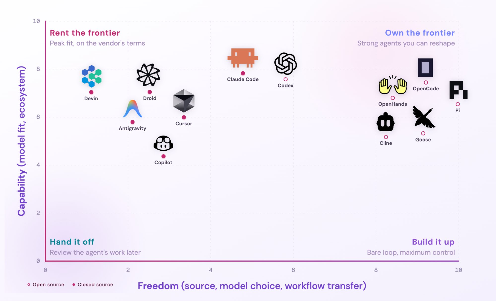

# Harness Engineering And Runtime Control

> Sources: Sairahul harness engineering and loops X Articles, 2026-06-07 to 2026-06-09; Sydney Runkle custom harness X Article, 2026-06-04; LangChain Deep Agents overview, 2026-06-12 capture; OpenAI codex-plugin-cc README, 2026-06-12 capture; Tech with Mak production AI architecture screenshot, 2026-06-18; walkinglabs Awesome Harness Engineering set, 2026-06-13 capture; OpenTelemetry semantic conventions, 2026-06-13 capture; Garrett Lord evals X Article, 2026-06-25; Ramp Inspect, Browserbase bb, and Devin platform sources, 2026 captures; Garry Tan / GBrain "Thin Harness, Fat Skills"; Nicolas Bustamante "LLMs Eat Scaffolding for Breakfast"; Aparna Dhinakaran "Own the Loop: A Field Guide to Agent Harnesses," 2026-07-03.
> Raw: [Sairahul harness engineering X Article](../../raw/intentional/x/2063544956158185927-sairahul1-harness-engineering-what-every-ai-engineer-needs-to-know-in-2026-in-february-202.md); [Sairahul loops X Article](../../raw/intentional/x/2064277888216555684-sairahul1-loops-what-every-ai-engineer-needs-to-know-in-2026-peter-steinberger-creator-of.md); [Sydney Runkle custom harness X Article](../../raw/intentional/x/2062217190724579673-sydneyrunkle-how-to-build-a-custom-agent-harness-building-useful-agents-is-largely-about-c.md); [LangChain Deep Agents overview](../../raw/intentional/web/2026-06-12-langchain-deep-agents-overview.md); [OpenAI codex-plugin-cc README](../../raw/intentional/web/2026-06-12-openai-codex-plugin-cc-readme.md); [Production AI architecture screenshot from Tech with Mak](../../raw/intentional/pasted/2026-06-18-production-ai-architecture-screenshot-from-tech-with-mak.md); [Awesome Harness Engineering selected article resource set](../../raw/intentional/pasted/2026-06-13-awesome-harness-engineering-selected-article-resource-set.md); [Effective harnesses for long-running agents](../../raw/intentional/web/2026-06-13-effective-harnesses-for-long-running-agents.md); [The Anatomy of an Agent Harness](../../raw/intentional/web/2026-06-13-the-anatomy-of-an-agent-harness.md); [Thoughtworks Harness Engineering](../../raw/intentional/web/2026-06-13-harness-engineering.md); [Testing Agent Skills Systematically with Evals](../../raw/intentional/web/2026-06-13-testing-agent-skills-systematically-with-evals.md); [OpenTelemetry Semantic Conventions for Generative AI Systems](../../raw/intentional/web/2026-06-13-opentelemetry-semantic-conventions-for-generative-ai-systems.md); [Garrett Lord evals as strategic IP X Article](../../raw/intentional/x/2068754262440767500-garrettlord-evals-the-strategic-ip-that-will-define-the-next-era-of-ai-we-ve-spoken-to-hun.md); [Ramp Inspect background-agent article](../../raw/intentional/web/2026-06-11-ramp-builders-why-we-built-our-own-background-agent-corrected.md); [Kyle Jeong Browserbase bb X Article](../../raw/intentional/x/2044878529666662616-kylejeong-how-we-build-internal-agents-at-browserbase-tldr-generalized-agents-will-become.md); [Garry Tan GBrain Thin Harness Fat Skills](../../raw/intentional/web/2026-07-03-garry-tan-gbrain-thin-harness-fat-skills.md); [Nicolas Bustamante LLMs Eat Scaffolding For Breakfast](../../raw/intentional/web/2026-07-03-nicolas-bustamante-llms-eat-scaffolding-for-breakfast.md)
> Source addendum: Sreejith Sreejayan / Towards AI Claude-Code-like Deep Agents walkthrough, 2026-06-10.
> Raw addendum: [Build Your Own Claude Code Using Langchin](../../raw/intentional/web/2026-07-03-build-your-own-claude-code-using-langchin-a-deepdive-into-la.md); [Aparna Dhinakaran Own the Loop X Article](../../raw/intentional/x/2073079029624943040-aparnadhinak-own-the-loop-a-field-guide-to-agent-harnesses-the-better-a-harness-fits-its-m.md)
> 2026-07-26 addendum: [Harrison Chase on owning intelligence](../../raw/intentional/x/2081002647814094888-hwchase17-what-does-it-mean-to-own-your-intelligence-over-the-next-five-years-every-compan.md); [WinterArc on harness difficulty](../../raw/intentional/x/2081042507471696318-winterarc2125-why-harness-engineering-is-so-hard-five-months-104-commits-and-one-repeating.md); [Dex Horthy on software factories](../../raw/intentional/x/2080697380379427275-dexhorthy-why-software-factories-fail-or-the-harness-is-not-enough-update-the-talk-version.md); [pvncher Codex multi-agent patterns](../../raw/intentional/x/2080707291603407077-pvncher-practical-multi-agent-orchestration-in-codex-gpt-5-6-sol-gets-especially-interesti.md); [elune0x agent eval patterns](../../raw/intentional/x/2080710242929697122-elune0x-10-agent-evals-every-ai-engineer-should-know-1-golden-set-a-frozen-set-of-cases-yo.md); [Vtrivedy eval-engineering skill](../../raw/intentional/x/2079976006644072796-vtrivedy10-towards-automating-eval-engineering-today-we-re-releasing-our-eval-engineering.md); [Kenton Varda agent management](../../raw/intentional/x/2080666760584241599-kentonvarda-building-software-by-prompting-agents-without-ever-reading-or-editing-the-code.md); [Uncle Bob Martin outcome review](../../raw/intentional/x/2080257779395154409-unclebobmartin-i-m-significantly-older-than-you-i-started-coding-in-the-late-60s-my-curren.md); [Nick Vasiles CLI/skills/MCP question](../../raw/intentional/x/2080004863451377977-nickvasiles-so-what-s-the-consensus-on-cli-skills-vs-mcp-for-agents-is-the-difference-enou.md); [Rhys Sullivan response](../../raw/intentional/x/2080117243405635832-rhyssullivan-there-s-basically-no-difference-in-the-effectiveness-of-mcp-and-clis-skills-f.md); [model volatility note](../../raw/intentional/x/2080353958292521131-gabriel1-5-4-was-released-like-3-months-ago-and-is-now-a-shit-model-think-about-that-we-re.md); [Seth model/harness notes](../../raw/intentional/pasted/2026-07-26-saved-link-batch-notes-and-ingestion-intent.md)
> 2026-07-28 addendum: [David Pan on buying versus building coding-agent infrastructure](../../raw/intentional/x/2081746878119678414-davep-stripe-and-sierra-built-their-own-coding-agent-systems-you-probably-don-t-need-to-st.md); [Hightouch RevOps agent repo](../../raw/intentional/web/2026-07-21-the-signal-hightouch-revops-agent-repo.md)
> 2026-07-30 addendum: [Geoffrey Huntley on the unfinished software-factory stack](../../raw/intentional/x/2082525589416923314-geoffreyhuntley-1-software-factories-are-super-real-but-we-need-to-be-realistic-the-factor.md)

## Overview

Harness engineering is the reliability layer around the model. It includes context delivery, middleware, tools, permissions, state, sandboxes, feedback loops, observability, and human checkpoints. A useful shorthand is: agent = model + harness. Most operational gains come from improving the harness, not from asking the model to be more careful in prose.

Garry Tan's "thin harness, fat skills" framing sharpens the design direction. Keep the generic runtime thin: run the model loop, read/write files, manage context, and enforce safety. Push judgment and process into reusable skills. Push exact execution into deterministic tools such as SQL, APIs, scripts, or CLIs. The failure mode to avoid is a fat harness with too many generic tools, noisy global instructions, and bloated context, while the actual business procedure lives only in someone's head.

Nicolas Bustamante's "LLMs Eat Scaffolding for Breakfast" adds the lifecycle warning: scaffolding that is necessary for one model generation may become technical debt when the next model absorbs that capability. Durable agent architecture should therefore be close to the model, easy to simplify, and willing to delete scaffolding when model capability improves. The parts more likely to compound are not one-off prompt tricks; they are domain context, source systems, skills, evals, UX, trust, and the organization's ability to revise the workflow quickly.

## Harness Components

A practical harness decides how work is planned, what tools exist, what state persists, how context is loaded, how errors are surfaced, and how humans interrupt or approve risky steps. LangChain's Deep Agents is a concrete reference architecture: planning tools, filesystem-backed context, MCP/tool connections, shell or sandbox execution, subagent isolation, streams, memory, permission rules, human approval, skills, and opinionated prompts.

Sreejith Sreejayan's Towards AI walkthrough is useful as the "build a Claude Code-shaped harness" version of the same anatomy. It decomposes the agent into a turn loop, dedicated read/search/edit/execute tools, planner state, virtual-filesystem context management, subagent delegation, permission interrupts, sandbox or shell backend, and checkpointed memory. The implementation lesson is not that Deep Agents replaces all product engineering; it gives the loop, tools, planning, context management, delegation, persistence, and streaming, while the hard local work remains system-prompt tuning, safe sandboxing, and reliable project-specific tools.

The Tech with Mak repo-shape screenshot is useful as a checklist for production AI apps: separate entry/config/models, retrieval, services, prompts, agents/tools, security, evals, observability, data/index config, scripts, UI, tests, docs, and agent-readable context. The point is not to copy one framework; it is to expose reliability boundaries instead of burying them in a notebook or single route handler.

## Runtime Control And Sandboxes

Runtime control is where autonomy becomes real. Sandboxing, scoped credentials, network allowlists, read-only roles, proxy-enforced service limits, command permissions, pause/resume, retries, concurrency, and audit logs are not afterthoughts. Permission auto-mode or `--dangerously-skip-permissions` belongs only behind compensating controls: disposable sandbox, no broad secrets, narrow filesystem, scoped network, and traceable output.

Browserbase's `bb` pattern shows one internal-agent shape: Slack as the work surface, isolated cloud sandboxes for compute, browser automation for human-only apps, skills loaded on demand, scoped permission sessions, and a credential broker. Ramp Inspect shows the deeper internal-platform version: prepared repo images, fast sandbox startup, browser testing, child sessions, visual verification, PR attribution, and org-level metrics.

## Evals And Observability

Production evals are part of the harness. Public coding benchmarks are useful for rough model comparisons, but private agents need private evals: workflow judgment, tool use, tone, taste, business outcomes, review quality, and failure recovery. Skill and harness changes should be tested against no-skill baselines and realistic task distributions so the team can tell whether a local workflow change actually helped.

Garrett Lord's evals-as-strategic-IP article sharpens the enterprise version of this point: evals are not feedback buttons or casual human review. They are a rigorous measurement layer for defining what the AI system should do, breaking work into scorable rubric dimensions, checking agentic tool use, and repeatedly improving the system in controlled conditions before real deployment. The commercial move is eval-first thinking: define the desired behavior precisely, measure it, and improve the system until it performs reliably enough for production work.

Observability needs to describe the trace, not only the final answer. Agent traces should show tool calls, files read/edited, browser actions, costs, retries, approvals, failures, and verifier output. OpenTelemetry conventions and AgentOps-style session replay point toward a portable vocabulary for inspecting agent behavior across runtimes.

## Cross-Model Review

The `codex-plugin-cc` pattern adds a useful review primitive: ask a different model/runtime to challenge the maker. Same-model review can share the maker's blind spots. Cross-model review is strongest when it is read-only by default, steered toward concrete risks, and monitored if wired into stop hooks because maker/checker loops can burn time and usage.

For Seth, cross-model review should be reserved for high-blast-radius PRs, security-sensitive changes, complex architecture, or public-facing artifacts. Ordinary wiki maintenance can usually rely on deterministic scripts plus human judgment.

## Rent Frontier Versus Own Loop

Aparna Dhinakaran's "Own the Loop" article adds a useful ownership axis to the buy-versus-build question. A harness is the loop around the model: the model reads context, edits files or calls tools, observes results, fixes errors, and repeats. The sharper claim is that the better a harness fits its model, the less of the workflow is truly portable.

Claude Code and Codex-style model-native surfaces can feel strongest because the model, tools, cloud runtime, IDE or terminal surface, skills, and ecosystem are tuned together. The cost is coupling to one vendor's models, pricing, product surfaces, and cloud-only capabilities. The article's practical advice is to use these high-fit tools where peak out-of-the-box capability matters, but keep instructions and knowledge in forms the user owns.

The opposite end is the OpenCode, OpenHands, Goose, or Pi-style route: more source control, provider choice, model routing, and workflow portability, but also more assembly burden. The user owns auth, connector wiring, tool permissions, sandboxing, observability, updates, model selection, and operational support. The durable rule is not ideological: rent the frontier when speed, fit, and managed governance matter; own the loop when portability, auditability, self-hosting, model choice, or routing policy is strategic.

For Seth's Second Brain, the compromise is to use managed frontier surfaces where they save time while keeping the compounding assets portable: local markdown, raw evidence, source maps, skills, eval cases, workflow rubrics, and retrieval indexes. The workflow knowledge should not live only inside a closed UI.

David Pan's Stripe/Sierra comparison strengthens the economic case. A proof-of-concept agent in a VM is easy compared with reliable startup, sandboxes, governance, multi-surface UX, incident ownership, and continuous adaptation to model changes. Most teams should buy that maintained machinery and preserve differentiation in portable context: rules, skills, internal tools, workflow checks, and evals. Building is more defensible when agent infrastructure is the product, the company already owns bespoke execution infrastructure, or it will fund the harness indefinitely as a product with on-call ownership.

Hightouch shows the analogous GTM architecture: keep context, coordination, memory, and prompts in a versioned repo while treating the executor as replaceable. The portable asset is the business brain and its improvement process.

## Platform Examples

Managed platforms such as Devin are attractive when orchestration is not the product and the team wants a code-factory loop: task intake, codebase Q&A, PR review, autofix, playbooks, MCPs, session insights, and API triggers. Internal platforms like Ramp Inspect make sense when proprietary context, verification surfaces, and workflow fit are the advantage.

The buy-versus-build question should be asked early. A thin harness around Codex/Claude plus repo scripts may be enough for Seth Second Brain. A custom Inspect-like system only becomes worth it when repeated work needs shared sandboxes, specialized telemetry, internal data access, workflow-specific review gates, or strategic ownership of the loop itself.

## Model-Harness Co-Adaptation

The July 26 batch makes the model/harness relationship more explicit. Teams that own both the weights and the shipped tool loop can train the model against the exact context, tools, actions, and recovery behavior the product expects. That can create an advantage over a third-party harness that can tune prompts, tools, and evals but cannot modify the model.

This does not make harness work disappear. WinterArc's five-month account and Dex Horthy's software-factory critique point the other way: even with a strong model, the operating system still needs task decomposition, context routing, permissions, state, tests, traces, recovery, and product judgment. The right shorthand is **co-adaptation**: model and harness improve together, while private workflow evals tell the team whether the combined system is getting better.

Geoffrey Huntley adds a useful maturity warning: software factories are becoming real, but the factory layer is still an active practice-discovery problem rather than a solved turnkey product. His prerequisite stack is mostly conventional infrastructure made agent-ready: sandboxing, monorepos, reproducible builds, CI/CD, identity and secret management, and removal of organizational DevEx friction. Treat this as an experienced practitioner's thesis rather than proof that one architecture has won. The durable takeaway is that near-lights-out coding depends on deterministic execution and access foundations as much as on the agent loop.

Practical implications:

- Test the shipped model-plus-harness loop, not only the base model.
- Keep golden sets and trace-based regressions for real tasks.
- Compare multi-agent orchestration with a simpler single-agent baseline.
- Preserve workflow knowledge in portable skills, files, and eval cases.
- Review outcomes, invariants, tests, and user-visible behavior when line-by-line code review is no longer the only control mechanism.
- Do not confuse access to a capable harness with a functioning software factory; ownership, priorities, and verification remain organizational work.
- Evaluate software-factory vendors against the prerequisite stack—sandbox isolation, reproducible builds, CI/CD, identity, secrets, and agent-friendly DevEx—instead of accepting the factory label at face value.

## See Also

- [Agentic Engineering Practices](agentic-engineering-practices.md)
- [Agentic SDLC And Task Contracts](agentic-sdlc-and-task-contracts.md)
- [Context Engineering For Coding Agents](context-engineering-for-coding-agents.md)
- [Agent Framework Landscape](../agent-frameworks/agent-framework-landscape.md)
- [Sandbox Filesystem Agent Architecture](../agent-frameworks/sandbox-filesystem-agent-architecture.md)
- [Devin Managed Agent Workflows](devin-managed-agent-workflows.md)
- [Agent Platforms And Work Surfaces](../personal-systems/agent-platforms-and-work-surfaces.md)
