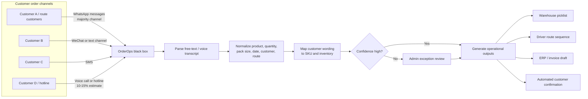
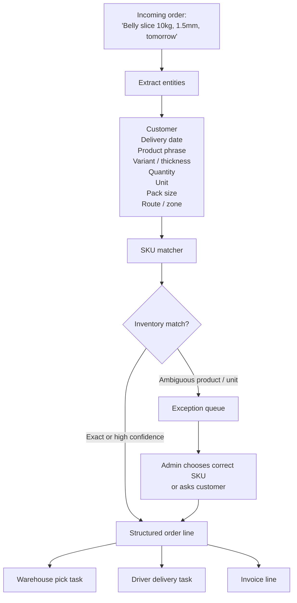
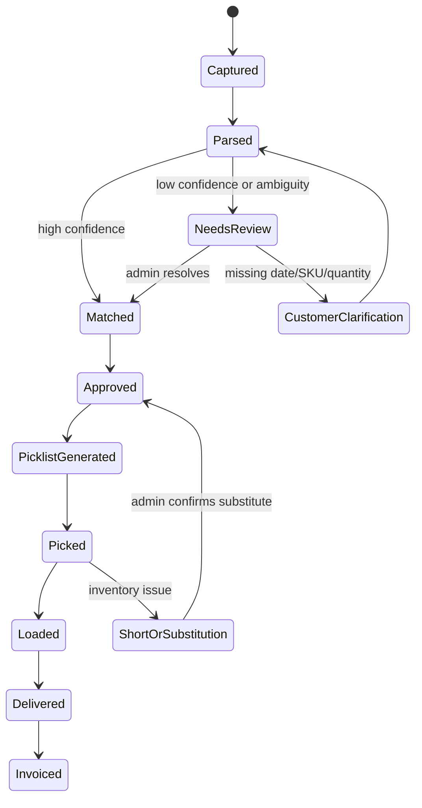

# Zhao OrderOps PRD

> Sources: Zhao OrderOps workflow sketches, 2026-06-15
> Raw: [Zhao OrderOps workflow sketches](../../raw/intentional/pasted/2026-06-15-zhao-orderops-workflow-sketches.md)
> Published: [Zhao OrderOps HTML artifact](https://civic-oasis-aq2d.here.now/)

## Working Interpretation

Zhao appears to need an order-intake and fulfillment-prep system for a food or frozen-goods distribution operation. Customers place orders through WhatsApp, WeChat or similar messaging, SMS, and voice/hotline calls. Those orders contain informal product names, mixed languages, quantities, pack sizes, thicknesses, delivery dates, and location shorthand. Staff currently translate that mess into internal SKUs, warehouse picklists, driver route sheets, loading order, and invoices.

The product opportunity is a "black box" that plugs into the phone/order channels, normalizes customer orders, flags ambiguity, maps customer phrasing to inventory, and auto-generates warehouse and driver paperwork.

## Deciphered Workflow

```mermaid
flowchart LR
    subgraph Route["Route and loading logic"]
        R1["Route plan:\nCustomer A1, A2, D, E, F"]
        Drop["Delivery sequence:\nfirst stop to last stop"]
        Load["Loading sequence:\nlast delivery loaded first"]
    end

    Orders["Approved orders"] --> R1
    R1 --> Drop
    Drop --> Load
    Load --> Picklist["Picklist grouped by route,\ncustomer, SKU, quantity"]
    Load --> DriverBook["Driver day book:\nordered stops + order lines"]
    Picklist --> Warehouse["Warehouse team\n04:00-04:30 prep window"]
    Warehouse --> Check["Picked / short / substituted status"]
    Check --> DriverBook
    DriverBook --> Delivery["Driver delivers and records result"]
    Delivery --> ERP["ERP invoice / final record"]
```

## Problem Statement

Zhao's team receives orders through multiple informal channels and must manually convert messy customer language into the correct operational records. The current process is hard because customers use different channels, languages, product nicknames, pack sizes, and date formats. Staff need to map those phrases to the right inventory items, prepare warehouse picklists, sequence orders by route and loading order, and ensure the ERP or invoice record matches what the customer actually wanted.

This creates four visible problems:

- Product mapping is complicated and error-prone.
- Manual processing consumes time, especially around early warehouse preparation.
- Night-shift or early-shift staffing is hard to sustain.
- Miscommunication can cause wrong product, wrong quantity, wrong date, wrong route, or wrong invoice.

## Solution

Build an AI-assisted order intake and fulfillment-prep system for Zhao's operation.

The system ingests customer orders from WhatsApp, WeChat/text, SMS, and voice-call transcripts. It parses each order into structured order lines, maps customer wording to the correct SKU/inventory item, detects ambiguity, routes exceptions to admin review, and auto-generates warehouse picklists, driver route sheets, customer confirmations, and invoice/ERP-ready records.

The product should not try to fully replace the ERP in the first version. It should sit between customer communication channels and the current operations stack as a reviewable "black box" that turns messy orders into trusted operational outputs.

## User Stories

1. As an admin, I want incoming WhatsApp orders captured automatically, so that I do not need to manually copy orders from chat into spreadsheets or ERP screens.
2. As an admin, I want incoming WeChat or text-channel orders captured automatically, so that all major ordering channels are handled in one queue.
3. As an admin, I want SMS orders captured automatically, so that lower-volume customers are still included in the same workflow.
4. As an admin, I want voice-call orders converted into reviewable text, so that hotline orders can follow the same process as written orders.
5. As an admin, I want each customer order grouped by customer account, so that repeated customer names, nicknames, phone numbers, and route labels resolve correctly.
6. As an admin, I want the system to understand mixed-language orders, so that customers can order naturally without following a rigid template.
7. As an admin, I want product nicknames mapped to internal SKUs, so that "belly slice" and similar phrases become the right inventory item.
8. As an admin, I want product variants such as thickness, pack weight, and carton/packet unit captured, so that warehouse picking instructions are precise.
9. As an admin, I want the system to detect uncertain product mappings, so that risky lines are reviewed before fulfillment.
10. As an admin, I want date phrases normalized into delivery dates, so that "tomorrow," "12 Aug," and other expressions do not become invoice or route errors.
11. As an admin, I want quantity and unit conversion checks, so that kilograms, cartons, packets, and pieces are not mixed up.
12. As an admin, I want duplicate-order detection, so that repeated customer messages do not create duplicate picklist lines.
13. As an admin, I want missing fields highlighted, so that I know when to ask the customer for clarification.
14. As an admin, I want an exception queue, so that low-confidence orders can be resolved before they reach warehouse or drivers.
15. As an admin, I want to approve or edit parsed orders, so that the system remains safe during rollout.
16. As an admin, I want customer-specific product aliases saved, so that the system improves after each resolved order.
17. As an admin, I want customer-specific route and delivery preferences saved, so that repeat customers require less manual handling.
18. As a customer service operator, I want automated order confirmations, so that customers can see what the system understood.
19. As a customer service operator, I want confirmation messages in the customer's preferred language, so that customers can catch mistakes quickly.
20. As a warehouse supervisor, I want a picklist grouped by route, customer, SKU, and quantity, so that picking work can start without reading every customer message.
21. As a warehouse supervisor, I want route-aware picking instructions, so that items are staged according to driver loading sequence.
22. As a warehouse supervisor, I want the picklist to show pack size and preparation notes, so that sliced or packed items match the order.
23. As a warehouse supervisor, I want shortages or substitutions flagged, so that admin can approve changes before delivery.
24. As a driver, I want an in-sequence route sheet, so that I know the delivery order and customer order lines for each stop.
25. As a driver, I want the loading order to account for first-delivery and last-delivery constraints, so that the first stop is reachable without unloading the truck.
26. As a driver, I want a simple mobile-friendly day book, so that I can confirm loaded, delivered, failed, or changed orders.
27. As a driver, I want contact and location notes attached to each stop, so that I do not need to ask admin for repeat customer details.
28. As an admin, I want delivered orders converted into invoice-ready records, so that billing matches actual fulfillment.
29. As an admin, I want ERP export fields, so that the current ERP remains the system of record.
30. As an admin, I want a full audit trail from message to invoice line, so that mistakes can be traced and corrected.
31. As an owner, I want the system to reduce early-morning manual processing, so that the business depends less on hard-to-hire night-shift staff.
32. As an owner, I want order-processing time tracked, so that I can measure whether automation is saving real labor.
33. As an owner, I want error rates tracked by channel, product, and customer, so that the highest-friction workflows can be improved first.
34. As an owner, I want the system to support all current channels without forcing customer retraining, so that adoption does not depend on customers changing behavior.
35. As a future product operator, I want the implementation to preserve raw messages and parsed outputs, so that the model and rules can be improved with real examples.
36. As a future product operator, I want a configurable product dictionary, so that Zhao's terms, abbreviations, and pack rules can be maintained without code changes.
37. As a future product operator, I want configurable confidence thresholds, so that the team can choose when automation is allowed versus when admin review is required.
38. As a future product operator, I want a demo dataset from the sketches and sample customer orders, so that the prototype can be shown before connecting real channels.

## Implementation Decisions

- Build a review-first workflow, not a fully autonomous ordering system. The first safe version should parse and recommend, then let admin approve before warehouse, driver, or invoice outputs are finalized.
- Treat the system as middleware between order channels and ERP. The current ERP remains the source of financial truth; this system prepares clean records and exports or syncs them.
- Start with written channels first: WhatsApp, WeChat/text, and SMS. Voice should be supported through call notes or transcribed recordings before attempting live call automation.
- Use a canonical order-line schema with customer, channel, raw message, delivery date, product phrase, normalized SKU, variant, quantity, unit, pack size, confidence, route, stop sequence, and exception reason.
- Maintain a product alias dictionary. Each resolved ambiguity should create or update customer-specific and global product mappings.
- Maintain customer profiles with phone/channel identifiers, account name, route, default delivery location, language preference, common products, and invoice/ERP identifiers.
- Separate parsing from fulfillment generation. Order parsing creates structured order lines; fulfillment generation creates picklists, driver sheets, loading sequence, and invoice exports.
- Use confidence scoring to decide whether a line can proceed automatically. Low confidence should route to admin review with a clear reason.
- Preserve raw messages and transcripts alongside structured records for auditability.
- Generate warehouse picklists by route, SKU, product preparation note, pack size, and quantity.
- Generate driver day books by delivery sequence, but generate loading instructions in reverse delivery order when required by route operations.
- Support manual edits at every handoff: parsed order, SKU match, quantity/unit, delivery date, route, picklist, loading sequence, and invoice export.
- Track operational exceptions: missing quantity, unclear SKU, date ambiguity, no inventory, duplicate message, customer conflict, substitution needed, route conflict, and ERP mismatch.
- Produce customer confirmations before fulfillment for ambiguous or high-risk orders.
- Keep the UI simple: order inbox, exception queue, approved orders, picklist generator, driver sheet generator, and export/invoice queue.
- Use the sketches as the first domain glossary, but mark all unclear readings as assumptions until Zhao confirms terms, routes, products, and channel percentages.

## Testing Decisions

- Test external behavior at the workflow level: given raw customer messages, the system should produce expected order lines, exceptions, picklists, route sheets, and export records.
- Do not test model internals or prompt wording directly. Test the structured outputs, confidence behavior, and human-review fallbacks.
- Create golden test cases from real or synthetic orders that cover product aliases, pack sizes, date ambiguity, route sequencing, duplicate messages, and channel differences.
- Test the SKU matcher with known aliases and ambiguous phrases. It should produce exact matches, low-confidence flags, or "needs review" states rather than guessing.
- Test unit conversion and quantity handling separately from language parsing, because quantity mistakes are high-risk.
- Test route sequencing with first-to-deliver and last-to-load examples.
- Test warehouse picklist generation from approved orders only.
- Test invoice/ERP export generation from delivered or approved-for-billing orders only.
- Test audit trail behavior by ensuring every generated line can be traced back to raw channel input and admin decisions.
- Test customer confirmation output for language, quantity, product, and delivery date clarity.

## Out of Scope

- Replacing the full ERP.
- Fully autonomous purchasing or order acceptance without admin review.
- Payment collection.
- Inventory forecasting.
- Advanced route optimization beyond sequencing and loading logic.
- Live phone automation before reliable transcript/call-note capture exists.
- Customer-facing mobile app adoption as a prerequisite.
- Driver GPS tracking.
- Warehouse hardware integration such as barcode scanners or scales.
- Accounting reconciliation beyond invoice/ERP-ready export.

## Further Notes

The first prototype should demonstrate the highest-value transformation: messy customer order into structured order line, SKU match, exception flag, picklist, and driver sequence. The pitch should emphasize that Zhao does not need customers to change behavior. The system absorbs the messy channels and creates reliable internal operations.

Open clarification questions for Zhao:

- What does each channel abbreviation mean, especially "W.E"?
- Which channels account for actual current order volume?
- What are the top 30 recurring products and their common aliases?
- Which fields does the ERP require for invoice creation?
- What does the current warehouse picklist look like?
- How are routes and delivery sequence decided today?
- What are the most expensive order mistakes from the last month?
- Which voice/hotline calls are recorded or transcribed today?
- What must happen by 04:00-04:30 each morning?
- What is the minimum safe output for a first demo: picklist, driver sheet, invoice draft, or all three?

## See Also

- [Workflow Hustle While Job Hunting](workflow-hustle-while-job-hunting.md)
- [Agentic GTM Campaign Workflows](../gtm-sales/agentic-gtm-campaign-workflows.md)
- [GTM Waterfall Enrichment APIs](../scraping-revops/gtm-waterfall-enrichment-apis.md)
